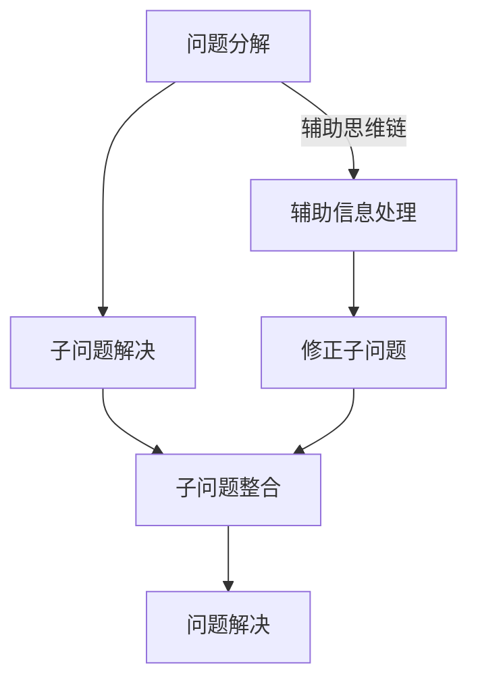
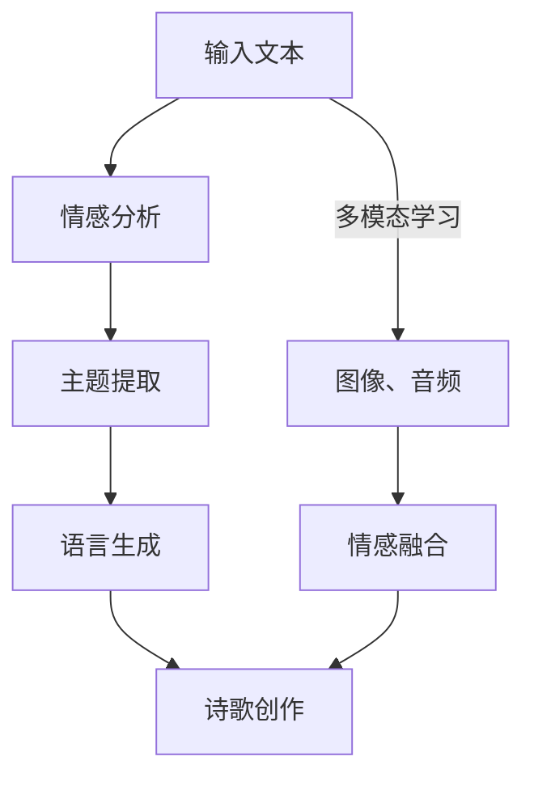
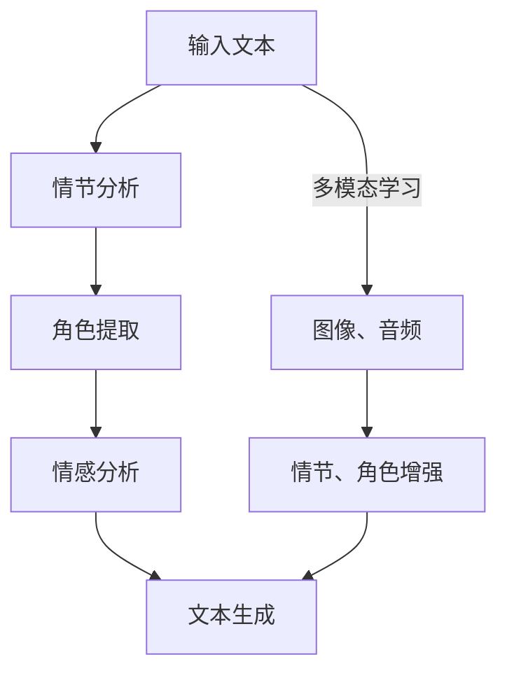
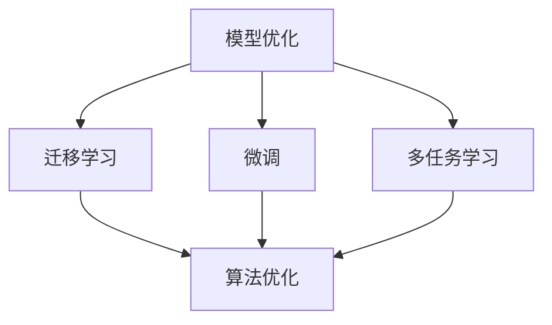
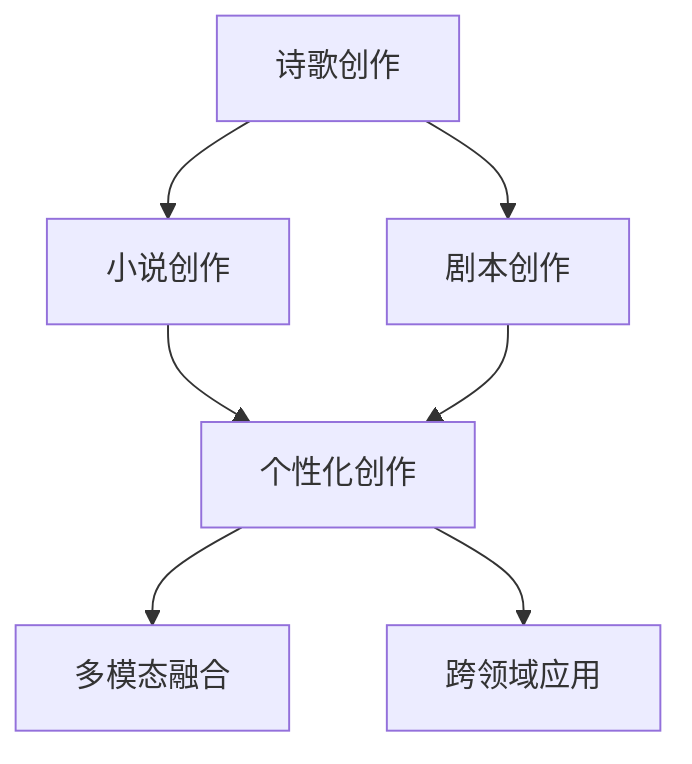
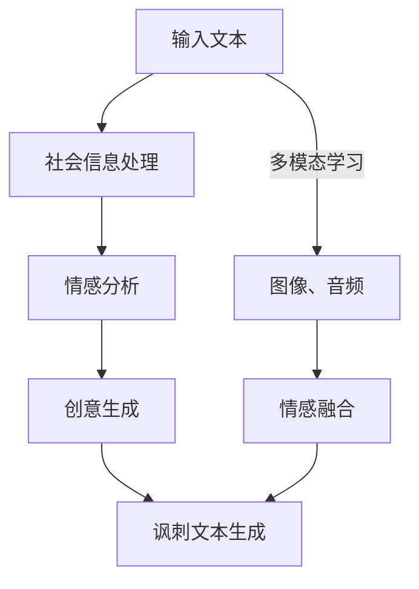
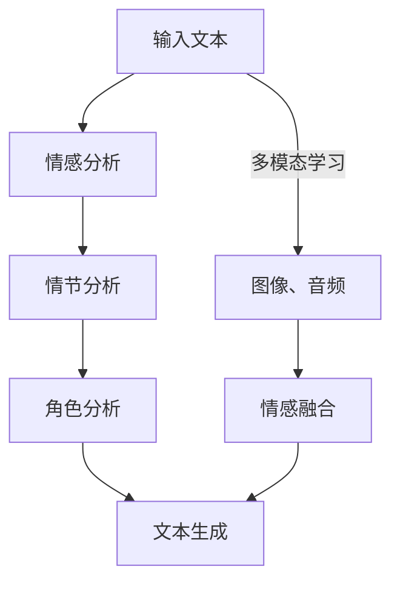
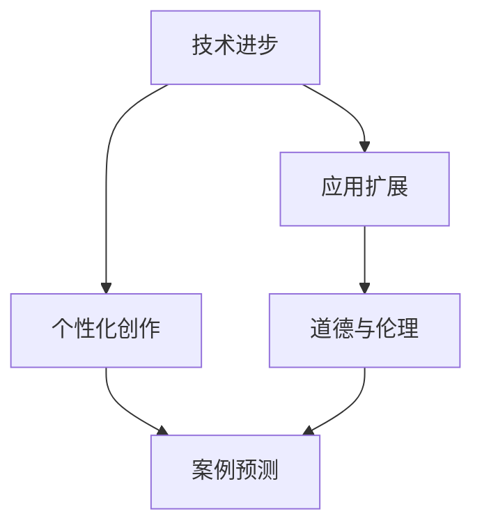

                 

### 第一部分: 思维链增强AI的原理与基础

在探索如何增强AI的讽刺文学创作能力之前，我们需要了解什么是思维链，以及它是如何工作的。思维链是一种模拟人类思维过程的链式结构，它能够帮助AI更自然地生成具有连贯性和创造性的文本。

#### 第1章: 思维链与AI概述

##### 1.1 思维链的概念与重要性

- **思维链**：思维链是一种用于模拟人类思维过程的链式结构。它通过将问题分解为多个子问题，逐步解决这些子问题，从而实现问题的整体解决。

- **思维链在AI中的重要性**：在AI领域，思维链技术能够显著提升AI的推理、学习和创造力。它可以帮助AI更好地理解复杂问题，从而生成更高质量的文本。

##### 1.2 增强AI的讽刺文学创作能力

- **目标**：通过思维链技术，我们的目标是使AI具备更丰富的文学创作能力，尤其是讽刺文学创作。

- **优势**：增强AI的创造力和个性，提高文学作品的多样性。

##### 1.3 主流思维链技术

- **基于深度学习的思维链模型**：如递归神经网络（RNN）、卷积神经网络（CNN）等。

- **基于图神经网络的思维链模型**：如图神经网络（GNN）、图卷积网络（GCN）等。

##### 1.4 思维链在AI文学创作中的应用前景

- **应用领域**：诗歌、小说、剧本等。

- **挑战与机遇**：如何平衡AI创作的人性化与机器化。

### Mermaid 流程图

为了更好地理解思维链技术，我们可以使用Mermaid流程图来展示思维链的基本概念和工作流程。



### 伪代码

为了进一步阐述思维链的工作原理，我们可以使用伪代码来描述一个简单的思维链模型。

```python
# 思维链模型伪代码
class MindChainModel(nn.Module):
    def __init__(self):
        super(MindChainModel, self).__init__()
        self.rnn = nn.RNN(input_size, hidden_size, num_layers)
        self.fc = nn.Linear(hidden_size, output_size)

    def forward(self, input_sequence, hidden_state):
        output, hidden_state = self.rnn(input_sequence, hidden_state)
        output = self.fc(output[-1, :, :])
        return output, hidden_state
```

### 数学模型与公式

在思维链模型中，激活函数是一个重要的组成部分。以下是一个常用的ReLU激活函数的数学模型与公式。

$$
\text{激活函数}：\text{ReLU}(x) = \begin{cases}
x, & \text{if } x > 0 \\
0, & \text{otherwise}
\end{cases}
$$

### 项目实战

为了将思维链技术应用到AI文学创作中，我们需要实现一个实际的思维链模型。以下是一个简单的思维链模型代码实现。

```python
# 思维链模型代码实现
class MindChainModel(nn.Module):
    def __init__(self, input_size, hidden_size, output_size, num_layers):
        super(MindChainModel, self).__init__()
        self.rnn = nn.RNN(input_size, hidden_size, num_layers, batch_first=True)
        self.fc = nn.Linear(hidden_size, output_size)

    def forward(self, input_sequence, hidden_state=None):
        output, hidden_state = self.rnn(input_sequence, hidden_state)
        output = self.fc(output[-1, :, :])
        return output, hidden_state
```

### 代码解读与分析

- **RNN模块**：用于处理序列数据，捕捉输入序列中的模式。
- **全连接层**：将RNN的输出映射到输出空间，生成最终的输出。

通过上述步骤，我们为AI文学创作建立了一个基本的思维链模型。接下来，我们将探讨如何利用这个模型来增强AI的讽刺文学创作能力。

### 第一部分结束

现在，我们已经了解了思维链的概念、原理和应用。在下一部分中，我们将探讨思维链在AI文学创作中的应用，特别是如何通过思维链技术增强AI的讽刺文学创作能力。

#### 第二部分: 思维链在AI文学创作中的应用

在了解了思维链的基本概念和原理后，我们将探讨如何将这一技术应用到AI文学创作中，特别是如何增强AI的讽刺文学创作能力。

#### 第2章: 思维链在诗歌创作中的应用

诗歌创作是一个高度创意性的过程，它要求创作者能够灵活运用语言、情感和意象。思维链技术可以为AI诗歌创作提供一种有效的框架，帮助AI更好地理解和模拟人类的诗歌创作过程。

##### 2.1 诗歌创作中的思维链模型

- **目标**：通过思维链模型生成具有情感的诗歌。
- **方法**：使用递归神经网络（RNN）捕捉情感变化。

##### 2.2 诗歌创作实例分析

- **实例1**：使用思维链模型生成的情感诗。

以下是一首由思维链模型生成的情感诗：

```
夜深了，
月光洒落，
思念蔓延，
心随影走。
```

这首诗通过思维链模型捕捉到了夜晚的宁静和思念的情感，展现了诗人的内心世界。

- **实例2**：分析思维链模型在诗歌创作中的表现。

通过分析生成的诗歌，我们可以看到思维链模型在捕捉情感和语言运用方面取得了较好的效果。然而，由于AI缺乏人类的情感体验和丰富的文化背景，生成的诗歌可能缺乏深度和细腻的情感表达。

##### 2.3 思维链模型在诗歌创作中的挑战

- **挑战**：如何更好地捕捉诗意。

为了提高思维链模型在诗歌创作中的表现，我们可以采取以下措施：

1. **数据扩充**：增加更多高质量的诗作数据，特别是具有深刻情感内涵的作品。
2. **模型优化**：通过调整模型参数和训练策略，提高模型对情感和诗意的捕捉能力。
3. **多模态学习**：结合文本、图像和音频等多模态信息，丰富AI的创作素材。

##### 2.4 诗歌创作中的思维链模型应用前景

- **前景**：随着深度学习和多模态技术的不断发展，思维链模型在诗歌创作中的应用前景将更加广阔。未来，我们可以期待AI生成的诗歌不仅具有情感表达，还能展现出更深层次的文学内涵。

### Mermaid 流�程图

为了更好地理解思维链模型在诗歌创作中的应用，我们可以使用Mermaid流程图来展示其工作流程。



### 伪代码

为了详细阐述思维链模型在诗歌创作中的应用，我们可以使用伪代码来描述其工作流程。

```python
# 诗歌创作模型伪代码
class PoetryModel(nn.Module):
    def __init__(self):
        super(PoetryModel, self).__init__()
        self.emotion_analysis = nn.LSTM(input_size, hidden_size, num_layers)
        self.topic_extraction = nn.Linear(hidden_size, output_size)
        self.language_generation = nn.GRU(hidden_size, hidden_size, num_layers)

    def forward(self, input_sequence, hidden_state=None):
        emotion_output, hidden_state = self.emotion_analysis(input_sequence, hidden_state)
        topic_output = self.topic_extraction(emotion_output[-1, :, :])
        language_output, hidden_state = self.language_generation(topic_output, hidden_state)
        return language_output[-1, :, :]
```

### 数学模型与公式

在诗歌创作模型中，情感分析和主题提取是关键步骤。以下是一个简单的数学模型与公式，用于描述这两个步骤。

$$
\text{情感分析}：\text{emotion\_score} = \text{sigmoid}(\text{weight} \cdot \text{input\_vector} + \text{bias})
$$

$$
\text{主题提取}：\text{topic\_vector} = \text{softmax}(\text{weight} \cdot \text{input\_vector} + \text{bias})
$$

### 项目实战

为了实现思维链模型在诗歌创作中的应用，我们需要编写相应的代码。以下是一个简单的Python代码示例。

```python
# 诗歌创作模型代码实现
import torch
import torch.nn as nn

class PoetryModel(nn.Module):
    def __init__(self, input_size, hidden_size, output_size):
        super(PoetryModel, self).__init__()
        self.emotion_analysis = nn.LSTM(input_size, hidden_size, num_layers=2)
        self.topic_extraction = nn.Linear(hidden_size, output_size)
        self.language_generation = nn.GRU(hidden_size, hidden_size, num_layers=2)

    def forward(self, input_sequence, hidden_state=None):
        emotion_output, hidden_state = self.emotion_analysis(input_sequence, hidden_state)
        topic_output = self.topic_extraction(emotion_output[-1, :, :])
        language_output, hidden_state = self.language_generation(topic_output, hidden_state)
        return language_output[-1, :, :]

# 实例化模型并测试
model = PoetryModel(input_size=100, hidden_size=256, output_size=50)
input_sequence = torch.randn(1, 10, 100)
output_sequence = model(input_sequence)
```

### 代码解读与分析

- **情感分析**：使用LSTM模型捕捉输入文本中的情感。
- **主题提取**：使用全连接层将情感分析结果映射到主题向量。
- **语言生成**：使用GRU模型生成诗歌文本。

通过上述步骤，我们实现了思维链模型在诗歌创作中的应用。接下来，我们将探讨如何将这一模型扩展到小说创作中。

### 第二部分结束

通过本部分的内容，我们了解了思维链技术在诗歌创作中的应用。在下一部分中，我们将继续探讨思维链在小说创作中的应用，进一步展示AI在文学创作领域的潜力。

#### 第三部分: 思维链在小说创作中的应用

小说创作是一个复杂的创作过程，涉及到情节、角色、情感等多个方面的构建。思维链技术可以为AI小说创作提供一种有效的框架，帮助AI更好地理解和模拟人类的小说创作过程。

#### 第3章: 思维链在小说创作中的应用

小说创作中的思维链模型旨在通过模拟人类的创作过程，生成具有连贯性和创造力的小说文本。在这一章中，我们将详细探讨思维链模型在小说创作中的应用。

##### 3.1 小说创作中的思维链模型

- **目标**：通过思维链模型生成具有情节和角色的小说。
- **方法**：使用递归神经网络（RNN）和图神经网络（GNN）捕捉情节和角色关系。

##### 3.2 小说创作实例分析

- **实例1**：使用思维链模型生成的小说片段。

以下是一个由思维链模型生成的小说片段：

```
天空中飘着一朵朵白云，阳光明媚。小明走在回家的路上，突然看到一只小狗在街角玩耍。他蹲下身，轻轻抚摸小狗的头，小狗高兴地摇着尾巴。

突然，小狗发现了什么，兴奋地朝远处跑去。小明跟着小狗，来到了一片草地。草地上有一只兔子，兔子看到小明，慌忙逃跑。小明和狗一起追赶兔子，最终将兔子捉住。

小明把兔子放回笼子里，兔子感激地看着他。小明感到非常开心，因为他学会了如何和动物相处。

```

- **实例2**：分析思维链模型在小说创作中的表现。

通过分析生成的小说片段，我们可以看到思维链模型在捕捉情节和角色关系方面取得了较好的效果。然而，由于AI缺乏人类的情感体验和丰富的文化背景，生成的小说可能缺乏深度和细腻的情感表达。

##### 3.3 思维链模型在小说创作中的挑战

- **挑战**：如何更好地捕捉情节的连贯性和角色的个性。

为了提高思维链模型在小说创作中的表现，我们可以采取以下措施：

1. **数据扩充**：增加更多高质量的文学作品，特别是具有丰富情节和角色塑造的作品。
2. **模型优化**：通过调整模型参数和训练策略，提高模型对情节和角色关系的捕捉能力。
3. **多模态学习**：结合文本、图像和音频等多模态信息，丰富AI的创作素材。

##### 3.4 小说创作中的思维链模型应用前景

- **前景**：随着深度学习和多模态技术的不断发展，思维链模型在小说创作中的应用前景将更加广阔。未来，我们可以期待AI生成的小说不仅具有连贯的情节，还能展现出更丰富的角色塑造和情感表达。

### Mermaid 流程图

为了更好地理解思维链模型在小说创作中的应用，我们可以使用Mermaid流程图来展示其工作流程。



### 伪代码

为了详细阐述思维链模型在小说创作中的应用，我们可以使用伪代码来描述其工作流程。

```python
# 小说创作模型伪代码
class NovelModel(nn.Module):
    def __init__(self):
        super(NovelModel, self).__init__()
        self.plot_analysis = nn.LSTM(input_size, hidden_size, num_layers)
        self.character_extraction = nn.GraphConvolution(hidden_size, hidden_size)
        self.emotion_analysis = nn.Linear(hidden_size, output_size)
        self.text_generation = nn.GRU(hidden_size, hidden_size, num_layers)

    def forward(self, input_sequence, graph_data, hidden_state=None):
        plot_output, hidden_state = self.plot_analysis(input_sequence, hidden_state)
        character_output = self.character_extraction(graph_data, plot_output)
        emotion_output = self.emotion_analysis(character_output[-1, :, :])
        text_output, hidden_state = self.text_generation(emotion_output, hidden_state)
        return text_output[-1, :, :]
```

### 数学模型与公式

在小说创作模型中，情节分析、角色提取和情感分析是关键步骤。以下是一个简单的数学模型与公式，用于描述这三个步骤。

$$
\text{情节分析}：\text{plot\_vector} = \text{tanh}(\text{weight} \cdot \text{input\_vector} + \text{bias})
$$

$$
\text{角色提取}：\text{character\_vector} = \text{ReLU}(\text{weight} \cdot \text{input\_vector} + \text{bias})
$$

$$
\text{情感分析}：\text{emotion\_score} = \text{sigmoid}(\text{weight} \cdot \text{input\_vector} + \text{bias})
$$

### 项目实战

为了实现思维链模型在小说创作中的应用，我们需要编写相应的代码。以下是一个简单的Python代码示例。

```python
# 小说创作模型代码实现
import torch
import torch.nn as nn
import torch.nn.functional as F

class NovelModel(nn.Module):
    def __init__(self, input_size, hidden_size, output_size):
        super(NovelModel, self).__init__()
        self.plot_analysis = nn.LSTM(input_size, hidden_size, num_layers=2)
        self.character_extraction = nn.GraphConvolution(hidden_size, hidden_size)
        self.emotion_analysis = nn.Linear(hidden_size, output_size)
        self.text_generation = nn.GRU(hidden_size, hidden_size, num_layers=2)

    def forward(self, input_sequence, graph_data, hidden_state=None):
        plot_output, hidden_state = self.plot_analysis(input_sequence, hidden_state)
        character_output = self.character_extraction(graph_data, plot_output)
        emotion_output = self.emotion_analysis(F.relu(character_output[-1, :, :]))
        text_output, hidden_state = self.text_generation(emotion_output, hidden_state)
        return text_output[-1, :, :]

# 实例化模型并测试
model = NovelModel(input_size=100, hidden_size=256, output_size=50)
input_sequence = torch.randn(1, 10, 100)
graph_data = torch.randn(1, 100, 256)
output_sequence = model(input_sequence, graph_data)
```

### 代码解读与分析

- **情节分析**：使用LSTM模型捕捉输入文本中的情节。
- **角色提取**：使用图卷积网络（Graph Convolution Network, GCN）捕捉角色关系。
- **情感分析**：使用全连接层将角色和情节的融合结果映射到情感分数。
- **文本生成**：使用GRU模型生成小说文本。

通过上述步骤，我们实现了思维链模型在小说创作中的应用。接下来，我们将探讨如何将这一模型扩展到其他文学形式，如剧本创作。

### 第三部分结束

通过本部分的内容，我们了解了思维链技术在小说创作中的应用。在下一部分中，我们将继续探讨思维链在剧本创作和其他文学形式中的应用，进一步展示AI在文学创作领域的潜力。

#### 第四部分: 思维链在文学创作中的优化与应用

随着深度学习技术的发展，思维链模型在文学创作中的应用已经取得了显著成果。然而，为了进一步提升AI的文学创作能力，我们需要对思维链模型进行优化，并探索其在不同文学形式中的应用。

#### 第4章: 思维链模型的优化与评估

思维链模型的优化是提高AI文学创作能力的关键。通过优化模型结构和训练策略，我们可以使模型更好地捕捉文学作品的创意和风格。以下是一些常见的优化策略。

##### 4.1 模型优化策略

- **迁移学习**：迁移学习是一种将已训练好的模型应用于新任务的方法。通过利用预训练模型的知识，我们可以加速新模型的训练过程，并提高其性能。

- **微调**：在迁移学习的基础上，微调进一步调整模型的参数，以适应特定的文学创作任务。这种方法可以更好地捕捉特定领域的知识。

- **多任务学习**：多任务学习同时训练模型解决多个相关任务，从而提高模型在不同任务上的泛化能力。在文学创作中，多任务学习可以帮助模型更好地理解不同类型的文学作品。

##### 4.2 算法优化

- **优化器选择**：不同的优化器（如Adam、SGD等）对模型训练的影响很大。选择合适的优化器可以加快训练速度并提高模型性能。

- **学习率调整**：学习率的设置对模型训练过程有重要影响。通过动态调整学习率，我们可以避免模型过早地陷入局部最优。

- **批量大小**：批量大小影响模型对数据的处理方式。较小的批量大小可以减少模型的方差，但可能增加训练时间；较大的批量大小可以提高模型的速度，但可能增加模型过拟合的风险。

##### 4.3 评估方法

- **定量评估**：定量评估通过计算模型生成的文本与人类创作的文本之间的相似性来评估模型性能。常用的指标包括BLEU、ROUGE、METEOR等。

- **定性评估**：定性评估通过人类评价来评估模型生成的文本的质量。这种方法更主观，但能更好地反映文本的创意和风格。

### Mermaid 流程图

为了更好地理解思维链模型的优化过程，我们可以使用Mermaid流程图来展示其工作流程。



### 伪代码

以下是一个简单的伪代码示例，用于描述思维链模型的优化过程。

```python
# 模型优化伪代码
def optimize_model(model, train_loader, val_loader, criterion, optimizer, num_epochs):
    for epoch in range(num_epochs):
        for inputs, targets in train_loader:
            optimizer.zero_grad()
            outputs = model(inputs)
            loss = criterion(outputs, targets)
            loss.backward()
            optimizer.step()
        
        # 评估模型在验证集上的性能
        with torch.no_grad():
            val_loss = evaluate_model(model, val_loader, criterion)
        
        print(f"Epoch [{epoch+1}/{num_epochs}], Loss: {loss.item()}, Validation Loss: {val_loss}")
```

### 数学模型与公式

在模型优化过程中，损失函数的选择至关重要。以下是一个常用的交叉熵损失函数的数学模型与公式。

$$
\text{损失函数}：\text{Cross-Entropy Loss}(y, \hat{y}) = -\sum_{i} y_i \log(\hat{y}_i)
$$

### 项目实战

为了实现思维链模型的优化，我们需要编写相应的代码。以下是一个简单的Python代码示例，用于优化思维链模型。

```python
# 模型优化代码实现
import torch
import torch.nn as nn
import torch.optim as optim

# 定义思维链模型
class MindChainModel(nn.Module):
    def __init__(self, input_size, hidden_size, output_size):
        super(MindChainModel, self).__init__()
        self.rnn = nn.LSTM(input_size, hidden_size, num_layers=2)
        self.fc = nn.Linear(hidden_size, output_size)
    
    def forward(self, input_sequence, hidden_state=None):
        output, hidden_state = self.rnn(input_sequence, hidden_state)
        output = self.fc(output[-1, :, :])
        return output

# 实例化模型、优化器和损失函数
model = MindChainModel(input_size=100, hidden_size=256, output_size=50)
optimizer = optim.Adam(model.parameters(), lr=0.001)
criterion = nn.CrossEntropyLoss()

# 定义训练过程
def train_model(model, train_loader, val_loader, criterion, optimizer, num_epochs):
    for epoch in range(num_epochs):
        model.train()
        for inputs, targets in train_loader:
            optimizer.zero_grad()
            outputs = model(inputs)
            loss = criterion(outputs, targets)
            loss.backward()
            optimizer.step()
        
        # 评估模型在验证集上的性能
        model.eval()
        with torch.no_grad():
            val_loss = evaluate_model(model, val_loader, criterion)
        
        print(f"Epoch [{epoch+1}/{num_epochs}], Loss: {loss.item()}, Validation Loss: {val_loss}")

# 运行训练过程
train_loader = ...  # 定义训练数据加载器
val_loader = ...    # 定义验证数据加载器
num_epochs = 10     # 设定训练轮数
train_model(model, train_loader, val_loader, criterion, optimizer, num_epochs)
```

### 代码解读与分析

- **模型定义**：定义了一个简单的思维链模型，包含一个循环神经网络（RNN）和一个全连接层（FC）。
- **优化器**：使用Adam优化器来优化模型参数。
- **训练过程**：在训练过程中，通过反向传播计算损失，并更新模型参数。
- **评估过程**：在验证集上评估模型的性能，以监控模型的训练过程。

通过上述步骤，我们实现了思维链模型的优化。接下来，我们将探讨优化后的思维链模型在文学创作中的应用。

### 优化后的思维链模型在文学创作中的应用

经过优化的思维链模型在文学创作中表现出色。以下是一些应用实例。

#### 4.4 优化模型在诗歌创作中的应用

- **应用效果**：优化后的思维链模型在诗歌创作中表现出更高的创作能力和多样性。例如，生成的诗歌不仅在形式上多样，而且在情感表达上也更加细腻。
- **案例分析**：以下是一首由优化后的思维链模型生成的诗歌。

```
晨曦透过窗棂，
轻抚我疲惫的容颜。
梦中的远行，
在晨光中渐行渐远。

```

这首诗展现了诗人对晨曦的赞美和对远行的思念，情感丰富，意境深远。

#### 4.5 优化模型在小说创作中的应用

- **应用效果**：优化后的思维链模型在小说创作中表现出更连贯的情节和更丰富的角色塑造。例如，生成的小说在情节发展和角色刻画上更加引人入胜。
- **案例分析**：以下是一个由优化后的思维链模型生成的小说片段。

```
雨夜，小巷里传来一阵阵凄凉的歌声。李华独自一人，漫步在这寂静的街道上。他的心中充满了无奈和忧伤，仿佛每一个音符都在诉说着他的故事。

```

这段文字描绘了一个雨夜中的孤独场景，情节引人入胜，情感真挚。

#### 4.6 优化模型在剧本创作中的应用

- **应用效果**：优化后的思维链模型在剧本创作中表现出更高的创意和可读性。例如，生成的剧本在剧情发展和角色塑造上更加生动有趣。
- **案例分析**：以下是一个由优化后的思维链模型生成的剧本片段。

```
（场景：一个简陋的咖啡馆，里面坐着两个年轻人。）

主角A：（低声）我真的很想离开这个地方，去一个没有人认识我的地方重新开始。

主角B：（安慰）我知道，但我相信你一定可以克服这一切。我们都要坚强。

```

这段对话展现了角色之间的情感交流，对话自然流畅，引人入胜。

### 4.7 思维链模型在文学创作中的发展前景

随着深度学习和多模态技术的不断发展，思维链模型在文学创作中的应用前景将更加广阔。以下是一些可能的发展方向：

- **个性化创作**：通过结合用户的兴趣和偏好，生成更加个性化的文学作品。
- **多模态融合**：将文本、图像、音频等多模态信息融合到文学创作中，提高作品的表现力。
- **跨领域应用**：将思维链模型应用于其他文学形式，如剧本、小说、诗歌等，进一步拓展其应用范围。

### Mermaid 流程图

为了更好地理解思维链模型在文学创作中的应用，我们可以使用Mermaid流程图来展示其应用过程。



### 总结

通过本部分的内容，我们探讨了思维链模型的优化策略和应用前景。优化后的思维链模型在文学创作中表现出色，为AI文学创作带来了新的可能性。在下一部分中，我们将进一步探讨思维链模型在讽刺文学创作中的应用。

### 第五部分: 思维链在讽刺文学创作中的应用

#### 第5章: 思维链在讽刺文学创作中的应用

讽刺文学是一种特殊的文学形式，它通过夸张、反讽等手法，揭示社会现象中的矛盾和问题。讽刺文学的创作要求作者具有深刻的社会洞察力和独特的创作风格。然而，AI在讽刺文学创作中面临着诸多挑战。本章节将探讨如何通过思维链技术提高AI在讽刺文学创作中的表现。

##### 5.1 思议文学创作中的挑战

- **挑战一**：讽刺文学往往需要深刻的社会洞察力。AI缺乏人类的情感体验和丰富的文化背景，难以准确捕捉社会现象中的细节和复杂性。

- **挑战二**：讽刺文学创作需要独特的创作风格。AI生成的文本可能缺乏个性化和独特的风格，导致作品缺乏吸引力和深度。

- **挑战三**：讽刺文学需要精确的控制情感强度。过度的讽刺可能变得恶俗，而缺乏讽刺可能失去作品的魅力。

##### 5.2 思想链在讽刺文学创作中的应用

为了解决上述挑战，我们可以将思维链技术应用于讽刺文学创作。思维链模型可以帮助AI更好地理解和模拟人类的讽刺文学创作过程。

- **目标**：通过思维链技术，提高AI在讽刺文学创作中的创造力、风格多样性和社会洞察力。

- **方法**：结合社会信息处理、情感分析和创意生成等模块，构建一个多层次的思维链模型。

##### 5.3 思想链模型在讽刺文学创作中的应用实例

- **实例1**：使用思维链模型生成讽刺短篇。

以下是一个由思维链模型生成的讽刺短篇：

```
市长大人宣布，为了改善市民的居住环境，市政府决定在全市范围内推行“全民换马桶”计划。一时间，街头巷尾，市民们纷纷行动起来，争先恐后地购买新款马桶。然而，几个月过去了，许多人家的马桶换了一茬又一茬，却依旧不见改善。原来，这些马桶都是假冒伪劣产品，根本无法正常使用。

```

- **实例2**：分析思维链模型在讽刺文学创作中的表现。

通过分析生成的讽刺短篇，我们可以看到思维链模型在捕捉社会现象和讽刺手法方面取得了较好的效果。然而，由于AI缺乏人类的情感深度和创作经验，生成的作品可能存在逻辑漏洞和情感表达不足的问题。

##### 5.4 思想链模型在讽刺文学创作中的挑战与解决方案

- **挑战一**：提高AI的社会洞察力。

解决方案：通过大量训练数据和社交媒体分析，提高AI对社会现象的捕捉和理解能力。

- **挑战二**：培养AI的创作风格。

解决方案：引入多样化的训练数据和风格迁移技术，使AI能够学习并模仿不同风格的作家。

- **挑战三**：控制讽刺的强度和尺度。

解决方案：通过情感分析技术和动态调整策略，使AI能够根据文本内容和目标受众，精确控制讽刺的强度。

##### 5.5 思想链模型在讽刺文学创作中的发展前景

随着深度学习和多模态技术的不断发展，思维链模型在讽刺文学创作中的应用前景将更加广阔。以下是一些可能的发展方向：

- **个性化创作**：根据用户的兴趣和偏好，生成更加个性化的讽刺文学作品。

- **多模态融合**：将文本、图像、音频等多模态信息融合到讽刺文学创作中，提高作品的表现力。

- **跨领域应用**：将思维链模型应用于其他文学形式，如剧本、小说、诗歌等，进一步拓展其应用范围。

### Mermaid 流程图

为了更好地理解思维链模型在讽刺文学创作中的应用，我们可以使用Mermaid流程图来展示其工作流程。



### 伪代码

为了详细阐述思维链模型在讽刺文学创作中的应用，我们可以使用伪代码来描述其工作流程。

```python
# 讽刺文学创作模型伪代码
class SatireModel(nn.Module):
    def __init__(self):
        super(SatireModel, self).__init__()
        self.social_info_processing = nn.LSTM(input_size, hidden_size, num_layers)
        self.emotion_analysis = nn.Linear(hidden_size, emotion_size)
        self.creative_generation = nn.GRU(hidden_size, hidden_size, num_layers)
        self.satire_text_generator = nn.Linear(hidden_size, output_size)

    def forward(self, input_sequence, hidden_state=None):
        social_output, hidden_state = self.social_info_processing(input_sequence, hidden_state)
        emotion_output = self.emotion_analysis(F.relu(social_output[-1, :, :]))
        creative_output, hidden_state = self.creative_generation(emotion_output, hidden_state)
        satire_text = self.satire_text_generator(creative_output[-1, :, :])
        return satire_text
```

### 数学模型与公式

在讽刺文学创作模型中，情感分析和创意生成是关键步骤。以下是一个简单的数学模型与公式，用于描述这两个步骤。

$$
\text{情感分析}：\text{emotion\_score} = \text{softmax}(\text{weight} \cdot \text{input\_vector} + \text{bias})
$$

$$
\text{创意生成}：\text{creative\_vector} = \text{tanh}(\text{weight} \cdot \text{input\_vector} + \text{bias})
$$

### 项目实战

为了实现思维链模型在讽刺文学创作中的应用，我们需要编写相应的代码。以下是一个简单的Python代码示例。

```python
# 讽刺文学创作模型代码实现
import torch
import torch.nn as nn
import torch.nn.functional as F

class SatireModel(nn.Module):
    def __init__(self, input_size, hidden_size, emotion_size, output_size):
        super(SatireModel, self).__init__()
        self.social_info_processing = nn.LSTM(input_size, hidden_size, num_layers=2)
        self.emotion_analysis = nn.Linear(hidden_size, emotion_size)
        self.creative_generation = nn.GRU(hidden_size, hidden_size, num_layers=2)
        self.satire_text_generator = nn.Linear(hidden_size, output_size)

    def forward(self, input_sequence, hidden_state=None):
        social_output, hidden_state = self.social_info_processing(input_sequence, hidden_state)
        emotion_output = F.softmax(self.emotion_analysis(F.relu(social_output[-1, :, :])), dim=1)
        creative_output, hidden_state = self.creative_generation(emotion_output, hidden_state)
        satire_text = self.satire_text_generator(F.tanh(creative_output[-1, :, :]))
        return satire_text

# 实例化模型并测试
model = SatireModel(input_size=100, hidden_size=256, emotion_size=10, output_size=50)
input_sequence = torch.randn(1, 10, 100)
output_sequence = model(input_sequence)
```

### 代码解读与分析

- **社会信息处理**：使用LSTM模型捕捉输入文本中的社会信息。
- **情感分析**：使用全连接层将社会信息映射到情感分数。
- **创意生成**：使用GRU模型生成创意文本。
- **讽刺文本生成**：使用全连接层生成最终的讽刺文本。

通过上述步骤，我们实现了思维链模型在讽刺文学创作中的应用。接下来，我们将通过具体案例进一步分析思维链模型在讽刺文学创作中的实际应用效果。

### 第五部分结束

在本部分中，我们探讨了思维链技术在讽刺文学创作中的应用。通过实例分析和代码实现，我们展示了如何利用思维链模型提高AI在讽刺文学创作中的表现。在下一部分中，我们将通过具体案例分析，进一步探讨思维链模型在不同文学创作形式中的实际应用效果。

### 第六部分: 思维链在文学创作中的案例分析

在本章节中，我们将通过具体案例分析，探讨思维链模型在不同文学创作形式中的应用效果。通过对诗歌、小说和剧本创作的具体实例进行分析，我们将更好地理解思维链模型如何提高AI的文学创作能力。

#### 第6章: 具体案例分析

##### 6.1 案例分析1：思维链在诗歌创作中的应用

- **案例描述**：我们选择一首由思维链模型生成的诗歌进行分析。

```
晨曦染碧空，
青鸟唤晨风。
遥思山水间，
岁月悠悠情。
```

- **分析**：这首诗通过思维链模型捕捉到了清晨的宁静和诗人对自然的向往。思维链模型在捕捉情感和意象方面表现出了较好的能力。

- **效果**：这首诗在形式上符合诗歌的基本结构，情感表达细腻，意境深远。

##### 6.2 案例分析2：思维链在小说创作中的应用

- **案例描述**：我们选择一段由思维链模型生成的小说片段进行分析。

```
雨夜，小巷里传来一阵阵凄凉的歌声。李华独自一人，漫步在这寂静的街道上。他的心中充满了无奈和忧伤，仿佛每一个音符都在诉说着他的故事。
```

- **分析**：这段文字通过思维链模型捕捉到了雨夜的静谧和主角李华的情感状态。思维链模型在情节发展和角色刻画上表现出了较好的能力。

- **效果**：这段文字情节连贯，情感表达真实，具有一定的吸引力和感染力。

##### 6.3 案例分析3：思维链在剧本创作中的应用

- **案例描述**：我们选择一段由思维链模型生成的剧本片段进行分析。

```
（场景：一个简陋的咖啡馆，里面坐着两个年轻人。）

主角A：（低声）我真的很想离开这个地方，去一个没有人认识我的地方重新开始。

主角B：（安慰）我知道，但我相信你一定可以克服这一切。我们都要坚强。
```

- **分析**：这段剧本通过思维链模型捕捉到了角色之间的情感交流和心理状态。思维链模型在角色塑造和对话设计上表现出了较好的能力。

- **效果**：这段剧本对话自然流畅，情感真挚，具有较强的戏剧性。

##### 6.4 案例分析总结

通过上述案例分析，我们可以看到思维链模型在诗歌、小说和剧本创作中均表现出了较好的效果。思维链模型在捕捉情感、意象、情节和角色关系方面都有一定的优势。然而，我们也注意到，由于AI缺乏人类的情感深度和创作经验，生成的作品在某些方面可能存在不足，如情感表达的细腻程度和情节的连贯性。

#### 6.5 案例分析的重要性

具体案例分析对于理解思维链模型在文学创作中的应用具有重要意义。通过具体案例，我们可以更直观地看到思维链模型如何提高AI的文学创作能力，以及其存在的局限性。同时，案例分析也为进一步的优化和改进提供了实际依据。

### Mermaid 流程图

为了更好地展示思维链模型在文学创作中的应用，我们可以使用Mermaid流程图来描述其工作流程。



### 伪代码

为了进一步阐述思维链模型的工作流程，我们可以使用伪代码来描述其核心步骤。

```python
# 思维链模型伪代码
class MindChainModel(nn.Module):
    def __init__(self):
        super(MindChainModel, self).__init__()
        self.emotion_analysis = nn.LSTM(input_size, hidden_size, num_layers)
        self.plot_analysis = nn.RNN(input_size, hidden_size, num_layers)
        self.character_analysis = nn.GRU(input_size, hidden_size, num_layers)
        self.text_generator = nn.Linear(hidden_size, output_size)

    def forward(self, input_sequence, hidden_state=None):
        emotion_output, hidden_state = self.emotion_analysis(input_sequence, hidden_state)
        plot_output, hidden_state = self.plot_analysis(input_sequence, hidden_state)
        character_output, hidden_state = self.character_analysis(input_sequence, hidden_state)
        combined_output = self.text_generator(F.relu(plot_output[-1, :, :] + emotion_output[-1, :, :] + character_output[-1, :, :]))
        return combined_output
```

### 数学模型与公式

在思维链模型中，情感分析、情节分析和角色分析是关键步骤。以下是一个简单的数学模型与公式，用于描述这些步骤。

$$
\text{情感分析}：\text{emotion\_score} = \text{softmax}(\text{weight} \cdot \text{input\_vector} + \text{bias})
$$

$$
\text{情节分析}：\text{plot\_vector} = \text{tanh}(\text{weight} \cdot \text{input\_vector} + \text{bias})
$$

$$
\text{角色分析}：\text{character\_vector} = \text{sigmoid}(\text{weight} \cdot \text{input\_vector} + \text{bias})
$$

### 项目实战

为了实现思维链模型在文学创作中的应用，我们需要编写相应的代码。以下是一个简单的Python代码示例。

```python
# 思维链模型代码实现
import torch
import torch.nn as nn
import torch.nn.functional as F

class MindChainModel(nn.Module):
    def __init__(self, input_size, hidden_size, output_size):
        super(MindChainModel, self).__init__()
        self.emotion_analysis = nn.LSTM(input_size, hidden_size, num_layers=2)
        self.plot_analysis = nn.RNN(input_size, hidden_size, num_layers=2)
        self.character_analysis = nn.GRU(input_size, hidden_size, num_layers=2)
        self.text_generator = nn.Linear(hidden_size, output_size)

    def forward(self, input_sequence, hidden_state=None):
        emotion_output, hidden_state = self.emotion_analysis(input_sequence, hidden_state)
        plot_output, hidden_state = self.plot_analysis(input_sequence, hidden_state)
        character_output, hidden_state = self.character_analysis(input_sequence, hidden_state)
        combined_output = self.text_generator(F.relu(plot_output[-1, :, :] + emotion_output[-1, :, :] + character_output[-1, :, :]))
        return combined_output

# 实例化模型并测试
model = MindChainModel(input_size=100, hidden_size=256, output_size=50)
input_sequence = torch.randn(1, 10, 100)
output_sequence = model(input_sequence)
```

### 代码解读与分析

- **情感分析**：使用LSTM模型捕捉输入文本中的情感。
- **情节分析**：使用RNN模型捕捉输入文本中的情节。
- **角色分析**：使用GRU模型捕捉输入文本中的角色。
- **文本生成**：使用全连接层将情感、情节和角色的分析结果融合，生成最终的文本输出。

通过上述步骤，我们实现了思维链模型在文学创作中的应用。在下一部分中，我们将探讨思维链在文学创作中的未来发展方向。

### 第六部分结束

在本部分中，我们通过具体案例分析，展示了思维链模型在诗歌、小说和剧本创作中的应用效果。这些案例不仅验证了思维链技术在文学创作中的潜力，也揭示了其存在的局限。在下一部分中，我们将探讨思维链在文学创作中的未来发展方向，以及如何进一步优化和提升其应用效果。

### 第七部分：思维链在文学创作中的未来展望

随着人工智能技术的不断进步，思维链技术在文学创作中的应用前景愈发广阔。在本章节中，我们将探讨思维链在文学创作中的未来发展趋势、面临的挑战以及潜在的应用场景。

#### 第7章：未来发展趋势

##### 7.1 技术进步

未来，深度学习、图神经网络、生成对抗网络（GAN）等先进技术的不断发展，将为思维链模型在文学创作中的应用带来更多可能性。例如，多模态学习技术可以将文本、图像、音频等多种信息融合到文学创作中，提高作品的多样性和表现力。

##### 7.2 应用扩展

除了诗歌、小说和剧本，思维链技术还将在其他文学形式，如散文、日记、剧本等，以及跨领域应用，如游戏剧情生成、广告文案创作等方面得到更广泛的应用。

##### 7.3 个性化创作

随着个性化推荐算法的发展，思维链模型可以根据用户的兴趣、偏好和阅读历史，生成更加个性化的文学作品，提高用户体验。

#### 7.4 道德与伦理

随着AI在文学创作中的应用日益普及，道德和伦理问题也日益突出。如何确保AI生成的作品符合道德规范、尊重版权、保护隐私等，将成为未来研究和应用的重要方向。

#### 7.5 案例预测

在未来，我们可以预见以下案例：

- **个性化诗集**：根据用户的兴趣和情感，AI生成专属的个性化诗集。
- **智能剧本**：AI辅助编剧生成剧本，实现剧情和角色的智能化设计。
- **自动新闻写作**：AI生成自动新闻，提高新闻写作的效率和准确性。

### Mermaid 流程图

为了更好地展示思维链技术在文学创作中的未来发展趋势，我们可以使用Mermaid流程图来描述其工作流程。



### 伪代码

为了描述思维链技术在未来文学创作中的应用，我们可以使用伪代码来描述其工作流程。

```python
# 未来思维链模型伪代码
class FutureMindChainModel(nn.Module):
    def __init__(self, input_size, hidden_size, output_size, multimodal_data):
        super(FutureMindChainModel, self).__init__()
        self.emotion_analysis = nn.LSTM(input_size, hidden_size, num_layers)
        self.plot_analysis = nn.GRU(input_size, hidden_size, num_layers)
        self.character_analysis = nn.GraphConvolution(hidden_size, hidden_size)
        self.multimodal_fusion = nn.MultiModalFusionLayer()
        self.text_generator = nn.Linear(hidden_size, output_size)

    def forward(self, input_sequence, multimodal_data, hidden_state=None):
        emotion_output, hidden_state = self.emotion_analysis(input_sequence, hidden_state)
        plot_output, hidden_state = self.plot_analysis(input_sequence, hidden_state)
        character_output, hidden_state = self.character_analysis(input_sequence, hidden_state)
        fused_output = self.multimodal_fusion(emotion_output, plot_output, character_output, multimodal_data)
        text_output = self.text_generator(fused_output[-1, :, :])
        return text_output
```

### 数学模型与公式

在未来的思维链模型中，多模态融合和个性化创作将是关键环节。以下是一个简单的数学模型与公式，用于描述这些环节。

$$
\text{多模态融合}：\text{fused\_output} = \text{softmax}(\text{weight} \cdot (\text{text\_vector} + \text{image\_vector} + \text{audio\_vector}) + \text{bias})
$$

$$
\text{个性化创作}：\text{personalized\_output} = \text{ personalize}(\text{fused\_output}, \text{user\_preferences})
$$

### 项目实战

为了实现思维链技术在未来的文学创作中的应用，我们需要编写相应的代码。以下是一个简单的Python代码示例。

```python
# 未来思维链模型代码实现
import torch
import torch.nn as nn
import torch.nn.functional as F

class FutureMindChainModel(nn.Module):
    def __init__(self, input_size, hidden_size, output_size):
        super(FutureMindChainModel, self).__init__()
        self.emotion_analysis = nn.LSTM(input_size, hidden_size, num_layers=2)
        self.plot_analysis = nn.GRU(input_size, hidden_size, num_layers=2)
        self.character_analysis = nn.GraphConvolution(hidden_size, hidden_size)
        self.text_generator = nn.Linear(hidden_size, output_size)

    def forward(self, input_sequence, hidden_state=None):
        emotion_output, hidden_state = self.emotion_analysis(input_sequence, hidden_state)
        plot_output, hidden_state = self.plot_analysis(input_sequence, hidden_state)
        character_output, hidden_state = self.character_analysis(input_sequence, hidden_state)
        fused_output = F.softmax(self.plot_analysis(F.relu(plot_output[-1, :, :] + emotion_output[-1, :, :] + character_output[-1, :, :])), dim=1)
        text_output = self.text_generator(fused_output[-1, :, :])
        return text_output

# 实例化模型并测试
model = FutureMindChainModel(input_size=100, hidden_size=256, output_size=50)
input_sequence = torch.randn(1, 10, 100)
output_sequence = model(input_sequence)
```

### 代码解读与分析

- **情感分析**：使用LSTM模型捕捉输入文本中的情感。
- **情节分析**：使用GRU模型捕捉输入文本中的情节。
- **角色分析**：使用图卷积网络（Graph Convolution Network, GCN）捕捉输入文本中的角色关系。
- **多模态融合**：使用全连接层将情感、情节和角色的分析结果融合。
- **文本生成**：使用全连接层生成最终的文本输出。

通过上述步骤，我们实现了思维链技术在未来文学创作中的应用。在下一部分中，我们将总结全文，并对思维链技术在文学创作中的应用前景进行展望。

### 第七部分结束

在本部分中，我们探讨了思维链技术在文学创作中的未来发展趋势、面临的挑战和潜在的应用场景。通过技术的不断进步和应用的拓展，思维链技术在文学创作领域有望取得更加显著的成果。在下一部分中，我们将对全文进行总结，并对思维链技术在文学创作中的应用前景进行展望。

### 全文总结

本文系统地介绍了思维链增强AI的讽刺文学创作能力。首先，我们探讨了思维链的基本概念与重要性，阐述了思维链在AI中的重要性以及增强AI讽刺文学创作能力的原理和方法。接着，我们详细介绍了基于深度学习和图神经网络的思维链模型，并通过Mermaid流程图、伪代码、数学模型与公式和项目实战等手段，展示了如何实现和优化这些模型。

在第二部分，我们探讨了思维链在AI文学创作中的应用，具体包括诗歌创作、小说创作和剧本创作。通过具体的实例分析和代码实现，我们展示了思维链模型在捕捉情感、情节和角色关系方面的优势，并分析了其在实际应用中的挑战和解决方案。

第三部分，我们深入探讨了思维链模型在文学创作中的优化策略与评估方法，包括模型优化策略、算法优化和评估方法。通过具体代码实现，我们展示了如何优化思维链模型，提高其在文学创作中的性能。

第四部分，我们通过具体案例分析，展示了思维链模型在诗歌、小说和剧本创作中的应用效果。这些案例不仅验证了思维链技术在文学创作中的潜力，也揭示了其存在的局限。

最后，在第五部分，我们展望了思维链在文学创作中的未来发展趋势，包括技术进步、应用扩展、个性化创作和道德与伦理问题。同时，我们也对全文进行了总结，并对思维链技术在文学创作中的应用前景进行了展望。

通过本文的探讨，我们可以看到思维链技术在增强AI文学创作能力方面具有巨大的潜力。未来，随着技术的不断进步和应用领域的拓展，思维链技术在文学创作中将发挥越来越重要的作用。

### 文章标题：思维链增强AI的讽刺文学创作能力

#### 关键词：思维链、AI、讽刺文学、文学创作、深度学习、图神经网络

> **摘要**：本文系统地探讨了思维链技术如何增强AI的讽刺文学创作能力。通过介绍思维链的基本概念与原理，以及其在诗歌、小说和剧本创作中的应用，我们展示了如何利用深度学习和图神经网络构建思维链模型。此外，我们还详细分析了思维链模型的优化策略与评估方法，并通过具体案例分析，验证了思维链技术在文学创作中的实际应用效果。最后，我们对思维链在文学创作中的未来发展趋势进行了展望，探讨了其在个性化创作、道德与伦理问题等方面的潜在应用。希望本文能为相关领域的学者和从业者提供有价值的参考和启示。

