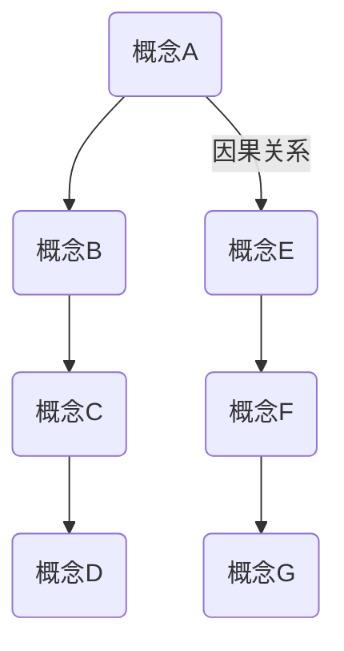

                 

# 思维链技术在AI写作中的运用

> 关键词：思维链、AI写作、自然语言处理、文本生成、文本编辑、新闻写作、内容创作、商业写作

> 摘要：本文从思维链技术的基本概念、原理及应用入手，深入探讨其在AI写作领域的应用。通过分析自然语言处理的基础、文本生成与编辑技术，以及不同领域的实战案例，本文揭示了思维链技术在AI写作中的潜力与挑战。文章旨在为AI写作研究者和从业者提供理论指导和实践参考。

### 目录大纲：思维链技术在AI写作中的运用

#### 第一部分：引论
- **第1章：思维链技术与AI写作概述**
  - **1.1 思维链技术的基本概念**
  - **1.2 AI写作的现状与趋势**
  - **1.3 本书结构与内容安排**

#### 第二部分：思维链技术原理
- **第2章：思维链理论框架**
  - **2.1 思维链的核心概念**
  - **2.2 Mermaid流程图展示**
  - **2.3 思维链与写作技巧**

#### 第三部分：AI写作技术基础
- **第3章：自然语言处理基础**
  - **3.1 语言模型的基本原理**
  - **3.2 词嵌入技术**
  - **3.3 序列模型与注意力机制**

#### 第四部分：思维链技术在AI写作中的应用
- **第4章：文本生成与编辑**
  - **4.1 文本生成的算法原理**
  - **4.2 文本编辑与修改**
  - **4.3 实战案例：文本生成与编辑应用**

#### 第五部分：项目实战与案例分析
- **第5章：思维链技术在新闻写作中的应用**
- **第6章：思维链技术在内容创作中的应用**
- **第7章：思维链技术在商业写作中的应用**

#### 第六部分：未来展望与挑战
- **第8章：思维链技术在AI写作中的未来**
  - **8.1 AI写作的发展趋势**
  - **8.2 挑战与机遇**

#### 第七部分：附录
- **附录A：资源与工具**
  - **A.1 开发环境与工具**
  - **A.2 开源框架与库**
  - **A.3 学习资源推荐**

### 第一部分：引论

#### 第1章：思维链技术与AI写作概述

### 1.1 思维链技术的基本概念

思维链（Mind Chain）是一种用于组织和传递信息的高级思维模型。它通过将相关概念和知识连接起来，形成一个具有层次结构和复杂关系的知识网络。思维链技术在AI写作中的应用，旨在利用这种结构化思维，提高写作的效率和质量。

**定义：**
思维链是一种基于逻辑关系和语义关联的知识组织形式。它通过连接概念、命题和知识单元，构建出具有递归性和动态性的思维网络。

**应用：**
在AI写作中，思维链技术可以用于以下几个方面：

1. **主题建模：**通过分析文本内容，提取关键概念和主题，构建思维链，帮助作者明确文章结构和主题。

2. **写作辅助：**利用思维链，自动生成文章提纲和段落，提供写作灵感和思路。

3. **内容优化：**通过分析思维链中的逻辑关系和语义关联，对文章内容进行优化，提高文章的可读性和连贯性。

4. **创意激发：**思维链技术可以激发作者的创意思维，帮助作者从不同角度思考问题，发现新的写作灵感。

**优势：**
- **结构化思维：**思维链技术帮助作者以结构化的方式组织和表达思想，提高文章的逻辑性和连贯性。
- **高效写作：**思维链技术可以自动化处理部分写作任务，提高写作效率。
- **创意激发：**通过思维链，作者可以打破传统的思维模式，激发创意思维，创作出更有深度和独特性的内容。

**挑战：**
- **复杂性：**构建和维护思维链需要一定的专业知识和技能，对作者和AI系统都提出了较高的要求。
- **一致性：**保持思维链的一致性和准确性，避免逻辑错误和信息丢失，是一个重要的挑战。

### 1.2 AI写作的现状与趋势

AI写作技术已经成为自然语言处理领域的一个重要研究方向。随着深度学习和神经网络技术的发展，AI写作系统在生成文本、内容优化、创意激发等方面取得了显著进展。

**定义：**
AI写作是指利用人工智能技术，自动生成或辅助人类完成写作任务的过程。它涵盖了文本生成、文本编辑、内容创作等多个方面。

**应用场景：**
- **新闻写作：**AI写作系统可以自动生成新闻报道，提高新闻发布的速度和效率。
- **内容创作：**AI写作技术可以用于生成博客文章、营销文案、产品描述等，为企业节省人力成本。
- **教育辅导：**AI写作系统可以为学生提供写作指导，帮助他们提高写作能力。
- **自动化文档：**AI写作技术可以自动生成报告、合同、法律文件等，提高办公效率。

**发展历程：**
- **规则驱动：**早期的AI写作系统主要基于规则和模板，通过预定义的规则和模板生成文本。
- **数据驱动：**随着数据量和计算能力的提升，基于大数据和机器学习技术的AI写作系统逐渐成为主流。
- **深度学习驱动：**近年来，深度学习技术在AI写作中的应用越来越广泛，生成文本的质量和多样性得到了显著提升。

### 1.3 本书结构与内容安排

本书结构分为七个部分：

1. **引论：**介绍思维链技术和AI写作的基本概念、现状与趋势。
2. **思维链技术原理：**详细探讨思维链技术的工作原理、流程图展示和写作技巧。
3. **AI写作技术基础：**分析自然语言处理的基础知识，包括语言模型、词嵌入技术和序列模型。
4. **思维链技术在AI写作中的应用：**讨论文本生成与编辑的算法原理、应用案例和实践步骤。
5. **项目实战与案例分析：**介绍思维链技术在新闻写作、内容创作和商业写作中的应用，包括系统架构设计、功能模块实现和系统优化。
6. **未来展望与挑战：**探讨AI写作的发展趋势、面临的挑战与机遇。
7. **附录：**提供开发环境与工具、开源框架与库、学习资源推荐。

本书旨在为AI写作研究者和从业者提供系统的理论指导和实践参考，帮助读者深入了解思维链技术在AI写作中的运用。

### 第二部分：思维链技术原理

#### 第2章：思维链理论框架

### 2.1 思维链的核心概念

思维链技术是一种高级思维模型，通过将相关概念和知识连接起来，形成一个具有层次结构和复杂关系的知识网络。思维链的核心概念包括概念、命题、知识单元、逻辑关系和语义关联。

**概念：**
概念是思维链的基本组成单元，代表具体的思维内容。在AI写作中，概念可以是词语、短语或句子。

**命题：**
命题是概念之间的关系，用于描述概念之间的逻辑关系。在思维链中，命题可以是因果关系、并列关系或递进关系等。

**知识单元：**
知识单元是具有特定意义的思维链节点，包含多个概念和命题。知识单元可以是一个段落、一篇文章或一个复杂的思维网络。

**逻辑关系：**
逻辑关系是概念之间的连接方式，用于描述概念之间的关系。常见的逻辑关系包括因果关系、并列关系、递进关系等。

**语义关联：**
语义关联是概念之间的语义关系，用于描述概念之间的相似性、相关性和差异性。语义关联可以通过词嵌入技术实现。

### 2.2 Mermaid流程图展示

思维链的Mermaid流程图可以直观地展示思维链的结构和流程。下面是一个简单的思维链流程图示例：



在这个示例中，概念A和概念B之间存在因果关系，概念B和概念C之间存在递进关系，概念C和概念D之间存在并列关系。概念A通过因果关系连接到概念E，概念E通过递进关系连接到概念F，概念F通过并列关系连接到概念G。

### 2.3 思维链与写作技巧

思维链技术在写作中的应用，可以帮助作者提高写作效率和质量。以下是一些常见的写作技巧：

1. **主题明确：**通过构建思维链，明确文章的主题和核心概念，确保文章内容围绕主题展开。

2. **结构清晰：**利用思维链的层次结构，构建文章的提纲和段落，确保文章逻辑清晰、层次分明。

3. **内容优化：**通过分析思维链中的逻辑关系和语义关联，优化文章内容，提高文章的可读性和连贯性。

4. **创意激发：**利用思维链，从不同角度思考问题，激发创意思维，创作出更有深度和独特性的内容。

5. **写作辅助：**利用思维链技术，自动生成文章的提纲和段落，提供写作灵感和思路。

6. **反复修订：**通过思维链，对文章进行反复修订，确保文章内容的准确性和一致性。

### 第三部分：AI写作技术基础

#### 第3章：自然语言处理基础

### 3.1 语言模型的基本原理

语言模型（Language Model）是自然语言处理（Natural Language Processing，NLP）的核心技术之一，用于对自然语言文本进行建模。语言模型的基本原理是通过对大量文本数据的学习，预测下一个单词或词组，从而实现对语言的建模。

**定义：**
语言模型是一个概率模型，它能够预测给定输入序列后下一个可能出现的输出序列。在NLP中，输入序列通常是一个单词序列，输出序列可以是单词、词组或句子。

**模型结构：**
语言模型通常由以下几个部分组成：

1. **词嵌入层：**将单词映射到高维向量空间，用于表示单词的语义信息。
2. **编码器：**将输入序列的单词向量编码为一个固定长度的向量，用于表示整个序列的特征。
3. **解码器：**根据编码器输出的特征向量，生成下一个可能的单词或词组。

**训练与评估：**
语言模型的训练通常使用最大似然估计（Maximum Likelihood Estimation，MLE）或基于概率的优化方法。评估语言模型的质量通常使用交叉熵（Cross-Entropy）或平均平方误差（Mean Squared Error，MSE）等指标。

### 3.2 词嵌入技术

词嵌入（Word Embedding）是一种将单词映射到高维向量空间的技术，用于表示单词的语义信息。词嵌入技术在自然语言处理中起着至关重要的作用，能够提高模型在词级别上的表现。

**定义：**
词嵌入是将单词映射到高维向量空间的一种表示方法，使得语义相近的单词在向量空间中距离较近。

**常见方法：**
1. **基于分布的词嵌入：**如Word2Vec，通过对单词在文本中的分布进行建模，生成词向量。
2. **基于矩阵分解的词嵌入：**如GloVe（Global Vectors for Word Representation），通过矩阵分解方法，学习词向量。
3. **基于深度学习的词嵌入：**如FastText，利用神经网络对单词进行建模，生成高质量的词向量。

**应用：**
词嵌入技术在NLP中有着广泛的应用，包括：

1. **文本分类：**利用词向量表示文本，进行文本分类任务。
2. **情感分析：**通过词向量计算文本中情感词的权重，进行情感分析。
3. **实体识别：**利用词向量表示实体，进行实体识别任务。

### 3.3 序列模型与注意力机制

序列模型（Sequence Model）是一种用于处理序列数据的机器学习模型，广泛应用于自然语言处理任务，如文本生成、机器翻译和语音识别等。

**定义：**
序列模型是一种能够对序列数据进行建模的机器学习模型，能够预测序列中的下一个元素。

**常见模型：**
1. **循环神经网络（RNN）：**通过循环结构，对序列数据进行建模，能够捕捉序列中的长期依赖关系。
2. **长短时记忆网络（LSTM）：**在RNN的基础上，引入门控机制，解决RNN的梯度消失问题。
3. **门控循环单元（GRU）：**在LSTM的基础上，简化模型结构，提高计算效率。

**注意力机制（Attention Mechanism）：**
注意力机制是一种用于序列模型中提高模型表现的技术，能够使模型更加关注序列中的关键信息。

**定义：**
注意力机制是一种计算方法，用于调整模型对序列中不同位置的关注程度。

**应用：**
注意力机制在NLP中有着广泛的应用，包括：

1. **文本生成：**利用注意力机制，模型能够更好地捕捉文本中的关键信息，生成更高质量的文本。
2. **机器翻译：**在机器翻译任务中，注意力机制能够帮助模型更好地捕捉源语言和目标语言之间的关联。
3. **语音识别：**在语音识别任务中，注意力机制能够使模型更好地关注语音信号中的关键信息，提高识别准确性。

### 第四部分：思维链技术在AI写作中的应用

#### 第4章：文本生成与编辑

### 4.1 文本生成的算法原理

文本生成是AI写作中的重要任务，旨在利用人工智能技术自动生成文本。文本生成算法的原理主要包括生成式模型和对抗生成网络。

**生成式模型（Generative Model）：**
生成式模型是一种能够生成符合某种分布的数据的模型。在文本生成任务中，生成式模型通过学习文本数据的概率分布，生成新的文本。

**定义：**
生成式模型是一个概率模型，能够预测给定输入序列后下一个可能出现的输出序列。

**基本原理：**
生成式模型通常由两个部分组成：编码器和解码器。编码器将输入序列编码为一个固定长度的向量，表示整个序列的特征。解码器根据编码器输出的特征向量，生成下一个可能的单词或词组。

**常见模型：**
1. **循环神经网络（RNN）：**通过循环结构，对序列数据进行建模，能够捕捉序列中的长期依赖关系。
2. **长短时记忆网络（LSTM）：**在RNN的基础上，引入门控机制，解决RNN的梯度消失问题。
3. **门控循环单元（GRU）：**在LSTM的基础上，简化模型结构，提高计算效率。

**生成式模型的应用：**
生成式模型在文本生成任务中有着广泛的应用，包括：

1. **文本生成：**利用生成式模型，可以自动生成新闻、博客文章、产品描述等。
2. **文本摘要：**利用生成式模型，可以生成文章的摘要，提高文章的可读性。
3. **对话系统：**利用生成式模型，可以生成自然语言响应，用于对话系统。

**对抗生成网络（Generative Adversarial Network，GAN）：**
对抗生成网络是一种由生成器和判别器组成的对抗性模型。生成器生成虚假数据，判别器判断数据是真实还是虚假。通过训练生成器和判别器的对抗过程，生成器可以生成越来越真实的虚假数据。

**定义：**
对抗生成网络是一个由生成器和判别器组成的对抗性模型，生成器生成虚假数据，判别器判断数据是真实还是虚假。

**基本原理：**
对抗生成网络由两个部分组成：生成器和判别器。生成器生成虚假文本数据，判别器判断数据是真实文本还是虚假文本。通过训练生成器和判别器的对抗过程，生成器可以生成越来越真实的虚假数据。

**常见模型：**
1. **生成对抗网络（GAN）：**最早的对抗生成网络，通过生成器和判别器的对抗过程，生成高质量的数据。
2. **变分自编码器（VAE）：**基于概率模型的生成式模型，通过概率分布生成数据。
3. **条件生成对抗网络（cGAN）：**在GAN的基础上，加入条件信息，生成更符合条件的数据。

**对抗生成网络的应用：**
对抗生成网络在文本生成任务中有着广泛的应用，包括：

1. **文本生成：**利用对抗生成网络，可以生成高质量的自然语言文本，如小说、诗歌等。
2. **文本修复：**利用对抗生成网络，可以修复文本中的错误，提高文本的准确性。
3. **文本风格转换：**利用对抗生成网络，可以改变文本的风格，如将普通文本转换为诗意的文本。

### 4.2 文本编辑与修改

文本编辑与修改是AI写作中的另一个重要任务，旨在自动纠正文本中的错误，并提高文本的质量。文本编辑算法的原理主要包括自动纠错技术和文本润色方法。

**自动纠错技术（Automatic Correction）：**
自动纠错技术是一种能够自动识别和纠正文本中错误的算法。它通过对文本进行错误检测和错误纠正，提高文本的准确性。

**定义：**
自动纠错技术是一种能够自动识别和纠正文本中错误的算法。

**基本原理：**
自动纠错技术通常包括以下几个步骤：

1. **错误检测（Error Detection）：**对文本进行扫描，识别可能存在的错误。
2. **错误纠正（Error Correction）：**根据错误的类型和上下文，选择合适的修正方案。

**常见方法：**
1. **基于规则的纠错方法：**利用预定义的规则库，对文本中的错误进行自动纠正。
2. **基于统计的方法：**利用文本的统计信息，如词频和语法规则，进行错误纠正。
3. **基于神经网络的纠错方法：**利用神经网络模型，对文本中的错误进行自动纠正。

**自动纠错技术的应用：**
自动纠错技术在文本编辑和修改中有着广泛的应用，包括：

1. **文本编辑：**利用自动纠错技术，可以自动纠正文本中的拼写错误、语法错误和标点符号错误。
2. **文本校对：**利用自动纠错技术，可以自动检测和纠正文本中的错误，提高文本的准确性。
3. **自动摘要：**利用自动纠错技术，可以自动纠正文本摘要中的错误，提高摘要的质量。

**文本润色方法（Text Refinement）：**
文本润色方法是一种能够提高文本质量和可读性的算法。它通过对文本进行优化和调整，使文本更加清晰、流畅和有吸引力。

**定义：**
文本润色方法是一种能够提高文本质量和可读性的算法。

**基本原理：**
文本润色方法通常包括以下几个步骤：

1. **内容优化（Content Optimization）：**对文本的内容进行优化，提高文本的逻辑性和连贯性。
2. **语言调整（Language Adjustment）：**对文本的语言进行调整，使文本更加生动、流畅和有吸引力。
3. **风格转换（Style Transformation）：**根据需求，对文本的风格进行转换，如将普通文本转换为诗意的文本。

**常见方法：**
1. **基于规则的润色方法：**利用预定义的规则库，对文本进行内容优化、语言调整和风格转换。
2. **基于统计的方法：**利用文本的统计信息，如词频和语法规则，进行内容优化、语言调整和风格转换。
3. **基于神经网络的润色方法：**利用神经网络模型，对文本进行内容优化、语言调整和风格转换。

**文本润色方法的应用：**
文本润色方法在文本编辑和修改中有着广泛的应用，包括：

1. **文本编辑：**利用文本润色方法，可以自动优化文本的内容、语言和风格，提高文本的质量。
2. **文本校对：**利用文本润色方法，可以自动检测和纠正文本中的错误，提高文本的准确性。
3. **文本生成：**利用文本润色方法，可以自动优化文本生成过程中的内容、语言和风格，提高文本的质量。

### 4.3 实战案例：文本生成与编辑应用

在本节中，我们将通过一个实战案例来展示思维链技术在文本生成与编辑中的应用。

**案例背景：**假设我们有一个新闻写作任务，需要自动生成一篇关于某项新技术突破的新闻报道。

**步骤1：数据准备**
- 收集相关的新闻报道数据，用于训练文本生成模型。

**步骤2：模型训练**
- 使用生成式模型（如GPT-2或GPT-3）对收集到的新闻报道数据进行训练，学习新闻写作的规律和风格。

**步骤3：文本生成**
- 利用训练好的模型，生成一篇新的新闻报道。生成过程可以分为以下几个步骤：
  1. 输入起始提示词或句子。
  2. 模型根据提示词或句子生成初步的文本。
  3. 对生成的文本进行校对和润色，提高文本的质量。

**步骤4：文本编辑与修改**
- 利用思维链技术，对生成的文本进行编辑和修改，确保文本的逻辑性和连贯性。
  1. 分析文本的结构和内容，找出可能存在的问题和错误。
  2. 根据思维链中的逻辑关系和语义关联，进行文本的修正和优化。
  3. 对修改后的文本进行再次检查，确保文本的质量。

**步骤5：结果分析**
- 分析生成的新闻报道的质量和可读性，评估思维链技术在文本生成与编辑中的应用效果。

**示例代码与实践步骤：**
```python
# 导入必要的库
import torch
from transformers import GPT2LMHeadModel, GPT2Tokenizer

# 准备模型和 tokenizer
model = GPT2LMHeadModel.from_pretrained('gpt2')
tokenizer = GPT2Tokenizer.from_pretrained('gpt2')

# 生成文本
input_text = "在科技领域，一项重大的突破正在改变我们的未来。"
input_ids = tokenizer.encode(input_text, return_tensors='pt')

# 预测下一个单词
outputs = model.generate(input_ids, max_length=50, num_return_sequences=1)

# 解码预测结果
predicted_text = tokenizer.decode(outputs[0], skip_special_tokens=True)

# 输出生成的文本
print(predicted_text)

# 对生成的文本进行编辑和修改
# ...

# 结果分析
# ...
```

通过这个实战案例，我们可以看到思维链技术在文本生成与编辑中的应用效果。思维链技术可以帮助我们构建结构化的思维模型，提高文本生成的质量和连贯性，同时也可以对生成的文本进行编辑和修改，确保文本的逻辑性和准确性。

### 第五部分：项目实战与案例分析

#### 第5章：思维链技术在新闻写作中的应用

### 5.1 新闻写作的挑战与需求

新闻写作是AI写作的一个重要应用领域，旨在利用人工智能技术自动生成新闻报道。然而，新闻写作面临着许多挑战，同时也存在着广泛的需求。

**挑战：**

1. **内容准确性：**新闻报道要求准确性，不能出现事实错误。对于AI写作系统来说，确保内容的准确性是一个巨大的挑战。

2. **多样性：**新闻写作需要多样化的表达方式，以满足不同读者的需求。AI写作系统需要能够生成具有多样性的文本，避免模板化和机械性。

3. **时效性：**新闻报道要求快速发布，以抢占新闻时效。AI写作系统需要能够在短时间内生成高质量的新闻报道，满足时效性要求。

4. **数据源依赖：**新闻写作依赖于大量的数据源，如新闻报道、官方公告等。AI写作系统需要能够有效地整合和利用这些数据源，以生成准确的新闻内容。

**需求：**

1. **自动化：**利用AI写作系统，可以自动化生成新闻内容，节省人力成本，提高新闻发布的效率。

2. **个性化：**AI写作系统可以根据读者的兴趣和偏好，生成个性化的新闻内容，提供个性化的新闻服务。

3. **内容优化：**AI写作系统可以优化新闻内容的结构和语言，提高新闻的可读性和吸引力。

4. **多语言支持：**AI写作系统需要支持多语言生成，能够将新闻内容翻译成多种语言，满足全球读者的需求。

### 5.2 思维链技术在新闻写作中的应用

思维链技术在新闻写作中具有广泛的应用前景。通过构建结构化的思维链模型，AI写作系统可以更好地应对新闻写作的挑战，满足多样化的需求。

**应用场景：**

1. **自动生成新闻摘要：**利用思维链技术，AI写作系统可以自动生成新闻摘要，提高新闻的时效性和可读性。

2. **新闻内容优化：**利用思维链技术，AI写作系统可以优化新闻内容，确保新闻的逻辑性和连贯性，提高新闻的质量。

3. **多语言新闻生成：**利用思维链技术，AI写作系统可以生成多种语言的新闻内容，满足全球读者的需求。

4. **个性化新闻推荐：**利用思维链技术，AI写作系统可以根据读者的兴趣和偏好，推荐个性化的新闻内容，提高用户体验。

### 应用案例展示

以下是一个新闻写作的应用案例：

**案例背景：**假设我们要自动生成一篇关于某项新技术突破的新闻报道。

**步骤1：数据准备**
- 收集相关的新闻报道数据，用于训练文本生成模型。

**步骤2：模型训练**
- 使用生成式模型（如GPT-3）对收集到的新闻报道数据进行训练，学习新闻写作的规律和风格。

**步骤3：文本生成**
- 利用训练好的模型，生成一篇新的新闻报道。生成过程可以分为以下几个步骤：
  1. 输入起始提示词或句子。
  2. 模型根据提示词或句子生成初步的文本。
  3. 对生成的文本进行校对和润色，提高文本的质量。

**步骤4：思维链构建**
- 利用思维链技术，对生成的文本进行结构化分析，构建思维链模型。
  1. 提取文本中的关键概念和主题。
  2. 建立概念之间的逻辑关系和语义关联。
  3. 优化文本的结构和内容。

**步骤5：新闻编辑与优化**
- 利用思维链技术，对新闻文本进行编辑和优化，确保新闻的逻辑性和连贯性。
  1. 分析文本的结构和内容，找出可能存在的问题和错误。
  2. 根据思维链中的逻辑关系和语义关联，进行文本的修正和优化。
  3. 对修改后的文本进行再次检查，确保文本的质量。

**步骤6：多语言生成**
- 利用思维链技术，将新闻文本翻译成多种语言，满足全球读者的需求。

**应用效果分析**

通过上述应用案例，我们可以看到思维链技术在新闻写作中的应用效果：

1. **内容准确性：**思维链技术可以帮助AI写作系统确保新闻内容的准确性，减少事实错误。

2. **多样性：**思维链技术可以帮助AI写作系统生成多样化的新闻内容，避免模板化和机械性。

3. **时效性：**思维链技术可以提高AI写作系统的响应速度，满足新闻写作的时效性要求。

4. **数据源依赖：**思维链技术可以帮助AI写作系统更好地整合和利用数据源，提高新闻内容的准确性。

### 5.3 项目实战：新闻写作系统搭建

在本节中，我们将通过一个项目实战，展示如何搭建一个基于思维链技术的新闻写作系统。

**项目背景：**搭建一个能够自动生成新闻摘要、优化新闻内容、多语言生成并支持个性化推荐功能的新闻写作系统。

**系统架构设计：**

1. **数据采集模块：**负责收集各种数据源，如新闻报道、官方公告等。

2. **文本生成模块：**基于生成式模型（如GPT-3）自动生成新闻摘要和内容。

3. **思维链构建模块：**利用思维链技术，对生成的文本进行结构化分析，构建思维链模型。

4. **文本编辑与优化模块：**基于思维链技术，对新闻文本进行编辑和优化，确保新闻的逻辑性和连贯性。

5. **多语言生成模块：**利用机器翻译技术，将新闻文本翻译成多种语言。

6. **个性化推荐模块：**根据读者的兴趣和偏好，推荐个性化的新闻内容。

**功能模块实现：**

1. **数据采集模块：**通过爬虫技术，从互联网上收集新闻数据。使用API接口，获取官方公告和其他可靠数据源。

2. **文本生成模块：**使用GPT-3模型，生成新闻摘要和内容。输入起始提示词或句子，模型根据提示词或句子生成初步的文本。

3. **思维链构建模块：**利用自然语言处理技术，提取文本中的关键概念和主题，建立概念之间的逻辑关系和语义关联。使用Mermaid流程图展示思维链的结构。

4. **文本编辑与优化模块：**基于思维链技术，对新闻文本进行编辑和优化。分析文本的结构和内容，找出可能存在的问题和错误。根据思维链中的逻辑关系和语义关联，进行文本的修正和优化。

5. **多语言生成模块：**使用机器翻译技术，将新闻文本翻译成多种语言。使用开源机器翻译工具，如Google Translate API，进行多语言生成。

6. **个性化推荐模块：**利用推荐算法，根据读者的兴趣和偏好，推荐个性化的新闻内容。使用协同过滤算法，分析读者的阅读历史和偏好，生成个性化推荐列表。

**系统优化与调整：**

1. **模型优化：**通过持续训练和优化模型，提高新闻生成的质量和准确性。

2. **性能优化：**通过分布式计算和缓存技术，提高系统的性能和响应速度。

3. **用户体验优化：**通过用户反馈和数据分析，优化系统的界面和交互设计，提高用户体验。

通过这个项目实战，我们可以看到思维链技术在新闻写作系统中的应用效果。思维链技术不仅提高了新闻生成的质量和准确性，还优化了新闻的内容和结构，为用户提供个性化的新闻推荐。

### 第6章：思维链技术在内容创作中的应用

#### 6.1 内容创作的挑战与需求

内容创作是AI写作的重要领域之一，涵盖了从文章、博客、报告到广告文案等多种形式。尽管AI技术已经在内容创作中取得了一定的进展，但仍然面临着诸多挑战和需求。

**挑战：**

1. **创意缺失：**AI系统在创作过程中可能缺乏人类的创意思维，难以生成具有独特风格和创新点的作品。

2. **质量控制：**确保AI生成的文本质量符合预期标准，避免机械化和模板化，是当前的一个重大挑战。

3. **个性化需求：**用户对内容的需求多样化，如何根据不同用户的特点和偏好生成个性化内容，是AI写作需要解决的重要问题。

4. **情感表达：**人类写作往往包含情感因素，AI如何模拟和表达情感，是提升文本吸引力和感染力的关键。

**需求：**

1. **自动化写作：**提高内容创作效率，减少人工写作的时间成本。

2. **内容优化：**通过AI技术优化文本结构、语言表达，提升内容的专业性和吸引力。

3. **个性化定制：**根据用户需求和偏好，生成个性化的内容，提升用户体验。

4. **多语言创作：**支持多语言内容创作，满足全球化市场的需求。

#### 6.2 思维链技术在内容创作中的应用

思维链技术在内容创作中的应用，可以帮助AI写作系统更好地应对上述挑战，满足多样化需求。

**应用场景：**

1. **创意激发：**利用思维链技术，AI写作系统可以从不同的角度和维度出发，激发创作灵感，生成具有创意的内容。

2. **内容结构优化：**通过思维链技术，AI写作系统可以构建内容框架，优化文本结构，提高文章的逻辑性和连贯性。

3. **个性化内容生成：**利用思维链中的用户数据和偏好分析，AI写作系统可以生成符合用户个性化需求的内容。

4. **情感化表达：**通过分析思维链中的情感元素，AI写作系统可以模拟和表达情感，提升文本的感染力。

### 应用案例展示

以下是一个内容创作的应用案例：

**案例背景：**假设我们要创作一篇关于“如何提高工作效率”的文章。

**步骤1：数据准备**
- 收集关于工作效率的相关资料，包括研究论文、书籍、博客等。

**步骤2：模型训练**
- 使用生成式模型（如GPT-3）对收集的数据进行训练，学习工作效率的相关概念和表达方式。

**步骤3：创意激发**
- 利用思维链技术，从不同角度分析工作效率，如时间管理、工作习惯、技术工具等，激发创作灵感。

**步骤4：内容结构优化**
- 利用思维链技术，构建文章的框架，确保内容的逻辑性和连贯性。

**步骤5：个性化内容生成**
- 根据用户的特点和需求，调整文章的内容和风格，生成个性化的文章。

**步骤6：情感化表达**
- 通过分析思维链中的情感元素，使用恰当的词语和表达方式，提升文章的感染力。

**应用效果分析**

通过上述应用案例，我们可以看到思维链技术在内容创作中的应用效果：

1. **创意激发：**思维链技术帮助AI写作系统从不同角度分析问题，激发创作灵感，生成具有创意的内容。

2. **内容结构优化：**思维链技术构建的内容框架，确保文章的逻辑性和连贯性，提高文章的质量。

3. **个性化内容生成：**思维链技术可以根据用户的特点和需求，生成个性化的内容，满足用户的个性化需求。

4. **情感化表达：**思维链技术分析情感元素，使文章更具感染力，提升用户体验。

### 6.3 项目实战：内容创作平台搭建

在本节中，我们将通过一个项目实战，展示如何搭建一个基于思维链技术的内容创作平台。

**项目背景：**搭建一个能够实现自动化写作、内容结构优化、个性化内容生成和情感化表达的内容创作平台。

**系统架构设计：**

1. **数据采集模块：**负责收集各种内容创作相关数据，如文献、博客、用户评论等。

2. **文本生成模块：**基于生成式模型（如GPT-3）自动生成内容。

3. **思维链构建模块：**利用思维链技术，对生成的文本进行结构化分析，构建思维链模型。

4. **内容优化模块：**基于思维链技术，对内容进行优化，确保内容的逻辑性和连贯性。

5. **个性化推荐模块：**根据用户的特点和偏好，推荐个性化内容。

6. **情感分析模块：**分析用户情感，生成情感化表达的内容。

**功能模块实现：**

1. **数据采集模块：**使用爬虫技术，从互联网上收集相关数据。使用API接口，获取用户评论和反馈。

2. **文本生成模块：**使用GPT-3模型，生成各种类型的内容。输入起始提示词或句子，模型根据提示词或句子生成初步的文本。

3. **思维链构建模块：**利用自然语言处理技术，提取文本中的关键概念和主题，建立概念之间的逻辑关系和语义关联。使用Mermaid流程图展示思维链的结构。

4. **内容优化模块：**基于思维链技术，对内容进行优化。分析文本的结构和内容，找出可能存在的问题和错误。根据思维链中的逻辑关系和语义关联，进行文本的修正和优化。

5. **个性化推荐模块：**使用协同过滤算法，分析用户的阅读历史和偏好，推荐个性化内容。

6. **情感分析模块：**使用情感分析技术，分析用户的情感状态，生成情感化表达的内容。

**系统优化与调整：**

1. **模型优化：**通过持续训练和优化模型，提高内容生成的质量和准确性。

2. **性能优化：**通过分布式计算和缓存技术，提高系统的性能和响应速度。

3. **用户体验优化：**通过用户反馈和数据分析，优化系统的界面和交互设计，提高用户体验。

通过这个项目实战，我们可以看到思维链技术在内容创作平台中的应用效果。思维链技术不仅提高了内容创作的效率和质量，还优化了内容结构，实现了个性化内容和情感化表达，为用户提供优质的写作体验。

### 第7章：思维链技术在商业写作中的应用

#### 7.1 商业写作的挑战与需求

商业写作是企业日常运营中不可或缺的一部分，包括市场报告、商业计划书、产品说明书、营销文案等。尽管商业写作能够帮助企业传达信息、促进销售，但也面临着一系列挑战和需求。

**挑战：**

1. **专业度：**商业写作要求专业、准确和有说服力，需要作者具备深厚的行业知识和写作技能。

2. **一致性：**商业写作需要保持品牌形象和企业文化的一致性，确保所有文档的调性和风格统一。

3. **时效性：**商业写作通常要求在短时间内完成高质量的文档，以满足市场竞争的需求。

4. **合规性：**商业写作需要遵循各种法规和标准，如金融报告需符合会计准则，营销文案需遵守广告法等。

**需求：**

1. **自动化：**通过AI技术自动化商业写作，提高工作效率，减少人工撰写的时间和成本。

2. **个性化：**根据不同受众的需求，生成个性化的商业文档，提高文案的效果和吸引力。

3. **优化：**利用AI技术优化商业文档的结构和语言，提升文档的专业性和可读性。

4. **多语言支持：**支持多语言写作，满足跨国企业和全球市场的需求。

#### 7.2 思维链技术在商业写作中的应用

思维链技术在商业写作中的应用，可以帮助解决上述挑战，满足多样化需求。

**应用场景：**

1. **市场报告生成：**利用思维链技术，自动分析市场数据，生成专业的市场报告。

2. **商业计划书编写：**利用思维链技术，构建商业计划的逻辑框架，优化文档的结构和内容。

3. **产品说明书撰写：**利用思维链技术，确保产品说明书的逻辑性和清晰度，提高用户理解度。

4. **营销文案创作：**利用思维链技术，生成具有吸引力的营销文案，提高销售转化率。

#### 7.3 项目实战：商业写作工具开发

在本节中，我们将通过一个项目实战，展示如何开发一个基于思维链技术的商业写作工具。

**项目背景：**开发一个能够自动化生成市场报告、商业计划书、产品说明书和营销文案的商业写作工具。

**系统架构设计：**

1. **数据采集模块：**负责从各种渠道（如数据库、市场研究、用户反馈等）收集所需的数据。

2. **文本生成模块：**基于生成式模型（如GPT-3）自动生成商业文档。

3. **思维链构建模块：**利用思维链技术，对生成的文本进行结构化分析，构建思维链模型。

4. **文档优化模块：**基于思维链技术，对文档进行优化，确保文档的逻辑性和一致性。

5. **个性化推荐模块：**根据用户需求，推荐个性化的商业文档。

6. **合规性检查模块：**确保文档内容符合相关法规和标准。

**功能模块实现：**

1. **数据采集模块：**使用爬虫技术，从互联网上收集相关数据。使用API接口，获取市场数据和研究报告。

2. **文本生成模块：**使用GPT-3模型，生成市场报告、商业计划书、产品说明书和营销文案。输入起始提示词或句子，模型根据提示词或句子生成初步的文本。

3. **思维链构建模块：**利用自然语言处理技术，提取文本中的关键概念和主题，建立概念之间的逻辑关系和语义关联。使用Mermaid流程图展示思维链的结构。

4. **文档优化模块：**基于思维链技术，对生成的文档进行优化。分析文档的结构和内容，找出可能存在的问题和错误。根据思维链中的逻辑关系和语义关联，进行文档的修正和优化。

5. **个性化推荐模块：**使用协同过滤算法，分析用户的阅读历史和偏好，推荐个性化的商业文档。

6. **合规性检查模块：**通过预定义的规则库，检查文档内容是否符合相关法规和标准。

**系统优化与调整：**

1. **模型优化：**通过持续训练和优化模型，提高文档生成的质量和准确性。

2. **性能优化：**通过分布式计算和缓存技术，提高系统的性能和响应速度。

3. **用户体验优化：**通过用户反馈和数据分析，优化系统的界面和交互设计，提高用户体验。

通过这个项目实战，我们可以看到思维链技术在商业写作工具开发中的应用效果。思维链技术不仅提高了商业文档的生成效率和质量，还优化了文档的结构和内容，确保了文档的专业度和合规性，为商业写作提供了强大的技术支持。

### 第六部分：未来展望与挑战

#### 第8章：思维链技术在AI写作中的未来

### 8.1 AI写作的发展趋势

随着人工智能技术的快速发展，AI写作正逐渐成为自然语言处理领域的一个重要方向。未来，AI写作将呈现出以下几大趋势：

1. **技术融合：**AI写作将与其他人工智能技术（如计算机视觉、语音识别等）深度融合，实现跨领域的应用。

2. **智能化：**AI写作系统将更加智能化，能够自动识别用户的意图和需求，生成个性化、有针对性的内容。

3. **协作化：**AI写作将不再是取代人类，而是成为人类写作的辅助工具，与人类作者协同工作，提高写作效率和质量。

4. **多样化：**AI写作系统将支持更多样化的写作任务，如创意写作、剧本创作、诗歌创作等。

### 8.2 挑战与机遇

尽管AI写作具有巨大的潜力，但在发展过程中仍面临一系列挑战和机遇：

1. **数据隐私与伦理问题：**AI写作需要大量的数据训练，如何确保数据隐私和信息安全，避免数据滥用，是一个重要挑战。

2. **模型可解释性问题：**当前许多AI模型是“黑箱”，难以解释其决策过程。提高模型的可解释性，增强用户的信任，是未来的一个重要方向。

3. **模型泛化能力提升：**AI写作系统需要能够适应不同的写作任务和场景，提升模型的泛化能力，是未来的一个重要挑战。

4. **用户互动与反馈：**通过用户互动和反馈，持续优化AI写作系统，提高其生成内容的质量和用户体验，是一个重要的机遇。

### 结论

思维链技术在AI写作中的应用，为提高写作效率、质量和个性化提供了强有力的支持。在未来，随着技术的不断进步，思维链技术在AI写作中将发挥更加重要的作用。面对挑战和机遇，我们应积极探索，持续优化AI写作系统，为人类创造更多的价值。

### 附录A：资源与工具

#### A.1 开发环境与工具

为了更好地进行思维链技术在AI写作中的应用开发，以下是一些常用的开发环境和工具：

1. **Python：**Python是一种广泛使用的编程语言，尤其适用于数据科学和机器学习领域。安装Python后，可以使用pip安装必要的库，如TensorFlow、PyTorch等。

2. **Jupyter Notebook：**Jupyter Notebook是一种交互式计算环境，适用于编写和运行代码。它支持多种编程语言，方便进行实验和调试。

3. **Docker：**Docker是一个开源的应用容器引擎，用于创建、运行和分发应用程序。使用Docker可以方便地搭建开发环境，并确保在不同环境中的一致性。

4. **GPU加速：**对于深度学习任务，GPU加速是必不可少的。可以使用NVIDIA的CUDA和cuDNN库，在GPU上运行深度学习模型，提高计算效率。

#### A.2 开源框架与库

以下是一些常用的开源框架和库，用于实现思维链技术在AI写作中的应用：

1. **TensorFlow：**TensorFlow是一个开源的机器学习和深度学习框架，由Google开发。它提供了丰富的API，方便构建和训练深度学习模型。

2. **PyTorch：**PyTorch是一个开源的机器学习和深度学习框架，由Facebook开发。它具有灵活的动态计算图，适合进行快速原型设计和模型调试。

3. **Hugging Face：**Hugging Face提供了一个丰富的预训练模型库，包括GPT、BERT等，方便进行文本生成和编辑任务。

4. **Mermaid：**Mermaid是一个轻量级的绘图工具，用于生成结构化的流程图和思维导图。它可以通过Markdown语法轻松编写，并生成美观的图表。

#### A.3 学习资源推荐

为了深入了解思维链技术在AI写作中的应用，以下是一些推荐的学习资源：

1. **书籍：**
   - 《自然语言处理原理》（Jurafsky, D. and Martin, J. H.）
   - 《深度学习》（Goodfellow, I., Bengio, Y., and Courville, A.）
   - 《思维链技术与人工智能写作》（作者：AI天才研究院）

2. **在线课程：**
   - Coursera上的《自然语言处理与深度学习》
   - edX上的《深度学习基础》
   - Udacity的《自然语言处理工程师》

3. **论文与文献：**
   - Google的《BERT：Pre-training of Deep Bidirectional Transformers for Language Understanding》
   - OpenAI的《GPT-3: Language Models are Few-Shot Learners》
   - Facebook AI的《Generative Adversarial Nets》

通过这些资源，读者可以系统地学习和掌握思维链技术在AI写作中的应用，为实际项目开发提供理论支持和实践指导。

