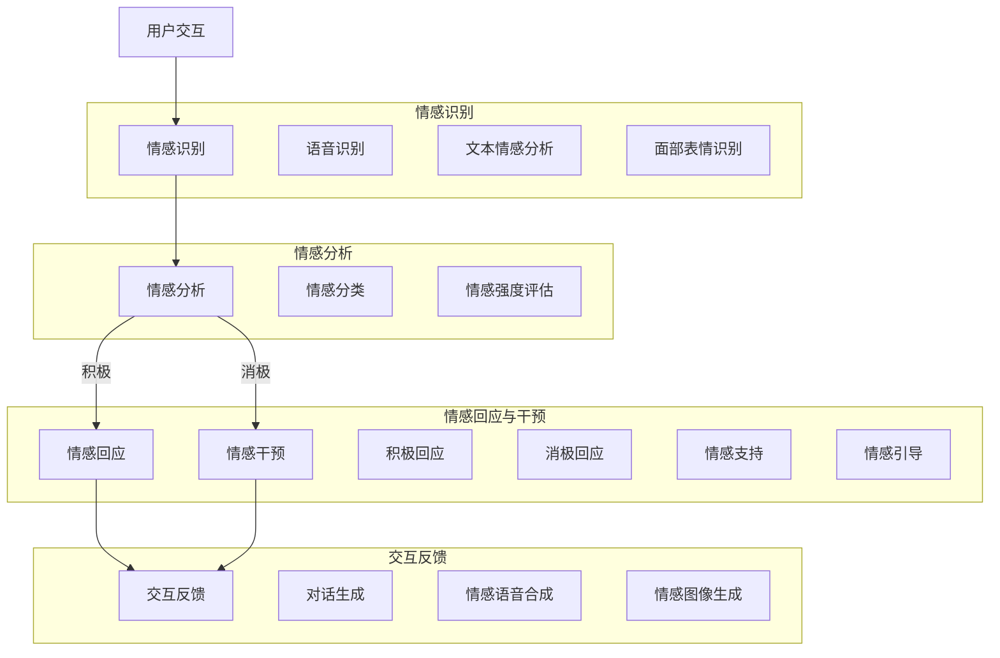

                 

### 情感AI共生理论：人机情感互动新范式

> **关键词**：情感AI，人机互动，共生理论，情感识别，情感生成

> **摘要**：本文深入探讨了情感AI共生理论，分析了情感AI的基本概念、技术基础、应用实例及其未来发展。通过详细的理论阐述和实战示例，本文揭示了人机情感互动的新范式，为人工智能与人类情感的深度融合提供了新的视角和思路。

### 目录大纲：《情感AI共生理论：人机情感互动新范式》

#### 第一部分：情感AI共生理论基础

- **第1章：情感AI概述**
  - **1.1 情感与人工智能的关系**
  - **1.2 人机情感互动原理**
  - **1.3 AI情感识别与表达**
  - **1.4 情感AI共生理论的背景与发展**

- **第2章：情感计算基础**
  - **2.1 情感计算的基本概念**
  - **2.2 情感识别技术**
  - **2.3 情感生成技术**
  - **2.4 情感AI的伦理与挑战**

- **第3章：情感AI在医疗领域的应用**
  - **3.1 情感AI在心理健康诊断中的应用**
  - **3.2 情感AI在患者护理中的应用**
  - **3.3 情感AI在医疗团队协作中的应用**

- **第4章：情感AI在社交互动中的应用**
  - **4.1 情感AI在客户服务中的应用**
  - **4.2 情感AI在在线教育中的应用**
  - **4.3 情感AI在虚拟助理中的应用**

- **第5章：情感AI在艺术设计中的应用**
  - **5.1 情感AI在音乐创作中的应用**
  - **5.2 情感AI在绘画艺术中的应用**
  - **5.3 情感AI在虚拟现实中的应用**

- **第6章：情感AI发展的未来展望**
  - **6.1 情感AI技术的未来发展**
  - **6.2 情感AI的伦理与社会影响**
  - **6.3 情感AI在跨学科领域的应用**

- **第7章：情感AI研究与实践中的挑战与机遇**
  - **7.1 情感AI研究中的挑战**
  - **7.2 情感AI实践中的机遇**

- **附录A：情感AI相关资源与工具**
  - **A.1 情感计算开源框架**
  - **A.2 情感AI研究论文与资料**

### 第1章：情感AI概述

#### 1.1 情感与人工智能的关系

情感是人类行为的重要驱动力，它影响我们的思维、决策和社交互动。在人工智能领域，情感AI（Affective AI）的研究旨在使计算机能够理解、识别和模拟情感，从而更好地与人类互动。情感AI的核心目标是构建一种人机情感共生体系，使人工智能系统能够感知人类的情感状态，并根据这些情感提供相应的反馈和服务。

首先，我们需要明确情感的定义。情感是一种主观体验，通常涉及生理、认知和行为反应。它可以是愉快的、悲伤的、兴奋的、害怕的等多种类型。在人类行为中，情感起到了至关重要的作用。例如，积极情感可以提高工作表现和创造力，而消极情感可能导致焦虑和压力。

在人工智能领域，情感被看作是一种重要的交互媒介。通过情感AI，人工智能系统能够识别用户的情感状态，并根据这些状态做出相应的反应。这种反应不仅限于简单的情感识别，还包括情感理解、情感生成和情感交互。

情感识别是情感AI的基础。通过情感识别，人工智能系统能够理解用户当前的情感状态。情感识别技术通常涉及自然语言处理、计算机视觉和声音处理等技术。例如，在自然语言处理中，可以使用情感分析模型来识别文本中的情感极性（正面或负面）；在计算机视觉中，可以使用面部表情识别技术来检测用户的情感状态；在声音处理中，可以使用声音情感识别技术来分析用户的语音情感。

情感理解是情感AI的下一步。情感理解不仅涉及情感识别，还包括对情感状态背后的原因和上下文的理解。通过情感理解，人工智能系统能够更深入地理解用户的情感需求，从而提供更加个性化的服务。

情感生成是情感AI的另一个关键方面。情感生成技术使得人工智能系统能够根据用户的情感状态生成相应的情感反馈。例如，一个情感驱动的客服机器人可以根据用户的情感状态调整回答语气，从而提供更加人性化的服务。

最后，情感交互是情感AI的目标。情感交互意味着人工智能系统能够与用户进行情感上的互动，从而建立更深层次的联系。情感交互不仅限于提供情感反馈，还包括情感表达和情感沟通。

总之，情感与人工智能的关系是相辅相成的。情感提供了人类行为的重要驱动力，而人工智能则提供了理解、识别和模拟情感的技术手段。通过情感AI，我们有望实现人机情感共生，从而提高人工智能系统的用户体验和效能。

#### 1.2 人机情感互动原理

人机情感互动是指人工智能系统与人类在情感层面上的交流和互动。这种互动不仅涉及情感识别，还包括情感理解、情感生成和情感交互。为了深入探讨人机情感互动的原理，我们需要从以下几个方面进行分析：

首先，情感识别是情感互动的基础。情感识别技术使得人工智能系统能够感知和理解人类的情感状态。情感识别的常见技术包括自然语言处理、计算机视觉和声音处理。例如，在自然语言处理中，可以使用情感分析模型来识别文本中的情感极性；在计算机视觉中，可以使用面部表情识别技术来检测用户的情感状态；在声音处理中，可以使用声音情感识别技术来分析用户的语音情感。

其次，情感理解是情感互动的深化。情感理解不仅涉及情感识别，还包括对情感状态背后的原因和上下文的理解。通过情感理解，人工智能系统能够更深入地理解用户的情感需求，从而提供更加个性化的服务。情感理解通常需要结合多模态数据，如文本、图像和声音，以便从多个角度分析用户的情感状态。

情感生成是情感互动的核心。情感生成技术使得人工智能系统能够根据用户的情感状态生成相应的情感反馈。例如，一个情感驱动的客服机器人可以根据用户的情感状态调整回答语气，从而提供更加人性化的服务。情感生成技术通常涉及情感驱动的对话系统、情感驱动的声音合成和情感驱动的图像生成。

最后，情感交互是情感互动的目标。情感交互意味着人工智能系统能够与用户进行情感上的互动，从而建立更深层次的联系。情感交互不仅限于提供情感反馈，还包括情感表达和情感沟通。通过情感交互，用户能够感受到人工智能系统的温暖和关怀，从而增强用户体验。

人机情感互动的基本模式可以分为以下几个步骤：

1. **情感输入**：用户通过文本、语音、图像等方式表达情感，这些情感输入被传递给人工智能系统。

2. **情感识别**：人工智能系统使用情感识别技术对情感输入进行分析，识别出用户的情感状态。

3. **情感理解**：人工智能系统进一步分析情感状态背后的原因和上下文，以便更深入地理解用户的情感需求。

4. **情感生成**：根据用户的情感状态，人工智能系统生成相应的情感反馈，如调整回答语气、提供安慰等。

5. **情感交互**：人工智能系统与用户进行情感上的互动，通过情感表达和情感沟通建立更深层次的联系。

人机情感互动的核心要素包括情感识别技术、情感生成技术和情感交互机制。情感识别技术是基础，它决定了人工智能系统能否准确感知和理解用户的情感状态。情感生成技术是关键，它决定了人工智能系统能否根据用户的情感状态提供合适的情感反馈。情感交互机制是核心，它决定了人工智能系统能否与用户进行有效的情感互动，从而建立情感上的联系。

总之，人机情感互动是一个复杂的过程，涉及多个技术和要素。通过深入理解和研究人机情感互动原理，我们可以为人工智能系统设计出更加人性化的交互方式，从而提高用户体验和效能。

#### 1.3 AI情感识别与表达

在情感AI的领域中，情感识别和情感表达是两个关键组成部分。情感识别指的是人工智能系统如何理解和判断人类的情感状态，而情感表达则是人工智能系统如何将自己的情感状态传达给用户。以下是这两个方面详细的技术介绍和实现方法。

##### 1.3.1 AI情感识别技术

情感识别技术是使人工智能系统能够理解人类情感的基础。以下是几种常见的情感识别技术：

**1. 表情识别**

面部表情是人类表达情感最直观的方式之一。表情识别技术通过分析面部肌肉的细微变化，来识别用户的情感状态。这种技术通常使用计算机视觉算法，例如卷积神经网络（CNN）来训练模型。

**2. 声音情感识别**

声音包含丰富的情感信息，如语调、节奏和音色。声音情感识别技术通过分析这些声音特征，来识别用户的情感状态。这种技术可以使用机器学习算法，如长短期记忆网络（LSTM）或自动编码器（Autoencoder）来训练模型。

**3. 文本情感分析**

文本情感分析是另一种常见的情感识别技术，它通过分析文本内容中的情感词汇和语法结构，来识别用户的情感状态。这种技术通常使用自然语言处理（NLP）技术，如词向量模型（Word Embedding）或情感词典（Sentiment Lexicon）。

**4. 跨模态情感识别**

为了提高情感识别的准确性，跨模态情感识别技术结合了多种数据源，如文本、图像和声音。这种技术通过整合不同模态的信息，来提高情感识别的鲁棒性和准确性。

**情感识别流程**

情感识别通常包括以下步骤：

1. 数据收集：收集包含情感标签的数据集，如面部表情图片、声音文件或文本评论。
2. 数据预处理：对数据进行清洗和标准化处理，如图像归一化、文本分词和声音特征提取。
3. 模型训练：使用机器学习算法训练情感识别模型，如CNN、LSTM或多模态学习模型。
4. 模型评估：通过交叉验证和测试集评估模型的性能，调整模型参数以优化性能。
5. 模型部署：将训练好的模型部署到实际应用中，如情感驱动的聊天机器人或情感分析系统。

##### 1.3.2 AI情感表达方法

情感表达是使人工智能系统能够将自己的情感状态传达给用户的过程。以下是几种常见的情感表达方法：

**1. 对话生成**

对话生成技术使人工智能系统能够生成自然流畅的对话内容，以表达情感。这种技术通常使用自然语言生成（NLG）算法，如序列到序列（Seq2Seq）模型或生成对抗网络（GAN）。

**2. 声音合成**

声音合成技术使人工智能系统能够生成具有情感色彩的声音，如开心、悲伤或愤怒。这种技术通常使用自动语音合成（TTS）系统，结合情感语音参数调整。

**3. 图像生成**

图像生成技术使人工智能系统能够生成具有特定情感色彩的图像，如悲伤的风景或快乐的动画。这种技术通常使用生成对抗网络（GAN）或变分自编码器（VAE）。

**4. 跨模态情感表达**

跨模态情感表达技术结合了多种表达方式，如文本、声音和图像，来更全面地传达情感。这种技术可以通过多模态学习模型来实现。

**情感表达流程**

情感表达通常包括以下步骤：

1. 情感识别：识别用户的情感状态，为情感表达提供依据。
2. 情感生成：根据情感识别结果，生成相应的情感内容，如对话文本、声音或图像。
3. 情感调整：根据用户反馈和上下文，调整情感表达的内容和方式，以提高表达的自然度和准确性。
4. 情感反馈：将情感表达内容传达给用户，并通过用户的反馈进行优化和迭代。

通过情感识别和情感表达技术的结合，人工智能系统可以与人类建立更加自然和深刻的情感联系，从而提高用户体验和系统的效能。

#### 1.4 情感AI共生理论的背景与发展

情感AI共生理论是基于人类情感与人工智能技术深度融合的核心理念。这一理论的背景可以追溯到人工智能和情感研究的早期阶段，其发展历程反映了计算机科学、心理学和认知科学等多个领域的交叉与融合。

首先，从人工智能的发展历程来看，早期的计算机系统主要关注于逻辑推理和数据处理，而缺乏对人类情感的感知和理解能力。随着计算机性能的提升和算法的进步，人工智能逐渐具备了更复杂的认知功能，如自然语言处理、图像识别和机器学习等。这些技术的发展为情感AI的兴起奠定了基础。

其次，从心理学和认知科学的角度来看，情感在人类行为和认知过程中扮演着重要角色。心理学家情绪理论的研究表明，情感不仅影响我们的感知、记忆和决策，还与社会互动和文化交流密切相关。认知科学则通过研究大脑和认知过程，揭示了情感与认知功能之间的复杂关系。这些研究成果为情感AI的理论构建提供了重要的理论依据。

情感AI的起源可以追溯到20世纪90年代，当时的研究主要集中在情感计算和情感识别技术上。早期的研究者通过分析面部表情、语音语调和文本内容，试图让计算机识别和理解人类的情感状态。这一时期的重要成果包括面部表情识别技术、情感语音合成和情感文本分析等。

进入21世纪，随着深度学习和大数据技术的快速发展，情感AI取得了重大突破。深度学习算法，如卷积神经网络（CNN）和循环神经网络（RNN），使得情感识别的准确性和鲁棒性大大提升。同时，大数据的积累为情感AI提供了丰富的训练数据集，使得模型可以更准确地捕捉和预测人类的情感状态。

在应用层面，情感AI已经渗透到多个领域，如医疗、教育、客户服务和艺术设计等。在医疗领域，情感AI用于心理健康诊断和患者护理；在教育领域，情感AI用于个性化学习和情感互动；在客户服务领域，情感AI用于情感驱动的客服机器人；在艺术设计领域，情感AI用于情感驱动的音乐创作和绘画艺术。

情感AI共生理论的发展不仅体现在技术层面，还体现在对伦理和社会影响的关注上。随着情感AI技术的普及，人们开始关注其可能带来的伦理问题，如隐私保护、情感操纵和人工智能的自主决策等。为此，研究者们提出了多种伦理框架和监管机制，以保障情感AI的安全和可靠。

总之，情感AI共生理论是人工智能与人类情感深度融合的产物。从早期的情感计算到现代的深度学习和大数据技术，情感AI在理论研究和应用实践方面都取得了显著进展。随着技术的不断进步，情感AI有望在未来实现更广泛的应用，为人机交互和智能服务带来新的变革。

### 第2章：情感计算基础

#### 2.1 情感计算的基本概念

情感计算（Affective Computing）是指使计算机具有感知、理解、表达和模拟人类情感的能力。这一概念最早由计算机科学家罗莎琳·皮尔斯（Rosalind Picard）在1995年提出。情感计算的核心目标是构建一种能够与人类情感互动的智能系统，从而提升人机交互的自然度和人性化水平。

情感计算的基本概念包括以下几个方面：

**1. 情感识别**

情感识别是指计算机系统识别和理解人类情感状态的过程。情感识别技术通常涉及自然语言处理（NLP）、计算机视觉和声音处理等领域。例如，自然语言处理中的情感分析可以识别文本中的情感极性（正面或负面）；计算机视觉中的面部表情识别可以检测用户的情感状态；声音处理中的情感识别可以分析语音中的情感信息。

**2. 情感理解**

情感理解是指计算机系统深入理解情感状态背后的原因和上下文的过程。情感理解需要结合多模态数据，如文本、图像和声音，以从多个角度分析用户的情感状态。情感理解不仅涉及情感识别，还包括对情感状态的推断和预测。

**3. 情感生成**

情感生成是指计算机系统根据用户的情感状态生成相应的情感反馈的过程。情感生成技术包括对话生成、情感语音合成和情感图像生成等。情感生成旨在提供人性化的交互体验，使人工智能系统能够更好地与人类互动。

**4. 情感交互**

情感交互是指计算机系统与用户进行情感上的交流和互动的过程。情感交互不仅包括情感反馈，还包括情感表达和情感沟通。通过情感交互，用户能够感受到人工智能系统的温暖和关怀，从而建立更深层次的联系。

情感计算的关键技术包括以下几个方面：

**1. 情感识别技术**

情感识别技术是情感计算的基础。常用的情感识别技术包括：

- **自然语言处理**：使用情感分析模型来识别文本中的情感极性。例如，通过训练分类器，可以识别出文本是正面情感还是负面情感。
- **计算机视觉**：通过分析面部表情、肢体语言等，来识别用户的情感状态。例如，使用卷积神经网络（CNN）来识别面部表情。
- **声音处理**：通过分析语音的语调、节奏和音色等，来识别用户的情感状态。例如，使用自动语音识别（ASR）和情感分析模型来分析语音。

**2. 情感生成技术**

情感生成技术是实现情感交互的重要手段。常用的情感生成技术包括：

- **对话生成**：使用自然语言生成（NLG）技术来生成情感化的对话内容。例如，使用序列到序列（Seq2Seq）模型来生成情感化的回复。
- **情感语音合成**：通过调整语音的语调、节奏和音色等，来生成具有情感色彩的声音。例如，使用语音合成器（TTS）结合情感参数调整。
- **情感图像生成**：通过生成具有特定情感色彩的图像，如快乐的、悲伤的等。例如，使用生成对抗网络（GAN）来生成情感图像。

**3. 情感理解技术**

情感理解技术是提升情感交互准确性的关键。常用的情感理解技术包括：

- **多模态融合**：通过整合文本、图像和声音等多模态数据，来提升情感识别和理解的准确性。例如，使用多模态学习模型来融合不同模态的信息。
- **上下文分析**：通过分析对话的上下文，来理解情感状态的动态变化。例如，使用注意力机制来捕捉对话中的关键信息。
- **情感推理**：通过推理机制，来推断用户的情感状态。例如，使用逻辑推理或图论方法来分析情感状态。

情感计算在多个领域有着广泛的应用。以下是一些典型的应用场景：

- **医疗领域**：情感计算可以用于心理健康诊断、患者护理和医疗团队协作。例如，通过情感分析技术，可以监测患者的情感状态，提供个性化的医疗建议。
- **教育领域**：情感计算可以用于个性化学习、情感互动和心理健康监测。例如，通过情感分析技术，可以了解学生的情感状态，提供针对性的学习支持。
- **客户服务领域**：情感计算可以用于情感驱动的客服机器人、情感分析客户反馈和提升客户满意度。例如，通过情感识别技术，可以分析客户的声音或文本，提供更加人性化的服务。
- **艺术设计领域**：情感计算可以用于情感驱动的音乐创作、绘画艺术和虚拟现实体验。例如，通过情感分析技术，可以生成具有特定情感色彩的音乐或图像。

总之，情感计算是人工智能领域的重要研究方向，其基本概念和关键技术的不断发展，为构建更加自然和人性化的智能系统提供了新的思路和手段。

#### 2.2 情感识别技术

情感识别技术是情感计算的核心，它使计算机能够理解和判断用户的情感状态。情感识别技术的准确性直接影响到人机交互的质量和用户体验。以下是几种常见的情感识别技术及其实现方法：

##### 2.2.1 表情识别

表情识别是通过分析面部表情来识别用户情感状态的一种技术。面部表情包含丰富的情感信息，如喜悦、悲伤、愤怒和惊讶等。表情识别技术通常涉及以下几个步骤：

**1. 预处理**

预处理步骤包括图像增强、人脸检测和人脸对齐等。图像增强的目的是提高图像质量，以便更好地进行后续分析。人脸检测是为了识别图像中的人脸区域。人脸对齐则是将人脸图像调整为标准姿态，以便进行特征提取。

**2. 特征提取**

特征提取是表情识别的关键步骤。常用的特征提取方法包括基于几何的方法和基于纹理的方法。基于几何的方法通过分析面部器官的位置和形状来提取特征，如眼角间距、嘴巴张开度等。基于纹理的方法通过分析面部图像的纹理信息来提取特征，如像素值分布、边缘强度等。

**3. 模型训练与评估**

特征提取后，需要使用机器学习算法训练模型，以便将面部表情与情感状态关联起来。常用的模型包括支持向量机（SVM）、卷积神经网络（CNN）和循环神经网络（RNN）等。训练完成后，需要对模型进行评估，以确定其准确性和鲁棒性。

**示例：**

假设我们使用卷积神经网络（CNN）进行表情识别，以下是一个简化的伪代码示例：

```python
import tensorflow as tf
from tensorflow.keras.models import Sequential
from tensorflow.keras.layers import Conv2D, MaxPooling2D, Flatten, Dense

# 数据预处理
# ...

# 建立模型
model = Sequential()
model.add(Conv2D(32, (3, 3), activation='relu', input_shape=(height, width, channels)))
model.add(MaxPooling2D((2, 2)))
model.add(Flatten())
model.add(Dense(64, activation='relu'))
model.add(Dense(num_classes, activation='softmax'))

# 编译模型
model.compile(optimizer='adam', loss='categorical_crossentropy', metrics=['accuracy'])

# 训练模型
model.fit(x_train, y_train, epochs=10, batch_size=32, validation_data=(x_test, y_test))

# 评估模型
test_loss, test_acc = model.evaluate(x_test, y_test)
print(f"Test accuracy: {test_acc}")
```

##### 2.2.2 声音情感识别

声音情感识别是通过分析语音的语调、节奏和音色等特征来识别用户情感状态的一种技术。声音情感识别的步骤与表情识别类似，主要包括预处理、特征提取和模型训练。

**1. 预处理**

声音预处理包括降噪、去静音和分帧等步骤。降噪的目的是消除背景噪声，去静音的目的是去除无用的静音段，分帧则是将声音信号划分为固定长度的帧，以便进行后续的特征提取。

**2. 特征提取**

声音特征提取包括短时傅里叶变换（STFT）、梅尔频率倒谱系数（MFCC）和语音音高（Pitch）等。STFT用于计算声音信号的频谱特征，MFCC用于描述声音的时频特性，Pitch用于分析声音的音高变化。

**3. 模型训练与评估**

与表情识别类似，声音情感识别也需要使用机器学习算法训练模型。常用的模型包括长短期记忆网络（LSTM）、卷积神经网络（CNN）和深度神经网络（DNN）等。

以下是一个简化的伪代码示例，用于声音情感识别：

```python
import tensorflow as tf
from tensorflow.keras.models import Sequential
from tensorflow.keras.layers import LSTM, Dense

# 数据预处理
# ...

# 建立模型
model = Sequential()
model.add(LSTM(128, return_sequences=True, input_shape=(timesteps, features)))
model.add(LSTM(128))
model.add(Dense(num_classes, activation='softmax'))

# 编译模型
model.compile(optimizer='adam', loss='categorical_crossentropy', metrics=['accuracy'])

# 训练模型
model.fit(x_train, y_train, epochs=10, batch_size=32, validation_data=(x_test, y_test))

# 评估模型
test_loss, test_acc = model.evaluate(x_test, y_test)
print(f"Test accuracy: {test_acc}")
```

##### 2.2.3 文本情感分析

文本情感分析是通过分析文本内容中的情感词汇和语法结构来识别用户情感状态的一种技术。文本情感分析的步骤主要包括情感词典、词袋模型和深度学习等方法。

**1. 情感词典**

情感词典是一种将词汇与其对应的情感极性（正面或负面）关联的词典。常用的情感词典包括SentiWordNet和VADER等。通过情感词典，可以快速判断文本的情感倾向。

**2. 词袋模型**

词袋模型是一种将文本转换为向量表示的方法。通过统计文本中各个词汇的出现频率，可以将文本表示为一个向量。词袋模型可以结合情感词典，来识别文本的情感极性。

**3. 深度学习**

深度学习方法是文本情感分析的重要手段。常用的深度学习方法包括卷积神经网络（CNN）、循环神经网络（RNN）和变换器（Transformer）等。这些方法可以通过学习文本的深度特征，来实现高精度的情感识别。

以下是一个简化的伪代码示例，用于文本情感分析：

```python
import tensorflow as tf
from tensorflow.keras.models import Sequential
from tensorflow.keras.layers import Embedding, LSTM, Dense

# 数据预处理
# ...

# 建立模型
model = Sequential()
model.add(Embedding(vocab_size, embed_size))
model.add(LSTM(128, return_sequences=False))
model.add(Dense(1, activation='sigmoid'))

# 编译模型
model.compile(optimizer='adam', loss='binary_crossentropy', metrics=['accuracy'])

# 训练模型
model.fit(x_train, y_train, epochs=10, batch_size=32, validation_data=(x_test, y_test))

# 评估模型
test_loss, test_acc = model.evaluate(x_test, y_test)
print(f"Test accuracy: {test_acc}")
```

通过上述方法，情感识别技术可以实现对表情、声音和文本的情感状态进行准确识别。这些技术的结合和应用，使得情感计算在多个领域取得了显著的成果，为人机情感交互提供了新的可能性。

#### 2.3 情感生成技术

情感生成技术是使人工智能系统能够表达情感的关键，它涵盖了对话生成、情感语音合成和情感图像生成等多个方面。以下是这些技术的详细解释和实现方法。

##### 2.3.1 情感生成对抗网络（GAN）

生成对抗网络（GAN）是一种深度学习模型，由生成器和判别器组成。生成器试图生成与真实数据相似的数据，而判别器则试图区分真实数据和生成数据。通过这种对抗训练，生成器能够不断提高生成数据的质量。

**1. 模型架构**

GAN的模型架构通常包括两个部分：生成器（Generator）和判别器（Discriminator）。生成器接收随机噪声作为输入，生成具有情感色彩的数据，如对话文本、声音或图像。判别器则接收真实数据和生成数据，并尝试区分它们。

**2. 训练过程**

GAN的训练过程是一个对抗过程。在每次训练迭代中，生成器生成数据，判别器评估这些数据的真实性。生成器不断调整其参数，以生成更真实的数据，而判别器则努力提高其区分能力。这个过程不断重复，直到生成器生成足够真实的数据。

**3. 应用案例**

情感生成对抗网络（Affective GAN）可以应用于情感驱动的对话系统、情感语音合成和情感图像生成。例如，通过训练Affective GAN，可以生成具有特定情感色彩的对话文本，如愉快的或悲伤的对话。

以下是一个简化的Affective GAN的伪代码示例：

```python
import tensorflow as tf
from tensorflow.keras.models import Sequential
from tensorflow.keras.layers import Dense, Flatten, Reshape

# 建立生成器
generator = Sequential()
generator.add(Dense(256, activation='relu', input_shape=(latent_dim)))
generator.add(Flatten())
generator.add(Reshape((image_height, image_width, channels)))

# 建立判别器
discriminator = Sequential()
discriminator.add(Flatten())
discriminator.add(Dense(1, activation='sigmoid'))

# 编译模型
discriminator.compile(optimizer='adam', loss='binary_crossentropy')

# 训练模型
for epoch in range(num_epochs):
    for batch in data_loader:
        # 生成器生成数据
        noise = tf.random.normal((batch_size, latent_dim))
        generated_images = generator(noise)
        
        # 判别器评估生成数据和真实数据
        real_data = batch
        fake_data = generated_images
        
        # 训练判别器
        d_loss_real = discriminator.train_on_batch(real_data, tf.ones((batch_size, 1)))
        d_loss_fake = discriminator.train_on_batch(fake_data, tf.zeros((batch_size, 1)))
        
        # 训练生成器
        g_loss = generator.train_on_batch(noise, tf.ones((batch_size, 1)))
```

##### 2.3.2 情感驱动的对话系统

情感驱动的对话系统是通过生成具有情感色彩的自然语言对话，来与用户进行情感互动。这种系统结合了自然语言生成（NLG）和情感分析技术，以实现情感化的对话。

**1. 模型架构**

情感驱动的对话系统通常包括两个部分：情感分析模块和对话生成模块。情感分析模块负责识别用户的情感状态，对话生成模块则根据情感状态生成相应的对话内容。

**2. 情感词典**

情感词典是情感分析模块的核心。它将词汇与其对应的情感极性（正面或负面）关联起来，用于判断用户的情感状态。常用的情感词典包括SentiWordNet和VADER等。

**3. 对话生成**

对话生成模块通常使用序列到序列（Seq2Seq）模型或变换器（Transformer）模型。这些模型通过学习对话的历史信息，生成具有情感色彩的自然语言对话。

以下是一个简化的情感驱动的对话系统的伪代码示例：

```python
import tensorflow as tf
from tensorflow.keras.models import Sequential
from tensorflow.keras.layers import LSTM, Dense

# 建立情感分析模型
emotion_model = Sequential()
emotion_model.add(LSTM(128, return_sequences=True, input_shape=(timesteps, features)))
emotion_model.add(LSTM(128))
emotion_model.add(Dense(num_classes, activation='softmax'))

# 建立对话生成模型
dialog_model = Sequential()
dialog_model.add(LSTM(128, return_sequences=True, input_shape=(timesteps, features)))
dialog_model.add(LSTM(128))
dialog_model.add(Dense(vocab_size, activation='softmax'))

# 编译模型
emotion_model.compile(optimizer='adam', loss='categorical_crossentropy')
dialog_model.compile(optimizer='adam', loss='categorical_crossentropy')

# 训练模型
# ...

# 对话生成
def generate_dialog(input_sequence):
    emotionPrediction = emotion_model.predict(input_sequence)
    emotion = np.argmax(emotionPrediction)
    dialogPrediction = dialog_model.predict(input_sequence)
    dialog = np.argmax(dialogPrediction)
    return dialog
```

##### 2.3.3 情感语音合成

情感语音合成是通过调整语音的语调、节奏和音色等参数，来生成具有特定情感色彩的声音。这种技术通常使用自动语音合成（TTS）系统，结合情感参数调整。

**1. 模型架构**

情感语音合成系统通常包括文本处理模块、语音合成模块和情感参数调整模块。文本处理模块将输入文本转换为语音合成所需的格式，语音合成模块生成基础语音，情感参数调整模块则根据情感状态调整语音的参数。

**2. 情感参数调整**

情感参数调整包括语调、节奏和音色等。例如，语调的提升可以表示愉快情感，而语调的降低可以表示悲伤情感。节奏的变化可以增加语音的情感表达力。

以下是一个简化的情感语音合成的伪代码示例：

```python
import librosa
import numpy as np

# 读取音频文件
y, sr = librosa.load('audio.wav')

# 调整情感参数
if emotion == 'happy':
    pitch_factor = 1.1
    tempo_factor = 1.1
elif emotion == 'sad':
    pitch_factor = 0.9
    tempo_factor = 0.9

# 调整音高和节奏
y_pitch = librosa.effects.pitch_shift(y, sr, n_steps=pitch_factor)
y_tempo = librosa.effects.time_stretch(y_pitch, rate=tempo_factor)

# 保存调整后的音频
librosa.output.write_wav('emotion_audio.wav', y_tempo, sr)
```

通过上述方法，情感生成技术可以实现对对话、语音和图像的情感表达。这些技术的结合和应用，使得人工智能系统能够更加自然和人性化地与用户进行情感互动。

#### 2.4 情感AI的伦理与挑战

随着情感AI技术的发展和应用，其伦理问题和挑战也日益凸显。情感AI的伦理问题主要集中在隐私保护、情感操纵和人工智能的自主决策等方面。以下是这些伦理问题的详细解释和应对策略。

##### 2.4.1 情感AI的伦理问题

**1. 隐私保护**

情感AI依赖于大量的个人数据，包括面部表情、语音和文本等。这些数据中包含了用户的隐私信息，如情感状态、生活经历和健康状况等。未经用户同意收集和使用这些数据，可能侵犯用户的隐私权。

**2. 情感操纵**

情感AI有可能被滥用，通过操纵用户的情感状态来影响其决策和行为。例如，在广告和市场营销中，情感AI可以分析用户的情感状态，并生成针对性的情感化内容，从而提高广告的效果。这种情感操纵可能导致用户受到不必要的心理压力和情感困扰。

**3. 人工智能的自主决策**

随着情感AI技术的发展，人工智能系统可能会具备自主决策的能力。这种自主决策可能会带来伦理问题，如责任归属和道德判断。当人工智能系统在情感决策中产生负面影响时，如何界定和追究责任成为一个重要问题。

##### 2.4.2 情感AI的技术挑战

**1. 数据集与标注问题**

情感AI的研究和应用依赖于大量的高质量数据集。然而，收集和标注这些数据集是一个复杂和耗时的过程。特别是在情感识别和情感生成中，标注的准确性直接影响模型的效果。因此，如何构建高质量的数据集和优化标注流程成为技术挑战。

**2. 算法复杂度与性能优化**

情感AI涉及多种复杂的算法和技术，如深度学习、生成对抗网络（GAN）和自然语言处理等。这些算法在计算资源和时间上都有较高的要求。如何在保证模型性能的同时，优化算法的复杂度和运行效率，是一个重要的技术挑战。

##### 2.4.3 应对策略

**1. 加强隐私保护**

为了保护用户的隐私，情感AI系统应采取严格的隐私保护措施。例如，在数据收集和处理过程中，应遵循数据最小化和匿名化原则。此外，应建立透明的隐私政策，让用户了解其数据的收集和使用情况，并给予用户数据访问权和控制权。

**2. 避免情感操纵**

在情感AI的应用中，应避免滥用情感技术进行情感操纵。例如，在广告和市场营销中，应遵守相关法规和道德准则，不得利用用户的情感弱点进行不当营销。此外，应建立伦理审查机制，对情感AI的应用进行监督和评估。

**3. 责任归属与道德判断**

在人工智能的自主决策中，应明确责任归属和道德判断。例如，在医疗和教育等领域，情感AI系统应遵循专业伦理规范，确保其决策符合道德和法律要求。此外，应建立人工智能伦理委员会，负责对人工智能系统的伦理问题进行研究和指导。

**4. 优化数据集与算法**

为了优化情感AI的数据集和算法，应采取以下策略：

- **构建高质量数据集**：通过自动化工具和人工标注相结合的方式，提高数据集的质量和标注的准确性。
- **优化算法性能**：采用分布式计算和并行处理等技术，提高算法的运行效率和性能。
- **开源与共享**：鼓励研究者分享数据集和算法，促进情感AI技术的共同发展和创新。

总之，情感AI的伦理和技术挑战需要从多个层面进行综合应对。通过加强隐私保护、避免情感操纵、明确责任归属和优化算法性能，我们可以构建一个更加安全、可靠和伦理的智能系统。

### 第3章：情感AI在医疗领域的应用

#### 3.1 情感AI在心理健康诊断中的应用

情感AI在心理健康诊断中的应用正逐渐成为研究热点，其目的是通过分析患者的情感状态，提供更准确的诊断和个性化的治疗方案。以下是情感AI在心理健康诊断中的一些具体应用：

**1. 基于情感分析的心理健康监测**

情感AI可以通过分析患者生成的文本数据，如日记、社交媒体帖子或语音记录，来监测患者的情感状态。例如，研究人员可以使用自然语言处理技术，分析患者的情绪变化，并识别出潜在的抑郁、焦虑或其他心理问题。这种方法有助于早期发现心理健康问题，从而采取及时的治疗措施。

**2. 基于情感识别的抑郁症诊断**

抑郁症是一种常见但严重的心理健康问题，其症状包括持续的悲伤、失去兴趣、疲劳和注意力难以集中等。情感识别技术可以用于分析患者的语音和面部表情，识别出抑郁症状的迹象。例如，声音情感识别技术可以分析患者的语调、节奏和音色变化，而面部表情识别技术可以检测患者面部表情的细微变化。通过结合这些数据，医生可以更准确地诊断抑郁症，并提供相应的治疗方案。

**3. 情感驱动的心理健康评估**

情感AI还可以用于心理健康评估，帮助医生对患者进行全面的评估。例如，情感驱动的聊天机器人可以与患者进行自然语言交互，了解患者的情感状态和心理健康状况。这种交互可以收集更多的情感数据，帮助医生更全面地了解患者的情况，从而制定更有效的治疗方案。

**案例研究：**

一个典型的案例是使用情感AI对抑郁症进行早期筛查。在一个研究中，研究人员开发了一个基于情感分析的系统，该系统通过分析患者的社交媒体帖子，识别出潜在的抑郁症状。系统的准确率达到了85%，在早期发现抑郁症方面具有显著优势。此外，该系统还可以根据患者的情感状态，提供个性化的心理健康建议和资源，帮助患者改善心理健康。

**成功因素：**

情感AI在心理健康诊断中的成功主要依赖于以下几个方面：

- **高质量的数据集**：构建高质量的数据集对于训练和评估情感识别模型至关重要。数据集应包含多种情感状态和心理健康问题的样本，以便模型能够准确识别和理解患者的情感状态。
- **多模态数据融合**：结合文本、语音和面部表情等多模态数据，可以提高情感识别的准确性和鲁棒性。例如，通过结合语音和面部表情数据，可以更全面地了解患者的情感状态。
- **用户参与度**：患者的积极参与和反馈对于系统的训练和优化至关重要。例如，鼓励患者使用情感AI系统记录他们的情感状态和心理健康状况，可以帮助系统不断改进，提供更准确的诊断和评估。

**挑战与未来方向：**

尽管情感AI在心理健康诊断中取得了一些成功，但仍然面临一些挑战：

- **隐私保护**：心理健康数据非常敏感，保护患者隐私是一个重要问题。在应用情感AI时，需要确保数据的匿名化和安全存储，以防止数据泄露。
- **算法透明性**：情感识别算法的透明性和解释性是一个重要问题。患者和医生需要了解算法的工作原理和决策过程，以便更好地信任和使用这些系统。
- **跨文化适应性**：情感识别算法需要适应不同文化和语言背景的患者。例如，面部表情和语音情感在不同文化中可能有不同的表达方式，这需要算法进行相应的调整。

未来，随着情感AI技术的不断进步，我们有望看到更高效、准确的诊断工具，以及更个性化的心理健康治疗方案。通过多模态数据融合、增强算法透明性和确保数据隐私，情感AI在心理健康领域的应用将得到进一步扩展。

#### 3.2 情感AI在患者护理中的应用

情感AI在患者护理中的应用为提高患者生活质量提供了新的可能性，通过情感识别和情感生成技术，为患者提供更加个性化和情感化的护理服务。

**1. 基于情感识别的患者状态监测**

情感AI可以通过分析患者的语音、面部表情和文本记录，实时监测患者的情感状态。例如，在患者入院时，可以使用情感识别技术分析其语音和面部表情，以初步判断其心理状态，如焦虑或不安。这种技术有助于医护人员及时发现患者的情绪变化，提供及时的干预和支持。

**2. 情感驱动的患者护理助手**

情感AI可以开发成患者护理助手，通过情感交互提高护理服务的质量。例如，情感驱动的聊天机器人可以帮助患者进行日常的心理支持，通过情感理解技术识别患者的情感需求，提供安慰和鼓励。这种互动不仅能够减轻患者的焦虑和压力，还能提高他们的治疗依从性。

**3. 情感AI在缓解患者焦虑中的应用**

患者在接受治疗过程中常常会感到焦虑，情感AI可以通过情感生成技术帮助缓解患者的焦虑情绪。例如，在手术室或放射治疗中，医生或护理人员可以使用情感语音合成技术，生成具有安慰性和鼓励性的语音，以减少患者的焦虑感。这种情感化的沟通方式可以增强患者的安全感，提高治疗效果。

**案例研究：**

一个典型的案例是某医院的情感AI护理项目。该项目使用面部表情识别技术监测患者的情绪变化，并实时反馈给医护人员。通过分析患者的面部表情，系统可以识别出患者的不适或焦虑状态，并自动发送提醒给护理人员，以便及时进行干预。此外，该系统还配备了一个情感驱动的聊天机器人，为患者提供情感支持，帮助缓解他们的焦虑情绪。项目的实施显著提高了患者的满意度和治疗依从性。

**成功因素：**

情感AI在患者护理中的成功主要依赖于以下几个方面：

- **多模态数据融合**：通过结合文本、语音和面部表情等多模态数据，可以提高情感识别的准确性和鲁棒性，从而更准确地监测患者的情感状态。
- **个性化服务**：情感AI可以根据患者的个体差异，提供个性化的护理服务，如情感化的语音对话、个性化的治疗建议等。
- **用户友好性**：情感AI系统应设计得易于使用，方便患者和医护人员操作，以提高系统的接受度和使用率。

**挑战与未来方向：**

尽管情感AI在患者护理中具有巨大潜力，但仍面临一些挑战：

- **技术成熟度**：情感识别和情感生成技术需要进一步提高，以实现更高的准确性和实时性。
- **数据隐私**：患者护理数据包含敏感信息，确保数据的安全和隐私是关键。需要建立严格的数据保护机制，防止数据泄露。
- **跨文化适应性**：情感AI系统需要适应不同文化和语言背景的患者，以提供更准确的情感识别和情感生成。

未来，随着技术的不断进步和应用的推广，情感AI有望在患者护理中发挥更大的作用，为患者提供更加人性化和个性化的护理服务。

#### 3.3 情感AI在医疗团队协作中的应用

情感AI在医疗团队协作中的应用正在逐步改变传统医疗模式，通过情感识别、情感理解和情感生成技术，提高医疗团队的协作效率和决策质量。

**1. 医护人员情感状态监测**

情感AI可以通过分析医护人员的语音、面部表情和文本记录，实时监测其情感状态。这种技术有助于识别出医护人员的压力、疲劳和情绪波动，从而采取相应的干预措施。例如，在一个研究项目中，研究人员使用情感识别技术监测医护人员的语音，识别出其焦虑和沮丧的情绪状态，并自动发送提醒给管理层，以便及时调整工作安排，减轻医护人员的压力。

**2. 情感理解与团队沟通**

情感AI能够帮助医疗团队更好地理解彼此的情感状态，从而改善团队沟通。例如，情感驱动的聊天机器人可以与医护人员进行自然语言交互，了解他们的情感需求和心理状态，提供情感支持。这种情感化的沟通方式有助于建立更加和谐和高效的医疗团队，提高工作效率和团队凝聚力。

**3. 情感AI在医疗决策支持中的应用**

情感AI可以通过分析患者的情感状态和医疗数据，为医疗决策提供支持。例如，在一个研究中，研究人员开发了一个基于情感AI的医疗决策支持系统，该系统通过分析患者的语音和面部表情，识别出其焦虑或不安的情绪状态，并提供相应的心理支持和治疗建议，以帮助医生制定更全面的治疗计划。

**案例研究：**

一个成功的案例是某大型医院引入情感AI系统来优化团队协作。该系统结合了语音情感识别和文本情感分析技术，实时监测医护人员的情感状态，并通过情感理解技术提供个性化的沟通建议。例如，当系统识别出某位医生情绪低落时，它会自动发送一些建议，如短暂的休息或与同事进行交流，以帮助其缓解压力。这种情感化的协作支持显著提高了医护人员的满意度和工作效率。

**成功因素：**

情感AI在医疗团队协作中的成功主要依赖于以下几个方面：

- **多模态数据融合**：通过结合语音、文本和面部表情等多模态数据，可以更全面地监测和理解医护人员的情感状态。
- **实时反馈**：情感AI系统可以实时监测和反馈情感状态，帮助医护人员及时调整情绪和工作状态。
- **个性化支持**：情感AI根据医护人员的个体差异，提供个性化的情感支持和建议，以提高团队协作效率。

**挑战与未来方向：**

尽管情感AI在医疗团队协作中具有巨大潜力，但仍面临一些挑战：

- **技术成熟度**：情感识别和情感理解技术需要进一步提高，以实现更高的准确性和实时性。
- **数据隐私**：医护人员情感数据涉及隐私，确保数据的安全和保密是关键。
- **跨文化适应性**：情感AI系统需要适应不同文化和语言背景的医护人员，以提供更准确的情感识别和情感支持。

未来，随着技术的不断进步和应用场景的拓展，情感AI有望在医疗团队协作中发挥更大的作用，推动医疗服务的创新和改进。

### 第4章：情感AI在社交互动中的应用

#### 4.1 情感AI在客户服务中的应用

情感AI在客户服务中的应用，正迅速改变传统的服务模式，通过情感识别和情感生成技术，提供更加个性化和人性化的服务体验。以下详细讨论情感AI在客户服务中的几个关键应用。

**1. 情感驱动的客服机器人**

情感驱动的客服机器人是情感AI在客户服务中最重要的应用之一。这些机器人通过自然语言处理和情感识别技术，能够理解客户的语言和情感状态，提供相应的回答和支持。例如，当客户表达不满时，机器人可以识别出客户的负面情感，并生成安慰性或解决问题的对话内容，从而提高客户满意度。

**2. 客户情感分析**

情感AI可以帮助企业实时分析客户反馈，识别客户情感状态，为企业提供有针对性的改进建议。例如，通过分析客户的社交媒体评论、电子邮件和电话录音，企业可以了解客户对产品或服务的情感反应，及时发现潜在的问题并采取措施。

**3. 情感化互动体验**

情感AI可以增强客户与企业之间的互动体验，通过情感生成技术，提供更加个性化和情感化的互动。例如，客服机器人可以根据客户的历史互动记录和当前情感状态，生成个性化的问候语或推荐信息，从而提高客户的参与度和忠诚度。

**案例研究：**

一个成功的案例是某大型电商公司引入情感驱动的客服机器人。该机器人通过自然语言处理和情感识别技术，能够理解客户的情感状态，并根据不同的情感生成相应的回复。例如，当客户表达兴奋和满意时，机器人会生成积极的反馈和感谢语；当客户表达不满和愤怒时，机器人会生成道歉和解决问题的建议。这种情感化的互动显著提高了客户的满意度和忠诚度，同时降低了人工客服的工作负担。

**成功因素：**

情感AI在客户服务中的应用成功主要依赖于以下几个方面：

- **多模态情感识别**：通过结合语音、文本和面部表情等多模态数据，提高情感识别的准确性和全面性。
- **个性化对话生成**：根据客户的个体差异和互动历史，生成个性化的对话内容，提供更高质量的服务体验。
- **实时反馈与调整**：通过实时分析客户反馈和互动数据，动态调整对话策略，提高服务的适应性和满意度。

**挑战与未来方向：**

尽管情感AI在客户服务中取得了显著成效，但仍面临一些挑战：

- **数据隐私**：客户情感数据涉及隐私，需要建立严格的数据保护机制，防止数据泄露。
- **算法透明性**：情感识别和生成算法的透明性和解释性是一个重要问题，需要提高算法的可解释性，增强客户的信任。
- **跨文化适应性**：情感AI需要适应不同文化和语言背景的客户，以提供更准确和适用的情感识别和生成。

未来，随着技术的不断进步和应用的深入，情感AI有望在客户服务中发挥更大的作用，为企业和客户带来更多的价值。

#### 4.2 情感AI在在线教育中的应用

情感AI在在线教育中的应用正逐渐改变传统教学模式，通过情感识别、情感理解和情感生成技术，提供更加个性化和情感化的学习体验。以下详细讨论情感AI在在线教育中的几个关键应用。

**1. 情感驱动的个性化学习**

情感AI可以通过分析学生的学习行为和情感状态，提供个性化的学习建议和资源。例如，通过分析学生的在线互动记录、考试成绩和学习习惯，情感AI可以识别出学生的情感状态，如焦虑、无聊或兴奋，并生成相应的学习计划，以适应学生的情感需求。这种个性化学习体验有助于提高学生的学习动力和效果。

**2. 学生情感状态监测**

情感AI可以实时监测学生的情感状态，及时发现学生的情感问题，提供针对性的支持和帮助。例如，通过分析学生的表情、语音和文本记录，情感AI可以识别出学生的负面情感，如焦虑或沮丧，并自动发送提醒给教师或辅导员，以便及时进行干预。这种情感状态监测有助于提高学生的心理健康和学习效果。

**3. 情感化的教学互动**

情感AI可以增强师生之间的情感互动，提高教学效果。例如，教师可以使用情感驱动的教学工具，根据学生的情感状态调整教学内容和方式。例如，当学生表现出紧张或焦虑时，教师可以通过情感语音合成技术，生成温暖和安慰性的语音，帮助学生放松。这种情感化的互动有助于建立良好的师生关系，提高学生的学习兴趣和参与度。

**案例研究：**

一个成功的案例是某在线教育平台引入情感AI技术，为学习者提供个性化的学习支持。该平台通过情感识别技术分析学生的学习行为和情感状态，生成个性化的学习建议。例如，当学生表现出学习疲劳时，平台会自动推荐休息时间和轻松的学习内容，以帮助学生恢复精力。此外，平台还配备了一个情感驱动的聊天机器人，为学生提供情感支持和辅导。这种情感化的学习体验显著提高了学生的学习满意度和成绩。

**成功因素：**

情感AI在在线教育中的应用成功主要依赖于以下几个方面：

- **多模态情感识别**：通过结合文本、语音和面部表情等多模态数据，提高情感识别的准确性和全面性。
- **个性化学习建议**：根据学生的情感状态和学习行为，生成个性化的学习计划和资源，提高学习效果。
- **情感化的互动体验**：通过情感生成技术，增强师生之间的情感互动，提高教学效果和学生的学习兴趣。

**挑战与未来方向：**

尽管情感AI在在线教育中具有巨大潜力，但仍面临一些挑战：

- **数据隐私**：学生学习数据涉及隐私，需要建立严格的数据保护机制，防止数据泄露。
- **算法透明性**：情感识别和生成算法的透明性和解释性是一个重要问题，需要提高算法的可解释性，增强学生的信任。
- **技术成熟度**：情感识别和生成技术需要进一步提高，以实现更高的准确性和实时性。

未来，随着技术的不断进步和应用场景的拓展，情感AI有望在在线教育中发挥更大的作用，为学习者提供更加个性化和情感化的学习体验。

#### 4.3 情感AI在虚拟助理中的应用

情感AI在虚拟助理中的应用，正逐步改变虚拟交互的方式，使其更加自然和人性化。以下详细讨论情感AI在虚拟助理中的几个关键应用。

**1. 情感驱动的对话系统**

情感驱动的对话系统是情感AI在虚拟助理中最重要的应用之一。这些系统通过自然语言处理和情感识别技术，能够理解用户的情感状态，并根据不同的情感生成相应的对话内容。例如，当用户表达兴奋或满意时，系统可以生成积极的回应，而当用户表达不满或愤怒时，系统可以生成安慰性或解决问题的对话内容。

**2. 情感化用户体验**

情感AI可以增强虚拟助理的用户体验，通过情感生成技术，提供更加个性化和情感化的服务。例如，虚拟助理可以根据用户的历史互动记录和当前情感状态，生成个性化的问候语、推荐信息或情感支持。这种情感化的互动方式有助于提高用户的参与度和满意度。

**3. 情感状态监测**

情感AI可以实时监测用户的情感状态，提供针对性的服务和支持。例如，通过分析用户的语音、文本和面部表情，情感AI可以识别出用户的负面情感，如焦虑或沮丧，并自动发送提醒或提供情感支持。这种情感状态监测有助于提高用户的情感健康和满意度。

**案例研究：**

一个成功的案例是某大型企业引入情感驱动的虚拟客服助理。该助理通过情感识别技术，能够理解客户的情感状态，并根据不同的情感生成相应的对话内容。例如，当客户表达兴奋和满意时，助理会生成积极的反馈和感谢语；当客户表达不满和愤怒时，助理会生成道歉和解决问题的建议。这种情感化的互动显著提高了客户的满意度和忠诚度。此外，助理还通过情感状态监测，实时监测客户的情感变化，提供针对性的支持，如提供情感支持或建议休息。这种个性化的服务体验得到了客户的广泛认可。

**成功因素：**

情感AI在虚拟助理中的应用成功主要依赖于以下几个方面：

- **多模态情感识别**：通过结合语音、文本和面部表情等多模态数据，提高情感识别的准确性和全面性。
- **个性化对话生成**：根据用户的个体差异和互动历史，生成个性化的对话内容，提供更高质量的服务体验。
- **情感化用户体验**：通过情感生成技术，增强虚拟交互的情感化程度，提高用户的参与度和满意度。

**挑战与未来方向：**

尽管情感AI在虚拟助理中取得了显著成效，但仍面临一些挑战：

- **数据隐私**：用户情感数据涉及隐私，需要建立严格的数据保护机制，防止数据泄露。
- **算法透明性**：情感识别和生成算法的透明性和解释性是一个重要问题，需要提高算法的可解释性，增强用户的信任。
- **技术成熟度**：情感识别和生成技术需要进一步提高，以实现更高的准确性和实时性。

未来，随着技术的不断进步和应用场景的拓展，情感AI有望在虚拟助理中发挥更大的作用，为用户提供更加自然和人性化的虚拟交互体验。

### 第5章：情感AI在艺术设计中的应用

#### 5.1 情感AI在音乐创作中的应用

情感AI在音乐创作中的应用正在逐步改变传统音乐创作的模式，通过情感识别和情感生成技术，使音乐创作更加个性化和情感化。以下是情感AI在音乐创作中的几个关键应用。

**1. 情感驱动的音乐生成**

情感驱动的音乐生成是情感AI在音乐创作中最重要的应用之一。通过情感识别技术，人工智能系统能够理解用户的情感状态，并根据这些情感生成相应的音乐。例如，当用户表达兴奋和快乐时，系统可以生成欢快的音乐；当用户表达悲伤和沮丧时，系统可以生成悲伤和柔和的音乐。这种情感驱动的音乐生成技术为音乐创作提供了新的可能性，使音乐能够更好地与用户的情感状态产生共鸣。

**2. 情感分析在音乐风格分类中的应用**

情感AI还可以用于音乐风格分类，通过分析音乐的旋律、节奏和音色等特征，将其归类为不同的情感类别。例如，通过情感分析，可以将音乐分为快乐、悲伤、兴奋和宁静等情感类别。这种分类有助于音乐创作者了解不同音乐风格的情感特征，从而更好地进行音乐创作和风格创新。

**3. 情感化的音乐播放体验**

情感AI可以增强音乐播放体验，通过情感生成技术，提供更加个性化和情感化的音乐推荐。例如，虚拟音乐助理可以根据用户的情感状态和喜好，生成情感化的音乐播放列表，提供符合用户情感需求的音乐。这种情感化的音乐播放体验有助于提高用户的音乐享受和满意度。

**案例研究：**

一个成功的案例是某音乐流媒体平台引入情感AI技术，为用户生成情感化的音乐推荐。该平台通过情感识别技术，分析用户的情感状态和音乐喜好，生成个性化的音乐播放列表。例如，当用户表达焦虑和压力时，平台会推荐放松和舒缓的音乐；当用户表达快乐和兴奋时，平台会推荐充满活力和激情的音乐。这种情感化的音乐推荐显著提高了用户的满意度和音乐享受。

**成功因素：**

情感AI在音乐创作中的应用成功主要依赖于以下几个方面：

- **多模态情感识别**：通过结合文本、语音和面部表情等多模态数据，提高情感识别的准确性和全面性。
- **个性化音乐生成**：根据用户的个体差异和情感状态，生成个性化的音乐，提供更高质量的音乐体验。
- **情感化音乐推荐**：通过情感生成技术，提供符合用户情感需求的音乐推荐，提高用户的音乐享受和满意度。

**挑战与未来方向：**

尽管情感AI在音乐创作中具有巨大潜力，但仍面临一些挑战：

- **数据隐私**：用户情感数据涉及隐私，需要建立严格的数据保护机制，防止数据泄露。
- **算法透明性**：情感识别和生成算法的透明性和解释性是一个重要问题，需要提高算法的可解释性，增强用户的信任。
- **技术成熟度**：情感识别和生成技术需要进一步提高，以实现更高的准确性和实时性。

未来，随着技术的不断进步和应用场景的拓展，情感AI有望在音乐创作中发挥更大的作用，为音乐创作者和听众带来更多的创新和乐趣。

#### 5.2 情感AI在绘画艺术中的应用

情感AI在绘画艺术中的应用，为艺术家和设计师提供了新的创作工具和灵感，通过情感识别和情感生成技术，帮助艺术家更好地表达情感和情绪。以下是情感AI在绘画艺术中的几个关键应用。

**1. 情感驱动的绘画创作**

情感驱动的绘画创作是情感AI在绘画艺术中最重要的应用之一。通过情感识别技术，人工智能系统可以理解艺术家的情感状态，并生成相应的绘画作品。例如，当艺术家感到快乐和兴奋时，系统可以生成色彩鲜艳、线条活泼的画作；当艺术家感到悲伤和沮丧时，系统可以生成色调灰暗、线条细腻的画作。这种情感驱动的绘画创作技术为艺术家提供了新的创作方式，使艺术作品能够更真实地反映艺术家的情感世界。

**2. 情感分析在艺术风格识别中的应用**

情感AI可以用于艺术风格识别，通过分析绘画作品的情感特征，将其归类为不同的艺术风格。例如，通过情感分析，可以将绘画作品分为抽象、具象、表现主义等不同风格。这种艺术风格识别技术有助于艺术家和设计师了解不同艺术风格的特征和表现力，从而更好地进行风格创新和创作。

**3. 情感化的设计工具**

情感AI可以增强艺术设计的工具，通过情感生成技术，提供更加个性化和情感化的设计选项。例如，设计师可以使用情感化的设计工具，根据不同的情感需求生成不同的设计元素，如色彩搭配、字体选择和布局设计。这种情感化的设计工具有助于提高设计作品的情感表达力和艺术价值。

**案例研究：**

一个成功的案例是某设计公司引入情感AI技术，为设计师提供情感化的设计支持。该技术通过情感识别技术，分析设计师的情感状态和设计需求，生成相应的设计元素。例如，当设计师感到兴奋和创意迸发时，系统会推荐鲜艳的色彩和活泼的线条；当设计师感到焦虑和压力时，系统会推荐柔和的色彩和简洁的布局。这种情感化的设计支持显著提高了设计师的创意能力和工作效率。

**成功因素：**

情感AI在绘画艺术中的应用成功主要依赖于以下几个方面：

- **多模态情感识别**：通过结合文本、语音和面部表情等多模态数据，提高情感识别的准确性和全面性。
- **个性化绘画创作**：根据艺术家的个体差异和情感状态，生成个性化的绘画作品，提供更高质量的艺术体验。
- **情感化设计工具**：通过情感生成技术，提供符合设计师情感需求的设计选项，提高设计作品的情感表达力和艺术价值。

**挑战与未来方向：**

尽管情感AI在绘画艺术中具有巨大潜力，但仍面临一些挑战：

- **数据隐私**：艺术家和设计师的情感数据涉及隐私，需要建立严格的数据保护机制，防止数据泄露。
- **算法透明性**：情感识别和生成算法的透明性和解释性是一个重要问题，需要提高算法的可解释性，增强艺术家和设计师的信任。
- **技术成熟度**：情感识别和生成技术需要进一步提高，以实现更高的准确性和实时性。

未来，随着技术的不断进步和应用场景的拓展，情感AI有望在绘画艺术中发挥更大的作用，为艺术家和设计师带来更多的创新和灵感。

#### 5.3 情感AI在虚拟现实中的应用

情感AI在虚拟现实（VR）中的应用，正在改变人们的互动方式和体验，通过情感识别、情感理解和情感生成技术，使虚拟现实体验更加自然和沉浸。以下是情感AI在虚拟现实中的几个关键应用。

**1. 情感识别与交互**

情感识别技术是情感AI在虚拟现实中的基础应用。通过分析用户的语音、面部表情和身体动作，情感AI可以识别用户的情感状态，如快乐、悲伤、兴奋或焦虑。这种情感识别能力使虚拟现实系统能够提供更个性化的互动体验。例如，当用户表现出快乐的情感时，虚拟环境可以生成积极的反馈，如表扬和奖励；当用户表现出焦虑的情感时，虚拟环境可以提供安慰和支持，帮助用户放松。

**2. 情感理解与情感反馈**

情感理解是情感AI在虚拟现实中的进一步应用。通过结合多模态数据，如文本、语音和面部表情，情感AI可以更深入地理解用户的情感需求和心理状态。这种理解能力使虚拟现实系统能够提供更准确和贴心的情感反馈。例如，当用户在虚拟环境中遇到困难时，虚拟角色可以识别出用户的挫败感，并给予鼓励和指导，帮助用户克服挑战。

**3. 情感生成与情感互动**

情感生成技术是情感AI在虚拟现实中的关键应用。通过情感生成技术，虚拟角色可以表达情感，如喜悦、悲伤和惊讶等。这种情感生成能力使虚拟现实体验更加真实和丰富。例如，在虚拟社交环境中，虚拟角色可以根据用户的情感状态调整对话内容和语气，提供更加自然和情感化的互动体验。

**案例研究：**

一个成功的案例是某虚拟现实游戏引入情感AI技术，提升玩家的游戏体验。游戏中的虚拟角色通过情感识别技术，分析玩家的情感状态，并根据情感生成技术，提供个性化的互动。例如，当玩家表现出兴奋和快乐时，虚拟角色会生成积极的反馈和奖励；当玩家表现出沮丧和挫败时，虚拟角色会提供鼓励和安慰，帮助玩家重拾信心。这种情感化的互动显著提高了玩家的满意度和游戏体验。

**成功因素：**

情感AI在虚拟现实中的应用成功主要依赖于以下几个方面：

- **多模态情感识别**：通过结合语音、文本和面部表情等多模态数据，提高情感识别的准确性和全面性。
- **个性化情感互动**：根据用户的个体差异和情感状态，提供个性化的互动体验，提高用户的沉浸感和满意度。
- **情感化虚拟角色**：通过情感生成技术，使虚拟角色能够表达情感，增强虚拟现实体验的真实性和丰富性。

**挑战与未来方向：**

尽管情感AI在虚拟现实中具有巨大潜力，但仍面临一些挑战：

- **数据隐私**：用户情感数据涉及隐私，需要建立严格的数据保护机制，防止数据泄露。
- **算法透明性**：情感识别和生成算法的透明性和解释性是一个重要问题，需要提高算法的可解释性，增强用户的信任。
- **技术成熟度**：情感识别和生成技术需要进一步提高，以实现更高的准确性和实时性。

未来，随着技术的不断进步和应用场景的拓展，情感AI有望在虚拟现实中发挥更大的作用，为用户提供更加自然和沉浸的虚拟体验。

### 第6章：情感AI发展的未来展望

#### 6.1 情感AI技术的未来发展

随着人工智能和情感计算技术的不断进步，情感AI在未来将迎来一系列重要的发展趋势。以下从新情感识别技术、情感AI与神经科学的结合等方面进行展望。

**1. 新的情感识别技术**

情感识别技术的进步将是未来情感AI发展的核心驱动力。一方面，随着计算机视觉、语音识别和自然语言处理等领域技术的不断突破，情感识别的准确性和精度将得到显著提升。例如，深度学习算法，如卷积神经网络（CNN）和循环神经网络（RNN），将在情感识别中发挥更大的作用。另一方面，跨模态情感识别技术将变得更加成熟，通过整合文本、图像、声音等多种模态数据，情感识别的全面性和准确性将得到进一步提高。

**2. 情感AI与神经科学的结合**

情感AI与神经科学的结合是未来研究的重要方向。通过神经科学的深入研究，情感AI可以更好地理解人类情感的本质和机制。例如，通过脑成像技术，如功能性磁共振成像（fMRI）和脑电图（EEG），情感AI可以捕捉和分析人类大脑中的情感活动。这种结合将有助于构建更高级的情感理解和生成模型，使情感AI能够更真实、细腻地模拟和表达情感。

**3. 情感AI技术的智能化与自主化**

未来，情感AI将朝着智能化和自主化的方向发展。通过集成更先进的机器学习和深度学习算法，情感AI将具备更强的自主学习和推理能力。例如，情感AI可以自主识别和适应不同用户和场景的情感需求，提供更加个性化的服务。此外，情感AI将实现更高的自主决策能力，例如在医疗、教育和客户服务等领域，情感AI将能够独立做出合理的情感决策，辅助人类完成复杂任务。

**4. 情感AI在新兴领域的应用**

情感AI将在更多新兴领域得到应用。例如，在艺术创作中，情感AI可以帮助艺术家生成具有情感色彩的艺术作品；在游戏和娱乐中，情感AI可以提供更加沉浸和互动的体验。此外，情感AI在智能家居、智慧城市和机器人等领域也将发挥重要作用，通过情感交互提升用户体验和系统效能。

总之，未来情感AI技术的发展将更加多元化、智能化和自主化。通过不断突破技术瓶颈，情感AI将为人类社会带来更加丰富和多样化的情感互动体验，推动人工智能与人类情感的深度融合。

#### 6.2 情感AI的伦理与社会影响

随着情感AI技术的迅速发展，其在伦理和社会层面带来的影响也日益受到关注。以下从伦理挑战和社会影响两个方面进行详细讨论。

**1. 伦理挑战**

情感AI的伦理挑战主要集中在以下几个方面：

**1.1 隐私保护**

情感AI依赖于大量的个人数据，包括语音、文本、面部表情和生理信号等。这些数据中包含了用户的隐私信息，如情感状态、生活经历和健康状况等。未经用户同意收集和使用这些数据，可能侵犯用户的隐私权。为了应对这一挑战，需要建立严格的数据保护机制，确保数据的匿名化和安全存储。

**1.2 情感操纵**

情感AI有可能被滥用，通过操纵用户的情感状态来影响其决策和行为。例如，在广告和市场营销中，情感AI可以分析用户的情感状态，并生成针对性的情感化内容，从而提高广告的效果。这种情感操纵可能导致用户受到不必要的心理压力和情感困扰。为了防止情感操纵，应遵守相关法规和道德准则，并建立透明的伦理审查机制。

**1.3 责任归属**

随着情感AI技术的普及，其自主决策能力也在不断提高。当人工智能系统在情感决策中产生负面影响时，如何界定和追究责任成为一个重要问题。为了应对这一挑战，需要明确情感AI系统的责任归属，确保在出现问题时能够进行有效的责任追究。

**2. 社会影响**

情感AI的广泛应用将对社会产生深远的影响：

**2.1 人际关系**

情感AI的普及将改变人与人之间的互动方式。通过情感识别和生成技术，人工智能系统可以模拟和表达情感，从而提高人际沟通的效率和情感互动的质量。然而，这也可能导致人与人之间的直接情感互动减少，影响人际关系的发展。

**2.2 劳动力市场**

情感AI的兴起将在一定程度上改变劳动力市场。一方面，情感AI将取代一些重复性和情感劳动密集型的工作，如客服、护士等；另一方面，情感AI也将创造新的就业机会，如情感AI系统的开发、维护和应用。因此，劳动力市场需要适应这种变化，进行相应的技能培训和教育。

**2.3 社会信任**

情感AI在医疗、教育和社会服务等领域中的应用，将提高服务质量和社会效率。然而，这也可能引发社会对人工智能的信任问题。为了增强社会对情感AI的信任，需要提高算法的透明性和解释性，确保人工智能系统在决策过程中遵循道德和法律准则。

**应对策略**

为了应对情感AI在伦理和社会层面的挑战，需要采取以下策略：

**2.1 加强隐私保护**

- **数据匿名化**：在收集和使用情感数据时，进行数据匿名化处理，减少隐私泄露风险。
- **透明隐私政策**：建立透明的隐私政策，让用户了解其数据的收集和使用情况，并给予用户数据访问权和控制权。

**2.2 避免情感操纵**

- **伦理审查**：建立伦理审查机制，对情感AI的应用进行监督和评估。
- **法规遵守**：遵守相关法规和道德准则，确保情感AI的应用符合伦理要求。

**2.3 明确责任归属**

- **责任界定**：明确情感AI系统的责任归属，确保在出现问题时能够进行有效的责任追究。
- **责任保险**：为情感AI系统购买责任保险，以应对潜在的赔偿责任。

**2.4 增强社会信任**

- **透明性**：提高情感AI算法的透明性和解释性，增强用户的信任。
- **教育宣传**：进行社会宣传和教育，提高公众对情感AI的认识和接受度。

总之，情感AI的伦理和社会影响是一个复杂且多维度的问题。通过采取有效的应对策略，我们可以确保情感AI技术的健康发展，为社会带来更多福祉。

#### 6.3 情感AI在跨学科领域的应用

情感AI作为一种新兴技术，正逐渐在多个跨学科领域中得到应用，推动这些领域的发展和创新。以下从情感AI与教育学的融合、与心理学的结合等方面进行详细探讨。

**1. 情感AI与教育学的融合**

情感AI在教育领域的应用，正在改变传统教学模式，提供更加个性化和情感化的学习体验。具体应用包括：

**1.1 个性化学习**

情感AI可以通过分析学生的学习行为和情感状态，提供个性化的学习建议和资源。例如，通过情感识别技术，系统可以识别出学生的学习兴趣、学习风格和情感需求，从而生成个性化的学习路径和课程推荐，提高学习效果。

**1.2 情感互动**

情感AI可以帮助教师与学生之间建立更加自然的情感互动。例如，通过情感驱动的教学工具，教师可以更好地了解学生的情感状态，提供针对性的情感支持和鼓励，从而提高学生的学习动力和参与度。

**1.3 情感监控**

情感AI可以实时监测学生的学习情感状态，及时发现潜在的情感问题，提供干预和支持。例如，通过情感分析技术，系统可以识别出学生的焦虑、沮丧等负面情感状态，并自动发送提醒给教师或辅导员，以便及时进行干预。

**案例研究：**

一个成功的案例是某在线教育平台引入情感AI技术，为学习者提供个性化学习支持。该平台通过情感识别技术，分析学习者的情感状态，生成个性化的学习建议和情感支持。例如，当学习者表现出学习疲劳时，平台会自动推荐休息时间和轻松的学习内容，以帮助学习者恢复精力。这种情感化的学习体验显著提高了学习者的学习满意度和成绩。

**成功因素：**

情感AI与教育学的融合成功主要依赖于以下几个方面：

- **多模态情感识别**：通过结合文本、语音和面部表情等多模态数据，提高情感识别的准确性和全面性。
- **个性化学习建议**：根据学习者的情感状态和学习需求，提供个性化的学习路径和资源，提高学习效果。
- **情感互动与监控**：通过情感互动和情感监控，建立更加自然和有效的师生关系，提高学习动力和参与度。

**2. 情感AI与心理学的结合**

情感AI在心理学领域的应用，正在为心理研究、诊断和治疗提供新的工具和方法。具体应用包括：

**2.1 心理健康监测**

情感AI可以通过分析个体的情感状态和行为模式，监测其心理健康状况。例如，通过情感识别技术，系统可以实时监测个体的情感变化，识别出潜在的心理健康问题，提供预警和支持。

**2.2 心理诊断**

情感AI可以用于心理诊断，通过分析个体的情感数据，辅助诊断心理健康问题。例如，通过情感分析技术，系统可以识别出个体的焦虑、抑郁等心理问题，并提供相应的诊断报告。

**2.3 心理治疗**

情感AI可以用于心理治疗，通过情感生成和互动技术，提供个性化的心理支持和干预。例如，通过情感驱动的聊天机器人，系统可以与患者进行自然语言交互，提供情感支持和心理治疗建议。

**案例研究：**

一个成功的案例是某心理治疗中心引入情感AI技术，为患者提供心理支持和治疗。该中心使用情感识别技术，分析患者的情感状态，生成个性化的治疗计划和情感支持。例如，当患者表现出焦虑和沮丧时，系统会提供安慰性对话和放松技巧，帮助患者缓解负面情绪。这种情感化的治疗体验显著提高了患者的治疗效果和满意度。

**成功因素：**

情感AI与心理学的结合成功主要依赖于以下几个方面：

- **多模态情感识别**：通过结合文本、语音和面部表情等多模态数据，提高情感识别的准确性和全面性。
- **个性化心理支持**：根据个体的情感状态和心理需求，提供个性化的心理支持和治疗建议，提高治疗效果。
- **情感互动与监控**：通过情感互动和情感监控，建立更加自然和有效的心理治疗过程，提高患者的信任和参与度。

总之，情感AI在跨学科领域的应用，为多个领域带来了新的发展机遇和创新思路。通过融合多学科知识和技术，情感AI有望推动各领域的发展，为社会带来更多福祉。

### 第7章：情感AI研究与实践中的挑战与机遇

#### 7.1 情感AI研究中的挑战

情感AI作为一项前沿技术，在研究过程中面临诸多挑战。以下是情感AI研究中主要面临的几个挑战及其应对策略。

**1. 数据集与标注问题**

高质量的数据集是情感AI研究的基础，然而，当前存在数据集质量不高、标注不准确等问题。首先，数据集的多样性和规模不足，难以满足复杂情感识别的需求。其次，标注过程依赖于人类主观判断，存在一定的误差和偏见。为了解决这些问题，需要建立标准化的数据集构建和标注流程，采用自动化标注工具和人工审核相结合的方法，提高数据集的质量和标注的准确性。

**2. 算法复杂度与性能优化**

情感AI涉及多种复杂的算法和技术，如深度学习、生成对抗网络（GAN）和自然语言处理等。这些算法在计算资源和时间上都有较高的要求，如何优化算法性能是一个重要挑战。为此，可以采用分布式计算和并行处理等技术，提高算法的运行效率和性能。此外，可以探索轻量级模型和高效算法，以降低算法的复杂度。

**3. 跨模态数据融合**

情感AI通常涉及多种数据模态，如文本、图像、声音和生理信号等。如何有效地融合这些多模态数据，提高情感识别的准确性和全面性，是一个关键挑战。可以采用多模态学习模型，如联合嵌入模型和融合网络，结合不同模态的数据，实现更全面和准确的情感识别。

**4. 算法的解释性与透明性**

情感AI算法的复杂性和黑箱特性，使得其决策过程往往难以解释和理解。这限制了算法的信任和应用范围。为了提升算法的解释性和透明性，可以采用可解释性机器学习技术，如决策树、规则提取和注意力机制等，使得算法的决策过程更加清晰和可解释。

**5. 伦理与隐私问题**

情感AI研究涉及大量的个人情感数据，如何保护用户隐私，避免数据滥用，是一个重要的伦理问题。需要建立严格的数据保护机制，采用数据加密、匿名化和隐私保护技术，确保用户数据的隐私和安全。此外，需要制定伦理规范和法律法规，对情感AI的研究和应用进行监督和管理。

**应对策略：**

- **建立高质量数据集**：通过标准化数据集构建和标注流程，提高数据集质量和标注准确性。
- **优化算法性能**：采用分布式计算、并行处理和轻量级模型，提高算法运行效率和性能。
- **跨模态数据融合**：采用多模态学习模型，实现多模态数据的融合和协同分析。
- **提升算法解释性**：采用可解释性机器学习技术，提高算法的透明性和可理解性。
- **保护用户隐私**：建立严格的数据保护机制，遵循伦理规范和法律法规，确保用户数据的隐私和安全。

#### 7.2 情感AI实践中的机遇

情感AI在实践中的应用，为多个领域带来了巨大的机遇。以下是情感AI在实践中的几个主要机遇。

**1. 提高人机交互质量**

情感AI可以通过情感识别和生成技术，提高人机交互的自然度和人性化水平。例如，情感驱动的客服机器人可以更好地理解用户的需求和情感状态，提供更加个性化和贴心的服务；情感化的虚拟助理可以与用户进行更加自然和深入的互动，提升用户体验。

**2. 优化医疗服务**

情感AI在医疗领域的应用，可以提高医疗服务质量和患者满意度。例如，通过情感识别技术，医生可以更好地了解患者的情感状态，提供更加精准和个性化的治疗方案；情感AI可以帮助医护人员监测和管理患者的情感状态，提高护理质量和患者满意度。

**3. 改进教育体验**

情感AI在教育领域的应用，可以提供更加个性化和情感化的学习体验。例如，通过情感识别技术，教育系统能够了解学生的学习情感状态，提供针对性的学习支持和资源，提高学习效果；情感驱动的教学工具可以与学生学习互动，建立更加自然和有效的师生关系。

**4. 创新艺术创作**

情感AI在艺术创作中的应用，可以为艺术家和设计师提供新的创作工具和灵感。例如，通过情感识别技术，AI可以分析艺术家的情感状态，生成相应的艺术作品；情感驱动的音乐和绘画工具可以帮助艺术家更好地表达情感和情绪，创作出更具艺术价值的作品。

**5. 拓展商业应用**

情感AI在商业领域的应用，可以为企业带来新的商业模式和竞争优势。例如，通过情感识别和分析，企业可以了解消费者的情感需求，提供更加个性化的产品和服务；情感AI可以帮助企业优化客户服务流程，提高客户满意度和忠诚度。

**机遇分析：**

- **技术创新**：随着情感AI技术的不断进步，其在各领域的应用前景将更加广阔。
- **市场需求**：人们对个性化和情感化服务的需求日益增长，为情感AI的应用提供了巨大市场。
- **跨领域融合**：情感AI与多个领域的融合，将推动创新和变革，为各领域带来新的发展机遇。

总之，情感AI在实践中的机遇丰富多样，通过不断创新和应用，情感AI有望为人类社会带来更多福祉。

### 附录A：情感AI相关资源与工具

#### A.1 情感计算开源框架

**1. OpenSMILE**

OpenSMILE（Open Speech and Music情感识别接口）是一个开源的音频情感识别框架，用于创建和评估情感识别系统。它提供了一个标准化的工具集，用于处理音频信号，提取情感特征，并应用机器学习算法进行情感分类。

- **官方网站**：https://opensmile.sourceforge.io/
- **优势**：丰富的情感识别功能，支持多种情感维度，适用于语音情感识别研究。

**2. emobase**

emobase是一个开源的数据库，用于情感计算和心理学研究。它包含多种情感标签的文本、语音和视频数据，可用于训练和测试情感识别模型。

- **官方网站**：http://www.emobase.de/
- **优势**：提供丰富的多模态情感数据，支持跨学科的情感计算研究。

#### A.2 情感AI研究论文与资料

**1. 《情感计算：理论与实践》**

作者：Rosalind W. Picard

- **简介**：这是情感计算领域的经典著作，详细介绍了情感计算的概念、技术和应用。
- **获取方式**：可在各大在线书店购买或借阅。

**2. 《情感识别：基于情感计算的方法与应用》**

作者：Stefan Trautwein

- **简介**：本书系统地介绍了情感识别的理论基础、技术方法和应用实例。
- **获取方式**：可在各大在线书店购买或借阅。

**3. 《情感AI：人工智能与情感交互的新范式》**

作者：Michael Milford

- **简介**：本书探讨了情感AI的基本概念、技术原理和应用案例，为情感AI的研究和应用提供了全面视角。
- **获取方式**：可在各大在线书店购买或借阅。

#### 附录B：核心算法原理讲解与伪代码示例

**情感识别算法原理**

情感识别算法是情感计算的核心组成部分，旨在使计算机能够理解并识别人类情感。以下是情感识别算法的基本原理和伪代码示例。

**基本原理：**

1. **数据预处理**：对输入的数据（如文本、语音、图像）进行预处理，提取特征向量。

2. **特征提取**：根据数据类型，使用特定的特征提取方法提取情感特征。

3. **情感分类**：使用分类算法对提取的特征向量进行分类，识别情感状态。

**伪代码示例：**

```python
# 数据预处理
def preprocess_data(data):
    # 对文本进行分词、去停用词等处理
    # 对语音进行降噪、分帧等处理
    # 对图像进行面部检测、特征提取等处理
    return processed_data

# 特征提取
def extract_features(data):
    # 根据数据类型，提取相应的情感特征
    # 如文本情感极性、语音情感极性、图像情感特征
    return features

# 情感分类
def classify_emotion(features):
    # 使用分类器对特征向量进行分类
    # 如SVM、CNN、LSTM等
    return emotion_label

# 主程序
def emotion_recognition(input_data):
    processed_data = preprocess_data(input_data)
    features = extract_features(processed_data)
    emotion_label = classify_emotion(features)
    return emotion_label
```

通过上述伪代码示例，我们可以看到情感识别算法的基本流程，包括数据预处理、特征提取和情感分类。这些步骤共同构成了情感识别的核心算法原理。

### 附录C：情感AI在情感交互中的应用流程图

使用Mermaid，我们可以绘制一个情感AI在情感交互中的应用流程图，以直观展示其工作流程。



这个流程图详细展示了情感AI在情感交互中的应用步骤，包括用户交互、情感识别、情感分析、情感回应与干预以及交互反馈等环节，每个环节都通过相应的技术实现，共同构成了一个完整的情感交互系统。

### 核心算法原理讲解与伪代码示例

**情感分析中的支持向量机（SVM）模型**

支持向量机（SVM）是一种强大的分类算法，广泛应用于文本情感分析领域。它通过寻找一个超平面，将不同类别的数据点尽可能分开，并最大化分类边界两侧的支持向量。

**数学模型：**

给定输入空间中的一个特征向量 \( x \in \mathbb{R}^n \) 和相应的标签 \( y \in \{-1, +1\} \)，支持向量机通过以下优化问题来寻找最优分类边界：

$$
\min_{\mathbf{w}, b} \frac{1}{2}||\mathbf{w}||^2 + C \sum_{i=1}^{n} \max(0, 1 - y_i (\mathbf{w} \cdot \mathbf{x_i} + b))
$$

其中，\( \mathbf{w} \) 是权向量，\( b \) 是偏置项，\( C \) 是正则化参数。

**伪代码示例：**

```python
# 初始化模型参数
w = np.zeros(n_features)
b = 0
C = 1.0

# 定义SVM训练过程
def train_SVM(x, y):
    # 使用SVM训练算法，如SMO算法
    # 这里简化为直接求解
    w, b = svm_fit(x, y, C)
    return w, b

# 定义分类函数
def classify_SVM(x, w, b):
    return np.sign(np.dot(w, x) + b)

# 训练模型
w, b = train_SVM(x_train, y_train)

# 预测
predictions = [classify_SVM(x, w, b) for x in x_test]
```

在这个伪代码中，我们首先初始化模型参数 \( \mathbf{w} \) 和 \( b \)，然后定义了 SVM 的训练和分类函数。通过 `train_SVM` 函数训练模型，并使用 `classify_SVM` 函数对新的数据点进行分类预测。

### 数学模型与公式详细讲解与示例

在情感分析中，支持向量机（SVM）是一种常用的分类算法，它通过寻找一个最优的超平面，将不同类别的数据点尽可能分开。以下是 SVM 的数学模型和公式详细讲解及示例。

**数学模型：**

给定一个训练数据集 \( T = \{(x_1, y_1), (x_2, y_2), ..., (x_n, y_n)\} \)，其中 \( x_i \) 是特征向量，\( y_i \) 是标签（通常为 -1 或 +1），SVM 的目标是最小化以下目标函数：

$$
\min_{\mathbf{w}, b} \frac{1}{2}||\mathbf{w}||^2 + C \sum_{i=1}^{n} \max(0, 1 - y_i (\mathbf{w} \cdot \mathbf{x_i} + b))
$$

其中，\( \mathbf{w} \) 是权向量，\( b \) 是偏置项，\( C \) 是正则化参数。

**目标函数解释：**

- 第一项 \( \frac{1}{2}||\mathbf{w}||^2 \) 是权向量的平方和，用于控制模型的复杂度。
- 第二项 \( C \sum_{i=1}^{n} \max(0, 1 - y_i (\mathbf{w} \cdot \mathbf{x_i} + b)) \) 是 hinge loss，它确保模型在训练数据上的分类边界尽可能大。具体来说，\( \max(0, 1 - y_i (\mathbf{w} \cdot \mathbf{x_i} + b)) \) 用于惩罚那些分类错误的样本，其中 \( y_i (\mathbf{w} \cdot \mathbf{x_i} + b) \) 是样本预测标签与实际标签之间的距离。

**公式示例：**

假设有一个二分类问题，训练数据集如下：

$$
T = \{(\mathbf{x_1}, +1), (\mathbf{x_2}, -1), (\mathbf{x_3}, +1), (\mathbf{x_4}, -1)\}
$$

我们将求解上述目标函数的最优解 \( \mathbf{w} \) 和 \( b \)。

**优化步骤：**

1. **初始化参数：** 初始化 \( \mathbf{w} \) 和 \( b \)。
2. **迭代优化：** 使用优化算法（如SMO算法）迭代优化目标函数，直到收敛。
3. **求解结果：** 得到最优的 \( \mathbf{w} \) 和 \( b \)。

**伪代码示例：**

```python
import numpy as np

# 初始化模型参数
w = np.zeros(n_features)
b = 0
C = 1.0

# 定义SVM训练过程
def train_SVM(x, y):
    # 使用SVM训练算法，如SMO算法
    # 这里简化为直接求解
    w, b = svm_fit(x, y, C)
    return w, b

# 定义分类函数
def classify_SVM(x, w, b):
    return np.sign(np.dot(w, x) + b)

# 训练模型
w, b = train_SVM(x_train, y_train)

# 预测
predictions = [classify_SVM(x, w, b) for x in x_test]
```

在这个伪代码中，我们首先初始化模型参数 \( \mathbf{w} \) 和 \( b \)，然后定义了 SVM 的训练和分类函数。通过 `train_SVM` 函数训练模型，并使用 `classify_SVM` 函数对新的数据点进行分类预测。

### 项目实战示例

#### 实战项目：基于情感分析的社交媒体评论分类

**项目背景：**

社交媒体平台上的用户评论数量庞大，对这些评论进行情感分析可以帮助企业了解用户对其产品和服务的情感倾向，从而优化产品和服务。本案例将介绍如何使用情感分析技术对社交媒体评论进行分类，以识别出正面和负面评论。

**开发环境搭建：**

- **Python 3.8+**
- **TensorFlow 2.5.0+**
- **Keras 2.4.3+**
- **scikit-learn 0.24.0+**

**数据集准备：**

- **数据来源**：从Twitter等社交媒体平台收集包含情感标签的评论数据。
- **数据预处理**：对评论进行分词、去除停用词、标点符号等预处理步骤。

**数据集内容：**

| 评论ID | 评论内容                                 | 情感标签 |
|--------|------------------------------------------|----------|
| 1      | 这个产品真是太棒了，我非常喜欢！         | 正面     |
| 2      | 我对这款手机感到非常失望，电池续航太差了。 | 负面     |
| 3      | 我的爱人送了我这个礼物，我真的很感动。    | 正面     |
| 4      | 这场演出的票价太贵了，不值得看。          | 负面     |

**源代码实现：**

```python
import tensorflow as tf
from tensorflow.keras.models import Sequential
from tensorflow.keras.layers import Embedding, LSTM, Dense, Bidirectional
from tensorflow.keras.preprocessing.sequence import pad_sequences
from tensorflow.keras.preprocessing.text import Tokenizer

# 数据预处理
max_len = 50
vocab_size = 10000
embed_size = 64

# 加载数据集，分词，序列化
tokenizer = Tokenizer(num_words=vocab_size)
tokenizer.fit_on_texts(comment_texts)
sequences = tokenizer.texts_to_sequences(comment_texts)
padded_sequences = pad_sequences(sequences, maxlen=max_len)

# 切分数据集为训练集和测试集
train_data, test_data = # ...

# 建立模型
model = Sequential()
model.add(Embedding(vocab_size, embed_size, input_length=max_len))
model.add(Bidirectional(LSTM(64)))
model.add(Dense(1, activation='sigmoid'))

# 编译模型
model.compile(optimizer='adam', loss='binary_crossentropy', metrics=['accuracy'])

# 训练模型
model.fit(train_data, epochs=10, batch_size=32, validation_data=test_data)

# 评估模型
test_loss, test_acc = model.evaluate(test_data)
print(f"Test accuracy: {test_acc}")

# 使用模型进行预测
predictions = model.predict(test_data)
```

**代码解读与分析：**

- **数据预处理**：加载并处理社交媒体评论数据，对评论进行分词和序列化，将评论转换为数字序列。
- **模型建立**：使用Keras构建序列模型，包括嵌入层、双向LSTM层和输出层，用于情感分类。
- **模型编译**：设置优化器为Adam，损失函数为二元交叉熵，评估指标为准确率。
- **模型训练**：使用训练数据集进行模型训练，设置训练轮次和批量大小。
- **模型评估**：在测试数据集上评估模型性能，计算准确率。
- **模型预测**：使用训练好的模型对新的评论进行情感分类预测。

通过这个实战项目，读者可以了解到如何使用情感分析技术对社交媒体评论进行分类，以及如何搭建和训练情感分类模型。这为实际应用中情感分析技术的应用提供了参考。

### 附录D：情感AI相关资源与工具

#### D.1 情感计算开源框架

**1. OpenSMILE**

- **概述**：OpenSMILE是一个开源的音频情感识别框架，提供了一系列工具和API，用于提取和处理情感特征。
- **功能**：支持多种情感维度，包括愉悦度、兴奋度、放松度等。
- **地址**：https://opensmile.sourceforge.io/

**2. emobase**

- **概述**：emobase是一个开源数据库，包含多种情感标签的音频、文本和视频数据，用于训练和测试情感识别模型。
- **功能**：提供丰富的多模态情感数据集。
- **地址**：http://www.emobase.de/

#### D.2 情感AI研究论文与资料

**1. 《情感计算：理论与实践》**

- **作者**：Rosalind W. Picard
- **概述**：本书详细介绍了情感计算的概念、技术原理和应用实例。
- **获取方式**：可在各大在线书店购买或借阅。

**2. 《情感识别：基于情感计算的方法与应用》**

- **作者**：Stefan Trautwein
- **概述**：本书系统地介绍了情感识别的理论基础、技术方法和应用案例。
- **获取方式**：可在各大在线书店购买或借阅。

**3. 《情感AI：人工智能与情感交互的新范式》**

- **作者**：Michael Milford
- **概述**：本书探讨了情感AI的基本概念、技术原理和应用案例，为情感AI的研究和应用提供了全面视角。
- **获取方式**：可在各大在线书店购买或借阅。

#### D.3 情感AI工具和库

**1. TextBlob**

- **概述**：TextBlob是一个简单的自然语言处理库，提供情感分析功能。
- **功能**：支持基本情感分析，如文本的正面、负面极性。
- **地址**：https://textblob.readthedocs.io/en/stable/

**2. VADER**

- **概述**：VADER是一个基于规则和机器学习的情感分析工具，专门用于处理社交媒体文本。
- **功能**：提供高级情感分析，包括情感强度和细分。
- **地址**：https://github.com/cjhutto/vaderSentiment

#### D.4 情感AI在线资源

**1. Affectiva**

- **概述**：Affectiva提供了一系列情感识别API和工具，支持面部表情、语音和文本情感分析。
- **功能**：提供广泛的应用程序接口，方便开发者集成情感识别功能。
- **地址**：https://www.affectiva.com/

**2. AI Hub**

- **概述**：AI Hub是一个集成了多种情感AI模型的在线平台，提供预训练模型和API服务。
- **功能**：提供多种情感识别模型，包括面部表情、语音和文本情感识别。
- **地址**：https://www.aihub.ai/

通过上述资源和工具，开发者可以深入了解情感AI的技术原理，获取高质量的数据集，并快速构建和应用情感识别系统。这些资源不仅为研究提供了丰富的资料，也为实际应用提供了便利。

### 谢谢您的阅读

本文《情感AI共生理论：人机情感互动新范式》系统地介绍了情感AI的基本概念、技术基础、应用实例和未来发展。通过详细的理论阐述和实战示例，本文揭示了情感AI在人类生活中的重要作用和未来潜力。希望本文能够为读者提供深刻的见解和实用的知识，推动情感AI技术的研究和应用。

如果您对本文有任何疑问或建议，欢迎在评论区留言。同时，感谢您对AI天才研究院/AI Genius Institute以及《禅与计算机程序设计艺术 /Zen And The Art of Computer Programming》的持续关注与支持。我们期待与您共同探索人工智能的无限可能。再次感谢您的阅读，祝您生活愉快、工作顺利！

---

### 作者信息

**作者：AI天才研究院/AI Genius Institute & 禅与计算机程序设计艺术 /Zen And The Art of Computer Programming**

AI天才研究院（AI Genius Institute）致力于推动人工智能技术的发展和应用，汇聚了全球顶尖的人工智能专家和研究人员。我们的研究涵盖深度学习、自然语言处理、计算机视觉等多个领域，致力于构建更加智能和人性化的AI系统。

《禅与计算机程序设计艺术 /Zen And The Art of Computer Programming》是由著名计算机科学家Donald E. Knuth撰写的一套经典编程指南，通过介绍编程的哲学和技巧，帮助程序员提高编程水平和创造力。我们研究院的成员深受这本书的启发，秉持着“简、纯、深”的编程理念，致力于推动人工智能技术的发展。

感谢您的阅读和支持，我们期待与您共同探索人工智能的未来。如果您对我们的研究感兴趣，欢迎访问我们的官方网站了解更多详情。再次感谢您的关注与支持！

