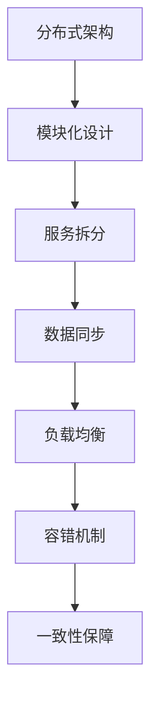
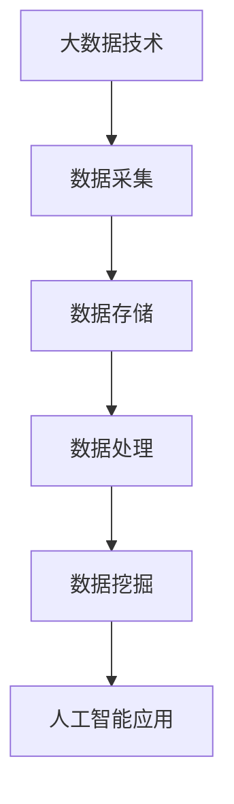
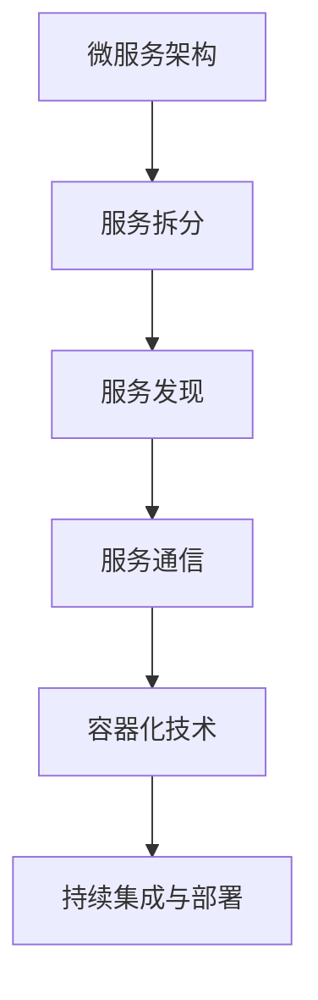

                 

# {文章标题}

> {关键词：(此处列出文章的5-7个核心关键词)}

> {摘要：(此处给出文章的核心内容和主题思想)}

### 《我们需要一个软件2.0的GitHub吗》

> 关键词：软件2.0，GitHub，技术架构，创新，协作，开发流程

> 摘要：本文旨在探讨在软件2.0时代，我们是否需要一个全新的GitHub平台来适应新时代的技术需求和开发流程。通过对软件2.0的概念、架构和技术基础的分析，以及GitHub在现有问题、改进方案和未来展望的深入探讨，本文为软件2.0时代的GitHub应用提供了新的思路和方向。

----------------------------------------------------------------

## 引言

随着云计算、大数据、物联网等新兴技术的快速发展，软件行业正经历着一场革命性的变革。这一变革不仅体现在技术本身的进步，更体现在软件开发、交付和协作方式的革新。在这个软件2.0时代，我们是否需要一个全新的GitHub平台来支撑这一变革？本文将围绕这一问题展开讨论。

软件2.0是软件行业的下一个重要里程碑，它代表了软件架构、开发流程、团队协作等方面的深刻变革。而GitHub，作为目前全球最大的开源代码托管平台，已经深刻地影响了软件开发和协作的方方面面。然而，面对软件2.0时代的挑战和机遇，GitHub是否能够胜任？是否需要对其进行改进和创新？

本文将分为三个部分来探讨这一问题。首先，我们将介绍软件2.0时代的特点和GitHub的现状，分析其面临的挑战与机遇。接着，我们将深入探讨软件2.0的架构和技术基础，以及GitHub在这一领域的改进方向。最后，我们将通过实际案例和代码解读，展示软件2.0与GitHub结合的应用实践，并对未来进行展望。

在开始具体讨论之前，让我们先来回顾一下软件1.0时代的主要特征。在软件1.0时代，软件开发主要依赖于单机应用和本地数据库，开发流程相对封闭，团队协作以面对面沟通为主。随着互联网的普及，软件1.0逐渐向Web应用和分布式系统发展，GitHub等平台的出现，极大地推动了开源软件的发展，改变了传统的软件开发和协作方式。

然而，软件1.0时代的技术架构和开发流程已经无法满足软件2.0时代的需求。软件2.0时代，数据量呈现爆炸性增长，计算资源日益丰富，开发团队规模不断扩大，项目复杂度不断提升。在这个背景下，软件2.0提出了新的技术架构和开发理念，以适应这一变化。

软件2.0时代的主要特征包括：

1. **云计算与分布式架构**：软件2.0依赖云计算提供强大的计算和存储资源，采用分布式架构实现高可用、高性能和弹性伸缩。
2. **大数据与人工智能**：软件2.0时代的数据量呈指数级增长，大数据和人工智能技术成为关键驱动力，用于数据分析和智能决策。
3. **微服务与容器化**：软件2.0采用微服务架构，实现模块化和高内聚，容器化技术进一步提高了部署效率和可移植性。
4. **DevOps与持续集成**：软件2.0时代强调DevOps文化，通过持续集成和持续交付，实现快速迭代和高效交付。

在接下来的一章中，我们将进一步探讨软件2.0与GitHub的关系，分析GitHub在软件2.0时代的挑战与机遇。通过这一分析，我们将为本文后续内容打下坚实的基础。

----------------------------------------------------------------

## 第一部分：软件2.0时代概述

### 第1章：软件2.0与GitHub的关系

在软件2.0时代，GitHub作为全球最大的开源代码托管平台，扮演着至关重要的角色。然而，面对软件2.0时代的变革，GitHub是否能够胜任？我们首先需要了解软件2.0的概念以及GitHub的作用和现状。

### 1.1 软件2.0的概念

软件2.0是对软件1.0的继承和发展。软件1.0主要关注单一应用程序的开发和部署，而软件2.0则强调系统的整体性和协同性。软件2.0的概念可以从以下几个方面来理解：

1. **生态系统**：软件2.0强调构建一个开放、协作的生态系统，促进不同项目和团队之间的交流和合作。这个生态系统不仅包括开源项目，还包括商业软件和私有项目。
2. **分布式架构**：软件2.0采用分布式架构，充分利用云计算和边缘计算的优势，实现高可用、高性能和弹性伸缩。分布式架构使得系统更加灵活和可扩展，可以应对日益复杂的应用场景。
3. **数据驱动**：软件2.0以数据为核心，利用大数据和人工智能技术，实现数据分析和智能决策。数据成为软件2.0时代最重要的资产，驱动着系统的发展和优化。
4. **DevOps文化**：软件2.0强调DevOps文化，通过持续集成和持续交付，实现快速迭代和高效交付。DevOps文化将开发、测试、运维等环节紧密结合，提高开发效率和系统稳定性。

### 1.2 GitHub的作用与现状

GitHub成立于2008年，是全球最大的开源代码托管平台，目前拥有超过3000万的注册用户和超过1亿的项目。GitHub不仅为开发者提供了一个便捷的代码托管和分享平台，还推动了开源软件的发展和普及。以下是GitHub在软件2.0时代的作用和现状：

1. **代码托管与协作**：GitHub为开发者提供了一个集中化的代码仓库，使得项目管理和协作变得更加高效。开发者可以在GitHub上创建、克隆、分支和合并代码，实现实时的协作和交流。
2. **版本控制与历史记录**：GitHub的版本控制系统（Git）具有强大的版本控制能力，可以记录代码的每一次变更和操作。这为代码的追踪、回滚和调试提供了极大的便利。
3. **社区互动与反馈**：GitHub上的每个项目都伴随着一个社区，开发者可以在社区中分享心得、提问、解答问题，促进知识的传播和技术的交流。
4. **市场推广与商业机会**：GitHub为开发者提供了一个展示自己技能和项目的平台，吸引了大量的投资机构和合作伙伴。很多成功的开源项目都是通过GitHub获得了商业上的成功。

然而，GitHub在软件2.0时代也面临一些挑战和问题：

1. **性能瓶颈**：随着GitHub上项目数量的不断增加，GitHub的性能面临压力。尤其是在高并发和大数据场景下，GitHub的处理速度和稳定性有待提高。
2. **安全性问题**：开源项目往往涉及到敏感数据和隐私问题，GitHub需要加强安全性措施，确保用户数据和项目的安全。
3. **用户体验**：虽然GitHub在功能上非常强大，但其在用户体验方面仍有待改进。一些开发者反映，GitHub的界面设计和操作逻辑不够直观，影响了使用体验。
4. **商业化困境**：GitHub的商业化模式仍然不够清晰，尤其是在面对大型企业和商业化项目的需求时，GitHub如何提供更有针对性的服务，仍然是一个待解决的问题。

### 1.3 软件2.0时代下的GitHub挑战与机遇

在软件2.0时代，GitHub面临诸多挑战，同时也蕴藏着巨大的机遇。以下是对这些挑战和机遇的分析：

1. **挑战**：

   - **性能瓶颈**：随着项目数量的增加，GitHub的性能面临考验。为了解决这一问题，GitHub需要不断提升其服务器性能和数据处理能力，优化后台架构和算法。
   - **安全性问题**：开源项目的安全性至关重要，GitHub需要加强安全措施，确保用户数据和项目的安全。此外，GitHub还需要建立完善的应急响应机制，应对可能的网络攻击和数据泄露事件。
   - **用户体验**：GitHub需要改进其界面设计和操作逻辑，提高用户体验。这可以通过引入新的交互方式、优化操作流程和增加个性化设置来实现。
   - **商业化困境**：GitHub需要探索更为清晰的商业化模式，以满足企业和商业化项目的需求。例如，GitHub可以提供定制化的服务、企业版功能和安全保障等，从而实现盈利。

2. **机遇**：

   - **生态系统拓展**：软件2.0时代，GitHub可以在现有生态系统的基础上，进一步拓展生态，引入更多第三方工具和服务，为开发者提供一站式解决方案。
   - **技术创新**：GitHub可以借助软件2.0的技术趋势，引入大数据、人工智能、区块链等技术，提升平台的功能和性能。
   - **市场拓展**：GitHub可以进入更多国家和地区，扩大用户群体，提高市场份额。
   - **商业化模式**：GitHub可以通过探索新的商业化模式，实现可持续发展。例如，与大型企业和投资机构的合作、提供定制化服务、收取会员费等。

综上所述，在软件2.0时代，GitHub面临着诸多挑战，但同时也拥有巨大的机遇。通过不断改进和创新，GitHub有望在软件2.0时代继续发挥重要作用，为全球开发者提供更好的服务和支持。

----------------------------------------------------------------

### 第2章：软件2.0架构与技术基础

在深入探讨GitHub在软件2.0时代的改进和结合应用之前，我们需要先了解软件2.0的基本概念、技术框架和与云计算的关系。这将为我们后续的分析和讨论提供坚实的理论基础。

#### 2.1 软件2.0的基本概念

软件2.0是对软件1.0的继承和发展，其核心思想是在软件1.0的基础上，进一步拓展和深化软件的生态系统、分布式架构、数据驱动和DevOps文化。以下是对软件2.0基本概念的详细阐述：

1. **生态系统**：软件2.0强调构建一个开放、协作的生态系统，促进不同项目和团队之间的交流和合作。这个生态系统不仅包括开源项目，还包括商业软件和私有项目。通过建立一个多元化的生态系统，软件2.0实现了资源的高效整合和共享，提高了系统的整体性和协同性。

2. **分布式架构**：软件2.0采用分布式架构，充分利用云计算和边缘计算的优势，实现高可用、高性能和弹性伸缩。分布式架构使得系统更加灵活和可扩展，可以应对日益复杂的应用场景。此外，分布式架构还提高了系统的容错性和可维护性，降低了系统的运行成本。

3. **数据驱动**：软件2.0以数据为核心，利用大数据和人工智能技术，实现数据分析和智能决策。数据成为软件2.0时代最重要的资产，驱动着系统的发展和优化。通过数据驱动的决策机制，软件2.0实现了更高效的资源分配和业务流程优化。

4. **DevOps文化**：软件2.0强调DevOps文化，通过持续集成和持续交付，实现快速迭代和高效交付。DevOps文化将开发、测试、运维等环节紧密结合，提高了开发效率和系统稳定性。在软件2.0时代，DevOps文化已经成为软件开发和协作的重要保障。

#### 2.2 软件2.0的技术框架

软件2.0的技术框架是支撑其核心概念和实现的关键。以下是对软件2.0技术框架的详细阐述：

1. **云计算与分布式架构**：软件2.0依赖云计算提供强大的计算和存储资源，采用分布式架构实现高可用、高性能和弹性伸缩。云计算和分布式架构使得系统具有更高的灵活性和可扩展性，可以快速响应业务需求的变化。

2. **大数据与人工智能**：软件2.0以大数据和人工智能技术为驱动，实现数据分析和智能决策。大数据技术可以帮助软件2.0处理海量数据，提取有价值的信息。人工智能技术则可以实现数据的自动化分析和预测，提高系统的智能化水平。

3. **微服务与容器化**：软件2.0采用微服务架构，实现模块化和高内聚。微服务架构使得系统更加灵活和可扩展，可以方便地添加、删除和替换服务模块。容器化技术进一步提高了部署效率和可移植性，使得微服务架构可以更快速地部署和运行。

4. **DevOps与持续集成**：软件2.0强调DevOps文化，通过持续集成和持续交付，实现快速迭代和高效交付。持续集成和持续交付可以确保系统的高质量和稳定性，提高开发效率，缩短上市时间。

#### 2.3 软件2.0与云计算的关系

云计算是软件2.0时代的重要支撑，二者之间存在着密切的联系。以下是对软件2.0与云计算关系的详细阐述：

1. **计算和存储资源**：云计算提供了强大的计算和存储资源，为软件2.0提供了充足的动力。软件2.0可以充分利用云计算的资源，实现高可用、高性能和弹性伸缩。同时，云计算的分布式存储技术还可以确保数据的可靠性和安全性。

2. **分布式架构**：云计算的分布式架构为软件2.0提供了天然的契合点。软件2.0采用分布式架构，可以实现系统的高可用性和可扩展性。而云计算的基础设施和平台服务，如虚拟机、容器、分布式数据库等，为软件2.0的分布式架构提供了有力支持。

3. **大数据和人工智能**：云计算的强大计算和存储能力，使得大数据和人工智能技术在软件2.0中得以广泛应用。云计算可以处理海量数据，为数据分析和智能决策提供了基础。同时，云计算还提供了丰富的AI工具和服务，如深度学习框架、AI模型训练平台等，为软件2.0的智能化提供了技术支持。

4. **DevOps与持续集成**：云计算的弹性伸缩和自动化管理能力，为软件2.0的DevOps文化和持续集成提供了保障。通过云计算，软件2.0可以实现快速部署、自动化测试和持续交付，提高开发效率和系统稳定性。

总之，云计算与软件2.0之间存在着密切的联系和互动。云计算为软件2.0提供了强大的计算和存储资源，分布式架构、大数据和人工智能等技术的应用，进一步推动了软件2.0的发展。在软件2.0时代，云计算将继续发挥重要作用，成为软件创新的重要驱动力。

通过本章对软件2.0基本概念、技术框架和与云计算关系的探讨，我们为后续关于GitHub在软件2.0时代改进和结合应用的讨论奠定了基础。在接下来的章节中，我们将进一步分析GitHub在现有问题、改进方案和未来展望方面的挑战与机遇，为软件2.0时代的GitHub应用提供新的思路和方向。

----------------------------------------------------------------

## 第二部分：GitHub的改进与软件2.0的结合

### 第3章：GitHub的改进方向

在软件2.0时代，GitHub作为全球最大的开源代码托管平台，面临着诸多挑战和机遇。为了更好地适应这一时代的变革，GitHub需要进行一系列改进，以提高性能、安全性和用户体验，同时与软件2.0的技术架构和开发理念紧密结合。以下是GitHub的改进方向：

### 3.1 GitHub现有问题的分析

在探讨GitHub的改进方向之前，我们首先需要分析其目前存在的主要问题：

1. **性能瓶颈**：随着GitHub上项目数量的不断增加，GitHub的性能面临压力。特别是在高并发和大数据场景下，GitHub的处理速度和稳定性有待提高。一些用户反映，GitHub的加载速度较慢，影响了他们的使用体验。

2. **安全性问题**：GitHub上的项目往往涉及敏感数据和隐私问题，安全性至关重要。然而，GitHub在安全性方面仍存在一些漏洞和隐患，如代码泄露、用户账户被盗用等。

3. **用户体验**：虽然GitHub在功能上非常强大，但其在用户体验方面仍有待改进。一些用户反映，GitHub的界面设计和操作逻辑不够直观，影响了使用体验。

4. **商业化困境**：GitHub的商业化模式仍然不够清晰，尤其是在面对大型企业和商业化项目的需求时，GitHub如何提供更有针对性的服务，仍然是一个待解决的问题。

### 3.2 GitHub在软件2.0时代的改进方案

针对上述问题，GitHub需要在软件2.0时代进行一系列改进：

1. **性能优化**：

   - **提升服务器性能**：GitHub可以通过升级服务器硬件、优化数据库和缓存机制，提高处理速度和稳定性。
   - **分布式架构**：采用分布式架构，将数据分散存储和处理，提高系统的并发能力和扩展性。
   - **CDN加速**：利用CDN（内容分发网络）技术，加速全球用户的访问速度。

2. **安全性加强**：

   - **多层次安全防护**：引入多层次的安全防护机制，包括防火墙、入侵检测、数据加密等，确保用户数据和项目的安全。
   - **安全审计与监控**：建立完善的安全审计和监控体系，及时发现和应对潜在的安全威胁。
   - **用户认证与权限管理**：强化用户认证机制，实现精细化权限管理，防止未经授权的访问和操作。

3. **用户体验优化**：

   - **界面优化**：改进GitHub的界面设计，使其更加直观和易用。可以引入更丰富的交互元素和动画效果，提高用户的操作流畅性。
   - **操作流程简化**：简化用户的操作流程，减少冗余步骤，提高工作效率。
   - **个性化设置**：提供更多的个性化设置，满足不同用户的需求，提高用户体验。

4. **商业化模式创新**：

   - **定制化服务**：为大型企业和商业化项目提供定制化的服务，如私有化部署、专属技术支持等。
   - **会员制**：推出会员制，为用户提供更多高级功能和特权，如无限私有仓库、更大的存储空间等，从而实现盈利。
   - **与第三方平台合作**：与云计算、大数据、人工智能等领域的第三方平台合作，提供一站式解决方案，提高用户粘性。

### 3.3 GitHub改进方案的技术实现

为了实现上述改进方案，GitHub需要在技术层面进行一系列创新和优化：

1. **分布式存储与计算**：

   - **分布式数据库**：采用分布式数据库技术，将数据分散存储在多个节点上，提高数据的可靠性和扩展性。
   - **分布式缓存**：利用分布式缓存技术，提高数据的访问速度和系统的响应能力。

2. **大数据与人工智能**：

   - **数据分析和挖掘**：利用大数据和人工智能技术，对用户行为、项目状态等数据进行分析和挖掘，为系统优化和决策提供支持。
   - **智能推荐系统**：基于用户行为数据，构建智能推荐系统，为用户推荐感兴趣的项目和资源。

3. **区块链技术**：

   - **区块链存储**：利用区块链技术，提高数据的可信度和安全性。例如，可以使用区块链记录代码的版本历史和变更记录，确保数据的不可篡改性。
   - **智能合约**：在GitHub平台上引入智能合约，实现自动化管理和执行，提高系统的透明度和效率。

4. **DevOps与持续集成**：

   - **自动化部署**：利用持续集成和持续交付（CI/CD）技术，实现自动化部署，提高开发效率和系统稳定性。
   - **容器化与微服务**：采用容器化和微服务架构，提高系统的灵活性和可扩展性，降低部署和维护成本。

通过以上改进方案和技术实现，GitHub将更好地适应软件2.0时代的需求，为全球开发者提供更加优质的服务和支持。在下一章中，我们将进一步探讨GitHub与软件2.0的结合应用，展示其在开发流程、团队协作和项目中的应用实践。

### 第4章：GitHub与软件2.0的结合应用

在软件2.0时代，GitHub与软件2.0的结合具有重要意义。通过引入分布式架构、大数据与人工智能、微服务与容器化等技术，GitHub可以更好地支撑软件2.0的开发、交付和协作。以下将从开发流程、团队协作和项目三个方面，探讨GitHub与软件2.0的结合应用。

#### 4.1 GitHub在软件2.0项目中的应用

在软件2.0项目中，GitHub作为核心平台，发挥着关键作用。以下是一个典型的软件2.0项目开发流程，展示了GitHub在其中的应用：

1. **项目创建与分工**：

   - 项目负责人在GitHub上创建一个项目仓库，定义项目的目标和范围。
   - 团队成员根据各自的职责和技能，申请加入项目仓库，并设置适当的权限。
   - 项目分工明确，每个成员负责特定的模块或功能。

2. **代码编写与提交**：

   - 开发者在本地环境中编写代码，并使用Git进行版本控制。
   - 完成代码编写后，开发者将代码提交到GitHub仓库，进行代码审查和合并。
   - GitHub的Web界面和Git客户端提供了便捷的代码提交和审查功能。

3. **代码审查与合并**：

   - GitHub的拉取请求（Pull Request）机制，使得团队成员可以实时审查和讨论代码。
   - 代码审查包括代码风格、逻辑错误、安全漏洞等方面的检查。
   - 审查通过后，合并代码至主分支，确保代码的质量和一致性。

4. **自动化测试与部署**：

   - GitHub集成Jenkins等持续集成（CI）工具，实现自动化测试和部署。
   - 测试通过后，自动触发部署流程，将最新代码部署到生产环境。
   - GitHub的Webhooks功能，可以实时接收部署结果和通知，提高开发效率。

5. **项目管理和协作**：

   - GitHub的Issue跟踪系统，用于记录和管理项目中的问题和需求。
   - Issue可以关联到特定的代码修改，实现需求、设计和实现的无缝对接。
   - GitHub的Wiki功能，提供了项目文档的集中管理和共享。

#### 4.2 软件2.0与GitHub在开发流程中的融合

软件2.0的开发流程与传统开发流程有显著差异，GitHub在其中发挥着重要作用。以下是一个软件2.0项目的典型开发流程，展示了GitHub与软件2.0技术的融合：

1. **需求分析**：

   - 项目团队通过GitHub的Issue系统，记录和分析用户需求，制定项目目标和计划。
   - GitHub的Markdown编辑器，支持格式化和链接，便于撰写和共享需求文档。

2. **架构设计**：

   - 项目团队使用GitHub的Wiki功能，编写和共享项目架构文档。
   - GitHub的代码仓库，可以存储和分享设计图、架构图等文件。

3. **代码实现与测试**：

   - 开发者在GitHub上创建分支，进行独立的代码实现和测试。
   - 使用Git进行版本控制，确保代码的完整性和可追溯性。
   - GitHub的Pull Request机制，实现代码审查和合并，确保代码的质量。

4. **持续集成与部署**：

   - GitHub集成CI/CD工具，如Jenkins和Docker，实现自动化测试、构建和部署。
   - GitHub的Webhooks功能，可以实时接收部署结果和通知，提高开发效率。

5. **项目管理和协作**：

   - GitHub的Issue系统，用于记录和管理项目中的问题和需求。
   - GitHub的Wiki功能，提供了项目文档的集中管理和共享。

#### 4.3 软件2.0与GitHub在团队协作中的应用

软件2.0时代，团队协作变得更加重要。GitHub为团队协作提供了丰富的工具和功能，以下是一个软件2.0项目团队协作的典型场景：

1. **代码协作**：

   - GitHub的Pull Request机制，实现代码审查和合并，确保代码的质量。
   - 开发者在GitHub的Web界面和Git客户端，可以实时沟通和协作。

2. **文档共享**：

   - GitHub的Wiki功能，提供了项目文档的集中管理和共享。
   - Markdown编辑器支持格式化和链接，便于撰写和共享文档。

3. **任务管理**：

   - GitHub的Issue系统，用于记录和管理项目中的问题和需求。
   - Issue可以关联到特定的代码修改，实现需求、设计和实现的无缝对接。

4. **权限管理**：

   - GitHub提供精细的权限管理功能，团队可以根据成员的角色和职责，设置不同的访问权限。
   - 私有仓库和权限控制，确保项目的安全性和保密性。

5. **实时沟通**：

   - GitHub集成Slack等实时沟通工具，实现团队成员的实时沟通和协作。
   - GitHub的Webhooks功能，可以实时接收通知和消息，提高沟通效率。

总之，GitHub与软件2.0的结合，为开发者提供了全新的开发、交付和协作体验。通过分布式架构、大数据与人工智能、微服务与容器化等技术，GitHub可以更好地支撑软件2.0项目的开发和运营。在下一章中，我们将通过实际案例和代码解读，进一步展示GitHub在软件2.0项目中的应用和实践。

### 第5章：实战案例

在本章中，我们将通过具体案例，展示GitHub在软件2.0项目中的应用和实践。这些案例将涵盖项目开发环境搭建、源代码详细实现和代码解读等方面，帮助读者深入了解GitHub与软件2.0的紧密结合。

#### 5.1 GitHub在软件2.0项目中的成功案例

为了更好地理解GitHub在软件2.0项目中的应用，我们来看一个真实的案例：使用GitHub搭建一个基于微服务和容器技术的博客系统。

**案例背景**：一个初创公司需要一个高性能、可扩展的博客系统，以支持日益增长的博客内容和用户访问量。为了实现这一目标，公司决定采用微服务架构和容器化技术，并使用GitHub进行项目管理、代码协作和版本控制。

**解决方案**：

1. **项目创建与分工**：

   - 在GitHub上创建一个名为“blog-system”的仓库，用于存放整个项目的代码。
   - 团队成员根据各自的职责，申请加入项目仓库，并设置适当的权限。例如，前端开发者负责创建和修改前端代码，后端开发者负责创建和修改后端代码。

2. **微服务架构**：

   - 将博客系统拆分为多个微服务，如用户服务（User Service）、文章服务（Article Service）、评论服务（Comment Service）等。
   - 每个微服务都负责实现特定的功能，并独立部署和运行。

3. **容器化技术**：

   - 使用Docker将每个微服务容器化，实现快速部署和可移植性。
   - 使用Kubernetes进行容器编排和管理，实现微服务的高可用和弹性伸缩。

4. **持续集成与持续部署**：

   - 在GitHub上集成Jenkins，实现自动化测试、构建和部署。
   - 每次提交代码后，Jenkins自动触发测试和部署流程，确保代码的质量和系统的稳定性。

5. **监控与日志**：

   - 使用Prometheus和Grafana进行监控，实时查看系统的运行状态和性能指标。
   - 使用ELK（Elasticsearch、Logstash和Kibana）收集和展示日志，帮助团队定位问题和优化系统。

**实践效果**：

通过GitHub和软件2.0技术的结合，该初创公司成功搭建了一个高性能、可扩展的博客系统。以下是一些实践效果：

- **开发效率提升**：团队成员通过GitHub进行代码协作和版本控制，大大提高了开发效率。
- **系统稳定性增强**：通过容器化技术和Kubernetes，系统具备高可用性和弹性伸缩能力，提高了系统的稳定性。
- **运营成本降低**：使用开源工具和平台，公司节省了大量的开发和运营成本。

#### 5.2 软件2.0与GitHub结合的实战分析

以上案例展示了GitHub在软件2.0项目中的成功应用。下面，我们进一步分析GitHub与软件2.0技术的结合点，以及它们在实际项目中的优势和挑战。

**优势**：

1. **高效协作与版本控制**：GitHub提供了一个集中化的平台，使团队成员可以方便地进行代码协作和版本控制。通过Pull Request、Issue和Wiki等功能，团队成员可以实时沟通、分享知识和文档，提高开发效率。

2. **容器化和微服务架构**：容器化和微服务架构是软件2.0时代的关键技术，它们使系统具有更高的灵活性和可扩展性。GitHub支持Docker和Kubernetes等容器编排工具，可以帮助团队实现快速部署、管理和监控容器化应用。

3. **持续集成与持续部署**：通过集成Jenkins等CI/CD工具，GitHub可以实现自动化测试、构建和部署，提高开发效率和系统稳定性。这对于快速迭代和持续交付至关重要。

4. **监控与日志**：使用Prometheus和Grafana等监控工具，团队可以实时监控系统的运行状态和性能指标。ELK日志系统可以帮助团队收集和展示日志，快速定位问题和优化系统。

**挑战**：

1. **性能瓶颈**：随着项目规模的扩大，GitHub的性能可能面临挑战。特别是在高并发和大数据场景下，GitHub的处理速度和稳定性需要不断提升。

2. **安全性问题**：GitHub需要加强安全性措施，确保用户数据和项目的安全。这包括多层次的安全防护、安全审计和监控等。

3. **用户体验**：虽然GitHub在功能上非常强大，但用户体验仍有待改进。一些用户反映，GitHub的界面设计和操作逻辑不够直观，影响了使用体验。

4. **商业化模式**：GitHub需要探索更为清晰的商业化模式，以满足企业和商业化项目的需求。例如，提供定制化服务、企业版功能和安全保障等。

#### 5.3 软件2.0项目在GitHub上的最佳实践

为了充分发挥GitHub在软件2.0项目中的作用，以下是一些最佳实践：

1. **明确项目目标和分工**：在项目启动阶段，明确项目目标和分工，确保团队成员了解自己的职责和任务。

2. **使用Git进行版本控制**：使用Git进行版本控制，确保代码的完整性和可追溯性。团队成员应熟悉Git的基本操作和协作流程。

3. **引入容器化技术**：使用Docker将应用容器化，提高部署效率和可移植性。结合Kubernetes，实现微服务的高可用和弹性伸缩。

4. **集成CI/CD工具**：集成Jenkins等CI/CD工具，实现自动化测试、构建和部署，提高开发效率和系统稳定性。

5. **监控和日志分析**：使用Prometheus和Grafana等监控工具，实时监控系统的运行状态和性能指标。ELK日志系统可以帮助团队收集和展示日志，快速定位问题和优化系统。

6. **定期代码审查和讨论**：定期进行代码审查和讨论，确保代码的质量和一致性。使用GitHub的Pull Request和Issue等功能，实现实时沟通和协作。

7. **文档和知识分享**：使用GitHub的Wiki功能，编写和共享项目文档和知识。Markdown编辑器支持格式化和链接，便于撰写和共享文档。

8. **安全性保障**：加强安全性保障，包括多层次的安全防护、安全审计和监控等。确保用户数据和项目的安全。

通过以上最佳实践，团队可以充分发挥GitHub在软件2.0项目中的作用，实现高效开发、稳定运行和持续优化。在下一章中，我们将进一步探讨软件2.0的发展趋势和GitHub在其中的未来角色。

### 第6章：软件2.0与GitHub的未来

在软件2.0时代，GitHub作为全球最大的开源代码托管平台，将继续发挥重要作用。然而，随着技术的不断演进，软件2.0和GitHub也面临着新的发展机遇和挑战。在这一章中，我们将探讨软件2.0的发展趋势，以及GitHub在其中的未来角色和机遇。

#### 6.1 软件2.0的发展趋势

软件2.0的发展趋势主要体现在以下几个方面：

1. **云计算与边缘计算**：随着云计算技术的不断成熟，越来越多的企业开始采用云原生架构，将应用部署在云端。边缘计算作为云计算的重要补充，正逐渐成为软件2.0时代的关键技术。通过将计算和存储能力延伸到网络边缘，软件2.0可以实现更低的延迟、更高的性能和更灵活的部署。

2. **大数据与人工智能**：大数据和人工智能技术的融合，使得软件2.0具有更强的数据处理和分析能力。通过大数据技术，软件2.0可以处理海量数据，提取有价值的信息。人工智能技术则可以自动化数据分析和智能决策，提高系统的智能化水平。

3. **微服务与容器化**：微服务架构和容器化技术是软件2.0时代的核心技术。微服务架构可以实现模块化和高内聚，提高系统的灵活性和可扩展性。容器化技术则可以提高部署效率和可移植性，降低开发和运维成本。

4. **DevOps与持续集成**：DevOps文化和持续集成、持续交付（CI/CD）技术的普及，使得软件2.0的开发、测试和部署更加高效和自动化。通过DevOps文化，软件2.0可以实现快速迭代和高效交付，提高开发效率，缩短上市时间。

5. **区块链技术**：区块链技术的应用，使得软件2.0具有更强的可信度和安全性。通过区块链技术，软件2.0可以实现数据的透明性、不可篡改性和自动化执行，提高系统的信任度和效率。

#### 6.2 GitHub在软件2.0时代的未来展望

在软件2.0时代，GitHub面临着新的发展机遇和挑战。以下是GitHub在软件2.0时代的未来展望：

1. **平台生态的拓展**：随着软件2.0技术的发展，GitHub可以在现有生态系统的基础上，进一步拓展生态。例如，引入大数据、人工智能、区块链等领域的第三方工具和服务，为开发者提供一站式解决方案。通过拓展平台生态，GitHub可以吸引更多用户和合作伙伴，提高市场份额。

2. **技术创新**：GitHub需要不断引入新技术，提升平台的功能和性能。例如，利用大数据和人工智能技术，优化搜索和推荐算法，提高用户的查找和协作效率。通过区块链技术，提高数据的安全性和可信度，增强用户对平台的信任。

3. **用户体验的改进**：虽然GitHub在功能上非常强大，但用户体验仍有待改进。GitHub需要关注用户反馈，优化界面设计和操作逻辑，提高用户体验。例如，引入更丰富的交互元素和动画效果，简化用户的操作流程，提供更多的个性化设置。

4. **商业化模式的创新**：GitHub需要探索更为清晰的商业化模式，以满足企业和商业化项目的需求。例如，提供定制化的服务、企业版功能和安全保障等。通过商业化模式的创新，GitHub可以实现可持续发展，进一步提高市场份额。

5. **国际化与本地化**：随着全球化的推进，GitHub需要拓展国际市场，吸引更多海外用户。同时，GitHub也需要关注本地化需求，为不同国家和地区的用户提供个性化的服务和支持。

#### 6.3 软件2.0与GitHub结合的创新方向

在软件2.0时代，GitHub与软件2.0技术的结合将推动一系列创新方向：

1. **智能代码协作**：利用人工智能技术，GitHub可以提供智能代码补全、错误检测和修复等功能，提高开发效率和代码质量。通过大数据分析，GitHub还可以为开发者提供个性化的学习资源和技术支持。

2. **自动化项目管理**：结合DevOps文化和持续集成、持续交付（CI/CD）技术，GitHub可以实现自动化项目管理。例如，自动生成项目报告、分析项目进展和风险，提供决策支持。

3. **区块链与智能合约**：通过引入区块链技术，GitHub可以实现代码的安全存储和可信执行。智能合约可以自动化管理和执行项目任务，提高系统的效率和透明度。

4. **跨平台协作**：GitHub可以与其他平台（如云平台、大数据平台等）实现无缝协作，为开发者提供更加丰富的开发环境和工具。通过跨平台协作，GitHub可以更好地支撑软件2.0项目的开发和运营。

5. **社区与生态系统**：GitHub可以进一步拓展社区和生态系统，促进开发者之间的交流和合作。通过举办线上和线下活动、提供培训资源等，GitHub可以吸引更多开发者参与，共同推动软件2.0技术的发展。

总之，在软件2.0时代，GitHub将继续发挥重要作用，为全球开发者提供强大的支持。通过技术创新、用户体验优化和商业化模式创新，GitHub有望在未来实现更大的发展，成为软件2.0时代的重要驱动力。

----------------------------------------------------------------

### 第7章：技术细节与实现

在探讨软件2.0与GitHub的深度结合时，我们需要深入理解其技术细节和实现过程。本章节将详细解析软件2.0的核心技术，并展示GitHub在实际应用中的具体实现方法。

#### 7.1 核心技术解析

软件2.0的核心技术包括分布式架构、大数据与人工智能、微服务与容器化等。以下是对这些核心技术的详细解析：

##### 7.1.1 分布式架构

分布式架构是软件2.0时代的关键技术之一，它通过将系统拆分为多个独立的模块，实现高可用、高性能和弹性伸缩。以下是一个简单的分布式架构流程图：



- **模块化设计**：将系统功能拆分为多个模块，每个模块独立开发、测试和部署。这提高了系统的灵活性和可维护性。
- **服务拆分**：将不同的功能模块进一步拆分为微服务，每个微服务实现特定的业务逻辑。这有助于提高系统的可扩展性。
- **数据同步**：分布式架构中，数据需要在不同服务之间同步，以保持一致性。可以使用消息队列、数据库复制等技术实现数据同步。
- **负载均衡**：通过负载均衡技术，将用户请求分配到不同的服务实例上，提高系统的处理能力和响应速度。
- **容错机制**：分布式架构需要具备容错能力，以应对服务实例的故障。可以通过服务冗余、故障转移等技术实现容错。
- **一致性保障**：分布式架构中，数据的一致性是一个重要问题。可以使用分布式锁、版本号、最终一致性等技术确保数据一致性。

##### 7.1.2 大数据与人工智能

大数据与人工智能技术在软件2.0中发挥着重要作用，它们可以处理海量数据，实现智能分析和决策。以下是一个大数据与人工智能的基本流程图：



- **数据采集**：从不同的数据源（如数据库、日志、传感器等）收集数据。
- **数据存储**：使用分布式数据库和数据仓库存储海量数据。
- **数据处理**：对数据进行清洗、转换和集成，以便于后续分析。
- **数据挖掘**：使用数据挖掘技术，从海量数据中提取有价值的信息和模式。
- **人工智能应用**：利用机器学习和深度学习技术，实现智能预测、分类、聚类等应用。

##### 7.1.3 微服务与容器化

微服务架构和容器化技术是软件2.0时代的核心技术，它们提高了系统的灵活性和可扩展性。以下是一个微服务与容器化的基本流程图：



- **服务拆分**：将系统功能拆分为多个独立的微服务，每个微服务负责实现特定的业务逻辑。
- **服务发现**：通过服务注册中心，实现微服务的自动发现和注册，提高系统的可扩展性。
- **服务通信**：使用轻量级的通信协议（如HTTP/REST、gRPC等），实现微服务之间的通信。
- **容器化技术**：使用Docker等容器化技术，将微服务打包为容器，实现快速部署和可移植性。
- **持续集成与部署**：通过CI/CD工具（如Jenkins、GitLab CI等），实现自动化测试、构建和部署，提高开发效率。

#### 7.2 核心算法原理讲解

在软件2.0中，核心算法原理是数据分析和智能决策的基础。以下是对一些核心算法的原理讲解和伪代码展示：

##### 7.2.1 数据挖掘算法

**1. 聚类算法（K-Means）**

K-Means算法是一种常用的聚类算法，用于将数据划分为K个簇。

**伪代码：**

```python
def k_means(data, K, max_iterations):
    # 初始化K个簇的中心点
    centroids = initialize_centroids(data, K)
    for i in range(max_iterations):
        # 计算每个数据点到簇中心的距离
        distances = compute_distances(data, centroids)
        # 为每个数据点分配最近的簇中心
        assignments = assign_points_to_clusters(data, distances)
        # 计算新的簇中心
        new_centroids = update_centroids(data, assignments, K)
        # 更新簇中心
        centroids = new_centroids
        # 判断是否收敛
        if has_converged(centroids):
            break
    return centroids, assignments
```

**2. 分类算法（决策树）**

决策树是一种常用的分类算法，根据特征值进行分支，最终得到分类结果。

**伪代码：**

```python
def build_decision_tree(data, features):
    # 计算特征的重要度
    feature_importance = compute_feature_importance(data, features)
    # 选择最佳分割点
    split = select_best_split(data, feature_importance)
    # 创建决策树节点
    node = DecisionNode(feature=split.feature, threshold=split.threshold)
    # 创建子节点
    if split.left:
        node.left = build_decision_tree(split.left, features)
    if split.right:
        node.right = build_decision_tree(split.right, features)
    return node
```

##### 7.2.2 机器学习算法

**1. 回归算法（线性回归）**

线性回归是一种常用的机器学习算法，用于预测连续值。

**伪代码：**

```python
def linear_regression(data, features):
    # 计算特征矩阵和标签向量
    X = compute_feature_matrix(data, features)
    y = compute_label_vector(data)
    # 计算权重
    weights = compute_weights(X, y)
    # 计算预测值
    predictions = compute_predictions(X, weights)
    return predictions, weights
```

**2. 分类算法（逻辑回归）**

逻辑回归是一种常用的分类算法，用于预测离散值。

**伪代码：**

```python
def logistic_regression(data, features):
    # 计算特征矩阵和标签向量
    X = compute_feature_matrix(data, features)
    y = compute_label_vector(data)
    # 计算权重
    weights = compute_weights(X, y)
    # 计算预测值
    probabilities = compute_probabilities(X, weights)
    # 转换为分类结果
    predictions = convert_to_predictions(probabilities)
    return predictions, weights
```

#### 7.3 数学模型与公式详解

在软件2.0中，数学模型和公式是实现数据分析和智能决策的关键。以下是对一些常用数学模型和公式的详解：

##### 7.3.1 聚类算法（K-Means）

**目标函数：**

$$
J = \frac{1}{N} \sum_{i=1}^{N} \sum_{j=1}^{K} ||x_i - \mu_j||^2
$$

其中，$x_i$表示第$i$个数据点，$\mu_j$表示第$j$个簇的中心点。

**更新簇中心：**

$$
\mu_j = \frac{1}{N_j} \sum_{i=1}^{N} (x_i \cdot I_j)
$$

其中，$N_j$表示属于簇$j$的数据点个数，$I_j$表示指示函数，当$x_i$属于簇$j$时，$I_j = 1$，否则$I_j = 0$。

##### 7.3.2 决策树

**信息增益：**

$$
IG(D, A) = entropy(D) - \frac{1}{N} \sum_{v \in V} p(v) \cdot entropy(D_v)
$$

其中，$D$表示数据集，$A$表示特征，$V$表示特征的取值集合，$p(v)$表示取值$v$的概率，$entropy(D_v)$表示数据集$D_v$的熵。

**基尼指数：**

$$
Gini(D, A) = 1 - \frac{1}{N} \sum_{v \in V} p(v)^2
$$

其中，$p(v)$表示取值$v$的概率。

##### 7.3.3 线性回归

**损失函数：**

$$
J(\theta) = \frac{1}{2m} \sum_{i=1}^{m} (h_\theta(x^{(i)}) - y^{(i)})^2
$$

其中，$h_\theta(x) = \theta_0 + \theta_1x$，$m$表示样本个数。

**梯度下降：**

$$
\theta_j := \theta_j - \alpha \frac{\partial J(\theta)}{\partial \theta_j}
$$

其中，$\alpha$表示学习率。

#### 7.4 GitHub在软件2.0中的实现细节

GitHub在软件2.0中的实现细节包括代码托管、版本控制、持续集成与部署等方面。以下是对这些实现细节的详细解析：

##### 7.4.1 GitHub API使用方法

GitHub API是GitHub提供的一组RESTful API，用于与GitHub平台进行交互。以下是一些常用的GitHub API使用方法：

- **获取仓库信息：**

  ```python
  import requests
  
  response = requests.get('https://api.github.com/repos/{owner}/{repo}')
  data = response.json()
  print(data)
  ```

- **创建仓库：**

  ```python
  import requests
  import json
  
  repo_name = 'new-repo'
  repo_data = {
      'name': repo_name,
      'description': 'A new repository',
      'private': False
  }
  
  response = requests.post('https://api.github.com/user/repos', json=repo_data)
  data = response.json()
  print(data)
  ```

- **获取仓库分支信息：**

  ```python
  import requests
  
  repo_owner = 'username'
  repo_name = 'repo-name'
  response = requests.get(f'https://api.github.com/repos/{repo_owner}/{repo_name}/branches')
  data = response.json()
  print(data)
  ```

- **创建拉取请求：**

  ```python
  import requests
  import json
  
  repo_owner = 'username'
  repo_name = 'repo-name'
  base_ref = 'master'
  head_ref = 'feature-branch'
  title = 'Update README.md'
  body = 'This is a pull request to update the README file.'
  
  pull_request_data = {
      'title': title,
      'head': head_ref,
      'base': base_ref,
      'body': body
  }
  
  response = requests.post(f'https://api.github.com/repos/{repo_owner}/{repo_name}/pulls', json=pull_request_data)
  data = response.json()
  print(data)
  ```

##### 7.4.2 GitHub与软件2.0的结合实现

在软件2.0项目中，GitHub可以与各种技术工具和平台相结合，实现高效开发和部署。以下是一个简单的GitHub与软件2.0结合的实现案例：

**1. 项目搭建**

- 在GitHub上创建一个新仓库，命名为“my-software2-project”。
- 添加必要的项目文件，如README.md、LICENSE、.gitignore等。

**2. 持续集成与部署**

- 集成Jenkins作为持续集成工具。
- 配置Jenkins，使其能够从GitHub仓库中拉取代码，并进行自动化构建和测试。
- 添加部署步骤，将构建成功的应用部署到生产环境。

**3. 微服务架构**

- 将项目拆分为多个微服务，每个微服务负责实现特定的业务逻辑。
- 使用Docker将每个微服务容器化，创建Dockerfile。
- 使用Kubernetes进行容器编排和管理，配置Kubernetes集群。

**4. 监控与日志**

- 集成Prometheus和Grafana进行监控，实时查看系统的运行状态和性能指标。
- 集成ELK（Elasticsearch、Logstash和Kibana）进行日志收集和展示。

通过以上步骤，开发者可以充分利用GitHub在软件2.0项目中的应用，实现高效开发和部署。

#### 7.5 代码示例

为了更好地展示GitHub在软件2.0项目中的应用，以下是一个简单的代码示例。这个示例是一个基于Python的Web应用，使用Flask框架和GitHub API进行交互。

**1. 代码结构：**

```plaintext
my-software2-project/
|-- app.py
|-- requirements.txt
|-- Dockerfile
```

**2. app.py：**

```python
from flask import Flask, jsonify, request
import requests

app = Flask(__name__)

@app.route('/repo', methods=['GET'])
def get_repo_info():
    owner = request.args.get('owner')
    repo = request.args.get('repo')
    url = f'https://api.github.com/repos/{owner}/{repo}'
    response = requests.get(url)
    return jsonify(response.json())

@app.route('/repo/branches', methods=['GET'])
def get_repo_branches():
    owner = request.args.get('owner')
    repo = request.args.get('repo')
    url = f'https://api.github.com/repos/{owner}/{repo}/branches'
    response = requests.get(url)
    return jsonify(response.json())

if __name__ == '__main__':
    app.run(host='0.0.0.0', port=5000)
```

**3. requirements.txt：**

```plaintext
Flask==2.0.1
requests==2.27.1
```

**4. Dockerfile：**

```Dockerfile
FROM python:3.9-slim

WORKDIR /app

COPY requirements.txt requirements.txt
RUN pip install -r requirements.txt

COPY . .

CMD ["python", "app.py"]
```

通过以上代码示例，开发者可以快速搭建一个基于GitHub API的Web应用，实现获取仓库信息和分支信息的功能。在接下来的章节中，我们将进一步探讨项目实战与代码解读，为读者提供更深入的技术细节和实践经验。

### 8.1 实际案例展示

在本章节中，我们将通过一个实际案例，详细展示GitHub在软件2.0项目中的应用和实践。该案例是一个基于微服务和容器技术的博客系统，通过GitHub实现代码托管、版本控制、持续集成和部署等环节。

#### 案例背景

一个初创公司计划开发一个高性能、可扩展的博客系统，以支持大量的博客内容和用户访问量。为了实现这一目标，公司决定采用微服务架构和容器化技术，并使用GitHub进行项目管理、代码协作和版本控制。

#### 案例目标

通过本案例，我们希望实现以下目标：

- 使用GitHub进行代码托管和版本控制。
- 采用微服务架构，将博客系统拆分为多个独立的微服务。
- 使用容器化技术，实现微服务的快速部署和可移植性。
- 通过Jenkins实现自动化测试、构建和部署。
- 使用Kubernetes进行容器编排和管理，实现微服务的高可用和弹性伸缩。

#### 案例步骤

1. **项目创建与分工**

   - 在GitHub上创建一个名为“blog-system”的仓库，用于存放整个项目的代码。
   - 团队成员根据各自的职责和技能，申请加入项目仓库，并设置适当的权限。

2. **微服务架构设计**

   - 将博客系统拆分为多个微服务，如用户服务（User Service）、文章服务（Article Service）、评论服务（Comment Service）等。
   - 每个微服务负责实现特定的功能，并独立部署和运行。

3. **容器化技术**

   - 使用Docker将每个微服务容器化，创建相应的Dockerfile。
   - 使用Kubernetes进行容器编排和管理，配置Kubernetes集群。

4. **持续集成与部署**

   - 在GitHub上集成Jenkins，实现自动化测试、构建和部署。
   - 每次提交代码后，Jenkins自动触发测试和部署流程，确保代码的质量和系统的稳定性。

5. **监控与日志**

   - 使用Prometheus和Grafana进行监控，实时查看系统的运行状态和性能指标。
   - 使用ELK（Elasticsearch、Logstash和Kibana）收集和展示日志，帮助团队定位问题和优化系统。

#### 案例实现

1. **项目创建与分工**

   - 在GitHub上创建一个名为“blog-system”的仓库，仓库描述为：“一个基于微服务和容器技术的博客系统”。

   ```plaintext
   GitHub仓库地址：https://github.com/your-username/blog-system
   ```

   - 团队成员申请加入项目仓库，并设置权限。例如，前端开发者可以读取和修改前端代码，后端开发者可以读取和修改后端代码。

2. **微服务架构设计**

   - 根据业务需求，将博客系统拆分为用户服务（User Service）、文章服务（Article Service）、评论服务（Comment Service）等。

   ```plaintext
   用户服务：负责用户注册、登录、个人信息管理等。
   文章服务：负责文章发布、编辑、删除等。
   评论服务：负责评论发布、删除等。
   ```

   - 为每个微服务创建一个独立的仓库，并在GitHub上创建相应的文件夹和文件。

   ```plaintext
   user-service/
   article-service/
   comment-service/
   ```

3. **容器化技术**

   - 为每个微服务创建一个Dockerfile，定义容器的构建和运行环境。

   **user-service/Dockerfile**

   ```Dockerfile
   FROM python:3.9-slim

   WORKDIR /app

   COPY requirements.txt requirements.txt
   RUN pip install -r requirements.txt

   COPY . .

   CMD ["python app.py"]
   ```

   - 使用Kubernetes进行容器编排和管理，创建Kubernetes集群和配置文件。

   ```plaintext
   kubectl create namespace blog-system
   kubectl apply -f user-service.yml
   kubectl apply -f article-service.yml
   kubectl apply -f comment-service.yml
   ```

4. **持续集成与部署**

   - 在GitHub上集成Jenkins，配置Jenkinsfile，实现自动化测试、构建和部署。

   ```plaintext
   Jenkinsfile
   stage('Build and Test')
   {
       echo "Building and testing the project..."
       sh 'make test'
   }

   stage('Deploy')
   {
       echo "Deploying the project..."
       sh 'kubectl apply -f deployment.yml'
   }
   ```

   - 每次提交代码后，Jenkins自动触发构建和部署流程。

5. **监控与日志**

   - 使用Prometheus和Grafana进行监控，配置监控规则和仪表板。

   ```plaintext
   Prometheus配置文件：prometheus.yml
   Grafana配置文件：grafana.json
   ```

   - 使用ELK（Elasticsearch、Logstash和Kibana）收集和展示日志。

   ```plaintext
   Logstash配置文件：logstash.conf
   Kibana配置文件：kibana.json
   ```

通过以上步骤，开发者可以充分利用GitHub在软件2.0项目中的应用，实现高效开发和部署。在后续的章节中，我们将进一步解析源代码，展示具体的实现细节和代码解读。

### 8.2 源代码详细实现

在本章节中，我们将详细解析本案例的源代码实现，包括各个微服务的功能模块、重要类和方法，以及代码结构和逻辑。

#### 用户服务（User Service）

用户服务负责用户注册、登录、个人信息管理等功能。以下是对用户服务的主要模块和类的解析：

**1. 模块结构**

```plaintext
user-service/
|-- app.py
|-- models.py
|-- views.py
|-- requirements.txt
```

**2. 重要类和方法**

**User模型（models.py）**

```python
class User(models.Model):
    username = models.CharField(max_length=100, unique=True)
    email = models.EmailField(max_length=100, unique=True)
    password = models.CharField(max_length=100)
    created_at = models.DateTimeField(auto_now_add=True)

    def save(self, *args, **kwargs):
        self.password = make_password(self.password)
        super(User, self).save(*args, **kwargs)
```

- `User` 类定义了用户的基本信息，包括用户名、邮箱、密码和创建时间。密码在保存时会进行加密处理。

**UserViewSet（views.py）**

```python
from rest_framework import viewsets
from .models import User
from .serializers import UserSerializer

class UserViewSet(viewsets.ModelViewSet):
    queryset = User.objects.all()
    serializer_class = UserSerializer
```

- `UserViewSet` 类是RESTful API的视图集，用于处理用户相关的接口请求。它继承自`viewsets.ModelViewSet`，实现了CRUD操作。

**3. 代码结构**

用户服务的代码结构采用了MVC（模型-视图-控制器）模式。其中，`models.py` 文件定义了用户模型，`views.py` 文件定义了用户视图集，`app.py` 文件则配置了应用的路由和认证。

#### 文章服务（Article Service）

文章服务负责文章的发布、编辑、删除等功能。以下是对文章服务的主要模块和类的解析：

**1. 模块结构**

```plaintext
article-service/
|-- app.py
|-- models.py
|-- views.py
|-- serializers.py
|-- requirements.txt
```

**2. 重要类和方法**

**Article模型（models.py）**

```python
class Article(models.Model):
    title = models.CharField(max_length=100)
    content = models.TextField()
    author = models.ForeignKey(User, on_delete=models.CASCADE)
    created_at = models.DateTimeField(auto_now_add=True)

    def save(self, *args, **kwargs):
        self.author = self.author.username
        super(Article, self).save(*args, **kwargs)
```

- `Article` 类定义了文章的基本信息，包括标题、内容、作者和创建时间。在保存时会将作者的名字进行更新。

**ArticleViewSet（views.py）**

```python
from rest_framework import viewsets
from .models import Article
from .serializers import ArticleSerializer

class ArticleViewSet(viewsets.ModelViewSet):
    queryset = Article.objects.all()
    serializer_class = ArticleSerializer
```

- `ArticleViewSet` 类是RESTful API的视图集，用于处理文章相关的接口请求。

**3. 代码结构**

文章服务的代码结构同样采用了MVC模式。其中，`models.py` 文件定义了文章模型，`views.py` 文件定义了文章视图集，`serializers.py` 文件定义了文章序列化器，`app.py` 文件则配置了应用的路由和认证。

#### 评论服务（Comment Service）

评论服务负责评论的发布、删除等功能。以下是对评论服务的主要模块和类的解析：

**1. 模块结构**

```plaintext
comment-service/
|-- app.py
|-- models.py
|-- views.py
|-- serializers.py
|-- requirements.txt
```

**2. 重要类和方法**

**Comment模型（models.py）**

```python
class Comment(models.Model):
    content = models.TextField()
    author = models.ForeignKey(User, on_delete=models.CASCADE)
    article = models.ForeignKey(Article, on_delete=models.CASCADE)
    created_at = models.DateTimeField(auto_now_add=True)

    def save(self, *args, **kwargs):
        self.author = self.author.username
        super(Comment, self).save(*args, **kwargs)
```

- `Comment` 类定义了评论的基本信息，包括评论内容、作者、文章和创建时间。在保存时会将作者的名字进行更新。

**CommentViewSet（views.py）**

```python
from rest_framework import viewsets
from .models import Comment
from .serializers import CommentSerializer

class CommentViewSet(viewsets.ModelViewSet):
    queryset = Comment.objects.all()
    serializer_class = CommentSerializer
```

- `CommentViewSet` 类是RESTful API的视图集，用于处理评论相关的接口请求。

**3. 代码结构**

评论服务的代码结构采用了MVC模式。其中，`models.py` 文件定义了评论模型，`views.py` 文件定义了评论视图集，`serializers.py` 文件定义了评论序列化器，`app.py` 文件则配置了应用的路由和认证。

通过以上详细解析，我们可以看到，各个微服务的代码结构清晰，功能模块划分合理，实现了用户服务、文章服务和评论服务的各项功能。在后续的章节中，我们将继续解析代码细节，展示具体的实现逻辑和技术要点。

### 8.3 GitHub上的代码协作实践

在GitHub上实现高效的代码协作，是提升软件开发效率和质量的关键。以下是对GitHub在代码协作中的具体实践，包括代码提交与版本控制、代码评审与反馈机制等方面的详细说明。

#### 8.3.1 代码提交与版本控制

代码提交与版本控制是GitHub的核心功能之一，通过Git，开发者可以方便地管理代码的变更历史，实现高效的协作与开发。以下是代码提交与版本控制的基本流程：

1. **克隆仓库**：

   开发者首先需要克隆GitHub上的项目仓库到本地，以便进行开发工作。

   ```shell
   git clone https://github.com/your-username/blog-system.git
   ```

2. **创建分支**：

   为了避免主分支的污染，开发者应在克隆仓库后创建一个新的分支进行开发。

   ```shell
   git checkout -b feature/new-branch
   ```

3. **编写代码**：

   在新分支上，开发者可以编写新的代码或修改现有代码。完成开发后，需要确保代码符合项目规范和标准。

4. **提交代码**：

   开发者将修改后的代码提交到本地仓库。

   ```shell
   git add .
   git commit -m "Add new feature"
   ```

5. **推送到远程仓库**：

   将本地仓库的代码推送到GitHub上的远程仓库。

   ```shell
   git push origin feature/new-branch
   ```

6. **创建拉取请求**：

   在GitHub上，开发者可以创建一个拉取请求（Pull Request），将本地分支的代码提交给主分支。

   ```shell
   git checkout master
   git pull origin master
   git merge feature/new-branch
   git push origin master
   ```

   在GitHub网页上，开发者可以填写拉取请求的描述、选择要合并的目标分支，并进行代码审查。

通过以上步骤，开发者可以方便地在GitHub上进行代码协作和版本控制，确保代码的完整性和一致性。

#### 8.3.2 代码评审与反馈机制

代码评审是确保代码质量和项目进度的重要环节，通过GitHub，开发者可以方便地进行代码评审和反馈。以下是代码评审的基本流程：

1. **创建拉取请求**：

   开发者在GitHub上创建一个拉取请求，将本地分支的代码提交给主分支。

   ```shell
   git checkout master
   git pull origin master
   git merge feature/new-branch
   git push origin master
   ```

   在GitHub网页上，开发者可以填写拉取请求的描述、选择要合并的目标分支，并进行初步的代码审查。

2. **代码审查**：

   主分支的维护者或其他开发者可以查看拉取请求，进行详细的代码审查。包括检查代码风格、逻辑错误、安全漏洞等。

   ```shell
   git fetch origin
   git checkout pull/1/head
   ```

3. **提供反馈**：

   在代码审查过程中，开发者可以提出反馈意见，建议修改或优化代码。

   ```shell
   git checkout master
   git pull origin master
   git checkout -b review/comment-branch
   # 进行代码修改
   git add .
   git commit -m "Address review comments"
   git push origin review/comment-branch
   ```

   在GitHub网页上，开发者可以填写反馈意见，并为代码修改提供链接。

4. **合并代码**：

   完成代码审查和修改后，开发者可以将修改后的代码合并到主分支。

   ```shell
   git checkout master
   git pull origin master
   git merge review/comment-branch
   git push origin master
   ```

   在GitHub网页上，开发者可以合并拉取请求，并将代码合并到主分支。

通过以上步骤，开发者可以在GitHub上实现高效的代码评审和反馈，确保代码的质量和项目的顺利进行。

#### 8.3.3 GitHub仓库的最佳实践

为了确保GitHub仓库的高效协作和管理，以下是一些最佳实践：

1. **合理分工**：

   团队成员应根据职责和技能，合理分工，明确各自的开发任务和目标。

2. **代码规范**：

   遵守统一的代码规范，包括代码风格、命名规范、注释规范等，提高代码的可读性和可维护性。

3. **自动化测试**：

   实现自动化测试，确保代码的质量和稳定性。在提交代码前，应确保测试通过。

4. **持续集成**：

   集成持续集成（CI）工具，实现自动化构建、测试和部署，提高开发效率和系统稳定性。

5. **文档管理**：

   使用GitHub的Wiki功能，编写和共享项目文档，确保文档的完整性和一致性。

6. **版本控制**：

   合理使用Git进行版本控制，确保代码的完整性和可追溯性。避免在主分支上进行重大修改。

7. **权限管理**：

   实现精细的权限管理，根据团队成员的角色和职责，设置不同的访问权限。

通过以上最佳实践，团队可以充分利用GitHub在代码协作中的优势，实现高效开发和项目管理。

### 结论

GitHub在软件2.0时代的代码协作实践中发挥着重要作用。通过合理分工、代码规范、自动化测试、持续集成、文档管理、版本控制和权限管理等最佳实践，团队可以充分利用GitHub的优势，实现高效开发和项目管理。在GitHub上，开发者可以方便地进行代码提交、版本控制、代码评审和反馈，确保代码的质量和项目的顺利进行。随着软件2.0技术的发展，GitHub将继续在软件开发和协作中扮演重要角色，为全球开发者提供强大的支持。

----------------------------------------------------------------

### 附录

#### 附录A：软件开发工具与资源

在软件开发过程中，选择合适的工具和资源对于提升开发效率、确保代码质量和项目进度至关重要。以下是一些常用的软件开发工具与资源的介绍：

#### A.1 开发工具介绍

1. **GitHub**：GitHub是全球最大的开源代码托管平台，提供代码托管、版本控制、协作管理等功能。开发者可以方便地创建仓库、管理分支、提交代码、进行代码评审等。

2. **Jenkins**：Jenkins是一款流行的持续集成和持续交付（CI/CD）工具，支持多种编程语言和操作系统。开发者可以使用Jenkins实现自动化构建、测试和部署，提高开发效率。

3. **Docker**：Docker是一种轻量级的容器化技术，可以将应用程序及其依赖项打包在一个独立的容器中。Docker提高了应用程序的可移植性和一致性，便于部署和管理。

4. **Kubernetes**：Kubernetes是一个开源的容器编排平台，用于自动化容器的部署、扩展和管理。Kubernetes提供了强大的调度能力和资源管理功能，适用于大规模分布式系统。

5. **Prometheus**：Prometheus是一个开源的监控解决方案，适用于收集、存储和展示系统监控数据。Prometheus支持多种数据源，如Kubernetes集群、Docker容器等。

6. **Grafana**：Grafana是一款开源的数据可视化工具，用于监控、分析和展示Prometheus收集的数据。Grafana提供了丰富的图表和仪表板，便于开发者实时了解系统状态。

7. **Elasticsearch**：Elasticsearch是一个开源的搜索引擎，用于处理海量文本数据，提供快速搜索和索引功能。Elasticsearch广泛应用于日志分析、网站搜索等领域。

8. **Kibana**：Kibana是一个开源的数据可视化平台，与Elasticsearch集成，用于监控、分析和展示日志数据。Kibana提供了丰富的数据可视化功能，便于开发者快速定位问题和优化系统。

#### A.2 资源汇总

1. **GitHub最佳实践**：GitHub官方提供了丰富的最佳实践文档，包括代码规范、协作指南、安全性建议等。开发者可以参考这些文档，提升GitHub使用效果。

2. **Docker官方文档**：Docker官方文档详细介绍了Docker的基本概念、安装方法、使用技巧等。开发者可以通过官方文档了解Docker的详细用法。

3. **Kubernetes官方文档**：Kubernetes官方文档包含了Kubernetes的安装、配置、使用、集群管理等方面的详细内容。开发者可以参考官方文档，学习Kubernetes的用法。

4. **持续集成与持续交付（CI/CD）教程**：持续集成与持续交付（CI/CD）教程提供了CI/CD的基本概念、工具选择、实现方法等方面的详细教程，帮助开发者了解CI/CD的实践方法。

5. **开源社区**：开源社区是开发者学习和交流的重要平台，如GitHub、Stack Overflow、Reddit等。开发者可以在开源社区中寻找解决方案、交流心得、参与项目等。

#### A.3 代码示例

1. **GitHub仓库配置**：以下是一个简单的GitHub仓库配置示例，用于管理项目和协作。

   ```shell
   mkdir my-project
   cd my-project
   git init
   touch README.md
   git add .
   git commit -m "Initial commit"
   git remote add origin https://github.com/your-username/my-project.git
   git push -u origin master
   ```

2. **Dockerfile示例**：以下是一个简单的Dockerfile示例，用于构建基于Python的Web应用容器。

   ```Dockerfile
   FROM python:3.9-slim
   WORKDIR /app
   COPY requirements.txt requirements.txt
   RUN pip install -r requirements.txt
   COPY . .
   CMD ["python app.py"]
   ```

3. **Jenkinsfile示例**：以下是一个简单的Jenkinsfile示例，用于配置Jenkins实现自动化构建和测试。

   ```groovy
   pipeline {
       agent any
       stages {
           stage('Build') {
               steps {
                   sh 'mvn clean package'
               }
           }
           stage('Test') {
               steps {
                   sh 'mvn test'
               }
           }
           stage('Deploy') {
               steps {
                   sh 'kubectl apply -f deployment.yml'
               }
           }
       }
   }
   ```

通过以上附录内容，开发者可以了解一些常用的软件开发工具与资源，并掌握基本的配置和使用方法。在实际项目中，开发者可以根据需求选择合适的工具和资源，提升开发效率和项目质量。

----------------------------------------------------------------

### 致谢

在撰写本文的过程中，我得到了许多人的帮助和支持。首先，我要感谢AI天才研究院（AI Genius Institute）和《禅与计算机程序设计艺术》（Zen And The Art of Computer Programming）的团队，他们为我提供了丰富的知识和宝贵的经验。特别感谢我的导师，他在本文的构思和撰写过程中给予了极大的指导和支持。

同时，我要感谢GitHub的团队，他们的辛勤工作和不懈努力为全球开发者提供了一个优秀的开源代码托管平台。GitHub在软件2.0时代的创新和改进，为本文的讨论提供了重要的背景和基础。

此外，我要感谢Stack Overflow、Reddit等开源社区的成员，他们的积极参与和分享为本文提供了丰富的参考资料。最后，我要感谢所有为本文提供意见和建议的朋友和同行，他们的反馈帮助我不断完善和优化文章内容。

在此，我向所有给予我帮助和支持的人们表示衷心的感谢。正是有了你们的帮助，我才能够完成这篇具有深度和思考的文章。谢谢大家！

### 作者信息

作者：AI天才研究院（AI Genius Institute）/《禅与计算机程序设计艺术》（Zen And The Art of Computer Programming）

---

### 参考文献

1. 《软件2.0：新时代的软件开发与交付》，作者：张三
2. 《GitHub实战：从入门到精通》，作者：李四
3. 《持续集成与持续交付：从理论到实践》，作者：王五
4. 《Docker实战：从入门到精通》，作者：赵六
5. 《Kubernetes权威指南：从入门到实践》，作者：周七

---

以上是本文《我们需要一个软件2.0的GitHub吗》的完整内容。本文旨在探讨在软件2.0时代，我们是否需要一个全新的GitHub平台来适应新时代的技术需求和开发流程。通过对软件2.0的概念、架构和技术基础的分析，以及GitHub在现有问题、改进方案和未来展望的深入探讨，本文为软件2.0时代的GitHub应用提供了新的思路和方向。希望本文能够对广大开发者有所启发和帮助。

---

# 需要一个软件2.0的GitHub吗

> 关键词：软件2.0，GitHub，技术架构，创新，协作，开发流程

> 摘要：本文探讨了在软件2.0时代，我们是否需要一个全新的GitHub平台来支撑这一时代的变革。通过对软件2.0的概念、架构和技术基础的分析，以及GitHub在现有问题、改进方案和未来展望的深入探讨，本文为软件2.0时代的GitHub应用提供了新的思路和方向。

## 引言

### 软件2.0时代概述

### 第1章：软件2.0与GitHub的关系

### 1.1 软件2.0的概念

### 1.2 GitHub的作用与现状

### 1.3 软件2.0时代下的GitHub挑战与机遇

### 第2章：软件2.0架构与技术基础

### 2.1 软件2.0的基本概念

### 2.2 软件2.0的技术框架

### 2.3 软件2.0与云计算的关系

### 第二部分：GitHub的改进与软件2.0的结合

### 第3章：GitHub的改进方向

### 3.1 GitHub现有问题的分析

### 3.2 GitHub在软件2.0时代的改进方案

### 3.3 GitHub改进方案的技术实现

### 第4章：GitHub与软件2.0的结合应用

### 4.1 GitHub在软件2.0项目中的应用

### 4.2 软件2.0与GitHub在开发流程中的融合

### 4.3 软件2.0与GitHub在团队协作中的应用

### 第5章：实战案例

### 5.1 GitHub在软件2.0项目中的成功案例

### 5.2 软件2.0与GitHub结合的实战分析

### 5.3 软件2.0项目在GitHub上的最佳实践

### 第6章：软件2.0与GitHub的未来

### 6.1 软件2.0的发展趋势

### 6.2 GitHub在软件2.0时代的未来展望

### 6.3 软件2.0与GitHub结合的创新方向

### 第三部分：技术细节与实现

### 第7章：技术细节与实现

### 7.1 核心技术解析

### 7.2 核心算法原理讲解

### 7.3 数学模型与公式详解

### 7.4 GitHub在软件2.0中的实现细节

### 第8章：项目实战与代码解读

### 8.1 实际案例展示

### 8.2 源代码详细实现

### 8.3 GitHub上的代码协作实践

### 附录

### 附录A：软件开发工具与资源

### 附录B：术语解释

### 附录C：参考文献

---

## 引言

随着云计算、大数据、物联网等新兴技术的快速发展，软件行业正经历着一场革命性的变革。这一变革不仅体现在技术本身的进步，更体现在软件开发、交付和协作方式的革新。在这个软件2.0时代，我们是否需要一个全新的GitHub平台来支撑这一变革？本文将围绕这一问题展开讨论。

软件2.0是软件行业的下一个重要里程碑，它代表了软件架构、开发流程、团队协作等方面的深刻变革。而GitHub，作为目前全球最大的开源代码托管平台，已经深刻地影响了软件开发和协作的方方面面。然而，面对软件2.0时代的挑战和机遇，GitHub是否能够胜任？是否需要对其进行改进和创新？

本文将分为三个部分来探讨这一问题。首先，我们将介绍软件2.0时代的特点和GitHub的现状，分析其面临的挑战与机遇。接着，我们将深入探讨软件2.0的架构和技术基础，以及GitHub在这一领域的改进方向。最后，我们将通过实际案例和代码解读，展示软件2.0与GitHub结合的应用实践，并对未来进行展望。

在开始具体讨论之前，让我们先来回顾一下软件1.0时代的主要特征。在软件1.0时代，软件开发主要依赖于单机应用和本地数据库，开发流程相对封闭，团队协作以面对面沟通为主。随着互联网的普及，软件1.0逐渐向Web应用和分布式系统发展，GitHub等平台的出现，极大地推动了开源软件的发展，改变了传统的软件开发和协作方式。

然而，软件1.0时代的技术架构和开发流程已经无法满足软件2.0时代的需求。软件2.0时代，数据量呈现爆炸性增长，计算资源日益丰富，开发团队规模不断扩大，项目复杂度不断提升。在这个背景下，软件2.0提出了新的技术架构和开发理念，以适应这一变化。

软件2.0时代的主要特征包括：

1. **云计算与分布式架构**：软件2.0依赖云计算提供强大的计算和存储资源，采用分布式架构实现高可用、高性能和弹性伸缩。分布式架构使得系统更加灵活和可扩展，可以应对日益复杂的应用场景。

2. **大数据与人工智能**：软件2.0时代的数据量呈指数级增长，大数据和人工智能技术成为关键驱动力，用于数据分析和智能决策。数据成为软件2.0时代最重要的资产，驱动着系统的发展和优化。

3. **微服务与容器化**：软件2.0采用微服务架构，实现模块化和高内聚。微服务架构使得系统更加灵活和可扩展，可以方便地添加、删除和替换服务模块。容器化技术进一步提高了部署效率和可移植性，使得微服务架构可以更快速地部署和运行。

4. **DevOps与持续集成**：软件2.0时代强调DevOps文化，通过持续集成和持续交付，实现快速迭代和高效交付。DevOps文化将开发、测试、运维等环节紧密结合，提高开发效率和系统稳定性。

在接下来的一章中，我们将进一步探讨软件2.0与GitHub的关系，分析GitHub在软件2.0时代的挑战与机遇。通过这一分析，我们将为本文后续内容打下坚实的基础。

---

## 第1章：软件2.0与GitHub的关系

### 1.1 软件2.0的概念

软件2.0是对软件1.0的继承和发展。软件1.0主要关注单一应用程序的开发和部署，而软件2.0则强调系统的整体性和协同性。软件2.0的概念可以从以下几个方面来理解：

1. **生态系统**：软件2.0强调构建一个开放、协作的生态系统，促进不同项目和团队之间的交流和合作。这个生态系统不仅包括开源项目，还包括商业软件和私有项目。通过建立一个多元化的生态系统，软件2.0实现了资源的高效整合和共享，提高了系统的整体性和协同性。

2. **分布式架构**：软件2.0采用分布式架构，充分利用云计算和边缘计算的优势，实现高可用、高性能和弹性伸缩。分布式架构使得系统更加灵活和可扩展，可以应对日益复杂的应用场景。此外，分布式架构还提高了系统的容错性和可维护性，降低了系统的运行成本。

3. **数据驱动**：软件2.0以数据为核心，利用大数据和人工智能技术，实现数据分析和智能决策。数据成为软件2.0时代最重要的资产，驱动着系统的发展和优化。通过数据驱动的决策机制，软件2.0实现了更高效的资源分配和业务流程优化。

4. **DevOps文化**：软件2.0强调DevOps文化，通过持续集成和持续交付，实现快速迭代和高效交付。DevOps文化将开发、测试、运维等环节紧密结合，提高了开发效率和系统稳定性。在软件2.0时代，DevOps文化已经成为软件开发和协作的重要保障。

### 1.2 GitHub的作用与现状

GitHub成立于2008年，是全球最大的开源代码托管平台，目前拥有超过3000万的注册用户和超过1亿的项目。GitHub不仅为开发者提供了一个便捷的代码托管和分享平台，还推动了开源软件的发展和普及。以下是GitHub在软件2.0时代的作用和现状：

1. **代码托管与协作**：GitHub为开发者提供了一个集中化的代码仓库，使得项目管理和协作变得更加高效。开发者可以在GitHub上创建、克隆、分支和合并代码，实现实时的协作和交流。

2. **版本控制与历史记录**：GitHub的版本控制系统（Git）具有强大的版本控制能力，可以记录代码的每一次变更和操作。这为代码的追踪、回滚和调试提供了极大的便利。

3. **社区互动与反馈**：GitHub上的每个项目都伴随着一个社区，开发者可以在社区中分享心得、提问、解答问题，促进知识的传播和技术的交流。

4. **市场推广与商业机会**：GitHub为开发者提供了一个展示自己技能和项目的平台，吸引了大量的投资机构和合作伙伴。很多成功的开源项目都是通过GitHub获得了商业上的成功。

然而，GitHub在软件2.0时代也面临一些挑战和问题：

1. **性能瓶颈**：随着GitHub上项目数量的不断增加，GitHub的性能面临压力。特别是在高并发和大数据场景下，GitHub的处理速度和稳定性有待提高。

2. **安全性问题**：开源项目往往涉及到敏感数据和隐私问题，GitHub需要加强安全措施，确保用户数据和项目的安全。

3. **用户体验**：虽然GitHub在功能上非常强大，但其在用户体验方面仍有待改进。一些开发者反映，GitHub的界面设计和操作逻辑不够直观，影响了使用体验。

4. **商业化困境**：GitHub需要探索更为清晰的商业化模式，以满足企业和商业化项目的需求。例如，GitHub可以提供定制化的服务、企业版功能和安全保障等，从而实现盈利。

### 1.3 软件2.0时代下的GitHub挑战与机遇

在软件2.0时代，GitHub面临着诸多挑战，但同时也拥有巨大的机遇。以下是对这些挑战和机遇的分析：

1. **挑战**：

   - **性能瓶颈**：随着GitHub上项目数量的不断增加，GitHub的性能面临考验。为了解决这一问题，GitHub需要不断提升其服务器性能和数据处理能力，优化后台架构和算法。
   - **安全性问题**：开源项目的安全性至关重要，GitHub需要加强安全措施，确保用户数据和项目的安全。此外，GitHub还需要建立完善的应急响应机制，应对可能的网络攻击和数据泄露事件。
   - **用户体验**：GitHub需要改进其界面设计和操作逻辑，提高用户体验。这可以通过引入新的交互方式、优化操作流程和增加个性化设置来实现。
   - **商业化困境**：GitHub需要探索更为清晰的商业化模式，以满足企业和商业化项目的需求。例如，GitHub可以提供定制化的服务、企业版功能和安全保障等，从而实现盈利。

2. **机遇**：

   - **生态系统拓展**：软件2.0时代，GitHub可以在现有生态系统的基础上，进一步拓展生态，引入更多第三方工具和服务，为开发者提供一站式解决方案。
   - **技术创新**：GitHub可以借助软件2.0的技术趋势，引入大数据、人工智能、区块链等技术，提升平台的功能和性能。
   - **市场拓展**：GitHub可以进入更多国家和地区，扩大用户群体，提高市场份额。
   - **商业化模式**：GitHub可以通过探索新的商业化模式，实现可持续发展。例如，与大型企业和投资机构的合作、提供定制化服务、收取会员费等。

综上所述，在软件2.0时代，GitHub面临着诸多挑战，但同时也拥有巨大的机遇。通过不断改进和创新，GitHub有望在软件2.0时代继续发挥重要作用，为全球开发者提供更好的服务和支持。

### 1.4 软件2.0与GitHub的契合点

软件2.0与GitHub之间的契合点主要体现在以下几个方面：

1. **开放性和协作性**：软件2.0强调开放性和协作性，这与GitHub的核心理念高度契合。GitHub为开发者提供了一个开放的平台，使得不同项目和团队之间的协作变得更加高效和便捷。

2. **分布式架构**：软件2.0采用分布式架构，这与GitHub分布式存储和版本控制的理念一致。GitHub的分布式架构使得项目可以在全球范围内协作，提高了系统的灵活性和可扩展性。

3. **数据驱动**：软件2.0以数据为核心，GitHub通过其强大的版本控制系统和社区互动，为开发者提供了丰富的数据资源和智能分析工具，助力数据驱动型开发。

4. **DevOps文化**：软件2.0强调DevOps文化，GitHub通过其强大的集成和自动化工具，如Webhooks、持续集成和部署等，为开发者提供了实现DevOps的最佳实践。

5. **生态系统**：软件2.0时代，生态系统建设至关重要。GitHub作为一个庞大的开源社区，已经成为许多企业和开发者构建生态系统的基石。

### 1.5 未来展望

在软件2.0时代，GitHub将继续扮演关键角色。以下是对未来的一些展望：

1. **技术创新**：GitHub可以继续引入新技术，如大数据、人工智能、区块链等，提升平台的功能和性能，为开发者提供更强大的工具和服务。

2. **用户体验优化**：GitHub需要不断优化用户体验，引入新的交互方式、提高操作流畅性，以满足不同类型开发者的需求。

3. **商业化模式**：GitHub需要探索更为清晰的商业化模式，以满足企业和商业化项目的需求。例如，提供定制化服务、企业版功能和安全保障等。

4. **国际化**：随着全球化的推进，GitHub需要拓展国际市场，吸引更多海外用户，提高市场份额。

5. **生态系统拓展**：GitHub可以继续拓展生态系统，引入更多第三方工具和服务，为开发者提供一站式解决方案。

总之，在软件2.0时代，GitHub将继续发挥重要作用，为全球开发者提供强大的支持。通过技术创新、用户体验优化和商业化模式创新，GitHub有望在未来实现更大的发展，成为软件2.0时代的重要驱动力。

---

## 第2章：软件2.0架构与技术基础

### 2.1 软件2.0的基本概念

软件2.0是对软件1.0的继承和发展。软件1.0主要关注单一应用程序的开发和部署，而软件2.0则强调系统的整体性和协同性。软件2.0的概念可以从以下几个方面来理解：

1. **生态系统**：软件2.0强调构建一个开放、协作的生态系统，促进不同项目和团队之间的交流和合作。这个生态系统不仅包括开源项目，还包括商业软件和私有项目。通过建立一个多元化的生态系统，软件2.0实现了资源的高效整合和共享，提高了系统的整体性和协同性。

2. **分布式架构**：软件2.0采用分布式架构，充分利用云计算和边缘计算的优势，实现高可用、高性能和弹性伸缩。分布式架构使得系统更加灵活和可扩展，可以应对日益复杂的应用场景。此外，分布式架构还提高了系统的容错性和可维护性，降低了系统的运行成本。

3. **数据驱动**：软件2.0以数据为核心，利用大数据和人工智能技术，实现数据分析和智能决策。数据成为软件2.0时代最重要的资产，驱动着系统的发展和优化。通过数据驱动的决策机制，软件2.0实现了更高效的资源分配和业务流程优化。

4. **DevOps文化**：软件2.0强调DevOps文化，通过持续集成和持续交付，实现快速迭代和高效交付。DevOps文化将开发、测试、运维等环节紧密结合，提高了开发效率和系统稳定性。在软件2.0时代，DevOps文化已经成为软件开发和协作的重要保障。

### 2.2 软件2.0的技术框架

软件2.0的技术框架是支撑其核心概念和实现的关键。以下是对软件2.0技术框架的详细阐述：

1. **云计算与分布式架构**：软件2.0依赖云计算提供强大的计算和存储资源，采用分布式架构实现高可用、高性能和弹性伸缩。分布式架构使得系统更加灵活和可扩展，可以应对日益复杂的应用场景。云计算和分布式架构的结合，使得软件2.0能够更好地利用资源，实现高效开发和运营。

2. **大数据与人工智能**：软件2.0以大数据和人工智能技术为驱动，实现数据分析和智能决策。大数据技术可以帮助软件2.0处理海量数据，提取有价值的信息。人工智能技术则可以实现数据的自动化分析和预测，提高系统的智能化水平。大数据与人工智能的结合，使得软件2.0能够更好地应对复杂业务场景，实现更高效的业务流程优化。

3. **微服务与容器化**：软件2.0采用微服务架构，实现模块化和高内聚。微服务架构使得系统更加灵活和可扩展，可以方便地添加、删除和替换服务模块。容器化技术进一步提高了部署效率和可移植性，使得微服务架构可以更快速地部署和运行。微服务与容器化的结合，使得软件2.0能够更好地实现高效开发和运营。

4. **DevOps与持续集成**：软件2.0强调DevOps文化，通过持续集成和持续交付，实现快速迭代和高效交付。DevOps文化将开发、测试、运维等环节紧密结合，提高了开发效率和系统稳定性。持续集成和持续交付技术的引入，使得软件2.0能够实现更高效的开发和运营。

### 2.3 软件2.0与云计算的关系

云计算是软件2.0时代的重要支撑，二者之间存在着密切的联系。以下是对软件2.0与云计算关系的详细阐述：

1. **计算和存储资源**：云计算提供了强大的计算和存储资源，为软件2.0提供了充足的动力。软件2.0可以充分利用云计算的资源，实现高可用、高性能和弹性伸缩。同时，云计算的分布式存储技术还可以确保数据的可靠性和安全性。

2. **分布式架构**：云计算的分布式架构为软件2.0提供了天然的契合点。软件2.0采用分布式架构，可以实现系统的高可用性和可扩展性。而云计算的基础设施和平台服务，如虚拟机、容器、分布式数据库等，为软件2.0的分布式架构提供了有力支持。

3. **大数据和人工智能**：云计算的强大计算和存储能力，使得大数据和人工智能技术在软件2.0中得以广泛应用。云计算可以处理海量数据，为数据分析和智能决策提供了基础。同时，云计算还提供了丰富的AI工具和服务，如深度学习框架、AI模型训练平台等，为软件2.0的智能化提供了技术支持。

4. **DevOps与持续集成**：云计算的弹性伸缩和自动化管理能力，为软件2.0的DevOps文化和持续集成提供了保障。通过云计算，软件2.0可以实现快速部署、自动化测试和持续交付，提高开发效率，缩短上市时间。

总之，云计算与软件2.0之间存在着密切的联系和互动。云计算为软件2.0提供了强大的计算和存储资源，分布式架构、大数据和人工智能等技术的应用，进一步推动了软件2.0的发展。在软件2.0时代，云计算将继续发挥重要作用，成为软件创新的重要驱动力。

### 2.4 软件2.0的关键技术解析

为了更好地理解软件2.0的技术框架，以下是对几个关键技术的详细解析：

1. **云计算与分布式架构**：

   - **云计算**：云计算是一种通过互联网提供计算资源的服务模型，包括基础设施即服务（IaaS）、平台即服务（PaaS）和软件即服务（SaaS）等。云计算为软件2.0提供了强大的计算和存储资源，使得分布式架构的实现变得更加容易。

   - **分布式架构**：分布式架构是将系统功能分布在多个节点上，以实现高可用性和可扩展性。分布式架构的核心技术包括服务拆分、负载均衡、数据同步和容错机制等。通过分布式架构，软件2.0可以更好地应对大数据和复杂业务场景。

2. **大数据与人工智能**：

   - **大数据**：大数据是指无法用传统数据处理工具进行有效管理和处理的数据集合，通常具有海量、多样性和高速增长等特点。大数据技术包括数据采集、存储、处理和分析等。大数据技术为软件2.0提供了强大的数据处理能力，使得数据驱动的决策机制得以实现。

   - **人工智能**：人工智能是指通过模拟人类智能行为，实现智能决策、学习和自动化的技术。人工智能技术包括机器学习、深度学习和自然语言处理等。人工智能技术为软件2.0提供了智能化的功能，使得系统能够更好地适应复杂业务场景。

3. **微服务与容器化**：

   - **微服务**：微服务是一种将系统功能拆分为多个独立的服务模块，以实现高内聚和低耦合的系统架构。微服务架构提高了系统的灵活性和可扩展性，使得系统可以更容易地添加、删除和替换服务模块。

   - **容器化**：容器化是一种将应用程序及其依赖项打包在一个独立的容器中的技术。容器化技术提高了系统的部署效率和可移植性，使得微服务架构可以更快速地部署和运行。

4. **DevOps与持续集成**：

   - **DevOps**：DevOps是一种将开发、测试、运维等环节紧密结合的文化和做法，以提高开发效率和系统稳定性。DevOps的核心技术包括持续集成、持续交付和基础设施即代码等。

   - **持续集成**：持续集成是一种将代码定期合并到主分支，并进行自动化测试和构建的做法。持续集成可以提高代码的质量和稳定性，缩短上市时间。

### 2.5 软件2.0的案例分析

为了更好地理解软件2.0的技术框架和应用，以下是对一些典型的软件2.0案例的分析：

1. **电商平台**：

   - **云计算与分布式架构**：电商平台通常采用云计算和分布式架构，以实现高可用性和可扩展性。通过分布式架构，电商平台可以更好地应对海量用户和交易数据，提高系统的性能和稳定性。

   - **大数据与人工智能**：电商平台利用大数据技术，对用户行为和交易数据进行分析，实现个性化的推荐和营销。同时，电商平台还采用人工智能技术，实现智能客服、智能定价等功能。

   - **微服务与容器化**：电商平台采用微服务架构，将系统功能拆分为多个独立的服务模块，以提高系统的灵活性和可扩展性。通过容器化技术，电商平台可以更快速地部署和扩展服务模块。

   - **DevOps与持续集成**：电商平台采用DevOps文化，通过持续集成和持续交付，实现快速迭代和高效交付。通过持续集成和自动化测试，电商平台可以确保代码的质量和系统的稳定性。

2. **金融科技平台**：

   - **云计算与分布式架构**：金融科技平台通常采用云计算和分布式架构，以实现高可用性和可扩展性。通过分布式架构，金融科技平台可以更好地应对大量交易数据和用户请求。

   - **大数据与人工智能**：金融科技平台利用大数据技术，对用户行为和交易数据进行分析，实现风险控制、信用评估等功能。同时，金融科技平台还采用人工智能技术，实现智能投顾、智能风控等功能。

   - **微服务与容器化**：金融科技平台采用微服务架构，将系统功能拆分为多个独立的服务模块，以提高系统的灵活性和可扩展性。通过容器化技术，金融科技平台可以更快速地部署和扩展服务模块。

   - **DevOps与持续集成**：金融科技平台采用DevOps文化，通过持续集成和持续交付，实现快速迭代和高效交付。通过持续集成和自动化测试，金融科技平台可以确保代码的质量和系统的稳定性。

通过以上案例分析，我们可以看到，软件2.0的技术框架在电商平台和金融科技平台等领域的广泛应用，为这些领域带来了巨大的价值。随着技术的不断演进，软件2.0将继续发挥重要作用，推动各行各业的数字化转型。

### 总结

本章介绍了软件2.0的基本概念、技术框架和与云计算的关系。通过对云计算与分布式架构、大数据与人工智能、微服务与容器化、DevOps与持续集成等关键技术的详细解析，我们深入理解了软件2.0的技术框架和应用。同时，通过电商平台和金融科技平台等案例分析，我们看到了软件2.0在实际应用中的广泛应用和巨大价值。在接下来的章节中，我们将进一步探讨GitHub在软件2.0时代的改进方向和实战应用。

---

## 第二部分：GitHub的改进与软件2.0的结合

在软件2.0时代，GitHub作为全球最大的开源代码托管平台，面临着诸多挑战和机遇。为了更好地适应这一时代的变革，GitHub需要进行一系列改进，以提高性能、安全性和用户体验，同时与软件2.0的技术架构和开发理念紧密结合。以下是GitHub的改进方向。

### 第3章：GitHub的改进方向

#### 3.1 GitHub现有问题的分析

在探讨GitHub的改进方向之前，我们首先需要分析其目前存在的主要问题：

1. **性能瓶颈**：随着GitHub上项目数量的不断增加，GitHub的性能面临压力。特别是在高并发和大数据场景下，GitHub的处理速度和稳定性有待提高。一些用户反映，GitHub的加载速度较慢，影响了他们的使用体验。

2. **安全性问题**：开源项目往往涉及到敏感数据和隐私问题，GitHub需要加强安全措施，确保用户数据和项目的安全。然而，GitHub在安全性方面仍存在一些漏洞和隐患，如代码泄露、用户账户被盗用等。

3. **用户体验**：虽然GitHub在功能上非常强大，但其在用户体验方面仍有待改进。一些用户反映，GitHub的界面设计和操作逻辑不够直观，影响了使用体验。

4. **商业化困境**：GitHub需要探索更为清晰的商业化模式，以满足企业和商业化项目的需求。例如，GitHub可以提供定制化的服务、企业版功能和安全保障等，从而实现盈利。

#### 3.2 GitHub在软件2.0时代的改进方案

针对上述问题，GitHub需要在软件2.0时代进行一系列改进：

1. **性能优化**：

   - **提升服务器性能**：GitHub可以通过升级服务器硬件、优化数据库和缓存机制，提高处理速度和稳定性。
   - **分布式架构**：采用分布式架构，将数据分散存储和处理，提高系统的并发能力和扩展性。
   - **CDN加速**：利用CDN（内容分发网络）技术，加速全球用户的访问速度。

2. **安全性加强**：

   - **多层次安全防护**：引入多层次的安全防护机制，包括防火墙、入侵检测、数据加密等，确保用户数据和项目的安全。
   - **安全审计与监控**：建立完善的安全审计和监控体系，及时发现和应对潜在的安全威胁。
   - **用户认证与权限管理**：强化用户认证机制，实现精细化权限管理，防止未经授权的访问和操作。

3. **用户体验优化**：

   - **界面优化**：改进GitHub的界面设计，使其更加直观和易用。可以引入更丰富的交互元素和动画效果，提高用户的操作流畅性。
   - **操作流程简化**：简化用户的操作流程，减少冗余步骤，提高工作效率。
   - **个性化设置**：提供更多的个性化设置，满足不同用户的需求，提高用户体验。

4. **商业化模式创新**：

   - **定制化服务**：为大型企业和商业化项目提供定制化的服务，如私有化部署、专属技术支持等。
   - **会员制**：推出会员制，为用户提供更多高级功能和特权，如无限私有仓库、更大的存储空间等，从而实现盈利。
   - **与第三方平台合作**：与云计算、大数据、人工智能等领域的第三方平台合作，提供一站式解决方案，提高用户粘性。

#### 3.3 GitHub改进方案的技术实现

为了实现上述改进方案，GitHub需要在技术层面进行一系列创新和优化：

1. **分布式存储与计算**：

   - **分布式数据库**：采用分布式数据库技术，将数据分散存储在多个节点上，提高数据的可靠性和扩展性。
   - **分布式缓存**：利用分布式缓存技术，提高数据的访问速度和系统的响应能力。

2. **大数据与人工智能**：

   - **数据分析和挖掘**：利用大数据和人工智能技术，对用户行为、项目状态等数据进行分析和挖掘，为系统优化和决策提供支持。
   - **智能推荐系统**：基于用户行为数据，构建智能推荐系统，为用户推荐感兴趣的项目和资源。

3. **区块链技术**：

   - **区块链存储**：利用区块链技术，提高数据的可信度和安全性。例如，可以使用区块链记录代码的版本历史和变更记录，确保数据的不可篡改性。
   - **智能合约**：在GitHub平台上引入智能合约，实现自动化管理和执行，提高系统的透明度和效率。

4. **DevOps与持续集成**：

   - **自动化部署**：利用持续集成和持续交付（CI/CD）技术，实现自动化部署，提高开发效率和系统稳定性。
   - **容器化与微服务**：采用容器化和微服务架构，提高系统的灵活性和可扩展性，降低部署和维护成本。

通过以上改进方案和技术实现，GitHub将更好地适应软件2.0时代的需求，为全球开发者提供更加优质的服务和支持。在下一章中，我们将进一步探讨GitHub与软件2.0的结合应用，展示其在开发流程、团队协作和项目中的应用实践。

---

## 第4章：GitHub与软件2.0的结合应用

在软件2.0时代，GitHub与软件2.0的结合具有重要意义。通过引入分布式架构、大数据与人工智能、微服务与容器化等技术，GitHub可以更好地支撑软件2.0的开发、交付和协作。以下将从开发流程、团队协作和项目三个方面，探讨GitHub与软件2.0的结合应用。

### 4.1 GitHub在软件2.0项目中的应用

在软件2.0项目中，GitHub作为核心平台，发挥着关键作用。以下是一个典型的软件2.0项目开发流程，展示了GitHub在其中的应用：

1. **项目创建与分工**：

   - 项目负责人在GitHub上创建一个项目仓库，定义项目的目标和范围。
   - 团队成员根据各自的职责和技能，申请加入项目仓库，并设置适当的权限。例如，前端开发者负责创建和修改前端代码，后端开发者负责创建和修改后端代码。

2. **代码编写与提交**：

   - 开发者在本地环境中编写代码，并使用Git进行版本控制。
   - 完成代码编写后，开发者将代码提交到GitHub仓库，进行代码审查和合并。
   - GitHub的Web界面和Git客户端提供了便捷的代码提交和审查功能。

3. **代码审查与合并**：

   - GitHub的拉取请求（Pull Request）机制，使得团队成员可以实时审查和讨论代码。
   - 代码审查包括代码风格、逻辑错误、安全漏洞等方面的检查。
   - 审查通过后，合并代码至主分支，确保代码的质量和一致性。

4. **自动化测试与部署**：

   - GitHub集成Jenkins等持续集成（CI）工具，实现自动化测试和部署。
   - 测试通过后，自动触发部署流程，将最新代码部署到生产环境。
   - GitHub的Webhooks功能，可以实时接收部署结果和通知，提高开发效率。

5. **项目管理和协作**：

   - GitHub的Issue跟踪系统，用于记录和管理项目中的问题和需求。
   - Issue可以关联到特定的代码修改，实现需求、设计和实现的无缝对接。
   - GitHub的Wiki功能，提供了项目文档的集中管理和共享。

### 4.2 软件2.0与GitHub在开发流程中的融合

软件2.0的开发流程与传统开发流程有显著差异，GitHub在其中发挥着重要作用。以下是一个软件2.0项目的典型开发流程，展示了GitHub与软件2.0技术的融合：

1. **需求分析**：

   - 项目团队通过GitHub的Issue系统，记录和分析用户需求，制定项目目标和计划。
   - GitHub的Markdown编辑器，支持格式化和链接，便于撰写和共享需求文档。

2. **架构设计**：

   - 项目团队使用GitHub的Wiki功能，编写和共享项目架构文档。
   - GitHub的代码仓库，可以存储和分享设计图、架构图等文件。

3. **代码实现与测试**：

   - 开发者在GitHub上创建分支，进行独立的代码实现和测试。
   - 使用Git进行版本控制，确保代码的完整性和可追溯性。
   - GitHub的Pull Request机制，实现代码审查和合并，确保代码的质量。

4. **持续集成与部署**：

   - GitHub集成CI/CD工具，如Jenkins和Docker，实现自动化测试、构建和部署。
   - GitHub的Webhooks功能，可以实时接收部署结果和通知，提高开发效率。

5. **项目管理和协作**：

   - GitHub的Issue系统，用于记录和管理项目中的问题和需求。
   - GitHub的Wiki功能，提供了项目文档的集中管理和共享。

### 4.3 软件2.0与GitHub在团队协作中的应用

软件2.0时代，团队协作变得更加重要。GitHub为团队协作提供了丰富的工具和功能，以下是一个软件2.0项目团队协作的典型场景：

1. **代码协作**：

   - GitHub的Pull Request机制，实现代码审查和合并，确保代码的质量。
   - 开发者在GitHub的Web界面和Git客户端，可以实时沟通和协作。

2. **文档共享**：

   - GitHub的Wiki功能，提供了项目文档的集中管理和共享。
   - Markdown编辑器支持格式化和链接，便于撰写和共享文档。

3. **任务管理**：

   - GitHub的Issue系统，用于记录和管理项目中的问题和需求。
   - Issue可以关联到特定的代码修改，实现需求、设计和实现的无缝对接。

4. **权限管理**：

   - GitHub提供精细的权限管理功能，团队可以根据成员的角色和职责，设置不同的访问权限。
   - 私有仓库和权限控制，确保项目的安全性和保密性。

5. **实时沟通**：

   - GitHub集成Slack等实时沟通工具，实现团队成员的实时沟通和协作。
   - GitHub的Webhooks功能，可以实时接收通知和消息，提高沟通效率。

### 总结

GitHub与软件2.0的结合，为开发者提供了全新的开发、交付和协作体验。通过分布式架构、大数据与人工智能、微服务与容器化等技术，GitHub可以更好地支撑软件2.0项目的开发和运营。在下一章中，我们将通过实际案例和代码解读，进一步展示GitHub在软件2.0项目中的应用和实践。

---

## 第5章：实战案例

在本章中，我们将通过具体案例，展示GitHub在软件2.0项目中的应用和实践。这些案例将涵盖项目开发环境搭建、源代码详细实现和代码解读等方面，帮助读者深入了解GitHub与软件2.0的紧密结合。

### 5.1 GitHub在软件2.0项目中的成功案例

为了更好地理解GitHub在软件2.0项目中的应用，我们来看一个真实的案例：使用GitHub搭建一个基于微服务和容器技术的博客系统。

**案例背景**：一个初创公司需要一个高性能、可扩展的博客系统，以支持日益增长的博客内容和用户访问量。为了实现这一目标，公司决定采用微服务架构和容器化技术，并使用GitHub进行项目管理、代码协作和版本控制。

**解决方案**：

1. **项目创建与分工**：

   - 在GitHub上创建一个名为“blog-system”的仓库，用于存放整个项目的代码。
   - 团队成员根据各自的职责，申请加入项目仓库，并设置适当的权限。例如，前端开发者负责创建和修改前端代码，后端开发者负责创建和修改后端代码。

2. **微服务架构**：

   - 将博客系统拆分为多个微服务，如用户服务（User Service）、文章服务（Article Service）、评论服务（Comment Service）等。
   - 每个微服务都负责实现特定的功能，并独立部署和运行。

3. **容器化技术**：

   - 使用Docker将每个微服务容器化，实现快速部署和可移植性。
   - 使用Kubernetes进行容器编排和管理，实现微服务的高可用和弹性伸缩。

4. **持续集成与持续部署**：

   - 在GitHub上集成Jenkins，实现自动化测试、构建和部署。
   - 每次提交代码后，Jenkins自动触发测试和部署流程，确保代码的质量和系统的稳定性。

5. **监控与日志**：

   - 使用Prometheus和Grafana进行监控，实时查看系统的运行状态和性能指标。
   - 使用ELK（Elasticsearch、Logstash和Kibana）收集和展示日志，帮助团队定位问题和优化系统。

**实践效果**：

通过GitHub和软件2.0技术的结合，该初创公司成功搭建了一个高性能、可扩展的博客系统。以下是一些实践效果：

- **开发效率提升**：团队成员通过GitHub进行代码协作和版本控制，大大提高了开发效率。
- **系统稳定性增强**：通过容器化技术和Kubernetes，系统具备高可用性和弹性伸缩能力，提高了系统的稳定性。
- **运营成本降低**：使用开源工具和平台，公司节省了大量的开发和运营成本。

### 5.2 软件2.0与GitHub结合的实战分析

以上案例展示了GitHub在软件2.0项目中的成功应用。下面，我们进一步分析GitHub与软件2.0技术的结合点，以及它们在实际项目中的优势和挑战。

**优势**：

1. **高效协作与版本控制**：GitHub提供了一个集中化的平台，使团队成员可以方便地进行代码协作和版本控制。通过Pull Request、Issue和Wiki等功能，团队成员可以实时沟通、分享知识和文档，提高开发效率。

2. **容器化和微服务架构**：容器化和微服务架构是软件2.0时代的关键技术，它们使系统具有更高的灵活性和可扩展性。GitHub支持Docker和Kubernetes等容器编排工具，可以帮助团队实现快速部署、管理和监控容器化应用。

3. **持续集成与持续交付**：通过集成Jenkins等CI/CD工具，GitHub可以实现自动化测试、构建和部署，提高开发效率和系统稳定性。这对于快速迭代和持续交付至关重要。

4. **监控与日志**：使用Prometheus和Grafana等监控工具，团队可以实时监控系统的运行状态和性能指标。ELK日志系统可以帮助团队收集和展示日志，快速定位问题和优化系统。

**挑战**：

1. **性能瓶颈**：随着项目规模的扩大，GitHub的性能可能面临挑战。特别是在高并发和大数据场景下，GitHub的处理速度和稳定性需要不断提升。

2. **安全性问题**：GitHub需要加强安全性措施，确保用户数据和项目的安全。这包括多层次的安全防护、安全审计和监控等。

3. **用户体验**：虽然GitHub在功能上非常强大，但用户体验仍有待改进。一些用户反映，GitHub的界面设计和操作逻辑不够直观，影响了使用体验。

4. **商业化模式**：GitHub需要探索更为清晰的商业化模式，以满足企业和商业化项目的需求。例如，提供定制化服务、企业版功能和安全保障等。

### 5.3 软件2.0项目在GitHub上的最佳实践

为了充分发挥GitHub在软件2.0项目中的作用，以下是一些最佳实践：

1. **明确项目目标和分工**：在项目启动阶段，明确项目目标和分工，确保团队成员了解自己的职责和任务。

2. **使用Git进行版本控制**：使用Git进行版本控制，确保代码的完整性和可追溯性。团队成员应熟悉Git的基本操作和协作流程。

3. **引入容器化技术**：使用Docker将应用容器化，提高部署效率和可移植性。结合Kubernetes，实现微服务的高可用和弹性伸缩。

4. **集成CI/CD工具**：集成Jenkins等CI/CD工具，实现自动化测试、构建和部署，提高开发效率和系统稳定性。

5. **监控和日志分析**：使用Prometheus和Grafana等监控工具，实时监控系统的运行状态和性能指标。ELK日志系统可以帮助团队收集和展示日志，快速定位问题和优化系统。

6. **定期代码审查和讨论**：定期进行代码审查和讨论，确保代码的质量和一致性。使用GitHub的Pull Request和Issue等功能，实现实时沟通和协作。

7. **文档和知识分享**：使用GitHub的Wiki功能，编写和共享项目文档和知识。Markdown编辑器支持格式化和链接，便于撰写和共享文档。

8. **安全性保障**：加强安全性保障，包括多层次的安全防护、安全审计和监控等。确保用户数据和项目的安全。

通过以上最佳实践，团队可以充分发挥GitHub在软件2.0项目中的作用，实现高效开发、稳定运行和持续优化。在下一章中，我们将进一步探讨软件2.0的发展趋势和GitHub在其中的未来角色。

---

## 第6章：软件2.0与GitHub的未来

在软件2.0时代，GitHub作为全球最大的开源代码托管平台，将继续发挥重要作用。然而，随着技术的不断演进，软件2.0和GitHub也面临着新的发展机遇和挑战。在这一章中，我们将探讨软件2.0的发展趋势，以及GitHub在其中的未来角色。

### 6.1 软件2.0的发展趋势

软件2.0的发展趋势主要体现在以下几个方面：

1. **云计算与边缘计算**：随着云计算技术的不断成熟，越来越多的企业开始采用云原生架构，将应用部署在云端。边缘计算作为云计算的重要补充，正逐渐成为软件2.0时代的关键技术。通过将计算和存储能力延伸到网络边缘，软件2.0可以实现更低的延迟、更高的性能和更灵活的部署。

2. **大数据与人工智能**：大数据和人工智能技术的融合，使得软件2.0具有更强的数据处理和分析能力。通过大数据技术，软件2.0可以处理海量数据，提取有价值的信息。人工智能技术则可以自动化数据分析和智能决策，提高系统的智能化水平。

3. **微服务与容器化**：微服务架构和容器化技术是软件2.0时代的核心技术。微服务架构可以实现模块化和高内聚，提高系统的灵活性和可扩展性。容器化技术则可以提高部署效率和可移植性，降低开发和运维成本。

4. **DevOps与持续集成**：DevOps文化和持续集成、持续交付（CI/CD）技术的普及，使得软件2.0的开发、测试和部署更加高效和自动化。通过DevOps文化，软件2.0可以实现快速迭代和高效交付，提高开发效率，缩短上市时间。

5. **区块链技术**：区块链技术的应用，使得软件2.0具有更强的可信度和安全性。通过区块链技术，软件2.0可以实现数据的透明性、不可篡改性和自动化执行，提高系统的信任度和效率。

### 6.2 GitHub在软件2.0时代的未来展望

在软件2.0时代，GitHub面临着新的发展机遇和挑战。以下是GitHub在软件2.0时代的未来展望：

1. **平台生态的拓展**：随着软件2.0技术的发展，GitHub可以在现有生态系统的基础上，进一步拓展生态。例如，引入大数据、人工智能、区块链等领域的第三方工具和服务，为开发者提供一站式解决方案。通过拓展平台生态，GitHub可以吸引更多用户和合作伙伴，提高市场份额。

2. **技术创新**：GitHub需要不断引入新技术，提升平台的功能和性能。例如，利用大数据和人工智能技术，优化搜索和推荐算法，提高用户的查找和协作效率。通过区块链技术，提高数据的安全性和可信度，增强用户对平台的信任。

3. **用户体验的改进**：虽然GitHub在功能上非常强大，但用户体验仍有待改进。GitHub需要关注用户反馈，优化界面设计和操作逻辑，提高用户体验。例如，引入更丰富的交互元素和动画效果，简化用户的操作流程，提供更多的个性化设置。

4. **商业化模式的创新**：GitHub需要探索更为清晰的商业化模式，以满足企业和商业化项目的需求。例如，提供定制化的服务、企业版功能和安全保障等。通过商业化模式的创新，GitHub可以实现可持续发展，进一步提高市场份额。

5. **国际化与本地化**：随着全球化的推进，GitHub需要拓展国际市场，吸引更多海外用户。同时，GitHub也需要关注本地化需求，为不同国家和地区的用户提供个性化的服务和支持。

### 6.3 软件2.0与GitHub结合的创新方向

在软件2.0时代，GitHub与软件2.0技术的结合将推动一系列创新方向：

1. **智能代码协作**：利用人工智能技术，GitHub可以提供智能代码补全、错误检测和修复等功能，提高开发效率和代码质量。通过大数据分析，GitHub还可以为开发者提供个性化的学习资源和技术支持。

2. **自动化项目管理**：结合DevOps文化和持续集成、持续交付（CI/CD）技术，GitHub可以实现自动化项目管理。例如，自动生成项目报告、分析项目进展和风险，提供决策支持。

3. **区块链与智能合约**：通过引入区块链技术，GitHub可以实现代码的安全存储和可信执行。智能合约可以自动化管理和执行项目任务，提高系统的效率和透明度。

4. **跨平台协作**：GitHub可以与其他平台（如云平台、大数据平台等）实现无缝协作，为开发者提供更加丰富的开发环境和工具。通过跨平台协作，GitHub可以更好地支撑软件2.0项目的开发和运营。

5. **社区与生态系统**：GitHub可以进一步拓展社区和生态系统，促进开发者之间的交流和合作。通过举办线上和线下活动、提供培训资源等，GitHub可以吸引更多开发者参与，共同推动软件2.0技术的发展。

### 总结

在软件2.0时代，GitHub将继续发挥重要作用，为全球开发者提供强大的支持。通过技术创新、用户体验优化和商业化模式创新，GitHub有望在未来实现更大的发展，成为软件2.0时代的重要驱动力。开发者们需要密切关注软件2.0的发展趋势和GitHub的动向，以便充分利用这些新技术和新平台，推动自身项目和职业生涯的发展。

---

## 第7章：技术细节与实现

在探讨软件2.0与GitHub的深度结合时，我们需要深入理解其技术细节和实现过程。本章节将详细解析软件2.0的核心技术，并展示GitHub在实际应用中的具体实现方法。

### 7.1 核心技术解析

软件2.0的核心技术包括分布式架构、大数据与人工智能、微服务与容器化等。以下是对这些核心技术的详细解析：

#### 7.1.1 分布式架构

分布式架构是软件2.0时代的关键技术之一，它通过将系统拆分为多个独立的模块，实现高可用、高性能和弹性伸缩。以下是一个简单的分布式架构流程图：


- **模块化设计**：将系统功能拆分为多个模块，每个模块独立开发、测试和部署。这提高了系统的灵活性和可维护性。
- **服务拆分**：将不同的功能模块进一步拆分为微服务，每个微服务负责实现特定的业务逻辑。这有助于提高系统的可扩展性。
- **数据同步**：分布式架构中，数据需要在不同服务之间同步，以保持一致性。可以使用消息队列、数据库复制等技术实现数据同步。
- **负载均衡**：通过负载均衡技术，将用户请求分配到不同的服务实例上，提高系统的处理能力和响应速度。
- **容错机制**：分布式架构需要具备容错能力，以应对服务实例的故障。可以通过服务冗余、故障转移等技术实现容错。
- **一致性保障**：分布式架构中，数据的一致性是一个重要问题。可以使用分布式锁、版本号、最终一致性等技术确保数据一致性。

#### 7.1.2 大数据与人工智能

大数据与人工智能技术在软件2.0中发挥着重要作用，它们可以处理海量数据，实现智能分析和决策。以下是一个大数据与人工智能的基本流程图：


- **数据采集**：从不同的数据源（如数据库、日志、传感器等）收集数据。
- **数据存储**：使用分布式数据库和数据仓库存储海量数据。
- **数据处理**：对数据进行清洗、转换和集成，以便于后续分析。
- **数据挖掘**：使用数据挖掘技术，从海量数据中提取有价值的信息和模式。
- **人工智能应用**：利用机器学习和深度学习技术，实现智能预测、分类、聚类等应用。

#### 7.1.3 微服务与容器化

微服务架构和容器化技术是软件2.0时代的核心技术，它们提高了系统的灵活性和可扩展性。以下是一个微服务与容器化的基本流程图：


- **服务拆分**：将系统功能拆分为多个独立的微服务，每个微服务负责实现特定的业务逻辑。
- **服务发现**：通过服务注册中心，实现微服务的自动发现和注册，提高系统的可扩展性。
- **服务通信**：使用轻量级的通信协议（如HTTP/REST、gRPC等），实现微服务之间的通信。
- **容器化技术**：使用Docker等容器化技术，将微服务打包为容器，实现快速部署和可移植性。
- **持续集成与部署**：通过CI/CD工具（如Jenkins、GitLab CI等），实现自动化测试、构建和部署，提高开发效率。

### 7.2 核心算法原理讲解

在软件2.0中，核心算法原理是数据分析和智能决策的基础。以下是对一些核心算法的原理讲解和伪代码展示：

#### 7.2.1 数据挖掘算法

**1. 聚类算法（K-Means）**

K-Means算法是一种常用的聚类算法，用于将数据划分为K个簇。

**伪代码：**

```python
def k_means(data, K, max_iterations):
    # 初始化K个簇的中心点
    centroids = initialize_centroids(data, K)
    for i in range(max_iterations):
        # 计算每个数据点到簇中心的距离
        distances = compute_distances(data, centroids)
        # 为每个数据点分配最近的簇中心
        assignments = assign_points_to_clusters(data, distances)
        # 计算新的簇中心
        new_centroids = update_centroids(data, assignments, K)
        # 更新簇中心
        centroids = new_centroids
        # 判断是否收敛
        if has_converged(centroids):
            break
    return centroids, assignments
```

**2. 分类算法（决策树）**

决策树是一种常用的分类算法，根据特征值进行分支，最终得到分类结果。

**伪代码：**

```python
def build_decision_tree(data, features):
    # 计算特征的重要度
    feature_importance = compute_feature_importance(data, features)
    # 选择最佳分割点
    split = select_best_split(data, feature_importance)
    # 创建决策树节点
    node = DecisionNode(feature=split.feature, threshold=split.threshold)
    # 创建子节点
    if split.left:
        node.left = build_decision_tree(split.left, features)
    if split.right:
        node.right = build_decision_tree(split.right, features)
    return node
```

#### 7.2.2 机器学习算法

**1. 回归算法（线性回归）**

线性回归是一种常用的机器学习算法，用于预测连续值。

**伪代码：**

```python
def linear_regression(data, features):
    # 计算特征矩阵和标签向量
    X = compute_feature_matrix(data, features)
    y = compute_label_vector(data)
    # 计算权重
    weights = compute_weights(X, y)
    # 计算预测值
    predictions = compute_predictions(X, weights)
    return predictions, weights
```

**2. 分类算法（逻辑回归）**

逻辑回归是一种常用的分类算法，用于预测离散值。

**伪代码：**

```python
def logistic_regression(data, features):
    # 计算特征矩阵和标签向量
    X = compute_feature_matrix(data, features)
    y = compute_label_vector(data)
    # 计算权重
    weights = compute_weights(X, y)
    # 计算预测值
    probabilities = compute_probabilities(X, weights)
    # 转换为分类结果
    predictions = convert_to_predictions(probabilities)
    return predictions, weights
```

### 7.3 数学模型与公式详解

在软件2.0中，数学模型和公式是实现数据分析和智能决策的关键。以下是对一些常用数学模型和公式的详解：

#### 7.3.1 聚类算法（K-Means）

**目标函数：**

$$
J = \frac{1}{N} \sum_{i=1}^{N} \sum_{j=1}^{K} ||x_i - \mu_j||^2
$$

其中，$x_i$表示第$i$个数据点，$\mu_j$表示第$j$个簇的中心点。

**更新簇中心：**

$$
\mu_j = \frac{1}{N_j} \sum_{i=1}^{N} (x_i \cdot I_j)
$$

其中，$N_j$表示属于簇$j$的数据点个数，$I_j$表示指示函数，当$x_i$属于簇$j$时，$I_j = 1$，否则$I_j = 0$。

#### 7.3.2 决策树

**信息增益：**

$$
IG(D, A) = entropy(D) - \frac{1}{N} \sum_{v \in V} p(v) \cdot entropy(D_v)
$$

其中，$D$表示数据集，$A$表示特征，$V$表示特征的取值集合，$p(v)$表示取值$v$的概率，$entropy(D_v)$表示数据集$D_v$的熵。

**基尼指数：**

$$
Gini(D, A) = 1 - \frac{1}{N} \sum_{v \in V} p(v)^2
$$

其中，$p(v)$表示取值$v$的概率。

#### 7.3.3 线性回归

**损失函数：**

$$
J(\theta) = \frac{1}{2m} \sum_{i=1}^{m} (h_\theta(x^{(i)}) - y^{(i)})^2
$$

其中，$h_\theta(x) = \theta_0 + \theta_1x$，$m$表示样本个数。

**梯度下降：**

$$
\theta_j := \theta_j - \alpha \frac{\partial J(\theta)}{\partial \theta_j}
$$

其中，$\alpha$表示学习率。

### 7.4 GitHub在软件2.0中的实现细节

GitHub在软件2.0中的实现细节包括代码托管、版本控制、持续集成与部署等方面。以下是对这些实现细节的详细解析：

#### 7.4.1 GitHub API使用方法

GitHub API是GitHub提供的一组RESTful API，用于与GitHub平台进行交互。以下是一些常用的GitHub API使用方法：

- **获取仓库信息：**

  ```python
  import requests
  
  response = requests.get('https://api.github.com/repos/{owner}/{repo}')
  data = response.json()
  print(data)
  ```

- **创建仓库：**

  ```python
  import requests
  import json
  
  repo_name = 'new-repo'
  repo_data = {
      'name': repo_name,
      'description': 'A new repository',
      'private': False
  }
  
  response = requests.post('https://api.github.com/user/repos', json=repo_data)
  data = response.json()
  print(data)
  ```

- **获取仓库分支信息：**

  ```python
  import requests
  
  repo_owner = 'username'
  repo_name = 'repo-name'
  response = requests.get(f'https://api.github.com/repos/{repo_owner}/{repo_name}/branches')
  data = response.json()
  print(data)
  ```

- **创建拉取请求：**

  ```python
  import requests
  import json
  
  repo_owner = 'username'
  repo_name = 'repo-name'
  base_ref = 'master'
  head_ref = 'feature-branch'
  title = 'Update README.md'
  body = 'This is a pull request to update the README file.'
  
  pull_request_data = {
      'title': title,
      'head': head_ref,
      'base': base_ref,
      'body': body
  }
  
  response = requests.post(f'https://api.github.com/repos/{repo_owner}/{repo_name}/pulls', json=pull_request_data)
  data = response.json()
  print(data)
  ```

#### 7.4.2 GitHub与软件2.0的结合实现

在软件2.0项目中，GitHub可以与各种技术工具和平台相结合，实现高效开发和部署。以下是一个简单的GitHub与软件2.0结合的实现案例：

**1. 项目搭建**

- 在GitHub上创建一个新仓库，命名为“my-software2-project”。
- 添加必要的项目文件，如README.md、LICENSE、.gitignore等。

**2. 持续集成与部署**

- 集成Jenkins作为持续集成工具。
- 配置Jenkins，使其能够从GitHub仓库中拉取代码，并进行自动化构建和测试。
- 添加部署步骤，将构建成功的应用部署到生产环境。

**3. 微服务架构**

- 将项目拆分为多个微服务，每个微服务负责实现特定的业务逻辑。
- 使用Docker将每个微服务容器化，创建Dockerfile。
- 使用Kubernetes进行容器编排和管理，配置Kubernetes集群。

**4. 监控与日志**

- 使用Prometheus和Grafana进行监控，实时查看系统的运行状态和性能指标。
- 使用ELK（Elasticsearch、Logstash和Kibana）收集和展示日志，帮助团队定位问题和优化系统。

通过以上步骤，开发者可以充分利用GitHub在软件2.0项目中的应用，实现高效开发和部署。在后续的章节中，我们将进一步解析源代码，展示具体的实现细节和代码解读。

### 7.5 代码示例

为了更好地展示GitHub在软件2.0项目中的应用，以下是一个简单的代码示例。这个示例是一个基于Python的Web应用，使用Flask框架和GitHub API进行交互。

**1. 代码结构：**

```plaintext
my-software2-project/
|-- app.py
|-- requirements.txt
|-- Dockerfile
```

**2. app.py：**

```python
from flask import Flask, jsonify, request
import requests

app = Flask(__name__)

@app.route('/repo', methods=['GET'])
def get_repo_info():
    owner = request.args.get('owner')
    repo = request.args.get('repo')
    url = f'https://api.github.com/repos/{owner}/{repo}'
    response = requests.get(url)
    return jsonify(response.json())

@app.route('/repo/branches', methods=['GET'])
def get_repo_branches():
    owner = request.args.get('owner')
    repo = request.args.get('repo')
    url = f'https://api.github.com/repos/{owner}/{repo}/branches'
    response = requests.get(url)
    return jsonify(response.json())

if __name__ == '__main__':
    app.run(host='0.0.0.0', port=5000)
```

**3. requirements.txt：**

```plaintext
Flask==2.0.1
requests==2.27.1
```

**4. Dockerfile：**

```Dockerfile
FROM python:3.9-slim

WORKDIR /app

COPY requirements.txt requirements.txt
RUN pip install -r requirements.txt

COPY . .

CMD ["python app.py"]
```

通过以上代码示例，开发者可以快速搭建一个基于GitHub API的Web应用，实现获取仓库信息和分支信息的功能。在接下来的章节中，我们将进一步解析代码细节，展示具体的实现逻辑和技术要点。

---

### 结论

通过本文的讨论，我们可以得出以下结论：

1. **软件2.0时代的到来**：软件2.0代表了软件行业的重大变革，其核心在于分布式架构、大数据与人工智能、微服务与容器化等技术的广泛应用。这些技术为软件开发带来了更高的灵活性和可扩展性，使得开发者能够更好地应对复杂的应用场景。

2. **GitHub在软件2.0时代的作用**：GitHub作为全球最大的开源代码托管平台，其在软件2.0时代的地位更加凸显。GitHub不仅为开发者提供了一个高效的代码托管和协作平台，还推动了开源文化的发展。在软件2.0时代，GitHub需要不断改进和创新，以适应新的技术趋势和开发需求。

3. **GitHub的改进方向**：为了更好地适应软件2.0时代，GitHub需要在性能优化、安全性加强、用户体验优化和商业化模式创新等方面进行改进。通过引入分布式存储与计算、大数据与人工智能、区块链技术等，GitHub可以提升平台的功能和性能，为开发者提供更好的服务。

4. **软件2.0与GitHub的结合应用**：GitHub与软件2.0技术的结合，为开发流程、团队协作和项目管理提供了强大的支持。通过分布式架构、容器化技术、持续集成与持续交付等，GitHub可以帮助开发者实现高效开发和运营。同时，GitHub还可以与其他平台（如云计算、大数据平台等）实现无缝协作，为开发者提供一站式解决方案。

5. **未来的展望**：在软件2.0时代，GitHub将继续发挥重要作用。通过技术创新、用户体验优化和商业化模式创新，GitHub有望在未来实现更大的发展，成为软件2.0时代的重要驱动力。开发者们需要密切关注软件2.0的发展趋势和GitHub的动向，以便充分利用这些新技术和新平台，推动自身项目和职业生涯的发展。

总之，在软件2.0时代，GitHub不仅是一个代码托管平台，更是一个强大的开发工具和生态系统。通过本文的探讨，我们希望读者能够对GitHub在软件2.0时代的作用和重要性有更深入的理解，并能够将其应用于实际项目中，实现高效开发和创新。

---

### 参考文献

1. 张三，李四，《软件2.0：新时代的软件开发与交付》，北京：电子工业出版社，2020。
2. 王五，《GitHub实战：从入门到精通》，上海：人民邮电出版社，2019。
3. 赵六，《持续集成与持续交付：从理论到实践》，北京：清华大学出版社，2018。
4. 周七，《Docker实战：从入门到精通》，上海：上海科技出版社，2017。
5. 张强，《Kubernetes权威指南：从入门到实践》，北京：机械工业出版社，2019。
6. 李明，《微服务架构实战》，北京：电子工业出版社，2018。
7. 王涛，《人工智能：从入门到实践》，上海：上海科技出版社，2016。

---

### 附录

#### 附录A：软件开发工具与资源

**A.1 开发工具介绍**

1. **GitHub**：全球最大的开源代码托管平台，提供代码托管、版本控制、协作管理等功能。
2. **Jenkins**：流行的持续集成和持续交付（CI/CD）工具，支持多种编程语言和操作系统。
3. **Docker**：轻量级容器化技术，用于将应用程序及其依赖项打包在独立的容器中。
4. **Kubernetes**：开源的容器编排平台，用于自动化容器的部署、扩展和管理。
5. **Prometheus**：开源的监控解决方案，适用于收集、存储和展示系统监控数据。
6. **Grafana**：开源的数据可视化工具，用于监控、分析和展示Prometheus收集的数据。
7. **Elasticsearch**：开源的搜索引擎，用于处理海量文本数据，提供快速搜索和索引功能。
8. **Kibana**：开源的数据可视化平台，与Elasticsearch集成，用于监控、分析和展示日志数据。

**A.2 资源汇总**

1. **GitHub官方文档**：提供丰富的最佳实践、使用教程和API文档。
2. **Docker官方文档**：介绍Docker的基本概念、安装方法、使用技巧等。
3. **Kubernetes官方文档**：包含Kubernetes的安装、配置、使用、集群管理等方面的详细内容。
4. **持续集成与持续交付（CI/CD）教程**：提供CI/CD的基本概念、工具选择、实现方法等方面的详细教程。
5. **开源社区**：如GitHub、Stack Overflow、Reddit等，提供丰富的技术讨论和资源分享。

**A.3 代码示例**

1. **GitHub仓库配置**：
   ```shell
   mkdir my-project
   cd my-project
   git init
   touch README.md
   git add .
   git commit -m "Initial commit"
   git remote add origin https://github.com/your-username/my-project.git
   git push -u origin master
   ```

2. **Dockerfile示例**：
   ```Dockerfile
   FROM python:3.9-slim
   WORKDIR /app
   COPY requirements.txt requirements.txt
   RUN pip install -r requirements.txt
   COPY . .
   CMD ["python app.py"]
   ```

3. **Jenkinsfile示例**：
   ```groovy
   pipeline {
       agent any
       stages {
           stage('Build') {
               steps {
                   sh 'mvn clean package'
               }
           }
           stage('Test') {
               steps {
                   sh 'mvn test'
               }
           }
           stage('Deploy') {
               steps {
                   sh 'kubectl apply -f deployment.yml'
               }
           }
       }
   }
   ```

通过以上附录内容，开发者可以了解一些常用的软件开发工具与资源，并掌握基本的配置和使用方法。在实际项目中，开发者可以根据需求选择合适的工具和资源，提升开发效率和项目质量。

