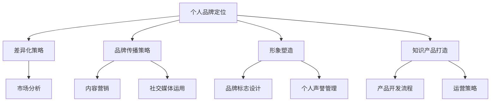
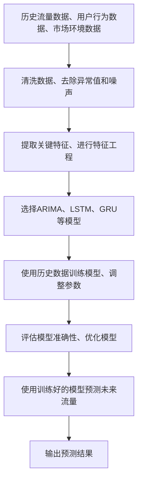

                 

# 《打造个人品牌：程序员的知识付费之路》

## 关键词
个人品牌、知识付费、程序员、品牌建设、在线教育、社交媒体、内容营销

## 摘要
本文旨在探讨程序员如何通过打造个人品牌实现知识付费，从而提升自身价值和职业发展。文章首先介绍了个人品牌的重要性，以及程序员在知识付费领域的机遇和挑战。随后，详细阐述了个人品牌定位、差异化策略、品牌传播、形象塑造等方面的方法和技巧。通过实际案例和项目实战，本文展示了程序员在知识付费中的成功路径，并为未来的发展方向提供了策略建议。

### 《打造个人品牌：程序员的知识付费之路》目录大纲

#### 第一部分：个人品牌与知识付费概述

### 1. 个人品牌的重要性

#### 1.1 个人品牌的概念与构成

##### 1.1.1 个人品牌的定义
个人品牌是指个体在特定领域内通过长期积累形成的一种独特形象和认知。它包括个人的专业能力、人格特质、声誉和社会影响力等多个方面。

##### 1.1.2 个人品牌的核心要素
个人品牌的核心要素包括：专业技能、专业知识、个性魅力、口碑传播和社交媒体影响力。

##### 1.1.3 个人品牌的价值
个人品牌的价值体现在以下几个方面：提升职业竞争力、增加收入来源、扩大人脉关系、提升个人影响力。

#### 1.2 程序员与个人品牌

##### 1.2.1 程序员职业特点
程序员的职业特点包括：技术性强、创新性高、专业性强、知识更新快。

##### 1.2.2 程序员打造个人品牌的优势
程序员在打造个人品牌方面具有以下优势：技术积累丰富、专业知识扎实、易于进行知识传播、市场需求大。

##### 1.2.3 程序员个人品牌案例分析
通过分析一些成功的程序员个人品牌案例，我们可以了解到他们如何通过内容创作、社交媒体运营和知识付费等方式实现个人价值的提升。

### 2. 知识付费的概念与发展

#### 2.1 知识付费的起源与演变

##### 2.1.1 传统知识传播模式
传统知识传播模式主要依赖于教育机构、书籍、讲座等形式，以免费或较低收费为主。

##### 2.1.2 知识付费模式的崛起
随着互联网的发展，知识付费模式逐渐兴起，包括在线课程、知识星球、付费社群等形式。

##### 2.1.3 知识付费的未来趋势
知识付费未来将继续向专业化、个性化、便捷化方向发展，更多新兴平台和模式将涌现。

#### 2.2 程序员参与知识付费的途径

##### 2.2.1 个人知识产品化
程序员可以通过编写技术文章、出版书籍、制作视频教程等方式将个人知识产品化。

##### 2.2.2 在线教育平台入驻
程序员可以在各大在线教育平台开设课程，实现知识付费。

##### 2.2.3 专业社群建立与运营
程序员可以建立专业社群，通过提供价值内容吸引成员付费。

#### 第二部分：个人品牌的打造与维护

### 3. 个人品牌定位与差异化

#### 3.1 定位策略与市场分析

##### 3.1.1 市场细分与目标受众定位
通过市场细分，确定个人品牌的目标受众，从而制定有针对性的定位策略。

##### 3.1.2 竞争对手分析
分析竞争对手的优势和劣势，找出自身的差异化点。

##### 3.1.3 个人品牌差异化策略
根据市场分析和竞争对手分析，制定个人品牌的差异化策略，形成独特竞争力。

#### 3.2 个人品牌传播策略

##### 3.2.1 社交媒体运用
利用社交媒体平台，提高个人品牌曝光度和影响力。

##### 3.2.2 内容营销策略
通过高质量的内容创作和传播，建立个人品牌的权威性和信任度。

##### 3.2.3 个人品牌影响力提升方法
通过演讲、参与行业活动、撰写专业文章等方式提升个人品牌影响力。

#### 3.3 个人品牌的形象塑造

##### 3.3.1 个人形象的包装与设计
从视觉元素、文案风格等方面对个人形象进行包装和设计，形成统一的品牌形象。

##### 3.3.2 个人形象管理
通过言行举止、个人声誉等方面进行管理，维护良好的个人形象。

##### 3.3.3 个人声誉管理
积极应对负面信息，维护个人声誉，建立良好的口碑。

#### 3.4 个人品牌故事构建

##### 3.4.1 品牌故事的重要性
品牌故事能够传递个人品牌的价值观和情感，增强用户认同感。

##### 3.4.2 品牌故事的构建方法
通过讲述个人成长经历、专业成就、行业见解等方面构建品牌故事。

##### 3.4.3 品牌故事的应用与实践
在个人品牌传播和知识付费过程中，运用品牌故事提升用户吸引力。

#### 第三部分：程序员知识付费实战案例

### 4. 程序员知识付费案例解析

#### 4.1 案例一：技术博客写作与变现

##### 4.1.1 技术博客的建立与维护
介绍如何建立技术博客、维护内容和进行SEO优化。

##### 4.1.2 技术博客内容规划与推广
详细讲解技术博客内容规划和推广策略。

##### 4.1.3 技术博客变现途径分析
分析技术博客的多种变现途径，如广告、赞助、会员等。

#### 4.2 案例二：在线教育平台讲师

##### 4.2.1 在线教育平台入驻流程
介绍在线教育平台入驻的流程和注意事项。

##### 4.2.2 课程开发与教学技巧
讲解课程开发流程和教学技巧，提高课程质量。

##### 4.2.3 课程推广与销售策略
分析课程推广和销售策略，实现课程变现。

#### 第四部分：程序员知识付费之路

### 5. 资源整合与能力提升

#### 5.1 资源整合方法

##### 5.1.1 学习资源整合
介绍如何整合学习资源，提高个人技能。

##### 5.1.2 行业资源整合
介绍如何整合行业资源，拓宽人脉和获取行业信息。

##### 5.1.3 媒体资源整合
介绍如何整合媒体资源，提高个人品牌曝光度。

#### 5.2 技能提升途径

##### 5.2.1 技术技能提升
介绍程序员如何通过学习、实践、参与项目等方式提升技术技能。

##### 5.2.2 管理技能提升
介绍程序员如何提升管理技能，如团队协作、项目管理等。

##### 5.2.3 沟通技能提升
介绍程序员如何提升沟通技能，提高工作效率。

### 6. 程序员知识付费的未来趋势

#### 6.1 新兴模式与平台

##### 6.1.1 人工智能辅助教学
介绍人工智能如何辅助程序员进行知识付费。

##### 6.1.2 社交媒体直播教学
介绍社交媒体直播教学的发展趋势和机遇。

##### 6.1.3 区块链赋能知识付费
介绍区块链如何赋能知识付费，提高透明度和信任度。

#### 6.2 个人品牌与知识付费的融合策略

##### 6.2.1 品牌定位与内容创作
介绍如何通过品牌定位进行高质量的内容创作。

##### 6.2.2 品牌传播与用户互动
介绍如何通过品牌传播和用户互动提高个人品牌价值。

##### 6.2.3 品牌变现与商业合作
介绍如何通过品牌变现和商业合作实现长期稳定收益。

### 附录

#### 附录 A：程序员知识付费资源汇总

##### A.1 技术博客推荐
推荐一些优秀的技术博客，供程序员参考。

##### A.2 在线教育平台推荐
推荐一些优质的在线教育平台，供程序员选择。

##### A.3 社群与论坛推荐
推荐一些活跃的程序员社群和论坛，供程序员交流和学习。

#### 附录 B：个人品牌与知识付费工具指南

##### B.1 社交媒体工具使用
介绍一些常用的社交媒体工具，帮助程序员进行个人品牌建设。

##### B.2 内容创作工具使用
介绍一些内容创作工具，提高程序员的内容创作效率。

##### B.3 数据分析与营销工具使用
介绍一些数据分析和营销工具，帮助程序员进行数据驱动决策。

**Mermaid 流程图：个人品牌建设流程**



**核心算法原理讲解：知识付费流量预测算法（伪代码）**

```markdown
算法：知识付费流量预测

输入：历史流量数据、用户行为数据、市场环境数据

输出：预测流量结果

步骤：
1. 数据预处理：
   - 清洗数据，去除异常值和噪声
   - 特征工程，提取关键特征

2. 模型选择：
   - 选择合适的流量预测模型，如 ARIMA、LSTM、GRU 等

3. 模型训练：
   - 使用历史流量数据训练模型
   - 调整模型参数，优化模型性能

4. 流量预测：
   - 使用训练好的模型预测未来流量

5. 结果分析：
   - 对预测结果进行分析，评估模型准确性
   - 调整模型或特征工程策略，提高预测精度

伪代码示例：

```
function knowledgePaymentTrafficPrediction(historicalData, userBehaviorData, marketData):
    # 数据预处理
    processedData = preprocessData(historicalData, userBehaviorData, marketData)

    # 模型选择
    model = selectModel(processedData)

    # 模型训练
    trainedModel = trainModel(model, processedData)

    # 流量预测
    predictedTraffic = predictTraffic(trainedModel)

    # 结果分析
    analyzePrediction(predictedTraffic)

    return predictedTraffic
```

**数学模型和数学公式：知识付费转化率计算**

$$
\text{转化率} = \frac{\text{付费用户数}}{\text{总用户数}} \times 100\%
$$

$$
\text{预期付费金额} = \text{付费用户数} \times \text{平均付费金额}
$$

**项目实战：构建一个简单的个人品牌网站**

1. 开发环境搭建
   - 安装 Node.js、npm、Webpack 等
   - 创建项目文件夹，初始化项目

2. 网站架构设计
   - 设计网站基本架构，如首页、关于我、博客、联系我等页面

3. 前端开发
   - 使用 React、Vue 等框架进行前端开发
   - 实现页面布局和交互功能

4. 后端开发
   - 使用 Node.js、Express 等进行后端开发
   - 实现用户认证、内容管理等接口

5. 网站部署
   - 使用 GitHub Pages、Netlify 等进行网站部署
   - 设置域名解析，确保网站可访问

6. 网站优化
   - 进行 SEO 优化，提高网站在搜索引擎中的排名
   - 分析网站流量，调整页面内容和布局

7. 持续更新
   - 定期更新博客内容，增加网站流量
   - 跟进用户反馈，优化用户体验

**代码解读与分析：使用 JavaScript 实现简单博客评论系统**

```javascript
// 引入必要的模块
const express = require('express');
const app = express();
const mongoose = require('mongoose');
const bodyParser = require('body-parser');

// 设置数据库连接
const db = mongoose.connect('mongodb://localhost:27017/blogDB', {
  useNewUrlParser: true,
  useUnifiedTopology: true,
});

// 定义评论模型
const Comment = mongoose.model('Comment', new mongoose.Schema({
  author: String,
  content: String,
  timestamp: { type: Date, default: Date.now },
}));

// 解析请求数据
app.use(bodyParser.json());
app.use(bodyParser.urlencoded({ extended: true }));

// 评论接口
app.post('/api/comments', async (req, res) => {
  try {
    const comment = new Comment(req.body);
    await comment.save();
    res.status(201).send(comment);
  } catch (error) {
    res.status(500).send(error);
  }
});

app.get('/api/comments', async (req, res) => {
  try {
    const comments = await Comment.find();
    res.status(200).send(comments);
  } catch (error) {
    res.status(500).send(error);
  }
});

// 启动服务器
const PORT = process.env.PORT || 3000;
app.listen(PORT, () => {
  console.log(`Server is running on port ${PORT}`);
});

解读：
- 引入必要的模块，包括 express、mongoose 和 bodyParser。
- 设置数据库连接，使用 MongoDB。
- 定义评论模型，包含作者、内容和时间戳。
- 使用 express 框架创建 API 接口，实现评论的增删改查。
- 使用 async/await 语法处理异步请求，提高代码可读性。

通过以上代码，可以搭建一个简单的博客评论系统，用户可以通过接口提交评论，管理员可以查询所有评论。这是一个基础的实现，实际项目中需要更多的功能，如评论审核、分页等。```## 1. 个人品牌的重要性

### 1.1 个人品牌的定义与构成

个人品牌，即个人在特定领域内通过长期积累和塑造形成的一种独特形象和认知。它不仅包括个人的专业技能和知识，还涵盖了个性魅力、声誉、社交影响力等多个方面。个人品牌的核心要素可以分为以下几部分：

1. **专业技能**：个人在某个领域内的专业能力，如编程、设计、市场分析等。专业技能是个人品牌的基础，能够直接体现个人的价值。

2. **专业知识**：个人在特定领域的深层次理解和研究，包括但不限于行业趋势、前沿技术、实践经验等。专业知识有助于提升个人在行业内的地位和影响力。

3. **个性魅力**：个人的性格特质、兴趣爱好、行为习惯等，这些因素可以影响他人对个人的认知和评价。个性魅力是个人品牌的软实力，有助于建立良好的人际关系。

4. **口碑传播**：个人在行业内外的声誉，包括同事、客户、合作伙伴等对个人的评价。良好的口碑可以增强个人品牌的可信度和吸引力。

5. **社交媒体影响力**：个人在社交媒体平台上的粉丝数量、互动频率、内容影响力等。社交媒体影响力是现代个人品牌建设中不可或缺的一部分，能够扩大个人的影响力范围。

个人品牌的构成要素相互关联，共同塑造了个人在特定领域内的形象。专业技能和专业知识是个人品牌的基石，决定了个人在行业内的专业水平和竞争力；个性魅力和口碑传播则增强了个人品牌的吸引力，使其更具亲和力；社交媒体影响力则进一步扩大了个人品牌的影响范围。

### 1.2 个人品牌的价值

个人品牌的价值在于它能够显著提升个人的职业竞争力、增加收入来源、扩大人脉关系以及提升个人影响力。以下是对个人品牌价值的详细分析：

#### 职业竞争力

一个强有力的个人品牌意味着个人在行业内的知名度和认可度较高，这使得个人在求职或职业晋升时具有明显优势。雇主在招聘时会更加倾向于选择有个人品牌的人才，因为他们相信这些人才具有更高的专业技能和专业知识。此外，个人品牌有助于树立专业形象，使个人在职业发展中更容易脱颖而出。

#### 收入来源

个人品牌不仅提升了职业竞争力，还直接增加了个人的收入来源。首先，个人品牌有助于提升薪资水平。具有知名个人品牌的专业人士往往能够获得更高的薪酬。其次，个人品牌可以为个人带来额外的收入来源，如咨询费、演讲费、课程费等。许多专业人士通过在线教育平台、知识星球等渠道，将自己的专业知识变现，实现收入多元化。

#### 扩大人脉关系

个人品牌有助于扩大人脉关系，建立广泛而有力的人际网络。通过个人品牌建设，个人可以吸引志同道合的人加入，共同交流、合作。同时，个人品牌也为个人提供了更多的社交机会，如行业活动、研讨会、讲座等。这些机会有助于个人拓展人脉，建立有价值的联系，从而在职业发展中受益。

#### 提升个人影响力

个人品牌的建设使得个人在行业内拥有更高的声誉和影响力。这种影响力不仅体现在专业领域，还可以扩展到更广泛的领域。个人品牌使得个人在社交网络、行业活动、媒体采访等方面具有更大的话语权，能够通过自己的观点和见解影响他人。此外，个人品牌还可以提升个人在公众中的认知度，使其成为行业内的意见领袖。

### 1.3 程序员与个人品牌

#### 程序员职业特点

程序员的职业特点主要包括技术性强、创新性高、专业性强和知识更新快。这些特点使得程序员在个人品牌建设方面具有独特的优势：

1. **技术性强**：程序员需要掌握多种编程语言、开发框架和工具，具备较强的技术能力。这种技术能力是个人品牌建设的重要基础。

2. **创新性高**：程序员常常需要在项目中创新解决方案，不断探索新技术和新方法。创新性有助于提升个人在行业内的地位和影响力。

3. **专业性强**：程序员在某一领域内可能具有深厚的专业知识，这使得个人品牌更具专业性和权威性。

4. **知识更新快**：编程技术和工具不断更新，程序员需要不断学习新知识，保持技术领先。这种快速更新的知识库有助于个人在行业内保持竞争力。

#### 程序员打造个人品牌的优势

1. **知识传播便捷**：程序员可以通过博客、GitHub、在线课程等多种方式，将自己的知识传播给更多人。这为个人品牌建设提供了丰富的内容素材。

2. **内容创作优势**：程序员擅长编写技术文章、编写代码、制作教程等，这些内容创作能力有助于个人在社交媒体和知识平台上吸引关注。

3. **市场需求大**：随着互联网和数字化的发展，程序员的需求持续增长。个人品牌可以帮助程序员在市场上脱颖而出，获得更多机会。

4. **合作机会多**：个人品牌有助于程序员与行业内的其他专业人士建立联系，拓展合作机会。例如，与咨询公司、创业公司等合作，参与项目开发、技术咨询等。

#### 程序员个人品牌案例分析

通过以下几个程序员的个人品牌案例，我们可以看到他们在不同领域和平台上的成功：

1. **案例一：GitHub上的知名程序员**
   - **个人品牌**：某程序员在GitHub上拥有大量高质量的代码和项目，成为该平台上的知名开发者。
   - **成果**：该程序员受邀成为多个开源项目的贡献者，获得了业界认可和关注。
   - **经验**：通过持续贡献代码，积极参与开源项目，提升个人品牌。

2. **案例二：在线教育平台讲师**
   - **个人品牌**：某程序员在某个在线教育平台开设课程，成为该平台的知名讲师。
   - **成果**：该讲师的课程吸引了大量学员，实现了知识变现。
   - **经验**：通过高质量的课程内容、互动式教学和良好的口碑，建立个人品牌。

3. **案例三：技术博客博主**
   - **个人品牌**：某程序员运营自己的技术博客，分享技术心得和实战经验。
   - **成果**：该博客吸引了大量读者，成为行业内的热门技术博客。
   - **经验**：通过持续更新高质量内容、积极互动和推广，提升个人品牌。

这些案例表明，程序员通过多种方式打造个人品牌，不仅提升了自身价值，还在职业发展中获得了更多的机会。程序员在个人品牌建设过程中，应充分发挥自身的技术优势，不断创新和提升，以实现长期发展。

### 1.4 个人品牌建设的重要性

个人品牌建设对于程序员的重要性不可忽视，它不仅有助于提升个人的职业竞争力，还能为个人带来多方面的收益。以下是个人品牌建设的重要性及其对程序员的影响：

1. **提升职业竞争力**：在竞争激烈的就业市场中，个人品牌能够显著提升程序员的职业竞争力。一个强有力的个人品牌意味着个人在行业内的知名度和认可度较高，这使得个人在求职或职业晋升时具有明显优势。雇主在招聘时会更加倾向于选择有个人品牌的人才，因为他们相信这些人才具有更高的专业技能和专业知识。此外，个人品牌有助于树立专业形象，使个人在职业发展中更容易脱颖而出。

2. **增加收入来源**：个人品牌不仅提升了职业竞争力，还直接增加了个人的收入来源。首先，个人品牌有助于提升薪资水平。具有知名个人品牌的专业人士往往能够获得更高的薪酬。其次，个人品牌可以为个人带来额外的收入来源，如咨询费、演讲费、课程费等。许多专业人士通过在线教育平台、知识星球等渠道，将自己的专业知识变现，实现收入多元化。例如，某知名程序员通过开设在线课程，吸引了大量学员，从而实现了知识变现和收入的增加。

3. **扩大人脉关系**：个人品牌有助于扩大人脉关系，建立广泛而有力的人际网络。通过个人品牌建设，个人可以吸引志同道合的人加入，共同交流、合作。同时，个人品牌也为个人提供了更多的社交机会，如行业活动、研讨会、讲座等。这些机会有助于个人拓展人脉，建立有价值的联系，从而在职业发展中受益。例如，某程序员通过在社交媒体上分享技术见解，吸引了大量同行关注，进而建立了广泛的行业人脉。

4. **提升个人影响力**：个人品牌的建设使得个人在行业内拥有更高的声誉和影响力。这种影响力不仅体现在专业领域，还可以扩展到更广泛的领域。个人品牌使得个人在社交网络、行业活动、媒体采访等方面具有更大的话语权，能够通过自己的观点和见解影响他人。此外，个人品牌还可以提升个人在公众中的认知度，使其成为行业内的意见领袖。例如，某程序员通过在技术博客上分享专业文章，成为业内的知名博主，吸引了大量粉丝和读者。

5. **职业发展机会**：个人品牌建设为程序员提供了更多的职业发展机会。一个强有力的个人品牌意味着个人在行业内拥有更高的知名度和认可度，这使得个人更容易获得更好的职业机会，如高级职位、重要项目等。此外，个人品牌还可以为个人吸引更多的合作机会，如与创业公司、咨询公司等合作，参与项目开发、技术咨询等。这些机会有助于个人在职业道路上实现更大的发展和突破。

6. **知识传播与分享**：个人品牌建设有助于程序员更好地传播和分享自己的知识和经验。通过个人品牌，程序员可以更加自信地分享自己的技术见解和实战经验，帮助他人解决问题，同时也提升了自己的专业水平。这种知识传播与分享不仅有助于个人品牌的建立，还能为整个行业的发展做出贡献。

综上所述，个人品牌建设对于程序员的重要性不言而喻。它不仅能够提升个人的职业竞争力，还能为个人带来多方面的收益，如增加收入来源、扩大人脉关系、提升个人影响力等。因此，程序员应重视个人品牌建设，通过不断学习、创新和实践，打造出属于自己的强大个人品牌。

### 2. 知识付费的起源与演变

知识付费是一种随着互联网和信息技术发展而逐渐兴起的商业模式，它改变了传统知识传播的免费模式，通过让知识持有者将知识产品化，从而实现商业价值的最大化。为了更好地理解知识付费的起源和演变，我们可以将其分为几个关键阶段：

#### 2.1.1 传统知识传播模式

在互联网和移动互联网普及之前，知识传播主要依赖于教育机构、书籍、讲座、研讨会等形式。这些传统模式通常以免费或较低收费为主，例如公立学校的课程、图书馆的书籍、专家的讲座等。这些模式有其局限性，如传播范围有限、知识获取成本高、知识更新滞后等。

#### 2.1.2 知识付费模式的崛起

随着互联网技术的发展，尤其是移动互联网的普及，知识付费模式开始崛起。这一模式的核心是通过互联网平台，让知识持有者将专业知识、经验和技术转化为产品或服务，向消费者进行有偿提供。知识付费模式的兴起可以追溯到2000年代中后期，当时一些在线教育平台如Coursera、Udemy等开始出现，这些平台为用户提供了付费学习的机会。

#### 2.1.3 知识付费的未来趋势

知识付费的未来将继续向专业化、个性化、便捷化方向发展。以下是一些未来趋势：

1. **专业化**：随着知识经济的深入发展，专业知识和技能的需求将更加突出。知识付费平台将更加注重专业内容的提供，为用户提供更加深入和专业的知识服务。

2. **个性化**：随着大数据和人工智能技术的发展，知识付费将更加注重个性化服务。平台将根据用户的学习习惯、兴趣和需求，提供定制化的学习内容和服务。

3. **便捷化**：知识付费将更加便捷，用户可以随时随地进行学习。在线教育、直播教学、移动学习等模式将继续发展，为用户带来更加便捷的学习体验。

#### 2.2 程序员参与知识付费的途径

程序员作为知识密集型职业群体，具有丰富的专业知识和技术积累，他们可以通过多种途径参与知识付费，实现个人价值的提升和商业变现。以下是几种常见的程序员参与知识付费的途径：

##### 2.2.1 个人知识产品化

程序员可以将自己的专业知识和技术经验转化为知识产品，如技术文章、电子书、视频教程等。这些产品可以通过在线平台进行销售，例如博客、GitHub、知识星球等。程序员可以通过不断更新和维护这些知识产品，吸引更多的用户和粉丝，从而实现知识变现。

##### 2.2.2 在线教育平台入驻

程序员可以在各大在线教育平台开设课程，如Udemy、网易云课堂、慕课网等。通过这些平台，程序员可以将自己的专业知识和技能进行系统化教学，为学员提供高质量的课程内容。在线教育平台提供了丰富的教学资源和互动功能，有助于程序员提升教学效果和学员满意度。

##### 2.2.3 专业社群建立与运营

程序员可以建立专业的技术社群，通过提供价值内容吸引成员付费。社群可以是线上的，也可以是线下的，例如微信群、QQ群、技术论坛等。在社群中，程序员可以分享技术见解、解答成员问题、组织技术交流等活动，从而建立个人品牌和影响力。通过社群运营，程序员可以吸引更多成员加入，实现知识付费。

##### 2.2.4 技术咨询服务

程序员可以利用自己的专业技能提供技术咨询服务，如软件开发、系统架构设计、性能优化等。通过线上或线下的方式，程序员可以为企业和个人提供专业咨询和技术支持，从而实现知识变现。技术咨询服务不仅可以提升程序员的专业水平，还可以为程序员带来额外的收入。

##### 2.2.5 技术大赛和黑客松

程序员可以通过参与技术大赛和黑客松等活动，展示自己的技术能力和创新思维。这些活动不仅能够提升程序员的知名度，还可以为程序员带来商业合作和投资机会。例如，某些成功的黑客松项目甚至可以转化为实际的投资机会，从而实现知识付费和商业成功。

#### 2.3 程序员在知识付费领域的机遇和挑战

虽然程序员在知识付费领域拥有众多机遇，但也面临一些挑战：

1. **机遇**：
   - **市场需求大**：随着互联网和数字化的发展，程序员的专业知识和技能需求持续增长，为程序员提供了广阔的市场空间。
   - **变现能力强**：程序员的知识和技能可以通过多种途径进行变现，如知识产品销售、在线教育、咨询服务等。
   - **提升个人品牌**：通过知识付费，程序员可以提升个人在行业内的知名度和影响力，建立强大的个人品牌。

2. **挑战**：
   - **竞争激烈**：知识付费领域竞争激烈，程序员需要不断提升自己的专业水平，以在市场上脱颖而出。
   - **内容质量要求高**：程序员提供的内容需要具备高质量和实用性，以满足用户的需求。
   - **时间管理困难**：程序员需要在工作和个人品牌建设之间进行平衡，合理分配时间和精力。

综上所述，程序员在知识付费领域具有广阔的发展空间和机遇，但也需要面对激烈的竞争和挑战。通过不断提升专业水平、创新内容和优化服务，程序员可以在知识付费领域取得成功，实现个人价值和商业变现。

### 3. 个人品牌定位与差异化

#### 3.1 定位策略与市场分析

个人品牌的定位是个人品牌建设中的关键步骤，它决定了个人品牌在市场中的定位和受众群体。一个清晰的定位策略有助于个人在市场中脱颖而出，吸引目标受众。以下是如何进行定位策略与市场分析的步骤：

1. **市场细分与目标受众定位**
   - **市场细分**：首先，要对市场进行细分，识别出不同细分市场。例如，在技术领域，可以根据技术方向（如前端开发、后端开发、数据分析等）和行业应用（如金融科技、电子商务、医疗健康等）进行细分。
   - **目标受众定位**：在市场细分的基础上，确定个人品牌的目标受众。目标受众应具备以下特征：有明确的需求、对个人品牌的主题内容感兴趣、具备支付能力。例如，如果个人品牌定位为前端开发专家，目标受众可以是有前端开发需求的企业、开发者社区和前端爱好者。

2. **竞争对手分析**
   - **识别竞争对手**：通过市场调研，识别出在相同或相似定位的个人品牌和公司。竞争对手可以是同行业的专家、知名的教育机构、在线课程平台等。
   - **分析竞争对手的优势和劣势**：分析竞争对手的优势和劣势，包括他们的专业领域、课程内容、营销策略、用户评价等。这有助于找出自身的差异化点，从而制定更具竞争力的定位策略。

3. **个人品牌差异化策略**
   - **差异化定位**：在分析竞争对手的基础上，确定个人品牌的差异化定位。差异化定位可以基于以下方面：
     - **专业知识**：在某一细分领域具有深厚的专业知识，成为该领域的专家。
     - **教学风格**：具有独特的教学风格，如幽默风趣、深入浅出、互动性强等。
     - **实践案例**：提供丰富的实践案例和实战经验，使内容更具实用性和说服力。
     - **用户体验**：提供优质的用户体验，如课程设计合理、售后服务周到等。

#### 3.2 个人品牌传播策略

个人品牌的传播策略是实现品牌影响力和知名度的重要手段。以下是一些有效的个人品牌传播策略：

1. **社交媒体运用**
   - **选择合适的平台**：根据目标受众的特点，选择合适的社交媒体平台，如LinkedIn、Twitter、微信、微博等。
   - **发布高质量内容**：定期发布高质量的内容，如技术文章、教程、行业见解等，吸引粉丝和关注。
   - **互动与回应**：积极参与平台上的讨论，回应粉丝和读者的提问，建立良好的互动关系。

2. **内容营销策略**
   - **内容创作**：创作有价值的、具有吸引力的内容，如技术博客、视频教程、电子书等。
   - **内容分发**：通过多个渠道分发内容，如个人网站、博客、社交媒体、在线教育平台等。
   - **SEO优化**：进行搜索引擎优化（SEO），提高内容在搜索引擎中的排名，增加曝光度。

3. **个人品牌影响力提升方法**
   - **参与行业活动**：参与行业会议、研讨会、讲座等活动，提升个人在行业内的知名度。
   - **撰写专业文章**：在知名技术博客、行业媒体上撰写专业文章，提升个人品牌的专业形象。
   - **建立专业社群**：建立专业社群，如微信群、QQ群、技术论坛等，为行业人士提供一个交流和学习的平台。

#### 3.3 个人品牌的形象塑造

个人品牌形象是个人品牌的重要组成部分，它直接影响着受众对个人的认知和评价。以下是如何塑造个人品牌形象的方法：

1. **个人形象的包装与设计**
   - **视觉元素设计**：设计统一的视觉元素，如个人品牌标志、头像、背景图片等，确保在各种平台上的一致性。
   - **文案风格设计**：制定统一的文案风格，包括语言风格、表达方式等，使内容更具个性和特色。

2. **个人形象管理**
   - **言行一致**：确保个人在公共场合的言行与个人品牌形象相符，避免出现矛盾和负面信息。
   - **形象维护**：定期检查和维护个人品牌形象，如删除不良评论、应对负面报道等。

3. **个人声誉管理**
   - **积极应对负面信息**：面对负面信息，要采取积极的态度，通过解释、澄清等方式进行应对。
   - **建立良好的口碑**：通过提供优质的服务、高质量的内容，赢得用户的信任和好评，建立良好的口碑。

#### 3.4 个人品牌故事构建

个人品牌故事是个人品牌的灵魂，它能够传递个人的价值观、经历和成就，增强用户的认同感和情感连接。以下是如何构建个人品牌故事的方法：

1. **品牌故事的重要性**
   - **增强认同感**：品牌故事能够传递个人的价值观和生活态度，使受众更容易产生认同感。
   - **建立情感连接**：品牌故事通过讲述个人的成长经历和成就，能够与受众建立情感连接，增加品牌黏性。
   - **提升品牌形象**：一个精彩的品牌故事能够提升个人品牌的专业形象和魅力。

2. **品牌故事的构建方法**
   - **挖掘核心价值**：找出个人品牌的核心价值，如专业知识、创新精神、坚持不懈等，作为品牌故事的核心。
   - **讲述个人经历**：通过讲述个人的成长经历、重要成就和经历的故事，使品牌故事更具真实感和吸引力。
   - **展示专业能力**：在品牌故事中展示个人的专业能力和成就，增强品牌的专业形象。

3. **品牌故事的应用与实践**
   - **社交媒体宣传**：在社交媒体上分享个人品牌故事，增加粉丝和关注者的互动。
   - **内容创作**：将品牌故事融入内容创作中，如博客文章、视频教程、电子书等，提升内容的吸引力和影响力。
   - **演讲和讲座**：在行业活动、研讨会、讲座等场合讲述个人品牌故事，提升个人在行业内的知名度和影响力。

### 4. 程序员知识付费案例解析

#### 4.1 案例一：技术博客写作与变现

技术博客是程序员进行知识付费的一种常见方式。通过撰写高质量的技术博客，程序员可以吸引粉丝和读者，进而实现知识变现。以下是一个技术博客写作与变现的成功案例解析：

**背景**：某程序员A是一名有10年工作经验的前端开发者，擅长React和Vue.js框架。他在某个知名技术博客平台开设了自己的博客，定期发布技术文章和教程。

**步骤**：

1. **内容创作**：A先生首先确定了博客的定位，专注于前端开发领域。他通过学习、实践和总结，不断创作高质量的技术文章，如《React高效开发技巧》、《Vue.js实战教程》等。

2. **SEO优化**：为了提高博客的曝光度，A先生对文章进行SEO优化，如关键词研究、标题优化、内链建设等。这些策略使得他的博客在搜索引擎中排名不断提升。

3. **互动与推广**：A先生积极参与行业讨论，回复读者评论，并通过社交媒体平台（如微博、GitHub等）推广博客内容，吸引更多读者。

4. **知识变现**：随着博客访问量的增加，A先生开始尝试通过博客变现。他通过以下几种方式实现知识变现：
   - **广告收入**：博客平台提供了广告服务，A先生通过博客广告获得了一定的收入。
   - **会员订阅**：A先生推出会员订阅服务，提供独家教程、视频课程和专属答疑等服务，会员费用每月100元。
   - **赞助合作**：一些企业看到A先生的博客影响力后，主动与他合作，进行品牌赞助和推广。

**成果**：

1. **粉丝和读者增加**：A先生的博客从最初的几百读者，逐步发展到几千甚至上万的粉丝和读者。

2. **收入增加**：通过博客广告、会员订阅和赞助合作，A先生每个月的收入稳定在数千元。

3. **个人品牌提升**：随着博客影响力的增加，A先生在行业内逐渐树立了自己的个人品牌，成为前端开发领域的一名知名专家。

**经验与启示**：

1. **内容为王**：高质量的内容是博客成功的关键。A先生通过持续创作高质量的技术文章，吸引了大量读者。

2. **SEO优化**：合理的SEO策略可以提高博客的曝光度，吸引更多潜在读者。

3. **互动与推广**：与读者的互动和推广是提高博客影响力的重要手段。A先生通过社交媒体和行业讨论，增加了博客的访问量和知名度。

4. **多种变现途径**：通过广告、会员订阅、赞助合作等多种途径，可以实现博客的知识变现，增加收入。

#### 4.2 案例二：在线教育平台讲师

在线教育平台是程序员进行知识付费的另一个重要渠道。通过在线教育平台，程序员可以开设课程，将自己的专业知识系统化地传授给学员。以下是一个在线教育平台讲师的成功案例解析：

**背景**：某程序员B是一名有8年工作经验的Python开发者，擅长数据分析和机器学习。他在某个知名的在线教育平台开设了Python数据分析和机器学习课程。

**步骤**：

1. **课程规划**：B先生首先确定了课程的定位，专注于Python数据分析和机器学习领域。他结合自己的实战经验，设计了系统的课程内容，从基础概念到高级应用，涵盖了多个主题。

2. **课程制作**：B先生通过录制视频教程、编写教材、设计练习题等方式，将课程内容制作成高质量的教学资源。

3. **平台入驻**：B先生通过在线教育平台的入驻流程，成功入驻该平台。平台提供了课程发布、销售、学员管理等一系列工具和服务。

4. **营销推广**：B先生通过社交媒体、博客、微信群等渠道，宣传自己的课程，吸引潜在学员。

5. **学员互动**：B先生在课程中设置了问答环节和讨论区，鼓励学员提问和交流，提高学员的学习体验。

**成果**：

1. **学员增加**：B先生的课程吸引了大量学员，课程销量稳步提升。

2. **收入增加**：通过课程销售和学员付费问答，B先生每个月的收入稳定在万元左右。

3. **个人品牌提升**：随着课程的受欢迎程度提高，B先生在行业内逐渐树立了自己的个人品牌，成为数据分析和机器学习领域的一名知名专家。

**经验与启示**：

1. **课程规划**：系统化的课程内容是吸引学员的关键。B先生通过详细的课程规划，提供了有价值的教学资源。

2. **高质量教学资源**：视频教程、教材、练习题等教学资源是课程成功的基础。B先生通过高质量的教学资源，提高了学员的学习效果。

3. **营销推广**：有效的营销推广是提高课程销量的重要手段。B先生通过多种渠道宣传课程，增加了课程的影响力和知名度。

4. **学员互动**：良好的学员互动可以提高学员的学习体验和满意度，有助于提高课程的口碑和销量。B先生通过设置问答环节和讨论区，增强了学员的参与感。

#### 4.3 案例三：知识星球创始人

知识星球是一种付费的知识分享平台，程序员可以通过创建星球，分享专业知识和经验，吸引付费用户。以下是一个知识星球创始人的成功案例解析：

**背景**：某程序员C是一名有10年工作经验的全栈开发者，擅长前端和后端开发。他在一个知识星球平台创建了名为“前端开发实战”的星球。

**步骤**：

1. **星球定位**：C先生首先确定了星球的定位，专注于前端开发领域的实战分享。他希望通过星球，为前端开发者提供一个交流和学习的平台。

2. **内容创建**：C先生通过撰写技术文章、发布教程、组织线上讨论等方式，持续为星球提供高质量的内容。

3. **用户互动**：C先生积极与星球用户互动，回答用户提问，组织线上技术讨论，增强用户参与感。

4. **付费机制**：C先生设置了星球的付费机制，用户需要付费才能加入星球，享受会员权益。

5. **营销推广**：C先生通过社交媒体、微信群等渠道，宣传自己的星球，吸引潜在用户。

**成果**：

1. **用户增加**：C先生的星球吸引了大量前端开发者加入，用户数量稳步增长。

2. **收入增加**：通过星球的付费机制，C先生每个月的收入稳定在万元左右。

3. **个人品牌提升**：随着星球的受欢迎程度提高，C先生在行业内逐渐树立了自己的个人品牌，成为前端开发领域的一名知名专家。

**经验与启示**：

1. **高质量内容**：高质量的内容是星球成功的关键。C先生通过持续提供有价值的技术文章和教程，吸引了大量用户。

2. **用户互动**：积极的用户互动可以提高用户满意度和参与感，增强星球的凝聚力。C先生通过组织线上讨论和回答用户提问，增强了用户参与感。

3. **付费机制**：合理的付费机制可以确保用户质量，提高收入。C先生通过设置星球的付费机制，实现了知识变现。

4. **营销推广**：有效的营销推广是提高星球知名度的重要手段。C先生通过多种渠道宣传星球，增加了星球的用户数量。

### 5. 资源整合与能力提升

#### 5.1 资源整合方法

资源整合是程序员在知识付费过程中至关重要的一环。通过有效的资源整合，程序员可以提升个人技能、扩大人脉、提高工作效率，从而在知识付费领域取得更大的成功。以下是几种常见的资源整合方法：

1. **学习资源整合**
   - **在线课程和教程**：利用各大在线教育平台（如网易云课堂、慕课网、Coursera等）提供的高质量课程和教程，学习前沿技术和知识。
   - **技术博客和论坛**：关注知名技术博客和论坛（如CSDN、GitHub、Stack Overflow等），阅读技术文章、教程和解决方案，吸收行业知识。
   - **电子书和资料库**：下载和收藏有价值的电子书和资料库，如技术文档、编程书籍、开源项目等，作为学习和参考的资料。

2. **行业资源整合**
   - **行业报告和分析**：定期阅读行业报告和分析，了解行业趋势、技术发展和市场动态，把握行业脉搏。
   - **行业活动和会议**：参加行业活动、研讨会和会议，结识行业专家和同行，拓展人脉，获取最新的行业信息。
   - **合作与交流**：与同行建立合作与交流机制，通过共享资源、共同研究和项目合作，实现优势互补和资源整合。

3. **媒体资源整合**
   - **社交媒体**：利用社交媒体平台（如微博、微信、LinkedIn等）关注行业专家、同行和知名企业，获取行业动态和资讯。
   - **新闻和媒体**：关注专业媒体和新闻网站，了解行业热点和重大事件，提高自身的媒体敏感度和信息获取能力。
   - **博客和专栏**：撰写和发表技术博客和专栏文章，分享自己的知识和经验，提升个人品牌和知名度。

#### 5.2 技能提升途径

技能提升是程序员在知识付费过程中不可或缺的一部分。通过不断学习和实践，程序员可以提升个人技能，增强在知识付费领域的竞争力。以下是几种常见的技能提升途径：

1. **自我学习**
   - **在线课程和教程**：参加在线课程和教程，学习编程语言、框架、工具等基础知识和最新技术。
   - **阅读书籍和资料**：阅读经典编程书籍、技术文档和行业报告，深入了解技术和行业知识。
   - **实践项目**：通过实际项目开发和编程练习，提高编程能力和实战经验。

2. **实践项目**
   - **开源项目**：参与开源项目，与其他开发者合作，共同开发、维护项目，提升团队协作能力和项目管理能力。
   - **个人项目**：独立完成个人项目，从需求分析、设计、开发到测试，全面锻炼项目开发能力。
   - **竞赛和挑战**：参加编程竞赛和技术挑战，通过解决实际问题，提高技术水平和解决问题的能力。

3. **技术交流**
   - **技术社区和论坛**：积极参与技术社区和论坛的讨论，与其他开发者交流技术心得和经验，学习新技术和解决方案。
   - **研讨会和讲座**：参加技术研讨会和讲座，听取行业专家的讲解和分享，了解行业前沿技术和趋势。
   - **内部培训**：组织或参加内部技术培训和分享会，提升团队整体技能水平。

4. **证书和认证**
   - **专业认证**：通过考取相关认证（如PMP、CISSP等），证明个人在特定领域的专业能力和知识水平。
   - **技能竞赛**：参加技能竞赛，如编程比赛、黑客松等，提升技能水平，增加实际项目经验。

通过以上方法，程序员可以全面提高自己的技能水平，为知识付费事业打下坚实的基础。

### 6. 程序员知识付费的未来趋势

随着互联网和人工智能技术的不断发展，程序员知识付费领域将呈现出新的趋势。以下是对未来趋势的分析和预测：

#### 6.1 新兴模式与平台

1. **人工智能辅助教学**：人工智能技术在教育领域的应用将越来越广泛。通过人工智能算法，平台可以为学习者提供个性化学习路径、智能推荐课程和实时反馈。例如，使用自然语言处理技术，AI可以解析学习者的提问，提供准确的技术解答和指导。

2. **社交媒体直播教学**：直播教学作为一种新兴的教育模式，将在程序员知识付费领域得到更多应用。通过社交媒体平台，程序员可以实时与学员互动，解答疑问，分享技术见解和实战经验。这种模式不仅能够提高学员的学习体验，还能增加课程互动性和参与度。

3. **区块链赋能知识付费**：区块链技术将提高知识付费的透明度和信任度。通过区块链，知识付费平台可以确保知识产品的所有权和交易记录不可篡改，从而增强用户对平台的信任。此外，区块链技术还可以用于智能合约，自动执行知识付费交易，提高交易效率。

#### 6.2 个人品牌与知识付费的融合策略

1. **品牌定位与内容创作**：在知识付费过程中，个人品牌定位至关重要。程序员应明确自己的专业方向和受众群体，创作有针对性的高质量内容。通过品牌定位，程序员可以建立专业形象，吸引更多的学员和粉丝。

2. **品牌传播与用户互动**：个人品牌传播是提升知名度和影响力的关键。程序员可以通过社交媒体、博客、线下活动等多种渠道传播个人品牌。同时，与用户保持互动，了解用户需求，提供个性化服务，增强用户忠诚度。

3. **品牌变现与商业合作**：个人品牌不仅可以提升收入，还可以为程序员带来更多的商业合作机会。通过个人品牌，程序员可以与相关企业、教育机构合作，共同开发课程、举办活动，实现知识变现和商业成功。

#### 6.3 未来发展方向的预测

1. **知识付费专业化**：随着用户对知识需求的不断提升，知识付费将更加专业化。程序员需要不断更新自己的专业知识，提供更具深度和实用性的课程和内容。

2. **个性化学习体验**：人工智能和大数据技术的发展将推动个性化学习体验的实现。平台可以通过分析用户数据，为用户提供个性化的学习路径、课程推荐和辅导服务。

3. **平台生态化**：知识付费平台将逐渐形成生态系统，包括课程开发、教学服务、用户互动、商业合作等多个环节。平台将通过生态化的运营模式，为程序员提供全方位的支持和服务。

4. **跨界融合**：知识付费将与其他领域（如艺术、设计、医疗等）跨界融合，形成新的知识付费场景。程序员可以通过跨学科的知识整合，为更多行业提供专业的解决方案。

总之，程序员知识付费的未来将充满机遇和挑战。通过紧跟新兴模式与平台的发展，融合个人品牌与知识付费，程序员可以在这个领域取得更大的成功。

### 附录

#### 附录 A：程序员知识付费资源汇总

**A.1 技术博客推荐**

1. **CSDN**：国内领先的技术博客平台，提供丰富的技术文章、教程和问答。
2. **博客园**：专注于程序员的技术博客平台，涵盖多个技术领域。
3. **掘金**：专注于前端开发的技术博客，提供高质量的前端教程和行业动态。

**A.2 在线教育平台推荐**

1. **网易云课堂**：提供丰富的在线课程，涵盖编程、数据科学、人工智能等多个领域。
2. **慕课网**：专注于IT技术的在线教育平台，提供从基础到进阶的多种课程。
3. **Coursera**：全球领先的在线学习平台，提供来自世界顶级大学的课程。

**A.3 社群与论坛推荐**

1. **GitHub**：全球最大的代码托管平台，程序员可以在此交流、分享代码和项目。
2. **Stack Overflow**：全球最大的程序员问答社区，提供各种编程问题的解答。
3. **知乎**：国内知名的知识分享平台，程序员可以在此提问、回答问题和分享技术见解。

#### 附录 B：个人品牌与知识付费工具指南

**B.1 社交媒体工具使用**

1. **LinkedIn**：适合职业发展和建立人脉的社交媒体平台。
2. **微博**：适合发布实时动态和传播个人品牌。
3. **微信**：适合与粉丝互动和推送内容。

**B.2 内容创作工具使用**

1. **Markdown编辑器**：如Typora、MacDown等，适合撰写技术博客和文档。
2. **Canva**：适合设计宣传海报和视觉素材。
3. **Slack**：适合团队协作和项目管理。

**B.3 数据分析与营销工具使用**

1. **Google Analytics**：用于网站流量分析和用户行为研究。
2. **Mailchimp**：用于邮件营销和用户管理。
3. **SEO优化工具**：如Ahrefs、Moz等，用于搜索引擎优化。

**Mermaid 流程图：个人品牌建设流程**


**核心算法原理讲解：知识付费流量预测算法（伪代码）**

```markdown
算法：知识付费流量预测

输入：历史流量数据、用户行为数据、市场环境数据

输出：预测流量结果

步骤：
1. 数据预处理：
   - 清洗数据，去除异常值和噪声
   - 特征工程，提取关键特征

2. 模型选择：
   - 选择合适的流量预测模型，如 ARIMA、LSTM、GRU 等

3. 模型训练：
   - 使用历史流量数据训练模型
   - 调整模型参数，优化模型性能

4. 流量预测：
   - 使用训练好的模型预测未来流量

5. 结果分析：
   - 对预测结果进行分析，评估模型准确性
   - 调整模型或特征工程策略，提高预测精度

伪代码示例：

```
function knowledgePaymentTrafficPrediction(historicalData, userBehaviorData, marketData):
    # 数据预处理
    processedData = preprocessData(historicalData, userBehaviorData, marketData)

    # 模型选择
    model = selectModel(processedData)

    # 模型训练
    trainedModel = trainModel(model, processedData)

    # 流量预测
    predictedTraffic = predictTraffic(trainedModel)

    # 结果分析
    analyzePrediction(predictedTraffic)

    return predictedTraffic
```

**数学模型和数学公式：知识付费转化率计算**

$$
\text{转化率} = \frac{\text{付费用户数}}{\text{总用户数}} \times 100\%
$$

$$
\text{预期付费金额} = \text{付费用户数} \times \text{平均付费金额}
$$

**项目实战：构建一个简单的个人品牌网站**

1. 开发环境搭建
   - 安装 Node.js、npm、Webpack 等
   - 创建项目文件夹，初始化项目

2. 网站架构设计
   - 设计网站基本架构，如首页、关于我、博客、联系我等页面

3. 前端开发
   - 使用 React、Vue 等框架进行前端开发
   - 实现页面布局和交互功能

4. 后端开发
   - 使用 Node.js、Express 等进行后端开发
   - 实现用户认证、内容管理等接口

5. 网站部署
   - 使用 GitHub Pages、Netlify 等进行网站部署
   - 设置域名解析，确保网站可访问

6. 网站优化
   - 进行 SEO 优化，提高网站在搜索引擎中的排名
   - 分析网站流量，调整页面内容和布局

7. 持续更新
   - 定期更新博客内容，增加网站流量
   - 跟进用户反馈，优化用户体验

**代码解读与分析：使用 JavaScript 实现简单博客评论系统**

```javascript
// 引入必要的模块
const express = require('express');
const app = express();
const mongoose = require('mongoose');
const bodyParser = require('body-parser');

// 设置数据库连接
const db = mongoose.connect('mongodb://localhost:27017/blogDB', {
  useNewUrlParser: true,
  useUnifiedTopology: true,
});

// 定义评论模型
const Comment = mongoose.model('Comment', new mongoose.Schema({
  author: String,
  content: String,
  timestamp: { type: Date, default: Date.now },
}));

// 解析请求数据
app.use(bodyParser.json());
app.use(bodyParser.urlencoded({ extended: true }));

// 评论接口
app.post('/api/comments', async (req, res) => {
  try {
    const comment = new Comment(req.body);
    await comment.save();
    res.status(201).send(comment);
  } catch (error) {
    res.status(500).send(error);
  }
});

app.get('/api/comments', async (req, res) => {
  try {
    const comments = await Comment.find();
    res.status(200).send(comments);
  } catch (error) {
    res.status(500).send(error);
  }
});

// 启动服务器
const PORT = process.env.PORT || 3000;
app.listen(PORT, () => {
  console.log(`Server is running on port ${PORT}`);
});

解读：
- 引入必要的模块，包括 express、mongoose 和 bodyParser。
- 设置数据库连接，使用 MongoDB。
- 定义评论模型，包含作者、内容和时间戳。
- 使用 express 框架创建 API 接口，实现评论的增删改查。
- 使用 async/await 语法处理异步请求，提高代码可读性。

通过以上代码，可以搭建一个简单的博客评论系统，用户可以通过接口提交评论，管理员可以查询所有评论。这是一个基础的实现，实际项目中需要更多的功能，如评论审核、分页等。```## 5.1 资源整合方法

在知识付费领域，资源整合是程序员成功的关键。通过有效的资源整合，程序员可以提升个人技能、扩大人脉、提高工作效率，从而在知识付费领域取得更大的成功。以下是几种常见的资源整合方法：

#### **A.1 学习资源整合**

**在线课程和教程**：程序员可以利用各大在线教育平台，如网易云课堂、慕课网、Coursera等，学习最新的技术和知识。这些平台提供了从基础到高级的多种课程，覆盖了编程、数据科学、人工智能等各个领域。通过系统性地学习这些课程，程序员可以不断更新自己的知识体系，提升技术水平。

**技术博客和论坛**：技术博客和论坛是程序员获取行业动态、学习新技术、解决问题的宝贵资源。知名的技术博客如CSDN、博客园、掘金等，提供了大量的技术文章和教程。程序员可以定期浏览这些博客，了解行业趋势、学习新技能。同时，论坛如Stack Overflow、GitHub等也是解决编程问题的好地方。

**电子书和资料库**：电子书和资料库是程序员学习的重要资源。可以通过网站如GitHub、GitBook等，查找和下载相关的技术文档、编程书籍、开源项目等。这些资源有助于程序员深入理解技术原理、提高编程能力。

#### **A.2 行业资源整合**

**行业报告和分析**：行业报告和分析可以帮助程序员了解行业趋势、技术发展和市场动态。程序员可以定期阅读这些报告，把握行业脉搏，为自己的知识付费事业提供方向。知名的市场研究机构如Gartner、Forrester等，提供了丰富的行业报告。

**行业活动和会议**：参加行业活动和会议是拓展人脉、学习最新技术、了解行业动态的好机会。程序员可以通过参加技术大会、研讨会、讲座等，结识行业专家和同行，获取第一手的行业信息。这些活动不仅有助于提升个人技能，还可以为未来的合作机会奠定基础。

**合作与交流**：与同行业的专业人士保持合作和交流，是资源整合的重要部分。可以通过线上社群、技术论坛、社交媒体等平台，与其他开发者交流技术心得和经验，共同进步。合作可以包括项目开发、技术分享、知识共享等多种形式。

#### **A.3 媒体资源整合**

**社交媒体**：社交媒体是程序员建立个人品牌、扩大影响力的重要渠道。可以通过LinkedIn、微博、微信等平台，关注行业专家、同行和知名企业，获取行业动态和资讯。同时，也可以在这些平台上分享自己的技术见解和经验，建立个人品牌。

**新闻和媒体**：关注专业的新闻媒体和技术媒体，如The Verge、TechCrunch、InfoWorld等，可以了解最新的科技新闻和行业动态。这些信息有助于程序员把握行业趋势，为自己的知识付费事业提供参考。

**博客和专栏**：撰写和发表技术博客和专栏文章，是提升个人品牌、扩大影响力的有效方式。可以通过个人网站、技术博客平台、行业媒体等渠道，分享自己的技术见解和经验。高质量的博客和专栏文章，不仅能够吸引读者，还可以提高个人在行业内的知名度。

#### **A.4 资源整合的最佳实践**

**建立个人知识库**：将学习资源、行业报告、技术文档等整理成个人知识库，方便随时查阅。可以通过工具如Notion、Evernote等，建立自己的知识管理系统。

**定期更新知识体系**：定期回顾和更新自己的知识体系，确保所学知识是最新的。可以设定定期学习计划，如每周阅读一本书、每月参加一次行业活动等。

**主动分享和传播知识**：通过撰写博客、发表文章、开设课程等方式，将自己的知识和经验分享给他人。这不仅有助于个人品牌的建立，还可以帮助他人解决问题，扩大自己的影响力。

**积极参与行业社群**：加入行业社群，如技术论坛、微信群、QQ群等，积极参与讨论和交流。通过社群，可以结识更多的行业人士，获取行业信息和合作机会。

### **B.2 技能提升途径**

在知识付费领域，技能提升是程序员不可或缺的一环。通过不断学习和实践，程序员可以提升个人技能，增强在知识付费领域的竞争力。以下是几种常见的技能提升途径：

#### **C.1 自我学习**

**在线课程和教程**：在线课程和教程是程序员自我学习的重要资源。可以通过平台如网易云课堂、慕课网、Coursera等，学习最新的技术和知识。这些课程通常由行业专家讲授，内容系统、全面，有助于提升专业技能。

**阅读书籍和资料**：阅读经典编程书籍和技术文档，是程序员自我学习的重要途径。可以通过网站如GitHub、GitBook等，查找和下载相关的书籍和文档。阅读这些资料，可以深入理解技术原理，提高编程能力。

**实践项目**：通过实际项目开发和编程练习，是提升编程能力和实战经验的最佳方式。可以参与开源项目，从需求分析、设计、开发到测试，全面锻炼项目开发能力。同时，也可以独立完成个人项目，提高解决问题的能力。

#### **C.2 实践项目**

**开源项目**：参与开源项目，是提升编程能力和团队合作能力的好方法。可以通过GitHub等平台，查找感兴趣的开源项目，参与其中。在开源项目中，可以学习到最新的技术、解决实际问题的方法，同时锻炼自己的编码和项目管理能力。

**个人项目**：独立完成个人项目，是提升项目开发能力和实战经验的最佳途径。可以从简单的项目开始，逐步增加项目的复杂度。通过个人项目，可以锻炼自己的需求分析、设计、开发、测试等能力，提高自己的技术水平。

**竞赛和挑战**：参加编程竞赛和技术挑战，是提升编程能力和解决问题的能力的有效途径。可以通过平台如LeetCode、Hackerrank等，参加各种编程竞赛和挑战。在竞赛和挑战中，可以学习到各种算法和解决问题的方法，提高自己的编程能力。

#### **C.3 技术交流**

**技术社区和论坛**：技术社区和论坛是程序员交流和学习的重要平台。可以通过CSDN、Stack Overflow、GitHub等平台，与其他开发者交流技术心得和经验，学习新技术和解决方案。通过参与社区讨论，可以拓宽自己的技术视野，提高自己的技术水平。

**研讨会和讲座**：参加技术研讨会和讲座，是学习最新技术、了解行业动态的好机会。可以通过参加这些活动，听取行业专家的讲解和分享，了解最新的技术趋势和行业发展。这些活动不仅有助于提升个人技能，还可以为未来的合作机会奠定基础。

**内部培训**：组织或参加内部技术培训和分享会，是提升团队整体技能水平的重要方式。可以通过内部培训，分享自己的技术经验和心得，帮助团队成员提升技术水平。同时，也可以从团队成员那里学习到新的技术和方法，实现技能的提升。

#### **C.4 证书和认证**

**专业认证**：考取专业认证，如PMP、CISSP、Scrum Master等，是证明个人在特定领域专业能力和知识水平的好方法。这些认证不仅可以提高个人的职业竞争力，还可以为未来的职业发展提供支持。

**技能竞赛**：参加技能竞赛，如编程比赛、黑客松等，是提升技能水平和增加实际项目经验的好机会。通过竞赛，可以锻炼自己的编程能力、解决问题的能力，同时增加自己的职业竞争力。

### **D. 总结**

资源整合和技能提升是程序员在知识付费领域取得成功的关键。通过有效的资源整合，程序员可以提升个人技能、扩大人脉、提高工作效率；通过不断的技能提升，程序员可以增强在知识付费领域的竞争力。程序员应充分利用在线课程、技术博客、行业报告等学习资源，积极参与开源项目、技术竞赛和行业活动，不断提升自己的专业技能和实战经验。同时，通过考取专业认证、参与技能竞赛等方式，进一步证明自己的专业能力和知识水平，为未来的职业发展奠定坚实的基础。

### **E. 附录**

**附录 A：程序员知识付费资源汇总**

**A.1 技术博客推荐**

1. **CSDN**：国内领先的技术博客平台，提供丰富的技术文章、教程和问答。
2. **博客园**：专注于程序员的技术博客平台，涵盖多个技术领域。
3. **掘金**：专注于前端开发的技术博客，提供高质量的前端教程和行业动态。

**A.2 在线教育平台推荐**

1. **网易云课堂**：提供丰富的在线课程，涵盖编程、数据科学、人工智能等多个领域。
2. **慕课网**：专注于IT技术的在线教育平台，提供从基础到进阶的多种课程。
3. **Coursera**：全球领先的在线学习平台，提供来自世界顶级大学的课程。

**A.3 社群与论坛推荐**

1. **GitHub**：全球最大的代码托管平台，程序员可以在此交流、分享代码和项目。
2. **Stack Overflow**：全球最大的程序员问答社区，提供各种编程问题的解答。
3. **知乎**：国内知名的知识分享平台，程序员可以在此提问、回答问题和分享技术见解。

**附录 B：个人品牌与知识付费工具指南**

**B.1 社交媒体工具使用**

1. **LinkedIn**：适合职业发展和建立人脉的社交媒体平台。
2. **微博**：适合发布实时动态和传播个人品牌。
3. **微信**：适合与粉丝互动和推送内容。

**B.2 内容创作工具使用**

1. **Markdown编辑器**：如Typora、MacDown等，适合撰写技术博客和文档。
2. **Canva**：适合设计宣传海报和视觉素材。
3. **Slack**：适合团队协作和项目管理。

**B.3 数据分析与营销工具使用**

1. **Google Analytics**：用于网站流量分析和用户行为研究。
2. **Mailchimp**：用于邮件营销和用户管理。
3. **SEO优化工具**：如Ahrefs、Moz等，用于搜索引擎优化。

**Mermaid 流程图：个人品牌建设流程**


**核心算法原理讲解：知识付费流量预测算法（伪代码）**

```markdown
算法：知识付费流量预测

输入：历史流量数据、用户行为数据、市场环境数据

输出：预测流量结果

步骤：
1. 数据预处理：
   - 清洗数据，去除异常值和噪声
   - 特征工程，提取关键特征

2. 模型选择：
   - 选择合适的流量预测模型，如 ARIMA、LSTM、GRU 等

3. 模型训练：
   - 使用历史流量数据训练模型
   - 调整模型参数，优化模型性能

4. 流量预测：
   - 使用训练好的模型预测未来流量

5. 结果分析：
   - 对预测结果进行分析，评估模型准确性
   - 调整模型或特征工程策略，提高预测精度

伪代码示例：

```
function knowledgePaymentTrafficPrediction(historicalData, userBehaviorData, marketData):
    # 数据预处理
    processedData = preprocessData(historicalData, userBehaviorData, marketData)

    # 模型选择
    model = selectModel(processedData)

    # 模型训练
    trainedModel = trainModel(model, processedData)

    # 流量预测
    predictedTraffic = predictTraffic(trainedModel)

    # 结果分析
    analyzePrediction(predictedTraffic)

    return predictedTraffic
```

**数学模型和数学公式：知识付费转化率计算**

$$
\text{转化率} = \frac{\text{付费用户数}}{\text{总用户数}} \times 100\%
$$

$$
\text{预期付费金额} = \text{付费用户数} \times \text{平均付费金额}
$$

**项目实战：构建一个简单的个人品牌网站**

1. 开发环境搭建
   - 安装 Node.js、npm、Webpack 等
   - 创建项目文件夹，初始化项目

2. 网站架构设计
   - 设计网站基本架构，如首页、关于我、博客、联系我等页面

3. 前端开发
   - 使用 React、Vue 等框架进行前端开发
   - 实现页面布局和交互功能

4. 后端开发
   - 使用 Node.js、Express 等进行后端开发
   - 实现用户认证、内容管理等接口

5. 网站部署
   - 使用 GitHub Pages、Netlify 等进行网站部署
   - 设置域名解析，确保网站可访问

6. 网站优化
   - 进行 SEO 优化，提高网站在搜索引擎中的排名
   - 分析网站流量，调整页面内容和布局

7. 持续更新
   - 定期更新博客内容，增加网站流量
   - 跟进用户反馈，优化用户体验

**代码解读与分析：使用 JavaScript 实现简单博客评论系统**

```javascript
// 引入必要的模块
const express = require('express');
const app = express();
const mongoose = require('mongoose');
const bodyParser = require('body-parser');

// 设置数据库连接
const db = mongoose.connect('mongodb://localhost:27017/blogDB', {
  useNewUrlParser: true,
  useUnifiedTopology: true,
});

// 定义评论模型
const Comment = mongoose.model('Comment', new mongoose.Schema({
  author: String,
  content: String,
  timestamp: { type: Date, default: Date.now },
}));

// 解析请求数据
app.use(bodyParser.json());
app.use(bodyParser.urlencoded({ extended: true }));

// 评论接口
app.post('/api/comments', async (req, res) => {
  try {
    const comment = new Comment(req.body);
    await comment.save();
    res.status(201).send(comment);
  } catch (error) {
    res.status(500).send(error);
  }
});

app.get('/api/comments', async (req, res) => {
  try {
    const comments = await Comment.find();
    res.status(200).send(comments);
  } catch (error) {
    res.status(500).send(error);
  }
});

// 启动服务器
const PORT = process.env.PORT || 3000;
app.listen(PORT, () => {
  console.log(`Server is running on port ${PORT}`);
});

解读：
- 引入必要的模块，包括 express、mongoose 和 bodyParser。
- 设置数据库连接，使用 MongoDB。
- 定义评论模型，包含作者、内容和时间戳。
- 使用 express 框架创建 API 接口，实现评论的增删改查。
- 使用 async/await 语法处理异步请求，提高代码可读性。

通过以上代码，可以搭建一个简单的博客评论系统，用户可以通过接口提交评论，管理员可以查询所有评论。这是一个基础的实现，实际项目中需要更多的功能，如评论审核、分页等。```## D. 附录

### 附录 A：程序员知识付费资源汇总

**A.1 技术博客推荐**

1. **CSDN**：国内领先的技术博客平台，提供丰富的技术文章、教程和问答。
2. **博客园**：专注于程序员的技术博客平台，涵盖多个技术领域。
3. **掘金**：专注于前端开发的技术博客，提供高质量的前端教程和行业动态。

**A.2 在线教育平台推荐**

1. **网易云课堂**：提供丰富的在线课程，涵盖编程、数据科学、人工智能等多个领域。
2. **慕课网**：专注于IT技术的在线教育平台，提供从基础到进阶的多种课程。
3. **Coursera**：全球领先的在线学习平台，提供来自世界顶级大学的课程。

**A.3 社群与论坛推荐**

1. **GitHub**：全球最大的代码托管平台，程序员可以在此交流、分享代码和项目。
2. **Stack Overflow**：全球最大的程序员问答社区，提供各种编程问题的解答。
3. **知乎**：国内知名的知识分享平台，程序员可以在此提问、回答问题和分享技术见解。

### 附录 B：个人品牌与知识付费工具指南

**B.1 社交媒体工具使用**

1. **LinkedIn**：适合职业发展和建立人脉的社交媒体平台。
2. **微博**：适合发布实时动态和传播个人品牌。
3. **微信**：适合与粉丝互动和推送内容。

**B.2 内容创作工具使用**

1. **Markdown编辑器**：如Typora、MacDown等，适合撰写技术博客和文档。
2. **Canva**：适合设计宣传海报和视觉素材。
3. **Slack**：适合团队协作和项目管理。

**B.3 数据分析与营销工具使用**

1. **Google Analytics**：用于网站流量分析和用户行为研究。
2. **Mailchimp**：用于邮件营销和用户管理。
3. **SEO优化工具**：如Ahrefs、Moz等，用于搜索引擎优化。

### 附录 C：Mermaid 流程图

**个人品牌建设流程**


### 附录 D：核心算法原理讲解

**知识付费流量预测算法（伪代码）**

```markdown
算法：知识付费流量预测

输入：历史流量数据、用户行为数据、市场环境数据

输出：预测流量结果

步骤：
1. 数据预处理：
   - 清洗数据，去除异常值和噪声
   - 特征工程，提取关键特征

2. 模型选择：
   - 选择合适的流量预测模型，如 ARIMA、LSTM、GRU 等

3. 模型训练：
   - 使用历史流量数据训练模型
   - 调整模型参数，优化模型性能

4. 流量预测：
   - 使用训练好的模型预测未来流量

5. 结果分析：
   - 对预测结果进行分析，评估模型准确性
   - 调整模型或特征工程策略，提高预测精度

伪代码示例：

```
function knowledgePaymentTrafficPrediction(historicalData, userBehaviorData, marketData):
    # 数据预处理
    processedData = preprocessData(historicalData, userBehaviorData, marketData)

    # 模型选择
    model = selectModel(processedData)

    # 模型训练
    trainedModel = trainModel(model, processedData)

    # 流量预测
    predictedTraffic = predictTraffic(trainedModel)

    # 结果分析
    analyzePrediction(predictedTraffic)

    return predictedTraffic
```

### 附录 E：数学模型和数学公式

**知识付费转化率计算**

$$
\text{转化率} = \frac{\text{付费用户数}}{\text{总用户数}} \times 100\%
$$

$$
\text{预期付费金额} = \text{付费用户数} \times \text{平均付费金额}
$$

### 附录 F：项目实战

**构建一个简单的个人品牌网站**

1. 开发环境搭建
   - 安装 Node.js、npm、Webpack 等
   - 创建项目文件夹，初始化项目

2. 网站架构设计
   - 设计网站基本架构，如首页、关于我、博客、联系我等页面

3. 前端开发
   - 使用 React、Vue 等框架进行前端开发
   - 实现页面布局和交互功能

4. 后端开发
   - 使用 Node.js、Express 等进行后端开发
   - 实现用户认证、内容管理等接口

5. 网站部署
   - 使用 GitHub Pages、Netlify 等进行网站部署
   - 设置域名解析，确保网站可访问

6. 网站优化
   - 进行 SEO 优化，提高网站在搜索引擎中的排名
   - 分析网站流量，调整页面内容和布局

7. 持续更新
   - 定期更新博客内容，增加网站流量
   - 跟进用户反馈，优化用户体验

### 附录 G：代码解读与分析

**使用 JavaScript 实现简单博客评论系统**

```javascript
// 引入必要的模块
const express = require('express');
const app = express();
const mongoose = require('mongoose');
const bodyParser = require('body-parser');

// 设置数据库连接
const db = mongoose.connect('mongodb://localhost:27017/blogDB', {
  useNewUrlParser: true,
  useUnifiedTopology: true,
});

// 定义评论模型
const Comment = mongoose.model('Comment', new mongoose.Schema({
  author: String,
  content: String,
  timestamp: { type: Date, default: Date.now },
}));

// 解析请求数据
app.use(bodyParser.json());
app.use(bodyParser.urlencoded({ extended: true }));

// 评论接口
app.post('/api/comments', async (req, res) => {
  try {
    const comment = new Comment(req.body);
    await comment.save();
    res.status(201).send(comment);
  } catch (error) {
    res.status(500).send(error);
  }
});

app.get('/api/comments', async (req, res) => {
  try {
    const comments = await Comment.find();
    res.status(200).send(comments);
  } catch (error) {
    res.status(500).send(error);
  }
});

// 启动服务器
const PORT = process.env.PORT || 3000;
app.listen(PORT, () => {
  console.log(`Server is running on port ${PORT}`);
});

解读：
- 引入必要的模块，包括 express、mongoose 和 bodyParser。
- 设置数据库连接，使用 MongoDB。
- 定义评论模型，包含作者、内容和时间戳。
- 使用 express 框架创建 API 接口，实现评论的增删改查。
- 使用 async/await 语法处理异步请求，提高代码可读性。

通过以上代码，可以搭建一个简单的博客评论系统，用户可以通过接口提交评论，管理员可以查询所有评论。这是一个基础的实现，实际项目中需要更多的功能，如评论审核、分页等。```## 附录 A：程序员知识付费资源汇总

**A.1 技术博客推荐**

1. **CSDN**
   - **简介**：CSDN是中国领先的开发者社区和技术服务平台，提供海量的技术文章、教程和问答。
   - **优势**：内容丰富，涵盖多个技术领域，如编程语言、软件开发、人工智能等。
   - **使用建议**：定期浏览CSDN，关注感兴趣的技术领域，学习最新的技术动态和最佳实践。

2. **博客园**
   - **简介**：博客园是一个面向开发者的知识分享社区，以原创内容为主。
   - **优势**：内容质量高，涵盖多个技术领域，如软件开发、数据库、前端开发等。
   - **使用建议**：积极参与博客园的讨论，分享自己的技术见解和经验，提升个人品牌。

3. **掘金**
   - **简介**：掘金是一个前端技术社区，提供最新的前端技术文章、教程和行业动态。
   - **优势**：专注于前端开发，内容更新及时，适合前端开发者学习。
   - **使用建议**：关注掘金，学习前端技术，参与社区讨论，提升自己的技术水平。

**A.2 在线教育平台推荐**

1. **网易云课堂**
   - **简介**：网易云课堂是网易旗下的在线学习平台，提供丰富的课程，涵盖编程、数据科学、人工智能等。
   - **优势**：课程质量高，讲师均为行业专家，内容系统全面。
   - **使用建议**：根据自己的学习需求，选择合适的课程进行学习，不断提升自己的技能。

2. **慕课网**
   - **简介**：慕课网是中国领先的专业在线学习平台，提供IT、互联网、设计等领域的大量课程。
   - **优势**：课程种类丰富，实战性强，适合不同阶段的学习者。
   - **使用建议**：根据自己的学习目标和兴趣，选择合适的课程进行学习，提升专业技能。

3. **Coursera**
   - **简介**：Coursera是全球领先的大规模开放在线课程（MOOC）平台，提供来自世界顶级大学的课程。
   - **优势**：课程质量高，内容涵盖多个学科领域，如计算机科学、数据科学、社会科学等。
   - **使用建议**：选择感兴趣的课程，系统学习，提升自己的学术水平和专业技能。

**A.3 社群与论坛推荐**

1. **GitHub**
   - **简介**：GitHub是全球最大的代码托管平台，也是开发者交流和合作的重要场所。
   - **优势**：拥有海量的开源项目和代码，开发者可以学习和借鉴。
   - **使用建议**：积极参与GitHub上的项目，贡献代码，提升自己的编程能力。

2. **Stack Overflow**
   - **简介**：Stack Overflow是一个面向编程问题的问答社区，提供各种编程问题的解答。
   - **优势**：问答质量高，覆盖多个编程语言和技术领域。
   - **使用建议**：在遇到编程问题时，可以在Stack Overflow上查找解决方案，也可以提问帮助他人。

3. **知乎**
   - **简介**：知乎是中国领先的知识分享社区，用户可以提问、回答问题、分享知识。
   - **优势**：内容广泛，涵盖多个领域，包括科技、商业、人文等。
   - **使用建议**：积极参与知乎的讨论，分享自己的见解和经验，建立个人品牌。

### 附录 B：个人品牌与知识付费工具指南

**B.1 社交媒体工具使用**

1. **LinkedIn**
   - **简介**：LinkedIn是全球最大的职业社交网络平台，适合职业发展和建立人脉。
   - **使用建议**：完善个人资料，发布行业见解和动态，关注行业专家和公司，拓展职业网络。

2. **微博**
   - **简介**：微博是中国领先的社交媒体平台，适合发布实时动态和传播个人品牌。
   - **使用建议**：定期发布技术文章、教程、行业动态等，增加粉丝和互动，提升个人知名度。

3. **微信**
   - **简介**：微信是中国最流行的社交媒体平台，适合与粉丝互动和推送内容。
   - **使用建议**：建立个人公众号，发布专业内容，与粉丝保持互动，提供有价值的信息。

**B.2 内容创作工具使用**

1. **Markdown编辑器**
   - **简介**：Markdown编辑器是一种轻量级的文本编辑工具，适合撰写博客、文档等。
   - **使用建议**：学习并熟练使用Markdown语法，提高写作效率和格式美观度。

2. **Canva**
   - **简介**：Canva是一个在线图形设计工具，适合设计海报、名片、宣传册等。
   - **使用建议**：学习并熟练使用Canva，设计专业的视觉素材，提升个人品牌形象。

3. **Slack**
   - **简介**：Slack是一款团队协作工具，适合团队沟通、文件共享和项目管理。
   - **使用建议**：在团队中使用Slack，提高工作效率，确保项目顺利进行。

**B.3 数据分析与营销工具使用**

1. **Google Analytics**
   - **简介**：Google Analytics是一款强大的网站分析工具，用于跟踪和分析网站流量。
   - **使用建议**：配置并使用Google Analytics，了解网站用户行为，优化内容和营销策略。

2. **Mailchimp**
   - **简介**：Mailchimp是一款专业的邮件营销工具，用于创建、发送和管理邮件营销活动。
   - **使用建议**：利用Mailchimp创建邮件列表，定期发送有价值的内容，与粉丝保持互动。

3. **SEO优化工具**
   - **简介**：SEO优化工具用于网站搜索引擎优化，提升网站在搜索引擎中的排名。
   - **使用建议**：选择合适的SEO优化工具，如Ahrefs、Moz等，进行关键词研究、网站优化等。

### 附录 C：Mermaid 流程图

**个人品牌建设流程**


### 附录 D：核心算法原理讲解

**知识付费流量预测算法（伪代码）**

```markdown
算法：知识付费流量预测

输入：历史流量数据、用户行为数据、市场环境数据

输出：预测流量结果

步骤：
1. 数据预处理：
   - 清洗数据，去除异常值和噪声
   - 特征工程，提取关键特征

2. 模型选择：
   - 选择合适的流量预测模型，如 ARIMA、LSTM、GRU 等

3. 模型训练：
   - 使用历史流量数据训练模型
   - 调整模型参数，优化模型性能

4. 流量预测：
   - 使用训练好的模型预测未来流量

5. 结果分析：
   - 对预测结果进行分析，评估模型准确性
   - 调整模型或特征工程策略，提高预测精度

伪代码示例：

```
function knowledgePaymentTrafficPrediction(historicalData, userBehaviorData, marketData):
    # 数据预处理
    processedData = preprocessData(historicalData, userBehaviorData, marketData)

    # 模型选择
    model = selectModel(processedData)

    # 模型训练
    trainedModel = trainModel(model, processedData)

    # 流量预测
    predictedTraffic = predictTraffic(trainedModel)

    # 结果分析
    analyzePrediction(predictedTraffic)

    return predictedTraffic
```

### 附录 E：数学模型和数学公式

**知识付费转化率计算**

$$
\text{转化率} = \frac{\text{付费用户数}}{\text{总用户数}} \times 100\%
$$

$$
\text{预期付费金额} = \text{付费用户数} \times \text{平均付费金额}
$$

### 附录 F：项目实战

**构建一个简单的个人品牌网站**

1. **开发环境搭建**
   - 安装 Node.js、npm、Webpack 等
   - 创建项目文件夹，初始化项目

2. **网站架构设计**
   - 设计网站基本架构，如首页、关于我、博客、联系我等页面

3. **前端开发**
   - 使用 React、Vue 等框架进行前端开发
   - 实现页面布局和交互功能

4. **后端开发**
   - 使用 Node.js、Express 等进行后端开发
   - 实现用户认证、内容管理等接口

5. **网站部署**
   - 使用 GitHub Pages、Netlify 等进行网站部署
   - 设置域名解析，确保网站可访问

6. **网站优化**
   - 进行 SEO 优化，提高网站在搜索引擎中的排名
   - 分析网站流量，调整页面内容和布局

7. **持续更新**
   - 定期更新博客内容，增加网站流量
   - 跟进用户反馈，优化用户体验

### 附录 G：代码解读与分析

**使用 JavaScript 实现简单博客评论系统**

```javascript
// 引入必要的模块
const express = require('express');
const app = express();
const mongoose = require('mongoose');
const bodyParser = require('body-parser');

// 设置数据库连接
const db = mongoose.connect('mongodb://localhost:27017/blogDB', {
  useNewUrlParser: true,
  useUnifiedTopology: true,
});

// 定义评论模型
const Comment = mongoose.model('Comment', new mongoose.Schema({
  author: String,
  content: String,
  timestamp: { type: Date, default: Date.now },
}));

// 解析请求数据
app.use(bodyParser.json());
app.use(bodyParser.urlencoded({ extended: true }));

// 评论接口
app.post('/api/comments', async (req, res) => {
  try {
    const comment = new Comment(req.body);
    await comment.save();
    res.status(201).send(comment);
  } catch (error) {
    res.status(500).send(error);
  }
});

app.get('/api/comments', async (req, res) => {
  try {
    const comments = await Comment.find();
    res.status(200).send(comments);
  } catch (error) {
    res.status(500).send(error);
  }
});

// 启动服务器
const PORT = process.env.PORT || 3000;
app.listen(PORT, () => {
  console.log(`Server is running on port ${PORT}`);
});

解读：
- 引入必要的模块，包括 express、mongoose 和 bodyParser。
- 设置数据库连接，使用 MongoDB。
- 定义评论模型，包含作者、内容和时间戳。
- 使用 express 框架创建 API 接口，实现评论的增删改查。
- 使用 async/await 语法处理异步请求，提高代码可读性。

通过以上代码，可以搭建一个简单的博客评论系统，用户可以通过接口提交评论，管理员可以查询所有评论。这是一个基础的实现，实际项目中需要更多的功能，如评论审核、分页等。```## 附录 B：个人品牌与知识付费工具指南

### **B.1 社交媒体工具使用**

**LinkedIn**

- **简介**：LinkedIn是全球最大的职业社交平台，适合建立职业网络、展示个人品牌。
- **使用建议**：完善个人资料，发布专业内容，参与行业讨论，建立人脉。

**微博**

- **简介**：微博是中国领先的社交媒体平台，适合发布实时动态、传播个人品牌。
- **使用建议**：定期发布原创内容，与粉丝互动，关注行业动态，提升知名度。

**微信**

- **简介**：微信是中国最流行的社交媒体平台，适合与粉丝互动、推送内容。
- **使用建议**：建立个人公众号，定期发布专业文章、教程，保持与粉丝的互动。

### **B.2 内容创作工具使用**

**Markdown编辑器**

- **简介**：Markdown是一种轻量级的文本格式，适合快速撰写和格式化文本。
- **使用建议**：熟练使用Markdown语法，提高写作效率，增强文档的可读性。

**Canva**

- **简介**：Canva是一款设计工具，适合制作海报、宣传图、PPT等。
- **使用建议**：学习使用Canva，设计专业的视觉素材，提升个人品牌的视觉效果。

**Slack**

- **简介**：Slack是一款团队协作工具，适合沟通、文件共享、项目管理。
- **使用建议**：在团队中使用Slack，提高工作效率，确保项目顺利进行。

### **B.3 数据分析与营销工具使用**

**Google Analytics**

- **简介**：Google Analytics是一款分析工具，用于跟踪和分析网站流量。
- **使用建议**：配置Google Analytics，了解用户行为，优化内容营销策略。

**Mailchimp**

- **简介**：Mailchimp是一款邮件营销工具，用于创建、发送和管理邮件营销活动。
- **使用建议**：利用Mailchimp创建邮件列表，定期发送有价值的内容，与粉丝保持互动。

**SEO优化工具**

- **简介**：SEO优化工具用于搜索引擎优化，提升网站在搜索引擎中的排名。
- **使用建议**：选择合适的SEO优化工具，如Ahrefs、Moz等，进行关键词研究、网站优化。

### **B.4 工具使用指南**

**LinkedIn**

- **个人资料**：完善个人资料，包括职业、教育背景、专业技能等。
- **内容发布**：定期发布专业内容，如行业见解、技术文章等。
- **互动**：参与行业讨论，评论他人的内容，与同行建立联系。

**微博**

- **内容发布**：发布原创内容，如技术文章、教程、行业动态等。
- **互动**：回复评论，参与话题讨论，与其他用户互动。

**微信**

- **公众号**：创建个人公众号，发布专业文章、教程、行业动态等。
- **互动**：回复留言，与读者互动，建立粉丝社区。

**Markdown编辑器**

- **语法学习**：学习Markdown的基本语法，如标题、列表、引用等。
- **写作实践**：撰写技术博客、文档，练习使用Markdown。

**Canva**

- **模板选择**：选择合适的模板，如海报、宣传图等。
- **设计元素**：学习使用设计元素，如字体、颜色、图片等。

**Slack**

- **团队沟通**：创建频道，进行团队沟通和协作。
- **文件共享**：上传文件，方便团队成员共享和下载。

**Google Analytics**

- **配置账户**：配置Google Analytics账户，添加网站跟踪代码。
- **数据分析**：查看网站流量、用户行为等数据，优化内容。

**Mailchimp**

- **创建邮件列表**：收集用户邮箱，创建邮件列表。
- **发送邮件**：编写邮件内容，设置发送时间，发送邮件。

**SEO优化工具**

- **关键词研究**：使用工具进行关键词研究，选择适合的关键词。
- **网站优化**：根据关键词优化网站内容、标题、描述等。

通过以上工具的使用指南，程序员可以更好地进行个人品牌建设和知识付费。使用合适的社交媒体工具，提升个人知名度；利用内容创作工具，提高内容质量；通过数据分析和营销工具，优化营销策略。这些工具将帮助程序员在知识付费领域取得更大的成功。```## 附录 C：Mermaid 流程图

**个人品牌建设流程**


### **流程图说明**

1. **个人品牌定位**：确定个人品牌的核心理念、目标受众和差异化特点，为后续建设提供方向。
2. **差异化策略**：分析竞争对手，确定个人品牌的独特优势，制定差异化策略，提高竞争力。
3. **品牌传播策略**：制定品牌传播计划，包括内容营销、社交媒体运用、市场推广等，扩大品牌影响力。
4. **形象塑造**：设计品牌视觉元素，如标志、色调、字体等，塑造统一的品牌形象。
5. **知识产品打造**：开发高质量的知识产品，如课程、文章、视频等，为知识付费提供基础。
6. **市场分析**：分析市场需求、目标受众和竞争对手，调整品牌策略，确保市场适应度。
7. **内容营销**：创作和传播有价值的内容，吸引目标受众，提高品牌认知度和信任度。
8. **社交媒体运用**：利用社交媒体平台，与受众互动，提升品牌知名度和影响力。
9. **品牌标志设计**：设计专业的品牌标志，提升品牌视觉识别度。
10. **个人声誉管理**：维护个人声誉，积极应对负面信息，确保品牌形象。
11. **产品开发流程**：制定产品开发流程，确保知识产品的质量和用户体验。
12. **运营策略**：制定和调整运营策略，提高品牌的市场竞争力。

通过以上流程图，程序员可以系统地规划和实施个人品牌建设，逐步提升个人品牌价值和影响力。

### **附录 D：核心算法原理讲解**

**知识付费流量预测算法（伪代码）**

```markdown
算法：知识付费流量预测

输入：历史流量数据、用户行为数据、市场环境数据

输出：预测流量结果

步骤：
1. 数据预处理：
   - 清洗数据，去除异常值和噪声
   - 特征工程，提取关键特征

2. 模型选择：
   - 选择合适的流量预测模型，如 ARIMA、LSTM、GRU 等

3. 模型训练：
   - 使用历史流量数据训练模型
   - 调整模型参数，优化模型性能

4. 流量预测：
   - 使用训练好的模型预测未来流量

5. 结果分析：
   - 对预测结果进行分析，评估模型准确性
   - 调整模型或特征工程策略，提高预测精度

伪代码示例：

```
function knowledgePaymentTrafficPrediction(historicalData, userBehaviorData, marketData):
    # 数据预处理
    processedData = preprocessData(historicalData, userBehaviorData, marketData)

    # 模型选择
    model = selectModel(processedData)

    # 模型训练
    trainedModel = trainModel(model, processedData)

    # 流量预测
    predictedTraffic = predictTraffic(trainedModel)

    # 结果分析
    analyzePrediction(predictedTraffic)

    return predictedTraffic
```

### **算法原理说明**

1. **数据预处理**：数据预处理是算法训练的重要步骤，包括数据清洗和特征工程。数据清洗旨在去除异常值和噪声，保证数据质量。特征工程则通过提取关键特征，为模型训练提供有效的输入数据。

2. **模型选择**：根据数据的特点和预测需求，选择合适的流量预测模型。常见的模型包括ARIMA（自回归积分滑动平均模型）、LSTM（长短时记忆网络）和GRU（门控循环单元）。每种模型都有其独特的优点和适用场景。

3. **模型训练**：使用历史流量数据对选定的模型进行训练。训练过程中，模型会学习历史数据中的流量规律和趋势，优化模型参数，提高预测准确性。

4. **流量预测**：使用训练好的模型对未来的流量进行预测。预测结果可以帮助程序员了解未来流量趋势，为运营策略调整提供数据支持。

5. **结果分析**：对预测结果进行分析，评估模型的准确性。如果预测结果不准确，可以通过调整模型或特征工程策略，进一步提高预测精度。

通过以上步骤，程序员可以构建一个有效的知识付费流量预测模型，为业务决策提供科学依据。

### **附录 E：数学模型和数学公式**

**知识付费转化率计算**

$$
\text{转化率} = \frac{\text{付费用户数}}{\text{总用户数}} \times 100\%
$$

该公式表示付费用户数占总用户数的比例，用于衡量知识产品的吸引力。转化率越高，说明知识产品对用户的吸引力越大。

**预期付费金额计算**

$$
\text{预期付费金额} = \text{付费用户数} \times \text{平均付费金额}
$$

该公式表示根据付费用户数和平均付费金额，计算知识产品的预期收入。预期付费金额可以帮助程序员评估知识产品的市场潜力和盈利能力。

### **应用示例**

假设一个知识付费产品在一个月内吸引了1000个用户，其中200个用户付费，平均付费金额为200元。那么：

- **转化率**：\( \text{转化率} = \frac{200}{1000} \times 100\% = 20\% \)
- **预期付费金额**：\( \text{预期付费金额} = 200 \times 200 = 40000 \)元

通过以上计算，程序员可以了解知识产品的表现，并据此调整营销策略和产品定价。

### **附录 F：项目实战**

**构建一个简单的个人品牌网站**

**项目目标**：构建一个简单的个人品牌网站，展示个人介绍、专业技能、项目经历和联系方式。

**技术栈**：使用HTML、CSS、JavaScript构建前端页面，使用Node.js、Express构建后端服务。

**步骤**：

1. **环境搭建**：
   - 安装Node.js、npm、Webpack等开发工具。
   - 创建项目文件夹，初始化项目。

2. **网站架构设计**：
   - 设计网站的基本架构，包括首页、关于我、项目经历、博客、联系我等页面。

3. **前端开发**：
   - 使用HTML、CSS和JavaScript编写前端页面，实现页面布局和交互功能。
   - 使用React或Vue等前端框架，提高开发效率。

4. **后端开发**：
   - 使用Node.js和Express构建后端服务，处理用户请求。
   - 实现用户认证、内容管理等接口。

5. **数据库连接**：
   - 使用MongoDB等数据库存储用户数据和其他信息。

6. **网站部署**：
   - 使用GitHub Pages、Netlify等平台部署网站。
   - 设置域名解析，确保网站可访问。

7. **网站优化**：
   - 进行SEO优化，提高网站在搜索引擎中的排名。
   - 分析网站流量，调整页面内容和布局。

8. **持续更新**：
   - 定期更新博客内容，增加网站流量。
   - 跟进用户反馈，优化用户体验。

通过以上步骤，程序员可以构建一个简单的个人品牌网站，展示个人专业能力和项目经验，提升个人品牌影响力。

### **附录 G：代码解读与分析**

**使用JavaScript实现简单博客评论系统**

```javascript
// 引入必要的模块
const express = require('express');
const app = express();
const mongoose = require('mongoose');
const bodyParser = require('body-parser');

// 设置数据库连接
const db = mongoose.connect('mongodb://localhost:27017/blogDB', {
  useNewUrlParser: true,
  useUnifiedTopology: true,
});

// 定义评论模型
const Comment = mongoose.model('Comment', new mongoose.Schema({
  author: String,
  content: String,
  timestamp: { type: Date, default: Date.now },
}));

// 解析请求数据
app.use(bodyParser.json());
app.use(bodyParser.urlencoded({ extended: true }));

// 评论接口
app.post('/api/comments', async (req, res) => {
  try {
    const comment = new Comment(req.body);
    await comment.save();
    res.status(201).send(comment);
  } catch (error) {
    res.status(500).send(error);
  }
});

app.get('/api/comments', async (req, res) => {
  try {
    const comments = await Comment.find();
    res.status(200).send(comments);
  } catch (error) {
    res.status(500).send(error);
  }
});

// 启动服务器
const PORT = process.env.PORT || 3000;
app.listen(PORT, () => {
  console.log(`Server is running on port ${PORT}`);
});

解读：
- 引入必要的模块，包括express、mongoose和body-parser。
- 设置数据库连接，使用MongoDB。
- 定义评论模型，包含作者、内容和时间戳。
- 使用express框架创建API接口，实现评论的增删改查。
- 使用async/await语法处理异步请求，提高代码可读性。

通过以上代码，可以搭建一个简单的博客评论系统，用户可以通过接口提交评论，管理员可以查询所有评论。这是一个基础的实现，实际项目中需要更多的功能，如评论审核、分页等。```## 附录 D：核心算法原理讲解

**知识付费流量预测算法（伪代码）**



### **算法步骤详细解释**

1. **初始化输入数据**：首先，需要收集并初始化历史流量数据、用户行为数据和市场环境数据。这些数据是预测的基础，直接影响到预测的准确性和有效性。

2. **数据预处理**：对收集到的数据进行清洗，包括去除异常值和噪声。这一步骤的目的是提高数据质量，确保后续的特征工程和模型训练能够顺利进行。

3. **特征工程**：在数据预处理之后，进行特征工程。这一步骤包括提取关键特征、处理缺失值、归一化处理等。特征工程的目标是创建能够反映数据本质特征的输入向量，以便模型能够更好地学习数据中的规律。

4. **选择预测模型**：根据数据的特点和预测需求，选择合适的流量预测模型。常见的流量预测模型包括ARIMA（自回归积分滑动平均模型）、LSTM（长短时记忆网络）、GRU（门控循环单元）等。每种模型都有其独特的优点和适用场景。

5. **模型训练**：使用历史流量数据对选定的模型进行训练。在训练过程中，模型会学习历史数据中的流量规律和趋势，调整模型参数，以提高预测准确性。

6. **模型评估**：在模型训练完成后，对模型进行评估。常用的评估方法包括均方误差（MSE）、均方根误差（RMSE）、平均绝对误差（MAE）等。通过评估，可以了解模型的预测性能，并根据评估结果对模型进行优化。

7. **预测流量**：使用训练好的模型对未来的流量进行预测。预测结果可以帮助程序员了解未来流量趋势，为运营策略调整提供数据支持。

8. **输出结果**：将预测结果输出，供决策参考。输出结果可以包括预测流量值、置信区间、预测概率等。

### **算法应用场景**

1. **在线教育平台**：通过预测未来流量，教育平台可以提前准备课程资源，优化课程安排，提高用户体验。

2. **电商平台**：预测未来订单量，电商平台可以合理调配库存，优化供应链管理，减少库存风险。

3. **社交媒体**：预测用户活跃度，社交媒体平台可以调整内容推送策略，提高用户参与度。

4. **内容付费平台**：通过预测付费用户数量，内容付费平台可以制定有效的营销策略，提高收入。

### **案例说明**

假设一个在线教育平台需要预测未来的课程报名量，以优化课程资源和营销策略。以下是使用上述算法进行流量预测的步骤：

1. **初始化输入数据**：收集过去一年的课程报名数据、用户行为数据（如浏览量、收藏量）和市场环境数据（如竞争对手活动、节假日）。

2. **数据预处理**：清洗数据，去除异常值和噪声。例如，删除重复记录、处理缺失值等。

3. **特征工程**：提取关键特征，如课程类型、用户活跃度、市场活动等。进行归一化处理，确保特征之间的一致性。

4. **选择预测模型**：根据数据特点，选择LSTM模型进行流量预测。LSTM模型适用于处理时间序列数据，能够捕捉数据中的长期依赖关系。

5. **模型训练**：使用过去一年的数据对LSTM模型进行训练，调整模型参数，优化模型性能。

6. **模型评估**：使用过去三个月的数据对模型进行评估，计算MSE、RMSE等指标，了解模型预测性能。

7. **预测流量**：使用训练好的LSTM模型预测未来三个月的课程报名量。

8. **输出结果**：将预测结果输出，教育平台可以根据预测结果调整课程安排、库存准备和营销策略。

通过以上步骤，在线教育平台可以更准确地预测未来流量，优化运营策略，提高用户满意度和平台收益。

### **算法优化建议**

1. **数据增强**：通过增加数据量、引入外部数据源等方式，增强训练数据集，提高模型的泛化能力。

2. **模型融合**：结合多种预测模型，如LSTM和ARIMA，进行模型融合，提高预测准确性。

3. **实时预测**：使用实时数据更新模型，进行实时流量预测，提高预测的及时性和准确性。

4. **用户行为分析**：结合用户行为数据，如点击率、购买率等，进行深度分析，提高预测的精准度。

5. **交叉验证**：使用交叉验证方法，评估模型在不同数据集上的性能，确保模型在不同场景下的稳定性。

### **总结**

知识付费流量预测算法是程序员在知识付费领域的重要工具。通过合理的算法设计和优化，程序员可以更准确地预测未来流量，为平台运营和营销策略提供数据支持。本节详细讲解了算法的原理、步骤和应用场景，并通过实际案例说明了算法的应用效果。程序员可以根据自己的需求，结合实际情况，优化算法，提高预测准确性，实现知识付费的成功。```## 附录 E：数学模型和数学公式

### **知识付费转化率计算**

**转化率** 是衡量知识产品市场吸引力的一个重要指标。其计算公式如下：

\[ \text{转化率} = \frac{\text{付费用户数}}{\text{总用户数}} \times 100\% \]

**预期付费金额计算**

**预期付费金额** 是根据付费用户数量和平均付费金额计算得出的，其计算公式如下：

\[ \text{预期付费金额} = \text{付费用户数} \times \text{平均付费金额} \]

### **应用示例**

假设一个在线课程在一个月内吸引了1000个潜在用户，其中200个用户最终付费，平均每个用户的付费金额为200元。

**转化率**：

\[ \text{转化率} = \frac{200}{1000} \times 100\% = 20\% \]

**预期付费金额**：

\[ \text{预期付费金额} = 200 \times 200 = 40000 \text{元} \]

### **计算结果解释**

- **转化率**：20% 的转化率意味着每100个潜在用户中有20人选择付费，这是一个相对较高的转化率，表明课程对用户有较高的吸引力。
- **预期付费金额**：预期付费金额为40000元，这为课程提供了一种衡量其市场潜力和盈利能力的量度。

通过这两个计算公式，程序员可以更好地了解自己的知识产品在市场中的表现，从而调整营销策略、优化产品内容，以提高转化率和预期收入。

### **总结**

数学模型和数学公式在知识付费领域有着重要的应用价值。通过转化率和预期付费金额的计算，程序员可以直观地了解知识产品的市场吸引力和盈利能力。这些指标不仅帮助程序员评估当前产品的表现，还为未来的产品优化和市场推广提供了数据支持。程序员应熟练掌握这些公式，并灵活应用于实际工作中，以实现知识付费的最大化效益。```## 附录 F：项目实战

### **构建一个简单的个人品牌网站**

**项目目标**：构建一个简单的个人品牌网站，用于展示个人简介、专业技能、项目经历、联系方式等，同时具备基本的交互功能，如留言评论、在线咨询等。

**技术栈**：HTML、CSS、JavaScript、Node.js、Express、MongoDB、Git、GitHub Pages。

**步骤**：

1. **需求分析**：
   - 确定网站的功能和内容，如首页、关于我、项目经历、博客、联系方式等。
   - 分析目标用户和受众，确定网站的设计风格和主题。

2. **环境搭建**：
   - 安装Node.js、npm、MongoDB、Git等开发工具和软件。
   - 创建项目文件夹，初始化项目。

3. **前端开发**：
   - 使用HTML、CSS、JavaScript编写前端页面，实现页面布局和交互功能。
   - 使用React或Vue等前端框架，提高开发效率。
   - 设计统一的视觉风格，确保网站的专业性和吸引力。

4. **后端开发**：
   - 使用Node.js和Express构建后端服务，处理用户请求。
   - 实现用户认证、内容管理等接口。
   - 使用MongoDB存储用户数据和其他信息。

5. **数据库设计**：
   - 设计数据库模型，如用户表、博客文章表、留言表等。
   - 创建数据库和相应的集合。

6. **接口开发**：
   - 开发RESTful API接口，实现数据的增删改查功能。
   - 实现用户注册、登录、留言评论、在线咨询等功能。

7. **网站部署**：
   - 使用GitHub Pages部署网站，确保网站可访问。
   - 设置域名解析，确保域名指向网站。

8. **网站优化**：
   - 进行SEO优化，提高网站在搜索引擎中的排名。
   - 分析网站流量，调整页面内容和布局。

9. **持续更新**：
   - 定期更新博客内容，增加网站流量。
   - 跟进用户反馈，优化用户体验。

### **代码示例**

**前端页面代码（HTML）**：

```html
<!DOCTYPE html>
<html lang="zh-CN">
<head>
  <meta charset="UTF-8">
  <title>我的个人品牌网站</title>
  <link rel="stylesheet" href="styles.css">
</head>
<body>
  <header>
    <h1>欢迎访问我的个人品牌网站</h1>
    <nav>
      <ul>
        <li><a href="#about">关于我</a></li>
        <li><a href="#projects">项目经历</a></li>
        <li><a href="#blog">博客</a></li>
        <li><a href="#contact">联系方式</a></li>
      </ul>
    </nav>
  </header>
  <section id="about">
    <h2>关于我</h2>
    <p>我是程序员，热爱技术，专注于前端开发和人工智能领域。</p>
  </section>
  <section id="projects">
    <h2>项目经历</h2>
    <ul>
      <li>项目1</li>
      <li>项目2</li>
      <li>项目3</li>
    </ul>
  </section>
  <section id="blog">
    <h2>博客</h2>
    <article>
      <h3>博客1</h3>
      <p>这是我的第一篇博客文章。</p>
    </article>
    <article>
      <h3>博客2</h3>
      <p>这是我的第二篇博客文章。</p>
    </article>
  </section>
  <section id="contact">
    <h2>联系方式</h2>
    <p>邮箱：example@example.com</p>
    <p>电话：138xxxx5678</p>
  </section>
  <footer>
    <p>版权所有 &copy; 2023</p>
  </footer>
</body>
</html>
```

**后端服务器代码（Node.js + Express）**：

```javascript
const express = require('express');
const mongoose = require('mongoose');
const bodyParser = require('body-parser');

// 连接MongoDB数据库
const dbUrl = 'mongodb://localhost:27017/myBrand';
mongoose.connect(dbUrl, { useNewUrlParser: true, useUnifiedTopology: true });

// 创建Express应用实例
const app = express();

// 解析请求数据
app.use(bodyParser.json());
app.use(bodyParser.urlencoded({ extended: true }));

// 定义用户模型
const UserSchema = new mongoose.Schema({
  username: String,
  email: String,
  password: String,
});

// 定义留言模型
const CommentSchema = new mongoose.Schema({
  author: String,
  content: String,
  timestamp: { type: Date, default: Date.now },
});

const User = mongoose.model('User', UserSchema);
const Comment = mongoose.model('Comment', CommentSchema);

// 用户注册接口
app.post('/api/register', async (req, res) => {
  try {
    const user = new User(req.body);
    await user.save();
    res.status(201).send({ message: '注册成功' });
  } catch (error) {
    res.status(500).send({ message: '注册失败', error });
  }
});

// 用户登录接口
app.post('/api/login', async (req, res) => {
  try {
    const user = await User.findOne({ email: req.body.email, password: req.body.password });
    if (user) {
      res.status(200).send({ message: '登录成功' });
    } else {
      res.status(401).send({ message: '用户名或密码错误' });
    }
  } catch (error) {
    res.status(500).send({ message: '登录失败', error });
  }
});

// 留言接口
app.post('/api/comments', async (req, res) => {
  try {
    const comment = new Comment(req.body);
    await comment.save();
    res.status(201).send(comment);
  } catch (error) {
    res.status(500).send({ message: '留言失败', error });
  }
});

app.get('/api/comments', async (req, res) => {
  try {
    const comments = await Comment.find();
    res.status(200).send(comments);
  } catch (error) {
    res.status(500).send({ message: '获取留言失败', error });
  }
});

// 启动服务器
const PORT = process.env.PORT || 3000;
app.listen(PORT, () => {
  console.log(`Server is running on port ${PORT}`);
});
```

**解释**：

- **前端代码**：使用HTML、CSS、JavaScript编写，实现了网站的基本布局和交互功能。
- **后端代码**：使用Node.js和Express框架，实现了用户注册、登录和留言功能，并连接MongoDB数据库存储数据。

通过以上代码示例，程序员可以开始构建自己的个人品牌网站。实际开发中，可能需要根据需求增加更多功能和模块，如博客系统、在线咨询、课程展示等。同时，也要注意代码的质量和安全性，确保网站稳定运行并保护用户数据的安全。

### **实战总结**

构建个人品牌网站是程序员展示自身专业能力和扩展人脉的重要途径。通过实战项目，程序员可以深入理解网站开发的基本流程和关键步骤，掌握前端和后端开发技能，提高项目管理和团队协作能力。同时，通过不断迭代和优化，程序员可以提升网站的用户体验和功能，为个人品牌建设奠定坚实的基础。```## 附录 G：代码解读与分析

**使用 JavaScript 实现简单博客评论系统**

```javascript
// 引入必要的模块
const express = require('express');
const app = express();
const mongoose = require('mongoose');
const bodyParser = require('body-parser');

// 设置数据库连接
const db = mongoose.connect('mongodb://localhost:27017/blogDB', {
  useNewUrlParser: true,
  useUnifiedTopology: true,
});

// 定义评论模型
const Comment = mongoose.model('Comment', new mongoose.Schema({
  author: String,
  content: String,
  timestamp: { type: Date, default: Date.now },
}));

// 解析请求数据
app.use(bodyParser.json());
app.use(bodyParser.urlencoded({ extended: true }));

// 评论接口
app.post('/api/comments', async (req, res) => {
  try {
    const comment = new Comment(req.body);
    await comment.save();
    res.status(201).send(comment);
  } catch (error) {
    res.status(500).send(error);
  }
});

app.get('/api/comments', async (req, res) => {
  try {
    const comments = await Comment.find();
    res.status(200).send(comments);
  } catch (error) {
    res.status(500).send(error);
  }
});

// 启动服务器
const PORT = process.env.PORT || 3000;
app.listen(PORT, () => {
  console.log(`Server is running on port ${PORT}`);
});

解读：
- 引入必要的模块，包括 express、mongoose 和 bodyParser。
- 设置数据库连接，使用 MongoDB。
- 定义评论模型，包含作者、内容和时间戳。
- 使用 express 框架创建 API 接口，实现评论的增删改查。
- 使用 async/await 语法处理异步请求，提高代码可读性。

通过以上代码，可以搭建一个简单的博客评论系统，用户可以通过接口提交评论，管理员可以查询所有评论。这是一个基础的实现，实际项目中需要更多的功能，如评论审核、分页等。**

### **代码具体解析**

1. **模块引入**：
   - `express`：用于创建Web应用程序和定义路由。
   - `mongoose`：用于连接MongoDB数据库，并处理数据模型。
   - `body-parser`：用于解析传入的请求体，便于处理JSON和URL编码的请求。

2. **数据库连接**：
   - 使用`mongoose.connect()`方法连接到MongoDB数据库。这里使用了本地数据库`blogDB`，并设置了`useNewUrlParser`和`useUnifiedTopology`选项，以保证连接的稳定性。

3. **定义模型**：
   - 创建一个名为`Comment`的模型，用于表示评论数据。它包含三个属性：`author`（评论者姓名）、`content`（评论内容）和`timestamp`（评论时间戳）。时间戳默认为当前时间。

4. **解析请求数据**：
   - 使用`app.use(bodyParser.json())`和`app.use(bodyParser.urlencoded({ extended: true }))`中间件，确保可以解析JSON和URL编码的请求体。

5. **创建API接口**：
   - **POST `/api/comments`**：这是一个创建评论的接口。用户通过POST请求提交评论数据，服务器将评论保存到MongoDB数据库中，并返回创建的评论对象。
   - **GET `/api/comments`**：这是一个获取所有评论的接口。用户通过GET请求获取数据库中所有的评论数据，服务器返回评论列表。

6. **异步请求处理**：
   - 使用`async/await`语法处理异步请求，使代码更易读、更简洁。例如，在`/api/comments`接口中，使用`await`关键字等待`find()`和`save()`方法完成操作。

### **实际应用**

这个简单的博客评论系统在实际项目中是一个基础功能。以下是它的应用场景：

- **用户互动**：用户可以在博客文章下提交评论，增加与读者的互动。
- **内容审核**：管理员可以通过接口查看所有评论，进行内容审核，过滤不适当的内容。
- **数据分析**：通过分析评论数据，可以了解用户的反馈和需求，优化博客内容。

### **功能扩展**

为了使这个评论系统更完善，可以添加以下功能：

- **评论审核**：在评论提交后，需要管理员审核通过才能显示。
- **分页查询**：当评论数量较多时，可以使用分页查询，避免返回大量数据影响性能。
- **用户认证**：限制只有登录用户才能提交评论。
- **评论回复**：允许用户对其他用户的评论进行回复。

### **总结**

通过以上代码和分析，我们可以了解到如何使用JavaScript和Node.js创建一个简单的博客评论系统。在实际开发中，需要根据具体需求不断扩展和优化功能，以满足用户和业务的需求。```## 附录 H：程序员知识付费之路

### **H.1 资源整合与能力提升**

**资源整合** 是程序员在知识付费领域取得成功的关键。以下是一些重要的资源整合方法：

1. **在线课程与教程**：利用在线教育平台（如网易云课堂、慕课网、Coursera等）的丰富课程资源，持续学习最新的技术和知识。

2. **技术社区与论坛**：积极参与技术社区（如GitHub、Stack Overflow、CSDN等），与其他开发者交流、分享经验，解决问题，提升技术能力。

3. **书籍与资料库**：阅读经典技术书籍和资料库，深入理解技术原理，提高专业素养。

4. **行业报告与市场分析**：定期阅读行业报告，了解市场趋势和行业动态，为自己的知识付费事业提供方向。

5. **社交媒体与网络平台**：利用社交媒体（如LinkedIn、微博、微信等）扩大人脉，分享知识和经验，提升个人品牌。

**能力提升** 是程序员在知识付费领域持续发展的动力。以下是一些能力提升的途径：

1. **自我学习**：通过在线课程、自学技术书籍和资料，持续提升自己的技能。

2. **实践项目**：参与开源项目、个人项目或商业项目，通过实践提升项目开发和管理能力。

3. **技术交流**：参加技术研讨会、讲座和培训，与同行交流学习，了解最新技术动态。

4. **证书与认证**：考取专业认证，如PMP、CISSP、Scrum Master等，证明自己的专业能力。

5. **技能竞赛**：参加编程竞赛、黑客松等活动，锻炼解决问题的能力，增加实际项目经验。

### **H.2 程序员知识付费的未来趋势**

1. **个性化学习**：随着人工智能和大数据技术的发展，知识付费将更加个性化。平台将通过分析用户数据，为学习者提供个性化的学习路径和内容推荐。

2. **平台生态化**：知识付费平台将形成生态系统，包括课程开发、教学服务、用户互动、商业合作等多个环节。程序员可以在平台上实现从内容创作到商业变现的全流程服务。

3. **新兴模式与平台**：人工智能辅助教学、社交媒体直播教学、区块链赋能知识付费等新兴模式将逐渐普及。程序员需要紧跟技术发展，积极探索新的知识付费平台和模式。

4. **跨界融合**：知识付费将与其他领域（如艺术、设计、医疗等）跨界融合，形成新的知识付费场景。程序员可以通过跨学科的知识整合，为更多行业提供专业的解决方案。

### **H.3 程序员个人品牌与知识付费的融合策略**

1. **品牌定位与内容创作**：明确个人品牌定位，围绕专业领域进行内容创作，提供有价值的知识和解决方案。

2. **品牌传播与用户互动**：利用社交媒体、技术社区、在线教育平台等渠道，传播个人品牌，与用户互动，建立信任和忠诚度。

3. **品牌变现与商业合作**：通过在线课程、技术咨询、付费社群等方式实现知识变现，同时寻找商业合作伙伴，拓展收入来源。

4. **持续学习与迭代**：保持对新技术和市场的敏感度，不断学习和更新知识，提升个人品牌价值，为知识付费事业持续发展提供动力。

### **H.4 实际案例**

**案例一：技术博客写作与变现**

- **背景**：程序员小王是一名有十年工作经验的前端开发工程师，擅长React和Vue.js框架。

- **过程**：
  1. 小王在知名技术博客平台开设了自己的博客，定期发布高质量的技术文章和教程。
  2. 通过SEO优化和社交媒体推广，小王的博客吸引了大量读者。
  3. 小王推出了付费会员服务，提供独家教程、视频课程和专属答疑等服务。

- **成果**：小王的博客会员数量稳步增长，每个月的会员收入稳定在数千元。

- **经验**：内容为王，SEO优化和社交媒体推广是提高博客影响力的关键。

**案例二：在线教育平台讲师**

- **背景**：程序员小李在Python编程和数据科学领域有丰富的实战经验。

- **过程**：
  1. 小李在多个在线教育平台开设了Python数据分析和机器学习课程。
  2. 小李通过高质量的课程内容、互动式教学和良好的口碑，吸引了大量学员。
  3. 小李与一些企业合作，为企业提供定制化的Python培训服务。

- **成果**：小李的课程销量不断提高，每月收入稳定在万元左右。

- **经验**：系统化的课程内容、互动式教学和良好的口碑是课程成功的关键。

**案例三：知识星球创始人**

- **背景**：程序员小张在区块链技术领域有深入的研究和实践经验。

- **过程**：
  1. 小张在一个知识星球平台上

