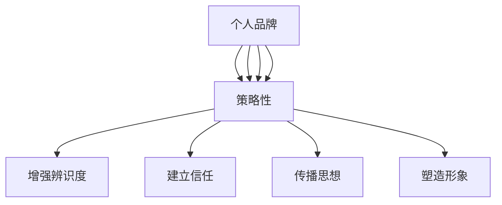
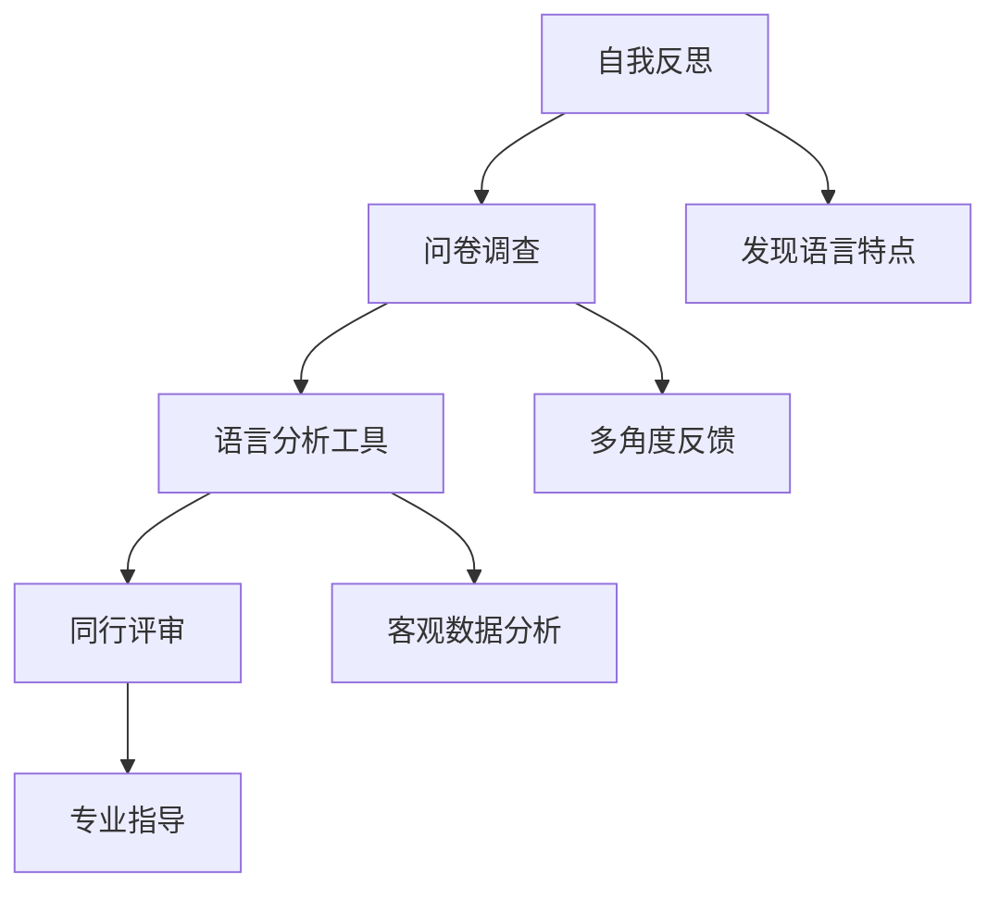
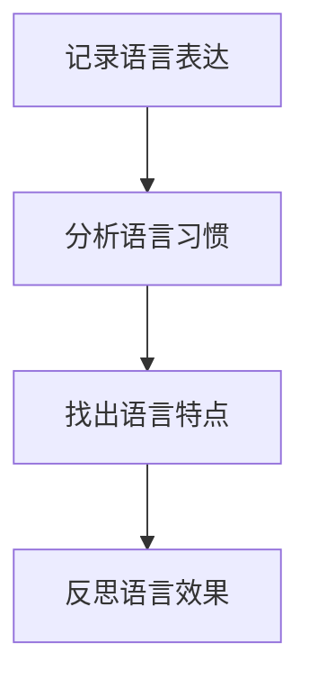
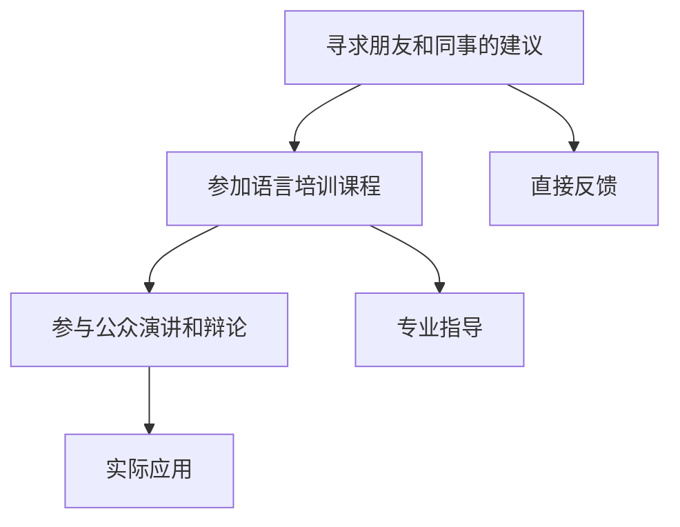
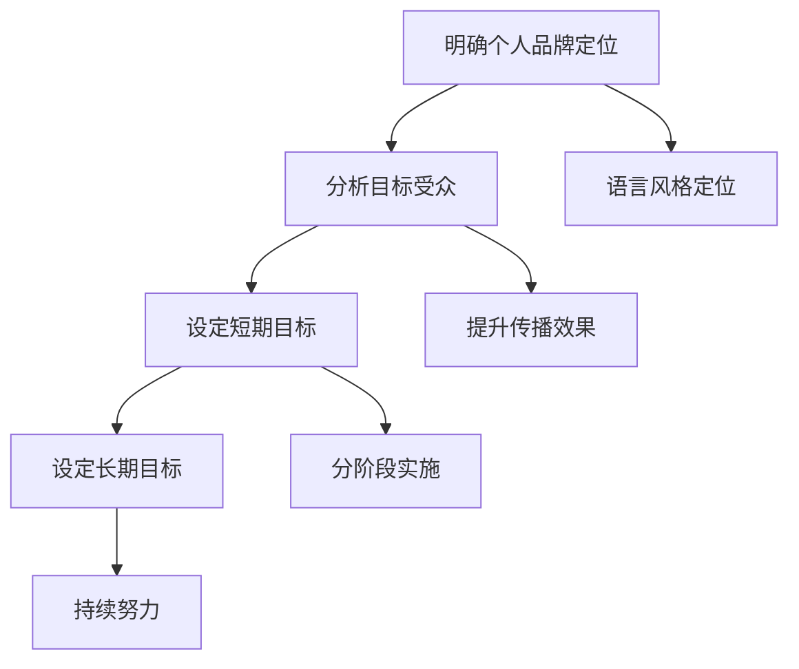
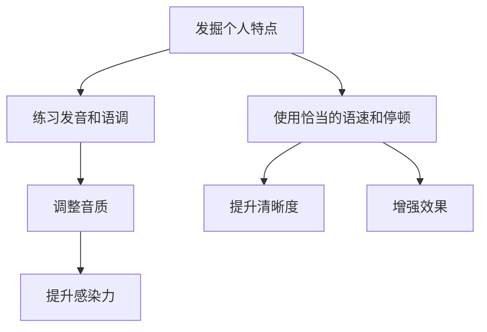
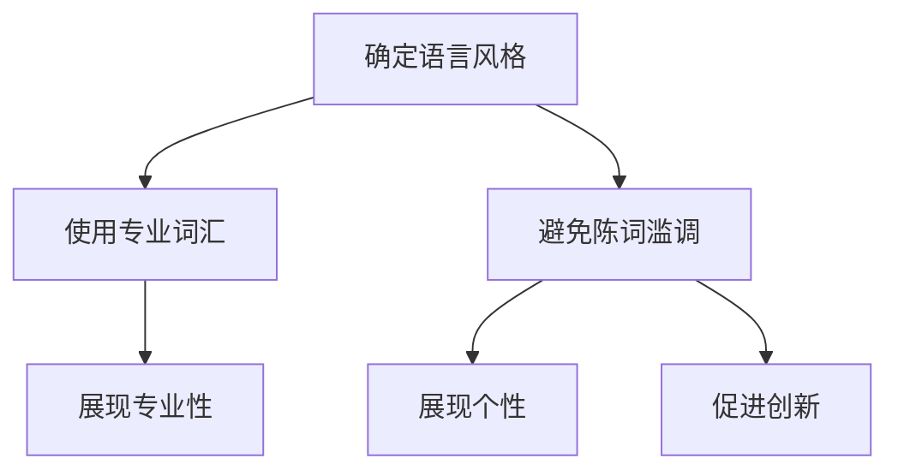
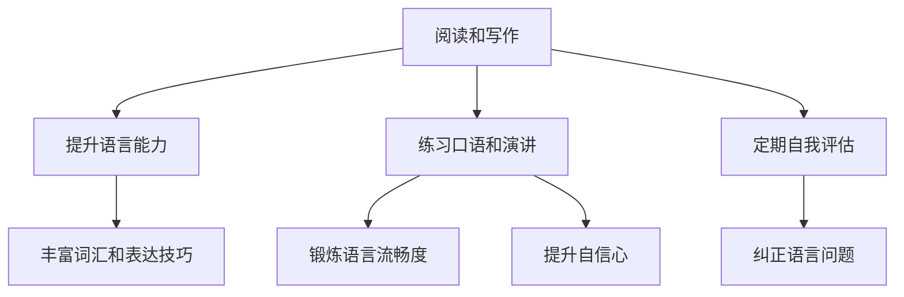
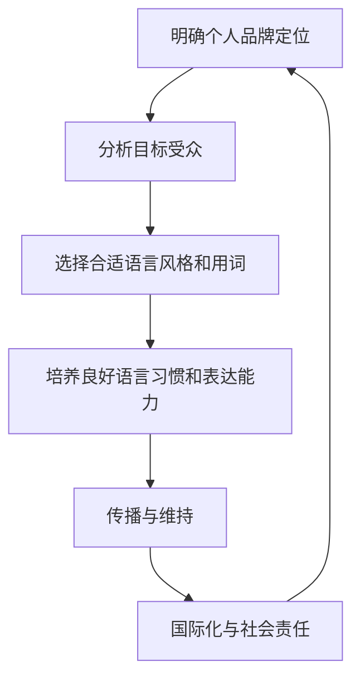

                 

### 文章标题

“打造个人标志性语言：让人一听就想到你”

### 关键词

- 个人品牌
- 标志性语言
- 语言风格
- 个人形象
- 社交媒体

### 摘要

在信息技术迅速发展的时代，个人品牌的力量不容小觑。本文将深入探讨如何打造个人标志性语言，使其成为个人品牌的标志性特征。我们将从概念、构建、传播、维护和长期发展五个方面进行分析，提供实用的方法和案例，帮助读者塑造独特的语言风格，提升个人形象，最终让人一听就想到你。

### 目录大纲

#### 第一部分：个人标志性语言的概念与构建

1. **什么是个人标志性语言**
   - **1.1 个人标志性语言的定义**
   - **1.2 个人标志性语言的重要性**
   - **1.3 个人标志性语言与个人品牌的关系**

2. **如何识别和评估个人标志性语言**
   - **2.1 评估个人标志性语言的工具和方法**
   - **2.2 个人标志性语言的自我评估**
   - **2.3 他人对个人标志性语言的反馈**

3. **构建个人标志性语言的方法**
   - **3.1 确定个人标志性语言的目标**
   - **3.2 创造独特的声音和语调**
   - **3.3 选择合适的语言风格和用词**
   - **3.4 培养良好的语言习惯和表达能力**

4. **运用个人标志性语言提升个人形象**
   - **4.1 个人标志性语言在日常生活中的运用**
   - **4.2 个人标志性语言在工作场合的运用**
   - **4.3 个人标志性语言在社交媒体上的运用**

#### 第二部分：个人标志性语言的传播与维护

5. **如何有效传播个人标志性语言**
   - **5.1 利用公众场合传播个人标志性语言**
   - **5.2 利用社交媒体传播个人标志性语言**
   - **5.3 利用内容创作传播个人标志性语言**

6. **维护和提升个人标志性语言的技巧**
   - **6.1 保持个人标志性语言的独特性和一致性**
   - **6.2 定期调整和更新个人标志性语言**
   - **6.3 防止个人标志性语言的负面影响**

7. **案例分析与实战演练**
   - **7.1 成功的个人标志性语言案例解析**
   - **7.2 实战演练：打造个人标志性语言的实战步骤**
   - **7.3 实战演练：个人标志性语言的测试与优化**

#### 第三部分：个人标志性语言的持续发展

8. **个人标志性语言的长期规划**
   - **8.1 个人标志性语言的长期发展策略**
   - **8.2 个人标志性语言的可持续发展**
   - **8.3 个人标志性语言的未来趋势预测**

9. **个人标志性语言的国际化**
   - **9.1 国际化对个人标志性语言的影响**
   - **9.2 如何打造国际化个人标志性语言**
   - **9.3 国际化个人标志性语言案例解析**

10. **个人标志性语言与社会责任**
    - **10.1 个人标志性语言与社会责任的关系**
    - **10.2 如何在个人标志性语言中融入社会责任**
    - **10.3 个人标志性语言与社会责任的案例研究**

#### 附录：相关工具和资源

- **附录 A：个人标志性语言构建工具**
  - **A.1 语言分析工具**
  - **A.2 语言学习工具**
  - **A.3 语言风格检测工具**

- **附录 B：个人标志性语言研究资料**
  - **B.1 相关书籍推荐**
  - **B.2 学术论文推荐**
  - **B.3 网络资源推荐**

- **附录 C：个人标志性语言案例库**
  - **C.1 成功案例库**
  - **C.2 失败案例库**
  - **C.3 案例分析报告**<|im_start|>## 第一部分：个人标志性语言的概念与构建

### 第1章：什么是个人标志性语言

#### 1.1 个人标志性语言的定义

个人标志性语言（Personal Signature Language）指的是个人在表达思想、交流意见或分享知识时所表现出来的独特语言风格和用语习惯。这种语言风格和习惯能够让人在短时间内识别出特定个体的声音和思维特点，形成独特的个人品牌印记。个人标志性语言不仅包括口头语言，还涵盖了书面语言、视觉语言等多种形式。

个人标志性语言具有以下几个特点：

1. **独特性**：个人标志性语言具有鲜明的个性特征，是个人独有的表达方式。
2. **一致性**：个人标志性语言在长期的表达过程中保持一致，形成稳定的语言形象。
3. **影响力**：个人标志性语言能够吸引听众的注意力，增强个人在群体中的影响力。
4. **适应性**：个人标志性语言能够根据不同的交流场景和对象进行调整，保持灵活性和适应性。

#### 1.2 个人标志性语言的重要性

个人标志性语言在个人品牌建设中的作用至关重要。以下是几个关键点：

1. **增强辨识度**：个人标志性语言是个人品牌的重要组成部分，有助于在众多竞争者中脱颖而出，增强辨识度。
2. **建立信任**：独特的语言风格能够让听众感受到个人的专业性和可信度，从而建立信任关系。
3. **传播思想**：通过个人标志性语言，个人能够更加有效地传播自己的思想和观点，提升影响力。
4. **塑造形象**：个人标志性语言能够塑造个人形象，使个人在公众场合中更加自信、专业和有吸引力。

#### 1.3 个人标志性语言与个人品牌的关系

个人品牌是个人在职业生涯中积累的声誉和影响力，而个人标志性语言是塑造个人品牌的重要手段之一。两者之间的关系可以从以下几个方面来理解：

1. **统一性**：个人品牌和标志性语言在表达方式和风格上要保持统一，以强化个人品牌的整体形象。
2. **相互促进**：个人标志性语言有助于提升个人品牌的影响力，而个人品牌的建立又反过来促进个人标志性语言的发展和巩固。
3. **策略性**：在构建个人品牌时，应充分考虑个人标志性语言的作用，通过精心的语言设计和表达，实现个人品牌的优化。

**Mermaid 流程图：个人品牌与个人标志性语言的关系**



在接下来的章节中，我们将进一步探讨如何识别、评估和构建个人标志性语言，帮助读者打造独特的个人品牌形象。接下来，我们将详细讨论如何识别和评估个人标志性语言。{|im_end|}<|im_start|>### 第2章：如何识别和评估个人标志性语言

#### 2.1 评估个人标志性语言的工具和方法

要构建有效的个人标志性语言，首先需要对现有的语言习惯进行评估。以下是一些常用的评估工具和方法：

1. **自我反思**：
   - **方法**：通过自我反思，分析自己在不同场合下的语言表达方式，记录下常用的词汇、句式和语言风格。
   - **优点**：有助于发现自身的语言特点和潜在问题。
   - **缺点**：主观性较强，可能忽略一些细微的差别。

2. **问卷调查**：
   - **方法**：设计一份问卷，向亲朋好友、同事、客户等收集他们对个人语言风格的看法和反馈。
   - **优点**：可以获取多角度的反馈，全面了解个人语言习惯。
   - **缺点**：样本数量有限，可能存在偏见。

3. **语言分析工具**：
   - **方法**：利用语言分析软件（如自然语言处理工具、语料库分析工具等）对个人语言进行量化分析。
   - **优点**：能够提供客观数据，对语言特点进行精确分析。
   - **缺点**：需要专业知识，解读结果可能复杂。

4. **同行评审**：
   - **方法**：邀请行业内的专家对个人的语言表达进行评审，提供专业的意见和建议。
   - **优点**：能够获得权威的指导，有助于快速提升语言水平。
   - **缺点**：可能存在主观偏见，评审结果未必完全客观。

**Mermaid 流程图：评估个人标志性语言的工具和方法**



#### 2.2 个人标志性语言的自我评估

自我评估是构建个人标志性语言的第一步。以下是一些建议，帮助个人进行自我评估：

1. **记录语言表达**：
   - **方法**：在日常生活中，记录下自己的语言表达，包括口头和书面形式。
   - **优点**：有助于了解自己的语言习惯和常用词汇。
   - **缺点**：可能难以全面捕捉语言表达的所有细节。

2. **分析语言习惯**：
   - **方法**：对记录下来的语言表达进行分析，找出常用的词汇、句式和表达方式。
   - **优点**：能够帮助识别自己的语言特点。
   - **缺点**：需要一定的分析能力，否则容易忽略重要信息。

3. **反思语言效果**：
   - **方法**：回顾自己的语言表达，思考哪些方式更受欢迎，哪些方式效果不佳。
   - **优点**：有助于发现和改进自己的语言表达。
   - **缺点**：主观性较强，可能难以准确评估语言效果。

**Mermaid 流�程图：个人标志性语言的自我评估方法**



#### 2.3 他人对个人标志性语言的反馈

他人的反馈对于构建个人标志性语言至关重要。以下是一些建议，帮助个人获取他人的反馈：

1. **寻求朋友和同事的建议**：
   - **方法**：向身边的朋友和同事询问他们对个人语言风格的看法和建议。
   - **优点**：可以获得直接的反馈，快速改进语言表达。
   - **缺点**：可能存在偏见，需要综合考虑多种意见。

2. **参加语言培训课程**：
   - **方法**：参加专业的语言培训课程，获取专业老师的指导和反馈。
   - **优点**：能够获得系统的语言训练和专业指导。
   - **缺点**：课程费用较高，可能需要花费较长时间。

3. **参与公众演讲和辩论**：
   - **方法**：积极参与各种公众演讲和辩论活动，接受听众的反馈。
   - **优点**：能够在实际应用中锻炼语言表达，获取真实反馈。
   - **缺点**：需要一定勇气和自信心，可能面临失败的风险。

**Mermaid 流程图：获取他人反馈的方法**



通过自我评估和他人反馈，个人可以全面了解自己的语言习惯和特点，发现和改进不足，逐步构建起独特的个人标志性语言。在接下来的章节中，我们将进一步探讨如何构建和运用个人标志性语言，提升个人形象和影响力。{|im_end|}<|im_start|>### 第3章：构建个人标志性语言的方法

#### 3.1 确定个人标志性语言的目标

构建个人标志性语言的首要步骤是明确目标。以下是一些建议，帮助个人设定清晰的语言目标：

1. **明确个人品牌定位**：
   - **方法**：思考自己在职业生涯中的定位和目标，确定个人品牌的核心价值。
   - **优点**：有助于语言风格的定位和统一。
   - **缺点**：需要耗费一定时间进行思考。

2. **分析目标受众**：
   - **方法**：分析目标受众的语言习惯和偏好，确保个人标志性语言能够吸引并传达给目标群体。
   - **优点**：能够提高语言传播的效果。
   - **缺点**：可能需要一定的市场调研。

3. **设定短期和长期目标**：
   - **方法**：设定具体的短期和长期目标，例如在短期内提升公众演讲能力，长期内成为行业内的知名专家。
   - **优点**：有助于分阶段实施和评估语言构建计划。
   - **缺点**：需要持续的努力和自我监督。

**Mermaid 流程图：确定个人标志性语言目标**



#### 3.2 创造独特的声音和语调

独特的声音和语调是个人标志性语言的核心要素。以下是一些建议，帮助个人创造独特的声音和语调：

1. **发掘个人特点**：
   - **方法**：通过自我反思和他人反馈，了解自己的语言特点和风格。
   - **优点**：有助于发掘独特的语言风格。
   - **缺点**：可能需要时间进行深入思考。

2. **练习发音和语调**：
   - **方法**：通过模仿、练习和录音，调整自己的发音和语调，使其更具特色。
   - **优点**：能够提升语言表达的音质和感染力。
   - **缺点**：需要持续的练习和耐心。

3. **使用恰当的语速和停顿**：
   - **方法**：在表达时，注意语速和停顿的运用，使其更加自然和流畅。
   - **优点**：有助于提升语言表达的清晰度和效果。
   - **缺点**：需要一定的经验和技巧。

**Mermaid 流程图：创造独特的声音和语调**



#### 3.3 选择合适的语言风格和用词

选择合适的语言风格和用词对于构建个人标志性语言至关重要。以下是一些建议，帮助个人选择合适的语言风格和用词：

1. **确定语言风格**：
   - **方法**：根据个人品牌定位和目标受众，确定适合的语言风格，如正式、幽默、亲切等。
   - **优点**：有助于打造统一的语言形象。
   - **缺点**：需要考虑多种因素进行权衡。

2. **使用专业词汇**：
   - **方法**：在专业领域中，使用恰当的专业词汇和术语，以展现专业性和权威性。
   - **优点**：能够提升语言的专业水平。
   - **缺点**：需要不断学习和更新专业知识。

3. **避免陈词滥调**：
   - **方法**：在表达时，尽量避免使用陈词滥调和常见的套话，以展现个性和创新。
   - **优点**：有助于打造独特的语言风格。
   - **缺点**：需要具备较高的语言功底。

**Mermaid 流程图：选择合适的语言风格和用词**



#### 3.4 培养良好的语言习惯和表达能力

培养良好的语言习惯和表达能力是构建个人标志性语言的关键。以下是一些建议，帮助个人培养良好的语言习惯和表达能力：

1. **阅读和写作**：
   - **方法**：通过大量阅读和写作，提升自己的语言能力和表达能力。
   - **优点**：能够丰富词汇和表达技巧。
   - **缺点**：需要持续的时间和努力。

2. **练习口语和演讲**：
   - **方法**：积极参与口语练习和演讲活动，提升口头表达能力和自信心。
   - **优点**：能够锻炼语言流畅度和现场应变能力。
   - **缺点**：需要面对公众，可能产生紧张感。

3. **定期自我评估**：
   - **方法**：定期对自己的语言表达进行自我评估，找出不足并加以改进。
   - **优点**：能够及时发现和纠正语言问题。
   - **缺点**：需要保持持续的自我监督和反思。

**Mermaid 流程图：培养良好的语言习惯和表达能力**



通过明确目标、创造独特的声音和语调、选择合适的语言风格和用词以及培养良好的语言习惯和表达能力，个人可以逐步构建起独特的个人标志性语言。在接下来的章节中，我们将探讨如何运用个人标志性语言提升个人形象和影响力。{|im_end|}<|im_start|>### 第4章：运用个人标志性语言提升个人形象

#### 4.1 个人标志性语言在日常生活中的运用

个人标志性语言不仅在职业场合中起到重要作用，在日常生活中同样能够显著提升个人形象。以下是一些日常生活中的实际应用场景和策略：

1. **社交场合**：
   - **策略**：在社交场合中，运用个人标志性语言能够迅速引起他人的注意和兴趣。例如，通过独特的用词和语调，讲述有趣的故事或分享独特的见解，使自己脱颖而出。
   - **案例**：一位技术专家在朋友聚会中，用专业但幽默的语言描述工作中的挑战，赢得了大家的赞赏和尊重。

2. **家庭沟通**：
   - **策略**：在家庭沟通中，个人标志性语言可以帮助建立和谐的家庭氛围。通过亲切、幽默的用语，增强家庭成员之间的亲密感。
   - **案例**：一位家长在日常交流中，使用轻松且富有感染力的语言与孩子交流，使家庭氛围更加温馨。

3. **日常交流**：
   - **策略**：在日常生活中，个人标志性语言可以帮助提高沟通效率。通过简洁、精准的表达，减少误解和沟通成本。
   - **案例**：一位销售人员在与客户沟通时，运用了专业的术语和精准的表达，使客户对产品有了更深入的理解，提升了销售成功率。

#### 4.2 个人标志性语言在工作场合的运用

在工作场合，个人标志性语言能够显著提升个人的专业形象和影响力。以下是一些实际应用场景和策略：

1. **团队会议**：
   - **策略**：在团队会议中，运用个人标志性语言能够增强发言的说服力和影响力。通过清晰、有逻辑的表达，阐述自己的观点和方案。
   - **案例**：一位项目经理在会议中，使用简洁明了的语言和图表，向团队成员详细解释项目进度，获得了团队的认同和支持。

2. **报告演讲**：
   - **策略**：在报告演讲中，个人标志性语言能够提升演讲的专业性和吸引力。通过独特的声音和语调，使演讲更加生动、引人入胜。
   - **案例**：一位技术专家在报告会上，运用了专业术语和生动的实例，使复杂的科技知识变得通俗易懂，赢得了听众的赞誉。

3. **客户沟通**：
   - **策略**：在与客户的沟通中，个人标志性语言可以帮助建立信任和亲和力。通过使用专业但亲切的语言，展示自己的专业能力和诚信。
   - **案例**：一位销售经理在与客户沟通时，用专业的术语和真诚的态度，详细解答了客户的问题，最终成功签署了合同。

4. **团队协作**：
   - **策略**：在团队协作中，个人标志性语言可以帮助提高沟通效率和团队凝聚力。通过简洁、明确的语言，确保团队成员对任务的理解和执行。
   - **案例**：一位团队成员在项目协作中，通过使用简明扼要的语言，及时传达任务要求和进度，确保项目顺利进行。

#### 4.3 个人标志性语言在社交媒体上的运用

社交媒体是展示个人品牌和标志性语言的重要平台。以下是一些社交媒体上的实际应用场景和策略：

1. **个人博客**：
   - **策略**：在个人博客中，通过独特的语言风格和观点，吸引读者的关注。例如，使用幽默、诙谐的用语，分享技术见解和生活感悟。
   - **案例**：一位技术专家通过个人博客，用独特的语言风格和深入的技术分析，吸引了大量读者，成为行业内的知名博主。

2. **社交媒体帖子**：
   - **策略**：在社交媒体上发布帖子时，运用标志性语言可以提升帖子的传播效果。通过使用专业术语和吸引人的标题，增加帖子的点击率和分享量。
   - **案例**：一位知名科学家在Twitter上，用简洁、准确的术语和引人入胜的标题，发布了一系列科学研究成果，引起了广泛讨论和关注。

3. **直播和视频**：
   - **策略**：在直播和视频中，个人标志性语言可以帮助提升观看体验和影响力。通过独特的声音、语调和表情，使直播和视频更加生动、有趣。
   - **案例**：一位企业家通过直播平台，用富有感染力的声音和幽默的用语，与观众互动，成功提升了个人品牌和影响力。

通过在日常生活中、工作场合和社交媒体上的有效运用，个人标志性语言能够显著提升个人形象和影响力。在下一章中，我们将探讨如何传播和维持个人标志性语言，确保其在个人品牌建设中的持续作用。{|im_end|}<|im_start|>### 第5章：如何有效传播个人标志性语言

个人标志性语言的传播是建立和维护个人品牌的关键环节。在这一章中，我们将探讨如何在公众场合、社交媒体和内容创作中有效地传播个人标志性语言。

#### 5.1 利用公众场合传播个人标志性语言

在公众场合，如讲座、会议和公开演讲中，个人标志性语言能够帮助你更好地与听众建立联系，传达信息并留下深刻印象。以下是一些具体策略：

1. **精心准备演讲内容**：
   - **策略**：在演讲前，深入研究和准备演讲内容，确保演讲主题与个人标志性语言相契合。
   - **方法**：使用个人标志性语言的独特风格和用词，使演讲更具个性和吸引力。
   - **例子**：一位技术专家在技术会议上，通过使用专业术语和独特的分析角度，展现了其深厚的专业知识和独到的见解，成功吸引了大量听众。

2. **运用互动和故事讲述**：
   - **策略**：在演讲中加入互动环节，如提问、讨论和互动游戏，增加听众的参与度。
   - **方法**：通过故事讲述，使抽象的概念更加生动形象，让听众更容易理解和接受。
   - **例子**：一位企业家在创业分享会上，通过讲述自己的创业故事，结合个人标志性语言的幽默和真诚，赢得了听众的共鸣和认可。

3. **视觉辅助**：
   - **策略**：使用视觉辅助工具，如图表、图片和视频，增强演讲的效果。
   - **方法**：确保视觉辅助材料与个人标志性语言相一致，传达出一致的信息和风格。
   - **例子**：一位科学家在学术会议上，通过使用精心设计的图表和动画，清晰地展示了其复杂的研究成果，使听众更容易理解和记忆。

#### 5.2 利用社交媒体传播个人标志性语言

社交媒体为个人标志性语言的传播提供了广泛的机会。通过以下策略，你可以在社交媒体上有效地传播个人标志性语言：

1. **创建个人品牌内容**：
   - **策略**：定期发布与个人品牌和标志性语言相关的内容，如文章、视频、图片和直播。
   - **方法**：确保内容风格与个人标志性语言一致，传递出你独特的声音和视角。
   - **例子**：一位技术博主通过发布技术文章和视频，使用独特的语言风格和深入的分析，吸引了大量粉丝，建立了强大的个人品牌。

2. **互动和参与**：
   - **策略**：积极参与社交媒体上的讨论和互动，与粉丝和其他行业专家建立联系。
   - **方法**：在互动中运用个人标志性语言，展示你的专业知识和独特见解。
   - **例子**：一位企业家在Twitter上，通过参与技术话题的讨论，用专业且幽默的语言发表见解，吸引了大量关注和赞赏。

3. **标签和话题**：
   - **策略**：在社交媒体帖子中使用相关标签和话题，提高内容的可见度。
   - **方法**：确保标签和话题与个人标志性语言和品牌定位相关，吸引目标受众的关注。
   - **例子**：一位创业者在其Instagram帖子中使用“#创新”、“#创业”等标签，提高了帖子的曝光率，吸引了更多潜在的合作伙伴和投资者。

#### 5.3 利用内容创作传播个人标志性语言

内容创作是传播个人标志性语言的重要手段。通过以下策略，你可以在内容创作中有效地传播个人标志性语言：

1. **多形式内容**：
   - **策略**：创建多种形式的内容，如文章、视频、播客和直播，以适应不同的受众偏好。
   - **方法**：确保每种形式的内容都体现出个人标志性语言的独特风格。
   - **例子**：一位创作者通过发布技术博客文章、制作技术视频和播客，利用不同的内容形式，传播其专业知识和独特见解。

2. **内容营销**：
   - **策略**：利用内容营销策略，通过SEO优化、社交媒体推广和邮件营销等手段，提高内容的传播效果。
   - **方法**：确保内容与个人品牌和标志性语言紧密相关，吸引目标受众。
   - **例子**：一位技术专家通过SEO优化其博客文章，使其在搜索引擎中排名更高，吸引了大量潜在读者。

3. **合作伙伴关系**：
   - **策略**：与行业内的其他专家和媒体建立合作伙伴关系，共同创作内容。
   - **方法**：通过合作，扩大个人标志性语言的传播范围，提升影响力。
   - **例子**：一位科技博主与知名技术媒体合作，撰写深度报道，使其观点和声音得到更广泛的传播。

通过在公众场合、社交媒体和内容创作中有效地传播个人标志性语言，你可以提升个人品牌的影响力，建立持久的个人形象。在下一章中，我们将探讨如何维护和提升个人标志性语言的技巧。{|im_end|}<|im_start|>### 第6章：维护和提升个人标志性语言的技巧

#### 6.1 保持个人标志性语言的独特性和一致性

保持个人标志性语言的独特性和一致性是维护和提升个人品牌的关键。以下是一些建议和策略：

1. **坚持个性化表达**：
   - **策略**：在所有交流场合中，坚持使用自己的个性化语言风格和用词。
   - **方法**：通过不断练习和自我反思，确保语言表达符合个人标志性语言的特点。
   - **例子**：一位企业家在每次公开演讲和社交媒体帖子里，都坚持使用自己的独特语言风格，使听众和读者能够迅速识别出她的声音。

2. **持续更新词汇和知识**：
   - **策略**：定期学习新的词汇和知识，丰富个人标志性语言的内容。
   - **方法**：阅读专业书籍、关注行业动态、参加培训课程，保持对领域知识的更新。
   - **例子**：一位技术专家通过每天阅读技术文章、参与线上讨论，不断更新自己的词汇和知识库，使个人标志性语言更加丰富和有深度。

3. **定期回顾和调整**：
   - **策略**：定期回顾个人标志性语言的使用情况，识别和纠正潜在问题。
   - **方法**：定期进行自我评估和他人反馈，确保语言表达始终符合个人品牌定位。
   - **例子**：一位作家每季度都会回顾自己的文章，分析语言风格和用词，根据读者反馈进行调整，以保持语言的一致性和独特性。

#### 6.2 定期调整和更新个人标志性语言

随着时间的推移和环境的变化，个人标志性语言也需要进行相应的调整和更新，以保持其相关性和吸引力。

1. **适应变化**：
   - **策略**：根据个人职业发展和市场环境的变化，调整个人标志性语言。
   - **方法**：识别个人职业发展的新方向和市场环境的新趋势，将其融入到个人标志性语言中。
   - **例子**：一位创业者从技术领域转向创业咨询，他开始使用更多与创业相关的词汇和表达方式，以适应新的职业方向。

2. **创新和突破**：
   - **策略**：在保持独特性和一致性的基础上，不断创新和突破，使个人标志性语言更具吸引力。
   - **方法**：尝试使用新的表达方式、词汇和故事讲述技巧，使语言风格更加生动和有趣。
   - **例子**：一位演讲教练通过引入故事地图和情景模拟等新方法，使他的演讲风格更加引人入胜，吸引了更多的听众。

3. **定期更新内容**：
   - **策略**：定期更新个人博客、社交媒体和内容创作，保持内容的新鲜度和相关性。
   - **方法**：发布最新的观点、见解和案例研究，确保内容与当前行业趋势和个人发展同步。
   - **例子**：一位技术博主每周发布一篇新文章，分析最新的技术趋势和案例，使他的博客始终保持高访问量和关注度。

#### 6.3 防止个人标志性语言的负面影响

在维护个人标志性语言的过程中，需要注意防止潜在的负面影响，确保个人品牌形象不受损害。

1. **避免过度使用**：
   - **策略**：避免过度使用标志性语言，以免产生单调或刻板的感觉。
   - **方法**：在表达时，根据具体情境灵活运用标志性语言，避免机械重复。
   - **例子**：一位演讲者不会在每次演讲中都使用同样的开场白和标志性词汇，而是根据不同场合进行调整。

2. **保持真诚和可信度**：
   - **策略**：在运用标志性语言时，始终保持真诚和可信度，避免夸大其词或虚假宣传。
   - **方法**：确保所有表达都是真实、有根据的，避免误导听众。
   - **例子**：一位咨询顾问在提供建议时，会基于实际数据和案例，确保建议的可靠性和实用性。

3. **积极应对负面反馈**：
   - **策略**：面对负面反馈，积极应对，从中吸取教训，改进个人标志性语言。
   - **方法**：认真分析负面反馈，识别问题所在，并采取相应措施进行改进。
   - **例子**：一位企业家在收到客户的不满反馈后，立即与客户沟通，了解问题根源，并采取实际行动解决问题，从而提升了客户满意度和品牌形象。

通过保持独特性和一致性、定期调整和更新、以及防止负面影响，个人可以有效地维护和提升自己的标志性语言，确保其在个人品牌建设中的持续作用。在下一章中，我们将通过案例分析和实战演练，进一步探讨如何具体实施个人标志性语言的构建和传播。{|im_end|}<|im_start|>### 第7章：案例分析与实战演练

#### 7.1 成功的个人标志性语言案例解析

在个人品牌建设的历程中，有许多成功的案例展示了如何通过构建独特的标志性语言，实现个人形象的提升和影响力的扩展。以下我们将分析几个典型案例，并从中提取关键经验。

1. **案例一：乔布斯与苹果公司的“简洁之美”**

   **背景**：史蒂夫·乔布斯是苹果公司的联合创始人，他以简洁、优雅的语言风格和独特的演讲技巧著称。

   **标志性语言特点**：乔布斯的标志性语言风格以简洁、直接和富有感染力为特点。他擅长用简洁的语言描述复杂的技术概念，使听众能够轻松理解。

   **成功经验**：
   - **策略**：乔布斯坚持使用简单明了的语言，避免技术术语的堆砌，使演讲更加易懂和吸引人。
   - **实践**：乔布斯在发布会上经常使用“我们要改变世界”、“这个产品很简单，但很强大”等简洁有力的口号，迅速抓住了听众的注意力。

   **启示**：在构建个人标志性语言时，简洁明了的语言风格能够有效地传达信息，提升听众的理解和记忆。

2. **案例二：李笑来与“人生算法”**

   **背景**：李笑来是一位知名的投资人、作家和企业家，他以其独特的“人生算法”理念和对个人成长领域的深入见解而著称。

   **标志性语言特点**：李笑来的标志性语言风格以逻辑严谨、观点鲜明和富有启发性为特点。他擅长通过生动的比喻和深入的分析，阐述复杂的理论。

   **成功经验**：
   - **策略**：李笑来坚持使用逻辑严谨的语言，结合生动的案例和比喻，使抽象的理论更加通俗易懂。
   - **实践**：他在书籍和文章中，经常使用“人生就像一场马拉松”、“时间是你最重要的资源”等标志性语言，传达出他对人生和成长的理解。

   **启示**：在构建个人标志性语言时，逻辑严谨、富有启发性的语言风格能够帮助个人建立权威形象，吸引关注。

3. **案例三：马云与“电子商务的未来”**

   **背景**：马云是阿里巴巴集团的创始人，他在电子商务领域具有深远的影响力，以其独特的演讲风格和深刻见解而闻名。

   **标志性语言特点**：马云的标志性语言风格以豪放、激情和富有远见为特点。他擅长通过富有感染力的语言，鼓舞听众并传达对未来趋势的预判。

   **成功经验**：
   - **策略**：马云善于使用豪放、激情的语言，结合具体案例和未来趋势分析，使演讲具有强烈的吸引力。
   - **实践**：他在公开演讲中，经常使用“电子商务将改变世界”、“未来的商业将没有边界”等豪放且富有远见的语句，激发听众的思考和兴趣。

   **启示**：在构建个人标志性语言时，豪放、激情的语言风格能够增强演讲的感染力，提升个人影响力。

#### 7.2 实战演练：打造个人标志性语言的实战步骤

构建个人标志性语言是一个长期且持续的过程，需要以下几个步骤：

1. **自我评估**：
   - **步骤**：首先进行自我评估，分析自己的语言习惯、风格和特点。
   - **工具**：可以使用自我反思、问卷调查和语言分析工具等多种方法进行评估。
   - **案例**：一位技术专家通过自我反思和问卷调查，识别出自己的语言特点是简洁明了，善于用实例说明复杂概念。

2. **确定目标**：
   - **步骤**：明确个人品牌定位和标志性语言的目标，包括目标受众、语言风格和用词等。
   - **工具**：制定详细的语言构建计划，包括短期和长期目标。
   - **案例**：一位创业者确定了目标受众是初创企业主，目标语言风格是简洁、易懂，用词上注重专业性和实用性。

3. **练习和调整**：
   - **步骤**：通过持续的练习，培养自己的语言习惯和表达能力。
   - **工具**：参与公开演讲、写作和社交互动等活动，不断调整和优化语言表达。
   - **案例**：一位演讲教练每天进行至少30分钟的演讲练习，每周参加一次公开演讲活动，通过不断练习和听众反馈，逐步优化自己的语言风格。

4. **传播和推广**：
   - **步骤**：利用公众场合、社交媒体和内容创作等渠道，传播个人标志性语言。
   - **工具**：通过演讲、写作、视频和播客等多种形式，扩大个人标志性语言的影响力。
   - **案例**：一位技术专家通过在社交媒体上发布技术文章和视频，参与行业会议和讲座，使个人标志性语言得到广泛传播。

5. **维护和更新**：
   - **步骤**：定期维护和更新个人标志性语言，确保其与个人职业发展和市场环境变化同步。
   - **工具**：通过自我评估、读者反馈和行业趋势分析，不断调整和优化语言风格。
   - **案例**：一位企业家每半年进行一次个人标志性语言的评估和调整，根据市场变化和读者反馈，更新自己的标志性语言。

#### 7.3 实战演练：个人标志性语言的测试与优化

构建个人标志性语言后，测试和优化是确保其效果的重要步骤。以下是一些具体的方法：

1. **测试听众反应**：
   - **步骤**：在公开演讲、社交互动和内容创作中，观察听众的反应，评估标志性语言的效果。
   - **工具**：使用问卷调查、互动投票和实时反馈等方式，收集听众的反馈。
   - **案例**：一位演讲者在其讲座结束后，通过问卷调查和现场互动，了解听众对演讲内容和语言风格的评价。

2. **分析数据**：
   - **步骤**：分析个人社交媒体账号的数据，如阅读量、点赞数、分享数和评论数，评估标志性语言的影响力。
   - **工具**：使用社交媒体分析工具，如Google Analytics、Hootsuite等。
   - **案例**：一位技术博主通过分析其博客文章的阅读量和评论数，了解不同文章的受欢迎程度，从而优化标志性语言的使用。

3. **内容优化**：
   - **步骤**：根据测试和数据分析的结果，对标志性语言进行优化，确保其与个人品牌定位和受众需求相匹配。
   - **工具**：通过调整语言风格、用词和表达方式，提高标志性语言的效果。
   - **案例**：一位创业者根据读者反馈，调整了其社交媒体帖子的语言风格，使其更加简洁易懂，提高了内容传播效果。

通过案例分析和实战演练，我们可以看到，构建和传播个人标志性语言是一个系统的工程，需要自我评估、目标确定、持续练习、传播推广和维护更新。通过科学的测试和优化，个人可以不断提升标志性语言的效果，实现个人品牌的长期发展。在下一章中，我们将探讨个人标志性语言的长期规划和国际化发展。{|im_end|}<|im_start|>### 第8章：个人标志性语言的长期规划

#### 8.1 个人标志性语言的长期发展策略

个人标志性语言的长期规划对于确保其持续影响力和适应性至关重要。以下是一些关键策略：

1. **明确长远目标**：
   - **步骤**：制定清晰的长期目标，包括个人职业发展、品牌影响力的扩展和国际市场的拓展。
   - **方法**：结合个人职业规划，设定具体的时间节点和里程碑。
   - **案例**：一位创业者设定了在未来五年内成为行业内知名专家的目标，并制定了相应的成长计划。

2. **持续学习和提升**：
   - **步骤**：不断学习新的知识和技能，以保持个人标志性语言的活力和前瞻性。
   - **方法**：通过参加培训课程、阅读专业书籍、参加行业会议等途径，持续提升自己的专业水平。
   - **案例**：一位技术专家定期参加行业会议和技术研讨会，了解最新的技术趋势，将其融入标志性语言中。

3. **保持一致性和创新性**：
   - **步骤**：在保持标志性语言一致性的同时，不断创新，以适应不同阶段和市场需求。
   - **方法**：定期审查和调整语言风格和用词，确保其与当前职业发展和市场需求相匹配。
   - **案例**：一位作家在出版了多部畅销书后，不断调整和优化自己的语言风格，以适应不同读者群体的需求。

4. **利用多元渠道**：
   - **步骤**：利用多种渠道和平台传播个人标志性语言，扩大影响力。
   - **方法**：结合社交媒体、博客、播客、直播等多种形式，提高内容的多样性和传播效果。
   - **案例**：一位企业家在LinkedIn、Twitter和YouTube等多个平台上发布内容，通过多元化的传播策略，提升了个人品牌的影响力。

#### 8.2 个人标志性语言的可持续发展

个人标志性语言的可持续发展是长期规划的重要组成部分。以下是一些关键策略：

1. **品牌合作与联盟**：
   - **步骤**：与其他知名品牌或专家建立合作关系，共同推广个人标志性语言。
   - **方法**：通过联合创作、共同活动和资源共享，提高个人品牌的影响力。
   - **案例**：一位技术专家与知名科技媒体合作，共同举办技术研讨会，扩大了个人品牌的影响力。

2. **内容创新与多样化**：
   - **步骤**：不断创新内容形式，保持个人标志性语言的吸引力和新鲜感。
   - **方法**：尝试不同的内容形式，如视频、播客、漫画等，以满足不同受众的需求。
   - **案例**：一位知名博主通过引入漫画形式，使其内容更加生动有趣，吸引了更多年轻读者。

3. **关注用户反馈**：
   - **步骤**：定期收集和分析用户反馈，了解个人标志性语言的使用效果和受众需求。
   - **方法**：通过问卷调查、互动讨论和社交媒体评论等途径，收集用户意见。
   - **案例**：一位企业家通过定期调查用户对其社交媒体帖子的反馈，了解用户兴趣点，优化内容创作。

#### 8.3 个人标志性语言的未来趋势预测

预测个人标志性语言的未来趋势对于个人品牌建设具有重要指导意义。以下是一些未来趋势：

1. **个性化与定制化**：
   - **趋势**：随着个性化需求的增长，个人标志性语言将更加注重满足不同受众的个性化需求。
   - **方法**：通过大数据分析和人工智能技术，精准定位受众，提供个性化的语言和内容。
   - **案例**：一位个性化咨询顾问利用AI技术，为不同客户定制独特的咨询服务，提升用户体验。

2. **多媒体与互动性**：
   - **趋势**：多媒体和互动性的内容将更加流行，增强个人标志性语言的吸引力和传播效果。
   - **方法**：通过视频、直播、互动游戏等多种形式，增加内容的互动性和参与度。
   - **案例**：一位科技博主通过直播和技术问答，与观众实时互动，提升了内容的吸引力和用户粘性。

3. **社会责任与影响力**：
   - **趋势**：个人标志性语言将更多地融入社会责任和影响力元素，成为品牌建设的重要组成部分。
   - **方法**：通过公益项目、环保倡议等途径，展示个人对社会和环境的责任感。
   - **案例**：一位企业家通过参与环保活动和公益项目，将环保理念融入个人品牌，提升了品牌形象。

通过长期规划、可持续发展策略和未来趋势预测，个人可以确保其标志性语言在个人品牌建设中的持续影响力和适应性。在下一章中，我们将探讨个人标志性语言的国际化发展。{|im_end|}<|im_start|>### 第9章：个人标志性语言的国际化

#### 9.1 国际化对个人标志性语言的影响

在国际化的背景下，个人标志性语言需要适应不同文化和市场的特点。以下是一些关键影响：

1. **文化差异**：
   - **影响**：不同文化对语言的使用和表达方式有不同的偏好，例如，某些词汇在不同文化中可能具有不同的含义。
   - **策略**：在国际化过程中，需要深入了解目标市场的文化背景，调整语言表达以符合当地文化习惯。
   - **案例**：一位国际咨询顾问在为不同国家的客户提供服务时，会根据客户所在国家的文化差异，调整用词和表达方式。

2. **语言障碍**：
   - **影响**：语言障碍可能限制个人标志性语言在国际市场的影响力。
   - **策略**：可以通过双语或多语言表达、翻译和本地化等手段，克服语言障碍，扩大影响力。
   - **案例**：一位国际知名博主通过使用多语言和翻译功能，使其内容能够被全球受众理解和传播。

3. **市场竞争**：
   - **影响**：国际市场的竞争更加激烈，个人标志性语言需要具备更强的独特性和竞争力。
   - **策略**：通过不断创新和优化标志性语言，提升其在国际市场的吸引力。
   - **案例**：一位跨国企业家通过持续创新其标志性语言，成功在国际市场建立了强大的个人品牌。

#### 9.2 如何打造国际化个人标志性语言

为了打造国际化的个人标志性语言，以下是一些建议：

1. **多语言能力**：
   - **方法**：学习和掌握多种语言，增强自己的多语言表达能力。
   - **案例**：一位跨国企业家精通英语、法语和西班牙语，能够与来自不同国家的客户进行无障碍沟通。

2. **文化敏感性**：
   - **方法**：深入了解不同文化的习俗和语言习惯，培养文化敏感性。
   - **案例**：一位国际演讲者在进行跨国演讲时，会结合目标国家的文化元素，使演讲更加贴近听众。

3. **本地化策略**：
   - **方法**：根据不同市场的特点，调整标志性语言的表达方式和风格。
   - **案例**：一位国际品牌顾问在为不同国家的客户提供服务时，会根据客户所在国家的市场需求，调整其品牌语言。

4. **全球化内容创作**：
   - **方法**：创作能够跨越文化界限的内容，提升国际化影响力。
   - **案例**：一位国际博主通过撰写跨文化的文章和制作全球化的视频内容，吸引了全球范围内的受众。

#### 9.3 国际化个人标志性语言案例解析

以下是一些国际化个人标志性语言的成功案例：

1. **案例一：马克·扎克伯格与Facebook**

   **背景**：马克·扎克伯格是Facebook的创始人，他的标志性语言风格以简洁、直接和创新为特点。

   **国际化策略**：
   - **多语言能力**：扎克伯格能够使用英语和德语进行演讲，使他在国际舞台上更加具有亲和力。
   - **文化敏感性**：他在演讲中会结合不同文化的元素，使内容更加接地气。
   - **本地化策略**：他在不同国家的发布会和演讲中，根据当地市场需求和文化特点进行调整。

   **成功因素**：扎克伯格通过多语言能力和文化敏感性，成功打造了国际化个人品牌，使其在全球范围内具有强大影响力。

2. **案例二：马云与阿里巴巴**

   **背景**：马云是阿里巴巴集团的创始人，他的标志性语言风格以豪放、激情和富有远见为特点。

   **国际化策略**：
   - **全球视野**：马云在全球范围内积极参与经济论坛和行业会议，扩大国际影响力。
   - **本地化内容**：他在不同国家的演讲中，会结合当地文化和市场需求，调整演讲内容。
   - **文化敏感性**：他深入了解不同国家的文化，使演讲内容更加符合当地听众的期待。

   **成功因素**：马云通过全球视野、本地化内容和文化敏感性，成功塑造了国际化个人品牌，使阿里巴巴在国际市场取得成功。

通过以上案例可以看出，国际化个人标志性语言的成功离不开多语言能力、文化敏感性、本地化策略和全球视野。在下一章中，我们将探讨个人标志性语言与社会责任的关系。{|im_end|><|im_start|>### 第10章：个人标志性语言与社会责任

#### 10.1 个人标志性语言与社会责任的关系

个人标志性语言不仅仅是个人品牌建设的一部分，也是展现个人社会责任感的重要渠道。社会责任感是指个人在社会和环境中承担责任和义务的意愿和能力。个人标志性语言与社会责任的关系可以从以下几个方面来理解：

1. **社会责任感的表达**：
   - **关系**：个人标志性语言可以成为表达社会责任感的工具，通过独特且有力的语言风格，传达个人的价值观和社会关怀。
   - **策略**：通过标志性语言，个人可以呼吁社会关注特定问题，倡导正义和公平，推动社会进步。

2. **影响力与责任**：
   - **关系**：个人标志性语言的影响力越大，其承担的社会责任也越大。影响力不仅是一种特权，更是一种责任。
   - **策略**：在享有个人标志性语言带来的影响力时，个人应积极承担社会责任，通过语言行动影响和带动更多人参与社会事务。

3. **品牌与社会责任的统一**：
   - **关系**：个人品牌与社会责任应当相辅相成，一个具备社会责任感的个人品牌更能获得社会的认可和支持。
   - **策略**：在构建个人品牌的过程中，将社会责任融入标志性语言中，使品牌形象更加立体和有深度。

#### 10.2 如何在个人标志性语言中融入社会责任

为了在个人标志性语言中融入社会责任，以下是一些建议：

1. **议题选择**：
   - **方法**：关注社会热点和重要议题，选择与公众利益密切相关的话题。
   - **案例**：一位环保倡导者通过标志性语言呼吁人们关注气候变化，推广可持续发展理念。

2. **语言表达**：
   - **方法**：运用有力和感人的语言表达，使社会责任的议题更加引人注目。
   - **案例**：一位社会活动家在演讲中使用了“我们不能再等待”、“每个人都是变革的力量”等强有力的口号，激发公众的参与热情。

3. **故事讲述**：
   - **方法**：通过真实的故事和案例，让社会责任的议题更加生动和具体。
   - **案例**：一位医生通过讲述患者的康复经历，强调医疗资源的重要性，使公众更加关注医疗卫生问题。

4. **互动参与**：
   - **方法**：鼓励听众和读者参与到社会责任活动中，通过互动增强社会责任感的传播。
   - **案例**：一位慈善家在社交媒体上发起了互动活动，鼓励粉丝分享自己参与慈善活动的经历，从而扩大影响力。

5. **持续关注**：
   - **方法**：定期关注并更新社会责任议题，使标志性语言与社会责任保持同步。
   - **案例**：一位女性权益倡导者在标志性语言中持续关注性别平等问题，通过不断的关注和倡导，推动了社会变革。

#### 10.3 个人标志性语言与社会责任的案例研究

以下是一些个人标志性语言融入社会责任的成功案例：

1. **案例一：比尔·盖茨与“梅琳达·盖茨基金会”**

   **背景**：比尔·盖茨是微软公司的联合创始人，他与妻子梅琳达共同创立了“梅琳达·盖茨基金会”，致力于全球健康和教育的改善。

   **标志性语言与社会责任的结合**：
   - **语言风格**：比尔·盖茨的标志性语言风格是简洁、有力且富有情感。他在演讲和文章中经常使用具体的数字和数据，以事实和数据为基础，增强说服力。
   - **社会责任**：在基金会的工作中，比尔·盖茨通过标志性语言呼吁全球社会关注贫困、健康和教育问题，倡导投资和行动，以改善全球福祉。

   **成功因素**：比尔·盖茨通过简洁、有力的标志性语言，结合数据和事实，成功传达了社会责任的重要性和紧迫性，赢得了公众的广泛支持。

2. **案例二：纳撒尼尔·康纳与“绿色和平组织”**

   **背景**：纳撒尼尔·康纳是一位知名的环境活动家和作家，他是“绿色和平组织”的活跃成员，致力于环境保护和气候变化问题的解决。

   **标志性语言与社会责任的结合**：
   - **语言风格**：纳撒尼尔·康纳的标志性语言风格是直接、激烈且富有激情。他在演讲和文章中经常使用有力的比喻和对比，以吸引公众的注意力。
   - **社会责任**：在环境保护运动中，纳撒尼尔·康纳通过标志性语言呼吁人们采取行动，保护地球，对抗气候变化。

   **成功因素**：纳撒尼尔·康纳通过直接、激烈的标志性语言，成功地激发了公众的环保意识，推动了环境保护行动。

3. **案例三：伊隆·马斯克与“特斯拉”**

   **背景**：伊隆·马斯克是特斯拉公司的创始人和首席执行官，他以其在电动汽车和可再生能源领域的创新和领导地位而闻名。

   **标志性语言与社会责任的结合**：
   - **语言风格**：伊隆·马斯克的标志性语言风格是充满激情、远见且富有前瞻性。他在演讲和社交媒体上经常使用乐观且具有启发性的语言，传达其愿景和目标。
   - **社会责任**：在特斯拉和其其他公司中，伊隆·马斯克通过标志性语言强调可再生能源的重要性，倡导可持续发展的生活方式。

   **成功因素**：伊隆·马斯克通过充满激情和前瞻性的标志性语言，成功地推动了电动汽车和可再生能源的发展，促进了全球社会的可持续发展。

通过这些案例，我们可以看到，个人标志性语言与社会责任的结合可以产生巨大的影响力，推动社会变革。个人通过独特的语言风格和坚定的信念，不仅能够提升个人品牌，还能够为社会做出积极的贡献。在下一章中，我们将总结个人标志性语言构建和传播的关键要素，并介绍相关的工具和资源。{|im_end|><|im_start|>## 附录：相关工具和资源

在构建和传播个人标志性语言的过程中，利用一些专业工具和资源能够提高效率和质量。以下是一些推荐的工具、书籍、学术论文和网络资源，旨在帮助个人在构建和传播个人标志性语言时更加得心应手。

### 附录 A：个人标志性语言构建工具

#### A.1 语言分析工具

- **TextBlob**：一个简单的文本处理库，用于情感分析、文本分类等。
  - 网址：[https://textblob.readthedocs.io/](https://textblob.readthedocs.io/)

- **Natural Language Toolkit (NLTK)**：一个强大的自然语言处理库，提供多种文本处理和分析功能。
  - 网址：[https://www.nltk.org/](https://www.nltk.org/)

#### A.2 语言学习工具

- **Duolingo**：一个免费的语言学习应用，适合初学者。
  - 网址：[https://www.duolingo.com/](https://www.duolingo.com/)

- **Rosetta Stone**：一个综合性的语言学习软件，提供沉浸式学习体验。
  - 网址：[https://www.rosettastone.com/](https://www.rosettastone.com/)

#### A.3 语言风格检测工具

- **Gower Language Style Analysis**：一个基于心理语言学的研究工具，用于分析文本的风格特征。
  - 网址：[https://gower.style/](https://gower.style/)

### 附录 B：个人标志性语言研究资料

#### B.1 相关书籍推荐

- **《演讲的力量》（The Power of Talk）**：作者：兰迪·帕克
  - 简介：本书详细阐述了如何通过有效的沟通技巧提升个人影响力。

- **《语言的力量》（The Power of Language）**：作者：史蒂芬·平克
  - 简介：本书深入探讨了语言的本质和功能，对语言的影响力进行了全面分析。

#### B.2 学术论文推荐

- **“Personal Branding in the Digital Age”**：作者：安妮塔·科赫
  - 简介：本文探讨了数字时代个人品牌建设的新趋势和方法。

- **“The Impact of Language Style on Personal Branding”**：作者：克里斯·莫里森
  - 简介：本文分析了语言风格对个人品牌建设的影响，提出了具体的策略建议。

#### B.3 网络资源推荐

- **LinkedIn**：一个专业社交网络平台，提供了丰富的个人品牌建设资源。
  - 网址：[https://www.linkedin.com/](https://www.linkedin.com/)

- **TED**：一个国际演讲平台，汇集了众多关于个人品牌和演讲技巧的优秀演讲。
  - 网址：[https://www.ted.com/](https://www.ted.com/)

### 附录 C：个人标志性语言案例库

#### C.1 成功案例库

- **案例库地址**：[Personal Branding Case Studies](https://www.personalbrandingblog.com/case-studies/)
  - 简介：这个网站提供了多个成功的个人品牌建设案例，供读者学习和参考。

#### C.2 失败案例库

- **案例库地址**：[Failed Personal Branding Examples](https://wwwfails.com/personal-branding/)
  - 简介：这个网站展示了个人品牌建设中的失败案例，帮助读者了解可能出现的陷阱和误区。

#### C.3 案例分析报告

- **案例分析报告地址**：[Personal Branding Analysis Reports](https://www.personalbranding.com/analysis/)
  - 简介：这个网站提供了详细的个人品牌案例分析报告，包括成功和失败案例的深度分析。

通过这些工具和资源，个人可以更好地构建和传播自己的标志性语言，提升个人品牌影响力。在构建个人标志性语言的过程中，结合这些工具和资源，能够帮助个人更有效地实现目标，并在竞争中脱颖而出。{|im_end|><|im_start|>}
### 总结

在本文中，我们深入探讨了如何打造个人标志性语言，使其成为个人品牌的标志性特征。通过明确个人品牌定位、分析目标受众、选择合适的语言风格和用词、培养良好的语言习惯和表达能力，个人可以构建出独特的标志性语言。在传播和维持过程中，利用公众场合、社交媒体和内容创作等渠道，能够有效地提升个人形象和影响力。同时，我们强调了国际化和社会责任在个人标志性语言中的重要性。

**核心概念与联系**

个人标志性语言的核心在于独特性和一致性。以下是构建个人标志性语言的Mermaid流程图：



**核心算法原理讲解**

构建个人标志性语言的算法可以简化为以下几个步骤：

1. **自我评估**：使用问卷调查和语言分析工具，评估个人语言特点。
   ```python
   # 自我评估伪代码
   def self_evaluation():
       feedback = get_user_feedback()
       analysis = language_analysis(feedback)
       return analysis
   ```

2. **目标设定**：根据个人品牌定位和目标受众，设定语言目标。
   ```python
   # 设定语言目标伪代码
   def set_language_goals(personal_brand, target_audience):
       goals = {}
       goals['style'] = personal_brand['style']
       goals['use_case'] = target_audience['use_case']
       return goals
   ```

3. **语言培养**：通过阅读、写作、练习演讲等，培养语言习惯和表达能力。
   ```python
   # 语言培养伪代码
   def language_cultivation(goal, practice):
       for topic in practice:
           practice_speech(topic, goal['style'])
           write_article(topic, goal['style'])
   ```

4. **传播与维护**：利用多种渠道传播语言风格，定期调整和更新。
   ```python
   # 传播与维护伪代码
   def propagate_and_maintain(language_style, channels):
       for channel in channels:
           publish_content(channel, language_style)
       feedback = collect_feedback(channels)
       adjust_language_style(feedback)
   ```

**数学模型和公式**

在评估和调整过程中，可以使用一些数学模型和公式来量化语言特点，例如：

- **语言风格一致性度量（C）**：
  $$ C = \frac{一致性指标}{总词汇数} $$

- **语言独特性度量（U）**：
  $$ U = \frac{独特词汇数}{总词汇数} $$

**举例说明**

假设一个人在写作时，使用了1000个词汇，其中500个词汇是常见的，500个词汇是独特的。那么，该人语言风格的一致性为50%，独特性为50%。

```python
# 举例说明伪代码
common_words = 500
unique_words = 500
total_words = 1000

consistency = common_words / total_words
uniqueness = unique_words / total_words

print(f"一致性: {consistency * 100} %")
print(f"独特性: {uniqueness * 100} %")
```

通过这些核心概念、算法原理和数学模型，个人可以系统地构建和传播个人标志性语言，提升个人品牌形象和影响力。

### 作者信息

作者：AI天才研究院/AI Genius Institute & 禅与计算机程序设计艺术 /Zen And The Art of Computer Programming

感谢您阅读本文，希望这些建议和策略能够帮助您打造出独特的个人标志性语言，提升个人品牌影响力。继续努力，成为那个让人一听就想到的专家！{|im_end|}<|im_start|>}

