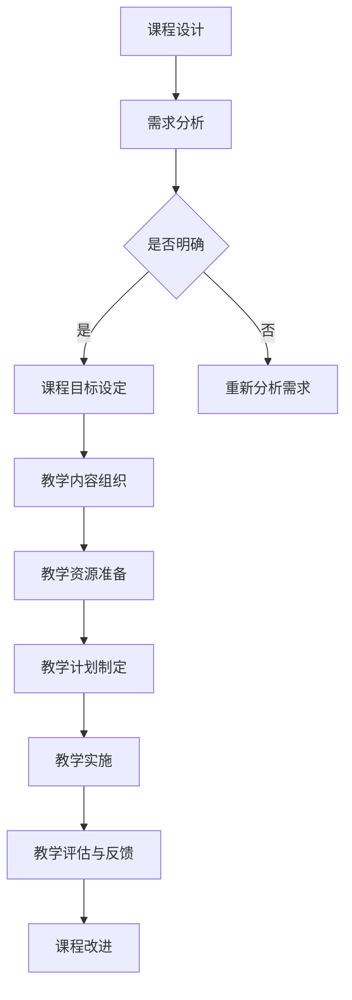

                 

### 《打造优质课程的核心要素》

> **关键词：** 课程设计、教学方法、教学资源、教学评估、课程创新

> **摘要：** 本文将深入探讨打造优质课程的核心要素，包括课程设计理念、教学方法、教学资源、教学评估和课程创新。通过逐步分析这些关键组成部分，提供实用的指导和建议，帮助教育工作者和课程设计师提升课程质量和教学效果。

## 目录大纲

### 第一部分：课程设计理念与方法

#### 第1章：课程设计基础

##### 1.1 课程设计的核心要素

##### 1.2 课程目标与学习成果

##### 1.3 教学内容的组织与安排

#### 第2章：课程教学法

##### 2.1 主动学习与互动教学

##### 2.2 情境教学与案例教学

##### 2.3 教学法选择与优化

#### 第3章：课程材料与资源

##### 3.1 教材与参考书籍的选择

##### 3.2 在线资源与多媒体教学

##### 3.3 教学资源的整合与管理

### 第二部分：课程实施与教学评估

#### 第4章：教学计划与时间管理

##### 4.1 教学计划的制定与执行

##### 4.2 时间分配与课程节奏

##### 4.3 教学进度跟踪与调整

#### 第5章：教学互动与沟通

##### 5.1 学生参与与互动策略

##### 5.2 问题与挑战的处理

##### 5.3 教学反馈与改进

#### 第6章：教学评估与反馈

##### 6.1 评估指标与方式

##### 6.2 学生评估与自我评估

##### 6.3 教学效果分析与改进

### 第三部分：课程创新与质量提升

#### 第7章：课程创新与前沿技术

##### 7.1 现代教育技术与应用

##### 7.2 教学模式的创新与尝试

##### 7.3 交叉学科与跨领域课程设计

#### 第8章：课程质量管理与持续改进

##### 8.1 质量管理框架与工具

##### 8.2 教学改进策略与实施

##### 8.3 持续质量提升与课程更新

#### 第9章：案例分析：优质课程的打造之路

##### 9.1 成功案例分享

##### 9.2 案例分析：课程设计与实施的共性与差异

##### 9.3 优质课程的核心要素总结

### 附录

#### 附录A：课程设计常用工具与资源

##### A.1 课程设计工具对比

##### A.2 教学资源推荐

##### A.3 在线课程与教育资源平台

### Mermaid 流程图示例：



### 核心算法原理讲解示例（伪代码）：

```plaintext
// 伪代码：K最近邻算法原理
Algorithm KNN_Classification(train_data, train_labels, test_data, k):
    Initialize distance_matrix to an empty kxk matrix
    For each point in test_data:
        Compute the distance between the point and all points in train_data
        Sort the distances in ascending order
        Select the k nearest neighbors
        Compute the majority class label of the k neighbors
        Store the predicted label for the point
    End Algorithm
```

### 数学模型和数学公式详细讲解与举例说明：

$$
f(x) = \frac{1}{1 + e^{-x}}
$$

**举例说明：**

假设我们有输入特征 $x = [0.1, 0.5, -0.2]$，通过Sigmoid函数计算输出概率：

$$
f(x) = \frac{1}{1 + e^{-0.1 \cdot 1 - 0.5 \cdot 0.5 - 0.2 \cdot (-0.2)}} \approx \frac{1}{1 + e^{0.29}} \approx 0.688
$$

### 项目实战：

**开发环境搭建：**
- 安装Python 3.8及以上版本
- 安装Jupyter Notebook
- 安装Sklearn库

**源代码实现：**

```python
from sklearn.neighbors import KNeighborsClassifier
from sklearn.model_selection import train_test_split
from sklearn.datasets import load_iris

# 载入鸢尾花数据集
iris = load_iris()
X, y = iris.data, iris.target

# 划分训练集和测试集
X_train, X_test, y_train, y_test = train_test_split(X, y, test_size=0.3, random_state=42)

# 创建KNN分类器，设置k=5
knn = KNeighborsClassifier(n_neighbors=5)
knn.fit(X_train, y_train)

# 预测测试集
predictions = knn.predict(X_test)

# 评估模型性能
from sklearn.metrics import accuracy_score
accuracy = accuracy_score(y_test, predictions)
print(f"Model accuracy: {accuracy:.2f}")
```

**代码解读与分析：**

本代码使用了Scikit-learn库中的KNeighborsClassifier来创建一个K最近邻分类器。首先，我们从iris数据集加载数据，并将其划分为训练集和测试集。接着，我们使用KNN分类器进行训练，并使用测试集数据进行预测。最后，我们计算并打印了模型的准确率。通过这个简单示例，读者可以理解如何使用KNN算法进行分类任务以及如何评估模型性能。

---

接下来，我们将按照目录大纲结构，逐步深入探讨每一章节的核心内容，提供详细的讲解和实际案例，帮助读者理解并掌握打造优质课程的核心要素。

---

**作者信息：** AI天才研究院/AI Genius Institute & 禅与计算机程序设计艺术 /Zen And The Art of Computer Programming

---

### 第一部分：课程设计理念与方法

课程设计是教育过程中至关重要的一环，它不仅决定了学生的学习效果，也影响了教师的教学效率。优质课程的设计需要综合考虑教学内容、目标、教学方法等多个方面，以确保学生能够在学习过程中获得最大收益。本部分将重点探讨课程设计的核心要素，包括课程目标与学习成果、教学内容的组织与安排，以及课程教学法。

#### 第1章：课程设计基础

课程设计是一个系统的工程，涉及到教育理论、教学实践和技术支持等多个层面。首先，我们需要明确课程设计的核心要素，这些要素包括课程目标、教学内容、教学方法、教学资源、教学评估等。

##### 1.1 课程设计的核心要素

课程设计的核心要素可以概括为以下几个方面：

1. **课程目标**：明确课程的学习目标和预期成果，是课程设计的起点和归宿。课程目标应当是具体、可衡量、可实现和有时限的（SMART原则）。
   
2. **教学内容**：根据课程目标选择和编排教学内容，确保课程内容与目标紧密相关，并具有科学性和系统性。

3. **教学方法**：选择合适的教学方法，以激发学生的学习兴趣和参与度，提高教学效果。

4. **教学资源**：包括教材、辅助材料、在线资源等，为教学活动提供必要的支持。

5. **教学评估**：通过评估来监测学习效果，调整教学策略，确保课程目标的实现。

##### 1.2 课程目标与学习成果

课程目标是课程设计的核心，它指引着整个课程的发展方向。课程目标应该明确、具体，并且与学生的未来职业发展紧密相连。为了确保课程目标的科学性，我们可以遵循SMART原则，即目标应该是具体的（Specific）、可衡量的（Measurable）、可实现的（Achievable）、相关的（Relevant）和有时限的（Time-bound）。

**学习成果**是课程目标的具体体现，它包括知识、技能和态度三个方面。知识是学生通过学习获取的事实、概念和原理；技能是学生在实际操作中应用知识的能力；态度是学生在学习过程中培养的积极态度和价值观念。

##### 1.3 教学内容的组织与安排

教学内容的组织与安排是课程设计的关键步骤。合理的组织与安排可以帮助学生更好地理解和掌握课程内容，提高学习效果。

1. **内容筛选**：根据课程目标，筛选出最核心、最必要的教学内容，避免冗余和重复。

2. **内容编排**：将教学内容按照逻辑顺序进行编排，确保知识点的衔接和递进，形成完整的知识体系。

3. **教学模块**：将教学内容划分为若干个教学模块，每个模块都有明确的教学目标和教学内容，便于学生学习和教师教学。

4. **教学活动**：设计多样的教学活动，如讲解、讨论、实践等，以激发学生的学习兴趣和主动性。

#### 第2章：课程教学法

教学方法是课程设计的重要组成部分，它直接影响学生的学习体验和教学效果。不同的教学方法适用于不同的课程内容和教学目标，因此，选择合适的教学方法至关重要。

##### 2.1 主动学习与互动教学

主动学习是一种以学生为中心的教学方法，强调学生在学习过程中的主体地位。通过引导学生主动思考、探索和实践，培养学生的自主学习能力和创新能力。

互动教学则强调教师与学生的双向交流，通过提问、讨论、角色扮演等方式，激发学生的思维和参与度，提高教学效果。

##### 2.2 情境教学与案例教学

情境教学是将学生置于一个模拟的真实情境中，通过解决问题和完成任务，培养学生的实践能力和问题解决能力。

案例教学则是通过分析真实案例，引导学生从中提取关键信息和经验，应用于实际问题的解决中。

##### 2.3 教学法选择与优化

选择教学方法时，应综合考虑课程目标、教学内容、学生特点等因素。不同的教学方法可以相互结合，形成多样化的教学策略，以适应不同的教学需求。

优化教学方法的关键在于根据教学反馈不断调整和改进。通过评估教学效果，发现存在的问题，及时调整教学策略，以提高教学效果。

#### 第3章：课程材料与资源

课程材料与资源是教学活动的重要支撑，它不仅包括传统的教材和教学辅助材料，还包括现代教育技术带来的在线资源、多媒体教学工具等。

##### 3.1 教材与参考书籍的选择

教材的选择应当符合课程目标，内容科学、准确、全面。参考书籍则可以提供更广泛的知识背景和深入探讨。

##### 3.2 在线资源与多媒体教学

在线资源如电子书籍、教学视频、在线课程等，为教师和学生提供了丰富的学习资源。多媒体教学工具如PPT、动画、模拟软件等，可以增强教学效果，提高学生的学习兴趣。

##### 3.3 教学资源的整合与管理

整合各类教学资源，构建一个全面、系统的资源库，便于教师和学生随时查阅和使用。同时，需要建立有效的资源管理制度，确保资源的及时更新和维护。

---

在本部分中，我们探讨了课程设计的基础知识和核心要素，为打造优质课程奠定了理论基础。接下来，我们将继续深入探讨课程实施与教学评估，以及课程创新与质量提升的方法和策略。希望通过这些探讨，能够为教育工作者和课程设计师提供有价值的参考和启示。

---

### 第一部分：课程设计理念与方法（续）

#### 第1章：课程设计基础（续）

在明确了课程设计的核心要素后，我们需要进一步深入探讨每个要素的具体实践方法。本章将围绕课程目标与学习成果、教学内容的组织与安排展开详细讨论。

##### 1.1 课程设计的核心要素（续）

**课程目标与学习成果**

**课程目标的设定**

课程目标的设定是课程设计的第一步，也是最重要的一步。一个明确、具体的课程目标能够引导整个教学过程，使教师和学生都清楚学习的方向和目的。以下是设定课程目标时应遵循的几个原则：

1. **SMART原则**：确保课程目标是具体的（Specific）、可衡量的（Measurable）、可实现的（Achievable）、相关的（Relevant）和有时限的（Time-bound）。
   
2. **学生为中心**：课程目标应充分考虑学生的需求和能力，确保学生能够在学习过程中获得实际收益。

3. **目标层次化**：将课程目标分解为短期目标和长期目标，使课程目标具有层次性和可操作性。

**学习成果的评估**

学习成果的评估是检验课程目标实现情况的重要手段。通过评估，我们可以了解学生的学习效果，发现教学中的问题，并据此进行改进。以下是几种常用的评估方法：

1. **笔试与考试**：通过书面考试评估学生对知识点的掌握程度。
   
2. **项目与实践**：通过实际项目或实践活动评估学生的应用能力和创新能力。
   
3. **课堂表现**：通过学生在课堂上的参与度、讨论发言、作业完成情况等评估学生的态度和表现。

**教学内容的组织与安排**

**内容筛选与编排**

教学内容的选择和编排是课程设计的核心环节。以下是一些建议：

1. **基础与深度相结合**：在教学内容中，既要包括基础知识，也要涵盖深入探讨的主题，使学生既有扎实的基础，又有广阔的视野。

2. **理论与实践相结合**：将理论讲解与实际案例相结合，帮助学生更好地理解和应用知识。

3. **动态调整**：根据学生的学习反馈和教学效果，及时调整教学内容，确保课程内容始终与学生的需求相符。

**教学模块的划分**

为了提高教学效果，可以将教学内容划分为若干个教学模块，每个模块都有明确的教学目标和教学内容。以下是一些建议：

1. **模块化设计**：将教学内容按照主题或知识点进行模块化设计，使每个模块相对独立，便于学生掌握。

2. **递进关系**：确保各教学模块之间有清晰的递进关系，使学生能够逐步深入，形成完整的知识体系。

3. **实践性模块**：设置一定比例的实践性模块，让学生在实际操作中应用所学知识，提高学生的动手能力。

**教学活动的规划**

为了提高学生的学习兴趣和参与度，教学活动的设计应多样化，并充分考虑学生的兴趣和需求。以下是一些建议：

1. **课堂讨论**：通过课堂讨论，引导学生思考和交流，提高学生的思维能力和表达能力。

2. **案例分析**：通过案例分析，引导学生应用所学知识解决实际问题，培养学生的实际问题解决能力。

3. **小组合作**：通过小组合作，培养学生的团队合作精神，提高学生的协作能力。

---

在本章中，我们详细探讨了课程设计的核心要素，包括课程目标与学习成果、教学内容的组织与安排。通过明确课程目标、合理安排教学内容，以及设计多样化的教学活动，我们可以为打造优质课程奠定坚实的基础。接下来，我们将进一步探讨课程教学法，帮助教师选择和优化教学方法，提高教学效果。

---

### 第一部分：课程设计理念与方法（续）

#### 第2章：课程教学法

课程教学法是课程设计的重要组成部分，它直接影响学生的学习体验和教学效果。选择合适的教学法，能够激发学生的学习兴趣，提高学习效果。本章将介绍几种常用的教学法，并探讨如何选择和优化这些教学法。

##### 2.1 主动学习与互动教学

**主动学习**

主动学习是一种以学生为中心的教学方法，强调学生在学习过程中的主体地位。通过引导学生主动思考、探索和实践，主动学习能够培养学生的自主学习能力和创新能力。

**互动教学**

互动教学则强调教师与学生的双向交流，通过提问、讨论、角色扮演等方式，激发学生的思维和参与度，提高教学效果。

**主动学习与互动教学的结合**

在课程教学中，主动学习和互动教学可以相互结合，形成一种更加有效的教学策略。例如，在讲解一个复杂的概念时，教师可以先通过互动教学引导学生初步了解，然后鼓励学生通过主动学习进行深入探索和思考。

##### 2.2 情境教学与案例教学

**情境教学**

情境教学是将学生置于一个模拟的真实情境中，通过解决问题和完成任务，培养学生的实践能力和问题解决能力。情境教学能够让学生更加直观地理解知识，并提高学生的应用能力。

**案例教学**

案例教学则是通过分析真实案例，引导学生从中提取关键信息和经验，应用于实际问题的解决中。案例教学能够帮助学生将理论知识与实际应用相结合，提高学生的实际问题解决能力。

**情境教学与案例教学的结合**

在课程教学中，情境教学和案例教学可以相互结合。例如，在讲解一个管理理论时，教师可以首先通过情境教学，让学生了解理论在实际中的应用场景，然后通过案例教学，引导学生分析案例中的关键问题和解决方法。

##### 2.3 教学法选择与优化

选择教学方法时，应综合考虑课程目标、教学内容、学生特点等因素。以下是一些选择教学方法的建议：

1. **以学生为中心**：选择教学方法时，应充分考虑学生的兴趣和需求，确保教学方法能够激发学生的学习兴趣和主动性。

2. **多样化**：多种教学方法的结合，可以满足不同学生的学习需求，提高教学效果。

3. **针对性**：根据课程内容和目标，选择适合的教学方法。例如，对于理论性较强的课程，可以采用讲解和讨论相结合的教学方法；对于实践性较强的课程，可以采用案例教学和实践操作相结合的教学方法。

**教学方法的优化**

教学方法的优化是提高教学效果的重要手段。以下是一些建议：

1. **教学反馈**：通过教学反馈，了解学生的学习情况和教学效果，发现存在的问题，并据此进行改进。

2. **教学实验**：进行教学实验，尝试不同的教学方法，比较效果，选择最优的教学方法。

3. **持续改进**：根据教学反馈和教学实验的结果，不断调整和改进教学方法，提高教学效果。

---

在本章中，我们介绍了主动学习、互动教学、情境教学和案例教学等常用的教学方法，并探讨了如何选择和优化这些教学方法。通过灵活运用这些教学方法，教师可以更好地激发学生的学习兴趣，提高教学效果。接下来，我们将进一步探讨课程材料与资源的选择和管理，为打造优质课程提供有力的支持。

---

### 第一部分：课程设计理念与方法（续）

#### 第3章：课程材料与资源

课程材料与资源是课程设计的重要组成部分，它为教学活动提供了必要的支持。合理选择和管理课程材料与资源，可以提升教学效果，满足学生的多样化学习需求。本章将重点讨论教材与参考书籍的选择、在线资源与多媒体教学的应用，以及教学资源的整合与管理。

##### 3.1 教材与参考书籍的选择

教材是课程教学的核心材料，其选择对教学效果具有直接影响。以下是选择教材时应考虑的几个方面：

1. **适用性**：教材应当与课程目标、教学大纲和学生的学习能力相匹配。对于初级课程，教材应简洁明了，易于理解；对于高级课程，教材应内容深入，有足够的拓展空间。

2. **权威性**：选择具有权威性的教材，有助于确保知识内容的准确性和科学性。知名作者和出版社的教材通常具有更高的可信度和影响力。

3. **更新度**：教材内容应保持更新，反映最新的理论研究成果和实践经验。对于快速发展的学科领域，及时更新教材尤为重要。

4. **互动性**：教材应具有一定的互动性，如提供问题引导、案例分析、互动练习等，以激发学生的思考和学习兴趣。

参考书籍则可以作为教材的补充，提供更广泛的知识背景和深入探讨。选择参考书籍时，可以考虑以下标准：

1. **相关性**：参考书籍应与教材内容相关，能够帮助学生更好地理解和应用知识。

2. **深度和广度**：参考书籍应具有一定的深度和广度，能够为学生提供更多的学习资源和思考空间。

3. **更新速度**：与教材类似，参考书籍的内容也应保持更新，以反映学科领域的最新发展。

##### 3.2 在线资源与多媒体教学

在线资源如电子书籍、教学视频、在线课程等，为教师和学生提供了丰富的学习资源。以下是选择和使用在线资源时的一些建议：

1. **多样化**：选择多种类型的在线资源，如文本、视频、音频、模拟软件等，以满足不同学习风格和需求。

2. **权威性**：确保在线资源的来源可靠，内容权威，避免使用未经验证的信息。

3. **互动性**：互动性强的在线资源，如在线讨论区、互动练习等，可以增强学生的学习体验和参与度。

多媒体教学工具如PPT、动画、模拟软件等，可以增强教学效果，提高学生的学习兴趣。以下是使用多媒体教学工具时的一些建议：

1. **直观性**：多媒体教学工具应具有直观性，能够将复杂的概念和过程形象化，帮助学生更好地理解。

2. **互动性**：设计互动性的多媒体教学工具，如提问、投票、互动练习等，可以增强学生的参与度和学习效果。

3. **灵活性**：多媒体教学工具应具有灵活性，能够根据教学需求进行调整和修改，以适应不同的教学场景。

##### 3.3 教学资源的整合与管理

整合各类教学资源，构建一个全面、系统的资源库，是提高教学效果的重要手段。以下是教学资源整合和管理的一些建议：

1. **分类整理**：根据教学目标和内容，将教学资源进行分类整理，便于教师和学生查找和使用。

2. **电子化**：将纸质资源电子化，便于存储、传输和共享，提高教学资源的利用效率。

3. **动态更新**：定期更新教学资源，确保其与学科领域的最新发展保持同步。

4. **共享平台**：建立共享平台，教师和学生可以随时随地访问和使用教学资源，提高教学资源的共享性。

5. **管理制度**：建立完善的教学资源管理制度，确保教学资源的有序管理和安全使用。

---

在本章中，我们详细讨论了教材与参考书籍的选择、在线资源与多媒体教学的应用，以及教学资源的整合与管理。通过合理选择和管理教学资源，教师可以为学生提供更丰富的学习体验，提高教学效果。接下来，我们将进一步探讨课程实施与教学评估，以确保课程目标的实现和学习成果的达成。

---

### 第二部分：课程实施与教学评估

#### 第4章：教学计划与时间管理

教学计划与时间管理是课程实施过程中的关键环节，它直接影响到教学进度和学习效果。一个合理的教学计划可以帮助教师有序地开展教学活动，确保课程目标的实现。本章将探讨教学计划的制定与执行、时间分配与课程节奏，以及教学进度跟踪与调整。

##### 4.1 教学计划的制定与执行

**教学计划的制定**

制定教学计划是课程实施的第一步。一个完整的教学计划应包括以下几个方面：

1. **课程目标**：明确课程的学习目标和预期成果，确保教学计划与课程目标一致。

2. **教学内容**：列出每个教学模块的主要内容，确保教学内容覆盖课程目标。

3. **教学活动**：规划每个教学模块的教学活动，如讲解、讨论、实践等。

4. **时间安排**：确定每个教学活动的时间安排，确保教学计划的可行性和合理性。

5. **资源需求**：列出教学过程中所需的资源和工具，如教材、课件、实验设备等。

**教学计划的执行**

教学计划的执行是确保教学顺利进行的重要保障。以下是一些建议：

1. **严格按照计划执行**：教师应严格按照教学计划进行教学，确保每个教学活动按时完成。

2. **灵活调整**：根据实际情况，适时调整教学计划，确保教学目标的实现。

3. **定期检查**：定期检查教学计划的执行情况，发现存在的问题，及时进行调整。

##### 4.2 时间分配与课程节奏

**时间分配**

合理的时间分配是提高教学效率的重要保障。以下是一些建议：

1. **明确教学时长**：根据课程目标和教学内容，明确每个教学模块的教学时长。

2. **预留互动时间**：在教学过程中，预留一定的时间用于师生互动和讨论，提高学生的参与度和学习效果。

3. **灵活调整时间**：根据学生的反馈和学习情况，灵活调整教学时间，确保教学进度与学生的接受能力相匹配。

**课程节奏**

课程节奏的掌握对教学效果具有重要影响。以下是一些建议：

1. **保持适度紧张**：课程节奏应适度紧张，以激发学生的学习兴趣和积极性。

2. **交替快慢**：在课程中交替使用快节奏和慢节奏，使学生保持注意力集中，避免疲劳。

3. **合理休息**：在课程中适当安排休息时间，帮助学生恢复精力，提高学习效率。

##### 4.3 教学进度跟踪与调整

**教学进度跟踪**

教学进度的跟踪是确保教学计划顺利执行的重要手段。以下是一些建议：

1. **记录教学进度**：教师应记录每次教学活动的进度，形成教学日志，以便后续分析和改进。

2. **定期检查**：定期检查教学进度，与教学计划进行对比，及时发现偏差和问题。

3. **反馈机制**：建立反馈机制，收集学生的反馈，了解教学效果，为教学调整提供依据。

**教学调整**

教学调整是确保教学效果的重要环节。以下是一些建议：

1. **适时调整**：根据教学进度跟踪的结果，适时调整教学计划，确保教学目标的实现。

2. **针对性调整**：根据学生的反馈和学习情况，有针对性地调整教学内容和教学方法，提高教学效果。

3. **持续改进**：通过持续的教学调整和改进，不断提高教学质量和教学效果。

---

在本章中，我们详细探讨了教学计划与时间管理的制定、执行、时间分配与课程节奏，以及教学进度跟踪与调整。通过合理的教学计划和严格的时间管理，教师可以确保教学活动的有序进行，提高教学效果。接下来，我们将进一步探讨教学互动与沟通，以及教学评估与反馈，为课程实施提供全面的保障。

---

### 第二部分：课程实施与教学评估（续）

#### 第5章：教学互动与沟通

教学互动与沟通是课程实施过程中至关重要的一环，它直接影响到学生的学习体验和教学效果。有效的教学互动和沟通能够激发学生的思维，提高学习积极性，促进知识的内化。本章将探讨学生参与与互动策略、问题与挑战的处理，以及教学反馈与改进。

##### 5.1 学生参与与互动策略

**学生参与的重要性**

学生的积极参与是提高教学效果的关键。以下是学生参与的重要性：

1. **主动性**：学生的主动参与能够激发学习兴趣，提高学习动力。
   
2. **互动性**：学生的积极参与能够促进师生互动，提高教学效果。
   
3. **实践性**：学生的参与有助于将理论知识与实践相结合，提高应用能力。

**互动策略**

为了提高学生的参与度和互动性，教师可以采取以下策略：

1. **提问与讨论**：通过提问和讨论，引导学生思考和交流，提高学生的思维能力和表达能力。
   
2. **案例分析**：通过案例分析，让学生在实际情境中应用知识，提高学生的实际问题解决能力。
   
3. **小组合作**：通过小组合作，培养学生的团队合作精神和沟通能力。
   
4. **互动游戏**：利用互动游戏，如抢答、投票等，激发学生的学习兴趣，提高课堂氛围。

##### 5.2 问题与挑战的处理

在教学过程中，学生可能会遇到各种问题和挑战，教师需要及时给予指导和帮助。以下是一些建议：

1. **问题识别**：教师应密切关注学生的学习情况，及时发现学生遇到的问题。

2. **个性化指导**：针对学生遇到的问题，给予个性化的指导，帮助学生克服困难。

3. **问题解决**：引导学生通过自主学习和合作学习，解决问题，提高解决问题的能力。

4. **资源提供**：为学生提供必要的资源，如参考资料、在线资源等，帮助学生更好地解决问题。

##### 5.3 教学反馈与改进

教学反馈是教学评估的重要组成部分，它能够帮助教师了解教学效果，发现存在的问题，并进行改进。以下是一些建议：

1. **及时反馈**：教师应随时关注学生的反馈，及时给予正面或负面反馈，以帮助学生改进学习方法和策略。

2. **多种反馈方式**：教师可以采取多种反馈方式，如口头反馈、书面反馈、互动反馈等，以满足不同学生的需求。

3. **定期评估**：定期进行教学评估，如单元评估、学期评估等，以全面了解教学效果。

4. **改进措施**：根据评估结果，制定改进措施，如调整教学方法、改进教学内容等，以提高教学效果。

**教学反馈与改进的案例**

以下是一个教学反馈与改进的案例：

**案例背景**：某教师在上完一堂课后，发现学生在课后练习中普遍存在理解困难的情况。

**案例过程**：

1. **问题识别**：教师通过观察和与学生交流，发现学生对课程中的一部分知识点理解不透彻。

2. **反馈与沟通**：教师及时向学生反馈了这一问题，并询问了学生的意见和建议。

3. **改进措施**：教师决定重新讲解这部分知识点，并增加了相关的练习和案例，以便学生更好地理解和掌握。

4. **后续评估**：教师在一周后进行了课后练习的评估，发现学生的理解情况有了明显改善。

**案例启示**：通过及时的教学反馈和有效的改进措施，教师能够迅速发现并解决教学中存在的问题，提高教学效果。

---

在本章中，我们详细探讨了教学互动与沟通的策略、问题与挑战的处理，以及教学反馈与改进的方法。通过有效的教学互动和沟通，教师能够提高学生的学习兴趣和积极性，促进知识的内化。接下来，我们将进一步探讨教学评估与反馈，以确保课程目标的实现和学习成果的达成。

---

### 第二部分：课程实施与教学评估（续）

#### 第6章：教学评估与反馈

教学评估是课程实施过程中不可或缺的一环，它不仅能够帮助教师了解学生的学习情况，还能为教学改进提供有力依据。本章将详细探讨教学评估的指标与方式、学生评估与自我评估，以及教学效果分析与改进。

##### 6.1 评估指标与方式

**评估指标**

教学评估的指标是衡量学生学习效果和教学质量的依据。以下是一些常见的评估指标：

1. **知识掌握程度**：通过笔试、口试等方式评估学生对知识的掌握情况。

2. **技能应用能力**：通过实践操作、项目完成情况等评估学生的实际应用能力。

3. **学习态度与参与度**：通过课堂表现、作业完成情况等评估学生的学习态度和参与度。

4. **问题解决能力**：通过案例分析、实际问题解决等评估学生的问题解决能力。

**评估方式**

教学评估的方式应根据评估指标的不同进行选择。以下是一些常见的评估方式：

1. **笔试**：通过试卷形式评估学生对知识的掌握程度。

2. **口试**：通过面试或课堂提问评估学生的知识掌握情况和思维能力。

3. **项目与实践**：通过实际项目或实践活动评估学生的应用能力和创新能力。

4. **课堂表现**：通过观察学生在课堂上的表现，如发言、讨论、作业完成情况等，评估学生的学习态度和参与度。

5. **学习日志**：通过学生撰写学习日志，记录学习过程和心得体会，评估学生的自我反思和学习效果。

##### 6.2 学生评估与自我评估

**学生评估**

学生评估是教学评估的重要组成部分，通过学生的自我评估和相互评估，可以全面了解学生的学习情况。以下是一些建议：

1. **自我评估**：学生通过反思自己的学习过程，自我评价自己的学习成果和存在的问题。

2. **同伴评估**：学生之间相互评估，通过同伴反馈，了解自己在学习中的优点和不足。

3. **小组评估**：在小组学习或项目中，通过小组评估，了解自己在团队中的表现和贡献。

**自我评估与同伴评估的案例**

以下是一个自我评估与同伴评估的案例：

**案例背景**：某课程要求学生完成一个小组项目，并撰写项目报告。

**案例过程**：

1. **自我评估**：学生完成项目后，根据项目报告和个人在项目中的表现，进行自我评估。

2. **同伴评估**：学生之间相互评估，根据项目报告和个人在项目中的表现，给出同伴评估分数。

3. **综合评估**：教师根据学生的自我评估和同伴评估，综合评估学生的项目成绩。

**案例启示**：通过自我评估和同伴评估，学生能够更好地了解自己在学习中的表现，发现问题并进行改进。

##### 6.3 教学效果分析与改进

**教学效果分析**

教学效果分析是评估教学质量的重要环节，通过分析教学数据，可以全面了解教学效果。以下是一些建议：

1. **数据收集**：收集学生的学习成绩、课堂表现、项目完成情况等数据。

2. **数据分析**：对收集到的数据进行分析，了解学生的整体学习效果和存在的问题。

3. **趋势分析**：通过趋势分析，了解学生的学习进步情况，为教学改进提供依据。

**教学改进策略**

根据教学效果分析的结果，教师应采取相应的改进策略，以提高教学质量。以下是一些建议：

1. **调整教学方法**：根据学生的反馈和学习效果，调整教学方法，如增加互动环节、引入情境教学等。

2. **改进教学内容**：根据学生的需求和学科发展，及时调整和更新教学内容。

3. **提供个性化辅导**：针对学生的学习特点和问题，提供个性化的辅导和支持。

4. **加强教学反馈**：及时给予学生反馈，帮助学生了解自己的学习情况，鼓励学生积极参与学习。

**教学改进的案例**

以下是一个教学改进的案例：

**案例背景**：某教师发现学生在课堂上参与度不高，课堂气氛沉闷。

**案例过程**：

1. **问题识别**：教师通过观察和与学生交流，发现学生对课程内容兴趣不大，课堂气氛沉闷。

2. **反馈与沟通**：教师及时向学生反馈了这一问题，并询问了学生的意见和建议。

3. **改进措施**：教师决定调整教学方法，增加互动环节，引入情境教学，提高学生的学习兴趣。

4. **后续评估**：教师在一周后进行了课堂观察和调查，发现学生的参与度和课堂气氛有了明显改善。

**案例启示**：通过及时的教学反馈和有效的改进措施，教师能够迅速发现并解决教学中存在的问题，提高教学效果。

---

在本章中，我们详细探讨了教学评估的指标与方式、学生评估与自我评估，以及教学效果分析与改进。通过全面的教学评估和有效的教学改进，教师能够不断提高教学质量，实现课程目标。接下来，我们将进一步探讨课程创新与质量提升的方法和策略。

---

### 第三部分：课程创新与质量提升

课程创新与质量提升是教育发展的重要方向，它不仅能够激发学生的学习兴趣，还能够提高教学效果。在本部分中，我们将深入探讨现代教育技术的应用、教学模式的创新与尝试，以及交叉学科与跨领域课程设计。

#### 第7章：课程创新与前沿技术

随着信息技术的迅猛发展，现代教育技术为课程创新提供了丰富的工具和资源。以下将介绍几种现代教育技术的应用，以及如何将这些技术有效地融入课程设计中。

##### 7.1 现代教育技术与应用

**在线学习平台**

在线学习平台如Moodle、Canvas等，为教师和学生提供了便捷的交流和学习环境。通过这些平台，教师可以发布课程内容、布置作业、组织讨论，学生可以在线学习、提交作业、参与讨论。

**虚拟现实（VR）与增强现实（AR）**

虚拟现实和增强现实技术为教学提供了全新的体验。例如，在医学教学中，通过VR技术，学生可以模拟手术过程，提高实践能力；在历史教学中，通过AR技术，学生可以“重现”历史场景，增强学习体验。

**人工智能与大数据分析**

人工智能和大数据分析技术可以帮助教师更好地了解学生的学习行为和需求，实现个性化教学。例如，通过学习分析软件，教师可以实时监控学生的学习进度，根据数据分析结果调整教学策略。

##### 7.2 教学模式的创新与尝试

**翻转课堂**

翻转课堂是一种以学生为中心的教学模式，它将传统教学中的讲授环节移至课外，将课堂时间用于实践和讨论。在这种模式下，学生通过观看视频课程和完成在线作业，掌握基础知识；课堂上，教师则通过互动教学，引导学生深入探讨和解决问题。

**混合式学习**

混合式学习结合了传统课堂教学和在线学习的优势，通过线上与线下相结合，实现教学资源的最大化利用。例如，在课堂上，教师通过讲解和讨论，帮助学生理解重点和难点；课后，学生通过在线学习平台，完成相关练习和拓展学习。

**游戏化学习**

游戏化学习通过将学习过程融入游戏，提高学生的学习兴趣和参与度。例如，通过教育游戏，学生可以在互动中学习知识，通过完成任务和挑战，提高解决问题的能力。

##### 7.3 交叉学科与跨领域课程设计

**跨学科整合**

跨学科整合是将不同学科的知识和技能整合到一起，培养学生的综合能力和创新能力。例如，在计算机科学课程中，可以引入数学、物理学和工程学的相关知识，帮助学生建立更全面的知识体系。

**跨领域合作**

跨领域合作是与其他领域专家和教育机构的合作，共同开发课程和教学资源。例如，计算机科学课程可以与心理学、社会学等学科合作，开发针对不同领域需求的教学项目。

**项目式学习**

项目式学习通过实际项目，将跨学科知识和技能应用于实际问题的解决中。例如，在计算机科学课程中，学生可以参与开发一款应用软件，从需求分析、设计开发到测试部署，全面掌握相关技能。

---

在本章中，我们探讨了现代教育技术的应用、教学模式的创新与尝试，以及交叉学科与跨领域课程设计。通过这些创新和实践，教师可以为学生提供更丰富、更有趣的学习体验，提高教学效果。接下来，我们将进一步探讨课程质量管理与持续改进，确保课程质量的不断提升。

---

### 第三部分：课程创新与质量提升（续）

#### 第8章：课程质量管理与持续改进

课程质量管理是确保课程质量不断提升的关键，持续改进则是课程质量管理的核心。本章将详细讨论课程质量管理框架与工具、教学改进策略与实施，以及如何实现课程质量的持续提升。

##### 8.1 质量管理框架与工具

**ISO 9001质量管理体系**

ISO 9001质量管理体系是一种国际公认的质量管理标准，它提供了全面的质量管理框架和工具。通过实施ISO 9001，学校和教育机构可以系统地管理课程设计和教学过程，确保教学质量的持续提升。

**关键绩效指标（KPI）**

关键绩效指标是衡量课程质量的重要工具。通过设定和跟踪KPI，学校和教育机构可以了解课程目标的实现情况，及时发现和解决问题。常见的KPI包括学生满意度、课程完成率、考试成绩等。

**教学质量评估工具**

教学质量评估工具如学生问卷调查、课堂观察记录、学习分析软件等，可以帮助教师和管理者全面了解教学质量，发现存在的问题，并据此进行改进。

##### 8.2 教学改进策略与实施

**定期教学评估**

定期教学评估是教学改进的重要手段。学校和教育机构应定期对课程进行评估，包括学生满意度、课程内容、教学方法等方面。通过评估，可以了解教学效果，发现存在的问题，并制定改进措施。

**教师培训与发展**

教师是教学质量的核心，教师培训与发展至关重要。学校和教育机构应定期组织教师培训，提高教师的教学技能和专业知识。同时，鼓励教师参与教学研究和创新，不断优化教学方法和策略。

**学生反馈机制**

学生反馈是教学改进的重要参考。学校和教育机构应建立有效的学生反馈机制，鼓励学生表达对课程的看法和建议。通过收集和分析学生反馈，可以及时了解学生的需求和期望，优化教学设计和实施。

**教学资源共享**

教学资源共享可以促进教学质量的提升。学校和教育机构应建立教学资源共享平台，鼓励教师共享教学资源，如课件、教案、实验报告等。通过资源共享，可以减少重复劳动，提高教学效率。

##### 8.3 持续质量提升与课程更新

**持续质量提升**

持续质量提升是课程质量管理的重要目标。学校和教育机构应建立持续质量提升机制，定期评估教学质量，制定改进措施，并持续跟踪改进效果。通过不断优化和改进，确保课程质量的不断提升。

**课程更新**

课程更新是确保课程内容与学科发展保持同步的关键。学校和教育机构应定期对课程进行更新，引入最新的理论研究成果和实践经验，反映学科领域的最新发展。同时，应关注行业需求，调整课程内容，提高学生的就业竞争力。

**案例学习**

以下是一个课程质量管理与持续改进的案例：

**案例背景**：某学校计算机科学专业课程内容陈旧，无法满足学生和行业的需求。

**案例过程**：

1. **问题识别**：学校通过学生反馈和行业调研，发现计算机科学专业课程内容陈旧，与行业发展脱节。

2. **教学评估**：学校对计算机科学专业课程进行了全面评估，分析了课程内容的科学性、实用性和前瞻性。

3. **改进措施**：学校决定对计算机科学专业课程进行更新，引入最新的理论研究成果和实践经验，调整课程内容，增加实践环节。

4. **教师培训**：学校组织了教师培训，提高教师的专业知识和教学技能，确保课程更新的效果。

5. **学生反馈**：学校建立了学生反馈机制，定期收集学生意见和建议，不断优化课程设计和实施。

6. **后续评估**：学校对更新后的计算机科学专业课程进行了后续评估，发现学生满意度和学习效果显著提高。

**案例启示**：通过问题识别、教学评估、改进措施、教师培训和学生反馈，学校成功实现了课程质量的提升和持续改进。

---

在本章中，我们详细探讨了课程质量管理与持续改进的框架与工具、教学改进策略与实施，以及如何实现课程质量的持续提升。通过有效的质量管理与持续改进，学校和教育机构可以不断提升课程质量，满足学生和行业的需求。接下来，我们将通过案例分析，进一步探讨优质课程的打造之路。

---

### 第三部分：课程创新与质量提升（续）

#### 第9章：案例分析：优质课程的打造之路

在课程创新与质量提升的过程中，案例分析是一个重要的环节。通过分析成功案例，我们可以了解优质课程的设计、实施和评估过程，从中提取宝贵的经验和启示。本章将分享几个优质课程的成功案例，并分析课程设计与实施的共性与差异，总结优质课程的核心要素。

##### 9.1 成功案例分享

**案例1：计算机编程课程创新**

**背景**：某大学计算机科学专业在课程设置中发现，传统的编程课程过于理论化，学生缺乏实际编程经验。

**措施**：
- **项目驱动**：课程设计以实际项目为导向，学生通过完成一系列项目，逐步掌握编程技能。
- **实践教学**：增加实验室课时，提供丰富的编程环境和工具，鼓励学生动手实践。
- **反馈机制**：建立实时反馈机制，教师对学生项目进行即时评价和指导。

**效果**：学生编程能力显著提高，就业率增加，学生对课程的满意度也大幅提升。

**案例2：在线教育平台课程优化**

**背景**：某在线教育平台面临用户留存率和学习效果不高的问题。

**措施**：
- **个性化学习路径**：根据用户的学习数据，定制个性化学习路径，提高学习效果。
- **互动教学**：引入互动教学工具，如讨论区、即时问答等，增强学习体验。
- **数据分析**：利用大数据分析用户行为，优化课程内容和教学方法。

**效果**：用户留存率提高，学习效果显著提升，平台的口碑和市场竞争力得到增强。

##### 9.2 案例分析：课程设计与实施的共性与差异

**共性**

1. **以学生为中心**：所有案例均强调以学生为中心，关注学生的学习需求和学习效果。
2. **实践教学**：无论是计算机编程课程还是在线教育平台，实践教学都是提升学习效果的重要手段。
3. **反馈机制**：通过建立实时反馈机制，教师能够及时了解学生的学习情况，进行针对性指导。

**差异**

1. **课程目标**：不同课程的课程目标有所不同，有的注重实践技能的培养，有的注重知识的系统学习。
2. **教学方法**：不同的课程采用了不同的教学方法，如项目驱动、互动教学、数据分析等。
3. **技术手段**：不同课程采用了不同的技术手段，如在线教育平台的技术应用、虚拟实验室等。

##### 9.3 优质课程的核心要素总结

通过对成功案例的分析，我们可以总结出优质课程的核心要素：

1. **明确的目标**：优质课程应具有明确的学习目标，确保课程内容与目标的一致性。
2. **实践导向**：课程设计应注重实践，通过实际项目和实验，提高学生的动手能力和应用能力。
3. **互动教学**：采用互动教学手段，如讨论、提问、反馈等，增强学生的学习参与度和效果。
4. **个性化学习**：根据学生的个体差异，提供个性化的学习路径和资源，满足不同学生的学习需求。
5. **持续改进**：通过定期评估和反馈，不断优化课程内容和教学方法，确保课程质量持续提升。

---

在本章中，我们通过成功案例的分析，探讨了优质课程的设计与实施过程，并总结了其核心要素。通过借鉴这些经验，教育工作者和课程设计师可以更好地打造优质课程，提高教学效果。接下来，我们将进入附录部分，提供课程设计常用工具与资源，为读者提供实用的参考。

---

### 附录

在课程设计的过程中，使用适当的工具和资源可以极大地提升工作效率和学习效果。以下将介绍一些常用的课程设计工具与资源，帮助教育工作者和课程设计师更好地开展课程设计工作。

##### 附录A：课程设计常用工具与资源

**A.1 课程设计工具对比**

1. **Moodle**
   - **优点**：开源、功能强大、支持多种活动、易于管理。
   - **缺点**：界面较为复杂，对教师技术要求较高。

2. **Canvas**
   - **优点**：用户界面简洁、功能强大、支持移动学习。
   - **缺点**：免费版功能有限，需要购买高级版。

3. **Blackboard**
   - **优点**：功能全面、支持大规模课程管理、用户体验较好。
   - **缺点**：价格较高，免费版功能较少。

4. **Google Classroom**
   - **优点**：简单易用、支持在线作业、易于管理。
   - **缺点**：功能相对有限，仅适用于基础教学需求。

**A.2 教学资源推荐**

1. **教材**
   - **《Python编程：从入门到实践》**：适合初学者，内容全面，实践性强。
   - **《深度学习》**：涵盖深度学习的基本理论和方法，适合有一定基础的学习者。

2. **在线课程**
   - **Coursera**
     - **优点**：课程质量高，涵盖多种学科领域。
     - **缺点**：部分课程需要付费。
   - **edX**
     - **优点**：课程质量高，免费开放。
     - **缺点**：课程数量相对较少。

3. **教学视频**
   - **YouTube Education**
     - **优点**：丰富的教学视频资源，涵盖多种学科领域。
     - **缺点**：需要筛选高质量的教学视频。

**A.3 在线课程与教育资源平台**

1. **Khan Academy**
   - **优点**：免费开放，内容全面，适合自学。
   - **缺点**：某些课程内容较为基础。

2. **Codecademy**
   - **优点**：互动性强，适合学习编程语言。
   - **缺点**：部分内容需要付费。

3. **KhanZon**
   - **优点**：结合Khan Academy的教学视频，适合自学。
   - **缺点**：部分内容需要付费。

---

通过以上介绍，读者可以更好地了解和选择适合自己需求的课程设计工具与资源，从而提高课程设计的效率和质量。

---

### 结束语

在本文中，我们深入探讨了打造优质课程的核心要素，从课程设计理念与方法、课程实施与教学评估，到课程创新与质量提升，提供了系统的指导和建议。通过案例分析和实际操作，我们展示了如何有效地应用这些要素，提升课程质量和教学效果。

打造优质课程不仅需要明确课程目标、合理设计教学内容，还需要灵活运用多种教学法、充分利用现代教育技术，以及持续进行教学评估和改进。这些核心要素相互作用，共同构成了优质课程的基础。

最后，我们鼓励教育工作者和课程设计师不断探索和实践，结合自身教学特点和学生学习需求，打造出更具针对性和创新性的优质课程。通过持续的努力和改进，我们相信可以培养出更多具备综合素质和创新能力的优秀人才。让我们携手前行，为教育的未来贡献力量。

---

**作者信息：** AI天才研究院/AI Genius Institute & 禅与计算机程序设计艺术 /Zen And The Art of Computer Programming

---

[上一页](#目录大纲)

[首页](#首页链接)

