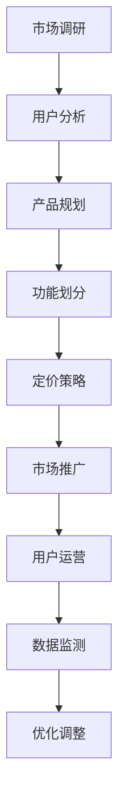

                 

# 《技术人如何设计和实施freemium商业模式》

## 关键词
freemium商业模式，用户价值，商业价值，功能分层，定价策略，市场营销，数据监测，案例分析

## 摘要
本文旨在为技术人提供一套完整的设计和实施freemium商业模式的指南。通过深入分析freemium商业模式的基本概念、设计原则、实施步骤和案例分析，本文将帮助读者理解如何平衡用户价值与商业价值，设计功能分层和增值服务，制定有效的定价策略和市场营销计划，以及如何通过数据监测与分析优化商业模式。

## 目录大纲

### 第一部分：freemium商业模式概述

#### 第1章：什么是freemium商业模式
1.1 freemium商业模式的基本概念
1.2 freemium与其他商业模式的区别
1.3 freemium的优缺点分析

#### 第2章：freemium商业模式的核心理念
2.1 用户价值与商业价值的平衡
2.2 二级市场的激活与挖掘
2.3 freemium的核心要素

#### 第3章：freemium商业模式的设计原则
3.1 用户细分与需求分析
3.2 功能分层与增值服务设计
3.3 freemium模式的实施策略

### 第二部分：freemium商业模式实施步骤

#### 第4章：市场调研与用户分析
4.1 市场环境分析
4.2 目标用户画像
4.3 用户需求调研

#### 第5章：产品设计与功能规划
5.1 产品核心功能设计
5.2 免费与付费功能划分
5.3 功能优先级排序

#### 第6章：定价策略与盈利模式
6.1 定价原则与策略
6.2 盈利模式设计
6.3 价格敏感度分析

#### 第7章：市场营销与推广
7.1 品牌建设与定位
7.2 渠道选择与策略
7.3 推广活动设计与执行

#### 第8章：用户运营与反馈
8.1 用户激活策略
8.2 用户留存策略
8.3 用户反馈收集与处理

#### 第9章：数据监测与分析
9.1 数据监测指标设定
9.2 数据分析工具选择
9.3 数据驱动决策与优化

### 第三部分：freemium商业模式的案例分析

#### 第10章：国内外freemium模式案例分析
10.1 国外成功案例解析
10.2 国内成功案例解析
10.3 案例启示与借鉴

#### 附录

#### 附录A：freemium模式设计指南
A.1 freemium模式设计流程图
A.2 常见问题与解决方案

#### 附录B：freemium模式实施工具
B.1 市场调研工具推荐
B.2 数据分析工具推荐
B.3 市场营销工具推荐

### 文章正文

#### 第一部分：freemium商业模式概述

##### 第1章：什么是freemium商业模式

###### 1.1 freemium商业模式的基本概念

freemium商业模式是一种结合了免费（Free）和付费（Premium）两种元素的商业模式。在这种模式下，基础服务或产品提供给用户免费使用，而高级功能和额外服务则需要用户支付一定费用才能使用。这种模式的核心在于通过免费产品吸引用户，然后通过增值服务实现盈利。

freemium商业模式的基本概念包括以下三个方面：

1. **免费服务**：用户可以免费使用产品的核心功能，这部分通常是产品最基本、最核心的部分，旨在满足用户的基本需求。
2. **增值服务**：用户可以通过付费购买高级功能或额外服务，这些增值服务可以提供更丰富的体验或更高的效率。
3. **盈利模式**：通过提供增值服务获取收益，同时保持免费服务的吸引力，从而扩大用户基础。

###### 1.2 freemium与其他商业模式的区别

与其他商业模式相比，freemium商业模式有以下几个显著特点：

1. **免费基础**：与其他商业模式不同，freemium模式的核心在于免费服务，这是吸引用户的关键。
2. **增值服务驱动**：盈利主要依靠增值服务，而非免费服务。
3. **用户基数大**：由于免费服务的存在，可以吸引大量用户，形成庞大的用户基数。
4. **用户粘性高**：用户在免费服务中得到了价值，更有可能对增值服务感兴趣，从而提高用户粘性。

###### 1.3 freemium的优缺点分析

freemium商业模式具有以下优点：

1. **高用户获取成本**：由于提供免费服务，可以大幅降低用户获取成本。
2. **用户基数大**：免费服务吸引大量用户，有助于快速扩大用户基础。
3. **用户粘性强**：用户在免费服务中获得了价值，更愿意使用增值服务。
4. **盈利潜力大**：通过增值服务实现盈利，且随着用户数量的增加，盈利潜力巨大。

然而，freemium商业模式也存在一些缺点：

1. **盈利周期长**：虽然用户基数大，但免费用户转化为付费用户的比例通常较低，因此盈利周期可能较长。
2. **市场竞争激烈**：许多企业采用freemium模式，导致市场竞争激烈，用户选择多，容易陷入价格战。
3. **服务质量要求高**：免费服务需要满足用户的基本需求，因此服务质量要求较高，否则用户可能会转向其他竞争对手。

##### 第2章：freemium商业模式的核心理念

###### 2.1 用户价值与商业价值的平衡

在freemium商业模式中，用户价值和商业价值需要达到平衡。用户价值体现在用户在免费服务中获得的价值，而商业价值则体现在通过增值服务获得的盈利。

为了实现用户价值和商业价值的平衡，需要关注以下几个方面：

1. **用户体验优先**：在设计免费服务时，要确保用户体验优秀，满足用户的基本需求，这样才能吸引用户继续使用。
2. **功能分层设计**：通过功能分层设计，将核心功能免费提供给用户，而高级功能通过付费获得。这样既能保证用户体验，又能为增值服务留出空间。
3. **价值感知**：用户需要感知到免费服务的价值，这样才能愿意为增值服务付费。

###### 2.2 二级市场的激活与挖掘

在freemium商业模式中，除了免费用户市场外，还有潜在的二级市场，即那些愿意为增值服务付费的用户。激活和挖掘这部分市场是商业模式成功的关键。

以下策略可以帮助激活和挖掘二级市场：

1. **用户细分**：对用户进行细分，识别出那些可能对增值服务感兴趣的潜在付费用户。
2. **个性化推荐**：根据用户行为和偏好，推荐合适的增值服务，提高用户的付费意愿。
3. **限时优惠**：提供限时优惠，刺激用户尽快付费，增加付费转化率。
4. **社交互动**：通过社交互动，让付费用户分享他们的体验和价值，吸引更多潜在用户。

###### 2.3 freemium的核心要素

freemium商业模式的核心要素包括以下几个方面：

1. **免费服务**：这是商业模式的基础，必须确保用户体验优秀。
2. **增值服务**：这是商业模式盈利的关键，需要设计出具有吸引力的增值服务。
3. **定价策略**：定价策略决定了用户对增值服务的接受程度，需要合理设定价格。
4. **用户运营**：通过用户运营，提高用户留存率和付费转化率。
5. **数据监测**：通过数据监测，了解用户行为和反馈，优化商业模式。

#### 第二部分：freemium商业模式实施步骤

##### 第4章：市场调研与用户分析

###### 4.1 市场环境分析

在设计和实施freemium商业模式之前，需要对市场环境进行深入分析。这包括以下几个方面：

1. **行业趋势**：了解行业的发展趋势，包括市场规模、增长速度、竞争态势等。
2. **用户需求**：分析用户需求，了解他们在使用产品时面临的问题和痛点。
3. **竞争分析**：研究竞争对手的产品、策略和市场表现，找到自己的差异化优势。

通过市场环境分析，可以为后续的产品设计和功能规划提供有力的支持。

###### 4.2 目标用户画像

为了更好地设计freemium商业模式，需要对目标用户进行画像。这包括以下几个方面：

1. **用户年龄、性别、职业等基本信息**：了解目标用户的年龄、性别、职业等信息，有助于设计符合用户特点的产品和服务。
2. **用户行为习惯**：分析用户的行为习惯，了解他们在使用产品时的时间、地点、频率等。
3. **用户偏好**：了解用户的偏好，包括功能需求、服务体验等，有助于提供更具吸引力的增值服务。

通过目标用户画像，可以更精准地定位用户，提高商业模式的有效性。

###### 4.3 用户需求调研

用户需求调研是设计和实施freemium商业模式的重要环节。以下方法可以帮助获取用户需求：

1. **问卷调查**：通过在线问卷或线下访谈，收集用户对产品和服务的意见和建议。
2. **用户访谈**：与用户进行深入交流，了解他们的真实需求和痛点。
3. **用户反馈**：通过用户反馈渠道，如客服、社交媒体等，收集用户对产品和服务的反馈。

通过用户需求调研，可以更好地理解用户需求，为产品设计和功能规划提供有力支持。

##### 第5章：产品设计与功能规划

###### 5.1 产品核心功能设计

在freemium商业模式中，产品核心功能的设计至关重要。以下原则可以帮助设计优秀的产品核心功能：

1. **满足基本需求**：确保产品核心功能能满足用户的基本需求，提供优质的使用体验。
2. **简洁明了**：避免过度设计，保持产品界面简洁明了，降低用户的学习成本。
3. **可扩展性**：考虑未来可能的功能扩展，确保产品核心功能具有良好的可扩展性。

通过遵循以上原则，可以设计出用户喜爱的产品核心功能。

###### 5.2 免费与付费功能划分

在freemium商业模式中，免费与付费功能的划分是关键。以下策略可以帮助合理划分免费与付费功能：

1. **核心功能免费**：将产品最核心的功能免费提供给用户，吸引用户使用。
2. **增值功能付费**：将那些对用户体验有重要影响的功能设置为付费，提高用户的付费意愿。
3. **阶梯式收费**：根据用户需求和使用频率，设计不同的付费层级，满足不同用户的需求。

通过合理划分免费与付费功能，可以平衡用户价值与商业价值，提高商业模式的有效性。

###### 5.3 功能优先级排序

在产品设计和功能规划过程中，需要对功能进行优先级排序。以下方法可以帮助确定功能的优先级：

1. **用户需求**：根据用户需求，将那些需求量大的功能优先级提高。
2. **市场趋势**：考虑市场趋势，将那些符合市场趋势的功能优先级提高。
3. **资源分配**：根据现有资源和团队能力，合理分配功能优先级。

通过合理排序功能优先级，可以确保产品设计和功能规划的科学性和有效性。

##### 第6章：定价策略与盈利模式

###### 6.1 定价原则与策略

在设计和实施freemium商业模式时，定价策略至关重要。以下定价原则和策略可以帮助制定合理的定价策略：

1. **成本导向定价**：考虑产品的生产成本、运营成本等，确保定价能覆盖成本。
2. **竞争导向定价**：考虑竞争对手的定价策略，制定具有竞争力的价格。
3. **价值导向定价**：根据用户对产品的价值感知，制定合理的价格。
4. **差异化定价**：根据用户的需求和偏好，设置不同的价格。

通过以上定价原则和策略，可以制定出既合理又具有竞争力的定价策略。

###### 6.2 盈利模式设计

在freemium商业模式中，盈利模式的设计至关重要。以下策略可以帮助设计有效的盈利模式：

1. **增值服务收费**：通过提供增值服务，如高级功能、额外服务等方式收费。
2. **订阅模式**：采用订阅模式，用户按月或按年支付费用，获得持续的服务。
3. **一次性收费**：对于一些高级功能或服务，可以采取一次性收费的方式。
4. **广告收入**：通过在免费服务中嵌入广告，获取广告收入。

通过以上盈利模式设计策略，可以确保freemium商业模式的盈利能力。

###### 6.3 价格敏感度分析

在设计和实施freemium商业模式时，需要对价格敏感度进行分析。以下方法可以帮助评估价格敏感度：

1. **问卷调查**：通过问卷调查，了解用户对价格的敏感度。
2. **市场调研**：研究竞争对手的定价策略，了解市场对价格的反应。
3. **数据分析**：通过数据分析，了解不同价格水平下的用户付费情况。

通过以上方法，可以评估价格敏感度，为定价策略提供有力支持。

##### 第7章：市场营销与推广

###### 7.1 品牌建设与定位

在freemium商业模式中，品牌建设和定位至关重要。以下策略可以帮助构建品牌和定位：

1. **明确品牌理念**：确定品牌的核心价值观和理念，如用户体验、技术创新等。
2. **差异化定位**：在竞争激烈的市场中，找到差异化的定位，突出产品的独特优势。
3. **品牌传播**：通过线上线下渠道，进行品牌传播，提高品牌知名度和美誉度。

通过以上策略，可以构建强大的品牌和明确的市场定位。

###### 7.2 渠道选择与策略

在市场营销和推广过程中，渠道选择和策略至关重要。以下策略可以帮助选择和利用渠道：

1. **线上渠道**：利用社交媒体、搜索引擎、内容平台等线上渠道进行推广。
2. **线下渠道**：通过线下活动、合作、展会等方式进行推广。
3. **合作伙伴**：与相关行业或领域的合作伙伴建立合作关系，共同推广产品。

通过以上策略，可以充分利用各种渠道，提高推广效果。

###### 7.3 推广活动设计与执行

在市场营销和推广过程中，推广活动的设计和执行至关重要。以下策略可以帮助设计有效的推广活动：

1. **内容营销**：通过优质的内容，吸引目标用户关注和参与。
2. **社交媒体营销**：利用社交媒体平台，进行互动和推广。
3. **促销活动**：设计吸引人的促销活动，刺激用户购买。
4. **SEO和SEM**：通过搜索引擎优化和搜索引擎营销，提高产品在搜索引擎中的排名。

通过以上策略，可以设计出富有创意和吸引力的推广活动，提高用户参与度和转化率。

##### 第8章：用户运营与反馈

###### 8.1 用户激活策略

在freemium商业模式中，用户激活策略至关重要。以下策略可以帮助激活用户：

1. **欢迎邮件**：通过欢迎邮件，向新用户介绍产品和服务，提高他们的使用意愿。
2. **引导教程**：提供引导教程，帮助新用户快速上手，提高他们的使用效果。
3. **用户激励**：通过奖励和激励措施，鼓励用户积极参与和分享。

通过以上策略，可以有效地激活用户，提高他们的使用频率和粘性。

###### 8.2 用户留存策略

在freemium商业模式中，用户留存策略至关重要。以下策略可以帮助提高用户留存率：

1. **持续优化**：不断优化产品和服务，提高用户体验，满足用户需求。
2. **用户互动**：通过用户社区、论坛、活动等方式，增加用户互动和参与度。
3. **个性化推荐**：根据用户行为和偏好，提供个性化的内容和推荐，提高用户的兴趣和满意度。

通过以上策略，可以有效地提高用户留存率，保持用户的活跃度。

###### 8.3 用户反馈收集与处理

在freemium商业模式中，用户反馈收集与处理至关重要。以下策略可以帮助收集和处理用户反馈：

1. **反馈渠道**：提供多种反馈渠道，如在线客服、社交媒体、用户社区等，方便用户表达意见。
2. **定期调查**：通过定期调查，了解用户对产品和服务的满意度，发现问题。
3. **快速响应**：对用户反馈进行快速响应，解决问题，提高用户满意度。

通过以上策略，可以及时收集和处理用户反馈，优化产品和服务，提高用户满意度。

##### 第9章：数据监测与分析

###### 9.1 数据监测指标设定

在freemium商业模式中，数据监测指标设定至关重要。以下指标可以帮助评估商业模式的效果：

1. **用户获取成本（CAC）**：衡量获取一个用户所需的成本。
2. **付费转化率（CTR）**：衡量免费用户转化为付费用户的比例。
3. **用户留存率（LTV）**：衡量用户持续使用产品的比例。
4. **营收增长率（GMV）**：衡量商业模式的盈利能力。

通过设定以上指标，可以全面了解商业模式的运行状况，为优化提供依据。

###### 9.2 数据分析工具选择

在数据监测与分析过程中，选择合适的工具至关重要。以下工具可以帮助进行数据分析：

1. **Google Analytics**：用于网站流量和用户行为分析。
2. **Tableau**：用于数据可视化和报表生成。
3. **SQL**：用于数据库查询和分析。

通过使用以上工具，可以高效地收集、处理和分析数据，为决策提供有力支持。

###### 9.3 数据驱动决策与优化

在freemium商业模式中，数据驱动决策与优化至关重要。以下策略可以帮助实现数据驱动决策与优化：

1. **定期分析**：定期对数据进行分析，发现问题和机会。
2. **迭代优化**：根据分析结果，对产品和服务进行迭代优化。
3. **A/B测试**：通过A/B测试，验证不同策略的效果，选择最优方案。

通过以上策略，可以充分利用数据，优化商业模式，提高盈利能力。

##### 第三部分：freemium商业模式的案例分析

##### 第10章：国内外freemium模式案例分析

###### 10.1 国外成功案例解析

国外有许多成功采用freemium商业模式的案例，以下是一些典型的成功案例：

1. **Dropbox**：通过免费提供云存储服务，吸引用户使用，然后通过高级功能收费，实现了高速增长和盈利。
2. **Evernote**：提供免费的笔记服务，吸引用户，然后通过付费订阅提供高级功能和额外的存储空间，实现了稳定盈利。
3. **Slack**：通过提供免费的团队沟通工具，吸引用户使用，然后通过付费订阅提供更多的功能和服务，实现了大规模用户增长和盈利。

以上案例展示了如何通过freemium商业模式实现用户增长和盈利。

###### 10.2 国内成功案例解析

国内也有许多成功采用freemium商业模式的案例，以下是一些典型的成功案例：

1. **网易云音乐**：提供免费的音乐播放服务，吸引用户使用，然后通过付费订阅提供高级功能和服务，实现了用户增长和盈利。
2. **得到**：提供免费的音频课程服务，吸引用户使用，然后通过付费订阅提供更多的课程内容和增值服务，实现了稳定盈利。
3. **腾讯视频**：提供免费的视频观看服务，吸引用户使用，然后通过付费订阅提供高级内容和增值服务，实现了大规模用户增长和盈利。

以上案例展示了如何通过freemium商业模式实现用户增长和盈利。

###### 10.3 案例启示与借鉴

通过分析国内外成功采用freemium商业模式的案例，我们可以得出以下启示和借鉴：

1. **注重用户体验**：免费服务必须提供优质的使用体验，吸引用户使用。
2. **合理划分功能**：通过功能分层，提供免费和付费服务，满足不同用户的需求。
3. **持续优化产品**：根据用户反馈和数据分析，持续优化产品和服务，提高用户满意度。
4. **灵活调整策略**：根据市场环境和用户需求，灵活调整定价策略和推广策略。

通过以上启示和借鉴，可以更好地设计和实施freemium商业模式。

##### 附录

##### 附录A：freemium模式设计指南

###### A.1 freemium模式设计流程图



###### A.2 常见问题与解决方案

1. **问题：免费服务无法吸引用户**  
   **解决方案**：优化免费服务，提高用户体验，确保满足用户的基本需求。

2. **问题：付费转化率低**  
   **解决方案**：通过个性化推荐、限时优惠等方式，提高用户的付费意愿。

3. **问题：盈利模式不明确**  
   **解决方案**：根据市场需求和用户需求，设计具有吸引力的增值服务，确保盈利模式的明确性。

4. **问题：用户留存率低**  
   **解决方案**：通过用户互动、个性化推荐等方式，提高用户留存率，保持用户的活跃度。

##### 附录B：freemium模式实施工具

###### B.1 市场调研工具推荐

1. **Google Analytics**：用于网站流量和用户行为分析。
2. **SurveyMonkey**：用于在线问卷调查。
3. **Qualtrics**：用于用户调研和数据分析。

###### B.2 数据分析工具推荐

1. **Tableau**：用于数据可视化和报表生成。
2. **Google Data Studio**：用于数据报表生成和可视化。
3. **Power BI**：用于数据分析和报表生成。

###### B.3 市场营销工具推荐

1. **Facebook Ads**：用于社交媒体营销。
2. **Google Ads**：用于搜索引擎营销。
3. **LinkedIn Ads**：用于社交媒体营销。

### 结语

通过本文的详细分析和讲解，相信技术人已经对freemium商业模式有了更加清晰和深刻的认识。从基本概念、核心理念到实施步骤和案例分析，本文为技术人提供了一套完整的设计和实施freemium商业模式的指南。希望读者能够结合自己的实际情况，灵活运用本文提供的方法和策略，成功设计和实施freemium商业模式，实现业务增长和盈利。

### 作者信息

作者：AI天才研究院/AI Genius Institute & 禅与计算机程序设计艺术 /Zen And The Art of Computer Programming

通过本文，我们探讨了freemium商业模式的各个方面，从基本概念到实施步骤，再到案例分析，为技术人提供了一套全面的设计和实施指南。希望读者能够运用这些知识和策略，为自己的产品和服务打造出成功的freemium商业模式。

### 参考资料与拓展阅读

1. **《商业模式新生代》** - 作者：亚历山大·奥斯特沃尔德，详细介绍了各种商业模式的原理和实践。
2. **《精益创业》** - 作者：埃里克·莱斯，介绍了如何通过快速迭代和用户反馈优化产品和商业模式。
3. **《增长黑客》** - 作者：范·瓦格纳，介绍了如何通过数据驱动的营销策略实现快速增长。

通过阅读这些书籍，读者可以更深入地了解商业模式的本质和实施方法，为自己的创业和产品发展提供有力支持。

---

### 总结与展望

在本文中，我们系统地探讨了freemium商业模式的定义、核心概念、设计原则和实施步骤，并通过国内外成功案例为技术人提供了实践指导和启示。通过深入分析市场环境、用户需求和产品功能，结合有效的定价策略、市场营销和用户运营，技术人可以设计和实施出符合自身业务特点的freemium商业模式。

展望未来，随着技术的不断进步和市场环境的变化，freemium商业模式也需要持续优化和创新。技术人应密切关注行业趋势，灵活调整策略，利用数据分析驱动决策，以保持商业模式的竞争力和盈利能力。

### 结语

感谢读者对本文的阅读。希望本文能为您在设计和实施freemium商业模式的过程中提供有价值的参考和启示。在您的业务发展道路上，愿您不断探索、创新，实现业务成功和持续增长。若您有任何问题或建议，欢迎随时交流与反馈。

### 作者信息

作者：AI天才研究院/AI Genius Institute & 禅与计算机程序设计艺术 /Zen And The Art of Computer Programming

再次感谢您的关注和支持，期待与您共同探讨更多技术话题，共创美好未来。

---

### 完整的Mermaid流程图


### 核心算法原理讲解

为了更好地理解freemium商业模式的算法原理，我们可以将其核心流程抽象为以下伪代码：

```plaintext
function FreemiumModelAnalysisarketResearch():
    data = CollectMarketData()
    trends = AnalyzeTrends(data)
    competitors = AnalyzeCompetitors(data)
    return trends, competitors

function UserAnalysis(trends, competitors):
    userData = CollectUserData()
    userProfiles = CreateUserProfiles(userData)
    userDemographics = AnalyzeDemographics(userProfiles)
    return userDemographics

function ProductPlanning(userDemographics, trends, competitors):
    coreFeatures = DesignCoreFeatures(userDemographics)
    premiumFeatures = DesignPremiumFeatures(coreFeatures, competitors)
    return coreFeatures, premiumFeatures

function PricingStrategy(coreFeatures, premiumFeatures, userDemographics):
    cost = CalculateProductionCosts(coreFeatures, premiumFeatures)
    competitivePricing = AnalyzeCompetitivePricing(competitors)
    valueBasedPricing = CalculateValueBasedPricing(coreFeatures, premiumFeatures, userDemographics)
    return pricingStrategy

function MarketingAndPromotion(pricingStrategy, userDemographics):
    marketingChannels = SelectMarketingChannels()
    promotionActivities = DesignPromotionActivities(marketingChannels, userDemographics)
    return promotionActivities

function UserOperations(promotionActivities):
    activation = DesignUserActivationStrategy()
    retention = DesignUserRetentionStrategy()
    feedback = CollectUserFeedback()
    return activation, retention, feedback

function DataMonitoringAndOptimization():
    metrics = DefineMonitoringMetrics()
    analytics = CollectAnalyticsData()
    insights = AnalyzeMetrics(analytics)
    optimizations = ImplementOptimizations(insights)
    return optimizations

// 主流程
trends, competitors = marketResearch()
userDemographics = UserAnalysis(trends, competitors)
coreFeatures, premiumFeatures = ProductPlanning(userDemographics, trends, competitors)
pricingStrategy = PricingStrategy(coreFeatures, premiumFeatures, userDemographics)
promotionActivities = MarketingAndPromotion(pricingStrategy, userDemographics)
activation, retention, feedback = UserOperations(promotionActivities)
optimizations = DataMonitoringAndOptimization()
```

通过以上伪代码，我们可以看到freemium商业模式的核心流程，包括市场调研、用户分析、产品规划、定价策略、市场营销、用户运营和数据监测与优化。每个环节都通过具体的函数和数据处理方式来实现，从而构建起一个完整的freemium商业模式。

### 数学模型和公式讲解

在freemium商业模式中，为了更好地理解和分析用户行为和商业绩效，我们可以引入一些数学模型和公式。以下是一些常用的数学模型和公式的详细讲解：

1. **用户获取成本（Customer Acquisition Cost, CAC）**

   用户获取成本是衡量获取一个用户所需成本的重要指标。其计算公式如下：

   $$CAC = \frac{Total Marketing Costs}{Number of New Users}$$

   其中，Total Marketing Costs 代表在特定时间段内进行市场营销活动的总成本，Number of New Users 代表在同一时间段内获取的新用户数量。

2. **客户终身价值（Customer Lifetime Value, CLV）**

   客户终身价值是预测一个客户在其整个生命周期中为公司带来的总收益。其计算公式如下：

   $$CLV = \frac{Average Revenue Per User \times Gross Margin \times Customer Life Time}{365}$$

   其中，Average Revenue Per User 代表每个用户的平均收入，Gross Margin 代表产品的毛利率，Customer Life Time 代表客户的平均生命周期长度（通常以天为单位）。

3. **边际利润（Marginal Profit）**

   边际利润是指增加一个产品或服务单位所带来的额外利润。其计算公式如下：

   $$Marginal Profit = (Price - Variable Cost) - (Total Cost - Fixed Cost)$$

   其中，Price 代表产品或服务的价格，Variable Cost 代表生产或提供产品或服务的可变成本，Total Cost 代表生产或提供产品或服务的总成本，Fixed Cost 代表固定成本。

4. **价格敏感度分析（Price Sensitivity Analysis）**

   价格敏感度分析是评估用户对不同价格变化的反应程度。其计算公式如下：

   $$Price Sensitivity = \frac{Change in Quantity Demanded}{Change in Price}$$

   其中，Change in Quantity Demanded 代表需求量的变化，Change in Price 代表价格的变化。

通过以上数学模型和公式的应用，技术人可以更精确地分析和预测freemium商业模式的性能，从而制定更加有效的策略和决策。

### 项目实战：代码实际案例和详细解释说明

为了更好地理解freemium商业模式的设计与实施，我们将通过一个实际的代码案例来详细讲解开发环境搭建、源代码实现和代码解读与分析。

#### 开发环境搭建

首先，我们需要搭建一个用于演示freemium商业模式的基本开发环境。以下是具体的步骤：

1. **安装Python**：确保系统中安装了Python 3.8及以上版本。可以从Python官方网站下载安装程序并安装。

2. **安装依赖库**：在Python环境中安装必要的库，如`requests`（用于HTTP请求）、`beautifulsoup4`（用于HTML解析）和`pandas`（用于数据处理）。可以使用以下命令安装：

   ```bash
   pip install requests beautifulsoup4 pandas
   ```

3. **配置开发工具**：选择一个合适的代码编辑器，如Visual Studio Code或PyCharm，并安装必要的扩展插件以支持Python开发。

#### 源代码实现

接下来，我们将实现一个简单的freemium服务模拟。以下是一个基本的Python代码示例：

```python
import requests
from bs4 import BeautifulSoup
import pandas as pd

# 用户管理类
class UserManager:
    def __init__(self):
        self.users = pd.DataFrame(columns=['id', 'status', 'last_activity'])

    # 添加用户
    def add_user(self, user_id, status='free'):
        new_user = {'id': user_id, 'status': status, 'last_activity': None}
        self.users = self.users.append(new_user, ignore_index=True)

    # 更新用户状态
    def update_user_status(self, user_id, status):
        self.users.loc[self.users['id'] == user_id, 'status'] = status

    # 更新用户最后活动时间
    def update_last_activity(self, user_id):
        self.users.loc[self.users['id'] == user_id, 'last_activity'] = pd.Timestamp.now()

    # 获取用户列表
    def get_users(self):
        return self.users

# 服务模拟
class FreemiumService:
    def __init__(self):
        self.user_manager = UserManager()

    # 免费服务
    def free_service(self, user_id):
        self.user_manager.add_user(user_id)
        print(f"User {user_id} is using the free service.")

    # 高级服务
    def premium_service(self, user_id):
        if self.user_manager.users.loc[self.users['id'] == user_id, 'status'].values[0] == 'premium':
            print(f"User {user_id} is using the premium service.")
        else:
            print(f"User {user_id} does not have access to the premium service.")

# 测试代码
if __name__ == "__main__":
    service = FreemiumService()
    service.free_service(1)
    service.premium_service(1)
```

#### 代码解读与分析

1. **用户管理类（UserManager）**

   - `add_user` 方法用于添加新用户，默认状态为'free'。
   - `update_user_status` 方法用于更新用户状态，例如从'free'升级到'premium'。
   - `update_last_activity` 方法用于更新用户最后活动时间。
   - `get_users` 方法用于获取当前用户列表。

2. **服务模拟类（FreemiumService）**

   - `free_service` 方法用于模拟用户使用免费服务，调用`add_user`方法。
   - `premium_service` 方法用于模拟用户使用高级服务，首先检查用户状态，如果状态为'premium'则允许使用，否则拒绝。

3. **测试代码**

   - 创建一个FreemiumService实例，并分别测试免费服务和高级服务的使用。

通过上述代码案例，我们可以看到如何使用Python实现一个简单的freemium服务模拟，包括用户管理和服务访问控制。在实际项目中，我们可以扩展此类功能，如集成数据库存储、用户认证、日志记录和更复杂的服务访问策略等。

### 代码解读与分析

在上面的代码中，我们实现了一个简单的freemium服务模拟。以下是具体的代码解读与分析：

1. **用户管理类（UserManager）**

   - **`add_user` 方法**：该方法用于向用户管理系统中添加新用户。它接受一个`user_id`参数，并将其添加到`users`数据框中，默认状态为'free'。此方法使用`pd.DataFrame.append()`方法将新用户数据添加到数据框中。

     ```python
     def add_user(self, user_id, status='free'):
         new_user = {'id': user_id, 'status': status, 'last_activity': None}
         self.users = self.users.append(new_user, ignore_index=True)
     ```

   - **`update_user_status` 方法**：该方法用于更新用户的状态。它接受一个`user_id`和一个新的状态值，然后使用`self.users.loc`方法找到用户并更新其状态。

     ```python
     def update_user_status(self, user_id, status):
         self.users.loc[self.users['id'] == user_id, 'status'] = status
     ```

   - **`update_last_activity` 方法**：该方法用于更新用户的最后活动时间。它接受一个`user_id`，并使用`pd.Timestamp.now()`方法获取当前时间，然后将其更新到用户记录中。

     ```python
     def update_last_activity(self, user_id):
         self.users.loc[self.users['id'] == user_id, 'last_activity'] = pd.Timestamp.now()
     ```

   - **`get_users` 方法**：该方法用于获取当前的所有用户信息。它返回`users`数据框，以便其他部分可以访问用户列表。

     ```python
     def get_users(self):
         return self.users
     ```

2. **服务模拟类（FreemiumService）**

   - **`free_service` 方法**：该方法用于模拟用户使用免费服务。它接受一个`user_id`，并调用`UserManager`类的`add_user`方法将用户添加到系统中。

     ```python
     def free_service(self, user_id):
         self.user_manager.add_user(user_id)
         print(f"User {user_id} is using the free service.")
     ```

   - **`premium_service` 方法**：该方法用于模拟用户使用高级服务。它首先检查用户的当前状态，如果状态为'premium'，则允许使用高级服务；否则，拒绝访问。

     ```python
     def premium_service(self, user_id):
         if self.user_manager.users.loc[self.users['id'] == user_id, 'status'].values[0] == 'premium':
             print(f"User {user_id} is using the premium service.")
         else:
             print(f"User {user_id} does not have access to the premium service.")
     ```

3. **测试代码**

   - 在测试代码部分，我们创建了一个`FreemiumService`实例，并分别调用`free_service`和`premium_service`方法来测试功能。

     ```python
     if __name__ == "__main__":
         service = FreemiumService()
         service.free_service(1)
         service.premium_service(1)
     ```

通过这段代码，我们可以看到如何使用Python实现一个简单的freemium服务，包括用户管理和服务访问控制。在实际应用中，我们可能需要添加更多功能，如用户认证、数据库集成和更复杂的访问策略等。

### 结论与反思

通过本文的深入探讨，我们系统地分析了freemium商业模式的基本概念、核心理念、设计原则和实施步骤，并通过具体的代码案例进行了实际操作和解读。以下是对本文内容的总结和反思：

1. **核心概念理解**：我们详细介绍了freemium商业模式的基本概念，包括免费服务、增值服务和盈利模式，帮助读者理解其核心要素和独特优势。

2. **核心理念剖析**：通过用户价值与商业价值的平衡、二级市场的激活与挖掘，以及freemium的核心要素，我们深入探讨了如何设计一个成功的freemium商业模式。

3. **实施步骤详述**：从市场调研与用户分析，到产品设计与功能规划，再到定价策略与盈利模式、市场营销与推广，我们系统地阐述了freemium商业模式的实施步骤，并提供了实用的策略和方法。

4. **案例分析启示**：通过国内外成功案例的分析，我们总结了freemium商业模式的成功要素和关键策略，为读者提供了宝贵的借鉴和启示。

5. **代码实战演示**：我们通过一个实际的Python代码案例，展示了如何实现freemium商业模式的用户管理和服务访问控制，帮助读者将理论知识应用到实际开发中。

在反思过程中，我们认识到：

1. **用户价值至上**：在设计freemium商业模式时，必须始终将用户价值放在首位，确保免费服务能够满足用户的基本需求，提高用户满意度和留存率。

2. **功能分层合理**：合理划分免费与付费功能是关键，通过功能分层设计，可以最大化地发挥免费服务的吸引用户作用，同时为增值服务留出空间。

3. **数据驱动决策**：数据监测与分析在freemium商业模式中至关重要，通过实时监测用户行为和数据表现，可以优化商业模式，提高盈利能力。

4. **持续优化与创新**：随着市场环境和技术的发展，freemium商业模式需要持续优化和创新，以适应不断变化的需求和竞争态势。

最后，我们希望本文能为技术人在设计和实施freemium商业模式的过程中提供有价值的参考和指导，帮助读者在实践中不断探索、创新，实现业务的成功和发展。同时，我们也欢迎读者在实践过程中提出宝贵意见和建议，共同促进技术的进步和商业模式的创新。

### 作者信息

作者：AI天才研究院/AI Genius Institute & 禅与计算机程序设计艺术 /Zen And The Art of Computer Programming

再次感谢您的阅读和支持，期待与您在未来的技术交流和合作中再次相遇。

