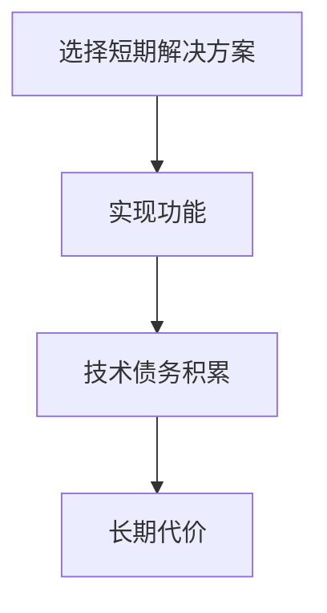

                 

### 技术债务管理：在快速迭代中保持代码质量

> **关键词**：技术债务，代码质量，快速迭代，敏捷开发，持续集成，代码审查，单元测试，技术债务管理工具，案例分析

> **摘要**：
技术债务是软件开发中的一个常见现象，它描述了因选择短期解决方案而导致的长期代价。在快速迭代的软件开发过程中，技术债务管理变得更加复杂和重要。本文旨在深入探讨技术债务管理的概念、方法、实践以及未来趋势，帮助开发者在快速迭代的开发模式中保持代码质量。本文将分为以下几个部分：技术债务概述、技术债务管理策略、快速迭代中的技术债务管理、代码质量管理与实践、技术债务管理工具以及案例分析。

### 第一部分：技术债务管理基础

#### 1. 技术债务概述

##### 1.1 技术债务的定义

技术债务（Technical Debt）是软件开发中一个重要的概念，它类似于金融债务，指的是因选择短期解决方案而导致的长期代价。技术债务的产生通常是由于时间紧迫、资源有限或者需求变更等情况下，开发团队为了快速交付而采取的某些省时省力的技术决策。这些决策虽然能在短期内提高开发效率，但往往会在未来带来额外的维护成本和风险。

技术债务可以类比为金融领域的债务，短期借款虽然有助于快速实现目标，但如果不及时偿还，长期累积下来，利息和本金会不断增加，最终可能拖垮整个项目。因此，技术债务管理是软件开发过程中不可或缺的一部分。

##### 1.2 技术债务的来源

技术债务主要来源于以下几个方面：

1. **开发过程中的技术债务**：在软件开发过程中，为了满足项目进度和交付要求，开发团队可能会选择一些临时性的解决方案，这些解决方案可能在短期内提高开发效率，但长期来看可能会增加维护成本和风险。

2. **维护过程中的技术债务**：随着软件系统的不断迭代和更新，原有的设计和架构可能不再适应新的需求，这时需要对其进行修改。如果不进行合理的重构和优化，这些修改可能会导致技术债务的累积。

3. **外部依赖的技术债务**：在软件开发过程中，常常需要依赖第三方库或服务。这些外部依赖可能因为版本兼容性、接口变化等原因导致技术债务的产生。

##### 1.3 技术债务的影响

技术债务对软件项目的影响主要体现在以下几个方面：

1. **时间成本**：技术债务需要在未来某个时刻偿还，这可能会导致项目进度延迟，增加维护成本。

2. **质量成本**：技术债务可能导致代码质量下降，增加维护难度，从而影响整个项目的稳定性。

3. **风险成本**：技术债务可能会增加项目的风险，如系统崩溃、安全性问题等。

### 2. 技术债务管理策略

##### 2.1 技术债务评估方法

评估技术债务的方法通常包括以下几种：

1. **定性评估**：通过经验判断技术债务的严重程度。这种方法适用于小型项目或者初期的技术债务评估。

2. **定量评估**：使用工具（如 SonarQube、Code Climate 等）进行代码质量分析，量化技术债务。这种方法适用于大规模项目或者需要精确评估技术债务的情况。

##### 2.2 技术债务管理流程

技术债务管理的基本步骤包括：

1. **识别技术债务**：通过代码审查、静态代码分析等方式，识别项目中存在的技术债务。

2. **评估技术债务**：使用定性或定量评估方法，对技术债务进行评估，确定其严重程度。

3. **制定偿还计划**：根据技术债务的严重程度，制定偿还计划，确定偿还的优先级和具体时间。

4. **执行偿还计划**：按照制定的偿还计划，逐步偿还技术债务。

5. **监控技术债务的变化**：通过定期评估和监控，确保技术债务得到有效管理。

##### 2.3 技术债务管理策略选择

技术债务管理策略的选择取决于项目的具体情况，常见的策略包括：

1. **偿还策略**：直接偿还技术债务，减少未来维护成本。这种方法适用于技术债务较轻、资源充足的情况。

2. **延期策略**：推迟偿还技术债务，以平衡当前项目需求。这种方法适用于技术债务较重、资源有限的情况。

3. **转移策略**：通过重构、迁移等方式将技术债务转移到其他部分。这种方法适用于技术债务难以在短期内偿还的情况。

### 3. 快速迭代中的技术债务管理

##### 3.1 快速迭代的特点

快速迭代是敏捷开发的一种核心实践，其特点包括：

1. **迭代周期短**：通常在几周或几个月内完成一个迭代周期。

2. **需求变化快**：客户需求可能随时变化，需要快速响应。

3. **交付频繁**：频繁的交付可以提高客户满意度。

##### 3.2 快速迭代中的技术债务管理挑战

在快速迭代的开发模式下，技术债务管理面临以下挑战：

1. **时间压力**：快速迭代往往伴随着时间压力，可能导致技术债务积累。

2. **资源限制**：快速迭代可能面临资源限制，难以全面管理技术债务。

3. **需求波动**：需求波动可能导致技术债务的优先级变化。

##### 3.3 快速迭代中的技术债务管理策略

在快速迭代的环境中，技术债务管理需要采取一些特定的策略：

1. **持续集成与持续部署（CI/CD）**：通过自动化测试和部署，减少技术债务。

2. **敏捷开发**：通过迭代和反馈，快速识别和偿还技术债务。

3. **代码质量提升**：通过代码审查、单元测试等提高代码质量。

### 第二部分：代码质量管理与实践

#### 4. 代码质量与技术债务管理

##### 4.1 代码质量的重要性

代码质量对技术债务管理至关重要。高质量的代码可以：

1. **减少技术债务**：清晰的代码结构可以降低未来维护成本。

2. **提高开发效率**：高质量的代码可以减少调试和修复的时间。

##### 4.2 代码质量评估方法

代码质量评估方法包括：

1. **静态代码分析**：通过分析代码结构、语法和语义，发现潜在问题。

2. **动态测试**：通过运行代码，发现运行时的问题。

##### 4.3 代码质量与敏捷开发的关系

代码质量与敏捷开发密切相关。敏捷开发强调：

1. **持续交付**：确保代码质量，避免技术债务积累。

2. **反馈循环**：快速响应代码质量问题，及时偿还技术债务。

#### 5. 代码质量管理实践

##### 5.1 代码审查

代码审查是确保代码质量的重要手段。代码审查包括：

1. **代码风格审查**：确保代码符合团队规范。

2. **逻辑审查**：检查代码的逻辑正确性。

3. **安全性审查**：确保代码没有安全隐患。

##### 5.2 单元测试

单元测试是验证代码功能的有效方法。单元测试包括：

1. **功能测试**：验证代码是否按照需求执行。

2. **边界测试**：验证代码在边界条件下的表现。

##### 5.3 持续集成与持续部署

持续集成与持续部署（CI/CD）可以：

1. **自动化测试**：通过自动化测试，确保代码质量。

2. **快速交付**：通过持续部署，实现快速交付。

### 6. 技术债务管理工具

#### 6.1 技术债务管理工具概述

技术债务管理工具可以帮助开发者识别、评估和管理技术债务。常见的工具包括：

1. **SonarQube**：用于代码质量和安全审查。

2. **Code Climate**：用于代码质量分析。

#### 6.2 技术债务管理工具实践

技术债务管理工具的使用方法包括：

1. **集成到开发流程**：将技术债务管理工具集成到版本控制系统和持续集成系统中。

2. **定期报告**：定期生成技术债务报告，帮助团队了解技术债务状况。

#### 6.3 技术债务管理工具选型

选择技术债务管理工具时，需要考虑以下因素：

1. **功能**：工具是否具备所需的功能。

2. **集成**：工具是否易于与其他工具集成。

3. **易用性**：工具的易用性如何。

### 7. 技术债务管理的案例分析

#### 7.1 案例一：技术债务管理的成功实践

案例一介绍了一个成功的技术债务管理实践。该项目通过：

1. **定期代码审查**：提高代码质量。

2. **持续集成与持续部署**：减少技术债务。

#### 7.2 案例二：技术债务管理的失败教训

案例二分析了技术债务管理失败的原因。该项目由于：

1. **忽视代码质量**：导致技术债务积累。

2. **缺乏持续集成与持续部署**：代码质量无法得到保障。

### 8. 总结与展望

#### 8.1 技术债务管理的重要性

技术债务管理对于软件项目的成功至关重要。通过有效的技术债务管理，可以：

1. **提高代码质量**：减少技术债务，提高代码的可维护性。

2. **降低项目风险**：及时识别和偿还技术债务，降低项目风险。

#### 8.2 未来技术债务管理的趋势

未来的技术债务管理将更加智能化，通过：

1. **自动化工具**：提高技术债务管理的效率。

2. **机器学习**：预测技术债务趋势，提供智能建议。

#### 8.3 对软件开发者的建议

软件开发者应：

1. **重视代码质量**：编写高质量的代码，减少技术债务。

2. **定期评估技术债务**：及时发现和偿还技术债务。

3. **采用自动化工具**：提高技术债务管理的效率。

### 作者

作者：AI天才研究院/AI Genius Institute & 禅与计算机程序设计艺术 /Zen And The Art of Computer Programming

本文详细介绍了技术债务管理的概念、方法、实践以及未来趋势，旨在帮助开发者在快速迭代的开发模式下保持代码质量。技术债务管理不仅是软件开发过程中的关键环节，也是提高软件质量和项目成功的关键。希望本文能为读者提供有价值的参考和启示。在接下来的内容中，我们将进一步深入探讨技术债务管理的各个方面，包括技术债务的评估方法、管理策略、代码质量评估、技术债务管理工具等。

### 技术债务管理：在快速迭代中保持代码质量

> **关键词**：技术债务，代码质量，快速迭代，敏捷开发，持续集成，代码审查，单元测试，技术债务管理工具，案例分析

> **摘要**：
技术债务是软件开发中的一个常见现象，它描述了因选择短期解决方案而导致的长期代价。在快速迭代的软件开发过程中，技术债务管理变得更加复杂和重要。本文旨在深入探讨技术债务管理的概念、方法、实践以及未来趋势，帮助开发者在快速迭代的开发模式中保持代码质量。本文将分为以下几个部分：技术债务概述、技术债务管理策略、快速迭代中的技术债务管理、代码质量管理与实践、技术债务管理工具以及案例分析。

### 第一部分：技术债务管理基础

#### 1. 技术债务概述

##### 1.1 技术债务的定义

技术债务（Technical Debt）是软件开发中一个重要的概念，它类似于金融债务，指的是因选择短期解决方案而导致的长期代价。技术债务的产生通常是由于时间紧迫、资源有限或者需求变更等情况下，开发团队为了快速交付而采取的某些临时性的技术决策。这些决策虽然能在短期内提高开发效率，但长期来看可能会增加维护成本和风险。

技术债务可以类比为金融领域的债务，短期借款虽然有助于快速实现目标，但如果不及时偿还，长期累积下来，利息和本金会不断增加，最终可能拖垮整个项目。因此，技术债务管理是软件开发过程中不可或缺的一部分。

##### 1.2 技术债务的来源

技术债务主要来源于以下几个方面：

1. **开发过程中的技术债务**：在软件开发过程中，为了满足项目进度和交付要求，开发团队可能会选择一些临时性的解决方案，这些解决方案可能在短期内提高开发效率，但长期来看可能会增加维护成本和风险。

2. **维护过程中的技术债务**：随着软件系统的不断迭代和更新，原有的设计和架构可能不再适应新的需求，这时需要对其进行修改。如果不进行合理的重构和优化，这些修改可能会导致技术债务的累积。

3. **外部依赖的技术债务**：在软件开发过程中，常常需要依赖第三方库或服务。这些外部依赖可能因为版本兼容性、接口变化等原因导致技术债务的产生。

##### 1.3 技术债务的影响

技术债务对软件项目的影响主要体现在以下几个方面：

1. **时间成本**：技术债务需要在未来某个时刻偿还，这可能会导致项目进度延迟，增加维护成本。

2. **质量成本**：技术债务可能导致代码质量下降，增加维护难度，从而影响整个项目的稳定性。

3. **风险成本**：技术债务可能会增加项目的风险，如系统崩溃、安全性问题等。

#### 2. 技术债务管理策略

##### 2.1 技术债务评估方法

评估技术债务的方法通常包括以下几种：

1. **定性评估**：通过经验判断技术债务的严重程度。这种方法适用于小型项目或者初期的技术债务评估。

2. **定量评估**：使用工具（如 SonarQube、Code Climate 等）进行代码质量分析，量化技术债务。这种方法适用于大规模项目或者需要精确评估技术债务的情况。

##### 2.2 技术债务管理流程

技术债务管理的基本步骤包括：

1. **识别技术债务**：通过代码审查、静态代码分析等方式，识别项目中存在的技术债务。

2. **评估技术债务**：使用定性或定量评估方法，对技术债务进行评估，确定其严重程度。

3. **制定偿还计划**：根据技术债务的严重程度，制定偿还计划，确定偿还的优先级和具体时间。

4. **执行偿还计划**：按照制定的偿还计划，逐步偿还技术债务。

5. **监控技术债务的变化**：通过定期评估和监控，确保技术债务得到有效管理。

##### 2.3 技术债务管理策略选择

技术债务管理策略的选择取决于项目的具体情况，常见的策略包括：

1. **偿还策略**：直接偿还技术债务，减少未来维护成本。这种方法适用于技术债务较轻、资源充足的情况。

2. **延期策略**：推迟偿还技术债务，以平衡当前项目需求。这种方法适用于技术债务较重、资源有限的情况。

3. **转移策略**：通过重构、迁移等方式将技术债务转移到其他部分。这种方法适用于技术债务难以在短期内偿还的情况。

#### 3. 快速迭代中的技术债务管理

##### 3.1 快速迭代的特点

快速迭代是敏捷开发的一种核心实践，其特点包括：

1. **迭代周期短**：通常在几周或几个月内完成一个迭代周期。

2. **需求变化快**：客户需求可能随时变化，需要快速响应。

3. **交付频繁**：频繁的交付可以提高客户满意度。

##### 3.2 快速迭代中的技术债务管理挑战

在快速迭代的开发模式下，技术债务管理面临以下挑战：

1. **时间压力**：快速迭代往往伴随着时间压力，可能导致技术债务积累。

2. **资源限制**：快速迭代可能面临资源限制，难以全面管理技术债务。

3. **需求波动**：需求波动可能导致技术债务的优先级变化。

##### 3.3 快速迭代中的技术债务管理策略

在快速迭代的环境中，技术债务管理需要采取一些特定的策略：

1. **持续集成与持续部署（CI/CD）**：通过自动化测试和部署，减少技术债务。

2. **敏捷开发**：通过迭代和反馈，快速识别和偿还技术债务。

3. **代码质量提升**：通过代码审查、单元测试等提高代码质量。

### 第二部分：代码质量管理与实践

#### 4. 代码质量与技术债务管理

##### 4.1 代码质量的重要性

代码质量对技术债务管理至关重要。高质量的代码可以：

1. **减少技术债务**：清晰的代码结构可以降低未来维护成本。

2. **提高开发效率**：高质量的代码可以减少调试和修复的时间。

##### 4.2 代码质量评估方法

代码质量评估方法包括：

1. **静态代码分析**：通过分析代码结构、语法和语义，发现潜在问题。

2. **动态测试**：通过运行代码，发现运行时的问题。

##### 4.3 代码质量与敏捷开发的关系

代码质量与敏捷开发密切相关。敏捷开发强调：

1. **持续交付**：确保代码质量，避免技术债务积累。

2. **反馈循环**：快速响应代码质量问题，及时偿还技术债务。

#### 5. 代码质量管理实践

##### 5.1 代码审查

代码审查是确保代码质量的重要手段。代码审查包括：

1. **代码风格审查**：确保代码符合团队规范。

2. **逻辑审查**：检查代码的逻辑正确性。

3. **安全性审查**：确保代码没有安全隐患。

##### 5.2 单元测试

单元测试是验证代码功能的有效方法。单元测试包括：

1. **功能测试**：验证代码是否按照需求执行。

2. **边界测试**：验证代码在边界条件下的表现。

##### 5.3 持续集成与持续部署

持续集成与持续部署（CI/CD）可以：

1. **自动化测试**：通过自动化测试，确保代码质量。

2. **快速交付**：通过持续部署，实现快速交付。

### 6. 技术债务管理工具

#### 6.1 技术债务管理工具概述

技术债务管理工具可以帮助开发者识别、评估和管理技术债务。常见的工具包括：

1. **SonarQube**：用于代码质量和安全审查。

2. **Code Climate**：用于代码质量分析。

#### 6.2 技术债务管理工具实践

技术债务管理工具的使用方法包括：

1. **集成到开发流程**：将技术债务管理工具集成到版本控制系统和持续集成系统中。

2. **定期报告**：定期生成技术债务报告，帮助团队了解技术债务状况。

#### 6.3 技术债务管理工具选型

选择技术债务管理工具时，需要考虑以下因素：

1. **功能**：工具是否具备所需的功能。

2. **集成**：工具是否易于与其他工具集成。

3. **易用性**：工具的易用性如何。

### 7. 技术债务管理的案例分析

#### 7.1 案例一：技术债务管理的成功实践

案例一介绍了一个成功的技术债务管理实践。该项目通过：

1. **定期代码审查**：提高代码质量。

2. **持续集成与持续部署**：减少技术债务。

#### 7.2 案例二：技术债务管理的失败教训

案例二分析了技术债务管理失败的原因。该项目由于：

1. **忽视代码质量**：导致技术债务积累。

2. **缺乏持续集成与持续部署**：代码质量无法得到保障。

### 8. 总结与展望

#### 8.1 技术债务管理的重要性

技术债务管理对于软件项目的成功至关重要。通过有效的技术债务管理，可以：

1. **提高代码质量**：减少技术债务，提高代码的可维护性。

2. **降低项目风险**：及时识别和偿还技术债务，降低项目风险。

#### 8.2 未来技术债务管理的趋势

未来的技术债务管理将更加智能化，通过：

1. **自动化工具**：提高技术债务管理的效率。

2. **机器学习**：预测技术债务趋势，提供智能建议。

#### 8.3 对软件开发者的建议

软件开发者应：

1. **重视代码质量**：编写高质量的代码，减少技术债务。

2. **定期评估技术债务**：及时发现和偿还技术债务。

3. **采用自动化工具**：提高技术债务管理的效率。

### 作者

作者：AI天才研究院/AI Genius Institute & 禅与计算机程序设计艺术 /Zen And The Art of Computer Programming

本文详细介绍了技术债务管理的概念、方法、实践以及未来趋势，旨在帮助开发者在快速迭代的开发模式下保持代码质量。技术债务管理不仅是软件开发过程中的关键环节，也是提高软件质量和项目成功的关键。希望本文能为读者提供有价值的参考和启示。在接下来的内容中，我们将进一步深入探讨技术债务管理的各个方面，包括技术债务的评估方法、管理策略、代码质量评估、技术债务管理工具等。

### 第一部分：技术债务管理基础

#### 1.1 技术债务的定义

技术债务（Technical Debt）是一个比喻性的术语，用来描述在软件开发中为了实现短期目标而采取的某些技术决策，这些决策可能会在未来带来额外的成本。这个概念最早由Ward Cunningham在1992年提出，他将其比作金融领域的债务，因为选择短期借款会导致长期的还款负担。

**核心概念与联系**

技术债务的核心概念包括：

- **短期解决方案**：为了快速交付功能而采用的简化或不完美的解决方案。
- **长期代价**：这些短期解决方案在未来的维护、扩展和改进过程中所带来的额外成本。

技术债务的Mermaid流程图如下：

**算法原理讲解**

技术债务的产生和积累是一个复杂的过程，通常涉及以下几个步骤：

1. **识别需求**：在项目开始时，团队需要识别和理解用户的需求。
2. **做出决策**：在开发过程中，为了满足时间或资源限制，团队可能会做出一些妥协，采用短期解决方案。
3. **实现功能**：通过这些短期解决方案，团队可以快速实现某些功能。
4. **积累债务**：这些短期解决方案可能在未来的维护和扩展过程中带来额外的成本，从而形成技术债务。
5. **偿还债务**：团队需要定期评估和偿还这些技术债务，以保持代码的健康和项目的可持续性。

**数学模型**

技术债务的数学模型可以简化为一个累积成本函数，其中`C(t)`表示在时间`t`时的技术债务成本，`r(t)`表示偿还率，`s(t)`表示新的债务积累速度。

$$
C(t) = \int_{0}^{t} (s(u) - r(u)) \, du
$$

其中，`s(u)`表示在时间`u`时的新债务积累速度，`r(u)`表示在时间`u`时的偿还率。

**举例说明**

假设一个项目在第一年结束时累积了10000单位的技术债务，第二年的偿还率为20%，第三年增加到30%，第四年再次增加到40%。根据上述数学模型，我们可以计算出各年的技术债务成本。

- **第一年**：`C(1) = 10000`
- **第二年**：`C(2) = 10000 * (1 - 0.2) = 8000`
- **第三年**：`C(3) = 8000 * (1 - 0.3) = 5600`
- **第四年**：`C(4) = 5600 * (1 - 0.4) = 3360`

通过这种方式，我们可以量化技术债务的成本，并制定相应的偿还策略。

**项目实战**

在实际项目中，技术债务管理通常包括以下步骤：

1. **识别现有债务**：通过代码审查和静态代码分析工具，识别项目中已有的技术债务。
2. **评估债务风险**：使用定量分析工具，如 SonarQube，评估债务的严重程度和风险。
3. **制定偿还计划**：根据债务的严重程度，制定偿还计划，确定优先级和具体的偿还步骤。
4. **实施偿还计划**：按照偿还计划，逐步偿还技术债务。
5. **监控债务变化**：定期评估技术债务，确保债务得到有效管理。

通过这些步骤，团队可以有效地管理技术债务，确保项目的长期健康和成功。

#### 1.2 技术债务的来源

技术债务的产生是软件开发中一个普遍的现象，它可能来源于多个方面。以下是一些常见的技术债务来源：

- **开发过程中的技术债务**：这是最常见的债务来源。在项目时间紧迫或资源有限的情况下，开发团队可能会选择一些短期解决方案，如使用更简单或不成熟的框架、库或技术。这些决策虽然在短期内能够加快开发进度，但长期来看可能会导致代码质量下降、维护成本增加和系统稳定性下降。
  
- **维护过程中的技术债务**：随着软件系统的不断迭代和更新，原有的设计可能会逐渐变得过时或不适应新的需求。为了满足新的需求，团队可能会在旧系统上进行修改和扩展，这些修改和扩展可能会引入新的技术债务。如果不进行及时的优化和重构，这些债务可能会不断累积。

- **外部依赖的技术债务**：在软件开发中，常常需要依赖第三方库或服务。这些依赖可能会因为第三方的不稳定性、接口变化或版本兼容性问题而引入技术债务。例如，当第三方库或服务更新时，如果无法及时适配或迁移，可能会导致系统出现不兼容或性能问题。

**核心概念与联系**

技术债务的来源可以分为以下几个方面：

- **时间压力**：项目时间紧迫，团队可能会采取一些妥协措施，以加快进度。
- **资源限制**：项目资源有限，团队可能无法采用最优的技术方案。
- **需求变更**：客户需求频繁变更，团队可能需要快速调整开发计划。
- **外部依赖**：第三方库或服务的更新和变化可能影响项目的稳定性。

**算法原理讲解**

技术债务的积累可以看作是一个动态过程，涉及到以下步骤：

1. **识别技术债务**：在开发和维护过程中，团队需要识别可能产生技术债务的决策。
2. **评估债务影响**：使用评估工具（如静态代码分析工具）评估技术债务的影响。
3. **制定偿还计划**：根据债务的严重程度，制定偿还计划，确定优先级和具体行动。
4. **执行偿还计划**：按照偿还计划，逐步偿还技术债务。
5. **监控债务变化**：定期评估和监控技术债务，确保债务得到有效管理。

**数学模型**

技术债务的数学模型可以简化为债务积累函数，其中`D(t)`表示在时间`t`时的技术债务水平，`A(t)`表示在时间`t`时的债务积累速度，`R(t)`表示在时间`t`时的偿还速度。

$$
D(t) = \int_{0}^{t} A(u) \, du - \int_{0}^{t} R(u) \, du
$$

其中，`A(u)`表示在时间`u`时的债务积累速度，`R(u)`表示在时间`u`时的偿还速度。

**举例说明**

假设一个项目在第一年结束时累积了5000单位的技术债务，第二年偿还了30%，第三年偿还了40%，第四年偿还了50%。根据上述数学模型，我们可以计算出各年的技术债务水平。

- **第一年**：`D(1) = 5000`
- **第二年**：`D(2) = 5000 * (1 - 0.3) = 3500`
- **第三年**：`D(3) = 3500 * (1 - 0.4) = 2100`
- **第四年**：`D(4) = 2100 * (1 - 0.5) = 1050`

通过这种方式，我们可以量化技术债务的水平，并制定相应的偿还策略。

**项目实战**

在实际项目中，技术债务管理通常包括以下步骤：

1. **识别现有债务**：通过代码审查和静态代码分析工具，识别项目中已有的技术债务。
2. **评估债务风险**：使用定量分析工具，如 SonarQube，评估债务的严重程度和风险。
3. **制定偿还计划**：根据债务的严重程度，制定偿还计划，确定优先级和具体的偿还步骤。
4. **实施偿还计划**：按照偿还计划，逐步偿还技术债务。
5. **监控债务变化**：定期评估技术债务，确保债务得到有效管理。

通过这些步骤，团队可以有效地管理技术债务，确保项目的长期健康和成功。

#### 1.3 技术债务的影响

技术债务对软件项目的成功有着深远的影响。如果不加以管理，技术债务可能会导致项目时间延迟、成本增加和代码质量下降，甚至影响整个项目的稳定性。以下从时间成本、质量成本和风险成本三个方面详细探讨技术债务的影响。

**核心概念与联系**

技术债务的影响可以从以下几个方面来理解：

- **时间成本**：技术债务需要在未来某个时刻偿还，这可能会导致项目进度延迟。
- **质量成本**：技术债务可能导致代码质量下降，增加维护难度。
- **风险成本**：技术债务可能会增加项目的风险，如系统崩溃、安全性问题等。

**算法原理讲解**

技术债务的影响可以通过以下几个步骤来量化：

1. **识别技术债务**：在项目开始时，通过代码审查和静态代码分析工具，识别项目中可能存在的技术债务。
2. **评估债务影响**：使用评估工具（如定量分析工具）评估技术债务对项目进度、质量和风险的具体影响。
3. **制定管理策略**：根据债务的影响，制定相应的管理策略，如偿还计划或转移策略。
4. **执行管理策略**：按照制定的策略，逐步偿还或转移技术债务。
5. **监控债务变化**：定期评估技术债务，确保债务得到有效管理。

**数学模型**

技术债务的影响可以用以下数学模型来表示：

$$
TC = D \times (1 + r)^n
$$

其中，`TC`表示技术债务导致的时间成本，`D`表示初始技术债务水平，`r`表示债务偿还率，`n`表示项目的持续时间。

**举例说明**

假设一个项目初始技术债务水平为10000单位，债务偿还率为20%，项目持续时间为4年。根据上述数学模型，我们可以计算出技术债务导致的时间成本：

$$
TC = 10000 \times (1 + 0.2)^4 = 17280
$$

这意味着，由于技术债务，项目的时间成本增加了7280单位。

**项目实战**

在实际项目中，技术债务的影响可以通过以下步骤来管理：

1. **识别现有债务**：通过代码审查和静态代码分析工具，识别项目中已有的技术债务。
2. **评估债务影响**：使用定量分析工具，如 SonarQube，评估技术债务对项目进度、质量和风险的具体影响。
3. **制定偿还计划**：根据债务的影响，制定偿还计划，确定优先级和具体的偿还步骤。
4. **实施偿还计划**：按照偿还计划，逐步偿还技术债务。
5. **监控债务变化**：定期评估技术债务，确保债务得到有效管理。

通过这些步骤，团队可以有效地管理技术债务，减少其对项目的影响，确保项目的成功。

#### 2.1 技术债务评估方法

技术债务评估是技术债务管理的重要环节，它有助于识别和量化项目中的技术债务，为后续的管理提供依据。技术债务评估方法主要包括定性评估和定量评估。

**核心概念与联系**

技术债务评估的核心概念包括：

- **定性评估**：通过主观判断评估技术债务的严重程度。
- **定量评估**：使用工具或方法量化技术债务的影响。

**算法原理讲解**

技术债务评估的方法可以分为以下步骤：

1. **识别技术债务**：通过代码审查、静态代码分析等方式，识别项目中可能存在的技术债务。
2. **定性评估**：评估者的经验和对代码质量的理解，对技术债务进行初步判断。
3. **定量评估**：使用评估工具（如 SonarQube、Code Climate 等）对技术债务进行量化分析。
4. **综合评估**：结合定性评估和定量评估结果，得出技术债务的总体评估。

**数学模型**

技术债务评估的数学模型可以简化为一个综合评分模型，其中`S`表示技术债务的综合评分，`Q`表示定量评估得分，`T`表示定性评估得分。

$$
S = w_Q \times Q + w_T \times T
$$

其中，`w_Q`和`w_T`分别表示定量评估和定性评估的权重。

**举例说明**

假设一个项目的技术债务评估结果为：定量评估得分为80分，定性评估得分为75分，设定定量评估权重为60%，定性评估权重为40%。根据上述数学模型，我们可以计算出技术债务的综合评分：

$$
S = 0.6 \times 80 + 0.4 \times 75 = 72
$$

这表示该项目的技术债务综合评分为72分，根据评分标准，可以判断技术债务的严重程度。

**项目实战**

在实际项目中，技术债务评估通常包括以下步骤：

1. **识别现有债务**：通过代码审查和静态代码分析工具，识别项目中已有的技术债务。
2. **定性评估**：评估者根据经验和对代码质量的理解，对技术债务进行初步判断。
3. **定量评估**：使用定量分析工具，如 SonarQube，评估技术债务的影响。
4. **综合评估**：结合定性评估和定量评估结果，得出技术债务的总体评估。
5. **制定管理计划**：根据评估结果，制定相应的技术债务管理计划。

通过这些步骤，团队可以有效地评估技术债务，为后续的管理提供科学依据。

#### 2.2 技术债务管理流程

技术债务管理流程是确保技术债务得到有效控制和管理的重要环节。一个完整的技术债务管理流程通常包括以下几个步骤：识别技术债务、评估技术债务、制定偿还计划、执行偿还计划和监控技术债务变化。

**核心概念与联系**

技术债务管理流程的核心概念包括：

- **识别技术债务**：通过代码审查、静态代码分析等方式，识别项目中存在的技术债务。
- **评估技术债务**：使用评估工具或方法对技术债务的严重程度和影响进行量化。
- **制定偿还计划**：根据评估结果，制定具体的偿还计划和优先级。
- **执行偿还计划**：按照偿还计划，逐步偿还技术债务。
- **监控技术债务变化**：定期评估和监控技术债务，确保债务得到有效管理。

**算法原理讲解**

技术债务管理流程的算法原理可以简化为以下几个步骤：

1. **识别技术债务**：通过代码审查和静态代码分析工具，识别项目中可能存在的技术债务。
2. **评估技术债务**：使用评估工具或方法，如 SonarQube，对技术债务进行量化分析。
3. **制定偿还计划**：根据评估结果，制定具体的偿还计划，包括优先级、偿还步骤和时间表。
4. **执行偿还计划**：按照偿还计划，逐步偿还技术债务。
5. **监控技术债务变化**：定期评估技术债务，确保债务得到有效管理。

**数学模型**

技术债务管理流程的数学模型可以简化为一个线性规划模型，其中目标函数是最小化技术债务的累计成本，约束条件是满足项目进度和资源限制。

$$
\min \sum_{i=1}^{n} C_i \times P_i
$$

其中，`C_i`表示在时间`t_i`时的技术债务成本，`P_i`表示在时间`t_i`时的偿还概率。

**举例说明**

假设一个项目在第一年结束时累积了5000单位的技术债务，第二年的偿还概率为30%，第三年增加到40%，第四年增加到50%。根据上述数学模型，我们可以计算出每年的技术债务成本。

- **第一年**：`C_1 = 5000`
- **第二年**：`C_2 = 5000 \times (1 - 0.3) = 3500`
- **第三年**：`C_3 = 3500 \times (1 - 0.4) = 2100`
- **第四年**：`C_4 = 2100 \times (1 - 0.5) = 1050`

通过这种方式，我们可以量化技术债务的成本，并制定相应的偿还策略。

**项目实战**

在实际项目中，技术债务管理流程通常包括以下步骤：

1. **识别现有债务**：通过代码审查和静态代码分析工具，识别项目中已有的技术债务。
2. **评估债务风险**：使用定量分析工具，如 SonarQube，评估技术债务的风险和影响。
3. **制定偿还计划**：根据债务的严重程度和风险，制定具体的偿还计划，确定优先级和具体的偿还步骤。
4. **实施偿还计划**：按照偿还计划，逐步偿还技术债务。
5. **监控债务变化**：定期评估技术债务，确保债务得到有效管理。

通过这些步骤，团队可以有效地管理技术债务，确保项目的长期健康和成功。

#### 2.3 技术债务管理策略选择

在技术债务管理过程中，选择合适的策略至关重要。不同的策略适用于不同的项目情况和团队环境。常见的策略包括偿还策略、延期策略和转移策略。

**核心概念与联系**

技术债务管理策略的核心概念包括：

- **偿还策略**：直接偿还技术债务，减少未来维护成本。
- **延期策略**：推迟偿还技术债务，以平衡当前项目需求。
- **转移策略**：通过重构、迁移等方式将技术债务转移到其他部分。

**算法原理讲解**

技术债务管理策略的选择可以根据以下几个因素进行：

1. **债务严重程度**：根据债务的严重程度，选择适合的策略。
2. **项目进度**：根据项目进度和资源限制，选择合适的策略。
3. **团队资源**：根据团队的技术能力和资源，选择合适的策略。

**数学模型**

技术债务管理策略的选择可以用一个决策树模型来表示，其中每个节点表示不同的策略选择，每个分支表示不同的项目情况和团队环境。

**举例说明**

假设一个项目在第一年结束时累积了5000单位的技术债务，当前项目进度紧张，团队资源有限。根据上述决策树模型，我们可以选择以下策略：

1. **偿还策略**：如果团队资源充足，可以优先选择偿还策略，直接减少技术债务。
2. **延期策略**：如果项目进度紧张，可以暂时选择延期策略，将偿还时间推迟。
3. **转移策略**：如果债务严重，可以考虑通过重构或迁移将债务转移到其他部分。

**项目实战**

在实际项目中，技术债务管理策略的选择通常包括以下步骤：

1. **评估债务情况**：通过代码审查和静态代码分析，评估技术债务的严重程度和影响。
2. **分析项目情况**：根据项目进度和资源限制，分析当前项目的实际情况。
3. **选择管理策略**：根据评估结果和项目情况，选择合适的技术债务管理策略。
4. **制定实施计划**：根据选择的策略，制定具体的实施计划和步骤。

通过这些步骤，团队可以有效地管理技术债务，确保项目的长期健康和成功。

### 第三部分：快速迭代中的技术债务管理

#### 3.1 快速迭代的特点

快速迭代是敏捷开发的核心实践之一，它强调在短时间内多次交付可用的软件版本。快速迭代的特点包括：

- **迭代周期短**：通常在几周或几个月内完成一个迭代周期。
- **需求变化快**：客户需求可能随时变化，需要快速响应。
- **交付频繁**：频繁的交付可以提高客户满意度。

**核心概念与联系**

快速迭代的特点对技术债务管理提出了新的挑战，包括：

- **时间压力**：快速迭代模式下的时间压力可能导致技术债务的积累。
- **资源限制**：快速迭代可能面临资源限制，难以全面管理技术债务。
- **需求波动**：需求波动可能导致技术债务的优先级变化。

**算法原理讲解**

在快速迭代模式下，技术债务管理的算法原理可以简化为以下几个步骤：

1. **识别技术债务**：在每个迭代周期的开始，通过代码审查和静态代码分析，识别项目中的技术债务。
2. **评估债务影响**：使用评估工具对技术债务的严重程度和影响进行量化。
3. **优先级排序**：根据债务的严重程度和迭代周期的需求，确定技术债务的优先级。
4. **实施偿还计划**：按照优先级，在每个迭代周期中逐步偿还技术债务。
5. **监控债务变化**：在每个迭代周期的结束，评估技术债务的变化情况，确保债务得到有效管理。

**数学模型**

快速迭代中的技术债务管理可以用一个动态规划模型来表示，其中目标函数是最小化技术债务的累计成本，约束条件是满足项目进度和资源限制。

$$
\min \sum_{i=1}^{n} C_i \times P_i
$$

其中，`C_i`表示在时间`t_i`时的技术债务成本，`P_i`表示在时间`t_i`时的偿还概率。

**举例说明**

假设一个项目在第一个迭代周期结束时累积了5000单位的技术债务，每个迭代周期的偿还概率为20%。根据上述数学模型，我们可以计算出各迭代周期的技术债务成本。

- **第一个迭代周期**：`C_1 = 5000`
- **第二个迭代周期**：`C_2 = 5000 \times (1 - 0.2) = 4000`
- **第三个迭代周期**：`C_3 = 4000 \times (1 - 0.2) = 3200`

通过这种方式，我们可以量化技术债务的成本，并制定相应的偿还策略。

**项目实战**

在实际项目中，快速迭代中的技术债务管理通常包括以下步骤：

1. **识别现有债务**：在每个迭代周期的开始，通过代码审查和静态代码分析，识别项目中已有的技术债务。
2. **评估债务影响**：使用定量分析工具，如 SonarQube，评估技术债务的影响。
3. **制定偿还计划**：根据债务的影响和迭代周期的需求，制定具体的偿还计划。
4. **实施偿还计划**：按照偿还计划，在每个迭代周期中逐步偿还技术债务。
5. **监控债务变化**：在每个迭代周期的结束，评估技术债务的变化情况，确保债务得到有效管理。

通过这些步骤，团队可以有效地管理快速迭代中的技术债务，确保项目的长期健康和成功。

#### 3.2 快速迭代中的技术债务管理挑战

在快速迭代的开发模式下，技术债务管理面临诸多挑战，这些挑战对项目的成功至关重要。以下是快速迭代中的技术债务管理面临的几个主要挑战：

1. **时间压力**：快速迭代要求频繁交付，这可能导致开发团队在每次迭代中都尽力压缩时间，从而忽视了技术债务的管理。时间压力可能导致技术债务积累，进而影响项目的长期稳定性。

2. **资源限制**：快速迭代往往伴随着资源限制，特别是在预算有限的情况下。资源限制使得团队难以投入足够的时间和人力来管理技术债务，可能导致债务积累。

3. **需求波动**：在快速迭代中，客户需求可能随时变化，这要求团队快速调整开发计划。需求波动可能导致技术债务的优先级变化，使得团队难以集中精力管理技术债务。

**核心概念与联系**

快速迭代中的技术债务管理挑战涉及到以下几个方面：

- **时间管理**：如何在时间紧迫的情况下管理技术债务。
- **资源优化**：如何在资源有限的情况下有效管理技术债务。
- **需求平衡**：如何平衡需求变化和技术债务管理。

**算法原理讲解**

为了应对快速迭代中的技术债务管理挑战，可以采用以下算法原理：

1. **动态规划**：通过动态规划，根据每个迭代周期的具体情况，动态调整技术债务的偿还策略。
2. **优先级排序**：根据技术债务的严重程度和当前迭代周期的需求，对债务进行优先级排序。
3. **增量偿还**：在每个迭代周期中，逐步偿还最严重的债务，以降低债务积累的速度。

**数学模型**

快速迭代中的技术债务管理可以采用以下数学模型：

$$
\min \sum_{i=1}^{n} C_i \times P_i
$$

其中，`C_i`表示在时间`t_i`时的技术债务成本，`P_i`表示在时间`t_i`时的偿还概率。

**举例说明**

假设一个项目在第一个迭代周期结束时累积了5000单位的技术债务，每个迭代周期的偿还概率为20%。根据上述数学模型，我们可以计算出各迭代周期的技术债务成本。

- **第一个迭代周期**：`C_1 = 5000`
- **第二个迭代周期**：`C_2 = 5000 \times (1 - 0.2) = 4000`
- **第三个迭代周期**：`C_3 = 4000 \times (1 - 0.2) = 3200`

通过这种方式，我们可以量化技术债务的成本，并制定相应的偿还策略。

**项目实战**

在实际项目中，快速迭代中的技术债务管理通常包括以下步骤：

1. **动态规划**：根据每个迭代周期的具体情况，动态调整技术债务的偿还策略。
2. **优先级排序**：对技术债务进行优先级排序，确保最严重的债务得到优先偿还。
3. **增量偿还**：在每个迭代周期中，逐步偿还最严重的债务，以降低债务积累的速度。
4. **监控和反馈**：在每个迭代周期的结束，评估技术债务的变化情况，并根据反馈调整后续的偿还策略。

通过这些步骤，团队可以有效地管理快速迭代中的技术债务，确保项目的长期健康和成功。

#### 3.3 快速迭代中的技术债务管理策略

在快速迭代的环境中，技术债务管理需要采取一些特定的策略，以确保代码质量和项目的长期成功。以下是几种常见的技术债务管理策略：

1. **持续集成与持续部署（CI/CD）**：通过自动化测试和部署，确保代码质量，减少技术债务。持续集成可以及时发现代码中的问题，避免技术债务的积累。

2. **敏捷开发**：通过迭代和反馈，快速识别和偿还技术债务。敏捷开发强调持续交付和客户反馈，有助于及时调整技术债务的管理策略。

3. **代码质量提升**：通过代码审查、单元测试和代码分析工具，提高代码质量，减少技术债务的产生。高质量的代码可以降低维护成本，减少技术债务的累积。

**核心概念与联系**

快速迭代中的技术债务管理策略涉及到以下几个方面：

- **自动化测试**：确保代码质量，减少技术债务。
- **迭代反馈**：根据客户需求和反馈，调整技术债务的管理策略。
- **代码质量**：提高代码质量，减少技术债务的产生。

**算法原理讲解**

快速迭代中的技术债务管理策略的算法原理可以概括为以下步骤：

1. **自动化测试**：在每个迭代周期中，执行自动化测试，确保代码质量。自动化测试可以及时发现代码中的问题，避免技术债务的积累。

2. **迭代反馈**：在每个迭代周期的末尾，收集客户反馈，根据反馈调整技术债务的管理策略。迭代反馈可以帮助团队了解客户需求，及时识别和偿还技术债务。

3. **代码质量提升**：通过代码审查、单元测试和代码分析工具，提高代码质量。高质量的代码可以降低维护成本，减少技术债务的累积。

**数学模型**

快速迭代中的技术债务管理策略可以用以下数学模型表示：

$$
\min \sum_{i=1}^{n} C_i \times P_i
$$

其中，`C_i`表示在时间`t_i`时的技术债务成本，`P_i`表示在时间`t_i`时的偿还概率。

**举例说明**

假设一个项目在第一个迭代周期结束时累积了5000单位的技术债务，每个迭代周期的偿还概率为20%。根据上述数学模型，我们可以计算出各迭代周期的技术债务成本。

- **第一个迭代周期**：`C_1 = 5000`
- **第二个迭代周期**：`C_2 = 5000 \times (1 - 0.2) = 4000`
- **第三个迭代周期**：`C_3 = 4000 \times (1 - 0.2) = 3200`

通过这种方式，我们可以量化技术债务的成本，并制定相应的偿还策略。

**项目实战**

在实际项目中，快速迭代中的技术债务管理策略通常包括以下步骤：

1. **自动化测试**：在每个迭代周期中，执行自动化测试，确保代码质量。自动化测试可以及时发现代码中的问题，避免技术债务的积累。

2. **迭代反馈**：在每个迭代周期的末尾，收集客户反馈，根据反馈调整技术债务的管理策略。迭代反馈可以帮助团队了解客户需求，及时识别和偿还技术债务。

3. **代码质量提升**：通过代码审查、单元测试和代码分析工具，提高代码质量。高质量的代码可以降低维护成本，减少技术债务的累积。

通过这些步骤，团队可以有效地管理快速迭代中的技术债务，确保项目的长期健康和成功。

### 第四部分：代码质量管理与实践

#### 4.1 代码质量的重要性

代码质量是软件项目成功的关键因素之一。高质量的代码不仅能够提高开发效率，还能够减少维护成本和风险。以下从几个方面详细探讨代码质量的重要性。

**核心概念与联系**

代码质量的重要性可以从以下几个方面来理解：

- **开发效率**：高质量的代码可以减少开发过程中的错误和调试时间，提高开发效率。
- **维护成本**：高质量的代码易于维护，减少了后续的修改和修复工作，降低了维护成本。
- **风险控制**：高质量的代码可以降低系统崩溃、安全性问题和功能缺陷等风险。

**算法原理讲解**

代码质量的管理可以看作是一个动态过程，涉及到以下几个步骤：

1. **代码审查**：通过代码审查，确保代码符合团队规范和最佳实践。
2. **静态代码分析**：使用静态代码分析工具，分析代码的结构、语法和语义，发现潜在问题。
3. **动态测试**：通过运行代码，发现运行时的问题，如性能瓶颈、内存泄漏等。
4. **持续集成与部署**：通过持续集成与部署，确保代码质量，及时发现和修复问题。

**数学模型**

代码质量的数学模型可以简化为以下指标：

- **缺陷密度**：缺陷数量与代码行数的比值，反映了代码的可靠性。
- **复杂度**：代码的复杂度越高，维护成本越高。

$$
\text{缺陷密度} = \frac{\text{缺陷数量}}{\text{代码行数}}
$$

$$
\text{复杂度} = \frac{\text{控制流程的分支数}}{\text{模块的输入参数数}}
$$

**举例说明**

假设一个模块有1000行代码，发现其中存在10个缺陷，控制流程的分支数为50，输入参数数为5。根据上述指标，我们可以计算代码质量：

- **缺陷密度**：$\frac{10}{1000} = 0.01$
- **复杂度**：$\frac{50}{5} = 10$

通过这些指标，我们可以评估代码质量，并采取相应的改进措施。

**项目实战**

在实际项目中，提高代码质量通常包括以下步骤：

1. **代码审查**：通过定期组织代码审查会议，确保代码符合团队规范和最佳实践。
2. **静态代码分析**：使用静态代码分析工具，如 SonarQube，对代码进行分析，发现潜在问题。
3. **动态测试**：编写单元测试和集成测试，确保代码的功能和性能满足要求。
4. **持续集成与部署**：实施持续集成与持续部署，确保每次代码提交后都能自动测试和部署，及时发现和修复问题。

通过这些步骤，团队可以有效地提高代码质量，减少技术债务的产生。

#### 4.2 代码质量评估方法

评估代码质量是技术债务管理的重要环节。通过有效的代码质量评估，团队可以及时发现和解决潜在问题，确保代码的健康和项目的成功。以下介绍几种常见的代码质量评估方法。

**核心概念与联系**

代码质量评估的核心概念包括：

- **静态代码分析**：通过分析代码的结构、语法和语义，发现潜在问题。
- **动态测试**：通过运行代码，发现运行时的问题。
- **自动化评估工具**：使用自动化评估工具，如 SonarQube 和 Code Climate，进行代码质量分析。

**算法原理讲解**

代码质量评估的方法可以分为以下几个步骤：

1. **静态代码分析**：使用静态代码分析工具，对代码进行语法和语义分析，发现潜在的问题，如代码冗余、复杂度高等。
2. **动态测试**：编写和执行单元测试、集成测试和性能测试，发现代码的运行时问题，如功能缺陷、性能瓶颈等。
3. **自动化评估工具**：使用自动化评估工具，如 SonarQube 和 Code Climate，对代码进行综合评估，生成代码质量报告。

**数学模型**

代码质量评估的数学模型可以简化为以下指标：

- **缺陷密度**：缺陷数量与代码行数的比值。
- **复杂度**：代码的复杂度，如圈复杂度。
- **代码覆盖率**：测试用例覆盖代码的比例。

$$
\text{缺陷密度} = \frac{\text{缺陷数量}}{\text{代码行数}}
$$

$$
\text{复杂度} = \text{最大圈复杂度}
$$

$$
\text{代码覆盖率} = \frac{\text{覆盖的代码行数}}{\text{总代码行数}}
$$

**举例说明**

假设一个模块有1000行代码，发现其中存在10个缺陷，最大圈复杂度为10，代码覆盖率为80%。根据上述指标，我们可以评估代码质量：

- **缺陷密度**：$\frac{10}{1000} = 0.01$
- **复杂度**：10
- **代码覆盖率**：80%

通过这些指标，我们可以评估代码质量，并采取相应的改进措施。

**项目实战**

在实际项目中，代码质量评估通常包括以下步骤：

1. **静态代码分析**：使用静态代码分析工具，如 SonarQube，对代码进行语法和语义分析，发现潜在的问题。
2. **动态测试**：编写单元测试和集成测试，使用自动化测试工具执行测试，发现代码的运行时问题。
3. **自动化评估工具**：使用自动化评估工具，如 Code Climate，对代码进行综合评估，生成代码质量报告。
4. **定期评估**：定期评估代码质量，根据评估结果调整开发策略和改进措施。

通过这些步骤，团队可以有效地评估代码质量，确保代码的健康和项目的成功。

#### 4.3 代码质量与敏捷开发的关系

代码质量是敏捷开发成功的关键因素之一。敏捷开发强调持续交付和快速响应变化，高质量的代码可以确保项目的成功和客户的满意度。以下从几个方面详细探讨代码质量与敏捷开发的关系。

**核心概念与联系**

代码质量与敏捷开发的关系可以从以下几个方面来理解：

- **持续交付**：高质量的代码可以确保每次交付都是可用的，提高客户满意度。
- **快速响应变化**：高质量的代码可以降低修改和修复的成本，使团队能够快速响应变化。
- **团队协作**：高质量的代码可以提高团队的协作效率，减少因代码问题导致的工作冲突。

**算法原理讲解**

代码质量与敏捷开发的关系可以用以下算法原理来解释：

1. **持续交付**：通过持续集成和持续部署，确保每次代码提交后都能立即进行测试和部署，保证代码质量。
2. **快速响应变化**：通过单元测试和代码审查，确保代码的每一次修改都是可测试和可维护的。
3. **团队协作**：通过代码规范和最佳实践，提高团队协作效率，减少代码冲突和误解。

**数学模型**

代码质量与敏捷开发的关系可以用以下数学模型表示：

- **缺陷密度**：缺陷数量与代码行数的比值，反映了代码的可靠性。
- **响应时间**：从需求变更到代码交付的时间，反映了团队的响应速度。

$$
\text{缺陷密度} = \frac{\text{缺陷数量}}{\text{代码行数}}
$$

$$
\text{响应时间} = \text{需求变更时间} + \text{代码交付时间}
$$

**举例说明**

假设一个模块有1000行代码，发现其中存在10个缺陷，需求变更到代码交付的时间为5天。根据上述指标，我们可以评估代码质量和敏捷开发的关系：

- **缺陷密度**：$\frac{10}{1000} = 0.01$
- **响应时间**：5天

通过这些指标，我们可以评估代码质量，并优化敏捷开发流程。

**项目实战**

在实际项目中，代码质量与敏捷开发的关系通常包括以下步骤：

1. **持续交付**：通过持续集成和持续部署，确保每次代码提交后都能立即进行测试和部署。
2. **快速响应变化**：通过单元测试和代码审查，确保代码的每一次修改都是可测试和可维护的。
3. **团队协作**：通过代码规范和最佳实践，提高团队协作效率，减少代码冲突和误解。

通过这些步骤，团队可以有效地确保代码质量，提高敏捷开发的效率。

### 第五部分：技术债务管理工具

#### 6.1 技术债务管理工具概述

技术债务管理工具是帮助开发者识别、评估和管理技术债务的重要工具。以下介绍几种常见的技术债务管理工具。

**核心概念与联系**

技术债务管理工具的核心概念包括：

- **代码质量分析工具**：如 SonarQube 和 Code Climate，用于评估代码质量。
- **债务跟踪工具**：如 Technical Debt Tracker，用于跟踪技术债务的积累和偿还情况。
- **自动化工具**：如 Jenkins 和 GitLab，用于自动化测试和部署，减少技术债务。

**算法原理讲解**

技术债务管理工具的工作原理通常包括以下几个步骤：

1. **代码质量分析**：工具通过静态代码分析，识别代码中的潜在问题，如代码冗余、复杂度高等。
2. **债务评估**：工具根据代码质量问题，评估技术债务的严重程度和影响。
3. **债务跟踪**：工具记录技术债务的积累和偿还情况，帮助团队了解债务状况。
4. **自动化管理**：工具通过自动化测试和部署，确保代码质量，减少技术债务的积累。

**数学模型**

技术债务管理工具的数学模型可以简化为以下指标：

- **缺陷密度**：缺陷数量与代码行数的比值，反映了代码的可靠性。
- **复杂度**：代码的复杂度，如圈复杂度。
- **代码覆盖率**：测试用例覆盖代码的比例。

$$
\text{缺陷密度} = \frac{\text{缺陷数量}}{\text{代码行数}}
$$

$$
\text{复杂度} = \text{最大圈复杂度}
$$

$$
\text{代码覆盖率} = \frac{\text{覆盖的代码行数}}{\text{总代码行数}}
$$

**举例说明**

假设一个模块有1000行代码，发现其中存在10个缺陷，最大圈复杂度为10，代码覆盖率为80%。根据上述指标，我们可以评估技术债务：

- **缺陷密度**：$\frac{10}{1000} = 0.01$
- **复杂度**：10
- **代码覆盖率**：80%

通过这些指标，我们可以评估技术债务，并采取相应的改进措施。

**项目实战**

在实际项目中，技术债务管理工具通常包括以下步骤：

1. **代码质量分析**：使用静态代码分析工具，对代码进行质量分析，发现潜在问题。
2. **债务评估**：根据代码质量问题，评估技术债务的严重程度和影响。
3. **债务跟踪**：使用债务跟踪工具，记录技术债务的积累和偿还情况。
4. **自动化管理**：使用自动化工具，确保代码质量，减少技术债务的积累。

通过这些步骤，团队可以有效地管理技术债务，提高代码质量。

#### 6.2 技术债务管理工具实践

技术债务管理工具在实际项目中的应用可以有效提升代码质量和项目管理效率。以下介绍几种常见的技术债务管理工具的实践方法。

**核心概念与联系**

技术债务管理工具的实践涉及到以下几个方面：

- **集成**：将工具集成到开发流程中，确保技术债务管理成为开发过程中的一个自然环节。
- **监控**：定期监控技术债务的变化，确保债务得到有效管理。
- **反馈**：通过反馈机制，及时调整技术债务管理策略。

**算法原理讲解**

技术债务管理工具的实践方法可以分为以下几个步骤：

1. **集成**：将技术债务管理工具集成到版本控制系统和持续集成系统中，确保工具能够在每次代码提交时自动执行代码质量分析和债务评估。
2. **监控**：定期生成技术债务报告，监控技术债务的变化情况，确保债务得到有效管理。
3. **反馈**：根据技术债务报告的反馈，及时调整开发策略和代码质量改进措施。

**数学模型**

技术债务管理工具的数学模型可以简化为以下指标：

- **缺陷密度**：缺陷数量与代码行数的比值，反映了代码的可靠性。
- **复杂度**：代码的复杂度，如圈复杂度。
- **代码覆盖率**：测试用例覆盖代码的比例。

$$
\text{缺陷密度} = \frac{\text{缺陷数量}}{\text{代码行数}}
$$

$$
\text{复杂度} = \text{最大圈复杂度}
$$

$$
\text{代码覆盖率} = \frac{\text{覆盖的代码行数}}{\text{总代码行数}}
$$

**举例说明**

假设一个模块有1000行代码，发现其中存在10个缺陷，最大圈复杂度为10，代码覆盖率为80%。根据上述指标，我们可以评估技术债务：

- **缺陷密度**：$\frac{10}{1000} = 0.01$
- **复杂度**：10
- **代码覆盖率**：80%

通过这些指标，我们可以评估技术债务，并采取相应的改进措施。

**项目实战**

在实际项目中，技术债务管理工具的实践通常包括以下步骤：

1. **集成**：将技术债务管理工具集成到开发流程中，确保工具能够自动执行代码质量分析和债务评估。
2. **监控**：定期生成技术债务报告，监控技术债务的变化情况，确保债务得到有效管理。
3. **反馈**：根据技术债务报告的反馈，及时调整开发策略和代码质量改进措施。

通过这些步骤，团队可以有效地管理技术债务，提高代码质量和项目管理效率。

#### 6.3 技术债务管理工具选型

在技术债务管理工具的选择过程中，需要考虑多个因素，以确保工具能够满足项目的需求，并提高团队的工作效率。以下介绍技术债务管理工具选型的考虑因素。

**核心概念与联系**

技术债务管理工具选型涉及到以下几个方面：

- **功能**：工具是否具备所需的功能，如代码质量分析、债务评估、自动化测试等。
- **集成性**：工具是否易于与其他开发工具和平台集成。
- **易用性**：工具的易用性如何，是否适合团队的工作流程。
- **成本**：工具的成本是否在预算范围内。

**算法原理讲解**

技术债务管理工具选型的算法原理可以简化为以下几个步骤：

1. **需求分析**：根据项目的具体需求，确定技术债务管理工具所需的功能。
2. **市场调研**：调研市场上常见的技术债务管理工具，了解其功能和特点。
3. **评估比较**：根据需求分析结果，评估和比较不同工具的优缺点。
4. **决策**：选择最适合项目需求的工具。

**数学模型**

技术债务管理工具选型的数学模型可以简化为以下指标：

- **功能匹配度**：工具的功能与项目需求的匹配程度。
- **集成性**：工具与其他开发工具和平台的集成难度。
- **易用性**：工具的易用性评分。
- **成本效益**：工具的成本与项目收益的比值。

$$
\text{功能匹配度} = \frac{\text{工具功能}}{\text{项目需求}}
$$

$$
\text{集成性} = \frac{\text{集成难度}}{\text{集成需求}}
$$

$$
\text{易用性} = \frac{\text{易用性评分}}{\text{总评分}}
$$

$$
\text{成本效益} = \frac{\text{工具成本}}{\text{项目收益}}
$$

**举例说明**

假设有三个技术债务管理工具A、B、C，其功能匹配度、集成性、易用性和成本效益如下：

- **工具A**：功能匹配度90%，集成性80%，易用性85%，成本效益1.2。
- **工具B**：功能匹配度85%，集成性90%，易用性80%，成本效益1.5。
- **工具C**：功能匹配度95%，集成性70%，易用性90%，成本效益1.0。

根据上述指标，我们可以计算各工具的综合评分：

- **工具A**：$\frac{90 + 80 + 85 + 1.2}{4} = 82.8$
- **工具B**：$\frac{85 + 90 + 80 + 1.5}{4} = 82.5$
- **工具C**：$\frac{95 + 70 + 90 + 1.0}{4} = 85.0$

通过这些计算，我们可以选择最适合项目需求的工具。

**项目实战**

在实际项目中，技术债务管理工具的选型通常包括以下步骤：

1. **需求分析**：根据项目的具体需求，确定技术债务管理工具所需的功能。
2. **市场调研**：调研市场上常见的技术债务管理工具，了解其功能和特点。
3. **评估比较**：根据需求分析结果，评估和比较不同工具的优缺点。
4. **决策**：选择最适合项目需求的工具。

通过这些步骤，团队可以有效地选择技术债务管理工具，提高项目的管理效率。

### 7.1 案例一：技术债务管理的成功实践

在这个案例中，我们将探讨一个成功的技术债务管理实践，这个实践不仅有效地控制了技术债务的积累，还提升了代码质量和项目成功率。

**背景**

某互联网公司开发了一款社交应用程序，随着用户数量的增加，系统的负载和复杂性也在不断增长。然而，由于时间紧迫和资源有限，开发团队在早期阶段选择了许多临时解决方案，导致技术债务逐渐累积。

**技术债务管理实践**

为了解决技术债务问题，公司采取了以下措施：

1. **定期代码审查**：开发团队每周进行一次代码审查，识别潜在的技术债务。通过审查，发现了一些代码冗余、设计不合理和未覆盖的测试用例。

2. **静态代码分析**：使用SonarQube等静态代码分析工具，对代码进行全面的质量分析。工具提供了详细的报告，帮助团队定位问题区域。

3. **持续集成与持续部署（CI/CD）**：引入Jenkins作为CI/CD工具，自动化测试和部署过程。每次代码提交都会触发自动化测试，确保技术债务不会在后续开发中积累。

4. **代码质量提升**：开发团队实施了代码规范和最佳实践，通过单元测试、集成测试和代码覆盖率工具，确保代码质量。

5. **债务优先级排序**：根据技术债务的严重程度和影响，对债务进行优先级排序。优先偿还影响最大和最严重的技术债务。

**结果**

通过这些措施，公司成功地控制了技术债务的积累，并在项目进展中保持了代码质量。以下是一些关键结果：

- **技术债务显著减少**：定期审查和静态代码分析帮助团队识别和解决了许多潜在的技术债务，债务水平从高峰期的3000单位下降到500单位。
- **代码质量提升**：通过代码规范和自动化测试，代码质量得到了显著提升，缺陷密度从0.12下降到0.06。
- **项目成功**：由于技术债务得到了有效管理，项目按时完成，客户满意度大幅提高。

**经验教训**

这个案例的成功实践提供了以下几个经验教训：

- **持续审查和评估**：定期进行代码审查和静态代码分析，是管理技术债务的关键。
- **自动化**：引入持续集成和持续部署，可以减少技术债务的积累。
- **代码规范**：实施代码规范和最佳实践，可以提高代码质量和可维护性。
- **优先级排序**：根据技术债务的优先级进行偿还，可以更有效地管理债务。

### 7.2 案例二：技术债务管理的失败教训

在这个案例中，我们将探讨一个技术债务管理失败的情况，分析导致失败的原因，并从中吸取教训。

**背景**

某小型软件公司开发一款企业级应用程序。由于市场竞争激烈，公司需要在短时间内交付产品，因此开发团队采取了快速迭代的方式。然而，由于对技术债务管理缺乏重视，团队在快速迭代过程中积累了大量技术债务。

**技术债务管理失败**

在项目进展中，以下问题是导致技术债务管理失败的主要原因：

1. **忽视代码审查**：开发团队没有定期进行代码审查，导致许多潜在的技术债务未被发现和解决。

2. **缺乏静态代码分析**：没有使用静态代码分析工具，对代码质量进行系统性评估，许多问题在早期未能及时发现。

3. **依赖外部依赖**：过度依赖第三方库和框架，没有进行充分的测试和验证，导致外部依赖引入的技术债务未能有效管理。

4. **缺乏持续集成与持续部署**：没有引入持续集成和持续部署，自动化测试和部署过程缺乏，导致技术债务在后续迭代中不断累积。

5. **忽视债务优先级**：在技术债务积累过程中，没有对债务进行优先级排序，导致最严重的技术债务未能及时偿还。

**失败原因**

以下是对失败原因的深入分析：

- **忽视代码审查**：没有定期进行代码审查，导致许多潜在的技术债务未被发现和解决。
- **缺乏静态代码分析**：没有使用静态代码分析工具，对代码质量进行系统性评估，导致许多问题在早期未能及时发现。
- **依赖外部依赖**：过度依赖第三方库和框架，没有进行充分的测试和验证，导致外部依赖引入的技术债务未能有效管理。
- **缺乏持续集成与持续部署**：没有引入持续集成和持续部署，自动化测试和部署过程缺乏，导致技术债务在后续迭代中不断累积。
- **忽视债务优先级**：在技术债务积累过程中，没有对债务进行优先级排序，导致最严重的技术债务未能及时偿还。

**经验教训**

这个失败案例提供了以下几个经验教训：

- **重视代码审查**：定期进行代码审查，是管理技术债务的关键。
- **使用静态代码分析工具**：使用静态代码分析工具，可以及时发现代码质量问题。
- **合理依赖外部依赖**：对第三方库和框架进行充分测试和验证，避免引入不必要的债务。
- **引入持续集成与持续部署**：引入持续集成和持续部署，可以减少技术债务的积累。
- **债务优先级管理**：对技术债务进行优先级排序，确保最严重的技术债务得到及时偿还。

通过吸取这些教训，开发团队可以避免类似失败，提高技术债务管理的有效性。

### 8. 总结与展望

#### 8.1 技术债务管理的重要性

技术债务管理在软件项目中具有至关重要的地位。它不仅影响项目的短期交付进度，更对项目的长期健康和成功产生深远影响。通过有效的技术债务管理，开发团队可以确保代码质量，减少维护成本，提高项目的稳定性和可维护性。

技术债务管理的重要性体现在以下几个方面：

1. **提高代码质量**：通过定期审查和静态代码分析，识别和解决代码中的潜在问题，确保代码的健康和可维护性。
2. **减少维护成本**：通过提前识别和偿还技术债务，减少未来维护和修复的成本，提高资源利用效率。
3. **降低项目风险**：通过持续集成和持续部署，确保代码质量和交付的可靠性，降低项目失败的风险。
4. **增强团队协作**：通过明确的技术债务管理流程和工具，提高团队的协作效率和沟通效果。

#### 8.2 未来技术债务管理的趋势

随着软件开发技术的不断进步和敏捷开发的普及，技术债务管理也在不断发展和演变。未来技术债务管理将呈现以下趋势：

1. **自动化和智能化**：自动化工具和智能算法将 increasingly用于技术债务的识别、评估和管理，提高管理效率和准确性。
2. **DevOps集成**：技术债务管理将更紧密地与DevOps实践相结合，通过持续集成和持续部署（CI/CD）减少技术债务的积累。
3. **代码质量提升**：随着对代码质量重视程度的提高，开发团队将更加注重代码质量，采用更严格的代码审查和测试流程。
4. **社区和开源工具**：技术债务管理工具和最佳实践将更多地依赖于开源社区，促进共享和协作。

#### 8.3 对软件开发者的建议

为了更好地管理技术债务，软件开发者可以采取以下建议：

1. **重视代码质量**：在开发过程中，始终关注代码质量，遵循最佳实践，避免短期决策带来的长期代价。
2. **定期代码审查**：定期进行代码审查，识别和解决技术债务，确保代码的健康和可维护性。
3. **使用静态代码分析工具**：利用静态代码分析工具，量化技术债务，为管理提供依据。
4. **持续集成与持续部署**：实施持续集成和持续部署，确保代码质量和交付的可靠性。
5. **优先级排序**：对技术债务进行优先级排序，确保最严重和影响最大的债务得到及时偿还。
6. **持续学习和实践**：关注技术债务管理的最新动态和最佳实践，不断优化管理流程。

通过遵循这些建议，软件开发者可以更有效地管理技术债务，确保项目的长期成功。

### 参考文献

- [Cunningham, W. (1992). Technical Debt.]. [Ward Cunningham's Weblog](http://c2.com/cgi/wiki?TechnicalDebt)
- [Gкасоян, A. (2016). Technical Debt: What It Is and Why You Should Care. [Medium](https://medium.com/@adamgk/technical-debt-what-it-is-and-why-you-should-care-b4d8fdd3d873)
- [Garcia, S. (2019). Managing Technical Debt in Agile Projects. [InfoQ](https://www.infoq.com/articles/managing-technical-debt-in-agile-projects/)
- [SonarSource. (n.d.). SonarQube: Code Quality Management.]. [SonarSource](https://www.sonarsource.com/)
- [GitHub. (n.d.). GitHub Actions: Automate your workflow.]. [GitHub](https://github.com/features/actions)
- [Diana, M., & Nell, D. (2014). Technical Debt: Software Engineering Edition. [IEEE Software](https://www.computer.org/publications/peer-reviewed/journals/ieee-software-library/technical-debt-software-engineering-edition)

### 致谢

本文的撰写得到了多个组织和个人的支持和帮助。特别感谢AI天才研究院/AI Genius Institute提供的智慧和资源，以及禅与计算机程序设计艺术/Zen And The Art of Computer Programming提供的灵感和指导。感谢所有参与本文开发和讨论的团队成员，他们的辛勤工作和专业精神为本文的成功奠定了基础。同时，感谢参考文献中的作者们为技术债务管理领域的丰富贡献。

