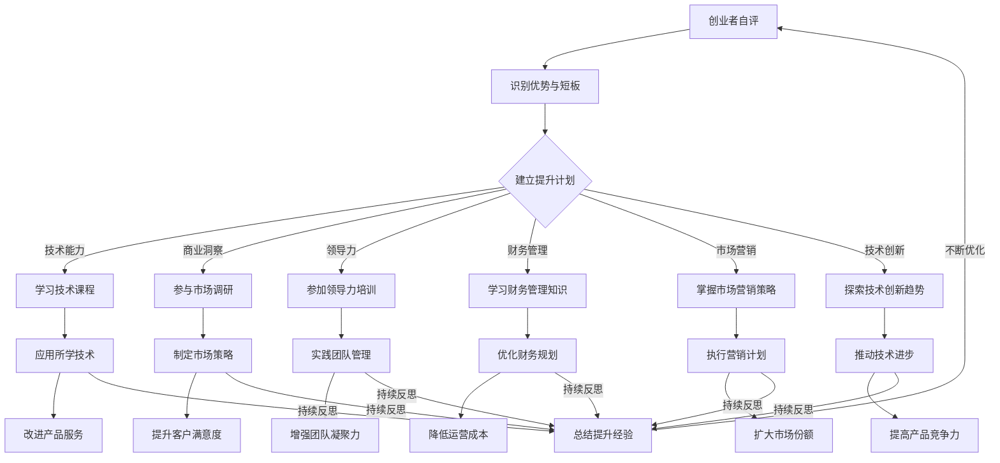

                 

# 技术创业者的商业直觉培养与决策优化

## 关键词
商业直觉、决策优化、技术创业者、商业模式、系统思维、数据分析、领导力

## 摘要
本文旨在探讨技术创业者如何培养商业直觉和优化商业决策。通过深入分析商业直觉的概念、理论基础、培养方法和应用，结合商业决策的理论框架、数据驱动决策和实际案例分析，本文提供了一套系统性的方法论，帮助技术创业者提高决策质量和创业成功率。

## 引言
在当今快速变化的市场环境中，技术创业者面临着诸多挑战，包括如何准确把握市场动态、如何制定有效的商业策略、如何应对各种风险等。这些问题的核心在于商业直觉和决策优化。商业直觉是一种感知商业机会、评估风险和制定策略的能力，它是技术创业者成功的关键因素之一。而决策优化则是指通过科学的方法和工具，对商业决策进行系统分析和优化，以最大化收益和降低风险。

本文将从以下几个方面展开讨论：

1. **商业直觉的概念与重要性**：介绍商业直觉的定义、作用以及与其他商业技能的关系。
2. **商业直觉培养的理论基础**：探讨系统思维、商业模式画布、心理学原理、价值观和决策行为等对商业直觉培养的影响。
3. **提升商业直觉的方法与实践**：分析经验学习、数据分析、创新思维和市场研究在商业直觉培养中的应用。
4. **商业直觉在创业决策中的应用**：讨论商业直觉在识别创业机会、评估风险和资源配置中的作用。
5. **商业直觉与领导力**：分析商业直觉对领导风格、团队协作和决策过程的影响。
6. **商业决策优化**：介绍商业决策理论框架、数据驱动的商业决策方法、决策模型与案例分析。
7. **创业者综合素质提升**：探讨个人能力提升、创新思维和创业者心理素质对商业决策的影响。
8. **综合素质提升实践案例分析**：通过国内外成功创业者的案例分析，总结提升创业者综合素质的有效方法。

通过本文的探讨，希望能够为技术创业者提供一套实用的商业直觉培养和决策优化方法论，助力他们在创业道路上取得成功。

### 第一部分：技术创业者的商业直觉培养

#### 第1章：商业直觉的概念与重要性

### 1.1 商业直觉的定义与作用

商业直觉是指技术创业者通过感性思维和经验积累，对市场机会、商业风险和决策效果的一种快速判断和感知能力。它不仅涉及对市场趋势的敏锐洞察，还包括对商业模式的创新理解和应对复杂商业环境的能力。

商业直觉的作用主要体现在以下几个方面：

1. **快速决策**：技术创业者经常需要在短时间内做出决策，商业直觉能够帮助他们迅速判断形势，抓住市场机会。
2. **风险控制**：商业直觉使创业者能够识别潜在的商业风险，并采取预防措施，降低创业失败的可能性。
3. **战略规划**：商业直觉有助于创业者制定长远的商业战略，把握市场方向，实现企业的可持续发展。
4. **创新驱动**：商业直觉能够激发创业者的创新能力，推动商业模式和市场策略的创新，从而在竞争中脱颖而出。

### 1.2 商业直觉与其他商业技能的关系

商业直觉并非孤立存在，它与许多其他商业技能密切相关，包括市场分析、财务规划、团队管理、沟通技巧等。

1. **市场分析**：市场分析是商业直觉的基础。创业者通过市场调研、数据分析等方式，获取市场信息，从而形成商业直觉。
2. **财务规划**：财务规划是商业决策的核心。商业直觉能够帮助创业者准确预测财务状况，优化资源配置。
3. **团队管理**：团队管理是创业成功的关键。商业直觉使创业者能够了解团队成员的能力和需求，进行有效的团队协作。
4. **沟通技巧**：沟通技巧是商业成功的必备素质。商业直觉有助于创业者进行有效沟通，建立良好的合作关系。

### 1.3 商业直觉的重要性

商业直觉在技术创业过程中具有重要价值，主要体现在以下几个方面：

1. **提高决策效率**：商业直觉能够帮助创业者快速做出决策，减少冗长的讨论和分析，提高决策效率。
2. **增强竞争力**：商业直觉使创业者能够迅速识别市场机会和风险，抢占先机，增强企业竞争力。
3. **降低失败风险**：商业直觉能够帮助创业者避免盲目投资和冒险决策，降低创业失败的风险。
4. **推动创新**：商业直觉激发创业者的创新思维，推动商业模式和市场策略的创新，从而实现企业的可持续发展。

综上所述，商业直觉是技术创业者不可或缺的重要能力，它不仅关乎企业的短期成功，更关系到企业的长期发展。因此，技术创业者应该重视商业直觉的培养，并将其融入到日常的商业决策中。

### 第2章：商业直觉培养的理论基础

#### 2.1 系统思维与商业模式画布

商业直觉的培养离不开系统思维和商业模式画布这两个理论基础。系统思维和商业模式画布是理解商业运作的核心工具，它们不仅有助于创业者对复杂商业环境进行全面分析，还能为创业者提供清晰的策略指导。

#### 2.1.1 系统思维

系统思维是一种全局性的思考方式，它强调将各个部分看作一个整体，通过分析系统内部的相互关系和反馈机制，来理解系统的整体行为。在商业环境中，系统思维有助于创业者从多个角度审视企业运营和市场动态，从而发现潜在的机会和风险。

1. **整体观**：系统思维要求创业者将企业视为一个生态系统，理解各个部门、业务单元以及外部环境之间的相互作用。这种整体观有助于创业者制定全面的战略规划。
2. **反馈机制**：系统思维强调反馈机制的重要性，即通过观察系统内部和外部的反馈，调整企业策略和行为。这种反馈机制有助于创业者及时发现并解决问题，保持企业的灵活性和适应性。
3. **平衡与协调**：系统思维要求创业者在战略决策时，考虑各个部分之间的平衡和协调。例如，在资源配置和业务拓展时，要避免过度依赖某一环节，确保企业的可持续发展。

#### 2.1.2 商业模式画布

商业模式画布（Business Model Canvas）是由奥地利创业者亚历山大·奥斯特瓦尔德（Alexander Osterwalder）提出的一种战略工具，它将企业的商业模式分解为9个关键模块，包括客户细分、价值主张、渠道、客户关系、收入来源、关键资源、关键活动、关键合作伙伴和成本结构。每个模块都代表商业模式的一个关键方面，通过填充和调整这些模块，创业者可以快速构建和优化企业的商业模式。

1. **客户细分**：明确目标客户群体，了解他们的需求和痛点，为后续的价值创造提供方向。
2. **价值主张**：定义企业的核心产品或服务，以及如何满足客户需求，解决他们的痛点。
3. **渠道**：确定如何将产品或服务传递给客户，包括线上和线下渠道。
4. **客户关系**：定义企业与客户之间的关系模式，包括客户服务、客户体验等。
5. **收入来源**：明确企业的收入模式，包括产品定价策略和收入来源。
6. **关键资源**：识别企业运营所需的关键资源，如人力资源、技术、资金等。
7. **关键活动**：描述企业为了实现价值主张和收入模式所需的关键业务活动。
8. **关键合作伙伴**：确定与企业运营相关的关键合作伙伴，如供应商、分销商、合作伙伴等。
9. **成本结构**：分析企业的成本结构，包括固定成本和可变成本，以优化资源配置和利润。

#### 2.1.3 系统思维与商业模式画布的关系

系统思维和商业模式画布是相辅相成的。系统思维提供了全局性的思考框架，帮助创业者理解企业内外部的复杂关系，而商业模式画布则提供了具体的操作工具，帮助创业者构建和优化商业模式。

1. **全局分析与具体操作的结合**：系统思维强调全局观，而商业模式画布则提供具体模块，使创业者能够将全局分析转化为具体的商业策略和操作。
2. **动态调整与持续优化**：系统思维强调反馈机制，商业模式画布则提供了持续的调整和优化的框架。创业者可以通过不断调整商业模式画布的各个模块，来适应市场变化和企业发展的需求。
3. **战略规划与执行**：系统思维和商业模式画布共同构成了企业的战略框架。系统思维帮助创业者制定长远的战略规划，而商业模式画布则提供了具体的执行路径，使创业者能够将战略落地。

综上所述，系统思维和商业模式画布是培养商业直觉的重要理论基础。通过运用这些工具，创业者能够更好地理解商业环境，构建和优化商业模式，从而提高商业直觉和决策能力。

#### 2.2 心理学原理与决策行为

商业直觉的培养不仅依赖于系统思维和商业模式画布，还与心理学原理密切相关。心理学原理能够帮助创业者更好地理解人类决策行为，从而在商业决策中更加理性、客观和高效。

##### 2.2.1 决策过程中的心理因素

在决策过程中，心理学原理揭示了多种影响人类决策行为的心理因素。以下是一些关键的心理因素及其影响：

1. **确认偏误（Confirmation Bias）**：确认偏误是指人们倾向于寻找、解释和记住那些符合自己观点的信息，而忽略或贬低与之相反的信息。这种心理倾向可能导致创业者过分相信已有的观点，从而忽视市场变化和潜在的风险。

2. **过度自信（Overconfidence）**：过度自信是指人们倾向于高估自己的能力和判断，低估不确定性和风险。过度自信可能导致创业者做出过于冒险的决策，忽视市场风险，从而导致失败。

3. **情感影响**：情感在决策过程中扮演着重要角色。积极的情感可能激励创业者更加勇敢和创新，而消极的情感可能导致决策迟缓或犹豫不决。创业者需要学会管理自己的情感，以确保决策的客观性和理性。

4. **群体思维（Groupthink）**：群体思维是指团队成员在做出决策时倾向于寻求一致意见，而忽视多元化的观点和批评。这种心理现象可能导致创业者忽略重要的市场反馈和风险，从而导致错误的决策。

##### 2.2.2 心理学原理在商业直觉培养中的应用

了解这些心理因素有助于创业者培养良好的商业直觉，以下是一些建议：

1. **建立多元化视角**：为了克服确认偏误，创业者应主动寻求不同观点和信息来源，鼓励团队成员提出不同意见。多元化的视角有助于更全面地评估市场环境和商业机会。

2. **保持谦逊和开放**：克服过度自信的关键是保持谦逊和开放的态度。创业者应认识到市场环境的变化性和不确定性，并据此调整自己的决策和行动。

3. **培养情感管理能力**：创业者应学会管理自己的情感，特别是在面对压力和挑战时。通过冥想、运动、社交等方式，可以有效缓解压力，保持冷静和清晰的头脑。

4. **促进团队批判性思维**：为了克服群体思维，创业者应鼓励团队成员提出批评性意见，建立开放的沟通文化。通过多元化的讨论和辩论，可以更好地评估决策方案，避免盲目一致。

##### 2.2.3 实践案例

以下是一个商业直觉培养的实践案例：

**案例**：某创业公司开发了一款智能家居产品，市场调研显示有较大的市场需求。然而，在产品推广过程中，公司管理层过于自信，没有充分考虑市场反馈和竞争情况。结果，产品上市后销量不佳，公司面临严重的财务压力。

**分析**：
1. **确认偏误**：管理层过于依赖市场调研结果，而忽视了实际销售数据和市场反馈。
2. **过度自信**：管理层高估了产品的市场需求，低估了竞争压力。
3. **情感影响**：公司高层在面对销售不佳时表现出焦虑和沮丧，影响了团队的士气。

**解决方案**：
1. **多元化视角**：公司管理层应主动寻求外部专家和市场分析师的意见，了解市场变化和竞争态势。
2. **保持谦逊和开放**：公司应鼓励员工提出不同意见，通过开放沟通和讨论，共同制定应对策略。
3. **培养情感管理能力**：公司高层应学会管理自己的情感，保持冷静和客观，以更好地应对市场挑战。
4. **促进团队批判性思维**：公司应建立开放的沟通文化，鼓励团队成员提出批评性意见，共同评估决策方案。

通过这个案例，我们可以看到心理学原理在商业直觉培养中的应用。创业者应认识到心理因素对决策行为的影响，并采取相应的措施来优化决策过程，从而提高商业直觉和决策能力。

综上所述，心理学原理在商业直觉培养中具有重要作用。通过理解和应用这些原理，创业者能够更好地识别和应对心理因素，从而提高商业直觉和决策水平。

#### 2.3 价值观与商业直觉的关系

价值观是个人或组织对事物重要性的一种判断标准，它指导我们在面对复杂决策时如何行动。在商业直觉的培养过程中，价值观起着至关重要的作用。一个坚定的价值观不仅能够帮助创业者做出正确的决策，还能在不确定的市场环境中保持清晰的判断力。

##### 2.3.1 价值观在决策中的作用

1. **提供决策框架**：价值观为创业者提供了一个决策框架，帮助他们明确什么是最重要的，从而在面临选择时能够迅速做出决策。例如，一个注重社会责任的创业者可能会优先考虑环境保护和社会效益，而不是单纯追求利润最大化。

2. **增强决策一致性**：具有明确价值观的创业者能够保持决策的一致性，避免因情绪波动或短期利益而频繁改变策略。这种一致性有助于建立品牌形象，赢得客户的信任和支持。

3. **激发创新思维**：价值观能够激发创业者的创新思维。例如，一个追求技术卓越的创业者可能会不断探索新的技术解决方案，从而在市场上获得竞争优势。

##### 2.3.2 商业直觉与价值观的关系

商业直觉与价值观之间存在密切的关系。一方面，商业直觉的形成离不开个人的价值观。创业者的价值观决定了他们对市场的看法、对风险的接受程度以及对机会的把握能力。另一方面，商业直觉的运用也需要价值观的指导。一个缺乏坚定价值观的创业者可能在面对复杂市场环境时，容易受到外界影响，做出错误的决策。

1. **价值观影响商业直觉的判断**：具有积极价值观的创业者，如注重客户体验、社会责任或技术创新，往往会更关注这些方面，从而在商业决策中表现出更高的直觉判断能力。

2. **价值观指导商业直觉的应用**：创业者通过价值观来指导商业直觉的应用。例如，一个价值观是追求客户价值的创业者，会在产品设计和市场推广时优先考虑客户需求，从而提高客户满意度。

##### 2.3.3 培养商业直觉中的价值观塑造

为了培养良好的商业直觉，创业者需要注重价值观的塑造。以下是一些建议：

1. **明确个人价值观**：创业者应明确自己的价值观，包括对客户、员工、社会和环境的态度。这有助于他们在决策过程中保持一致性，避免因情绪波动而做出错误的决策。

2. **持续学习和反思**：创业者应通过不断学习和反思，深化对价值观的理解。阅读相关书籍、参加培训课程、与行业专家交流都是有效的学习方式。

3. **实践价值观**：创业者应在日常工作中践行自己的价值观，通过实际行动来体现。例如，通过注重客户体验来提高客户满意度，通过社会责任项目来提升企业形象。

4. **建立价值观导向的团队文化**：创业者应与团队成员共同讨论并明确团队的价值观，并在团队文化中体现出来。这有助于团队成员在决策过程中保持一致，共同追求团队目标。

通过塑造和践行价值观，创业者能够培养出更加坚定和准确的商业直觉，从而在市场竞争中脱颖而出。价值观不仅是创业者个人的信仰和追求，更是他们在商业决策中的重要指导原则。

### 第3章：提升商业直觉的方法与实践

商业直觉的培养是一个持续不断的过程，需要创业者通过多种方法不断提升。以下将介绍几种常见的提升商业直觉的方法与实践，包括经验学习、数据分析、创新思维和市场研究。

#### 3.1 经验学习与案例分析

经验学习是商业直觉培养的重要途径之一。通过亲身经历和观察他人的成功与失败，创业者能够积累宝贵的经验，从而提高自己的商业直觉。以下是一些经验学习的方法：

1. **亲身实践**：创业者应积极参与实际业务操作，通过亲身体验来理解市场和客户需求。实践是提高商业直觉的最佳方式，因为它能够帮助创业者深入了解业务运作的各个方面。

2. **总结经验**：每次业务实践后，创业者都应进行总结，分析成功和失败的原因。通过反思和总结，创业者能够从经验中吸取教训，不断提升自己的商业直觉。

3. **案例分析**：通过研究成功和失败的案例，创业者能够了解不同市场环境下的商业策略和决策过程。案例分析可以帮助创业者了解不同商业模式的优势和劣势，从而在制定自己的商业策略时做出更明智的选择。

#### 3.2 数据分析与市场研究

数据分析和市场研究是商业直觉培养的关键工具。通过分析数据和进行市场研究，创业者能够获得关于市场趋势、客户需求和竞争状况的重要信息，从而提高商业直觉。

1. **数据分析**：创业者应学会使用数据分析工具，如Excel、Python等，对业务数据和市场数据进行分析。数据分析可以帮助创业者发现市场机会、识别潜在风险，从而做出更加科学的商业决策。

   - **趋势分析**：通过分析历史数据，创业者可以预测未来的市场趋势。例如，通过销售数据的分析，可以预测哪些产品在未来会有更好的销售表现。
   - **客户分析**：通过分析客户数据，创业者可以了解客户的偏好和行为模式，从而更好地满足客户需求。例如，通过客户反馈数据的分析，可以识别客户最关注的问题，并针对性地改进产品和服务。

2. **市场研究**：市场研究是获取市场信息的重要手段。创业者可以通过以下方式进行市场研究：

   - **问卷调查**：通过设计问卷，收集客户和潜在客户的需求和反馈，了解市场对产品或服务的接受程度。
   - **焦点小组**：组织行业专家、客户代表等进行讨论，获取关于市场趋势、竞争状况和潜在风险的深入见解。
   - **竞争对手分析**：通过研究竞争对手的市场策略和运营模式，创业者可以了解竞争对手的优势和劣势，从而在市场竞争中找到自己的定位。

#### 3.3 创新思维与商业洞察力培养

创新思维和商业洞察力是商业直觉的重要组成部分。创业者应通过多种方法培养自己的创新思维和商业洞察力。

1. **多角度思考**：创业者应尝试从多个角度思考问题，包括客户需求、市场趋势、技术变革等。通过多角度思考，创业者能够发现更多市场机会和潜在风险。

2. **跨界学习**：创业者应积极学习跨领域的知识和技能，如管理学、心理学、市场营销等。跨界学习有助于创业者拓展思维，从不同领域获取灵感，从而提高商业直觉。

3. **参与创业社区**：创业者可以积极参与创业社区和论坛，与同行交流和分享经验。创业社区是一个宝贵的资源库，创业者可以通过交流获取新的见解和灵感。

4. **定期反思**：创业者应定期反思自己的业务和决策过程，分析成功和失败的原因。通过反思，创业者能够不断优化自己的商业策略和决策方法，提高商业直觉。

#### 3.4 商业直觉提升实践案例分析

以下是一个商业直觉提升的实践案例分析：

**案例**：某创业公司专注于智能健康管理设备的研发和销售。公司创始人通过亲身实践，了解到当前市场上健康管理设备的功能较为单一，且用户体验不佳。他结合数据分析，发现随着人们健康意识的提升，对全面、智能的健康管理设备需求日益增加。同时，通过市场研究，他了解到一些国际品牌的健康管理设备在功能集成和用户体验方面有显著优势。

**分析**：
1. **经验学习**：公司创始人在研发和销售过程中，积累了关于产品设计和市场推广的经验，这为他后来的创新决策提供了重要依据。
2. **数据分析**：通过对销售数据和客户反馈的分析，公司创始人发现市场上对全面、智能的健康管理设备需求旺盛，这为他制定产品研发方向提供了关键信息。
3. **市场研究**：通过研究国际品牌的健康管理设备，公司创始人了解到先进的技术和用户体验在市场上的竞争优势，这激发了他对产品创新的思考。

**解决方案**：
1. **创新思维**：公司创始人通过跨界学习，结合健康管理、人工智能和用户体验等多领域知识，提出了全新的健康管理设备设计方案，集成了多种健康监测功能，并优化了用户体验。
2. **市场定位**：公司创始人明确了产品的市场定位，针对高端消费群体，提供全面、智能的健康管理解决方案。
3. **持续优化**：公司创始人定期收集用户反馈，不断优化产品功能和用户体验，保持产品的市场竞争力。

通过这个案例，我们可以看到，通过经验学习、数据分析和市场研究，创业者能够不断提升自己的商业直觉，从而在市场竞争中取得成功。商业直觉的培养是一个持续的过程，需要创业者不断学习、反思和行动。

### 第4章：商业直觉在创业决策中的应用

商业直觉在创业决策中起着至关重要的作用。它不仅帮助创业者识别市场机会，还使他们在面对不确定性时能够做出更明智的决策。以下将讨论商业直觉在创业机会识别、风险评估、资源配置和决策优化中的应用。

#### 4.1 创业机会识别

创业机会识别是创业过程中的第一步，也是商业直觉发挥核心作用的关键环节。创业者需要具备敏锐的商业直觉，以识别那些尚未被发现或未被充分利用的市场机会。

1. **市场趋势分析**：商业直觉使创业者能够敏锐地捕捉市场趋势，如技术进步、消费者需求变化等。通过对市场趋势的分析，创业者可以识别出潜在的市场机会。

2. **创新点发现**：商业直觉帮助创业者发现市场上的空白点或未被满足的需求。例如，通过观察消费者行为和市场反馈，创业者可以发现一些创新的产品或服务点。

3. **跨界思维**：商业直觉鼓励创业者运用跨界思维，将不同领域的知识和技术进行整合，创造出新的商业模式和市场机会。例如，将物联网技术应用于智能家居，从而开辟了一个全新的市场领域。

**案例**：某创业公司通过观察消费者对健康生活方式的需求，以及健身设备和智能设备的流行趋势，发现了智能健身跟踪设备的巨大市场潜力。这家公司结合智能设备技术和健身需求，开发出了一系列智能健身跟踪设备，成功抓住了市场机会。

#### 4.2 风险评估

创业过程中不可避免地会遇到各种风险，如市场风险、技术风险、财务风险等。商业直觉在风险评估中发挥着重要作用，帮助创业者识别潜在风险并制定应对策略。

1. **风险预测**：商业直觉使创业者能够预判市场变化和潜在的风险。例如，通过观察竞争对手的动态和市场趋势，创业者可以预测哪些领域可能会出现竞争加剧或技术变革。

2. **风险容忍度**：商业直觉有助于创业者了解自己的风险承受能力。创业者可以根据自己的经验和直觉，确定哪些风险可以接受，哪些风险需要规避。

3. **风险管理**：商业直觉使创业者能够制定有效的风险管理策略，包括分散投资、风险控制措施等。例如，通过多元化产品线和市场，创业者可以降低单一市场风险。

**案例**：某创业公司进入智能家居市场时，通过商业直觉发现智能家居市场的竞争日益激烈，技术更新换代速度加快。公司决定采取风险规避策略，通过不断创新和优化产品，避免直接与市场领先者竞争，从而在市场中找到了自己的独特定位。

#### 4.3 资源配置

商业直觉在资源配置中起到指导作用，帮助创业者合理分配资源，确保企业在竞争中获得优势。

1. **资源优先级**：商业直觉使创业者能够明确资源的优先级。创业者可以根据市场机会和战略目标，合理分配资源，确保核心业务的优先发展。

2. **资源配置策略**：商业直觉帮助创业者制定资源配置策略，包括资金、人力资源和技术资源的分配。例如，在市场拓展阶段，创业者可能更倾向于投资市场推广和销售团队。

3. **灵活性**：商业直觉使创业者能够灵活调整资源配置，以应对市场变化。例如，当市场需求发生变化时，创业者可以迅速调整资源分配，以适应新的市场环境。

**案例**：某创业公司初入市场时，面临资金短缺的问题。通过商业直觉，公司创始人决定优先投资于研发和技术创新，而不是大规模的市场推广。这一决策使公司能够迅速推出具有竞争力的产品，赢得了市场认可，为后续的资金筹集奠定了基础。

#### 4.4 决策优化

商业直觉在决策优化过程中发挥着关键作用，帮助创业者不断调整和优化决策，提高决策的质量和效率。

1. **快速反应**：商业直觉使创业者能够快速做出反应，及时调整策略。例如，当市场环境发生变化时，创业者可以迅速调整产品定价、营销策略等。

2. **数据与直觉结合**：商业直觉不仅基于直觉，还结合了数据分析。创业者可以通过数据分析来验证自己的直觉，从而提高决策的准确性。

3. **持续优化**：商业直觉鼓励创业者不断反思和优化决策过程。通过总结经验和教训，创业者可以不断提高自己的决策能力。

**案例**：某创业公司通过商业直觉和市场研究，发现客户对产品的功能需求正在变化。公司决定根据客户反馈进行产品迭代，不断优化产品功能。这一决策不仅满足了客户需求，还提高了客户满意度，从而推动了公司销售增长。

综上所述，商业直觉在创业决策中具有广泛的应用，从机会识别、风险评估到资源配置和决策优化，商业直觉都起到了关键作用。通过培养和运用商业直觉，创业者能够提高决策质量，增强企业的竞争力，从而在激烈的市场环境中取得成功。

### 第5章：商业直觉与领导力

商业直觉对于创业者来说至关重要，但它在领导者中的作用也同样显著。商业直觉不仅影响个人的决策，还对整个团队的绩效和组织的战略方向产生深远影响。在这一章节中，我们将探讨商业直觉与领导力之间的关系，以及领导者如何培养和运用商业直觉来提升团队协作和决策能力。

#### 5.1 商业直觉与领导风格

商业直觉与领导风格密切相关，不同的领导风格会对商业直觉的发挥产生不同的影响。以下是几种常见的领导风格及其对商业直觉的影响：

1. **指令型领导风格**：指令型领导者通过明确的目标和严格的流程来指导团队。这种领导风格在确保任务完成方面非常有效，但可能会抑制团队成员的创造性和自主性，从而影响商业直觉的发挥。

2. **参与型领导风格**：参与型领导者鼓励团队成员参与决策过程，倾听他们的意见和建议。这种领导风格能够激发团队成员的创造力和创新思维，有助于培养商业直觉。

3. **变革型领导风格**：变革型领导者通过激励和愿景引导团队，推动组织变革和创新。这种领导风格能够激发团队成员的积极性和创造力，增强团队的商业直觉。

4. **授权型领导风格**：授权型领导者赋予团队成员自主权和责任，让他们自主决策和解决问题。这种领导风格能够培养团队成员的独立性和商业直觉，提高团队的整体决策能力。

#### 5.2 领导者的商业洞察力培养

领导者要发挥商业直觉的作用，首先需要培养自己的商业洞察力。以下是一些培养商业洞察力的方法：

1. **持续学习**：领导者应保持持续学习的态度，不断更新自己的知识和技能，特别是与业务相关的最新趋势和技术。通过学习，领导者可以不断提升自己的商业认知，增强商业直觉。

2. **跨界思维**：领导者应培养跨界思维，尝试从不同领域和视角看待问题和机会。跨界思维能够帮助领导者发现新的商业机会，提升商业洞察力。

3. **经验积累**：领导者应通过亲身实践和观察，积累丰富的商业经验。经验积累是培养商业直觉的重要基础，通过总结和分析经验，领导者可以不断提高自己的商业洞察力。

4. **数据驱动**：领导者应学会运用数据分析工具，对业务数据和市场信息进行深入分析。数据驱动可以帮助领导者更准确地把握市场动态和客户需求，从而提高商业直觉。

#### 5.3 领导决策与团队协作

商业直觉在领导决策中起着关键作用，但有效的决策离不开团队协作。领导者需要通过以下方式来促进团队协作：

1. **建立信任**：领导者应建立团队信任，鼓励团队成员之间开放沟通和坦诚交流。信任是团队协作的基础，有助于团队成员发挥最佳水平。

2. **明确目标**：领导者应明确团队的目标和任务，确保每个团队成员都清楚自己的职责和期望。明确的目标有助于提高团队的协作效率，增强商业直觉。

3. **激励与支持**：领导者应激励团队成员，提供必要的资源和支持，帮助他们克服困难和挑战。激励和支持能够激发团队成员的积极性和创造力，提高商业直觉。

4. **反馈与反思**：领导者应定期与团队成员进行反馈和反思，总结经验和教训，不断优化决策过程。反馈与反思有助于团队提高决策质量，培养商业直觉。

#### 5.4 案例分析

以下是一个关于领导者运用商业直觉提升团队协作和决策能力的案例：

**案例**：某科技公司的CEO李明在市场竞争日益激烈的环境中，意识到公司需要通过创新来保持竞争力。他通过商业直觉发现，市场上存在一种未被满足的需求：智能办公系统的集成。李明决定带领团队开发一款集成了智能会议系统、文档管理和远程协作功能的智能办公系统。

1. **持续学习**：李明积极学习关于人工智能和大数据的最新技术，了解市场趋势和客户需求，为决策提供依据。

2. **跨界思维**：李明鼓励团队从不同领域寻找灵感，如信息技术、办公自动化和用户体验设计。跨界思维使团队发现了智能办公系统的创新点。

3. **数据驱动**：李明通过数据分析，发现了市场对智能办公系统的强烈需求，并确定了产品的核心功能和卖点。

4. **团队协作**：李明建立了一个跨部门的团队，包括研发、市场营销和客户服务人员，确保每个部门都能够在项目中发挥自己的优势。

5. **反馈与反思**：在项目开发过程中，李明定期与团队成员进行反馈和反思，调整项目方向，优化产品设计。

最终，该智能办公系统成功上市，受到了客户的高度评价，为公司带来了显著的收益。这个案例表明，领导者通过培养商业直觉和促进团队协作，可以有效地提升决策能力和团队绩效。

通过以上探讨，我们可以看到商业直觉对于领导者的重要性。领导者需要通过持续学习、跨界思维、数据驱动和团队协作，培养和运用商业直觉，从而在激烈的竞争中脱颖而出。

### 第6章：商业决策理论框架

商业决策是技术创业者日常运营中不可或缺的一部分，它涉及到企业战略的制定、资源的配置以及市场的开拓等各个方面。为了提高决策质量和效率，理解商业决策理论框架至关重要。本章节将介绍商业决策理论的基本原理，包括多目标决策分析与优化、不确定性与风险分析等内容。

#### 6.1 决策理论的基本原理

决策理论是研究如何在不确定性和有限信息下做出最优决策的学科。其核心思想是通过建立数学模型和优化算法，对决策问题进行系统分析，以找到最优或次优的决策方案。以下是决策理论中的几个基本概念：

1. **决策者**：决策者是指做出决策的人或组织。在商业决策中，决策者可以是企业的高层管理人员、项目经理或其他相关利益者。

2. **决策问题**：决策问题是指需要在多个可行的选择中做出选择的问题。决策问题可以是简单的，如选择购买哪款产品，也可以是复杂的，如企业战略规划。

3. **可行方案**：可行方案是指满足决策问题的所有约束条件的备选方案。在决策过程中，决策者需要从多个可行方案中选出最优方案。

4. **效用函数**：效用函数是用来衡量不同决策方案优劣的数学模型。效用函数可以是线性的，也可以是非线性的，取决于决策问题的复杂性和决策者的偏好。

5. **决策准则**：决策准则是指用于评估和比较不同决策方案的标准。常见的决策准则包括最大化效用函数、最小化成本、最大化利润等。

#### 6.2 多目标决策分析与优化

多目标决策分析是指在一个决策问题中同时考虑多个目标，并寻找使这些目标同时达到最优的决策方案。多目标决策问题在商业决策中非常常见，如企业需要同时考虑成本、质量、时间等多个目标。

1. **目标冲突**：在多目标决策中，不同的目标之间可能存在冲突。例如，在产品开发中，追求产品质量和缩短开发时间可能会产生冲突。

2. **权重分配**：为了解决目标冲突，决策者需要为不同的目标分配权重。权重分配的合理与否直接影响到决策结果。常见的权重分配方法包括等权重分配、专家评分法和层次分析法等。

3. **优化方法**：多目标决策分析常用的优化方法包括线性规划、非线性规划、整数规划和多目标规划等。这些优化方法通过建立数学模型，找到多个目标之间的平衡点，从而得出最优决策方案。

4. **案例应用**：例如，在产品定价策略中，企业需要同时考虑利润最大化、市场份额扩大和竞争对手行为等因素。通过多目标决策分析，企业可以确定最优的定价策略，实现多个目标的平衡。

#### 6.3 不确定性与风险分析

在商业决策中，不确定性是不可避免的，如市场需求变化、竞争态势变化等。风险分析是商业决策中一个重要的环节，它帮助决策者识别潜在的风险，评估风险的影响，并制定应对策略。

1. **风险识别**：风险识别是指识别可能影响决策的各种风险因素。这可以通过历史数据、市场调研、专家访谈等方法进行。

2. **风险评估**：风险评估是指评估不同风险因素对决策目标的影响程度。常见的风险评估方法包括概率分析、敏感度分析和蒙特卡罗模拟等。

3. **风险应对策略**：在识别和评估风险后，决策者需要制定相应的风险应对策略。常见的风险应对策略包括风险规避、风险减少、风险接受和风险转移等。

4. **案例应用**：例如，在市场扩展决策中，企业需要考虑市场不确定性带来的风险。通过风险评估，企业可以制定相应的市场进入策略，如逐步进入市场、多元化市场等，以降低风险。

通过了解和运用决策理论框架，技术创业者可以更系统地分析商业问题，优化决策过程，提高决策质量和效率。这不仅有助于企业在竞争中取得优势，还能提高企业的长期竞争力。

### 第7章：数据驱动的商业决策

在当今的商业环境中，数据驱动的决策已成为一种不可或缺的实践。随着大数据和人工智能技术的不断发展，企业可以利用大量数据来指导其战略和运营决策。以下将探讨数据驱动的商业决策的应用、数据挖掘技术、数据可视化方法以及如何通过数据分析提高商业洞察力。

#### 7.1 数据驱动的商业决策应用

数据驱动的商业决策是指基于数据分析来指导决策过程，以最大化企业收益和降低风险。以下是一些典型的数据驱动商业决策应用：

1. **市场细分与定位**：通过数据分析，企业可以识别出最具潜力的客户群体，从而制定更有针对性的市场推广策略。例如，通过客户购买行为数据分析，企业可以确定哪些产品最受目标客户青睐，从而调整产品组合和营销策略。

2. **供应链优化**：数据驱动的供应链管理可以通过分析订单、库存和物流数据，优化库存水平、降低成本并提高供应链的灵活性。例如，通过需求预测模型，企业可以更准确地预测未来需求，从而减少库存积压和缺货情况。

3. **客户体验优化**：数据分析可以帮助企业了解客户行为和偏好，从而提供更加个性化的客户体验。例如，通过客户互动数据分析，企业可以改进客户服务流程，提高客户满意度。

4. **风险管理**：通过分析历史数据和实时数据，企业可以识别潜在的风险因素并采取预防措施。例如，通过信用评分模型，企业可以评估客户的信用风险，从而避免不良债务。

#### 7.2 数据挖掘技术与方法

数据挖掘是从大量数据中提取有价值信息的过程。以下是一些常见的数据挖掘技术和方法：

1. **分类与回归分析**：分类分析用于将数据分为不同的类别，回归分析用于预测数值。这些方法广泛应用于市场细分、需求预测和风险评估等领域。

2. **聚类分析**：聚类分析用于将数据点划分为若干个群组，使得同一群组内的数据点之间相似性较高，不同群组之间的数据点相似性较低。聚类分析常用于客户细分和市场定位。

3. **关联规则挖掘**：关联规则挖掘用于发现数据集中的频繁模式，揭示不同变量之间的关联性。例如，超市可以通过关联规则挖掘发现哪些商品经常一起购买，从而优化商品布局和促销策略。

4. **文本挖掘**：文本挖掘用于从文本数据中提取有意义的信息，包括情感分析、主题建模和关键词提取等。文本挖掘可以帮助企业了解客户反馈和市场趋势。

5. **时间序列分析**：时间序列分析用于分析时间相关的数据序列，预测未来的趋势和模式。时间序列分析在需求预测、市场趋势分析等领域有广泛应用。

#### 7.3 数据可视化与商业洞察

数据可视化是将数据以图形或图表的形式展示出来，使其更易于理解和分析。以下是一些常见的数据可视化方法：

1. **折线图**：用于展示数据随时间的变化趋势，适用于市场趋势分析和需求预测。

2. **柱状图**：用于比较不同类别或时间段的数据，适用于市场细分和竞争分析。

3. **饼图**：用于展示不同类别的占比，适用于市场份额分析和客户细分。

4. **散点图**：用于展示两个变量之间的关系，适用于关联规则挖掘和客户行为分析。

5. **热力图**：用于展示数据的密度分布，适用于客户体验分析和市场趋势分析。

通过数据可视化，企业可以直观地理解数据，发现潜在的商业洞察。例如，通过热力图，企业可以发现客户在网站上的热点区域，从而优化用户体验；通过柱状图，企业可以识别出销售低谷期，从而调整库存策略。

#### 7.4 提高商业洞察力的案例分析

以下是一个关于数据驱动决策提高商业洞察力的案例分析：

**案例**：某电子商务公司通过数据分析发现，其用户中有较高的比例在晚上进行购物。为了提高销售额，公司决定调整营销策略，将广告投放时间从白天调整到晚上。通过数据可视化，公司发现，晚上9点到11点是购物高峰期，于是公司在这一时间段增加了广告投放和促销活动。

- **数据分析**：通过分析用户行为数据，公司确定了购物高峰期。
- **数据可视化**：通过柱状图和折线图，公司直观地展示了用户购物时间分布和销售额变化趋势。
- **决策调整**：基于数据分析结果，公司调整了广告投放时间，提高了广告投放效率。

最终，公司的销售额显著提高，用户满意度也得到提升。这个案例表明，通过数据驱动的决策，企业可以更加精准地制定市场策略，提高运营效率，从而在竞争中获得优势。

综上所述，数据驱动的商业决策在提高决策质量、优化业务运营和增强商业洞察力方面具有重要作用。通过掌握和应用数据挖掘技术和数据可视化方法，企业可以更加科学地指导其商业决策，实现可持续发展。

### 第8章：商业决策模型与方法

在商业决策中，模型与方法的使用可以帮助决策者系统地分析和优化决策过程，从而提高决策质量和效率。本章节将介绍几种常见的商业决策模型与方法，包括决策树、线性回归、随机森林和神经网络等。

#### 8.1 决策树

决策树是一种直观且易于理解的分类和回归模型，它通过一系列的判断规则将数据集划分为不同的类别或数值。决策树模型通常由一系列的内部节点和叶子节点组成，其中内部节点表示某个特征的判断，叶子节点表示最终的分类或数值。

1. **工作原理**：决策树通过递归划分数据集，每个内部节点都表示一个特征和阈值，叶子节点表示分类结果。在训练过程中，模型选择能够最大化信息增益或信息增益率的特征进行划分。

2. **应用场景**：决策树在市场细分、信用风险评估和客户行为预测等领域有广泛应用。例如，企业可以使用决策树模型来预测客户是否愿意购买某产品，或银行可以使用决策树模型来评估贷款申请者的信用风险。

3. **优缺点**：决策树的优点包括解释性强、易于理解和实现简单；缺点包括容易过拟合，特别是在数据量较小或特征较多时。

#### 8.2 线性回归

线性回归是一种用于预测连续数值变量的模型，它通过建立自变量与因变量之间的线性关系来预测未来的值。线性回归模型的基本形式为：

$$ Y = \beta_0 + \beta_1X + \epsilon $$

其中，$Y$ 是因变量，$X$ 是自变量，$\beta_0$ 和 $\beta_1$ 是模型的参数，$\epsilon$ 是误差项。

1. **工作原理**：线性回归通过最小化预测值与实际值之间的误差平方和来估计模型参数。常用的方法包括普通最小二乘法和梯度下降法。

2. **应用场景**：线性回归在预测销售额、房价和股票价格等领域有广泛应用。例如，企业可以使用线性回归模型来预测下一季度的销售量，从而制定相应的生产和库存策略。

3. **优缺点**：线性回归的优点包括简单易懂、易于实现；缺点包括假设数据线性相关，可能不适合非线性关系。

#### 8.3 随机森林

随机森林是一种基于决策树构建的集成学习方法，它通过构建多个决策树，并利用投票或平均值的方式得出最终预测结果。随机森林模型的基本结构包括多个决策树，每个决策树在构建过程中随机选择特征和样本。

1. **工作原理**：随机森林通过Bootstrap抽样生成多个训练集，并在每个训练集上构建决策树。最终，通过集成多个决策树的预测结果来提高模型的稳定性和准确性。

2. **应用场景**：随机森林在分类和回归任务中有广泛应用，如市场预测、信用评分和客户行为分析。例如，企业可以使用随机森林模型来预测客户是否会流失，从而制定针对性的客户保留策略。

3. **优缺点**：随机森林的优点包括鲁棒性强、过拟合风险较低；缺点包括计算成本较高，特别是对于大规模数据集。

#### 8.4 神经网络

神经网络是一种模拟人脑结构和功能的计算模型，它通过多层神经元之间的连接来学习输入数据与输出数据之间的关系。神经网络的基本结构包括输入层、隐藏层和输出层。

1. **工作原理**：神经网络通过前向传播和反向传播来更新权重和偏置，从而优化模型的预测性能。前向传播是将输入数据通过网络层进行传递，计算每个神经元的输出；反向传播是通过计算损失函数的梯度，更新网络参数。

2. **应用场景**：神经网络在图像识别、语音识别和自然语言处理等领域有广泛应用。例如，企业可以使用神经网络模型来识别客户情绪，从而优化客户服务策略。

3. **优缺点**：神经网络的优点包括强大的非线性建模能力和自适应学习能力；缺点包括训练时间较长、参数数量庞大，可能需要大量的数据和计算资源。

#### 8.5 贝叶斯网络与决策支持系统

贝叶斯网络是一种基于概率论的图形模型，它通过表示变量之间的条件概率关系来预测和决策。决策支持系统（DSS）是一种利用计算机技术和数据分析方法为决策者提供辅助决策的工具。

1. **贝叶斯网络**：贝叶斯网络通过有向无环图（DAG）来表示变量之间的依赖关系，每个节点表示一个变量，边表示变量之间的条件概率关系。通过贝叶斯推理，可以计算变量的条件概率分布。

2. **决策支持系统**：决策支持系统通过收集和分析数据，提供决策建议和支持。DSS可以用于多种场景，如财务分析、市场预测和风险管理。

通过掌握和应用这些商业决策模型与方法，技术创业者可以更科学地分析商业问题，优化决策过程，提高决策质量和效率。

### 第9章：商业决策案例分析

在商业世界中，成功的商业决策案例层出不穷，它们不仅展示了如何通过科学的决策方法实现业务增长，也为其他企业提供了宝贵的经验。本章节将通过分析国内外企业的商业决策案例，探讨它们在市场策略、产品创新、资源配置等方面的决策过程，以及这些决策如何影响了企业的长期发展。

#### 9.1 国际企业商业决策成功案例分析

**案例一：谷歌的“Android”操作系统**

谷歌在2005年收购Android公司，并决定开发一款免费的移动操作系统，这一决策在当时引起了很大的争议。然而，随着时间的推移，Android操作系统迅速成为全球最受欢迎的移动操作系统，占据了超过70%的市场份额。这一成功的决策关键在于：

1. **市场洞察**：谷歌通过市场研究，发现移动设备市场的快速增长，以及用户对智能手机操作系统的需求。
2. **创新策略**：谷歌决定开发一款免费操作系统，以吸引更多的手机制造商和开发者，从而迅速占领市场。
3. **合作与开放**：谷歌通过开放源代码的方式，吸引了全球开发者社区，共同参与Android系统的开发和优化。

**案例二：亚马逊的“Prime”服务**

亚马逊在2005年推出了Prime会员服务，会员每月支付一定费用，就可以享受免费两日配送、视频和音乐流媒体服务。这一决策不仅极大地提升了用户粘性，还推动了亚马逊的配送网络和云计算业务的发展。关键因素包括：

1. **用户需求分析**：亚马逊通过用户调研，发现用户对快速配送和娱乐服务的需求日益增长。
2. **资源配置**：亚马逊投入大量资源，建设了庞大的配送网络和数据中心，以支持Prime服务的运营。
3. **市场推广**：亚马逊通过一系列营销活动，如免费试用和奖励积分，吸引了大量用户加入Prime会员。

#### 9.2 中国企业商业决策案例分析

**案例一：阿里巴巴的“新零售”战略**

阿里巴巴在2016年提出了“新零售”战略，旨在通过线上线下融合的方式，重塑零售行业的生态系统。这一决策推动了阿里巴巴在零售、物流、数字营销等领域的全面布局。关键点包括：

1. **市场趋势判断**：阿里巴巴通过数据分析，发现线下零售面临巨大的挑战，而消费者对线上线下融合的服务需求日益增加。
2. **创新模式**：阿里巴巴通过收购、投资和合作，搭建了线上线下融合的零售平台，如盒马鲜生和天猫超市。
3. **技术创新**：阿里巴巴利用大数据和人工智能技术，提升了零售行业的运营效率和服务水平。

**案例二：小米的“生态链企业”战略**

小米在2010年成立，通过“生态链企业”战略，迅速拓展了产品线，从手机扩展到智能硬件、家电和生活方式产品。这一决策的成功关键在于：

1. **市场定位**：小米通过提供高性价比的产品，迅速吸引了大量年轻消费者，并在市场中建立了品牌认知。
2. **产业链整合**：小米通过投资和合作，建立了自己的供应链体系，降低了生产成本，提高了产品质量。
3. **创新驱动**：小米通过持续的技术创新，不断推出新产品，保持了市场的竞争力。

#### 9.3 创业者商业决策实战案例解析

**案例：某创业公司的“智能家居”产品**

某创业公司专注于智能家居产品的研发和销售，他们通过以下决策取得了成功：

1. **市场调研**：公司通过市场调研，发现智能家居市场具有巨大的增长潜力，特别是在年轻人和高端消费者中。
2. **产品创新**：公司投入大量资源，研发了一系列具有创新功能的智能家居产品，如智能灯泡、智能插座和智能摄像头。
3. **营销策略**：公司通过社交媒体和线下活动，积极开展市场推广，吸引了大量消费者的关注。
4. **合作伙伴**：公司积极与家电厂商和互联网公司合作，搭建了智能家居生态系统，提供了更完整的解决方案。

这个案例展示了创业者如何通过科学的决策过程，从市场调研到产品创新，再到营销策略和合作伙伴关系的构建，成功开拓了智能家居市场。

通过以上案例分析，我们可以看到，成功的商业决策通常涉及对市场趋势的敏锐洞察、创新的商业模式、合理的资源配置和有效的营销策略。这些决策不仅帮助企业实现了短期业绩的提升，更为企业的长期发展奠定了坚实的基础。

### 第10章：商业决策优化与战略管理

在快速变化的市场环境中，商业决策优化和战略管理成为企业保持竞争力、实现可持续发展的关键。本章将探讨商业决策优化在战略管理中的应用，以及相关的决策模型和工具。

#### 10.1 商业决策优化在战略管理中的应用

商业决策优化是战略管理的重要组成部分，它通过系统化和科学化的方法，提高决策的质量和效率。以下是一些商业决策优化在战略管理中的应用：

1. **战略目标设定**：在战略规划过程中，企业需要明确短期和长期的目标。商业决策优化可以帮助企业通过数据分析和模型模拟，确定最佳的战略目标，并制定相应的行动计划。

2. **资源配置**：战略管理涉及资源的合理配置，包括人力、财务和物力等。商业决策优化可以通过成本效益分析和风险评估，帮助企业优化资源配置，确保资源投入的高效性和战略性。

3. **市场竞争分析**：在制定市场策略时，企业需要了解竞争对手的动态和市场需求。商业决策优化可以通过市场细分、需求预测和竞争分析，帮助企业制定更具有针对性的市场策略。

4. **风险管理**：战略管理中，企业需要识别和应对各种潜在风险。商业决策优化可以通过风险评估和情景分析，帮助企业制定有效的风险应对策略，降低不确定性带来的负面影响。

#### 10.2 战略决策模型与工具

为了实现商业决策优化，企业可以运用多种战略决策模型和工具。以下是一些常见的模型和工具：

1. **SWOT分析**：SWOT分析（Strengths, Weaknesses, Opportunities, Threats）是一种用于评估企业内外部环境的工具。它通过分析企业的优势、劣势、机会和威胁，帮助企业在战略规划过程中做出更明智的决策。

2. **波特五力模型**：波特五力模型（Five Forces Model）是一种用于分析市场竞争环境的工具。它通过分析行业竞争结构，包括供应商谈判力、买家谈判力、替代品威胁、新进入者威胁和行业内的竞争状态，帮助企业制定有效的竞争策略。

3. **平衡计分卡**：平衡计分卡（Balanced Scorecard）是一种用于衡量企业绩效和战略执行的工具。它通过财务、客户、内部流程和学习与成长四个维度，提供全面的绩效评估和战略管理框架。

4. **决策树**：决策树是一种直观的决策模型，它通过一系列的判断规则，帮助企业在不确定性环境中做出最优决策。决策树可以用于市场策略选择、项目投资决策和产品定价策略等。

5. **线性规划**：线性规划是一种用于优化线性目标函数的数学模型。它通过约束条件，帮助企业在预算限制、资源约束等情况下，找到最优的资源分配方案。

6. **模拟分析**：模拟分析是一种通过模拟仿真来评估不同策略效果的方法。它可以帮助企业在面对不确定性时，评估各种策略的潜在影响，从而做出更明智的决策。

#### 10.3 战略管理中的商业决策优化实践

以下是一个关于战略管理中商业决策优化实践的分析案例：

**案例：某制造企业的战略调整**

某制造企业面临激烈的市场竞争，为了提升竞争力，企业决定进行战略调整。以下是企业在战略管理过程中运用商业决策优化的一系列实践：

1. **市场调研**：企业通过市场调研，发现客户对产品的定制化和快速响应需求日益增长。为了抓住这一市场趋势，企业决定开发定制化生产线。

2. **成本效益分析**：企业进行了详细的成本效益分析，评估定制化生产线的投入成本和预期收益。通过数据分析，企业确定了合理的定制化生产线投资规模。

3. **风险评估**：企业识别了定制化生产过程中可能面临的风险，如市场需求波动和供应链问题。通过情景分析和风险评估，企业制定了应对策略，确保定制化生产线的顺利实施。

4. **决策模拟**：企业运用决策模拟工具，模拟了不同定制化生产线方案的效果。通过模拟分析，企业选择了最佳的生产线配置方案，以最大化收益和降低风险。

5. **战略执行**：企业制定了详细的战略执行计划，包括资源分配、时间表和责任分配。通过有效的战略执行，企业成功实现了定制化生产线的部署，提高了市场竞争力。

通过这个案例，我们可以看到，企业在战略管理中通过市场调研、成本效益分析、风险评估、决策模拟和战略执行等环节，运用商业决策优化方法，实现了战略目标的优化和执行。这不仅帮助企业提升了竞争力，也为企业的长期发展奠定了坚实基础。

综上所述，商业决策优化在战略管理中具有重要作用。通过科学的方法和工具，企业可以更好地制定和实施战略，提高决策质量和效率，从而在激烈的市场竞争中脱颖而出。

### 第11章：个人能力提升与职业发展

在技术创业的道路上，个人能力的提升是不可或缺的一环。创业者的综合素质不仅影响着企业的成长，也决定着他们在市场竞争中的地位。本章将探讨个人能力模型与职业规划、领导力培养、团队管理和沟通技巧的提升，帮助创业者实现个人成长与职业发展。

#### 11.1 个人能力模型与职业规划

个人能力模型是评估和提升个人能力的重要工具。它通过定义不同能力维度，帮助创业者明确自身优势和短板，从而制定个性化的职业规划。

1. **能力维度**：个人能力模型通常包括技术能力、业务能力、管理能力和软技能等多个维度。技术能力包括编程、算法、数据结构等；业务能力包括市场分析、财务管理和产品管理；管理能力包括团队管理和项目策划；软技能包括沟通技巧、时间管理和领导力。

2. **能力提升**：创业者应根据个人能力模型，识别自身短板，制定提升计划。例如，如果创业者发现自己在市场分析方面有所欠缺，可以通过参加市场分析课程、阅读相关书籍和实际项目锻炼来提升能力。

3. **职业规划**：职业规划是个人能力提升的重要指导。创业者应根据自身兴趣和市场需求，制定明确的职业目标。例如，如果创业者希望在人工智能领域创业，可以专注于相关技术的研究和项目实践。

#### 11.2 领导力培养与团队管理

领导力是创业者成功的关键因素之一。有效的领导力培养和团队管理能够激发团队成员的潜力，提高团队绩效。

1. **领导力培养**：领导者应具备战略思维、决策能力、沟通技巧和团队协作能力。创业者可以通过以下方式提升领导力：

   - **领导力培训**：参加领导力培训课程，学习领导力理论和实战技巧。
   - **实践锻炼**：通过实际管理项目，积累领导经验，学会应对各种挑战。
   - **阅读与反思**：阅读领导力相关书籍，反思自己的领导行为，不断改进。

2. **团队管理**：团队管理是领导力的具体体现。创业者应关注以下几个方面：

   - **明确目标**：明确团队的目标和任务，确保团队成员了解工作方向。
   - **激励与反馈**：通过激励机制，激发团队成员的积极性；定期提供反馈，帮助团队成员不断提升。
   - **沟通协作**：建立开放、坦诚的沟通环境，鼓励团队成员分享想法和问题，促进团队协作。

3. **团队文化**：团队文化是团队凝聚力和工作氛围的重要保障。创业者应培养积极、创新、包容的团队文化，促进团队成员之间的信任和合作。

#### 11.3 沟通技巧与人际交往能力提升

有效的沟通技巧和人际交往能力是创业者成功的关键。良好的沟通能力能够帮助创业者建立信任、协调资源，推动项目顺利进行。

1. **沟通技巧**：创业者应掌握以下沟通技巧：

   - **倾听**：倾听是沟通的重要部分。创业者应学会倾听他人的意见和需求，从而更好地理解问题和做出决策。
   - **表达**：清晰、准确的表达能够减少误解和沟通成本。创业者应学会用简洁明了的语言传达自己的意图。
   - **非语言沟通**：非语言沟通包括肢体语言、面部表情和语调等。创业者应注重非语言沟通的运用，以增强沟通效果。

2. **人际交往能力**：人际交往能力涉及与不同人群的互动和协作。创业者应注重以下几点：

   - **建立信任**：建立信任是人际交往的基础。创业者应通过诚实、透明和负责任的行为，赢得他人的信任。
   - **尊重差异**：尊重差异意味着接受和欣赏他人的观点和经验。创业者应学会尊重不同的文化和价值观。
   - **建立关系**：建立关系是长期合作和资源整合的关键。创业者应通过参加行业活动、社交聚会等方式，拓展人脉网络。

#### 11.4 实践案例分析

以下是一个关于个人能力提升与职业发展的实践案例分析：

**案例：某创业公司的创始人张华**

张华是一名技术出身的技术创业者，他在公司初创阶段面临诸多挑战。为了提升个人能力，他采取了以下措施：

1. **学习市场知识**：张华通过参加市场分析课程、阅读市场研究报告，了解了市场动态和消费者需求，从而更好地制定产品策略。

2. **领导力提升**：张华参加了领导力培训课程，学习了团队管理和决策技巧。通过实践锻炼，他在团队管理和项目策划方面取得了显著进步。

3. **沟通技巧培养**：张华注重沟通技巧的提升，通过阅读沟通技巧书籍、参加沟通技巧培训，掌握了有效的沟通方法和技巧，建立了良好的人际关系。

4. **持续反思与改进**：张华定期反思自己的管理行为和决策过程，总结经验教训，不断改进自己的能力和策略。

通过这些努力，张华成功带领团队实现了公司的快速发展，并在市场中建立了良好的品牌形象。

通过以上案例分析，我们可以看到，个人能力提升与职业发展是一个持续的过程，需要创业者不断学习、反思和行动。只有通过不断提升个人能力，创业者才能在激烈的市场竞争中脱颖而出，实现企业的长期发展。

### 第12章：创新思维与创业策略

在激烈的市场竞争中，创新思维和创业策略是技术创业者取得成功的关键。创新思维能够帮助创业者发现新的市场机会，而有效的创业策略则能够将创新思维转化为实际成果。本章将探讨创新思维方法、创业策略与市场定位，以及创业模式创新与变革。

#### 12.1 创新思维方法与应用

创新思维是创业成功的关键驱动力。以下是一些常用的创新思维方法和应用：

1. **头脑风暴**：头脑风暴是一种集体思考的方法，通过自由讨论和创意碰撞，产生大量的创意点。创业者可以定期组织头脑风暴会议，鼓励团队成员提出各种创新想法。

2. **设计思维**：设计思维是一种以用户为中心的创新方法，它强调理解用户需求、构建原型和快速迭代。创业者可以通过设计思维，开发出更符合市场需求的产品。

3. **思维导图**：思维导图是一种可视化工具，通过图形化的方式整理和展示思维过程。创业者可以使用思维导图来梳理创新思路，理清项目各个方面的关系。

4. **跨界思维**：跨界思维是一种将不同领域和行业的知识和方法进行整合的思维方式。创业者可以通过跨界思维，发现新的商业机会和解决方案。

5. **用户访谈**：用户访谈是获取用户需求和反馈的有效方法。通过直接与用户交流，创业者可以深入了解用户的需求和痛点，从而进行有针对性的创新。

#### 12.2 创业策略与市场定位

创业策略和市场的定位决定了企业的发展方向和竞争优势。以下是一些关键策略和市场定位方法：

1. **细分市场**：市场细分是将整个市场划分为若干个具有相似需求特征的子市场。创业者可以通过市场细分，找到最具潜力的目标客户群体，并制定针对性的营销策略。

2. **差异化定位**：差异化定位是企业在市场中找到独特卖点，以区别于竞争对手的策略。创业者可以通过产品创新、服务质量或品牌形象等差异化因素，塑造企业的竞争优势。

3. **成本领先战略**：成本领先战略是通过降低生产成本和运营成本，实现产品价格的竞争优势。创业者可以通过规模效应、自动化生产和管理优化等手段，实现成本领先。

4. **差异化战略**：差异化战略是通过提供独特的产品和服务，满足客户的特定需求。创业者可以通过技术创新、卓越的客户服务和品牌形象，实现差异化定位。

5. **市场渗透策略**：市场渗透策略是通过扩大市场份额来提升企业的竞争力。创业者可以通过价格优惠、促销活动和市场推广，吸引更多的客户，提高市场占有率。

#### 12.3 创业模式创新与变革

创业模式创新是企业在竞争中获得优势的重要途径。以下是一些常见的创业模式创新与变革方法：

1. **平台化模式**：平台化模式是通过搭建一个开放的生态系统，连接供应商、制造商和消费者，实现多方共赢。创业者可以通过搭建在线平台，整合资源，提供一站式服务。

2. **共享经济模式**：共享经济模式是通过共享资源，实现资源的最大化利用。创业者可以通过共享租赁、共享出行等方式，创造新的商业模式。

3. **订阅模式**：订阅模式是通过提供持续性的服务或产品，实现收入的稳定增长。创业者可以通过订阅服务，建立长期客户关系，提高用户黏性。

4. **社交化营销**：社交化营销是通过社交媒体和网络平台，推广产品和服务。创业者可以通过社交媒体营销，扩大品牌影响力，提高市场知名度。

5. **数字化转型**：数字化转型是将传统业务与互联网技术相结合，实现业务的在线化和智能化。创业者可以通过数字化转型，提高运营效率，降低成本，提升用户体验。

通过创新思维和创业策略的应用，技术创业者可以在市场中找到新的机会，实现企业的快速成长。同时，通过不断变革和创新，创业者可以保持企业的竞争力，在激烈的市场竞争中脱颖而出。

### 第13章：创业者心理素质与心态调整

在技术创业的道路上，创业者不仅需要具备高超的技术能力和商业洞察力，还必须拥有强大的心理素质和积极的心态。创业过程中的挑战和压力往往超乎想象，如何应对这些挑战，调整心态，保持心理平衡，对创业者的成功至关重要。本章将探讨创业者心理素质的重要性、应对压力与挫折的方法以及心理调适与心态调整技巧。

#### 13.1 创业者心理素质的重要性

创业是一项高风险、高压力的活动，创业者必须具备良好的心理素质，以应对各种不确定性和挑战。以下是一些心理素质的重要性：

1. **抗压能力**：创业过程中，创业者会面临各种压力，包括资金压力、市场竞争压力、团队管理压力等。具备抗压能力意味着能够在压力下保持冷静和清晰的头脑，做出理性的决策。

2. **适应能力**：市场环境和技术环境都在不断变化，创业者需要具备适应能力，灵活调整自己的策略和心态，以适应新的环境和挑战。

3. **自信心**：自信心是创业者成功的关键因素之一。一个自信的创业者能够坚定自己的信念，勇敢面对困难，不轻易放弃。

4. **韧性**：韧性是指在面对挫折和失败时，能够迅速恢复并继续前进的能力。创业者需要具备韧性，才能在遇到失败时重新站起来，继续追求目标。

5. **自我调节能力**：自我调节能力是指能够自我管理和调整情绪和行为的能力。创业者需要学会如何处理负面情绪，保持积极的心态，以更好地应对挑战。

#### 13.2 应对压力与挫折的方法

创业过程中不可避免地会遇到各种压力和挫折，如何应对这些挑战是创业者心理素质的体现。以下是一些应对压力与挫折的方法：

1. **制定明确目标**：明确的目标可以帮助创业者保持专注和动力，减少无谓的焦虑和压力。创业者应制定短期和长期的目标，并制定具体的行动计划。

2. **学会放松**：适当的放松有助于减轻压力。创业者可以通过冥想、瑜伽、运动等方式来放松身心，缓解压力。

3. **寻求支持**：创业者应学会寻求支持，包括家人、朋友、同事和行业专家的建议。与他人交流可以获取不同的视角和建议，有助于更好地应对压力。

4. **积极心态**：保持积极的心态是应对挫折的关键。创业者应学会从失败中吸取教训，将其视为成长和进步的机会，而不是失败和挫折。

5. **情绪管理**：情绪管理是心理素质的重要组成部分。创业者应学会识别和管理自己的情绪，避免因情绪波动而做出冲动决策。

#### 13.3 心理调适与心态调整技巧

以下是一些心理调适与心态调整技巧，帮助创业者保持良好的心理状态：

1. **认知重构**：认知重构是指改变对事物和事件的认知方式，从而调整情绪和行为。创业者可以通过学习认知行为疗法（CBT）等方法，识别和改变负面思维模式。

2. **正念练习**：正念是一种专注于当前时刻的练习，有助于提高情绪管理和自我意识。创业者可以通过正念冥想、瑜伽等方式，培养正念能力。

3. **设定界限**：创业者应学会设定界限，明确工作和生活的界限，避免工作压力对生活的影响。合理规划时间，保证充足的休息和娱乐时间。

4. **自我激励**：创业者应学会自我激励，通过设定奖励机制和目标激励，保持积极向上的心态。例如，完成一个小目标后，可以给自己一个小奖励。

5. **积极生活**：积极的生活方式有助于提高心理素质。创业者可以通过培养兴趣爱好、参与社交活动、保持健康的生活方式，提高生活质量。

通过培养良好的心理素质和心态调整技巧，创业者能够更好地应对创业过程中的挑战，保持心理平衡，从而提高创业成功率。

### 第14章：综合素质提升实践案例分析

在技术创业的征程中，综合素质的提升对于创业者的成功至关重要。本章将通过分析国内外创业成功者的综合素质，总结提升创业者综合素质的有效方法，并提供具体实践案例。

#### 14.1 国际创业成功者综合素质分析

**案例一：Elon Musk**

Elon Musk是国际知名的企业家和创业家，他创立了特斯拉、SpaceX、Neuralink等知名企业。Musk的成功离不开以下几个方面的综合素质：

1. **技术能力**：Musk在物理学和经济学方面拥有深厚的技术背景，这为他的创业项目提供了坚实的基础。

2. **领导力**：Musk以其卓越的领导力和决策能力而著称。他能够激励和团结团队，推动企业快速发展。

3. **创新思维**：Musk拥有强烈的创新意识，不断推动技术和产业的变革，如特斯拉的电动汽车和SpaceX的火箭技术。

4. **心态调整**：面对种种挑战，Musk展现了极高的抗压能力和心态调整能力，始终保持积极乐观的态度。

**案例二：Jack Ma**

阿里巴巴创始人马云是国际创业界的另一位传奇人物。他的成功得益于以下综合素质：

1. **沟通能力**：马云是一位出色的沟通者，他能够通过演讲和沟通激励团队成员和客户。

2. **市场洞察**：马云对市场有敏锐的洞察力，能够准确地把握市场趋势和消费者需求。

3. **适应能力**：在阿里巴巴的发展过程中，马云多次调整公司的战略方向，以适应市场变化。

4. **风险管理**：马云在创业过程中展现了极高的风险承受能力，敢于面对不确定性和挑战。

#### 14.2 国内创业成功者综合素质分析

**案例一：马化腾**

腾讯公司的创始人马化腾是国内创业界的佼佼者。以下是他成功背后的综合素质：

1. **创新思维**：马化腾以其敏锐的创新意识，推动腾讯在社交媒体、游戏和支付等多个领域的快速发展。

2. **团队管理**：马化腾重视团队建设，通过合理的组织架构和激励机制，打造了高效的团队。

3. **战略规划**：马化腾具备卓越的战略规划能力，能够准确判断行业趋势，制定长期发展计划。

4. **心态调整**：马化腾在面对市场竞争和内部挑战时，始终保持冷静和乐观，有效应对各种压力。

**案例二：雷军**

小米公司的创始人雷军也是国内创业界的代表人物。以下是他成功背后的综合素质：

1. **产品意识**：雷军非常注重产品体验，他通过不断优化产品和服务，赢得了消费者的信任。

2. **市场策略**：雷军善于制定市场策略，通过线上营销和粉丝经济，成功打造了小米品牌。

3. **创业经验**：雷军拥有丰富的创业经验，他通过不断尝试和反思，积累了宝贵的创业智慧。

4. **心态调整**：雷军在创业过程中，始终保持积极向上的心态，敢于面对挑战和失败。

#### 14.3 创业者综合素质提升实践案例解析

**案例：李想**

李想是理想汽车的创始人，他在电动汽车领域的创业取得了显著成就。以下是他提升综合素质的实践：

1. **技术能力**：李想在汽车工程领域有着深厚的背景，这使得他在理想汽车的技术研发上有着独特的见解。

2. **市场洞察**：李想通过广泛的市场调研和用户反馈，准确把握了电动汽车市场的需求和发展趋势。

3. **领导力**：李想具备卓越的领导力，他通过激励和培养团队成员，打造了一支高效能的创业团队。

4. **心态调整**：面对市场竞争和资金压力，李想始终保持乐观的心态，积极寻找解决方案。

通过以上案例分析，我们可以看到，创业成功者之所以能够脱颖而出，离不开他们在技术能力、市场洞察、领导力和心态调整等方面的综合素质。这些成功者通过不断学习和实践，不断提升自己的综合素质，从而在创业道路上取得了卓越的成就。

总之，创业者应从成功者的经验中汲取营养，结合自身的实际情况，全面提升综合素质，以应对创业过程中的各种挑战，实现企业的长远发展。

### 附录：创业者素质评估工具与资源

为了帮助创业者更好地提升自己的综合素质，本文附录部分将介绍一些实用的创业者素质评估工具与资源。这些工具和资源包括创业者素质评估模型、创业资源库与工具、以及推荐的学习和培训课程。

#### 附录A.1：创业者素质评估模型

创业者素质评估模型是一种系统性的方法，用于评估创业者在技术、商业、管理、沟通等方面的能力。以下是一些常见的评估模型：

1. **GROW模型**：
   - **目标（Goal）**：评估创业者的目标设定能力。
   - **现状（Reality）**：评估创业者对当前形势的分析能力。
   - **障碍（Obstacle）**：评估创业者面对挑战时的应对能力。
   - **途径（Way）**：评估创业者的策略制定和执行能力。

2. **TEAL模型**（Talent, Execution, Alignment, Leadership）：
   - **人才（Talent）**：评估创业者的团队建设和人才管理能力。
   - **执行（Execution）**：评估创业者的执行力和运营能力。
   - **对齐（Alignment）**：评估创业者的战略规划和团队协作能力。
   - **领导力（Leadership）**：评估创业者的领导力和决策能力。

#### 附录A.2：创业资源库与工具

以下是一些实用的创业资源库和工具，创业者可以利用这些资源提升自己的综合素质：

1. **创业平台**：
   - **创业邦**：提供创业资讯、创投动态和创业者交流平台。
   - **36氪**：报道创业项目、分享创业经验，并提供创业孵化服务。

2. **在线教育平台**：
   - **Coursera**：提供全球顶尖大学的在线课程，涵盖商业管理、计算机科学等多个领域。
   - **edX**：提供免费和付费在线课程，包括商业分析、数据科学等课程。

3. **创业者社群**：
   - **创业者联盟**：国内知名的创业者社群，提供创业指导、投融资对接等服务。
   - **硅谷创业者社群**：全球知名的创业者社群，提供创业资源、交流机会和投资对接。

#### 附录A.3：创业者培训与提升课程推荐

以下是一些推荐的创业者培训与提升课程，这些课程涵盖了创业的各个方面，帮助创业者提升综合素质：

1. **创业基础课程**：
   - **《创业基础》**：由知名创业导师讲授，涵盖创业的基本概念、市场调研、商业模式等。

2. **领导力课程**：
   - **《领导力与团队管理》**：通过案例分析、实战演练等方式，提升创业者的领导力和团队管理能力。

3. **财务管理课程**：
   - **《创业财务管理》**：教授创业者如何进行财务规划、预算管理和投资决策。

4. **市场营销课程**：
   - **《市场营销策略》**：提供市场营销的理论和实践指导，帮助创业者制定有效的营销策略。

5. **技术创新课程**：
   - **《技术创新与创业》**：探讨技术创新的趋势和机遇，帮助创业者把握技术发展的前沿。

通过运用这些创业者素质评估工具与资源，创业者可以全面了解自己的优势和短板，有针对性地提升个人能力，从而在创业道路上取得更好的成果。

### Mermaid 流程图

以下是一个关于技术创业者综合素质提升的Mermaid流程图，展示了创业者从认识到自身不足、制定提升计划到实际应用的完整过程：

这个流程图展示了创业者通过自我评估、制定提升计划、学习与应用、持续反思和优化的循环过程，有助于全面提升综合素质，实现创业目标。

