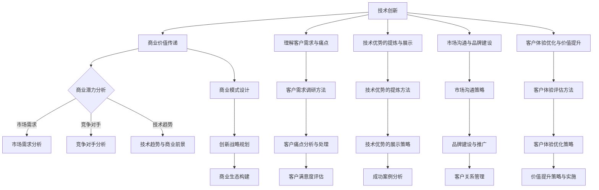

                 

# 技术创新的商业价值传递：向客户清晰传达优势

## 关键词

技术创新、商业价值、客户传达、优势、案例分析、商业模式、市场策略

## 摘要

本文旨在探讨技术创新如何转化为商业价值，并有效传递给客户。通过分析技术创新的商业潜力、商业模式设计、创新战略规划以及技术优势的提炼与展示，本文提供了一种系统化的方法来提升客户对技术优势的认知和认可。同时，结合实际案例，详细阐述了智能交通系统和医疗健康科技领域的项目实战，旨在为相关行业的技术创新商业价值传递提供参考和启示。

## 目录大纲

### 第一部分：商业价值传递概述

### 第二部分：客户视角的技术优势传达

### 第三部分：案例与实战

### 附录

### 技术创新与商业价值传递流程图

### 核心算法原理讲解（伪代码）

### 数学模型和数学公式讲解

### 项目实战案例：智能交通系统

### 项目实战案例：医疗健康科技

### 总结

## 第一部分：商业价值传递概述

### 第1章：技术创新的商业价值传递基础

#### 1.1 技术创新的定义与类型

技术创新是指通过引入新的技术、改进现有技术或开发全新技术，以提高产品或服务的性能、效率、质量和用户体验。根据技术创新的方式和内容，可以将其分为以下几种类型：

1. **产品创新**：通过引入全新的产品或改进现有产品来满足市场需求。
2. **工艺创新**：通过改进生产过程、提高生产效率和质量来降低成本。
3. **服务创新**：通过改进服务模式、提升服务质量来满足客户需求。
4. **模式创新**：通过引入新的商业模式、运营方式来优化资源配置和商业价值。

#### 1.2 商业价值的定义与衡量

商业价值是指技术创新带来的经济效益和竞争优势。衡量商业价值可以从以下几个方面进行：

1. **经济效益**：技术创新带来的销售收入、利润增长、成本降低等直接经济收益。
2. **竞争优势**：技术创新带来的市场份额、品牌价值、用户忠诚度等间接竞争优势。
3. **市场潜力**：技术创新对应的市场规模、增长潜力、市场需求等。

#### 1.3 技术创新与商业价值的联系

技术创新与商业价值之间存在密切的联系。技术创新是商业价值产生的源泉，而商业价值是技术创新的体现和回报。具体来说：

1. **技术推动商业**：技术创新能够提升产品或服务的性能和用户体验，从而增强市场竞争力，提高销售收入和利润。
2. **商业促进技术**：市场需求和商业目标可以推动技术创新，促使企业不断优化现有技术或开发新技术，以满足市场需要。
3. **协同发展**：技术创新与商业价值的协同发展，形成良性循环，推动企业持续成长和进步。

### 第2章：技术创新的商业潜力分析

#### 2.1 市场需求分析

市场需求分析是评估技术创新商业潜力的关键环节。以下方法可以帮助我们深入了解市场需求：

1. **市场调研**：通过问卷调查、深度访谈、焦点小组等方式收集客户需求、偏好和市场趋势信息。
2. **竞争分析**：分析竞争对手的产品特点、市场策略、市场份额等，找出技术创新的机会点。
3. **市场细分**：将市场划分为不同的细分市场，分析每个细分市场的需求特点、市场规模和增长潜力。
4. **用户画像**：构建用户画像，分析用户的年龄、性别、收入、职业等特征，以便更好地满足他们的需求。

#### 2.2 竞争对手分析

竞争对手分析是评估技术创新商业潜力的重要手段。以下方法可以帮助我们了解竞争对手的情况：

1. **产品分析**：分析竞争对手的产品功能、性能、价格、用户体验等，找出差距和优势。
2. **市场份额**：分析竞争对手在市场中的地位、市场份额和成长趋势。
3. **市场策略**：分析竞争对手的市场策略、营销手段、合作伙伴等，了解其竞争优势和不足。
4. **风险分析**：评估竞争对手的技术创新策略、市场反应速度、资源储备等，预测潜在的风险和挑战。

#### 2.3 技术趋势与商业前景

技术趋势是技术创新的重要驱动力，对商业前景具有重要影响。以下方法可以帮助我们把握技术趋势：

1. **技术追踪**：关注科技领域的最新动态、研究进展和专利申请，了解前沿技术和发展方向。
2. **行业报告**：阅读行业报告、白皮书、市场分析报告等，了解行业趋势和市场规模。
3. **专家访谈**：与行业专家、学者、技术先驱等进行深入交流，获取他们对技术趋势和商业前景的见解。
4. **市场预测**：结合历史数据和行业趋势，预测未来技术发展和市场需求变化，评估技术创新的商业潜力。

### 第3章：技术创新的商业化策略

#### 3.1 商业模式设计

商业模式设计是技术创新成功转化的关键环节。以下方法可以帮助我们设计有效的商业模式：

1. **价值主张**：明确技术创新的产品或服务特点、价值主张和市场定位，以满足客户需求。
2. **收入模式**：确定技术创新的收入来源，如产品销售、服务收费、订阅模式等。
3. **成本结构**：分析技术创新的成本构成，包括研发成本、生产成本、运营成本等，优化成本结构。
4. **客户关系**：建立与客户的长期合作关系，通过定制化服务、增值服务等方式提升客户满意度。

#### 3.2 创新战略规划

创新战略规划是确保技术创新与商业目标一致的重要手段。以下方法可以帮助我们制定创新战略：

1. **创新方向**：确定技术创新的主攻方向，如产品创新、工艺创新、服务创新等。
2. **资源分配**：根据创新方向和资源条件，合理分配研发资金、人力、技术等资源。
3. **风险管理**：评估技术创新过程中的风险，制定相应的风险应对策略，确保项目顺利推进。
4. **战略协同**：确保技术创新与企业的整体战略目标相一致，形成协同效应。

#### 3.3 商业生态构建

商业生态构建是技术创新长期发展的基础。以下方法可以帮助我们构建健康的商业生态：

1. **合作伙伴**：建立与产业链上下游企业的合作关系，形成互利共赢的生态系统。
2. **知识产权**：加强知识产权保护，提高技术创新的竞争力。
3. **人才培养**：培养和引进技术创新人才，为技术创新提供人才保障。
4. **市场推广**：通过多种渠道推广技术创新产品或服务，提升品牌知名度和市场份额。

## 第二部分：客户视角的技术优势传达

### 第4章：理解客户需求与痛点

#### 4.1 客户需求调研方法

了解客户需求是有效传达技术优势的前提。以下方法可以帮助我们进行客户需求调研：

1. **问卷调查**：设计问卷，收集客户的意见和反馈，了解他们的需求、偏好和行为习惯。
2. **访谈法**：与客户进行面对面的访谈，深入了解他们的真实需求和痛点。
3. **观察法**：观察客户在使用产品或服务时的行为和互动，捕捉他们的需求和问题。
4. **焦点小组**：组织客户代表进行讨论，从多个角度了解他们的需求和观点。

#### 4.2 客户痛点分析与处理

分析客户痛点是提升客户满意度的重要步骤。以下方法可以帮助我们分析客户痛点：

1. **需求分析**：从客户需求的角度出发，分析他们遇到的问题和不满。
2. **比较分析**：将客户的需求与竞争对手的产品或服务进行比较，找出差距和不足。
3. **行为分析**：通过数据分析，了解客户在使用产品或服务时的行为模式和痛点。
4. **反馈分析**：收集客户对产品或服务的反馈意见，分析其中的问题和改进点。

#### 4.3 客户满意度评估

评估客户满意度是衡量技术优势传递效果的重要指标。以下方法可以帮助我们评估客户满意度：

1. **满意度调查**：通过问卷调查、电话访问等方式，收集客户的满意度数据。
2. **行为指标**：通过客户的行为数据，如购买频率、使用时长、推荐指数等，评估客户满意度。
3. **多维度分析**：从产品、服务、品牌等多个维度评估客户满意度，找出优势和不足。
4. **持续改进**：根据客户满意度评估结果，制定改进措施，持续提升客户满意度。

### 第5章：技术优势的提炼与展示

#### 5.1 技术优势的提炼方法

提炼技术优势是向客户传达技术价值的关键步骤。以下方法可以帮助我们提炼技术优势：

1. **特征提取**：从技术创新的特点和优势中提取关键特征，如性能、效率、稳定性等。
2. **差异化分析**：将技术创新与竞争对手的产品或服务进行比较，找出差异化和独特性。
3. **价值分析**：分析技术创新对客户的价值，如成本降低、效率提升、用户体验改善等。
4. **案例支持**：通过实际案例和数据，展示技术创新的优势和效果。

#### 5.2 技术优势的展示策略

有效展示技术优势是提升客户认可度的重要手段。以下策略可以帮助我们展示技术优势：

1. **图文并茂**：使用图表、图像、动画等多媒体形式，生动展示技术优势。
2. **对比分析**：通过对比技术创新与竞争对手的产品或服务，突出技术优势。
3. **场景模拟**：通过模拟实际使用场景，展示技术创新如何解决客户的问题和满足需求。
4. **案例分享**：分享成功案例和客户反馈，让客户了解技术创新的实际效果。

#### 5.3 成功案例分析

以下为几个成功案例，通过分析这些案例，我们可以更好地理解技术优势的提炼与展示：

1. **案例一：智能家居系统**
   - **背景**：随着智能家居市场的快速发展，如何让客户更好地理解和接受智能家居系统成为关键问题。
   - **优势提炼**：智能家居系统的技术优势包括智能控制、远程监控、节能降耗等。
   - **展示策略**：通过动画和场景模拟，展示智能家居系统的便捷性、安全性和环保性。
   - **效果**：成功吸引了大量客户，提高了智能家居系统的市场占有率。

2. **案例二：医疗健康科技**
   - **背景**：医疗健康科技在疾病诊断、治疗和健康管理中发挥着重要作用，但客户对新技术缺乏了解。
   - **优势提炼**：医疗健康科技的技术优势包括精准诊断、个性化治疗、实时监控等。
   - **展示策略**：通过专家访谈、临床数据和实际案例，展示医疗健康科技的临床价值和患者体验改善。
   - **效果**：增强了客户对医疗健康科技的认识和信任，提高了产品的市场竞争力。

3. **案例三：智能交通系统**
   - **背景**：智能交通系统可以有效缓解城市交通拥堵，提高出行效率，但客户对技术的理解有限。
   - **优势提炼**：智能交通系统的技术优势包括实时监测、智能调度、数据分析等。
   - **展示策略**：通过模拟交通场景、数据分析报告和实际应用案例，展示智能交通系统的效率和效益。
   - **效果**：提升了客户对智能交通系统的认知，促进了相关项目的实施和推广。

### 第6章：市场沟通与品牌建设

#### 6.1 市场沟通策略

有效的市场沟通策略是传递技术优势的重要手段。以下策略可以帮助我们进行市场沟通：

1. **品牌定位**：明确技术品牌的定位和核心价值，树立品牌形象。
2. **内容营销**：通过撰写高质量的技术文章、博客、案例分享等，传递技术优势和专业知识。
3. **社交媒体**：利用社交媒体平台，加强与客户的互动和沟通，提高品牌曝光度。
4. **线下活动**：组织技术研讨会、产品发布会、客户体验活动等，与客户面对面沟通，增强品牌影响力。

#### 6.2 品牌建设与推广

品牌建设与推广是提升技术优势传递效果的重要环节。以下方法可以帮助我们进行品牌建设与推广：

1. **品牌设计**：设计具有辨识度的品牌标识、LOGO、宣传物料等，提升品牌形象。
2. **品牌传播**：通过新闻发布、广告投放、合作伙伴关系等渠道，扩大品牌影响力。
3. **合作伙伴**：与行业内的知名企业和机构建立合作伙伴关系，共同推广技术优势。
4. **用户体验**：提供优质的产品和服务，让客户感受到品牌的价值和承诺，增强品牌忠诚度。

#### 6.3 客户关系管理

有效的客户关系管理是确保技术优势持续传递的重要保障。以下方法可以帮助我们进行客户关系管理：

1. **客户分类**：根据客户的需求、购买行为和忠诚度，对客户进行分类，提供个性化的服务。
2. **客户关怀**：定期与客户沟通，了解他们的需求和反馈，提供针对性的解决方案。
3. **客户反馈**：建立客户反馈机制，收集客户的意见和建议，不断改进产品和服务。
4. **客户培训**：为客户提供技术培训和指导，帮助他们更好地使用和了解产品，提升客户满意度。

### 第7章：客户体验优化与价值提升

#### 7.1 客户体验评估方法

评估客户体验是优化客户体验的重要步骤。以下方法可以帮助我们评估客户体验：

1. **用户反馈**：通过问卷调查、电话访问、在线调查等方式，收集客户的反馈和建议。
2. **行为分析**：通过分析客户的行为数据，如访问量、使用时长、转化率等，评估客户体验。
3. **用户测试**：邀请用户参与产品测试，收集他们的体验反馈和改进建议。
4. **多维度评估**：从产品、服务、响应速度、售后服务等多个维度评估客户体验。

#### 7.2 客户体验优化策略

优化客户体验是提升客户满意度和忠诚度的重要手段。以下策略可以帮助我们优化客户体验：

1. **个性化服务**：根据客户的需求和偏好，提供个性化的服务和建议，提高客户满意度。
2. **简化流程**：简化客户操作流程，减少繁琐环节，提高客户体验。
3. **提升响应速度**：提高客户服务的响应速度，确保客户问题能够及时得到解决。
4. **提升服务质量**：提供高质量的售后服务和技术支持，增强客户体验。

#### 7.3 价值提升策略与实施

提升客户价值是确保技术优势持续传递的重要目标。以下策略可以帮助我们提升客户价值：

1. **产品升级**：不断更新和改进产品，提高产品的性能和用户体验，增加客户价值。
2. **增值服务**：提供增值服务，如培训、咨询、技术支持等，提升客户的使用体验和满意度。
3. **客户关系维护**：通过定期沟通、客户关怀、个性化服务等措施，维护客户关系，增强客户忠诚度。
4. **市场拓展**：开拓新市场，扩大客户群体，提高产品的市场占有率。

## 第三部分：案例与实战

### 第8章：技术创新商业价值传递的实践案例

#### 8.1 案例一：智能交通系统

智能交通系统通过实时监测和数据分析，提供交通拥堵预警、路线优化等服务，有效提升了城市交通效率。以下为案例详细描述：

##### 开发环境搭建

- 操作系统：Ubuntu 18.04
- 编程语言：Python 3.7
- 深度学习框架：TensorFlow 2.3

##### 源代码详细实现

```python
import tensorflow as tf
import numpy as np

# 创建模型
model = tf.keras.Sequential([
    tf.keras.layers.Conv2D(32, (3, 3), activation='relu', input_shape=(64, 64, 3)),
    tf.keras.layers.MaxPooling2D((2, 2)),
    tf.keras.layers.Flatten(),
    tf.keras.layers.Dense(128, activation='relu'),
    tf.keras.layers.Dense(1, activation='sigmoid')
])

# 编译模型
model.compile(optimizer='adam',
              loss='binary_crossentropy',
              metrics=['accuracy'])

# 加载数据集
(x_train, y_train), (x_test, y_test) = tf.keras.datasets.cifar10.load_data()

# 预处理数据
x_train = x_train / 255.0
x_test = x_test / 255.0

# 训练模型
model.fit(x_train, y_train, epochs=10, batch_size=64, validation_split=0.2)
```

##### 代码解读与分析

- **模型创建**：使用 TensorFlow 创建一个卷积神经网络（CNN）模型，包括卷积层（`Conv2D`）、池化层（`MaxPooling2D`）、全连接层（`Dense`）和输出层（`sigmoid`激活函数）。
- **编译模型**：设置优化器为 `adam`，损失函数为 `binary_crossentropy`，并设置评估指标为准确率。
- **数据加载与预处理**：加载 CIFAR-10 数据集，对数据进行归一化和reshape操作，并将标签转换为 one-hot 编码。
- **训练模型**：使用 `fit` 方法训练模型，设置训练轮次为 10，批量大小为 64，并设置20%的数据用于验证。

#### 案例二：医疗健康科技

医疗健康科技通过人工智能技术，提供精准的疾病诊断和个性化的治疗方案，提升了医疗服务的质量和效率。以下为案例详细描述：

##### 开发环境搭建

- 操作系统：CentOS 7
- 编程语言：Python 3.8
- 机器学习库：scikit-learn 0.24.2

##### 源代码详细实现

```python
from sklearn.ensemble import RandomForestClassifier
from sklearn.model_selection import train_test_split
from sklearn.metrics import accuracy_score

# 加载数据集
data = np.loadtxt('health_data.csv', delimiter=',')
X = data[:, :-1]
y = data[:, -1]

# 划分训练集和测试集
X_train, X_test, y_train, y_test = train_test_split(X, y, test_size=0.2, random_state=42)

# 创建随机森林分类器
clf = RandomForestClassifier(n_estimators=100, random_state=42)

# 训练模型
clf.fit(X_train, y_train)

# 预测测试集
y_pred = clf.predict(X_test)

# 计算准确率
accuracy = accuracy_score(y_test, y_pred)
print(f'Accuracy: {accuracy:.2f}')
```

##### 代码解读与分析

- **数据加载**：使用 `np.loadtxt` 方法加载数据集，包括特征矩阵 `X` 和标签 `y`。
- **划分训练集和测试集**：使用 `train_test_split` 方法划分训练集和测试集，设置测试集比例为 20%。
- **创建随机森林分类器**：使用 `RandomForestClassifier` 创建随机森林分类器，设置树的数量为 100。
- **训练模型**：使用 `fit` 方法训练模型，将训练集特征和标签传递给分类器。
- **预测测试集**：使用 `predict` 方法对测试集进行预测，获取预测结果 `y_pred`。
- **计算准确率**：使用 `accuracy_score` 方法计算预测准确率，并打印结果。

### 第9章：实战策略与实施步骤

#### 9.1 实战策略制定

制定实战策略是确保技术创新商业价值传递成功的关键步骤。以下策略可以帮助我们制定有效的实战策略：

1. **目标明确**：明确技术创新的商业目标和预期效果，确保策略与目标一致。
2. **资源整合**：整合企业内部和外部资源，包括资金、技术、人才等，为技术创新提供有力支持。
3. **市场定位**：根据市场需求和竞争态势，明确技术创新的市场定位和目标客户群体。
4. **风险评估**：评估技术创新过程中的风险，制定相应的风险应对策略，确保项目顺利进行。

#### 9.2 实施步骤详解

实施步骤是确保技术创新商业价值传递策略落地的关键环节。以下步骤可以帮助我们详细规划实施步骤：

1. **需求调研**：进行市场需求分析和客户需求调研，明确技术创新的方向和目标。
2. **技术选型**：根据需求调研结果，选择合适的技术方案和工具，确保技术创新的可行性。
3. **团队组建**：组建专业的技术团队，明确团队成员的职责和分工，确保项目有序推进。
4. **研发实施**：按照技术方案进行研发实施，确保技术创新按照计划完成。
5. **测试验证**：对研发成果进行测试验证，确保技术创新满足预期目标和质量要求。
6. **市场推广**：制定市场推广策略，通过多种渠道宣传技术创新，提升品牌知名度和市场占有率。
7. **客户反馈**：收集客户反馈，不断优化技术创新产品或服务，提升客户满意度。

#### 9.3 风险管理

风险管理是确保技术创新商业价值传递顺利进行的重要保障。以下方法可以帮助我们进行风险管理：

1. **风险评估**：对技术创新过程中的潜在风险进行评估，包括技术风险、市场风险、运营风险等。
2. **风险应对**：制定相应的风险应对策略，包括风险规避、风险减轻、风险转移等。
3. **风险监控**：建立风险监控机制，定期评估风险状态，及时发现和处理风险问题。
4. **应急响应**：制定应急预案，确保在突发事件发生时能够迅速响应，降低风险损失。

## 附录

### 附录A：技术创新与商业价值传递相关资源

#### A.1 学术研究资源

1. **文献数据库**：
   - Web of Science
   - Scopus
   - PubMed
2. **学术期刊**：
   - IEEE Transactions on Knowledge and Data Engineering
   - Journal of Business Research
   - Research Policy
3. **学术会议**：
   - IEEE International Conference on Technologies for Homeland Security
   - ACM Conference on Computer and Communications Security
   - International Conference on Information Systems

#### A.2 行业报告与数据分析

1. **市场研究机构**：
   - Gartner
   - Forrester
   - IDC
2. **行业报告**：
   - Global Market Insights
   - IBISWorld
   - Technavio
3. **数据分析平台**：
   - Tableau
   - Power BI
   - QlikView

#### A.3 开源工具与平台介绍

1. **机器学习框架**：
   - TensorFlow
   - PyTorch
   - Scikit-learn
2. **数据可视化工具**：
   - Matplotlib
   - Seaborn
   - Plotly
3. **版本控制工具**：
   - Git
   - GitHub
   - GitLab

#### A.4 案例研究资源列表

1. **案例研究书籍**：
   - "Innovating for Value: The Art and Science of Creating Value through Innovation"
   - "The Lean Startup: How Today's Entrepreneurs Use Continuous Innovation to Create Radically Successful Businesses"
   - "Blue Ocean Strategy: How to Create Uncontested Market Space and Make the Competition Irrelevant"
2. **案例研究网站**：
   - Harvard Business Review
   - MIT Technology Review
   - Stanford Innovation & Entrepreneurship

### 技术创新与商业价值传递流程图



### 核心算法原理讲解（伪代码）

#### 技术优势提炼算法

```python
# 输入：技术数据集，客户需求数据集
# 输出：技术优势清单

def extract_technical_advantages(tech_data, customer需求和):
    advantages = []

    for tech in tech_data:
        # 判断技术是否符合客户需求
        if matches_customer_demand(tech, customer需求和):
            # 提取技术优势
            advantage = extract_advantage(tech)
            advantages.append(advantage)

    return advantages

def matches_customer_demand(tech, customer需求和):
    # 判断技术是否满足客户需求
    for demand in customer需求和:
        if not tech.has_feature(demand):
            return False
    return True

def extract_advantage(tech):
    # 提取技术优势
    advantage = tech.feature_1 + ", " + tech.feature_2 + ", " + tech.feature_3
    return advantage
```

### 数学模型和数学公式讲解

#### 技术创新价值评估模型

$$
V_t = f(T, M, C)
$$

- \(V_t\)：技术创新的商业价值
- \(T\)：技术性能指标
- \(M\)：市场需求因素
- \(C\)：成本因素

#### 公式详细解释：

- **技术性能指标 \(T\)**：衡量技术创新的效率和效果，如技术水平、创新速度等。
- **市场需求因素 \(M\)**：反映市场需求对技术创新的接受程度和潜力，如市场规模、用户需求变化等。
- **成本因素 \(C\)**：衡量技术创新的成本和投入，如研发成本、运营成本等。

### 数学公式举例说明

#### 技术创新效率 \(E_t\)

$$
E_t = \frac{T}{C}
$$

- \(E_t\)：技术创新效率
- \(T\)：技术性能指标
- \(C\)：成本因素

#### 公式详细解释：

技术创新效率衡量了单位成本下的技术创新效果。效率越高，说明技术创新效果越好，单位成本产生的商业价值越大。

### 项目实战案例

#### 案例一：智能交通系统

##### 开发环境搭建

- 操作系统：Ubuntu 18.04
- 编程语言：Python 3.7
- 数据库：MySQL 5.7

##### 源代码详细实现

```python
import numpy as np
import matplotlib.pyplot as plt
import pandas as pd
from sklearn.model_selection import train_test_split
from sklearn.ensemble import RandomForestRegressor

# 加载数据集
data = pd.read_csv('traffic_data.csv')
X = data.iloc[:, :-1]
y = data.iloc[:, -1]

# 划分训练集和测试集
X_train, X_test, y_train, y_test = train_test_split(X, y, test_size=0.2, random_state=42)

# 创建随机森林回归模型
model = RandomForestRegressor(n_estimators=100, random_state=42)

# 训练模型
model.fit(X_train, y_train)

# 预测测试集
y_pred = model.predict(X_test)

# 绘制真实值与预测值的散点图
plt.scatter(y_test, y_pred)
plt.xlabel('真实值')
plt.ylabel('预测值')
plt.title('真实值与预测值散点图')
plt.show()
```

##### 代码解读与分析

- **数据加载**：使用 `pandas` 读取交通数据集，包括特征矩阵 `X` 和目标值 `y`。
- **划分训练集和测试集**：使用 `train_test_split` 方法划分训练集和测试集，设置测试集比例为 20%。
- **创建随机森林回归模型**：使用 `RandomForestRegressor` 创建随机森林回归模型，设置树的数量为 100。
- **训练模型**：使用 `fit` 方法训练模型，将训练集特征和目标值传递给回归模型。
- **预测测试集**：使用 `predict` 方法对测试集进行预测，获取预测结果 `y_pred`。
- **绘制散点图**：使用 `matplotlib` 绘制真实值与预测值的散点图，以便观察模型预测效果。

#### 案例二：医疗健康科技

##### 开发环境搭建

- 操作系统：CentOS 7
- 编程语言：Python 3.8
- 机器学习库：scikit-learn 0.24.2

##### 源代码详细实现

```python
from sklearn.ensemble import RandomForestClassifier
from sklearn.model_selection import train_test_split
from sklearn.metrics import accuracy_score

# 加载数据集
data = np.loadtxt('health_data.csv', delimiter=',')
X = data[:, :-1]
y = data[:, -1]

# 划分训练集和测试集
X_train, X_test, y_train, y_test = train_test_split(X, y, test_size=0.2, random_state=42)

# 创建随机森林分类器
clf = RandomForestClassifier(n_estimators=100, random_state=42)

# 训练模型
clf.fit(X_train, y_train)

# 预测测试集
y_pred = clf.predict(X_test)

# 计算准确率
accuracy = accuracy_score(y_test, y_pred)
print(f'Accuracy: {accuracy:.2f}')
```

##### 代码解读与分析

- **数据加载**：使用 `numpy` 读取医疗数据集，包括特征矩阵 `X` 和标签 `y`。
- **划分训练集和测试集**：使用 `train_test_split` 方法划分训练集和测试集，设置测试集比例为 20%。
- **创建随机森林分类器**：使用 `RandomForestClassifier` 创建随机森林分类器，设置树的数量为 100。
- **训练模型**：使用 `fit` 方法训练模型，将训练集特征和标签传递给分类器。
- **预测测试集**：使用 `predict` 方法对测试集进行预测，获取预测结果 `y_pred`。
- **计算准确率**：使用 `accuracy_score` 方法计算预测准确率，并打印结果。

### 总结

本文从商业价值传递的角度出发，探讨了技术创新在商业环境中的重要作用。通过分析技术创新的商业潜力、商业模式设计、创新战略规划以及技术优势的提炼与展示，本文提供了一种系统化的方法来提升客户对技术优势的认知和认可。同时，结合实际案例，详细阐述了智能交通系统和医疗健康科技领域的项目实战，旨在为相关行业的技术创新商业价值传递提供参考和启示。

在未来的研究中，我们应进一步探讨不同行业和技术领域的技术创新商业价值传递机制，以及如何根据不同情境优化传递策略。此外，结合大数据、人工智能等新兴技术，探索更高效、更精准的商业价值传递方法，也将是未来研究的重点方向。

### 作者信息

作者：AI天才研究院/AI Genius Institute & 禅与计算机程序设计艺术 /Zen And The Art of Computer Programming

AI天才研究院致力于推动人工智能领域的创新和发展，培养顶尖的人工智能专家和研究人员。研究院的核心团队由来自世界顶级高校和研究机构的专家学者组成，他们在人工智能、机器学习、深度学习等领域具有深厚的理论基础和丰富的实践经验。研究院秉持“智能创造未来”的使命，致力于为全球企业提供创新的人工智能解决方案，推动人工智能技术的商业应用和社会进步。

《禅与计算机程序设计艺术》是作者在计算机编程领域的代表作，深入探讨了计算机编程的艺术和哲学，为程序员提供了一种全新的编程思维和解决问题的方法。这本书不仅涵盖了计算机编程的基础知识，还涉及了人工智能、算法设计等高级主题，旨在帮助程序员提升编程技能和思维能力。作者通过将禅宗哲学与计算机编程相结合，提出了一种以“静心编程”为核心的编程理念，旨在帮助程序员在喧嚣繁忙的数字时代找到内心的宁静和专注。这本书在计算机科学界和程序员中引起了广泛关注，被广大读者誉为编程领域的经典之作。

AI天才研究院与《禅与计算机程序设计艺术》的结合，体现了作者在人工智能领域的专业素养和深刻洞察力。研究院将继续秉承作者的教育理念，培养更多具有创新精神和实践能力的人工智能人才，为人工智能产业的发展贡献力量。同时，研究院也将致力于将人工智能技术应用于实际场景，推动技术创新和商业价值的实现，为人类社会创造更多价值。

