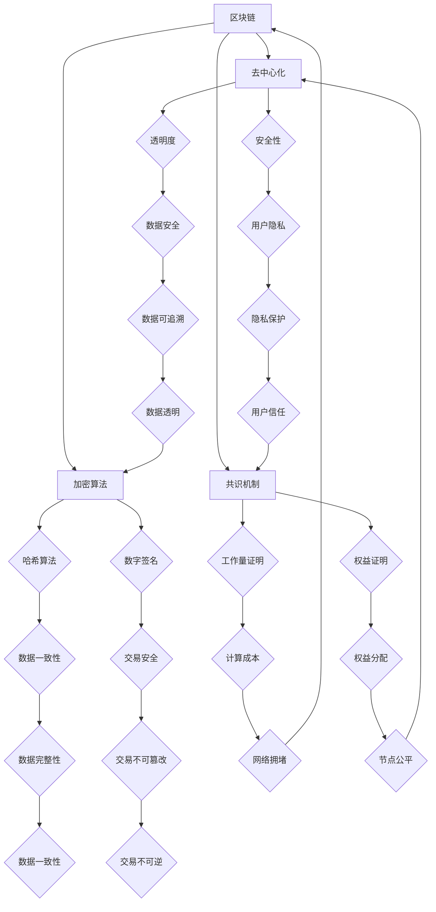

                 

# 技术博客：建立专业权威的有效途径

> **关键词**：技术博客、专业权威、内容构建、SEO优化、社交媒体宣传、持续更新与互动、数据分析与反馈

> **摘要**：本文旨在探讨如何通过技术博客的构建与维护，建立专业权威的技术形象。文章首先概述了技术博客的重要性，接着详细解析了博客平台选择、内容规划、文章写作、设计与排版、社交媒体宣传、SEO优化等关键环节。此外，文章还介绍了如何通过核心概念解析、算法原理讲解、数学模型和公式阐述、项目实战等手段提升博客的专业性与权威性。最后，文章提出了持续优化与成长的策略，包括数据分析与反馈、学习与成长、持续改进与更新等。

## 第一部分：引言与概述

### 1. 引言

#### 1.1 书籍背景

随着互联网技术的飞速发展，信息技术已经成为现代社会的重要支柱。在这个信息化时代，技术博客作为一种重要的知识传播方式，逐渐受到了广大技术从业者的青睐。技术博客不仅可以帮助个人展示专业技能，还能为企业塑造专业形象。本文旨在为技术博客作者提供一套完整的构建与优化指南，帮助他们在技术领域建立专业权威。

#### 1.2 目标读者

本文的目标读者主要包括以下几类人群：

1. 技术爱好者：对某一技术领域有浓厚兴趣，希望通过博客分享知识。
2. 技术从业者：希望提升个人技术影响力，拓展职业发展空间。
3. 企业技术团队：希望通过博客构建企业技术品牌，提升企业竞争力。

#### 1.3 书籍结构

本文共分为四个部分：

1. **第一部分：引言与概述**：介绍技术博客的重要性、目标读者和书籍结构。
2. **第二部分：博客构建**：详细解析博客平台选择、内容规划、文章写作、设计与排版、社交媒体宣传、SEO优化等关键环节。
3. **第三部分：提高博客专业性与权威性**：通过核心概念解析、算法原理讲解、数学模型和公式阐述、项目实战等手段提升博客的专业性与权威性。
4. **第四部分：持续优化与成长**：提出持续优化与成长的策略，包括数据分析与反馈、学习与成长、持续改进与更新等。

### 1.2 技术博客的重要性

#### 1.2.1 博客在技术传播中的角色

技术博客在技术传播中发挥着至关重要的作用。首先，它为技术从业者提供了一个展示自己专业技能的平台。通过博客，作者可以分享自己的技术心得、项目经验，甚至原创的技术教程。其次，技术博客有助于建立个人品牌。在博客中，作者可以展现出自己的专业素养和独特见解，从而赢得读者的信任和认可。此外，技术博客还能帮助企业塑造技术品牌。企业可以通过博客展示技术实力，提高行业知名度，吸引潜在客户。

#### 1.2.2 博客对个人和职业发展的作用

对于个人来说，技术博客有助于提升专业技能和知识储备。在博客写作过程中，作者需要对所写内容进行深入思考和研究，这有助于巩固和拓展自己的知识体系。同时，博客写作也是一种很好的实践机会。通过实际操作和撰写博客，作者可以不断提升自己的技术水平。对于职业发展来说，技术博客具有以下几个方面的作用：

1. **增加曝光率**：通过博客，作者可以吸引更多同行和潜在雇主的关注，提高个人知名度。
2. **拓展人脉**：博客写作可以结识志同道合的技术同行，拓宽人脉资源。
3. **提升竞争力**：在求职过程中，具有丰富博客写作经验的技术人才往往更具竞争力。
4. **促进职业晋升**：在博客中展示出专业素养和技术实力，有助于在职场中脱颖而出，获得更好的职业机会。

#### 1.2.3 博客的优势与挑战

博客在技术传播和职业发展中具有许多优势，但同时也面临着一定的挑战。

**优势**：

1. **自由度高**：博客作者可以根据自己的兴趣和擅长领域，自由选择主题和写作风格。
2. **传播速度快**：博客文章一旦发布，可以迅速传播到全球各地，实现知识的快速传递。
3. **互动性强**：博客支持读者留言和评论，有助于作者与读者之间的互动交流。
4. **多样化形式**：博客可以结合图片、视频、代码等多种形式，使内容更加丰富和生动。

**挑战**：

1. **竞争激烈**：随着博客数量的增加，竞争也日益激烈，作者需要不断提升自己的内容质量和影响力。
2. **时间投入**：博客写作需要投入大量的时间和精力，作者需要合理规划时间，确保博客的质量和更新速度。
3. **技术门槛**：对于一些技术性较强的博客，作者需要具备一定的技术背景和写作能力。

### 1.3 专业与权威的构建

#### 1.3.1 专业性的定义与标准

专业性是指某一领域内具备深厚的知识和技能，能够独立思考和解决问题的能力。在技术博客中，专业性主要体现在以下几个方面：

1. **深厚的技术功底**：作者需要具备扎实的理论基础和丰富的实践经验，能够准确理解和运用相关技术。
2. **独特的见解**：作者需要具备独特的视角和思维，能够对技术问题提出有价值的见解和解决方案。
3. **严谨的逻辑**：作者需要具备严谨的逻辑思维，能够清晰地阐述技术原理和问题解决方案。
4. **良好的表达**：作者需要具备良好的表达能力，能够将复杂的技术概念用简洁明了的语言进行阐述。

#### 1.3.2 权威性的重要性

权威性是指某一领域内被广泛认可和信任的程度。在技术博客中，权威性具有以下几个方面的作用：

1. **增加信任度**：具备权威性的博客更容易赢得读者的信任，提高文章的影响力。
2. **提升知名度**：权威性博客有助于提升作者的个人和品牌知名度，为职业发展奠定基础。
3. **拓展人脉资源**：权威性博客能够吸引更多同行业人士的关注，有助于拓展人脉资源。
4. **增加曝光率**：权威性博客更容易被搜索引擎收录和推荐，从而提高文章的曝光率。

#### 1.3.3 如何提升博客的专业性与权威性

要提升博客的专业性与权威性，可以从以下几个方面入手：

1. **深入研究技术**：不断学习和积累技术知识，提高自己的专业素养。
2. **提升写作能力**：通过阅读优秀博客和书籍，学习并掌握高效的写作技巧。
3. **保持更新频率**：定期更新博客，保持内容的新鲜度和活力。
4. **积极参与讨论**：在博客评论区与其他读者互动，分享观点和经验，提升博客的互动性。
5. **发布高质量内容**：注重内容的质量和深度，避免泛泛而谈和抄袭。
6. **拓展影响力**：通过社交媒体、技术社区等渠道，扩大博客的影响力。
7. **获得认可与推荐**：争取行业内权威人士的认可和推荐，提高博客的权威性。

## 第二部分：博客构建

### 2.1 博客平台选择

#### 2.1.1 常见博客平台介绍

在博客平台的选择上，常见的博客平台主要包括以下几种：

1. **WordPress**：WordPress 是最流行的博客平台之一，具有强大的扩展性和自定义功能，适合技术博客的搭建。
2. **Hexo**：Hexo 是一款基于 Node.js 的静态博客生成工具，生成速度快，适合技术博客的快速搭建和部署。
3. **Jekyll**：Jekyll 是一款基于 Ruby 的静态网站生成工具，适合技术博客的搭建，具有良好的扩展性和自定义功能。
4. **Medium**：Medium 是一款在线博客平台，支持 Markdown 语法，适合快速搭建博客并发布内容。

#### 2.1.2 平台选择标准

选择博客平台时，可以从以下几个方面进行考虑：

1. **易用性**：平台应具备良好的用户界面和直观的操作流程，降低博客搭建和维护的门槛。
2. **扩展性**：平台应具备良好的扩展性，支持自定义主题、插件和功能，满足个人需求。
3. **性能**：平台应具备较高的性能，确保博客的加载速度和稳定性。
4. **SEO 优化**：平台应具备较好的 SEO 优化能力，有助于提高博客的搜索引擎排名。
5. **社区支持**：平台应具备成熟的社区支持，方便作者寻求帮助和交流经验。

#### 2.1.3 如何搭建博客平台

以下以 WordPress 为例，介绍如何搭建博客平台：

1. **购买域名和空间**：在域名注册商购买域名，在主机商购买合适的主机。
2. **安装 WordPress**：登录主机，通过 cPanel 或一键安装包安装 WordPress。
3. **选择主题**：在 WordPress 主题市场选择合适的主题，并安装和启用。
4. **配置插件**：根据需求安装和配置必要的插件，如 SEO 插件、缓存插件等。
5. **发布内容**：在 WordPress 后台撰写和发布博客文章。

### 2.2 内容规划

#### 2.2.1 内容定位

内容定位是博客构建的重要环节，需要明确以下几个问题：

1. **博客主题**：明确博客的主题，如前端开发、后端开发、人工智能等。
2. **目标读者**：确定目标读者群体，如技术爱好者、从业者、企业用户等。
3. **内容方向**：明确博客的内容方向，如技术教程、项目实战、行业动态等。

#### 2.2.2 内容规划流程

内容规划流程如下：

1. **市场调研**：了解目标读者的需求和喜好，分析同行业博客的内容特点。
2. **确定主题**：根据市场调研结果，确定博客的主题和内容方向。
3. **制定内容计划**：根据主题和内容方向，制定具体的内容计划，包括文章标题、摘要、正文等。
4. **内容发布**：按照内容计划，定期发布博客文章。

#### 2.2.3 内容发布策略

内容发布策略如下：

1. **定期更新**：保持博客的更新频率，确保内容的新鲜度和活力。
2. **优先发布高质量内容**：优先发布具有深度和独特见解的高质量内容，避免泛泛而谈。
3. **整合多渠道发布**：通过社交媒体、邮件列表等渠道，整合发布博客内容，提高曝光率。
4. **互动与反馈**：积极与读者互动，收集反馈意见，不断优化博客内容。

### 2.3 文章写作

#### 2.3.1 文章结构

一篇完整的博客文章通常包括以下几个部分：

1. **标题**：简明扼要地概括文章主题，吸引读者的注意力。
2. **摘要**：简要介绍文章的主要内容，引导读者阅读全文。
3. **引言**：简要介绍文章背景和目的，引起读者的兴趣。
4. **正文**：详细阐述文章主题，包括相关概念、原理、方法、案例等。
5. **结论**：总结文章的主要观点和结论，给出建议和展望。
6. **参考文献**：列出文章中引用的参考文献和资料。

#### 2.3.2 写作技巧

以下是一些写作技巧，有助于提高博客文章的质量：

1. **明确结构**：确保文章结构清晰，层次分明，便于读者阅读。
2. **使用生动的语言**：避免使用过于专业和晦涩的词汇，尽量用简单的语言表达复杂的概念。
3. **注重逻辑性**：确保文章的论证过程严密，逻辑清晰，避免逻辑错误和矛盾。
4. **举例说明**：通过实际案例和举例说明，使文章更具说服力。
5. **保持一致性**：在文章中使用一致的术语、格式和风格，避免混乱和矛盾。
6. **避免抄袭**：确保文章内容的原创性，避免抄袭和剽窃。
7. **反复修改**：在完成初稿后，反复修改和润色，提高文章的质量。

#### 2.3.3 避免常见错误

在博客写作过程中，以下是一些常见的错误，需要尽量避免：

1. **标题不准确**：标题没有准确概括文章主题，导致读者产生误解。
2. **结构混乱**：文章结构不清晰，层次混乱，影响读者的阅读体验。
3. **内容空洞**：文章内容空洞，缺乏实际价值和深度。
4. **语言生硬**：文章语言生硬，缺乏生动和感染力。
5. **论证不充分**：文章论证不充分，逻辑存在漏洞，影响文章的可信度。
6. **引用错误**：文章中引用的参考文献和资料不准确或错误，影响文章的权威性。
7. **抄袭和剽窃**：文章内容存在抄袭和剽窃现象，损害个人和博客的声誉。

### 2.4 设计与排版

#### 2.4.1 设计原则

博客设计需要遵循以下原则：

1. **简洁明了**：界面简洁明了，避免过于花哨的装饰和布局。
2. **美观统一**：整体设计美观统一，保持风格的一致性。
3. **易用性**：界面布局合理，操作便捷，提高用户的阅读体验。
4. **响应式设计**：适应不同设备屏幕尺寸，提供良好的视觉效果和用户体验。

#### 2.4.2 排版要点

博客排版需要遵循以下要点：

1. **段落分明**：每个段落开头缩进，保持段落之间的清晰界限。
2. **字体选择**：选择清晰易读的字体，避免使用过于花哨的字体。
3. **字体大小**：根据阅读距离和屏幕尺寸，选择合适的字体大小。
4. **行距和字距**：调整行距和字距，使文章阅读起来更加舒适。
5. **标题和子标题**：使用不同的字体和字号，突出标题和子标题。
6. **图片和图表**：合理使用图片和图表，帮助读者更好地理解文章内容。

#### 2.4.3 美化技巧

以下是一些美化博客的技巧：

1. **配色方案**：选择合适的配色方案，提高界面的美观度。
2. **背景图片**：使用背景图片，增加界面的层次感和视觉效果。
3. **图标和按钮**：使用图标和按钮，提高界面的操作性和美观度。
4. **代码高亮**：使用代码高亮插件，使代码更易读。
5. **响应式布局**：使用响应式布局，使博客在不同设备上都能保持良好的视觉效果。
6. **自定义样式**：根据个人喜好和博客主题，自定义样式和布局。

### 2.5 社交媒体宣传

#### 2.5.1 社交媒体的作用

社交媒体在博客宣传中发挥着重要作用：

1. **提高曝光率**：通过社交媒体平台，将博客内容传播给更广泛的受众，提高文章的曝光率。
2. **增加访问量**：社交媒体平台的分享和推荐，可以吸引更多的读者访问博客，增加访问量。
3. **拓展人脉**：通过社交媒体，结识更多同行业人士，拓展人脉资源。
4. **增加互动性**：社交媒体平台支持评论和互动，有助于作者与读者之间的沟通和交流。
5. **提升品牌知名度**：通过社交媒体，提高博客和个人品牌的知名度，增强行业影响力。

#### 2.5.2 常用社交媒体平台

以下是一些常用的社交媒体平台：

1. **微博**：国内最大的社交媒体平台，用户基数庞大，适合国内博客宣传。
2. **知乎**：知识分享平台，内容质量较高，适合技术博客分享和讨论。
3. **Twitter**：国际知名的社交媒体平台，用户广泛，适合国际博客宣传。
4. **Facebook**：全球最大的社交媒体平台，用户基数庞大，适合博客宣传。
5. **LinkedIn**：职业社交平台，适合技术博客和个人品牌的宣传。

#### 2.5.3 宣传策略

以下是一些有效的宣传策略：

1. **内容营销**：发布高质量、有价值的内容，吸引读者关注和转发。
2. **社交媒体推广**：利用社交媒体平台的推广功能，增加博客内容的曝光率。
3. **互动交流**：积极参与社交媒体平台的讨论，回答问题，提高博客的知名度。
4. **合作推广**：与其他博客作者、行业专家、企业合作，进行互推，扩大影响力。
5. **SEO 优化**：通过 SEO 优化，提高博客在搜索引擎中的排名，吸引更多访问者。
6. **邮件营销**：建立邮件列表，定期向订阅者发送博客更新通知，提高访问量和互动性。

### 2.6 SEO优化

#### 2.6.1 SEO基本概念

SEO（Search Engine Optimization）即搜索引擎优化，是指通过一系列技术和策略，提高网站在搜索引擎中的排名，从而吸引更多访问者。SEO 基本概念包括：

1. **关键词优化**：选择合适的关键词，提高文章在搜索引擎中的相关性。
2. **内容优化**：优化文章内容，提高文章的质量和可读性。
3. **技术优化**：优化网站的技术架构和代码，提高网站的加载速度和用户体验。
4. **链接优化**：优化网站内部的链接结构，提高网站的权重和流量。
5. **外部链接**：获得其他网站的链接，提高网站的权重和排名。

#### 2.6.2 关键词策略

关键词策略是 SEO 优化的核心环节，以下是一些建议：

1. **关键词选择**：根据目标读者和文章主题，选择合适的关键词，避免过度优化。
2. **关键词分布**：合理分布关键词，避免堆砌关键词，影响文章的可读性。
3. **长尾关键词**：选择长尾关键词，提高文章在特定领域的竞争力。
4. **关键词密度**：控制关键词密度，避免过度优化，影响文章的质量。
5. **关键词监控**：定期监控关键词排名和流量，根据数据调整关键词策略。

#### 2.6.3 提升搜索引擎排名

以下是一些建议，有助于提升搜索引擎排名：

1. **优化文章质量**：提高文章的质量和可读性，增加用户停留时间和互动性。
2. **提高网站速度**：优化网站速度，提高用户体验，降低跳出率。
3. **内部链接结构**：优化内部链接结构，提高网站权重和流量。
4. **外部链接建设**：积极建设外部链接，提高网站权重和排名。
5. **社交媒体推广**：通过社交媒体推广，提高网站曝光率和流量。
6. **定期更新内容**：定期更新内容，提高网站的活跃度和权威性。
7. **监控和调整**：定期监控 SEO 数据，根据数据调整策略，持续优化。

### 2.7 持续更新与互动

#### 2.7.1 定期更新计划

定期更新是博客持续发展的关键，以下是一些建议：

1. **制定更新计划**：根据实际情况，制定合理的更新计划，确保博客内容的持续更新。
2. **设定更新频率**：根据内容质量和受众需求，设定合适的更新频率，如每周、每月等。
3. **优先更新高质量内容**：优先更新具有深度和独特见解的高质量内容，避免频繁发布低质量内容。
4. **预告和提醒**：在博客中预告即将更新的内容，并在发布时提醒读者关注。

#### 2.7.2 互动策略

互动是博客与读者之间的桥梁，以下是一些建议：

1. **开启评论功能**：开启博客的评论功能，允许读者在文章下方留言和评论。
2. **回复评论**：及时回复读者的评论，提高读者的参与度和满意度。
3. **互动话题**：定期发布互动话题，鼓励读者参与讨论，增加博客的互动性。
4. **举办活动**：举办线上或线下活动，吸引读者参与，增强读者对博客的认同感。
5. **建立社群**：建立博客社群，如微信群、QQ 群等，方便读者之间的交流和互动。

#### 2.7.3 提升用户黏性

提升用户黏性是博客长期发展的重要目标，以下是一些建议：

1. **提供有价值的内容**：持续提供有价值的内容，满足读者的需求和兴趣。
2. **个性化推荐**：根据读者的阅读习惯和兴趣，提供个性化的内容推荐，提高读者的参与度。
3. **互动体验**：优化博客的互动体验，如评论、点赞、收藏等，增强读者的参与感。
4. **用户积分**：设置用户积分系统，鼓励读者积极参与互动和分享，提高用户黏性。
5. **定期活动**：举办各种形式的线上和线下活动，提高读者的活跃度和忠诚度。

## 第三部分：提高博客专业性与权威性

### 9. 核心概念与联系

#### 9.1 核心概念解析

在技术博客中，核心概念是文章的基础，对概念进行准确而深刻的解析，是提升博客专业性的关键。以下是一个例子，以“区块链”为核心概念进行解析：

**区块链**：区块链是一种分布式数据库技术，通过加密算法和共识机制，实现数据的分布式存储和不可篡改。区块链的核心概念包括：

1. **去中心化**：去中心化是指区块链无需中心化管理机构，所有节点均可参与数据记录和验证，提高了系统的透明度和安全性。
2. **加密算法**：加密算法是区块链的核心技术之一，通过哈希算法和数字签名，确保数据的安全性和隐私性。
3. **共识机制**：共识机制是区块链中节点达成一致的方法，如工作量证明（PoW）、权益证明（PoS）等，用于确保区块链的稳定性和安全性。

#### 9.2 核心概念流程图

为了更直观地展示“区块链”的核心概念，可以使用 Mermaid 语法绘制流程图：



通过上述流程图，我们可以清晰地看到“区块链”的核心概念及其相互关系。

### 10. 核心算法原理讲解

#### 10.1 算法分类

在技术博客中，深入讲解核心算法原理是提升博客权威性的重要手段。算法主要分为以下几类：

1. **排序算法**：如快速排序、归并排序、堆排序等。
2. **查找算法**：如二分查找、线性查找等。
3. **图算法**：如深度优先搜索（DFS）、广度优先搜索（BFS）、最短路径算法（如 Dijkstra 算法）等。
4. **动态规划**：如最长公共子序列、最长递增子序列等。
5. **分治算法**：如快速排序、归并排序等。

#### 10.2 算法原理与伪代码

以下以“快速排序”为例，讲解其原理并展示伪代码：

**快速排序（Quick Sort）原理**：

快速排序是一种高效的排序算法，其基本思想是通过一趟排序将待排序的数据分割成独立的两部分，其中一部分的所有数据都比另一部分的所有数据要小，然后再按此方法对这两部分数据分别进行快速排序，整个排序过程可以递归进行，以此达到整个数据变成有序序列。

**伪代码**：

```pseudocode
QUICKSORT(A, p, r)
    if p < r
        q = PARTITION(A, p, r)
        QUICKSORT(A, p, q - 1)
        QUICKSORT(A, q + 1, r)
```

**PARTITION(A, p, r) 函数伪代码**：

```pseudocode
PARTITION(A, p, r)
    pivot = A[r] // 选择最后一个元素作为基准
    i = p - 1 // i 用于记录比 pivot 小的元素的最后一个位置

    for j = p to r - 1
        if A[j] < pivot
            i = i + 1
            swap A[i] with A[j]

    swap A[i + 1] with A[r]
    return i + 1
```

通过上述伪代码，我们可以清晰地了解快速排序的算法原理和实现步骤。

### 11. 数学模型与数学公式

#### 11.1 常见数学模型

在技术博客中，数学模型是描述和解决问题的工具。常见的数学模型包括：

1. **线性回归模型**：用于分析自变量和因变量之间的线性关系。
2. **逻辑回归模型**：用于分类问题，分析自变量对因变量的影响。
3. **决策树模型**：通过树形结构表示决策过程，用于分类和回归问题。
4. **神经网络模型**：用于复杂非线性问题，通过多层神经元实现数据变换和预测。

#### 11.2 公式详细讲解与举例

以下以“线性回归模型”为例，详细讲解其公式和举例：

**线性回归模型公式**：

- **回归方程**：\( y = \beta_0 + \beta_1x + \epsilon \)
- **参数估计**：
  - 最小二乘法（ Ordinary Least Squares, OLS）：
    \[ \beta_0 = \frac{\sum y_i - \beta_1 \sum x_i}{n} \]
    \[ \beta_1 = \frac{n \sum x_i y_i - \sum x_i \sum y_i}{n \sum x_i^2 - (\sum x_i)^2} \]
- **假设检验**：
  - t 检验：
    \[ t = \frac{\hat{\beta}_1 - \beta_1}{SE(\hat{\beta}_1)} \]
    其中，\( SE(\hat{\beta}_1) \) 是 \(\hat{\beta}_1\) 的标准误。

**举例**：

假设我们要分析房价 \( y \) 与房屋面积 \( x \) 之间的关系，根据以下数据：

| 房屋面积 \( x \) | 房价 \( y \) |
|:-----------------:|:-----------:|
|         100         |       200,000 |
|         120         |       250,000 |
|         150         |       300,000 |
|         180         |       350,000 |
|         200         |       400,000 |

使用最小二乘法估计线性回归模型，得到：

- 房价估计方程：\( \hat{y} = 150,000 + 1,000x \)
- 回归系数：\( \beta_0 = 150,000 \)，\( \beta_1 = 1,000 \)
- 房价预测：当房屋面积为 150 平方米时，预测房价为 \( \hat{y} = 150,000 + 1,000 \times 150 = 300,000 \) 元。

通过上述讲解和举例，我们可以清晰地理解线性回归模型的基本概念和计算方法。

#### 11.3 LaTeX格式使用说明

在技术博客中，LaTeX 是一种常用的数学公式排版工具。以下是一个简单的 LaTeX 公式嵌入示例：

**示例**：

- 独立段落内的公式：
  \[ E = mc^2 \]
- 段落内的公式：
  \( \sin(\theta) = \frac{y}{r} \)

在撰写技术博客时，可以使用 LaTeX 语法编写数学公式，从而提高公式的可读性和美观度。LaTeX 的基本语法如下：

- **行内公式**：
  \[ \text{行内公式} \]
- **独立段落公式**：
  \[
  \text{独立段落公式}
  \]

通过掌握 LaTeX 的基本语法，我们可以更灵活地编写和排版技术博客中的数学公式。

### 12. 项目实战

#### 12.1 实战案例介绍

在本部分，我们将通过一个实际的项目案例，展示如何搭建并实现一个基于 Flask 的简单 Web 应用。该项目将包括用户注册、登录、个人信息管理等功能。

#### 12.2 开发环境搭建

1. **安装 Python**：在官方网站下载并安装 Python 3.x 版本。
2. **安装 Flask**：通过 pip 工具安装 Flask：
   ```shell
   pip install Flask
   ```
3. **安装数据库**：选择并安装一个数据库管理系统，如 SQLite、MySQL 或 PostgreSQL。

#### 12.3 源代码实现与解读

**项目结构**：

```
myapp/
|-- app.py
|-- templates/
|   |-- base.html
|   |-- login.html
|   |-- register.html
|   |-- user_dashboard.html
|-- static/
    |-- css/
        |-- style.css
    |-- js/
        |-- script.js
```

**app.py**：

```python
from flask import Flask, render_template, request, redirect, url_for, flash
from flask_sqlalchemy import SQLAlchemy

app = Flask(__name__)
app.config['SQLALCHEMY_DATABASE_URI'] = 'sqlite:///users.db'
app.config['SECRET_KEY'] = 'your_secret_key'

db = SQLAlchemy(app)

class User(db.Model):
    id = db.Column(db.Integer, primary_key=True)
    username = db.Column(db.String(80), unique=True, nullable=False)
    password = db.Column(db.String(120), nullable=False)

@app.route('/')
@app.route('/home')
def home():
    return render_template('base.html')

@app.route('/register', methods=['GET', 'POST'])
def register():
    if request.method == 'POST':
        username = request.form['username']
        password = request.form['password']
        if not username or not password:
            flash('请填写用户名和密码！', 'error')
            return redirect(url_for('home'))
        if User.query.filter_by(username=username).first():
            flash('用户名已存在！', 'error')
            return redirect(url_for('home'))
        new_user = User(username=username, password=password)
        db.session.add(new_user)
        db.session.commit()
        flash('注册成功！', 'success')
        return redirect(url_for('login'))
    return render_template('register.html')

@app.route('/login', methods=['GET', 'POST'])
def login():
    if request.method == 'POST':
        username = request.form['username']
        password = request.form['password']
        user = User.query.filter_by(username=username, password=password).first()
        if user:
            flash('登录成功！', 'success')
            return redirect(url_for('user_dashboard'))
        else:
            flash('用户名或密码错误！', 'error')
            return redirect(url_for('login'))
    return render_template('login.html')

@app.route('/user_dashboard')
def user_dashboard():
    return render_template('user_dashboard.html')

if __name__ == '__main__':
    db.create_all()
    app.run(debug=True)
```

**数据库**：

在 `app.py` 中，我们使用了 Flask-SQLAlchemy 模块来创建数据库。`User` 类是数据库模型，包括 `id`、`username` 和 `password` 字段。

**模板**：

`base.html` 是基础模板，包含导航栏和页脚。

`register.html`、`login.html` 和 `user_dashboard.html` 分别是注册、登录和个人仪表盘的模板。

#### 12.4 代码解读与分析

**数据库操作**：

在 `app.py` 中，我们首先初始化 Flask 应用和数据库：

```python
app = Flask(__name__)
app.config['SQLALCHEMY_DATABASE_URI'] = 'sqlite:///users.db'
app.config['SECRET_KEY'] = 'your_secret_key'
db = SQLAlchemy(app)
```

这里我们设置了数据库 URI 和秘钥，并创建了数据库实例。

**用户模型**：

```python
class User(db.Model):
    id = db.Column(db.Integer, primary_key=True)
    username = db.Column(db.String(80), unique=True, nullable=False)
    password = db.Column(db.String(120), nullable=False)
```

`User` 类是数据库模型，包含用户 ID、用户名和密码字段。用户名唯一，密码使用字符串存储。

**路由和视图函数**：

- `home()` 视图函数显示主页。
- `register()` 视图函数处理注册请求，包括验证表单数据、创建新用户和重定向。
- `login()` 视图函数处理登录请求，包括验证用户名和密码、重定向。
- `user_dashboard()` 视图函数显示用户仪表盘。

**模板**：

模板文件 `register.html`、`login.html` 和 `user_dashboard.html` 包含 HTML 表单和页面结构。通过 Jinja2 模板语法，可以在模板中嵌入 Flask 变量和逻辑。

通过以上代码解读和分析，我们可以了解如何使用 Flask 搭建一个简单的 Web 应用，并实现用户注册、登录和个人信息管理功能。

### 13. 数据分析与反馈

#### 13.1 数据分析工具

在技术博客的运营过程中，数据分析是至关重要的一环。以下是一些常用的数据分析工具：

1. **Google Analytics**：谷歌分析是世界上最流行的网站分析工具之一，提供详细的网站访问数据、用户行为分析、流量来源等。
2. **Google Search Console**：谷歌搜索引擎控制台可以帮助博客作者了解其网站在谷歌搜索中的表现，包括关键词排名、搜索查询、点击率等。
3. **百度统计**：百度统计是国内领先的网站分析工具，与 Google Analytics 功能类似，提供详细的网站访问数据和用户行为分析。
4. **Baidu Search Console**：百度搜索引擎控制台提供与 Google Search Console 类似的功能，帮助博客作者了解网站在百度搜索中的表现。
5. **Heap**：Heap 是一款用户行为分析工具，可以帮助博客作者深入了解用户在网站上的行为，优化用户体验。

#### 13.2 数据分析方法

以下是一些常用的数据分析方法：

1. **用户行为分析**：通过分析用户访问网站的行为，了解用户喜好、访问路径、停留时间等，优化网站内容和布局。
2. **流量来源分析**：分析网站的流量来源，包括直接访问、搜索引擎、社交媒体等，了解不同渠道的访问量和转化率，优化推广策略。
3. **关键词排名分析**：跟踪关键词在搜索引擎中的排名，了解关键词的搜索量和竞争程度，优化关键词策略和 SEO 措施。
4. **用户留存分析**：分析用户的留存情况，了解用户对网站的粘性，优化用户体验和互动策略，提高用户留存率。
5. **转化率分析**：分析网站上的转化率，包括注册、购买、留言等，优化网站内容和设计，提高转化率。

#### 13.3 反馈机制

建立有效的反馈机制是提高博客质量的重要手段。以下是一些反馈机制的建立方法：

1. **评论功能**：在博客文章下方设置评论功能，允许用户对文章进行评论和讨论，收集用户反馈。
2. **问卷调查**：定期发布问卷调查，了解用户对博客内容的满意度、意见和建议，优化博客内容和形式。
3. **用户访谈**：与用户进行一对一访谈，深入了解用户需求和期望，为博客的改进提供依据。
4. **在线反馈表单**：在博客网站上设置在线反馈表单，方便用户提交问题和建议。
5. **社交媒体互动**：通过社交媒体平台与用户互动，收集用户反馈和意见，提高博客的互动性和用户参与度。

通过建立有效的反馈机制，博客作者可以及时了解用户需求，不断优化博客内容和用户体验，提高博客的质量和影响力。

### 14. 学习与成长

#### 14.1 行业动态

技术博客作者需要密切关注行业动态，了解最新的技术趋势和发展方向。以下是一些获取行业动态的途径：

1. **技术社区**：加入技术社区，如 Stack Overflow、GitHub、Reddit 等，了解技术讨论和最新动态。
2. **技术博客**：阅读行业领先博客，了解技术博客作者分享的最新技术心得和实践经验。
3. **技术会议和研讨会**：参加技术会议和研讨会，与行业专家和同行交流，了解最新技术趋势。
4. **社交媒体**：关注技术领域的大咖和机构，了解他们的最新动态和观点。
5. **新闻和媒体**：阅读科技新闻和媒体报道，了解最新的科技事件和行业动态。

#### 14.2 学习资源

技术博客作者需要不断学习，提升自己的技术能力和知识储备。以下是一些学习资源：

1. **在线课程**：参加在线课程，如 Coursera、edX、Udemy 等，学习最新的技术知识和技能。
2. **专业书籍**：阅读专业书籍，了解技术领域的深度和广度，提高自己的专业素养。
3. **技术博客**：撰写并阅读技术博客，分享和交流技术心得，提升自己的表达能力。
4. **开源项目**：参与开源项目，了解项目的技术架构和实现细节，提高自己的项目实战能力。
5. **技术社区**：加入技术社区，参与讨论和分享，与同行交流学习，拓展自己的视野。

#### 14.3 成长策略

以下是一些有效的成长策略：

1. **定期学习**：设定每周或每月的学习目标，确保有足够的时间进行学习。
2. **实践应用**：将所学知识应用于实际项目中，通过实践不断提高自己的技能。
3. **分享与交流**：定期撰写技术博客，分享自己的学习和实践心得，与他人交流，提高自己的表达能力和沟通能力。
4. **反思与总结**：定期反思自己的学习和成长过程，总结经验教训，不断优化自己的学习方法。
5. **建立导师关系**：寻找行业内的导师，向他们请教问题，学习他们的经验和技能。
6. **拓宽视野**：关注多个技术领域，了解不同领域的知识和应用，提高自己的综合素质。

通过以上策略，技术博客作者可以不断提升自己的技术水平，实现个人和职业的成长。

### 15. 持续改进与更新

#### 15.1 博客更新策略

为了保持博客的活力和专业性，需要制定有效的更新策略。以下是一些建议：

1. **定期更新**：设定固定的更新频率，如每周发布一篇文章。这有助于读者形成阅读习惯，增加博客的粘性。
2. **优先级排序**：根据内容的紧迫性和重要性，优先发布高质量和有深度的文章。避免频繁发布低质量内容，损害博客形象。
3. **内容多样化**：结合不同类型的内容，如技术教程、案例分析、行业动态等，满足读者的多样化需求。
4. **预告和提醒**：在发布新文章前，通过社交媒体、邮件列表等渠道预告，提醒读者关注。
5. **内容回访**：定期回访旧文章，更新和改进内容，确保文章的时效性和准确性。

#### 15.2 提升内容质量

提升内容质量是博客长期发展的关键。以下是一些建议：

1. **深入研究**：在撰写文章前，深入研究和了解相关主题，确保内容的深度和准确性。
2. **撰写技巧**：掌握良好的写作技巧，如清晰的结构、简洁的语言、生动的描述等，提高文章的可读性。
3. **逻辑性**：确保文章的论证过程逻辑严密，避免逻辑错误和矛盾。
4. **举例说明**：结合实际案例和举例说明，使文章更具说服力。
5. **参考文献**：在文章中引用可靠的参考文献和资料，提高文章的权威性。
6. **用户反馈**：积极收集用户反馈，根据反馈调整和改进文章内容。

#### 15.3 适应变化

技术领域不断发展变化，博客作者需要不断适应新的技术和趋势。以下是一些建议：

1. **持续学习**：关注最新的技术动态，不断学习和更新自己的知识储备。
2. **调整内容方向**：根据行业趋势和读者需求，及时调整博客的内容方向和主题。
3. **技术调研**：对新出现的技术进行调研，了解其原理和应用，为博客撰写新文章。
4. **优化博客结构**：根据用户反馈和技术发展，优化博客的结构和设计，提高用户体验。
5. **合作与交流**：与行业内的专家和同行保持紧密合作和交流，共同推动技术进步。

通过以上策略，博客作者可以持续改进和更新博客，保持博客的活力和专业性。

### 16. 成为技术博客专家

#### 16.1 专家标准

要成为技术博客专家，需要满足以下标准：

1. **深厚的技术功底**：具备扎实的理论基础和丰富的实践经验，能够解决复杂的技术问题。
2. **广泛的视野**：关注行业动态，了解最新的技术趋势和发展方向。
3. **独特的见解**：能够对技术问题提出有价值的见解和解决方案。
4. **良好的表达能力**：具备良好的表达能力，能够将复杂的技术概念用简洁明了的语言进行阐述。
5. **持续学习**：具备持续学习的动力和能力，不断提升自己的技术水平。
6. **广泛的人脉**：在行业内拥有广泛的人脉资源，能够与其他专家和同行保持紧密合作。
7. **高质量的输出**：能够定期发布高质量、有深度的技术文章。

#### 16.2 成长路径

以下是一条成为技术博客专家的典型成长路径：

1. **基础知识积累**：学习编程语言、数据结构、算法等基础知识，掌握基本的技术能力。
2. **实践应用**：通过实际项目，将所学知识应用于实际场景，提升项目实战能力。
3. **学习新技术**：关注行业动态，学习最新的技术趋势和发展方向，不断更新自己的知识储备。
4. **撰写博客**：开始撰写技术博客，分享自己的学习心得和技术经验，逐渐积累读者和影响力。
5. **互动交流**：积极参与技术社区和论坛的讨论，与其他技术爱好者、从业者进行交流。
6. **拓展视野**：参加技术会议、研讨会和培训，与行业专家和同行交流，拓展自己的视野。
7. **建立人脉**：通过多种途径建立人脉，与行业内的重要人物建立联系，拓展职业发展空间。
8. **持续优化**：持续优化博客内容和写作技巧，提升文章质量和影响力。
9. **合作与分享**：与其他专家合作，共同开展技术研究和分享，提升自己的专业水平。

通过以上成长路径，技术博客作者可以逐步成长为技术博客专家。

## 附录

### 附录 A: 博客工具与资源

#### A.1 常用工具介绍

1. **Markdown 编辑器**：
   - **Typora**：一款简洁易用的 Markdown 编辑器，支持实时预览和丰富的扩展功能。
   - **VS Code**：一款功能强大的代码编辑器，支持 Markdown 插件，适合编程爱好者使用。
   - **MacDown**：一款适用于 Mac 系统的 Markdown 编辑器，支持实时预览和导出 PDF 功能。

2. **图片处理工具**：
   - **Photoshop**：一款功能强大的图像处理软件，适用于专业级图像编辑。
   - **GIMP**：一款免费开源的图像编辑器，提供丰富的编辑功能。
   - **Canva**：一款在线设计工具，适用于简单的图片设计和排版。

3. **代码高亮工具**：
   - **Highlight.js**：一款开源的代码高亮库，支持多种编程语言。
   - **Prism.js**：一款轻量级的代码高亮库，支持多种编程语言和语法高亮。

4. **数据可视化工具**：
   - **D3.js**：一款基于 JavaScript 的数据可视化库，提供丰富的图表和可视化组件。
   - **ECharts**：一款基于 JavaScript 的开源可视化库，支持多种图表和交互功能。

#### A.2 学习资源推荐

1. **在线课程**：
   - **Coursera**：提供丰富的在线课程，包括计算机科学、数据科学、人工智能等领域。
   - **Udemy**：提供各类在线课程，包括编程语言、数据分析、机器学习等。
   - **edX**：提供由世界顶尖大学和机构提供的在线课程。

2. **专业书籍**：
   - **《算法导论》（Introduction to Algorithms）**：一本经典算法教材，适合算法入门和学习。
   - **《深度学习》（Deep Learning）**：介绍深度学习的基础理论和应用实践。
   - **《Python编程：从入门到实践》（Python Crash Course）**：一本适合初学者的 Python 入门书。

3. **技术社区**：
   - **Stack Overflow**：全球最大的编程问答社区，适合解决问题和获取技术帮助。
   - **GitHub**：一个面向开源及私有软件项目的托管平台，适合寻找开源项目和代码示例。
   - **Reddit**：一个社交新闻网站，拥有多个技术相关的子版块，适合获取技术资讯和讨论。

4. **博客和论坛**：
   - **掘金**：一个面向开发者的技术社区，提供技术文章、讨论和招聘信息。
   - **CSDN**：中国最大的 IT 社区和服务平台，提供技术文章、问答和博客。
   - **V2EX**：一个关于分享和探索的地方，适合技术爱好者交流心得。

#### A.3 社区与论坛

1. **技术社区**：
   - **知乎**：一个问答社区，适合提问和获取专业回答。
   - **SegmentFault 思否**：一个专注于编程技术问题的社区，提供技术问答和博客。
   - **GitChat**：一个技术分享社区，通过 Chat 形式进行技术讨论。

2. **论坛**：
   - **Vbird**：Linux 系统学习论坛，提供 Linux 基础教程和讨论。
   - **慕课网**：提供编程语言和框架等技术的在线教程和论坛讨论。
   - **开源中国**：一个面向中国开源社区的门户网站，提供开源项目、技术文章和论坛。

通过使用这些工具和资源，技术博客作者可以更高效地撰写和优化博客，提升博客的专业性和影响力。

