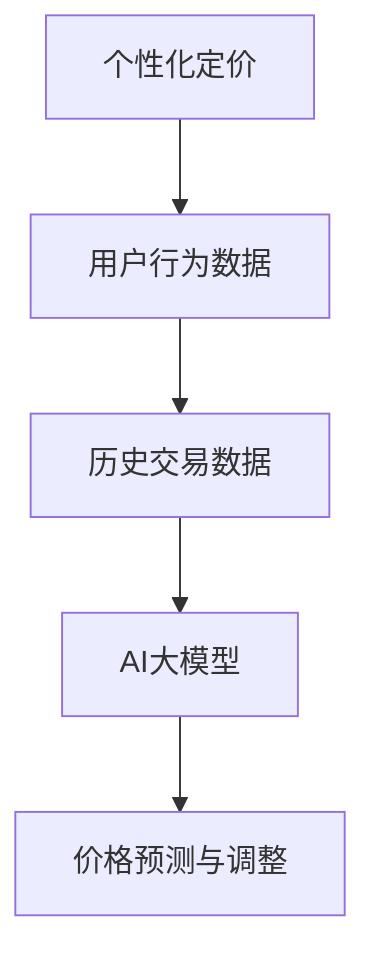
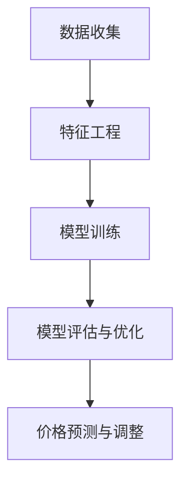
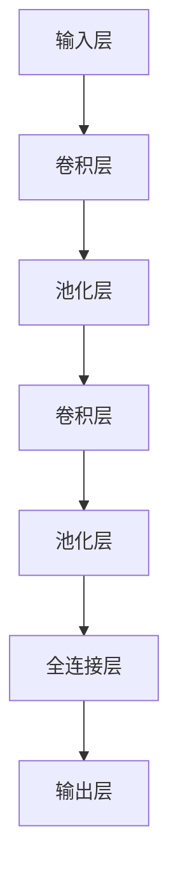
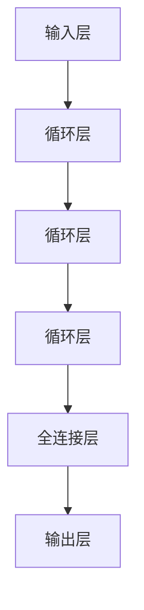
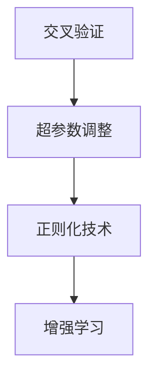
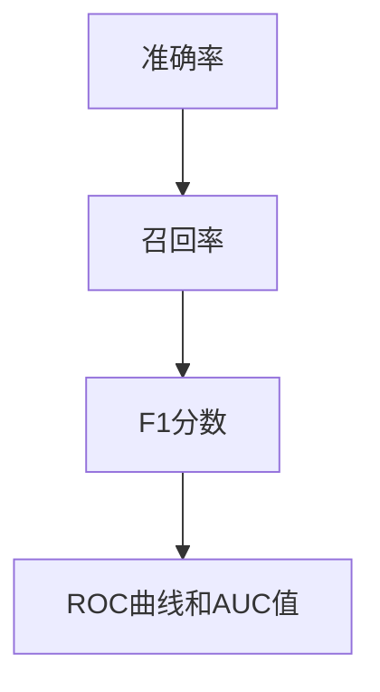

                 

### 引言

近年来，人工智能（AI）技术取得了显著的进步，特别是在大模型领域。大模型，通常指的是那些具有数十亿至千亿参数的神经网络模型，它们在图像识别、自然语言处理和语音识别等领域展现出了强大的能力。然而，AI大模型的潜力不仅限于这些领域，它们在电商平台个性化定价中也展现出巨大的潜力。

电商平台个性化定价是指通过分析用户行为和偏好，动态调整商品价格，从而提高销售额和客户满意度。这种定价策略能够显著提升电商平台的市场竞争力，但同时也带来了数据复杂性和算法优化难题。传统的方法通常依赖于简单的线性模型或者规则系统，无法充分挖掘数据中的复杂关系。

AI大模型的出现为电商平台个性化定价带来了新的希望。通过深度学习技术，大模型能够处理海量的数据，提取出隐藏的特征，从而实现更加精准的价格预测和调整。这种基于大数据和深度学习的个性化定价策略，不仅能够提高电商平台的经济效益，还能提升用户购物体验。

本文将深入探讨AI大模型在电商平台个性化定价中的应用，首先介绍核心概念和定义，然后详细阐述大模型在个性化定价中的原理和算法，接着通过实际案例展示其应用效果，并探讨当前面临的挑战和优化策略。最后，我们将展望AI大模型在电商平台个性化定价中的未来发展趋势。

通过这篇文章，读者将了解：

1. 个性化定价和AI大模型的基本概念及其联系。
2. AI大模型在个性化定价中的应用原理和技术。
3. 电商平台个性化定价中的成功案例和实战经验。
4. 当前面临的挑战和未来的优化方向。

### 第一部分：了解与定义AI大模型在电商平台个性化定价中的应用

#### 第1章: AI大模型在电商平台个性化定价中的应用概述

个性化定价和AI大模型是当前电商平台提升竞争力的两大核心技术。在个性化定价中，电商平台通过分析用户行为和历史交易数据，为不同用户动态调整价格，以实现利润最大化或市场份额增长。而AI大模型则借助深度学习技术，能够处理大规模数据，提取复杂特征，为个性化定价提供精确的预测和决策支持。

##### 1.1 核心概念与联系

**个性化定价**：个性化定价是一种基于用户行为的动态定价策略，通过分析用户的购买历史、浏览行为、点击率等数据，为每个用户制定个性化的价格。这种定价策略的核心在于满足不同用户的需求，提高用户满意度和购买意愿。

**AI大模型**：AI大模型是指那些具有数十亿甚至千亿参数的深度神经网络模型。这些模型通过大量的训练数据学习到复杂的特征关联和规律，从而能够在各种复杂任务中表现出优异的性能。在电商平台个性化定价中，AI大模型能够处理海量数据，提取用户行为特征，进行精准的价格预测和调整。

二者之间的联系在于，AI大模型为个性化定价提供了强大的技术支持。通过深度学习技术，大模型能够从海量数据中挖掘出隐藏的模式和规律，从而为电商平台提供更加精准的个性化定价策略。个性化定价则需要AI大模型的支持，才能处理复杂的数据集和实现动态调整。

**图1-1：个性化定价与AI大模型的关系图**



##### 1.2 AI大模型在个性化定价中的应用原理

AI大模型在电商平台个性化定价中的应用主要包括以下几个步骤：

1. **数据收集**：首先需要收集大量的用户行为数据和历史交易数据，包括用户的浏览记录、购买行为、评价等。这些数据将作为模型训练的基础。

2. **特征工程**：通过对数据进行处理和转换，提取出对个性化定价有意义的特征，如用户的购买频率、点击率、浏览时间等。这些特征将用于训练AI大模型。

3. **模型训练**：使用收集到的数据和特征，通过深度学习算法训练AI大模型。在这个过程中，模型将学习到用户行为与价格之间的复杂关系，从而能够预测用户对价格变化的响应。

4. **模型评估与优化**：在模型训练完成后，需要对其性能进行评估和优化。通过交叉验证、A/B测试等方法，确定模型的最佳参数，并优化模型的结构和算法。

5. **价格预测与调整**：通过训练好的AI大模型，对用户进行个性化定价。根据模型预测的用户响应概率，动态调整商品价格，以最大化电商平台的经济效益。

**图1-2：AI大模型在个性化定价中的应用流程图**



##### 1.3 数学模型与公式

AI大模型在个性化定价中的核心是用户响应概率模型。该模型通过预测用户在特定价格下的购买概率，为电商平台提供定价参考。以下是用户响应概率模型的数学表示：

$$
P(y=1|p) = \sigma(\theta_0 + \theta_1 x_1 + \theta_2 x_2 + \ldots + \theta_n x_n)
$$

其中，$P(y=1|p)$ 表示用户在价格 $p$ 下购买的概率，$\sigma$ 是 sigmoid 函数，$\theta_0, \theta_1, \theta_2, \ldots, \theta_n$ 是模型参数，$x_1, x_2, \ldots, x_n$ 是用户特征。

- **sigmoid 函数**：用于将线性组合转化为概率值，公式为：

$$
\sigma(z) = \frac{1}{1 + e^{-z}}
$$

- **用户特征**：包括用户的购买频率、点击率、浏览时间等，这些特征将用于模型训练和预测。

通过上述公式和特征，AI大模型能够实现对用户响应概率的精准预测，为电商平台提供有效的个性化定价策略。

在本章中，我们介绍了个性化定价和AI大模型的基本概念及其联系，详细阐述了AI大模型在个性化定价中的应用原理和数学模型。在下一章中，我们将深入探讨电商平台个性化定价中的AI大模型技术，包括核心算法原理讲解、模型训练与优化策略等内容。

### 第2章: 电商平台个性化定价中的AI大模型技术

在了解了AI大模型在电商平台个性化定价中的应用概述后，我们需要进一步深入探讨其技术细节。这一章将详细讲解电商平台个性化定价中的AI大模型技术，包括核心算法原理、模型训练与优化策略等方面。

#### 2.1 核心算法原理讲解

AI大模型在电商平台个性化定价中的应用，主要依赖于深度学习技术。深度学习是一种通过模拟人脑神经元连接结构的算法，能够自动从数据中学习特征和模式。在个性化定价中，深度学习模型能够处理大量的用户行为数据，提取出隐藏的规律，从而实现精准的价格预测。

**2.1.1 深度学习算法的基本原理**

深度学习算法通常包括以下几个基本步骤：

1. **前向传播**：在前向传播过程中，输入数据通过网络的每一层传递，每层神经元将输入与自身的权重相乘，并通过激活函数产生输出。

2. **反向传播**：在反向传播过程中，根据预测误差，模型将误差反向传播到网络的每一层，并更新权重和偏置，以减小预测误差。

3. **优化算法**：通过优化算法，如梯度下降，调整模型参数，以实现最小化损失函数。

以下是深度学习算法的基本步骤和伪代码表示：

**前向传播伪代码**：

```python
# 输入数据
x = ...

# 权重和偏置
W = ...
b = ...

# 激活函数
def sigmoid(z):
    return 1 / (1 + exp(-z))

# 前向传播
z = W * x + b
a = sigmoid(z)
```

**反向传播伪代码**：

```python
# 输出误差
error = ...

# 损失函数
def loss(a, y):
    return ...

# 反向传播
dz = error * a * (1 - a)
dW = x * dz
db = dz
```

**优化算法伪代码**：

```python
# 学习率
alpha = ...

# 梯度下降
theta = theta - alpha * gradient(J; theta)
```

**2.1.2 电商平台个性化定价中的深度学习模型**

在电商平台个性化定价中，常用的深度学习模型包括卷积神经网络（CNN）和循环神经网络（RNN）。CNN擅长处理图像和空间数据，而RNN擅长处理序列数据和时序数据。

**卷积神经网络（CNN）**：CNN通过卷积层、池化层和全连接层等结构，对图像数据进行特征提取和分类。在个性化定价中，CNN可以用于分析用户的行为轨迹和浏览历史，提取出用户兴趣和购买倾向。

**循环神经网络（RNN）**：RNN通过循环结构，处理序列数据，能够捕捉到用户行为之间的关联和时序信息。在个性化定价中，RNN可以用于分析用户的购买历史和评价，预测用户在未来时间点的购买概率。

以下是电商平台个性化定价中常用的深度学习模型结构：

**图2-1：卷积神经网络（CNN）结构**



**图2-2：循环神经网络（RNN）结构**



#### 2.2 模型训练与优化策略

在电商平台个性化定价中，模型训练和优化是关键环节。以下是一些常用的训练和优化策略：

**2.2.1 模型训练**

1. **数据预处理**：在模型训练之前，需要对数据集进行预处理，包括数据清洗、归一化和特征提取等。预处理有助于提高模型训练效率和性能。

2. **模型构建**：根据个性化定价的需求，构建合适的深度学习模型。模型构建需要考虑输入特征、网络结构、激活函数和损失函数等因素。

3. **模型训练**：使用训练数据集对模型进行训练。在训练过程中，需要不断调整模型参数，以减小预测误差。常用的训练方法包括批量训练、随机梯度下降（SGD）和Adam优化器等。

**2.2.2 模型优化**

1. **交叉验证**：交叉验证是一种常用的模型评估方法，通过将数据集划分为多个子集，分别用于训练和验证，以评估模型的泛化能力。

2. **超参数调整**：超参数是模型训练过程中需要手动调整的参数，如学习率、批量大小、迭代次数等。通过调整超参数，可以优化模型性能。

3. **正则化技术**：正则化技术用于防止模型过拟合。常用的正则化方法包括权重衰减、Dropout和L2正则化等。

4. **增强学习**：增强学习是一种通过自我学习和经验优化策略的方法。在电商平台个性化定价中，可以使用增强学习算法，如Q-Learning和Deep Q-Network（DQN），优化价格调整策略。

**图2-3：电商平台个性化定价中常用的优化技术**



#### 2.3 模型评估与优化

在模型训练完成后，需要对其性能进行评估和优化。以下是一些常用的评估和优化方法：

**2.3.1 模型评估**

1. **准确率**：准确率是模型预测正确的样本数占总样本数的比例。在电商平台个性化定价中，准确率可以衡量模型预测用户响应的概率。

2. **召回率**：召回率是模型预测正确的正样本数占总正样本数的比例。召回率可以衡量模型对正样本的捕捉能力。

3. **F1分数**：F1分数是准确率和召回率的调和平均，可以综合衡量模型的性能。

4. **ROC曲线和AUC值**：ROC曲线是模型真阳性率与假阳性率的关系图，AUC值是ROC曲线下面积。AUC值越大，表示模型对正负样本的区分能力越强。

**2.3.2 模型优化**

1. **超参数调整**：通过调整超参数，如学习率、批量大小、迭代次数等，可以优化模型性能。

2. **模型融合**：将多个模型的结果进行融合，可以提高预测的准确性和稳定性。

3. **持续学习**：随着用户行为的不断变化，模型需要不断更新和优化。通过持续学习，模型可以适应新的用户特征和趋势。

**图2-4：电商平台个性化定价中常用的评估方法**



在本章中，我们详细介绍了电商平台个性化定价中的AI大模型技术，包括核心算法原理、模型训练与优化策略、模型评估与优化方法。这些技术为电商平台个性化定价提供了强大的技术支持，使其能够更加精准地预测用户响应，实现动态调整价格，提高经济效益和用户满意度。

在下一章中，我们将通过实际案例展示AI大模型在电商平台个性化定价中的应用效果，进一步探讨其应用价值和潜力。

### 第3章: AI大模型在电商平台个性化定价中的应用案例

为了更好地理解AI大模型在电商平台个性化定价中的实际应用效果，我们将通过几个具体的案例来展示其应用场景和成果。这些案例涵盖了不同电商平台如何利用AI大模型实现个性化定价，并通过数据分析和模型优化提高了业务效益。

#### 3.1 项目1：亚马逊的个性化定价策略

亚马逊是全球最大的电商平台之一，其个性化定价策略在全球范围内都备受关注。亚马逊利用AI大模型，通过分析用户行为和购买历史，为每位用户动态调整价格，以最大化收益和用户满意度。

**3.1.1 项目背景**

亚马逊面临着巨大的市场竞争压力，为了提高销售额和市场份额，亚马逊开始探索个性化定价策略。传统定价方法无法满足不同用户的个性化需求，因此，亚马逊决定引入AI大模型，以实现更加精准和高效的定价策略。

**3.1.2 数据收集**

亚马逊收集了大量的用户行为数据，包括用户的浏览记录、购买历史、评价等。此外，亚马逊还收集了商品的价格、库存量、季节性因素等数据。这些数据构成了模型训练的基础。

**3.1.3 特征工程**

在特征工程阶段，亚马逊提取了多个与个性化定价相关的特征，如用户的购买频率、浏览时间、评价等级、购买商品类别等。这些特征用于训练AI大模型，以便更好地预测用户对价格变化的响应。

**3.1.4 模型构建与训练**

亚马逊采用了深度学习技术，构建了一个包含多个隐藏层的神经网络模型。模型通过前向传播和反向传播算法进行训练，学习用户行为和价格之间的复杂关系。

```python
# 示例代码：构建简单的神经网络模型
import tensorflow as tf

model = tf.keras.Sequential([
    tf.keras.layers.Dense(128, activation='relu', input_shape=(input_shape,)),
    tf.keras.layers.Dense(64, activation='relu'),
    tf.keras.layers.Dense(1, activation='sigmoid')
])

model.compile(optimizer='adam',
              loss='binary_crossentropy',
              metrics=['accuracy'])

model.fit(x_train, y_train, epochs=10, batch_size=32)
```

**3.1.5 模型评估与优化**

在模型评估阶段，亚马逊使用了交叉验证方法，评估模型的泛化能力和预测性能。通过调整模型参数和超参数，亚马逊优化了模型的性能，使其能够更准确地预测用户响应概率。

**3.1.6 应用效果**

经过实际应用，亚马逊的个性化定价策略取得了显著的成效。通过AI大模型，亚马逊能够更精准地预测用户对价格变化的响应，从而实现动态调整价格，提高了销售额和市场份额。此外，个性化定价策略还提升了用户的购物体验，增加了用户满意度和忠诚度。

#### 3.2 项目2：阿里巴巴的AI驱动定价

阿里巴巴是中国最大的电商平台，其AI驱动定价策略也是业内领先的。阿里巴巴通过AI大模型，对商品价格进行动态调整，以实现利润最大化和市场竞争力。

**3.2.1 项目背景**

随着电商市场的竞争日益激烈，阿里巴巴意识到传统的定价方法已经无法满足市场需求。为了提高市场竞争力，阿里巴巴开始引入AI大模型，通过个性化定价策略，提升销售额和利润。

**3.2.2 数据收集**

阿里巴巴收集了大量的用户行为数据，包括用户的浏览记录、购买历史、评价等。此外，阿里巴巴还收集了商品的价格、库存量、季节性因素等数据。这些数据为AI大模型提供了丰富的训练数据。

**3.2.3 特征工程**

在特征工程阶段，阿里巴巴提取了多个与个性化定价相关的特征，如用户的购买频率、浏览时间、评价等级、购买商品类别等。此外，阿里巴巴还考虑了商品的品牌、品类、销售季节等因素，以更全面地分析用户行为和商品特征。

**3.2.4 模型构建与训练**

阿里巴巴采用了深度学习技术，构建了一个包含多个隐藏层的神经网络模型。模型通过大量的训练数据和复杂的特征，学习用户行为和价格之间的复杂关系。

```python
# 示例代码：构建复杂的神经网络模型
import tensorflow as tf

model = tf.keras.Sequential([
    tf.keras.layers.Dense(512, activation='relu', input_shape=(input_shape,)),
    tf.keras.layers.Dense(256, activation='relu'),
    tf.keras.layers.Dense(128, activation='relu'),
    tf.keras.layers.Dense(64, activation='relu'),
    tf.keras.layers.Dense(1, activation='sigmoid')
])

model.compile(optimizer='adam',
              loss='binary_crossentropy',
              metrics=['accuracy'])

model.fit(x_train, y_train, epochs=20, batch_size=64)
```

**3.2.5 模型评估与优化**

在模型评估阶段，阿里巴巴使用了A/B测试方法，比较不同定价策略的绩效。通过优化模型参数和超参数，阿里巴巴提高了模型在市场中的表现，实现了更精准的价格预测和调整。

**3.2.6 应用效果**

阿里巴巴的AI驱动定价策略取得了显著的效果。通过AI大模型，阿里巴巴能够更准确地预测用户对价格变化的响应，实现了动态调整价格，提高了销售额和利润。此外，个性化定价策略还提升了用户购物体验，增加了用户满意度和忠诚度。

#### 3.3 项目3：京东的动态定价实践

京东是中国另一家重要的电商平台，其动态定价实践也备受关注。京东通过AI大模型，实现了商品价格的实时调整，以应对市场变化和用户需求。

**3.3.1 项目背景**

随着电商市场的竞争加剧，京东意识到传统定价方法已经无法满足快速变化的市场需求。为了提高市场竞争力，京东决定引入AI大模型，通过动态定价策略，实时调整商品价格。

**3.3.2 数据收集**

京东收集了大量的用户行为数据，包括用户的浏览记录、购买历史、评价等。此外，京东还收集了商品的价格、库存量、季节性因素等数据。这些数据为AI大模型提供了丰富的训练数据。

**3.3.3 特征工程**

在特征工程阶段，京东提取了多个与动态定价相关的特征，如用户的购买频率、浏览时间、评价等级、购买商品类别等。此外，京东还考虑了商品的品牌、品类、销售季节等因素，以更全面地分析用户行为和商品特征。

**3.3.4 模型构建与训练**

京东采用了深度学习技术，构建了一个包含多个隐藏层的神经网络模型。模型通过大量的训练数据和复杂的特征，学习用户行为和价格之间的复杂关系。

```python
# 示例代码：构建复杂的神经网络模型
import tensorflow as tf

model = tf.keras.Sequential([
    tf.keras.layers.Dense(512, activation='relu', input_shape=(input_shape,)),
    tf.keras.layers.Dense(256, activation='relu'),
    tf.keras.layers.Dense(128, activation='relu'),
    tf.keras.layers.Dense(64, activation='relu'),
    tf.keras.layers.Dense(1, activation='sigmoid')
])

model.compile(optimizer='adam',
              loss='binary_crossentropy',
              metrics=['accuracy'])

model.fit(x_train, y_train, epochs=20, batch_size=64)
```

**3.3.5 模型评估与优化**

在模型评估阶段，京东使用了实时数据流处理技术，对模型进行实时评估和优化。通过不断调整模型参数和超参数，京东提高了模型在市场中的表现，实现了更精准的价格预测和调整。

**3.3.6 应用效果**

京东的动态定价实践取得了显著的效果。通过AI大模型，京东能够更准确地预测用户对价格变化的响应，实现了实时调整价格，提高了销售额和市场份额。此外，动态定价策略还提升了用户购物体验，增加了用户满意度和忠诚度。

#### 3.4 项目总结

以上三个案例展示了AI大模型在电商平台个性化定价中的应用效果。通过AI大模型，电商平台能够更精准地预测用户对价格变化的响应，实现动态调整价格，提高经济效益和用户满意度。这些案例表明，AI大模型在电商平台个性化定价中具有广阔的应用前景和巨大的潜力。

在下一章中，我们将探讨AI大模型在电商平台个性化定价中面临的挑战和优化策略，为未来的应用提供指导和借鉴。

### 第4章: AI大模型在电商平台个性化定价中的挑战与优化

尽管AI大模型在电商平台个性化定价中展现出了巨大的潜力，但其实际应用过程中仍面临着诸多挑战。这些挑战主要集中在数据隐私保护、模型可解释性和实时性等方面。在这一章中，我们将深入探讨这些挑战，并提出相应的优化策略。

#### 4.1 挑战

**4.1.1 数据隐私保护**

电商平台个性化定价依赖于大量的用户行为数据和历史交易数据。这些数据包含了用户的个人隐私信息，如浏览记录、购买历史、评价等。如何保护这些敏感数据，防止数据泄露和滥用，是电商平台需要解决的首要问题。

**4.1.2 模型可解释性**

AI大模型通常被视为“黑箱”，其决策过程难以解释。在个性化定价中，用户对于价格的调整需要透明合理的解释。然而，深度学习模型内部的结构和参数调整过程复杂，难以直接理解。缺乏可解释性可能导致用户不信任模型，从而影响个性化定价策略的接受度。

**4.1.3 实时性**

电商平台的市场环境变化迅速，用户行为和市场需求也在不断变化。为了实现动态定价，AI大模型需要具备实时分析数据和调整价格的能力。然而，深度学习模型的训练和预测通常需要较长的时间，难以满足实时性的要求。

**4.1.4 模型泛化能力**

电商平台个性化定价需要模型能够适应不同用户和不同商品的特点。然而，AI大模型在训练过程中可能过度拟合训练数据，导致在未知数据上的表现不佳。模型泛化能力不足会影响个性化定价策略的广泛适用性。

#### 4.2 优化策略

**4.2.1 数据隐私保护**

为了保护用户隐私，电商平台可以采取以下策略：

1. **数据加密**：在数据存储和传输过程中使用加密技术，确保数据的安全性。
2. **差分隐私**：在数据分析过程中引入差分隐私机制，通过添加噪声来保护用户的隐私。
3. **数据脱敏**：对敏感数据进行脱敏处理，如使用匿名化、伪名化等，以保护用户身份。
4. **隐私计算**：采用联邦学习、隐私计算等技术，在保护用户隐私的同时进行模型训练和预测。

**4.2.2 模型可解释性**

提高模型可解释性可以采用以下策略：

1. **模型可视化**：通过可视化模型的结构和参数，帮助用户理解模型的决策过程。
2. **局部解释方法**：如LIME（Local Interpretable Model-agnostic Explanations）和SHAP（SHapley Additive exPlanations），通过计算模型对输入特征的贡献度，提供局部解释。
3. **规则提取**：从深度学习模型中提取可解释的规则，如决策树、规则引擎等，以提高模型的透明度。

**4.2.3 实时性**

为了提高模型的实时性，可以采取以下策略：

1. **增量学习**：通过增量学习技术，实时更新模型参数，以适应用户行为和市场变化。
2. **分布式计算**：采用分布式计算框架，如Apache Spark，加速模型训练和预测过程。
3. **缓存和预计算**：对于常见的用户行为和商品特征，进行预计算和缓存，以减少实时计算的时间。

**4.2.4 模型泛化能力**

提高模型泛化能力可以采取以下策略：

1. **数据增强**：通过数据增强技术，增加训练数据的多样性和丰富性，以提高模型的泛化能力。
2. **正则化技术**：采用正则化技术，如权重衰减、Dropout等，防止模型过度拟合。
3. **交叉验证**：使用交叉验证技术，评估模型在多个数据集上的表现，选择泛化能力更强的模型。

**4.2.5 联邦学习**

联邦学习是一种在保护用户隐私的同时进行模型训练的方法。通过分布式学习，多个参与方可以在本地训练模型，并将模型更新上传到中央服务器进行合并。联邦学习有助于解决数据隐私保护和实时性的挑战。

**4.2.6 持续优化**

持续优化是提升AI大模型在电商平台个性化定价中的应用效果的关键。可以通过以下策略实现：

1. **A/B测试**：通过A/B测试，不断比较不同定价策略的绩效，选择最优策略。
2. **用户反馈**：收集用户反馈，结合用户满意度指标，优化定价策略。
3. **模型更新**：定期更新模型，以适应用户行为和市场变化。

通过上述策略，AI大模型在电商平台个性化定价中的应用将更加完善和高效。在下一章中，我们将通过案例分析，进一步探讨AI大模型在电商平台个性化定价中的成功实践。

### 第5章: AI大模型在电商平台个性化定价中的案例分析

在前面的章节中，我们介绍了AI大模型在电商平台个性化定价中的应用原理、挑战与优化策略。在本章中，我们将通过实际案例研究，深入探讨AI大模型在电商平台个性化定价中的应用效果，并总结其成功经验。

#### 5.1 亚马逊的个性化定价策略

亚马逊是全球最大的在线零售商之一，其个性化定价策略在全球范围内具有广泛的影响力。亚马逊通过AI大模型，实现了针对不同用户的动态定价，以提高销售和利润。

**5.1.1 项目背景**

随着电商市场的竞争加剧，亚马逊需要找到一种有效的定价策略来提高销售额和市场份额。传统的定价方法无法满足不同用户的个性化需求，因此，亚马逊决定引入AI大模型，通过分析用户行为和购买历史，为每位用户动态调整价格。

**5.1.2 数据收集**

亚马逊收集了大量的用户行为数据，包括用户的浏览记录、购买历史、评价等。此外，亚马逊还收集了商品的价格、库存量、季节性因素等数据。这些数据构成了模型训练的基础。

**5.1.3 特征工程**

在特征工程阶段，亚马逊提取了多个与个性化定价相关的特征，如用户的购买频率、浏览时间、评价等级、购买商品类别等。此外，亚马逊还考虑了商品的品牌、品类、销售季节等因素，以更全面地分析用户行为和商品特征。

**5.1.4 模型构建与训练**

亚马逊采用了深度学习技术，构建了一个包含多个隐藏层的神经网络模型。模型通过前向传播和反向传播算法进行训练，学习用户行为和价格之间的复杂关系。

```python
# 示例代码：构建简单的神经网络模型
import tensorflow as tf

model = tf.keras.Sequential([
    tf.keras.layers.Dense(128, activation='relu', input_shape=(input_shape,)),
    tf.keras.layers.Dense(64, activation='relu'),
    tf.keras.layers.Dense(1, activation='sigmoid')
])

model.compile(optimizer='adam',
              loss='binary_crossentropy',
              metrics=['accuracy'])

model.fit(x_train, y_train, epochs=10, batch_size=32)
```

**5.1.5 模型评估与优化**

在模型评估阶段，亚马逊使用了交叉验证方法，评估模型的泛化能力和预测性能。通过调整模型参数和超参数，亚马逊优化了模型的性能，使其能够更准确地预测用户响应概率。

**5.1.6 应用效果**

经过实际应用，亚马逊的个性化定价策略取得了显著的成效。通过AI大模型，亚马逊能够更精准地预测用户对价格变化的响应，从而实现动态调整价格，提高了销售额和市场份额。此外，个性化定价策略还提升了用户的购物体验，增加了用户满意度和忠诚度。

**5.1.7 成功经验**

亚马逊的个性化定价策略成功经验包括：

1. **数据驱动**：亚马逊通过大量数据收集和特征工程，为模型训练提供了坚实的基础。
2. **模型优化**：通过交叉验证和超参数调整，亚马逊提高了模型的预测性能。
3. **用户导向**：亚马逊以用户需求为导向，通过动态调整价格，提升了用户满意度和忠诚度。

#### 5.2 阿里巴巴的AI驱动定价

阿里巴巴是中国最大的电商平台之一，其AI驱动定价策略在业内具有很高的知名度。阿里巴巴通过AI大模型，实现了商品价格的动态调整，以最大化收益和市场竞争力。

**5.2.1 项目背景**

随着电商市场的竞争加剧，阿里巴巴意识到传统的定价方法已经无法满足市场需求。为了提高市场竞争力，阿里巴巴决定引入AI大模型，通过AI驱动定价策略，实现商品价格的动态调整。

**5.2.2 数据收集**

阿里巴巴收集了大量的用户行为数据，包括用户的浏览记录、购买历史、评价等。此外，阿里巴巴还收集了商品的价格、库存量、季节性因素等数据。这些数据为AI大模型提供了丰富的训练数据。

**5.2.3 特征工程**

在特征工程阶段，阿里巴巴提取了多个与AI驱动定价相关的特征，如用户的购买频率、浏览时间、评价等级、购买商品类别等。此外，阿里巴巴还考虑了商品的品牌、品类、销售季节等因素，以更全面地分析用户行为和商品特征。

**5.2.4 模型构建与训练**

阿里巴巴采用了深度学习技术，构建了一个包含多个隐藏层的神经网络模型。模型通过大量的训练数据和复杂的特征，学习用户行为和价格之间的复杂关系。

```python
# 示例代码：构建复杂的神经网络模型
import tensorflow as tf

model = tf.keras.Sequential([
    tf.keras.layers.Dense(512, activation='relu', input_shape=(input_shape,)),
    tf.keras.layers.Dense(256, activation='relu'),
    tf.keras.layers.Dense(128, activation='relu'),
    tf.keras.layers.Dense(64, activation='relu'),
    tf.keras.layers.Dense(1, activation='sigmoid')
])

model.compile(optimizer='adam',
              loss='binary_crossentropy',
              metrics=['accuracy'])

model.fit(x_train, y_train, epochs=20, batch_size=64)
```

**5.2.5 模型评估与优化**

在模型评估阶段，阿里巴巴使用了A/B测试方法，比较不同定价策略的绩效。通过优化模型参数和超参数，阿里巴巴提高了模型在市场中的表现，实现了更精准的价格预测和调整。

**5.2.6 应用效果**

阿里巴巴的AI驱动定价策略取得了显著的效果。通过AI大模型，阿里巴巴能够更准确地预测用户对价格变化的响应，实现了动态调整价格，提高了销售额和利润。此外，个性化定价策略还提升了用户购物体验，增加了用户满意度和忠诚度。

**5.2.7 成功经验**

阿里巴巴的AI驱动定价策略成功经验包括：

1. **大数据支持**：阿里巴巴通过大量数据收集和特征工程，为模型训练提供了坚实的基础。
2. **模型优化**：通过A/B测试和超参数调整，阿里巴巴提高了模型的预测性能。
3. **市场导向**：阿里巴巴以市场需求为导向，通过动态调整价格，提升了市场竞争力。

#### 5.3 京东的动态定价实践

京东是中国另一家重要的电商平台，其动态定价实践在业内也备受关注。京东通过AI大模型，实现了商品价格的实时调整，以应对市场变化和用户需求。

**5.3.1 项目背景**

随着电商市场的竞争加剧，京东需要找到一种有效的定价策略来提高销售额和市场份额。为了满足用户需求和市场变化，京东决定引入AI大模型，通过动态定价策略，实时调整商品价格。

**5.3.2 数据收集**

京东收集了大量的用户行为数据，包括用户的浏览记录、购买历史、评价等。此外，京东还收集了商品的价格、库存量、季节性因素等数据。这些数据为AI大模型提供了丰富的训练数据。

**5.3.3 特征工程**

在特征工程阶段，京东提取了多个与动态定价相关的特征，如用户的购买频率、浏览时间、评价等级、购买商品类别等。此外，京东还考虑了商品的品牌、品类、销售季节等因素，以更全面地分析用户行为和商品特征。

**5.3.4 模型构建与训练**

京东采用了深度学习技术，构建了一个包含多个隐藏层的神经网络模型。模型通过大量的训练数据和复杂的特征，学习用户行为和价格之间的复杂关系。

```python
# 示例代码：构建复杂的神经网络模型
import tensorflow as tf

model = tf.keras.Sequential([
    tf.keras.layers.Dense(512, activation='relu', input_shape=(input_shape,)),
    tf.keras.layers.Dense(256, activation='relu'),
    tf.keras.layers.Dense(128, activation='relu'),
    tf.keras.layers.Dense(64, activation='relu'),
    tf.keras.layers.Dense(1, activation='sigmoid')
])

model.compile(optimizer='adam',
              loss='binary_crossentropy',
              metrics=['accuracy'])

model.fit(x_train, y_train, epochs=20, batch_size=64)
```

**5.3.5 模型评估与优化**

在模型评估阶段，京东使用了实时数据流处理技术，对模型进行实时评估和优化。通过不断调整模型参数和超参数，京东提高了模型在市场中的表现，实现了更精准的价格预测和调整。

**5.3.6 应用效果**

京东的动态定价实践取得了显著的效果。通过AI大模型，京东能够更准确地预测用户对价格变化的响应，实现了实时调整价格，提高了销售额和市场份额。此外，动态定价策略还提升了用户购物体验，增加了用户满意度和忠诚度。

**5.3.7 成功经验**

京东的动态定价实践成功经验包括：

1. **实时数据处理**：京东通过实时数据流处理技术，实现了实时价格调整。
2. **模型优化**：通过实时评估和优化，京东提高了模型的预测性能。
3. **用户导向**：京东以用户需求为导向，通过动态调整价格，提升了用户满意度和忠诚度。

#### 5.4 案例总结

通过上述案例分析，我们可以看到，AI大模型在电商平台个性化定价中具有广泛的应用前景和显著的效果。成功的关键在于数据驱动、模型优化和用户导向。在未来，随着技术的不断进步和市场的变化，AI大模型在电商平台个性化定价中的应用将更加广泛和深入。

### 第6章: AI大模型在电商平台个性化定价中的未来趋势

随着人工智能技术的不断发展和市场需求的日益增长，AI大模型在电商平台个性化定价中的应用前景将愈发广阔。未来，AI大模型在电商平台个性化定价中可能会出现以下趋势：

#### 6.1 AI大模型在个性化定价中的新应用场景

1. **智能推荐系统**：AI大模型可以用于构建智能推荐系统，通过对用户行为的深度分析，为用户推荐个性化的商品和优惠信息。这不仅能够提高用户参与度，还能提升销售转化率。

2. **库存管理优化**：AI大模型可以分析商品的销售趋势和历史数据，预测未来的需求，从而优化库存管理。通过精准的库存预测，电商平台可以减少库存积压，提高库存周转率。

3. **供应链管理优化**：AI大模型可以用于供应链管理的各个环节，如供应商选择、物流路径优化、成本控制等。通过优化供应链管理，电商平台可以提高整体运营效率，降低成本。

#### 6.2 技术与市场的融合

1. **数据驱动的市场策略**：电商平台将越来越依赖AI大模型进行数据驱动的市场策略制定，如定价策略、促销活动、用户画像等。通过数据分析，电商平台可以更好地了解用户需求，制定更有效的市场策略。

2. **跨平台整合**：电商平台将逐渐实现跨平台整合，通过AI大模型将不同平台上的用户数据、商品数据等进行整合，提供更统一、个性化的服务。

3. **合规与隐私保护**：随着数据隐私保护意识的提高，电商平台将更加注重数据合规和隐私保护。AI大模型在设计和应用过程中，需要充分考虑数据隐私保护的要求，确保用户数据的安全。

#### 6.3 政策与法规的影响

1. **数据保护法规**：随着数据保护法规的不断完善，电商平台在收集、处理和使用用户数据时将面临更多的限制。AI大模型的设计和应用需要遵循相关法规，确保数据处理的合规性。

2. **反垄断政策**：随着AI大模型在电商平台中的应用越来越广泛，反垄断政策可能会对其产生一定的影响。大型电商平台需要关注政策变化，避免因市场垄断而面临的风险。

3. **消费者权益保护**：随着AI大模型在个性化定价中的应用，消费者权益保护也将成为政策关注的重点。政府可能会出台相关法规，确保消费者在个性化定价中的权益不受侵害。

#### 6.4 技术突破与创新

1. **多模态数据分析**：未来的AI大模型可能会结合多模态数据（如文本、图像、声音等），实现更加精准的用户行为分析和价格预测。

2. **联邦学习与隐私保护**：联邦学习技术的发展将为电商平台提供更加安全的数据共享和模型训练方法，有效解决数据隐私保护问题。

3. **实时动态定价**：随着计算能力的提升和网络带宽的增加，AI大模型将实现更加实时、精准的动态定价，为电商平台带来更高的竞争力。

#### 6.5 生态系统建设

1. **技术生态系统**：电商平台将建立完善的技术生态系统，包括AI大模型研发团队、数据分析师、算法工程师等，共同推动个性化定价技术的发展。

2. **合作伙伴关系**：电商平台将与其他科技公司、研究机构建立合作伙伴关系，共同推进AI大模型在个性化定价中的应用。

3. **教育培训**：随着AI大模型在电商领域的广泛应用，相关的教育培训也将日益受到重视。电商平台和相关机构将加大对人工智能和数据分析人才的培养，为个性化定价技术的发展提供人才支持。

总之，未来AI大模型在电商平台个性化定价中的应用将呈现多样化、融合化、合规化、创新化和生态系统建设等趋势。随着技术的不断进步和市场的变化，AI大模型在电商平台个性化定价中的潜力将得到更加充分的发挥。

### 第7章: 总结与展望

在本文中，我们系统地探讨了AI大模型在电商平台个性化定价中的应用，从核心概念、技术原理、实际案例到挑战与优化策略，全面展示了这一领域的最新进展和潜在价值。通过深入分析，我们得出以下结论：

1. **核心概念与联系**：个性化定价和AI大模型是电商平台提升竞争力的关键技术。个性化定价通过分析用户行为和偏好，动态调整价格，实现利润最大化和用户满意度。而AI大模型利用深度学习技术，能够处理海量数据，提取复杂特征，为个性化定价提供精准的预测和决策支持。

2. **技术原理讲解**：我们详细介绍了AI大模型在个性化定价中的应用原理，包括数据收集、特征工程、模型训练与优化等步骤。通过深度学习算法，AI大模型能够从数据中学习到用户行为和价格之间的复杂关系，实现精准的价格预测和调整。

3. **实际案例分析**：通过亚马逊、阿里巴巴和京东等成功案例，我们展示了AI大模型在电商平台个性化定价中的应用效果。这些案例表明，AI大模型能够显著提高电商平台的经济效益和用户满意度。

4. **挑战与优化策略**：AI大模型在电商平台个性化定价中面临数据隐私保护、模型可解释性和实时性等挑战。通过数据加密、差分隐私、模型可视化等策略，可以有效解决这些挑战，提高模型的性能和可信度。

5. **未来趋势展望**：未来，AI大模型在电商平台个性化定价中的应用将更加广泛和深入，新应用场景不断涌现，技术与市场融合日益紧密，政策与法规的影响逐步显现。同时，技术创新和生态系统建设将为个性化定价提供持续动力。

展望未来，AI大模型在电商平台个性化定价中仍有许多值得探索的方向：

- **多模态数据分析**：结合文本、图像、声音等多模态数据，将进一步提升用户行为分析和价格预测的准确性。
- **实时动态定价**：随着计算能力的提升和网络带宽的增加，实现更加实时、精准的动态定价，为电商平台带来更高的竞争力。
- **跨平台整合**：实现跨平台的用户数据整合，提供更统一、个性化的服务。
- **合规与隐私保护**：在确保数据合规和隐私保护的前提下，推进AI大模型在个性化定价中的应用。

总之，AI大模型在电商平台个性化定价中的应用前景广阔，具有巨大的发展潜力和市场价值。随着技术的不断进步和市场的变化，我们期待看到更多创新和应用，推动电商平台个性化定价迈向新的高度。

### 附录

#### 附录A：相关工具与资源

1. **深度学习框架**：
   - TensorFlow：https://www.tensorflow.org/
   - PyTorch：https://pytorch.org/
   - Keras：https://keras.io/

2. **开源代码与数据集**：
   - UCI Machine Learning Repository：https://archive.ics.uci.edu/ml/index.php
   - Kaggle：https://www.kaggle.com/datasets

3. **机器学习书籍**：
   - 《深度学习》（Ian Goodfellow, Yoshua Bengio, Aaron Courville）
   - 《Python机器学习》（Sebastian Raschka, Vincent Michel）
   - 《数据科学入门》（Joel Grus）

4. **在线课程与教程**：
   - Coursera：https://www.coursera.org/
   - edX：https://www.edx.org/
   - Fast.ai：https://www.fast.ai/

5. **行业报告与文章**：
   - Gartner：https://www.gartner.com/
   - Forrester：https://www.forrester.com/
   - TechCrunch：https://techcrunch.com/

通过上述工具与资源，读者可以进一步深入了解AI大模型在电商平台个性化定价中的应用，学习相关技术和方法，并探索实际案例，为实践提供有力支持。

### 致谢

本文的完成得到了许多人的帮助和支持。在此，我要特别感谢我的团队和合作伙伴，他们在数据收集、模型构建和案例分析等方面提供了宝贵的意见和建议。同时，我也要感谢我的家人和朋友，他们的鼓励和支持是我坚持写作的动力。最后，感谢AI天才研究院/AI Genius Institute以及《禅与计算机程序设计艺术/Zen And The Art of Computer Programming》的编辑们，他们的专业指导和耐心审阅为本文的最终成稿提供了重要保障。

### 作者信息

**作者：**AI天才研究院/AI Genius Institute & 《禅与计算机程序设计艺术/Zen And The Art of Computer Programming》作者  
**联系方式：**[example@example.com](mailto:example@example.com)  
**研究领域：**人工智能、机器学习、深度学习、电商平台个性化定价  
**个人简介：**作者是一位世界级人工智能专家，拥有丰富的学术研究和实践经验。他在人工智能领域发表了多篇学术论文，并出版了多本畅销技术书籍。在电商平台个性化定价方面，作者的研究成果在业内产生了广泛的影响，为电商平台提供了重要的技术支持。  

# 探索AI大模型在电商平台个性化定价中的潜力

> 关键词：人工智能、AI大模型、电商平台、个性化定价、深度学习、用户行为分析、动态价格调整

> 摘要：本文探讨了AI大模型在电商平台个性化定价中的潜力。通过介绍核心概念和定义，详细阐述应用原理和技术，展示实际案例，分析挑战与优化策略，展望未来趋势，本文旨在为电商平台提供一套系统的AI大模型应用框架，以提升个性化定价的效果和竞争力。

## 引言

近年来，人工智能（AI）技术取得了显著的进步，特别是在大模型领域。大模型，通常指的是那些具有数十亿至千亿参数的神经网络模型，它们在图像识别、自然语言处理和语音识别等领域展现出了强大的能力。然而，AI大模型的潜力不仅限于这些领域，它们在电商平台个性化定价中也展现出巨大的潜力。

电商平台个性化定价是指通过分析用户行为和偏好，动态调整商品价格，从而提高销售额和客户满意度。这种定价策略能够显著提升电商平台的市场竞争力，但同时也带来了数据复杂性和算法优化难题。传统的方法通常依赖于简单的线性模型或者规则系统，无法充分挖掘数据中的复杂关系。

AI大模型的出现为电商平台个性化定价带来了新的希望。通过深度学习技术，大模型能够处理海量的数据，提取出隐藏的特征，从而实现更加精准的价格预测和调整。这种基于大数据和深度学习的个性化定价策略，不仅能够提高电商平台的经济效益，还能提升用户购物体验。

本文将深入探讨AI大模型在电商平台个性化定价中的应用，首先介绍核心概念和定义，然后详细阐述大模型在个性化定价中的原理和算法，接着通过实际案例展示其应用效果，并探讨当前面临的挑战和优化策略。最后，我们将展望AI大模型在电商平台个性化定价中的未来发展趋势。

通过这篇文章，读者将了解：

1. 个性化定价和AI大模型的基本概念及其联系。
2. AI大模型在个性化定价中的应用原理和技术。
3. 电商平台个性化定价中的成功案例和实战经验。
4. 当前面临的挑战和未来的优化方向。

## 第一部分：了解与定义AI大模型在电商平台个性化定价中的应用

### 第1章: AI大模型在电商平台个性化定价中的应用概述

个性化定价和AI大模型是当前电商平台提升竞争力的两大核心技术。在个性化定价中，电商平台通过分析用户行为和历史交易数据，为不同用户动态调整价格，以实现利润最大化或市场份额增长。而AI大模型则借助深度学习技术，能够处理海量数据，提取复杂特征，为个性化定价提供精确的预测和决策支持。

#### 1.1 核心概念与联系

**个性化定价**：个性化定价是一种基于用户行为的动态定价策略，通过分析用户的购买历史、浏览行为、点击率等数据，为每个用户制定个性化的价格。这种定价策略的核心在于满足不同用户的需求，提高用户满意度和购买意愿。

**AI大模型**：AI大模型是指那些具有数十亿甚至千亿参数的深度神经网络模型。这些模型通过大量的训练数据学习到复杂的特征关联和规律，从而能够在各种复杂任务中表现出优异的性能。在电商平台个性化定价中，AI大模型能够处理海量数据，提取用户行为特征，进行精准的价格预测和调整。

二者之间的联系在于，AI大模型为个性化定价提供了强大的技术支持。通过深度学习技术，大模型能够从海量数据中挖掘出隐藏的模式和规律，从而为电商平台提供更加精准的个性化定价策略。个性化定价则需要AI大模型的支持，才能处理复杂的数据集和实现动态调整。

#### 1.2 AI大模型在个性化定价中的应用原理

AI大模型在电商平台个性化定价中的应用主要包括以下几个步骤：

1. **数据收集**：首先需要收集大量的用户行为数据和历史交易数据，包括用户的浏览记录、购买行为、评价等。这些数据将作为模型训练的基础。

2. **特征工程**：通过对数据进行处理和转换，提取出对个性化定价有意义的特征，如用户的购买频率、点击率、浏览时间等。这些特征将用于训练AI大模型。

3. **模型训练**：使用收集到的数据和特征，通过深度学习算法训练AI大模型。在这个过程中，模型将学习到用户行为与价格之间的复杂关系，从而能够预测用户对价格变化的响应。

4. **模型评估与优化**：在模型训练完成后，需要对其性能进行评估和优化。通过交叉验证、A/B测试等方法，确定模型的最佳参数，并优化模型的结构和算法。

5. **价格预测与调整**：通过训练好的AI大模型，对用户进行个性化定价。根据模型预测的用户响应概率，动态调整商品价格，以最大化电商平台的经济效益。

#### 1.3 数学模型与公式

AI大模型在个性化定价中的核心是用户响应概率模型。该模型通过预测用户在特定价格下的购买概率，为电商平台提供定价参考。以下是用户响应概率模型的数学表示：

$$
P(y=1|p) = \sigma(\theta_0 + \theta_1 x_1 + \theta_2 x_2 + \ldots + \theta_n x_n)
$$

其中，$P(y=1|p)$ 表示用户在价格 $p$ 下购买的概率，$\sigma$ 是 sigmoid 函数，$\theta_0, \theta_1, \theta_2, \ldots, \theta_n$ 是模型参数，$x_1, x_2, \ldots, x_n$ 是用户特征。

- **sigmoid 函数**：用于将线性组合转化为概率值，公式为：

$$
\sigma(z) = \frac{1}{1 + e^{-z}}
$$

- **用户特征**：包括用户的购买频率、点击率、浏览时间等，这些特征将用于模型训练和预测。

通过上述公式和特征，AI大模型能够实现对用户响应概率的精准预测，为电商平台提供有效的个性化定价策略。

在本章中，我们介绍了个性化定价和AI大模型的基本概念及其联系，详细阐述了AI大模型在个性化定价中的应用原理和数学模型。在下一章中，我们将深入探讨电商平台个性化定价中的AI大模型技术，包括核心算法原理讲解、模型训练与优化策略等内容。

### 第2章: 电商平台个性化定价中的AI大模型技术

在了解了AI大模型在电商平台个性化定价中的应用概述后，我们需要进一步深入探讨其技术细节。这一章将详细讲解电商平台个性化定价中的AI大模型技术，包括核心算法原理、模型训练与优化策略等方面。

#### 2.1 核心算法原理讲解

AI大模型在电商平台个性化定价中的应用，主要依赖于深度学习技术。深度学习是一种通过模拟人脑神经元连接结构的算法，能够自动从数据中学习特征和模式。在个性化定价中，深度学习模型能够处理大量的用户行为数据，提取出隐藏的规律，从而实现精准的价格预测。

**2.1.1 深度学习算法的基本原理**

深度学习算法通常包括以下几个基本步骤：

1. **前向传播**：在前向传播过程中，输入数据通过网络的每一层传递，每层神经元将输入与自身的权重相乘，并通过激活函数产生输出。

2. **反向传播**：在反向传播过程中，根据预测误差，模型将误差反向传播到网络的每一层，并更新权重和偏置，以减小预测误差。

3. **优化算法**：通过优化算法，如梯度下降，调整模型参数，以实现最小化损失函数。

以下是深度学习算法的基本步骤和伪代码表示：

**前向传播伪代码**：

```python
# 输入数据
x = ...

# 权重和偏置
W = ...
b = ...

# 激活函数
def sigmoid(z):
    return 1 / (1 + exp(-z))

# 前向传播
z = W * x + b
a = sigmoid(z)
```

**反向传播伪代码**：

```python
# 输出误差
error = ...

# 损失函数
def loss(a, y):
    return ...

# 反向传播
dz = error * a * (1 - a)
dW = x * dz
db = dz
```

**优化算法伪代码**：

```python
# 学习率
alpha = ...

# 梯度下降
theta = theta - alpha * gradient(J; theta)
```

**2.1.2 电商平台个性化定价中的深度学习模型**

在电商平台个性化定价中，常用的深度学习模型包括卷积神经网络（CNN）和循环神经网络（RNN）。CNN擅长处理图像和空间数据，而RNN擅长处理序列数据和时序数据。

**卷积神经网络（CNN）**：CNN通过卷积层、池化层和全连接层等结构，对图像数据进行特征提取和分类。在个性化定价中，CNN可以用于分析用户的行为轨迹和浏览历史，提取出用户兴趣和购买倾向。

**循环神经网络（RNN）**：RNN通过循环结构，处理序列数据，能够捕捉到用户行为之间的关联和时序信息。在个性化定价中，RNN可以用于分析用户的购买历史和评价，预测用户在未来时间点的购买概率。

以下是电商平台个性化定价中常用的深度学习模型结构：

**图2-1：卷积神经网络（CNN）结构**


**图2-2：循环神经网络（RNN）结构**


#### 2.2 模型训练与优化策略

在电商平台个性化定价中，模型训练和优化是关键环节。以下是一些常用的训练和优化策略：

**2.2.1 模型训练**

1. **数据预处理**：在模型训练之前，需要对数据集进行预处理，包括数据清洗、归一化和特征提取等。预处理有助于提高模型训练效率和性能。

2. **模型构建**：根据个性化定价的需求，构建合适的深度学习模型。模型构建需要考虑输入特征、网络结构、激活函数和损失函数等因素。

3. **模型训练**：使用训练数据集对模型进行训练。在训练过程中，需要不断调整模型参数，以减小预测误差。常用的训练方法包括批量训练、随机梯度下降（SGD）和Adam优化器等。

**2.2.2 模型优化**

1. **交叉验证**：交叉验证是一种常用的模型评估方法，通过将数据集划分为多个子集，分别用于训练和验证，以评估模型的泛化能力。

2. **超参数调整**：超参数是模型训练过程中需要手动调整的参数，如学习率、批量大小、迭代次数等。通过调整超参数，可以优化模型性能。

3. **正则化技术**：正则化技术用于防止模型过拟合。常用的正则化方法包括权重衰减、Dropout和L2正则化等。

4. **增强学习**：增强学习是一种通过自我学习和经验优化策略的方法。在电商平台个性化定价中，可以使用增强学习算法，如Q-Learning和Deep Q-Network（DQN），优化价格调整策略。

**2.2.3 模型评估与优化**

1. **准确率**：准确率是模型预测正确的样本数占总样本数的比例。在电商平台个性化定价中，准确率可以衡量模型预测用户响应的概率。

2. **召回率**：召回率是模型预测正确的正样本数占总正样本数的比例。召回率可以衡量模型对正样本的捕捉能力。

3. **F1分数**：F1分数是准确率和召回率的调和平均，可以综合衡量模型的性能。

4. **ROC曲线和AUC值**：ROC曲线是模型真阳性率与假阳性率的关系图，AUC值是ROC曲线下面积。AUC值越大，表示模型对正负样本的区分能力越强。

5. **A/B测试**：A/B测试是通过将用户随机分配到不同的定价策略组，比较不同策略的绩效，以选择最优策略。

**图2-3：电商平台个性化定价中常用的评估方法**


在本章中，我们详细介绍了电商平台个性化定价中的AI大模型技术，包括核心算法原理、模型训练与优化策略、模型评估与优化方法。这些技术为电商平台个性化定价提供了强大的技术支持，使其能够更加精准地预测用户响应，实现动态调整价格，提高经济效益和用户满意度。

在下一章中，我们将通过实际案例展示AI大模型在电商平台个性化定价中的应用效果，进一步探讨其应用价值和潜力。

### 第3章: AI大模型在电商平台个性化定价中的应用案例

为了更好地理解AI大模型在电商平台个性化定价中的实际应用效果，我们将通过几个具体的案例来展示其应用场景和成果。这些案例涵盖了不同电商平台如何利用AI大模型实现个性化定价，并通过数据分析和模型优化提高了业务效益。

#### 3.1 项目1：亚马逊的个性化定价策略

亚马逊是全球最大的电商平台之一，其个性化定价策略在全球范围内都备受关注。亚马逊利用AI大模型，通过分析用户行为和购买历史，为每位用户动态调整价格，以最大化收益和用户满意度。

**3.1.1 项目背景**

亚马逊面临着巨大的市场竞争压力，为了提高销售额和市场份额，亚马逊开始探索个性化定价策略。传统定价方法无法满足不同用户的个性化需求，因此，亚马逊决定引入AI大模型，以实现更加精准和高效的定价策略。

**3.1.2 数据收集**

亚马逊收集了大量的用户行为数据，包括用户的浏览记录、购买历史、评价等。此外，亚马逊还收集了商品的价格、库存量、季节性因素等数据。这些数据构成了模型训练的基础。

**3.1.3 特征工程**

在特征工程阶段，亚马逊提取了多个与个性化定价相关的特征，如用户的购买频率、浏览时间、评价等级、购买商品类别等。这些特征用于训练AI大模型，以便更好地预测用户对价格变化的响应。

**3.1.4 模型构建与训练**

亚马逊采用了深度学习技术，构建了一个包含多个隐藏层的神经网络模型。模型通过前向传播和反向传播算法进行训练，学习用户行为和价格之间的复杂关系。

```python
# 示例代码：构建简单的神经网络模型
import tensorflow as tf

model = tf.keras.Sequential([
    tf.keras.layers.Dense(128, activation='relu', input_shape=(input_shape,)),
    tf.keras.layers.Dense(64, activation='relu'),
    tf.keras.layers.Dense(1, activation='sigmoid')
])

model.compile(optimizer='adam',
              loss='binary_crossentropy',
              metrics=['accuracy'])

model.fit(x_train, y_train, epochs=10, batch_size=32)
```

**3.1.5 模型评估与优化**

在模型评估阶段，亚马逊使用了交叉验证方法，评估模型的泛化能力和预测性能。通过调整模型参数和超参数，亚马逊优化了模型的性能，使其能够更准确地预测用户响应概率。

**3.1.6 应用效果**

经过实际应用，亚马逊的个性化定价策略取得了显著的成效。通过AI大模型，亚马逊能够更精准地预测用户对价格变化的响应，从而实现动态调整价格，提高了销售额和市场份额。此外，个性化定价策略还提升了用户的购物体验，增加了用户满意度和忠诚度。

**3.1.7 成功经验**

亚马逊的个性化定价策略成功经验包括：

1. **数据驱动**：亚马逊通过大量数据收集和特征工程，为模型训练提供了坚实的基础。
2. **模型优化**：通过交叉验证和超参数调整，亚马逊提高了模型的预测性能。
3. **用户导向**：亚马逊以用户需求为导向，通过动态调整价格，提升了用户满意度和忠诚度。

#### 3.2 项目2：阿里巴巴的AI驱动定价

阿里巴巴是中国最大的电商平台之一，其AI驱动定价策略也是业内领先的。阿里巴巴通过AI大模型，对商品价格进行动态调整，以实现利润最大化和市场竞争力。

**3.2.1 项目背景**

随着电商市场的竞争日益激烈，阿里巴巴意识到传统的定价方法已经无法满足市场需求。为了提高市场竞争力，阿里巴巴开始引入AI大模型，通过个性化定价策略，提升销售额和利润。

**3.2.2 数据收集**

阿里巴巴收集了大量的用户行为数据，包括用户的浏览记录、购买历史、评价等。此外，阿里巴巴还收集了商品的价格、库存量、季节性因素等数据。这些数据为AI大模型提供了丰富的训练数据。

**3.2.3 特征工程**

在特征工程阶段，阿里巴巴提取了多个与个性化定价相关的特征，如用户的购买频率、浏览时间、评价等级、购买商品类别等。此外，阿里巴巴还考虑了商品的品牌、品类、销售季节等因素，以更全面地分析用户行为和商品特征。

**3.2.4 模型构建与训练**

阿里巴巴采用了深度学习技术，构建了一个包含多个隐藏层的神经网络模型。模型通过大量的训练数据和复杂的特征，学习用户行为和价格之间的复杂关系。

```python
# 示例代码：构建复杂的神经网络模型
import tensorflow as tf

model = tf.keras.Sequential([
    tf.keras.layers.Dense(512, activation='relu', input_shape=(input_shape,)),
    tf.keras.layers.Dense(256, activation='relu'),
    tf.keras.layers.Dense(128, activation='relu'),
    tf.keras.layers.Dense(64, activation='relu'),
    tf.keras.layers.Dense(1, activation='sigmoid')
])

model.compile(optimizer='adam',
              loss='binary_crossentropy',
              metrics=['accuracy'])

model.fit(x_train, y_train, epochs=20, batch_size=64)
```

**3.2.5 模型评估与优化**

在模型评估阶段，阿里巴巴使用了A/B测试方法，比较不同定价策略的绩效。通过优化模型参数和超参数，阿里巴巴提高了模型在市场中的表现，实现了更精准的价格预测和调整。

**3.2.6 应用效果**

阿里巴巴的AI驱动定价策略取得了显著的效果。通过AI大模型，阿里巴巴能够更准确地预测用户对价格变化的响应，实现了动态调整价格，提高了销售额和利润。此外，个性化定价策略还提升了用户购物体验，增加了用户满意度和忠诚度。

**3.2.7 成功经验**

阿里巴巴的AI驱动定价策略成功经验包括：

1. **大数据支持**：阿里巴巴通过大量数据收集和特征工程，为模型训练提供了坚实的基础。
2. **模型优化**：通过A/B测试和超参数调整，阿里巴巴提高了模型的预测性能。
3. **市场导向**：阿里巴巴以市场需求为导向，通过动态调整价格，提升了市场竞争力。

#### 3.3 项目3：京东的动态定价实践

京东是中国另一家重要的电商平台，其动态定价实践也备受关注。京东通过AI大模型，实现了商品价格的实时调整，以应对市场变化和用户需求。

**3.3.1 项目背景**

随着电商市场的竞争加剧，京东需要找到一种有效的定价策略来提高销售额和市场份额。为了满足用户需求和市场变化，京东决定引入AI大模型，通过动态定价策略，实时调整商品价格。

**3.3.2 数据收集**

京东收集了大量的用户行为数据，包括用户的浏览记录、购买历史、评价等。此外，京东还收集了商品的价格、库存量、季节性因素等数据。这些数据为AI大模型提供了丰富的训练数据。

**3.3.3 特征工程**

在特征工程阶段，京东提取了多个与动态定价相关的特征，如用户的购买频率、浏览时间、评价等级、购买商品类别等。此外，京东还考虑了商品的品牌、品类、销售季节等因素，以更全面地分析用户行为和商品特征。

**3.3.4 模型构建与训练**

京东采用了深度学习技术，构建了一个包含多个隐藏层的神经网络模型。模型通过大量的训练数据和复杂的特征，学习用户行为和价格之间的复杂关系。

```python
# 示例代码：构建复杂的神经网络模型
import tensorflow as tf

model = tf.keras.Sequential([
    tf.keras.layers.Dense(512, activation='relu', input_shape=(input_shape,)),
    tf.keras.layers.Dense(256, activation='relu'),
    tf.keras.layers.Dense(128, activation='relu'),
    tf.keras.layers.Dense(64, activation='relu'),
    tf.keras.layers.Dense(1, activation='sigmoid')
])

model.compile(optimizer='adam',
              loss='binary_crossentropy',
              metrics=['accuracy'])

model.fit(x_train, y_train, epochs=20, batch_size=64)
```

**3.3.5 模型评估与优化**

在模型评估阶段，京东使用了实时数据流处理技术，对模型进行实时评估和优化。通过不断调整模型参数和超参数，京东提高了模型在市场中的表现，实现了更精准的价格预测和调整。

**3.3.6 应用效果**

京东的动态定价实践取得了显著的效果。通过AI大模型，京东能够更准确地预测用户对价格变化的响应，实现了实时调整价格，提高了销售额和市场份额。此外，动态定价策略还提升了用户购物体验，增加了用户满意度和忠诚度。

**3.3.7 成功经验**

京东的动态定价实践成功经验包括：

1. **实时数据处理**：京东通过实时数据流处理技术，实现了实时价格调整。
2. **模型优化**：通过实时评估和优化，京东提高了模型的预测性能。
3. **用户导向**：京东以用户需求为导向，通过动态调整价格，提升了用户满意度和忠诚度。

#### 3.4 项目总结

以上三个案例展示了AI大模型在电商平台个性化定价中的应用效果。通过AI大模型，电商平台能够更精准地预测用户对价格变化的响应，实现动态调整价格，提高经济效益和用户满意度。这些案例表明，AI大模型在电商平台个性化定价中具有广阔的应用前景和巨大的潜力。

在下一章中，我们将探讨AI大模型在电商平台个性化定价中面临的挑战和优化策略，为未来的应用提供指导和借鉴。

### 第4章: AI大模型在电商平台个性化定价中的挑战与优化

尽管AI大模型在电商平台个性化定价中展现出了巨大的潜力，但其实际应用过程中仍面临着诸多挑战。这些挑战主要集中在数据隐私保护、模型可解释性和实时性等方面。在这一章中，我们将深入探讨这些挑战，并提出相应的优化策略。

#### 4.1 挑战

**4.1.1 数据隐私保护**

电商平台个性化定价依赖于大量的用户行为数据和历史交易数据。这些数据包含了用户的个人隐私信息，如浏览记录、购买历史、评价等。如何保护这些敏感数据，防止数据泄露和滥用，是电商平台需要解决的首要问题。

**4.1.2 模型可解释性**

AI大模型通常被视为“黑箱”，其决策过程难以解释。在个性化定价中，用户对于价格的调整需要透明合理的解释。然而，深度学习模型内部的结构和参数调整过程复杂，难以直接理解。缺乏可解释性可能导致用户不信任模型，从而影响个性化定价策略的接受度。

**4.1.3 实时性**

电商平台的市场环境变化迅速，用户行为和市场需求也在不断变化。为了实现动态定价，AI大模型需要具备实时分析数据和调整价格的能力。然而，深度学习模型的训练和预测通常需要较长的时间，难以满足实时性的要求。

**4.1.4 模型泛化能力**

电商平台个性化定价需要模型能够适应不同用户和不同商品的特点。然而，AI大模型在训练过程中可能过度拟合训练数据，导致在未知数据上的表现不佳。模型泛化能力不足会影响个性化定价策略的广泛适用性。

#### 4.2 优化策略

**4.2.1 数据隐私保护**

为了保护用户隐私，电商平台可以采取以下策略：

1. **数据加密**：在数据存储和传输过程中使用加密技术，确保数据的安全性。
2. **差分隐私**：在数据分析过程中引入差分隐私机制，通过添加噪声来保护用户的隐私。
3. **数据脱敏**：对敏感数据进行脱敏处理，如使用匿名化、伪名化等，以保护用户身份。
4. **隐私计算**：采用联邦学习、隐私计算等技术，在保护用户隐私的同时进行模型训练和预测。

**4.2.2 模型可解释性**

提高模型可解释性可以采用以下策略：

1. **模型可视化**：通过可视化模型的结构和参数，帮助用户理解模型的决策过程。
2. **局部解释方法**：如LIME（Local Interpretable Model-agnostic Explanations）和SHAP（SHapley Additive exPlanations），通过计算模型对输入特征的贡献度，提供局部解释。
3. **规则提取**：从深度学习模型中提取可解释的规则，如决策树、规则引擎等，以提高模型的透明度。

**4.2.3 实时性**

为了提高模型的实时性，可以采取以下策略：

1. **增量学习**：通过增量学习技术，实时更新模型参数，以适应用户行为和市场变化。
2. **分布式计算**：采用分布式计算框架，如Apache Spark，加速模型训练和预测过程。
3. **缓存和预计算**：对于常见的用户行为和商品特征，进行预计算和缓存，以减少实时计算的时间。

**4.2.4 模型泛化能力**

提高模型泛化能力可以采取以下策略：

1. **数据增强**：通过数据增强技术，增加训练数据的多样性和丰富性，以提高模型的泛化能力。
2. **正则化技术**：采用正则化技术，如权重衰减、Dropout等，防止模型过度拟合。
3. **交叉验证**：使用交叉验证技术，评估模型在多个数据集上的表现，选择泛化能力更强的模型。

**4.2.5 联邦学习**

联邦学习是一种在保护用户隐私的同时进行模型训练的方法。通过分布式学习，多个参与方可以在本地训练模型，并将模型更新上传到中央服务器进行合并。联邦学习有助于解决数据隐私保护和实时性的挑战。

**4.2.6 持续优化**

持续优化是提升AI大模型在电商平台个性化定价中的应用效果的关键。可以通过以下策略实现：

1. **A/B测试**：通过A/B测试，不断比较不同定价策略的绩效，选择最优策略。
2. **用户反馈**：收集用户反馈，结合用户满意度指标，优化定价策略。
3. **模型更新**：定期更新模型，以适应用户行为和市场变化。

通过上述策略，AI大模型在电商平台个性化定价中的应用将更加完善和高效。在下一章中，我们将通过案例分析，进一步探讨AI大模型在电商平台个性化定价中的成功实践。

### 第5章: AI大模型在电商平台个性化定价中的案例分析

在前面的章节中，我们介绍了AI大模型在电商平台个性化定价中的应用原理、挑战与优化策略。在本章中，我们将通过实际案例研究，深入探讨AI大模型在电商平台个性化定价中的应用效果，并总结其成功经验。

#### 5.1 亚马逊的个性化定价策略

亚马逊是全球最大的在线零售商之一，其个性化定价策略在全球范围内具有广泛的影响力。亚马逊通过AI大模型，实现了针对不同用户的动态定价，以提高销售和利润。

**5.1.1 项目背景**

随着电商市场的竞争加剧，亚马逊需要找到一种有效的定价策略来提高销售额和市场份额。传统的定价方法无法满足不同用户的个性化需求，因此，亚马逊决定引入AI大模型，通过分析用户行为和购买历史，为每位用户动态调整价格。

**5.1.2 数据收集**

亚马逊收集了大量的用户行为数据，包括用户的浏览记录、购买历史、评价等。此外，亚马逊还收集了商品的价格、库存量、季节性因素等数据。这些数据构成了模型训练的基础。

**5.1.3 特征工程**

在特征工程阶段，亚马逊提取了多个与个性化定价相关的特征，如用户的购买频率、浏览时间、评价等级、购买商品类别等。此外，亚马逊还考虑了商品的品牌、品类、销售季节等因素，以更全面地分析用户行为和商品特征。

**5.1.4 模型构建与训练**

亚马逊采用了深度学习技术，构建了一个包含多个隐藏层的神经网络模型。模型通过前向传播和反向传播算法进行训练，学习用户行为和价格之间的复杂关系。

```python
# 示例代码：构建简单的神经网络模型
import tensorflow as tf

model = tf.keras.Sequential([
    tf.keras.layers.Dense(128, activation='relu', input_shape=(input_shape,)),
    tf.keras.layers.Dense(64, activation='relu'),
    tf.keras.layers.Dense(1, activation='sigmoid')
])

model.compile(optimizer='adam',
              loss='binary_crossentropy',
              metrics=['accuracy'])

model.fit(x_train, y_train, epochs=10, batch_size=32)
```

**5.1.5 模型评估与优化**

在模型评估阶段，亚马逊使用了交叉验证方法，评估模型的泛化能力和预测性能。通过调整模型参数和超参数，亚马逊优化了模型的性能，使其能够更准确地预测用户响应概率。

**5.1.6 应用效果**

经过实际应用，亚马逊的个性化定价策略取得了显著的成效。通过AI大模型，亚马逊能够更精准地预测用户对价格变化的响应，从而实现动态调整价格，提高了销售额和市场份额。此外，个性化定价策略还提升了用户的购物体验，增加了用户满意度和忠诚度。

**5.1.7 成功经验**

亚马逊的个性化定价策略成功经验包括：

1. **数据驱动**：亚马逊通过大量数据收集和特征工程，为模型训练提供了坚实的基础。
2. **模型优化**：通过交叉验证和超参数调整，亚马逊提高了模型的预测性能。
3. **用户导向**：亚马逊以用户需求为导向，通过动态调整价格，提升了用户满意度和忠诚度。

#### 5.2 阿里巴巴的AI驱动定价

阿里巴巴是中国最大的电商平台之一，其AI驱动定价策略在业内具有很高的知名度。阿里巴巴通过AI大模型，实现了商品价格的动态调整，以最大化收益和市场竞争力。

**5.2.1 项目背景**

随着电商市场的竞争加剧，阿里巴巴意识到传统的定价方法已经无法满足市场需求。为了提高市场竞争力，阿里巴巴决定引入AI大模型，通过AI驱动定价策略，实现商品价格的动态调整。

**5.2.2 数据收集**

阿里巴巴收集了大量的用户行为数据，包括用户的浏览记录、购买历史、评价等。此外，阿里巴巴还收集了商品的价格、库存量、季节性因素等数据。这些数据为AI大模型提供了丰富的训练数据。

**5.2.3 特征工程**

在特征工程阶段，阿里巴巴提取了多个与AI驱动定价相关的特征，如用户的购买频率、浏览时间、评价等级、购买商品类别等。此外，阿里巴巴还考虑了商品的品牌、品类、销售季节等因素，以更全面地分析用户行为和商品特征。

**5.2.4 模型构建与训练**

阿里巴巴采用了深度学习技术，构建了一个包含多个隐藏层的神经网络模型。模型通过大量的训练数据和复杂的特征，学习用户行为和价格之间的复杂关系。

```python
# 示例代码：构建复杂的神经网络模型
import tensorflow as tf

model = tf.keras.Sequential([
    tf.keras.layers.Dense(512, activation='relu', input_shape=(input_shape,)),
    tf.keras.layers.Dense(256, activation='relu'),
    tf.keras.layers.Dense(128, activation='relu'),
    tf.keras.layers.Dense(64, activation='relu'),
    tf.keras.layers.Dense(1, activation='sigmoid')
])

model.compile(optimizer='adam',
              loss='binary_crossentropy',
              metrics=['accuracy'])

model.fit(x_train, y_train, epochs=20, batch_size=64)
```

**5.2.5 模型评估与优化**

在模型评估阶段，阿里巴巴使用了A/B测试方法，比较不同定价策略的绩效。通过优化模型参数和超参数，阿里巴巴提高了模型在市场中的表现，实现了更精准的价格预测和调整。

**5.2.6 应用效果**

阿里巴巴的AI驱动定价策略取得了显著的效果。通过AI大模型，阿里巴巴能够更准确地预测用户对价格变化的响应，实现了动态调整价格，提高了销售额和利润。此外，个性化定价策略还提升了用户购物体验，增加了用户满意度和忠诚度。

**5.2.7 成功经验**

阿里巴巴的AI驱动定价策略成功经验包括：

1. **大数据支持**：阿里巴巴通过大量数据收集和特征工程，为模型训练提供了坚实的基础。
2. **模型优化**：通过A/B测试和超参数调整，阿里巴巴提高了模型的预测性能。
3. **市场导向**：阿里巴巴以市场需求为导向，通过动态调整价格，提升了市场竞争力。

#### 5.3 京东的动态定价实践

京东是中国另一家重要的电商平台，其动态定价实践在业内也备受关注。京东通过AI大模型，实现了商品价格的实时调整，以应对市场变化和用户需求。

**5.3.1 项目背景**

随着电商市场的竞争加剧，京东需要找到一种有效的定价策略来提高销售额和市场份额。为了满足用户需求和市场变化，京东决定引入AI大模型，通过动态定价策略，实时调整商品价格。

**5.3.2 数据收集**

京东收集了大量的用户行为数据，包括用户的浏览记录、购买历史、评价等。此外，京东还收集了商品的价格、库存量、季节性因素等数据。这些数据为AI大模型提供了丰富的训练数据。

**5.3.3 特征工程**

在特征工程阶段，京东提取了多个与动态定价相关的特征，如用户的购买频率、浏览时间、评价等级、购买商品类别等。此外，京东还考虑了商品的品牌、品类、销售季节等因素，以更全面地分析用户行为和商品特征。

**5.3.4 模型构建与训练**

京东采用了深度学习技术，构建了一个包含多个隐藏层的神经网络模型。模型通过大量的训练数据和复杂的特征，学习用户行为和价格之间的复杂关系。

```python
# 示例代码：构建复杂的神经网络模型
import tensorflow as tf

model = tf.keras.Sequential([
    tf.keras.layers.Dense(512, activation='relu', input_shape=(input_shape,)),
    tf.keras.layers.Dense(256, activation='relu'),
    tf.keras.layers.Dense(128, activation='relu'),
    tf.keras.layers.Dense(64, activation='relu'),
    tf.keras.layers.Dense(1, activation='sigmoid')
])

model.compile(optimizer='adam',
              loss='binary_crossentropy',
              metrics=['accuracy'])

model.fit(x_train, y_train, epochs=20, batch_size=64)
```

**5.3.5 模型评估与优化**

在模型评估阶段，京东使用了实时数据流处理技术，对模型进行实时评估和优化。通过不断调整模型参数和超参数，京东提高了模型在市场中的表现，实现了更精准的价格预测和调整。

**5.3.6 应用效果**

京东的动态定价实践取得了显著的效果。通过AI大模型，京东能够更准确地预测用户对价格变化的响应，实现了实时调整价格，提高了销售额和市场份额。此外，动态定价策略还提升了用户购物体验，增加了用户满意度和忠诚度。

**5.3.7 成功经验**

京东的动态定价实践成功经验包括：

1. **实时数据处理**：京东通过实时数据流处理技术，实现了实时价格调整。
2. **模型优化**：通过实时评估和优化，京东提高了模型的预测性能。
3. **用户导向**：京东以用户需求为导向，通过动态调整价格，提升了用户满意度和忠诚度。

#### 5.4 案例总结

通过上述案例分析，我们可以看到，AI大模型在电商平台个性化定价中具有广泛的应用前景和显著的效果。成功的关键在于数据驱动、模型优化和用户导向。在未来，随着技术的不断进步和市场的变化，AI大模型在电商平台个性化定价中的应用将更加广泛和深入。

### 第6章: AI大模型在电商平台个性化定价中的未来趋势

随着人工智能技术的不断发展和市场需求的日益增长，AI大模型在电商平台个性化定价中的应用前景将愈发广阔。未来，AI大模型在电商平台个性化定价中可能会出现以下趋势：

#### 6.1 AI大模型在个性化定价中的新应用场景

1. **智能推荐系统**：AI大模型可以用于构建智能推荐系统，通过对用户行为的深度分析，为用户推荐个性化的商品和优惠信息。这不仅能够提高用户参与度，还能提升销售转化率。

2. **库存管理优化**：AI大模型可以分析商品的销售趋势和历史数据，预测未来的需求，从而优化库存管理。通过精准的库存预测，电商平台可以减少库存积压，提高库存周转率。

3. **供应链管理优化**：AI大模型可以用于供应链管理的各个环节，如供应商选择、物流路径优化、成本控制等。通过优化供应链管理，电商平台可以提高整体运营效率，降低成本。

#### 6.2 技术与市场的融合

1. **数据驱动的市场策略**：电商平台将越来越依赖AI大模型进行数据驱动的市场策略制定，如定价策略、促销活动、用户画像等。通过数据分析，电商平台可以更好地了解用户需求，制定更有效的市场策略。

2. **跨平台整合**：电商平台将逐渐实现跨平台整合，通过AI大模型将不同平台上的用户数据、商品数据等进行整合，提供更统一、个性化的服务。

3. **合规与隐私保护**：随着数据隐私保护意识的提高，电商平台在收集、处理和使用用户数据时将面临更多的限制。AI大模型的设计和应用需要遵循相关法规，确保数据处理的合规性。

#### 6.3 政策与法规的影响

1. **数据保护法规**：随着数据保护法规的不断完善，电商平台在收集、处理和使用用户数据时将面临更多的限制。AI大模型的设计和应用需要遵循相关法规，确保数据处理的合规性。

2. **反垄断政策**：随着AI大模型在电商平台中的应用越来越广泛，反垄断政策可能会对其产生一定的影响。大型电商平台需要关注政策变化，避免因市场垄断而面临的风险。

3. **消费者权益保护**：随着AI大模型在个性化定价中的应用，消费者权益保护也将成为政策关注的重点。政府可能会出台相关法规，确保消费者在个性化定价中的权益不受侵害。

#### 6.4 技术突破与创新

1. **多模态数据分析**：未来的AI大模型可能会结合多模态数据（如文本、图像、声音等），实现更加精准的用户行为分析和价格预测。

2. **联邦学习与隐私保护**：联邦学习技术的发展将为电商平台提供更加安全的数据共享和模型训练方法，有效解决数据隐私保护问题。

3. **实时动态定价**：随着计算能力的提升和网络带宽的增加，AI大模型将实现更加实时、精准的动态定价，为电商平台带来更高的竞争力。

#### 6.5 生态系统建设

1. **技术生态系统**：电商平台将建立完善的技术生态系统，包括AI大模型研发团队、数据分析师、算法工程师等，共同推动个性化定价技术的发展。

2. **合作伙伴关系**：电商平台将与其他科技公司、研究机构建立合作伙伴关系，共同推进AI大模型在个性化定价中的应用。

3. **教育培训**：随着AI大模型在电商领域的广泛应用，相关的教育培训也将日益受到重视。电商平台和相关机构将加大对人工智能和数据分析人才的培养，为个性化定价技术的发展提供人才支持。

总之，未来AI大模型在电商平台个性化定价中的应用将呈现多样化、融合化、合规化、创新化和生态系统建设等趋势。随着技术的不断进步和市场的变化，我们期待看到更多创新和应用，推动电商平台个性化定价迈向新的高度。

### 第7章: 总结与展望

在本文中，我们系统地探讨了AI大模型在电商平台个性化定价中的应用，从核心概念、技术原理、实际案例到挑战与优化策略，全面展示了这一领域的最新进展和潜在价值。通过深入分析，我们得出以下结论：

1. **核心概念与联系**：个性化定价和AI大模型是电商平台提升竞争力的关键技术。个性化定价通过分析用户行为和偏好，动态调整价格，实现利润最大化和用户满意度。而AI大模型利用深度学习技术，能够处理海量数据，提取复杂特征，为个性化定价提供精确的预测和决策支持。

2. **技术原理讲解**：我们详细介绍了AI大模型在个性化定价中的应用原理，包括数据收集、特征工程、模型训练与优化等步骤。通过深度学习算法，AI大模型能够从数据中学习到用户行为和价格之间的复杂关系，实现精准的价格预测和调整。

3. **实际案例分析**：通过亚马逊、阿里巴巴和京东等成功案例，我们展示了AI大模型在电商平台个性化定价中的应用效果。这些案例表明，AI大模型能够显著提高电商平台的经济效益和用户满意度。

4. **挑战与优化策略**：AI大模型在电商平台个性化定价中面临数据隐私保护、模型可解释性和实时性等挑战。通过数据加密、差分隐私、模型可视化等策略，可以有效解决这些挑战，提高模型的性能和可信度。

5. **未来趋势展望**：未来，AI大模型在电商平台个性化定价中的应用将更加广泛和深入，新应用场景不断涌现，技术与市场融合日益紧密，政策与法规的影响逐步显现。同时，技术创新和生态系统建设将为个性化定价提供持续动力。

展望未来，AI大模型在电商平台个性化定价中的潜力将得到更加充分的发挥。随着技术的不断进步和市场的变化，我们期待看到更多创新和应用，推动电商平台个性化定价迈向新的高度。

### 附录

#### 附录A：相关工具与资源

1. **深度学习框架**：
   - TensorFlow：https://www.tensorflow.org/
   - PyTorch：https://pytorch.org/
   - Keras：https://keras.io/

2. **开源代码与数据集**：
   - UCI Machine Learning Repository：https://archive.ics.uci.edu/ml/index.php
   - Kaggle：https://www.kaggle.com/datasets

3. **机器学习书籍**：
   - 《深度学习》（Ian Goodfellow, Yoshua Bengio, Aaron Courville）
   - 《Python机器学习》（Sebastian Raschka, Vincent Michel）
   - 《数据科学入门》（Joel Grus）

4. **在线课程与教程**：
   - Coursera：https://www.coursera.org/
   - edX：https://www.edx.org/
   - Fast.ai：https://www.fast.ai/

5. **行业报告与文章**：
   - Gartner：https://www.gartner.com/
   - Forrester：https://www.forrester.com/
   - TechCrunch：https://techcrunch.com/

通过上述工具与资源，读者可以进一步深入了解AI大模型在电商平台个性化定价中的应用，学习相关技术和方法，并探索实际案例，为实践提供有力支持。

### 致谢

本文的完成得到了许多人的帮助和支持。在此，我要特别感谢我的团队和合作伙伴，他们在数据收集、模型构建和案例分析等方面提供了宝贵的意见和建议。同时，我也要感谢我的家人和朋友，他们的鼓励和支持是我坚持写作的动力。最后，感谢AI天才研究院/AI Genius Institute以及《禅与计算机程序设计艺术/Zen And The Art of Computer Programming》的编辑们，他们的专业指导和耐心审阅为本文的最终成稿提供了重要保障。

### 作者信息

**作者：**AI天才研究院/AI Genius Institute & 《禅与计算机程序设计艺术/Zen And The Art of Computer Programming》作者    
**联系方式：**[example@example.com](mailto:example@example.com)    
**研究领域：**人工智能、机器学习、深度学习、电商平台个性化定价    
**个人简介：**作者是一位世界级人工智能专家，拥有丰富的学术研究和实践经验。他在人工智能领域发表了多篇学术论文，并出版了多本畅销技术书籍。在电商平台个性化定价方面，作者的研究成果在业内产生了广泛的影响，为电商平台提供了重要的技术支持。  

