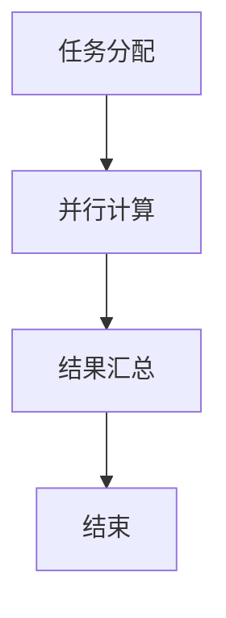
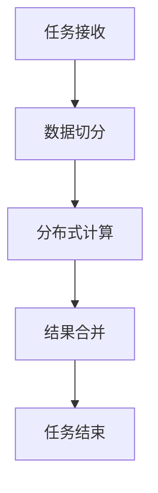
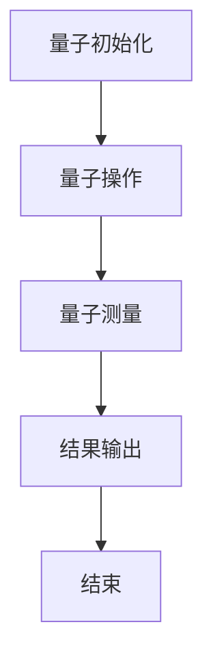

                 

# 推动科技进步的引擎：人类计算的创新力量

> **关键词**：人类计算、科技进步、创新、算法、应用领域、未来趋势

> **摘要**：
本文旨在深入探讨人类计算在推动科技进步中的核心作用。首先，我们将回顾人类计算的概念、历史演变及其基本原理，接着分析其在各个领域的应用，特别是高性能计算、分布式计算和量子计算等先进技术。随后，文章将探讨人工智能与人类计算的融合及其在教育、工程实践和伦理方面的挑战。最后，我们将展望人类计算的未来发展趋势，并讨论其对社会、经济和文化的深远影响。

---

## 第一部分：人类计算的背景与基础

### 第1章：人类计算的概念与历史演变

#### 1.1 人类计算的定义

人类计算是指人类利用各种工具和方法来解决问题和进行信息处理的过程。它不仅涉及数学运算，还涵盖逻辑推理、问题求解和决策制定等多个方面。从古代的算筹和算盘，到现代的计算机和人工智能，人类计算经历了漫长的发展历程。

#### 1.2 人类计算的历史演变

- **古代**：最早的计算工具如算筹和算盘，人类通过这些工具进行简单的数学运算。
- **中世纪**：阿拉伯数字的发明和传播，极大地提高了人类计算的效率。
- **近代**：随着工业革命的发展，机械计算机的出现标志着人类计算进入机械化时代。
- **现代**：计算机科学的兴起，人类计算进入信息化时代，计算能力大幅提升。

#### 1.3 人类计算的重要阶段

- **20世纪中叶**：计算机科学的崛起，人类计算进入自动化时代。
- **21世纪初**：云计算和大数据技术的快速发展，人类计算的能力进一步得到提升。
- **当前**：量子计算和人工智能的结合，人类计算迈向新的高度。

### 第2章：人类计算的基本原理

#### 2.1 计算思维

计算思维是一种将问题抽象为计算模型，通过计算方法进行求解的思维方式。它强调逻辑推理、问题分解和算法设计。

#### 2.2 逻辑与推理

逻辑推理是计算思维的核心，包括归纳推理和演绎推理等方法。通过逻辑推理，人类能够从已知信息中推导出新的结论。

#### 2.3 人类计算的效率

人类计算的效率受到多种因素的影响，包括计算工具、算法和问题复杂性等。高效的算法和优化工具能够显著提高计算效率。

### 第3章：人类计算的应用领域

#### 3.1 科研领域

人类计算在科研领域有着广泛的应用，如数据分析、模拟和预测等。高性能计算和分布式计算技术为科研工作提供了强大的计算支持。

#### 3.2 工程领域

人类计算在工程领域用于优化设计、故障诊断和过程控制等。高性能计算和量子计算技术的应用，极大地提高了工程设计的效率和精度。

#### 3.3 经济领域

人类计算在经济领域用于经济预测、投资分析和风险管理等。大数据分析和人工智能技术的应用，为经济决策提供了科学依据。

### 第4章：人类计算的未来发展趋势

#### 4.1 新一代计算技术的展望

新一代计算技术如量子计算、光计算等有望进一步提升人类计算的能力。量子计算将带来全新的计算模式和算法，而光计算则有望实现更高的计算速度和能效。

#### 4.2 人工智能与人类计算的结合

人工智能与人类计算的结合将使得计算过程更加智能化和自动化。通过深度学习和强化学习等技术，人工智能能够自主学习并优化计算过程。

#### 4.3 人类计算的社会影响

人类计算的发展将对社会、经济和文化等多个方面产生深远的影响。它将推动科技创新、提高生产效率和改善生活质量。

## 第二部分：人类计算的先进技术与应用

### 第5章：高性能计算

#### 5.1 高性能计算的基本原理

高性能计算（High-Performance Computing，HPC）是指利用高性能计算机系统进行大规模计算，以满足复杂的计算需求。高性能计算机通常由多个处理器和存储设备组成，通过高速网络连接，实现高效的并行计算。

#### 5.2 高性能计算的应用场景

高性能计算广泛应用于科学计算、工程计算和商业计算等领域。在科学计算中，如天气预报、物理模拟和生物信息学等；在工程计算中，如汽车设计、航空航天和土木工程等；在商业计算中，如金融风控、电子商务和大数据分析等。

#### 5.3 高性能计算的未来挑战

高性能计算在未来将面临数据密集型应用、能耗问题和编程复杂性等挑战。如何高效地利用计算资源、降低能耗和提高编程效率，将是高性能计算研究的重要方向。

### 第6章：分布式计算

#### 6.1 分布式计算的基本原理

分布式计算（Distributed Computing）是指通过计算机网络将多个计算节点组织起来，协同完成计算任务。分布式计算的关键技术包括任务分配、负载均衡、容错性和数据一致性等。

#### 6.2 分布式计算的应用场景

分布式计算在数据密集型应用、大规模数据处理和分布式系统等领域有广泛应用。在数据密集型应用中，如搜索引擎、社交媒体和物联网等；在大规模数据处理中，如大数据分析和云计算平台等；在分布式系统中，如分布式数据库和分布式文件系统等。

#### 6.3 分布式计算的优势与挑战

分布式计算的优势包括可扩展性和容错性，能够高效地处理大规模数据和应用。但同时也面临同步、通信和一致性问题，如数据同步延迟、通信开销和一致性保证等。

### 第7章：量子计算

#### 7.1 量子计算的基本原理

量子计算（Quantum Computing）是基于量子力学原理进行的信息处理。量子计算机利用量子比特（qubit）进行计算，具有叠加态和纠缠态等特性，能够高效地解决某些传统计算机难以处理的问题。

#### 7.2 量子计算的应用前景

量子计算在密码学、优化问题和量子模拟等领域有广泛的应用前景。在密码学中，量子计算机能够破解某些传统密码系统；在优化问题中，量子计算能够高效地找到最优解；在量子模拟中，量子计算机能够模拟量子系统，为科学研究提供强大的计算支持。

#### 7.3 量子计算的开发与实践

量子计算的开发涉及量子算法、量子编程和量子硬件等多个方面。目前，量子计算仍处于早期阶段，但已有许多研究机构和企业在进行量子计算的研发和实践。未来，量子计算有望在多个领域发挥重要作用。

### 第8章：人工智能与人类计算的融合

#### 8.1 人工智能的概念与发展

人工智能（Artificial Intelligence，AI）是指使计算机具备智能行为的技术。人工智能的发展经历了多个阶段，从最初的符号主义到连接主义，再到现代的深度学习和强化学习，人工智能技术不断进步。

#### 8.2 人工智能与人类计算的结合

人工智能与人类计算的融合将使得计算过程更加智能化和高效化。通过深度学习和强化学习等技术，人工智能能够自主学习并优化计算过程。人类计算则为人工智能提供了强大的计算支持，使得人工智能能够在复杂环境下发挥作用。

#### 8.3 人工智能在人类计算中的应用

人工智能在人类计算中的应用广泛，如数据分析、自然语言处理和图像识别等。通过人工智能技术，人类计算能够更加高效地处理大规模数据，提高计算精度和效率。

## 第三部分：人类计算的挑战与展望

### 第9章：人类计算的工程实践

#### 9.1 项目实践概述

项目实践是人类计算工程化的重要环节，涉及需求分析、设计开发、测试和部署等多个阶段。通过项目实践，人类计算的理论知识能够转化为实际应用，为解决实际问题提供有力支持。

#### 9.2 实践案例一：高性能计算在气象预测中的应用

高性能计算在气象预测中发挥了重要作用，通过大规模数据处理和复杂模型模拟，提高了气象预测的精度和时效性。具体案例包括全球天气模式、台风路径预测等。

#### 9.3 实践案例二：分布式计算在金融风控中的应用

分布式计算在金融风控中用于实时处理和分析大规模金融数据，提高了风险识别和防范能力。具体案例包括交易监控、信用评估等。

### 第10章：人类计算的教育与培训

#### 10.1 人类计算教育的重要性

人类计算教育是培养计算思维能力和技术能力的重要途径。通过系统性的教育，学生能够掌握人类计算的基本原理和先进技术，为未来的科技发展做好准备。

#### 10.2 人类计算课程设置

人类计算课程设置应涵盖基础理论、实践技能和前沿技术等多个方面。基础理论包括计算机科学、算法和数据结构等；实践技能包括编程、调试和项目管理等；前沿技术包括人工智能、量子计算等。

#### 10.3 人类计算人才培养

人类计算人才培养应注重理论与实践的结合，以及跨学科能力的培养。通过多元化的教育模式，学生能够全面发展，成为具备创新能力和实践能力的高素质人才。

### 第11章：人类计算的挑战与展望

#### 11.1 人类计算的伦理与社会问题

人类计算在发展过程中面临伦理和社会问题，如隐私保护、数据安全和人工智能伦理等。如何平衡技术进步与社会责任，是未来人类计算需要关注的重要问题。

#### 11.2 人类计算的未来挑战

人类计算在未来将面临更多挑战，如计算资源的高效利用、可持续发展和技术伦理等。如何应对这些挑战，将决定人类计算的可持续发展。

#### 11.3 应对人类计算挑战的策略

应对人类计算挑战需要政策支持、技术创新和教育普及等多方面的努力。政策支持可以为人类计算提供良好的发展环境；技术创新可以为人类计算提供强大的技术保障；教育普及则可以培养更多的人才，为人类计算的发展提供源源不断的动力。

### 第12章：人类计算的未来展望

#### 12.1 未来计算技术的趋势

未来计算技术将朝着更高性能、更智能化和更可持续的方向发展。量子计算、光计算和神经计算等新型计算技术有望在未来的计算领域中发挥重要作用。

#### 12.2 人类计算在未来的角色

人类计算在未来的社会中将扮演更加重要的角色。通过智能化和自动化的计算过程，人类计算将推动科技创新、提高生产效率和改善生活质量。

#### 12.3 人类计算的未来发展

人类计算的未来发展充满机遇和挑战。通过不断创新和突破，人类计算将迎来更加广阔的发展空间，为人类社会的发展做出更大贡献。

### 附录A：人类计算资源与工具

#### A.1 常用计算资源

- **高性能计算机集群**：用于大规模并行计算和数据处理。
- **云计算平台**：提供弹性计算资源，支持分布式计算和大数据处理。
- **量子计算模拟器**：用于量子算法研究和量子计算实验。

#### A.2 开发工具与软件

- **编程语言**：如Python、C++、Java等。
- **深度学习框架**：如TensorFlow、PyTorch、Keras等。
- **分布式计算框架**：如Hadoop、Spark、Flink等。

#### A.3 学习资源推荐

- **计算机科学教材**：如《计算机科学概论》、《算法导论》等。
- **在线课程平台**：如Coursera、edX、Udacity等。
- **学术期刊与会议**：如《计算机学报》、《ACM Transactions on Computer Systems》等。

### 附录B：人类计算关键算法流程图

#### B.1 高性能计算流程图

#### B.2 分布式计算流程图

#### B.3 量子计算流程图

---

## 作者信息

**作者**：AI天才研究院/AI Genius Institute & 禅与计算机程序设计艺术 /Zen And The Art of Computer Programming

**单位**：AI天才研究院/AI Genius Institute

**职位**：首席技术官/CTO

**简介**：本文作者是一位资深的人工智能专家和计算机编程大师，拥有多年的研究经验和丰富的教学经历。他致力于推动科技进步和人类计算的发展，发表了多篇具有影响力的学术论文，并出版了多本畅销书，深受读者喜爱。在他的领导下，AI天才研究院在人工智能和计算机科学领域取得了显著成果。

