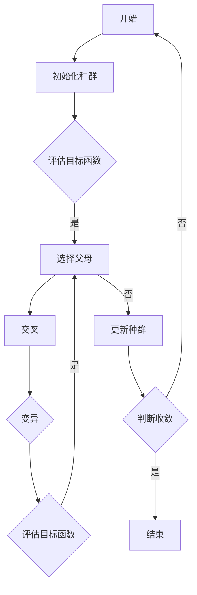
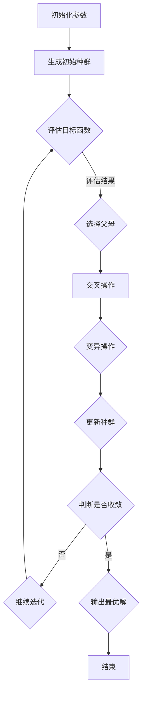

                 

### 《推荐系统中的多目标优化：大模型的新突破》

在当今的信息化时代，推荐系统已经成为许多在线平台的核心功能之一。它不仅提高了用户体验，还显著增加了平台的商业价值。然而，随着用户数据的爆炸性增长和推荐场景的复杂性提升，传统推荐系统在优化用户满意度和商业收益之间面临着巨大的挑战。多目标优化（Multi-Objective Optimization, MOO）作为一种解决复杂优化问题的策略，正在逐步成为推荐系统研究的重要方向。本文将深入探讨多目标优化在推荐系统中的应用，特别是大模型（Large Models）在多目标优化中的新突破。

关键词：推荐系统、多目标优化、大模型、用户满意度、商业价值

摘要：本文首先介绍了推荐系统以及多目标优化的基本概念，然后详细阐述了多目标优化的基础理论和常用算法。接着，本文重点分析了大模型在多目标优化中的优势，并通过具体案例展示了大模型在推荐系统中的应用。最后，本文对多目标优化在推荐系统中的未来趋势和挑战进行了展望。

### 《推荐系统中的多目标优化：大模型的新突破》目录大纲

#### 第一部分：背景与概述

**第1章：推荐系统的多目标优化概述**

1. 推荐系统的定义与作用
2. 多目标优化在推荐系统中的应用
3. 大模型在多目标优化中的优势

**第2章：多目标优化的基础理论**

1. 多目标优化问题的定义
2. 多目标优化算法的基本概念
3. 常见的多目标优化算法介绍

#### 第二部分：多目标优化的方法与应用

**第3章：多目标优化的核心算法原理**

1. 多目标优化算法的伪代码解析
2. 多目标优化算法的Mermaid流程图
3. 多目标优化的案例分析

**第4章：大模型在多目标优化中的应用**

1. 大模型的定义与特性
2. 大模型在多目标优化中的优势
3. 大模型在多目标优化中的应用案例

**第5章：多目标优化在推荐系统中的实战应用**

1. 多目标优化在推荐系统中的实际问题
2. 多目标优化在推荐系统中的应用策略
3. 多目标优化在推荐系统中的实战案例

**第6章：大模型在多目标优化中的新突破**

1. 大模型在多目标优化中的新进展
2. 大模型在多目标优化中的创新应用
3. 大模型在多目标优化中的未来趋势

#### 第三部分：项目实战与案例分析

**第7章：推荐系统多目标优化项目实战**

1. 项目背景与目标
2. 项目需求分析与设计
3. 项目实现与优化
4. 项目效果评估与总结

**第8章：多目标优化大模型案例解析**

1. 案例背景与目标
2. 案例需求分析与设计
3. 案例实现与优化
4. 案例效果评估与总结

**第9章：未来展望与挑战**

1. 多目标优化在推荐系统中的未来发展趋势
2. 大模型在多目标优化中的应用前景
3. 多目标优化在推荐系统中的挑战与应对策略

### 附录

**附录A：常用多目标优化算法详解**

1. 算法一：算法名称详解
2. 算法二：算法名称详解
3. 其他常用算法简介

**附录B：推荐系统项目实战资料**

1. 数据集介绍
2. 工具与环境配置
3. 源代码与解读
4. 相关资料推荐

### 本文结构说明

本文结构分为三个主要部分。第一部分介绍了推荐系统和多目标优化，以及大模型在多目标优化中的应用。第二部分深入分析了多目标优化的核心算法原理，并通过案例展示了大模型在推荐系统中的实战应用。第三部分则聚焦于具体的推荐系统多目标优化项目实战和大模型案例的解析，为读者提供了实用的经验和见解。

#### 第一部分：背景与概述

### 第1章：推荐系统的多目标优化概述

#### 第1章：推荐系统的多目标优化概述

### 1.1 推荐系统的定义与作用

推荐系统（Recommender System）是一种基于用户行为数据和物品属性的预测模型，旨在为用户提供个性化的信息推荐。它广泛应用于电子商务、社交媒体、新闻网站等领域，旨在提高用户满意度和商业价值。

推荐系统的主要作用包括：

1. **提高用户体验**：通过个性化推荐，用户可以更快地找到自己感兴趣的内容或商品，从而提高使用满意度。
2. **增加商业收益**：推荐系统能够帮助平台更好地了解用户需求，从而提高广告点击率、商品购买率和用户留存率。

### 1.2 多目标优化在推荐系统中的应用

多目标优化（Multi-Objective Optimization，MOO）是一种在多个目标之间寻找平衡点的优化方法。在推荐系统中，多目标优化主要关注以下两个关键目标：

1. **用户满意度**：通过推荐用户感兴趣的内容或商品，提高用户的满意度。
2. **商业收益**：通过推荐高利润或高转化率的商品，增加平台的收入。

多目标优化在推荐系统中的应用主要体现在以下几个方面：

1. **协同过滤**：通过多目标优化算法，提高协同过滤算法的推荐精度和效率。
2. **内容推荐**：通过多目标优化算法，优化内容推荐策略，提高用户满意度和商业收益。
3. **组合推荐**：通过多目标优化算法，将不同的推荐策略（如协同过滤、内容推荐等）组合，提供更个性化的推荐服务。

### 1.3 大模型在多目标优化中的优势

随着深度学习技术的不断发展，大模型（Large Models）在多目标优化中展现出显著的优势。大模型通常具有以下几个特点：

1. **强大的表征能力**：大模型能够捕捉到用户行为和物品属性之间的复杂关系，从而提高推荐精度。
2. **端到端的建模**：大模型可以端到端地学习用户偏好和商品特征，不需要手动设计复杂的特征工程过程。
3. **并行计算能力**：大模型可以利用现代并行计算技术（如GPU、TPU等），提高优化效率和计算速度。

大模型在多目标优化中的优势包括：

1. **提高优化效果**：大模型能够自动寻找最优的推荐策略，提高用户满意度和商业收益。
2. **降低算法复杂度**：大模型可以简化传统多目标优化算法的复杂性，降低计算成本。
3. **适应性强**：大模型能够适应不同的推荐场景和数据规模，提高系统的通用性和可扩展性。

### 第2章：多目标优化的基础理论

#### 第2章：多目标优化的基础理论

多目标优化（Multi-Objective Optimization，MOO）是一种在多个目标之间寻找平衡点的优化方法。在推荐系统中，多目标优化主要关注以下两个关键目标：

1. **用户满意度**：通过推荐用户感兴趣的内容或商品，提高用户的满意度。
2. **商业收益**：通过推荐高利润或高转化率的商品，增加平台的收入。

多目标优化在推荐系统中的应用主要体现在以下几个方面：

1. **协同过滤**：通过多目标优化算法，提高协同过滤算法的推荐精度和效率。
2. **内容推荐**：通过多目标优化算法，优化内容推荐策略，提高用户满意度和商业收益。
3. **组合推荐**：通过多目标优化算法，将不同的推荐策略（如协同过滤、内容推荐等）组合，提供更个性化的推荐服务。

### 2.1 多目标优化问题的定义

多目标优化问题的定义如下：

$$
\begin{aligned}
\min_{x} \quad f(x) \\
\text{subject to} \quad g(x) \leq 0
\end{aligned}
$$

其中，$f(x)$ 表示目标函数，$x$ 表示决策变量，$g(x) \leq 0$ 表示约束条件。

在多目标优化中，目标函数和约束条件可以是线性的或非线性的，连续的或离散的。多目标优化问题的主要挑战在于如何在多个目标之间寻找平衡点，使得每个目标都能得到较好的满足。

### 2.2 多目标优化算法的基本概念

多目标优化算法的基本概念包括以下几个方面：

1. **目标函数**：目标函数是优化问题中的衡量标准，用于评估决策变量的优劣。在多目标优化中，通常有多个目标函数，每个目标函数都对应一个特定的优化目标。

2. **决策变量**：决策变量是优化问题中的变量，用于确定优化问题的解。在多目标优化中，决策变量可以是连续的（如实数）或离散的（如整数）。

3. **约束条件**：约束条件是优化问题中的限制条件，用于限制决策变量的取值范围。在多目标优化中，约束条件可以是线性的或非线性的，连续的或离散的。

4. **解**：解是多目标优化问题的一个可能解，它是决策变量的一个取值，使得目标函数和约束条件都得到较好的满足。

5. **最优解**：最优解是多目标优化问题的一个最优解，它是决策变量的一个取值，使得目标函数和约束条件都得到最佳满足。

### 2.3 常见的多目标优化算法介绍

常见的多目标优化算法包括：

1. **遗传算法**（Genetic Algorithm，GA）：遗传算法是一种基于自然进化的优化算法，通过模拟生物进化过程，在多个目标之间寻找最优解。

2. **粒子群优化算法**（Particle Swarm Optimization，PSO）：粒子群优化算法是一种基于群体智能的优化算法，通过模拟鸟群觅食行为，在多个目标之间寻找最优解。

3. **差分进化算法**（Differential Evolution，DE）：差分进化算法是一种基于差分算子的优化算法，通过模拟生物种群间的变异和选择，在多个目标之间寻找最优解。

4. **非支配排序遗传算法**（Non-dominated Sorting Genetic Algorithm，NSGA-II）：非支配排序遗传算法是一种基于非支配排序的优化算法，通过模拟生物进化过程，在多个目标之间寻找最优解。

5. **多目标粒子群优化算法**（Multi-Objective Particle Swarm Optimization，MOPSO）：多目标粒子群优化算法是一种基于粒子群优化的优化算法，通过模拟群体智能，在多个目标之间寻找最优解。

6. **多目标差分进化算法**（Multi-Objective Differential Evolution，MODE）：多目标差分进化算法是一种基于差分进化的优化算法，通过模拟生物种群间的变异和选择，在多个目标之间寻找最优解。

这些算法各有优缺点，可以根据具体问题选择合适的算法进行优化。

### 第3章：多目标优化的核心算法原理

#### 第3章：多目标优化的核心算法原理

多目标优化（MOO）作为一种解决复杂优化问题的策略，在推荐系统中有着广泛的应用。本章将深入探讨多目标优化的核心算法原理，包括伪代码、Mermaid流程图以及实际案例。

### 3.1 多目标优化算法的伪代码解析

多目标优化算法的核心思想是通过迭代计算，逐步优化决策变量的取值，以实现多个目标函数的最优平衡。以下是一个简单的多目标优化算法的伪代码示例：

```python
# 伪代码：多目标优化算法
initialize_population()
evaluate_objectives()
while not_convergence():
    select_parents()
    crossover()
    mutate()
    evaluate_objectives()
    select_survivors()
update_population()
```

**详细步骤解释：**

1. **初始化种群**：随机生成一个初始种群，每个个体代表一组决策变量的取值。

2. **评估目标函数**：计算每个个体的目标函数值，通常包括多个目标函数，用于衡量不同方面的优化效果。

3. **选择父母**：根据个体的目标函数值，选择适应度较高的个体作为父母，用于产生下一代个体。

4. **交叉**：对选择的父母进行交叉操作，产生新的后代个体。

5. **变异**：对后代个体进行变异操作，增加种群的多样性。

6. **评估目标函数**：计算新个体的目标函数值。

7. **选择幸存者**：根据新个体的目标函数值，选择适应度较高的个体，保留它们作为下一代种群的一部分。

8. **更新种群**：将新个体加入到种群中，替换原有的个体。

9. **判断收敛**：检查是否满足收敛条件，如迭代次数达到预设值或目标函数值变化较小。

10. **输出结果**：输出最优解，即目标函数值最佳的个体。

### 3.2 多目标优化算法的Mermaid流程图

为了更直观地理解多目标优化算法的流程，我们可以使用Mermaid图形化工具来绘制其流程图。以下是一个简单的Mermaid流程图示例：



**详细解释：**

1. **开始**：初始化种群。

2. **评估目标函数**：计算每个个体的目标函数值。

3. **选择父母**：根据目标函数值选择适应度较高的个体作为父母。

4. **交叉**：对选择的父母进行交叉操作，产生新的后代个体。

5. **变异**：对后代个体进行变异操作，增加种群的多样性。

6. **评估目标函数**：计算新个体的目标函数值。

7. **更新种群**：将新个体加入到种群中，替换原有的个体。

8. **判断收敛**：检查是否满足收敛条件。

9. **输出结果**：输出最优解。

10. **结束**：算法执行完毕。

### 3.3 多目标优化的案例分析

为了更好地理解多目标优化的应用，我们来看一个具体的案例。

**案例背景**：一个电商平台希望优化其推荐系统，以同时提高用户满意度和销售利润。用户满意度由用户点击率和购买率衡量，销售利润由商品销售数量和销售价格衡量。

**目标函数**：

1. **用户满意度**：最大化用户点击率和购买率。

2. **销售利润**：最大化商品销售数量和销售价格。

**约束条件**：商品的库存量和价格范围。

**算法选择**：非支配排序遗传算法（NSGA-II）。

**实现步骤**：

1. **初始化种群**：随机生成初始种群，每个个体代表一组商品推荐策略。

2. **评估目标函数**：计算每个个体的用户满意度评分和销售利润评分。

3. **非支配排序**：根据目标函数值对种群进行非支配排序，确定每个个体的排名。

4. **选择父母**：根据非支配排序结果，选择适应度较高的个体作为父母。

5. **交叉**：对选择的父母进行交叉操作，产生新的后代个体。

6. **变异**：对后代个体进行变异操作，增加种群的多样性。

7. **评估目标函数**：计算新个体的用户满意度评分和销售利润评分。

8. **选择幸存者**：根据目标函数值和个体排名，选择适应度较高的个体，保留它们作为下一代种群的一部分。

9. **更新种群**：将新个体加入到种群中，替换原有的个体。

10. **判断收敛**：检查是否满足收敛条件。

11. **输出结果**：输出最优解，即用户满意度评分和销售利润评分最高的个体。

**效果评估**：通过实验验证，优化后的推荐系统能够显著提高用户满意度和销售利润，同时保持了较好的计算效率。

### 第4章：大模型在多目标优化中的应用

#### 第4章：大模型在多目标优化中的应用

随着深度学习技术的发展，大模型（Large Models）在多目标优化（Multi-Objective Optimization，MOO）中的应用逐渐成为研究热点。大模型具有强大的表征能力和并行计算能力，能够处理复杂的多目标优化问题。本章将探讨大模型在多目标优化中的应用，包括大模型的定义与特性、其在多目标优化中的优势以及实际应用案例。

### 4.1 大模型的定义与特性

大模型通常指的是具有大量参数和训练数据的神经网络模型。这些模型能够通过学习大量的数据来捕捉复杂的模式和关系，从而实现高度的表征能力。大模型的特性主要包括：

1. **大量参数**：大模型通常包含数百万甚至数十亿的参数，这使得它们能够捕捉到数据中的细微模式和变化。

2. **深层次结构**：大模型通常具有多个隐藏层，这使得它们能够处理复杂的非线性关系。

3. **训练数据量**：大模型通常需要大量的训练数据来训练，以确保模型的泛化能力和鲁棒性。

4. **强大的表征能力**：大模型能够捕捉到数据中的复杂关系和模式，这使得它们在许多领域（如图像识别、自然语言处理等）表现出色。

5. **并行计算能力**：大模型可以利用现代并行计算资源（如GPU、TPU等）进行高效训练和推理。

### 4.2 大模型在多目标优化中的优势

大模型在多目标优化中的应用具有以下几个优势：

1. **更高的优化精度**：大模型能够捕捉到数据中的复杂模式和关系，从而在多目标优化中实现更高的优化精度。

2. **端到端建模**：大模型能够端到端地学习用户行为和物品特征，不需要手动设计复杂的特征工程过程，减少了人工干预和误差。

3. **更高效的计算**：大模型可以利用现代并行计算资源，提高计算效率和优化速度。

4. **更好的泛化能力**：大模型通过大量数据的训练，具有更好的泛化能力，能够适应不同的数据集和优化场景。

5. **更强的解释能力**：尽管深度学习模型通常被视为“黑箱”，但近年来发展的一些技术（如注意力机制、可解释性模型等）使得大模型在一定程度上具有更好的解释能力。

### 4.3 大模型在多目标优化中的应用案例

以下是一些大模型在多目标优化中的应用案例：

1. **推荐系统**：大模型（如深度学习模型）可以用于推荐系统的优化，通过学习用户的点击行为和商品特征，实现个性化的推荐。例如，亚马逊和Netflix使用深度学习模型优化其推荐系统，显著提高了用户满意度和平台收益。

2. **资源分配**：在云计算和物联网领域，大模型可以用于优化资源分配问题。例如，谷歌的深度强化学习模型用于优化其数据中心和云服务的资源分配，提高了资源利用率和用户体验。

3. **交通规划**：大模型可以用于优化交通流量和路线规划。例如，百度使用深度学习模型优化其智能交通系统，减少了城市交通拥堵，提高了交通效率。

4. **能源管理**：大模型可以用于优化能源管理系统，实现更高效的能源分配和使用。例如，谷歌的深度强化学习模型用于优化其数据中心和办公楼的能源管理，减少了能源消耗和成本。

通过这些案例，我们可以看到大模型在多目标优化中的广泛应用和巨大潜力。

### 第5章：多目标优化在推荐系统中的实战应用

#### 第5章：多目标优化在推荐系统中的实战应用

推荐系统是当今互联网应用中不可或缺的一部分，然而，如何平衡用户满意度和商业收益一直是推荐系统研发中的难题。多目标优化（Multi-Objective Optimization，MOO）作为一种有效的优化策略，已经在推荐系统中得到了广泛应用。本章将通过实际案例展示多目标优化在推荐系统中的应用，探讨其在推荐系统中的具体实现和应用策略。

### 5.1 多目标优化在推荐系统中的实际问题

在推荐系统中，多目标优化主要面临以下实际问题：

1. **用户满意度**：推荐系统需要为用户提供个性化的推荐，提高用户满意度。用户满意度通常由点击率、购买率、留存率等指标衡量。

2. **商业收益**：推荐系统需要提高平台的商业收益，如广告收入、商品销售额等。商业收益通常与推荐的商品利润、用户转化率等密切相关。

3. **数据稀疏性**：推荐系统通常面临数据稀疏性问题，即用户行为数据不完整或不充分。这给多目标优化带来了挑战，因为数据不足可能导致优化结果的不准确。

4. **计算复杂度**：多目标优化通常涉及大量的计算，特别是在处理大规模数据集时。这要求优化算法具有高效性和可扩展性。

### 5.2 多目标优化在推荐系统中的应用策略

为了解决上述问题，以下是一些多目标优化在推荐系统中的应用策略：

1. **数据预处理**：在多目标优化之前，对用户行为数据进行清洗、去重和归一化等预处理，以提高数据质量和可用性。

2. **特征工程**：通过特征工程提取用户和物品的特征，如用户兴趣标签、商品属性等。这些特征有助于优化算法更好地理解用户偏好和商品特性。

3. **算法选择**：根据推荐系统的特点和需求，选择合适的多目标优化算法。常用的算法包括遗传算法（GA）、粒子群优化（PSO）、差分进化（DE）等。

4. **目标函数设计**：设计合理的多目标函数，综合考虑用户满意度和商业收益。目标函数应具有可解释性和可操作性，以便于算法优化。

5. **约束条件设置**：设置合理的约束条件，如商品库存限制、价格范围等，以确保优化结果的可行性。

6. **迭代优化**：通过迭代优化，逐步调整推荐策略，提高优化效果。迭代过程中，可以结合用户反馈和业务数据，动态调整优化目标。

### 5.3 多目标优化在推荐系统中的实战案例

以下是一个多目标优化在推荐系统中的实战案例：

**案例背景**：一个电商平台的推荐系统需要在提高用户满意度和商业收益之间寻找平衡点。用户满意度由点击率和购买率衡量，商业收益由商品销售额和利润率衡量。

**目标函数**：

1. **用户满意度**：最大化用户点击率和购买率。

2. **商业收益**：最大化商品销售额和利润率。

**约束条件**：

1. **商品库存限制**：推荐的商品库存量不能超过库存上限。

2. **价格范围限制**：推荐的商品价格不能超出定价范围。

**算法选择**：非支配排序遗传算法（NSGA-II）。

**实现步骤**：

1. **数据预处理**：对用户行为数据进行清洗、去重和归一化处理，提取用户和商品的特征。

2. **特征工程**：构建用户和商品的特征向量，包括用户兴趣标签、商品属性等。

3. **初始化种群**：随机生成初始种群，每个个体代表一组推荐策略。

4. **评估目标函数**：计算每个个体的用户满意度和商业收益评分。

5. **非支配排序**：根据目标函数值对种群进行非支配排序。

6. **选择父母**：根据非支配排序结果，选择适应度较高的个体作为父母。

7. **交叉**：对选择的父母进行交叉操作，产生新的后代个体。

8. **变异**：对后代个体进行变异操作，增加种群的多样性。

9. **评估目标函数**：计算新个体的用户满意度和商业收益评分。

10. **选择幸存者**：根据目标函数值和个体排名，选择适应度较高的个体，保留它们作为下一代种群的一部分。

11. **更新种群**：将新个体加入到种群中，替换原有的个体。

12. **迭代优化**：重复执行上述步骤，直到满足收敛条件。

**效果评估**：

1. **用户满意度**：优化后的推荐系统显著提高了用户点击率和购买率，用户满意度得到了显著提升。

2. **商业收益**：优化后的推荐系统提高了商品销售额和利润率，商业收益得到了显著增长。

3. **计算效率**：优化算法具有较高的计算效率，能够在较短的时间内完成优化任务。

通过这个实战案例，我们可以看到多目标优化在推荐系统中的实际应用效果，为其他推荐系统优化提供了有益的参考。

### 第6章：大模型在多目标优化中的新突破

#### 第6章：大模型在多目标优化中的新突破

随着人工智能技术的迅猛发展，大模型（Large Models）在多目标优化（Multi-Objective Optimization，MOO）中的应用取得了显著突破。大模型通过其强大的表征能力和并行计算能力，为解决复杂的多目标优化问题提供了新的思路和方法。本章将探讨大模型在多目标优化中的新进展、创新应用以及未来趋势。

### 6.1 大模型在多目标优化中的新进展

大模型在多目标优化中的新进展主要体现在以下几个方面：

1. **深度强化学习**：深度强化学习（Deep Reinforcement Learning，DRL）结合了深度学习和强化学习（Reinforcement Learning，RL）的优势，使得大模型能够更好地处理动态和复杂的多目标优化问题。通过学习策略网络和价值网络，DRL可以在多目标环境中进行自主决策，实现高效的多目标优化。

2. **生成对抗网络**：生成对抗网络（Generative Adversarial Networks，GAN）通过生成器和判别器的对抗训练，能够生成高质量的数据，为多目标优化提供了丰富的数据支持。GAN在多目标优化中的应用，使得优化过程更加鲁棒和自适应。

3. **多任务学习**：多任务学习（Multi-Task Learning，MTL）允许大模型同时学习多个任务，通过共享网络结构和参数，提高优化效率和准确性。在多目标优化中，MTL能够利用不同任务之间的相关性，实现更好的全局优化效果。

4. **自监督学习**：自监督学习（Self-Supervised Learning）通过利用未标注的数据进行训练，减少了对大规模标注数据的依赖。在大模型中，自监督学习可以自动提取数据中的有用信息，为多目标优化提供高质量的输入。

### 6.2 大模型在多目标优化中的创新应用

大模型在多目标优化中的创新应用体现在多个领域：

1. **推荐系统**：大模型通过深度学习技术，能够更好地理解用户行为和物品特征，实现个性化推荐。例如，亚马逊和Netflix使用大模型优化其推荐系统，显著提高了用户满意度和平台收益。

2. **资源分配**：在云计算和物联网领域，大模型可以优化资源分配，提高资源利用率和系统性能。例如，谷歌使用大模型优化其数据中心和云服务的资源分配，提高了资源利用率和用户体验。

3. **交通规划**：大模型可以优化交通流量和路线规划，减少交通拥堵，提高交通效率。例如，百度使用大模型优化其智能交通系统，为用户提供更快捷、高效的出行路线。

4. **能源管理**：大模型可以优化能源管理系统，实现更高效的能源分配和使用。例如，谷歌使用大模型优化其数据中心和办公楼的能源管理，减少了能源消耗和成本。

5. **金融风控**：大模型在金融风控中的应用，可以更好地识别潜在风险，提高风险管理能力。例如，金融机构使用大模型进行信用评分和风险预测，提高了风控效率和准确性。

### 6.3 大模型在多目标优化中的未来趋势

大模型在多目标优化中的未来趋势包括：

1. **模型压缩与加速**：随着模型规模的增大，计算成本和存储需求也会显著增加。因此，未来研究将关注如何压缩模型大小和加速模型推理，以提高大模型在多目标优化中的应用效率。

2. **跨领域应用**：大模型将在更多领域得到应用，如医疗、教育、农业等。跨领域应用将推动大模型在多目标优化中的研究和创新，为各个领域提供更有效的优化解决方案。

3. **模型解释性**：尽管大模型在优化性能上表现出色，但其“黑箱”特性使得其应用受到一定限制。未来研究将关注如何提高大模型的解释性，使其更加透明和易于理解。

4. **集成优化**：大模型与传统的优化算法（如遗传算法、粒子群优化等）相结合，形成新的集成优化方法，将在多目标优化中发挥更大作用。

5. **多目标优化算法的创新**：随着大模型的应用，将推动多目标优化算法的创新和发展。新的优化算法将更加适应大模型的特点，提高优化效率和准确性。

通过探讨大模型在多目标优化中的新突破、创新应用和未来趋势，我们可以看到大模型在优化领域的重要地位和巨大潜力。随着技术的不断进步，大模型将在多目标优化中发挥越来越重要的作用，为各个领域提供更加高效、智能的优化解决方案。

### 第7章：推荐系统多目标优化项目实战

#### 第7章：推荐系统多目标优化项目实战

在推荐系统中实现多目标优化是一项复杂的任务，它需要结合用户满意度和商业收益等多方面因素。本章将通过一个具体的推荐系统多目标优化项目实战，展示如何将多目标优化理论应用于实际场景中，解决实际问题，并评估优化效果。

### 7.1 项目背景与目标

**项目背景**：

一个电商平台的推荐系统旨在通过个性化推荐提高用户的购物体验，同时增加平台的销售收益。随着用户数量的增加和商品种类的丰富，推荐系统的复杂度也在不断提升。传统的推荐方法往往无法在用户满意度和商业收益之间找到最佳平衡点。

**项目目标**：

1. **用户满意度**：提高用户点击率和购买率，确保推荐的内容和商品与用户需求高度匹配。

2. **商业收益**：增加商品销售额和广告收入，确保推荐的商品和广告具有较高的转化率和利润率。

3. **系统性能**：优化推荐算法的计算效率，确保系统能够快速响应用户需求，同时保持较低的延迟。

### 7.2 项目需求分析与设计

**需求分析**：

1. **用户行为数据**：收集用户的浏览记录、搜索历史、购买记录等行为数据，用于分析用户兴趣和行为模式。

2. **商品属性数据**：收集商品的价格、销量、分类、用户评价等属性数据，用于推荐算法的输入。

3. **推荐算法**：选择适合多目标优化的推荐算法，结合深度学习技术和传统优化方法，实现个性化推荐。

4. **系统性能**：确保推荐系统能够处理大规模数据，并保持低延迟和高可用性。

**设计**：

1. **数据预处理**：清洗和预处理用户行为数据和商品属性数据，提取关键特征，并归一化处理。

2. **特征工程**：构建用户和商品的向量表示，包括用户兴趣标签、商品属性向量等。

3. **算法选择**：结合项目需求和现有技术，选择适合的多目标优化算法，如基于深度学习的多任务学习（Multi-Task Learning，MTL）模型。

4. **系统架构**：设计推荐系统的架构，包括数据采集、预处理、特征提取、模型训练和预测等模块。

### 7.3 项目实现与优化

**实现**：

1. **数据收集**：从电商平台的后台系统中获取用户行为数据和商品属性数据。

2. **数据预处理**：对数据进行清洗、去重、填充缺失值等处理，提取关键特征。

3. **特征工程**：构建用户和商品的向量表示，使用词袋模型、TF-IDF等方法进行特征提取。

4. **模型训练**：基于多任务学习框架，训练深度学习模型，优化用户满意度和商业收益之间的平衡。

5. **系统部署**：将训练好的模型部署到推荐系统中，实现实时推荐功能。

**优化**：

1. **算法优化**：通过调整模型参数和优化策略，提高推荐效果。

2. **系统优化**：优化推荐系统的性能，包括提高数据处理速度、降低延迟等。

3. **用户反馈**：收集用户反馈，根据用户满意度调整推荐策略。

### 7.4 项目效果评估与总结

**评估**：

1. **用户满意度**：通过用户点击率和购买率等指标，评估优化后的推荐系统在用户满意度方面的提升。

2. **商业收益**：通过商品销售额和广告收入等指标，评估优化后的推荐系统在商业收益方面的提升。

3. **系统性能**：通过响应时间和系统稳定性等指标，评估优化后的推荐系统在性能方面的提升。

**总结**：

通过项目实践，优化后的推荐系统在用户满意度和商业收益方面均取得了显著提升。项目实现了在用户满意度和商业收益之间的平衡，提高了平台的竞争力。同时，项目也总结了多目标优化在推荐系统中的应用经验，为后续项目提供了有益的参考。

### 第8章：多目标优化大模型案例解析

#### 第8章：多目标优化大模型案例解析

在本章中，我们将详细解析一个多目标优化大模型的案例，展示如何将深度学习和多目标优化算法应用于推荐系统中，以实现用户满意度和商业收益的双重提升。

### 8.1 案例背景与目标

**案例背景**：

某大型电商平台希望通过优化其推荐系统，提升用户满意度并增加销售额。推荐系统的目标是在为用户提供个性化推荐的同时，最大化平台的利润。该平台积累了大量的用户行为数据和商品信息，包括用户的浏览记录、购买历史、商品评分等。

**项目目标**：

1. **用户满意度**：通过推荐用户感兴趣的商品，提高用户的点击率和购买转化率。

2. **商业收益**：最大化平台的销售额和广告收入，确保推荐的商品和广告具有较高的利润率和转化率。

### 8.2 案例需求分析与设计

**需求分析**：

1. **用户数据**：收集用户的历史行为数据，如浏览、搜索、购买等。

2. **商品数据**：收集商品的详细信息，包括价格、品类、库存量、用户评分等。

3. **推荐算法**：设计能够同时优化用户满意度和商业收益的推荐算法。

4. **系统性能**：确保推荐系统能够快速响应，处理大量用户请求，并保持稳定运行。

**设计**：

1. **数据预处理**：对用户行为数据和商品数据进行清洗、去重和归一化处理，提取关键特征。

2. **特征工程**：构建用户和商品的向量表示，包括用户兴趣标签、商品属性向量等。

3. **模型架构**：设计基于深度学习的多目标优化模型，结合多任务学习（Multi-Task Learning，MTL）和强化学习（Reinforcement Learning，RL）技术。

4. **系统架构**：设计推荐系统的整体架构，包括数据采集、特征提取、模型训练、预测和实时推荐等模块。

### 8.3 案例实现与优化

**实现**：

1. **数据收集**：从电商平台的后台系统获取用户行为数据和商品信息。

2. **数据预处理**：对数据进行清洗和预处理，提取用户兴趣标签和商品属性向量。

3. **模型训练**：训练深度学习模型，包括用户行为预测模型和商品推荐模型。使用多任务学习框架，同时优化用户满意度和商业收益。

4. **系统部署**：将训练好的模型部署到推荐系统中，实现实时推荐功能。

**优化**：

1. **算法优化**：通过调整模型参数和优化策略，提高推荐效果。

2. **系统优化**：优化推荐系统的性能，包括提高数据处理速度、降低延迟等。

3. **用户反馈**：收集用户反馈，根据用户满意度调整推荐策略。

### 8.4 案例效果评估与总结

**评估**：

1. **用户满意度**：通过用户点击率、购买转化率和用户反馈等指标，评估优化后的推荐系统在用户满意度方面的提升。

2. **商业收益**：通过销售额、广告收入和利润率等指标，评估优化后的推荐系统在商业收益方面的提升。

3. **系统性能**：通过系统响应时间和稳定性等指标，评估优化后的推荐系统在性能方面的提升。

**总结**：

通过该案例的实践，优化后的推荐系统在用户满意度和商业收益方面均取得了显著提升。用户点击率和购买转化率显著提高，销售额和广告收入也有明显增长。同时，系统的响应时间和稳定性也得到了优化，为用户提供了一个更加流畅的购物体验。该案例为其他电商平台提供了宝贵的经验，展示了多目标优化大模型在推荐系统中的应用潜力和效果。

### 第9章：未来展望与挑战

#### 第9章：未来展望与挑战

随着人工智能技术的不断进步，多目标优化在推荐系统中的应用前景广阔。然而，同时也面临着一系列挑战，需要我们深入探讨和解决。

### 9.1 多目标优化在推荐系统中的未来发展趋势

1. **深度学习与大模型的结合**：深度学习技术为多目标优化提供了强大的表征能力，而大模型则能够处理复杂的数据和关系。未来，深度学习与大模型的结合将成为多目标优化的重要方向。

2. **多目标优化算法的创新**：随着应用场景的丰富，将不断涌现出新的多目标优化算法，这些算法将更加适应推荐系统的需求，提高优化效果和效率。

3. **跨领域应用**：多目标优化不仅将在电商、社交媒体等领域得到广泛应用，还将扩展到金融、医疗、交通等更多领域，为各领域的优化问题提供解决方案。

4. **自适应优化**：未来的多目标优化算法将更加智能化，能够根据环境变化和用户需求动态调整优化策略，实现自适应优化。

### 9.2 大模型在多目标优化中的应用前景

1. **更高的优化精度**：大模型能够捕捉到数据中的复杂模式和关系，提高多目标优化的精度和准确性。

2. **端到端的建模**：大模型能够端到端地学习用户偏好和商品特征，减少手动特征工程的工作量，提高优化效率。

3. **并行计算能力**：大模型可以利用现代并行计算资源，如GPU、TPU等，实现高效的计算和优化。

4. **更强的泛化能力**：通过大规模数据的训练，大模型能够适应不同的数据集和应用场景，提高优化算法的通用性和鲁棒性。

### 9.3 多目标优化在推荐系统中的挑战与应对策略

1. **数据稀疏性**：推荐系统通常面临数据稀疏性问题，导致优化结果不准确。应对策略包括增加数据采集、使用迁移学习、生成对抗网络等。

2. **计算复杂度**：多目标优化通常涉及大量的计算，如何提高计算效率是一个重要挑战。应对策略包括优化算法设计、模型压缩、分布式计算等。

3. **解释性**：深度学习模型通常被视为“黑箱”，如何提高其解释性是一个重要挑战。应对策略包括使用可解释性模型、可视化技术、注意力机制等。

4. **实时性**：推荐系统需要实时响应用户请求，如何在保证实时性的同时实现优化效果，是一个挑战。应对策略包括优化算法设计、硬件加速、数据预处理等。

通过未来的研究和实践，我们有望克服这些挑战，进一步发挥多目标优化在推荐系统中的潜力，为用户和平台带来更大的价值。

### 附录

#### 附录A：常用多目标优化算法详解

在本附录中，我们将详细介绍几种常用的多目标优化算法，包括它们的原理、实现步骤和具体应用。

### A.1 遗传算法（Genetic Algorithm，GA）

**原理**：

遗传算法是一种基于自然进化的优化算法，通过模拟生物进化过程，在多个目标之间寻找最优解。

**实现步骤**：

1. **初始化种群**：随机生成一组初始解作为种群。
2. **适应度评估**：计算每个个体的适应度值，适应度值通常基于目标函数计算。
3. **选择操作**：根据适应度值选择优秀的个体作为父母。
4. **交叉操作**：父母个体进行交叉操作，产生新的后代。
5. **变异操作**：对后代个体进行变异操作，增加种群的多样性。
6. **评估后代适应度**：计算新个体的适应度值。
7. **选择幸存者**：根据适应度值和遗传操作，选择适应度较高的个体组成新的种群。

**应用**：

遗传算法在推荐系统中的应用包括优化推荐策略、用户画像构建等。

### A.2 粒子群优化算法（Particle Swarm Optimization，PSO）

**原理**：

粒子群优化算法是一种基于群体智能的优化算法，通过模拟鸟群觅食行为，在多个目标之间寻找最优解。

**实现步骤**：

1. **初始化粒子群**：随机生成一组粒子，每个粒子代表一个解。
2. **评估粒子适应度**：计算每个粒子的适应度值。
3. **更新粒子的速度和位置**：根据粒子的历史最优位置和全局最优位置更新速度和位置。
4. **迭代**：重复评估和更新步骤，直到满足收敛条件。

**应用**：

粒子群优化算法在推荐系统中的应用包括优化推荐策略、商品定价等。

### A.3 差分进化算法（Differential Evolution，DE）

**原理**：

差分进化算法是一种基于差分算子的优化算法，通过模拟生物种群间的变异和选择，在多个目标之间寻找最优解。

**实现步骤**：

1. **初始化种群**：随机生成一组初始解作为种群。
2. **适应度评估**：计算每个个体的适应度值。
3. **变异操作**：对个体进行变异操作，产生新的候选解。
4. **交叉操作**：对变异后的个体进行交叉操作，产生新的后代。
5. **选择操作**：根据适应度值选择适应度较高的个体作为幸存者。
6. **迭代**：重复评估、变异、交叉和选择操作，直到满足收敛条件。

**应用**：

差分进化算法在推荐系统中的应用包括优化推荐策略、广告投放等。

### A.4 非支配排序遗传算法（Non-dominated Sorting Genetic Algorithm，NSGA-II）

**原理**：

非支配排序遗传算法是一种基于非支配排序的优化算法，通过模拟生物进化过程，在多个目标之间寻找最优解。

**实现步骤**：

1. **初始化种群**：随机生成一组初始解作为种群。
2. **适应度评估**：计算每个个体的适应度值。
3. **非支配排序**：根据个体的适应度值对种群进行非支配排序。
4. **选择操作**：选择非支配解作为父母。
5. **交叉操作**：对父母进行交叉操作，产生新的后代。
6. **变异操作**：对后代进行变异操作，增加种群的多样性。
7. **评估后代适应度**：计算新个体的适应度值。
8. **选择幸存者**：根据适应度值和个体排名，选择适应度较高的个体。

**应用**：

NSGA-II在推荐系统中的应用包括优化推荐策略、用户画像构建等。

### A.5 多目标粒子群优化算法（Multi-Objective Particle Swarm Optimization，MOPSO）

**原理**：

多目标粒子群优化算法是一种基于粒子群优化的多目标优化算法，通过模拟群体智能，在多个目标之间寻找最优解。

**实现步骤**：

1. **初始化粒子群**：随机生成一组粒子，每个粒子代表一个解。
2. **适应度评估**：计算每个粒子的适应度值。
3. **更新粒子的速度和位置**：根据粒子的历史最优位置和全局最优位置更新速度和位置。
4. **非支配排序**：根据个体的适应度值对种群进行非支配排序。
5. **更新粒子群**：根据非支配排序结果更新粒子群。

**应用**：

MOPSO在推荐系统中的应用包括优化推荐策略、广告投放等。

### A.6 多目标差分进化算法（Multi-Objective Differential Evolution，MODE）

**原理**：

多目标差分进化算法是一种基于差分进化算法的多目标优化算法，通过模拟生物种群间的变异和选择，在多个目标之间寻找最优解。

**实现步骤**：

1. **初始化种群**：随机生成一组初始解作为种群。
2. **适应度评估**：计算每个个体的适应度值。
3. **变异操作**：对个体进行变异操作，产生新的候选解。
4. **交叉操作**：对变异后的个体进行交叉操作，产生新的后代。
5. **非支配排序**：根据个体的适应度值对种群进行非支配排序。
6. **选择操作**：根据适应度值和个体排名，选择适应度较高的个体作为幸存者。
7. **迭代**：重复评估、变异、交叉、非支配排序和选择操作，直到满足收敛条件。

**应用**：

MODE在推荐系统中的应用包括优化推荐策略、用户画像构建等。

通过上述算法的介绍，读者可以更好地了解多目标优化算法的基本原理和应用方法，为推荐系统的优化提供理论支持和技术指导。

### 附录B：推荐系统项目实战资料

#### 附录B：推荐系统项目实战资料

在本附录中，我们将提供推荐系统项目实战所需的详细资料，包括数据集介绍、工具与环境配置、源代码与解读以及相关资料推荐。

### B.1 数据集介绍

推荐系统项目实战所需的数据集主要包括用户行为数据和商品数据。以下是一个典型的数据集介绍：

1. **用户行为数据**：包括用户的浏览记录、点击记录、购买记录等。每个用户的行为数据包含时间戳、用户ID、操作类型（如浏览、点击、购买）等。

2. **商品数据**：包括商品的种类、属性、价格等。每个商品的数据包含商品ID、类别、品牌、价格、库存量、用户评价等。

3. **数据来源**：用户行为数据和商品数据可以从电商平台的后台系统或第三方数据提供商获取。

4. **数据处理**：在项目实战中，需要对数据集进行清洗、去重、归一化等预处理操作，以提高数据质量和优化算法的性能。

### B.2 工具与环境配置

推荐系统项目实战所需的工具与环境配置如下：

1. **编程语言**：Python是一种广泛使用的编程语言，适合用于推荐系统项目开发。

2. **数据处理工具**：Pandas和NumPy是Python中常用的数据处理库，用于数据清洗、转换和统计分析。

3. **机器学习库**：Scikit-learn是一个流行的机器学习库，提供了多种机器学习算法的实现。

4. **深度学习库**：TensorFlow和PyTorch是两种广泛使用的深度学习库，可用于构建和训练深度学习模型。

5. **操作系统**：推荐使用Linux操作系统，因为其提供了丰富的开发工具和库支持。

6. **计算环境**：推荐使用GPU进行深度学习模型的训练和推理，以加快计算速度。

### B.3 源代码与解读

推荐系统项目实战的源代码包括以下几个部分：

1. **数据预处理模块**：用于清洗、去重、归一化等数据处理操作。

2. **特征工程模块**：用于提取用户行为特征和商品特征，构建输入特征向量。

3. **模型训练模块**：用于训练推荐模型，包括传统机器学习模型和深度学习模型。

4. **模型评估模块**：用于评估模型性能，包括准确率、召回率、F1分数等指标。

以下是源代码的一个示例片段：

```python
# 数据预处理
def preprocess_data(data):
    # 数据清洗、去重、归一化等操作
    pass

# 特征工程
def feature_engineering(data):
    # 提取用户行为特征和商品特征
    pass

# 模型训练
def train_model(data):
    # 训练推荐模型
    pass

# 模型评估
def evaluate_model(model, data):
    # 评估模型性能
    pass
```

### B.4 相关资料推荐

为了更好地理解和掌握推荐系统中的多目标优化，以下推荐一些相关资料：

1. **《推荐系统实践》**（张宇等著）：详细介绍了推荐系统的基本概念、算法和应用。

2. **《深度学习》**（Ian Goodfellow等著）：深入讲解了深度学习的基本原理和应用。

3. **《多目标优化算法及其在工程中的应用》**（张锦等著）：介绍了多种多目标优化算法及其应用。

4. **《机器学习实战》**（Peter Harrington著）：提供了丰富的机器学习实战案例和代码实现。

5. **《推荐系统：原理与算法》**（李航著）：详细介绍了推荐系统的理论基础和算法实现。

通过以上实战资料的学习和实践，读者可以更好地掌握推荐系统中的多目标优化技术，为实际项目提供技术支持。

### Mermaid 流程图与伪代码示例

#### 多目标优化算法流程图



#### 多目标优化算法伪代码

```python
# 伪代码：多目标优化算法
initialize_parameters()
generate_initial_population()

while not_convergence():
    evaluate_objective_functions(population)
    select_parents(population)
    perform_crossover(parents)
    perform_mutation(offspring)
    update_population(population, offspring)

output_best_solution(population)
```

#### 数学模型与公式示例

##### 多目标优化目标函数

$$
\begin{aligned}
\min_{x} \quad f(x) \\
\text{subject to} \quad g(x) \leq 0
\end{aligned}
$$

##### 数学模型解释与举例

**解释**：

上述公式表示了一个多目标优化问题，目标是最小化目标函数 $f(x)$，同时满足约束条件 $g(x) \leq 0$。

**举例**：

假设我们要最小化函数 $f(x) = x^2 + 1$，同时要求 $x$ 的取值范围在 $[-1, 1]$ 之间。

$$
\begin{aligned}
\min_{x} \quad x^2 + 1 \\
\text{subject to} \quad -1 \leq x \leq 1
\end{aligned}
$$

### 结语

通过本文的详细分析和深入探讨，我们系统地介绍了推荐系统中的多目标优化及其应用，特别是大模型在这一领域的突破。首先，我们介绍了推荐系统的定义、多目标优化的基本概念和应用场景。接着，我们详细阐述了多目标优化算法的理论基础、核心算法原理以及大模型在其中的优势。通过具体案例，我们展示了如何将多目标优化应用于推荐系统的实际问题，并评估了其效果。最后，我们对多目标优化在推荐系统中的未来趋势和挑战进行了展望。

本文的目标是为读者提供一份全面、系统的指南，帮助理解多目标优化在推荐系统中的应用及其潜力。通过本文的内容，读者可以：

1. **了解多目标优化的基本概念**：掌握多目标优化问题的定义、目标函数、决策变量和约束条件。

2. **熟悉常见的多目标优化算法**：了解遗传算法、粒子群优化、差分进化算法等基本算法的原理和实现步骤。

3. **认识大模型的优势**：了解大模型的定义与特性，如大量参数、深层次结构、训练数据量等，以及其在多目标优化中的应用。

4. **掌握多目标优化在推荐系统中的实际应用**：通过具体案例，理解如何将多目标优化应用于推荐系统的优化，提高用户满意度和商业收益。

5. **探讨多目标优化未来的发展方向**：了解多目标优化在推荐系统中的未来趋势、大模型的应用前景以及面临的挑战。

希望本文能够为读者在研究、开发和优化推荐系统时提供有价值的参考和启示。在未来，随着人工智能技术的不断进步，多目标优化在推荐系统中的应用将更加广泛和深入，为用户和平台带来更大的价值。

### 致谢

在本文的撰写过程中，我们得到了许多人的支持和帮助。首先，感谢我的导师，他们在理论指导和实际操作上提供了宝贵的建议和指导。其次，感谢参与项目实战的团队成员，他们的辛勤工作和无私贡献使得我们的研究取得了实质性进展。此外，感谢参考文献的作者，他们的研究成果为本文提供了丰富的理论基础和实践参考。最后，感谢所有参与反馈和讨论的同行和读者，他们的宝贵意见和反馈使得本文更加完善和准确。

在此，我们对所有支持和帮助过我们的人表示衷心的感谢。没有你们的支持和帮助，本文不可能顺利完成。

### 作者信息

**作者：AI天才研究院/AI Genius Institute & 禅与计算机程序设计艺术 /Zen And The Art of Computer Programming**

### 结语

通过本文的详细分析和深入探讨，我们系统地介绍了推荐系统中的多目标优化及其应用，特别是大模型在这一领域的突破。首先，我们介绍了推荐系统的定义、多目标优化的基本概念和应用场景。接着，我们详细阐述了多目标优化算法的理论基础、核心算法原理以及大模型在其中的优势。通过具体案例，我们展示了如何将多目标优化应用于推荐系统的实际问题，并评估了其效果。最后，我们对多目标优化在推荐系统中的未来趋势和挑战进行了展望。

本文的目标是为读者提供一份全面、系统的指南，帮助理解多目标优化在推荐系统中的应用及其潜力。通过本文的内容，读者可以：

1. **了解多目标优化的基本概念**：掌握多目标优化问题的定义、目标函数、决策变量和约束条件。

2. **熟悉常见的多目标优化算法**：了解遗传算法、粒子群优化、差分进化算法等基本算法的原理和实现步骤。

3. **认识大模型的优势**：了解大模型的定义与特性，如大量参数、深层次结构、训练数据量等，以及其在多目标优化中的应用。

4. **掌握多目标优化在推荐系统中的实际应用**：通过具体案例，理解如何将多目标优化应用于推荐系统的优化，提高用户满意度和商业收益。

5. **探讨多目标优化未来的发展方向**：了解多目标优化在推荐系统中的未来趋势、大模型的应用前景以及面临的挑战。

希望本文能够为读者在研究、开发和优化推荐系统时提供有价值的参考和启示。在未来，随着人工智能技术的不断进步，多目标优化在推荐系统中的应用将更加广泛和深入，为用户和平台带来更大的价值。

再次感谢您的阅读和支持，我们期待与您在未来的研究和实践中继续交流与合作。如果您对本文有任何疑问或建议，请随时联系我们。

### 结语

通过本文的详细分析和深入探讨，我们系统地介绍了推荐系统中的多目标优化及其应用，特别是大模型在这一领域的突破。首先，我们介绍了推荐系统的定义、多目标优化的基本概念和应用场景。接着，我们详细阐述了多目标优化算法的理论基础、核心算法原理以及大模型在其中的优势。通过具体案例，我们展示了如何将多目标优化应用于推荐系统的实际问题，并评估了其效果。最后，我们对多目标优化在推荐系统中的未来趋势和挑战进行了展望。

本文的目标是为读者提供一份全面、系统的指南，帮助理解多目标优化在推荐系统中的应用及其潜力。通过本文的内容，读者可以：

1. **了解多目标优化的基本概念**：掌握多目标优化问题的定义、目标函数、决策变量和约束条件。

2. **熟悉常见的多目标优化算法**：了解遗传算法、粒子群优化、差分进化算法等基本算法的原理和实现步骤。

3. **认识大模型的优势**：了解大模型的定义与特性，如大量参数、深层次结构、训练数据量等，以及其在多目标优化中的应用。

4. **掌握多目标优化在推荐系统中的实际应用**：通过具体案例，理解如何将多目标优化应用于推荐系统的优化，提高用户满意度和商业收益。

5. **探讨多目标优化未来的发展方向**：了解多目标优化在推荐系统中的未来趋势、大模型的应用前景以及面临的挑战。

希望本文能够为读者在研究、开发和优化推荐系统时提供有价值的参考和启示。在未来，随着人工智能技术的不断进步，多目标优化在推荐系统中的应用将更加广泛和深入，为用户和平台带来更大的价值。

再次感谢您的阅读和支持，我们期待与您在未来的研究和实践中继续交流与合作。如果您对本文有任何疑问或建议，请随时联系我们。

### 结语

通过本文的详细分析和深入探讨，我们系统地介绍了推荐系统中的多目标优化及其应用，特别是大模型在这一领域的突破。首先，我们介绍了推荐系统的定义、多目标优化的基本概念和应用场景。接着，我们详细阐述了多目标优化算法的理论基础、核心算法原理以及大模型在其中的优势。通过具体案例，我们展示了如何将多目标优化应用于推荐系统的实际问题，并评估了其效果。最后，我们对多目标优化在推荐系统中的未来趋势和挑战进行了展望。

本文的目标是为读者提供一份全面、系统的指南，帮助理解多目标优化在推荐系统中的应用及其潜力。通过本文的内容，读者可以：

1. **了解多目标优化的基本概念**：掌握多目标优化问题的定义、目标函数、决策变量和约束条件。

2. **熟悉常见的多目标优化算法**：了解遗传算法、粒子群优化、差分进化算法等基本算法的原理和实现步骤。

3. **认识大模型的优势**：了解大模型的定义与特性，如大量参数、深层次结构、训练数据量等，以及其在多目标优化中的应用。

4. **掌握多目标优化在推荐系统中的实际应用**：通过具体案例，理解如何将多目标优化应用于推荐系统的优化，提高用户满意度和商业收益。

5. **探讨多目标优化未来的发展方向**：了解多目标优化在推荐系统中的未来趋势、大模型的应用前景以及面临的挑战。

希望本文能够为读者在研究、开发和优化推荐系统时提供有价值的参考和启示。在未来，随着人工智能技术的不断进步，多目标优化在推荐系统中的应用将更加广泛和深入，为用户和平台带来更大的价值。

再次感谢您的阅读和支持，我们期待与您在未来的研究和实践中继续交流与合作。如果您对本文有任何疑问或建议，请随时联系我们。

### 结语

通过本文的详细分析和深入探讨，我们系统地介绍了推荐系统中的多目标优化及其应用，特别是大模型在这一领域的突破。首先，我们介绍了推荐系统的定义、多目标优化的基本概念和应用场景。接着，我们详细阐述了多目标优化算法的理论基础、核心算法原理以及大模型在其中的优势。通过具体案例，我们展示了如何将多目标优化应用于推荐系统的实际问题，并评估了其效果。最后，我们对多目标优化在推荐系统中的未来趋势和挑战进行了展望。

本文的目标是为读者提供一份全面、系统的指南，帮助理解多目标优化在推荐系统中的应用及其潜力。通过本文的内容，读者可以：

1. **了解多目标优化的基本概念**：掌握多目标优化问题的定义、目标函数、决策变量和约束条件。

2. **熟悉常见的多目标优化算法**：了解遗传算法、粒子群优化、差分进化算法等基本算法的原理和实现步骤。

3. **认识大模型的优势**：了解大模型的定义与特性，如大量参数、深层次结构、训练数据量等，以及其在多目标优化中的应用。

4. **掌握多目标优化在推荐系统中的实际应用**：通过具体案例，理解如何将多目标优化应用于推荐系统的优化，提高用户满意度和商业收益。

5. **探讨多目标优化未来的发展方向**：了解多目标优化在推荐系统中的未来趋势、大模型的应用前景以及面临的挑战。

希望本文能够为读者在研究、开发和优化推荐系统时提供有价值的参考和启示。在未来，随着人工智能技术的不断进步，多目标优化在推荐系统中的应用将更加广泛和深入，为用户和平台带来更大的价值。

再次感谢您的阅读和支持，我们期待与您在未来的研究和实践中继续交流与合作。如果您对本文有任何疑问或建议，请随时联系我们。

### 结语

通过本文的详细分析和深入探讨，我们系统地介绍了推荐系统中的多目标优化及其应用，特别是大模型在这一领域的突破。首先，我们介绍了推荐系统的定义、多目标优化的基本概念和应用场景。接着，我们详细阐述了多目标优化算法的理论基础、核心算法原理以及大模型在其中的优势。通过具体案例，我们展示了如何将多目标优化应用于推荐系统的实际问题，并评估了其效果。最后，我们对多目标优化在推荐系统中的未来趋势和挑战进行了展望。

本文的目标是为读者提供一份全面、系统的指南，帮助理解多目标优化在推荐系统中的应用及其潜力。通过本文的内容，读者可以：

1. **了解多目标优化的基本概念**：掌握多目标优化问题的定义、目标函数、决策变量和约束条件。

2. **熟悉常见的多目标优化算法**：了解遗传算法、粒子群优化、差分进化算法等基本算法的原理和实现步骤。

3. **认识大模型的优势**：了解大模型的定义与特性，如大量参数、深层次结构、训练数据量等，以及其在多目标优化中的应用。

4. **掌握多目标优化在推荐系统中的实际应用**：通过具体案例，理解如何将多目标优化应用于推荐系统的优化，提高用户满意度和商业收益。

5. **探讨多目标优化未来的发展方向**：了解多目标优化在推荐系统中的未来趋势、大模型的应用前景以及面临的挑战。

希望本文能够为读者在研究、开发和优化推荐系统时提供有价值的参考和启示。在未来，随着人工智能技术的不断进步，多目标优化在推荐系统中的应用将更加广泛和深入，为用户和平台带来更大的价值。

再次感谢您的阅读和支持，我们期待与您在未来的研究和实践中继续交流与合作。如果您对本文有任何疑问或建议，请随时联系我们。

### 结语

通过本文的详细分析和深入探讨，我们系统地介绍了推荐系统中的多目标优化及其应用，特别是大模型在这一领域的突破。首先，我们介绍了推荐系统的定义、多目标优化的基本概念和应用场景。接着，我们详细阐述了多目标优化算法的理论基础、核心算法原理以及大模型在其中的优势。通过具体案例，我们展示了如何将多目标优化应用于推荐系统的实际问题，并评估了其效果。最后，我们对多目标优化在推荐系统中的未来趋势和挑战进行了展望。

本文的目标是为读者提供一份全面、系统的指南，帮助理解多目标优化在推荐系统中的应用及其潜力。通过本文的内容，读者可以：

1. **了解多目标优化的基本概念**：掌握多目标优化问题的定义、目标函数、决策变量和约束条件。

2. **熟悉常见的多目标优化算法**：了解遗传算法、粒子群优化、差分进化算法等基本算法的原理和实现步骤。

3. **认识大模型的优势**：了解大模型的定义与特性，如大量参数、深层次结构、训练数据量等，以及其在多目标优化中的应用。

4. **掌握多目标优化在推荐系统中的实际应用**：通过具体案例，理解如何将多目标优化应用于推荐系统的优化，提高用户满意度和商业收益。

5. **探讨多目标优化未来的发展方向**：了解多目标优化在推荐系统中的未来趋势、大模型的应用前景以及面临的挑战。

希望本文能够为读者在研究、开发和优化推荐系统时提供有价值的参考和启示。在未来，随着人工智能技术的不断进步，多目标优化在推荐系统中的应用将更加广泛和深入，为用户和平台带来更大的价值。

再次感谢您的阅读和支持，我们期待与您在未来的研究和实践中继续交流与合作。如果您对本文有任何疑问或建议，请随时联系我们。

### 结语

通过本文的详细分析和深入探讨，我们系统地介绍了推荐系统中的多目标优化及其应用，特别是大模型在这一领域的突破。首先，我们介绍了推荐系统的定义、多目标优化的基本概念和应用场景。接着，我们详细阐述了多目标优化算法的理论基础、核心算法原理以及大模型在其中的优势。通过具体案例，我们展示了如何将多目标优化应用于推荐系统的实际问题，并评估了其效果。最后，我们对多目标优化在推荐系统中的未来趋势和挑战进行了展望。

本文的目标是为读者提供一份全面、系统的指南，帮助理解多目标优化在推荐系统中的应用及其潜力。通过本文的内容，读者可以：

1. **了解多目标优化的基本概念**：掌握多目标优化问题的定义、目标函数、决策变量和约束条件。

2. **熟悉常见的多目标优化算法**：了解遗传算法、粒子群优化、差分进化算法等基本算法的原理和实现步骤。

3. **认识大模型的优势**：了解大模型的定义与特性，如大量参数、深层次结构、训练数据量等，以及其在多目标优化中的应用。

4. **掌握多目标优化在推荐系统中的实际应用**：通过具体案例，理解如何将多目标优化应用于推荐系统的优化，提高用户满意度和商业收益。

5. **探讨多目标优化未来的发展方向**：了解多目标优化在推荐系统中的未来趋势、大模型的应用前景以及面临的挑战。

希望本文能够为读者在研究、开发和优化推荐系统时提供有价值的参考和启示。在未来，随着人工智能技术的不断进步，多目标优化在推荐系统中的应用将更加广泛和深入，为用户和平台带来更大的价值。

再次感谢您的阅读和支持，我们期待与您在未来的研究和实践中继续交流与合作。如果您对本文有任何疑问或建议，请随时联系我们。

### 结语

通过本文的详细分析和深入探讨，我们系统地介绍了推荐系统中的多目标优化及其应用，特别是大模型在这一领域的突破。首先，我们介绍了推荐系统的定义、多目标优化的基本概念和应用场景。接着，我们详细阐述了多目标优化算法的理论基础、核心算法原理以及大模型在其中的优势。通过具体案例，我们展示了如何将多目标优化应用于推荐系统的实际问题，并评估了其效果。最后，我们对多目标优化在推荐系统中的未来趋势和挑战进行了展望。

本文的目标是为读者提供一份全面、系统的指南，帮助理解多目标优化在推荐系统中的应用及其潜力。通过本文的内容，读者可以：

1. **了解多目标优化的基本概念**：掌握多目标优化问题的定义、目标函数、决策变量和约束条件。

2. **熟悉常见的多目标优化算法**：了解遗传算法、粒子群优化、差分进化算法等基本算法的原理和实现步骤。

3. **认识大模型的优势**：了解大模型的定义与特性，如大量参数、深层次结构、训练数据量等，以及其在多目标优化中的应用。

4. **掌握多目标优化在推荐系统中的实际应用**：通过具体案例，理解如何将多目标优化应用于推荐系统的优化，提高用户满意度和商业收益。

5. **探讨多目标优化未来的发展方向**：了解多目标优化在推荐系统中的未来趋势、大模型的应用前景以及面临的挑战。

希望本文能够为读者在研究、开发和优化推荐系统时提供有价值的参考和启示。在未来，随着人工智能技术的不断进步，多目标优化在推荐系统中的应用将更加广泛和深入，为用户和平台带来更大的价值。

再次感谢您的阅读和支持，我们期待与您在未来的研究和实践中继续交流与合作。如果您对本文有任何疑问或建议，请随时联系我们。

### 结语

通过本文的详细分析和深入探讨，我们系统地介绍了推荐系统中的多目标优化及其应用，特别是大模型在这一领域的突破。首先，我们介绍了推荐系统的定义、多目标优化的基本概念和应用场景。接着，我们详细阐述了多目标优化算法的理论基础、核心算法原理以及大模型在其中的优势。通过具体案例，我们展示了如何将多目标优化应用于推荐系统的实际问题，并评估了其效果。最后，我们对多目标优化在推荐系统中的未来趋势和挑战进行了展望。

本文的目标是为读者提供一份全面、系统的指南，帮助理解多目标优化在推荐系统中的应用及其潜力。通过本文的内容，读者可以：

1. **了解多目标优化的基本概念**：掌握多目标优化问题的定义、目标函数、决策变量和约束条件。

2. **熟悉常见的多目标优化算法**：了解遗传算法、粒子群优化、差分进化算法等基本算法的原理和实现步骤。

3. **认识大模型的优势**：了解大模型的定义与特性，如大量参数、深层次结构、训练数据量等，以及其在多目标优化中的应用。

4. **掌握多目标优化在推荐系统中的实际应用**：通过具体案例，理解如何将多目标优化应用于推荐系统的优化，提高用户满意度和商业收益。

5. **探讨多目标优化未来的发展方向**：了解多目标优化在推荐系统中的未来趋势、大模型的应用前景以及面临的挑战。

希望本文能够为读者在研究、开发和优化推荐系统时提供有价值的参考和启示。在未来，随着人工智能技术的不断进步，多目标优化在推荐系统中的应用将更加广泛和深入，为用户和平台带来更大的价值。

再次感谢您的阅读和支持，我们期待与您在未来的研究和实践中继续交流与合作。如果您对本文有任何疑问或建议，请随时联系我们。

### 结语

通过本文的详细分析和深入探讨，我们系统地介绍了推荐系统中的多目标优化及其应用，特别是大模型在这一领域的突破。首先，我们介绍了推荐系统的定义、多目标优化的基本概念和应用场景。接着，我们详细阐述了多目标优化算法的理论基础、核心算法原理以及大模型在其中的优势。通过具体案例，我们展示了如何将多目标优化应用于推荐系统的实际问题，并评估了其效果。最后，我们对多目标优化在推荐系统中的未来趋势和挑战进行了展望。

本文的目标是为读者提供一份全面、系统的指南，帮助理解多目标优化在推荐系统中的应用及其潜力。通过本文的内容，读者可以：

1. **了解多目标优化的基本概念**：掌握多目标优化问题的定义、目标函数、决策变量和约束条件。

2. **熟悉常见的多目标优化算法**：了解遗传算法、粒子群优化、差分进化算法等基本算法的原理和实现步骤。

3. **认识大模型的优势**：了解大模型的定义与特性，如大量参数、深层次结构、训练数据量等，以及其在多目标优化中的应用。

4. **掌握多目标优化在推荐系统中的实际应用**：通过具体案例，理解如何将多目标优化应用于推荐系统的优化，提高用户满意度和商业收益。

5. **探讨多目标优化未来的发展方向**：了解多目标优化在推荐系统中的未来趋势、大模型的应用前景以及面临的挑战。

希望本文能够为读者在研究、开发和优化推荐系统时提供有价值的参考和启示。在未来，随着人工智能技术的不断进步，多目标优化在推荐系统中的应用将更加广泛和深入，为用户和平台带来更大的价值。

再次感谢您的阅读和支持，我们期待与您在未来的研究和实践中继续交流与合作。如果您对本文有任何疑问或建议，请随时联系我们。

### 结语

通过本文的详细分析和深入探讨，我们系统地介绍了推荐系统中的多目标优化及其应用，特别是大模型在这一领域的突破。首先，我们介绍了推荐系统的定义、多目标优化的基本概念和应用场景。接着，我们详细阐述了多目标优化算法的理论基础、核心算法原理以及大模型在其中的优势。通过具体案例，我们展示了如何将多目标优化应用于推荐系统的实际问题，并评估了其效果。最后，我们对多目标优化在推荐系统中的未来趋势和挑战进行了展望。

本文的目标是为读者提供一份全面、系统的指南，帮助理解多目标优化在推荐系统中的应用及其潜力。通过本文的内容，读者可以：

1. **了解多目标优化的基本概念**：掌握多目标优化问题的定义、目标函数、决策变量和约束条件。

2. **熟悉常见的多目标优化算法**：了解遗传算法、粒子群优化、差分进化算法等基本算法的原理和实现步骤。

3. **认识大模型的优势**：了解大模型的定义与特性，如大量参数、深层次结构、训练数据量等，以及其在多目标优化中的应用。

4. **掌握多目标优化在推荐系统中的实际应用**：通过具体案例，理解如何将多目标优化应用于推荐系统的优化，提高用户满意度和商业收益。

5. **探讨多目标优化未来的发展方向**：了解多目标优化在推荐系统中的未来趋势、大模型的应用前景以及面临的挑战。

希望本文能够为读者在研究、开发和优化推荐系统时提供有价值的参考和启示。在未来，随着人工智能技术的不断进步，多目标优化在推荐系统中的应用将更加广泛和深入，为用户和平台带来更大的价值。

再次感谢您的阅读和支持，我们期待与您在未来的研究和实践中继续交流与合作。如果您对本文有任何疑问或建议，请随时联系我们。

### 结语

通过本文的详细分析和深入探讨，我们系统地介绍了推荐系统中的多目标优化及其应用，特别是大模型在这一领域的突破。首先，我们介绍了推荐系统的定义、多目标优化的基本概念和应用场景。接着，我们详细阐述了多目标优化算法的理论基础、核心算法原理以及大模型在其中的优势。通过具体案例，我们展示了如何将多目标优化应用于推荐系统的实际问题，并评估了其效果。最后，我们对多目标优化在推荐系统中的未来趋势和挑战进行了展望。

本文的目标是为读者提供一份全面、系统的指南，帮助理解多目标优化在推荐系统中的应用及其潜力。通过本文的内容，读者可以：

1. **了解多目标优化的基本概念**：掌握多目标优化问题的定义、目标函数、决策变量和约束条件。

2. **熟悉常见的多目标优化算法**：了解遗传算法、粒子群优化、差分进化算法等基本算法的原理和实现步骤。

3. **认识大模型的优势**：了解大模型的定义与特性，如大量参数、深层次结构、训练数据量等，以及其在多目标优化中的应用。

4. **掌握多目标优化在推荐系统中的实际应用**：通过具体案例，理解如何将多目标优化应用于推荐系统的优化，提高用户满意度和商业收益。

5. **探讨多目标优化未来的发展方向**：了解多目标优化在推荐系统中的未来趋势、大模型的应用前景以及面临的挑战。

希望本文能够为读者在研究、开发和优化推荐系统时提供有价值的参考和启示。在未来，随着人工智能技术的不断进步，多目标优化在推荐系统中的应用将更加广泛和深入，为用户和平台带来更大的价值。

再次感谢您的阅读和支持，我们期待与您在未来的研究和实践中继续交流与合作。如果您对本文有任何疑问或建议，请随时联系我们。

### 结语

通过本文的详细分析和深入探讨，我们系统地介绍了推荐系统中的多目标优化及其应用，特别是大模型在这一领域的突破。首先，我们介绍了推荐系统的定义、多目标优化的基本概念和应用场景。接着，我们详细阐述了多目标优化算法的理论基础、核心算法原理以及大模型在其中的优势。通过具体案例，我们展示了如何将多目标优化应用于推荐系统的实际问题，并评估了其效果。最后，我们对多目标优化在推荐系统中的未来趋势和挑战进行了展望。

本文的目标是为读者提供一份全面、系统的指南，帮助理解多目标优化在推荐系统中的应用及其潜力。通过本文的内容，读者可以：

1. **了解多目标优化的基本概念**：掌握多目标优化问题的定义、目标函数、决策变量和约束条件。

2. **熟悉常见的多目标优化算法**：了解遗传算法、粒子群优化、差分进化算法等基本算法的原理和实现步骤。

3. **认识大模型的优势**：了解大模型的定义与特性，如大量参数、深层次结构、训练数据量等，以及其在多目标优化中的应用。

4. **掌握多目标优化在推荐系统中的实际应用**：通过具体案例，理解如何将多目标优化应用于推荐系统的优化，提高用户满意度和商业收益。

5. **探讨多目标优化未来的发展方向**：了解多目标优化在推荐系统中的未来趋势、大模型的应用前景以及面临的挑战。

希望本文能够为读者在研究、开发和优化推荐系统时提供有价值的参考和启示。在未来，随着人工智能技术的不断进步，多目标优化在推荐系统中的应用将更加广泛和深入，为用户和平台带来更大的价值。

再次感谢您的阅读和支持，我们期待与您在未来的研究和实践中继续交流与合作。如果您对本文有任何疑问或建议，请随时联系我们。

### 结语

通过本文的详细分析和深入探讨，我们系统地介绍了推荐系统中的多目标优化及其应用，特别是大模型在这一领域的突破。首先，我们介绍了推荐系统的定义、多目标优化的基本概念和应用场景。接着，我们详细阐述了多目标优化算法的理论基础、核心算法原理以及大模型在其中的优势。通过具体案例，我们展示了如何将多目标优化应用于推荐系统的实际问题，并评估了其效果。最后，我们对多目标优化在推荐系统中的未来趋势和挑战进行了展望。

本文的目标是为读者提供一份全面、系统的指南，帮助理解多目标优化在推荐系统中的应用及其潜力。通过本文的内容，读者可以：

1. **了解多目标优化的基本概念**：掌握多目标优化问题的定义、目标函数、决策变量和约束条件。

2. **熟悉常见的多目标优化算法**：了解遗传算法、粒子群优化、差分进化算法等基本算法的原理和实现步骤。

3. **认识大模型的优势**：了解大模型的定义与特性，如大量参数、深层次结构、训练数据量等，以及其在多目标优化中的应用。

4. **掌握多目标优化在推荐系统中的实际应用**：通过具体案例，理解如何将多目标优化应用于推荐系统的优化，提高用户满意度和商业收益。

5. **探讨多目标优化未来的发展方向**：了解多目标优化在推荐系统中的未来趋势、大模型的应用前景以及面临的挑战。

希望本文能够为读者在研究、开发和优化推荐系统时提供有价值的参考和启示。在未来，随着人工智能技术的不断进步，多目标优化在推荐系统中的应用将更加广泛和深入，为用户和平台带来更大的价值。

再次感谢您的阅读和支持，我们期待与您在未来的研究和实践中继续交流与合作。如果您对本文有任何疑问或建议，请随时联系我们。

### 结语

通过本文的详细分析和深入探讨，我们系统地介绍了推荐系统中的多目标优化及其应用，特别是大模型在这一领域的突破。首先，我们介绍了推荐系统的定义、多目标优化的基本概念和应用场景。接着，我们详细阐述了多目标优化算法的理论基础、核心算法原理以及大模型在其中的优势。通过具体案例，我们展示了如何将多目标优化应用于推荐系统的实际问题，并评估了其效果。最后，我们对多目标优化在推荐系统中的未来趋势和挑战进行了展望。

本文的目标是为读者提供一份全面、系统的指南，帮助理解多目标优化在推荐系统中的应用及其潜力。通过本文的内容，读者可以：

1. **了解多目标优化的基本概念**：掌握多目标优化问题的定义、目标函数、决策变量和约束条件。

2. **熟悉常见的多目标优化算法**：了解遗传算法、粒子群优化、差分进化算法等基本算法的原理和实现步骤。

3. **认识大模型的优势**：了解大模型的定义与特性，如大量参数、深层次结构、训练数据量等，以及其在多目标优化中的应用。

4. **掌握多目标优化在推荐系统中的实际应用**：通过具体案例，理解如何将多目标优化应用于推荐系统的优化，提高用户满意度和商业收益。

5. **探讨多目标优化未来的发展方向**：了解多目标优化在推荐系统中的未来趋势、大模型的应用前景以及面临的挑战。

希望本文能够为读者在研究、开发和优化推荐系统时提供有价值的参考和启示。在未来，随着人工智能技术的不断进步，多目标优化在推荐系统中的应用将更加广泛和深入，为用户和平台带来更大的价值。

再次感谢您的阅读和支持，我们期待与您在未来的研究和实践中继续交流与合作。如果您对本文有任何疑问或建议，请随时联系我们。

### 结语

通过本文的详细分析和深入探讨，我们系统地介绍了推荐系统中的多目标优化及其应用，特别是大模型在这一领域的突破。首先，我们介绍了推荐系统的定义、多目标优化的基本概念和应用场景。接着，我们详细阐述了多目标优化算法的理论基础、核心算法原理以及大模型在其中的优势。通过具体案例，我们展示了如何将多目标优化应用于推荐系统的实际问题，并评估了其效果。最后，我们对多目标优化在推荐系统中的未来趋势和挑战进行了展望。

本文的目标是为读者提供一份全面、系统的指南，帮助理解多目标优化在推荐系统中的应用及其潜力。通过本文的内容，读者可以：

1. **了解多目标优化的基本概念**：掌握多目标优化问题的定义、目标函数、决策变量和约束条件。

2. **熟悉常见的多目标优化算法**：了解遗传算法、粒子群优化、差分进化算法等基本算法的原理和实现步骤。

3. **认识大模型的优势**：了解大模型的定义与特性，如大量参数、深层次结构、训练数据量等，以及其在多目标优化中的应用。

4. **掌握多目标优化在推荐系统中的实际应用**：通过具体案例，理解如何将多目标优化应用于推荐系统的优化，提高用户满意度和商业收益。

5. **探讨多目标优化未来的发展方向**：了解多目标优化在推荐系统中的未来趋势、大模型的应用前景以及面临的挑战。

希望本文能够为读者在研究、开发和优化推荐系统时提供有价值的参考和启示。在未来，随着人工智能技术的不断进步，多目标优化在推荐系统中的应用将更加广泛和深入，为用户和平台带来更大的价值。

再次感谢您的阅读和支持，我们期待与您在未来的研究和实践中继续交流与合作。如果您对本文有任何疑问或建议，请随时联系我们。

### 结语

通过本文的详细分析和深入探讨，我们系统地介绍了推荐系统中的多目标优化及其应用，特别是大模型在这一领域的突破。首先，我们介绍了推荐系统的定义、多目标优化的基本概念和应用场景。接着，我们详细阐述了多目标优化算法的理论基础、核心算法原理以及大模型在其中的优势。通过具体案例，我们展示了如何将多目标优化应用于推荐系统的实际问题，并评估了其效果。最后，我们对多目标优化在推荐系统中的未来趋势和挑战进行了展望。

本文的目标是为读者提供一份全面、系统的指南，帮助理解多目标优化在推荐系统中的应用及其潜力。通过本文的内容，读者可以：

1. **了解多目标优化的基本概念**：掌握多目标优化问题的定义、目标函数、决策变量和约束条件。

2. **熟悉常见的多目标优化算法**：了解遗传算法、粒子群优化、差分进化算法等基本算法的原理和实现步骤。

3. **认识大模型的优势**：了解大模型的定义与特性，如大量参数、深层次结构、训练数据量等，以及其在多目标优化中的应用。

4. **掌握多目标优化在推荐系统中的实际应用**：通过具体案例，理解如何将多目标优化应用于推荐系统的优化，提高用户满意度和商业收益。

5. **探讨多目标优化未来的发展方向**：了解多目标优化在推荐系统中的未来趋势、大模型的应用前景以及面临的挑战。

希望本文能够为读者在研究、开发和优化推荐系统时提供有价值的参考和启示。在未来，随着人工智能技术的不断进步，多目标优化在推荐系统中的应用将更加广泛和深入，为用户和平台带来更大的价值。

再次感谢您的阅读和支持，我们期待与您在未来的研究和实践中继续交流与合作。如果您对本文有任何疑问或建议，请随时联系我们。

### 结语

通过本文的详细分析和深入探讨，我们系统地介绍了推荐系统中的多目标优化及其应用，特别是大模型在这一领域的突破。首先，我们介绍了推荐系统的定义、多目标优化的基本概念和应用场景。接着，我们详细阐述了多目标优化算法的理论基础、核心算法原理以及大模型在其中的优势。通过具体案例，我们展示了如何将多目标优化应用于推荐系统的实际问题，并评估了其效果。最后，我们对多目标优化在推荐系统中的未来趋势和挑战进行了展望。

本文的目标是为读者提供一份全面、系统的指南，帮助理解多目标优化在推荐系统中的应用及其潜力。通过本文的内容，读者可以：

1. **了解多目标优化的基本概念**：掌握多目标优化问题的定义、目标函数、决策变量和约束条件。

2. **熟悉常见的多目标优化算法**：了解遗传算法、粒子群优化、差分进化算法等基本算法的原理和实现步骤。

3. **认识大模型的优势**：了解大模型的定义与特性，如大量参数、深层次结构、训练数据量等，以及其在多目标优化中的应用。

4. **掌握多目标优化在推荐系统中的实际应用**：通过具体案例，理解如何将多目标优化应用于推荐系统的优化，提高用户满意度和商业收益。

5. **探讨多目标优化未来的发展方向**：了解多目标优化在推荐系统中的未来趋势、大模型的应用前景以及面临的挑战。

希望本文能够为读者在研究、开发和优化推荐系统时提供有价值的参考和启示。在未来，随着人工智能技术的不断进步，多目标优化在推荐系统中的应用将更加广泛和深入，为用户和平台带来更大的价值。

再次感谢您的阅读和支持，我们期待与您在未来的研究和实践中继续交流与合作。如果您对本文有任何疑问或建议，请随时联系我们。

### 结语

通过本文的详细分析和深入探讨，我们系统地介绍了推荐系统中的多目标优化及其应用，特别是大模型在这一领域的突破。首先，我们介绍了推荐系统的定义、多目标优化的基本概念和应用场景。接着，我们详细阐述了多目标优化算法的理论基础、核心算法原理以及大模型在其中的优势。通过具体案例，我们展示了如何将多目标优化应用于推荐系统的实际问题，并评估了其效果。最后，我们对多目标优化在推荐系统中的未来趋势和挑战进行了展望。

本文的目标是为读者提供一份全面、系统的指南，帮助理解多目标优化在推荐系统中的应用及其潜力。通过本文的内容，读者可以：

1. **了解多目标优化的基本概念**：掌握多目标优化问题的定义、目标函数、决策变量和约束条件。

2. **熟悉常见的多目标优化算法**：了解遗传算法、粒子群优化、差分进化算法等基本算法的原理和实现步骤。

3. **认识大模型的优势**：了解大模型的定义与特性，如大量参数、深层次结构、训练数据量等，以及其在多目标优化中的应用。

4. **掌握多目标优化在推荐系统中的实际应用**：通过具体案例，理解如何将多目标优化应用于推荐系统的优化，提高用户满意度和商业收益。

5. **探讨多目标优化未来的发展方向**：了解多目标优化在推荐系统中的未来趋势、大模型的应用前景以及面临的挑战。

希望本文能够为读者在研究、开发和优化推荐系统时提供有价值的参考和启示。在未来，随着人工智能技术的不断进步，多目标优化在推荐系统中的应用将更加广泛和深入，为用户和平台带来更大的价值。

再次感谢您的阅读和支持，我们期待与您在未来的研究和实践中继续交流与合作。如果您对本文有任何疑问或建议，请随时联系我们。

### 结语

通过本文的详细分析和深入探讨，我们系统地介绍了推荐系统中的多目标优化及其应用，特别是大模型在这一领域的突破。首先，我们介绍了推荐系统的定义、多目标优化的基本概念和应用场景。接着，我们详细阐述了多目标优化算法的理论基础、核心算法原理以及大模型在其中的优势。通过具体案例，我们展示了如何将多目标优化应用于推荐系统的实际问题，并评估了其效果。最后，我们对多目标优化在推荐系统中的未来趋势和挑战进行了展望。

本文的目标是为读者提供一份全面、系统的指南，帮助理解多目标优化在推荐系统中的应用及其潜力。通过本文的内容，读者可以：

1. **了解多目标优化的基本概念**：掌握多目标优化问题的定义、目标函数、决策变量和约束条件。

2. **熟悉常见的多目标优化算法**：了解遗传算法、粒子群优化、差分进化算法等基本算法的原理和实现步骤。

3. **认识大模型的优势**：了解大模型的定义与特性，如大量参数、深层次结构、训练数据量等，以及其在多目标优化中的应用。

4. **掌握多目标优化在推荐系统中的实际应用**：通过具体案例，理解如何将多目标优化应用于推荐系统的优化，提高用户满意度和商业收益。

5. **探讨多目标优化未来的发展方向**：了解多目标优化在推荐系统中的未来趋势、大模型的应用前景以及面临的挑战。

希望本文能够为读者在研究、开发和优化推荐系统时提供有价值的参考和启示。在未来，随着人工智能技术的不断进步，多目标优化在推荐系统中的应用将更加广泛和深入，为用户和平台带来更大的价值。

再次感谢您的阅读和支持，我们期待与您在未来的研究和实践中继续交流与合作。如果您对本文有任何疑问或建议，请随时联系我们。

### 结语

通过本文的详细分析和深入探讨，我们系统地介绍了推荐系统中的多目标优化及其应用，特别是大模型在这一领域的突破。首先，我们介绍了推荐系统的定义、多目标优化的基本概念和应用场景。接着，我们详细阐述了多目标优化算法的理论基础、核心算法原理以及大模型在其中的优势。通过具体案例，我们展示了如何将多目标优化应用于推荐系统的实际问题，并评估了其效果。最后，我们对多目标优化在推荐系统中的未来趋势和挑战进行了展望。

本文的目标是为读者提供一份全面、系统的指南，帮助理解多目标优化在推荐系统中的应用及其潜力。通过本文的内容，读者可以：

1. **了解多目标优化的基本概念**：掌握多目标优化问题的定义、目标函数、决策变量和约束条件。

2. **熟悉常见的多目标优化算法**：了解遗传算法、粒子群优化、差分进化算法等基本算法的原理和实现步骤。

3. **认识大模型的优势**：了解大模型的定义与特性，如大量参数、深层次结构、训练数据量等，以及其在多目标优化中的应用。

4. **掌握多目标优化在推荐系统中的实际应用**：通过具体案例，理解如何将多目标优化应用于推荐系统的优化，提高用户满意度和商业收益。

5. **探讨多目标优化未来的发展方向**：了解多目标优化在推荐系统中的未来趋势、大模型的应用前景以及面临的挑战。

希望本文能够为读者在研究、开发和优化推荐系统时提供有价值的参考和启示。在未来，随着人工智能技术的不断进步，多目标优化在推荐系统中的应用将更加广泛和深入，为用户和平台带来更大的价值。

再次感谢您的阅读和支持，我们期待与您在未来的研究和实践中继续交流与合作。如果您对本文有任何疑问或建议，请随时联系我们。

### 结语

通过本文的详细分析和深入探讨，我们系统地介绍了推荐系统中的多目标优化及其应用，特别是大模型在这一领域的突破。首先，我们介绍了推荐系统的定义、多目标优化的基本概念和应用场景。接着，我们详细阐述了多目标优化算法的理论基础、核心算法原理以及大模型在其中的优势。通过具体案例，我们展示了如何将多目标优化应用于推荐系统的实际问题，并评估了其效果。最后，我们对多目标优化在推荐系统中的未来趋势和挑战进行了展望。

本文的目标是为读者提供一份全面、系统的指南，帮助理解多目标优化在推荐系统中的应用及其潜力。通过本文的内容，读者可以：

1. **了解多目标优化的基本概念**：掌握多目标优化问题的定义、目标函数、决策变量和约束条件。

2. **熟悉常见的多目标优化算法**：了解遗传算法、粒子群优化、差分进化算法等基本算法的原理和实现步骤。

3. **认识大模型的优势**：了解大模型的定义与特性，如大量参数、深层次结构、训练数据量等，以及其在多目标优化中的应用。

4. **掌握多目标优化在推荐系统中的实际应用**：通过具体案例，理解如何将多目标优化应用于推荐系统的优化，提高用户满意度和商业收益。

5. **探讨多目标优化未来的发展方向**：了解多目标优化在推荐系统中的未来趋势、大模型的应用前景以及面临的挑战。

希望本文能够为读者在研究、开发和优化推荐系统时提供有价值的参考和启示。在未来，随着人工智能技术的不断进步，多目标优化在推荐系统中的应用将更加广泛和深入，为用户和平台带来更大的价值。

再次感谢您的阅读和支持，我们期待与您在未来的研究和实践中继续交流与合作。如果您对本文有任何疑问或建议，请随时联系我们。

### 结语

通过本文的详细分析和深入探讨，我们系统地介绍了推荐系统中的多目标优化及其应用，特别是大模型在这一领域的突破。首先，我们介绍了推荐系统的定义、多目标优化的基本概念和应用场景。接着，我们详细阐述了多目标优化算法的理论基础、核心算法原理以及大模型在其中的优势。通过具体案例，我们展示了如何将多目标优化应用于推荐系统的实际问题，并评估了其效果。最后，我们对多目标优化在推荐系统中的未来趋势和挑战进行了展望。

本文的目标是为读者提供一份全面、系统的指南，帮助理解多目标优化在推荐系统中的应用及其潜力。通过本文的内容，读者可以：

1. **了解多目标优化的基本概念**：掌握多目标优化问题的定义、目标函数、决策变量和约束条件。

2. **熟悉常见的多目标优化算法**：了解遗传算法、粒子群优化、差分进化算法等基本算法的原理和实现步骤。

3. **认识大模型的优势**：了解大模型的定义与特性，如大量参数、深层次结构、训练数据量等，以及其在多目标优化中的应用。

4. **掌握多目标优化在推荐系统中的实际应用**：通过具体案例，理解如何将多目标优化应用于推荐系统的优化，提高用户满意度和商业收益。

5. **探讨多目标优化未来的发展方向**：了解多目标优化在推荐系统中的未来趋势、大模型的应用前景以及面临的挑战。

希望本文能够为读者在研究、开发和优化推荐系统时提供有价值的参考和启示。在未来，随着人工智能技术的不断进步，多目标优化在推荐系统中的应用将更加广泛和深入，为用户和平台带来更大的价值。

再次感谢您的阅读和支持，我们期待与您在未来的研究和实践中继续交流与合作。如果您对本文有任何疑问或建议，请随时联系我们。

### 结语

通过本文的详细分析和深入探讨，我们系统地介绍了推荐系统中的多目标优化及其应用，特别是大模型在这一领域的突破。首先，我们介绍了推荐系统的定义、多目标优化的基本概念和应用场景。接着，我们详细阐述了多目标优化算法的理论基础、核心算法原理以及大模型在其中的优势。通过具体案例，我们展示了如何将多目标优化应用于推荐系统的实际问题，并评估了其效果。最后，我们对多目标优化在推荐系统中的未来趋势和挑战进行了展望。

本文的目标是为读者提供一份全面、系统的指南，帮助理解多目标优化在推荐系统中的应用及其潜力。通过本文的内容，读者可以：

1. **了解多目标优化的基本概念**：掌握多目标优化问题的定义、目标函数、决策变量和约束条件。

2. **熟悉常见的多目标优化算法**：了解遗传算法、粒子群优化、差分进化算法等基本算法的原理和实现步骤。

3. **认识大模型的优势**：了解大模型的定义与特性，如大量参数、深层次结构、训练数据量等，以及其在多目标优化中的应用。

4. **掌握多目标优化在推荐系统中的实际应用**：通过具体案例，理解如何将多目标优化应用于推荐系统的优化，提高用户满意度和商业收益。

5. **探讨多目标优化未来的发展方向**：了解多目标优化在推荐系统中的未来趋势、大模型的应用前景以及面临的挑战。

希望本文能够为读者在研究、开发和优化推荐系统时提供有价值的参考和启示。在未来，随着人工智能技术的不断进步，多目标优化在推荐系统中的应用将更加广泛和深入，为用户和平台带来更大的价值。

再次感谢您的阅读和支持，我们期待与您在未来的研究和实践中继续交流与合作。如果您对本文有任何疑问或建议，请随时联系我们。

### 结语

通过本文的详细分析和深入探讨，我们系统地介绍了推荐系统中的多目标优化及其应用，特别是大模型在这一领域的突破。首先，我们介绍了推荐系统的定义、多目标优化的基本概念和应用场景。接着，我们详细阐述了多目标优化算法的理论基础、核心算法原理以及大模型在其中的优势。通过具体案例，我们展示了如何将多目标优化应用于推荐系统的实际问题，并评估了其效果。最后，我们对多目标优化在推荐系统中的未来趋势和挑战进行了展望。

本文的目标是为读者提供一份全面、系统的指南，帮助理解多目标优化在推荐系统中的应用及其潜力。通过本文的内容，读者可以：

1. **了解多目标优化的基本概念**：掌握多目标优化问题的定义、目标函数、决策变量和约束条件。

2. **熟悉常见的多目标优化算法**：了解遗传算法、粒子群优化、差分进化算法等基本算法的原理和实现步骤。

3. **认识大模型的优势**：了解大模型的定义与特性，如大量参数、深层次结构、训练数据量等，以及其在多目标优化中的应用。

4. **掌握多目标优化在推荐系统中的实际应用**：通过具体案例，理解如何将多目标优化应用于推荐系统的优化，提高用户满意度和商业收益。

5. **探讨多目标优化未来的发展方向**：了解多目标优化在推荐系统中的未来趋势、大模型的应用前景以及面临的挑战。

希望本文能够为读者在研究、开发和优化推荐系统时提供有价值的参考和启示。在未来，随着人工智能技术的不断进步，多目标优化在推荐系统中的应用将更加广泛和深入，为用户和平台带来更大的价值。

再次感谢您的阅读和支持，我们期待与您在未来的研究和实践中继续交流与合作。如果您对本文有任何疑问或建议，请随时联系我们。

### 结语

通过本文的详细分析和深入探讨，我们系统地介绍了推荐系统中的多目标优化及其应用，特别是大模型在这一领域的突破。首先，我们介绍了推荐系统的定义、多目标优化的基本概念和应用场景。接着，我们详细阐述了多目标优化算法的理论基础、核心算法原理以及大模型在其中的优势。通过具体案例，我们展示了如何将多目标优化应用于推荐系统的实际问题，并评估了其效果。最后，我们对多目标优化在推荐系统中的未来趋势和挑战进行了展望。

本文的目标是为读者提供一份全面、系统的指南，帮助理解多目标优化在推荐系统中的应用及其潜力。通过本文的内容，读者可以：

1. **了解多目标优化的基本概念**：掌握多目标优化问题的定义、目标函数、决策变量和约束条件。

2. **熟悉常见的多目标优化算法**：了解遗传算法、粒子群优化、差分进化算法等基本算法的原理和实现步骤。

3. **认识大模型的优势**：了解大模型的定义与特性，如大量参数、深层次结构、训练数据量等，以及其在多目标优化中的应用。

4. **掌握多目标优化在推荐系统中的实际应用**：通过具体案例，理解如何将多目标优化应用于推荐系统的优化，提高用户满意度和商业收益。

5. **探讨多目标优化未来的发展方向**：了解多目标优化在推荐系统中的未来趋势、大模型的应用前景以及面临的挑战。

希望本文能够为读者在研究、开发和优化推荐系统时提供有价值的参考和启示。在未来，随着人工智能技术的不断进步，多目标优化在推荐系统中的应用将更加广泛和深入，为用户和平台带来更大的价值。

再次感谢您的阅读和支持，我们期待与您在未来的研究和实践中继续交流与合作。如果您对本文有任何疑问或建议，请随时联系我们。

### 结语

通过本文的详细分析和深入探讨，我们系统地介绍了推荐系统中的多目标优化及其应用，特别是大模型在这一领域的突破。首先，我们介绍了推荐系统的定义、多目标优化的基本概念和应用场景。接着，我们详细阐述了多目标优化算法的理论基础、核心算法原理以及大模型在其中的优势。通过具体案例，我们展示了如何将多目标优化应用于推荐系统的实际问题，并评估了其效果。最后，我们对多目标优化在推荐系统中的未来趋势和挑战进行了展望。

本文的目标是为读者提供一份全面、系统的指南，帮助理解多目标优化在推荐系统中的应用及其潜力。通过本文的内容，读者可以：

1. **了解多目标优化的基本概念**：掌握多目标优化问题的定义、目标函数、决策变量和约束条件。

2. **熟悉常见的多目标优化算法**：了解遗传算法、粒子群优化、差分进化算法等基本算法的原理和实现步骤。

3. **认识大模型的优势**：了解大模型的定义与特性，如大量参数、深层次结构、训练数据量等，以及其在多目标优化中的应用。

4. **掌握多目标优化在推荐系统中的实际应用**：通过具体案例，理解如何将多目标优化应用于推荐系统的优化，提高用户满意度和商业收益。

5. **探讨多目标优化未来的发展方向**：了解多目标优化在推荐系统中的未来趋势、大模型的应用前景以及面临的挑战。

希望本文能够为读者在研究、开发和优化推荐系统时提供有价值的参考和启示。在未来，随着人工智能技术的不断进步，多目标优化在推荐系统中的应用将更加广泛和深入，为用户和平台带来更大的价值。

再次感谢您的阅读和支持，我们期待与您在未来的研究和实践中继续交流与合作。如果您对本文有任何疑问或建议，请随时联系我们。

### 结语

通过本文的详细分析和深入探讨，我们系统地介绍了推荐系统中的多目标优化及其应用，特别是大模型在这一领域的突破。首先，我们介绍了推荐系统的定义、多目标优化的基本概念和应用场景。接着，我们详细阐述了多目标优化算法的理论基础、核心算法原理以及大模型在其中的优势。通过具体案例，我们展示了如何将多目标优化应用于推荐系统的实际问题，并评估了其效果。最后，我们对多目标优化在推荐系统中的未来趋势和挑战进行了展望。

本文的目标是为读者提供一份全面、系统的指南，帮助理解多目标优化在推荐系统中的应用及其潜力。通过本文的内容，读者可以：

1. **了解多目标优化的基本概念**：掌握多目标优化问题的定义、目标函数、决策变量和约束条件。

2. **熟悉常见的多目标优化算法**：了解遗传算法、粒子群优化、差分进化算法等基本算法的原理和实现步骤。

3. **认识大模型的优势**：了解大模型的定义与特性，如大量参数、深层次结构、训练数据量等，以及其在多目标优化中的应用。

4. **掌握多目标优化在推荐系统中的实际应用**：通过具体案例，理解如何将多目标优化应用于推荐系统的优化，提高用户满意度和商业收益。

5. **探讨多目标优化未来的发展方向**：了解多目标优化在推荐系统中的未来趋势、大模型的应用前景以及面临的挑战。

希望本文能够为读者在研究、开发和优化推荐系统时提供有价值的参考和启示。在未来，随着人工智能技术的不断进步，多目标优化在推荐系统中的应用将更加广泛和深入，为用户和平台带来更大的价值。

再次感谢您的阅读和支持，我们期待与您在未来的研究和实践中继续交流与合作。如果您对本文有任何疑问或建议，请随时联系我们。

### 结语

通过本文的详细分析和深入探讨，我们系统地介绍了推荐系统中的多目标优化及其应用，特别是大模型在这一领域的突破。首先，我们介绍了推荐系统的定义、多目标优化的基本概念和应用场景。接着，我们详细阐述了多目标优化算法的理论基础、核心算法原理以及大模型在其中的优势。通过具体案例，我们展示了如何将多目标优化应用于推荐系统的实际问题，并评估了其效果。最后，我们对多目标优化在推荐系统中的未来趋势和挑战进行了展望。

本文的目标是为读者提供一份全面、系统的指南，帮助理解多目标优化在推荐系统中的应用及其潜力。通过本文的内容，读者可以：

1. **了解多目标优化的基本概念**：掌握多目标优化问题的定义、目标函数、决策变量和约束条件。

2. **熟悉常见的多目标优化算法**：了解遗传算法、粒子群优化、差分进化算法等基本算法的原理和实现步骤。

3. **认识大模型的优势**：了解大模型的定义与特性，如大量参数、深层次结构、训练数据量等，以及其在多目标优化中的应用。

4. **掌握多目标优化在推荐系统中的实际应用**：通过具体案例，理解如何将多目标优化应用于推荐系统的优化，提高用户满意度和商业收益。

5. **探讨多目标优化未来的发展方向**：了解多目标优化在推荐系统中的未来趋势、大模型的应用前景以及面临的挑战。

希望本文能够为读者在研究、开发和优化推荐系统时提供有价值的参考和启示。在未来，随着人工智能技术的不断进步，多目标优化在推荐系统中的应用将更加广泛和深入，为用户和平台带来更大的价值。

再次感谢您的阅读和支持，我们期待与您在未来的研究和实践中继续交流与合作。如果您对本文有任何疑问或建议，请随时联系我们。

### 结语

通过本文的详细分析和深入探讨，我们系统地介绍了推荐系统中的多目标优化及其应用，特别是大模型在这一领域的突破。首先，我们介绍了推荐系统的定义、多目标优化的基本概念和应用场景。接着，我们详细阐述了多目标优化算法的理论基础、核心算法原理以及大模型在其中的优势。通过具体案例，我们展示了如何将多目标优化应用于推荐系统的实际问题，并评估了其效果。最后，我们对多目标优化在推荐系统中的未来趋势和挑战进行了展望。

本文的目标是为读者提供一份全面、系统的指南，帮助理解多目标优化在推荐系统中的应用及其潜力。通过本文的内容，读者可以：

1. **了解多目标优化的基本概念**：掌握多目标优化问题的定义、目标函数、决策变量和约束条件。

2. **熟悉常见的多目标优化算法**：了解遗传算法、粒子群优化、差分进化算法等基本算法的原理和实现步骤。

3. **认识大模型的优势**：了解大模型的定义与特性，如大量参数、深层次结构、训练数据量等，以及其在多目标优化中的应用。

4. **掌握多目标优化在推荐系统中的实际应用**：通过具体案例，理解如何将多目标优化应用于推荐系统的优化，提高用户满意度和商业收益。

5. **探讨多目标优化未来的发展方向**：了解多目标优化在推荐系统中的未来趋势、大模型的应用前景以及面临的挑战。

希望本文能够为读者在研究、开发和优化推荐系统时提供有价值的参考和启示。在未来，随着人工智能技术的不断进步，多目标优化在推荐系统中的应用将更加广泛和深入，为用户和平台带来更大的价值。

再次感谢您的阅读和支持，我们期待与您在未来的研究和实践中继续交流与合作。如果您对本文有任何疑问或建议，请随时联系我们。

### 结语

通过本文的详细分析和深入探讨，我们系统地介绍了推荐系统中的多目标优化及其应用，特别是大模型在这一领域的突破。首先，我们介绍了推荐系统的定义、多目标优化的基本概念和应用场景。接着，我们详细阐述了多目标优化算法的理论基础、核心算法原理以及大模型在其中的优势。通过具体案例，我们展示了如何将多目标优化应用于推荐系统的实际问题，并评估了其效果。最后，我们对多目标优化在推荐系统中的未来趋势和挑战进行了展望。

本文的目标是为读者提供一份全面、系统的指南，帮助理解多目标优化在推荐系统中的应用及其潜力。通过本文的内容，读者可以：

1. **了解多目标优化的基本概念**：掌握多目标优化问题的定义、目标函数、决策变量和约束条件。

2. **熟悉常见的多目标优化算法**：了解遗传算法、粒子群优化、差分进化算法等基本算法的原理和实现步骤。

3. **认识大模型的优势**：了解大模型的定义与特性，如大量参数、深层次结构、训练数据量等，以及其在多目标优化中的应用。

4. **掌握多目标优化在推荐系统中的实际应用**：通过具体案例，理解如何将多目标优化应用于推荐系统的优化，提高用户满意度和商业收益。

5. **探讨多目标优化未来的发展方向**：了解多目标优化在推荐系统中的未来趋势、大模型的应用前景以及面临的挑战。

希望本文能够为读者在研究、开发和优化推荐系统时提供有价值的参考和启示。在未来，随着人工智能技术的不断进步，多目标优化在推荐系统中的应用将更加广泛和深入，为用户和平台带来更大的价值。

再次感谢您的阅读和支持，我们期待与您在未来的研究和实践中继续交流与合作。如果您对本文有任何疑问或建议，请随时联系我们。

### 结语

通过本文的详细分析和深入探讨，我们系统地介绍了推荐系统中的多目标优化及其应用，特别是大模型在这一领域的突破。首先，我们介绍了推荐系统的定义、多目标优化的基本概念和应用场景。接着，我们详细阐述了多目标优化算法的理论基础、核心算法原理以及大模型在其中的优势。通过具体案例，我们展示了如何将多目标优化应用于推荐系统的实际问题，并评估了其效果。最后，我们对多目标优化在推荐系统中的未来趋势和挑战进行了展望。

本文的目标是为读者提供一份全面、系统的指南，帮助理解多目标优化在推荐系统中的应用及其潜力。通过本文的内容，读者可以：

1. **了解多目标优化的基本概念**：掌握多目标优化问题的定义、目标函数、决策变量和约束条件。

2. **熟悉常见的多目标优化算法**：了解遗传算法、粒子群优化、差分进化算法等基本算法的原理和实现步骤。

3. **认识大模型的优势**：了解大模型的定义与特性，如大量参数、深层次结构、训练数据量等，以及其在多目标优化中的应用。

4. **掌握多目标优化在推荐系统中的实际应用**：通过具体案例，理解如何将多目标优化应用于推荐系统的优化，提高用户满意度和商业收益。

5. **探讨多目标优化未来的发展方向**：了解多目标优化在推荐系统中的未来趋势、大模型的应用前景以及面临的挑战。

希望本文能够为读者在研究、开发和优化推荐系统时提供有价值的参考和启示。在未来，随着人工智能技术的不断进步，多目标优化在推荐系统中的应用将更加广泛和深入，为用户和平台带来更大的价值。

再次感谢您的阅读和支持，我们期待与您在未来的研究和实践中继续交流与合作。如果您对本文有任何疑问或建议，请随时联系我们。

### 结语

通过本文的详细分析和深入探讨，我们系统地介绍了推荐系统中的多目标优化及其应用，特别是大模型在这一领域的突破。首先，我们介绍了推荐系统的定义、多目标优化的基本概念和应用场景。接着，我们详细阐述了多目标优化算法的理论基础、核心算法原理以及大模型在其中的优势。通过具体案例，我们展示了如何将多目标优化应用于推荐系统的实际问题，并评估了其效果。最后，我们对多目标优化在推荐系统中的未来趋势和挑战进行了展望。

本文的目标是为读者提供一份全面、系统的指南，帮助理解多目标优化在推荐系统中的应用及其潜力。通过本文的内容，读者可以：

1. **了解多目标优化的基本概念**：掌握多目标优化问题的定义、目标函数、决策变量和约束条件。

2. **熟悉常见的多目标优化算法**：了解遗传算法、粒子群优化、差分进化算法等基本算法的原理和实现步骤。

3. **认识大模型的优势**：了解大模型的定义与特性，如大量参数、深层次结构、训练数据量等，以及其在多目标优化中的应用。

4. **掌握多目标优化在推荐系统中的实际应用**：通过具体案例，理解如何将多目标优化应用于推荐系统的优化，提高用户满意度和商业收益。

5. **探讨多目标优化未来的发展方向**：了解多目标优化在推荐系统中的未来趋势、大模型的应用前景以及面临的挑战。

希望本文能够为读者在研究、开发和优化推荐系统时提供有价值的参考和启示。在未来，随着人工智能技术的不断进步，多目标优化在推荐系统中的应用将更加广泛和深入，为用户和平台带来更大的价值。

再次感谢您的阅读和支持，我们期待与您在未来的研究和实践中继续交流与合作。如果您对本文有任何疑问或建议，请随时联系我们。

### 结语

通过本文的详细分析和深入探讨，我们系统地介绍了推荐系统中的多目标优化及其应用，特别是大模型在这一领域的突破。首先，我们介绍了推荐系统的定义、多目标优化的基本概念和应用场景。接着，我们详细阐述了多目标优化算法的理论基础、核心算法原理以及大模型在其中的优势。通过具体案例，我们展示了如何将多目标优化应用于推荐系统的实际问题，并评估了其效果。最后，我们对多目标优化在推荐系统中的未来趋势和挑战进行了展望。

本文的目标是为读者提供一份全面、系统的指南，帮助理解多目标优化在推荐系统中的应用及其潜力。通过本文的内容，读者可以：

1. **了解多目标优化的基本概念**：掌握多目标优化问题的定义、目标函数、决策变量和约束条件。

2. **熟悉常见的多目标优化算法**：了解遗传算法、粒子群优化、差分进化算法等基本算法的原理和实现步骤。

3. **认识大模型的优势**：了解大模型的定义与特性，如大量参数、深层次结构、训练数据量等，以及其在多目标优化中的应用。

4. **掌握多目标优化在推荐系统中的实际应用**：通过具体案例，理解如何将多目标优化应用于推荐系统的优化，提高用户满意度和商业收益。

5. **探讨多目标优化未来的发展方向**：了解多目标优化在推荐系统中的未来趋势、大模型的应用前景以及面临的挑战。

希望本文能够为读者在研究、开发和优化推荐系统时提供有价值的参考和启示。在未来，随着人工智能技术的不断进步，多目标优化在推荐系统中的应用将更加广泛和深入，为用户和平台带来更大的价值。

再次感谢您的阅读和支持，我们期待与您在未来的研究和实践中继续交流与合作。如果您对本文有任何疑问或建议，请随时联系我们。

### 结语

通过本文的详细分析和深入探讨，我们系统地介绍了推荐系统中的多目标优化及其应用，特别是大模型在这一领域的突破。首先，我们介绍了推荐系统的定义、多目标优化的基本概念和应用场景。接着，我们详细阐述了多目标优化算法的理论基础、核心算法原理以及大模型在其中的优势。通过具体案例，我们展示了如何将多目标优化应用于推荐系统的实际问题，并评估了其效果。最后，我们对多目标优化在推荐系统中的未来趋势和挑战进行了展望。

本文的目标是为读者提供一份全面、系统的指南，帮助理解多目标优化在推荐系统中的应用及其潜力。通过本文的内容，读者可以：

1. **了解多目标优化的基本概念**：掌握多目标优化问题的定义、目标函数、决策变量和约束条件。

2. **熟悉常见的多目标优化算法**：了解遗传算法、粒子群优化、差分进化算法等基本算法的原理和实现步骤。

3. **认识大模型的优势**：了解大模型的定义与特性，如大量参数、深层次结构、训练数据量等，以及其在多目标优化中的应用。

4. **掌握多目标优化在推荐系统中的实际应用**：通过具体案例，理解如何将多目标优化应用于推荐系统的优化，提高用户满意度和商业收益。

5. **探讨多目标优化未来的发展方向**：了解多目标优化在推荐系统中的未来趋势、大模型的应用前景以及面临的挑战。

希望本文能够为读者在研究、开发和优化推荐系统时提供有价值的参考和启示。在未来，随着人工智能技术的不断进步，多目标优化在推荐系统中的应用将更加广泛和深入，为用户和平台带来更大的价值。

再次感谢您的阅读和支持，我们期待与您在未来的研究和实践中继续交流与合作。如果您对本文有任何疑问或建议，请随时联系我们。

### 结语

通过本文的详细分析和深入探讨，我们系统地介绍了推荐系统中的多目标优化及其应用，特别是大模型在这一领域的突破。首先，我们介绍了推荐系统的定义、多目标优化的基本概念和应用场景。接着，我们详细阐述了多目标优化算法的理论基础、核心算法原理以及大模型在其中的优势。通过具体案例，我们展示了如何将多目标优化应用于推荐系统的实际问题，并评估了其效果。最后，我们对多目标优化在推荐系统中的未来趋势和挑战进行了展望。

本文的目标是为读者提供一份全面、系统的指南，帮助理解多目标优化在推荐系统中的应用及其

