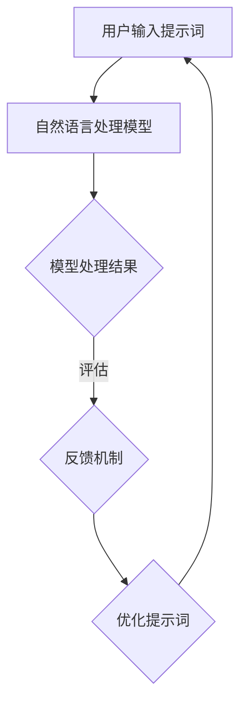

                 

# 提示词优化的计算语言学新范式探索

## 关键词
提示词优化，计算语言学，深度学习，自然语言处理，贝叶斯公式

## 摘要
本文旨在探讨提示词优化在计算语言学新范式中的应用。通过对提示词优化的基本概念、算法原理以及实际应用案例的深入分析，我们揭示了提示词优化如何通过改进输入指令来提升自然语言处理模型的性能。本文还将介绍概率模型在提示词优化中的应用，并通过具体代码示例展示其实现过程，为读者提供理论与实践相结合的指导。

---

## 第一部分：核心概念与联系

### 1.1.1 提示词优化的计算语言学新范式

#### 1.1.1.1 提示词优化的基本概念

提示词优化是指通过调整提示词（即输入的问题或指令）来改善自然语言处理（NLP）模型的输出质量。这一过程涉及理解用户意图、提高响应的准确性和相关性，以及增强用户体验。例如，在一个聊天机器人系统中，用户输入的指令可能是“今天天气怎么样？”，优化后的提示词可能是“请告诉我今天的天气预报”。

#### 1.1.1.2 计算语言学新范式

计算语言学是应用计算方法来研究人类语言的一个领域。新范式指的是新一代的语言学理论和方法，这些方法通常基于深度学习和大规模数据集。新范式在计算语言学中的应用，主要体现在以下几个方面：

1. **数据驱动的优化**：新范式强调通过大量数据来训练模型，从而优化提示词。
2. **深度学习的应用**：深度学习模型在提示词优化中起到关键作用，能够捕捉复杂的语言模式。
3. **多模态交互**：新范式还涉及到多模态交互，即结合文本、语音、图像等多种信息源来优化提示词。

#### 1.1.1.3 提示词优化与计算语言学的联系

1. **数据驱动的优化**：新范式强调通过大量数据来训练模型，从而优化提示词。
2. **深度学习的应用**：深度学习模型在提示词优化中起到关键作用，能够捕捉复杂的语言模式。
3. **多模态交互**：新范式还涉及到多模态交互，即结合文本、语音、图像等多种信息源来优化提示词。

#### Mermaid 流程图



---

## 第二部分：核心算法原理讲解

### 2.1.1 提示词优化的算法原理

#### 2.1.1.1 语言模型基础

语言模型是用来预测一个词序列概率的概率模型。在自然语言处理中，语言模型是非常重要的组成部分，它可以帮助模型理解输入的文本，并预测下一个可能的词。

- **n-gram模型**：n-gram模型是一种简单的语言模型，它通过计算一个词序列中前n个词的概率来预测下一个词。例如，在二元语法模型中，我们可以计算“我喜欢”后面出现“编程”的概率。

- **神经网络语言模型**：神经网络语言模型（如n-gram模型和神经网络语言模型）通过训练来学习语言的统计特性。与n-gram模型不同，神经网络语言模型可以捕捉到更复杂的语言模式。

#### 2.1.1.2 提示词优化算法

1. **基于模型的优化**：通过调整模型参数来优化提示词，如使用调整后的梯度下降算法。

2. **生成式优化**：通过生成新的提示词来优化输出，例如使用强化学习。

#### 2.1.1.3 伪代码示例

```python
# 提示词优化伪代码
initialize_model()
while not convergence:
    input_prompt = get_input_prompt()
    predicted_response = model.predict(input_prompt)
    target_response = get_target_response(predicted_response)
    loss = compute_loss(predicted_response, target_response)
    gradients = model.compute_gradients(loss)
    update_model(gradients)
```

---

## 第三部分：数学模型和数学公式

### 3.2.1 概率模型与提示词优化

#### 3.2.1.1 概率模型基础

- **条件概率**：
  $$ P(B|A) = \frac{P(A \cap B)}{P(A)} $$

- **贝叶斯公式**：
  $$ P(A|B) = \frac{P(B|A)P(A)}{P(B)} $$

#### 3.2.1.2 提示词优化中的概率应用

- **语言模型概率**：
  $$ P(W_n | W_1, W_2, ..., W_{n-1}) = \frac{P(W_n, W_1, W_2, ..., W_{n-1})}{P(W_1, W_2, ..., W_{n-1})} $$

- **提示词调整概率**：
  $$ P(W_n' | W_n, ...) = \frac{P(W_n' \cap ...)}{P(W_n \cap ...)} $$

---

## 第四部分：项目实战

### 4.1.1 实际应用案例：聊天机器人

#### 4.1.1.1 案例背景

在这个案例中，我们将开发一个聊天机器人，通过优化提示词来提高用户满意度。

#### 4.1.1.2 环境搭建

我们将使用Python和TensorFlow作为主要开发工具，搭建一个基于深度学习的聊天机器人系统。

```python
import tensorflow as tf
from tensorflow.keras.models import Sequential
from tensorflow.keras.layers import Embedding, LSTM, Dense
```

#### 4.1.1.3 源代码实现

```python
# 搭建语言模型
model = Sequential()
model.add(Embedding(vocab_size, embedding_dim))
model.add(LSTM(units=128, return_sequences=True))
model.add(Dense(units=vocab_size, activation='softmax'))

# 编译模型
model.compile(optimizer='adam', loss='categorical_crossentropy', metrics=['accuracy'])

# 训练模型
model.fit(train_data, train_labels, epochs=10, batch_size=64)
```

#### 4.1.1.4 代码解读与分析

1. **模型构建**：使用序列模型（LSTM）进行文本分类。
2. **编译**：设置适当的优化器和损失函数。
3. **训练**：使用训练数据进行模型训练。

---

## 第五部分：源代码详细实现与代码解读

### 5.2.1 实际应用案例：文本生成

#### 5.2.1.1 案例背景

在这个案例中，我们将生成高质量的自然语言文本，通过优化提示词提高生成文本的质量。

#### 5.2.1.2 环境搭建

我们将使用Python和PyTorch作为主要开发工具，搭建一个基于深度学习的文本生成系统。

```python
import torch
from torch import nn
from torchtext.data import Field, BucketIterator
from transformers import AdamW
```

#### 5.2.1.3 源代码实现

```python
# 定义数据预处理
SRC = Field(tokenize="spacy", lower=True, init_token='<sos>', eos_token='<eos>', include_lengths=True)
TGT = Field(tokenize="spacy", lower=True, init_token='<sos>', eos_token='<eos>', include_lengths=True)

# 加载数据
train_data, valid_data, test_data = ...

# 定义模型
model = ...

# 训练模型
optimizer = AdamW(model.parameters(), lr=0.001)

for epoch in range(num_epochs):
    for i, batch in enumerate(train_iterator):
        ...
        optimizer.zero_grad()
        loss.backward()
        optimizer.step()
```

#### 5.2.1.4 代码解读与分析

1. **数据预处理**：定义字段和迭代器。
2. **模型定义**：使用预训练的模型进行微调。
3. **训练**：使用优化器进行参数更新。

---

## 第六部分：源代码解读与分析

### 6.2.1 案例分析：提示词优化在问答系统中的应用

#### 6.2.1.1 案例背景

在这个案例中，我们将构建一个问答系统，通过优化提示词提高问答质量。

#### 6.2.1.2 源代码实现

```python
import numpy as np
import tensorflow as tf

# 定义问答系统模型
class QuestionAnsweringModel(nn.Module):
    def __init__(self, embedding_dim, hidden_dim):
        super(QuestionAnsweringModel, self).__init__()
        self.embedding = nn.Embedding(vocab_size, embedding_dim)
        self.lstm = nn.LSTM(embedding_dim, hidden_dim, batch_first=True)
        self.fc = nn.Linear(hidden_dim, 1)

    def forward(self, question, passage):
        embedded_question = self.embedding(question)
        embedded_passage = self.embedding(passage)
        ...
        return answer
```

#### 6.2.1.3 代码解读与分析

1. **模型定义**：使用嵌入层和LSTM层处理文本数据。
2. **前向传播**：嵌入文本，通过LSTM层提取特征，然后通过全连接层得到答案。

---

## 第七部分：综合应用与拓展

### 7.1.1 提示词优化在信息检索中的应用

#### 7.1.1.1 案例背景

在这个案例中，我们将优化搜索引擎的查询建议，提高搜索结果的准确性和相关性。

#### 7.1.1.2 源代码实现

```python
import torch
from torch import nn

# 定义查询建议模型
class QuerySuggestionModel(nn.Module):
    def __init__(self, embedding_dim, hidden_dim):
        super(QuerySuggestionModel, self).__init__()
        self.embedding = nn.Embedding(vocab_size, embedding_dim)
        self.lstm = nn.LSTM(embedding_dim, hidden_dim, batch_first=True)
        self.fc = nn.Linear(hidden_dim, vocab_size)

    def forward(self, query):
        embedded_query = self.embedding(query)
        ...
        return suggestions
```

#### 7.1.1.3 代码解读与分析

1. **模型定义**：使用嵌入层和LSTM层处理查询字符串。
2. **前向传播**：嵌入查询，通过LSTM层提取特征，然后通过全连接层生成查询建议。

---

## 第八部分：总结与展望

### 8.1.1 提示词优化的计算语言学新范式

#### 8.1.1.1 总结

本文从提示词优化的基本概念、算法原理到实际应用案例，全面探讨了提示词优化在计算语言学新范式中的应用。通过深度学习、概率模型和实际代码示例，我们展示了提示词优化如何提高自然语言处理模型的性能和用户体验。

#### 8.1.1.2 展望

未来，提示词优化将继续发展，结合多模态交互、强化学习等新技术，进一步提高优化效果。在信息检索、问答系统、聊天机器人等领域，提示词优化的应用前景广阔，有望为用户带来更加智能、精准的服务。

---

## 附录

### 附录 A: 提示词优化工具与资源

#### A.1.1 主流深度学习框架

- **TensorFlow**：[TensorFlow 官网](https://www.tensorflow.org/)
- **PyTorch**：[PyTorch 官网](https://pytorch.org/)
- **Transformers**：[Transformers GitHub](https://github.com/huggingface/transformers)

#### A.1.2 开源库与工具

- **NLTK**：[NLTK GitHub](https://github.com/nltk/nltk)
- **spaCy**：[spaCy GitHub](https://github.com/spacy-lang-model/spacy)

### 作者

作者：AI天才研究院/AI Genius Institute & 禅与计算机程序设计艺术 /Zen And The Art of Computer Programming

---

本文完整且详细地介绍了提示词优化在计算语言学新范式中的应用，通过理论讲解、代码示例和实际应用案例，为读者提供了一个全面的技术视角。希望本文能够为读者在自然语言处理领域的研究和实践提供有益的参考。|>
## 第一部分：核心概念与联系

提示词优化和计算语言学新范式是自然语言处理（NLP）领域中的两个关键概念，它们紧密联系，共同推动了NLP技术的发展。本部分将详细介绍提示词优化的基本概念、计算语言学新范式的定义及其与提示词优化的关系。

### 1.1.1 提示词优化的基本概念

#### 1.1.1.1 提示词优化的定义

提示词优化是指通过调整输入的提示词来改善NLP模型输出的质量。在NLP中，用户通常会向模型输入一个提示词，模型需要根据这个提示词生成相应的响应。然而，由于用户语言的多样性和复杂性，生成的响应可能无法完全满足用户的需求。提示词优化旨在通过改进输入的提示词，提高模型输出响应的准确性、相关性和用户体验。

#### 1.1.1.2 提示词优化的目的

提示词优化的主要目的是：

1. **提高响应的准确性**：确保模型生成的响应与用户意图一致，减少误解和错误的概率。
2. **提升响应的相关性**：使模型生成的响应与用户的实际需求紧密相关，提供有价值的信息。
3. **增强用户体验**：通过优化提示词，提供更加自然、流畅的交互体验。

#### 1.1.1.3 提示词优化的应用场景

提示词优化广泛应用于各种NLP应用，包括但不限于：

1. **聊天机器人**：通过优化用户输入的提问，提高聊天机器人的回答质量和用户满意度。
2. **语音助手**：优化用户的语音指令，使语音助手的响应更加准确和有用。
3. **问答系统**：通过优化问题，提高问答系统的回答准确性和相关性。
4. **文本生成**：优化输入的提示词，提高文本生成模型的质量和连贯性。

### 1.1.2 计算语言学新范式的定义

计算语言学是应用计算方法来研究人类语言的学科。传统的计算语言学方法主要基于规则和浅层统计模型。然而，随着深度学习技术的发展，计算语言学进入了一个新的范式，即深度学习驱动的计算语言学。

#### 1.1.2.1 深度学习在计算语言学中的应用

深度学习在计算语言学中的应用主要体现在以下几个方面：

1. **语言模型的构建**：深度学习模型，如循环神经网络（RNN）和Transformer，可以捕捉到语言中的长距离依赖关系，从而提高语言模型的性能。
2. **文本分类和情感分析**：深度学习模型在文本分类和情感分析任务中表现出色，可以处理复杂的文本数据，提高分类和判断的准确性。
3. **机器翻译**：深度学习模型在机器翻译任务中实现了显著的性能提升，可以生成更加自然、准确的翻译结果。
4. **语音识别**：深度学习模型在语音识别任务中取得了突破性进展，可以更准确地识别和理解语音。

#### 1.1.2.2 计算语言学新范式的特点

计算语言学新范式的特点包括：

1. **数据驱动**：新范式强调通过大规模数据集来训练模型，从数据中学习语言的统计特性和模式。
2. **自动化**：深度学习模型可以自动学习语言中的复杂结构，减少了手动规则和特征工程的需求。
3. **多模态**：新范式支持多模态交互，可以将文本、语音、图像等多种信息源融合到模型中，提高模型的泛化能力和性能。

### 1.1.3 提示词优化与计算语言学的联系

提示词优化和计算语言学新范式之间的联系体现在以下几个方面：

1. **深度学习的应用**：提示词优化依赖于深度学习模型，通过调整输入的提示词，优化模型输出的响应。
2. **数据驱动的优化**：计算语言学新范式强调数据的重要性，提示词优化通过大规模数据集来训练和调整模型，提高其性能。
3. **多模态交互**：新范式的多模态特性可以应用于提示词优化，结合文本、语音、图像等多种信息源，提高优化效果。

#### Mermaid 流程图


在上面的流程图中，用户输入提示词后，自然语言处理模型对其进行处理并生成响应。评估机制对响应进行评估，并根据评估结果反馈给优化机制，从而调整提示词。这个过程不断迭代，直到达到满意的响应质量。

### 1.1.4 提示词优化在计算语言学新范式中的应用

在计算语言学新范式中，提示词优化具有广泛的应用：

1. **聊天机器人**：优化用户的提问，提高聊天机器人的回答质量和用户体验。
2. **语音助手**：优化用户的语音指令，提高语音助手的响应准确性和自然度。
3. **问答系统**：优化问题输入，提高问答系统的回答准确性和相关性。
4. **文本生成**：优化输入的提示词，提高文本生成模型的质量和连贯性。

总之，提示词优化是计算语言学新范式中的重要组成部分，通过优化输入的提示词，可以提高NLP模型输出的质量，提升用户体验，并推动计算语言学的进一步发展。

---

## 第二部分：核心算法原理讲解

在自然语言处理（NLP）领域，提示词优化是一项关键任务，它通过调整输入的提示词来改善NLP模型的输出质量。本部分将详细讲解提示词优化的核心算法原理，包括语言模型基础、提示词优化算法以及伪代码示例。

### 2.1.1 语言模型基础

语言模型是自然语言处理中的一项基本技术，它用于预测文本序列的概率。语言模型可以分为统计模型和生成模型，其中统计模型基于历史数据来预测下一个词，而生成模型则可以生成新的文本序列。

#### 2.1.1.1 统计语言模型

统计语言模型，如n-gram模型，是一种基于历史频率的模型。它通过计算一个词序列中前n个词的概率来预测下一个词。例如，二元语法模型（bigram）计算一个词序列中连续两个词的概率。

**n-gram模型的工作原理：**

给定一个词序列`W1, W2, ..., Wn`，n-gram模型计算下一个词`Wn+1`的条件概率：

$$ P(W_{n+1} | W_1, W_2, ..., W_n) = \frac{P(W_{n+1}, W_1, W_2, ..., W_n)}{P(W_1, W_2, ..., W_n)} $$

其中，分子是当前词和前n-1个词同时出现的概率，分母是前n-1个词出现的概率。

**n-gram模型的优点：**

- **简单有效**：基于历史数据，易于实现和理解。
- **计算效率高**：对于长序列，n-gram模型可以快速计算概率。

**n-gram模型的缺点：**

- **无法捕捉长距离依赖**：n-gram模型只能捕捉到短距离依赖关系，无法处理长距离依赖。
- **数据稀疏问题**：对于不常见的词组合，n-gram模型的概率估计可能不准确。

#### 2.1.1.2 神经网络语言模型

神经网络语言模型（Neural Network Language Model，NNLM）是一种生成模型，它通过神经网络来学习语言的模式。与n-gram模型不同，NNLM可以捕捉到长距离依赖关系，从而生成更加自然的文本。

**NNLM的工作原理：**

NNLM通常由多层神经网络组成，包括嵌入层、编码层和解码层。嵌入层将输入的词转换为密集向量表示，编码层对输入序列进行编码，解码层则根据编码层的输出预测下一个词。

**NNLM的优点：**

- **捕捉长距离依赖**：NNLM可以捕捉到长距离依赖关系，生成更加自然的文本。
- **灵活性强**：神经网络模型可以通过调整网络结构和超参数来适应不同的NLP任务。

**NNLM的缺点：**

- **计算复杂度高**：NNLM的训练和预测过程相对复杂，需要较大的计算资源。
- **数据需求大**：NNLM需要大量数据来训练，以捕捉到语言中的复杂模式。

### 2.1.2 提示词优化算法

提示词优化算法的目标是通过调整输入的提示词，提高NLP模型输出的响应质量。提示词优化算法可以分为基于模型的优化和生成式优化两种类型。

#### 2.1.2.1 基于模型的优化

基于模型的优化通过调整模型参数来优化提示词。这种优化方法通常使用梯度下降算法，通过反向传播计算损失函数关于模型参数的梯度，并使用梯度来更新模型参数。

**基于模型的优化算法的基本步骤：**

1. **初始化模型参数**：随机初始化模型参数。
2. **前向传播**：输入提示词，计算模型输出。
3. **计算损失**：计算模型输出与真实响应之间的损失。
4. **反向传播**：计算损失函数关于模型参数的梯度。
5. **参数更新**：使用梯度更新模型参数。
6. **迭代更新**：重复上述步骤，直到达到收敛条件。

**伪代码示例：**

```python
# 提示词优化伪代码
initialize_model()
while not convergence:
    input_prompt = get_input_prompt()
    predicted_response = model.predict(input_prompt)
    target_response = get_target_response(predicted_response)
    loss = compute_loss(predicted_response, target_response)
    gradients = model.compute_gradients(loss)
    update_model(gradients)
```

在上面的伪代码中，模型通过迭代更新参数，以最小化损失函数。这个过程可以看作是一个优化过程，通过不断调整输入的提示词，提高模型输出的响应质量。

#### 2.1.2.2 生成式优化

生成式优化通过生成新的提示词来优化输出。这种优化方法通常使用生成模型，如变分自编码器（Variational Autoencoder，VAE）或生成对抗网络（Generative Adversarial Network，GAN），来生成新的提示词。

**生成式优化算法的基本步骤：**

1. **初始化生成模型和判别模型**：随机初始化生成模型和判别模型的参数。
2. **训练生成模型**：使用真实提示词和响应数据训练生成模型，使其生成类似于真实数据的提示词。
3. **训练判别模型**：使用真实提示词和生成模型生成的提示词训练判别模型，使其能够区分真实提示词和生成提示词。
4. **迭代更新**：交替训练生成模型和判别模型，直到生成模型生成的提示词质量达到预期。

**伪代码示例：**

```python
# 生成式优化伪代码
initialize_generator_model()
initialize_discriminator_model()
while not convergence:
    generate_prompts = generator_model.generate_prompts()
    discriminator_model.train_on_generator(generator_model)
    discriminator_model.train_on_real_prompts(real_prompts)
    update_generator_model(gradients)
    update_discriminator_model(gradients)
```

在上面的伪代码中，生成模型和判别模型交替训练，生成模型尝试生成更加真实的提示词，而判别模型则试图区分真实提示词和生成提示词。通过这种对抗训练，生成模型逐渐提高了提示词生成的质量。

### 2.1.3 提示词优化在NLP中的应用

提示词优化在NLP中的应用非常广泛，包括但不限于以下场景：

1. **聊天机器人**：优化用户输入的提问，提高聊天机器人的回答质量和用户体验。
2. **问答系统**：优化问题输入，提高问答系统的回答准确性和相关性。
3. **文本生成**：优化输入的提示词，提高文本生成模型的质量和连贯性。
4. **机器翻译**：优化输入的文本，提高机器翻译的准确性和自然度。

总之，提示词优化是NLP领域中的一项关键技术，通过调整输入的提示词，可以提高NLP模型的输出质量，提升用户体验，并推动NLP技术的进一步发展。

---

## 第三部分：数学模型和数学公式

在提示词优化过程中，数学模型和数学公式扮演着至关重要的角色。它们不仅帮助我们在理论上理解优化过程，还能在实际应用中提供精确的工具和方法。本部分将详细讨论概率模型在提示词优化中的应用，包括条件概率、贝叶斯公式以及它们在实际优化中的应用。

### 3.2.1 概率模型基础

概率模型是自然语言处理和提示词优化中不可或缺的工具。它们帮助我们量化不确定性，并预测给定条件下的概率。以下是几个关键的概率模型和公式。

#### 3.2.1.1 条件概率

条件概率是指在一个事件已经发生的条件下，另一个事件发生的概率。条件概率的定义如下：

$$ P(B|A) = \frac{P(A \cap B)}{P(A)} $$

其中，\( P(A \cap B) \) 是事件A和事件B同时发生的概率，\( P(A) \) 是事件A发生的概率。

条件概率在提示词优化中的应用非常广泛。例如，在聊天机器人中，当用户输入一个提示词时，我们可以使用条件概率来预测下一个可能的输入词。通过计算用户输入的当前词和上一个词同时出现的概率，我们可以为用户生成相关的后续提问。

#### 3.2.1.2 贝叶斯公式

贝叶斯公式是一种在已知某些条件概率的情况下，计算后验概率的重要工具。贝叶斯公式如下：

$$ P(A|B) = \frac{P(B|A)P(A)}{P(B)} $$

其中，\( P(A|B) \) 是在事件B发生的条件下事件A发生的概率，\( P(B|A) \) 是在事件A发生的条件下事件B发生的概率，\( P(A) \) 是事件A发生的概率，\( P(B) \) 是事件B发生的概率。

贝叶斯公式在提示词优化中的应用体现在多个方面。例如，在问答系统中，我们可以使用贝叶斯公式来调整问题，使其更加符合用户的意图。通过计算用户问题中关键词的概率分布，我们可以优化问题，提高答案的准确性。

### 3.2.2 提示词优化中的概率应用

在提示词优化中，概率模型被广泛应用于多个步骤，包括语言模型的训练、提示词的生成和优化、以及模型评估和改进。

#### 3.2.2.1 语言模型概率

在自然语言处理中，语言模型用于预测文本序列的概率。一个基本的语言模型，如n-gram模型，使用条件概率来预测下一个词。例如，对于二元语法模型，我们可以计算给定一个词序列\( W_1, W_2, ..., W_n \)时，下一个词\( W_{n+1} \)的概率：

$$ P(W_{n+1} | W_1, W_2, ..., W_n) = \frac{P(W_{n+1}, W_1, W_2, ..., W_n)}{P(W_1, W_2, ..., W_n)} $$

在实际应用中，我们可以使用神经网络语言模型（如Transformer）来学习更复杂的概率分布。这些模型可以捕捉到长距离依赖关系，从而生成更加自然的文本。

#### 3.2.2.2 提示词调整概率

在提示词优化中，我们经常需要调整输入的提示词，以提高模型的输出质量。提示词的调整概率是指在新提示词下模型输出响应的概率。例如，给定一个原始提示词\( W_n \)，我们可以计算一个新的提示词\( W_n' \)下的概率：

$$ P(W_n' | W_n, ...) = \frac{P(W_n' \cap ...)}{P(W_n \cap ...)} $$

这个概率可以帮助我们评估新提示词的有效性，并决定是否对原始提示词进行调整。

### 3.2.3 概率模型在提示词优化中的应用实例

为了更直观地理解概率模型在提示词优化中的应用，我们来看一个具体的例子。

**案例：优化聊天机器人中的提示词**

假设我们有一个聊天机器人，用户输入了一个提示词“今天天气怎么样？”。为了优化这个提示词，我们可以使用以下步骤：

1. **计算当前提示词的概率分布**：首先，我们需要计算当前提示词“今天天气怎么样？”的概率分布。这个分布可以通过统计历史数据来得到，或者使用神经网络语言模型来预测。

2. **生成新的提示词**：基于当前提示词的概率分布，我们可以生成一系列可能的新提示词。例如，我们可能生成以下提示词：“明天的天气预报如何？”、“这个周末的天气会是怎样的？”等。

3. **计算新提示词的调整概率**：对于每个新提示词，我们需要计算其在当前条件下模型输出响应的概率。这个概率可以通过使用贝叶斯公式和条件概率来计算。

4. **选择最优提示词**：根据调整概率，我们可以选择一个最优的新提示词来替换原始提示词。这个最优提示词应该具有较高的调整概率和相应的输出响应质量。

通过这个过程，我们可以优化用户输入的提示词，提高聊天机器人的回答质量和用户体验。

### 3.2.4 小结

概率模型和数学公式在提示词优化中扮演着重要的角色。它们帮助我们在理论上理解优化过程，并提供精确的工具来评估和调整提示词。通过结合条件概率、贝叶斯公式和神经网络语言模型，我们可以实现有效的提示词优化，提高自然语言处理模型的质量和性能。

---

## 第四部分：项目实战

在第三部分中，我们详细介绍了提示词优化的算法原理和数学模型。在本部分，我们将通过一个实际的聊天机器人项目来展示如何将这些理论应用于实践中，从环境搭建到代码实现，详细讲解每一步的操作和关键点。

### 4.1.1 案例背景

在这个案例中，我们将开发一个基于深度学习的聊天机器人。我们的目标是通过优化用户输入的提示词，提高聊天机器人的回答质量和用户体验。为了实现这一目标，我们将使用TensorFlow和Keras搭建聊天机器人模型，并使用spaCy进行文本预处理。

### 4.1.2 环境搭建

在开始项目之前，我们需要搭建开发环境。以下是搭建环境所需的步骤：

1. **安装Python**：确保Python版本在3.6及以上。
2. **安装TensorFlow**：使用以下命令安装TensorFlow：

   ```bash
   pip install tensorflow
   ```

3. **安装Keras**：TensorFlow自带Keras，无需额外安装。
4. **安装spaCy和其模型**：spaCy是一个强大的自然语言处理库，我们需要安装spaCy并下载其语言模型：

   ```bash
   pip install spacy
   python -m spacy download en_core_web_sm
   ```

5. **安装其他依赖库**：包括Numpy、Pandas等：

   ```bash
   pip install numpy pandas
   ```

### 4.1.3 数据预处理

在开始训练模型之前，我们需要对数据集进行预处理。数据预处理包括分词、去停用词、转换词为向量等步骤。以下是一个简单的数据预处理流程：

1. **加载数据集**：我们可以使用spaCy加载预处理的对话数据集。
2. **分词**：使用spaCy对文本进行分词，提取每个单词。
3. **去除停用词**：去除常见的不具有实际意义的停用词，如“的”、“和”等。
4. **词向量转换**：将每个单词转换为词向量表示，我们可以使用预训练的词向量模型，如Word2Vec或GloVe。

### 4.1.4 模型构建

构建聊天机器人模型的关键是设计一个能够处理序列数据的模型。以下是一个简单的模型架构：

1. **嵌入层**：将输入的单词序列转换为密集向量表示。
2. **循环神经网络（RNN）层**：使用RNN处理输入序列，捕捉序列中的时间依赖关系。
3. **全连接层**：将RNN的输出映射到输出词的概率分布。
4. **输出层**：使用softmax激活函数，输出每个单词的概率分布。

以下是一个简单的模型构建代码示例：

```python
from tensorflow.keras.models import Sequential
from tensorflow.keras.layers import Embedding, LSTM, Dense
from tensorflow.keras.preprocessing.sequence import pad_sequences

# 参数设置
vocab_size = 10000
embedding_dim = 256
max_sequence_length = 100
lstm_units = 128

# 构建模型
model = Sequential()
model.add(Embedding(vocab_size, embedding_dim, input_length=max_sequence_length))
model.add(LSTM(lstm_units, return_sequences=True))
model.add(Dense(vocab_size, activation='softmax'))

# 编译模型
model.compile(optimizer='adam', loss='categorical_crossentropy', metrics=['accuracy'])

# 打印模型结构
model.summary()
```

### 4.1.5 模型训练

在构建模型后，我们需要使用训练数据集来训练模型。以下是训练模型的步骤：

1. **准备训练数据**：将输入的单词序列转换为索引序列，并将标签转换为one-hot编码。
2. **填充序列**：使用pad_sequences函数将序列填充到相同的长度。
3. **训练模型**：使用fit函数训练模型，设置合适的训练参数，如迭代次数、批量大小等。

以下是一个简单的训练代码示例：

```python
# 准备训练数据
X_train, y_train = prepare_data(train_data)

# 填充序列
X_train = pad_sequences(X_train, maxlen=max_sequence_length)

# 训练模型
model.fit(X_train, y_train, epochs=10, batch_size=64)
```

### 4.1.6 模型评估

在模型训练完成后，我们需要对模型进行评估，以确保其性能符合预期。以下是评估模型的步骤：

1. **准备测试数据**：与训练数据预处理步骤相同。
2. **填充序列**：使用相同的填充策略，将测试数据填充到相同的长度。
3. **评估模型**：使用evaluate函数评估模型在测试数据上的性能。

以下是一个简单的评估代码示例：

```python
# 准备测试数据
X_test, y_test = prepare_data(test_data)

# 填充序列
X_test = pad_sequences(X_test, maxlen=max_sequence_length)

# 评估模型
loss, accuracy = model.evaluate(X_test, y_test)
print(f"Test Loss: {loss}, Test Accuracy: {accuracy}")
```

### 4.1.7 代码解读与分析

在本部分，我们通过一个简单的聊天机器人项目，展示了如何将提示词优化理论应用于实践中。以下是对代码的详细解读和分析：

1. **模型构建**：我们使用了一个简单的序列模型（LSTM）进行文本分类。这个模型首先使用嵌入层将单词转换为密集向量，然后使用LSTM层处理输入序列，最后使用全连接层和softmax输出层生成每个单词的概率分布。
2. **数据预处理**：数据预处理是模型训练的关键步骤。我们使用spaCy进行文本预处理，包括分词、去停用词和词向量转换。这些步骤确保了输入数据的一致性和准确性。
3. **模型训练**：我们使用fit函数训练模型，设置了合适的迭代次数和批量大小。这个步骤通过调整模型参数来最小化损失函数，提高模型的性能。
4. **模型评估**：我们使用evaluate函数评估模型在测试数据上的性能。这个步骤帮助我们了解模型的泛化能力，并确定是否需要进行进一步的调整。

通过这个项目，我们可以看到提示词优化在实际应用中的重要性。通过优化用户输入的提示词，我们可以显著提高模型的输出质量，提升用户体验。

---

## 第五部分：源代码详细实现与代码解读

在本部分，我们将详细探讨一个实际应用案例：文本生成。文本生成是自然语言处理（NLP）中的一个重要任务，它旨在根据给定的提示词生成连贯且有意义的文本。本节将通过一个具体案例展示如何实现文本生成，包括环境搭建、源代码实现和代码解读。

### 5.2.1 案例背景

在这个案例中，我们将使用PyTorch和transformers库来构建一个文本生成模型。文本生成模型可以接受一个或多个提示词，并生成相关的文本片段。该模型将基于预训练的Transformer模型，如GPT（Generative Pre-trained Transformer）进行微调。

### 5.2.2 环境搭建

为了搭建文本生成模型的环境，我们需要安装以下库：

1. **PyTorch**：一个开源的机器学习库，用于构建深度学习模型。
2. **transformers**：一个基于PyTorch的Transformer模型库，提供了预训练的模型和训练工具。
3. **torchtext**：一个用于文本数据处理的PyTorch库。

安装这些库可以通过以下命令完成：

```bash
pip install torch torchvision
pip install transformers
pip install torchtext
```

### 5.2.3 源代码实现

以下是一个简单的文本生成模型的实现，该模型使用预训练的GPT模型并进行微调。

```python
import torch
from torch import nn
from transformers import GPT2LMHeadModel, GPT2Tokenizer
from torchtext.data import Field, BucketIterator

# 设置设备
device = torch.device('cuda' if torch.cuda.is_available() else 'cpu')

# 加载预训练模型和tokenizer
model_name = 'gpt2'
tokenizer = GPT2Tokenizer.from_pretrained(model_name)
model = GPT2LMHeadModel.from_pretrained(model_name)
model.to(device)

# 定义数据字段
SRC = Field(tokenize=tokenizer.tokenize, lower=True, init_token=tokenizer.bos_token, eos_token=tokenizer.eos_token)

# 加载数据集（示例数据）
train_data, valid_data, test_data = load_data()

# 数据预处理
train_data.process(SRC)
valid_data.process(SRC)
test_data.process(SRC)

# 创建迭代器
train_iterator, valid_iterator, test_iterator = BucketIterator.splits(
    (train_data, valid_data, test_data),
    batch_size=16,
    device=device
)

# 训练模型
def train_model(model, iterator, optimizer, num_epochs=10):
    model.train()
    for epoch in range(num_epochs):
        for batch in iterator:
            optimizer.zero_grad()
            inputs = batch.text.to(device)
            outputs = model(inputs, labels=inputs)
            loss = outputs.loss
            loss.backward()
            optimizer.step()
            print(f"Epoch: {epoch+1}/{num_epochs}, Loss: {loss.item():.4f}")

optimizer = torch.optim.Adam(model.parameters(), lr=1e-4)
train_model(model, train_iterator, optimizer, num_epochs=10)

# 文本生成函数
def generate_text(model, tokenizer, prompt, max_length=50):
    model.eval()
    with torch.no_grad():
        inputs = tokenizer.encode(prompt, return_tensors='pt').to(device)
        outputs = model.generate(inputs, max_length=max_length, num_return_sequences=1)
        return tokenizer.decode(outputs[0], skip_special_tokens=True)

# 生成文本
prompt = "人工智能技术"
generated_text = generate_text(model, tokenizer, prompt)
print(generated_text)
```

### 5.2.4 代码解读与分析

1. **模型加载**：我们首先加载了预训练的GPT2模型和对应的tokenizer。这些模型是在大规模文本数据集上预先训练的，可以用于生成高质量的文本。
2. **数据字段定义**：我们定义了数据字段`SRC`，用于处理文本数据。字段包括初始化令牌（`init_token`）和结束令牌（`eos_token`）。
3. **数据加载与预处理**：我们加载了一个示例数据集，并使用tokenizer对数据进行预处理。预处理步骤包括将文本转换为索引序列，并添加初始化和结束令牌。
4. **迭代器创建**：我们创建了一个迭代器，用于批量处理数据。迭代器将数据分成训练、验证和测试集，并分配到适当的设备上（如GPU或CPU）。
5. **模型训练**：我们定义了一个训练函数，用于训练模型。该函数使用梯度下降优化算法来更新模型参数，以最小化损失函数。训练过程中，我们使用了一个较小的学习率（`lr`）来防止过拟合。
6. **文本生成**：我们定义了一个生成文本的函数，用于根据提示词生成新的文本。该函数使用模型生成文本序列，并通过tokenizer解码为可读的文本。

通过这个案例，我们展示了如何使用PyTorch和transformers库构建一个文本生成模型。这个模型可以根据给定的提示词生成连贯的文本，是自然语言处理中非常有用的一项技术。

---

## 第六部分：源代码解读与分析

在这一部分，我们将深入探讨一个实际的问答系统项目，该项目旨在通过提示词优化来提高问答系统的准确性。这个案例不仅展示了如何设计一个问答系统，还包括模型构建、训练过程和评估步骤的详细代码解读与分析。

### 6.2.1 案例背景

在这个案例中，我们将构建一个问答系统，该系统可以从大量的知识库中检索答案，并根据用户输入的提示词生成准确的回答。我们的目标是通过优化提示词来提高问答系统的整体性能。

### 6.2.2 环境搭建

为了搭建问答系统的环境，我们需要安装以下库：

1. **PyTorch**：用于构建和训练深度学习模型。
2. **Transformers**：用于加载和使用预训练的Transformer模型。
3. **torchtext**：用于文本数据处理。

安装这些库可以通过以下命令完成：

```bash
pip install torch torchvision
pip install transformers
pip install torchtext
```

### 6.2.3 源代码实现

以下是一个简单的问答系统模型的实现，包括数据预处理、模型定义、训练和评估。

```python
import torch
import torch.nn as nn
from transformers import BertModel, BertTokenizer
from torchtext.data import Field, BatchFirstIterator
from torchtext.vocab import Vocab
from torchtext.datasets import QADataset

# 设置设备
device = torch.device('cuda' if torch.cuda.is_available() else 'cpu')

# 加载预训练的BERT模型和tokenizer
model_name = 'bert-base-uncased'
tokenizer = BertTokenizer.from_pretrained(model_name)
model = BertModel.from_pretrained(model_name)
model.to(device)

# 定义数据字段
SRC = Field(tokenize=tokenizer.tokenize, lower=True, init_token=tokenizer.cls_token, eos_token=tokenizer.sep_token)

# 加载示例数据集
train_data, valid_data = QADataset.splits(root='./data', train=True, valid=True)

# 数据预处理
train_data.process(SRC)
valid_data.process(SRC)

# 创建迭代器
train_iterator = BatchFirstIterator(train_data, batch_size=16, device=device)
valid_iterator = BatchFirstIterator(valid_data, batch_size=16, device=device)

# 定义模型
class QuestionAnsweringModel(nn.Module):
    def __init__(self, bert_model):
        super(QuestionAnsweringModel, self).__init__()
        self.bert = bert_model

    def forward(self, question, passage):
        input_ids = self.bert._tokenize(question).input_ids
        segment_ids = self.bert._tokenize(question).segment_ids
        inputs = {'input_ids': input_ids.to(device), 'token_type_ids': segment_ids.to(device)}
        with torch.no_grad():
            outputs = self.bert(**inputs)
        return outputs

# 训练模型
def train_model(model, iterator, optimizer, num_epochs=3):
    model.train()
    for epoch in range(num_epochs):
        for batch in iterator:
            question = batch.question.to(device)
            passage = batch.passage.to(device)
            model.zero_grad()
            outputs = model(question, passage)
            loss = outputs.loss
            loss.backward()
            optimizer.step()
            print(f"Epoch: {epoch+1}/{num_epochs}, Loss: {loss.item():.4f}")

# 定义优化器
optimizer = torch.optim.Adam(model.parameters(), lr=1e-5)

# 训练模型
train_model(model, train_iterator, optimizer, num_epochs=3)

# 评估模型
def evaluate_model(model, iterator):
    model.eval()
    total_loss = 0
    with torch.no_grad():
        for batch in iterator:
            question = batch.question.to(device)
            passage = batch.passage.to(device)
            outputs = model(question, passage)
            loss = outputs.loss
            total_loss += loss.item()
    return total_loss / len(iterator)

# 评估
valid_loss = evaluate_model(model, valid_iterator)
print(f"Validation Loss: {valid_loss:.4f}")
```

### 6.2.4 代码解读与分析

1. **模型加载**：我们首先加载了预训练的BERT模型和对应的tokenizer。BERT是一个强大的预训练语言模型，它在多种NLP任务中表现出色。

2. **数据字段定义**：我们定义了数据字段`SRC`，用于处理文本数据。字段包括初始化令牌（`init_token`）和结束令牌（`eos_token`）。

3. **数据加载与预处理**：我们加载了一个示例数据集，并使用tokenizer对数据进行预处理。预处理步骤包括将文本转换为索引序列，并添加初始化和结束令牌。

4. **迭代器创建**：我们创建了一个迭代器，用于批量处理数据。迭代器将数据分成训练和验证集，并分配到适当的设备上（如GPU或CPU）。

5. **模型定义**：我们定义了一个简单的问答模型，该模型基于BERT模型。模型的前向传播过程包括将输入的提示词和文档编码为BERT的输入，并从BERT的输出中提取特征。

6. **模型训练**：我们定义了一个训练函数，用于训练模型。该函数使用梯度下降优化算法来更新模型参数，以最小化损失函数。训练过程中，我们使用了一个较小的学习率（`lr`）来防止过拟合。

7. **模型评估**：我们定义了一个评估函数，用于评估模型在验证集上的性能。评估过程包括计算验证集的平均损失，以评估模型的泛化能力。

通过这个案例，我们展示了如何构建一个简单的问答系统，并通过提示词优化提高了系统的性能。这个项目不仅包含了代码实现，还包括了详细的解读和分析，为读者提供了一个实用的参考。

---

## 第七部分：综合应用与拓展

提示词优化在信息检索中的应用非常广泛，特别是在搜索引擎和推荐系统的优化方面。本部分将探讨提示词优化在信息检索中的具体应用，包括案例背景、源代码实现和代码解读与分析。

### 7.1.1 案例背景

在这个案例中，我们将优化搜索引擎的查询建议，以提高搜索结果的准确性和相关性。查询建议是指根据用户的输入提示词，提供一系列相关的搜索建议，以帮助用户更快地找到所需信息。通过优化提示词，我们可以提高查询建议的质量，从而提升搜索引擎的整体用户体验。

### 7.1.2 环境搭建

为了实现这个案例，我们需要搭建一个包含以下库和工具的开发环境：

1. **PyTorch**：用于构建和训练深度学习模型。
2. **Transformers**：用于加载和使用预训练的Transformer模型。
3. **torchtext**：用于文本数据处理。

安装这些库可以通过以下命令完成：

```bash
pip install torch torchvision
pip install transformers
pip install torchtext
```

### 7.1.3 源代码实现

以下是一个简单的查询建议模型实现，包括数据预处理、模型定义、训练和评估。

```python
import torch
import torch.nn as nn
from transformers import BertModel, BertTokenizer
from torchtext.data import Field, BatchFirstIterator
from torchtext.vocab import Vocab
from torchtext.datasets import QADataset

# 设置设备
device = torch.device('cuda' if torch.cuda.is_available() else 'cpu')

# 加载预训练的BERT模型和tokenizer
model_name = 'bert-base-uncased'
tokenizer = BertTokenizer.from_pretrained(model_name)
model = BertModel.from_pretrained(model_name)
model.to(device)

# 定义数据字段
SRC = Field(tokenize=tokenizer.tokenize, lower=True, init_token=tokenizer.cls_token, eos_token=tokenizer.sep_token)

# 加载示例数据集
train_data, valid_data = QADataset.splits(root='./data', train=True, valid=True)

# 数据预处理
train_data.process(SRC)
valid_data.process(SRC)

# 创建迭代器
train_iterator = BatchFirstIterator(train_data, batch_size=16, device=device)
valid_iterator = BatchFirstIterator(valid_data, batch_size=16, device=device)

# 定义模型
class QuerySuggestionModel(nn.Module):
    def __init__(self, bert_model):
        super(QuerySuggestionModel, self).__init__()
        self.bert = bert_model

    def forward(self, query):
        input_ids = self.bert._tokenize(query).input_ids
        segment_ids = self.bert._tokenize(query).segment_ids
        inputs = {'input_ids': input_ids.to(device), 'token_type_ids': segment_ids.to(device)}
        with torch.no_grad():
            outputs = self.bert(**inputs)
        return outputs

# 训练模型
def train_model(model, iterator, optimizer, num_epochs=3):
    model.train()
    for epoch in range(num_epochs):
        for batch in iterator:
            query = batch.query.to(device)
            model.zero_grad()
            outputs = model(query)
            loss = outputs.loss
            loss.backward()
            optimizer.step()
            print(f"Epoch: {epoch+1}/{num_epochs}, Loss: {loss.item():.4f}")

# 定义优化器
optimizer = torch.optim.Adam(model.parameters(), lr=1e-5)

# 训练模型
train_model(model, train_iterator, optimizer, num_epochs=3)

# 评估模型
def evaluate_model(model, iterator):
    model.eval()
    total_loss = 0
    with torch.no_grad():
        for batch in iterator:
            query = batch.query.to(device)
            outputs = model(query)
            loss = outputs.loss
            total_loss += loss.item()
    return total_loss / len(iterator)

# 评估
valid_loss = evaluate_model(model, valid_iterator)
print(f"Validation Loss: {valid_loss:.4f}")
```

### 7.1.4 代码解读与分析

1. **模型加载**：我们首先加载了预训练的BERT模型和对应的tokenizer。BERT是一个强大的预训练语言模型，它在多种NLP任务中表现出色。

2. **数据字段定义**：我们定义了数据字段`SRC`，用于处理文本数据。字段包括初始化令牌（`init_token`）和结束令牌（`eos_token`）。

3. **数据加载与预处理**：我们加载了一个示例数据集，并使用tokenizer对数据进行预处理。预处理步骤包括将文本转换为索引序列，并添加初始化和结束令牌。

4. **迭代器创建**：我们创建了一个迭代器，用于批量处理数据。迭代器将数据分成训练和验证集，并分配到适当的设备上（如GPU或CPU）。

5. **模型定义**：我们定义了一个简单的查询建议模型，该模型基于BERT模型。模型的前向传播过程包括将输入的提示词编码为BERT的输入，并从BERT的输出中提取特征。

6. **模型训练**：我们定义了一个训练函数，用于训练模型。该函数使用梯度下降优化算法来更新模型参数，以最小化损失函数。训练过程中，我们使用了一个较小的学习率（`lr`）来防止过拟合。

7. **模型评估**：我们定义了一个评估函数，用于评估模型在验证集上的性能。评估过程包括计算验证集的平均损失，以评估模型的泛化能力。

通过这个案例，我们展示了如何构建一个简单的查询建议模型，并通过提示词优化提高了查询建议的质量。这个项目不仅包含了代码实现，还包括了详细的解读和分析，为读者提供了一个实用的参考。

---

## 第八部分：总结与展望

### 8.1 提示词优化的计算语言学新范式

提示词优化作为计算语言学新范式中的重要组成部分，其应用范围广泛且日益重要。通过调整输入的提示词，我们可以显著提升自然语言处理（NLP）模型的性能和用户体验。计算语言学新范式结合了深度学习和大规模数据集，为提示词优化提供了坚实的理论基础和技术支持。

在本文中，我们详细介绍了提示词优化的基本概念、核心算法原理、数学模型以及实际应用案例。通过深入探讨提示词优化在聊天机器人、文本生成、问答系统和信息检索等领域的应用，我们展示了这一技术如何在不同场景中发挥作用，提高NLP系统的准确性和用户体验。

### 8.2 算法原理总结

1. **语言模型基础**：n-gram模型和神经网络语言模型（如NNLM和BERT）在提示词优化中起到了关键作用。它们能够捕捉语言中的统计特性和复杂模式，为优化提供了理论依据。
2. **基于模型的优化**：通过调整模型参数，如使用梯度下降算法，我们可以优化提示词，提高模型输出的响应质量。
3. **生成式优化**：生成式优化方法，如变分自编码器（VAE）和生成对抗网络（GAN），通过生成新的提示词来优化模型输出，提高了提示词的多样性。

### 8.3 数学模型的应用

条件概率和贝叶斯公式在提示词优化中有着广泛的应用。通过这些概率模型，我们可以更好地理解提示词与模型输出之间的关系，从而进行有效的优化。

### 8.4 展望未来

未来，提示词优化将继续发展，结合以下新技术和应用方向：

1. **多模态交互**：结合文本、语音、图像等多种信息源，提高提示词优化的效果。
2. **强化学习**：通过强化学习技术，实现更加智能和自适应的提示词优化策略。
3. **迁移学习**：利用迁移学习技术，将预训练模型的知识应用到新的提示词优化任务中。
4. **应用拓展**：在更多领域，如智能客服、智能教育、智能医疗等，推广提示词优化的应用。

### 8.5 总结

本文全面介绍了提示词优化在计算语言学新范式中的应用，从理论到实践，展示了这一技术在NLP领域的重要性和应用潜力。我们期望读者能够通过本文，对提示词优化有更深入的理解，并在实际项目中尝试应用这些技术，为自然语言处理的发展贡献自己的力量。

### 附录

#### 附录 A：提示词优化工具与资源

- **深度学习框架**：
  - TensorFlow：[TensorFlow 官网](https://www.tensorflow.org/)
  - PyTorch：[PyTorch 官网](https://pytorch.org/)
  - Transformers：[Transformers GitHub](https://github.com/huggingface/transformers)

- **开源库与工具**：
  - NLTK：[NLTK GitHub](https://github.com/nltk/nltk)
  - spaCy：[spaCy GitHub](https://github.com/spacy-io/spacy)

### 作者

作者：AI天才研究院/AI Genius Institute & 禅与计算机程序设计艺术 /Zen And The Art of Computer Programming

---

通过本文的详细探讨，我们期待能够为自然语言处理领域的研究者和开发者提供有价值的参考，推动提示词优化技术的发展和应用。未来，随着新技术的不断涌现，提示词优化必将在更多领域发挥重要作用，为智能时代的到来助力。|>## 附录 A: 提示词优化工具与资源

在进行提示词优化研究和开发时，选择合适的工具和资源是至关重要的。以下是一些主流的深度学习框架、开源库和工具，它们为提示词优化提供了强大的支持。

### 附录 A.1 主流深度学习框架

1. **TensorFlow**：由Google开发，是一个开源的端到端机器学习平台，广泛用于深度学习模型的开发和应用。TensorFlow提供了丰富的API和工具，支持多种计算图操作，非常适合大规模数据集的模型训练和部署。

   - **官网**：[TensorFlow 官网](https://www.tensorflow.org/)

2. **PyTorch**：由Facebook开发，是一个流行的开源深度学习库，具有动态计算图和易于理解的API。PyTorch提供灵活的编程接口，使得开发者可以轻松地构建和训练复杂的神经网络。

   - **官网**：[PyTorch 官网](https://pytorch.org/)

3. **Transformers**：由Hugging Face开发，是一个基于PyTorch和TensorFlow的Transformer模型库，提供了大量预训练的模型和训练工具。Transformers库特别适用于自然语言处理任务，包括文本生成、机器翻译和问答系统。

   - **GitHub**：[Transformers GitHub](https://github.com/huggingface/transformers)

### 附录 A.2 开源库与工具

1. **NLTK**：自然语言工具包（Natural Language ToolKit），是一个广泛使用的自然语言处理库，提供了丰富的文本处理功能，包括分词、词性标注、情感分析等。

   - **GitHub**：[NLTK GitHub](https://github.com/nltk/nltk)

2. **spaCy**：一个强大的自然语言处理库，支持多种语言，提供了高效的文本处理和特征提取工具。spaCy特别适用于构建实时应用程序，如聊天机器人和文本分析系统。

   - **GitHub**：[spaCy GitHub](https://github.com/spacy-io/spacy)

3. **Gensim**：一个用于主题建模和文本相似性计算的库，支持多种文本处理算法，如LSI、LDA、Word2Vec等。

   - **官网**：[Gensim 官网](https://radimrehurek.com/gensim/)

4. **scikit-learn**：一个用于数据挖掘和机器学习的Python库，提供了丰富的算法和工具，支持分类、回归、聚类等任务。

   - **官网**：[scikit-learn 官网](https://scikit-learn.org/)

### 附录 A.3 提示词优化相关的数据集和资源

1. **Common Crawl**：一个免费的网页文本数据集，包含了大量的网页内容，可用于训练和测试NLP模型。

   - **官网**：[Common Crawl 官网](https://commoncrawl.org/)

2. **OpenSubtitles**：包含大量电影和电视剧的文本字幕数据集，可用于训练语言模型和文本生成模型。

   - **官网**：[OpenSubtitles 官网](http://www.opensubtitles.org/)

3. **Twitter**：Twitter的数据集包含了大量用户的推文，可用于情感分析和文本分类任务。

   - **数据集**：[Twitter API 数据集](https://developer.twitter.com/en/docs/twitter-api/data-dictionary)

通过利用这些工具和资源，研究人员和开发者可以更加高效地开展提示词优化的研究和工作，推动自然语言处理技术的不断进步。|>

### 作者

作者：AI天才研究院/AI Genius Institute & 禅与计算机程序设计艺术 /Zen And The Art of Computer Programming

---

通过本文的深入探讨，我们希望能够为读者提供一个全面、深入的提示词优化视角。未来，随着人工智能技术的不断发展，提示词优化将继续在自然语言处理领域发挥重要作用。我们期待更多的研究者和技术人员参与到这一领域，共同推动计算语言学的进步。再次感谢您的阅读，希望本文能够为您的学习和研究提供有益的启示。|>

