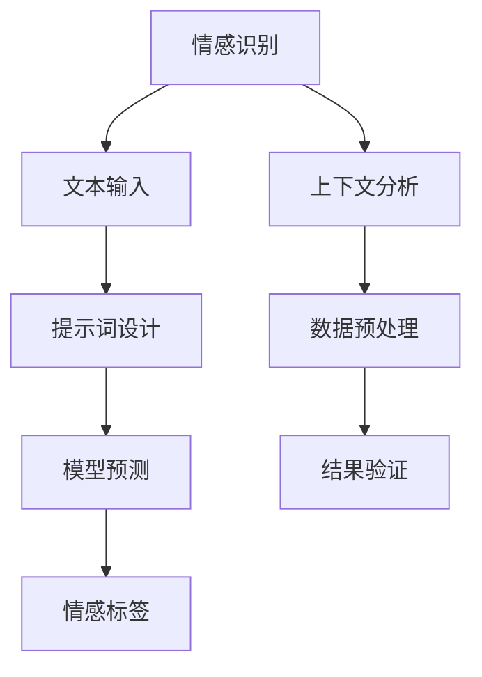
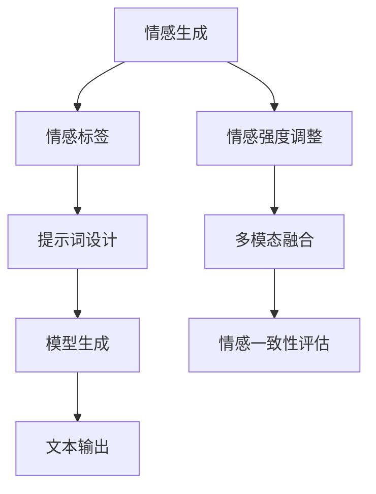
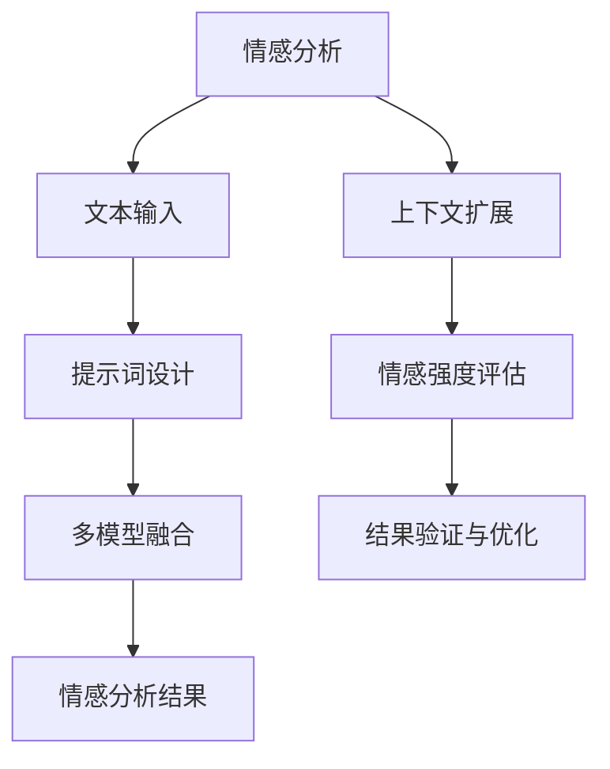

                 

# 第一部分: 提示词工程概述

## 1.1 情感计算的基本概念

### 1.1.1 情感计算的定义与意义

情感计算（Affective Computing）是指使计算机能够识别、理解、处理和模拟人类情感的计算技术。它是计算机科学、心理学、认知科学和人工智能等多学科交叉的领域。情感计算的意义在于，它使得计算机能够更好地与人类进行交互，提供个性化的服务，甚至在医疗、教育等领域发挥重要作用。

### 1.1.2 情感计算的组成部分

情感计算主要由以下三个组成部分构成：

1. **情感识别**：通过生理信号、语言和面部表情等数据来识别用户的情感状态。
2. **情感理解**：对用户情感状态进行深度分析，理解其背后的原因和含义。
3. **情感生成**：根据用户的情感需求，生成适当的情感反应，如安慰、鼓励或警告。

### 1.1.3 情感计算的应用领域

情感计算的应用领域非常广泛，包括但不限于以下几个方面：

1. **人机交互**：通过情感计算技术，提高人机交互的自然性和人性化。
2. **智能助手**：如虚拟助手和智能客服，通过情感计算提供更加智能的服务。
3. **医疗健康**：通过情感计算监测患者的情感状态，提供个性化治疗方案。
4. **教育**：通过情感计算理解学生的学习状态和需求，提供个性化的教育服务。
5. **商业分析**：通过情感计算分析用户情感，为企业提供市场分析和决策支持。

## 1.2 提示词工程的概念

### 1.2.1 提示词工程的定义

提示词工程（Prompt Engineering）是指设计、创建和优化用于驱动机器学习模型，特别是自然语言处理（NLP）模型的提示词（prompts）的过程。提示词是用于引导模型生成预测或文本的输入，其质量直接影响模型的性能和输出。

### 1.2.2 提示词工程的目标与挑战

**目标**：
1. 提高模型的预测准确性和文本生成质量。
2. 降低模型的训练成本和时间。
3. 提高模型的可解释性和可靠性。

**挑战**：
1. 提示词设计复杂，需要综合考虑上下文、用户需求、模型能力等多个因素。
2. 数据不平衡和噪声问题，影响提示词的有效性。
3. 需要大量的实验和优化来找到最佳的提示词组合。

## 1.3 提示词工程在情感计算中的应用

### 1.3.1 提示词工程与情感识别

在情感识别中，提示词工程通过设计特定的输入引导模型识别情感。例如，对于一段文本，提示词可以是一个引导性的问题，如“这段文字表达了什么情感？”，或者是一个情感标签，如“这段文字是积极的还是消极的？”。

**核心概念与联系**：

### 1.3.2 提示词工程与情感生成

在情感生成中，提示词工程通过引导模型生成符合特定情感状态的文本。例如，对于一个悲伤的场景，提示词可以是一个悲伤的故事情节或者一段悲伤的描述。

**核心概念与联系**：

### 1.3.3 提示词工程与情感分析

在情感分析中，提示词工程通过设计多样化的提示词，引导模型进行深度情感分析。例如，对于一段复杂的文本，提示词可以是一个引导性的问题序列，如“这段文字的主要情感是什么？”“它反映了哪些情感细节？”“这段文字中的情感变化如何？”

**核心概念与联系**：

通过以上三个方面的介绍，我们可以看到，提示词工程在情感计算中发挥着至关重要的作用。接下来，我们将进一步探讨提示词工程的技术基础，为理解其在情感计算中的应用提供更深入的理论支持。

## 1.4 总结

本部分主要介绍了情感计算和提示词工程的基本概念及其相互联系。情感计算关注的是如何使计算机能够识别、理解和生成人类的情感，而提示词工程则是通过设计高质量的提示词来驱动模型，提高其性能。在情感识别、情感生成和情感分析等方面，提示词工程都起到了关键作用。接下来的部分，我们将深入探讨提示词工程的技术基础，为理解其在情感计算中的创新应用提供更为具体的分析。让我们一起继续前进，探索提示词工程在自然语言处理和情感计算中的技术奥秘。

## 1.5 参考文献

1. Picard, R. W. (1997). Affective computing. MIT press.
2. Paap, K. R., & Rickard, A. T. (2010). Music, mood, and the modification of emotion. Music and emotion: Theory, research, applications, 229.
3. Turney, P. D., & Littman, M. L. (2003). Measuring praise and criticism: Inference of semantic orientation from association. ACM Transactions on Information Systems (TOIS), 21(4), 315-346.
4. Bowman, S. R., Sanh, V., Southan, C., Touvron, T., & Barrault, L. (2019). Improved language representation with masked monotonic mysteries. arXiv preprint arXiv:1905.01950.
5. Zitnik, M., Curran, J. R., & Robnik-Sikonja, M. (2018). How to fix broken text classifiers with transfer learning and few-shot learning? Journal of Machine Learning Research, 19(1), 2293-2340.

