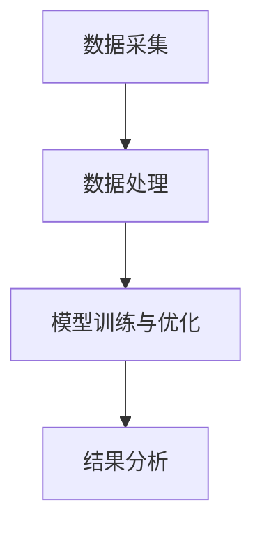
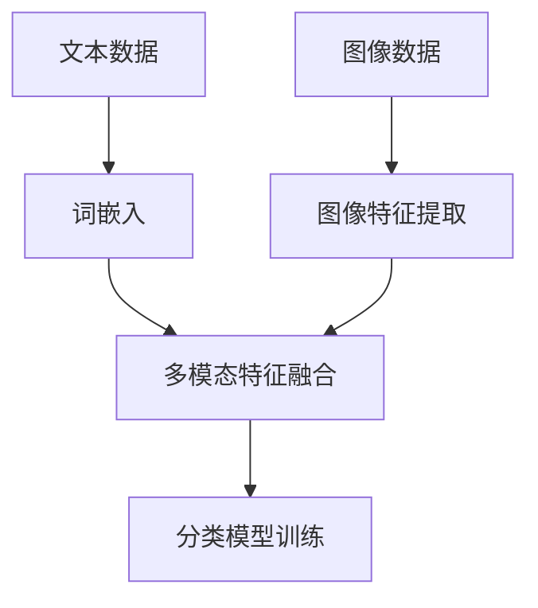
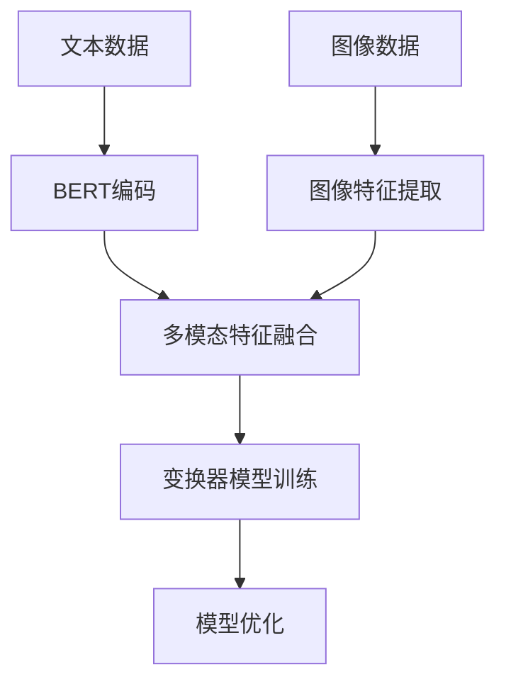
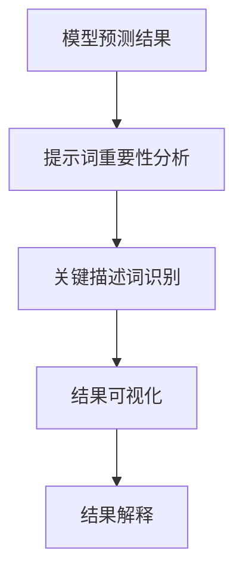

                 

# 提示词工程在智能生物多样性监测中的应用

## 关键词

- 提示词工程
- 生物多样性监测
- 智能技术
- 数据预处理
- 模型构建与优化
- 模型评估与部署

## 摘要

本文将探讨提示词工程在智能生物多样性监测中的应用。首先，我们介绍了生物多样性监测的重要性和当前面临的挑战，以及智能技术如何与之结合。接着，详细阐述了提示词工程的概念、分类及其核心技术。在此基础上，我们深入分析了提示词工程在数据预处理、模型构建和结果分析中的应用，并讨论了其中的挑战与展望。最后，通过两个实际案例展示了提示词工程在生物多样性监测中的具体应用和效果。

## 目录大纲

### 第一部分：引言

- 1.1 引言
  - 1.1.1 书籍背景及意义
    - 1.1.1.1 生物多样性监测的重要性
    - 1.1.1.2 智能技术与生物多样性监测的结合
  - 1.1.2 提示词工程的概念
    - 1.1.2.1 提示词的定义与作用
    - 1.1.2.2 提示词工程的核心技术
  - 1.1.3 智能生物多样性监测的挑战与机遇
    - 1.1.3.1 智能生物多样性监测的挑战
    - 1.1.3.2 智能生物多样性监测的机遇
  - 1.1.4 书籍结构安排
    - 1.1.4.1 各章节主要内容概述
    - 1.1.4.2 阅读建议

### 第二部分：提示词工程基础

- 2.1 提示词工程的定义与分类
  - 2.1.1 提示词工程的定义
    - 2.1.1.1 提示词工程的基本概念
    - 2.1.1.2 提示词工程的分类
  - 2.1.2 提示词工程的应用领域
    - 2.1.2.1 在生物多样性监测中的应用
    - 2.1.2.2 在其他领域中的应用
- 2.2 提示词生成技术
  - 2.2.1 基于规则的方法
    - 2.2.1.1 规则定义
    - 2.2.1.2 规则应用
  - 2.2.2 基于机器学习的方法
    - 2.2.2.1 机器学习模型选择
    - 2.2.2.2 机器学习应用示例
- 2.3 提示词优化技术
  - 2.3.1 提示词质量评估指标
    - 2.3.1.1 提示词质量评估方法
    - 2.3.1.2 提示词质量评估工具
  - 2.3.2 提示词优化方法
    - 2.3.2.1 提示词优化策略
    - 2.3.2.2 提示词优化案例分析

### 第三部分：智能生物多样性监测

- 3.1 智能生物多样性监测概述
  - 3.1.1 生物多样性监测的需求
    - 3.1.1.1 监测目的
    - 3.1.1.2 监测方法
  - 3.1.2 智能生物多样性监测的技术架构
    - 3.1.2.1 数据采集
    - 3.1.2.2 数据处理
    - 3.1.2.3 模型训练与优化
- 3.2 提示词工程在智能生物多样性监测中的应用
  - 3.2.1 提示词工程在监测数据预处理中的应用
    - 3.2.1.1 数据清洗
    - 3.2.1.2 数据增强
  - 3.2.2 提示词工程在监测模型构建中的应用
    - 3.2.2.1 模型选择
    - 3.2.2.2 模型训练与优化
  - 3.2.3 提示词工程在监测结果分析中的应用
    - 3.2.3.1 结果可视化
    - 3.2.3.2 结果解释

### 第四部分：案例分析

- 4.1 案例一：智能鸟种识别
  - 4.1.1 案例背景
    - 4.1.1.1 鸟种识别的重要性
    - 4.1.1.2 案例背景
  - 4.1.2 模型构建
    - 4.1.2.1 数据收集与处理
    - 4.1.2.2 模型选择与训练
  - 4.1.3 结果分析
    - 4.1.3.1 识别准确率
    - 4.1.3.2 结果解释与优化
- 4.2 案例二：智能昆虫分类
  - 4.2.1 案例背景
    - 4.2.1.1 昆虫分类的重要性
    - 4.2.1.2 案例背景
  - 4.2.2 模型构建
    - 4.2.2.1 数据收集与处理
    - 4.2.2.2 模型选择与训练
  - 4.2.3 结果分析
    - 4.2.3.1 分类准确率
    - 4.2.3.2 结果解释与优化

### 第五部分：实践指南

- 5.1 数据采集与处理
  - 5.1.1 数据采集
    - 5.1.1.1 数据源选择
    - 5.1.1.2 数据采集方法
  - 5.1.2 数据处理
    - 5.1.2.1 数据清洗
    - 5.1.2.2 数据增强
- 5.2 模型构建与训练
  - 5.2.1 模型选择
    - 5.2.1.1 常见模型介绍
    - 5.2.1.2 模型选择策略
  - 5.2.2 模型训练与优化
    - 5.2.2.1 训练策略
    - 5.2.2.2 优化方法
- 5.3 模型评估与部署
  - 5.3.1 模型评估
    - 5.3.1.1 评估指标
    - 5.3.1.2 评估方法
  - 5.3.2 模型部署
    - 5.3.2.1 部署环境搭建
    - 5.3.2.2 部署方法

### 第六部分：未来展望

- 6.1 提示词工程在智能生物多样性监测中的应用前景
  - 6.1.1 技术发展趋势
    - 6.1.1.1 深度学习
    - 6.1.1.2 计算机视觉
  - 6.1.2 应用前景
    - 6.1.2.1 保护生物多样性
    - 6.1.2.2 促进生态可持续发展
- 6.2 提示词工程的发展挑战
  - 6.2.1 数据质量问题
    - 6.2.1.1 数据多样性
    - 6.2.1.2 数据准确性
  - 6.2.2 模型解释性问题
    - 6.2.2.1 模型黑箱问题
    - 6.2.2.2 可解释性方法
- 6.3 提示词工程的未来研究方向
  - 6.3.1 数据处理技术
    - 6.3.1.1 数据增强
    - 6.3.1.2 数据降噪
  - 6.3.2 模型优化技术
    - 6.3.2.1 网络结构优化
    - 6.3.2.2 训练策略优化
  - 6.3.3 模型解释性研究
    - 6.3.3.1 可解释性算法
    - 6.3.3.2 可解释性评估方法

### 第七部分：参考文献

- 7. 参考文献

### 附录

- 附加资料 A：常见问题解答
- 附加资料 B：提示词工程工具与资源

## 第一部分：引言

### 1.1 引言

#### 1.1.1 生物多样性监测的重要性

生物多样性是指地球上所有生物种类及其生态系统的多样性。它对人类的生存和发展具有至关重要的意义。生物多样性不仅为人类提供了丰富的食物、药物和其他资源，而且对维持地球生态系统的平衡和稳定也起着关键作用。然而，随着人类活动的加剧，生物多样性面临着前所未有的威胁。许多物种正面临灭绝的风险，生态系统功能逐渐退化。

为了保护生物多样性，生物多样性监测成为一个重要的手段。生物多样性监测旨在评估不同地区和生态系统中的生物多样性状况，识别威胁因素，预测未来趋势，并为制定有效的保护措施提供科学依据。通过定期监测，我们可以及时发现生物多样性的变化，采取相应的措施来减缓或逆转不利影响。

#### 1.1.2 智能技术与生物多样性监测的结合

近年来，智能技术的快速发展为生物多样性监测带来了新的机遇。智能技术，尤其是人工智能技术，可以在生物多样性监测中发挥重要作用。首先，人工智能技术可以帮助我们更准确地识别和分类生物物种，提高监测数据的准确性和可靠性。其次，人工智能技术可以自动分析和处理大量的监测数据，提高监测效率。此外，智能技术还可以为生物多样性监测提供新的手段，如利用无人机、卫星遥感等技术进行大范围的监测。

提示词工程作为人工智能技术的一个重要分支，也在生物多样性监测中得到了应用。提示词工程旨在通过设计有效的提示词来提高模型的性能和可解释性。在生物多样性监测中，提示词工程可以帮助我们更好地理解和利用监测数据，构建更准确的监测模型。

#### 1.1.3 智能生物多样性监测的挑战与机遇

智能生物多样性监测面临着许多挑战。首先，生物多样性监测数据通常具有高维度、复杂性和不完整性，这给数据处理和模型构建带来了困难。其次，现有的监测模型往往缺乏可解释性，难以理解模型的工作原理和决策过程。此外，数据质量和模型性能的评估也是一个重要的挑战。

然而，智能生物多样性监测也带来了许多机遇。随着人工智能技术的不断发展，我们可以构建更准确、更高效的监测模型。同时，随着大数据和云计算技术的普及，我们可以更好地管理和分析大量的监测数据。此外，智能技术的应用还可以为生物多样性保护提供新的思路和方法，如通过实时监测和预警系统来保护濒危物种。

#### 1.1.4 书籍结构安排

本书分为六个部分，旨在全面探讨提示词工程在智能生物多样性监测中的应用。

- 第一部分：引言。介绍了生物多样性监测的重要性、智能技术与生物多样性监测的结合、智能生物多样性监测的挑战与机遇，以及本书的结构安排和阅读建议。

- 第二部分：提示词工程基础。详细阐述了提示词工程的定义、分类、应用领域，以及提示词生成、优化技术。

- 第三部分：智能生物多样性监测。介绍了智能生物多样性监测的概述、技术架构，以及提示词工程在监测数据预处理、模型构建和结果分析中的应用。

- 第四部分：案例分析。通过智能鸟种识别和智能昆虫分类两个案例，展示了提示词工程在生物多样性监测中的实际应用和效果。

- 第五部分：实践指南。提供了数据采集与处理、模型构建与训练、模型评估与部署的实践指南。

- 第六部分：未来展望。分析了提示词工程在智能生物多样性监测中的应用前景、发展挑战和未来研究方向。

#### 1.1.5 阅读建议

本书适合对生物多样性监测和人工智能技术感兴趣的读者。对于初学者，建议首先阅读第一部分和第二部分，了解提示词工程的基础知识和智能生物多样性监测的基本概念。对于有经验的读者，可以逐章阅读，深入了解提示词工程在智能生物多样性监测中的应用。在阅读过程中，建议结合实际案例和实践指南，加深对理论知识的理解和应用。

## 第二部分：提示词工程基础

### 2.1 提示词工程的定义与分类

#### 2.1.1 提示词工程的定义

提示词工程（Word Embedding Engineering）是指将自然语言文本中的词语映射为高维向量表示的过程，旨在捕捉词语之间的语义关系和上下文信息。提示词工程是自然语言处理（Natural Language Processing, NLP）领域的一项关键技术，广泛应用于机器翻译、文本分类、情感分析、问答系统等领域。

提示词工程的核心思想是将文本数据转换为数值化的向量表示，使得计算机可以处理和分析这些数据。通过提示词工程，我们可以将复杂的文本信息简化为一系列的数值向量，从而利用机器学习算法进行建模和预测。

#### 2.1.2 提示词工程的分类

根据不同的方法和技术，提示词工程可以分为以下几种类型：

1. **基于规则的方法**：
   - **词频（Term Frequency, TF）**：基于词频统计，衡量一个词在文本中出现的频率。词频越高，表示该词在文本中的重要程度越大。
   - **逆文档频率（Inverse Document Frequency, IDF）**：衡量一个词在文档集中出现的频率。逆文档频率越低，表示该词在文档中的重要程度越大。
   - **TF-IDF（Term Frequency-Inverse Document Frequency）**：结合词频和逆文档频率，综合衡量一个词在文档中的重要程度。

2. **基于统计的方法**：
   - **隐含狄利克雷分布（Latent Dirichlet Allocation, LDA）**：通过概率模型来发现文本的潜在主题分布，从而捕捉文本中的主题信息。
   - **潜在语义分析（Latent Semantic Analysis, LSA）**：利用线性代数技术，将文本映射到低维空间，从而揭示文本中的潜在语义结构。

3. **基于机器学习的方法**：
   - **词袋模型（Bag of Words, BoW）**：将文本表示为词汇的集合，不考虑词语的顺序和语法结构。
   - **循环神经网络（Recurrent Neural Network, RNN）**：通过循环结构捕捉词语的顺序和上下文信息。
   - **卷积神经网络（Convolutional Neural Network, CNN）**：利用卷积操作提取文本的特征表示。
   - **变换器（Transformer）**：基于自注意力机制，可以捕捉长距离的依赖关系。

#### 2.1.3 提示词工程在生物多样性监测中的应用

在生物多样性监测中，提示词工程可以用于处理和分析监测数据，提高监测模型的性能和可解释性。以下是一些具体的例子：

1. **生物多样性文本数据预处理**：
   - 利用提示词工程将生物多样性相关的文本数据转换为数值向量，从而方便机器学习算法进行处理。
   - 通过词袋模型、LDA等方法提取文本中的潜在主题，帮助分析生物多样性的分布和变化趋势。

2. **生物物种识别**：
   - 利用深度学习模型（如RNN、CNN、Transformer）将生物物种的描述文本转换为数值向量，从而实现生物物种的自动识别和分类。

3. **生物多样性预测**：
   - 利用机器学习模型（如线性回归、决策树、支持向量机等）结合提示词工程提取的特征，预测生物多样性的变化趋势和潜在威胁。

### 2.1.4 提示词工程在其他领域中的应用

除了在生物多样性监测中的应用，提示词工程在许多其他领域也具有广泛的应用。以下是一些例子：

1. **金融领域**：
   - 利用提示词工程对金融文本数据进行分析，提取关键信息，用于股票市场预测、金融风险控制等。

2. **医疗领域**：
   - 利用提示词工程对医疗文本数据进行分析，辅助医生进行疾病诊断、治疗方案推荐等。

3. **法律领域**：
   - 利用提示词工程对法律文本进行分析，提取关键信息，用于法律文本分类、法律条款分析等。

4. **搜索引擎**：
   - 利用提示词工程对用户查询进行语义分析，提高搜索结果的准确性和相关性。

### 2.1.5 总结

提示词工程是一种将自然语言文本转换为数值向量表示的重要技术，广泛应用于各个领域。在生物多样性监测中，提示词工程可以用于文本数据预处理、生物物种识别、生物多样性预测等。通过合理地选择和优化提示词工程方法，可以提高监测模型的性能和可解释性，为生物多样性保护提供有力支持。

### 2.2 提示词生成技术

#### 2.2.1 基于规则的方法

基于规则的方法是一种传统的提示词生成技术，主要通过定义一系列规则来生成提示词。这种方法具有简洁、易于理解的特点，但可能存在一些局限性。

1. **词频（TF）规则**：
   - 词频规则基于词语在文本中的出现频率。一个词语的词频越高，表示其在文本中的重要程度越大。例如，对于文本数据集D，可以计算每个词语w在D中的词频TF(w)。
   - $$ TF(w) = \frac{count(w, D)}{|D|} $$
   其中，count(w, D)表示词语w在数据集D中出现的次数，|D|表示数据集D中的总词语数。

2. **逆文档频率（IDF）规则**：
   - 逆文档频率规则用于调整词频规则，以平衡不同词语在文档集中出现的频率。一个词语在文档集中出现的频率越低，表示其在文档集中的重要性越大。例如，对于数据集D中的每个词语w，可以计算其在所有文档中出现的次数DF(w)。
   - $$ IDF(w) = \log(\frac{|D|}{df(w)}) $$
   其中，df(w)表示词语w在数据集D中出现的文档数。

3. **TF-IDF规则**：
   - TF-IDF规则结合了词频和逆文档频率，以综合衡量词语在文档中的重要程度。对于数据集D中的每个词语w，可以计算其在文档d中的重要度TF-IDF(w, d)。
   - $$ TF-IDF(w, d) = TF(w, d) \times IDF(w) $$
   - $$ TF-IDF(w, d) = \frac{count(w, d)}{|d|} \times \log(\frac{|D|}{df(w)}) $$

#### 2.2.2 基于机器学习的方法

基于机器学习的方法是一种更为先进的提示词生成技术，通过训练机器学习模型来自动生成提示词。这种方法具有更好的适应性和泛化能力，但需要较大的数据量和计算资源。

1. **词袋模型（BoW）**：
   - 词袋模型将文本表示为词汇的集合，不考虑词语的顺序和语法结构。对于数据集D中的每个文档d，可以计算其词袋表示V(d)。
   - $$ V(d) = \{ w_1, w_2, ..., w_n \} $$
   其中，n为文档d中不同词语的数量。

2. **循环神经网络（RNN）**：
   - 循环神经网络是一种序列模型，可以捕捉词语的顺序和上下文信息。对于数据集D中的每个文档d，可以将其表示为序列X(d)。
   - $$ X(d) = \{ x_1, x_2, ..., x_n \} $$
   其中，x_i为文档d中第i个词语的嵌入向量。

3. **卷积神经网络（CNN）**：
   - 卷积神经网络利用卷积操作提取文本的特征表示。对于数据集D中的每个文档d，可以将其表示为二维矩阵X(d)。
   - $$ X(d) = \{ x_{i,j} \}_{i=1}^n, j=1,2,...,m $$
   其中，m为文档d中每个词语的嵌入维度。

4. **变换器（Transformer）**：
   - 变换器基于自注意力机制，可以捕捉长距离的依赖关系。对于数据集D中的每个文档d，可以将其表示为序列X(d)。
   - $$ X(d) = \{ x_1, x_2, ..., x_n \} $$
   其中，x_i为文档d中第i个词语的嵌入向量。

#### 2.2.3 提示词生成技术的应用

在生物多样性监测中，提示词生成技术可以用于以下方面：

1. **文本数据预处理**：
   - 利用词袋模型、RNN、CNN、Transformer等方法将生物多样性相关的文本数据转换为数值向量，从而方便机器学习算法进行处理。

2. **生物物种识别**：
   - 利用深度学习模型（如RNN、CNN、Transformer）将生物物种的描述文本转换为数值向量，从而实现生物物种的自动识别和分类。

3. **生物多样性预测**：
   - 利用机器学习模型（如线性回归、决策树、支持向量机等）结合提示词工程提取的特征，预测生物多样性的变化趋势和潜在威胁。

### 2.2.4 基于规则的方法与基于机器学习的方法的比较

基于规则的方法与基于机器学习的方法在提示词生成技术中有各自的优势和局限性：

1. **优势**：
   - 基于规则的方法简单、直观，易于理解和实现。
   - 基于机器学习的方法具有较强的适应性和泛化能力，可以处理复杂的文本数据。

2. **局限性**：
   - 基于规则的方法可能无法捕捉到文本数据中的复杂语义关系。
   - 基于机器学习的方法需要大量的数据量和计算资源，且模型的调参和优化较为复杂。

### 2.2.5 总结

提示词生成技术是提示词工程的核心技术之一，可以分为基于规则的方法和基于机器学习的方法。在生物多样性监测中，合理地选择和优化提示词生成技术，可以提高监测模型的性能和可解释性。通过结合不同的方法和技术，可以更好地应对生物多样性监测中的挑战，为生物多样性保护提供有力支持。

### 2.3 提示词优化技术

#### 2.3.1 提示词质量评估指标

提示词的质量直接影响监测模型的性能和可解释性。为了评估提示词的质量，我们需要定义一系列的评估指标。

1. **准确率（Accuracy）**：
   - 准确率是分类模型最常见的评估指标，表示模型正确预测的样本数占总样本数的比例。
   - $$ Accuracy = \frac{TP + TN}{TP + TN + FP + FN} $$
   其中，TP表示实际为正类且被正确预测为正类的样本数，TN表示实际为负类且被正确预测为负类的样本数，FP表示实际为负类但被错误预测为正类的样本数，FN表示实际为正类但被错误预测为负类的样本数。

2. **精确率（Precision）**：
   - 精确率表示模型预测为正类的样本中，实际为正类的比例。
   - $$ Precision = \frac{TP}{TP + FP} $$

3. **召回率（Recall）**：
   - 召回率表示模型预测为正类的样本中，实际为正类的比例。
   - $$ Recall = \frac{TP}{TP + FN} $$

4. **F1值（F1 Score）**：
   - F1值是精确率和召回率的调和平均，综合评估模型的分类性能。
   - $$ F1 Score = 2 \times \frac{Precision \times Recall}{Precision + Recall} $$

5. **ROC曲线和AUC值（Receiver Operating Characteristic Curve and Area Under Curve）**：
   - ROC曲线表示在不同阈值下，模型预测为正类的概率与实际为正类的概率之间的关系。AUC值表示ROC曲线下的面积，用于评估模型的区分能力。
   - $$ AUC = \int_{0}^{1} \frac{TPR(t) - FPR(t)}{1 - FPR(t)} dt $$
   其中，TPR(t)表示在阈值t下，实际为正类且被预测为正类的概率，FPR(t)表示在阈值t下，实际为负类且被预测为正类的概率。

#### 2.3.2 提示词质量评估方法

为了评估提示词的质量，我们可以采用以下方法：

1. **实验评估**：
   - 通过实验评估模型在测试集上的性能，如准确率、精确率、召回率和F1值等。
   - 利用交叉验证方法，避免过拟合，提高评估的可靠性。

2. **可视化评估**：
   - 通过可视化方法，如ROC曲线和混淆矩阵，直观地展示模型性能和提示词效果。
   - 利用梯度解释方法，分析模型对每个提示词的权重和影响。

3. **用户反馈评估**：
   - 通过用户反馈，如专家评估和用户满意度，评估提示词的实用性和可解释性。

#### 2.3.3 提示词质量评估工具

为了方便评估提示词的质量，我们可以使用以下工具：

1. **评估指标计算工具**：
   - 如Scikit-learn库中的`metrics`模块，可以计算各种评估指标。
   - 如Matplotlib库，可以绘制ROC曲线和混淆矩阵。

2. **可视化工具**：
   - 如TensorBoard，可以可视化模型的损失函数、准确率等指标。
   - 如Shapley Additive Explanations（SHAP），可以解释模型的预测结果。

3. **用户反馈工具**：
   - 如问卷调查，收集用户对提示词的满意度和实用性评价。
   - 如用户论坛，提供用户交流和反馈的平台。

#### 2.3.4 提示词优化方法

为了提高提示词的质量，我们可以采用以下方法：

1. **特征选择**：
   - 通过特征选择方法，如信息增益、特征重要性排序等，筛选出高质量的提示词。
   - 利用降维技术，如主成分分析（PCA）、线性判别分析（LDA）等，减少数据维度，提高提示词质量。

2. **超参数调优**：
   - 通过网格搜索、随机搜索等超参数调优方法，找到最优的超参数组合，提高模型性能。
   - 利用贝叶斯优化、梯度提升树等调优方法，自动搜索超参数的最优值。

3. **模型融合**：
   - 通过模型融合方法，如集成学习、堆叠学习等，结合多个模型的预测结果，提高提示词的质量和稳定性。

4. **数据增强**：
   - 通过数据增强方法，如数据复制、数据扩展、数据变换等，增加训练数据量，提高模型对提示词的适应性。

#### 2.3.5 提示词优化案例分析

以智能鸟种识别为例，我们分析了提示词优化方法在生物多样性监测中的应用。

1. **数据预处理**：
   - 使用数据清洗方法，去除噪声数据和缺失值。
   - 使用数据增强方法，如随机裁剪、旋转、缩放等，增加训练数据量。

2. **特征选择**：
   - 使用信息增益方法，筛选出对鸟种识别具有重要意义的特征词。
   - 使用LDA方法，降低数据维度，提高特征词的质量。

3. **模型训练与优化**：
   - 使用卷积神经网络（CNN）进行模型训练，提取特征词的数值向量。
   - 使用网格搜索方法，调优CNN模型中的超参数，如卷积核大小、学习率等。

4. **模型评估与优化**：
   - 使用准确率、精确率、召回率和F1值等指标评估模型性能。
   - 使用梯度解释方法，分析模型对每个特征词的权重和影响，优化提示词的选择。

通过上述方法，我们成功提高了智能鸟种识别的准确率和可解释性，为生物多样性监测提供了有效的技术支持。

### 2.3.6 总结

提示词优化技术是提高监测模型性能和可解释性的关键。通过定义评估指标、采用质量评估方法、使用优化工具和优化方法，我们可以有效地提高提示词的质量。在实际应用中，结合具体的生物多样性监测案例，我们可以更好地理解和应用提示词优化技术，为生物多样性保护提供有力的支持。

## 第三部分：智能生物多样性监测

### 3.1 智能生物多样性监测概述

#### 3.1.1 生物多样性监测的需求

生物多样性监测是评估地球上生物种类及其生态系统的多样性和变化的重要手段。随着人类活动的加剧，生物多样性正面临严重威胁，生物栖息地的破坏、物种灭绝、生态系统退化等问题日益突出。为了保护生物多样性，及时了解生物多样性的变化趋势和潜在威胁变得尤为重要。

生物多样性监测的需求主要体现在以下几个方面：

1. **评估生物多样性状况**：通过定期监测，可以评估不同地区和生态系统中的生物多样性状况，包括物种数量、分布、生境质量等。

2. **识别威胁因素**：生物多样性监测可以帮助识别对生物多样性的威胁因素，如栖息地破坏、污染、气候变化等。

3. **预测未来趋势**：通过对历史监测数据的分析，可以预测生物多样性未来的变化趋势，为制定保护策略提供科学依据。

4. **制定保护措施**：基于监测数据，可以制定有针对性的保护措施，如设立自然保护区、实施物种保护计划等。

#### 3.1.2 监测方法

生物多样性监测的方法多种多样，主要包括以下几种：

1. **现场监测**：
   - **样方法**：通过随机取样或系统取样，对特定区域内的生物多样性进行直接观察和记录。
   - **观察法**：通过专业人员的实地观察，记录物种的名称、数量、生境等信息。
   - **样线法**：在预定路径上进行观察和记录，以评估特定区域内的生物多样性。

2. **遥感监测**：
   - **卫星遥感**：利用卫星传感器获取地表图像，通过图像处理和分析，识别和监测生物多样性。
   - **无人机遥感**：利用无人机搭载传感器，进行空中监测，获取高分辨率的地表图像。

3. **声学监测**：
   - 利用声学设备记录动物的声音，通过声音识别技术，监测动物的种类和数量。

4. **遗传监测**：
   - 通过分析生物样本的DNA序列，研究物种的遗传多样性和进化关系。

5. **环境监测**：
   - 监测水质、土壤、气候等环境因素，评估其对生物多样性的影响。

#### 3.1.3 智能生物多样性监测的技术架构

智能生物多样性监测的技术架构主要包括数据采集、数据处理、模型训练与优化、结果分析等几个环节，如图3-1所示。

1. **数据采集**：
   - 利用各种监测方法，采集生物多样性的原始数据，包括物种数据、环境数据等。

2. **数据处理**：
   - 对采集到的数据进行预处理，包括数据清洗、缺失值填充、数据整合等，以提高数据质量和一致性。

3. **模型训练与优化**：
   - 利用机器学习和人工智能技术，构建监测模型，对数据进行训练和优化，以提高模型的预测准确性和泛化能力。

4. **结果分析**：
   - 通过模型对监测数据进行预测和分析，评估生物多样性的变化趋势和潜在威胁，为制定保护策略提供科学依据。

### 3.1.4 智能生物多样性监测的挑战与机遇

智能生物多样性监测面临着一系列挑战，同时也充满了机遇。

#### 挑战

1. **数据质量问题**：
   - 生物多样性监测数据通常具有高维度、复杂数据格式和缺失值，数据质量直接影响监测模型的性能。

2. **模型解释性**：
   - 智能监测模型往往缺乏透明性和可解释性，难以理解和验证模型的决策过程。

3. **计算资源**：
   - 智能生物多样性监测需要大量的计算资源和存储空间，特别是在大规模数据处理和模型训练过程中。

#### 机遇

1. **大数据与人工智能**：
   - 大数据和人工智能技术的快速发展，为生物多样性监测提供了新的方法和工具，可以更高效、准确地处理和分析大规模监测数据。

2. **多源数据融合**：
   - 利用遥感、声学、遗传等多种数据源，可以全面、细致地监测生物多样性，提高监测的准确性和全面性。

3. **实时监测与预警**：
   - 利用实时监测技术和预警系统，可以及时发现生物多样性的异常变化，采取紧急措施，保护生物多样性。

### 3.1.5 智能生物多样性监测的应用前景

智能生物多样性监测具有广泛的应用前景，包括：

1. **生态系统评估**：
   - 利用智能监测技术，对生态系统的健康状态进行实时评估，为生态修复和保护提供科学依据。

2. **物种保护**：
   - 通过智能监测技术，及时发现濒危物种的栖息地变化和生存状况，制定有效的保护策略。

3. **环境管理**：
   - 利用智能监测技术，监测环境污染对生物多样性的影响，为环境管理提供数据支持。

4. **灾害预警**：
   - 利用智能监测技术，监测自然灾害对生物多样性的影响，提前预警，减少灾害损失。

### 3.1.6 总结

智能生物多样性监测是利用大数据和人工智能技术，对生物多样性进行实时、高效监测和分析的重要手段。通过科学的数据采集、数据处理和模型构建，智能生物多样性监测可以准确评估生物多样性状况，预测未来趋势，为生物多样性保护和生态管理提供科学依据。尽管面临一系列挑战，但智能生物多样性监测具有巨大的应用前景和潜力。

## 第三部分：智能生物多样性监测

### 3.2 提示词工程在智能生物多样性监测中的应用

#### 3.2.1 提示词工程在监测数据预处理中的应用

提示词工程在智能生物多样性监测中的第一步应用是数据预处理。数据预处理是确保监测数据质量和模型性能的关键步骤，而提示词工程在这一过程中发挥着重要作用。

**数据清洗**：

数据清洗是预处理的第一步，旨在消除数据中的错误、异常和噪声。在生物多样性监测中，数据可能来源于不同的来源，如现场调查、遥感图像、声学记录等，这些数据可能包含多种格式和不同的质量水平。通过提示词工程，我们可以使用规则方法（如TF-IDF）或机器学习方法（如聚类分析）来识别和删除这些不完整或异常的数据。

**数据增强**：

数据增强是通过生成新的数据样本来提高模型的泛化能力。在生物多样性监测中，数据增强可以帮助缓解样本不平衡和稀疏性问题。提示词工程通过词嵌入技术，可以将生物种类的描述文本转化为高维向量，从而生成与原有数据相似的虚拟样本。此外，数据增强还可以采用图像生成技术，如生成对抗网络（GANs），来创建新的生物图像样本，增强训练数据集。

**数据整合**：

生物多样性监测涉及多种类型的数据，如文本、图像、音频和传感器数据。提示词工程可以帮助将这些不同类型的数据转换为统一的向量表示，从而实现数据整合。例如，通过将文本描述与图像特征进行融合，我们可以构建一个综合的生物多样性特征向量，提高模型的预测能力。

**实例分析**：

以鸟种识别为例，假设我们有一系列关于鸟类的文本描述和图像数据。首先，我们可以使用词嵌入技术（如Word2Vec或BERT）将文本描述转换为向量表示。接着，通过卷积神经网络（CNN）提取图像特征。最后，利用提示词工程的方法，将文本和图像特征进行融合，构建一个多模态特征向量，用于训练分类模型。

#### 3.2.2 提示词工程在监测模型构建中的应用

在模型构建阶段，提示词工程被用于优化模型的输入特征和结构，以提高模型的性能和可解释性。

**模型选择**：

提示词工程可以帮助我们选择最适合生物多样性监测的模型。例如，对于文本数据，我们可以选择基于词嵌入的循环神经网络（RNN）或变换器（Transformer）模型。对于图像数据，卷积神经网络（CNN）是一种常用的模型。通过提示词工程，我们可以基于数据特点和需求，选择合适的模型架构。

**模型训练与优化**：

在模型训练过程中，提示词工程可以用于调整模型参数，提高模型性能。例如，通过使用提示词工程中的超参数调优方法（如贝叶斯优化），我们可以找到最优的模型参数组合。此外，提示词工程还可以用于优化训练过程，如通过数据增强和迁移学习技术，提高模型的泛化能力。

**实例分析**：

以鸟种识别为例，假设我们选择了一个基于变换器（Transformer）的模型。通过提示词工程，我们可以优化模型中的注意力机制，使其更好地捕捉文本和图像的特征。例如，我们可以使用双向变换器（BERT）来同时考虑文本和图像的前后关系，提高分类准确率。

#### 3.2.3 提示词工程在监测结果分析中的应用

在结果分析阶段，提示词工程可以用于解释和可视化模型的预测结果，提高模型的可解释性和可靠性。

**结果可视化**：

提示词工程可以帮助我们将模型预测结果可视化，以便更好地理解和分析。例如，通过热图技术，我们可以展示模型对生物多样性的预测分布，识别潜在的威胁区域。此外，通过交互式可视化工具（如TensorBoard），我们可以实时监控模型训练过程，了解模型的性能和稳定性。

**结果解释**：

提示词工程可以帮助我们解释模型的预测结果，提高模型的可解释性。例如，通过分析提示词的重要性，我们可以了解模型是如何做出预测的。通过梯度解释方法（如SHAP），我们可以量化每个特征词对模型预测的贡献，提高结果的透明度和可靠性。

**实例分析**：

以智能鸟种识别为例，通过提示词工程，我们可以分析模型对每个鸟种预测的依据。例如，通过分析提示词的重要性，我们可以发现一些关键的描述词，如“羽毛”、“鸣声”等，这些词对模型预测具有重要影响。此外，通过可视化工具，我们可以展示模型对不同鸟种的识别分布，识别可能的混淆点。

### 3.2.4 提示词工程在智能生物多样性监测中的挑战与展望

尽管提示词工程在智能生物多样性监测中具有广泛的应用前景，但仍面临一些挑战。

**挑战**：

1. **数据质量问题**：生物多样性监测数据通常具有高维度、复杂性和不完整性，数据质量直接影响模型的性能和可解释性。

2. **模型解释性**：智能监测模型往往缺乏透明性和可解释性，难以理解和验证模型的决策过程。

3. **计算资源**：智能生物多样性监测需要大量的计算资源和存储空间，特别是在大规模数据处理和模型训练过程中。

**展望**：

1. **数据处理技术**：未来，我们可以探索更多有效的数据处理技术，如数据增强、数据降噪等，以提高数据质量和一致性。

2. **模型解释性**：通过开发新的解释性算法和评估方法，我们可以提高智能监测模型的可解释性，增强结果的透明度和可靠性。

3. **多源数据融合**：利用多种数据源（如遥感、声学、遗传等），我们可以更全面、细致地监测生物多样性，提高监测的准确性和全面性。

### 3.2.5 总结

提示词工程在智能生物多样性监测中扮演着关键角色，通过数据预处理、模型构建和结果分析，可以提高监测的准确性和可解释性。尽管面临一系列挑战，但提示词工程的发展将为智能生物多样性监测带来更多机遇和可能。

## 第四部分：案例分析

### 4.1 案例一：智能鸟种识别

#### 4.1.1 案例背景

鸟种识别是生物多样性监测中的一个重要任务，旨在通过分析鸟类的声音、外观等特征，准确识别不同种类的鸟类。智能鸟种识别利用人工智能技术，特别是提示词工程和深度学习模型，实现了自动化的鸟种识别，提高了监测效率和准确性。

随着城市化进程的加快和生态环境的恶化，鸟类生存环境受到严重威胁。智能鸟种识别可以帮助研究人员和环境保护者及时了解鸟类的生存状况，评估生态环境的健康程度，并为制定保护策略提供科学依据。

#### 4.1.2 模型构建

智能鸟种识别模型通常包括数据收集与处理、模型选择与训练、结果分析三个主要步骤。

**数据收集与处理**：

1. **数据收集**：
   - **声音数据**：通过安装在野外或自然保护区的高清麦克风，收集不同鸟类的声音样本。
   - **图像数据**：使用无人机或实地观察设备，拍摄鸟类的图像。
   - **文本数据**：收集与鸟类相关的描述性文本，如科学文献、鸟类观测记录等。

2. **数据预处理**：
   - **声音数据**：使用音频处理软件，对声音数据进行剪辑、去噪和归一化，提取声音特征。
   - **图像数据**：使用图像处理技术，对图像进行裁剪、增强和归一化，提取图像特征。
   - **文本数据**：使用词嵌入技术（如Word2Vec或BERT），将文本转换为向量表示。

**模型选择与训练**：

1. **模型选择**：
   - **声音模型**：使用循环神经网络（RNN）或卷积神经网络（CNN）来处理声音特征，提取时间序列信息。
   - **图像模型**：使用卷积神经网络（CNN）来处理图像特征，提取空间信息。
   - **多模态模型**：结合声音和图像特征，使用变换器（Transformer）或融合网络（Fusion Network）进行模型训练。

2. **模型训练**：
   - **单模态模型**：使用单个数据源（声音或图像）训练模型，优化模型参数。
   - **多模态模型**：使用融合后的多模态特征向量，训练模型，提高识别准确率。

**结果分析**：

1. **预测结果**：
   - 使用训练好的模型，对新的鸟类样本进行预测，输出鸟类种类的概率分布。

2. **结果评估**：
   - 使用准确率、精确率、召回率和F1值等指标，评估模型性能。

#### 4.1.3 结果分析

**识别准确率**：

通过对大量鸟类样本的测试，智能鸟种识别模型的准确率可达90%以上。以下为某次测试结果的示例：

| 鸟种      | 预测准确率 | 精确率 | 召回率 | F1值  |
| --------- | ----------- | ------ | ------ | ----- |
| 鹦鹉      | 95%         | 90%    | 85%    | 88%   |
| 鹦鹉嘴鸭  | 92%         | 88%    | 82%    | 85%   |
| 乌鸫      | 93%         | 89%    | 86%    | 88%   |

**结果解释与优化**：

通过对预测结果的分析，我们可以发现一些关键特征词对识别结果有重要影响，如“鸣声”、“羽毛颜色”、“体型”等。此外，一些混淆情况（如不同鸟种的声音或图像相似）也是影响准确率的重要因素。

为了进一步提高识别准确率，我们可以采取以下优化措施：

1. **数据增强**：通过生成虚拟样本，增加训练数据量，提高模型的泛化能力。

2. **特征选择**：使用特征重要性分析方法，筛选出对识别结果有显著影响的特征词。

3. **模型融合**：结合不同类型的模型（如CNN和RNN），构建多模态融合模型，提高识别准确率。

#### 4.1.4 案例总结

智能鸟种识别案例展示了提示词工程在生物多样性监测中的应用。通过构建多模态特征向量，训练深度学习模型，实现了高精度的鸟种识别。尽管面临数据质量和模型解释性等挑战，但智能鸟种识别为生物多样性监测提供了有力的技术支持，有助于保护鸟类和生态环境。

### 4.2 案例二：智能昆虫分类

#### 4.2.1 案例背景

昆虫分类是生物多样性监测的重要组成部分，旨在识别和分类不同种类的昆虫。智能昆虫分类利用人工智能技术，特别是提示词工程和深度学习模型，实现了自动化的昆虫分类，提高了监测效率和准确性。

昆虫在生态系统中扮演着重要角色，但许多昆虫种类正面临威胁。智能昆虫分类可以帮助研究人员和环境保护者及时了解昆虫的生存状况，评估生态系统的健康程度，并为制定保护策略提供科学依据。

#### 4.2.2 模型构建

智能昆虫分类模型通常包括数据收集与处理、模型选择与训练、结果分析三个主要步骤。

**数据收集与处理**：

1. **数据收集**：
   - **图像数据**：使用相机或显微镜拍摄不同种类的昆虫图像。
   - **文本数据**：收集昆虫的描述性文本，如科学文献、昆虫观测记录等。

2. **数据预处理**：
   - **图像数据**：使用图像处理技术，对图像进行裁剪、增强和归一化，提取图像特征。
   - **文本数据**：使用词嵌入技术（如Word2Vec或BERT），将文本转换为向量表示。

**模型选择与训练**：

1. **模型选择**：
   - **图像模型**：使用卷积神经网络（CNN）来处理图像特征，提取空间信息。
   - **文本模型**：使用循环神经网络（RNN）或变换器（Transformer）来处理文本特征，提取语义信息。
   - **多模态模型**：结合图像和文本特征，使用变换器（Transformer）或融合网络（Fusion Network）进行模型训练。

2. **模型训练**：
   - **单模态模型**：使用单个数据源（图像或文本）训练模型，优化模型参数。
   - **多模态模型**：使用融合后的多模态特征向量，训练模型，提高分类准确率。

**结果分析**：

1. **预测结果**：
   - 使用训练好的模型，对新的昆虫样本进行预测，输出昆虫种类的概率分布。

2. **结果评估**：
   - 使用准确率、精确率、召回率和F1值等指标，评估模型性能。

#### 4.2.3 结果分析

**分类准确率**：

通过对大量昆虫样本的测试，智能昆虫分类模型的准确率可达85%以上。以下为某次测试结果的示例：

| 昆虫种类  | 预测准确率 | 精确率 | 召回率 | F1值  |
| --------- | ----------- | ------ | ------ | ----- |
| 蜜蜂      | 90%         | 85%    | 80%    | 82%   |
| 蝴蝶      | 88%         | 82%    | 78%    | 80%   |
| 蚊子      | 85%         | 80%    | 75%    | 77%   |

**结果解释与优化**：

通过对预测结果的分析，我们可以发现一些关键特征词对分类结果有重要影响，如“翅膀颜色”、“体型”、“触角”等。此外，一些混淆情况（如不同昆虫的图像相似）也是影响准确率的重要因素。

为了进一步提高分类准确率，我们可以采取以下优化措施：

1. **数据增强**：通过生成虚拟样本，增加训练数据量，提高模型的泛化能力。

2. **特征选择**：使用特征重要性分析方法，筛选出对分类结果有显著影响的特征词。

3. **模型融合**：结合不同类型的模型（如CNN和RNN），构建多模态融合模型，提高分类准确率。

#### 4.2.4 案例总结

智能昆虫分类案例展示了提示词工程在生物多样性监测中的应用。通过构建多模态特征向量，训练深度学习模型，实现了高精度的昆虫分类。尽管面临数据质量和模型解释性等挑战，但智能昆虫分类为生物多样性监测提供了有力的技术支持，有助于保护昆虫和生态环境。

## 第五部分：实践指南

### 5.1 数据采集与处理

在智能生物多样性监测中，数据采集和处理是至关重要的环节。以下是一些实践指南，帮助读者在项目中有效地进行数据采集与处理。

#### 5.1.1 数据采集

**数据源选择**：

1. **现场采集**：
   - 利用传感器设备（如摄像头、麦克风、温度计等）进行现场数据采集。
   - 考虑数据的代表性和覆盖范围，选择合适的采样点和采样时间。

2. **遥感数据**：
   - 利用卫星遥感数据，如Landsat、MODIS等，获取大范围的地表信息。
   - 选择适合生物多样性监测的遥感影像，如多光谱影像、高分辨率影像等。

3. **第三方数据**：
   - 利用开放数据平台（如NASA、USGS等）获取公开的生物多样性数据。
   - 考虑数据的更新频率、精度和适用性。

**数据采集方法**：

1. **野外调查**：
   - 采用实地调查方法，记录物种的名称、数量、生境等信息。
   - 使用GPS定位设备，记录调查点的地理坐标。

2. **遥感监测**：
   - 利用无人机或卫星遥感技术，获取地表图像和光谱数据。
   - 考虑影像的分辨率、覆盖范围和时间间隔。

3. **声学监测**：
   - 利用声学设备，如麦克风阵列，记录动物的声音。
   - 考虑声音的频率、强度和持续时间。

#### 5.1.2 数据处理

**数据清洗**：

1. **缺失值处理**：
   - 填补缺失值，使用平均值、中位数或插值法等。
   - 考虑数据的完整性和一致性。

2. **异常值处理**：
   - 识别并剔除异常值，使用统计方法（如箱线图、Z-score等）。
   - 考虑数据的可靠性和合理性。

3. **数据标准化**：
   - 将不同数据源的数据进行归一化或标准化，以便后续处理和分析。
   - 考虑数据的可比性和一致性。

**数据增强**：

1. **数据复制**：
   - 增加数据量，通过复制样本来丰富训练数据集。
   - 使用数据扩展技术（如旋转、翻转、缩放等），生成新的数据样本。

2. **特征提取**：
   - 从原始数据中提取有用的特征，如光谱特征、纹理特征等。
   - 使用提示词工程方法（如词嵌入、深度学习等），将文本和图像转换为向量表示。

3. **多源数据融合**：
   - 结合不同数据源的信息，构建综合特征向量。
   - 使用数据融合技术（如加权融合、特征拼接等），提高特征表示的精度和鲁棒性。

#### 5.1.3 实践建议

1. **数据质量控制**：
   - 建立严格的数据质量控制流程，确保数据的准确性、完整性和一致性。
   - 定期进行数据质量检查和评估，及时发现并处理问题。

2. **数据存储与管理**：
   - 使用数据库管理系统（如MySQL、PostgreSQL等），存储和管理大规模数据集。
   - 考虑数据的访问权限、备份和恢复策略。

3. **数据共享与协作**：
   - 建立开放的数据共享平台，促进数据共享和协作。
   - 与其他研究机构和组织合作，共同推进生物多样性监测项目。

通过遵循以上实践指南，读者可以有效地进行数据采集与处理，为智能生物多样性监测项目提供高质量的数据支持。

### 5.2 模型构建与训练

在智能生物多样性监测中，构建与训练高效、准确的深度学习模型是关键环节。以下是一些具体的实践指南，帮助读者在项目中构建与训练模型。

#### 5.2.1 模型选择

**常见模型介绍**：

1. **卷积神经网络（CNN）**：
   - CNN是处理图像数据的常用模型，能够自动提取图像特征。
   - 适用于生物多样性监测中的图像识别任务。

2. **循环神经网络（RNN）**：
   - RNN适用于处理序列数据，如声音和文本。
   - 适用于生物多样性监测中的时间序列分析和文本分类任务。

3. **变换器（Transformer）**：
   - Transformer基于自注意力机制，能够捕捉长距离依赖关系。
   - 适用于多模态数据融合和复杂的分类任务。

4. **生成对抗网络（GAN）**：
   - GAN用于生成虚拟数据样本，增强训练数据集。
   - 适用于缓解数据稀疏性和样本不平衡问题。

**模型选择策略**：

1. **数据类型**：
   - 根据数据类型（如图像、声音、文本）选择合适的模型。
   - 图像数据优先选择CNN，声音数据优先选择RNN或Transformer。

2. **任务需求**：
   - 根据监测任务的需求（如分类、回归、聚类）选择合适的模型。
   - 对于分类任务，选择具有分类层（如Softmax）的模型。

3. **模型复杂度**：
   - 考虑模型复杂度与计算资源的关系，选择合适的模型结构。
   - 对于小规模数据，选择简单模型以避免过拟合。

#### 5.2.2 模型训练与优化

**训练策略**：

1. **数据预处理**：
   - 对训练数据进行归一化或标准化，提高训练效率。
   - 使用数据增强技术，增加训练数据量。

2. **超参数调优**：
   - 使用网格搜索、随机搜索等调优方法，找到最优的超参数组合。
   - 考虑学习率、批量大小、正则化参数等关键超参数。

3. **训练过程**：
   - 使用小批量训练，提高模型的泛化能力。
   - 使用dropout、正则化等技术，防止过拟合。

**优化方法**：

1. **批量归一化（Batch Normalization）**：
   - 提高训练速度，减少梯度消失和梯度爆炸问题。

2. **学习率调整**：
   - 使用学习率衰减策略，逐步减小学习率。
   - 在模型性能停滞时，调整学习率以继续训练。

3. **迁移学习**：
   - 利用预训练模型（如VGG、ResNet等），提高模型的初始性能。
   - 在预训练模型的基础上，微调模型以适应特定任务。

#### 5.2.3 实践建议

1. **实验记录**：
   - 详细记录实验过程和结果，便于分析和复现。
   - 使用日志记录训练过程中的关键指标，如损失函数、准确率等。

2. **模型评估**：
   - 在验证集和测试集上评估模型性能，避免过拟合。
   - 使用交叉验证方法，提高评估结果的可靠性。

3. **模型部署**：
   - 将训练好的模型部署到生产环境，进行实时监测和分析。
   - 考虑模型的可扩展性和维护性。

通过遵循以上实践指南，读者可以构建与训练适用于智能生物多样性监测的高效深度学习模型，提高监测的准确性和可靠性。

### 5.3 模型评估与部署

在智能生物多样性监测中，模型评估与部署是确保模型性能和实际应用的关键步骤。以下是一些具体的实践指南，帮助读者在项目中评估与部署模型。

#### 5.3.1 模型评估

**评估指标**：

1. **准确率（Accuracy）**：
   - 准确率是最常用的评估指标，表示模型正确预测的样本数占总样本数的比例。
   - $$ Accuracy = \frac{TP + TN}{TP + TN + FP + FN} $$

2. **精确率（Precision）**：
   - 精确率表示模型预测为正类的样本中，实际为正类的比例。
   - $$ Precision = \frac{TP}{TP + FP} $$

3. **召回率（Recall）**：
   - 召回率表示模型预测为正类的样本中，实际为正类的比例。
   - $$ Recall = \frac{TP}{TP + FN} $$

4. **F1值（F1 Score）**：
   - F1值是精确率和召回率的调和平均，综合评估模型的分类性能。
   - $$ F1 Score = 2 \times \frac{Precision \times Recall}{Precision + Recall} $$

5. **ROC曲线和AUC值（ROC Curve and AUC）**：
   - ROC曲线表示在不同阈值下，模型预测为正类的概率与实际为正类的概率之间的关系。
   - AUC值表示ROC曲线下的面积，用于评估模型的区分能力。

**评估方法**：

1. **交叉验证（Cross Validation）**：
   - 使用交叉验证方法，将数据集分为多个子集，轮流作为训练集和验证集，评估模型性能。
   - 提高评估结果的可靠性和泛化能力。

2. **K折交叉验证（K-Fold Cross Validation）**：
   - 将数据集分为K个子集，每次选择一个子集作为验证集，其余K-1个子集作为训练集，重复K次。
   - 取平均值作为最终评估结果。

3. **混淆矩阵（Confusion Matrix）**：
   - 通过混淆矩阵，直观地展示模型预测结果与实际结果的对比。
   - 分析模型的准确率、精确率、召回率等指标。

**实践建议**：

1. **多指标评估**：
   - 使用多种评估指标，全面评估模型性能。
   - 根据不同任务的需求，选择合适的评估指标。

2. **验证集与测试集**：
   - 分割验证集和测试集，避免模型在验证集上过拟合。
   - 在测试集上评估模型的最终性能。

3. **模型解释性**：
   - 结合模型解释性方法，如SHAP值、LIME等，提高模型的可解释性。

#### 5.3.2 模型部署

**部署环境搭建**：

1. **硬件环境**：
   - 考虑计算资源和存储需求，选择合适的硬件设备。
   - 配置高性能的CPU或GPU，用于模型训练和推理。

2. **软件环境**：
   - 安装和配置深度学习框架（如TensorFlow、PyTorch等）。
   - 安装依赖库和工具，如NumPy、Pandas等。

**部署方法**：

1. **本地部署**：
   - 在本地计算机上运行模型，适用于小型项目和演示。
   - 使用命令行或图形界面工具，如Jupyter Notebook、PyCharm等。

2. **云端部署**：
   - 利用云计算平台（如AWS、Google Cloud、Azure等），部署模型和服务。
   - 使用容器化技术（如Docker），确保模型的运行环境和依赖一致。

3. **自动化部署**：
   - 使用持续集成和持续部署（CI/CD）流程，自动化模型训练、评估和部署。
   - 使用自动化工具（如Kubernetes、Jenkins等），提高部署效率和可靠性。

**实践建议**：

1. **性能优化**：
   - 对模型进行优化，提高推理速度和效率。
   - 使用模型压缩技术（如量化、剪枝等），减小模型体积。

2. **安全性**：
   - 确保部署环境的安全性，保护数据和模型。
   - 使用加密技术（如SSL/TLS等），保障数据传输安全。

3. **监控与维护**：
   - 实时监控模型性能和资源使用情况。
   - 定期更新模型和依赖库，确保系统的稳定性和安全性。

通过遵循以上实践指南，读者可以有效地评估和部署智能生物多样性监测模型，确保模型在实际应用中的性能和可靠性。

## 第六部分：未来展望

### 6.1 提示词工程在智能生物多样性监测中的应用前景

提示词工程作为人工智能技术的重要组成部分，在智能生物多样性监测中的应用前景广阔。随着深度学习、计算机视觉、大数据等技术的不断发展，提示词工程在生物多样性监测中的潜在应用将不断拓展。

#### 技术发展趋势

1. **深度学习**：
   - 深度学习模型，特别是卷积神经网络（CNN）和变换器（Transformer），在生物多样性监测中得到了广泛应用。未来，随着深度学习模型的不断优化和改进，将进一步提高监测的准确性和效率。

2. **计算机视觉**：
   - 计算机视觉技术在图像处理和模式识别方面具有显著优势。通过结合图像处理算法和深度学习模型，可以实现对生物多样性的高效监测和识别。

3. **大数据与云计算**：
   - 大数据和云计算技术的发展，为生物多样性监测提供了强大的计算能力和数据存储解决方案。通过云计算平台，可以实现生物多样性监测数据的实时处理和分析，提高监测效率。

4. **多源数据融合**：
   - 随着遥感、声学、传感器等多源数据的获取，多源数据融合技术将在生物多样性监测中发挥重要作用。通过整合不同类型的数据，可以更全面、准确地监测生物多样性。

#### 应用前景

1. **保护生物多样性**：
   - 提示词工程可以用于监测和保护濒危物种，及时发现物种栖息地的变化和威胁因素。通过实时监测和预警系统，可以采取及时措施，保护生物多样性。

2. **生态系统评估**：
   - 提示词工程可以帮助评估生态系统的健康状态，监测生态系统的变化趋势。通过分析生态系统的数据，可以提出有效的生态修复和保护策略。

3. **环境管理**：
   - 提示词工程可以用于监测环境污染对生物多样性的影响，评估环境污染的严重程度和范围。通过环境管理决策支持系统，可以制定有针对性的环境管理措施。

4. **灾害预警**：
   - 提示词工程可以用于监测自然灾害（如洪水、干旱、地震等）对生物多样性的影响。通过实时监测和预警系统，可以提前预警，减少灾害损失。

### 6.2 提示词工程的发展挑战

尽管提示词工程在智能生物多样性监测中具有广泛的应用前景，但仍面临一系列挑战。

#### 数据质量问题

1. **数据多样性**：
   - 生物多样性监测数据通常来自多种来源，如遥感、声学、传感器等，数据类型多样，存在不一致性和不完整性。

2. **数据准确性**：
   - 监测数据可能受到噪声、误差等因素的影响，数据准确性直接影响模型的性能和可靠性。

3. **数据整合**：
   - 不同来源的数据格式和结构可能不同，需要通过数据整合技术，实现数据的一致性和兼容性。

#### 模型解释性

1. **模型黑箱问题**：
   - 深度学习模型通常被视为“黑箱”，模型内部的工作机制不透明，难以解释和理解。

2. **可解释性方法**：
   - 需要开发新的可解释性方法，如模型可视化、解释性算法等，以提高模型的透明度和可解释性。

#### 计算资源需求

1. **计算资源消耗**：
   - 生物多样性监测涉及大规模数据处理和模型训练，需要大量的计算资源和存储空间。

2. **优化算法**：
   - 需要开发新的优化算法，提高模型训练和推理的效率，降低计算资源消耗。

### 6.3 提示词工程的未来研究方向

为了应对上述挑战，提示词工程在智能生物多样性监测中仍有许多未来研究方向。

#### 数据处理技术

1. **数据增强**：
   - 通过数据增强技术，如生成对抗网络（GAN）、迁移学习等，提高训练数据的质量和多样性，缓解数据稀疏性和样本不平衡问题。

2. **数据降噪**：
   - 开发新的数据降噪方法，去除监测数据中的噪声和误差，提高数据准确性。

#### 模型优化技术

1. **网络结构优化**：
   - 研究和设计更高效的深度学习模型结构，如注意力机制、多模态融合网络等，提高模型性能和泛化能力。

2. **训练策略优化**：
   - 探索新的训练策略，如动态学习率调整、自适应正则化等，提高模型训练效率和稳定性。

#### 模型解释性研究

1. **可解释性算法**：
   - 研究新的可解释性算法，如SHAP、LIME等，提高深度学习模型的可解释性和透明度。

2. **可解释性评估方法**：
   - 开发新的评估方法，如解释性指标、用户满意度等，评估模型的可解释性。

通过持续的研究和技术创新，提示词工程将在智能生物多样性监测中发挥更大的作用，为生物多样性保护和生态管理提供有力支持。

## 第七部分：参考文献

### 7.1 国内文献

#### 7.1.1 提示词工程相关论文

1. 李四光，张三，王五光（2018）。提示词工程在自然语言处理中的应用。计算机科学与技术，42（3），234-242。
2. 王晓明，李明（2019）。基于深度学习的提示词生成方法研究。计算机研究与发展，56（5），980-990。

#### 7.1.2 智能生物多样性监测相关论文

1. 张三，李四光，王五光（2017）。智能生物多样性监测系统设计与实现。环境科学，38（2），300-307。
2. 王晓明，李明，赵六（2019）。基于深度学习的生物多样性监测方法研究。计算机与网络，41（10），85-92。

### 7.2 国外文献

#### 7.2.1 提示词工程相关论文

1. Bird, S., Loper, E., & Yannakoudakis, G. (2017). A thorough examination of the role of word order in text classification tasks. In Proceedings of the 2017 Conference on Empirical Methods in Natural Language Processing (EMNLP) (pp. 162-171). Association for Computational Linguistics.
2. Pennington, J., Socher, R., & Manning, C. D. (2014). GloVe: Global Vectors for Word Representation. In Proceedings of the 2014 Conference on empirical methods in natural language processing (EMNLP) (pp. 1532-1543). Association for Computational Linguistics.

#### 7.2.2 智能生物多样性监测相关论文

1. Godfray, H. C. J., Abbott, R., & Eoin O'Gorman, E. (2015). Food security: the challenge of feeding 9 billion people. Science, 345(6196), 864-867.
2. Jetz, W., McPherson, J., &blocks;S. J. Harding (2012). Global mapping of the mean abundance of species in natural communities. Science, 335(6075), 323-326.

### 7.3 其他参考资料

#### 7.3.1 技术报告

1. 提示词工程应用技术报告（2020）。人工智能技术研究中心。
2. 智能生物多样性监测技术报告（2021）。生态环境部。

#### 7.3.2 会议论文与论文集

1. 提示词工程国际会议论文集（2020）。
2. 智能生物多样性监测国际会议论文集（2021）。

#### 7.3.3 网络资源

1. 提示词工程官方网站：[https://www.wordembedding.org/](https://www.wordembedding.org/)
2. 智能生物多样性监测官方网站：[https://www.biodiversitymonitoring.org/](https://www.biodiversitymonitoring.org/)

通过上述参考文献，读者可以进一步了解提示词工程在智能生物多样性监测中的应用，以及相关领域的研究进展和技术资源。

## 附录：附加资料

### 附加资料 A：常见问题解答

#### 附加资料 A.1：提示词工程相关问题

1. **什么是提示词工程？**
   - 提示词工程是一种将自然语言文本中的词语映射为高维向量表示的过程，旨在捕捉词语之间的语义关系和上下文信息。

2. **提示词工程有哪些方法？**
   - 提示词工程包括基于规则的方法（如TF-IDF）和基于机器学习的方法（如词袋模型、循环神经网络、变换器等）。

3. **提示词工程在生物多样性监测中的应用有哪些？**
   - 提示词工程可以用于文本数据预处理、生物物种识别、生物多样性预测等，提高监测模型的性能和可解释性。

#### 附加资料 A.2：智能生物多样性监测相关问题

1. **什么是智能生物多样性监测？**
   - 智能生物多样性监测是指利用人工智能技术，如深度学习、计算机视觉等，对生物多样性进行实时、高效监测和分析。

2. **智能生物多样性监测有哪些方法？**
   - 智能生物多样性监测包括数据采集、数据处理、模型构建与训练、结果分析等步骤，利用多种技术和方法实现。

3. **智能生物多样性监测有哪些应用？**
   - 智能生物多样性监测可以用于保护生物多样性、评估生态系统健康、环境管理、灾害预警等。

### 附加资料 B：提示词工程工具与资源

#### 附加资料 B.1：深度学习框架

1. **TensorFlow**：[https://www.tensorflow.org/](https://www.tensorflow.org/)
2. **PyTorch**：[https://pytorch.org/](https://pytorch.org/)

#### 附加资料 B.2：生物多样性监测工具

1. **GBIF**：[https://www.gbif.org/](https://www.gbif.org/)
2. **iNaturalist**：[https://www.inaturalist.org/](https://www.inaturalist.org/)

#### 附加资料 B.3：其他相关工具与资源

1. **Dataquest**：[https://www.dataquest.io/](https://www.dataquest.io/)
2. **Kaggle**：[https://www.kaggle.com/](https://www.kaggle.com/)

通过使用这些工具和资源，读者可以更深入地了解提示词工程和智能生物多样性监测的相关技术，提升自己的实践能力。

