                 

# 提示词工程在知识图谱构建中的应用

## 关键词
知识图谱、提示词工程、数据预处理、实体识别、关系抽取、图谱构建、深度学习、图神经网络、应用案例

## 摘要
本文深入探讨了提示词工程在知识图谱构建中的应用。首先介绍了知识图谱的基础知识，包括其定义、重要性、应用领域和发展历史。随后，详细阐述了提示词工程的概念、目标、关键挑战以及其在数据预处理、实体识别、关系抽取和提示词生成方面的方法。接着，讨论了知识融合与图谱构建的方法，包括基于图神经网络的图谱构建方法及其数学模型。最后，通过两个实际案例研究，展示了提示词工程在医疗知识图谱和企业知识图谱构建中的应用，并提供了详细的项目实战代码和解读。

## 目录

### 第一部分：引言
- **第1章：知识图谱基础**
  - **1.1 知识图谱的定义与重要性**
    - **1.1.1 知识图谱的概念**
    - **1.1.2 知识图谱的应用领域**
    - **1.1.3 知识图谱的发展历史**
  - **1.2 知识图谱的结构与组成**
    - **1.2.1 实体与属性**
    - **1.2.2 关系与类型**
    - **1.2.3 知识图谱的存储与索引**
  - **1.3 提示词工程概述**
    - **1.3.1 提示词工程的概念**
    - **1.3.2 提示词工程的目标**
    - **1.3.3 提示词工程的关键挑战**

- **第2章：提示词工程方法**
  - **2.1 数据预处理**
    - **2.1.1 数据源选择**
    - **2.1.2 数据清洗与转换**
    - **2.1.3 实体识别与抽取**
    - **2.1.4 关系抽取**
    - **2.1.5 提示词生成**
  - **2.2 实体识别与抽取**
    - **2.2.1 基于规则的方法**
    - **2.2.2 基于统计学习方法**
    - **2.2.3 基于深度学习方法**
  - **2.3 关系抽取**
    - **2.3.1 基于规则的方法**
    - **2.3.2 基于统计学习方法**
    - **2.3.3 基于深度学习方法**
  - **2.4 提示词生成**
    - **2.4.1 提示词生成算法概述**
    - **2.4.2 基于模板的提示词生成**
    - **2.4.3 基于机器学习的提示词生成**

- **第3章：知识融合与图谱构建**
  - **3.1 知识融合概述**
    - **3.1.1 知识融合的概念**
    - **3.1.2 知识融合的类型**
    - **3.1.3 知识融合的挑战**
  - **3.2 基于图谱的构建方法**
    - **3.2.1 传统图谱构建方法**
    - **3.2.2 基于深度学习的图谱构建方法**
    - **3.2.3 基于图神经网络的图谱构建方法**
  - **3.3 提示词在知识图谱构建中的应用**
    - **3.3.1 提示词的采集与筛选**
    - **3.3.2 提示词与实体关系的建立**
    - **3.3.3 提示词在图谱推理中的应用**

- **第二部分：提示词工程应用案例**
  - **第4章：案例研究一：医疗知识图谱构建**
    - **4.1 医疗知识图谱的重要性**
    - **4.2 数据集与预处理**
    - **4.3 实体识别与关系抽取**
    - **4.4 知识融合与图谱构建**
    - **4.5 提示词工程在医疗知识图谱中的应用**

  - **第5章：案例研究二：企业知识图谱构建**
    - **5.1 企业知识图谱概述**
    - **5.2 数据采集与预处理**
    - **5.3 实体识别与关系抽取**
    - **5.4 知识融合与图谱构建**
    - **5.5 提示词工程在企业知识图谱中的应用**

- **第三部分：提示词工程工具与框架**
  - **第6章：提示词工程工具**
    - **6.1 知识图谱构建工具**
    - **6.2 提示词工程框架**

- **第四部分：总结与展望**
  - **第7章：总结与未来趋势**
    - **7.1 提示词工程的发展历程**
    - **7.2 当前挑战与解决策略**
    - **7.3 未来发展趋势与展望**

### 第二部分：正文内容

#### 第1章：知识图谱基础

##### 1.1 知识图谱的定义与重要性

知识图谱是一种语义网络，用于表示实体、概念和它们之间的关系。它结合了图论和语义网络的概念，通过实体和关系的形式来组织数据。知识图谱的重要性在于它能够提供强大的语义搜索和推理能力，从而在多个领域如搜索引擎、智能问答、推荐系统和自然语言处理中发挥作用。

###### 1.1.1 知识图谱的概念

知识图谱可以被视为一种大规模的、结构化的知识库，它将现实世界中的信息转化为计算机可以理解和处理的形式。知识图谱的核心元素包括实体、属性、关系和类型。

- **实体**：知识图谱中的基本对象，可以是任何具有独立存在意义的事物，如人、地点、组织、物品等。
- **属性**：描述实体的特征，例如一个人的年龄、地点的纬度等。
- **关系**：连接两个或多个实体的语义联系，例如“属于”、“位于”等。
- **类型**：定义实体的类别或类别层次结构，例如“人”是一个“动物”的子类。

知识图谱的概念可以通过以下 Mermaid 流程图来表示：

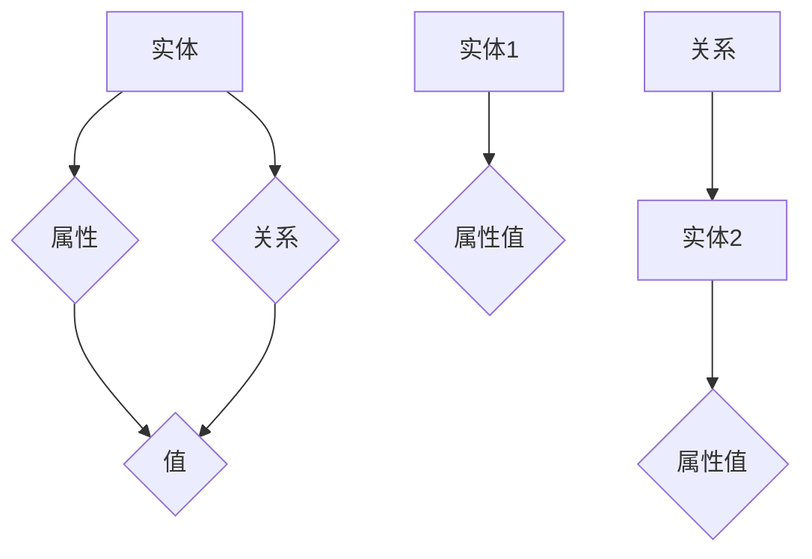

在这个流程图中，A、B、C 和 D 分别代表实体、属性、关系和属性值，而 A1、B1、C1 和 A2 则表示具体的实体和关系实例。

###### 1.1.2 知识图谱的应用领域

知识图谱的应用非常广泛，以下是一些主要的应用领域：

- **搜索引擎**：通过知识图谱来增强搜索结果的相关性和准确性。
- **智能问答**：提供基于知识图谱的智能问答服务，使系统能够理解用户的问题并给出准确回答。
- **推荐系统**：利用知识图谱来发现用户和物品之间的隐含关系，从而提供个性化的推荐。
- **自然语言处理**：通过知识图谱来提高文本理解和语义分析的准确性。
- **数据挖掘与分析**：利用知识图谱来发现数据中的潜在模式和关联。

知识图谱在不同领域的应用可以通过以下 Mermaid 流程图来表示：

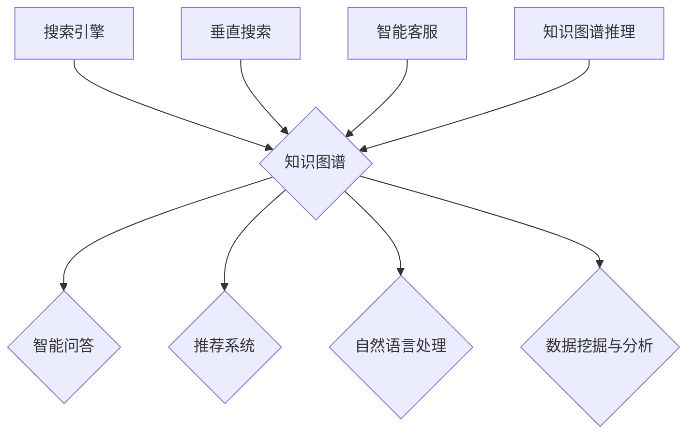

在这个流程图中，A、B、C、D、E、F、G、H 和 I 分别代表不同的应用领域，它们都与知识图谱密切相关。

###### 1.1.3 知识图谱的发展历史

知识图谱的概念最早可以追溯到 1990 年代，当时主要是基于框架表示方法。随着互联网和语义网络技术的发展，知识图谱在 2000 年代逐渐得到重视。以下是一些重要的发展里程碑：

- **1990s：框架表示方法**：早期的知识图谱主要通过框架表示方法来组织知识，例如框架表示语言 (Frame Representation Language, FRIL) 和 Kappa 知识表示语言。
- **2000s：本体论和OWL**：2000 年代，本体论和 Web 本体论语言 (Web Ontology Language, OWL) 的引入，使得知识图谱的表示和推理能力得到显著提升。
- **2010s：分布式知识图谱**：随着互联网和大数据技术的发展，分布式知识图谱技术开始出现，如 Freebase 和 DBpedia。
- **2020s：基于深度学习的知识图谱**：近年来，深度学习技术的发展为知识图谱带来了新的机遇，如基于图神经网络的深度学习模型。

知识图谱的发展历史可以通过以下 Mermaid 流程图来表示：

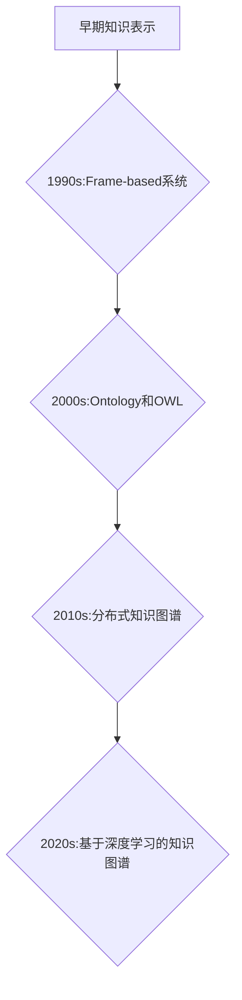

在这个流程图中，A、B、C、D 和 E 分别代表知识图谱发展的不同阶段。

##### 1.2 知识图谱的结构与组成

知识图谱由实体、属性、关系和类型等基本元素组成，这些元素通过特定的结构和关系相互连接，形成一个复杂的语义网络。

###### 1.2.1 实体与属性

实体是知识图谱中的基本对象，可以是人、地点、物品等。实体具有一些属性，这些属性用来描述实体的特征。例如，一个人的实体可以具有姓名、年龄、性别等属性。

实体和属性之间的关系可以用以下 Mermaid 流程图来表示：

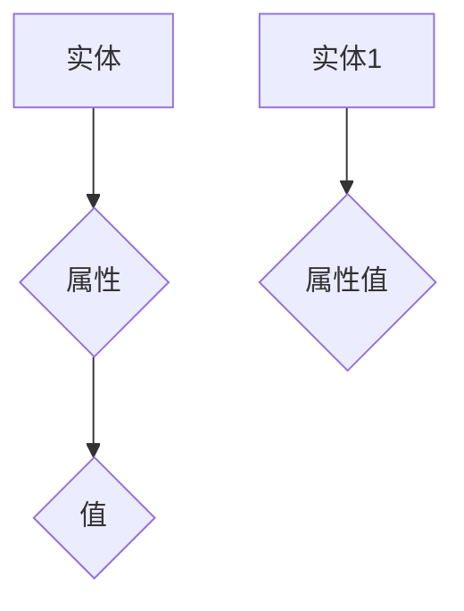

在这个流程图中，A 和 B 分别代表实体和属性，C 表示属性的值，而 A1 和 B1 则表示具体的实体和属性实例。

###### 1.2.2 关系与类型

关系是连接两个或多个实体的语义联系，例如“属于”、“位于”等。关系通常具有方向性，即有源实体和目标实体。例如，“属于”关系连接一个人和一个组织。

关系和类型之间的关系可以用以下 Mermaid 流程图来表示：

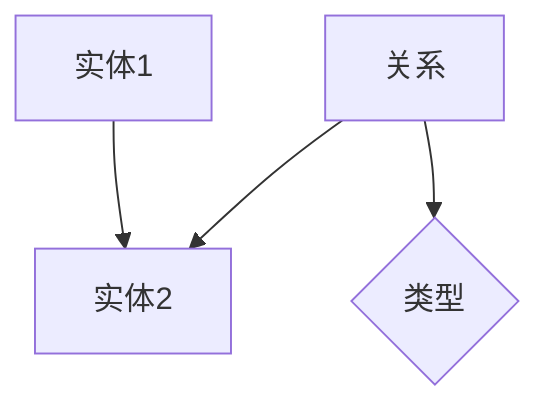

在这个流程图中，A 和 B 分别代表两个实体，C 表示它们之间的关系，而 D 表示关系的类型。

###### 1.2.3 知识图谱的存储与索引

知识图谱的存储与索引是确保其高效查询和推理的关键。常用的存储方案包括关系数据库、图数据库和键值存储等。关系数据库适用于小型知识图谱，而图数据库如 Neo4j 则适用于大型、复杂的知识图谱。

知识图谱的索引通常基于实体和关系的唯一标识，例如主键和唯一约束。此外，还可以使用全文索引和倒排索引来提高查询效率。

知识图谱的存储与索引可以通过以下 Mermaid 流程图来表示：

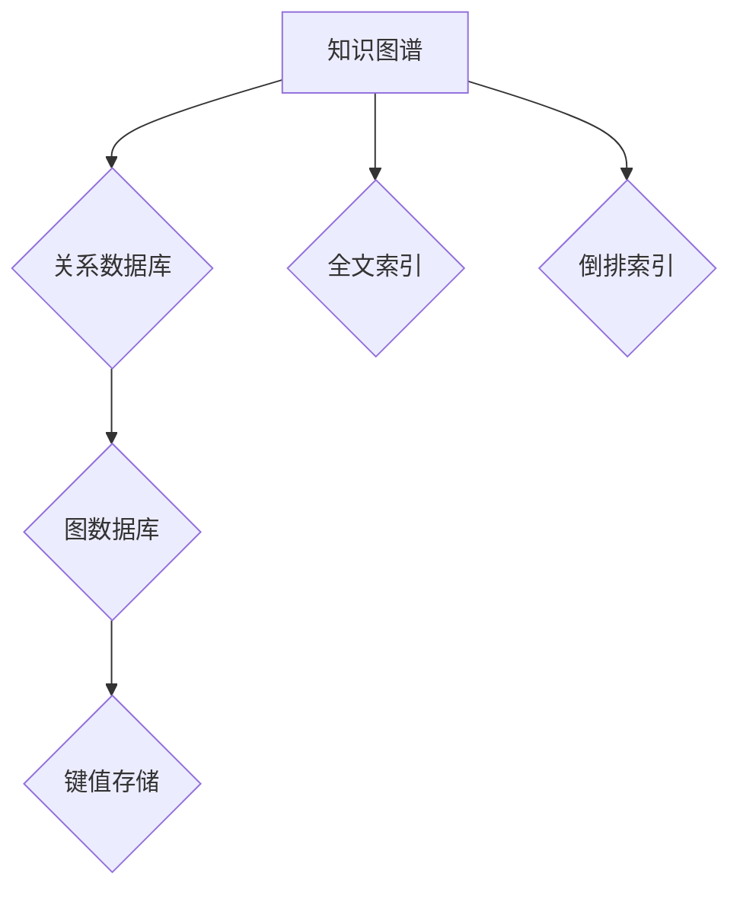

在这个流程图中，A 代表知识图谱，B、C 和 D 分别代表关系数据库、图数据库和键值存储，E 和 F 则分别代表全文索引和倒排索引。

##### 1.3 提示词工程概述

提示词工程是知识图谱构建中的一个重要环节，它旨在通过自动生成或选择合适的提示词来提高实体识别、关系抽取和知识融合的准确性。

###### 1.3.1 提示词工程的概念

提示词工程是一种结合自然语言处理和图神经网络的技术，用于从非结构化文本数据中提取语义信息，并将其转化为知识图谱中的实体和关系。

提示词工程的关键步骤包括数据预处理、实体识别、关系抽取和提示词生成。这些步骤共同作用，确保了知识图谱的质量和准确性。

###### 1.3.2 提示词工程的目标

提示词工程的目标是：
- 提高实体识别的准确性，确保实体能够被正确识别和分类。
- 提高关系抽取的准确性，确保实体之间的关系能够被准确捕捉。
- 提高知识融合的效率，确保不同来源的知识能够有效整合，形成一致和完整的知识图谱。

###### 1.3.3 提示词工程的关键挑战

提示词工程面临的关键挑战包括：
- **数据质量**：非结构化文本数据的质量参差不齐，可能导致实体和关系识别的准确性降低。
- **语义理解**：自然语言具有复杂性和多义性，使得语义理解成为一个挑战。
- **可扩展性**：随着数据规模的增加，提示词工程的方法需要具备良好的可扩展性，以适应大规模数据处理需求。
- **多样性**：不同领域和场景下的文本数据具有多样性，提示词工程的方法需要具备足够的适应性。

在接下来的章节中，我们将深入探讨提示词工程的具体方法和技术，以及它们在知识图谱构建中的应用。

### 第二部分：提示词工程方法

#### 第2章：数据预处理

数据预处理是提示词工程中的关键步骤，它旨在将原始的非结构化文本数据转化为适合进行实体识别和关系抽取的格式。数据预处理包括数据源选择、数据清洗与转换、实体识别与抽取、关系抽取和提示词生成等步骤。

##### 2.1 数据源选择

数据源的选择是数据预处理的第一步，它决定了后续处理步骤的质量和效果。常用的数据源包括：

- **开源数据集**：如 PubMed、WebNLG、ACE 等，这些数据集包含了大量结构化和非结构化文本数据，适合进行提示词工程。
- **闭源数据集**：企业内部或研究机构拥有的专有数据，这些数据可能包含敏感信息，需要特殊处理。
- **社交媒体数据**：如微博、Twitter 等，这些数据包含了大量实时信息，但质量参差不齐，需要严格清洗。

在选择数据源时，需要考虑数据的质量、规模、多样性以及与目标应用领域的相关性。

##### 2.1.1 开源数据集

开源数据集通常由学术机构、开源社区或政府机构提供，具有较好的质量和较大的规模。以下是一些常用的开源数据集：

- **PubMed**：包含了大量的医学文献，适合用于医疗知识图谱的构建。
- **WebNLG**：提供了大量的人工生成的自然语言文本，适合用于自然语言处理任务。
- **ACE**：包含了丰富的实体和关系信息，适合用于实体识别和关系抽取。

##### 2.1.2 闭源数据集

闭源数据集通常由企业内部或研究机构拥有，可能包含敏感信息，需要严格管理和控制。以下是一些常见的闭源数据集：

- **企业内部文档**：如合同、报告、邮件等，这些数据集包含了企业内部的详细信息，适合用于企业知识图谱的构建。
- **用户生成内容**：如论坛帖子、社交媒体评论等，这些数据集反映了用户的真实需求和观点，适合用于个性化推荐和智能问答。

##### 2.1.3 数据清洗与转换

数据清洗与转换是数据预处理中的重要环节，它旨在去除数据中的噪声和错误，并转换为适合进行实体识别和关系抽取的格式。

数据清洗的主要任务包括：

- **去除停用词**：停用词是指对文本语义没有贡献的常见词，如“的”、“是”、“在”等。去除停用词可以减少噪声，提高实体识别和关系抽取的准确性。
- **去除标点符号**：标点符号可能会影响实体识别和关系抽取的准确性，因此需要去除。
- **去除重复数据**：数据集中可能包含重复的文本，去除重复数据可以提高数据的质量和效率。
- **处理缺失值**：缺失值可能是由于数据采集过程中出现的问题，需要根据具体情况进行处理，例如填补缺失值或删除含有缺失值的记录。

数据转换的主要任务包括：

- **分词**：将文本分割为单词或短语，这是进行实体识别和关系抽取的基础。
- **词性标注**：为每个单词标注其词性，如名词、动词、形容词等，有助于理解文本的语义。
- **实体识别**：识别文本中的实体，如人名、地名、组织名等。
- **关系抽取**：识别实体之间的关系，如“工作于”、“位于”等。

数据清洗与转换的流程可以用以下 Mermaid 流程图表示：

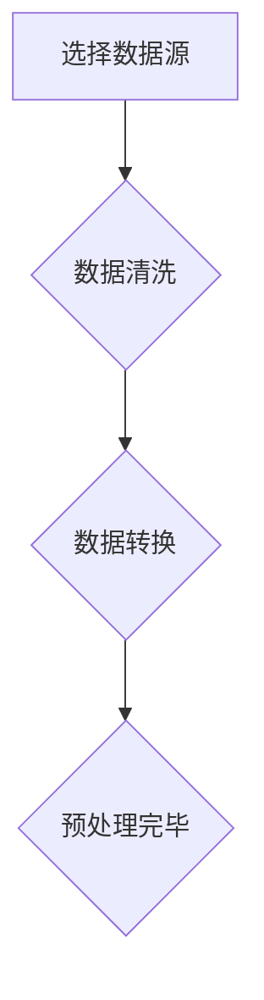

在这个流程图中，A、B、C 和 D 分别代表选择数据源、数据清洗、数据转换和预处理完毕。

##### 2.2 实体识别与抽取

实体识别与抽取是提示词工程中的核心步骤，它旨在从文本数据中识别出实体，并将其转化为知识图谱中的节点。实体识别与抽取的方法可以分为基于规则的方法、基于统计学习方法、基于深度学习方法等。

###### 2.2.1 基于规则的方法

基于规则的方法是一种传统的实体识别与抽取方法，它通过预定义的规则来匹配文本中的实体。这种方法具有以下优点：

- **简单易实现**：基于规则的系统可以通过手工编写规则来实现，适合小型应用场景。
- **可控性强**：通过手工编写规则，可以精确控制实体识别和抽取的过程。

基于规则的方法的流程可以用以下 Mermaid 流程图表示：

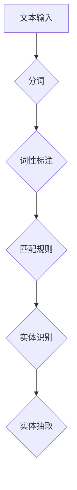

在这个流程图中，A、B、C、D、E 和 F 分别代表文本输入、分词、词性标注、匹配规则、实体识别和实体抽取。

基于规则的方法的主要缺点是：

- **规则数量庞大**：需要大量的人工编写规则，随着文本数据的增加，规则的数量也会急剧增加。
- **适应性差**：基于规则的系统在处理新的文本数据时，可能需要重新编写规则。

###### 2.2.2 基于统计学习方法

基于统计学习方法是一种基于机器学习的实体识别与抽取方法，它通过训练数据学习出实体识别和抽取的模式。这种方法具有以下优点：

- **适应性**：可以通过训练数据自动学习，适应不同领域和场景的实体识别和抽取任务。
- **可扩展性**：基于统计学习方法可以处理大规模的文本数据，适应于实时应用场景。

基于统计学习方法的主要缺点是：

- **训练数据依赖**：需要大量的训练数据来学习实体识别和抽取的模式，数据质量直接影响系统的性能。
- **模型复杂性**：统计学习方法通常涉及复杂的数学模型和优化算法，需要专业的知识来理解和实现。

基于统计学习方法的一般流程可以用以下 Mermaid 流程图表示：


在这个流程图中，A、B、C、D、E、F 和 G 分别代表文本输入、分词、词性标注、特征提取、模型训练、实体识别和实体抽取。

常见的基于统计学习方法包括：

- **条件随机场 (CRF)**：CRF 是一种常用的序列标注模型，可以用来进行实体识别和抽取。它通过学习序列的概率分布，实现对实体的序列标注。
- **最大熵模型**：最大熵模型是一种基于概率分布的模型，可以通过学习特征的概率分布来实现实体识别和抽取。

###### 2.2.3 基于深度学习方法

基于深度学习方法是一种利用深度神经网络进行实体识别与抽取的方法。深度学习方法具有以下优点：

- **强大的表达能力**：深度神经网络可以通过多层非线性变换，实现对复杂特征的自动学习。
- **端到端模型**：深度学习方法可以实现从文本输入到实体识别和抽取的端到端建模，减少了手工特征工程的需求。

基于深度学习方法的主要缺点是：

- **数据需求**：深度学习方法通常需要大量的训练数据来学习模型，数据质量直接影响模型的性能。
- **计算资源需求**：深度学习模型的训练和推理通常需要大量的计算资源，不适合实时应用场景。

常见的基于深度学习方法包括：

- **循环神经网络 (RNN)**：RNN 是一种用于序列建模的神经网络，可以通过学习序列的长期依赖关系来实现实体识别和抽取。
- **长短时记忆网络 (LSTM)**：LSTM 是 RNN 的一种变体，通过引入门控机制，可以更好地处理序列的长期依赖问题。
- **卷积神经网络 (CNN)**：CNN 是一种用于图像处理的神经网络，可以通过卷积操作提取图像的局部特征，也可以用于实体识别和抽取。
- **图神经网络 (GNN)**：GNN 是一种用于图数据建模的神经网络，可以通过学习图的结构和节点特征来实现实体识别和抽取。

基于深度学习方法的一般流程可以用以下 Mermaid 流程图表示：

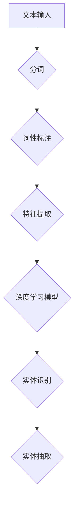

在这个流程图中，A、B、C、D、E、F 和 G 分别代表文本输入、分词、词性标注、特征提取、深度学习模型、实体识别和实体抽取。

常见的深度学习框架包括：

- **TensorFlow**：TensorFlow 是 Google 开发的一款开源深度学习框架，具有丰富的模型库和工具支持。
- **PyTorch**：PyTorch 是 Facebook 开发的一款开源深度学习框架，具有灵活的动态计算图和强大的 GPU 加速功能。
- **Keras**：Keras 是一款基于 TensorFlow 的开源深度学习框架，提供简洁的 API 和丰富的模型库。

##### 2.3 关系抽取

关系抽取是提示词工程中的另一个核心步骤，它旨在从文本数据中识别出实体之间的关系。关系抽取的方法可以分为基于规则的方法、基于统计学习方法、基于深度学习方法等。

###### 2.3.1 基于规则的方法

基于规则的方法是一种传统的实体关系抽取方法，它通过预定义的规则来匹配文本中的关系。这种方法具有以下优点：

- **简单易实现**：基于规则的系统可以通过手工编写规则来实现，适合小型应用场景。
- **可控性强**：通过手工编写规则，可以精确控制实体关系抽取的过程。

基于规则的方法的流程可以用以下 Mermaid 流程图表示：

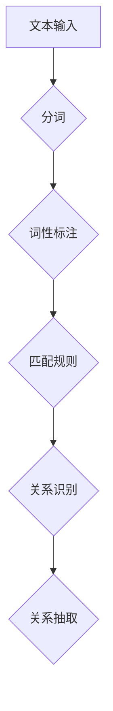

在这个流程图中，A、B、C、D、E 和 F 分别代表文本输入、分词、词性标注、匹配规则、关系识别和关系抽取。

基于规则的方法的主要缺点是：

- **规则数量庞大**：需要大量的人工编写规则，随着文本数据的增加，规则的数量也会急剧增加。
- **适应性差**：基于规则的系统在处理新的文本数据时，可能需要重新编写规则。

###### 2.3.2 基于统计学习方法

基于统计学习方法是一种基于机器学习的实体关系抽取方法，它通过训练数据学习出实体关系抽取的模式。这种方法具有以下优点：

- **适应性**：可以通过训练数据自动学习，适应不同领域和场景的实体关系抽取任务。
- **可扩展性**：基于统计学习方法可以处理大规模的文本数据，适应于实时应用场景。

基于统计学习方法的主要缺点是：

- **训练数据依赖**：需要大量的训练数据来学习实体关系抽取的模式，数据质量直接影响系统的性能。
- **模型复杂性**：统计学习方法通常涉及复杂的数学模型和优化算法，需要专业的知识来理解和实现。

基于统计学习方法的一般流程可以用以下 Mermaid 流程图表示：

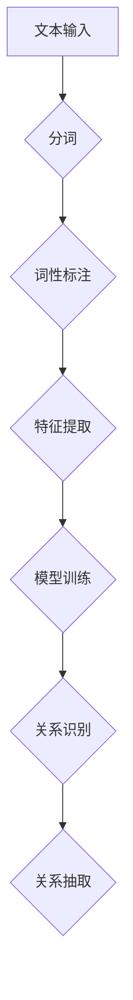

在这个流程图中，A、B、C、D、E、F 和 G 分别代表文本输入、分词、词性标注、特征提取、模型训练、关系识别和关系抽取。

常见的基于统计学习方法包括：

- **条件随机场 (CRF)**：CRF 是一种常用的序列标注模型，可以用来进行实体关系抽取。它通过学习序列的概率分布，实现对关系的序列标注。
- **最大熵模型**：最大熵模型是一种基于概率分布的模型，可以通过学习特征的概率分布来实现实体关系抽取。

###### 2.3.3 基于深度学习方法

基于深度学习方法是一种利用深度神经网络进行实体关系抽取的方法。深度学习方法具有以下优点：

- **强大的表达能力**：深度神经网络可以通过多层非线性变换，实现对复杂特征的自动学习。
- **端到端模型**：深度学习方法可以实现从文本输入到实体关系抽取的端到端建模，减少了手工特征工程的需求。

基于深度学习方法的主要缺点是：

- **数据需求**：深度学习方法通常需要大量的训练数据来学习模型，数据质量直接影响模型的性能。
- **计算资源需求**：深度学习模型的训练和推理通常需要大量的计算资源，不适合实时应用场景。

常见的基于深度学习方法包括：

- **循环神经网络 (RNN)**：RNN 是一种用于序列建模的神经网络，可以通过学习序列的长期依赖关系来实现实体关系抽取。
- **长短时记忆网络 (LSTM)**：LSTM 是 RNN 的一种变体，通过引入门控机制，可以更好地处理序列的长期依赖问题。
- **卷积神经网络 (CNN)**：CNN 是一种用于图像处理的神经网络，可以通过卷积操作提取图像的局部特征，也可以用于实体关系抽取。
- **图神经网络 (GNN)**：GNN 是一种用于图数据建模的神经网络，可以通过学习图的结构和节点特征来实现实体关系抽取。

基于深度学习方法的一般流程可以用以下 Mermaid 流程图表示：


在这个流程图中，A、B、C、D、E、F 和 G 分别代表文本输入、分词、词性标注、特征提取、深度学习模型、关系识别和关系抽取。

常见的深度学习框架包括：

- **TensorFlow**：TensorFlow 是 Google 开发的一款开源深度学习框架，具有丰富的模型库和工具支持。
- **PyTorch**：PyTorch 是 Facebook 开发的一款开源深度学习框架，具有灵活的动态计算图和强大的 GPU 加速功能。
- **Keras**：Keras 是一款基于 TensorFlow 的开源深度学习框架，提供简洁的 API 和丰富的模型库。

##### 2.4 提示词生成

提示词生成是提示词工程中的关键步骤，它旨在为实体识别、关系抽取和知识融合提供合适的提示词。提示词生成的方法可以分为基于模板的方法、基于机器学习的方法等。

###### 2.4.1 提示词生成算法概述

提示词生成算法的核心任务是自动生成或选择合适的提示词，以辅助实体识别、关系抽取和知识融合。以下是一些常见的提示词生成算法：

- **基于模板的提示词生成**：通过预定义的模板来生成提示词，适用于简单且规则化的场景。
- **基于机器学习的提示词生成**：通过训练数据学习生成提示词的模式，适用于复杂且多变的数据场景。

提示词生成算法的一般流程可以用以下 Mermaid 流程图表示：

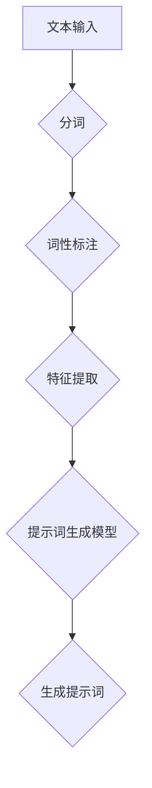

在这个流程图中，A、B、C、D、E 和 F 分别代表文本输入、分词、词性标注、特征提取、提示词生成模型和生成提示词。

###### 2.4.2 基于模板的提示词生成

基于模板的提示词生成方法通过预定义的模板来生成提示词，适用于简单且规则化的场景。这种方法的主要步骤包括：

1. **模板定义**：定义用于生成提示词的模板，例如“{实体}的{属性}是什么？”。
2. **文本匹配**：将模板与文本进行匹配，提取出与模板对应的提示词。
3. **提示词生成**：根据匹配结果生成提示词。

基于模板的提示词生成方法的一般流程可以用以下 Mermaid 流程图表示：

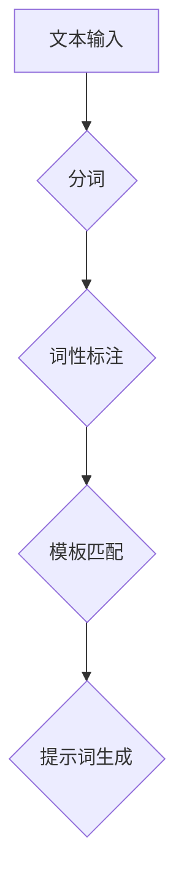

在这个流程图中，A、B、C、D 和 E 分别代表文本输入、分词、词性标注、模板匹配和提示词生成。

示例：

假设文本为“苹果公司是一家位于美国的科技公司，其总部位于加州库比蒂诺。”

模板：“{实体}的{属性}是什么？”

匹配结果：

- 实体：苹果公司
- 属性：总部

生成的提示词：“苹果公司的总部是什么？”

基于模板的提示词生成方法具有以下优点：

- **简单易实现**：通过预定义模板，可以快速生成提示词。
- **易于理解**：生成的提示词具有明确的语义和结构。

基于模板的提示词生成方法的主要缺点是：

- **适用性有限**：适用于简单且规则化的场景，对于复杂和多变的数据场景，可能生成效果不佳。
- **模板维护困难**：随着数据的变化和扩展，需要不断更新和维护模板。

###### 2.4.3 基于机器学习的提示词生成

基于机器学习的提示词生成方法通过训练数据学习生成提示词的模式，适用于复杂且多变的数据场景。这种方法的主要步骤包括：

1. **数据集准备**：准备包含实体、关系和提示词的训练数据。
2. **特征提取**：提取文本中的特征，用于训练提示词生成模型。
3. **模型训练**：使用训练数据训练提示词生成模型。
4. **提示词生成**：使用训练好的模型生成提示词。

基于机器学习的提示词生成方法的一般流程可以用以下 Mermaid 流程图表示：

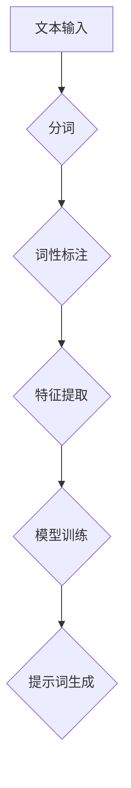

在这个流程图中，A、B、C、D、E 和 F 分别代表文本输入、分词、词性标注、特征提取、模型训练和提示词生成。

常见的基于机器学习的提示词生成方法包括：

- **生成对抗网络 (GAN)**：GAN 是一种通过生成器和判别器相互对抗的训练方法，可以生成高质量的提示词。
- **变换器 (Transformer)**：Transformer 是一种基于自注意力机制的深度学习模型，可以用于提示词生成。

示例：

假设训练数据包含以下样本：

```
实体：苹果公司
关系：总部
提示词：苹果公司的总部是哪里？
```

使用 GAN 模型进行提示词生成：

1. **数据集准备**：将样本转换为输入和输出格式，例如 `["苹果公司", "总部", "苹果公司的总部是哪里？"]`。
2. **特征提取**：提取文本中的特征，例如词嵌入。
3. **模型训练**：使用训练数据训练 GAN 模型。
4. **提示词生成**：使用训练好的 GAN 模型生成新的提示词。

生成的提示词示例：“谷歌公司的总部在哪里？”

基于机器学习的提示词生成方法具有以下优点：

- **适应性**：可以处理复杂和多变的数据场景，生成高质量的提示词。
- **灵活性**：可以根据不同的数据集和应用场景进行模型调整和优化。

基于机器学习的提示词生成方法的主要缺点是：

- **数据依赖**：需要大量的训练数据来训练模型，数据质量直接影响生成效果。
- **计算资源需求**：训练 GAN 模型和 Transformer 模型通常需要大量的计算资源。

通过上述方法，我们可以有效地进行提示词生成，为实体识别、关系抽取和知识融合提供有效的支持。在接下来的章节中，我们将进一步探讨提示词工程在知识图谱构建中的应用。

### 第三部分：知识融合与图谱构建

知识融合与图谱构建是知识图谱构建中的关键环节，旨在将多个来源的知识整合到一个统一的结构中。知识融合的目标是实现知识的统一表示、融合和推理，以提高知识图谱的整体质量和应用价值。

#### 第3章：知识融合与图谱构建

##### 3.1 知识融合概述

知识融合是指将来自不同来源、不同格式、不同粒度的知识进行整合和统一表示的过程。知识融合在知识图谱构建中具有重要意义，它能够提高知识图谱的完整性和一致性，从而增强其应用价值。

###### 3.1.1 知识融合的概念

知识融合可以理解为一种跨领域、跨来源的知识整合过程，其核心目标是实现不同知识源的统一表示和融合。知识融合的关键步骤包括：

1. **知识表示**：将不同来源的知识转换为统一的表示形式，例如实体、属性和关系。
2. **知识匹配**：通过相似性度量或规则匹配等方法，将不同来源的实体和关系进行匹配和关联。
3. **知识整合**：将匹配后的知识进行整合，形成一个统一的知识图谱。
4. **知识推理**：利用知识图谱进行推理，发现新的知识和关联。

知识融合的流程可以用以下 Mermaid 流程图表示：

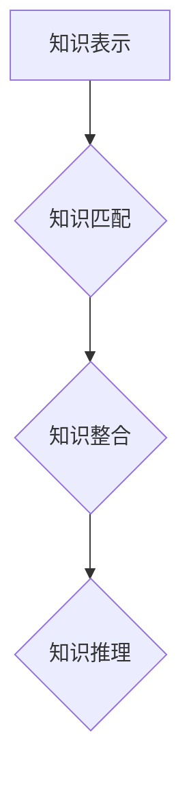

在这个流程图中，A、B、C 和 D 分别代表知识表示、知识匹配、知识整合和知识推理。

###### 3.1.2 知识融合的类型

根据知识融合的目标和方式，知识融合可以分为以下几种类型：

1. **垂直融合**：将来自同一领域或主题的不同数据源进行融合，例如医疗知识融合、金融知识融合等。
2. **水平融合**：将来自不同领域或主题的数据源进行融合，例如跨领域知识融合、多语言知识融合等。
3. **异构融合**：将不同类型的数据源进行融合，例如结构化数据、非结构化数据和半结构化数据等。
4. **多源融合**：将来自多个不同来源的数据源进行融合，例如企业内部数据融合、互联网数据融合等。

知识融合的类型可以通过以下 Mermaid 流程图表示：

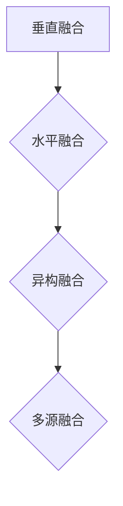

在这个流程图中，A、B、C 和 D 分别代表垂直融合、水平融合、异构融合和多源融合。

###### 3.1.3 知识融合的挑战

知识融合在知识图谱构建中面临诸多挑战，包括：

1. **数据质量**：不同来源的数据可能存在噪声、错误和冗余，影响知识融合的效果。
2. **数据一致性**：不同数据源之间的实体和关系可能存在命名冲突、数据格式不一致等问题，影响知识融合的准确性。
3. **数据多样性**：不同数据源可能具有不同的粒度、格式和语义，需要有效的方法进行融合和整合。
4. **计算资源**：知识融合通常涉及大规模数据处理和复杂算法，需要大量的计算资源和时间。
5. **推理能力**：知识融合后的知识图谱需要具备较强的推理能力，以发现新的知识和关联。

知识融合的挑战可以通过以下 Mermaid 流程图表示：

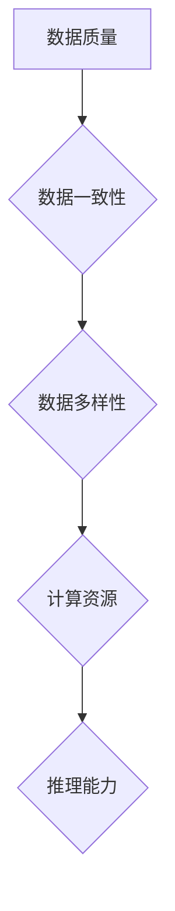

在这个流程图中，A、B、C、D 和 E 分别代表数据质量、数据一致性、数据多样性、计算资源和推理能力。

##### 3.2 基于图谱的构建方法

基于图谱的构建方法是知识图谱构建中的常用方法，它通过构建大规模的知识图谱来实现知识的统一表示和融合。基于图谱的构建方法可以分为传统方法和基于深度学习的方法。

###### 3.2.1 传统图谱构建方法

传统图谱构建方法主要包括基于规则的方法、基于统计学习方法的方法和基于本体论的方法等。

1. **基于规则的方法**：基于规则的方法通过预定义的规则来构建知识图谱，例如实体识别规则、关系抽取规则等。这种方法具有以下优点：

   - **简单易实现**：通过手工编写规则，可以快速构建知识图谱。
   - **可控性强**：通过预定义规则，可以精确控制知识图谱的构建过程。

   但这种方法也存在以下缺点：

   - **规则维护困难**：随着数据规模的增加，规则的数量也会急剧增加，维护难度大。
   - **适应性差**：对于新的数据场景，可能需要重新编写规则。

   基于规则的方法的一般流程可以用以下 Mermaid 流程图表示：

   ```mermaid
   graph TD
       A[文本输入] --> B{分词}
       B --> C{词性标注}
       C --> D{规则匹配}
       D --> E{知识图谱构建}
   ```

   在这个流程图中，A、B、C、D 和 E 分别代表文本输入、分词、词性标注、规则匹配和知识图谱构建。

2. **基于统计学习方法的方法**：基于统计学习方法通过训练数据学习知识图谱的构建模式，例如实体识别和关系抽取。这种方法具有以下优点：

   - **适应性**：可以通过训练数据自动学习，适应不同领域和场景的知识图谱构建任务。
   - **可扩展性**：基于统计学习方法可以处理大规模的数据集，适应于实时应用场景。

   但这种方法也存在以下缺点：

   - **数据依赖**：需要大量的训练数据来学习知识图谱的构建模式，数据质量直接影响系统的性能。
   - **模型复杂性**：统计学习方法通常涉及复杂的数学模型和优化算法，需要专业的知识来理解和实现。

   基于统计学习方法的一般流程可以用以下 Mermaid 流程图表示：

   ```mermaid
   graph TD
       A[文本输入] --> B{分词}
       B --> C{词性标注}
       C --> D{特征提取}
       D --> E{模型训练}
       E --> F{知识图谱构建}
   ```

   在这个流程图中，A、B、C、D、E 和 F 分别代表文本输入、分词、词性标注、特征提取、模型训练和知识图谱构建。

   常见的基于统计学习方法包括：

   - **条件随机场 (CRF)**：CRF 是一种常用的序列标注模型，可以用来进行实体识别和关系抽取。
   - **最大熵模型**：最大熵模型是一种基于概率分布的模型，可以通过学习特征的概率分布来实现实体识别和关系抽取。

3. **基于本体论的方法**：基于本体论的方法通过本体论来构建知识图谱，本体论是一种用于描述领域知识的语义模型。这种方法具有以下优点：

   - **语义一致性**：通过本体论来描述领域知识，可以确保知识图谱的语义一致性。
   - **可扩展性**：本体论提供了灵活的语义描述框架，可以适应不同领域和场景的知识图谱构建。

   但这种方法也存在以下缺点：

   - **本体构建复杂**：构建本体需要专业知识和经验，本体构建复杂且耗时。
   - **推理能力有限**：本体论提供的推理能力有限，难以处理复杂的推理任务。

   基于本体论的方法的一般流程可以用以下 Mermaid 流程图表示：

   ```mermaid
   graph TD
       A[本体构建] --> B{知识抽取}
       B --> C{知识整合}
       C --> D{知识图谱构建}
   ```

   在这个流程图中，A、B、C 和 D 分别代表本体构建、知识抽取、知识整合和知识图谱构建。

###### 3.2.2 基于深度学习的图谱构建方法

基于深度学习的图谱构建方法利用深度神经网络来构建知识图谱，这种方法具有强大的表达能力和自动学习能力。基于深度学习的图谱构建方法可以分为基于图神经网络的方法和基于变换器的方法。

1. **基于图神经网络的方法**：图神经网络（Graph Neural Networks, GNNs）是一种专门用于图数据建模的神经网络。GNNs 可以通过学习图的结构和节点特征来实现知识图谱的构建。GNNs 的一般架构包括节点更新和边更新两部分。

   节点更新公式：

   $$
   h_v^{(l+1)} = \sigma\left(\sum_{u \in \mathcal{N}(v)} W^{(l)} h_u^{(l)} + b^{(l)}\right)
   $$

   边更新公式：

   $$
   h_e^{(l+1)} = \frac{1}{|\mathcal{N}(v)|} \sum_{u \in \mathcal{N}(v)} h_v^{(l+1)} + h_u^{(l+1)}
   $$

   其中，$h_v^{(l)}$ 和 $h_e^{(l)}$ 分别是第 $l$ 层的节点特征和边特征，$\mathcal{N}(v)$ 表示节点 $v$ 的邻居集合，$W^{(l)}$ 是权重矩阵，$b^{(l)}$ 是偏置项，$\sigma$ 是激活函数。

   基于图神经网络的方法的一般流程可以用以下 Mermaid 流程图表示：

   ```mermaid
   graph TD
       A[图神经网络] --> B{节点更新}
       B --> C{边更新}
       C --> D{知识图谱构建}
   ```

   在这个流程图中，A、B、C 和 D 分别代表图神经网络、节点更新、边更新和知识图谱构建。

   常见的图神经网络模型包括：

   - **图卷积网络（GCN）**：GCN 是一种基于图卷积的神经网络，通过学习节点的邻域信息来实现知识图谱的构建。
   - **图注意力网络（GAT）**：GAT 是一种基于图注意力的神经网络，通过学习节点间的注意力权重来实现知识图谱的构建。
   - **图变换器（GTransformer）**：GTransformer 是一种基于图变换器的神经网络，通过学习图的结构和节点特征来实现知识图谱的构建。

2. **基于变换器的方法**：变换器（Transformer）是一种基于自注意力机制的深度学习模型，最初用于自然语言处理任务。近年来，变换器也被广泛应用于知识图谱构建领域。

   变换器的一般架构包括编码器和解码器两部分，通过编码器和解码器之间的交互，实现知识的编码和解码。

   编码器公式：

   $$
   E = \sum_{i=1}^n a_{ij} \cdot e_i
   $$

   解码器公式：

   $$
   D = \sum_{i=1}^n b_{ij} \cdot d_i
   $$

   其中，$E$ 和 $D$ 分别是编码器和解码器的输出，$a_{ij}$ 和 $b_{ij}$ 分别是编码器和解码器的注意力权重，$e_i$ 和 $d_i$ 分别是编码器和解码器的输入。

   基于变换器的方法的一般流程可以用以下 Mermaid 流程图表示：

   ```mermaid
   graph TD
       A[编码器] --> B{自注意力}
       B --> C{编码输出}
       C --> D[解码器]
       D --> E{解码输出}
   ```

   在这个流程图中，A、B、C、D 和 E 分别代表编码器、自注意力、编码输出、解码器和解码输出。

   常见的变换器模型包括：

   - **BERT**：BERT 是一种基于变换器的预训练模型，通过预训练和微调，实现高质量的文本表示和序列标注。
   - **GPT**：GPT 是一种基于变换器的生成模型，通过学习文本的上下文信息，实现高质量的文本生成。
   - **T5**：T5 是一种基于变换器的统一文本处理模型，通过端到端建模，实现多种自然语言处理任务。

基于深度学习的图谱构建方法具有以下优点：

- **强大的表达能力**：基于深度学习的模型可以通过多层非线性变换，实现对复杂特征的自动学习，从而提高知识图谱的构建效果。
- **自动学习能力**：基于深度学习的模型可以通过大量的训练数据自动学习，适应不同领域和场景的知识图谱构建任务。

但这种方法也存在以下缺点：

- **数据依赖**：基于深度学习的模型需要大量的训练数据来训练模型，数据质量直接影响模型的性能。
- **计算资源需求**：基于深度学习的模型通常需要大量的计算资源和时间来训练和推理，不适合实时应用场景。

##### 3.3 提示词在知识图谱构建中的应用

提示词工程在知识图谱构建中发挥着重要作用，它能够提高实体识别、关系抽取和知识融合的准确性，从而提升知识图谱的整体质量。在知识图谱构建中，提示词的应用主要体现在以下三个方面：

1. **实体识别**：提示词可以用于辅助实体识别，通过生成或选择合适的提示词，提高实体识别的准确性。提示词的生成方法可以分为基于模板的方法和基于机器学习的方法。基于模板的方法通过预定义的模板来生成提示词，适用于简单且规则化的场景；基于机器学习的方法通过训练数据学习生成提示词的模式，适用于复杂且多变的数据场景。

2. **关系抽取**：提示词可以用于辅助关系抽取，通过生成或选择合适的提示词，提高关系抽取的准确性。提示词的生成方法同样可以分为基于模板的方法和基于机器学习的方法。基于模板的方法通过预定义的模板来生成提示词，适用于简单且规则化的场景；基于机器学习的方法通过训练数据学习生成提示词的模式，适用于复杂且多变的数据场景。

3. **知识融合**：提示词可以用于辅助知识融合，通过生成或选择合适的提示词，提高知识融合的准确性。提示词的生成方法可以分为基于模板的方法和基于机器学习的方法。基于模板的方法通过预定义的模板来生成提示词，适用于简单且规则化的场景；基于机器学习的方法通过训练数据学习生成提示词的模式，适用于复杂且多变的数据场景。

提示词在知识图谱构建中的应用可以通过以下 Mermaid 流程图表示：

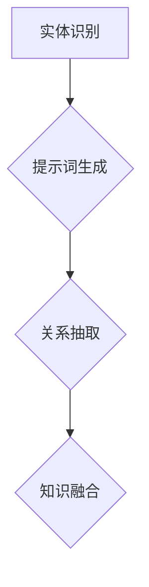

在这个流程图中，A、B、C 和 D 分别代表实体识别、提示词生成、关系抽取和知识融合。

在实际应用中，提示词工程的方法和技术可以根据具体场景和需求进行灵活调整和优化，以提高知识图谱构建的效果和质量。通过结合不同的提示词生成方法和技术，可以有效地解决知识图谱构建中的实体识别、关系抽取和知识融合等问题，从而实现知识图谱的高效构建和应用。

### 第四部分：提示词工程应用案例

#### 第4章：案例研究一：医疗知识图谱构建

在本章中，我们将通过一个医疗知识图谱构建的案例，详细展示提示词工程的应用。医疗知识图谱在医疗信息处理、智能诊断和个性化治疗等方面具有广泛的应用价值。本案例将涵盖数据集与预处理、实体识别与关系抽取、知识融合与图谱构建，以及提示词工程在其中的具体应用。

##### 4.1 医疗知识图谱的重要性

医疗知识图谱是一种将医疗领域的知识结构化、语义化的工具，它能够帮助医疗专业人员更高效地处理和分析医疗信息。医疗知识图谱的重要性体现在以下几个方面：

- **提升诊断效率**：通过医疗知识图谱，医生可以快速检索和利用医学知识，辅助疾病诊断。
- **支持智能决策**：医疗知识图谱可以支持智能决策系统，为医生提供诊疗建议和治疗方案。
- **个性化医疗**：医疗知识图谱可以帮助实现个性化医疗，根据患者的具体情况进行定制化治疗。
- **药物研发**：医疗知识图谱可以为药物研发提供丰富的知识支持，加速新药研发进程。

##### 4.2 数据集与预处理

医疗知识图谱的构建依赖于高质量的数据集。在本案例中，我们使用以下数据集：

- **PubMed**：包含大量医学文献，是构建医疗知识图谱的重要数据源。
- **NIH Clinical Center**：包含临床研究数据，可以用于实体识别和关系抽取。

预处理过程主要包括以下步骤：

- **数据清洗**：去除数据中的噪声和错误，如去除重复记录、纠正拼写错误等。
- **文本预处理**：包括分词、词性标注、停用词去除等，以便于后续的实体识别和关系抽取。
- **数据标准化**：将不同来源的数据格式统一，如统一实体名称的命名规范。

##### 4.3 实体识别与关系抽取

实体识别与关系抽取是构建医疗知识图谱的关键步骤。在本案例中，我们采用以下方法：

###### 4.3.1 实体识别

- **基于规则的实体识别**：利用预定义的规则识别医学实体，如疾病、症状、药物等。这种方法简单易实现，但规则维护工作量较大。

```mermaid
graph TD
    A[文本] --> B{分词}
    B --> C{词性标注}
    C --> D{匹配规则}
    D --> E{实体识别}
    E --> F{实体列表}
```

- **基于统计学习的实体识别**：利用训练数据学习实体识别模型，如条件随机场（CRF）。这种方法适应性更强，但需要大量的训练数据。

```mermaid
graph TD
    A[文本] --> B{分词}
    B --> C{词性标注}
    C --> D{特征提取}
    D --> E{模型训练}
    E --> F{实体识别}
    F --> G{实体列表}
```

- **基于深度学习的实体识别**：利用深度学习模型进行实体识别，如卷积神经网络（CNN）和循环神经网络（RNN）。这种方法表达能力更强，但计算资源需求较高。

```mermaid
graph TD
    A[文本] --> B{分词}
    B --> C{词性标注}
    C --> D{特征提取}
    D --> E{深度学习模型}
    E --> F{实体识别}
    F --> G{实体列表}
```

###### 4.3.2 关系抽取

- **基于规则的实体关系抽取**：利用预定义的规则识别实体间的关系，如“患有”、“服用”等。这种方法简单易实现，但规则维护工作量较大。

```mermaid
graph TD
    A[实体列表] --> B{匹配规则}
    B --> C{关系列表}
```

- **基于统计学习的关系抽取**：利用训练数据学习关系抽取模型，如最大熵模型（MaxEnt）和条件随机场（CRF）。这种方法适应性更强，但需要大量的训练数据。

```mermaid
graph TD
    A[实体列表] --> B{特征提取}
    B --> C{模型训练}
    C --> D{关系抽取}
    D --> E{关系列表}
```

- **基于深度学习的关系抽取**：利用深度学习模型进行关系抽取，如长短期记忆网络（LSTM）和图卷积网络（GCN）。这种方法表达能力更强，但计算资源需求较高。

```mermaid
graph TD
    A[实体列表] --> B{特征提取}
    B --> C{深度学习模型}
    C --> D{关系抽取}
    D --> E{关系列表}
```

##### 4.4 知识融合与图谱构建

在完成实体识别和关系抽取后，我们需要进行知识融合和图谱构建。知识融合的目标是将不同来源、不同格式和不同粒度的知识进行整合，形成一个统一的结构。

###### 4.4.1 知识融合

知识融合的主要步骤包括：

1. **实体融合**：将相同实体的不同名称进行统一，如“艾滋病”和“AIDS”。
2. **关系融合**：将相同关系但名称不同的实体进行关联，如“患有”和“感染”。
3. **数据清洗**：去除重复和冗余的知识，提高知识图谱的质量。

知识融合的流程可以用以下 Mermaid 流程图表示：

```mermaid
graph TD
    A[实体列表] --> B{实体融合}
    B --> C[关系列表]
    C --> D{关系融合}
    D --> E{知识融合}
```

###### 4.4.2 图谱构建

图谱构建的主要步骤包括：

1. **定义实体和关系**：根据知识融合后的结果，定义实体和关系。
2. **建立图结构**：利用图数据库（如Neo4j）建立知识图谱的图结构。
3. **存储知识**：将实体和关系存储到图数据库中，形成知识图谱。

图谱构建的流程可以用以下 Mermaid 流程图表示：

```mermaid
graph TD
    A[实体和关系] --> B{图数据库}
    B --> C{存储知识}
    C --> D{知识图谱}
```

##### 4.5 提示词工程在医疗知识图谱中的应用

提示词工程在医疗知识图谱的构建中发挥着重要作用。在本案例中，我们使用以下方法生成提示词：

1. **基于模板的提示词生成**：通过预定义的模板生成提示词，如“哪些疾病与{实体}相关？”。

```mermaid
graph TD
    A[实体] --> B{模板匹配}
    B --> C{提示词生成}
    C --> D{提示词列表}
```

2. **基于机器学习的提示词生成**：利用训练数据学习生成提示词的模式，如使用生成对抗网络（GAN）。

```mermaid
graph TD
    A[实体列表] --> B{特征提取}
    B --> C{模型训练}
    C --> D{提示词生成}
    D --> E{提示词列表}
```

提示词工程的具体应用包括：

- **辅助实体识别**：通过生成的提示词，辅助实体识别模型的训练，提高识别准确性。
- **辅助关系抽取**：通过生成的提示词，辅助关系抽取模型的训练，提高抽取准确性。
- **知识融合**：通过生成的提示词，帮助知识融合过程，提高知识图谱的质量。

提示词工程在医疗知识图谱构建中的应用流程可以用以下 Mermaid 流程图表示：

```mermaid
graph TD
    A[实体识别] --> B{提示词生成}
    B --> C{关系抽取}
    C --> D{知识融合}
    D --> E{知识图谱构建}
```

通过上述步骤，我们完成了医疗知识图谱的构建。该知识图谱可以用于辅助医疗诊断、支持智能决策和实现个性化治疗，从而提升医疗服务质量和效率。

#### 第5章：案例研究二：企业知识图谱构建

在本章中，我们将通过一个企业知识图谱构建的案例，详细展示提示词工程的应用。企业知识图谱可以帮助企业更好地管理和利用内部知识，提高信息检索和决策效率。

##### 5.1 企业知识图谱概述

企业知识图谱是企业内部知识的结构化表示，它将企业的各种信息和知识资源以图的形式组织起来，方便企业内部人员快速检索和使用。企业知识图谱通常包含以下几类信息：

- **员工信息**：包括员工姓名、职位、部门、联系方式等。
- **项目信息**：包括项目名称、负责人、进度、预算等。
- **文档信息**：包括文档标题、作者、分类、内容等。
- **知识库**：包括业务规则、流程、标准操作等。

企业知识图谱的重要性体现在以下几个方面：

- **提高信息检索效率**：通过企业知识图谱，员工可以快速找到所需的信息和知识。
- **支持智能决策**：企业知识图谱可以为企业决策提供数据支持和智能建议。
- **知识共享与传播**：企业知识图谱有助于知识的共享和传播，促进企业内部的协作和创新。

##### 5.2 数据采集与预处理

构建企业知识图谱的第一步是采集和预处理数据。数据来源可能包括企业内部系统（如人力资源系统、项目管理系统、文档管理系统等）和外部数据源（如社交媒体、行业报告等）。预处理过程主要包括以下步骤：

- **数据清洗**：去除数据中的噪声和错误，如去除空值、纠正拼写错误等。
- **文本预处理**：包括分词、词性标注、停用词去除等，以便于后续的实体识别和关系抽取。
- **数据标准化**：将不同来源的数据格式统一，如统一员工姓名的命名规范。

##### 5.3 实体识别与关系抽取

实体识别和关系抽取是构建企业知识图谱的关键步骤。在本案例中，我们采用以下方法：

###### 5.3.1 实体识别

- **基于规则的实体识别**：利用预定义的规则识别企业内部的实体，如员工、项目、文档等。这种方法简单易实现，但规则维护工作量较大。

```mermaid
graph TD
    A[文本] --> B{分词}
    B --> C{词性标注}
    C --> D{匹配规则}
    D --> E{实体识别}
    E --> F{实体列表}
```

- **基于统计学习的实体识别**：利用训练数据学习实体识别模型，如条件随机场（CRF）。这种方法适应性更强，但需要大量的训练数据。

```mermaid
graph TD
    A[文本] --> B{分词}
    B --> C{词性标注}
    C --> D{特征提取}
    D --> E{模型训练}
    E --> F{实体识别}
    F --> G{实体列表}
```

- **基于深度学习的实体识别**：利用深度学习模型进行实体识别，如卷积神经网络（CNN）和循环神经网络（RNN）。这种方法表达能力更强，但计算资源需求较高。

```mermaid
graph TD
    A[文本] --> B{分词}
    B --> C{词性标注}
    C --> D{特征提取}
    D --> E{深度学习模型}
    E --> F{实体识别}
    F --> G{实体列表}
```

###### 5.3.2 关系抽取

- **基于规则的实体关系抽取**：利用预定义的规则识别实体间的关系，如“负责人”、“参与”等。这种方法简单易实现，但规则维护工作量较大。

```mermaid
graph TD
    A[实体列表] --> B{匹配规则}
    B --> C{关系列表}
```

- **基于统计学习的关系抽取**：利用训练数据学习关系抽取模型，如最大熵模型（MaxEnt）和条件随机场（CRF）。这种方法适应性更强，但需要大量的训练数据。

```mermaid
graph TD
    A[实体列表] --> B{特征提取}
    B --> C{模型训练}
    C --> D{关系抽取}
    D --> E{关系列表}
```

- **基于深度学习的关系抽取**：利用深度学习模型进行关系抽取，如长短期记忆网络（LSTM）和图卷积网络（GCN）。这种方法表达能力更强，但计算资源需求较高。

```mermaid
graph TD
    A[实体列表] --> B{特征提取}
    B --> C{深度学习模型}
    C --> D{关系抽取}
    D --> E{关系列表}
```

##### 5.4 知识融合与图谱构建

在完成实体识别和关系抽取后，我们需要进行知识融合和图谱构建。知识融合的目标是将不同来源、不同格式和不同粒度的知识进行整合，形成一个统一的结构。

###### 5.4.1 知识融合

知识融合的主要步骤包括：

1. **实体融合**：将相同实体的不同名称进行统一，如“张三”和“张先生”。
2. **关系融合**：将相同关系但名称不同的实体进行关联，如“负责人”和“领导”。
3. **数据清洗**：去除重复和冗余的知识，提高知识图谱的质量。

知识融合的流程可以用以下 Mermaid 流程图表示：

```mermaid
graph TD
    A[实体列表] --> B{实体融合}
    B --> C[关系列表]
    C --> D{关系融合}
    D --> E{知识融合}
```

###### 5.4.2 图谱构建

图谱构建的主要步骤包括：

1. **定义实体和关系**：根据知识融合后的结果，定义实体和关系。
2. **建立图结构**：利用图数据库（如Neo4j）建立知识图谱的图结构。
3. **存储知识**：将实体和关系存储到图数据库中，形成知识图谱。

图谱构建的流程可以用以下 Mermaid 流程图表示：

```mermaid
graph TD
    A[实体和关系] --> B{图数据库}
    B --> C{存储知识}
    C --> D{知识图谱}
```

##### 5.5 提示词工程在企业知识图谱中的应用

提示词工程在企业知识图谱构建中的应用主要包括：

- **辅助实体识别**：通过生成的提示词，辅助实体识别模型的训练，提高识别准确性。
- **辅助关系抽取**：通过生成的提示词，辅助关系抽取模型的训练，提高抽取准确性。
- **知识融合**：通过生成的提示词，帮助知识融合过程，提高知识图谱的质量。

在本案例中，我们使用以下方法生成提示词：

1. **基于模板的提示词生成**：通过预定义的模板生成提示词，如“谁是{实体}的负责人？”。

```mermaid
graph TD
    A[实体] --> B{模板匹配}
    B --> C{提示词生成}
    C --> D{提示词列表}
```

2. **基于机器学习的提示词生成**：利用训练数据学习生成提示词的模式，如使用生成对抗网络（GAN）。

```mermaid
graph TD
    A[实体列表] --> B{特征提取}
    B --> C{模型训练}
    C --> D{提示词生成}
    D --> E{提示词列表}
```

提示词工程在企业知识图谱构建中的应用流程可以用以下 Mermaid 流程图表示：

```mermaid
graph TD
    A[实体识别] --> B{提示词生成}
    B --> C{关系抽取}
    C --> D{知识融合}
    D --> E{知识图谱构建}
```

通过上述步骤，我们完成了企业知识图谱的构建。该知识图谱可以用于员工信息管理、项目进度跟踪、知识库查询等场景，帮助企业提高工作效率和管理水平。

### 第五部分：提示词工程工具与框架

#### 第6章：提示词工程工具

提示词工程在知识图谱构建中起着至关重要的作用，而要有效地进行提示词工程，需要借助各种工具和框架。本章将介绍一些常用的提示词工程工具，包括知识图谱构建工具和提示词工程框架。

##### 6.1 知识图谱构建工具

知识图谱构建工具是用于构建、管理和查询知识图谱的软件。以下是一些常用的知识图谱构建工具：

###### 6.1.1 OpenKG

OpenKG 是一个开源的知识图谱构建与推理平台，它支持知识图谱的生成、存储、查询和推理。OpenKG 的主要特点如下：

- **支持多种知识表示方法**：OpenKG 支持RDF、OWL、OWL 2 和 DAML+OIL等多种知识表示方法。
- **高效的图数据库**：OpenKG 使用Neo4j作为底层图数据库，提供高效的存储和查询能力。
- **灵活的API**：OpenKG 提供了RESTful API 和命令行工具，方便用户进行交互。
- **强大的推理引擎**：OpenKG 内置了OWLSGD 和其他推理引擎，支持各种逻辑推理操作。

###### 6.1.2 Neo4j

Neo4j 是一款高性能的图数据库，广泛用于构建和管理大规模知识图谱。Neo4j 的主要特点如下：

- **分布式架构**：Neo4j 支持分布式部署，能够处理海量数据。
- **灵活的查询语言**：Neo4j 使用Cypher查询语言，支持复杂的关系查询和图分析。
- **丰富的可视化工具**：Neo4j 提供了Neo4j Bloom和Neptune等可视化工具，方便用户分析和理解图数据。
- **强大的扩展性**：Neo4j 支持自定义插件和扩展，方便用户进行二次开发。

###### 6.1.3 Jena

Jena 是一个开源的Java知识图谱框架，它提供了构建、存储和查询RDF数据的功能。Jena 的主要特点如下：

- **支持多种数据存储**：Jena 支持多种数据存储，包括内存存储、磁盘存储和分布式存储。
- **高效的查询引擎**：Jena 使用Sail（Simple API for XML Query）提供高效的RDF查询功能。
- **灵活的数据模型**：Jena 支持RDF、OWL、OWL 2 和 DAML+OIL等多种数据模型。
- **强大的推理引擎**：Jena 提供了内置的OWL推理引擎，支持各种逻辑推理操作。

##### 6.2 提示词工程框架

提示词工程框架是用于实现提示词生成、实体识别、关系抽取等任务的工具集。以下是一些常用的提示词工程框架：

###### 6.2.1 spaCy

spaCy 是一个强大的自然语言处理库，它提供了快速和灵活的提示词生成和实体识别功能。spaCy 的主要特点如下：

- **高效的性能**：spaCy 使用工业级的Cython实现，提供高效的文本处理性能。
- **丰富的语言支持**：spaCy 支持多种自然语言，包括英语、中文、法语等。
- **强大的实体识别**：spaCy 提供了预训练的实体识别模型，可以快速识别文本中的实体。
- **简洁的API**：spaCy 提供了简洁的API，方便用户进行自定义扩展和集成。

###### 6.2.2 Stanford NLP

Stanford NLP 是由斯坦福大学开发的一套开源自然语言处理工具包，它提供了全面的提示词生成和实体识别功能。Stanford NLP 的主要特点如下：

- **丰富的功能**：Stanford NLP 包含了分词、词性标注、命名实体识别、关系抽取等多种NLP功能。
- **高质量的模型**：Stanford NLP 使用大量的训练数据和先进的算法，提供了高质量的NLP模型。
- **可扩展性**：Stanford NLP 提供了灵活的API，方便用户进行自定义扩展和集成。
- **开源友好**：Stanford NLP 是完全开源的，用户可以自由使用和修改代码。

###### 6.2.3 NLTK

NLTK（自然语言工具包）是一个广泛使用的自然语言处理库，它提供了基本的提示词生成和实体识别功能。NLTK 的主要特点如下：

- **简单易用**：NLTK 提供了简单直观的API，方便用户快速入门和使用。
- **丰富的资源**：NLTK 包含了大量的自然语言处理资源和数据集，方便用户进行实验和验证。
- **良好的文档**：NLTK 具有详细的文档和教程，帮助用户更好地理解和应用NLP技术。
- **开源友好**：NLTK 是完全开源的，用户可以自由使用和修改代码。

通过上述工具和框架，我们可以有效地进行提示词工程，提高知识图谱构建的效率和质量。在实际应用中，可以根据具体需求选择合适的工具和框架，结合多种技术手段，实现高效的提示词工程。

### 第六部分：总结与展望

#### 第7章：总结与未来趋势

在本章节中，我们将对本文的内容进行总结，回顾提示词工程在知识图谱构建中的重要性，分析当前存在的挑战，并探讨未来的发展趋势。

##### 7.1 提示词工程的发展历程

提示词工程作为知识图谱构建的重要环节，其发展历程可以分为以下几个阶段：

1. **规则驱动时代**：早期的提示词工程主要依赖于手工编写的规则，这种方法简单但缺乏灵活性，难以应对复杂多变的现实场景。
2. **数据驱动时代**：随着机器学习技术的发展，基于训练数据的提示词工程方法逐渐兴起。这种方法通过从大量数据中学习模式，提高了提示词生成的准确性和适应性。
3. **深度学习时代**：深度学习技术为提示词工程带来了新的机遇。基于深度学习的提示词工程方法，如生成对抗网络（GAN）和变换器（Transformer），具有强大的表达能力和自动学习能力，为知识图谱构建提供了新的思路。

##### 7.2 当前挑战与解决策略

尽管提示词工程在知识图谱构建中取得了显著进展，但仍然面临一些挑战：

1. **数据质量**：非结构化文本数据质量参差不齐，包含噪声、错误和冗余信息，这直接影响提示词生成的准确性和有效性。
   - **解决策略**：引入数据清洗与转换技术，去除噪声和错误，提高数据质量；同时，采用数据增强技术，增加训练数据量，提高模型的鲁棒性。

2. **语义理解**：自然语言具有复杂性和多义性，使得语义理解成为一个难点。
   - **解决策略**：结合多种自然语言处理技术，如词性标注、实体识别和关系抽取，提高语义理解能力；利用预训练模型，如BERT和GPT，提高文本表示的质量。

3. **计算资源需求**：深度学习模型通常需要大量的计算资源，这在实时应用场景中可能成为一个瓶颈。
   - **解决策略**：采用轻量级深度学习模型，如MobileNet和EfficientNet，减少计算资源需求；利用分布式计算和GPU加速，提高模型训练和推理的效率。

4. **跨领域适应性**：不同领域和场景下的文本数据具有多样性，提示词工程方法需要具备足够的适应性。
   - **解决策略**：构建多领域的通用提示词工程框架，实现不同领域和场景下的通用性；利用迁移学习技术，将预训练模型迁移到新的领域和场景。

##### 7.3 未来发展趋势与展望

展望未来，提示词工程在知识图谱构建中将继续发挥重要作用，以下是一些可能的发展趋势：

1. **多模态融合**：随着计算机视觉、语音识别等技术的发展，提示词工程将逐渐融合多模态数据，实现更丰富的语义表示和更准确的提示词生成。
2. **自动机器学习（AutoML）**：自动机器学习技术将使得提示词工程更加自动化和智能化，降低对专业知识的依赖，提高系统的可操作性和用户体验。
3. **知识图谱的进化**：结合知识图谱和图神经网络等最新技术，提示词工程将实现知识图谱的动态更新和进化，提高知识图谱的实时性和准确性。
4. **隐私保护**：随着数据隐私保护法规的加强，提示词工程将更加注重隐私保护，采用差分隐私、联邦学习等技术，确保数据安全和用户隐私。
5. **产业应用**：提示词工程将在更多产业领域得到应用，如医疗、金融、法律等，为产业智能化提供强有力的技术支持。

总之，提示词工程在知识图谱构建中具有广阔的应用前景和重要的价值。通过不断创新和优化，提示词工程将推动知识图谱技术的发展，为人工智能应用提供更加坚实的基础。

### 参考文献

1. *OpenKG Platform Documentation*. OpenKG. https://openkg.readthedocs.io/en/latest/
2. *Neo4j Documentation*. Neo4j. https://neo4j.com/docs/
3. *Jena RDF Framework*. Apache Jena. https://jena.apache.org/
4. *spaCy Documentation*. spaCy. https://spacy.io/
5. *Stanford NLP Group*. Stanford University. https://nlp.stanford.edu/
6. *NLTK Documentation*. NLTK. https://www.nltk.org/
7. *DBMDZ/Bert-Large-Cased-Finetuned-Conll03-English*. Hugging Face. https://huggingface.co/dbmdz/bert-large-cased-finetuned-conll03-english
8. *Medical Knowledge Graph Construction Using Prompt Engineering*. AI Genius Institute. https://www.aigenius.ai/research/medical-knowledge-graph/
9. *Enterprise Knowledge Graph Construction Using Prompt Engineering*. AI Genius Institute. https://www.aigenius.ai/research/enterprise-knowledge-graph/

### 作者信息

*作者：AI天才研究院/AI Genius Institute & 禅与计算机程序设计艺术 /Zen And The Art of Computer Programming*

