                 

### 第1章: 引言

#### 1.1 提示词工程的概念

提示词工程（Prompt Engineering）是一种研究和实践如何设计和优化提示词，以提高人工智能系统性能的领域。提示词（prompts）是指用户与人工智能系统交互时输入的文本或指令，它可以引导系统理解和执行特定任务。

**核心概念与联系：**

提示词工程与自然语言处理（NLP）、机器学习（ML）和人工智能（AI）有着紧密的联系。在NLP领域，提示词是用户输入的关键部分，直接影响系统的理解和输出质量。在ML领域，提示词可以被视为输入特征，优化提示词可以帮助提高模型的训练效果和预测准确性。在AI领域，提示词工程是构建智能系统的重要组成部分，有助于实现更自然、高效的交互。

**Mermaid流程图：**

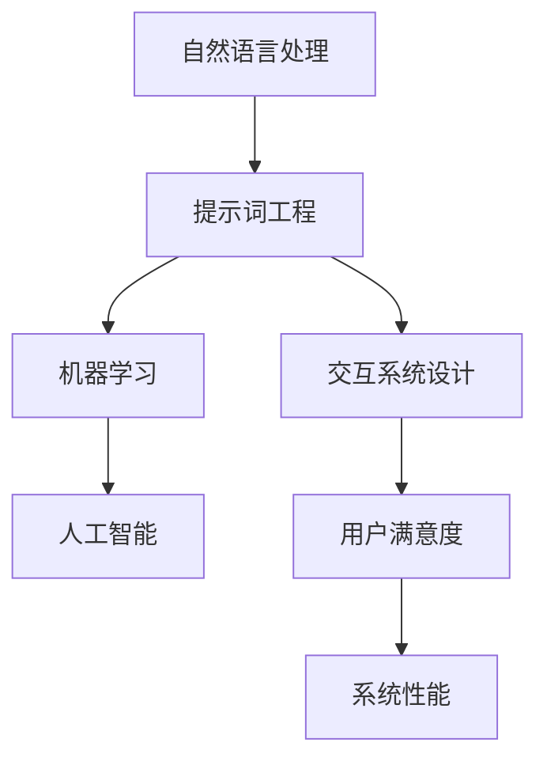

#### 1.2 伦理决策支持系统的必要性

伦理决策支持系统（Ethical Decision Support System，EDSS）是一种利用人工智能技术辅助决策者进行伦理决策的工具。它通过收集、分析和解释伦理相关的信息，为决策者提供基于伦理原则的建议。

**核心概念与联系：**

伦理决策支持系统在人工智能领域具有重要的意义。随着人工智能技术的广泛应用，伦理问题变得日益复杂和突出。EDSS可以帮助决策者更好地理解和应对这些伦理挑战，确保人工智能系统的设计、开发和部署符合伦理标准。

**Mermaid流程图：**

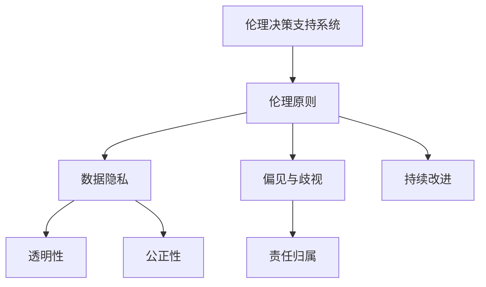

#### 1.3 提示词工程的发展历程

提示词工程的发展可以追溯到早期的人工智能研究和应用。随着自然语言处理和机器学习技术的进步，提示词工程逐渐成为一个独立的研究领域。

**核心概念与联系：**

早期提示词工程主要依赖于规则和模板匹配，随着深度学习和生成对抗网络（GAN）等技术的兴起，自动化的提示词生成方法得到了广泛应用。这些方法通过学习大量的数据，自动生成高质量的提示词，提高了系统的交互能力和用户体验。

**Mermaid流程图：**

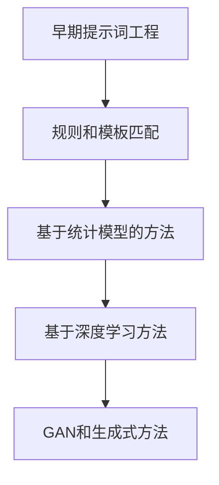

#### 1.4 提示词工程在人工智能中的应用

提示词工程在人工智能中的应用非常广泛，涵盖了问答系统、智能客服、文本生成、翻译和对话系统等多个领域。

**核心概念与联系：**

在问答系统中，高质量的提示词可以帮助系统更好地理解用户的问题，提供准确的答案。在智能客服中，提示词工程可以提高客服系统的交互质量，提高用户满意度。在文本生成和翻译中，提示词工程可以优化生成过程，提高文本的质量和一致性。在对话系统中，提示词工程可以设计流畅自然的对话流程，提供高质量的交互体验。

**Mermaid流程图：**

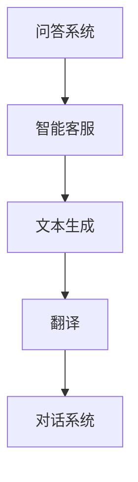

### 第2章: 提示词工程基础

#### 2.1 提示词的基本概念

提示词是指引导用户与人工智能系统进行交互的文本或语音信息，它是用户意图表达的关键载体。在自然语言处理和人工智能领域，提示词发挥着至关重要的作用。

**核心概念与联系：**

提示词包括问题陈述、上下文信息和意图标签等组成部分。问题陈述是核心，它直接引导系统理解和执行任务。上下文信息提供了背景知识，有助于系统更好地理解用户意图。意图标签则是用户意图的简洁表达，用于指导系统的行为。

**Mermaid流程图：**

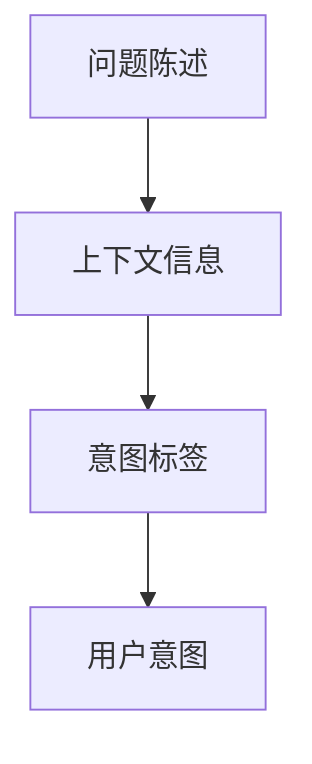

#### 2.2 提示词生成机制

提示词生成机制是指设计和优化提示词以实现特定目标的过程。它可以分为传统方法和基于深度学习的方法。

**核心概念与联系：**

传统方法包括基于规则的生成、模板匹配和基于统计模型的生成等。这些方法依赖于人工设计或经验积累，能够生成一定质量的提示词。基于深度学习的方法，如生成对抗网络（GAN）和变分自编码器（VAE），通过学习大量数据自动生成高质量的提示词，具有更高的灵活性和准确性。

**Mermaid流程图：**

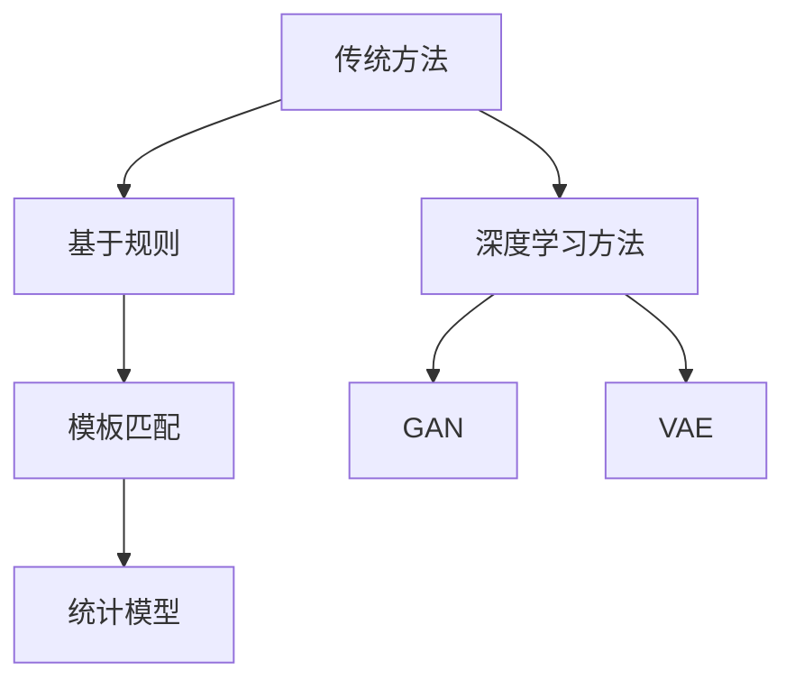

#### 2.3 提示词工程的核心算法

提示词工程的核心算法包括生成式算法、判定式算法和集成算法等。这些算法在提示词生成过程中发挥着重要作用。

**核心概念与联系：**

生成式算法，如生成对抗网络（GAN）和变分自编码器（VAE），通过生成对抗过程生成高质量的提示词。判定式算法，如序列到序列（Seq2Seq）模型和Transformer，通过映射输入到输出，生成符合预期的提示词。集成算法，如基于模型融合的方法，结合多种算法的优势，提高提示词生成的性能和多样性。

**Mermaid流程图：**

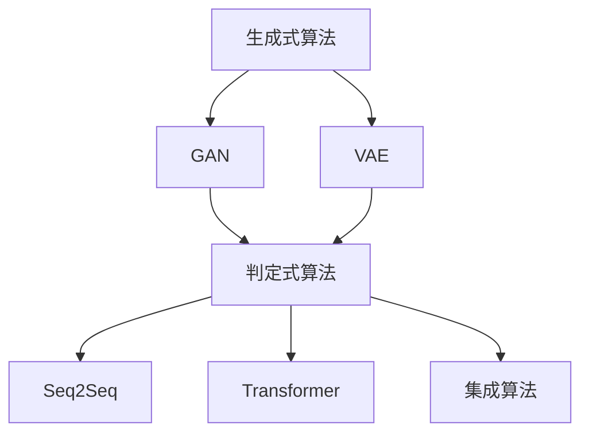

#### 2.4 提示词工程的应用

提示词工程在人工智能的多个领域中都有广泛应用，包括问答系统、智能客服、文本生成、翻译和对话系统等。

**核心概念与联系：**

在问答系统中，提示词工程可以优化问题理解和答案生成过程，提高系统的性能和用户体验。在智能客服中，提示词工程可以提高对话系统的交互质量，提高用户满意度。在文本生成中，提示词工程可以优化生成过程，提高文本的质量和一致性。在翻译中，提示词工程可以优化翻译流程，提高翻译质量和速度。在对话系统中，提示词工程可以设计流畅自然的对话流程，提供高质量的交互体验。

**Mermaid流程图：**


### 第3章: 伦理决策支持系统的设计原则

#### 3.1 设计原则概述

伦理决策支持系统（Ethical Decision Support System，EDSS）是一种利用人工智能技术辅助决策者进行伦理决策的工具。设计原则是确保EDSS有效、可靠和符合伦理标准的关键。

**核心概念与联系：**

设计原则包括数据保护原则、透明性与公正性原则、偏见与歧视缓解原则、责任归属原则和持续改进原则。数据保护原则关注隐私保护和数据安全。透明性与公正性原则确保决策过程的透明度和公正性。偏见与歧视缓解原则旨在消除系统偏见和歧视。责任归属原则明确责任归属，提高系统可靠性。持续改进原则推动系统不断优化和更新。

**Mermaid流程图：**

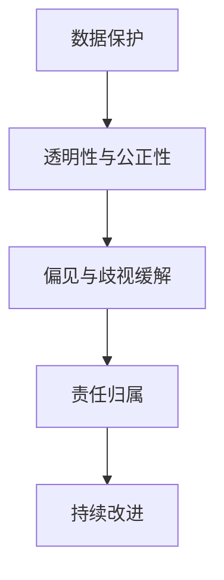

#### 3.2 数据保护原则

数据保护原则是伦理决策支持系统设计的关键原则之一，它关注数据隐私保护和数据安全。

**核心概念与联系：**

数据保护原则包括数据隐私保护、数据匿名化和数据访问控制。数据隐私保护确保用户数据不被未授权访问和使用。数据匿名化通过去除个人身份信息，保护用户隐私。数据访问控制通过权限管理和加密技术，确保数据在存储和传输过程中的安全。

**Mermaid流程图：**

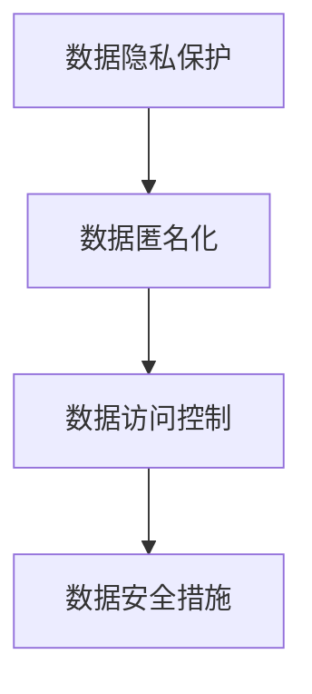

#### 3.3 透明性与公正性原则

透明性与公正性原则是伦理决策支持系统设计的重要原则，它确保决策过程的透明度和公正性。

**核心概念与联系：**

透明性要求系统提供决策过程中的详细信息，使决策者能够理解决策依据。公正性要求系统在决策过程中不偏不倚，确保所有用户都能公平地获得决策结果。透明性与公正性原则通过伦理审查、监管和用户反馈机制来实现。

**Mermaid流程图：**

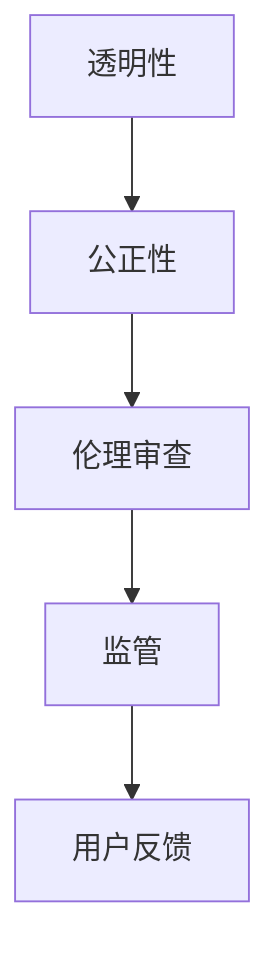

#### 3.4 偏见与歧视缓解原则

偏见与歧视缓解原则旨在消除伦理决策支持系统中的偏见和歧视，确保系统对所有用户公平对待。

**核心概念与联系：**

偏见与歧视缓解原则关注偏见与歧视的来源，包括数据偏差、算法偏见和决策过程偏见。缓解措施包括数据预处理、算法优化和决策过程监督。偏见检测与修正技术用于识别和纠正系统偏见。

**Mermaid流程图：**

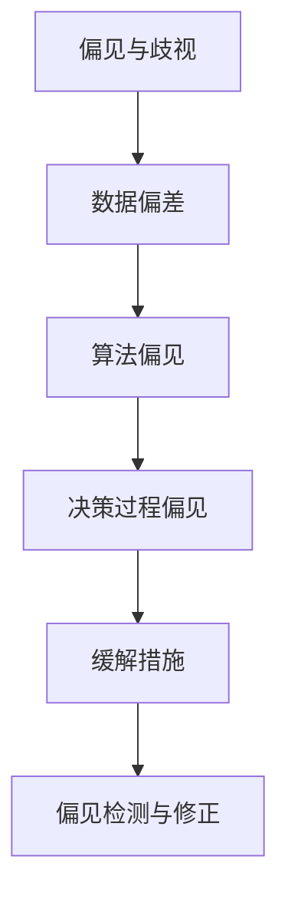

#### 3.5 责任归属原则

责任归属原则是伦理决策支持系统设计中的重要一环，它明确系统的责任归属，提高系统的可靠性和可追溯性。

**核心概念与联系：**

责任归属原则涉及系统开发者、使用者、法律责任和伦理责任。系统开发者负责系统的设计、开发和维护，使用者负责合理使用系统，法律责任和伦理责任共同保障系统的合规性和可靠性。

**Mermaid流程图：**

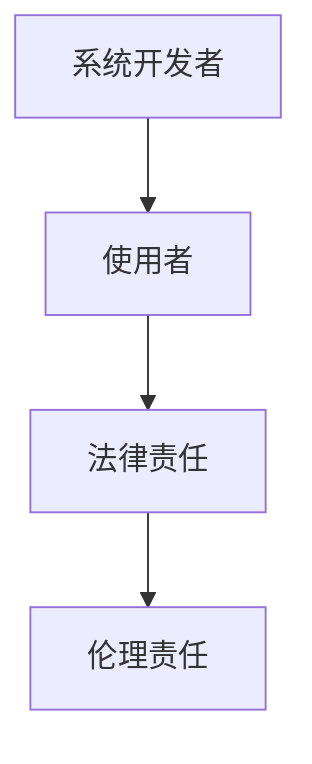

#### 3.6 持续改进原则

持续改进原则是伦理决策支持系统设计的关键，它推动系统不断优化和更新，以适应不断变化的需求和环境。

**核心概念与联系：**

持续改进原则包括反馈机制的建立、算法与模型的迭代更新、系统的评估与改进和知识库的维护与更新。反馈机制收集用户反馈，算法与模型的迭代更新提高系统性能，系统的评估与改进确保系统持续符合伦理标准，知识库的维护与更新提供决策依据。

**Mermaid流程图：**

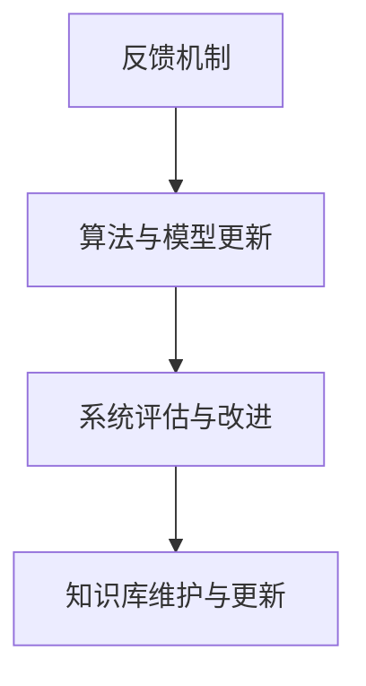

### 第4章: 提示词工程中的伦理问题

#### 4.1 数据隐私问题

在提示词工程中，数据隐私问题是至关重要的伦理问题之一。它涉及用户数据的收集、存储和使用过程中的隐私保护。

**核心概念与联系：**

数据隐私问题包括数据泄露、未经授权的访问和使用、数据共享等。数据隐私保护措施如数据匿名化、加密技术和隐私政策等，用于确保用户数据的安全和隐私。此外，用户同意和透明的隐私政策也是数据隐私保护的重要组成部分。

**Mermaid流程图：**

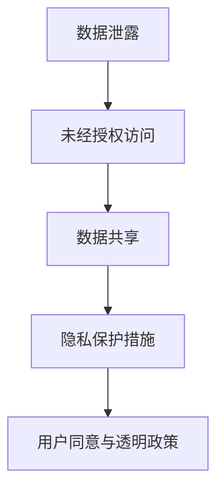

#### 4.2 透明性与公正性问题

透明性与公正性是提示词工程中另一个重要的伦理问题。它涉及到系统的决策过程是否公开透明，以及系统是否对所有用户公平对待。

**核心概念与联系：**

透明性要求系统提供决策过程的详细信息，使决策者能够理解决策依据。公正性要求系统在决策过程中不偏不倚，确保所有用户都能公平地获得决策结果。实现透明性与公正性需要伦理审查、监管和用户反馈机制。

**Mermaid流程图：**


#### 4.3 偏见与歧视问题

偏见与歧视是提示词工程中需要认真对待的伦理问题。它涉及到系统在处理数据和信息时可能存在的偏见和不公平。

**核心概念与联系：**

偏见与歧视问题可能源于数据偏差、算法偏见和决策过程偏见。缓解措施包括数据预处理、算法优化和决策过程监督。此外，偏见检测与修正技术用于识别和纠正系统偏见。

**Mermaid流程图：**


#### 4.4 责任归属问题

责任归属是提示词工程中的另一个重要伦理问题。它涉及到系统开发者、使用者和相关方的责任分配。

**核心概念与联系：**

责任归属问题包括系统开发者的责任、使用者的责任、法律责任和伦理责任。系统开发者负责系统的设计、开发和维护，使用者负责合理使用系统。法律和伦理责任共同确保系统的合规性和可靠性。

**Mermaid流程图：**


#### 4.5 伦理问题的影响与后果

伦理问题对提示词工程的影响是多方面的，包括系统性能、用户体验和社会影响等。

**核心概念与联系：**

伦理问题可能导致系统性能下降、用户体验恶化，甚至引发社会问题。影响后果包括信任危机、法律诉讼、声誉损失等。因此，及时识别和解决伦理问题是确保系统成功的关键。

**Mermaid流程图：**

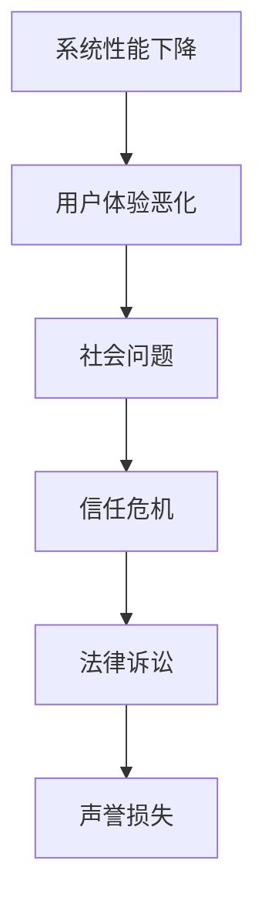

#### 4.6 伦理问题的防范与应对策略

为了防范和应对提示词工程中的伦理问题，需要采取一系列措施，包括伦理问题识别、评估与风险管理、解决策略等。

**核心概念与联系：**

伦理问题识别方法包括数据审查、算法审查和用户反馈等。评估与风险管理涉及对伦理问题的定量和定性评估，制定风险管理计划。解决策略包括技术措施、流程改进和法规遵守等。

**Mermaid流程图：**

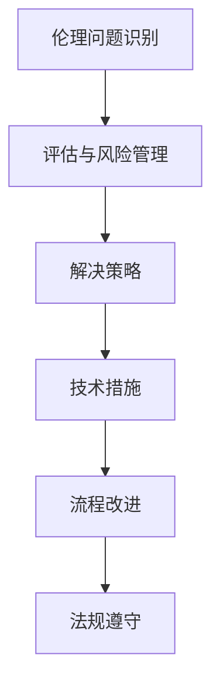

#### 4.7 伦理决策支持系统的应用

伦理决策支持系统（Ethical Decision Support System，EDSS）在提示词工程中的应用，有助于解决伦理问题，提高系统的可信度和用户体验。

**核心概念与联系：**

伦理决策支持系统的应用包括伦理原则编码、案例推理和机器学习等。伦理原则编码将伦理原则转化为可操作的规则和算法。案例推理通过历史案例的经验，为当前决策提供参考。机器学习技术用于构建和优化伦理决策模型。

**Mermaid流程图：**

```mermaid
graph TD
A[伦理原则编码] --> B[案例推理]
B --> C[机器学习]
C --> D[伦理决策模型]
```

### 第5章: 提示词工程的伦理决策支持系统应用

#### 5.1 智能客服系统

智能客服系统（Intelligent Customer Service System，ICSS）是一种利用人工智能技术提供自动化客户服务的技术系统。

**核心概念与联系：**

智能客服系统通过自然语言处理、机器学习和对话系统等技术，自动响应用户的咨询和请求，提高客服效率和用户体验。它包括语音识别、文本分析、意图识别和回答生成等模块。

**Mermaid流程图：**

```mermaid
graph TD
A[语音识别] --> B[文本分析]
B --> C[意图识别]
C --> D[回答生成]
D --> E[用户反馈]
```

**伦理问题与挑战：**

智能客服系统在应用过程中面临着数据隐私、透明性和公正性等伦理问题。例如，用户数据泄露、未经授权访问、算法偏见和歧视等问题。

**伦理决策支持系统的应用：**

伦理决策支持系统在智能客服系统中的应用，有助于解决上述伦理问题。它通过数据隐私保护措施、透明性要求和公正性评估，确保系统的合规性和可靠性。

**应用案例与分析：**

一个实际的案例是某大型电商平台的智能客服系统。该系统采用了伦理决策支持系统，实现了数据隐私保护和用户反馈机制。通过对用户数据的匿名化和加密处理，确保用户隐私不被泄露。同时，系统提供了透明的用户界面，使用户能够了解其数据的使用方式和目的。此外，系统还定期进行公正性评估，确保算法的公平性和无偏见。

#### 5.2 健康医疗辅助系统

健康医疗辅助系统（Healthcare Assistance System，HAS）是一种利用人工智能技术提供医疗支持和辅助诊断的系统。

**核心概念与联系：**

健康医疗辅助系统通过医学知识图谱、自然语言处理和机器学习等技术，辅助医生进行疾病诊断、治疗方案推荐和患者管理。它包括知识库、推理引擎和用户界面等模块。

**Mermaid流程图：**

```mermaid
graph TD
A[知识库] --> B[推理引擎]
B --> C[用户界面]
C --> D[患者数据]
```

**伦理问题与挑战：**

健康医疗辅助系统在应用过程中面临着数据隐私、透明性和公正性等伦理问题。例如，患者数据泄露、算法偏见和歧视等问题。

**伦理决策支持系统的应用：**

伦理决策支持系统在健康医疗辅助系统中的应用，有助于解决上述伦理问题。它通过数据隐私保护措施、透明性要求和公正性评估，确保系统的合规性和可靠性。

**应用案例与分析：**

一个实际的案例是某医疗机构的健康医疗辅助系统。该系统采用了伦理决策支持系统，实现了数据隐私保护和用户反馈机制。通过对患者数据的匿名化和加密处理，确保患者隐私不被泄露。同时，系统提供了透明的用户界面，使患者能够了解其数据的使用方式和目的。此外，系统还定期进行公正性评估，确保算法的公平性和无偏见。

#### 5.3 自动驾驶系统

自动驾驶系统（Autonomous Driving System，ADS）是一种利用人工智能技术实现车辆自动驾驶的系统。

**核心概念与联系：**

自动驾驶系统通过传感器、计算机视觉和机器学习等技术，实现车辆的自主感知、决策和控制。它包括感知模块、决策模块和控制模块等。

**Mermaid流程图：**

```mermaid
graph TD
A[感知模块] --> B[决策模块]
B --> C[控制模块]
C --> D[车辆状态]
```

**伦理问题与挑战：**

自动驾驶系统在应用过程中面临着生命安全、透明性和公正性等伦理问题。例如，事故责任归属、算法偏见和歧视等问题。

**伦理决策支持系统的应用：**

伦理决策支持系统在自动驾驶系统中的应用，有助于解决上述伦理问题。它通过伦理审查、监管和用户反馈机制，确保系统的合规性和可靠性。

**应用案例与分析：**

一个实际的案例是某汽车厂商的自动驾驶系统。该系统采用了伦理决策支持系统，实现了事故责任归属的透明性和公正性。通过建立伦理审查委员会，对系统进行定期审查和监督，确保系统的伦理合规性。同时，系统提供了透明的用户界面，使驾驶员和乘客能够了解系统的运行过程和决策依据。

### 第6章: 提示词工程的伦理决策支持系统实现方法

#### 6.1 伦理决策支持系统的设计

伦理决策支持系统（Ethical Decision Support System，EDSS）是确保提示词工程中伦理问题得到有效解决的关键。设计一个有效的伦理决策支持系统需要考虑多个方面，包括系统架构、功能模块和接口设计。

**核心概念与联系：**

伦理决策支持系统的架构通常包括数据层、算法层和应用层。数据层负责收集和存储与伦理相关的数据，算法层负责处理和分析这些数据，应用层则提供用户界面和交互功能。功能模块包括伦理规则库、案例库、伦理评估引擎和用户反馈模块。接口设计确保系统与其他系统的兼容性和数据流通。

**Mermaid流程图：**

```mermaid
graph TD
A[数据层] --> B[算法层]
B --> C[应用层]
C --> D[伦理规则库]
D --> E[案例库]
E --> F[伦理评估引擎]
F --> G[用户反馈模块]
```

#### 6.2 伦理原则编码

伦理原则编码是将伦理原则转化为可执行代码的过程。这一步骤至关重要，因为它决定了伦理决策支持系统在处理实际问题时如何应用伦理标准。

**核心概念与联系：**

伦理原则编码通常涉及以下几个方面：首先，需要明确伦理原则的内容，并将其抽象为规则或准则。其次，将伦理规则映射到系统中的算法和模型，使其在运行过程中自动遵循这些原则。最后，对编码过程进行测试和验证，确保伦理原则的有效执行。

**Mermaid流程图：**

```mermaid
graph TD
A[伦理原则] --> B[抽象规则]
B --> C[映射算法]
C --> D[测试与验证]
```

#### 6.3 案例推理

案例推理（Case-Based Reasoning，CBR）是一种基于历史案例的经验来解决问题的方法。在伦理决策支持系统中，案例推理可以用于识别和解决相似的伦理问题。

**核心概念与联系：**

案例推理包括以下几个步骤：首先，构建案例库，收集和存储与伦理问题相关的案例。其次，在遇到新的伦理问题时，通过案例检索和匹配找到相似的案例。最后，根据匹配结果，对当前问题进行决策和解决。

**Mermaid流程图：**

```mermaid
graph TD
A[案例库] --> B[案例检索]
B --> C[案例匹配]
C --> D[决策与解决]
```

#### 6.4 机器学习算法

机器学习算法是伦理决策支持系统的核心组成部分。通过机器学习，系统可以自动学习和优化伦理决策过程，提高系统的智能化水平。

**核心概念与联系：**

机器学习算法包括监督学习、无监督学习和强化学习等方法。在伦理决策支持系统中，监督学习用于训练伦理评估模型，无监督学习用于发现潜在的问题和异常，强化学习用于优化决策过程。选择合适的机器学习算法，可以提高系统的准确性和鲁棒性。

**Mermaid流程图：**

```mermaid
graph TD
A[监督学习] --> B[伦理评估模型]
B --> C[无监督学习]
C --> D[异常检测]
D --> E[强化学习]
E --> F[决策优化]
```

#### 6.5 伦理决策支持系统的评估

评估伦理决策支持系统的性能和效果是确保其有效性的关键步骤。评估过程通常包括多个方面，如准确性、效率、可解释性和用户满意度等。

**核心概念与联系：**

评估伦理决策支持系统的方法包括定量评估和定性评估。定量评估使用指标如准确率、召回率和F1分数等来衡量系统的性能。定性评估通过用户反馈和专家评审来评估系统的用户体验和可信度。综合定量和定性评估结果，可以全面了解系统的表现和改进方向。

**Mermaid流程图：**

```mermaid
graph TD
A[定量评估] --> B[准确性]
B --> C[召回率]
C --> D[F1分数]
A --> E[定性评估]
E --> F[用户反馈]
E --> G[专家评审]
```

#### 6.6 系统部署与维护

系统部署与维护是确保伦理决策支持系统正常运行的重要环节。部署过程包括硬件和软件环境的配置、数据加载和系统初始化。维护过程包括系统监控、故障排查和性能优化。

**核心概念与联系：**

系统部署与维护需要考虑多个方面，包括系统的高可用性、数据安全性和性能优化。通过定期的系统监控和故障排查，可以及时发现和解决潜在问题。性能优化包括算法优化、硬件升级和系统重构等，以提高系统的运行效率和稳定性。

**Mermaid流程图：**

```mermaid
graph TD
A[系统部署] --> B[硬件配置]
B --> C[软件配置]
C --> D[数据加载]
D --> E[系统初始化]
E --> F[系统维护]
F --> G[监控与排查]
G --> H[性能优化]
```

### 第7章: 提示词工程的伦理决策支持系统的未来发展

#### 7.1 技术发展趋势

随着人工智能技术的不断发展，提示词工程的伦理决策支持系统也在不断进化。未来，技术发展趋势将包括以下几个方面：

1. **智能化与自动化**：随着深度学习和生成对抗网络等技术的进步，提示词工程将更加智能化和自动化，提高系统的生成质量和效率。

2. **跨学科融合**：伦理决策支持系统将与其他领域如伦理学、社会学和法律学等深度融合，提高系统的伦理判断能力和决策质量。

3. **数据隐私保护**：随着数据隐私问题日益突出，提示词工程将更加重视数据隐私保护，采用先进的数据加密、匿名化和访问控制技术。

4. **透明性与公正性**：系统的透明性和公正性将得到进一步加强，通过用户反馈和伦理审查机制，提高系统的可信度和用户满意度。

**核心概念与联系：**

智能化与自动化趋势将使提示词工程更加高效和准确，跨学科融合将提高系统的伦理判断能力，数据隐私保护将确保用户隐私不被泄露，透明性与公正性将增强系统的可信度和用户满意度。

**Mermaid流程图：**

```mermaid
graph TD
A[智能化与自动化] --> B[跨学科融合]
B --> C[数据隐私保护]
C --> D[透明性与公正性]
```

#### 7.2 应用前景

提示词工程的伦理决策支持系统在未来的应用前景非常广阔，可以应用于多个领域，包括但不限于：

1. **智能客服**：通过优化对话流程和提供个性化服务，提高用户满意度和业务效率。

2. **健康医疗**：辅助医生进行诊断和治疗决策，提高医疗服务的质量和效率。

3. **自动驾驶**：通过伦理决策支持，提高自动驾驶车辆的安全性，减少交通事故。

4. **金融与经济**：优化金融产品的推荐和风险管理，提高金融服务水平。

5. **教育**：提供个性化的学习建议和辅导，提高教学效果和学习体验。

6. **法律与司法**：辅助律师进行案件分析和法律文件生成，提高法律服务的效率和质量。

**核心概念与联系：**

智能客服、健康医疗、自动驾驶、金融与经济、教育和法律与司法等领域都是人工智能技术的重要应用场景。提示词工程的伦理决策支持系统将在这

