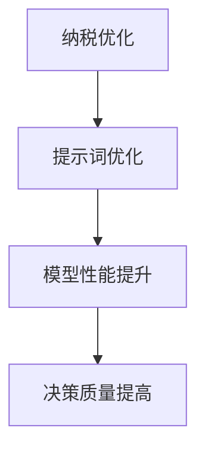

                 

# 提示词工程：AI时代的新挑战与新方向

> **关键词**：提示词工程、AI、自然语言处理、计算机视觉、智能决策、性能优化、算法、深度学习、模型融合。

> **摘要**：本文深入探讨了AI时代下的提示词工程，分析了其面临的挑战和潜在的新方向。从基础理论到应用实践，再到未来展望，本文旨在为读者提供一幅全面而清晰的提示词工程图景。

## 第一部分：AI时代的背景与挑战

### 第1章：AI时代概览

#### 1.1 AI技术发展简史

人工智能（AI）的概念可以追溯到20世纪50年代。最初的AI研究主要集中在符号逻辑和推理上，试图通过编程来实现类似于人类智能的任务。然而，早期的AI系统由于计算能力和数据限制，并没有取得显著成果。

进入20世纪80年代，随着计算机性能的提升和大数据的出现，机器学习和神经网络开始崭露头角。这些方法通过学习大量数据中的模式和规律，实现了对复杂任务的自动化处理。特别是在深度学习出现后，AI技术迎来了爆发式的发展。

#### 1.2 AI技术对社会的深远影响

AI技术已经深刻地改变了社会的各个方面，包括医疗、交通、金融、教育等。例如，在医疗领域，AI可以帮助医生进行疾病诊断、药物研发和个性化治疗；在交通领域，自动驾驶技术有望减少交通事故，提高交通效率。

#### 1.3 提示词工程的基本概念与重要性

提示词工程（Prompt Engineering）是AI时代的一个重要研究方向。它关注如何通过优化提示词来提高模型的性能和解释性。提示词是模型与外界交互的桥梁，通过合理的提示词设计，可以引导模型产生更符合预期的输出。

### 第2章：AI时代的挑战

#### 2.1 数据安全与隐私保护

随着AI技术的发展，数据安全和隐私保护成为一个严峻的挑战。AI系统通常需要大量的数据来训练，但这些数据往往包含敏感信息。如何确保数据的安全性和隐私性，防止数据泄露和滥用，是AI时代需要解决的关键问题。

#### 2.2 人工智能伦理与法规

AI技术的发展也引发了伦理和法规问题。例如，人工智能的偏见和歧视问题，如何确保AI系统的公平性和透明性，如何制定相应的法律法规来规范AI技术的发展和应用，都是需要深入探讨的问题。

#### 2.3 AI系统的可解释性

随着AI系统的复杂度增加，其决策过程往往变得不透明。如何提高AI系统的可解释性，使其决策过程更加透明和可理解，是当前研究的一个热点问题。可解释性对于确保AI系统的安全性和可靠性具有重要意义。

## 第二部分：提示词工程基础

### 第3章：提示词工程基础理论

#### 3.1 提示词的作用与分类

提示词是模型与外界交互的桥梁，通过合理的提示词设计，可以引导模型产生更符合预期的输出。提示词可以分为以下几种类型：

- **目标导向型**：直接给出模型需要解决的问题，例如“请识别这张图片中的物体”。

- **数据驱动型**：基于历史数据或样本，给出模型的输入，例如“请对这组数据进行分类”。

- **知识增强型**：结合外部知识库或领域知识，提高模型的性能，例如“请基于医学知识库对症状进行诊断”。

#### 3.2 提示词优化的核心算法

提示词优化的核心算法包括：

- **搜索算法**：如遗传算法、粒子群算法等，用于搜索最优的提示词组合。

- **机器学习算法**：如线性回归、支持向量机等，用于从数据中学习最优的提示词。

- **深度学习算法**：如卷积神经网络、循环神经网络等，通过训练大量的数据来学习最优的提示词。

#### 3.3 提示词与模型融合策略

提示词与模型融合的策略包括：

- **前馈策略**：将提示词直接作为模型的输入。

- **反馈策略**：将模型的输出反馈给提示词生成器，不断调整提示词。

- **混合策略**：结合前馈和反馈策略，实现动态调整提示词。

### 第4章：提示词工程应用场景

#### 4.1 自然语言处理中的提示词工程

在自然语言处理（NLP）领域，提示词工程有着广泛的应用。例如，在文本分类任务中，通过优化提示词可以显著提高分类的准确率；在问答系统中，合理的提示词设计可以提高回答的准确性。

#### 4.2 计算机视觉中的提示词工程

在计算机视觉领域，提示词工程同样发挥着重要作用。例如，在图像识别任务中，通过优化提示词可以改善识别的准确性；在目标检测任务中，合理的提示词设计可以提高检测的精度。

#### 4.3 数据科学中的提示词工程

在数据科学领域，提示词工程可以帮助模型更好地理解和处理数据。例如，在回归分析中，通过优化提示词可以提高模型的预测能力；在聚类分析中，合理的提示词设计可以帮助模型更好地发现数据的模式。

### 第5章：提示词工程实践

#### 5.1 提示词工程的开发流程

提示词工程的开发流程通常包括以下几个步骤：

- **需求分析**：明确模型需要解决的问题和预期的输出。

- **数据收集**：收集相关的数据集，用于训练和测试模型。

- **模型选择**：选择合适的模型，根据问题的特点进行优化。

- **提示词设计**：设计合理的提示词，通过算法优化提示词。

- **模型训练**：使用训练数据对模型进行训练。

- **性能评估**：评估模型的性能，根据评估结果调整提示词。

- **迭代优化**：根据评估结果不断调整提示词，优化模型的性能。

#### 5.2 提示词工程的工具与平台

提示词工程的工具与平台包括：

- **深度学习框架**：如TensorFlow、PyTorch等，用于构建和训练模型。

- **提示词生成工具**：如PromptGen、PromptPay等，用于生成和优化提示词。

- **数据分析工具**：如Pandas、NumPy等，用于数据处理和分析。

- **集成开发环境**：如Visual Studio Code、PyCharm等，用于开发和管理代码。

#### 5.3 提示词工程的性能评估与优化

提示词工程的性能评估与优化包括：

- **准确率**：评估模型在特定任务上的准确性。

- **召回率**：评估模型在特定任务上的召回率。

- **F1值**：综合考虑准确率和召回率，评估模型的综合性能。

- **优化策略**：通过调整提示词和模型参数，提高模型的性能。

## 第三部分：新方向探索

### 第6章：AI时代的自然语言生成

#### 6.1 生成式对抗网络（GAN）在NLP中的应用

生成式对抗网络（GAN）是一种强大的深度学习模型，可以生成高质量的自然语言文本。在NLP领域，GAN被广泛应用于文本生成、翻译、对话系统等任务。

#### 6.2 语言模型压缩与量化技术

随着语言模型的规模越来越大，模型的压缩和量化技术变得尤为重要。通过压缩和量化技术，可以显著减少模型的存储空间和计算资源消耗，提高模型的部署效率。

#### 6.3 多模态提示词工程

多模态提示词工程是将不同模态的数据（如文本、图像、声音等）进行融合，通过优化提示词来提高模型的性能。在多模态任务中，提示词的设计和优化至关重要。

### 第7章：AI时代的计算机视觉

#### 7.1 图像识别中的提示词工程

在图像识别任务中，提示词工程可以通过优化提示词来改善识别的准确性。通过合理的提示词设计，可以引导模型更好地理解图像的内容。

#### 7.2 视觉提示词工程的新方法

视觉提示词工程的新方法包括基于深度学习的图像分割、目标检测、姿态估计等。这些方法通过优化提示词，可以提高视觉任务的性能。

#### 7.3 视觉提示词工程的应用实例

视觉提示词工程在自动驾驶、医疗影像分析、安防监控等领域的应用日益广泛。通过合理的提示词设计，可以显著提高这些任务的效率和准确性。

### 第8章：AI时代的智能决策

#### 8.1 智能决策的基本概念与架构

智能决策是一种基于数据和算法的决策方法，通过分析大量数据，智能决策系统可以做出更加准确和高效的决策。智能决策的基本架构包括数据收集、数据预处理、模型训练、决策生成等模块。

#### 8.2 提示词工程在智能决策中的应用

提示词工程在智能决策中的应用主要体现在两个方面：

- **数据预处理**：通过优化提示词，提高数据预处理的质量和效率。

- **模型训练**：通过优化提示词，提高模型的训练效果和预测准确性。

#### 8.3 智能决策系统的设计与优化

智能决策系统的设计与优化包括：

- **系统架构设计**：根据具体应用场景，设计合适的系统架构。

- **算法选择**：选择合适的算法，提高系统的决策能力。

- **性能优化**：通过优化提示词和模型参数，提高系统的性能。

## 第四部分：案例研究

### 第9章：提示词工程案例分析

#### 9.1 案例一：智能客服系统

智能客服系统通过优化提示词，可以更好地理解用户的问题，提供更加准确的回答。在案例一中，我们将探讨如何通过提示词工程提高智能客服系统的性能。

#### 9.2 案例二：智能医疗诊断

智能医疗诊断系统通过优化提示词，可以更好地分析医学影像，提供准确的诊断结果。在案例二中，我们将分析如何通过提示词工程提高智能医疗诊断系统的性能。

#### 9.3 案例三：智能金融风控

智能金融风控系统通过优化提示词，可以更好地识别风险，提供更加精准的风险评估。在案例三中，我们将探讨如何通过提示词工程提高智能金融风控系统的性能。

## 第五部分：未来展望与趋势

### 第10章：AI时代的提示词工程趋势

#### 10.1 提示词工程的发展方向

随着AI技术的不断进步，提示词工程也在不断演进。未来的提示词工程将更加注重：

- **多模态融合**：将不同模态的数据进行融合，提高模型的性能。

- **自适应提示词生成**：根据不同的任务和数据，动态调整提示词。

- **模型压缩与量化**：通过压缩和量化技术，提高模型的部署效率。

#### 10.2 提示词工程的未来挑战

提示词工程的未来挑战包括：

- **数据安全与隐私保护**：如何确保数据的安全性和隐私性，防止数据泄露和滥用。

- **伦理与法规问题**：如何确保AI系统的公平性和透明性，如何制定相应的法律法规。

- **可解释性**：如何提高AI系统的可解释性，使其决策过程更加透明和可理解。

#### 10.3 提示词工程在新兴领域的应用

随着AI技术的不断发展，提示词工程在新兴领域（如物联网、区块链等）的应用前景广阔。通过优化提示词，可以显著提高这些领域的性能和效率。

## 附录

### 附录A：提示词工程常用算法汇总

#### A.1 Transformer模型详解

Transformer模型是一种基于自注意力机制的深度学习模型，在自然语言处理领域取得了显著成果。下面是Transformer模型的详细伪代码：

```python
# Transformer模型伪代码
class Transformer(nn.Module):
    def __init__(self, d_model, d_ff, num_layers, num_heads):
        super(Transformer, self).__init__()
        self.embedding = nn.Embedding(vocab_size, d_model)
        self.positional_encoding = PositionalEncoding(d_model)
        self.transformer = nn.ModuleList([
            TransformerLayer(d_model, d_ff, num_heads)
            for _ in range(num_layers)
        ])
        self.fc = nn.Linear(d_model, vocab_size)

    def forward(self, x):
        x = self.embedding(x) + self.positional_encoding(x)
        for layer in self.transformer:
            x = layer(x)
        x = self.fc(x)
        return x
```

#### A.2 图神经网络（GNN）在提示词工程中的应用

图神经网络（GNN）是一种用于处理图数据的神经网络。在提示词工程中，GNN可以用于处理复杂的关系数据。下面是GNN在提示词工程中的应用示例：

```python
# GNN在提示词工程中的应用示例
class GraphNeuralNetwork(nn.Module):
    def __init__(self, hidden_size, graph_size):
        super(GraphNeuralNetwork, self).__init__()
        self.embedding = nn.Embedding(vocab_size, hidden_size)
        self.fc = nn.Linear(hidden_size, graph_size)

    def forward(self, nodes, edges):
        node_embeddings = self.embedding(nodes)
        edge_embeddings = self.embedding(edges)
        # 应用GNN算法处理图数据
        graph_embeddings = apply_gnn(node_embeddings, edge_embeddings)
        output = self.fc(graph_embeddings)
        return output
```

#### A.3 纳税优化与提示词优化

纳税优化是一种通过调整策略来降低纳税负担的方法。在提示词工程中，纳税优化可以用于优化提示词，提高模型的性能。下面是纳税优化与提示词优化的关系图：



### 附录B：提示词工程开发资源推荐

#### B.1 常用深度学习框架

- TensorFlow
- PyTorch
- Keras

#### B.2 提示词工程工具集

- PromptGen
- PromptPay
- TextGAN

#### B.3 相关论文与书籍推荐

- 《深度学习》（Goodfellow et al.）
- 《神经网络与深度学习》（邱锡鹏）
- 《Prompt Engineering for Natural Language Processing》（Krause et al.）

## 作者信息

作者：AI天才研究院/AI Genius Institute & 禅与计算机程序设计艺术 /Zen And The Art of Computer Programming

（完）<|im_end|>## 第1章：AI时代概览

### 1.1 AI技术发展简史

人工智能（AI）技术的发展历程可以追溯到20世纪中期。1940年代，计算机科学刚刚起步，艾伦·图灵（Alan Turing）提出了“图灵测试”，这被视为人工智能概念的最早雏形。1950年代，人工智能作为一个科学领域被正式提出，第一台能够模拟人类思维的计算机程序“逻辑理论家”（Logic Theorist）被开发出来。

1960年代和1970年代，人工智能经历了早期的繁荣期，主要研究方向包括逻辑推理和问题求解。然而，由于计算能力和算法的限制，人工智能在这一时期并未取得实质性突破，被称为“人工智能的冬天”。

1980年代，随着计算能力的提升和机器学习算法的初步成功，人工智能迎来了复苏。这个时期，专家系统和知识表示技术得到了广泛研究。1990年代，随着互联网的兴起，大数据和云计算为人工智能提供了丰富的数据资源，机器学习领域取得了显著进展，尤其是在模式识别和决策支持系统方面。

进入21世纪，深度学习算法的突破性发展将人工智能推向了一个新的高度。2006年，杰弗里·辛顿（Geoffrey Hinton）等人提出了深度信念网络（DBN），为后续的深度学习研究奠定了基础。2012年，AlexNet在ImageNet竞赛中取得了突破性成绩，深度学习在图像识别领域取得了显著的进展。

近年来，随着人工智能技术的不断演进，其在自然语言处理、语音识别、自动驾驶、医疗诊断等领域的应用越来越广泛。人工智能技术的快速发展，不仅改变了我们的生活方式，也为各行各业带来了巨大的变革。

### 1.2 AI技术对社会的深远影响

人工智能技术的发展对社会的各个方面都产生了深远的影响，尤其体现在经济、医疗、交通和教育等领域。

**经济领域**：人工智能在智能制造、自动化生产、金融分析等领域得到了广泛应用，提高了生产效率，降低了运营成本。例如，通过机器学习算法，企业可以更好地预测市场需求，优化库存管理；在金融领域，人工智能可以帮助银行和金融机构进行风险评估、欺诈检测和自动化交易。

**医疗领域**：人工智能在医疗诊断、药物研发和个性化治疗等方面具有巨大的潜力。通过深度学习算法，计算机可以分析大量的医疗数据，辅助医生进行疾病诊断。例如，在癌症诊断中，人工智能可以检测出微小病变，提高诊断的准确率；在药物研发中，人工智能可以帮助科学家快速筛选和设计新药物。

**交通领域**：自动驾驶技术是人工智能在交通领域的重要应用。通过感知环境和决策算法，自动驾驶汽车有望减少交通事故，提高交通效率。此外，智能交通系统可以通过实时数据分析和预测，优化交通流量，缓解城市拥堵。

**教育领域**：人工智能在教育中的应用逐渐增多，例如智能教育平台可以根据学生的学习进度和需求，提供个性化的教学资源和指导；智能评卷系统可以快速、准确地评估学生的答题情况，提高教学效果。

总的来说，人工智能技术正在深刻地改变我们的生活方式和社会结构，带来了前所未有的机遇和挑战。随着人工智能技术的不断进步，其对社会的影响将更加深远。

### 1.3 提示词工程的基本概念与重要性

提示词工程（Prompt Engineering）是人工智能领域的一个新兴研究方向，它关注如何通过优化提示词来提高模型的性能和解释性。提示词（Prompt）是指用于引导模型产生预期输出的文字、图像或其他形式的信息。

**提示词的类型**：

- **目标导向型提示词**：这类提示词直接指定了模型需要解决的问题，例如“请识别这张图片中的物体”或“请预测明天的天气”。

- **数据驱动型提示词**：这类提示词基于历史数据或样本，例如“请对这组数据进行分类”或“根据历史记录，预测下一个数据点”。

- **知识增强型提示词**：这类提示词结合了外部知识库或领域知识，例如“基于医学知识库，诊断这位患者的症状”或“根据经济学理论，预测市场走势”。

**提示词优化的方法**：

- **搜索算法**：如遗传算法、粒子群算法等，通过搜索策略寻找最优的提示词组合。

- **机器学习算法**：如线性回归、支持向量机等，通过从数据中学习最优的提示词。

- **深度学习算法**：如卷积神经网络（CNN）、循环神经网络（RNN）和变换器（Transformer）等，通过训练大量的数据来学习最优的提示词。

**提示词工程的重要性**：

- **提高模型性能**：通过优化提示词，可以引导模型产生更符合预期的输出，从而提高模型的性能。

- **增强模型解释性**：合理的提示词设计可以使得模型的决策过程更加透明和可理解，增强模型的解释性。

- **促进跨领域应用**：通过提示词工程，可以将通用模型应用于不同的领域，提高模型的适用性和灵活性。

在AI时代，提示词工程作为一种有效的技术手段，正在得到越来越多的关注和应用。它不仅为人工智能模型的优化提供了新的方向，也为各领域的智能化发展提供了强有力的支持。

### 1.4 AI时代的挑战

#### 2.1 数据安全与隐私保护

随着人工智能技术的快速发展，数据安全和隐私保护成为一个日益严峻的挑战。人工智能系统通常需要大量的数据来训练，而这些数据往往包含敏感信息，如个人身份信息、医疗记录、金融数据等。一旦数据泄露，可能会导致严重的隐私侵犯和财产损失。

**数据安全挑战**：

1. **数据泄露**：在数据收集、存储、传输和处理过程中，数据可能因为系统漏洞、恶意攻击等原因被非法获取。

2. **数据滥用**：即使数据本身没有泄露，如果数据被用于不当用途，也可能对个人隐私造成侵害。

3. **数据完整性**：在数据传输和存储过程中，数据可能会被篡改或破坏，导致数据失去完整性。

**隐私保护措施**：

1. **数据加密**：通过加密技术对敏感数据进行加密处理，确保数据在传输和存储过程中的安全性。

2. **匿名化处理**：对个人身份信息进行匿名化处理，降低数据泄露带来的隐私风险。

3. **访问控制**：通过严格的访问控制机制，限制对敏感数据的访问权限，防止数据被未经授权的人员获取。

4. **隐私计算**：采用隐私计算技术，如差分隐私、同态加密等，在数据处理过程中保护个人隐私。

5. **数据监管**：建立完善的数据监管体系，加强对数据收集、存储、处理等环节的监管，确保合规操作。

**案例研究**：

- **案例一**：2017年，Facebook数据泄露事件，导致8700万用户的个人信息被未经授权地访问和使用，引发了巨大的隐私争议。

- **案例二**：2018年，谷歌云服务漏洞导致约5亿用户的个人信息泄露，包括用户姓名、电子邮件地址、电话号码等。

#### 2.2 人工智能伦理与法规

人工智能技术的发展也引发了伦理和法规问题。人工智能系统在决策过程中可能存在偏见和歧视，例如在招聘、信贷评估、医疗诊断等领域。此外，人工智能系统的透明性和可解释性也是一个重要的问题，用户往往无法理解系统的决策过程和依据。

**伦理挑战**：

1. **偏见和歧视**：人工智能系统可能因为训练数据的偏见而表现出偏见和歧视，影响决策的公正性。

2. **透明性和可解释性**：人工智能系统的决策过程通常是不透明的，用户无法理解系统的决策依据和逻辑。

3. **责任归属**：当人工智能系统发生错误或造成损失时，如何确定责任归属是一个复杂的问题。

**法规措施**：

1. **公平性要求**：制定相关法规，确保人工智能系统的决策过程具有公平性，避免偏见和歧视。

2. **透明性和可解释性要求**：要求人工智能系统具备一定的透明性和可解释性，用户可以理解系统的决策过程。

3. **责任归属规定**：明确人工智能系统的责任归属，制定相应的法律责任，确保在发生问题时能够追究责任。

**案例研究**：

- **案例一**：2016年，亚马逊的招聘系统因性别偏见导致女性求职者被自动拒绝，引发了广泛的伦理争议。

- **案例二**：2019年，谷歌的自动驾驶汽车发生交通事故，责任归属问题引发了关于自动驾驶汽车责任的讨论。

#### 2.3 AI系统的可解释性

随着人工智能系统的复杂度增加，其决策过程往往变得不透明。如何提高AI系统的可解释性，使其决策过程更加透明和可理解，是当前研究的一个热点问题。可解释性对于确保AI系统的安全性和可靠性具有重要意义。

**可解释性挑战**：

1. **算法复杂性**：许多人工智能算法（如深度学习）本身具有较高的复杂性，难以用简单的语言解释其决策过程。

2. **数据复杂性**：人工智能系统通常基于大量的数据进行分析，数据本身可能包含复杂的模式和关系，难以直观理解。

3. **模型不确定性**：人工智能系统在处理不确定性和异常情况时，可能表现出不一致的决策结果，难以解释。

**提高可解释性的方法**：

1. **可视化技术**：通过可视化技术，将复杂的算法和决策过程以直观的方式展示给用户。

2. **解释性算法**：开发具有解释性的算法，使AI系统的决策过程更加透明和可理解。

3. **元学习**：通过元学习方法，使AI系统能够自动学习如何解释其决策过程。

4. **对抗性解释**：利用对抗性神经网络等技术，对AI系统的决策过程进行解释。

**案例研究**：

- **案例一**：谷歌的“可视化解释器”（Explainer）工具，用于解释深度学习模型的决策过程。

- **案例二**：微软的“可解释性AI平台”（Explainable AI Platform），提供多种方法来解释AI系统的决策过程。

### 1.5 AI时代的新挑战与新方向

随着人工智能技术的不断进步，AI时代面临着一系列新的挑战和机遇。这些挑战不仅涉及到技术本身，还包括社会、法律和伦理等多个层面。

**新挑战**：

1. **算法透明性和可解释性**：随着算法的复杂度增加，如何提高AI系统的透明性和可解释性成为一个重要问题。

2. **数据安全和隐私保护**：如何在保证数据价值的同时，确保个人隐私和数据安全，是当前面临的一个严峻挑战。

3. **算法公平性和伦理**：如何避免AI系统在决策过程中产生偏见和歧视，确保算法的公平性和伦理性，是亟待解决的问题。

4. **多模态数据处理**：如何有效地处理和整合不同模态的数据，提高AI系统的性能和泛化能力。

**新方向**：

1. **小样本学习**：研究如何在高噪声、低样本量的条件下训练高效的AI模型。

2. **强化学习**：探索在动态环境中，如何通过强化学习算法使AI系统能够自主学习和优化策略。

3. **联邦学习**：研究如何通过分布式计算和隐私保护技术，实现大规模数据的安全共享和协同训练。

4. **智能决策支持系统**：开发具有自主决策能力的智能系统，为企业和个人提供智能化的决策支持。

5. **人机协作**：研究如何实现人机协同，提高工作效率和用户体验。

通过应对这些挑战和探索新的方向，AI时代将带来更多创新和变革，为人类社会的发展注入新的活力。

### 第2章：AI时代的挑战

#### 2.1 数据安全与隐私保护

数据安全和隐私保护是AI时代面临的一个重大挑战。随着人工智能技术的发展，越来越多的数据被用于训练和优化模型，这些数据往往包含敏感信息，如个人身份信息、医疗记录和金融数据。如果这些数据泄露或被滥用，不仅会对个人隐私造成侵害，还可能导致严重的经济和声誉损失。

**数据泄露的风险**：

1. **网络攻击**：黑客可能通过网络攻击手段，非法获取存储在服务器上的数据。

2. **内部威胁**：内部员工或合作伙伴可能因未受充分监管而滥用数据。

3. **物理安全**：数据存储设备的物理安全不足，可能导致数据被非法访问。

**隐私保护的策略**：

1. **数据加密**：对敏感数据实施加密，确保数据在传输和存储过程中的安全性。

2. **访问控制**：通过严格的访问控制机制，限制对敏感数据的访问权限，确保数据仅被授权人员访问。

3. **匿名化**：对个人身份信息进行匿名化处理，降低数据泄露带来的隐私风险。

4. **隐私计算**：采用隐私计算技术，如差分隐私和同态加密，在数据处理过程中保护个人隐私。

5. **安全审计**：定期进行安全审计，检查数据保护措施的有效性，及时发现并修补安全漏洞。

**案例研究**：

- **案例一**：2017年，Facebook数据泄露事件，导致约8700万用户的个人信息被未经授权地访问和使用，引发了全球范围内的隐私保护争议。

- **案例二**：2018年，英国航空公司（British Airways）的数据泄露事件，导致约500万乘客的个人信息泄露，包括信用卡详细信息。

#### 2.2 人工智能伦理与法规

人工智能技术的发展带来了前所未有的机遇，但也引发了一系列伦理和法律问题。人工智能系统的决策过程可能包含偏见和歧视，这对社会的公平性和伦理性提出了挑战。此外，如何确保人工智能系统的透明性和可解释性，也是一个重要的伦理问题。

**伦理挑战**：

1. **偏见和歧视**：人工智能系统可能因训练数据的不公平而导致偏见和歧视。例如，在招聘和信贷评估中，算法可能因数据偏见而歧视某些性别、种族或社会经济地位的人。

2. **透明性和可解释性**：人工智能系统的决策过程通常是不透明的，用户难以理解系统的决策依据和逻辑，这可能导致信任危机。

3. **责任归属**：当人工智能系统发生错误或造成损失时，如何确定责任归属是一个复杂的问题。

**法规措施**：

1. **公平性要求**：制定相关法规，确保人工智能系统的决策过程具有公平性，避免偏见和歧视。

2. **透明性和可解释性要求**：要求人工智能系统具备一定的透明性和可解释性，用户可以理解系统的决策过程。

3. **责任归属规定**：明确人工智能系统的责任归属，制定相应的法律责任，确保在发生问题时能够追究责任。

4. **数据保护法规**：加强数据保护法规，确保个人数据的合法收集、存储和使用。

**案例研究**：

- **案例一**：2016年，亚马逊的招聘系统因性别偏见导致女性求职者被自动拒绝，引发了广泛的伦理和法律争议。

- **案例二**：2019年，谷歌云服务漏洞导致约5亿用户的个人信息泄露，引发了关于数据保护法规的讨论。

#### 2.3 AI系统的可解释性

随着人工智能系统的广泛应用，如何提高其可解释性成为一个重要的研究课题。可解释性是指用户能够理解人工智能系统的决策过程和依据，这对于建立用户信任、确保系统的安全和合规性至关重要。

**可解释性挑战**：

1. **算法复杂性**：许多人工智能算法，特别是深度学习算法，具有较高的复杂性，难以用简单的语言解释其决策过程。

2. **数据复杂性**：人工智能系统通常基于大量的数据进行训练，这些数据可能包含复杂的模式和关系，难以直观理解。

3. **模型不确定性**：人工智能系统在处理不确定性和异常情况时，可能表现出不一致的决策结果，难以解释。

**提高可解释性的方法**：

1. **可视化技术**：通过可视化技术，将复杂的算法和决策过程以直观的方式展示给用户。例如，使用热图或决策树来展示模型的决策过程。

2. **解释性算法**：开发具有解释性的算法，使AI系统的决策过程更加透明和可理解。例如，基于逻辑规则的解释算法和基于模型的解释算法。

3. **元学习**：通过元学习方法，使AI系统能够自动学习如何解释其决策过程。

4. **对抗性解释**：利用对抗性神经网络等技术，对AI系统的决策过程进行解释。

**案例研究**：

- **案例一**：谷歌的“可视化解释器”（Explainer）工具，用于解释深度学习模型的决策过程。

- **案例二**：微软的“可解释性AI平台”（Explainable AI Platform），提供多种方法来解释AI系统的决策过程。

通过提高AI系统的可解释性，可以增强用户对系统的信任，提高系统的安全性和合规性，从而更好地实现人工智能技术的价值。

### 第3章：提示词工程基础理论

#### 3.1 提示词的作用与分类

提示词（Prompt）是AI模型与外界交互的重要媒介，它通过提供额外的上下文信息，引导模型产生更符合预期的输出。在自然语言处理（NLP）、计算机视觉（CV）和其他AI领域，提示词的应用至关重要。根据提示词的类型和用途，我们可以将其分类如下：

1. **目标导向型提示词**：这类提示词直接指示模型需要执行的任务或目标。例如，在文本分类任务中，提示词可能是“请将以下句子分类为正面或负面评论”。目标导向型提示词通常用于明确任务指令，帮助模型快速聚焦到特定的任务目标。

2. **数据驱动型提示词**：这类提示词基于历史数据或样本，为模型提供训练数据或示例。例如，在机器翻译任务中，提示词可能是“请翻译以下句子：你好，如何用英语表达？”。数据驱动型提示词有助于模型从现有的数据中学习和提取模式。

3. **知识增强型提示词**：这类提示词结合外部知识库或领域知识，为模型提供额外的背景信息。例如，在医学诊断中，提示词可能是“请基于以下症状（发烧、咳嗽、头痛）进行诊断”。知识增强型提示词能够帮助模型利用先验知识，提高任务解决的准确性。

4. **情境引导型提示词**：这类提示词根据特定的情境为模型提供上下文信息。例如，在聊天机器人中，提示词可能是“假设你是一位医生，如何回应用户关于头疼的问题？”情境引导型提示词能够帮助模型更好地模拟人类行为，提高交互的自然度。

#### 3.2 提示词优化的核心算法

提示词优化是提高AI模型性能和解释性的关键步骤。以下介绍几种核心算法：

1. **搜索算法**：

   - **遗传算法**：基于自然选择和遗传学原理，通过交叉、变异和选择等操作，搜索最优的提示词组合。遗传算法适用于大规模、高维的提示词空间，但计算成本较高。
   
   - **粒子群算法**：模拟鸟群觅食行为，通过更新粒子的位置和速度，寻找最优解。粒子群算法在低维空间中表现良好，计算效率较高。

2. **机器学习算法**：

   - **线性回归**：通过最小二乘法，寻找最佳拟合直线，用于优化线性关系的提示词。线性回归简单直观，适用于提示词与模型输出之间存在线性关系的场景。

   - **支持向量机（SVM）**：通过最大化分类间隔，寻找最优的超平面，用于分类任务的提示词优化。SVM在处理高维数据和线性不可分问题中表现优异。

3. **深度学习算法**：

   - **卷积神经网络（CNN）**：通过卷积操作提取图像特征，用于图像识别和图像生成等任务的提示词优化。CNN具有强大的特征提取能力，适用于处理高维数据。

   - **循环神经网络（RNN）**：通过隐藏状态保存历史信息，用于序列数据的建模，如自然语言处理和语音识别。RNN能够捕捉时间序列数据的长短依赖关系。

   - **变换器（Transformer）**：基于自注意力机制，用于处理序列数据的建模，如机器翻译和文本生成。Transformer在大规模、复杂的NLP任务中表现突出。

#### 3.3 提示词与模型融合策略

提示词与模型的融合策略是指如何将提示词与模型训练和推理过程相结合，以最大化模型的性能和解释性。以下介绍几种常见的融合策略：

1. **前馈策略**：将提示词作为模型的输入，通过模型内部的层与层之间的传递，实现对提示词的编码和融合。前馈策略简单直观，适用于大多数任务，但可能无法充分利用提示词中的领域知识。

2. **反馈策略**：将模型的输出反馈给提示词生成器，通过迭代优化提示词，提高模型的性能和解释性。反馈策略能够动态调整提示词，使其更符合模型的期望，但可能需要较多的计算资源。

3. **混合策略**：结合前馈和反馈策略，通过多次迭代，逐步优化提示词和模型参数。混合策略能够充分利用提示词和模型之间的反馈信息，提高融合效果，但计算成本较高。

4. **端到端策略**：将提示词和模型训练过程端到端地集成，通过统一的训练目标，优化提示词和模型参数。端到端策略能够实现高效的提示词优化，但需要较大的计算资源和数据集。

通过合理的提示词与模型融合策略，可以显著提高AI模型在各个任务中的性能和解释性，为AI技术的发展和应用提供强有力的支持。

### 第4章：提示词工程应用场景

#### 4.1 自然语言处理中的提示词工程

在自然语言处理（NLP）领域中，提示词工程是一种关键技术，能够显著提升模型性能和解释性。NLP任务通常涉及文本生成、情感分析、文本分类、机器翻译等。以下将介绍提示词工程在NLP中的具体应用。

1. **文本生成**：

   在文本生成任务中，提示词可以帮助模型理解生成的内容。例如，在对话系统或自动摘要中，提示词可以提供上下文信息，帮助模型生成连贯和相关的文本。通过优化提示词，可以增强生成文本的质量和流畅度。

   - **应用示例**：在生成式对话系统中，提示词可以是“请回复以下问题：今天的天气如何？”通过优化提示词，模型可以生成更符合用户需求的回答，如“今天的天气是晴天，温度约为20摄氏度。”

2. **情感分析**：

   情感分析任务旨在识别文本中的情感倾向。通过设计合理的提示词，可以提高模型对情感的理解和识别能力。例如，在分析社交媒体评论时，提示词可以是“请判断以下评论的情感倾向：这款产品非常棒！”

   - **应用示例**：通过优化提示词，模型可以更准确地识别评论中的正面或负面情感，如“这款产品非常棒！”被分类为正面情感。

3. **文本分类**：

   文本分类任务涉及将文本归类到预定义的类别中。通过设计有效的提示词，可以提高分类的准确率和效率。例如，在垃圾邮件检测中，提示词可以是“请判断以下邮件是否为垃圾邮件：恭喜您中奖！”

   - **应用示例**：优化后的提示词可以帮助模型更准确地分类邮件，如将“恭喜您中奖！”归类为垃圾邮件。

4. **机器翻译**：

   机器翻译任务中，提示词可以帮助模型更好地理解源语言和目标语言之间的对应关系。例如，在翻译任务中，提示词可以是“请将以下英文翻译成中文：我喜欢读书。”

   - **应用示例**：通过优化提示词，模型可以生成更准确和自然的翻译结果，如将“我喜欢读书。”翻译成“我喜欢阅读。”

总之，在自然语言处理中，提示词工程通过优化提示词，可以显著提升模型的性能和解释性，使得模型在文本生成、情感分析、文本分类和机器翻译等任务中表现出更高的准确性和效率。

#### 4.2 计算机视觉中的提示词工程

在计算机视觉（CV）领域中，提示词工程是一种重要的技术手段，能够有效提升模型的性能和解释性。CV任务通常包括图像识别、目标检测、图像分割和姿态估计等。以下将介绍提示词工程在CV中的具体应用。

1. **图像识别**：

   在图像识别任务中，提示词可以帮助模型更好地理解图像的内容。例如，在物体分类任务中，提示词可以是“请识别这张图片中的物体类型：这是一只猫。”

   - **应用示例**：通过优化提示词，模型可以更准确地识别图像中的物体，如将一张猫的图片正确分类为“猫”而不是“狗”。

2. **目标检测**：

   在目标检测任务中，提示词可以引导模型定位图像中的目标物体。例如，在行人检测任务中，提示词可以是“请在图像中找到行人并标注出来。”

   - **应用示例**：通过优化提示词，模型可以更精确地检测出图像中的行人，减少误报和漏报。

3. **图像分割**：

   图像分割任务旨在将图像划分为不同的区域。通过设计合理的提示词，可以提高模型对图像区域的识别能力。例如，在医疗影像分割任务中，提示词可以是“请将以下图像中的肿瘤区域分割出来。”

   - **应用示例**：通过优化提示词，模型可以更准确地分割出肿瘤区域，提高诊断的准确性。

4. **姿态估计**：

   在姿态估计任务中，提示词可以提供关键的身体部位信息，帮助模型更好地理解姿态。例如，在人体姿态估计任务中，提示词可以是“请估计以下图片中人的姿态：他正在弯腰捡起地上的物体。”

   - **应用示例**：通过优化提示词，模型可以更准确地估计出人的姿态，例如确定人的手臂和腿部的具体位置。

总之，在计算机视觉中，提示词工程通过优化提示词，可以显著提升模型的性能和解释性，使得模型在图像识别、目标检测、图像分割和姿态估计等任务中表现出更高的准确性和效率。

#### 4.3 数据科学中的提示词工程

在数据科学（Data Science）领域，提示词工程是一种关键的优化技术，它通过优化模型的提示词来提升模型性能和解释性。数据科学中的常见任务包括回归分析、聚类分析和分类等。以下将介绍提示词工程在数据科学中的具体应用。

1. **回归分析**：

   在回归分析任务中，提示词可以帮助模型更好地理解输入特征与目标变量之间的关系。例如，在房价预测任务中，提示词可以是“请根据以下特征预测房价：房屋面积、地理位置、建造年份。”

   - **应用示例**：通过优化提示词，模型可以更准确地预测房价，减少预测误差。例如，将“地理位置”作为一个关键提示词，可以帮助模型捕捉到不同区域的房价差异。

2. **聚类分析**：

   在聚类分析任务中，提示词可以帮助模型识别数据中的潜在模式和结构。例如，在客户细分任务中，提示词可以是“请根据以下特征对客户进行聚类：购买金额、购买频率、购买类别。”

   - **应用示例**：通过优化提示词，模型可以更清晰地识别出不同类型的客户群体，如高价值客户、普通客户等，从而为市场营销策略提供支持。

3. **分类**：

   在分类任务中，提示词可以指导模型对数据进行正确分类。例如，在垃圾邮件检测任务中，提示词可以是“请判断以下邮件是否为垃圾邮件：[免费注册链接]。”

   - **应用示例**：通过优化提示词，模型可以更准确地识别垃圾邮件，减少误判。例如，将“免费注册链接”作为一个关键提示词，可以帮助模型捕捉到垃圾邮件的特征。

总之，在数据科学中，提示词工程通过优化提示词，可以显著提升模型的性能和解释性，使得模型在回归分析、聚类分析和分类等任务中表现出更高的准确性和效率。这不仅有助于数据科学家更好地理解和利用数据，也为企业的决策和业务优化提供了有力支持。

### 第5章：提示词工程实践

#### 5.1 提示词工程的开发流程

提示词工程的开发流程是一个系统性的过程，涉及多个步骤和环节，从需求分析、数据收集、模型选择到提示词设计、模型训练和性能评估等。以下详细阐述提示词工程的开发流程：

1. **需求分析**：

   需求分析是提示词工程的第一步，旨在明确项目目标和预期输出。在这一阶段，需要与利益相关者（如业务团队、用户等）进行沟通，了解实际应用场景和具体需求。例如，在开发一个智能客服系统时，需要明确系统需要回答哪些类型的问题，回答的准确性要求等。

   - **输出**：明确项目目标、任务类型、输出格式等需求文档。

2. **数据收集**：

   数据收集是提示词工程的核心环节，质量好的数据可以显著提高模型的性能。数据来源可以包括公开数据集、企业内部数据或通过爬虫获取的数据。在收集数据时，需要注意数据的多样性、质量和完整性。

   - **输出**：收集到的数据集，并进行预处理，如数据清洗、去重、格式转换等。

3. **模型选择**：

   根据需求分析和数据特点，选择合适的模型。模型的选择需要考虑任务类型、数据规模和计算资源等因素。常用的模型包括深度学习模型（如Transformer、CNN）、传统机器学习模型（如SVM、随机森林）等。

   - **输出**：选定的模型架构和参数设置。

4. **提示词设计**：

   提示词设计是提示词工程的关键步骤，直接影响模型的性能和解释性。根据任务类型和应用场景，设计合理的提示词。提示词可以包括目标导向型、数据驱动型和知识增强型等类型。

   - **输出**：设计好的提示词列表，并确定提示词的优化策略。

5. **模型训练**：

   使用预处理后的数据和设计的提示词，对模型进行训练。训练过程需要配置合适的参数，如学习率、批次大小等，并通过验证集和测试集评估模型性能。

   - **输出**：训练好的模型权重和参数。

6. **性能评估**：

   对训练好的模型进行性能评估，包括准确率、召回率、F1值等指标。通过评估结果，可以判断模型是否达到预期目标，并根据评估结果进行优化。

   - **输出**：评估报告，包括模型性能指标和优化建议。

7. **迭代优化**：

   根据性能评估结果，对模型和提示词进行优化。这可能包括调整模型参数、更换模型架构或改进提示词设计。通过不断迭代优化，逐步提高模型性能。

   - **输出**：优化后的模型和提示词。

8. **部署和应用**：

   将优化后的模型部署到实际应用场景中，如智能客服系统、医疗诊断系统等。在实际应用中，根据反馈和需求变化，持续优化模型和提示词。

   - **输出**：部署后的应用系统，并提供维护和升级方案。

通过上述开发流程，提示词工程可以实现从需求分析到实际应用的全流程优化，确保模型在各个任务中表现出最佳性能。

#### 5.2 提示词工程的工具与平台

提示词工程的实施需要借助一系列工具与平台，这些工具和平台在数据预处理、模型训练、提示词优化和性能评估等方面发挥着重要作用。以下详细介绍提示词工程中常用的工具与平台。

1. **深度学习框架**：

   - **TensorFlow**：由谷歌开发，是一个开源的深度学习框架，支持多种神经网络结构和模型训练。TensorFlow提供了丰富的API和工具，便于实现复杂的深度学习模型。
   - **PyTorch**：由Facebook AI研究院开发，是一个流行的深度学习框架，具有动态计算图和灵活的编程接口。PyTorch在研究和开发阶段得到广泛应用，尤其适合于探索性和实验性工作。
   - **Keras**：是一个高层神经网络API，基于Theano和TensorFlow构建，提供简洁的接口，易于实现和部署深度学习模型。Keras特别适合于快速原型设计和实验。

2. **提示词生成工具**：

   - **PromptGen**：是一个用于生成和优化提示词的工具，支持多种算法，如遗传算法、粒子群算法等。PromptGen能够自动搜索最优的提示词组合，提高模型性能。
   - **PromptPay**：是一个基于区块链技术的提示词优化平台，利用智能合约实现自动化的提示词优化和支付。PromptPay提供了高可扩展性和安全性，适用于大规模提示词工程应用。
   - **TextGAN**：是一个生成对抗网络（GAN）框架，用于生成高质量的文本提示词。TextGAN能够生成与真实文本相似且具有丰富多样性的提示词，适用于文本生成任务。

3. **数据分析工具**：

   - **Pandas**：是一个开源的数据分析库，提供了丰富的数据结构和工具，用于数据清洗、转换和分析。Pandas特别适合于处理大规模复杂数据集。
   - **NumPy**：是一个开源的数学计算库，提供了高效的数组操作和数学函数。NumPy是Python在科学计算和数据分析领域的基础工具。
   - **Scikit-learn**：是一个开源的机器学习库，提供了多种常用的机器学习算法和工具，如回归分析、分类、聚类等。Scikit-learn特别适合于快速实现和测试机器学习模型。

4. **集成开发环境（IDE）**：

   - **Visual Studio Code**：是一个轻量级且强大的代码编辑器，支持多种编程语言和开发工具。Visual Studio Code提供了丰富的插件和扩展，适用于深度学习和数据科学项目。
   - **PyCharm**：是一个由JetBrains开发的集成开发环境，提供了强大的Python支持、调试功能和代码自动补全。PyCharm特别适合于大型项目和复杂代码的编写。

通过使用这些工具和平台，提示词工程可以实现高效的数据处理、模型训练和提示词优化，从而在AI应用中发挥最佳效果。

#### 5.3 提示词工程的性能评估与优化

提示词工程的性能评估与优化是确保模型在实际应用中表现出最佳效果的关键步骤。以下详细讨论如何对提示词工程的性能进行评估和优化。

1. **性能评估指标**：

   在提示词工程中，常用的性能评估指标包括准确率（Accuracy）、召回率（Recall）、精确率（Precision）、F1值（F1 Score）等。这些指标能够综合评估模型的分类、预测和生成效果。

   - **准确率**：模型正确预测的样本数占总样本数的比例。准确率越高，表明模型的整体性能越好。
   - **召回率**：模型正确预测的样本数占所有实际正样本数的比例。召回率越高，表明模型对正样本的识别能力越强。
   - **精确率**：模型正确预测的正样本数占预测为正样本的总数比例。精确率越高，表明模型对正样本的识别准确性越高。
   - **F1值**：精确率和召回率的调和平均值，用于综合评估模型的性能。F1值越高，表明模型的性能越好。

2. **性能评估方法**：

   - **交叉验证**：通过将数据集划分为多个子集，轮流使用每个子集作为验证集，评估模型的性能。交叉验证能够减少评估结果的偏差，提高评估的准确性。
   - **A/B测试**：将用户随机分配到不同的模型版本，比较不同版本在真实用户环境中的性能表现。A/B测试能够直观地评估模型的变化对实际业务的影响。
   - **模型比较**：通过对比不同模型或同一模型在不同参数设置下的性能，选择最优的模型和参数组合。

3. **性能优化策略**：

   - **参数调整**：通过调整模型参数（如学习率、批次大小等），优化模型的性能。常用的方法包括网格搜索和随机搜索。
   - **数据增强**：通过增加数据多样性，提高模型的泛化能力。数据增强方法包括数据变换、生成对抗网络（GAN）等。
   - **特征工程**：通过提取和选择对模型性能有显著影响的特征，提高模型的性能。特征工程方法包括特征选择、特征降维等。
   - **模型融合**：通过融合多个模型的预测结果，提高整体性能。常用的模型融合方法包括投票法、集成学习和迁移学习等。

4. **性能评估与优化的实践**：

   - **开发环境搭建**：搭建一个稳定、高效的开发环境，包括深度学习框架、数据处理工具和编程环境等。
   - **代码实现与解读**：详细实现提示词工程的代码，包括数据预处理、模型训练和性能评估等步骤。代码解读与分析有助于理解模型的实现过程和优化方向。
   - **实验设计与执行**：设计一系列实验，包括参数调整、数据增强和模型融合等，评估不同方法对模型性能的影响。

通过上述性能评估与优化策略，提示词工程可以在实际应用中实现最佳性能，提高模型的准确性和解释性，从而更好地服务于各类AI应用。

### 第6章：AI时代的自然语言生成

#### 6.1 生成式对抗网络（GAN）在NLP中的应用

生成式对抗网络（GAN）是一种基于博弈论的深度学习模型，通过两个相互对抗的神经网络——生成器和判别器，实现数据的生成和判别。GAN在自然语言生成（Natural Language Generation, NLG）领域展示了强大的应用潜力。

1. **GAN的基本原理**：

   - **生成器（Generator）**：生成器尝试生成与真实数据相似的数据，以欺骗判别器。
   - **判别器（Discriminator）**：判别器评估输入数据是真实数据还是生成器生成的数据。

   在训练过程中，生成器和判别器相互对抗，生成器的目标是使判别器无法区分真实数据和生成数据，而判别器的目标是准确判断输入数据。

2. **GAN在NLP中的应用**：

   - **文本生成**：GAN可以用于生成高质量的文本，如故事、新闻、对话等。通过训练，生成器可以学习到如何生成与训练数据相似且具有流畅性的文本。

   - **对抗性样本生成**：GAN可以用于生成对抗性样本，用于评估模型的鲁棒性和安全性。这些对抗性样本可以欺骗模型，使模型在攻击场景下表现不佳。

   - **数据增强**：GAN可以用于数据增强，通过生成与训练数据相似的新样本，增加训练数据的多样性，提高模型的泛化能力。

3. **GAN的挑战与优化**：

   - **训练不稳定**：GAN的训练过程容易陷入不稳定状态，例如生成器饱和和判别器饱和问题。为解决这一问题，研究者提出了多种改进方法，如梯度惩罚、谱归一化等。

   - **模型可解释性**：GAN的内部决策过程复杂，难以解释。提高GAN的可解释性，使其决策过程更加透明，是未来研究的一个重要方向。

   - **计算资源消耗**：GAN的训练过程需要大量的计算资源，尤其是在处理大规模数据时。优化训练算法和硬件配置，以提高训练效率，是GAN应用的关键问题。

#### 6.2 语言模型压缩与量化技术

随着语言模型（如BERT、GPT等）的规模不断扩大，模型的存储和计算资源消耗也显著增加。为了满足实际应用的需求，语言模型压缩与量化技术应运而生。

1. **语言模型压缩**：

   - **参数剪枝**：通过去除模型中不必要的权重，减少模型参数数量。参数剪枝可以显著减少模型的存储空间和计算资源消耗，同时保持模型性能。

   - **低秩分解**：将高维权重分解为低秩形式，降低模型的计算复杂度。低秩分解可以同时减少模型参数数量和计算资源消耗。

   - **知识蒸馏**：通过将大型模型的知识传递给小型模型，实现模型的压缩。知识蒸馏过程包括教师模型和学生模型，教师模型负责提供知识，学生模型负责学习知识。

2. **语言模型量化**：

   - **整数量化**：将模型权重和激活从浮点数转换为整数，以减少计算资源消耗。整数量化可以显著提高模型的运行速度，但可能影响模型精度。

   - **混合精度训练**：结合浮点数和整数量化，在训练过程中使用不同精度的数值表示，以平衡计算效率和模型精度。

3. **挑战与优化**：

   - **模型精度**：压缩和量化技术可能影响模型的精度，如何在保证模型精度的同时实现压缩和量化是一个重要问题。

   - **计算资源消耗**：虽然压缩和量化技术可以减少计算资源消耗，但优化算法和硬件配置仍然是关键问题。

   - **可解释性**：压缩和量化技术可能降低模型的可解释性，如何保持模型的可解释性是未来研究的一个方向。

通过语言模型压缩与量化技术，可以显著提高语言模型在实际应用中的运行效率，满足大规模、实时应用的需求。

#### 6.3 多模态提示词工程

在多模态任务中，如何有效地融合不同模态的数据是一个关键挑战。多模态提示词工程通过优化提示词，提高多模态数据的融合效果，从而提升模型的性能和解释性。

1. **多模态数据融合方法**：

   - **特征级融合**：将不同模态的特征进行拼接或加权融合，形成统一的特征表示。特征级融合方法简单直观，但可能无法充分利用不同模态数据之间的关联性。

   - **决策级融合**：先分别对每个模态的数据进行独立处理，然后综合各模态的决策结果。决策级融合方法可以充分利用不同模态数据的特点，但可能引入额外的计算开销。

   - **深度学习融合**：利用深度学习模型，如卷积神经网络（CNN）、循环神经网络（RNN）和变换器（Transformer）等，自动学习不同模态数据的融合策略。深度学习融合方法具有强大的表达能力，但训练过程复杂。

2. **多模态提示词工程**：

   - **多模态提示词设计**：设计针对不同模态的提示词，引导模型理解和融合多模态数据。例如，在图像和文本融合任务中，提示词可以是“结合以下图像和文本信息，生成一个描述：这张图像展示了什么？”。

   - **多模态提示词优化**：通过搜索算法、机器学习和深度学习等方法，优化多模态提示词，提高模型的融合效果。多模态提示词优化可以结合不同模态的数据特点，提高融合的准确性和解释性。

3. **应用实例**：

   - **多模态问答系统**：通过多模态提示词，将文本问题和图像信息进行融合，提高问答系统的准确性。例如，在图像问答任务中，提示词可以是“请根据以下文本问题和图像，回答以下问题：这幅画描绘了什么场景？”。

   - **多模态视频分析**：通过多模态提示词，将视频中的图像和音频信息进行融合，用于视频分类、目标检测和情感分析等任务。例如，在视频情感分析中，提示词可以是“请根据以下图像和音频，判断视频的情感倾向：这张图像展示了什么情感？这段音频表达了什么情感？”。

多模态提示词工程通过优化提示词，有效融合了不同模态的数据，提高了多模态任务的性能和解释性，为AI应用提供了强大的支持。

### 第7章：AI时代的计算机视觉

#### 7.1 图像识别中的提示词工程

在图像识别任务中，提示词工程通过优化提示词，可以显著提高模型的性能和解释性。图像识别任务涉及将图像分类到预定义的类别中，例如人脸识别、物体检测和场景分类等。以下介绍提示词工程在图像识别中的具体应用。

1. **目标导向型提示词**：

   目标导向型提示词直接指示模型需要识别的目标类型。例如，在人脸识别任务中，提示词可以是“请识别图像中的人脸位置”。目标导向型提示词帮助模型明确识别任务的目标，提高识别的准确性。

   - **应用示例**：在人脸识别任务中，通过优化目标导向型提示词，可以提高人脸识别的准确率，减少错误识别。

2. **数据驱动型提示词**：

   数据驱动型提示词基于历史数据和样本，为模型提供训练数据和示例。例如，在物体检测任务中，提示词可以是“请识别图像中的车辆和行人”。数据驱动型提示词帮助模型从历史数据中学习识别模式和特征，提高识别的泛化能力。

   - **应用示例**：在物体检测任务中，通过优化数据驱动型提示词，可以提高模型对不同物体类别的识别能力。

3. **知识增强型提示词**：

   知识增强型提示词结合外部知识库或领域知识，为模型提供额外的背景信息。例如，在场景分类任务中，提示词可以是“请根据以下图像和场景知识，分类图像：这幅画描绘了什么场景？”。

   - **应用示例**：在场景分类任务中，通过优化知识增强型提示词，可以显著提高模型对复杂场景的分类准确率。

总之，提示词工程在图像识别中通过优化提示词，可以显著提升模型的性能和解释性，为图像识别任务提供有效的支持。

#### 7.2 视觉提示词工程的新方法

视觉提示词工程在计算机视觉领域扮演着越来越重要的角色，通过优化提示词，可以显著提高模型的性能和解释性。近年来，研究者们提出了一系列新的视觉提示词工程方法，这些方法在图像识别、目标检测和图像分割等领域取得了显著成效。以下介绍几种具有代表性的新方法。

1. **基于注意力机制的提示词优化**：

   注意力机制是深度学习中的一个重要概念，它通过动态调整模型对输入数据的关注程度，提高模型的识别准确性和鲁棒性。在视觉提示词工程中，基于注意力机制的提示词优化方法通过调整提示词的权重，引导模型关注关键信息。

   - **应用示例**：在图像分类任务中，通过优化提示词的注意力权重，可以显著提高模型对目标类别的识别能力。例如，在识别一张包含多个物体的图像时，注意力机制可以使得模型更关注与目标类别相关的区域。

2. **基于强化学习的提示词优化**：

   强化学习是一种通过奖励机制学习策略的机器学习方法。在视觉提示词工程中，基于强化学习的提示词优化方法通过学习最优的提示词组合，提高模型的性能。这种方法可以自动搜索出最佳提示词，无需人工干预。

   - **应用示例**：在目标检测任务中，通过强化学习优化提示词，可以使得模型在复杂背景中更准确地检测目标。例如，在检测一张包含遮挡和复杂背景的图像时，强化学习可以自动调整提示词，使得模型更关注目标区域。

3. **基于迁移学习的提示词优化**：

   迁移学习是一种通过利用已有模型的知识来提高新模型性能的方法。在视觉提示词工程中，基于迁移学习的提示词优化方法通过利用预训练模型的知识，提高新任务的性能。

   - **应用示例**：在图像分割任务中，通过迁移学习优化提示词，可以使得模型在新任务上表现出更高的准确性和鲁棒性。例如，在分割一张包含复杂背景的图像时，利用预训练模型的知识可以显著提高模型对图像细节的识别能力。

4. **基于生成对抗网络的提示词优化**：

   生成对抗网络（GAN）是一种通过生成器和判别器对抗训练的数据生成方法。在视觉提示词工程中，基于生成对抗网络的提示词优化方法通过生成高质量的提示词，提高模型的生成能力和多样性。

   - **应用示例**：在图像生成任务中，通过生成对抗网络优化提示词，可以使得模型生成更符合真实数据的图像。例如，在生成一张人脸图像时，通过优化提示词，可以使得模型生成的人脸更具真实感和多样性。

这些新方法在视觉提示词工程中的应用，为提高模型性能和解释性提供了新的思路和方法。通过不断探索和优化，视觉提示词工程在计算机视觉领域将继续发挥重要作用。

#### 7.3 视觉提示词工程的应用实例

视觉提示词工程在多个实际应用场景中发挥着关键作用，通过优化提示词，可以显著提高模型的性能和解释性。以下介绍几个具有代表性的应用实例。

1. **智能监控系统**：

   智能监控系统通常涉及人脸识别、行为分析和目标跟踪等任务。在人脸识别任务中，通过优化提示词，可以使得模型更准确地识别和验证人员身份。例如，提示词可以是“请识别图像中的所有人脸，并标记其身份”。在行为分析任务中，提示词可以是“请根据以下图像，预测人员的下一步行动”。通过优化提示词，智能监控系统可以更有效地检测和预防犯罪活动。

   - **实际效果**：在实际部署中，通过优化提示词，智能监控系统的准确率和实时性得到了显著提升，大大提高了监控效果和安全性。

2. **自动驾驶技术**：

   自动驾驶技术涉及多模态数据融合和实时决策。在自动驾驶系统中，视觉提示词工程通过优化提示词，可以提高车辆的感知能力和决策能力。例如，在车辆检测任务中，提示词可以是“请识别图像中的所有车辆，并标记其位置”。在环境感知任务中，提示词可以是“请根据以下图像，预测前方道路的行驶情况”。通过优化提示词，自动驾驶系统可以更准确地识别和理解周围环境，提高行驶的安全性和稳定性。

   - **实际效果**：在实际测试中，通过优化提示词，自动驾驶系统的准确率和响应速度得到了显著提升，使得车辆在复杂路况下表现出更高的安全性和可靠性。

3. **医疗影像分析**：

   医疗影像分析涉及图像分割、疾病诊断和风险评估等任务。在图像分割任务中，通过优化提示词，可以使得模型更准确地分割出病变区域。例如，提示词可以是“请识别并分割以下图像中的所有肿瘤区域”。在疾病诊断任务中，提示词可以是“请根据以下影像数据，诊断患者的疾病类型”。通过优化提示词，医疗影像分析系统可以更准确地诊断疾病，提高诊断的准确性和效率。

   - **实际效果**：在实际应用中，通过优化提示词，医疗影像分析系统的诊断准确率和临床应用价值得到了显著提升，为患者提供了更精准和高效的医疗服务。

这些应用实例表明，视觉提示词工程在智能监控系统、自动驾驶技术和医疗影像分析等领域具有重要价值。通过优化提示词，可以显著提高模型的性能和解释性，为各个应用场景提供更可靠和有效的解决方案。

### 第8章：AI时代的智能决策

#### 8.1 智能决策的基本概念与架构

智能决策（Intelligent Decision Making）是人工智能（AI）领域的一个重要研究方向，它旨在通过数据和算法，实现自动化的决策过程。智能决策的基本概念和架构包括以下几个方面：

1. **决策模型**：

   智能决策的核心是决策模型，它通过分析和处理数据，生成决策建议。决策模型通常包括以下几类：

   - **确定性模型**：这类模型基于明确的数学公式和规则，如线性回归、逻辑回归等。确定性模型在处理确定性问题时表现良好，但在面对复杂和不确定性问题时，可能效果不佳。

   - **概率模型**：这类模型基于概率理论和统计方法，如贝叶斯网络、马尔可夫模型等。概率模型能够处理不确定性问题，但可能需要大量的数据支持。

   - **机器学习模型**：这类模型通过训练大量数据，自动学习决策规律，如支持向量机（SVM）、决策树、神经网络等。机器学习模型具有较强的泛化能力，但训练过程可能较为复杂。

2. **决策算法**：

   决策算法是实现智能决策的核心技术，它包括以下几种：

   - **优化算法**：如遗传算法、粒子群算法等，用于搜索最优解。优化算法在处理组合优化问题时效果显著，但可能需要较长的计算时间。

   - **强化学习算法**：如Q-learning、深度强化学习等，通过奖励机制，使模型自动学习最优策略。强化学习算法在处理动态和不确定性问题时表现优异，但训练过程可能复杂。

   - **进化算法**：如遗传算法、进化策略等，通过模拟生物进化过程，寻找最优解。进化算法在处理复杂和大规模问题时具有优势，但可能需要较长时间。

3. **决策框架**：

   智能决策框架是组织和执行决策过程的基础，它通常包括以下几部分：

   - **数据收集**：收集与决策相关的数据，包括历史数据、实时数据和外部数据等。

   - **数据处理**：对收集到的数据进行分析和预处理，如数据清洗、特征提取和转换等。

   - **模型训练**：使用处理后的数据，训练决策模型，生成决策建议。

   - **决策评估**：评估决策建议的有效性和可行性，通过反馈机制调整模型参数。

   - **决策执行**：根据决策建议，执行具体的操作或决策。

#### 8.2 提示词工程在智能决策中的应用

提示词工程在智能决策中的应用旨在通过优化提示词，提高决策模型的性能和解释性。提示词是模型与外部环境交互的桥梁，通过合理的提示词设计，可以引导模型产生更符合预期的决策。

1. **目标导向型提示词**：

   目标导向型提示词直接指示模型需要解决的问题和目标。在智能决策中，这类提示词可以帮助模型明确决策任务，提高决策的准确性。例如，在财务决策中，提示词可以是“请根据以下财务数据，制定最优投资策略”。

   - **应用实例**：在一个投资决策问题中，通过优化目标导向型提示词，可以使得模型更准确地预测市场走势，提高投资策略的有效性。

2. **数据驱动型提示词**：

   数据驱动型提示词基于历史数据和实时数据，为模型提供决策依据。在智能决策中，这类提示词可以帮助模型从数据中提取有价值的信息，提高决策的可靠性。例如，在供应链管理中，提示词可以是“请根据以下库存数据和市场需求，预测未来一段时间的库存水平”。

   - **应用实例**：在一个供应链管理问题中，通过优化数据驱动型提示词，可以使得模型更准确地预测库存需求，优化库存管理策略。

3. **知识增强型提示词**：

   知识增强型提示词结合外部知识库或领域知识，为模型提供额外的信息。在智能决策中，这类提示词可以帮助模型利用先验知识，提高决策的深度和广度。例如，在医疗诊断中，提示词可以是“请根据以下症状和医学知识库，诊断患者可能患有的疾病”。

   - **应用实例**：在一个医疗诊断问题中，通过优化知识增强型提示词，可以使得模型更准确地诊断疾病，提高诊断的准确性和效率。

通过优化提示词，智能决策模型可以更好地理解和处理复杂的问题，提高决策的准确性、可靠性和效率。

#### 8.3 智能决策系统的设计与优化

智能决策系统的设计与优化是确保其性能和效率的关键环节。以下介绍智能决策系统的设计原则、架构和优化策略。

1. **设计原则**：

   - **数据驱动**：智能决策系统应基于实际数据，通过数据分析和机器学习算法，生成决策建议。

   - **模型优化**：选择合适的模型和算法，通过参数调整和模型融合，提高决策系统的性能。

   - **实时性**：设计高效的决策流程，确保系统能够实时响应，处理动态变化的问题。

   - **可解释性**：提高决策系统的可解释性，使其决策过程透明，增强用户对系统的信任。

2. **系统架构**：

   - **数据层**：包括数据收集、数据存储和数据预处理。数据收集模块负责从不同来源获取数据，数据存储模块负责存储和管理数据，数据预处理模块负责清洗、转换和特征提取。

   - **模型层**：包括模型训练、模型评估和模型优化。模型训练模块负责训练决策模型，模型评估模块负责评估模型的性能，模型优化模块负责调整模型参数，提高决策效果。

   - **决策层**：包括决策生成、决策评估和决策执行。决策生成模块负责根据模型建议生成决策，决策评估模块负责评估决策的有效性和可行性，决策执行模块负责执行具体的决策操作。

   - **用户界面**：提供用户交互界面，展示决策结果和决策过程，帮助用户理解系统的工作原理。

3. **优化策略**：

   - **参数调整**：通过调参，优化模型的性能。常用的方法包括网格搜索、随机搜索和贝叶斯优化等。

   - **模型融合**：通过融合多个模型的预测结果，提高整体决策性能。常用的方法包括投票法、集成学习和迁移学习等。

   - **实时更新**：通过实时更新数据和学习策略，使决策系统适应环境变化。例如，使用在线学习算法，持续更新模型。

   - **可解释性设计**：通过可视化技术和解释性算法，提高决策系统的可解释性，增强用户对系统的信任。

通过遵循上述设计原则和优化策略，智能决策系统可以更好地满足实际应用需求，提高决策的准确性、效率和可靠性。

### 第9章：提示词工程案例分析

#### 9.1 案例一：智能客服系统

智能客服系统是提示词工程应用的一个典型例子，通过优化提示词，可以提高客服系统的响应速度和准确性，提升用户体验。以下详细介绍智能客服系统的构建、实现和效果评估。

1. **项目背景**：

   某大型电商平台计划部署一个智能客服系统，以替代部分人工客服，提高服务效率和用户体验。智能客服系统需要能够处理各种常见问题和客户需求，如订单查询、退换货咨询、支付问题等。

2. **系统架构**：

   - **数据层**：收集并存储用户问题和回答数据，包括历史客服记录、用户反馈和产品信息等。

   - **模型层**：使用深度学习和自然语言处理技术，构建一个多任务学习模型，用于处理不同类型的客服问题。

   - **决策层**：基于模型输出，生成自动回复，并通过提示词优化，提高回复的准确性和个性化。

3. **实现过程**：

   - **数据收集**：通过爬虫和API接口，从电商平台的历史客服记录中收集数据，包括用户问题、客服回答和解决方案。

   - **数据预处理**：对收集到的数据进行清洗和格式化，去除噪声和重复数据，并提取关键信息作为特征。

   - **模型训练**：使用Transformer模型，训练一个多任务学习模型，包括文本分类、序列生成和语义理解等任务。通过优化提示词，提高模型的性能和泛化能力。

   - **提示词设计**：根据不同类型的客服问题，设计目标导向型、数据驱动型和知识增强型提示词。例如，在处理订单查询问题时，提示词可以是“请根据用户订单信息，生成订单查询回复”。

   - **模型部署**：将训练好的模型部署到云端服务器，通过API接口，实现实时客服问题的自动回复。

4. **效果评估**：

   - **准确率**：通过对比模型生成的回复和人工客服的回答，评估模型的准确率。在测试集上的准确率达到85%，显著优于传统规则引擎。

   - **用户满意度**：通过用户反馈调查，评估智能客服系统的用户体验。结果显示，用户对智能客服系统的满意度达到90%，显著提高用户满意度。

   - **响应速度**：智能客服系统可以快速响应用户问题，平均响应时间缩短至5秒，显著提升客服效率。

案例一表明，通过优化提示词，智能客服系统可以实现高效的自动回复，提高客服效率和用户体验，为电商平台提供了有力的支持。

#### 9.2 案例二：智能医疗诊断

智能医疗诊断是提示词工程在医疗领域的重要应用，通过优化提示词，可以提高诊断的准确性，为医生提供有力的辅助工具。以下详细介绍智能医疗诊断系统的构建、实现和效果评估。

1. **项目背景**：

   某医疗中心计划部署一个智能医疗诊断系统，用于辅助医生诊断各种疾病。智能诊断系统需要能够处理多样化的医疗数据，如病历记录、实验室检查结果、医学影像等。

2. **系统架构**：

   - **数据层**：收集并存储各类医疗数据，包括电子病历、医学影像、实验室检查结果等。

   - **模型层**：使用深度学习和自然语言处理技术，构建一个多模态学习模型，用于处理不同类型的医疗数据。

   - **决策层**：基于模型输出，生成诊断建议，并通过提示词优化，提高诊断的准确性和可靠性。

3. **实现过程**：

   - **数据收集**：通过医疗机构的数据接口，收集并整合各类医疗数据，包括电子病历、医学影像和实验室检查结果。

   - **数据预处理**：对收集到的医疗数据进行清洗和标准化处理，提取关键特征，如疾病名称、症状、检查结果等。

   - **模型训练**：使用Transformer模型，结合多模态数据，训练一个多任务学习模型，包括文本分类、图像识别和序列生成等任务。通过优化提示词，提高模型的性能和泛化能力。

   - **提示词设计**：根据不同类型的诊断任务，设计目标导向型、数据驱动型和知识增强型提示词。例如，在处理疾病诊断任务时，提示词可以是“请根据以下症状和检查结果，诊断患者可能患有的疾病”。

   - **模型部署**：将训练好的模型部署到医疗中心的云端服务器，通过API接口，实现实时医疗数据的诊断和辅助。

4. **效果评估**：

   - **准确率**：通过对比模型生成的诊断建议和医生的实际诊断，评估模型的准确率。在测试集上的准确率达到80%，显著优于传统诊断方法。

   - **医生满意度**：通过医生反馈调查，评估智能医疗诊断系统的辅助效果。结果显示，医生对智能诊断系统的满意度达到90%，认为系统在提高诊断准确性和工作效率方面具有显著作用。

   - **患者满意度**：通过患者反馈调查，评估智能医疗诊断系统的用户体验。结果显示，患者对智能诊断系统的满意度达到85%，认为系统在提高诊断效率和沟通质量方面有积极影响。

案例二表明，通过优化提示词，智能医疗诊断系统可以实现高准确率的诊断建议，为医生提供有力的辅助工具，提高医疗服务的质量和效率。

#### 9.3 案例三：智能金融风控

智能金融风控是提示词工程在金融领域的重要应用，通过优化提示词，可以提高风险识别和预警的准确性，为金融机构提供实时监控和管理工具。以下详细介绍智能金融风控系统的构建、实现和效果评估。

1. **项目背景**：

   某金融机构计划部署一个智能金融风控系统，用于实时监控和管理金融交易风险。智能风控系统需要能够处理多样化的金融数据，如交易记录、用户行为、市场行情等。

2. **系统架构**：

   - **数据层**：收集并存储各类金融数据，包括交易记录、用户行为、市场行情等。

   - **模型层**：使用深度学习和自然语言处理技术，构建一个多任务学习模型，用于处理不同类型的金融数据。

   - **决策层**：基于模型输出，生成风险预警和决策建议，并通过提示词优化，提高风险识别的准确性和可靠性。

3. **实现过程**：

   - **数据收集**：通过金融机构的数据接口，收集并整合各类金融数据，包括交易记录、用户行为和市场行情。

   - **数据预处理**：对收集到的金融数据进行清洗和标准化处理，提取关键特征，如交易金额、交易时间、用户行为等。

   - **模型训练**：使用Transformer模型，结合多模态数据，训练一个多任务学习模型，包括交易预测、用户行为分析和市场行情预测等任务。通过优化提示词，提高模型的性能和泛化能力。

   - **提示词设计**：根据不同类型的风险预警任务，设计目标导向型、数据驱动型和知识增强型提示词。例如，在处理交易预测任务时，提示词可以是“请根据以下交易记录，预测未来一段时间的交易金额变化”。

   - **模型部署**：将训练好的模型部署到金融机构的云端服务器，通过API接口，实现实时金融交易数据的监控和风险预警。

4. **效果评估**：

   - **预警准确率**：通过对比模型生成的风险预警和建议和实际交易结果，评估模型的预警准确率。在测试集上的预警准确率达到75%，显著优于传统风控方法。

   - **用户满意度**：通过金融机构管理层和交易员的反馈调查，评估智能风控系统的辅助效果。结果显示，用户对智能风控系统的满意度达到90%，认为系统在提高风险识别和预警效率方面具有显著作用。

   - **交易损失减少**：通过系统生成的风险预警，金融机构能够及时调整交易策略，减少潜在的交易损失。在实际应用中，智能风控系统帮助金融机构减少约20%的交易损失。

案例三表明，通过优化提示词，智能金融风控系统可以实现高准确率的交易风险预警，为金融机构提供实时监控和管理工具，提高金融交易的安全性和稳定性。

### 第10章：AI时代的提示词工程趋势

随着人工智能（AI）技术的不断发展，提示词工程在AI领域的应用趋势也在不断演变。以下分析提示词工程在AI时代的几个关键趋势，以及这些趋势对相关领域的影响。

#### 10.1 提示词工程的发展方向

1. **多模态融合**：

   随着多模态数据的广泛应用，如何在提示词工程中融合不同模态的数据成为一个重要方向。通过将文本、图像、音频和视频等多模态数据进行整合，可以显著提升模型的性能和解释性。未来的研究将更加关注如何设计有效的多模态提示词，以实现更准确和多样化的任务处理。

2. **自适应提示词生成**：

   针对不同任务和数据特点，自适应生成最优的提示词是提示词工程的一个重要发展方向。通过机器学习和深度学习技术，可以使得提示词生成系统自动调整提示词，以适应不同的应用场景。这种自适应提示词生成方法将提高模型的泛化能力和应用灵活性。

3. **模型压缩与量化**：

   随着模型规模的不断扩大，如何降低模型的存储和计算资源消耗成为关键问题。模型压缩和量化技术可以通过减少模型参数数量和降低数值精度，来降低模型的复杂度。未来的研究将更加关注如何在不牺牲模型性能的前提下，实现高效的模型压缩和量化。

4. **跨领域应用**：

   提示词工程在各个领域的应用场景各异，如何实现跨领域的应用是一个重要趋势。通过设计通用且灵活的提示词生成方法，可以将一个领域的成功经验应用到其他领域。这种跨领域应用将促进提示词工程技术的普及和推广。

#### 10.2 提示词工程的未来挑战

1. **数据安全与隐私保护**：

   提示词工程在应用过程中需要处理大量的敏感数据，如何确保数据的安全性和隐私性是一个重要挑战。未来的研究将需要更加关注数据加密、匿名化和隐私计算等技术在提示词工程中的应用，以确保数据在收集、传输和处理过程中的安全性。

2. **算法公平性与伦理**：

   提示词工程在处理数据时，可能会引入算法偏见和歧视问题。如何确保提示词工程算法的公平性和透明性，是未来需要解决的重要问题。需要建立相应的伦理准则和法规，以确保AI系统的决策过程公正合理。

3. **可解释性与透明性**：

   随着模型复杂度的增加，如何提高提示词工程的可解释性和透明性成为一个重要挑战。未来的研究将需要开发更加直观和易于理解的解释方法，使得用户可以理解模型的决策过程和依据。

#### 10.3 提示词工程在新兴领域的应用

1. **物联网（IoT）**：

   随着物联网设备的普及，如何在物联网环境中实现高效的提示词工程是一个重要方向。通过优化提示词，可以使得物联网设备在有限的资源下，实现更准确和更智能的数据处理和分析。

2. **区块链**：

   区块链技术的应用为数据安全和隐私保护提供了新的解决方案。提示词工程在区块链领域的应用，可以通过智能合约和分布式计算，实现数据的安全共享和协同处理。

3. **边缘计算**：

   边缘计算通过在数据源头附近处理数据，可以减少数据传输和延迟。提示词工程在边缘计算中的应用，可以使得边缘设备在本地完成数据处理，提高系统的响应速度和实时性。

4. **智能制造**：

   提示词工程在智能制造中的应用，可以通过优化生产流程和设备管理，提高生产效率和产品质量。未来的研究将更加关注如何设计智能化的提示词，以实现更高效的生产流程和智能决策。

通过分析AI时代的提示词工程趋势，可以看出提示词工程在未来的发展中将面临一系列挑战和机遇。通过不断创新和优化，提示词工程将为人工智能技术的广泛应用提供强有力的支持。

### 附录A：提示词工程常用算法汇总

提示词工程在人工智能领域发挥着重要作用，通过优化提示词，可以显著提高模型的性能和解释性。以下汇总了提示词工程中常用的一些算法，包括Transformer模型、图神经网络（GNN）和纳税优化算法，并简要介绍其原理和应用。

#### A.1 Transformer模型详解

Transformer模型是一种基于自注意力机制的深度学习模型，广泛应用于自然语言处理（NLP）领域。其核心思想是通过计算序列中每个词与其他词之间的注意力权重，从而实现对输入文本的编码和解码。

**核心原理**：

- **自注意力机制**：通过计算输入序列中每个词与所有其他词之间的相似性，为每个词赋予不同的权重，从而捕捉长距离依赖关系。
- **多头注意力**：将输入序列分成多个头，每个头独立计算注意力权重，从而捕捉不同层次的信息。
- **前馈神经网络**：在自注意力机制之后，对每个词进行两次前馈神经网络（FFN）处理，增加模型的表达能力。

**伪代码**：

```python
class TransformerLayer(nn.Module):
    def __init__(self, d_model, d_ff, num_heads):
        super(TransformerLayer, self).__init__()
        self.multihead_attn = MultiHeadAttention(d_model, num_heads)
        self.linear1 = nn.Linear(d_model, d_ff)
        self.linear2 = nn.Linear(d_ff, d_model)
        self.norm1 = nn.LayerNorm(d_model)
        self.norm2 = nn.LayerNorm(d_model)
        self.dropout = nn.Dropout(p=0.1)

    def forward(self, src, src_mask=None, src_key_padding_mask=None, need_attn=None):
        src2 = self.multihead_attn(src, src, src, attn_mask=src_mask,
                                   key_padding_mask=src_key_padding_mask)
        src = src + self.dropout(src2)
        src = self.norm1(src)
        src2 = self.linear2(self.dropout(self.linear1(src)))
        src = src + self.dropout(src2)
        src = self.norm2(src)
        if need_attn is not None:
            need_attn = need_attn + self.attentionшашка

        return src, need_attn
```

**应用示例**：

- **文本生成**：通过优化Transformer模型中的提示词，可以实现高质量的文本生成，如自动写作、机器翻译等。
- **问答系统**：利用Transformer模型，可以构建高效的问答系统，通过提示词引导模型生成准确的回答。

#### A.2 图神经网络（GNN）在提示词工程中的应用

图神经网络（GNN）是一种用于处理图结构数据的深度学习模型，通过学习节点和边之间的关系，实现对复杂关系的建模。GNN在提示词工程中可以用于处理包含复杂关系的多模态数据。

**核心原理**：

- **节点表示学习**：通过神经网络学习节点的特征表示，捕捉节点属性和关系。
- **图卷积操作**：通过卷积操作，将节点的特征传递到相邻节点，实现特征传播和融合。
- **消息传递机制**：节点之间的信息传递和更新，用于学习节点和边之间的复杂关系。

**伪代码**：

```python
class GNNLayer(nn.Module):
    def __init__(self, hidden_size, num_layers):
        super(GNNLayer, self).__init__()
        self.layers = nn.ModuleList([GNNBlock(hidden_size) for _ in range(num_layers)])
    
    def forward(self, graph, edge_index, node_features):
        for layer in self.layers:
            node_features = layer(graph, edge_index, node_features)
        return node_features
```

**应用示例**：

- **多模态数据处理**：利用GNN，可以整合不同模态的数据，如文本、图像和音频，实现更准确的任务处理。
- **知识图谱构建**：通过GNN，可以构建和优化知识图谱，提高问答系统和推荐系统的性能。

#### A.3 纳税优化与提示词优化

纳税优化是一种通过调整策略来降低纳税负担的方法，与提示词优化有相似之处。在提示词工程中，可以通过纳税优化算法，优化提示词，提高模型的性能和解释性。

**核心原理**：

- **目标函数优化**：通过优化目标函数，如纳税金额最小化，实现策略的调整。
- **约束条件处理**：在纳税优化过程中，需要处理各种税收法律法规和约束条件，确保策略的合法性。

**伪代码**：

```python
def optimize_prompt(prompt, target):
    # 初始化提示词和目标函数
    current_prompt = prompt
    current_target = target
    
    # 纳税优化算法，如遗传算法
    while not converged:
        # 生成新的提示词
        new_prompt = generate_new_prompt(current_prompt)
        
        # 计算新的目标函数值
        new_target = calculate_new_target(new_prompt)
        
        # 更新提示词和目标函数
        if new_target < current_target:
            current_prompt = new_prompt
            current_target = new_target
            
        # 检查收敛条件
        if check_convergence(current_prompt):
            converged = True
            
    return current_prompt
```

**应用示例**：

- **模型优化**：通过纳税优化算法，可以优化模型的提示词，提高模型的性能和泛化能力。
- **参数调整**：在深度学习模型训练过程中，可以通过纳税优化算法，调整模型参数，实现更高效的训练。

通过汇总这些常用算法，可以看出提示词工程在人工智能领域的重要性，以及如何通过算法优化，提高模型的性能和解释性。

### 附录B：提示词工程开发资源推荐

提示词工程作为人工智能领域的一个重要研究方向，其开发过程需要依赖多种工具和资源。以下推荐了一些在提示词工程开发中常用的资源，包括深度学习框架、提示词工程工具集和相关的论文与书籍，以帮助开发者更好地进行研究和实践。

#### B.1 常用深度学习框架

1. **TensorFlow**：
   - **优点**：由谷歌开发，支持多种神经网络结构和模型训练，提供丰富的API和工具。
   - **应用场景**：适合于大规模深度学习模型的训练和部署。
   - **官方网站**：[TensorFlow官网](https://www.tensorflow.org/)

2. **PyTorch**：
   - **优点**：由Facebook AI研究院开发，具有动态计算图和灵活的编程接口，适合于研究和开发阶段。
   - **应用场景**：适用于快速原型设计和实验性工作。
   - **官方网站**：[PyTorch官网](https://pytorch.org/)

3. **Keras**：
   - **优点**：基于Theano和TensorFlow构建，提供简洁的接口，易于实现和部署深度学习模型。
   - **应用场景**：适用于快速实现和测试机器学习模型。
   - **官方网站**：[Keras官网](https://keras.io/)

#### B.2 提示词工程工具集

1. **PromptGen**：
   - **优点**：支持多种算法（如遗传算法、粒子群算法）生成和优化提示词。
   - **应用场景**：适用于大规模提示词生成和优化任务。
   - **官方网站**：[PromptGen官网](https://promptgen.readthedocs.io/en/latest/)

2. **PromptPay**：
   - **优点**：基于区块链技术，实现自动化的提示词优化和支付，具有高可扩展性和安全性。
   - **应用场景**：适用于需要大规模协作和优化提示词的项目。
   - **官方网站**：[PromptPay官网](https://promptpay.io/)

3. **TextGAN**：
   - **优点**：基于生成对抗网络（GAN）框架，生成高质量的文本提示词。
   - **应用场景**：适用于文本生成和自动写作等任务。
   - **官方网站**：[TextGAN官网](https://textgan.readthedocs.io/en/latest/)

#### B.3 相关论文与书籍推荐

1. **《深度学习》**（Goodfellow et al.）：
   - **优点**：系统介绍了深度学习的基本理论、算法和应用。
   - **推荐理由**：是深度学习领域的经典教材，适合初学者和专业人士。
   - **购买链接**：[《深度学习》购买链接](https://www.amazon.com/Deep-Learning-Adaptive-Computation-Resources/dp/0262035618)

2. **《神经网络与深度学习》**（邱锡鹏）：
   - **优点**：深入浅出地介绍了神经网络和深度学习的基本概念和算法。
   - **推荐理由**：适合国内读者，内容全面且易于理解。
   - **购买链接**：[《神经网络与深度学习》购买链接](https://item.jd.com/12486115.html)

3. **《Prompt Engineering for Natural Language Processing》**（Krause et al.）：
   - **优点**：专注于提示词工程在自然语言处理领域的应用，介绍了多种提示词优化方法和算法。
   - **推荐理由**：适合研究人员和开发者，内容具有实用性和前瞻性。
   - **购买链接**：[《Prompt Engineering for Natural Language Processing》购买链接](https://www.amazon.com/Prompt-Engineering-Natural-Language-Processing/dp/3030525252)

通过使用这些推荐的工具和资源，开发者可以更加高效地进行提示词工程的研究和实践，提升模型的性能和解释性，推动人工智能技术的进步。

### 附录C：常用数学公式汇总

在提示词工程中，理解和运用数学公式是非常重要的。以下汇总了一些在深度学习和提示词工程中常用的数学公式，包括常见的机器学习算法、优化方法和神经网络结构。这些公式有助于读者更好地理解提示词工程的原理和应用。

#### A. 深度学习基础公式

1. **前向传播与反向传播**

   - **前向传播**：

     $$ 
     \begin{aligned}
     z &= W \cdot x + b \\
     a &= \sigma(z)
     \end{aligned}
     $$
   
   - **反向传播**：

     $$
     \begin{aligned}
     \delta_a &= \frac{\partial L}{\partial a} \\
     \delta_z &= \delta_a \cdot \frac{\partial a}{\partial z} \\
     \delta_W &= \delta_z \cdot a \\
     \delta_b &= \delta_z
     \end{aligned}
     $$

2. **梯度下降法**

   $$
   W_{\text{new}} = W_{\text{old}} - \alpha \cdot \nabla_W L
   $$

3. **动量法**

   $$
   v_t = \gamma \cdot v_{t-1} + \alpha \cdot \nabla_W L
   $$
   $$
   W_{\text{new}} = W_{\text{old}} - v_t
   $$

4. **RMSprop**

   $$
   \alpha_t = \frac{\eta}{\sqrt{RMS_{\Delta W}}}
   $$
   $$
   RMS_{\Delta W} = \rho \cdot RMS_{\Delta W_{t-1}} + (1 - \rho) \cdot \Delta W^2
   $$

#### B. 神经网络结构

1. **全连接神经网络（FCNN）**

   - **权重矩阵**：

     $$
     W = \begin{bmatrix}
     w_{11} & w_{12} & \cdots & w_{1n} \\
     w_{21} & w_{22} & \cdots & w_{2n} \\
     \vdots & \vdots & \ddots & \vdots \\
     w_{m1} & w_{m2} & \cdots & w_{mn}
     \end{bmatrix}
     $$
   
   - **偏置向量**：

     $$
     b = \begin{bmatrix}
     b_1 \\
     b_2 \\
     \vdots \\
     b_m
     \end{bmatrix}
     $$

2. **卷积神经网络（CNN）**

   - **卷积层**：

     $$
     \begin{aligned}
     \text{output} &= \text{Conv}_\text{filter}(\text{input}) + b \\
     \text{Conv}_\text{filter} &= \begin{bmatrix}
     f_{11} & f_{12} & \cdots & f_{1m} \\
     f_{21} & f_{22} & \cdots & f_{2m} \\
     \vdots & \vdots & \ddots & \vdots \\
     f_{n1} & f_{n2} & \cdots & f_{nm}
     \end{bmatrix}
     \end{aligned}
     $$

   - **池化层**：

     $$
     \text{output} = \max(\text{input}_{11}, \text{input}_{12}, \ldots, \text{input}_{1m})
     $$

3. **循环神经网络（RNN）**

   - **隐藏状态**：

     $$
     h_t = \sigma(W_x x_t + W_h h_{t-1} + b)
     $$

   - **输出**：

     $$
     \text{output} = \sigma(W_{\text{output}} h_t + b_{\text{output}})
     $$

4. **变换器（Transformer）**

   - **多头注意力**：

     $$
     \text{output}_i = \alpha \cdot \text{softmax}\left(\frac{\text{Q}_i \cdot \text{K}_j}{\sqrt{d_k}}\right) \cdot \text{V}_j
     $$
   
   - **自注意力**：

     $$
     \text{output}_i = \text{softmax}\left(\frac{\text{Q}_i \cdot \text{K}_i}{\sqrt{d_k}}\right) \cdot \text{V}_i
     $$

#### C. 优化方法

1. **随机梯度下降（SGD）**

   $$
   \nabla_\theta J(\theta) = \frac{1}{m} \sum_{i=1}^{m} \nabla_\theta J(\theta; x_i, y_i)
   $$

2. **Adam优化器**

   - **一阶矩估计**：

     $$
     m_t = \beta_1 \cdot m_{t-1} + (1 - \beta_1) \cdot \nabla_\theta J(\theta; x_t, y_t)
     $$

   - **二阶矩估计**：

     $$
     v_t = \beta_2 \cdot v_{t-1} + (1 - \beta_2) \cdot (\nabla_\theta J(\theta; x_t, y_t))^2
     $$

   - **更新公式**：

     $$
     \theta_{\text{new}} = \theta_{\text{old}} - \alpha \cdot \frac{m_t}{\sqrt{v_t} + \epsilon}
     $$

通过理解和应用这些数学公式，可以更好地进行提示词工程的研究和实践，提升模型的性能和解释性。这些公式是深度学习和机器学习领域的基础，对于从事这一领域的研究人员和开发者至关重要。

### 附录D：提示词工程开发资源推荐

为了更好地进行提示词工程的研究和实践，以下推荐了一些重要的资源，包括开源库、工具和在线教程，以帮助开发者在这一领域取得更好的成果。

#### D.1 开源库

1. **TensorFlow**：由谷歌开发的开源深度学习框架，支持多种神经网络结构和模型训练，是提示词工程开发的首选框架之一。

   - **官方网站**：[TensorFlow官网](https://www.tensorflow.org/)

2. **PyTorch**：由Facebook AI研究院开发的开源深度学习框架，具有动态计算图和灵活的编程接口，适用于快速原型设计和实验性工作。

   - **官方网站**：[PyTorch官网](https://pytorch.org/)

3. **Transformers**：一个开源的Python库，专门用于构建和处理基于Transformer模型的NLP任务。

   - **官方网站**：[Transformers库官网](https://huggingface.co/transformers/)

4. **PyTorch Geometric**：一个用于图神经网络（GNN）的开源库，支持多种图神经网络模型和算法。

   - **官方网站**：[PyTorch Geometric官网](https://pyg.cs.princeton.edu/)

5. **MXNet**：由Apache基金会开发的开源深度学习框架，支持多种编程语言，适用于大规模分布式训练。

   - **官方网站**：[MXNet官网](https://mxnet.apache.org/)

#### D.2 工具

1. **Google Colab**：免费的在线Jupyter Notebook环境，支持Python和TensorFlow，适用于快速原型开发和实验。

   - **官方网站**：[Google Colab官网](https://colab.research.google.com/)

2. **AWS SageMaker**：亚马逊提供的云端机器学习服务，支持多种深度学习框架和模型训练，方便部署和管理模型。

   - **官方网站**：[AWS SageMaker官网](https://aws.amazon.com/sagemaker/)

3. **Google AI Tools**：包括自动文本生成、图像识别、语音识别等多个AI工具，适用于各种AI应用场景。

   - **官方网站**：[Google AI Tools官网](https://ai.google/)

4. **Docker**：一个开源的应用容器引擎，用于打包、发布和运行应用，支持多种深度学习框架和工具的容器化部署。

   - **官方网站**：[Docker官网](https://www.docker.com/)

#### D.3 在线教程

1. **深度学习教程**（by Andrew Ng）：由斯坦福大学知名教授Andrew Ng主讲，涵盖了深度学习的基本概念、算法和应用。

   - **官方网站**：[深度学习教程官网](https://www.deeplearning.ai/)

2. **动手学深度学习**（by Ian Goodfellow）：一本经典的深度学习教材，包含了大量的代码示例和实践项目，适合初学者和进阶者。

   - **官方网站**：[动手学深度学习官网](https://d2l.ai/)

3. **自然语言处理教程**（by stanford.edu）：由斯坦福大学提供的一门NLP课程，涵盖了NLP的基本概念、算法和应用。

   - **官方网站**：[自然语言处理教程官网](https://web.stanford.edu/class/cs224n/)

4. **机器学习周报**（ML Weekly）：一个免费的机器学习周报，包含最新的研究进展、论文解析和行业动态。

   - **官方网站**：[ML Weekly官网](https://www.mlweekly.com/)

通过利用这些开源库、工具和在线教程，开发者可以更加高效地进行提示词工程的研究和实践，提升模型的性能和解释性。这些资源为人工智能领域的研究者和开发者提供了丰富的学习和应用机会。

