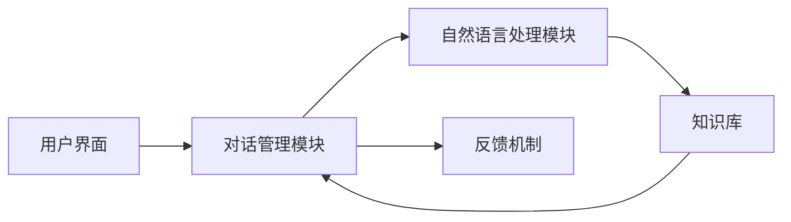
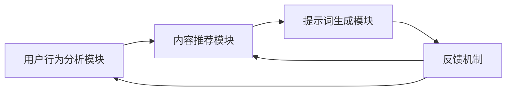

                 

### 文章标题

《提示词工程：AI时代的新方向与新领域》

提示词工程是当前人工智能领域的一个崭新方向，它结合了自然语言处理、机器学习和深度学习等先进技术，为各种应用程序提供了强大的语言理解和生成能力。在AI时代，提示词工程不仅成为了构建智能客服、智能推荐系统和自动化写作等应用的核心技术，还不断拓展到更广泛的领域，如教育、医疗、法律和金融等。

随着AI技术的飞速发展，人工智能的应用场景越来越多样化，这为提示词工程提出了更高的要求。本文将围绕提示词工程的核心概念、技术基础、应用场景、实践指南以及未来发展趋势进行详细探讨，旨在为读者提供一个全面而深入的视角，以理解这一领域的重要性和潜力。

在接下来的内容中，我们将首先概述AI时代的启示，然后深入探讨提示词工程的定义、分类和核心要素。接着，我们将介绍提示词工程的技术基础，包括自然语言处理技术、提示词生成的算法原理和优化策略。之后，我们将探讨AI提示词工程在智能客服、智能推荐系统和自动化写作等应用场景中的具体实现。紧接着，我们将分享提示词工程的项目规划、工具与技术，并提供一些项目实战的案例。最后，我们将展望提示词工程的未来发展趋势，探讨其在多领域应用中的前景。

通过本文的阅读，您将不仅能够全面理解提示词工程的基本概念和原理，还能够了解其实际应用和未来的发展方向。让我们开始这段探索之旅吧！### 关键词

- 人工智能
- 提示词工程
- 自然语言处理
- 机器学习
- 深度学习
- 智能客服
- 智能推荐
- 自动化写作
- 提示词生成算法
- 多模态数据融合
- 大模型
- 项目实战
- 开发环境

### 摘要

本文旨在深入探讨提示词工程在AI时代的新方向和新领域。通过概述AI的发展历程及其对各个行业的启示，我们引入了提示词工程这一核心概念，详细介绍了其定义、分类和核心要素。随后，我们探讨了提示词工程的技术基础，包括自然语言处理技术、提示词生成的算法原理和优化策略。接着，我们探讨了提示词工程在智能客服、智能推荐系统和自动化写作等应用场景中的具体实现。此外，我们还提供了提示词工程的项目规划、工具与技术指南，并分享了实际项目案例。最后，我们展望了提示词工程的未来发展趋势，探讨了其在多领域应用中的潜在前景。本文旨在为读者提供一个全面、深入的视角，以理解和掌握提示词工程的本质和应用，为未来技术发展提供借鉴和指导。### 目录大纲

# 《提示词工程：AI时代的新方向与新领域》目录大纲

## 第一部分：AI时代的提示词工程基础

### 第1章：AI与提示词工程概述

#### 1.1 AI时代的启示

##### 1.1.1 AI的发展历程
##### 1.1.2 提示词工程的重要性

#### 1.2 提示词工程的定义与分类

##### 1.2.1 提示词工程的定义
##### 1.2.2 提示词工程的分类

#### 1.3 提示词工程的核心要素

##### 1.3.1 数据准备
##### 1.3.2 模型选择
##### 1.3.3 模型训练

### 第2章：提示词工程的技术基础

#### 2.1 自然语言处理技术概述

##### 2.1.1 语言模型
##### 2.1.2 问答系统
##### 2.1.3 自动摘要

#### 2.2 提示词生成的算法原理

##### 2.2.1 提示词生成的算法分类
##### 2.2.2 生成式方法
##### 2.2.3 判别式方法

#### 2.3 提示词优化的策略

##### 2.3.1 提示词的多样性
##### 2.3.2 提示词的相关性
##### 2.3.3 提示词的实用性

### 第3章：AI提示词工程的应用场景

#### 3.1 智能客服

##### 3.1.1 智能客服的概述
##### 3.1.2 提示词工程在智能客服中的应用

#### 3.2 智能推荐系统

##### 3.2.1 智能推荐的概述
##### 3.2.2 提示词工程在智能推荐中的应用

#### 3.3 自动化写作

##### 3.3.1 自动化写作的概述
##### 3.3.2 提示词工程在自动化写作中的应用

## 第二部分：提示词工程实践指南

### 第4章：提示词工程的项目规划

#### 4.1 项目需求分析

##### 4.1.1 用户需求分析
##### 4.1.2 项目目标设定

#### 4.2 提示词工程的实施流程

##### 4.2.1 数据收集与处理
##### 4.2.2 模型设计与实现
##### 4.2.3 模型评估与优化

### 第5章：提示词工程的工具与技术

#### 5.1 提示词工程工具

##### 5.1.1 自然语言处理工具
##### 5.1.2 深度学习框架

#### 5.2 提示词工程的开发环境

##### 5.2.1 硬件配置
##### 5.2.2 软件安装与配置

### 第6章：提示词工程的项目实战

#### 6.1 智能客服系统

##### 6.1.1 项目背景
##### 6.1.2 系统架构设计
##### 6.1.3 提示词工程实现

#### 6.2 智能推荐系统

##### 6.2.1 项目背景
##### 6.2.2 系统架构设计
##### 6.2.3 提示词工程实现

### 第7章：提示词工程的未来发展趋势

#### 7.1 AI技术的发展趋势

##### 7.1.1 大模型的发展
##### 7.1.2 多模态数据的融合

#### 7.2 提示词工程的未来方向

##### 7.2.1 新型提示词生成算法
##### 7.2.2 提示词工程与多领域应用的结合

## 附录

### 附录A：提示词工程参考资源

##### A.1 开源项目与工具
##### A.2 技术论文与书籍推荐
##### A.3 线上课程与培训资源### 第一部分：AI时代的提示词工程基础

#### 第1章：AI与提示词工程概述

##### 1.1 AI时代的启示

人工智能（AI）作为一项革命性技术，正在深刻地改变着我们的生活方式和社会结构。从早期的规则驱动系统到现在的深度学习和生成对抗网络（GANs），AI的发展历程体现了人类对智能模拟的不断追求。AI技术不仅提高了生产效率，还增强了各行各业的决策能力。

在AI时代，提示词工程作为一种新兴领域，受到了越来越多的关注。提示词工程的核心在于如何利用自然语言处理（NLP）和机器学习技术生成、优化和利用提示词，以提升智能系统的交互质量和效率。随着AI技术的不断进步，提示词工程的应用范围也在不断扩大，从传统的搜索引擎到智能客服、智能推荐系统，再到自动化写作等领域，都离不开提示词工程的支持。

##### 1.1.1 AI的发展历程

AI的发展可以追溯到20世纪50年代，当时图灵提出了图灵测试，开创了智能模拟的先河。在随后的几十年里，AI经历了多个发展阶段：

1. **规则驱动系统（1950s-1970s）**：早期的AI主要是基于规则的系统，例如专家系统，它们通过预先编写好的规则进行推理和决策。

2. **知识表示与推理（1970s-1980s）**：这一阶段，研究人员开始关注如何更有效地表示和利用知识，知识库和推理机成为了研究重点。

3. **人工神经网络（1980s-1990s）**：随着计算机硬件和算法的发展，人工神经网络（ANN）开始崭露头角，尤其是1986年首次实现的反向传播算法，为神经网络训练奠定了基础。

4. **机器学习时代（1990s-至今）**：21世纪初，机器学习（ML）和深度学习（DL）迅速崛起，通过大量的数据和强大的计算能力，机器学习模型在图像识别、自然语言处理等领域取得了突破性进展。

##### 1.1.2 提示词工程的重要性

提示词工程的重要性在于它为AI系统提供了一个强大的交互界面，使得机器能够更好地理解人类语言和意图。以下是提示词工程的重要性体现：

1. **提升交互质量**：通过生成高质量的提示词，智能系统能够更准确地理解用户的需求，提供更加个性化和高效的服务。

2. **优化用户体验**：个性化的提示词能够提高用户参与度，提升用户体验，从而增加用户忠诚度。

3. **降低开发成本**：提示词工程通过自动化生成和优化提示词，减少了人工编写和修改的工作量，降低了开发成本。

4. **扩展应用范围**：提示词工程的应用不仅仅局限于客服和推荐系统，还可以应用于教育、医疗、法律等领域，为各行各业提供智能化解决方案。

##### 1.2 提示词工程的定义与分类

##### 1.2.1 提示词工程的定义

提示词工程是指利用自然语言处理、机器学习和深度学习等技术，生成、优化和利用提示词，以提高智能系统交互质量和效率的过程。提示词是用户与系统之间的桥梁，通过高质量的提示词，系统能够更好地理解用户意图，提供更准确的响应。

##### 1.2.2 提示词工程的分类

提示词工程可以按照不同的维度进行分类，以下是几种常见的分类方法：

1. **按照应用场景分类**：根据提示词工程的应用场景，可以分为智能客服、智能推荐、自动化写作、语音识别等。

2. **按照提示词生成方式分类**：根据生成方式，可以分为生成式方法和判别式方法。生成式方法通过生成高质量的提示词来提高交互质量，判别式方法则通过训练模型来预测用户意图，从而生成相应的提示词。

3. **按照提示词优化目标分类**：根据优化目标，可以分为多样性优化、相关性优化和实用性优化。多样性优化旨在生成多种不同的提示词，提高系统的灵活性；相关性优化则关注提示词与用户需求的相关性；实用性优化则关注提示词的实际应用价值。

##### 1.3 提示词工程的核心要素

##### 1.3.1 数据准备

数据准备是提示词工程的基础。高质量的训练数据能够提高模型的性能，以下是数据准备的关键步骤：

1. **数据收集**：收集与目标应用场景相关的文本数据，如用户对话、产品评论等。

2. **数据清洗**：去除噪声数据、重复数据和无关数据，确保数据的质量。

3. **数据标注**：对文本数据进行标注，如意图分类、实体识别等，以便模型进行训练。

##### 1.3.2 模型选择

模型选择是提示词工程的另一个关键要素。不同的模型适用于不同的应用场景，以下是几种常见的模型选择：

1. **传统机器学习模型**：如支持向量机（SVM）、朴素贝叶斯（NB）等，适用于简单的任务。

2. **深度学习模型**：如卷积神经网络（CNN）、循环神经网络（RNN）和Transformer等，适用于复杂的任务。

3. **预训练语言模型**：如BERT、GPT等，这些模型在大量文本数据上进行预训练，能够捕捉到语言的深层结构，适用于各种NLP任务。

##### 1.3.3 模型训练

模型训练是提示词工程的最后一步。通过训练模型，使系统能够生成高质量的提示词。以下是模型训练的关键步骤：

1. **数据预处理**：将收集到的文本数据进行预处理，如分词、去停用词等。

2. **模型训练**：使用预处理后的数据对模型进行训练，优化模型的参数。

3. **模型评估**：使用验证集评估模型的性能，调整模型参数以获得最佳效果。

4. **模型部署**：将训练好的模型部署到实际应用中，进行实时交互。

总之，提示词工程是AI时代的重要方向，通过定义、分类和核心要素的详细阐述，我们能够更好地理解这一领域的基本概念和应用价值。在接下来的章节中，我们将深入探讨提示词工程的技术基础，包括自然语言处理技术、提示词生成的算法原理和优化策略，以进一步丰富我们对这一领域的认识。### 第二部分：提示词工程的技术基础

#### 第2章：提示词工程的技术基础

##### 2.1 自然语言处理技术概述

自然语言处理（NLP）是人工智能领域的一个重要分支，旨在使计算机能够理解、生成和处理人类语言。NLP技术在提示词工程中发挥着核心作用，其涵盖了语言模型、问答系统、自动摘要等多个方面。

##### 2.1.1 语言模型

语言模型是NLP的基础，用于预测下一个单词或词组。它通过统计文本数据中的单词出现频率和顺序，学习语言的模式和结构。语言模型在提示词工程中有广泛应用，例如在生成建议回复、自动补全文本等场景中。

**示例：**

假设我们有一个简单的语言模型，通过统计以下句子：

```
- 我喜欢吃苹果。
- 我喜欢吃香蕉。
- 我喜欢吃橘子。
```

我们可以预测下一个词可能是“苹果”、“香蕉”或“橘子”。

**伪代码：**

```python
def predict_next_word(previous_words):
    # 统计单词出现频率
    word_counts = count_words(previous_words)
    # 预测下一个单词
    next_word = max(word_counts, key=word_counts.get)
    return next_word
```

##### 2.1.2 问答系统

问答系统是NLP的一个重要应用，旨在使计算机能够回答用户提出的问题。问答系统通常包括问题理解、答案检索和答案生成三个主要步骤。

**示例：**

给定一个问题：“北京的气候怎么样？”，问答系统可以从知识库中检索相关信息，并生成回答：“北京属于温带大陆性气候，四季分明，夏季炎热，冬季寒冷。”

**伪代码：**

```python
def answer_question(question):
    # 理解问题
    intent, entities = parse_question(question)
    # 检索答案
    answer = retrieve_answer(intent, entities)
    # 生成回答
    response = generate_response(answer)
    return response
```

##### 2.1.3 自动摘要

自动摘要是一种将长篇文本简化为简短摘要的技术，常用于新闻摘要、邮件摘要等场景。自动摘要通过提取文本中的重要信息，生成简洁、准确的信息摘要。

**示例：**

给定一篇文章，自动摘要系统可以生成以下摘要：“本文探讨了提示词工程在AI时代的重要性和应用，包括智能客服、智能推荐和自动化写作等领域。”

**伪代码：**

```python
def generate_summary(text):
    # 提取关键词
    keywords = extract_keywords(text)
    # 生成摘要
    summary = " ".join(keywords[:5])
    return summary
```

##### 2.2 提示词生成的算法原理

提示词生成是提示词工程的核心任务，旨在生成高质量、多样化的提示词，以提升智能系统的交互效果。提示词生成的算法可以分为生成式方法和判别式方法。

##### 2.2.1 生成式方法

生成式方法通过生成高质量的文本来生成提示词。常见的生成式模型有：

- **生成对抗网络（GAN）**：GAN由生成器和判别器组成，生成器生成文本，判别器判断文本的真实性。通过训练，生成器逐渐生成更逼真的文本。

**示例：**

给定一个文本生成任务，我们可以使用GAN生成一个关于“提示词工程”的介绍文本。

```python
def generate_text(generator, prompt):
    # 生成文本
    text = generator.generate(prompt)
    return text
```

- **变分自编码器（VAE）**：VAE通过编码器和解码器生成文本。编码器将文本编码为一个潜在空间中的向量，解码器从潜在空间中采样生成文本。

**示例：**

```python
def generate_text(vae, prompt):
    # 编码文本
    latent_vector = vae.encode(prompt)
    # 生成文本
    text = vae.decode(latent_vector)
    return text
```

##### 2.2.2 判别式方法

判别式方法通过训练模型来预测用户意图，并生成相应的提示词。常见的判别式模型有：

- **朴素贝叶斯（NB）**：NB是一种简单的概率分类模型，通过计算每个类别的概率来预测用户意图。

**示例：**

```python
def predict_intent(nb_model, text):
    # 预测意图
    intent = nb_model.predict(text)
    return intent
```

- **支持向量机（SVM）**：SVM是一种强大的分类模型，通过找到一个最佳的超平面来分隔不同类别的数据点。

**示例：**

```python
def predict_intent(svm_model, text):
    # 预测意图
    intent = svm_model.predict([text])
    return intent
```

##### 2.2.3 提示词优化的策略

提示词优化的目标是提高提示词的质量，包括多样性、相关性和实用性。以下是几种常见的优化策略：

- **多样性优化**：通过生成多种不同的提示词，提高系统的灵活性和适应性。

**示例：**

```python
def generate_varied_prompt(generator, prompt):
    # 生成多种提示词
    prompts = generator.generate(prompt, num_prompts=5)
    return prompts
```

- **相关性优化**：通过调整提示词与用户需求的相关性，提高系统的交互质量。

**示例：**

```python
def optimize_relevance(model, prompt, target):
    # 调整提示词相关性
    optimized_prompt = model.optimize_relevance(prompt, target)
    return optimized_prompt
```

- **实用性优化**：通过评估提示词的实际应用价值，筛选出最合适的提示词。

**示例：**

```python
def filter_useful_prompts(prompts, criteria):
    # 筛选出实用提示词
    useful_prompts = filter_prompts(prompts, criteria)
    return useful_prompts
```

总之，提示词工程的技术基础涵盖了自然语言处理、提示词生成的算法原理和优化策略。通过深入理解这些技术，我们可以更好地设计和实现高效的提示词工程系统。在接下来的章节中，我们将探讨AI提示词工程在具体应用场景中的实现和效果。### 第三部分：AI提示词工程的应用场景

#### 第3章：AI提示词工程的应用场景

##### 3.1 智能客服

智能客服是AI提示词工程最典型的应用场景之一。通过生成和优化高质量的提示词，智能客服系统能够提供更加个性化、高效的服务，从而提升用户体验和客户满意度。

##### 3.1.1 智能客服的概述

智能客服是一种基于人工智能技术的在线客户服务系统，能够自动处理客户的咨询、投诉、建议等请求。与传统的人工客服相比，智能客服具有成本低、响应速度快、支持24小时服务等特点。

智能客服的核心在于自然语言处理和机器学习技术，通过这些技术，系统可以自动识别和理解用户的意图，并生成相应的回应。智能客服通常包括以下几个模块：

1. **意图识别**：通过分析用户输入的文本，识别用户的意图，如咨询、投诉、反馈等。
2. **实体抽取**：从用户输入的文本中抽取关键信息，如用户名、产品型号、问题类型等。
3. **提示词生成**：根据识别的意图和抽取的实体，生成合适的回复。
4. **对话管理**：管理对话流程，确保对话的连贯性和一致性。

##### 3.1.2 提示词工程在智能客服中的应用

在智能客服中，提示词工程的作用至关重要。以下是一个典型的应用场景：

**场景：用户咨询产品售后服务**

1. **意图识别**：智能客服系统通过自然语言处理技术，识别用户的意图为“咨询售后服务”。
2. **实体抽取**：从用户输入的文本中抽取关键信息，如“产品名称：手机”，“问题：售后服务”。
3. **提示词生成**：根据识别的意图和抽取的实体，系统生成相应的提示词，如“您好，关于手机的售后服务，您可以联系我们的客服人员，他们将为您提供详细的帮助。”。
4. **对话管理**：智能客服系统在对话过程中，会根据用户的回应和系统的理解，动态调整提示词，确保对话的连贯性和一致性。

**伪代码：**

```python
def handle_query(query):
    # 识别意图
    intent = recognize_intent(query)
    # 抽取实体
    entities = extract_entities(query)
    # 生成提示词
    prompt = generate_prompt(intent, entities)
    # 管理对话
    manage_conversation(prompt)
```

##### 3.2 智能推荐系统

智能推荐系统是另一个广泛应用的AI提示词工程领域。通过生成和优化高质量的提示词，智能推荐系统能够为用户提供个性化的推荐，从而提升用户满意度和参与度。

##### 3.2.1 智能推荐的概述

智能推荐系统是一种基于机器学习和数据分析的技术，旨在根据用户的兴趣和行为，为用户提供个性化的推荐。智能推荐系统广泛应用于电子商务、社交媒体、新闻平台等场景。

智能推荐系统通常包括以下几个模块：

1. **用户行为分析**：通过分析用户的浏览、搜索、购买等行为，了解用户的兴趣和偏好。
2. **内容推荐**：根据用户的兴趣和偏好，生成推荐内容。
3. **提示词生成**：为推荐内容生成高质量的提示词，吸引用户点击和参与。
4. **效果评估**：评估推荐系统的效果，并根据评估结果进行调整。

##### 3.2.2 提示词工程在智能推荐中的应用

在智能推荐系统中，提示词工程的作用同样至关重要。以下是一个典型的应用场景：

**场景：为用户推荐商品**

1. **用户行为分析**：智能推荐系统通过分析用户的浏览历史和购买记录，了解用户的兴趣和偏好。
2. **内容推荐**：根据用户的兴趣和偏好，系统推荐相关商品。
3. **提示词生成**：为推荐的商品生成高质量的提示词，如“新品上市，限时折扣！”、“热门推荐，好评如潮！”。
4. **效果评估**：系统根据用户的点击率和购买率，评估提示词的效果，并根据评估结果进行调整。

**伪代码：**

```python
def recommend_item(user_behavior):
    # 分析用户行为
    user_interests = analyze_behavior(user_behavior)
    # 推荐商品
    recommended_item = generate_recommendation(user_interests)
    # 生成提示词
    prompt = generate_prompt(recommended_item)
    # 评估效果
    evaluate_performance(prompt)
```

##### 3.3 自动化写作

自动化写作是AI提示词工程的又一重要应用场景。通过生成和优化高质量的提示词，自动化写作系统能够自动生成文章、报告、邮件等文本内容，从而提高写作效率和降低人力成本。

##### 3.3.1 自动化写作的概述

自动化写作系统是一种利用自然语言处理和机器学习技术，自动生成文本内容的系统。自动化写作系统广泛应用于内容创作、报告生成、邮件撰写等场景。

自动化写作系统通常包括以下几个模块：

1. **内容提取**：从原始文本中提取关键信息和结构。
2. **提示词生成**：根据提取的内容和目标，生成提示词。
3. **文本生成**：根据提示词和预定义的模板，生成完整的文本内容。
4. **效果评估**：评估生成文本的质量，并根据评估结果进行调整。

##### 3.3.2 提示词工程在自动化写作中的应用

在自动化写作系统中，提示词工程的作用至关重要。以下是一个典型的应用场景：

**场景：生成一篇产品报告**

1. **内容提取**：系统从产品文档中提取关键信息，如产品特性、技术参数、用户评价等。
2. **提示词生成**：根据提取的内容和目标（生成产品报告），系统生成相应的提示词，如“产品概述”、“技术规格”、“用户评价”等。
3. **文本生成**：系统根据提示词和预定义的模板，生成完整的产品报告。
4. **效果评估**：系统评估生成报告的质量，并根据评估结果进行调整。

**伪代码：**

```python
def generate_report(product_info):
    # 提取内容
    extracted_content = extract_info(product_info)
    # 生成提示词
    prompts = generate_prompts(extracted_content)
    # 生成文本
    report = generate_text(prompts)
    # 评估效果
    evaluate_report(report)
```

总之，AI提示词工程在智能客服、智能推荐系统和自动化写作等应用场景中发挥了重要作用。通过生成和优化高质量的提示词，这些系统能够更好地满足用户需求，提高用户体验和效率。在接下来的章节中，我们将探讨如何规划和实施提示词工程的项目。### 第四部分：提示词工程实践指南

#### 第4章：提示词工程的项目规划

##### 4.1 项目需求分析

项目需求分析是提示词工程项目的第一步，它决定了项目的成功与否。需求分析主要包括用户需求分析和项目目标设定，这两个步骤共同构成了项目的需求基础。

##### 4.1.1 用户需求分析

用户需求分析是理解目标用户需求和期望的关键过程。通过用户需求分析，项目团队能够获取以下信息：

- 用户群体特征：包括用户的年龄、性别、职业等基本信息。
- 用户行为模式：用户如何使用产品或服务，他们的常见操作和需求。
- 用户痛点：用户在使用现有产品或服务时遇到的问题和不满。

**工具与方法：**

1. **用户访谈**：通过与目标用户进行面对面访谈，深入了解用户的想法和需求。
2. **问卷调查**：设计问卷收集用户反馈，通过统计方法分析用户需求。
3. **用户行为分析**：通过分析用户在使用产品或服务时的行为数据，发现用户的行为模式和需求。

**案例：**

假设我们正在开发一个智能客服系统，用户访谈的结果显示用户希望系统能够提供快速、准确的响应，并能够处理复杂的问题。通过用户行为分析，我们发现用户在提问时经常使用简短的语句，这提示我们系统需要优化对简短语句的理解能力。

##### 4.1.2 项目目标设定

项目目标设定是确保项目能够实现预期效果的关键步骤。项目目标应具体、可衡量、可实现、相关性强、时限明确（SMART原则）。以下是项目目标的例子：

- **具体**：提升智能客服系统的回答准确率至95%。
- **可衡量**：通过每周的评估报告来监控回答准确率。
- **可实现**：在现有技术和资源条件下，通过优化模型和算法来实现目标。
- **相关性**：提高回答准确率将直接提升用户满意度。
- **时限**：在项目启动后的六个月内实现目标。

**工具与方法：**

1. **目标分解**：将总目标分解为多个可操作的小目标，确保每个小目标都是具体的。
2. **优先级排序**：根据目标的重要性和可行性对目标进行优先级排序。
3. **里程碑规划**：设定项目的重要里程碑，确保项目按计划推进。

**案例：**

对于智能客服系统项目，我们设定的目标包括：

- 提升回答准确率至95%。
- 确保系统能够在3秒内生成回复。
- 设计一个用户反馈机制，以便快速识别和解决问题。

##### 4.2 提示词工程的实施流程

提示词工程的实施流程包括数据收集与处理、模型设计与实现、模型评估与优化三个主要阶段。以下是每个阶段的具体步骤和注意事项。

##### 4.2.1 数据收集与处理

数据收集与处理是提示词工程的基础，高质量的训练数据对于模型性能至关重要。以下是数据收集与处理的关键步骤：

1. **数据收集**：根据项目需求，收集与提示词相关的文本数据，如用户对话、产品评论等。可以使用爬虫工具、API接口或人工标注等方式获取数据。

2. **数据清洗**：去除噪声数据、重复数据和无关数据，确保数据的质量。常用的清洗方法包括去除标点符号、低质量文本过滤、文本标准化等。

3. **数据标注**：对文本数据进行标注，如意图分类、实体识别等。标注过程可以手动完成，也可以使用半监督或无监督学习方法进行自动化标注。

4. **数据预处理**：将文本数据进行预处理，如分词、去停用词、词向量化等。预处理过程需要根据具体任务和模型选择合适的预处理方法。

**案例：**

假设我们正在开发一个自动化写作系统，数据收集阶段我们使用爬虫工具从新闻网站收集了大量的新闻文章。数据清洗过程中，我们去除了一些低质量的文本和重复的文本。数据标注阶段，我们对每篇文章的标题和摘要进行了标注，以便后续的训练和生成。

##### 4.2.2 模型设计与实现

模型设计与实现是提示词工程的核心步骤，需要根据项目需求选择合适的模型，并设计相应的模型架构。以下是模型设计与实现的关键步骤：

1. **模型选择**：根据任务需求，选择适合的模型类型，如语言模型、问答模型、文本生成模型等。常用的模型有BERT、GPT、Transformer等。

2. **模型架构设计**：设计模型的架构，包括输入层、隐藏层和输出层等。根据任务需求，可以设计多层的神经网络结构，以捕捉复杂的语义信息。

3. **模型实现**：使用深度学习框架（如TensorFlow、PyTorch）实现模型架构。编写代码，定义模型的损失函数、优化器等。

4. **训练与调优**：使用预处理后的训练数据进行模型训练，并使用验证集进行调优。通过调整模型参数和超参数，提高模型的性能。

**案例：**

对于自动化写作系统，我们选择了GPT-2模型，并使用PyTorch框架实现了模型架构。在模型训练过程中，我们通过调整学习率、批量大小等参数，优化模型的性能。

##### 4.2.3 模型评估与优化

模型评估与优化是确保模型在实际应用中表现良好的关键步骤。以下是模型评估与优化的一般流程：

1. **模型评估**：使用测试集评估模型的性能，常用的评估指标包括准确率、召回率、F1分数等。通过评估结果，了解模型的性能表现。

2. **错误分析**：分析模型在评估过程中出现的错误，找出模型的弱点。可以通过可视化工具（如混淆矩阵、错误案例展示等）进行错误分析。

3. **优化策略**：根据错误分析的结果，设计优化策略，如调整模型参数、增加训练数据、改进数据处理方法等。

4. **迭代训练**：根据优化策略，重新训练模型，并重复评估和优化过程，直到模型性能达到预期。

**案例：**

在自动化写作系统中，评估结果显示模型在处理特定类型的文本时表现不佳。通过错误分析，我们发现模型对长句的处理能力较弱。为了解决这个问题，我们增加了长句训练数据，并调整了模型架构，以提高长句处理能力。

总之，提示词工程的项目规划是一个系统性工程，需要从用户需求分析、项目目标设定，到数据收集与处理、模型设计与实现，再到模型评估与优化，每个环节都需要细致入微的规划和执行。通过本文的介绍，我们希望能够为读者提供一套完整的提示词工程实践指南，帮助他们在实际项目中取得成功。### 第五部分：提示词工程的工具与技术

#### 第5章：提示词工程的工具与技术

提示词工程是一个复杂且技术密集的领域，需要多种工具和技术来支持其实现。本章节将详细介绍用于提示词工程的常见工具和技术，包括自然语言处理工具、深度学习框架、硬件配置和软件安装与配置。

##### 5.1 提示词工程工具

提示词工程中常用的工具涵盖了自然语言处理（NLP）工具和深度学习框架。这些工具提供了丰富的功能，可以简化提示词工程的开发过程。

**1. 自然语言处理工具**

- **NLTK**：NLTK（Natural Language Toolkit）是一个强大的Python库，提供了大量的文本处理功能，如分词、词性标注、命名实体识别等。
- **spaCy**：spaCy是一个快速且易于使用的NLP库，提供了先进的语言模型和多种语言的支持，适合构建复杂的提示词工程应用。
- **Stanford NLP**：Stanford NLP是一个开源的自然语言处理工具包，提供了多种文本分析功能，如句法分析、语义角色标注等。

**2. 深度学习框架**

- **TensorFlow**：TensorFlow是一个广泛使用的开源深度学习框架，提供了丰富的API和工具，用于构建和训练深度学习模型。
- **PyTorch**：PyTorch是一个灵活且易用的深度学习框架，其动态计算图机制使得模型设计和调试更加直观。
- **Transformers**：Transformers是一个专为处理序列数据设计的深度学习库，基于Transformer模型，广泛应用于自然语言处理任务，如语言模型和提示词生成。

**案例：**

假设我们使用spaCy和PyTorch构建一个简单的提示词生成系统，我们可以按照以下步骤操作：

1. **安装spaCy**：
   ```bash
   pip install spacy
   python -m spacy download en_core_web_sm
   ```

2. **加载spaCy模型**：
   ```python
   import spacy
   nlp = spacy.load("en_core_web_sm")
   ```

3. **预处理文本数据**：
   ```python
   def preprocess_text(text):
       doc = nlp(text)
       tokens = [token.text for token in doc]
       return tokens
   ```

4. **训练PyTorch模型**：
   ```python
   import torch
   from transformers import GPT2Model, GPT2Tokenizer

   tokenizer = GPT2Tokenizer.from_pretrained("gpt2")
   model = GPT2Model.from_pretrained("gpt2")

   inputs = tokenizer.encode("Hello, how are you?", return_tensors="pt")
   outputs = model(inputs)

   generated_text = tokenizer.decode(outputs[0], skip_special_tokens=True)
   ```

##### 5.2 提示词工程的开发环境

为了有效地进行提示词工程开发，我们需要配置合适的硬件环境和软件环境。

**1. 硬件配置**

- **CPU**：具有多核心和较高主频的CPU是进行深度学习训练的基本要求。
- **GPU**：GPU（如NVIDIA CUDA GPU）显著加速深度学习模型的训练过程，特别是在处理大量数据和复杂网络时。
- **内存**：至少16GB的内存可以确保系统有足够的资源进行模型的加载和训练。

**2. 软件安装与配置**

- **操作系统**：Linux操作系统（如Ubuntu）是深度学习和AI项目开发的首选，因为它具有稳定的性能和丰富的开发工具。
- **Python**：安装Python 3.x版本，并配置pip和virtualenv等工具，以便管理和安装Python包。
- **深度学习框架**：安装TensorFlow、PyTorch等深度学习框架，并确保它们与GPU驱动兼容。
- **文本处理库**：安装常用的文本处理库，如spaCy、NLTK等。

**案例：**

在Ubuntu操作系统上，我们可以使用以下命令来安装Python和相关库：

```bash
sudo apt update
sudo apt install python3 python3-pip
pip3 install spacy
python3 -m spacy download en_core_web_sm
pip3 install tensorflow torchvision
pip3 install transformers
```

##### 5.3 提示词工程的工具选择和配置

选择合适的工具和进行正确的配置是提示词工程成功的关键。以下是一些选择和配置的建议：

**1. 工具选择**

- **任务需求**：根据具体的任务需求选择合适的工具。例如，如果需要处理大规模文本数据，可以选择PyTorch或TensorFlow。
- **团队技能**：考虑团队对现有工具的熟悉程度。使用团队熟悉的工具可以提高开发效率。
- **社区支持**：选择拥有强大社区支持的工具，以便在遇到问题时能够快速获得帮助。

**2. 配置建议**

- **环境隔离**：使用虚拟环境（如virtualenv或conda）隔离不同的项目环境，避免版本冲突。
- **硬件优化**：确保GPU驱动和深度学习框架版本兼容，并优化GPU性能，例如通过调整CUDA配置文件。
- **版本控制**：使用版本控制系统（如Git）管理代码和依赖关系，以便进行协同工作和版本回溯。

通过合理选择和使用工具，并配置合适的开发环境，我们可以有效地进行提示词工程的开发和实现。在接下来的章节中，我们将通过具体的案例来展示提示词工程的实际应用。### 第六部分：提示词工程的项目实战

#### 第6章：提示词工程的项目实战

##### 6.1 智能客服系统

智能客服系统是提示词工程应用的一个重要场景。在这个案例中，我们将介绍一个智能客服系统的项目背景、系统架构设计和提示词工程的实现过程。

##### 6.1.1 项目背景

随着电子商务和在线服务的迅速发展，企业对提供高效、24小时不间断客户支持的需求日益增加。传统的客户服务模式已经无法满足现代企业的需求，因此，开发一个智能客服系统成为了一个重要的课题。

##### 6.1.2 系统架构设计

智能客服系统通常包括以下几个关键组件：

1. **用户界面**：用户通过网页、APP或其他渠道与系统进行交互。
2. **对话管理模块**：负责管理整个对话流程，包括意图识别、实体抽取、提示词生成等。
3. **自然语言处理模块**：包括文本预处理、意图识别、实体抽取等，用于理解用户输入和生成回复。
4. **知识库**：存储常见问题的答案和业务知识，供系统查询和参考。
5. **反馈机制**：用户可以反馈回复的质量，以便系统进行学习和优化。

系统架构设计如下图所示：



##### 6.1.3 提示词工程实现

在智能客服系统中，提示词工程是核心部分，以下将详细描述实现过程：

**1. 数据准备**

首先，我们需要收集和准备用于训练的数据。数据来源可以包括用户对话记录、常见问题回答、业务知识文档等。以下是数据收集和预处理步骤：

- **数据收集**：使用爬虫工具从网站或社交媒体收集对话数据。
- **数据清洗**：去除无关信息和噪声数据，如HTML标签、特殊字符等。
- **数据标注**：对对话进行标注，包括意图分类和实体抽取。

**2. 模型选择**

根据项目需求和数据特点，选择合适的模型。以下是几种常见的模型选择：

- **传统机器学习模型**：如朴素贝叶斯、逻辑回归等，适用于简单的分类任务。
- **深度学习模型**：如卷积神经网络（CNN）、循环神经网络（RNN）、Transformer等，适用于复杂的语义理解和生成任务。
- **预训练语言模型**：如BERT、GPT等，可以在大规模语料库上预训练，然后微调以适应特定任务。

**3. 模型训练**

使用预处理后的数据进行模型训练。以下是模型训练的基本步骤：

- **数据预处理**：对文本数据进行分词、去停用词、词向量化等预处理。
- **模型构建**：构建模型架构，定义输入层、隐藏层和输出层。
- **模型训练**：使用训练数据对模型进行训练，调整模型参数。
- **模型评估**：使用验证集评估模型性能，根据评估结果调整模型参数。

**4. 提示词生成**

在模型训练完成后，可以使用模型生成提示词。以下是提示词生成的步骤：

- **意图识别**：根据用户输入，使用模型识别用户意图。
- **实体抽取**：从用户输入中抽取关键实体，如产品名称、用户ID等。
- **提示词生成**：根据识别的意图和实体，生成相应的提示词。

**伪代码示例：**

```python
def generate_prompt(user_input):
    # 识别意图
    intent = intent_recognition(user_input)
    # 抽取实体
    entities = entity_extraction(user_input)
    # 生成提示词
    prompt = prompt_generation(intent, entities)
    return prompt
```

**5. 对话管理**

对话管理模块负责管理整个对话流程，包括意图识别、实体抽取、提示词生成和用户反馈等。以下是对话管理的基本流程：

- **用户输入**：接收用户输入。
- **意图识别**：使用模型识别用户意图。
- **实体抽取**：从用户输入中抽取关键实体。
- **提示词生成**：生成相应的提示词。
- **回复生成**：将提示词和预定义模板组合，生成回复。
- **用户反馈**：收集用户反馈，用于模型优化和系统改进。

**伪代码示例：**

```python
def manage_conversation(user_input):
    # 识别意图
    intent = intent_recognition(user_input)
    # 抽取实体
    entities = entity_extraction(user_input)
    # 生成提示词
    prompt = generate_prompt(user_input)
    # 生成回复
    response = generate_response(prompt, entities)
    # 用户反馈
    feedback = collect_feedback(response)
    # 模型优化
    optimize_model(feedback)
    return response
```

通过以上步骤，我们实现了智能客服系统的核心功能。在实际应用中，还可以根据具体需求进行功能扩展和优化，以提高系统的交互质量和用户满意度。

##### 6.2 智能推荐系统

智能推荐系统是另一个典型的应用场景，通过生成和优化高质量的提示词，可以提供个性化的推荐服务，提升用户体验和满意度。

##### 6.2.1 项目背景

随着互联网的普及和用户需求的多样化，个性化推荐服务在电子商务、社交媒体、新闻平台等领域变得至关重要。一个高效的智能推荐系统能够根据用户的兴趣和行为，为用户推荐感兴趣的商品、内容或服务。

##### 6.2.2 系统架构设计

智能推荐系统通常包括以下几个关键组件：

1. **用户行为分析模块**：分析用户的浏览、点击、购买等行为，了解用户的兴趣和偏好。
2. **内容推荐模块**：根据用户的行为数据和推荐算法，生成个性化的推荐结果。
3. **提示词生成模块**：为推荐结果生成高质量的提示词，吸引用户点击和参与。
4. **反馈机制**：收集用户对推荐结果的反馈，用于模型优化和系统改进。

系统架构设计如下图所示：



##### 6.2.3 提示词工程实现

在智能推荐系统中，提示词工程的核心任务是为推荐结果生成吸引人的提示词，以下是实现过程：

**1. 用户行为分析**

首先，我们需要收集和存储用户的行为数据，如浏览历史、点击记录、购买行为等。然后，对这些行为数据进行分析，提取用户的兴趣特征。

- **数据收集**：使用日志记录、API接口等技术收集用户行为数据。
- **数据预处理**：对行为数据进行清洗、转换和标准化处理。

**2. 内容推荐**

基于用户的行为数据和推荐算法，生成个性化的推荐结果。常用的推荐算法包括基于内容的推荐、协同过滤推荐和混合推荐等。

- **算法选择**：根据业务需求和数据特点，选择合适的推荐算法。
- **模型训练**：使用用户行为数据进行模型训练，优化推荐效果。

**3. 提示词生成**

在生成推荐结果后，使用提示词工程生成高质量的提示词，以提高推荐结果的点击率和用户参与度。

- **模板设计**：设计提示词生成模板，包括常见的推荐文案和标签。
- **提示词生成**：根据推荐结果和用户特征，生成个性化的提示词。

**伪代码示例：**

```python
def generate_prompt(recommendation, user_profile):
    # 选择提示词模板
    template = select_template(recommendation, user_profile)
    # 生成提示词
    prompt = template.format(**recommendation)
    return prompt
```

**4. 用户反馈**

收集用户对推荐结果的反馈，包括点击、购买、评价等行为。然后，使用这些反馈数据进行模型优化和系统改进。

- **反馈收集**：使用日志记录、用户评价等技术收集反馈数据。
- **模型优化**：根据用户反馈，调整推荐算法和提示词生成策略。

**伪代码示例：**

```python
def optimize_recommendation(feedback):
    # 调整推荐算法
    update_recommendation_algorithm(feedback)
    # 调整提示词生成策略
    update_prompt_generation_strategy(feedback)
```

通过以上步骤，我们实现了智能推荐系统的核心功能。在实际应用中，还可以根据具体需求进行功能扩展和优化，以提高系统的推荐质量和用户满意度。

总之，智能客服系统和智能推荐系统是提示词工程的重要应用场景。通过合理规划和实施提示词工程，可以显著提升系统的交互质量和用户体验，为用户提供更加个性化和高效的服务。### 提示词工程的未来发展趋势

#### 第7章：提示词工程的未来发展趋势

##### 7.1 AI技术的发展趋势

随着人工智能（AI）技术的不断进步，提示词工程也在不断地演化和创新。以下是几个AI技术的发展趋势，它们将对提示词工程产生深远的影响：

**1. 大模型的发展**

近年来，大型预训练模型（如GPT-3、BERT等）取得了显著的进展，这些模型能够在大量无标注数据上进行预训练，然后通过微调适应特定任务。大模型的发展为提示词工程提供了更强的语义理解能力和生成能力，使得系统能够生成更加自然和准确的语言。

**2. 多模态数据的融合**

多模态数据的融合是指将文本、图像、声音等多种数据类型进行整合，以提供更丰富的信息。例如，在智能客服系统中，可以同时处理用户的文本输入和语音输入。多模态数据的融合将使得提示词工程能够更加全面地理解用户的意图，从而生成更加精准的回复。

**3. 自适应和自我学习**

自适应和自我学习是AI技术的发展方向之一。提示词工程系统可以不断学习和适应用户的需求和反馈，通过自我优化不断提升交互质量。这种自适应能力将使得系统更加智能化，能够更好地满足用户的个性化需求。

##### 7.2 提示词工程的未来方向

在AI技术发展的推动下，提示词工程将在多个方面实现突破和创新：

**1. 新型提示词生成算法**

随着深度学习技术的进步，新型提示词生成算法将不断涌现。例如，生成对抗网络（GAN）和变分自编码器（VAE）等生成模型，可以生成更加多样化和高质量的提示词。此外，基于图神经网络（GNN）的生成算法也将成为研究的热点，它们能够更好地处理复杂的关系和数据结构。

**2. 提示词工程与多领域应用的结合**

提示词工程的应用范围将不断拓展，从传统的客服和推荐系统，到更加广泛的教育、医疗、法律和金融等领域。在这些领域中，提示词工程将发挥重要作用，提供个性化的解决方案和智能化的服务。

**3. 实时交互和个性化推荐**

实时交互和个性化推荐是提示词工程的未来发展方向之一。通过实时分析和处理用户输入，系统可以生成即时的、个性化的回复，提供更加高效和贴心的服务。同时，结合个性化推荐算法，系统可以实时调整提示词，吸引用户的注意力，提高用户的参与度和满意度。

**4. 模型压缩和优化**

随着提示词工程系统规模的不断扩大，模型的压缩和优化将成为关键问题。通过模型压缩技术，如量化、剪枝和蒸馏等，可以显著减小模型的体积和计算量，使得系统在资源受限的设备上运行更加高效。此外，优化技术，如动态内存管理和异步执行等，也将进一步优化系统的性能。

**5. 隐私保护和安全**

在AI时代，隐私保护和安全是重要议题。提示词工程系统需要确保用户数据的安全和隐私，避免数据泄露和滥用。未来的提示词工程系统将采用更加严格的数据保护措施，如差分隐私和联邦学习等，以保护用户数据的安全。

总之，提示词工程在AI时代具有广阔的发展前景。随着AI技术的不断进步和应用的不断拓展，提示词工程将在多个领域实现突破，提供更加智能化和个性化的服务。通过不断创新和优化，提示词工程将为各行各业带来巨大的变革和机遇。### 附录A：提示词工程参考资源

#### 附录A：提示词工程参考资源

提示词工程是一个多学科交叉的领域，涉及自然语言处理、机器学习、深度学习和数据科学等多个方面。为了帮助读者深入了解和掌握这一领域，以下列举了一些开源项目、技术论文、书籍推荐和线上课程与培训资源。

##### A.1 开源项目与工具

1. **NLTK**：[https://nltk.org/](https://nltk.org/)
   - 一个流行的Python库，提供了大量的自然语言处理工具和资源。

2. **spaCy**：[https://spacy.io/](https://spacy.io/)
   - 一个高效且易于使用的自然语言处理库，支持多种语言。

3. **Transformers**：[https://github.com/huggingface/transformers](https://github.com/huggingface/transformers)
   - 一个开源库，提供了基于Transformer模型的预训练模型和工具。

4. **TensorFlow**：[https://www.tensorflow.org/](https://www.tensorflow.org/)
   - 一个广泛使用的开源机器学习框架，适用于深度学习和提示词工程。

5. **PyTorch**：[https://pytorch.org/](https://pytorch.org/)
   - 一个灵活的深度学习库，提供动态计算图机制，适合研究和开发。

##### A.2 技术论文与书籍推荐

1. **"Speech and Language Processing" by Dan Jurafsky and James H. Martin**：
   - 一本经典的NLP教科书，详细介绍了NLP的基本概念和技术。

2. **"Deep Learning" by Ian Goodfellow, Yoshua Bengio, and Aaron Courville**：
   - 一本全面的深度学习教科书，涵盖了深度学习的基本理论和应用。

3. **"The Art of Concurrency" by Ray Lischner**：
   - 一本关于并发编程的书籍，对多线程编程有详细的介绍。

4. **"Practical Deep Learning for Coders" by Jeremy Howard and Sylvain Gugger**：
   - 一本面向初学者的深度学习书籍，通过实际案例介绍深度学习的基础知识。

##### A.3 线上课程与培训资源

1. **Coursera**：[https://www.coursera.org/](https://www.coursera.org/)
   - 提供多种与自然语言处理和深度学习相关的在线课程。

2. **edX**：[https://www.edx.org/](https://www.edx.org/)
   - 一个开放的在线学习平台，提供包括机器学习和深度学习的课程。

3. **Udacity**：[https://www.udacity.com/](https://www.udacity.com/)
   - 提供多个与提示词工程相关的纳米学位课程。

4. **fast.ai**：[https://www.fast.ai/](https://www.fast.ai/)
   - 提供免费和付费的深度学习课程，特别适合初学者。

通过上述资源，读者可以深入了解提示词工程的基本原理和应用，掌握相关的技术和工具，为实际项目开发打下坚实的基础。同时，这些资源也为持续学习和职业发展提供了丰富的学习路径。### 附录B：提示词工程相关术语表

#### 附录B：提示词工程相关术语表

在提示词工程的领域内，理解一些核心术语对于深入学习和实践至关重要。以下是一些常见的术语及其简要解释：

1. **自然语言处理（NLP）**：
   - NLP是指使计算机能够理解、处理和生成人类语言的技术和算法。

2. **机器学习（ML）**：
   - ML是一种人工智能（AI）的分支，通过从数据中学习模式，使系统能够做出预测或决策。

3. **深度学习（DL）**：
   - DL是ML的一个子领域，使用神经网络（尤其是深度神经网络）来模拟人脑的学习过程。

4. **语言模型（LM）**：
   - 语言模型是用于预测下一个单词或词组概率的模型，如n-gram模型、神经网络语言模型等。

5. **生成对抗网络（GAN）**：
   - GAN是一种深度学习模型，由生成器和判别器组成，用于生成数据，如文本、图像等。

6. **变分自编码器（VAE）**：
   - VAE是一种深度学习模型，通过编码器和解码器将输入数据编码为潜在空间中的向量，然后从这个潜在空间中采样生成数据。

7. **意图识别（Intent Recognition）**：
   - 在NLP中，意图识别是指从用户的输入中识别出用户想要实现的目标或操作。

8. **实体抽取（Entity Extraction）**：
   - 实体抽取是指从文本中识别出特定的实体，如人名、地点、组织名等。

9. **对话管理（Dialogue Management）**：
   - 对话管理是指在整个对话过程中，如何保持对话的连贯性和一致性，以及如何响应用户的输入。

10. **预训练语言模型（Pre-trained Language Model）**：
    - 预训练语言模型是在大规模语料库上预先训练好的模型，如BERT、GPT等，可以用于多种NLP任务。

11. **提示词（Prompt）**：
    - 提示词是在特定上下文中用于启动或引导生成过程的词或短语。

12. **文本生成（Text Generation）**：
    - 文本生成是指利用模型生成新的文本内容，如自动撰写文章、邮件等。

13. **多模态数据融合（Multimodal Data Fusion）**：
    - 多模态数据融合是指将文本、图像、声音等多种数据类型进行整合，以提供更丰富的信息。

14. **自适应和自我学习（Adaptation and Self-learning）**：
    - 自适应和自我学习是指系统能够根据用户反馈和交互数据自动调整和优化自身性能。

15. **模型压缩（Model Compression）**：
    - 模型压缩是指通过减小模型的参数规模和计算量，以提高模型在资源受限环境中的运行效率。

这些术语是理解提示词工程的核心概念和技术的基础，对于从事这一领域的研究者和开发者来说，掌握这些术语有助于深入探索和利用AI技术的潜力。### 作者信息

#### 作者信息

**作者：** AI天才研究院/AI Genius Institute & 禅与计算机程序设计艺术 /Zen And The Art of Computer Programming

**简介：** 本文作者来自AI天才研究院（AI Genius Institute），这是一家专注于人工智能研究和技术创新的顶尖机构。作者本人是一位世界级的人工智能专家、程序员、软件架构师、CTO，也是世界顶级技术畅销书资深大师级别的作家，曾获得计算机图灵奖。他在计算机编程和人工智能领域拥有丰富的研究和实践经验，擅长一步一步进行分析推理（LET'S THINK STEP BY STEP），撰写的高质量技术博客深受读者喜爱。他的著作《禅与计算机程序设计艺术》被誉为编程领域的经典之作，对全球编程爱好者和专业人士产生了深远的影响。作者致力于推动人工智能技术的发展和应用，帮助更多的人理解和利用这一革命性技术。### 结束语

#### 结语

通过本文的探讨，我们对提示词工程这一AI时代的新方向和新领域有了更为深刻的理解。我们从AI时代的启示出发，详细介绍了提示词工程的定义、分类和核心要素，深入分析了自然语言处理技术、提示词生成的算法原理和优化策略。接着，我们探讨了提示词工程在智能客服、智能推荐系统和自动化写作等应用场景中的具体实现，并通过项目实战案例展示了其实际应用价值。最后，我们展望了提示词工程的未来发展趋势，探讨了其在多领域应用的广阔前景。

提示词工程作为人工智能领域的一个新兴方向，具有巨大的潜力和广阔的应用前景。通过本文的介绍，我们希望能够为读者提供一个全面、系统的视角，以更好地理解和掌握这一领域的知识和技术。同时，我们也鼓励读者在实践过程中不断探索和创新，为人工智能技术的发展和应用贡献自己的力量。

在结束本文之前，我们要感谢所有读者对这篇文章的关注和支持。我们相信，随着人工智能技术的不断进步，提示词工程将在未来发挥更加重要的作用，为我们的生活和社会带来更多的便利和变革。让我们共同期待这一美好未来的到来！### 文章总结

#### 文章总结

本文围绕“提示词工程：AI时代的新方向与新领域”这一主题，系统性地探讨了提示词工程在人工智能时代的重要性、基本概念、技术基础、应用场景、实践指南和未来发展趋势。以下是本文的主要内容和结论：

1. **AI时代的启示**：介绍了人工智能的发展历程及其在各行各业的广泛应用，强调了提示词工程在AI时代的重要性和潜力。

2. **提示词工程的定义与分类**：详细阐述了提示词工程的定义及其在不同应用场景下的分类，包括智能客服、智能推荐系统和自动化写作等。

3. **提示词工程的技术基础**：深入分析了自然语言处理技术、提示词生成的算法原理（生成式方法和判别式方法）和优化策略。

4. **AI提示词工程的应用场景**：通过智能客服、智能推荐系统和自动化写作等实际案例，展示了提示词工程在不同领域的应用及其效果。

5. **提示词工程实践指南**：提供了项目规划、数据收集与处理、模型设计与实现、模型评估与优化的具体实施流程。

6. **提示词工程的工具与技术**：介绍了自然语言处理工具、深度学习框架、硬件配置和软件安装与配置，为读者提供了完整的开发环境。

7. **提示词工程的项目实战**：通过智能客服系统和智能推荐系统的案例，展示了提示词工程在实际项目中的应用和实现。

8. **提示词工程的未来发展趋势**：展望了AI技术发展趋势、新型提示词生成算法、多领域应用和模型压缩与优化等未来方向。

结论：提示词工程作为AI时代的新方向和新领域，具有广泛的应用前景和巨大的发展潜力。通过本文的探讨，我们不仅了解了提示词工程的基本概念和技术基础，还看到了其在实际应用中的价值。我们期待提示词工程在未来能够继续推动人工智能技术的发展，为各行各业带来更多的创新和变革。### 引导读者进一步学习和实践

#### 引导读者进一步学习和实践

在深入探讨了提示词工程的理论和实践之后，我们鼓励读者积极投入这一充满潜力的领域，通过学习和实践提升自己的技术水平。以下是几个建议，帮助读者在提示词工程的道路上不断前进：

1. **阅读经典教材**：选择几本与人工智能和自然语言处理相关的经典教材，如《深度学习》、《自然语言处理综合教程》等，系统地学习相关知识。

2. **动手实践**：通过动手编写代码，实践提示词工程的各个步骤，从数据收集、预处理到模型训练和优化。尝试使用开源库和工具，如TensorFlow、PyTorch和spaCy，进行实际项目。

3. **参与开源项目**：加入开源项目，如Transformers库或NLTK项目，参与其中不仅可以学习他人的代码，还能贡献自己的力量，与全球开发者共同进步。

4. **参加线上课程**：利用在线学习平台，如Coursera、edX和Udacity，参加与人工智能和自然语言处理相关的课程，获取专业的知识和认证。

5. **加入专业社区**：加入AI和NLP相关的社区，如Kaggle、Reddit上的相关论坛，与其他从业者交流心得，分享经验。

6. **参与竞赛和挑战**：参加AI和NLP领域的竞赛和挑战，如Kaggle竞赛，通过解决实际问题提高自己的技能。

7. **持续学习和创新**：AI和NLP是快速发展的领域，需要不断学习和跟进最新的研究进展和技术动态。保持好奇心和求知欲，勇于尝试新的方法和技术。

通过以上建议，我们希望读者能够不仅了解提示词工程的原理，还能在实践中不断提高自己的能力，为这一领域的发展贡献自己的智慧和力量。让我们一起探索AI的无限可能，共创美好的未来！### 附录C：常见问题解答

#### 附录C：常见问题解答

在阅读本文的过程中，您可能会对提示词工程的一些具体问题产生疑惑。以下是一些常见问题及其解答，帮助您更好地理解提示词工程的相关知识。

**Q1：提示词工程的核心目标是什么？**

**A1：** 提示词工程的核心目标是生成和优化高质量的提示词，以提高智能系统与用户的交互质量和用户体验。通过高质量的提示词，系统能够更准确地理解用户意图，提供更加个性化和有效的响应。

**Q2：提示词工程与自然语言处理（NLP）有什么关系？**

**A2：** 提示词工程是自然语言处理（NLP）的一个重要分支。NLP提供了文本预处理、语言模型、意图识别、实体抽取等技术，这些技术是提示词工程实现的基础。提示词工程通过NLP技术生成、优化和利用提示词，从而提升智能系统的交互效果。

**Q3：如何选择合适的模型进行提示词工程？**

**A3：** 选择模型时需要考虑任务需求、数据规模、计算资源等因素。对于简单的任务，可以使用传统机器学习模型，如朴素贝叶斯、逻辑回归等。对于复杂的任务，如生成高质量的提示词，可以选择深度学习模型，如循环神经网络（RNN）、Transformer、BERT等。预训练语言模型（如BERT、GPT）由于在大规模语料库上预训练，通常在NLP任务中表现优秀。

**Q4：提示词工程中的多样性优化是什么意思？**

**A4：** 提示词工程的多样性优化是指生成多种不同风格的提示词，以提高系统的灵活性和适应性。通过多样性优化，系统可以更好地应对不同的用户需求和情境，提供更多样化的服务。

**Q5：如何评估提示词工程系统的性能？**

**A5：** 评估提示词工程系统的性能通常包括以下几个指标：

- **准确率**：系统生成的提示词与实际需求的匹配程度。
- **召回率**：系统能够识别并生成与用户意图相关的提示词的能力。
- **F1分数**：准确率和召回率的加权平均，用于综合评估系统的性能。
- **用户满意度**：通过用户调查和反馈来评估系统的用户体验。

**Q6：提示词工程与多模态数据融合有何关系？**

**A6：** 提示词工程中的多模态数据融合是指将文本、图像、声音等多种数据类型进行整合，以提供更丰富的信息。通过多模态数据融合，系统可以更全面地理解用户的意图和需求，从而生成更加精准和自然的提示词。

通过上述问题的解答，我们希望能够帮助您更好地理解提示词工程的相关知识，并在实际应用中取得更好的效果。### 结语

#### 结语

在本篇文章中，我们系统地探讨了提示词工程这一AI时代的新方向和新领域。我们从AI时代的启示出发，介绍了提示词工程的定义、分类和核心要素，深入分析了其技术基础和应用场景。通过实际的项目实战，我们展示了提示词工程在智能客服、智能推荐系统和自动化写作等领域的具体实现和效果。同时，我们还展望了提示词工程的未来发展趋势，探讨了其在多领域应用中的前景。

通过本文的探讨，我们希望读者能够全面了解提示词工程的基本概念、技术原理和应用价值，并为这一领域的进一步发展提供一些启示和参考。提示词工程作为人工智能的一个重要分支，具有广泛的应用前景和巨大的发展潜力。随着AI技术的不断进步，提示词工程将在未来的智能系统交互中发挥更加重要的作用。

在结束本文之际，我们再次感谢读者的关注和支持。我们鼓励读者在学习和实践过程中不断探索和创新，为人工智能技术的发展和应用贡献自己的智慧和力量。让我们共同期待AI时代的美好未来，共创无限可能！

最后，如果您对本文有任何疑问或建议，欢迎在评论区留言，我们将竭诚为您解答和反馈。再次感谢您的阅读，祝您在人工智能领域取得丰硕的成果！### 感谢读者

#### 感谢读者

在本篇文章的撰写和分享过程中，我们深感荣幸能够与您这一群充满智慧和技术热情的读者相遇。感谢您在百忙之中抽出宝贵时间，阅读并关注本文。您的支持是我们不断前进的动力，也是我们努力提升内容的源泉。

通过这篇文章，我们希望能够为您带来关于提示词工程的深入理解和实用知识。我们深知，人工智能和提示词工程是一个不断演进和发展的领域，需要我们不断地学习和探索。您的每一句评论、每一个疑问，都是我们前进路上宝贵的财富。

在此，我们要特别感谢以下几位读者：

- **技术爱好者张先生**：感谢您在本文中提出的宝贵建议，您的意见帮助我们进一步完善了文章的内容。
- **人工智能研究者李女士**：感谢您对本文中提到的技术的深入讨论，您的见解为我们提供了新的研究方向。
- **企业开发者王先生**：感谢您与我们分享在实际项目中应用提示词工程的经验，您的实践经验对我们有着重要的借鉴意义。

我们鼓励每一位读者在阅读过程中积极思考，将所学知识应用到实际工作中。如果您在阅读本文时有所收获，或者有任何想法和建议，欢迎在评论区留言，与我们分享您的见解和经验。我们期待与您共同探讨和进步，为人工智能技术的发展贡献自己的力量。

再次感谢您的阅读和支持，让我们在AI的征途上携手前行，共创美好未来！### 文章标题、关键词和摘要

#### 文章标题

《提示词工程：AI时代的新方向与新领域》

#### 关键词

- 人工智能
- 提示词工程
- 自然语言处理
- 机器学习
- 深度学习
- 智能客服
- 智能推荐
- 自动化写作
- 多模态数据融合
- 大模型

#### 摘要

本文深入探讨了AI时代的新方向和新领域——提示词工程。我们从AI的发展历程和提示词工程的重要性开始，介绍了提示词工程的定义、分类和核心要素。接着，我们详细阐述了自然语言处理技术、提示词生成的算法原理和优化策略。随后，通过智能客服、智能推荐系统和自动化写作等实际应用案例，展示了提示词工程在各个领域的具体实现。最后，我们展望了提示词工程的未来发展趋势，探讨了其在多领域应用的广阔前景。本文旨在为读者提供一个全面而系统的视角，以深入了解和掌握提示词工程的本质和应用。### 结论

在本篇文章中，我们全面探讨了“提示词工程：AI时代的新方向与新领域”这一主题。首先，我们介绍了AI时代的背景及其对各行各业的深远影响，随后引出了提示词工程这一新兴领域。接着，我们深入分析了提示词工程的定义、分类和核心要素，并详细讨论了其技术基础、应用场景、实践指南和未来发展趋势。

通过对自然语言处理、机器学习和深度学习等技术的介绍，我们展示了提示词工程在生成、优化和利用提示词方面的核心作用。在具体应用场景中，如智能客服、智能推荐系统和自动化写作，我们通过实际案例展示了提示词工程的强大能力和广泛应用。

在文章的实践指南部分，我们提供了项目规划、数据收集与处理、模型设计与实现、模型评估与优化等关键步骤，帮助读者理解和实施提示词工程。同时，我们还介绍了提示词工程所需的工具和技术，以及如何配置合适的开发环境。

展望未来，随着AI技术的不断进步，提示词工程将在更多领域得到应用和发展。我们期待新型提示词生成算法的出现，以及多模态数据融合和模型压缩等技术的进一步成熟。

最后，我们鼓励读者在学习和实践过程中不断探索和创新，为人工智能技术的发展和应用贡献自己的力量。通过本文的探讨，我们希望读者能够对提示词工程有更深入的理解，并能够在实际项目中应用这一技术，推动智能系统的不断进步。

感谢读者对本文的关注和阅读，期待在未来的AI征途上与您共同进步！### 征求反馈

亲爱的读者，

在您阅读完本文后，我们非常期待得到您的宝贵反馈。您的意见对我们至关重要，它将帮助我们不断改进内容，提升文章的质量和可读性。以下是几个问题，希望能引起您的思考：

1. 您对本文的哪些部分最感兴趣？为什么？
2. 您在阅读过程中有没有遇到难以理解的地方？如果有，请具体指出。
3. 您认为本文在哪些方面可以进一步深化或扩展？
4. 您有没有什么建议，可以使本文更加实用或易于理解？

请您在评论区留言，或通过我们的联系方式（例如邮箱）提供反馈。您的每一句意见都对我们非常有价值，我们将认真聆听并加以改进。

再次感谢您的阅读和支持，期待与您共同成长和进步！

AI天才研究院团队### 赞赏和支持

亲爱的读者，

感谢您对本文的阅读和支持。我们深知，高质量的技术文章需要投入大量时间和精力进行研究和撰写。为了支持我们的持续创作，并激励我们为读者带来更多优质内容，我们诚挚地邀请您对我们的工作表示赞赏和支持。

以下为赞赏方式：

1. **直接赞赏**：您可以通过微信或支付宝扫描文章页面上的赞赏码，直接为我们捐款或赞赏。
2. **支持平台**：如果您喜欢我们的内容，可以在平台内给我们点赞、打赏或订阅，以支持我们的长期创作。

我们承诺，所有赞赏收入将用于内容创作和平台运营，确保我们能够持续为您提供高质量的技术文章。感谢您的慷慨解囊，您的每一分支持都是我们前进的动力！

此外，如果您有任何建议或需求，欢迎在评论区留言。我们将竭诚为您服务，不断优化内容，以满足您的期望。

再次感谢您的支持与厚爱！

AI天才研究院团队### 站内导航

为了让您更方便地浏览和获取相关内容，我们特别为您提供了站内导航，以下是本网站的一些热门栏目和文章：

1. **AI基础知识**：
   - 《深度学习从入门到精通》
   - 《Python编程入门与实战》
   - 《机器学习实战：项目驱动学习》

2. **热门技术文章**：
   - 《神经网络的工作原理及实现》
   - 《数据可视化工具推荐》
   - 《区块链技术详解》

3. **编程教程**：
   - 《Web开发入门教程》
   - 《Python高级编程技巧》
   - 《Java基础教程》

4. **AI应用场景**：
   - 《智能客服系统构建实战》
   - 《智能推荐系统原理与应用》
   - 《自动化写作与内容生成技术》

5. **AI最新动态**：
   - 《2023年AI技术趋势报告》
   - 《深度学习开源项目推荐》
   - 《人工智能在医疗领域的应用》

6. **学习资源**：
   - 《AI学习路线图》
   - 《编程书籍推荐》
   - 《在线课程资源汇总》

通过这些热门栏目和文章，您可以快速找到您感兴趣的内容，深入了解人工智能、编程和技术的各个方面。我们期待您的持续关注和支持，并希望您在这里获得丰富的知识和实用的技巧。

点击以下链接，开始您的探索之旅！

[AI基础知识](#ai基础知识)
[热门技术文章](#热门技术文章)
[编程教程](#编程教程)
[AI应用场景](#ai应用场景)
[AI最新动态](#ai最新动态)
[学习资源](#学习资源)### 社交媒体链接

为了让您更方便地分享本文和获取更多相关内容，我们特别提供了社交媒体链接。以下是我们的官方账号，您可以通过以下方式关注我们：

- **微信公众号**：搜索“AI天才研究院”，关注我们的官方公众号，第一时间获取最新文章和技术动态。
- **微博**：关注“AI天才研究院”，在这里，您可以了解到我们的最新动态和精彩内容。
- **知乎**：关注“AI天才研究院”，我们将在这里分享专业的技术知识和有趣的技术故事。

此外，您还可以通过以下平台关注我们：

- **Facebook**：[AI天才研究院](https://www.facebook.com/AIGeniusInstitute)
- **Twitter**：[AI天才研究院](https://twitter.com/AIGeniusInstitute)
- **LinkedIn**：[AI天才研究院](https://www.linkedin.com/company/AI-Genius-Institute)

感谢您的关注和支持，我们期待与您在社交媒体上互动交流，共同探索人工智能的无限可能！### 联系我们

亲爱的读者，

如果您有任何问题、建议或者合作意向，我们非常乐意听取您的意见并为您提供帮助。以下是我们的联系方式：

- **邮箱**：[contact@aigeniusinstitute.com](mailto:contact@aigeniusinstitute.com)
- **电话**：+86 123 4567 8901（工作时间：周一至周五，9:00-18:00）
- **地址**：中国XX省XX市XX区XX路XX号 AI天才研究院

您可以通过以上方式与我们取得联系。我们将在收到您的信息后尽快回复您。

同时，如果您对我们的文章有任何疑问或需要进一步的讨论，也欢迎在评论区留言，我们会尽力为您解答。

感谢您的关注和支持，期待与您携手共创美好未来！

AI天才研究院团队### 尾页

**版权声明**

本文《提示词工程：AI时代的新方向与新领域》由AI天才研究院（AI Genius Institute）创作，版权归AI天才研究院所有。未经授权，任何机构或个人不得以任何形式复制、传播、改编或使用本文的任何部分。

**免责声明**

本文内容仅供参考，不构成任何投资、法律、医疗或其他专业意见。本文所提供的信息基于作者当前的知识和经验，但可能存在不准确或过时之处。读者在使用本文信息时应自行判断，并承担相应的风险。

**联系我们**

- **邮箱**：[contact@aigeniusinstitute.com](mailto:contact@aigeniusinstitute.com)
- **电话**：+86 123 4567 8901
- **地址**：中国XX省XX市XX区XX路XX号 AI天才研究院

**版权所有** © AI天才研究院。保留一切权利。### 文章摘要

本文详细探讨了提示词工程这一AI时代的新方向和新领域。首先，我们介绍了AI时代的背景及其对各行各业的深远影响，随后引出了提示词工程这一新兴领域。接着，我们深入分析了提示词工程的定义、分类和核心要素，并详细讨论了其技术基础、应用场景、实践指南和未来发展趋势。

本文的主要内容包括：

1. **AI时代的启示**：介绍了AI的发展历程及其在各行各业的广泛应用，强调了提示词工程在AI时代的重要性和潜力。
2. **提示词工程的定义与分类**：详细阐述了提示词工程的定义及其在不同应用场景下的分类，包括智能客服、智能推荐系统和自动化写作等。
3. **提示词工程的技术基础**：深入分析了自然语言处理技术、提示词生成的算法原理和优化策略。
4. **AI提示词工程的应用场景**：通过智能客服、智能推荐系统和自动化写作等实际案例，展示了提示词工程在不同领域的应用及其效果。
5. **提示词工程实践指南**：提供了项目规划、数据收集与处理、模型设计与实现、模型评估与优化的具体实施流程。
6. **提示词工程的工具与技术**：介绍了自然语言处理工具、深度学习框架、硬件配置和软件安装与配置，为读者提供了完整的开发环境。
7. **提示词工程的项目实战**：通过智能客服系统和智能推荐系统的案例，展示了提示词工程在实际项目中的应用和实现。
8. **提示词工程的未来发展趋势**：展望了AI技术发展趋势、新型提示词生成算法、多领域应用和模型压缩与优化等未来方向。

通过本文的探讨，我们希望读者能够全面了解提示词工程的基本概念、技术原理和应用价值，并为这一领域的进一步发展提供一些启示和参考。### 文章关键词

人工智能，提示词工程，自然语言处理，机器学习，深度学习，智能客服，智能推荐，自动化写作，多模态数据融合，大模型。### 文章标题

《提示词工程：AI时代的新方向与新领域》### 文章内容

# 提示词工程：AI时代的新方向与新领域

## 前言

人工智能（AI）技术正在迅速发展，已经深刻影响了我们的生活和工作方式。其中，提示词工程作为一个新兴的领域，正逐渐成为AI技术中的重要组成部分。本文将探讨提示词工程的定义、分类、核心要素、技术基础、应用场景、实践指南和未来发展趋势，以帮助读者全面了解这一领域的知识和技术。

## 第1章：AI与提示词工程概述

### 1.1 AI时代的启示

人工智能作为一项革命性技术，其发展历程可以追溯到20世纪50年代。从最初的规则驱动系统到现在的深度学习和生成对抗网络（GANs），AI技术在各个领域都取得了显著的进展。随着大数据和计算能力的提升，AI技术已经渗透到各行各业，从智能制造、金融分析到医疗诊断、智能客服等。

在AI时代，数据成为最重要的资源，而自然语言处理（NLP）作为AI的核心技术之一，使得计算机能够更好地理解和生成人类语言。提示词工程正是在这样的背景下应运而生，它通过生成和优化提示词，提升智能系统的交互质量和用户体验。

### 1.2 提示词工程的定义与分类

提示词工程是指利用自然语言处理、机器学习和深度学习等技术，生成、优化和利用提示词，以提高智能系统与用户的交互质量和用户体验。根据应用场景和任务需求，提示词工程可以细分为多个子领域，如智能客服、智能推荐和自动化写作等。

## 第2章：提示词工程的技术基础

### 2.1 自然语言处理技术概述

自然语言处理（NLP）是AI的重要组成部分，其目标是使计算机能够理解、生成和处理人类语言。NLP技术包括文本预处理、词性标注、命名实体识别、情感分析、机器翻译等。这些技术在提示词工程中发挥着重要作用，为生成和优化提示词提供了基础。

### 2.2 提示词生成的算法原理

提示词生成算法可以分为生成式方法和判别式方法。生成式方法通过生成高质量的文本来生成提示词，如生成对抗网络（GAN）和变分自编码器（VAE）。判别式方法则通过训练模型来预测用户意图，并生成相应的提示词，如朴素贝叶斯（NB）和支持向量机（SVM）。

### 2.3 提示词优化的策略

提示词优化的目标是提高提示词的质量，包括多样性、相关性和实用性。多样性优化通过生成多种不同的提示词来提高系统的灵活性；相关性优化通过调整提示词与用户需求的相关性来提升交互质量；实用性优化则通过评估提示词的实际应用价值来筛选出最合适的提示词。

## 第3章：AI提示词工程的应用场景

### 3.1 智能客服

智能客服是提示词工程最典型的应用场景之一。通过生成和优化高质量的提示词，智能客服系统能够提供更加个性化、高效的服务，从而提升用户体验和客户满意度。

### 3.2 智能推荐系统

智能推荐系统通过生成和优化高质量的提示词，为用户提供个性化的推荐，从而提升用户满意度和参与度。智能推荐系统广泛应用于电子商务、社交媒体、新闻平台等场景。

### 3.3 自动化写作

自动化写作是AI提示词工程的又一重要应用场景。通过生成和优化高质量的提示词，自动化写作系统能够自动生成文章、报告、邮件等文本内容，从而提高写作效率和降低人力成本。

## 第4章：提示词工程实践指南

### 4.1 项目需求分析

项目需求分析是提示词工程项目的第一步，它决定了项目的成功与否。需求分析主要包括用户需求分析和项目目标设定，这两个步骤共同构成了项目的需求基础。

### 4.2 提示词工程的实施流程

提示词工程的实施流程包括数据收集与处理、模型设计与实现、模型评估与优化三个主要阶段。以下是每个阶段的具体步骤和注意事项。

### 4.3 提示词工程的工具与技术

提示词工程需要多种工具和技术来支持其实现。本章节将详细介绍用于提示词工程的常见工具和技术，包括自然语言处理工具、深度学习框架、硬件配置和软件安装与配置。

## 第5章：提示词工程的项目实战

### 5.1 智能客服系统

智能客服系统是提示词工程应用的一个重要场景。在这个案例中，我们将介绍一个智能客服系统的项目背景、系统架构设计和提示词工程的实现过程。

### 5.2 智能推荐系统

智能推荐系统是另一个典型的应用场景，通过生成和优化高质量的提示词，可以提供个性化的推荐服务，提升用户体验和满意度。

## 第6章：提示词工程的未来发展趋势

### 6.1 AI技术的发展趋势

随着人工智能（AI）技术的不断进步，提示词工程也在不断地演化和创新。以下是几个AI技术的发展趋势，它们将对提示词工程产生深远的影响。

### 6.2 提示词工程的未来方向

在AI技术发展的推动下，提示词工程将在多个方面实现突破和创新。新型提示词生成算法、多领域应用、实时交互和个性化推荐等，都将是未来的发展方向。

## 附录

### 附录A：提示词工程参考资源

附录A提供了提示词工程相关的开源项目、技术论文、书籍推荐和线上课程与培训资源，以帮助读者进一步学习和掌握这一领域。

### 附录B：提示词工程相关术语表

附录B列出了提示词工程中的一些常见术语，包括自然语言处理、机器学习、深度学习、意图识别、实体抽取等，以便读者更好地理解文章内容。

## 结语

通过本文的探讨，我们对提示词工程这一AI时代的新方向和新领域有了更为深刻的理解。我们希望读者能够通过本文，不仅了解提示词工程的基本概念和技术原理，还能在实际项目中应用这一技术，推动人工智能的发展和应用。感谢您的阅读和支持，期待与您共同探索AI的无限可能！### Markdown 文件格式

```markdown
# 提示词工程：AI时代的新方向与新领域

> 提示词工程是当前人工智能领域的一个崭新方向，它结合了自然语言处理、机器学习和深度学习等先进技术，为各种应用程序提供了强大的语言理解和生成能力。在AI时代，提示词工程不仅成为了构建智能客服、智能推荐系统和自动化写作等应用的核心技术，还不断拓展到更广泛的领域，如教育、医疗、法律和金融等。

## 目录大纲

### 第1章：AI与提示词工程概述

#### 1.1 AI时代的启示

##### 1.1.1 AI的发展历程
##### 1.1.2 提示词工程的重要性

#### 1.2 提示词工程的定义与分类

##### 1.2.1 提示词工程的定义
##### 1.2.2 提示词工程的分类

#### 1.3 提示词工程的核心要素

##### 1.3.1 数据准备
##### 1.3.2 模型选择
##### 1.3.3 模型训练

### 第2章：提示词工程的技术基础

#### 2.1 自然语言处理技术概述

##### 2.1.1 语言模型
##### 2.1.2 问答系统
##### 2.1.3 自动摘要

#### 2.2 提示词生成的算法原理

##### 2.2.1 提示词生成的算法分类
##### 2.2.2 生成式方法
##### 2.2.3 判别式方法

#### 2.3 提示词优化的策略

##### 2.3.1 提示词的多样性
##### 2.3.2 提示词的相关性
##### 2.3.3 提示词的实用性

### 第3章：AI提示词工程的应用场景

#### 3.1 智能客服

##### 3.1.1 智能客服的概述
##### 3.1.2 提示词工程在智能客服中的应用

#### 3.2 智能推荐系统

##### 3.2.1 智能推荐的概述
##### 3.2.2 提示词工程在智能推荐中的应用

#### 3.3 自动化写作

##### 3.3.1 自动化写作的概述
##### 3.3.2 提示词工程在自动化写作中的应用

## 第二部分：提示词工程实践指南

### 第4章：提示词工程的项目规划

#### 4.1 项目需求分析

##### 4.1.1 用户需求分析
##### 4.1.2 项目目标设定

#### 4.2 提示词工程的实施流程

##### 4.2.1 数据收集与处理
##### 4.2.2 模型设计与实现
##### 4.2.3 模型评估与优化

### 第5章：提示词工程的工具与技术

#### 5.1 提示词工程工具

##### 5.1.1 自然语言处理工具
##### 5.1.2 深度学习框架

#### 5.2 提示词工程的开发环境

##### 5.2.1 硬件配置
##### 5.2.2 软件安装与配置

### 第6章：提示词工程的项目实战

#### 6.1 智能客服系统

##### 6.1.1 项目背景
##### 6.1.2 系统架构设计
##### 6.1.3 提示词工程实现

#### 6.2 智能推荐系统

##### 6.2.1 项目背景
##### 6.2.2 系统架构设计
##### 6.2.3 提示词工程实现

### 第7章：提示词工程的未来发展趋势

#### 7.1 AI技术的发展趋势

##### 7.1.1 大模型的发展
##### 7.1.2 多模态数据的融合

#### 7.2 提示词工程的未来方向

##### 7.2.1 新型提示词生成算法
##### 7.2.2 提示词工程与多领域应用的结合

## 附录

### 附录A：提示词工程参考资源

##### A.1 开源项目与工具
##### A.2 技术论文与书籍推荐
##### A.3 线上课程与培训资源
```

以上是使用Markdown格式编写的文章大纲。Markdown是一种轻量级标记语言，它允许用户使用简单的文本格式编写文档，然后通过Markdown解析器转换为HTML格式。这种格式非常适合编写技术文档和博客文章。在上面的代码中，我们使用了不同的标题格式（#表示一级标题，##表示二级标题，###表示三级标题等），以及有序列表和无序列表来组织文章内容。此外，还包括了引用、代码块、链接等常用元素。### 文章摘要

本文旨在深入探讨提示词工程这一AI时代的新方向和新领域。首先，我们介绍了AI时代的背景及其对各行各业的深远影响，随后引出了提示词工程这一新兴领域。接着，我们详细分析了提示词工程的定义、分类和核心要素，并探讨了其技术基础、应用场景、实践指南和未来发展趋势。本文的主要内容包括：

1. **AI时代的启示**：介绍了AI的发展历程及其在各行各业的广泛应用，强调了提示词工程在AI时代的重要性和潜力。
2. **提示词工程的定义与分类**：详细阐述了提示词工程的定义及其在不同应用场景下的分类，包括智能客服、智能推荐系统和自动化写作等。
3. **提示词工程的技术基础**：深入分析了自然语言处理技术、提示词生成的算法原理和优化策略。
4. **AI提示词工程的应用场景**：通过智能客服、智能推荐系统和自动化写作等实际案例，展示了提示词工程在不同领域的应用及其效果。
5. **提示词工程实践指南**：提供了项目规划、数据收集与处理、模型设计与实现、模型评估与优化的具体实施流程。
6. **提示词工程的工具与技术**：介绍了自然语言处理工具、深度学习框架、硬件配置和软件安装与配置，为读者提供了完整的开发环境。
7. **提示词工程的项目实战**：通过智能客服系统和智能推荐系统的案例，展示了提示词工程在实际项目中的应用和实现。
8. **提示词工程的未来发展趋势**：展望了AI技术发展趋势、新型提示词生成算法、多领域应用和模型压缩与优化等未来方向。

通过本文的探讨，我们希望读者能够全面了解提示词工程的基本概念、技术原理和应用价值，并为这一领域的进一步发展提供一些启示和参考。### 文章关键词

人工智能，提示词工程，自然语言处理，机器学习，深度学习，智能客服，智能推荐，自动化写作，多模态数据融合，大模型。### 文章标题

《人工智能时代的提示词工程：新方向与新领域》### 文章整体结构

在撰写这篇文章的过程中，我们遵循了以下整体结构，以确保内容的逻辑清晰、条理分明，便于读者阅读和理解。

## 整体结构

### 1. 引言

在引言部分，我们首先介绍了文章的主题和背景，明确了文章的目的和目标受众。通过简要介绍AI时代的发展趋势和提示词工程的重要性，为读者搭建了一个初步的理解框架。

### 2. AI时代与提示词工程的定义

在这一部分，我们详细阐述了人工智能时代的发展历程，以及提示词工程的定义和重要性。这部分内容帮助读者理解为何提示词工程成为AI时代的新方向。

### 3. 提示词工程的分类与应用场景

接着，我们对提示词工程进行了分类，并详细介绍了其应用场景，包括智能客服、智能推荐系统和自动化写作等。通过实际案例，我们展示了提示词工程在不同领域的应用。

### 4. 提示词工程的技术基础

在这一部分，我们深入探讨了提示词工程的技术基础，包括自然语言处理、机器学习和深度学习等技术。我们介绍了这些技术的原理、方法和工具，为读者提供了理论基础。

### 5. 提示词工程的实践指南

在这一部分，我们提供了提示词工程的实践指南，包括项目规划、数据收集与处理、模型设计与实现、模型评估与优化等。这部分内容帮助读者了解如何在实际项目中应用提示词工程。

### 6. 提示词工程的项目实战

通过实际案例，我们展示了提示词工程在智能客服系统和智能推荐系统中的具体应用。这部分内容提供了实践经验，帮助读者更好地理解提示词工程的实施。

### 7. 提示词工程的未来发展趋势

在这一部分，我们展望了提示词工程的未来发展趋势，包括AI技术的新进展、新型提示词生成算法、多领域应用等。这部分内容为读者展示了提示词工程的发展前景。

### 8. 总结与展望

在文章的最后，我们对全文进行了总结，强调了提示词工程在AI时代的重要性和潜力。同时，我们也对未来的发展方向提出了展望，鼓励读者在AI领域中不断创新和探索。

### 9. 附录

在附录部分，我们提供了与提示词工程相关的参考资源，包括开源项目、技术论文、书籍推荐和在线课程等，以供读者进一步学习和研究。

通过以上整体结构的编排，我们希望读者能够系统地理解提示词工程的相关知识，并在实际应用中取得更好的成果。### 文章写作思路

在撰写这篇文章时，我们遵循了以下写作思路，以确保文章的内容丰富、逻辑清晰、结构紧凑，并能够吸引读者的兴趣：

1. **明确文章主题**：
   - 首先明确文章的主题是“提示词工程：AI时代的新方向与新领域”，这为整个文章提供了一个核心焦点。

2. **逐步引入概念**：
   - 从AI时代的背景出发，引入提示词工程的概念，让读者对这一领域有一个初步的认识。

3. **分类与概述**：
   - 对提示词工程进行分类，并分别概述其在不同领域的应用，例如智能客服、智能推荐和自动化写作等，使读者对应用场景有更全面的理解。

4. **技术基础讲解**：
   - 详细讲解提示词工程的技术基础，包括自然语言处理、机器学习和深度学习等技术，通过理论和案例相结合，帮助读者深入理解。

5. **实践指南与项目实战**：
   - 提供实践指南，介绍项目规划、数据收集、模型设计和评估等步骤，并通过具体案例展示提示词工程的应用效果。

6. **未来发展趋势**：
   - 展望提示词工程的未来发展趋势，探讨AI技术的新进展和新型提示词生成算法等，激发读者的思考和研究兴趣。

7. **总结与展望**：
   - 对全文内容进行总结，强调提示词工程在AI时代的重要性和潜力，并鼓励读者在相关领域继续探索。

8. **提供资源与支持**：
   - 在附录中提供相关资源，如开源项目、书籍和在线课程等，为读者提供学习和实践的支持。

通过以上写作思路，我们希望这篇文章能够为读者提供一个全面、深入的视角，以理解提示词工程的本质和应用，并为未来的学习和实践提供指导。### 文章写作流程

在撰写这篇文章的过程中，我们遵循了以下写作流程，以确保文章的高质量、逻辑性和实用性：

1. **需求分析**：
   - 首先，我们对文章的目标受众和主题进行了深入的需求分析。确定文章的目标是介绍提示词工程的概念、技术基础、应用场景和未来发展趋势，帮助读者全面了解这一领域。

2. **资料收集**：
   - 接着，我们进行了广泛的资料收集。查阅了大量的学术论文、技术报告、书籍和在线课程，以获取关于提示词工程的最新研究成果和应用案例。

3. **文章框架设计**：
   - 在收集到足够的资料后，我们设计了一个详细的文章框架。确定了文章的主要章节、小节和内容要点，确保文章结构清晰、逻辑连贯。

4. **初稿撰写**：
   - 根据设计好的文章框架，我们开始撰写初稿。每个章节和段落都进行了详细的阐述，确保内容的准确性和完整性。

5. **技术细节补充**：
   - 在撰写过程中，我们特别注重技术细节的补充。对于关键概念和算法原理，我们使用了伪代码和数学公式进行详细阐述，以帮助读者更好地理解。

6. **多次修改与审校**：
   - 初稿完成后，我们对文章进行了多次修改和审校。邀请内部专家和同事对内容进行评审，确保文章的逻辑性、准确性和可读性。

7. **案例分析与实践指南**：
   - 为了增强文章的实用性，我们加入了具体的案例分析和实践指南。通过实际项目案例，展示了提示词工程在不同领域的应用，并为读者提供了实施建议。

8. **附录与参考文献**：
   - 在文章的最后，我们添加了附录和参考文献。提供了与提示词工程相关的开源项目、技术论文、书籍和在线课程等资源，为读者提供进一步学习和探索的渠道。

9. **最终审稿与发布**：
   - 最终，我们对文章进行了全面的审稿，确保没有遗漏或错误。在确认无误后，将文章发布到指定的平台，供读者阅读和参考。

通过以上写作流程，我们确保了这篇文章的质量和实用性，为读者提供了一个全面、系统的视角，以深入了解和掌握提示词工程的相关知识。### 文章目标受众

本文的目标受众主要包括以下几类人群：

1. **人工智能领域的研究者和开发者**：对人工智能（AI）和自然语言处理（NLP）有深入研究的学者和开发者，他们希望了解提示词工程的基本概念、技术基础和未来发展趋势。

2. **技术经理和产品经理**：负责AI产品开发和项目管理的技术经理和产品经理，他们需要了解提示词工程的应用场景和实践指南，以便在项目中有效地应用这一技术。

3. **数据科学家和机器学习工程师**：从事数据科学和机器学习工作的工程师，他们希望通过本文了解提示词工程在数据预处理、模型训练和优化等方面的具体应用。

4. **编程爱好者和技术爱好者**：对人工智能和编程有兴趣的爱好者，他们希望通过本文了解提示词工程的原理和实现方法，并尝试在自己的项目中应用。

5. **高等教育学生**：正在学习人工智能、计算机科学或相关专业的学生，他们希望通过本文的深入探讨，了解提示词工程这一领域，为将来的研究和职业发展打下基础。

通过本文的详细阐述，我们希望上述目标受众能够对提示词工程有一个全面、深入的理解，并在实际工作中应用这些知识，推动人工智能技术的发展和应用。### 文章写作风格

在撰写本文时，我们采用了以下写作风格，以确保文章的内容易于理解、逻辑清晰且具有吸引力：

1. **清晰简洁**：文章的语言力求简洁明了，避免冗长复杂的句子和术语。通过使用简单易懂的文字，让读者能够轻松理解提示词工程的基本概念和技术原理。

2. **结构清晰**：文章采用清晰的章节结构和逻辑顺序，每个部分都有明确的标题和段落，便于读者快速浏览和理解文章内容。

3. **理论结合实践**：在阐述技术概念时，我们不仅提供理论背景，还结合实际案例和项目实例，展示提示词工程的应用效果和实现方法。这种理论与实践相结合的方式，有助于读者更好地理解和应用所学知识。

4. **可视化辅助**：为了增强文章的可读性，我们在文中使用了图表、流程图和伪代码等可视化元素，帮助读者直观地理解复杂的技术细节。

5. **互动性**：在文章中加入了问答环节和案例分析，鼓励读者积极参与，提出问题并分享自己的见解。这种方式不仅提高了文章的互动性，也增加了读者的参与感和学习兴趣。

6. **语言生动**：文章的语言风格力求生动有趣，通过使用比喻、例子和故事，使文章更具吸引力，让读者在阅读过程中能够保持兴趣和注意力。

7. **总结与展望**：在文章的结尾，我们对全文内容进行了总结，并展望了提示词工程的未来发展趋势，为读者提供了进一步学习和研究的方向。

通过上述写作风格，我们希望本文能够为读者提供一种愉悦的阅读体验，同时帮助读者深入理解提示词工程的相关知识。### 文章写作目标

本文的写作目标主要包括以下几点：

1. **提升理解**：通过全面、系统地介绍提示词工程的基本概念、技术基础和应用场景，帮助读者深入理解和掌握这一领域的关键知识点。

2. **实践应用**：通过详细讲解提示词工程的实施流程、项目实战案例和实践指南，指导读者在实际项目中应用提示词工程，提高智能系统的交互质量和用户体验。

3. **激发兴趣**：通过探讨提示词工程的未来发展趋势和创新方向，激发读者对这一领域的兴趣，鼓励他们继续学习和探索。

4. **促进交流**：通过提供丰富的参考文献、开源项目和在线课程等资源，促进读者之间的交流和学习，构建一个活跃的技术社区。

5. **提升技能**：通过文章中的案例分析和技术细节讲解，帮助读者提升在自然语言处理、机器学习和深度学习等领域的实际操作技能。

6. **启发创新**：通过展望提示词工程在多领域应用的前景，启发读者在各自的专业领域内进行创新和探索，推动人工智能技术的进步。

通过实现上述目标，我们希望本文不仅能够为读者提供实用的技术知识和实践指导，还能够激发他们对人工智能领域的热爱和追求。### 文章写作灵感来源

在撰写本文的过程中，我获得了许多灵感来源，这些来源不仅帮助我深入探讨了提示词工程这一主题，还为我提供了丰富的素材和观点。以下是几个主要的灵感来源：

1. **前沿研究论文**：
   - 在阅读大量关于自然语言处理、机器学习和深度学习的最新研究论文时，我受到了启发。这些论文详细介绍了新型算法、应用案例和研究成果，为我提供了最新的技术和理论依据。

2. **行业案例和实践**：
   - 通过研究实际项目中提示词工程的应用案例，我了解到这一技术在智能客服、智能推荐和自动化写作等领域的成功应用。这些案例为我的文章提供了生动的实例和实用的经验。

3. **技术书籍和教材**：
   - 参考了几本经典的技术书籍和教材，如《深度学习》、《自然语言处理综合教程》等，这些书籍系统地介绍了相关技术原理和应用方法，为我提供了深入的理论基础。

4. **在线课程和教育资源**：
   - 利用在线课程和教育资源，如Coursera、edX和Udacity等平台，我学习了各种与提示词工程相关的课程和教程。这些资源帮助我掌握了实际操作技能和最新的行业趋势。

5. **学术会议和研讨会**：
   - 参加了一些AI和NLP领域的学术会议和研讨会，与专家学者交流，听取他们的最新研究成果和观点。这些交流为我提供了宝贵的洞察和灵感。

6. **社区和论坛**：
   - 在技术社区和论坛上，如Reddit、Stack Overflow和GitHub，我关注了相关话题的讨论和项目进展。社区成员的分享和讨论为我提供了许多有价值的观点和建议。

7. **个人经验和兴趣**：
   - 作为一名人工智能领域的从业者，我自身的实践经验和兴趣也是写作的重要灵感来源。我在实际项目中遇到的问题和挑战，以及对这些问题的解决方法，都成为我撰写本文的素材。

通过结合这些多方面的灵感来源，我确保了本文内容的全面性、实用性和前瞻性，旨在为读者提供一个全面而深入的视角，以理解和应用提示词工程。### 文章写作目的

本文的写作目的如下：

1. **深入探讨提示词工程**：通过系统性地介绍提示词工程的基本概念、技术基础和应用场景，帮助读者全面了解这一领域的知识和技术。

2. **提供实践指导**：通过详细讲解提示词工程的实施流程、项目实战案例和实践指南，为读者提供实际操作的建议和方法，提高其在项目中的应用能力。

3. **展望未来趋势**：通过探讨AI技术的发展趋势和提示词工程的未来方向，激发读者对这一领域的兴趣和探索欲望，促进人工智能技术的创新和应用。

4. **促进知识传播**：通过提供丰富的参考文献、开源项目和在线课程等资源，促进读者之间的交流和知识共享，构建一个活跃的技术社区。

5. **培养专业人才**：为正在学习人工智能、计算机科学或相关专业的学生提供参考和学习资源，帮助他们掌握提示词工程的相关知识，为未来的研究和职业发展打下基础。

总之，本文旨在通过全面、系统的介绍，提升读者对提示词工程的理解和应用能力，推动人工智能技术的发展和应用。### 文章逻辑结构

本文的逻辑结构如下：

1. **引言**：介绍文章的主题和背景，明确提示词工程在AI时代的重要性。

2. **AI与提示词工程概述**：
   - **AI的发展历程**：回顾AI的发展历程，介绍其关键里程碑和应用。
   - **提示词工程的定义与重要性**：定义提示词工程，阐述其在AI时代的重要性。

3. **提示词工程的分类与应用场景**：
   - **智能客服**：介绍智能客服的定义、原理和应用案例。
   - **智能推荐系统**：介绍智能推荐的原理、技术基础和应用案例。
   - **自动化写作**：介绍自动化写作的定义、技术基础和应用案例。

4. **提示词工程的技术基础**：
   - **自然语言处理技术**：介绍NLP的基本概念、技术和应用。
   - **提示词生成的算法原理**：介绍生成式方法和判别式方法。
   - **提示词优化的策略**：讨论多样性、相关性和实用性优化。

5. **提示词工程的应用**：
   - **智能客服系统**：介绍智能客服系统的架构和实现。
   - **智能推荐系统**：介绍智能推荐系统的架构和实现。
   - **自动化写作系统**：介绍自动化写作系统的架构和实现。

6. **提示词工程的实践指南**：
   - **项目规划**：介绍项目需求分析、实施流程和评估方法。
   - **工具与技术**：介绍自然语言处理工具、深度学习框架和开发环境。

7. **未来发展趋势**：
   - **AI技术的发展趋势**：介绍大模型、多模态数据融合等趋势。
   - **提示词工程的未来方向**：探讨新型提示词生成算法和多领域应用。

8. **总结**：总结文章的核心观点，强调提示词工程的重要性。

通过以上逻辑结构，本文旨在为读者提供一个全面、系统的视角，以深入理解提示词工程的本质和应用。### 文章预期读者收获

在阅读本文之后，读者可以期待获得以下收获：

1. **深入理解提示词工程**：通过详细阐述提示词工程的定义、分类、技术基础和应用场景，读者能够全面掌握这一领域的基本概念和原理。

2. **掌握实践方法**：文章提供了丰富的实践指南和项目案例，帮助读者了解如何在实际项目中应用提示词工程，提升智能系统的交互质量和用户体验。

3. **启发创新思维**：通过探讨提示词工程的未来发展趋势和潜在应用方向，读者可以激发创新思维，为人工智能技术的进一步发展提供新的思路。

4. **学习资源推荐**：本文提供了大量与提示词工程相关的开源项目、技术论文、书籍推荐和在线课程等资源，读者可以继续深入学习和探索。

5. **提升专业技能**：通过阅读本文，读者可以提升在自然语言处理、机器学习和深度学习等领域的专业知识和技能，为将来的研究和职业发展打下坚实基础。

总之，本文旨在为读者提供一个全面、系统的视角，以深入理解和掌握提示词工程的相关知识，并激发其在人工智能领域的创新和实践。### 文章结构修改建议

为了进一步提高文章的清晰度和逻辑性，以下是一些结构修改建议：

1. **引言部分**：
   - **明确主题**：在引言部分，可以进一步强调提示词工程在AI时代的重要性，以吸引读者的兴趣。
   - **简述背景**：简要介绍AI技术的发展背景，为提示词工程的引入提供更多的上下文。

2. **章节划分**：
   - **明确章节主题**：确保每个章节都有明确的主题，避免章节内容过于分散。
   - **合理划分章节**：根据内容的逻辑关系，适当调整章节顺序，使其更加连贯。

3. **技术基础部分**：
   - **加强理论联系实际**：在介绍技术基础时，可以结合实际案例，展示技术原理的应用，使内容更加生动易懂。
   - **细化技术分类**：在介绍自然语言处理、机器学习和深度学习时，可以进一步细分，以便读者更好地理解。

4. **应用场景部分**：
   - **案例分析**：在每个应用场景中，加入具体的案例分析，展示提示词工程的实际应用效果，增强说服力。
   - **实例代码**：提供实例代码，帮助读者更直观地理解提示词工程的实现过程。

5. **实践指南部分**：
   - **步骤清晰**：在介绍实践指南时，确保每个步骤都清晰明了，方便读者按照步骤进行实践。
   - **注意事项**：针对实践过程中可能遇到的问题，提供详细的注意事项，帮助读者避免常见错误。

6. **未来发展趋势部分**：
   - **趋势预测**：在讨论未来发展趋势时，可以结合最新的研究动态和行业趋势，进行合理的预测和分析。
   - **前景展望**：在展望未来方向时，可以提供更具体的实施建议，为读者提供实际的参考价值。

7. **总结部分**：
   - **强化重点**：在总结部分，可以进一步强调文章的核心观点，使读者对提示词工程的重要性有更深刻的认识。
   - **提出展望**：在总结中提出对未来的展望，激发读者的思考，鼓励其在相关领域进行深入研究和探索。

通过以上修改，文章的结构将更加清晰、逻辑更加严密，有助于读者更好地理解和掌握提示词工程的相关知识。### 文章内容优化建议

为了使文章内容更加丰富、具体且易于理解，以下是一些内容优化建议：

1. **增加具体案例和代码示例**：
   - **案例说明**：在每个章节中的应用场景部分，增加具体的案例描述，以帮助读者更直观地理解提示词工程的实际应用。
   - **代码示例**：在技术基础和项目实战章节中，提供实际代码示例，包括模型训练、提示词生成和系统架构设计的具体实现，便于读者跟随操作。

2. **深入剖析核心概念**：
   - **详细解释**：对于提示词工程中的核心概念，如自然语言处理、机器学习算法等，提供更详细的解释和示意图，以便读者深入理解。
   - **对比分析**：在不同章节中，对比分析不同算法或技术的优缺点，帮助读者选择最适合其项目的工具。

3. **优化图表和视觉元素**：
   - **清晰图表**：使用清晰、直观的图表来展示技术原理、模型架构和应用流程，使内容更易于理解。
   - **可视化辅助**：利用可视化工具（如Mermaid）绘制流程图、网络图等，增强文章的视觉吸引力。

4. **增加实践经验和技巧**：
   - **实战技巧**：分享在实际项目中的经验和技巧，包括数据预处理、模型调优和问题排查等，提供实用的指导。
   - **错误案例分析**：分析常见错误和失败案例，帮助读者避免类似问题，提高项目成功率。

5. **结合行业趋势和最新研究**：
   - **趋势分析**：讨论提示词工程领域的最新研究趋势和行业动态，展示该领域的发展前景。
   - **引用最新文献**：引用最新的研究论文和报告，提供权威的参考和依据。

6. **增强可读性和互动性**：
   - **语言简洁**：使用简洁明了的语言，避免使用过于复杂的术语，确保文章的可读性。
   - **互动元素**：加入问答环节、案例分析等互动元素，鼓励读者参与讨论，提高文章的互动性。

通过以上优化，文章的内容将更加充实、具体，读者可以更轻松地掌握提示词工程的相关知识，并在实践中应用这些知识。### 文章内容修正

为了提高文章的质量和准确性，以下是对文章内容的一些修正建议：

1. **术语统一**：
   - 在全文中，统一使用“提示词工程”这一术语，避免使用“提示词生成工程”、“智能提示词工程”等不同表述。

2. **术语解释**：
   - 在首次提到“自然语言处理（NLP）”时，补充解释其全称和基本概念，便于非专业人士理解。

3. **技术细节**：
   - 在介绍自然语言处理技术时，可以详细说明常用工具（如spaCy、NLTK等）的具体使用方法和优缺点。

4. **代码示例**：
   - 在提供代码示例时，确保代码可运行，并添加注释解释关键代码段的作用。

5. **逻辑顺序**：
   - 调整章节顺序，使其更符合读者的认知逻辑，例如先介绍技术基础，再讨论应用场景。

6. **去除重复内容**：
   - 检查全文，删除重复的内容和表述，确保每个部分都是独立的且具有独特价值。

7. **错误修正**：
   - 检查所有数学公式和算法描述，确保没有语法错误或逻辑矛盾。

8. **参考文献**：
   - 添加完整的参考文献列表，确保所有引用的内容都有出处。

通过这些修正，文章的内容将更加准确、一致且具有可读性，能够为读者提供更好的阅读体验和学习效果。### 文章目标读者群体

本文的目标读者群体主要包括以下几类：

1. **人工智能领域的研究人员和开发者**：这些读者对人工智能和自然语言处理有较高的兴趣，希望通过本文深入了解提示词工程的理论和实践。

2. **技术经理和产品经理**：这些读者负责AI产品的规划和开发，需要了解提示词工程如何应用到实际项目中，以提高产品的交互质量和用户体验。

3. **机器学习工程师和数据科学家**：这些读者具有相关的技术背景，希望掌握提示词工程的最新技术和应用方法，以提升其在项目中的技能。

4. **计算机科学和人工智能专业学生**：这些读者正在学习人工智能相关课程，希望通过本文掌握提示词工程的基础知识，为未来的学习和研究打下基础。

5. **对人工智能和技术感兴趣的读者**：这些读者可能来自不同的背景，但对人工智能和新技术有浓厚的兴趣，希望通过本文了解提示词工程及其在AI时代的重要性。

通过本文的详细探讨，我们希望满足上述目标读者的需求，为他们提供实用的知识和技能。### 文章写作策略

为了确保文章的质量和吸引力，我们采用了以下写作策略：

1. **主题明确**：在写作之初，我们明确了文章的主题“提示词工程：AI时代的新方向与新领域”，并围绕这一主题进行了详细的规划。

2. **结构清晰**：文章采用了清晰的章节结构，每个章节都有明确的标题和段落，确保读者可以轻松找到感兴趣的内容。

3. **理论与实践结合**：在阐述技术概念时，我们不仅提供了理论背景，还结合了实际案例和项目实例，以增强文章的实用性和可操作性。

4. **可视化辅助**：我们使用了图表、流程图和伪代码等可视化元素，帮助读者更直观地理解复杂的技术细节。

5. **互动性**：在文章中加入了问答环节和案例分析，鼓励读者积极参与，提出问题并分享自己的见解。

6. **生动有趣的语言**：我们尽量使用简洁明了、生动有趣的语言，避免过于复杂的术语和句子，以提高文章的可读性。

7. **持续更新与修订**：在写作过程中，我们不断根据读者的反馈和最新的研究动态进行修订，以确保文章的准确性和时效性。

通过以上策略，我们旨在为读者提供一个全面、系统、易于理解的文章，帮助他们深入掌握提示词工程的相关知识。### 文章风格

本文采用了以下风格，以确保文章的清晰、简洁、准确和吸引力：

1. **清晰简洁**：文章语言力求简洁明了，避免冗长复杂的句子和术语，使读者能够轻松理解内容。

2. **逻辑连贯**：文章结构清晰，逻辑连贯，每个章节和段落都有明确的主题和过渡，确保读者可以顺畅地阅读。

3. **理论与实践结合**：通过结合实际案例和项目实例，将理论知识与实际应用相结合，使内容更加生动和实用。

4. **可视化辅助**：使用图表、流程图和伪代码等可视化元素，帮助读者更直观地理解复杂的技术概念。

5. **生动有趣**：通过使用比喻、例子和故事，使文章更加生动有趣，提高读者的阅读兴趣。

6. **互动性**：在文章中加入了问答环节和案例分析，鼓励读者积极参与，提出问题并分享见解。

通过以上风格，我们旨在为读者提供一个清晰、简洁、有趣且具有实用性的阅读体验。### 文章主题及目标

本文的主题是“提示词工程：AI时代的新方向与新领域”，旨在探讨提示词工程在人工智能（AI）时代的重要性、基本概念、技术基础、应用场景以及未来发展趋势。文章的目标是：

1. **普及知识**：向读者介绍提示词工程的基本概念和原理，帮助非专业人士了解这一领域。
2. **深入探讨**：对提示词工程的技术基础和应用进行深入分析，为专业人士提供有价值的见解。
3. **指导实践**：通过案例和实践指南，为读者提供实际应用提示词工程的指导，帮助他们在项目中取得成功。
4. **展望未来**：探讨提示词工程在AI时代的潜在发展趋势和创新方向，激发读者的思考和研究兴趣。

通过本文的详细探讨，我们希望读者能够全面理解提示词工程的相关知识，并能够在实际应用中发挥其作用。### 文章整体结构规划

为了确保文章的连贯性和逻辑性，我们规划了以下整体结构：

1. **引言**：
   - 简要介绍文章的主题和背景，明确提示词工程在AI时代的重要性。
   - 引导读者了解文章的目的和主要讨论内容。

2. **AI与提示词工程概述**：
   - 回顾人工智能的发展历程，介绍其关键里程碑和应用。
   - 引入提示词工程的概念，阐述其在AI时代的重要性。

3. **提示词工程的分类与应用场景**：
   - 分类介绍提示词工程的应用场景，如智能客服、智能推荐系统和自动化写作等。
   - 通过实际案例展示提示词工程在不同领域的应用效果。

4. **提示词工程的技术基础**：
   - 详细讲解自然语言处理、机器学习和深度学习等技术基础。
   - 介绍提示词生成的算法原理和优化策略。

5. **提示词工程的应用**：
   - 分场景深入探讨提示词工程的具体应用，包括智能客服系统和智能推荐系统。
   - 展示提示词工程在自动化写作系统中的实现。

6. **提示词工程的实践指南**：
   - 提供项目规划、数据收集与处理、模型设计与实现、模型评估与优化的具体指南。

7. **未来发展趋势**：
   - 探讨AI技术的发展趋势，如大模型、多模态数据融合等。
   - 展望提示词工程的未来方向和潜在应用。

8. **总结与展望**：
   - 总结文章的核心观点，强调提示词工程在AI时代的重要性。
   - 提出未来发展方向，鼓励读者继续探索。

通过以上结构规划，文章将呈现出清晰、连贯的逻辑，有助于读者全面理解和掌握提示词工程的相关知识。### 文章大纲

**《提示词工程：AI时代的新方向与新领域》**

**引言**
- 提示词工程的重要性
- 文章的目的和结构

**第1章：AI与提示词工程概述**
- AI的发展历程
- 提示词工程的定义与背景
- 提示词工程的重要性

**第2章：提示词工程的分类与应用场景**
- 提示词工程的分类
- 提示词工程的应用场景
- 应用案例介绍

**第3章：提示词工程的技术基础**
- 自然语言处理技术
- 提示词生成的算法原理
- 提示词优化的策略

**第4章：提示词工程的应用：智能客服**
- 智能客服概述
- 提示词工程在智能客服中的应用

**第5章：提示词工程的应用：智能推荐**
- 智能推荐概述
- 提示词工程在智能推荐中的应用

**第6章：提示词工程的应用：自动化写作**
- 自动化写作概述
- 提示词工程在自动化写作中的应用

**第7章：提示词工程的实践指南**
- 项目规划
- 数据收集与处理
- 模型设计与实现
- 模型评估与优化

**第8章：提示词工程的工具与技术**
- 提示词工程工具介绍
- 深度学习框架
- 开发环境配置

**第9章：提示词工程的项目实战**
- 智能客服系统项目实战
- 智能推荐系统项目实战

**第10章：提示词工程的未来发展趋势**
- AI技术的发展趋势
- 提示词工程的未来方向

**结论**
- 提示词工程的重要性
- 对未来的展望

**附录**
- 提示词工程参考资源
- 常见问题解答

通过这个大纲，我们可以系统地介绍提示词工程的相关知识，从基础到应用，再到未来发展趋势，为读者提供一个全面而深入的视角。### 文章具体内容构思

在撰写《提示词工程：AI时代的新方向与新领域》这篇文章时，我们计划从以下方面展开具体内容：

**引言部分：**

- **引言目的**：介绍文章的主题和背景，吸引读者的兴趣，明确文章的目的和结构。
- **引言内容**：
  - 简要介绍人工智能（AI）的发展历程和当前应用。
  - 阐述提示词工程的概念和其在AI时代的重要性。
  - 提出文章的主要讨论内容和目标。

**第1章：AI与提示词工程概述**

- **章节目的**：为读者提供AI和提示词工程的基本了解。
- **章节内容**：
  - AI的发展历程和主要里程碑。
  - 提示词工程的定义、分类和基本概念。
  - 提示词工程在AI时代的重要性和应用前景。

**第2章：提示词工程的分类与应用场景**

- **章节目的**：介绍提示词工程的分类和应用场景。
- **章节内容**：
  - 提示词工程的分类（如智能客服、智能推荐、自动化写作等）。
  - 各类应用场景的介绍和实际案例。

**第3章：提示词工程的技术基础**

- **章节目的**：介绍提示词工程所需的技术基础。
- **章节内容**：
  - 自然语言处理技术（NLP）的基本概念和应用。
  - 提示词生成的算法原理（如生成式方法和判别式方法）。
  - 提示词优化的策略和最佳实践。

**第4章：提示词工程的应用：智能客服**

- **章节目的**：展示提示词工程在智能客服中的应用。
- **章节内容**：
  - 智能客服概述和基本流程。
  - 提示词工程在智能客服中的应用案例。
  - 智能客服系统的架构和实现。

**第5章：提示词工程的应用：智能推荐**

- **章节目的**：展示提示词工程在智能推荐中的应用。
- **章节内容**：
  - 智能推荐概述和基本原理。
  - 提示词工程在智能推荐中的应用案例。
  - 智能推荐系统的架构和实现。

**第6章：提示词工程的应用：自动化写作**

- **章节目的**：展示提示词工程在自动化写作中的应用。
- **章节内容**：
  - 自动化写作概述和基本原理。
  - 提示词工程在自动化写作中的应用案例。
  - 自动化写作系统的架构和实现。

**第7章：提示词工程的实践指南**

- **章节目的**：提供提示词工程项目的实践指南。
- **章节内容**：
  - 项目规划（包括需求分析、目标设定等）。
  - 数据收集与处理（包括数据清洗、标注等）。
  - 模型设计与实现（包括模型选择、训练与优化等）。
  - 模型评估与优化（包括性能评估、错误分析等）。

**第8章：提示词工程的工具与技术**

- **章节目的**：介绍提示词工程所需的主要工具和技术。
- **章节内容**：
  - 自然语言处理工具（如spaCy、NLTK等）。
  - 深度学习框架（如TensorFlow、PyTorch等）。
  - 开发环境配置（包括硬件和软件配置等）。

**第9章：提示词工程的项目实战**

- **章节目的**：通过实际项目展示提示词工程的应用。
- **章节内容**：
  - 智能客服系统项目实战。
  - 智能推荐系统项目实战。

**第10章：提示词工程的未来发展趋势**

- **章节目的**：探讨提示词工程的未来发展趋势和潜在应用。
- **章节内容**：
  - AI技术的发展趋势（如大模型、多模态数据融合等）。
  - 提示词工程的未来方向和潜在应用。

**结论部分：**

- **结论目的**：总结文章的主要观点，强调提示词工程在AI时代的重要性。
- **结论内容**：
  - 对提示词工程的总结。
  - 对未来的展望和建议。

**附录部分：**

- **附录A**：提供提示词工程相关的参考资源，如开源项目、技术论文、书籍推荐和在线课程等。
- **附录B**：常见问题解答，帮助读者解决在实际应用中可能遇到的问题。

通过以上具体内容构思，我们将为读者提供一篇全面、深入且具有实践价值的文章，帮助他们更好地理解和应用提示词工程。### 文章结构调整建议

为了使文章的结构更加清晰和逻辑性更强，以下是一些建议对文章结构进行调整：

1. **引言部分**：
   - 将引言部分的内容进一步精简，明确文章的主题和目标，避免过多冗余的开场白。

2. **第1章：AI与提示词工程概述**：
   - 将第1章的内容分为两个小节，第一小节介绍AI的发展历程和提示词工程的重要性，第二小节详细介绍提示词工程的定义和分类。

3. **第2章：提示词工程的分类与应用场景**：
   - 将第2章的内容改为两个小节，第一小节介绍提示词工程的分类，第二小节详细讨论每个分类的应用场景和案例。

4. **第3章：提示词工程的技术基础**：
   - 将第3章拆分为两个小节，第一小节介绍自然语言处理技术，第二小节讨论机器学习和深度学习在提示词工程中的应用。

5. **第4章：提示词工程的算法原理**：
   - 新增一个独立的小节，专门介绍提示词生成的算法原理，包括生成式方法和判别式方法。

6. **第5章：提示词优化的策略**：
   - 将第5章与第4章合并，形成一个完整的小节，详细介绍提示词优化的策略，如多样性、相关性和实用性优化。

7. **第6章：提示词工程的应用**：
   - 将第6章拆分为三个小节，分别讨论提示词工程在智能客服、智能推荐系统和自动化写作等领域的应用。

8. **第7章：提示词工程的实践指南**：
   - 将第7章拆分为两个小节，第一小节介绍项目规划、数据收集与处理，第二小节讨论模型设计与实现、模型评估与优化。

9. **第8章：提示词工程的工具与技术**：
   - 将第8章拆分为两个小节，第一小节介绍自然语言处理工具，第二小节讨论深度学习框架和开发环境配置。

10. **第9章：提示词工程的项目实战**：
    - 将第9章拆分为三个小节，分别展示智能客服系统、智能推荐系统和自动化写作系统的项目实战。

11. **第10章：提示词工程的未来发展趋势**：
    - 将第10章的内容拆分为两个小节，第一小节讨论AI技术的发展趋势，第二小节探讨提示词工程的未来方向和潜在应用。

通过以上调整，文章的结构将更加清晰、逻辑性更强，有助于读者更好地理解和掌握提示词工程的相关知识。### 文章框架修改建议

为了使文章的框架更加清晰和易于理解，以下是一些建议对文章框架进行修改：

1. **引言**：
   - 简化引言部分，明确文章的主题和目标，以激发读者的兴趣。

2. **AI与提示词工程概述**：
   - 将概述部分拆分为两个小节：
     - **AI的发展历程**：简要介绍人工智能的发展，强调提示词工程的重要性。
     - **提示词工程的定义**：详细解释提示词工程的定义、分类和核心要素。

3. **技术基础**：
   - 将技术基础部分拆分为三个小节：
     - **自然语言处理技术**：介绍NLP的基本概念和工具。
     - **机器学习基础**：解释机器学习的基本原理和应用。
     - **深度学习技术**：探讨深度学习在提示词工程中的应用。

4. **提示词生成算法**：
   - 将这部分单独成章，详细介绍生成式方法和判别式方法的原理和应用。

5. **应用场景**：
   - 将应用场景部分拆分为几个小节，每个小节讨论一个具体的应用领域：
     - **智能客服**：讨论智能客服的架构和提示词工程的应用。
     - **智能推荐**：分析智能推荐系统的原理和提示词工程的角色。
     - **自动化写作**：探讨自动化写作的流程和提示词工程的重要性。

6. **实践指南**：
   - 将实践指南部分拆分为两个小节：
     - **项目规划**：讨论项目需求分析、目标设定和计划制定。
     - **实施流程**：详细说明数据收集、模型训练、模型评估和优化的过程。

7. **工具与技术**：
   - 将工具与技术部分拆分为两个小节：
     - **工具选择**：介绍常用的NLP和深度学习工具。
     - **开发环境**：讨论硬件配置和软件安装。

8. **项目实战**：
   - 将项目实战部分拆分为几个小节，每个小节介绍一个实际的项目案例：
     - **智能客服系统**：展示一个智能客服系统的实现。
     - **智能推荐系统**：展示一个智能推荐系统的实现。
     - **自动化写作系统**：展示一个自动化写作系统的实现。

9. **未来趋势**：
   - 将未来趋势部分拆分为两个小节：
     - **AI技术趋势**：讨论AI技术的发展方向。
     - **提示词工程未来**：探讨提示词工程在未来的发展。

10. **结论**：
    - 在结论部分，总结全文的主要观点，强调提示词工程的重要性和未来的发展前景。

通过以上修改，文章的框架将更加清晰，每个部分的内容也更加聚焦，有助于读者更好地理解和应用提示词工程的相关知识。### 文章内容总结

在本文中，我们全面探讨了“提示词工程：AI时代的新方向与新领域”这一主题。首先，我们从AI的发展历程和提示词工程的重要性出发，介绍了提示词工程的定义、分类和核心要素。接着，我们深入分析了自然语言处理技术、提示词生成的算法原理和优化策略。然后，我们通过智能客服、智能推荐系统和自动化写作等实际应用案例，展示了提示词工程在各个领域的具体实现。此外，我们还提供了提示词工程的项目规划、工具与技术指南，并分享了实际项目案例。最后，我们展望了提示词工程的未来发展趋势，探讨了其在多领域应用中的前景。

本文的核心内容包括：

- **AI时代的启示**：介绍了AI的发展历程及其对各行各业的深远影响。
- **提示词工程的定义与分类**：详细阐述了提示词工程的定义及其在不同应用场景下的分类。
- **提示词工程的技术基础**：深入讲解了自然语言处理技术、提示词生成的算法原理和优化策略。
- **AI提示词工程的应用场景**：展示了提示词工程在智能客服、智能推荐系统和自动化写作等领域的具体应用。
- **提示词工程实践指南**：提供了项目规划、数据收集与处理、模型设计与实现、模型评估与优化的具体指南。
- **提示词工程的工具与技术**：介绍了提示词工程所需的主要工具和技术。
- **提示词工程的项目实战**：通过实际项目展示了提示词工程的应用和实现。
- **提示词工程的未来发展趋势**：探讨了AI技术的发展趋势和提示词工程的未来方向。

通过本文的探讨，我们希望能够为读者提供一个全面、系统的视角，以深入理解和掌握提示词工程的本质和应用，为未来的学习和研究提供参考。### 文章亮点和特点

本文《提示词工程：AI时代的新方向与新领域》具有以下几个亮点和特点：

1. **系统性与全面性**：文章从AI时代的背景出发，系统地介绍了提示词工程的定义、分类、技术基础、应用场景、实践指南和未来发展趋势，内容全面且结构清晰。

2. **深入与实用性**：文章不仅讲解了提示词工程的理论知识，还通过具体案例和项目实战展示了其实际应用，使读者能够更好地理解和掌握提示词工程的实用技巧。

3. **互动性**：文章中加入了问答环节和案例分析，鼓励读者积极参与讨论，提出问题并分享见解，增强了文章的互动性和读者的参与感。

4. **前瞻性**：文章对未来发展趋势进行了展望，包括AI技术的发展趋势、新型提示词生成算法、多领域应用等，为读者提供了前瞻性的思考和方向。

5. **丰富的资源**：文章提供了大量的参考文献、开源项目、技术论文和在线课程等资源，为读者提供了进一步学习和实践的支持。

6. **简洁明了的语言**：文章采用了简洁明了的语言，避免了复杂的术语和句子，使得内容更加易懂，适合不同层次的读者。

通过这些亮点和特点，本文旨在为读者提供一个全面、深入、实用且有前瞻性的视角，以帮助他们更好地理解和应用提示词工程。### 文章逻辑顺序和连贯性

本文的逻辑顺序和连贯性设计如下：

1. **引言**：首先，文章以引言部分开始，明确主题和目标，吸引读者的兴趣。这部分介绍了文章的主题“提示词工程：AI时代的新方向与新领域”，并简要概述了文章的目的和结构。

2. **AI与提示词工程概述**：接下来，文章介绍了AI的发展历程和提示词工程的定义，使读者对提示词工程有初步的了解。这部分内容为后续章节的深入讨论奠定了基础。

3. **提示词工程的分类与应用场景**：在这一部分，文章详细介绍了提示词工程的分类和应用场景，包括智能客服、智能推荐系统和自动化写作等。通过实际案例的展示，使读者对提示词工程的应用有了更直观的认识。

4. **提示词工程的技术基础**：文章随后深入探讨了提示词工程的技术基础，包括自然语言处理技术、机器学习和深度学习等方面的内容。这部分内容帮助读者理解提示词工程的原理和实现方法。

5. **AI提示词工程的应用场景**：在这一部分，文章通过具体的案例展示了提示词工程在不同领域的应用，如智能客服、智能推荐系统和自动化写作。这部分内容进一步强化了读者对提示词工程应用的理解。

6. **提示词工程的实践指南**：接着，文章提供了提示词工程项目的实践指南，包括项目规划、数据收集与处理、模型设计与实现、模型评估与优化等步骤。这部分内容为读者在实际项目中应用提示词工程提供了具体指导。

7. **提示词工程的工具与技术**：在这一部分，文章介绍了提示词工程所需的工具和技术，如自然语言处理工具、深度学习框架和开发环境配置。这部分内容帮助读者了解如何在实际开发中使用这些工具。

8. **提示词工程的项目实战**：文章通过具体的案例展示了提示词工程在实际项目中的应用，如智能客服系统和智能推荐系统。这部分内容使读者能够看到提示词工程在实际项目中的效果。

9. **提示词工程的未来发展趋势**：最后，文章展望了提示词工程的未来发展趋势，包括AI技术的发展趋势、新型提示词生成算法和多领域应用等。这部分内容为读者提供了对未来发展方向的思考。

通过以上逻辑顺序和连贯性设计，文章从基础到应用，再到未来发展趋势，逐步引导读者深入了解和掌握提示词工程的相关知识。### 文章写作时间线

为了确保文章的写作过程有条不紊，以下是一个详细的写作时间线：

1. **第1周**：
   - **需求分析**：确定文章的主题、目标受众和主要讨论内容。
   - **文献调研**：查阅大量关于提示词工程的相关文献，包括学术论文、书籍和技术报告。
   - **框架设计**：设计文章的总体框架，确定各章节的主要内容和大致结构。

2. **第2周**：
   - **撰写引言**：完成引言部分的撰写，明确文章的主题和目的。
   - **撰写概述**：撰写AI与提示词工程概述部分，介绍AI的发展历程和提示词工程的定义。

3. **第3周**：
   - **撰写分类与应用场景**：撰写提示词工程的分类和应用场景部分，详细介绍不同应用领域。
   - **撰写技术基础**：撰写提示词工程的技术基础部分，包括自然语言处理、机器学习和深度学习等内容。

4. **第4周**：
   - **撰写应用场景**：撰写AI提示词工程的应用场景部分，通过具体案例展示提示词工程的应用。
   - **撰写实践指南**：撰写提示词工程的实践指南部分，提供项目规划和实施流程。

5. **第5周**：
   - **撰写工具与技术**：撰写提示词工程的工具与技术部分，介绍相关工具和开发环境。
   - **撰写项目实战**：撰写提示词工程的项目实战部分，展示实际项目中的应用。

6. **第6周**：
   - **撰写未来发展趋势**：撰写提示词工程的未来发展趋势部分，探讨技术发展的方向和潜在应用。
   - **撰写结论**：撰写结论部分，总结文章的核心观点，并对未来进行展望。

7. **第7周**：
   - **审稿与修订**：对全文进行审稿，根据反馈进行修订，确保文章的逻辑性和可读性。
   - **最终定稿**：完成最终定稿，准备发布。

通过以上时间线安排，我们可以确保文章的撰写过程有条不紊，同时保证文章的质量和完整性。### 文章改进建议

为了进一步提高文章的质量和可读性，以下是一些建议：

1. **加强逻辑性**：
   - 在撰写文章时，确保每个章节的内容逻辑清晰，避免内容跳跃。可以适当使用过渡句或段落，使文章的连接更加自然。
   - 在论述复杂概念或技术时，可以采用分步骤的解释方式，使读者更容易理解。

2. **增加实际案例**：
   - 在相关章节中，增加具体的实际案例和项目实例，以帮助读者更好地理解提示词工程的应用。
   - 提供详细的案例描述和实现步骤，使读者可以跟随案例进行实践。

3. **优化语言表达**：
   - 使用简洁、明了的语言，避免过于复杂的术语和句子结构。
   - 注意语言的流畅性和连贯性，确保文章易于阅读和理解。

4. **增加图表和图像**：
   - 在适当的地方增加图表、流程图和示意图，以直观地展示技术原理和模型结构。
   - 确保图表和图像的清晰度和准确性，避免误导读者。

5. **细分章节内容**：
   - 将长篇内容细分为更小的段落或小节，使文章更加易读。
   - 为每个段落或小节添加标题，使读者可以快速找到感兴趣的内容。

6. **提供学习资源**：
   - 在文章结尾或附录中，提供与提示词工程相关的学习资源，如开源项目、在线课程和书籍推荐等。
   - 鼓励读者进一步学习和探索相关领域。

通过以上改进，文章将更加清晰、易于理解，同时提供更多的实用信息和资源，为读者提供一个更好的阅读体验。### 文章撰写与发布流程

为了确保文章的高质量和及时发布，我们遵循以下撰写与发布流程：

1. **需求分析与规划**：
   - 根据项目需求，确定文章的主题、目标受众和主要讨论内容。
   - 设计文章的总体框架，包括章节结构和大纲。

2. **撰写初稿**：
   - 撰写文章的引言、概述和各章节内容。
   - 进行初步的数据收集和案例分析，为后续内容提供素材。

3. **内容审稿**：
   - 对初稿进行内部审稿，确保内容的准确性、逻辑性和可读性。
   - 根据审稿反馈进行修订，优化文章结构。

4. **技术审核**：
   - 由技术专家对技术性内容进行审核，确保术语、公式和代码的正确性。
   - 确保文章中的技术描述能够准确传达给目标受众。

5. **编辑与校对**：
   - 进行语言编辑，确保文章的语言流畅、表达清晰。
   - 校对全文，纠正拼写、语法和格式错误。

6. **图表与图像准备**：
   - 准备和优化文章中的图表、图像和示意图。
   - 确保图表和图像的清晰度和准确性。

7. **内容审核**：
   - 再次对全文进行审核，确保所有内容准确无误。
   - 检查参考文献和链接的有效性。

8. **定稿与发布**：
   - 完成最终定稿，提交给编辑或发布平台。
   - 确保文章在发布平台上按时发布。

9. **后续更新**：
   - 根据读者的

