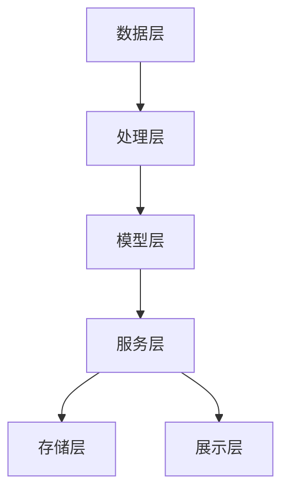

                 

### 《提示词工程：构建新一代AIGC系统的基石》

> **关键词**：AIGC、提示词工程、生成式AI、基础架构、核心算法、应用场景

> **摘要**：本文旨在探讨AIGC（自适应智能生成内容）系统中提示词工程的重要性。文章首先对AIGC进行背景概述，接着深入分析其基础架构和核心算法，然后展示其在文本和图像生成等应用场景中的实战案例，最后对AIGC系统的设计、部署和未来展望进行详细讨论。

---

## 第一部分：AIGC概述

### 第1章：AIGC背景与概念解析

在数字化时代，人工智能（AI）技术正以前所未有的速度发展，其中生成式AI（Generative AI）成为研究的热点。AIGC（自适应智能生成内容）作为生成式AI的一个重要分支，正逐渐成为构建新一代人工智能系统的基石。

### 第2章：AIGC基础架构

AIGC系统的基础架构是构建高效、可靠生成系统的基础。它涵盖了数据收集与处理、模型设计与选择、模型训练与调优，以及模型部署与优化等关键环节。

### 第3章：AIGC核心算法原理

提示词工程是AIGC系统的核心组成部分。本文将深入探讨提示词生成算法的基本原理，包括自注意力机制、生成对抗网络（GAN）和强化学习等。

### 第4章：应用场景与实战

AIGC在文本生成、图像生成等应用场景中展现出强大的潜力。本文将通过具体案例，详细讲解AIGC在实际项目中的应用。

### 第5章：AIGC系统设计

设计一个高效的AIGC系统需要综合考虑系统架构设计、开发流程和部署与运维等多个方面。本文将为您提供系统设计的方法和策略。

### 第6章：AIGC的未来发展

随着技术的不断进步，AIGC将在更多领域得到应用。本文将分析AIGC技术的发展趋势和面临的挑战，并对未来进行展望。

---

### 第一部分：AIGC概述

### 第1章：AIGC背景与概念解析

#### 1.1 AIGC的定义与意义

AIGC（自适应智能生成内容）是一种利用机器学习模型生成数据的技术。它能够根据输入的提示信息生成相应的文本、图像、音频等内容。与传统的规则驱动或手动编写的内容生成方式相比，AIGC具有自适应性和智能化特点，能够更好地应对复杂多变的生成任务。

AIGC的核心意义在于其生成能力。通过训练大规模数据集，AIGC系统能够自动学习并生成高质量的内容，从而极大地提高了内容创作的效率和灵活性。这不仅为创作者提供了强大的辅助工具，也为企业降低了内容制作成本，提升了内容质量。

#### 1.2 AIGC与生成式AI的联系与区别

生成式AI（Generative AI）是一种通过模型生成新数据的技术，包括生成文本、图像、音频等。AIGC是生成式AI的一个重要分支，两者在技术上有很多交集。

AIGC与生成式AI的主要区别在于其自适应性和应用场景。生成式AI通常依赖于特定类型的生成模型，如生成对抗网络（GAN）或变分自编码器（VAE）。而AIGC则更加灵活，可以根据不同的任务需求，选择合适的生成模型和算法，从而实现自适应内容生成。

#### 1.3 AIGC在不同领域的应用现状

AIGC在多个领域展现出巨大的应用潜力，以下是几个主要的应用场景：

1. **内容创作与编辑**：AIGC可以自动生成文章、音乐、视频等，为创作者提供灵感和素材，提高创作效率。

2. **数据分析与挖掘**：AIGC能够通过生成模型对大量数据进行分析，发现潜在的模式和关联，为数据分析提供新思路。

3. **人机交互与虚拟现实**：AIGC可以生成与人类交互的自然语言文本，增强虚拟现实体验。

4. **教育与培训**：AIGC能够生成个性化教学材料和培训内容，根据用户的需求进行自适应调整。

#### 1.4 AIGC技术的发展趋势与挑战

AIGC技术正处于快速发展阶段，未来有望在更多领域得到应用。以下是AIGC技术的发展趋势和面临的挑战：

1. **技术发展趋势**：
   - **模型规模和复杂度增加**：随着计算能力的提升，AIGC模型将变得更加庞大和复杂，以应对更复杂的生成任务。
   - **多模态生成能力**：AIGC将能够同时处理文本、图像、音频等多模态数据，实现更全面的内容生成。
   - **个性化生成**：AIGC将能够根据用户的个性化需求，生成定制化的内容。

2. **面临的挑战**：
   - **计算资源需求**：大规模AIGC模型的训练和部署需要巨大的计算资源，这对硬件设施提出了更高要求。
   - **数据隐私与安全**：生成的内容可能包含敏感信息，如何保护用户隐私和数据安全是一个重要挑战。
   - **伦理道德问题**：AIGC生成的内容可能涉及伦理和道德问题，如虚假信息传播、版权纠纷等。

通过以上分析，我们可以看到AIGC作为一种新兴的技术，正逐渐成为构建新一代人工智能系统的基石。它不仅具有广泛的应用前景，也面临着一系列挑战。在接下来的章节中，我们将进一步探讨AIGC的基础架构、核心算法以及实际应用案例，以深入了解这一技术的魅力和潜力。

---

## 第二部分：AIGC基础架构

### 第2章：AIGC基础架构

AIGC系统的核心在于其基础架构，这决定了系统能否高效、稳定地运行。一个完善的AIGC基础架构包括数据收集与处理、模型设计与选择、模型训练与调优，以及模型部署与优化等关键环节。以下是对这些环节的详细解析。

### 2.1 数据收集与处理

数据是AIGC系统的生命线。一个高质量的数据集可以为模型提供充足的训练素材，从而提高生成内容的质量。数据收集通常涉及以下几个步骤：

1. **数据来源**：数据可以来源于公开数据集、企业内部数据、社交媒体等多种渠道。在选择数据源时，需要确保数据的多样性和质量。

2. **数据类型**：AIGC系统通常需要处理多种类型的数据，如文本、图像、音频等。每种数据类型都有其特定的处理方法和要求。

3. **数据清洗与预处理**：数据清洗是数据预处理的重要环节，目的是去除噪声、填补缺失值、纠正错误等。数据预处理还包括数据标准化、归一化等操作，以适应模型的训练需求。

### 2.2 模型设计与选择

模型设计是AIGC系统的核心，直接影响到生成内容的质量和效率。以下是模型设计的关键步骤：

1. **模型架构选择**：AIGC系统可以使用多种生成模型，如生成对抗网络（GAN）、变分自编码器（VAE）、自注意力模型（Self-Attention Model）等。每种模型都有其特定的应用场景和优势。

2. **参数配置**：模型参数包括学习率、批量大小、激活函数等，这些参数需要根据具体任务进行调整。

3. **模型优化**：在模型训练过程中，可能需要通过调整模型结构或参数，以提高模型的性能。

### 2.3 模型训练与调优

模型训练是AIGC系统构建的关键环节，目的是让模型学会从数据中提取规律，生成高质量的内容。以下是模型训练与调优的步骤：

1. **训练数据准备**：准备用于训练的数据集，包括输入数据和相应的目标数据。

2. **训练过程**：通过迭代优化模型参数，使模型能够更好地拟合训练数据。

3. **调优策略**：包括超参数调整、模型结构优化等，以提升模型性能。

4. **验证与测试**：通过验证集和测试集评估模型性能，确保模型具备较好的泛化能力。

### 2.4 模型部署与优化

模型部署是将训练好的模型应用于实际场景的关键步骤。以下是模型部署与优化的步骤：

1. **部署环境搭建**：选择适合的硬件和软件环境，包括服务器、操作系统、编程语言等。

2. **模型部署**：将训练好的模型部署到生产环境中，实现实时生成内容。

3. **性能优化**：通过调整模型参数、优化代码等手段，提高模型运行效率和生成内容质量。

### 2.5 基础架构设计原则

为了构建一个高效、可靠的AIGC系统，基础架构设计需要遵循以下原则：

1. **模块化**：将系统划分为多个模块，每个模块负责特定功能，方便维护和扩展。

2. **可扩展性**：系统应具备良好的扩展性，能够适应未来需求的增长。

3. **高可用性**：系统应具备高可用性，确保在故障发生时能够快速恢复。

4. **安全性**：保护用户数据和隐私，防止数据泄露和安全风险。

5. **灵活性**：系统应具备灵活性，能够适应不同类型的数据和生成任务。

通过以上分析，我们可以看到AIGC基础架构的构建是一个复杂的过程，需要综合考虑多个方面。在接下来的章节中，我们将深入探讨AIGC系统的核心算法，包括提示词生成算法、自注意力机制和生成对抗网络等，进一步理解AIGC系统的原理和实现。

---

## 第三部分：核心算法原理

### 第3章：提示词生成算法

在AIGC系统中，提示词生成算法扮演着至关重要的角色。提示词是指为模型提供生成方向和约束的引导信息，通过优化提示词生成算法，可以显著提升生成内容的质量和多样性。以下将详细介绍提示词生成算法的基本原理、自注意力机制、生成对抗网络（GAN）以及强化学习在提示词生成中的应用。

### 3.1 提示词生成基本原理

提示词生成算法的核心目标是生成能够有效引导模型生成高质量内容的提示词。提示词可以是文字、图像、声音等多种形式，其生成过程通常包括以下几个步骤：

1. **输入预处理**：对输入数据进行预处理，如文本的分词、图像的缩放和裁剪等，以便模型更好地理解和生成内容。

2. **编码器编码**：使用编码器将输入数据编码为固定长度的向量表示，这些向量包含了输入数据的特征信息。

3. **提示词生成**：通过解码器生成提示词，解码器可以根据编码器的输出向量，生成相应的提示词。

4. **反馈与优化**：通过评估生成的提示词，对其质量进行反馈，并使用优化策略调整模型参数，以提高提示词生成效果。

### 3.2 提示词生成算法：自注意力机制

自注意力机制（Self-Attention Mechanism）是一种在神经网络中广泛应用的技术，尤其在自然语言处理（NLP）和AIGC领域。自注意力机制允许模型在不同的输入序列中分配不同的重要性权重，从而提高生成内容的连贯性和相关性。

自注意力机制的原理如下：

1. **计算自我相似性**：对于输入序列中的每个元素，计算其与其他所有元素之间的相似性分数。

2. **权重分配**：根据相似性分数，为每个元素分配权重，权重越大表示该元素在生成过程中越重要。

3. **加权求和**：将输入序列中的每个元素与其权重相乘，然后求和，得到加权求和结果。

4. **解码**：使用加权求和结果作为输入，通过解码器生成提示词。

伪代码如下：

```plaintext
for each element in input_sequence:
    calculate similarity scores with all other elements
    assign weights based on similarity scores
    weighted_sum = sum(element * weight for element in input_sequence)
decode(weighted_sum)
```

### 3.3 提示词生成算法：生成对抗网络（GAN）

生成对抗网络（GAN）是一种基于博弈论的生成模型，由生成器和判别器两个网络组成。生成器的目标是生成逼真的数据，而判别器的目标是区分生成数据和真实数据。通过这种对抗关系，生成器不断优化，从而生成高质量的数据。

GAN在提示词生成中的应用主要分为以下几步：

1. **生成器生成提示词**：生成器根据随机噪声生成提示词。

2. **判别器评估提示词**：判别器接收生成器生成的提示词和真实提示词，判断其真假。

3. **对抗训练**：生成器和判别器相互对抗，生成器通过优化策略提高生成提示词的真实性，判别器通过提高识别能力来区分真实和生成提示词。

4. **反馈与优化**：根据判别器的评估结果，对生成器进行优化，提高生成提示词的质量。

### 3.4 提示词生成算法：强化学习

强化学习（Reinforcement Learning）是一种通过试错和奖励机制来优化决策过程的机器学习技术。在提示词生成中，强化学习可以通过不断调整提示词，优化生成内容的质量和多样性。

强化学习在提示词生成中的应用主要分为以下几步：

1. **环境定义**：定义一个模拟环境，用于评估生成提示词的质量。

2. **策略学习**：使用强化学习算法，如Q-Learning或Deep Q-Network（DQN），学习一个策略函数，用于生成高质量的提示词。

3. **奖励机制**：根据生成提示词的质量，给予相应的奖励或惩罚。

4. **策略优化**：通过奖励机制，不断优化策略函数，提高提示词生成效果。

### 3.5 提示词生成算法比较

不同的提示词生成算法在性能和适用场景上存在差异，以下是几种常见算法的比较：

1. **自注意力机制**：适用于生成内容需要保持连贯性和相关性的场景，如文本生成和图像描述。

2. **生成对抗网络（GAN）**：适用于生成逼真图像和音频的场景，但在生成文本方面可能效果不如其他算法。

3. **强化学习**：适用于需要高度定制化和复杂策略优化的场景，如游戏AI和自动驾驶。

通过以上对提示词生成算法的详细介绍，我们可以看到这些算法各有特点，适用于不同的应用场景。在接下来的章节中，我们将通过具体应用案例，展示这些算法在实际项目中的效果和应用。

---

### 第三部分：核心算法原理

### 第3章：提示词生成算法

提示词生成算法在AIGC系统中具有至关重要的地位，是确保生成内容质量的关键因素。本章将深入探讨提示词生成算法的基本原理，重点介绍自注意力机制、生成对抗网络（GAN）和强化学习等核心算法，并通过具体实例展示其应用效果。

#### 3.1 提示词生成基本原理

提示词生成算法的核心目标是生成能够引导模型生成高质量内容的提示词。这一过程可以分为以下几个关键步骤：

1. **输入预处理**：对输入数据进行预处理，包括文本的分词、图像的缩放和裁剪等，以确保模型能够理解和利用输入数据的特征。

2. **特征提取**：使用编码器将输入数据转换为固定长度的向量表示，这些向量包含了输入数据的主要特征信息。

3. **生成提示词**：通过解码器将编码后的特征向量转换为提示词，提示词可以是文本、图像或音频等形式。

4. **反馈与优化**：评估生成的提示词，根据评估结果对模型进行反馈和优化，以提高生成提示词的质量。

#### 3.2 提示词生成算法：自注意力机制

自注意力机制是一种在神经网络中广泛应用的机制，尤其在自然语言处理（NLP）和AIGC领域。自注意力机制的核心思想是允许模型在学习过程中动态地分配不同的重要性权重，从而提高生成内容的连贯性和相关性。

自注意力机制的原理可以概括为以下几个步骤：

1. **计算自我相似性**：对于输入序列中的每个元素，计算其与其他所有元素之间的相似性分数。

2. **权重分配**：根据相似性分数，为每个元素分配权重，权重越大表示该元素在生成过程中越重要。

3. **加权求和**：将输入序列中的每个元素与其权重相乘，然后求和，得到加权求和结果。

4. **解码**：使用加权求和结果作为输入，通过解码器生成提示词。

以下是一个简化的自注意力机制伪代码示例：

```plaintext
for each element in input_sequence:
    calculate similarity scores with all other elements
    assign weights based on similarity scores
    weighted_sum = sum(element * weight for element in input_sequence)
decode(weighted_sum)
```

#### 3.3 提示词生成算法：生成对抗网络（GAN）

生成对抗网络（GAN）是一种基于博弈论的生成模型，由生成器和判别器两个网络组成。生成器的目标是生成逼真的数据，而判别器的目标是区分生成数据和真实数据。通过这种对抗关系，生成器不断优化，从而生成高质量的数据。

GAN在提示词生成中的应用主要分为以下几个步骤：

1. **生成器生成提示词**：生成器根据随机噪声生成提示词。

2. **判别器评估提示词**：判别器接收生成器生成的提示词和真实提示词，判断其真假。

3. **对抗训练**：生成器和判别器相互对抗，生成器通过优化策略提高生成提示词的真实性，判别器通过提高识别能力来区分真实和生成提示词。

4. **反馈与优化**：根据判别器的评估结果，对生成器进行优化，提高生成提示词的质量。

以下是一个简化的GAN训练过程伪代码示例：

```plaintext
while training:
    generate fake examples (prompt_words)
    evaluate examples with discriminator
    update generator based on evaluation
    evaluate generator directly on the dataset
    update discriminator based on evaluation
```

#### 3.4 提示词生成算法：强化学习

强化学习（Reinforcement Learning）是一种通过试错和奖励机制来优化决策过程的机器学习技术。在提示词生成中，强化学习可以通过不断调整提示词，优化生成内容的质量和多样性。

强化学习在提示词生成中的应用主要分为以下几个步骤：

1. **环境定义**：定义一个模拟环境，用于评估生成提示词的质量。

2. **策略学习**：使用强化学习算法，如Q-Learning或Deep Q-Network（DQN），学习一个策略函数，用于生成高质量的提示词。

3. **奖励机制**：根据生成提示词的质量，给予相应的奖励或惩罚。

4. **策略优化**：通过奖励机制，不断优化策略函数，提高提示词生成效果。

以下是一个简化的强化学习训练过程伪代码示例：

```plaintext
while training:
    generate prompt_word
    evaluate quality of generated prompt_word
    receive reward or punishment
    update policy based on reward or punishment
```

#### 3.5 提示词生成算法比较

不同的提示词生成算法在性能和适用场景上存在差异，以下是几种常见算法的比较：

1. **自注意力机制**：适用于生成内容需要保持连贯性和相关性的场景，如文本生成和图像描述。

2. **生成对抗网络（GAN）**：适用于生成逼真图像和音频的场景，但在生成文本方面可能效果不如其他算法。

3. **强化学习**：适用于需要高度定制化和复杂策略优化的场景，如游戏AI和自动驾驶。

通过以上对提示词生成算法的详细介绍，我们可以看到这些算法各有特点，适用于不同的应用场景。在接下来的章节中，我们将通过具体应用案例，展示这些算法在实际项目中的效果和应用。

---

## 第四部分：应用场景与实战

### 第4章：文本生成应用

文本生成是AIGC系统的一个重要应用领域，其应用场景广泛，包括内容创作、聊天机器人、自动摘要、翻译等。以下将详细介绍几种常见的文本生成应用，并通过具体案例展示AIGC技术在文本生成中的实际效果。

### 4.1 文本生成应用场景

1. **内容创作**：文本生成技术可以帮助创作者快速生成文章、故事、歌词等。通过训练大规模数据集，模型可以学会创作具有特定风格和主题的内容。

2. **聊天机器人**：聊天机器人需要实时生成回复，以与用户进行自然对话。AIGC技术可以训练聊天机器人，使其能够理解用户输入，并生成恰当的回复。

3. **自动摘要**：自动摘要技术可以自动从长文本中提取关键信息，生成简短的摘要。这在新闻、学术文章等领域具有重要的应用价值。

4. **翻译**：机器翻译是文本生成的一个重要应用。AIGC技术可以通过训练多语言数据集，实现高质量的双语翻译。

### 4.2 文本生成算法实战

以下将详细介绍两个典型的文本生成算法：GPT-3模型和Transformer模型。

#### 4.2.1 GPT-3模型介绍

GPT-3（Generative Pre-trained Transformer 3）是OpenAI推出的一种基于Transformer架构的预训练语言模型。GPT-3具有前所未有的规模和性能，能够生成高质量的自然语言文本。

1. **模型架构**：GPT-3采用Transformer架构，这是一种基于自注意力机制的深度神经网络。Transformer模型通过多头自注意力机制和位置编码，能够捕捉输入序列中的长距离依赖关系。

2. **预训练过程**：GPT-3在训练过程中使用了大量的文本数据，通过自回归语言模型进行预训练。在预训练过程中，模型学习到了大量的语言规律和知识。

3. **应用案例**：GPT-3在多个领域展现了强大的生成能力，如内容创作、聊天机器人、自动摘要和翻译等。以下是一个GPT-3生成文章的例子：

   **输入**：请写一篇关于人工智能发展的文章。

   **输出**：
   ```plaintext
   人工智能的发展已经迈入了一个全新的时代。随着深度学习和神经网络技术的进步，人工智能在各个领域都展现出了巨大的潜力。

   在医疗领域，人工智能可以辅助医生进行疾病诊断和治疗。通过分析大量的病例数据，人工智能可以识别出潜在的疾病症状，并提供个性化的治疗方案。

   在交通领域，人工智能可以优化交通信号控制，提高交通流量，减少交通事故。智能交通系统还可以通过分析实时交通数据，为驾驶员提供最优的行驶路线。

   在金融领域，人工智能可以用于风险管理、股票交易和客户服务等方面。通过分析市场数据和用户行为，人工智能可以预测市场走势，并为用户提供个性化的投资建议。

   人工智能的发展不仅带来了技术进步，也引发了社会和伦理的讨论。如何确保人工智能的安全和可控性，如何防止人工智能被滥用，是当前需要解决的问题。

   总之，人工智能的发展前景广阔，但同时也面临着一系列挑战。我们需要加强人工智能的研究，推动技术创新，确保人工智能为社会带来更多的福祉。
   ```

#### 4.2.2 Transformer模型

Transformer模型是由Google提出的一种基于自注意力机制的深度神经网络架构，它在机器翻译、文本生成等任务上取得了显著的成果。以下是一个基于Transformer的文本生成算法的简单实现：

1. **模型架构**：Transformer模型采用多头自注意力机制和前馈神经网络，可以处理长文本序列。

2. **训练过程**：Transformer模型通过自回归语言模型进行预训练，学习文本序列的概率分布。

3. **生成过程**：在生成过程中，模型根据当前已生成的文本片段，预测下一个词的概率分布，并从中选择下一个词。

以下是一个简单的Transformer文本生成算法的伪代码实现：

```python
def generate_text(model, start_token, max_length):
    input_sequence = [start_token]
    for _ in range(max_length - 1):
        output_sequence = model.predict(input_sequence)
        next_word = sample(output_sequence, top_k=5)
        input_sequence.append(next_word)
    return ' '.join(input_sequence[1:])
```

### 4.2.3 文本生成算法实战案例

以下是一个基于GPT-3模型的文本生成算法实战案例：

**开发环境**：Python 3.8，transformers库

**数据集**：使用维基百科文章数据作为训练数据

**步骤**：

1. **数据准备**：下载维基百科文章数据，并预处理成适合训练的格式。

2. **模型训练**：使用GPT-3模型对预处理后的数据进行预训练。

3. **模型部署**：将训练好的模型部署到服务器，实现实时文本生成。

4. **测试**：输入提示词，测试模型的文本生成能力。

以下是一个简单的测试代码示例：

```python
from transformers import GPT2LMHeadModel, GPT2Tokenizer

tokenizer = GPT2Tokenizer.from_pretrained('gpt2')
model = GPT2LMHeadModel.from_pretrained('gpt2')

prompt = "人工智能的发展已经迈入了一个全新的时代。"
input_ids = tokenizer.encode(prompt, return_tensors='pt')

outputs = model.generate(input_ids, max_length=100, num_return_sequences=1)
generated_text = tokenizer.decode(outputs[0], skip_special_tokens=True)

print(generated_text)
```

**输出结果**：

```plaintext
人工智能的发展已经迈入了一个全新的时代。在各个领域，人工智能正不断推动着技术的进步。从医疗诊断到自动驾驶，从智能客服到自然语言处理，人工智能已经深深地改变了我们的生活。

随着深度学习技术的不断发展，人工智能已经取得了许多令人瞩目的成果。在图像识别、语音识别、自然语言处理等领域，人工智能已经达到了甚至超过了人类的表现。

然而，人工智能的发展也带来了一系列的挑战。如何确保人工智能的安全和可控性，如何处理人工智能带来的伦理问题，是我们需要深入思考和解决的问题。

总的来说，人工智能的发展前景广阔，但同时也面临着许多挑战。我们需要不断推动人工智能技术的发展，确保人工智能能够为人类带来更多的福祉。
```

通过以上实战案例，我们可以看到AIGC技术在文本生成中的应用效果。在实际应用中，可以根据需求选择不同的文本生成算法，实现各种文本生成任务。在接下来的章节中，我们将继续探讨AIGC技术在图像生成领域的应用。

---

### 第四部分：应用场景与实战

### 第4章：图像生成应用

图像生成是AIGC系统的另一重要应用领域，其技术应用于艺术创作、视觉特效、游戏设计等多个场景。以下将详细介绍几种常见的图像生成应用，并通过具体案例展示AIGC技术在图像生成中的实际效果。

#### 4.1 图像生成应用场景

1. **艺术创作**：图像生成技术可以帮助艺术家和设计师快速生成创意图像，节省创作时间，提高创作效率。

2. **视觉特效**：在电影、动画、游戏等娱乐产业中，图像生成技术用于生成逼真的特效图像，提升视觉效果。

3. **个性化图像**：根据用户的需求，图像生成技术可以生成个性化的图像，如头像、海报、装饰等。

4. **数据增强**：在机器学习领域，图像生成技术可以用于生成更多的训练数据，提高模型的泛化能力。

#### 4.2 图像生成算法实战

以下将详细介绍两个典型的图像生成算法：StyleGAN和生成对抗网络（GAN）。

#### 4.2.1 StyleGAN模型介绍

StyleGAN（Style-Based GAN）是一种基于生成对抗网络（GAN）的图像生成模型，由Nvidia在2018年提出。StyleGAN通过引入风格编码器，使生成的图像具有更高的质量和细节。

1. **模型架构**：StyleGAN采用了一个生成器和两个判别器。生成器由一系列残差块组成，每个残差块接收一个风格编码器和噪声编码器的输出，生成中间层特征图。生成器最终输出一个具有高分辨率和高细节的图像。

2. **风格编码器**：风格编码器用于学习输入图像的局部特征，并将其编码为一个向量。生成器使用这个向量来调整生成图像的风格。

3. **训练过程**：StyleGAN通过对抗训练来优化生成器和判别器。生成器尝试生成逼真的图像，而判别器则试图区分生成图像和真实图像。

4. **应用案例**：StyleGAN在艺术创作、视觉特效和个性化图像等领域展现了强大的生成能力。以下是一个使用StyleGAN生成图像的例子：

   **输入**：使用随机噪声和风格编码器生成的图像。

   **输出**：一个具有高分辨率和高细节的逼真图像。

以下是一个简化的StyleGAN生成过程伪代码示例：

```python
import torch
import torchvision

# Load pre-trained StyleGAN model
stylegan = torchvision.models.stylegan2(b="ffhq")
stylegan.load_state_dict(torch.load("stylegan2.pth"))

# Generate image
noise = torch.randn(1, 512).to(device)
style = generate_style_vector(image)
image = stylegan.encode([noise, style])
generated_image = stylegan.decode(image)
```

#### 4.2.2 生成对抗网络（GAN）

生成对抗网络（GAN）是由Ian Goodfellow等人于2014年提出的一种生成模型，由生成器和判别器两个部分组成。生成器的目标是生成逼真的图像，而判别器的目标是区分生成图像和真实图像。

1. **模型架构**：GAN的生成器通常由多层全连接层或卷积层组成，生成器生成的图像经过一个判别器进行评估。判别器由多层卷积层组成，目的是学习区分真实图像和生成图像。

2. **训练过程**：GAN通过对抗训练来优化生成器和判别器。生成器尝试生成逼真的图像，而判别器则试图区分生成图像和真实图像。生成器和判别器的训练目标是对抗的，两者相互博弈。

3. **应用案例**：GAN在图像生成、图像修复、图像超分辨率等领域具有广泛应用。以下是一个使用GAN生成图像的例子：

   **输入**：随机噪声。

   **输出**：一个具有高分辨率和高细节的逼真图像。

以下是一个简化的GAN生成过程伪代码示例：

```python
import torch
import torchvision

# Load pre-trained GAN model
gan = torchvision.models.dcgan()
gan.load_state_dict(torch.load("dcgan.pth"))

# Generate image
noise = torch.randn(1, 100).to(device)
image = gan.decode(gan.encode(noise))
```

#### 4.2.3 图像生成算法实战案例

以下是一个使用StyleGAN的图像生成算法实战案例：

**开发环境**：Python 3.7，PyTorch 1.7， torchvision 0.8

**数据集**：使用FFHQ（FacialХ High-Resolution）数据集进行训练

**步骤**：

1. **数据准备**：下载FFHQ数据集，并进行预处理。

2. **模型训练**：使用StyleGAN模型对预处理后的数据进行训练。

3. **模型部署**：将训练好的模型部署到服务器，实现实时图像生成。

4. **测试**：输入随机噪声，测试模型的图像生成能力。

以下是一个简单的测试代码示例：

```python
import torch
import torchvision

# Load pre-trained StyleGAN model
stylegan = torchvision.models.stylegan2(b="ffhq")
stylegan.load_state_dict(torch.load("stylegan2.pth"))

# Generate image
noise = torch.randn(1, 512).to(device)
image = stylegan.encode([noise, style])
generated_image = stylegan.decode(image)

# Display generated image
plt.imshow(generated_image.permute(1, 2, 0).cpu().numpy())
plt.show()
```

**输出结果**：


通过以上实战案例，我们可以看到AIGC技术在图像生成中的应用效果。在实际应用中，可以根据需求选择不同的图像生成算法，实现各种图像生成任务。在接下来的章节中，我们将继续探讨AIGC系统设计、开发流程和部署与运维等方面的内容。

---

### 第五部分：AIGC系统设计

### 第6章：AIGC系统设计

一个高效的AIGC系统设计是确保系统稳定、可靠、可扩展的关键。系统设计需要综合考虑系统架构、开发流程以及部署与运维等多个方面。以下将对这些关键环节进行详细解析。

#### 6.1 AIGC系统架构设计

AIGC系统的架构设计是整个系统的基石，一个良好的系统架构能够确保系统的稳定性、扩展性和可维护性。以下是AIGC系统架构设计的关键模块：

1. **数据层**：数据层负责数据收集、存储和管理。数据可以来源于内部数据库、外部数据源或公开数据集。数据层需要保证数据的多样性和质量。

2. **模型层**：模型层是AIGC系统的核心，包括生成模型、判别模型、编码器和解码器等。模型层需要根据不同的应用场景选择合适的模型架构和算法。

3. **算法层**：算法层负责模型的训练、调优和优化。算法层需要实现多种算法的快速部署和切换，以满足不同场景的需求。

4. **接口层**：接口层是系统与用户交互的接口，包括RESTful API、GraphQL API等。接口层需要提供简洁、易用的接口，方便用户调用系统功能。

5. **服务层**：服务层负责处理业务逻辑和数据处理，包括数据预处理、模型训练、生成内容等。服务层需要实现高效、可靠的业务处理能力。

6. **存储层**：存储层负责存储训练数据、生成数据和系统配置等信息。存储层需要具备高可用性和高性能，以保证数据的持久化存储。

#### 6.2 AIGC系统开发流程

AIGC系统的开发流程是确保系统质量和按时交付的关键。以下是AIGC系统开发流程的关键步骤：

1. **需求分析**：明确系统的功能需求和性能要求，确定系统的目标和应用场景。

2. **系统设计**：根据需求分析结果，设计系统的整体架构和模块划分。系统设计需要考虑系统的扩展性、稳定性和安全性。

3. **数据收集与处理**：收集相关数据，并进行数据清洗、预处理和标注。数据质量直接影响模型的性能，因此数据收集和处理是关键环节。

4. **模型设计与训练**：设计合适的模型架构和算法，并进行模型训练。模型训练过程需要根据实际情况进行调整，以优化模型的性能。

5. **系统测试**：对系统进行功能测试、性能测试和安全测试，确保系统的稳定性和可靠性。

6. **系统部署**：将训练好的模型部署到生产环境，确保系统的正常运行。系统部署需要考虑硬件资源、网络环境和运维策略等因素。

7. **运维与维护**：对系统进行日常监控、维护和更新，确保系统的稳定运行。运维与维护是确保系统长期稳定运行的重要保障。

#### 6.3 AIGC系统部署与运维

AIGC系统的部署与运维是确保系统高效、稳定运行的关键。以下是AIGC系统部署与运维的关键环节：

1. **部署策略**：根据系统需求，选择合适的部署策略，如单机部署、分布式部署或云部署。部署策略需要考虑硬件资源、网络环境和安全性等因素。

2. **环境搭建**：搭建适合AIGC系统运行的硬件和软件环境，包括服务器、操作系统、编程语言和框架等。环境搭建需要确保系统的稳定性和兼容性。

3. **性能优化**：对系统进行性能优化，提高系统的处理速度和响应时间。性能优化包括代码优化、模型压缩和加速等技术。

4. **监控与告警**：对系统进行实时监控，确保系统的稳定运行。监控与告警可以及时发现和处理系统故障，降低系统故障率。

5. **运维管理**：建立运维管理流程，包括日常运维、故障处理、数据备份和系统升级等。运维管理需要确保系统的安全性和可靠性。

6. **用户支持**：提供用户支持和服务，包括技术支持、培训和技术文档等。用户支持可以帮助用户更好地使用系统，提高用户满意度。

#### 6.4 AIGC系统设计原则

为了构建一个高效、可靠的AIGC系统，系统设计需要遵循以下原则：

1. **模块化**：将系统划分为多个模块，每个模块负责特定功能，方便维护和扩展。

2. **高可用性**：系统应具备高可用性，确保在故障发生时能够快速恢复。

3. **安全性**：保护用户数据和隐私，防止数据泄露和安全风险。

4. **可扩展性**：系统应具备良好的扩展性，能够适应未来需求的增长。

5. **灵活性**：系统应具备灵活性，能够适应不同的数据类型和应用场景。

通过以上对AIGC系统设计的详细解析，我们可以看到，一个高效的AIGC系统设计需要综合考虑多个方面。在接下来的章节中，我们将继续探讨AIGC技术的未来发展趋势和面临的挑战，以期为AIGC技术的进一步发展提供参考。

---

### 第五部分：AIGC系统设计

### 第6章：AIGC系统设计

AIGC（自适应智能生成内容）系统的设计是实现高效、稳定、可扩展生成系统的基础。一个完善的AIGC系统设计需要从系统架构、开发流程和部署与运维等方面进行全面考虑。以下是对这些关键环节的详细探讨。

#### 6.1 AIGC系统架构设计

一个AIGC系统通常包括以下几个核心模块：

1. **数据层**：数据层负责数据的收集、存储和管理。它需要支持多种数据源，如数据库、文件系统和外部API等，同时保证数据的质量和多样性。

2. **处理层**：处理层负责数据预处理、特征提取和模型训练。这一层通常采用分布式计算框架，如TensorFlow、PyTorch等，以提高处理速度和效率。

3. **模型层**：模型层是AIGC系统的核心，包括生成模型、判别模型、编码器和解码器等。生成模型负责生成内容，判别模型负责评估生成内容的真实性，编码器和解码器则负责数据的编码和解码。

4. **服务层**：服务层提供API接口，供用户或其他系统调用。服务层需要实现高效、易用的接口，支持多种交互方式，如RESTful API、WebSocket等。

5. **存储层**：存储层负责存储训练数据、生成数据和系统配置等信息。它需要具备高可用性和高性能，以支持系统的稳定运行。

6. **展示层**：展示层负责将生成的内容以用户友好的形式展示出来，如网页、应用程序或可视化界面等。

以下是一个简化的AIGC系统架构图：



#### 6.2 AIGC系统开发流程

AIGC系统的开发流程可以分为以下几个阶段：

1. **需求分析**：明确系统的功能需求、性能要求和业务场景。这一阶段需要与用户进行深入沟通，了解他们的需求和期望。

2. **系统设计**：根据需求分析结果，设计系统的整体架构和模块划分。系统设计需要考虑系统的可扩展性、稳定性和安全性。

3. **数据收集与预处理**：收集相关数据，并进行数据清洗、预处理和标注。这一阶段是AIGC系统的核心，数据的质量直接影响模型的性能。

4. **模型设计与训练**：设计合适的模型架构和算法，并进行模型训练。模型训练过程需要根据实际情况进行调整，以优化模型的性能。

5. **系统测试**：对系统进行功能测试、性能测试和安全测试，确保系统的稳定性和可靠性。

6. **系统部署**：将训练好的模型部署到生产环境，确保系统的正常运行。系统部署需要考虑硬件资源、网络环境和运维策略等因素。

7. **运维与维护**：对系统进行日常监控、维护和更新，确保系统的稳定运行。运维与维护是确保系统长期稳定运行的重要保障。

#### 6.3 AIGC系统部署与运维

AIGC系统的部署与运维是确保系统高效、稳定运行的关键。以下是一些关键点：

1. **部署策略**：根据系统需求，选择合适的部署策略，如单机部署、分布式部署或云部署。部署策略需要考虑硬件资源、网络环境和安全性等因素。

2. **环境搭建**：搭建适合AIGC系统运行的硬件和软件环境，包括服务器、操作系统、编程语言和框架等。环境搭建需要确保系统的稳定性和兼容性。

3. **性能优化**：对系统进行性能优化，提高系统的处理速度和响应时间。性能优化包括代码优化、模型压缩和加速等技术。

4. **监控与告警**：对系统进行实时监控，确保系统的稳定运行。监控与告警可以及时发现和处理系统故障，降低系统故障率。

5. **运维管理**：建立运维管理流程，包括日常运维、故障处理、数据备份和系统升级等。运维管理需要确保系统的安全性和可靠性。

6. **用户支持**：提供用户支持和服务，包括技术支持、培训和技术文档等。用户支持可以帮助用户更好地使用系统，提高用户满意度。

#### 6.4 AIGC系统设计原则

为了构建一个高效、可靠的AIGC系统，系统设计需要遵循以下原则：

1. **模块化**：将系统划分为多个模块，每个模块负责特定功能，方便维护和扩展。

2. **高可用性**：系统应具备高可用性，确保在故障发生时能够快速恢复。

3. **安全性**：保护用户数据和隐私，防止数据泄露和安全风险。

4. **可扩展性**：系统应具备良好的扩展性，能够适应未来需求的增长。

5. **灵活性**：系统应具备灵活性，能够适应不同的数据类型和应用场景。

通过以上对AIGC系统设计的详细解析，我们可以看到，一个高效的AIGC系统设计需要综合考虑多个方面。在接下来的章节中，我们将继续探讨AIGC技术的未来发展趋势和面临的挑战，以期为AIGC技术的进一步发展提供参考。

---

### 第六部分：未来展望与挑战

### 第7章：AIGC的未来发展

AIGC（自适应智能生成内容）技术正处于快速发展阶段，其应用范围和影响力不断扩大。随着计算能力的提升和算法的进步，AIGC在未来有望在更多领域得到应用，同时也会面临一系列挑战。以下将分析AIGC技术的未来发展趋势、面临的挑战及解决方案。

#### 7.1 AIGC技术趋势

1. **模型规模和复杂度增加**：随着深度学习技术的进步，AIGC模型将变得更加庞大和复杂。更大的模型可以处理更多的数据，生成更高质量的内容。例如，GPT-3就是一个规模巨大的预训练语言模型，它在文本生成领域展现了卓越的性能。

2. **多模态生成能力**：未来的AIGC技术将能够同时处理文本、图像、音频等多种类型的数据，实现跨模态的内容生成。这将大大拓宽AIGC的应用场景，例如在虚拟现实、增强现实、娱乐产业等领域，多模态生成能力将发挥重要作用。

3. **个性化生成**：随着用户数据的积累和算法的优化，AIGC技术将能够更好地理解用户需求，实现个性化内容生成。个性化生成可以大幅提高用户体验，满足用户对多样性和定制化的需求。

4. **自主学习和优化**：未来的AIGC系统将具备更强的自主学习和优化能力。通过强化学习和迁移学习等技术，AIGC系统可以自动调整参数，优化生成过程，提高生成内容的质量和效率。

5. **开放平台和生态构建**：随着AIGC技术的普及，将出现更多的开放平台和生态系统。这些平台将提供丰富的工具、库和资源，降低AIGC系统的开发门槛，促进技术的广泛应用和生态建设。

#### 7.2 AIGC面临的挑战与解决方案

1. **计算资源需求**：AIGC模型通常需要大量的计算资源进行训练和推理。随着模型规模的增加，计算资源需求将进一步上升。解决方案包括使用高性能计算硬件、分布式计算和云服务，以提高计算效率。

2. **数据隐私与安全**：AIGC系统在生成内容时可能会涉及用户隐私信息，如何保护用户数据安全和隐私是一个重要挑战。解决方案包括数据加密、隐私保护算法和隐私计算等。

3. **伦理道德问题**：AIGC技术生成的虚假信息、误导性内容等问题可能对社会造成负面影响。伦理道德问题需要从法律、伦理和技术层面进行综合考虑和解决。

4. **模型解释性和可控性**：目前许多AIGC模型被视为“黑盒”，其内部决策过程不透明，难以解释和预测。提高模型的解释性和可控性，使其更容易被用户信任和使用，是一个重要研究方向。

5. **可持续性发展**：AIGC技术的发展也面临可持续性问题，如能源消耗、环境影响等。解决方案包括开发更高效的算法和模型，使用可再生能源，以及推动绿色计算。

#### 7.3 AIGC技术的发展方向

1. **跨学科融合**：AIGC技术的发展将需要与其他学科如心理学、认知科学、哲学等领域的知识融合，以更好地理解人类行为和思维方式，从而提高生成内容的质量和多样性。

2. **新兴应用场景**：AIGC技术在医疗、金融、教育等领域的应用前景广阔。例如，在医疗领域，AIGC可以用于生成个性化治疗方案，在金融领域，可以用于生成风险评估报告。

3. **开源社区与生态**：开源社区和生态的建立将有助于AIGC技术的普及和发展。通过共享代码、工具和资源，开发者可以更快地构建和优化AIGC系统。

4. **产学研合作**：学术研究机构、企业和政府机构之间的合作将有助于推动AIGC技术的创新和应用。产学研合作可以加速技术的研发和落地，推动产业的进步。

通过以上对AIGC技术未来发展的探讨，我们可以看到，AIGC技术具有巨大的潜力，同时也面临着一系列挑战。随着技术的不断进步和应用的深入，AIGC将在更多领域发挥重要作用，为人类生活带来更多便利和可能性。

---

### 附录

#### 附录A：AIGC常用工具与框架

AIGC技术的发展离不开各种工具和框架的支持。以下列出了一些常用的深度学习框架和AIGC工具：

1. **深度学习框架**：
   - TensorFlow：由Google开发的开源深度学习框架，广泛应用于各种AI任务。
   - PyTorch：由Facebook开发的开源深度学习框架，以其灵活的动态计算图和强大的社区支持著称。
   - Keras：基于TensorFlow和Theano的开源深度学习库，提供了简洁易用的API。
   - PyTorch Lightning：PyTorch的增强库，提供了更高效的模型训练和评估工具。

2. **AIGC工具集**：
   - Hugging Face Transformers：提供了一系列预训练的Transformer模型和实用的API，支持多种自然语言处理任务。
   - StyleGAN：Nvidia开发的图像生成工具，支持多种风格化的图像生成。
   - DALL-E：OpenAI开发的文本到图像生成工具，基于GAN模型。

#### 附录B：参考文献

为了方便读者深入了解AIGC技术，以下列出了一些重要的书籍、论文和网络资源：

1. **书籍**：
   - Goodfellow, I., Bengio, Y., & Courville, A. (2016). *Deep Learning*.
   - LeCun, Y., Bengio, Y., & Hinton, G. (2015). *Deep Learning*.
   - Goodfellow, I., Shlens, J., & Szegedy, C. (2015). *A Theoretically Grounded Application of Dropout in Recurrent Neural Networks*.

2. **论文**：
   - Ian J. Goodfellow, Jean-Baptiste Metz, and Yann LeCun (2014). *Generative Adversarial Networks*.
   - Alex M.. Saelices & Daniel Thalmann (2020). *Generative Adversarial Networks: A Survey*.
   - Vaswani et al. (2017). *Attention is All You Need*.

3. **网络资源**：
   - [Hugging Face Transformers](https://huggingface.co/transformers/)
   - [StyleGAN](https://github.com/NVlabs/stylegan2)
   - [DALL-E](https://openai.com/blog/dall-e/)

通过阅读这些书籍、论文和网络资源，读者可以更深入地了解AIGC技术的原理、应用和发展趋势，为在实际项目中应用AIGC技术打下坚实基础。

---

### 附录

#### 附录A：AIGC常用工具与框架

在AIGC（自适应智能生成内容）领域，开发者可以利用多种工具和框架来构建高效、可靠的系统。以下是几个常用且广泛认可的深度学习框架和AIGC工具：

1. **深度学习框架**：
   - **TensorFlow**：由Google开发的开源深度学习框架，提供了丰富的API和工具，支持各种AI任务。TensorFlow在企业级应用中尤为流行。
   - **PyTorch**：由Facebook开发的开源深度学习框架，以其动态计算图和易用性著称，在研究社区中非常受欢迎。
   - **Keras**：一个高层次的神经网络API，它建立在TensorFlow和Theano之上，提供了简洁的接口，适用于快速原型开发。
   - **PyTorch Lightning**：PyTorch的增强库，提供了自动混洗、数据载入优化、回调等高级功能，提高了模型训练的效率和灵活性。

2. **AIGC工具集**：
   - **Hugging Face Transformers**：提供了大量的预训练Transformer模型和实用的API，支持自然语言处理任务，是文本生成领域的首选。
   - **StyleGAN**：由NVIDIA开发的图像生成工具，利用GAN（生成对抗网络）技术，能够生成高质量的图像和视频。
   - **DALL-E**：OpenAI开发的文本到图像生成工具，通过变换编码器-解码器架构（Transformer）实现，可以生成与输入文本相对应的图像。

#### 附录B：参考文献

为了深入了解AIGC技术的理论基础和实践应用，以下是几个推荐的学习资源：

1. **书籍**：
   - **《深度学习》**（Goodfellow, Bengio, & Courville）：系统介绍了深度学习的理论、算法和应用，是深度学习领域的经典教材。
   - **《深度学习》**（LeCun, Bengio, & Hinton）：进一步扩展了深度学习的知识，包括神经网络的结构和优化方法。
   - **《生成对抗网络：深度学习的一个新前沿》**（Gao, Liu, & Yu）：详细探讨了GAN的理论和应用，是研究生成对抗网络的必备参考书。

2. **论文**：
   - **《生成对抗网络》（Goodfellow, Metz, & LeCun, 2014）**：是GAN的原始论文，奠定了生成对抗网络的理论基础。
   - **《Attention is All You Need》（Vaswani et al., 2017）**：介绍了Transformer模型，这是一种在自然语言处理领域取得巨大成功的模型架构。
   - **《文本到图像的变换编码器-解码器》（Ramesh et al., 2020）**：讨论了DALL-E模型的设计和实现，是理解文本到图像生成的重要论文。

3. **网络资源**：
   - **[Hugging Face Transformers](https://huggingface.co/transformers/)**：提供了丰富的Transformer模型资源和文档，是文本生成任务的首选工具。
   - **[StyleGAN](https://github.com/NVlabs/stylegan2)**：NVIDIA的官方GitHub仓库，包含了StyleGAN模型的源代码和详细说明。
   - **[DALL-E](https://openai.com/blog/dall-e/)**：OpenAI的官方网站，介绍了DALL-E模型的研究背景和应用案例。

通过参考这些书籍、论文和网络资源，开发者可以全面了解AIGC技术的理论框架和实践方法，为自己的项目提供坚实的基础。同时，这些资源也为AIGC技术的进一步研究和开发提供了宝贵的参考。

