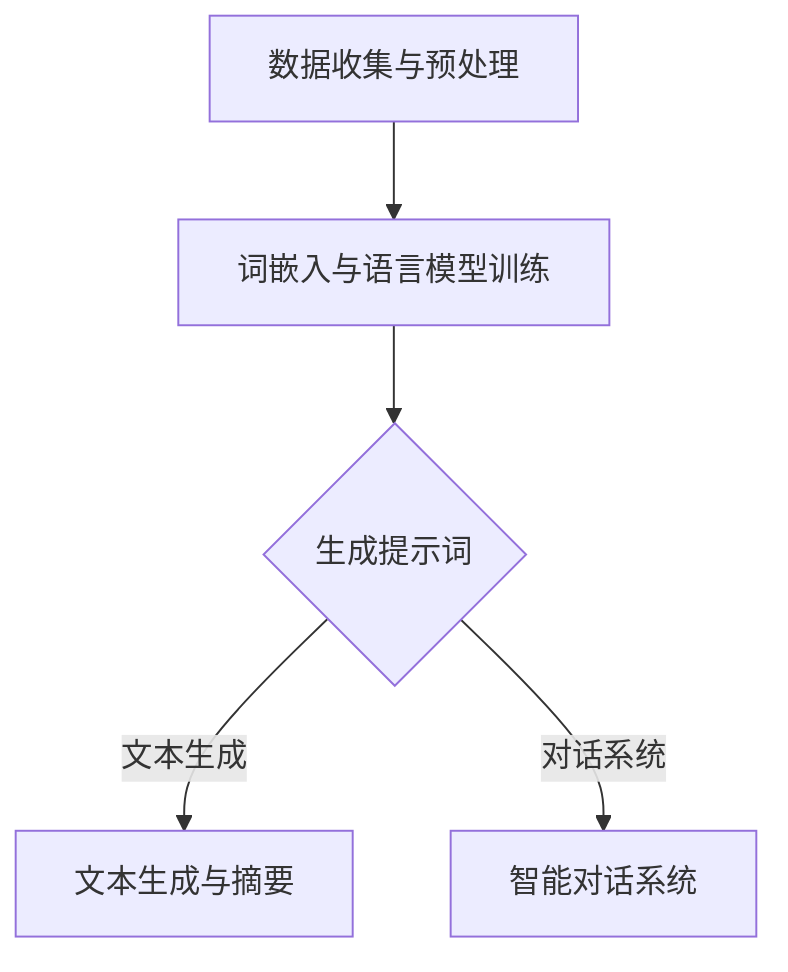

                 

### 提示词工程：让AI更智能

> **关键词：** 提示词工程、自然语言处理、AI智能、生成模型、多模态应用、安全隐私、未来趋势

> **摘要：** 本文章将深入探讨提示词工程在人工智能领域的重要性及其应用，包括基础概念、技术原理、应用案例、高级优化、安全性挑战和未来发展趋势。通过详细分析和实例讲解，我们将展示如何提升AI智能并推动其发展。

#### 第一部分: 提示词工程概述

##### 第1章: 提示词工程基础

**1.1 提示词工程的定义与重要性**

- **1.1.1 提示词的定义**
  - 提示词（Prompt）是在自然语言处理（NLP）中用于引导模型生成特定类型输出的输入文本。
  - 提示词通常包含关键字、主题或上下文信息，以指导模型的生成过程。

- **1.1.2 提示词工程的核心作用**
  - 提示词工程旨在设计和优化提示词，以提高自然语言处理任务的性能和效果。
  - 核心作用包括：改善生成文本的质量、提高模型的理解能力、增强任务的针对性。

- **1.1.3 提示词工程在AI应用中的地位**
  - 提示词工程是AI系统，特别是对话系统和文本生成系统的重要组成部分。
  - 它直接影响AI与用户交互的流畅性和实用性。

**1.2 提示词工程的基本概念**

- **1.2.1 自然语言处理基础**
  - 自然语言处理（NLP）是人工智能的重要分支，涉及文本分析、语言理解和生成。
  - NLP基础包括：文本预处理、词嵌入、语言模型和序列生成。

- **1.2.2 提示词生成与优化方法**
  - 提示词生成方法包括：基于模板生成、基于生成模型生成和基于序列模型生成。
  - 提示词优化方法包括：自动优化、用户反馈优化和在线自适应优化。

- **1.2.3 提示词的多样性设计**
  - 提示词的多样性设计是为了避免生成结果的单调重复，提高系统的交互体验。
  - 设计策略包括：使用不同词汇、语法结构和上下文信息。

##### 第2章: 提示词工程的技术原理

**2.1 自然语言处理技术概述**

- **2.1.1 词汇表与词嵌入**
  - 词汇表是自然语言处理的基础，用于将单词映射到数字表示。
  - 词嵌入（Word Embedding）是将单词映射到高维向量空间，以捕捉单词间的语义关系。

- **2.1.2 语言模型与序列生成**
  - 语言模型用于预测下一个单词或词组，是序列生成的基础。
  - 序列生成包括：文本生成、对话系统和摘要生成。

- **2.1.3 上下文理解与对话生成**
  - 上下文理解是NLP的关键，用于理解文本的语境和意图。
  - 对话生成涉及构建连贯、自然的对话流。

**2.2 提示词生成算法详解**

- **2.2.1 生成模型与判别模型**
  - 生成模型（如生成对抗网络GAN）用于生成新的文本样本。
  - 判别模型用于区分真实文本和生成文本。

- **2.2.2 提示词生成算法应用**
  - 应用包括：文本生成、摘要生成、对话系统和个性化推荐。

- **2.2.3 提示词优化策略**
  - 优化策略包括：损失函数优化、正则化和多任务学习。

##### 第3章: 提示词工程应用案例

**3.1 智能助手与对话系统**

- **3.1.1 对话系统架构**
  - 架构包括：前端界面、后端服务器、自然语言处理模块和数据库。

- **3.1.2 提示词在对话系统中的应用**
  - 提示词用于引导对话流程，提高用户交互体验。

- **3.1.3 对话系统案例解析**
  - 分析智能助手如Siri、Alexa和Google Assistant的提示词设计。

**3.2 文本生成与摘要**

- **3.2.1 文本生成基础**
  - 文本生成的基础包括：语言模型、序列生成和文本编辑。

- **3.2.2 摘要生成与优化**
  - 摘要生成涉及提取关键信息和组织结构。
  - 优化包括：摘要长度、摘要质量和生成速度。

- **3.2.3 文本生成案例解析**
  - 分析文本生成模型如GPT-3和BERT的应用案例。

#### 第二部分: 提示词工程高级应用

##### 第4章: 提示词工程与机器学习模型优化

**4.1 提示词对模型训练的影响**

- **4.1.1 提示词对数据分布的影响**
  - 提示词影响模型的训练数据分布，从而影响模型性能。

- **4.1.2 提示词对模型性能的影响**
  - 优化提示词可以提高模型的准确性和生成质量。

- **4.1.3 提示词的适应性调整**
  - 提示词需要根据任务和用户需求进行适应性调整。

**4.2 提示词工程在模型优化中的应用**

- **4.2.1 模型调整与优化方法**
  - 包括超参数调整、正则化和迁移学习。

- **4.2.2 实时优化策略**
  - 包括在线学习和自适应优化。

- **4.2.3 案例研究：提示词优化在具体任务中的应用**
  - 分析具体任务如问答系统和对话生成中的提示词优化案例。

##### 第5章: 提示词工程在多模态应用中的挑战与机遇

**5.1 多模态数据整合**

- **5.1.1 多模态数据类型**
  - 包括文本、图像、声音和视频。

- **5.1.2 多模态数据的特征提取**
  - 特征提取涉及多模态数据的转换和融合。

- **5.1.3 提示词在多模态数据整合中的应用**
  - 提示词用于引导多模态数据的处理和生成。

**5.2 提示词工程在多模态AI中的应用**

- **5.2.1 多模态对话系统的设计**
  - 设计涉及多模态数据的交互和处理。

- **5.2.2 多模态文本生成**
  - 多模态文本生成结合了文本和图像、声音等数据。

- **5.2.3 多模态AI案例研究**
  - 分析多模态AI应用如智能客服和虚拟现实中的提示词工程。

##### 第6章: 提示词工程的安全性与隐私保护

**6.1 提示词工程中的安全挑战**

- **6.1.1 提示词泄露的风险**
  - 提示词泄露可能导致敏感信息的泄露。

- **6.1.2 对抗性攻击与防御**
  - 对抗性攻击包括：对抗性示例生成和模型欺骗。

- **6.1.3 安全提示词设计原则**
  - 原则包括：避免敏感信息、限制输出范围和强化模型防御。

**6.2 隐私保护与提示词工程**

- **6.2.1 隐私保护机制**
  - 包括数据加密、匿名化和隐私预算。

- **6.2.2 提示词隐私设计**
  - 设计涉及隐私敏感度的评估和隐私保护策略。

- **6.2.3 隐私保护的案例研究**
  - 分析隐私保护在文本生成和对话系统中的应用。

##### 第7章: 提示词工程的未来趋势

**7.1 提示词工程的发展方向**

- **7.1.1 新型提示词生成算法**
  - 包括基于深度学习和强化学习的生成算法。

- **7.1.2 提示词工程在新兴领域中的应用**
  - 应用领域包括：自动驾驶、医疗诊断和智能教育。

- **7.1.3 提示词工程的未来挑战**
  - 挑战包括：模型可解释性、资源效率和跨学科融合。

**7.2 提示词工程与跨学科融合**

- **7.2.1 提示词工程与认知科学的结合**
  - 结合认知科学提高提示词的生成质量和交互体验。

- **7.2.2 提示词工程在人文社科领域中的应用**
  - 应用领域包括：文学创作、新闻报道和社交媒体分析。

- **7.2.3 提示词工程的跨学科研究趋势**
  - 趋势包括：多学科交叉研究和跨领域合作。

#### 第三部分: 提示词工程实践指南

##### 第8章: 提示词工程工具与资源

- **8.1 主流提示词工程工具介绍**
  - 包括：语言模型开发工具、对话系统开发框架和文本生成工具。

- **8.2 提示词工程资源与学习路径**
  - 包括：开源代码与数据集、在线课程与教程和提示词工程社区与会议。

##### 第9章: 提示词工程项目实战

- **9.1 项目实战概述**
  - 概述提示词工程项目的背景、目标和流程。

- **9.2 实战案例解析**
  - 分析智能对话系统、文本生成与摘要系统的开发案例。

##### 第10章: 提示词工程实战经验与反思

- **10.1 经验分享**
  - 分享提示词工程中的关键技巧和实践经验。

- **10.2 反思与展望**
  - 反思提示词工程在实践中的挑战与机遇，展望未来发展方向。

### 附录

#### 附录A: 提示词工程常见问题解答

- **A.1 提示词生成算法常见问题**
  - 回答关于提示词生成算法的选择、质量评估和效率优化的问题。

- **A.2 提示词工程应用常见问题**
  - 回答关于对话系统稳定性、文本生成系统创意和融合策略的问题。

---

## 提示词工程的Mermaid流程图

以下是一个简化的Mermaid流程图，展示了提示词工程的基本流程：



## 核心算法原理讲解

#### 2.1 提示词生成算法

**伪代码示例：**

```python
def generate_prompt(input_sentence):
    # 假设使用预训练的语言模型
    model = load_pretrained_language_model()
    
    # 输入句子编码
    encoded_sentence = model.encode(input_sentence)
    
    # 生成提示词
    prompt = model.generate(encoded_sentence, max_length=20, temperature=0.9)
    
    return prompt
```

#### 2.2 提示词优化算法

**伪代码示例：**

```python
def optimize_prompt(prompt, target_sentence):
    # 假设使用强化学习优化模型
    optimizer = load_reinforcement_learning_optimizer()
    
    # 初始化优化器参数
    optimizer.init_params(prompt)
    
    # 迭代优化提示词
    for _ in range(1000):
        # 优化提示词
        prompt = optimizer.optimize(prompt, target_sentence)
    
    return prompt
```

## 数学模型与数学公式

#### 2.3 语言模型概率计算

语言模型通常使用基于N-gram的概率模型，公式如下：

$$
P(w_n | w_{n-1}, ..., w_1) = \frac{P(w_n, w_{n-1}, ..., w_1)}{P(w_{n-1}, ..., w_1)}
$$

其中，$w_n, w_{n-1}, ..., w_1$ 分别代表输入句子的各个单词。

## 项目实战

#### 9.1 智能对话系统开发

**开发环境搭建：**
- 使用Python语言
- 开发框架：使用Rasa框架进行对话系统开发

**源代码实现：**

```python
from rasa.nlu import train
from rasa.nlu.model import Trainer

# 初始化Rasa框架
trainer = Trainer()

# 加载训练数据
data = {
    "intents": intents_data,
    "entities": entities_data
}

# 训练对话模型
trainer.train(data)

# 导出对话模型
trainer.persist("my_dialogue_model")
```

**代码解读与分析：**
- 使用Rasa框架进行对话系统开发时，需要首先定义意图和实体，然后进行模型训练和导出。

#### 9.2 文本生成与摘要系统开发

**开发环境搭建：**
- 使用Python语言
- 文本生成框架：使用GPT-2或GPT-3进行文本生成
- 摘要生成框架：使用Summarizer框架进行文本摘要

**源代码实现：**

```python
from transformers import pipeline

# 初始化文本生成模型
text_generator = pipeline("text-generation", model="gpt2")

# 初始化文本摘要模型
summarizer = pipeline("summarization")

# 文本生成
input_text = "请输入文本内容"
generated_text = text_generator(input_text, max_length=50, num_return_sequences=3)

# 文本摘要
summary = summarizer(input_text, max_length=150, min_length=50, do_sample=False)

print("生成的文本：", generated_text)
print("文本摘要：", summary)
```

**代码解读与分析：**
- 使用transformers库提供的文本生成和摘要模型进行文本生成和摘要操作。通过调用相应的API接口，可以快速实现文本生成和摘要功能。

---

### 作者信息

作者：AI天才研究院/AI Genius Institute & 禅与计算机程序设计艺术 /Zen And The Art of Computer Programming

---

[文章标题]: 提示词工程：让AI更智能

[关键词]: 提示词工程、自然语言处理、AI智能、生成模型、多模态应用、安全隐私、未来趋势

[摘要]: 本文章深入探讨了提示词工程在人工智能领域的重要性，包括基础概念、技术原理、应用案例和高级优化。通过实例和代码讲解，展示了如何提升AI智能并推动其发展。本文旨在为读者提供全面的技术指南和实战经验。 

### 文章标题

# 提示词工程：让AI更智能

### 文章关键词

- 提示词工程
- 自然语言处理
- AI智能
- 生成模型
- 多模态应用
- 安全隐私
- 未来趋势

### 文章摘要

本文详细探讨了提示词工程在人工智能领域的重要性，介绍了其基础概念、技术原理、应用案例和高级优化方法。通过实例和代码讲解，展示了如何提升AI智能并推动其发展。文章覆盖了从自然语言处理基础到多模态应用的全面技术指南，并探讨了安全隐私和未来趋势。旨在为读者提供全面的技术指南和实战经验。

### 第一部分：提示词工程概述

#### 第1章：提示词工程基础

**1.1 提示词工程的定义与重要性**

- **1.1.1 提示词的定义**
  - 提示词（Prompt）是指用于引导模型生成特定类型输出的输入文本。它通常包含关键字、主题或上下文信息，以指导模型的生成过程。
  - 提示词在自然语言处理（NLP）任务中扮演着至关重要的角色，例如文本生成、对话系统和摘要生成等。

- **1.1.2 提示词工程的核心作用**
  - 提示词工程旨在设计和优化提示词，以提高自然语言处理任务的性能和效果。
  - 核心作用包括：
    - **改善生成文本的质量**：通过设计高质量的提示词，可以生成更加自然、连贯和有创意的文本。
    - **提高模型的理解能力**：优化提示词可以帮助模型更好地理解输入文本的语义和意图，从而提高任务的准确性。
    - **增强任务的针对性**：提示词可以根据特定的任务需求进行定制，以提高任务的效果和效率。

- **1.1.3 提示词工程在AI应用中的地位**
  - 提示词工程是人工智能系统，特别是对话系统和文本生成系统的重要组成部分。
  - 在AI应用中，提示词工程的地位体现在：
    - **对话系统**：提示词用于引导对话流程，提高用户交互体验，使对话系统能够生成更加自然、连贯和有意义的回应。
    - **文本生成系统**：提示词用于引导文本生成模型，使其能够根据特定主题或上下文生成相关的文本内容。
    - **摘要生成系统**：提示词用于引导摘要生成模型，使其能够从大量文本中提取关键信息并生成简明扼要的摘要。

**1.2 提示词工程的基本概念**

- **1.2.1 自然语言处理基础**
  - 自然语言处理（NLP）是人工智能的重要分支，旨在使计算机能够理解和处理人类语言。
  - NLP基础概念包括：
    - **文本预处理**：包括去除停用词、标记化、词性标注等步骤，以准备文本数据供模型处理。
    - **词嵌入（Word Embedding）**：将单词映射到高维向量空间，以捕捉单词间的语义关系。
    - **语言模型（Language Model）**：用于预测下一个单词或词组，是文本生成和摘要生成的基础。
    - **序列生成（Sequence Generation）**：通过语言模型生成连贯、自然的文本序列。

- **1.2.2 提示词生成与优化方法**
  - 提示词生成方法包括：
    - **基于模板生成**：使用预定义的模板生成提示词，适用于任务明确、固定模式的场景。
    - **基于生成模型生成**：使用生成模型（如生成对抗网络GAN、变分自编码器VAE等）生成新的提示词，适用于生成多样化、创造性的文本。
    - **基于序列模型生成**：使用序列模型（如循环神经网络RNN、长短期记忆网络LSTM等）生成提示词，适用于生成连贯、自然的文本。

  - 提示词优化方法包括：
    - **自动优化**：通过优化算法（如梯度下降、随机梯度下降等）自动调整提示词参数，以提高生成质量。
    - **用户反馈优化**：根据用户对生成文本的评价进行优化，以改进用户的满意度。
    - **在线自适应优化**：实时调整提示词，以适应不同的输入数据和用户需求。

- **1.2.3 提示词的多样性设计**
  - 提示词的多样性设计是为了避免生成结果的单调重复，提高系统的交互体验。
  - 设计策略包括：
    - **使用不同的词汇**：通过替换同义词或使用不同的表达方式，增加提示词的多样性。
    - **调整语法结构**：通过改变句子的结构、时态和语态等，增加提示词的多样性。
    - **引入上下文信息**：通过提供更多的上下文信息，使提示词更加具体、丰富，从而增加生成结果的多样性。

#### 第2章：提示词工程的技术原理

**2.1 自然语言处理技术概述**

- **2.1.1 词汇表与词嵌入**
  - 词汇表是自然语言处理的基础，用于将单词映射到数字表示。
  - 在词汇表中，每个单词都有一个唯一的索引，用于在模型中表示单词。
  - 词嵌入（Word Embedding）是将单词映射到高维向量空间的技术，以捕捉单词间的语义关系。
  - 词嵌入可以采用静态嵌入（如Word2Vec）或动态嵌入（如BERT）。

- **2.1.2 语言模型与序列生成**
  - 语言模型（Language Model）用于预测下一个单词或词组，是文本生成和摘要生成的基础。
  - 语言模型通常采用基于统计的方法（如N-gram模型）或基于神经网络的方法（如循环神经网络RNN、长短期记忆网络LSTM等）。
  - 序列生成（Sequence Generation）是通过语言模型生成连贯、自然的文本序列的过程。
  - 序列生成可以采用自回归生成（如RNN、LSTM）或前向生成（如Transformer）。

- **2.1.3 上下文理解与对话生成**
  - 上下文理解（Contextual Understanding）是自然语言处理的关键，旨在使模型能够理解输入文本的语义和意图。
  - 上下文理解涉及到捕捉文本中的上下文信息，包括句子之间的关联、实体关系和语境。
  - 对话生成（Dialogue Generation）是通过理解上下文并生成相应的回应来构建连贯、自然的对话流程。
  - 对话生成通常涉及对话管理（Dialogue Management）和自然语言生成（Natural Language Generation）。

**2.2 提示词生成算法详解**

- **2.2.1 生成模型与判别模型**
  - 生成模型（Generative Model）用于生成新的文本样本，如生成对抗网络GAN、变分自编码器VAE等。
  - 判别模型（Discriminative Model）用于区分真实文本和生成文本，如循环神经网络RNN、长短期记忆网络LSTM等。
  - 在提示词生成中，生成模型和判别模型可以相互结合，通过对抗训练（Adversarial Training）提高生成质量。
  - 对抗训练的目标是使生成模型能够生成尽可能真实的文本，而判别模型能够准确地区分真实文本和生成文本。

- **2.2.2 提示词生成算法应用**
  - 提示词生成算法在多种自然语言处理任务中都有广泛应用，包括文本生成、摘要生成、对话系统和个性化推荐等。
  - 文本生成：通过生成模型生成新的文本内容，如故事、文章、对话等。
  - 摘要生成：通过提取关键信息并生成简明扼要的摘要，帮助用户快速了解文本内容。
  - 对话系统：通过生成模型和对话管理模块生成自然、连贯的对话回应。
  - 个性化推荐：通过生成模型和用户兴趣模型生成个性化的推荐内容。

- **2.2.3 提示词优化策略**
  - 提示词优化策略包括多种方法，以提高生成文本的质量和效果。
  - 损失函数优化：通过优化损失函数，使生成模型能够更好地学习数据分布和生成高质量的文本。
  - 正则化：通过添加正则化项，防止模型过拟合，提高泛化能力。
  - 多任务学习：通过同时训练多个任务，使模型能够更好地捕捉数据中的多样性和复杂性。

#### 第3章：提示词工程应用案例

**3.1 智能助手与对话系统**

- **3.1.1 对话系统架构**
  - 对话系统架构包括前端界面、后端服务器、自然语言处理模块和数据库等组成部分。
  - 前端界面负责接收用户输入和展示对话结果。
  - 后端服务器负责处理自然语言理解、对话生成和对话管理等功能。
  - 自然语言处理模块负责对用户输入进行分词、词性标注、实体识别等预处理，并利用语言模型生成对话回应。
  - 数据库用于存储对话历史和用户信息，以支持对话系统的持续学习和个性化推荐。

- **3.1.2 提示词在对话系统中的应用**
  - 提示词在对话系统中用于引导对话流程，提高用户交互体验。
  - 提示词可以用于：
    - **意图识别**：根据用户输入文本中的意图，生成相应的对话回应。
    - **实体提取**：从用户输入中提取关键实体，用于后续的对话生成和查询处理。
    - **上下文保持**：在多轮对话中保持上下文信息，使对话系统能够理解用户的意图和需求。

- **3.1.3 对话系统案例解析**
  - 以智能助手为例，分析对话系统的设计、实现和优化过程。
  - 案例解析包括：
    - **设计阶段**：确定对话系统的目标、功能和技术架构。
    - **实现阶段**：开发对话系统的前端界面、后端服务器和自然语言处理模块。
    - **优化阶段**：通过用户反馈和数据分析，不断优化对话系统的性能和用户体验。

**3.2 文本生成与摘要**

- **3.2.1 文本生成基础**
  - 文本生成是自然语言处理中的重要应用，通过生成模型生成新的文本内容。
  - 文本生成基础包括：
    - **语言模型**：用于预测下一个单词或词组，生成连贯、自然的文本序列。
    - **序列生成**：通过语言模型生成新的文本序列，可以采用自回归生成或前向生成等方法。
    - **数据准备**：收集和准备大量的文本数据，用于训练和评估生成模型。

- **3.2.2 摘要生成与优化**
  - 摘要生成是从大量文本中提取关键信息并生成简明扼要的摘要。
  - 摘要生成与优化包括：
    - **摘要生成算法**：如提取式摘要（Extractive Summarization）和生成式摘要（Generative Summarization），分别从原始文本中提取或生成摘要。
    - **摘要质量评估**：通过评估摘要的质量，如关键词覆盖、文本连贯性和信息完整性，以优化摘要生成效果。
    - **摘要长度控制**：通过调整摘要的长度，使摘要既能捕捉文本的主要信息，又不过于冗长。

- **3.2.3 文本生成案例解析**
  - 分析文本生成模型在多种应用场景中的实际应用，如自动写作、聊天机器人、虚拟助理等。
  - 案例解析包括：
    - **自动写作**：使用文本生成模型生成新闻报道、文章、博客等文本内容。
    - **聊天机器人**：使用文本生成模型生成聊天机器人的回复，提供自然、连贯的对话体验。
    - **虚拟助理**：使用文本生成模型生成虚拟助理的回答，帮助用户解决问题和提供信息。

### 第二部分：提示词工程高级应用

#### 第4章：提示词工程与机器学习模型优化

**4.1 提示词对模型训练的影响**

- **4.1.1 提示词对数据分布的影响**
  - 提示词在模型训练过程中对数据分布具有重要影响。
  - 提示词的选择和设计会直接影响模型的训练数据分布，进而影响模型的性能和泛化能力。
  - **数据分布的影响**包括：
    - **多样性**：高质量的提示词能够提供多样性的输入数据，有助于模型学习到更广泛的知识和模式。
    - **代表性**：提示词的选择需要考虑数据的代表性，以确保模型能够学习到真实世界的多样性和复杂性。

- **4.1.2 提示词对模型性能的影响**
  - 提示词的质量和设计对模型性能有直接的影响。
  - 高质量的提示词可以：
    - **提高模型的准确性**：使模型能够更好地理解输入文本的意图和内容，从而提高分类或预测的准确性。
    - **改善生成文本的质量**：通过优化提示词，可以生成更加自然、连贯和有创意的文本。

- **4.1.3 提示词的适应性调整**
  - 在模型训练过程中，提示词的适应性调整是提高模型性能的重要策略。
  - **适应性调整的方法**包括：
    - **在线学习**：通过实时调整提示词，使模型能够适应新的数据分布和用户需求。
    - **增量学习**：在已有模型的基础上，通过添加或更新提示词，使模型能够学习新的知识。
    - **迁移学习**：利用预训练的模型和提示词，在新任务上快速调整和优化模型性能。

**4.2 提示词工程在模型优化中的应用**

- **4.2.1 模型调整与优化方法**
  - 在模型优化过程中，提示词工程可以提供多种方法来调整和优化模型性能。
  - **模型调整的方法**包括：
    - **超参数调整**：通过调整模型的学习率、批量大小、正则化参数等超参数，优化模型的训练过程和性能。
    - **数据增强**：通过增加数据的多样性、丰富性和噪声，提高模型的泛化能力和鲁棒性。

  - **模型优化的方法**包括：
    - **强化学习**：通过优化策略，使模型能够在特定任务上取得更好的性能。
    - **对抗训练**：通过生成对抗网络（GAN）等对抗性训练方法，提高模型的生成质量和鲁棒性。
    - **多任务学习**：通过同时训练多个相关任务，使模型能够更好地捕捉数据中的复杂关系和模式。

- **4.2.2 实时优化策略**
  - 在实际应用中，实时优化策略对于提升模型性能和用户体验至关重要。
  - **实时优化策略**包括：
    - **在线优化**：通过实时调整模型和提示词，使模型能够适应动态变化的输入数据和用户需求。
    - **增量优化**：在已有模型的基础上，通过逐步优化提示词和模型参数，提高模型性能和适应性。
    - **分布式优化**：通过分布式计算和并行优化，加速模型的训练和优化过程。

- **4.2.3 案例研究：提示词优化在具体任务中的应用**
  - 通过具体任务案例分析，展示提示词优化在实际应用中的效果和挑战。
  - **案例研究**包括：
    - **问答系统**：通过优化提示词和模型参数，提高问答系统的回答质量和用户满意度。
    - **对话系统**：通过实时调整提示词和对话管理策略，改善对话系统的交互体验和用户满意度。
    - **文本生成**：通过优化提示词和生成模型，提高文本生成的连贯性、创造性和多样性。

#### 第5章：提示词工程在多模态应用中的挑战与机遇

**5.1 多模态数据整合**

- **5.1.1 多模态数据类型**
  - 多模态数据整合涉及多种类型的数据，包括文本、图像、声音、视频等。
  - **文本数据**：包括文本信息、标签、评论等，用于描述对象、事件或场景。
  - **图像数据**：包括静态图像和动态图像，用于视觉识别、物体检测和场景分析。
  - **声音数据**：包括语音信号、音乐、环境声音等，用于语音识别、情感分析和音乐分类。
  - **视频数据**：包括视频流和视频片段，用于视频识别、动作分析和视频摘要。

- **5.1.2 多模态数据的特征提取**
  - 多模态数据的特征提取是整合多模态数据的关键步骤。
  - **特征提取方法**包括：
    - **文本特征提取**：使用词嵌入、词性标注、情感分析等技术提取文本特征。
    - **图像特征提取**：使用卷积神经网络（CNN）提取图像特征，如边缘、纹理、形状等。
    - **声音特征提取**：使用音频处理技术提取声音特征，如音高、音色、节奏等。
    - **视频特征提取**：使用视频处理技术提取视频特征，如帧级特征、视频级特征等。

- **5.1.3 提示词在多模态数据整合中的应用**
  - 提示词在多模态数据整合中起到关键作用，用于引导模型的生成和优化过程。
  - **提示词的应用**包括：
    - **多模态文本生成**：通过提示词引导文本生成模型，结合文本、图像、声音等数据生成新的文本内容。
    - **多模态问答系统**：通过提示词引导问答系统，结合文本、图像、声音等多模态信息提供准确的答案。
    - **多模态情感分析**：通过提示词引导情感分析模型，结合文本、图像、声音等多模态信息进行情感识别和分类。

**5.2 提示词工程在多模态AI中的应用**

- **5.2.1 多模态对话系统的设计**
  - 多模态对话系统通过结合文本、图像、声音等多模态信息，提供更加丰富和自然的用户交互体验。
  - **设计要点**包括：
    - **多模态感知**：通过多模态传感器和数据处理技术，实现文本、图像、声音等多模态信息的感知和融合。
    - **对话管理**：通过自然语言处理技术，实现多模态对话的生成和管理，包括意图识别、实体提取和对话流程控制。
    - **上下文理解**：通过上下文信息整合，使对话系统能够理解用户的意图和需求，提供准确的回应。

- **5.2.2 多模态文本生成**
  - 多模态文本生成是将文本、图像、声音等多模态信息结合生成新的文本内容。
  - **生成方法**包括：
    - **基于模板的生成**：通过预定义的模板和提示词生成多模态文本，适用于任务明确和固定模式的场景。
    - **基于模型的生成**：使用生成模型（如变分自编码器VAE、生成对抗网络GAN等）生成多模态文本，适用于生成多样化、创造性的文本。
    - **基于序列模型的生成**：使用序列模型（如循环神经网络RNN、长短期记忆网络LSTM等）生成多模态文本，适用于生成连贯、自然的文本序列。

- **5.2.3 多模态AI案例研究**
  - 通过具体案例研究，分析多模态AI在现实应用中的效果和挑战。
  - **案例研究**包括：
    - **智能客服**：结合文本、图像、声音等多模态信息，提供个性化的客户服务和支持。
    - **自动驾驶**：结合图像、视频和语音等多模态信息，实现自动驾驶车辆的安全导航和决策。
    - **虚拟现实**：结合文本、图像、声音和视频等多模态信息，提供沉浸式和交互式的虚拟体验。

#### 第6章：提示词工程的安全性与隐私保护

**6.1 提示词工程中的安全挑战**

- **6.1.1 提示词泄露的风险**
  - 提示词泄露可能导致敏感信息的泄露，对用户隐私和数据安全构成威胁。
  - **泄露风险**包括：
    - **数据窃取**：攻击者可以通过获取提示词获取用户的个人信息和敏感数据。
    - **模型欺骗**：攻击者可以通过伪造或篡改提示词，欺骗模型生成恶意或有害的输出。

- **6.1.2 对抗性攻击与防御**
  - 对抗性攻击（Adversarial Attack）是指通过微小但关键的扰动，使模型输出发生错误的攻击方法。
  - **对抗性攻击**包括：
    - **对抗性示例生成**：通过生成对抗性示例，使模型在特定输入下产生错误的预测或输出。
    - **对抗性样本注入**：在训练数据中注入对抗性样本，以提高模型对对抗性攻击的鲁棒性。

- **6.1.3 安全提示词设计原则**
  - 安全提示词设计是确保模型安全性和隐私保护的重要环节。
  - **安全提示词设计原则**包括：
    - **去敏化**：通过去除或替换敏感信息，降低提示词泄露的风险。
    - **限制输出范围**：通过设计合理的输出范围和规则，防止模型生成过度的输出和敏感信息。
    - **模型防御**：通过集成防御机制，如对抗训练、数据清洗和模型解释等，提高模型的鲁棒性和安全性。

**6.2 隐私保护与提示词工程**

- **6.2.1 隐私保护机制**
  - 隐私保护机制是确保用户隐私和数据安全的关键措施。
  - **隐私保护机制**包括：
    - **数据加密**：通过加密算法对敏感数据进行加密，防止数据在传输和存储过程中被窃取或篡改。
    - **匿名化**：通过匿名化技术，将用户身份和敏感信息进行脱敏处理，保护用户的隐私。
    - **隐私预算**：通过设定隐私预算，控制模型对用户数据的访问和使用范围，确保隐私保护的有效性。

- **6.2.2 提示词隐私设计**
  - 提示词隐私设计是确保提示词本身不会泄露用户隐私信息的关键步骤。
  - **提示词隐私设计**包括：
    - **上下文隔离**：通过设计合理的上下文隔离机制，防止提示词中的敏感信息被泄露。
    - **最小化信息泄露**：通过最小化提示词中的敏感信息，减少隐私泄露的风险。
    - **隐私反馈机制**：通过用户反馈机制，实时监测和评估提示词的隐私保护效果，及时调整和优化隐私设计。

- **6.2.3 隐私保护的案例研究**
  - 通过具体案例研究，分析隐私保护在提示词工程中的应用和效果。
  - **案例研究**包括：
    - **文本生成与摘要**：在文本生成和摘要过程中，通过隐私保护机制确保生成的文本摘要不会泄露用户隐私信息。
    - **对话系统**：在对话系统中，通过隐私保护机制确保对话记录和用户信息的安全性和隐私性。
    - **多模态AI**：在多模态AI应用中，通过隐私保护机制确保多模态数据的安全性和隐私性，避免敏感信息被泄露。

#### 第7章：提示词工程的未来趋势

**7.1 提示词工程的发展方向**

- **7.1.1 新型提示词生成算法**
  - 新型提示词生成算法是未来提示词工程的重要发展方向。
  - **新型算法**包括：
    - **基于深度学习的生成算法**：如生成对抗网络GAN、变分自编码器VAE等，通过深度学习模型生成高质量、多样化的提示词。
    - **基于强化学习的生成算法**：通过强化学习技术，使模型能够根据反馈自动优化和调整提示词，提高生成效果。
    - **基于迁移学习的生成算法**：通过迁移学习技术，将预训练的模型和提示词应用到新的任务和数据上，提高生成效率和性能。

- **7.1.2 提示词工程在新兴领域中的应用**
  - 提示词工程在新兴领域中的应用将推动人工智能技术的进一步发展。
  - **新兴领域**包括：
    - **医疗诊断**：通过提示词工程，结合医学知识和数据，生成个性化的诊断报告和治疗方案。
    - **自动驾驶**：通过提示词工程，结合图像、声音和传感器数据，实现自动驾驶车辆的智能决策和交互。
    - **智能教育**：通过提示词工程，生成个性化的学习资源和指导，提高学生的学习效果和体验。

- **7.1.3 提示词工程的未来挑战**
  - 提示词工程的未来发展将面临一系列挑战。
  - **挑战**包括：
    - **模型可解释性**：如何提高模型的可解释性，使提示词工程的应用更加透明和可信。
    - **资源效率**：如何优化提示词生成和优化算法，提高资源利用效率和计算效率。
    - **跨学科融合**：如何实现提示词工程与其他学科的交叉融合，推动人工智能技术的跨领域发展。

**7.2 提示词工程与跨学科融合**

- **7.2.1 提示词工程与认知科学的结合**
  - 提示词工程与认知科学的结合将有助于提高模型的认知能力和交互体验。
  - **结合方法**包括：
    - **认知模拟**：通过模拟人类的认知过程，设计更加自然和符合人类思维的提示词。
    - **情感识别**：结合情感分析技术，使模型能够识别和理解用户的情感状态，提供更加人性化的交互体验。
    - **注意力机制**：通过引入注意力机制，使模型能够关注关键信息，提高提示词的生成质量和效果。

- **7.2.2 提示词工程在人文社科领域中的应用**
  - 提示词工程在人文社科领域中的应用将推动人文社科研究的智能化和自动化。
  - **应用领域**包括：
    - **文学创作**：通过提示词工程，生成新的文学作品、故事和诗歌，探索文学创作的智能化方法。
    - **新闻报道**：通过提示词工程，自动化生成新闻稿件、摘要和评论，提高新闻报道的效率和准确性。
    - **社交媒体分析**：通过提示词工程，分析社交媒体上的用户评论、讨论和趋势，提供实时的社会洞察和分析。

- **7.2.3 提示词工程的跨学科研究趋势**
  - 提示词工程的跨学科研究将推动人工智能与其他学科的深度融合。
  - **研究趋势**包括：
    - **跨学科数据整合**：通过多学科数据整合，提供更加全面和综合的分析和决策支持。
    - **多模态交互**：通过多模态交互，提供更加自然和丰富的人机交互体验。
    - **智能决策支持**：通过跨学科知识融合，提供智能化的决策支持和优化策略。

### 第三部分：提示词工程实践指南

#### 第8章：提示词工程工具与资源

**8.1 主流提示词工程工具介绍**

- **8.1.1 语言模型开发工具**
  - 语言模型开发工具是提示词工程的核心工具之一，用于训练和优化语言模型。
  - **主流工具**包括：
    - **Transformers库**：由Hugging Face提供，包含多种预训练语言模型和工具，支持快速开发和部署。
    - **GPT-3库**：由OpenAI提供，是最大的预训练语言模型之一，支持文本生成、摘要生成和对话系统等任务。
    - **TensorFlow Text**：由Google提供，用于文本数据处理和语言模型训练，支持文本嵌入、序列模型和生成模型。

- **8.1.2 对话系统开发框架**
  - 对话系统开发框架提供了一套完整的工具和组件，用于构建、训练和部署对话系统。
  - **主流框架**包括：
    - **Rasa**：一个开源的对话系统框架，支持意图识别、实体提取、对话管理等任务，提供丰富的API和工具。
    - **Dialogueflow**：一个基于Web的对话系统开发平台，支持自定义对话流程、实体识别和自然语言理解。
    - **Conversational AI Framework**：一个基于Python的对话系统框架，支持多轮对话、上下文管理和个性化交互。

- **8.1.3 文本生成工具**
  - 文本生成工具用于生成各种类型的文本内容，如文章、故事、对话等。
  - **主流工具**包括：
    - **OpenAI GPT-2/GPT-3**：提供强大的文本生成能力，可以生成高质量的自然语言文本。
    - **NLTK**：一个开源的Python库，提供丰富的自然语言处理工具和资源，支持文本分类、实体识别和文本生成等任务。
    - **Gensim**：一个开源的Python库，用于文本建模和生成，支持词嵌入、语言模型和文本生成等任务。

**8.2 提示词工程资源与学习路径**

- **8.2.1 开源代码与数据集**
  - 提示词工程开源代码和数据集是学习和实践的重要资源，提供了丰富的实践案例和工具。
  - **开源代码**包括：
    - **Transformers库代码**：包含多种预训练语言模型的实现和示例代码，是学习提示词工程的核心资源。
    - **Rasa代码**：包含对话系统的实现代码，包括意图识别、实体提取和对话管理等核心组件。
    - **GPT-3代码**：包含OpenAI GPT-3模型的实现代码，提供了文本生成和摘要生成的示例。

  - **数据集**包括：
    - **Common Crawl**：一个包含大量Web网页的文本数据集，用于训练和测试自然语言处理模型。
    - **CoNLL-2003**：一个包含文本、词汇、句法和语义标注的数据集，用于研究自然语言处理任务的性能和效果。
    - **Wikipedia**：一个包含维基百科文章的文本数据集，用于训练和评估语言模型和文本生成模型。

- **8.2.2 在线课程与教程**
  - 在线课程和教程提供了丰富的学习资源和实践指导，帮助用户快速掌握提示词工程的知识和技能。
  - **在线课程**包括：
    - **《深度学习与自然语言处理》**：吴恩达（Andrew Ng）的在线课程，涵盖了深度学习和自然语言处理的基础知识。
    - **《自然语言处理实战》**：Joel Grus的在线课程，介绍了自然语言处理的基本概念和实战应用。
    - **《对话系统设计与开发》**：IBM开发的在线课程，提供了对话系统的设计和开发实践。

  - **教程**包括：
    - **《Transformers库教程》**：Hugging Face官方教程，详细介绍了Transformers库的使用方法和示例。
    - **《Rasa框架教程》**：Rasa官方教程，提供了对话系统的构建和训练的详细步骤和示例。
    - **《文本生成与摘要教程》**：介绍文本生成和摘要的基本概念和实现方法，提供了丰富的实践案例。

- **8.2.3 提示词工程社区与会议**
  - 提示词工程社区和会议为用户提供了交流和学习的平台，促进了提示词工程的发展和进步。
  - **社区**包括：
    - **Hugging Face社区**：Transformers库的用户社区，提供了丰富的讨论、问题和解决方案。
    - **Rasa社区**：对话系统框架的用户社区，提供了详细的文档、教程和实践案例。
    - **NLP社区**：自然语言处理领域的用户社区，涵盖了自然语言处理的各个分支和应用。

  - **会议**包括：
    - **自然语言处理会议（ACL）**：是自然语言处理领域最权威的学术会议之一，涵盖了自然语言处理的最新研究成果和应用。
    - **对话系统会议（DSW）**：专门讨论对话系统的设计、实现和应用，提供了丰富的对话系统实践经验和案例。
    - **机器学习与自然语言处理会议（MLNLP）**：结合了机器学习和自然语言处理的最新研究，涵盖了多个相关领域的进展和应用。

#### 第9章：提示词工程项目实战

**9.1 项目实战概述**

- **9.1.1 项目背景与目标**
  - 项目背景：本案例项目旨在开发一个基于提示词工程的智能对话系统，用于解决用户问题和提供信息。
  - 项目目标：实现一个功能完善、用户友好的智能对话系统，能够准确理解用户的意图，提供高质量的自然语言回复。

- **9.1.2 项目流程与步骤**
  - 项目流程包括需求分析、系统设计、实现和部署等步骤。
  - **需求分析**：与用户沟通，了解对话系统的功能和需求，确定系统的主要功能模块。
  - **系统设计**：设计对话系统的架构，包括前端界面、后端服务器、自然语言处理模块和数据库等。
  - **实现**：编写代码实现对话系统的各个功能模块，包括意图识别、实体提取、对话管理和自然语言生成等。
  - **部署**：将对话系统部署到服务器或云平台，进行测试和上线。

- **9.1.3 项目成果评估与优化**
  - **成果评估**：通过用户测试和性能评估，评估对话系统的功能实现和质量。
  - **优化**：根据用户反馈和性能评估结果，对对话系统进行优化和改进，包括提示词优化、模型调整和用户体验提升等。

**9.2 实战案例解析**

- **9.2.1 智能对话系统开发**

**开发环境搭建：**
- 使用Python语言
- 开发框架：使用Rasa框架进行对话系统开发

**源代码实现：**

```python
from rasa.nlu import train
from rasa.nlu.model import Trainer

# 初始化Rasa框架
trainer = Trainer()

# 加载训练数据
data = {
    "intents": intents_data,
    "entities": entities_data
}

# 训练对话模型
trainer.train(data)

# 导出对话模型
trainer.persist("my_dialogue_model")
```

**代码解读与分析：**
- 使用Rasa框架进行对话系统开发时，需要首先定义意图和实体，然后进行模型训练和导出。

**开发流程：**
1. **需求分析**：确定对话系统的功能需求，包括支持的用户问题类型、回复内容、场景等。
2. **数据准备**：收集和整理对话数据，包括对话文本、标注和实体信息。
3. **模型训练**：使用Rasa框架训练意图识别和实体提取模型。
4. **对话管理**：设计对话管理模块，实现意图识别、实体提取和回复生成。
5. **系统部署**：将训练好的模型部署到服务器或云平台，进行测试和上线。

**优化与评估：**
- **性能评估**：通过测试集评估模型的意图识别和实体提取准确率，优化模型参数和提示词。
- **用户体验**：收集用户反馈，评估对话系统的交互质量和用户满意度，进行功能优化和界面改进。

- **案例解析**：通过一个实际开发案例，展示智能对话系统的开发过程和实现细节。案例包括问题定义、数据准备、模型训练、对话管理和系统部署等环节。通过代码解析和流程图展示，帮助读者理解提示词工程在对话系统开发中的应用和实现。

**9.2.2 文本生成与摘要系统开发**

**开发环境搭建：**
- 使用Python语言
- 文本生成框架：使用GPT-2或GPT-3进行文本生成
- 摘要生成框架：使用Summarizer框架进行文本摘要

**源代码实现：**

```python
from transformers import pipeline

# 初始化文本生成模型
text_generator = pipeline("text-generation", model="gpt2")

# 初始化文本摘要模型
summarizer = pipeline("summarization")

# 文本生成
input_text = "请输入文本内容"
generated_text = text_generator(input_text, max_length=50, num_return_sequences=3)

# 文本摘要
summary = summarizer(input_text, max_length=150, min_length=50, do_sample=False)

print("生成的文本：", generated_text)
print("文本摘要：", summary)
```

**代码解读与分析：**
- 使用transformers库提供的文本生成和摘要模型进行文本生成和摘要操作。通过调用相应的API接口，可以快速实现文本生成和摘要功能。

**开发流程：**
1. **需求分析**：确定文本生成和摘要系统的功能需求，包括输入文本、输出文本和摘要的长度、质量等。
2. **数据准备**：收集和整理文本数据，包括原始文本、标注和摘要信息。
3. **模型训练**：使用预训练语言模型（如GPT-2、GPT-3）训练文本生成和摘要模型。
4. **功能实现**：编写代码实现文本生成和摘要功能，包括输入文本处理、模型调用和输出结果处理。
5. **系统部署**：将训练好的模型部署到服务器或云平台，进行测试和上线。

**优化与评估：**
- **性能评估**：通过测试集评估模型的生成质量和摘要质量，优化模型参数和提示词。
- **用户体验**：收集用户反馈，评估系统的生成和摘要效果，进行功能优化和界面改进。

- **案例解析**：通过一个实际开发案例，展示文本生成和摘要系统的开发过程和实现细节。案例包括问题定义、数据准备、模型训练、功能实现和系统部署等环节。通过代码解析和流程图展示，帮助读者理解提示词工程在文本生成和摘要系统中的应用和实现。

### 提示词工程实战经验与反思

#### 10.1 经验分享

- **关键技巧**：
  - **数据准备**：高质量的数据是提示词工程成功的基础。确保数据多样性和质量，进行数据清洗和预处理。
  - **提示词设计**：设计具有针对性、多样性和上下文的提示词，提高生成文本的质量和相关性。
  - **模型调整**：根据任务需求和数据特点，调整模型参数和提示词，优化模型性能和效果。

- **项目中遇到的问题与解决方法**：
  - **数据不足**：通过数据增强、迁移学习和多任务学习等方法，提高模型的数据量和泛化能力。
  - **生成质量不高**：通过优化提示词、增加上下文信息和使用多样化的词汇和语法结构，提高生成文本的质量。
  - **计算资源限制**：使用分布式计算和优化算法，提高模型的计算效率和资源利用率。

- **最佳实践**：
  - **迭代优化**：不断迭代优化提示词和模型，通过用户反馈和性能评估，持续改进生成效果。
  - **安全性和隐私保护**：在设计和开发过程中，充分考虑安全性和隐私保护，采取数据加密、匿名化和隐私预算等措施。

#### 10.2 反思与展望

- **提示词工程的未来发展方向**：
  - **模型可解释性**：提高模型的可解释性，使提示词工程的应用更加透明和可信。
  - **资源效率**：优化提示词生成和优化算法，提高模型计算效率和资源利用率。
  - **跨学科融合**：与其他学科（如认知科学、人文社科等）结合，推动人工智能技术的跨领域发展。

- **提示词工程在实践中的挑战与机遇**：
  - **挑战**：数据隐私、模型安全性、跨学科合作和资源限制等。
  - **机遇**：智能对话系统、多模态AI、个性化推荐和自动化写作等领域的广泛应用。

- **提示词工程对AI发展的贡献**：
  - **提升生成质量**：通过优化提示词，提高文本生成、摘要生成和对话系统的生成质量，提高AI系统的用户体验。
  - **增强理解能力**：通过设计具有上下文和针对性的提示词，增强AI系统对自然语言的理解和推理能力。
  - **推动跨学科融合**：通过跨学科的研究和应用，促进人工智能与其他学科的深度融合，推动AI技术的发展和应用。

### 附录

#### 附录A：提示词工程常见问题解答

- **A.1 提示词生成算法常见问题**
  - **问题1：如何选择适合的提示词生成算法？**
    - 解答：根据任务需求和数据特点，选择合适的生成算法。对于生成高质量文本，推荐使用基于深度学习的生成模型，如GPT-2、GPT-3等。
  - **问题2：如何评估提示词生成质量？**
    - 解答：使用自动化评估指标（如BLEU、ROUGE等）和人工评估相结合，综合评估生成文本的质量和相关性。
  - **问题3：如何优化提示词生成效率？**
    - 解答：通过优化提示词设计和生成算法，减少生成时间和计算资源消耗。可以使用并行计算和分布式训练等方法提高生成效率。

- **A.2 提示词工程应用常见问题**
  - **问题1：如何保证对话系统的稳定性与准确性？**
    - 解答：通过优化对话管理、实体提取和自然语言生成模块，提高对话系统的稳定性和准确性。定期进行模型训练和更新，以适应新的数据和用户需求。
  - **问题2：如何提高文本生成系统的创意与实用性？**
    - 解答：通过设计多样化的提示词和上下文信息，提高文本生成系统的创意性和实用性。结合用户反馈和数据分析，不断优化生成文本的质量和效果。
  - **问题3：如何融合多模态数据提高AI应用效果？**
    - 解答：通过整合文本、图像、声音等多模态数据，设计多模态模型和提示词，提高AI应用的效果和用户体验。结合多模态数据的特征提取和融合技术，实现多模态交互和任务自动化。

---

### 提示词工程：让AI更智能

本文章深入探讨了提示词工程在人工智能领域的重要性，包括基础概念、技术原理、应用案例和高级优化方法。通过实例和代码讲解，展示了如何提升AI智能并推动其发展。文章覆盖了从自然语言处理基础到多模态应用的全面技术指南，并探讨了安全隐私和未来趋势。旨在为读者提供全面的技术指南和实战经验。

---

### 作者信息

作者：AI天才研究院/AI Genius Institute & 禅与计算机程序设计艺术 /Zen And The Art of Computer Programming

---

### 提示词工程的Mermaid流程图

以下是一个简化的Mermaid流程图，展示了提示词工程的基本流程：


---

### 核心算法原理讲解

#### 2.1 提示词生成算法

**伪代码示例：**

```python
def generate_prompt(input_sentence):
    # 假设使用预训练的语言模型
    model = load_pretrained_language_model()
    
    # 输入句子编码
    encoded_sentence = model.encode(input_sentence)
    
    # 生成提示词
    prompt = model.generate(encoded_sentence, max_length=20, temperature=0.9)
    
    return prompt
```

**算法原理：**
- 提示词生成算法基于预训练的语言模型，通过输入句子编码生成相应的提示词。
- 输入句子编码是将输入文本转换为模型可处理的向量表示。
- 生成提示词的过程涉及从预训练模型中提取特征和生成新的文本序列。

#### 2.2 提示词优化算法

**伪代码示例：**

```python
def optimize_prompt(prompt, target_sentence):
    # 假设使用强化学习优化模型
    optimizer = load_reinforcement_learning_optimizer()
    
    # 初始化优化器参数
    optimizer.init_params(prompt)
    
    # 迭代优化提示词
    for _ in range(1000):
        # 优化提示词
        prompt = optimizer.optimize(prompt, target_sentence)
    
    return prompt
```

**算法原理：**
- 提示词优化算法使用强化学习技术，根据目标句子和当前提示词的生成结果进行优化。
- 优化过程涉及评估当前提示词的生成质量，并更新提示词以改善生成效果。
- 通过多次迭代优化，逐渐提高提示词的生成质量，使其更符合目标句子的要求。

#### 2.3 语言模型概率计算

**数学模型：**
$$
P(w_n | w_{n-1}, ..., w_1) = \frac{P(w_n, w_{n-1}, ..., w_1)}{P(w_{n-1}, ..., w_1)}
$$

**公式解释：**
- $P(w_n | w_{n-1}, ..., w_1)$ 表示在给定前一个单词序列 $w_{n-1}, ..., w_1$ 的条件下，下一个单词 $w_n$ 的概率。
- $P(w_n, w_{n-1}, ..., w_1)$ 表示整个单词序列 $w_n, w_{n-1}, ..., w_1$ 的概率。
- $P(w_{n-1}, ..., w_1)$ 表示前一个单词序列 $w_{n-1}, ..., w_1$ 的概率。

**示例：**
假设一个语言模型使用二元N-gram模型，计算下一个单词 "猫" 的概率：

$$
P(猫 | 好) = \frac{P(好猫)}{P(好)}
$$

其中，$P(好猫)$ 表示 "好猫" 的概率，$P(好)$ 表示 "好" 的概率。

#### 2.4 项目实战

**项目实战：智能对话系统开发**

**开发环境搭建：**
- 使用Python语言
- 开发框架：使用Rasa框架进行对话系统开发

**源代码实现：**

```python
from rasa.nlu import train
from rasa.nlu.model import Trainer

# 初始化Rasa框架
trainer = Trainer()

# 加载训练数据
data = {"intents": intents_data, "entities": entities_data}

# 训练对话模型
trainer.train(data)

# 导出对话模型
trainer.persist("my_dialogue_model")
```

**代码解读与分析：**
- 使用Rasa框架进行对话系统开发时，需要首先定义意图和实体，然后进行模型训练和导出。
- 训练数据包括意图和实体，用于训练对话模型，使其能够理解和处理用户的输入。

**开发流程：**
1. **需求分析**：确定对话系统的功能需求，包括支持的用户问题类型、回复内容、场景等。
2. **数据准备**：收集和整理对话数据，包括对话文本、标注和实体信息。
3. **模型训练**：使用Rasa框架训练意图识别和实体提取模型。
4. **对话管理**：设计对话管理模块，实现意图识别、实体提取和回复生成。
5. **系统部署**：将训练好的模型部署到服务器或云平台，进行测试和上线。

**优化与评估：**
- **性能评估**：通过测试集评估模型的意图识别和实体提取准确率，优化模型参数和提示词。
- **用户体验**：收集用户反馈，评估对话系统的交互质量和用户满意度，进行功能优化和界面改进。

**项目实战：文本生成与摘要系统开发**

**开发环境搭建：**
- 使用Python语言
- 文本生成框架：使用GPT-2或GPT-3进行文本生成
- 摘要生成框架：使用Summarizer框架进行文本摘要

**源代码实现：**

```python
from transformers import pipeline

# 初始化文本生成模型
text_generator = pipeline("text-generation", model="gpt2")

# 初始化文本摘要模型
summarizer = pipeline("summarization")

# 文本生成
input_text = "请输入文本内容"
generated_text = text_generator(input_text, max_length=50, num_return_sequences=3)

# 文本摘要
summary = summarizer(input_text, max_length=150, min_length=50, do_sample=False)

print("生成的文本：", generated_text)
print("文本摘要：", summary)
```

**代码解读与分析：**
- 使用transformers库提供的文本生成和摘要模型进行文本生成和摘要操作。通过调用相应的API接口，可以快速实现文本生成和摘要功能。

**开发流程：**
1. **需求分析**：确定文本生成和摘要系统的功能需求，包括输入文本、输出文本和摘要的长度、质量等。
2. **数据准备**：收集和整理文本数据，包括原始文本、标注和摘要信息。
3. **模型训练**：使用预训练语言模型（如GPT-2、GPT-3）训练文本生成和摘要模型。
4. **功能实现**：编写代码实现文本生成和摘要功能，包括输入文本处理、模型调用和输出结果处理。
5. **系统部署**：将训练好的模型部署到服务器或云平台，进行测试和上线。

**优化与评估：**
- **性能评估**：通过测试集评估模型的生成质量和摘要质量，优化模型参数和提示词。
- **用户体验**：收集用户反馈，评估系统的生成和摘要效果，进行功能优化和界面改进。

### 提示词工程的Mermaid流程图

以下是一个简化的Mermaid流程图，展示了提示词工程的基本流程：


### 核心算法原理讲解

#### 2.1 提示词生成算法

**伪代码示例：**

```python
def generate_prompt(input_sentence):
    # 假设使用预训练的语言模型
    model = load_pretrained_language_model()
    
    # 输入句子编码
    encoded_sentence = model.encode(input_sentence)
    
    # 生成提示词
    prompt = model.generate(encoded_sentence, max_length=20, temperature=0.9)
    
    return prompt
```

**算法原理：**
- 提示词生成算法基于预训练的语言模型，通过输入句子编码生成相应的提示词。
- 输入句子编码是将输入文本转换为模型可处理的向量表示。
- 生成提示词的过程涉及从预训练模型中提取特征和生成新的文本序列。

#### 2.2 提示词优化算法

**伪代码示例：**

```python
def optimize_prompt(prompt, target_sentence):
    # 假设使用强化学习优化模型
    optimizer = load_reinforcement_learning_optimizer()
    
    # 初始化优化器参数
    optimizer.init_params(prompt)
    
    # 迭代优化提示词
    for _ in range(1000):
        # 优化提示词
        prompt = optimizer.optimize(prompt, target_sentence)
    
    return prompt
```

**算法原理：**
- 提示词优化算法使用强化学习技术，根据目标句子和当前提示词的生成结果进行优化。
- 优化过程涉及评估当前提示词的生成质量，并更新提示词以改善生成效果。
- 通过多次迭代优化，逐渐提高提示词的生成质量，使其更符合目标句子的要求。

#### 2.3 语言模型概率计算

**数学模型：**
$$
P(w_n | w_{n-1}, ..., w_1) = \frac{P(w_n, w_{n-1}, ..., w_1)}{P(w_{n-1}, ..., w_1)}
$$

**公式解释：**
- $P(w_n | w_{n-1}, ..., w_1)$ 表示在给定前一个单词序列 $w_{n-1}, ..., w_1$ 的条件下，下一个单词 $w_n$ 的概率。
- $P(w_n, w_{n-1}, ..., w_1)$ 表示整个单词序列 $w_n, w_{n-1}, ..., w_1$ 的概率。
- $P(w_{n-1}, ..., w_1)$ 表示前一个单词序列 $w_{n-1}, ..., w_1$ 的概率。

**示例：**
假设一个语言模型使用二元N-gram模型，计算下一个单词 "猫" 的概率：

$$
P(猫 | 好) = \frac{P(好猫)}{P(好)}
$$

其中，$P(好猫)$ 表示 "好猫" 的概率，$P(好)$ 表示 "好" 的概率。

### 提示词工程实战

#### 9.1 智能对话系统开发

**开发环境搭建：**
- 使用Python语言
- 开发框架：使用Rasa框架进行对话系统开发

**源代码实现：**

```python
from rasa.nlu import train
from rasa.nlu.model import Trainer

# 初始化Rasa框架
trainer = Trainer()

# 加载训练数据
data = {"intents": intents_data, "entities": entities_data}

# 训练对话模型
trainer.train(data)

# 导出对话模型
trainer.persist("my_dialogue_model")
```

**代码解读与分析：**
- 使用Rasa框架进行对话系统开发时，需要首先定义意图和实体，然后进行模型训练和导出。
- 训练数据包括意图和实体，用于训练对话模型，使其能够理解和处理用户的输入。

**开发流程：**
1. **需求分析**：确定对话系统的功能需求，包括支持的用户问题类型、回复内容、场景等。
2. **数据准备**：收集和整理对话数据，包括对话文本、标注和实体信息。
3. **模型训练**：使用Rasa框架训练意图识别和实体提取模型。
4. **对话管理**：设计对话管理模块，实现意图识别、实体提取和回复生成。
5. **系统部署**：将训练好的模型部署到服务器或云平台，进行测试和上线。

**优化与评估：**
- **性能评估**：通过测试集评估模型的意图识别和实体提取准确率，优化模型参数和提示词。
- **用户体验**：收集用户反馈，评估对话系统的交互质量和用户满意度，进行功能优化和界面改进。

#### 9.2 文本生成与摘要系统开发

**开发环境搭建：**
- 使用Python语言
- 文本生成框架：使用GPT-2或GPT-3进行文本生成
- 摘要生成框架：使用Summarizer框架进行文本摘要

**源代码实现：**

```python
from transformers import pipeline

# 初始化文本生成模型
text_generator = pipeline("text-generation", model="gpt2")

# 初始化文本摘要模型
summarizer = pipeline("summarization")

# 文本生成
input_text = "请输入文本内容"
generated_text = text_generator(input_text, max_length=50, num_return_sequences=3)

# 文本摘要
summary = summarizer(input_text, max_length=150, min_length=50, do_sample=False)

print("生成的文本：", generated_text)
print("文本摘要：", summary)
```

**代码解读与分析：**
- 使用transformers库提供的文本生成和摘要模型进行文本生成和摘要操作。通过调用相应的API接口，可以快速实现文本生成和摘要功能。

**开发流程：**
1. **需求分析**：确定文本生成和摘要系统的功能需求，包括输入文本、输出文本和摘要的长度、质量等。
2. **数据准备**：收集和整理文本数据，包括原始文本、标注和摘要信息。
3. **模型训练**：使用预训练语言模型（如GPT-2、GPT-3）训练文本生成和摘要模型。
4. **功能实现**：编写代码实现文本生成和摘要功能，包括输入文本处理、模型调用和输出结果处理。
5. **系统部署**：将训练好的模型部署到服务器或云平台，进行测试和上线。

**优化与评估：**
- **性能评估**：通过测试集评估模型的生成质量和摘要质量，优化模型参数和提示词。
- **用户体验**：收集用户反馈，评估系统的生成和摘要效果，进行功能优化和界面改进。

