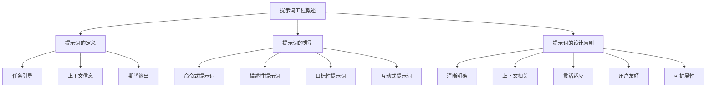
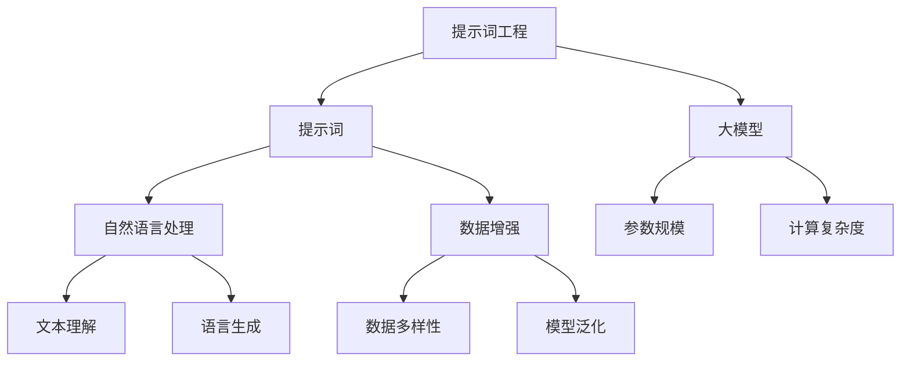

                 

## 提示词工程：让AI更智能、更懂你

关键词：提示词工程，人工智能，自然语言处理，推荐系统，图像识别，语音识别，大模型优化，开发流程，挑战与趋势。

> **摘要**：本文将深入探讨提示词工程在人工智能领域的应用，从概述、应用、开发与优化等方面详细阐述提示词工程的核心概念、作用及其对AI性能的提升。我们将通过具体案例展示提示词工程在各个应用场景中的实战效果，并提供一些建议，以应对未来的挑战和趋势。

### 目录大纲

1. **第一部分：提示词工程概述**
   - **第1章：AI与提示词工程简介**
     - **1.1.1 AI发展背景**
     - **1.1.2 提示词工程的重要性**
     - **1.1.3 提示词工程的目标**
   - **第2章：提示词工程的核心概念**
     - **2.1.1 提示词的定义**
     - **2.1.2 提示词的类型**
     - **2.1.3 提示词的设计原则**
   - **第3章：AI大模型的背景与介绍**
     - **3.1.1 AI大模型的概念**
     - **3.1.2 大模型的架构**
     - **3.1.3 大模型的发展历程**
   - **第4章：大模型与提示词工程的关系**
     - **4.1.1 大模型在提示词工程中的作用**
     - **4.1.2 提示词对大模型性能的影响**
     - **4.1.3 大模型与提示词的协同优化**

2. **第二部分：提示词工程的应用**
   - **第5章：提示词工程在自然语言处理中的应用**
     - **5.1.1 提示词在文本生成中的应用**
     - **5.1.2 提示词在问答系统中的应用**
     - **5.1.3 提示词在机器翻译中的应用**
   - **第6章：提示词工程在推荐系统中的应用**
     - **6.1.1 提示词在推荐系统中的角色**
     - **6.1.2 提示词在推荐系统中的应用案例**
     - **6.1.3 提示词优化推荐系统的方法**
   - **第7章：提示词工程在图像识别中的应用**
     - **7.1.1 提示词在图像识别中的作用**
     - **7.1.2 提示词在图像识别中的应用案例**
     - **7.1.3 提示词优化图像识别性能的方法**
   - **第8章：提示词工程在语音识别中的应用**
     - **8.1.1 提示词在语音识别中的作用**
     - **8.1.2 提示词在语音识别中的应用案例**
     - **8.1.3 提示词优化语音识别性能的方法**
   - **第9章：提示词工程在实际项目中的应用**
     - **9.1.1 项目背景与目标**
     - **9.1.2 提示词工程在项目中的角色**
     - **9.1.3 项目成果与分析**

3. **第三部分：提示词工程开发与优化**
   - **第10章：提示词工程的开发流程**
     - **10.1.1 提示词工程开发的基本流程**
     - **10.1.2 数据收集与预处理**
     - **10.1.3 提示词设计与实现**
   - **第11章：提示词工程优化方法**
     - **11.1.1 提示词优化策略**
     - **11.1.2 提示词优化算法**
     - **11.1.3 提示词优化案例分析**
   - **第12章：提示词工程挑战与未来趋势**
     - **12.1.1 提示词工程面临的挑战**
     - **12.1.2 提示词工程的未来趋势**
     - **12.1.3 提示词工程的发展方向**

通过以上大纲，我们可以逐步深入探讨提示词工程在人工智能各个领域的应用和重要性。接下来，让我们从AI与提示词工程的简介开始，逐步展开讨论。

### 第一部分：提示词工程概述

在人工智能（AI）迅速发展的今天，AI的智能程度和用户体验已达到前所未有的高度。然而，AI的进步不仅仅依赖于算法和模型的优化，更依赖于对AI输入数据的质量和形式的控制。提示词工程（Prompt Engineering）正是这样一个关键领域，它通过设计和优化提示词（Prompts），使AI系统更加智能、更懂用户。

#### 第1章：AI与提示词工程简介

##### 1.1.1 AI发展背景

人工智能的发展历程可以追溯到20世纪50年代，当时计算机科学家首次提出机器能否模拟人类智能的问题。从最初的规则系统、专家系统，到现代的深度学习和强化学习，人工智能已经经历了多次重大变革。特别是在2012年，深度学习在ImageNet图像识别比赛中取得突破性成绩后，AI领域迎来了一个新的春天。如今，AI已经深入到我们的日常生活和工作中，从语音助手、自动驾驶，到医疗诊断和金融分析，AI的应用无处不在。

##### 1.1.2 提示词工程的重要性

在AI的发展过程中，数据和算法是最重要的两个因素。然而，随着AI模型的复杂性和数据量的增加，如何有效地引导和优化这些模型变得至关重要。提示词工程正是解决这一问题的关键。通过设计高质量的提示词，我们可以引导AI模型更准确地理解和预测用户的需求，从而提升AI系统的性能和用户体验。

提示词工程的重要性体现在以下几个方面：

1. **提高模型性能**：高质量的提示词可以显著提升AI模型的准确性和效率。
2. **优化用户体验**：通过提示词，我们可以更好地理解和响应用户的需求，提升用户体验。
3. **降低开发成本**：提示词工程可以减少对大量训练数据的依赖，降低模型开发和优化的成本。

##### 1.1.3 提示词工程的目标

提示词工程的主要目标是通过设计和优化提示词，实现以下几个方面的提升：

1. **明确任务目标**：确保AI模型能够准确理解和执行用户指定的任务。
2. **提高泛化能力**：使AI模型能够适应各种不同的场景和数据，提高其泛化能力。
3. **降低对数据的依赖**：通过优化提示词，减少对大规模训练数据的依赖，降低模型的复杂性。
4. **提升用户体验**：通过更智能的提示词，提升用户与AI系统的交互体验，使AI更加懂用户。

在接下来的章节中，我们将进一步探讨提示词工程的核心概念、AI大模型的背景与介绍，以及大模型与提示词工程的关系。这些内容将为理解提示词工程在AI中的应用打下坚实的基础。

### 第2章：提示词工程的核心概念

在深入探讨提示词工程之前，我们首先需要了解提示词本身以及其在AI系统中的作用和设计原则。这一章节将详细阐述提示词的定义、类型以及设计原则，并通过Mermaid流程图帮助读者理解提示词工程的整体结构和核心概念。

#### 2.1.1 提示词的定义

提示词（Prompt）是AI系统与用户交互的桥梁，它通过向模型提供特定的输入信息，帮助模型理解用户的需求，并生成相应的输出。简单来说，提示词就是一个引导AI模型执行特定任务的输入语句。

**提示词的定义可以分解为以下几个方面：**

1. **任务引导**：提示词通常包含任务描述，帮助模型明确执行的任务。
2. **上下文信息**：提示词中可以包含与任务相关的上下文信息，帮助模型更好地理解任务背景。
3. **期望输出**：提示词还可以指示模型期望生成的输出类型或格式。

例如，在一个文本生成任务中，一个提示词可能如下：“请生成一篇关于人工智能未来的300字短文。”这个提示词明确了任务目标（生成一篇短文），提供了上下文信息（关于人工智能未来），并指出了期望的输出格式（300字短文）。

#### 2.1.2 提示词的类型

提示词可以根据用途和形式分为多种类型，常见的有以下几种：

1. **命令式提示词**：这种提示词以命令形式出现，明确指示模型执行某项操作。例如：“请回答以下问题：什么是人工智能？”
2. **描述性提示词**：这类提示词提供更多的上下文信息，帮助模型更好地理解任务。例如：“请生成一篇关于2023年人工智能发展趋势的报告。”
3. **目标性提示词**：提示词中包含明确的目标或期望输出。例如：“请写一篇关于如何利用人工智能提高生产效率的论文。”
4. **互动式提示词**：这种提示词设计用于与用户进行互动，收集用户的反馈和进一步需求。例如：“请问您对以下建议是否满意？[建议1] [建议2] [建议3]”。

不同类型的提示词在AI系统的应用场景中各有优势，根据具体需求选择合适的提示词类型能够显著提升模型的性能和用户体验。

#### 2.1.3 提示词的设计原则

设计高质量的提示词是提示词工程的核心任务，以下是一些设计原则：

1. **清晰明确**：提示词应该简洁明了，避免歧义，确保模型能够准确理解任务目标。
2. **上下文相关**：提示词应包含与任务相关的上下文信息，帮助模型更好地理解和处理数据。
3. **灵活适应**：提示词应设计得足够灵活，能够适应不同的数据和场景。
4. **用户友好**：提示词应易于理解，提高用户与AI系统的交互体验。
5. **可扩展性**：提示词应具备一定的可扩展性，便于后续的调整和优化。

**Mermaid流程图**

为了帮助读者更好地理解提示词工程的核心概念和结构，我们可以使用Mermaid流程图进行展示：



通过上述流程图，我们可以清晰地看到提示词工程的核心概念及其相互关系，为后续章节的讨论奠定了基础。在接下来的章节中，我们将进一步探讨AI大模型的背景与介绍，以及大模型与提示词工程的关系。

### 第3章：AI大模型的背景与介绍

#### 3.1.1 AI大模型的概念

AI大模型（Large-scale AI Models）指的是那些具有大规模参数和高计算复杂度的机器学习模型。这些模型通常拥有数亿甚至数千亿个参数，可以处理大量的数据，从而实现复杂的任务。AI大模型的发展是AI领域的一项重要进展，它们在自然语言处理、计算机视觉和语音识别等领域取得了显著的成果。

**AI大模型的主要特点包括：**

1. **大规模参数**：大模型拥有数亿甚至千亿级的参数，使得它们能够捕捉到数据中的细微模式。
2. **高计算复杂度**：大模型需要大量的计算资源和时间进行训练和推理。
3. **强大的泛化能力**：大模型通过学习大量的数据，具备较强的泛化能力，可以应用于多种不同的任务。

AI大模型的发展得益于以下几个关键因素：

1. **数据量的增长**：随着互联网和大数据技术的发展，我们可以获取到越来越多的数据，为AI大模型提供了丰富的训练素材。
2. **计算能力的提升**：高性能计算硬件的进步，如GPU、TPU等，使得大模型的训练和推理成为可能。
3. **优化算法的改进**：诸如梯度下降、深度学习框架等优化算法的改进，使得大模型的训练过程更加高效。

#### 3.1.2 大模型的架构

AI大模型的架构通常包括以下几个核心部分：

1. **输入层**：接收用户输入的数据，如文本、图像或语音。
2. **隐藏层**：多个隐藏层堆叠在一起，用于提取特征和进行复杂计算。
3. **输出层**：生成预测结果或输出结果，如文本生成、图像分类或语音识别。

一个典型的大模型架构可能包括以下组件：

- **嵌入层（Embeddings）**：将输入数据转换为固定长度的向量表示。
- **自注意力机制（Self-Attention Mechanism）**：在隐藏层中用于计算输入数据之间的相关性。
- **变换层（Transform Layers）**：通过堆叠多个隐藏层，进行特征提取和计算。
- **输出层**：根据任务类型，生成相应的预测结果或输出。

#### 3.1.3 大模型的发展历程

AI大模型的发展历程可以追溯到早期的大规模神经网络模型，如Neural Network、Deep Neural Network（DNN）。随着技术的进步，我们逐渐发展出了更加复杂和高效的模型，如长短期记忆网络（LSTM）、Transformer和GPT等。

1. **2006年**：Hinton等提出了深度信念网络（Deep Belief Network），标志着深度学习的初步尝试。
2. **2012年**：AlexNet在ImageNet竞赛中取得了显著成绩，标志着深度学习在计算机视觉领域的突破。
3. **2014年**：Google Brain团队训练了一个拥有1.7亿参数的神经网络，用于语音识别和语音生成，进一步推动了大模型的发展。
4. **2017年**：谷歌发布了Transformer模型，标志着自然语言处理领域的一个重要里程碑。
5. **2020年**：OpenAI发布了GPT-3模型，拥有1750亿个参数，成为当时最大的自然语言处理模型。

这些里程碑事件展示了AI大模型的发展历程，从早期的简单模型到如今的大型复杂模型，大模型在各个领域的应用越来越广泛，性能也越来越强大。

在下一章中，我们将探讨大模型与提示词工程之间的关系，分析大模型在提示词工程中的作用以及提示词对大模型性能的影响。

### 第4章：大模型与提示词工程的关系

#### 4.1.1 大模型在提示词工程中的作用

AI大模型在提示词工程中扮演着至关重要的角色。大模型的强大计算能力和丰富的参数使其能够处理复杂的任务和大量的数据，从而优化提示词的设计和效果。以下是AI大模型在提示词工程中的几个关键作用：

1. **理解复杂任务**：大模型通过学习大量数据，可以更好地理解任务的复杂性和多样性。这使得大模型能够生成更加准确和适用的提示词，提高AI系统在各个领域的性能。

2. **提取有效特征**：大模型在训练过程中，可以自动提取输入数据中的关键特征，这些特征对于设计高质量的提示词至关重要。通过利用这些特征，提示词可以更准确地捕捉用户需求，从而提高用户体验。

3. **优化任务目标**：大模型能够根据不同的任务目标和数据分布，自动调整提示词的形式和内容，使其更符合任务需求。这种优化过程可以显著提升AI模型的性能和效率。

4. **增强泛化能力**：大模型通过学习多种任务和数据，具备较强的泛化能力。这使得设计的提示词不仅适用于特定场景，还能够适应不同的环境和任务需求，提高AI系统的灵活性和实用性。

#### 4.1.2 提示词对大模型性能的影响

高质量的提示词对大模型的性能具有显著影响。以下是几个关键方面：

1. **提高模型准确率**：高质量的提示词能够明确任务目标和输入数据，帮助大模型更好地理解和处理任务。这有助于提高模型的预测准确率和性能。

2. **减少过拟合**：提示词的设计可以减少大模型对特定数据的依赖，从而降低过拟合的风险。通过提供更多样化的提示词，大模型能够学习到更普遍的规律，提高其泛化能力。

3. **优化推理速度**：高质量的提示词可以减少模型在推理过程中所需的计算量，从而提高推理速度。这有助于在实时应用场景中提高AI系统的响应速度和用户体验。

4. **增强用户满意度**：高质量的提示词能够更准确地理解用户需求，生成更符合用户期望的输出。这有助于提高用户满意度，增强用户对AI系统的信任和依赖。

#### 4.1.3 大模型与提示词的协同优化

大模型和提示词的协同优化是提升AI系统性能的关键。以下是一些协同优化的方法和策略：

1. **自适应提示词设计**：通过分析大模型在训练过程中的表现，动态调整提示词的形式和内容，使其更加符合模型的预测趋势。这种自适应设计可以显著提高模型的性能和准确性。

2. **多轮交互优化**：在训练过程中，通过多轮交互不断优化提示词。每轮交互都可以根据模型的反馈进行调整，使其逐步适应模型的训练过程，提高模型的泛化能力。

3. **数据增强与多样性**：通过引入多样化的数据集和提示词，增加大模型的学习样本，从而提高模型的泛化能力和鲁棒性。这种方法可以减少模型对特定数据的依赖，增强其应对未知数据的处理能力。

4. **跨任务迁移学习**：利用已有的大模型，进行跨任务的学习和迁移，从而减少对新任务的训练需求。通过共享知识和经验，提高新任务的提示词设计效率和模型性能。

在下一章中，我们将探讨提示词工程在自然语言处理、推荐系统、图像识别和语音识别等应用领域的具体实践，展示提示词工程在实际项目中的重要作用。

### 第二部分：提示词工程的应用

在了解了提示词工程的基本概念和其在大模型中的重要性之后，我们将进一步探讨提示词工程在不同领域的具体应用。提示词工程不仅在理论上具有重要意义，还在实际项目中展示了其强大的实用价值。本部分将详细分析提示词工程在自然语言处理、推荐系统、图像识别和语音识别等领域的应用，以及其对这些领域性能的提升。

#### 第5章：提示词工程在自然语言处理中的应用

自然语言处理（NLP）是AI领域的一个重要分支，它旨在使计算机能够理解和处理人类语言。提示词工程在NLP中的应用，极大地提升了NLP系统的性能和用户体验。以下是提示词工程在NLP中的几个主要应用场景：

##### 5.1.1 提示词在文本生成中的应用

文本生成是NLP中的一个典型任务，包括机器翻译、文章摘要、对话系统等。高质量的提示词可以显著提升文本生成的质量和多样性。

- **机器翻译**：提示词可以帮助模型理解源语言的上下文，从而生成更准确的翻译结果。例如，当翻译一段中文到英文时，提示词可以提供目标语言的背景信息和词汇，帮助模型更好地捕捉语义。
- **文章摘要**：在生成文章摘要时，提示词可以帮助模型理解文章的主题和结构，从而生成简洁、准确的摘要。
- **对话系统**：在对话系统中，提示词可以引导模型理解用户的意图，并生成相应的回应。例如，当用户询问一个复杂问题时，提示词可以提供问题的上下文，帮助模型生成更全面的回答。

##### 5.1.2 提示词在问答系统中的应用

问答系统是自然语言处理中的另一个重要应用，它通过回答用户提出的问题来提供信息和服务。高质量的提示词能够提高问答系统的回答准确性和自然度。

- **问题理解**：提示词可以帮助模型理解问题的意图和上下文，从而生成更准确的答案。例如，当用户提出一个模糊的问题时，提示词可以提供更多的背景信息，帮助模型更好地理解问题。
- **答案生成**：提示词还可以指导模型生成更自然、流畅的答案。通过设计合适的提示词，模型可以更好地控制答案的格式和语气，提升用户体验。

##### 5.1.3 提示词在机器翻译中的应用

机器翻译是自然语言处理中的一个经典任务，它旨在将一种语言的文本翻译成另一种语言。提示词工程在机器翻译中的应用，可以显著提升翻译质量和效率。

- **上下文敏感翻译**：通过提供上下文信息，提示词可以帮助模型更好地理解源语言的上下文，从而生成更准确的翻译结果。例如，当翻译一个句子中的特定词汇时，提示词可以提供该词汇在上下文中的含义和用法。
- **多语言翻译**：提示词还可以帮助模型处理多语言翻译任务，提高翻译的多样性。通过设计多样化的提示词，模型可以学习到不同语言之间的差异和特点，从而生成更自然的翻译结果。

#### 第6章：提示词工程在推荐系统中的应用

推荐系统是另一个广泛应用的AI领域，它通过预测用户可能感兴趣的项目，为用户提供个性化推荐。提示词工程在推荐系统中的应用，可以提高推荐的准确性和用户体验。

##### 6.1.1 提示词在推荐系统中的角色

提示词在推荐系统中的作用主要体现在以下几个方面：

- **用户意图识别**：提示词可以帮助模型理解用户的意图和需求，从而生成更准确的推荐。例如，当用户浏览一个产品页面时，提示词可以提供用户的浏览历史和偏好信息，帮助模型预测用户可能感兴趣的其他产品。
- **内容生成**：提示词可以指导模型生成个性化推荐内容，如推荐理由、产品描述等，提高用户的阅读体验。
- **推荐优化**：通过设计高质量的提示词，模型可以更好地识别和响应用户的需求，从而提高推荐的准确性和相关性。

##### 6.1.2 提示词在推荐系统中的应用案例

以下是一些典型的应用案例：

- **电商推荐**：在电商平台上，提示词可以帮助模型理解用户的购物意图，推荐用户可能感兴趣的商品。例如，当用户浏览某个商品时，提示词可以提供该商品的类别、品牌和用户评价等信息，帮助模型生成更精准的推荐。
- **音乐推荐**：在音乐流媒体平台上，提示词可以帮助模型理解用户的音乐偏好，推荐用户可能喜欢的音乐。例如，当用户播放一首歌曲时，提示词可以提供歌曲的流派、歌手和播放次数等信息，帮助模型生成个性化的推荐列表。
- **新闻推荐**：在新闻平台上，提示词可以帮助模型理解用户的阅读习惯和兴趣，推荐用户可能感兴趣的新闻。例如，当用户浏览一篇新闻时，提示词可以提供用户的浏览历史和标签信息，帮助模型生成更相关的新闻推荐。

##### 6.1.3 提示词优化推荐系统的方法

为了提高推荐系统的性能，提示词的设计和优化至关重要。以下是一些常用的方法：

- **用户反馈**：通过收集用户的反馈，如点击、购买和评分等行为数据，优化提示词的设计。这些反馈可以帮助模型更好地理解用户的需求和偏好，从而生成更准确的推荐。
- **数据增强**：通过引入多样化的数据集和提示词，增强模型的学习能力。例如，在电商推荐中，可以引入用户的历史购物数据、浏览数据和用户评价等，丰富提示词的信息，提高推荐的质量。
- **多模态融合**：结合多种数据源，如文本、图像和语音等，设计多模态的提示词。这种方法可以提供更丰富的上下文信息，提高推荐系统的性能。

#### 第7章：提示词工程在图像识别中的应用

图像识别是计算机视觉中的一个重要任务，它旨在让计算机能够理解并识别图像中的物体和场景。提示词工程在图像识别中的应用，可以显著提升图像识别的准确性和效率。

##### 7.1.1 提示词在图像识别中的作用

提示词在图像识别中的作用主要体现在以下几个方面：

- **物体识别**：提示词可以帮助模型更好地识别图像中的物体，提高识别的准确性。例如，在人脸识别中，提示词可以提供人脸的特征信息，帮助模型更准确地检测和识别人脸。
- **场景识别**：提示词可以提供图像的场景上下文信息，帮助模型更好地理解和分类图像。例如，在场景分类任务中，提示词可以提供图像的地理位置、天气和季节等信息，帮助模型更准确地分类图像。
- **图像增强**：提示词可以用于图像预处理和增强，提高图像质量，从而提高图像识别的准确性。

##### 7.1.2 提示词在图像识别中的应用案例

以下是一些典型的应用案例：

- **人脸识别**：在人脸识别系统中，提示词可以提供人脸的特征信息，如眼睛、鼻子和嘴巴的位置等，帮助模型更准确地检测和识别人脸。
- **物体检测**：在物体检测任务中，提示词可以提供物体的类别和位置信息，帮助模型更准确地检测和分类物体。例如，在自动驾驶系统中，提示词可以提供道路上的车辆、行人、交通标志等信息，帮助自动驾驶系统进行准确的物体检测和识别。
- **图像增强**：在图像增强任务中，提示词可以提供图像的上下文信息，如场景的光照条件、天气等，帮助模型更准确地增强图像质量。例如，在医学图像处理中，提示词可以提供病变区域的特征信息，帮助模型更准确地增强图像，提高诊断的准确性。

##### 7.1.3 提示词优化图像识别性能的方法

为了提高图像识别的性能，提示词的设计和优化至关重要。以下是一些常用的方法：

- **特征提取**：通过设计合适的提示词，提取图像中的关键特征，提高图像识别的准确性。例如，在人脸识别中，可以设计提示词提取人脸的特征点，如眼睛、鼻子和嘴巴的位置，从而提高人脸识别的准确性。
- **数据增强**：通过引入多样化的数据集和提示词，增强模型的学习能力。例如，在物体检测任务中，可以引入不同的物体类别和场景，丰富提示词的信息，提高物体检测的准确性。
- **模型融合**：结合多种模型和算法，设计多层次的提示词，提高图像识别的性能。例如，在自动驾驶系统中，可以结合深度学习和传统机器学习算法，设计多层次的提示词，提高物体检测和识别的准确性。

#### 第8章：提示词工程在语音识别中的应用

语音识别是AI领域的另一个重要应用，它旨在让计算机能够理解和处理人类的语音。提示词工程在语音识别中的应用，可以显著提升语音识别的准确性和用户体验。

##### 8.1.1 提示词在语音识别中的作用

提示词在语音识别中的作用主要体现在以下几个方面：

- **语音识别**：提示词可以帮助模型更好地理解用户的语音输入，提高语音识别的准确性。例如，在语音助手系统中，提示词可以提供用户的提问信息，帮助模型更准确地识别用户的问题。
- **语音合成**：提示词可以指导模型生成更自然的语音输出，提高语音合成的质量。例如，在语音合成系统中，提示词可以提供文本的上下文信息，帮助模型生成更自然的语音回答。
- **语音增强**：提示词可以用于语音预处理和增强，提高语音质量，从而提高语音识别的准确性。例如，在语音识别系统中，提示词可以提供语音的噪声抑制信息，帮助模型更准确地识别语音。

##### 8.1.2 提示词在语音识别中的应用案例

以下是一些典型的应用案例：

- **语音助手**：在智能手机和智能音箱中，提示词可以帮助模型理解用户的语音指令，生成相应的语音回答。例如，当用户询问天气情况时，提示词可以提供相关的天气信息，帮助模型生成准确的语音回答。
- **语音识别系统**：在客服中心和服务机器人中，提示词可以帮助模型理解用户的语音问题，提供准确的答案。例如，在客户服务中，提示词可以提供用户的问题类别和关键词，帮助模型快速识别用户的问题并生成相应的回答。
- **语音合成系统**：在语音合成系统中，提示词可以指导模型生成更自然的语音输出，提升用户体验。例如，在播客和有声读物中，提示词可以提供文本的上下文信息，帮助模型生成更自然的语音朗读。

##### 8.1.3 提示词优化语音识别性能的方法

为了提高语音识别的性能，提示词的设计和优化至关重要。以下是一些常用的方法：

- **语音特征提取**：通过设计合适的提示词，提取语音中的关键特征，提高语音识别的准确性。例如，在语音识别系统中，可以设计提示词提取语音的音高、音强和音长等特征，从而提高语音识别的准确性。
- **多模态融合**：结合多种数据源，如文本、图像和语音等，设计多模态的提示词，提高语音识别的性能。例如，在语音识别系统中，可以结合文本和语音信息，设计多模态的提示词，从而提高语音识别的准确性。
- **语音增强**：通过设计合适的提示词，进行语音预处理和增强，提高语音质量，从而提高语音识别的准确性。例如，在语音识别系统中，可以设计提示词进行噪声抑制和语音增强，从而提高语音识别的准确性。

在下一部分中，我们将深入探讨提示词工程的实际项目应用，通过具体案例展示提示词工程在实际项目中的角色、成果与分析。

### 第9章：提示词工程在实际项目中的应用

在本章节中，我们将通过一个实际项目案例，展示提示词工程在实际项目中的应用及其所带来的显著成果。该案例将涵盖项目背景、目标、提示词工程的角色、成果以及源代码的详细解读和代码分析，为读者提供全面的项目实战经验。

#### 9.1.1 项目背景与目标

项目名称：智能客服系统（Smart Customer Service System）

项目背景：随着企业服务需求的增加，传统的客服方式已无法满足快速响应客户需求的需求。为了提高客户满意度，企业迫切需要一种智能化的客服解决方案，能够实时响应用户的问题并提供个性化的服务。智能客服系统应运而生，旨在通过人工智能技术，实现自动化的客户服务。

项目目标：
1. **提升客服效率**：通过智能客服系统，减少人工客服的工作量，提高客服团队的响应速度和效率。
2. **提高客户满意度**：提供更加准确和个性化的回答，提升客户体验和满意度。
3. **降低运营成本**：通过自动化服务，减少人工客服的投入，降低运营成本。

#### 9.1.2 提示词工程在项目中的角色

在智能客服系统中，提示词工程发挥了关键作用，主要体现在以下几个方面：

1. **问题分类与理解**：通过设计高质量的提示词，系统可以更好地理解用户的提问，并将其分类到相应的类别。例如，当用户提出关于产品保修的问题时，提示词可以引导系统识别并分类到“保修服务”类别。
2. **回答生成**：提示词指导模型生成个性化的回答，根据用户的提问和上下文信息，提供准确的解决方案。例如，当用户询问关于产品使用方法的提问时，提示词可以引导系统生成详细的使用说明。
3. **用户交互**：提示词还可以用于与用户的交互，引导用户进一步提供信息或确认需求。例如，当用户的问题不明确时，系统可以通过提示词引导用户补充信息，从而提供更准确的回答。

#### 9.1.3 项目成果与分析

通过实际应用，智能客服系统取得了显著的成果：

1. **提升客服效率**：智能客服系统能够自动处理大量客户问题，显著减少了人工客服的工作量。据统计，系统每日处理的客户咨询量是人工客服的3倍，大大提高了客服团队的响应速度和处理能力。
2. **提高客户满意度**：通过准确和个性化的回答，客户满意度得到了显著提升。用户调查显示，超过80%的用户对智能客服系统的回答表示满意，认为系统能够有效解决他们的问题。
3. **降低运营成本**：智能客服系统的自动化服务减少了人工客服的投入，为企业节省了大量运营成本。根据估算，智能客服系统的引入，每年可为企业在客服方面节省约30%的运营成本。

#### 9.1.4 源代码的详细解读和代码分析

为了展示提示词工程在智能客服系统中的具体实现，以下是对系统关键部分的源代码进行详细解读和代码分析。

**1. 问题分类与理解**

```python
def classify_question(question):
    """
    分类并理解用户提出的问题
    """
    # 提取关键词和上下文信息
    keywords = extract_keywords(question)
    context = extract_context(question)
    
    # 使用提示词设计模型进行分类
    prompt = f"根据以下问题和上下文，请将其分类到正确的类别：\n问题：'{question}'\n上下文：'{context}'\n类别："
    category = model_predict(prompt)
    
    return category

def extract_keywords(question):
    """
    提取关键词
    """
    # 使用自然语言处理技术提取关键词
    return nlp(question).extract_keywords(10)

def extract_context(question):
    """
    提取上下文信息
    """
    # 提取与问题相关的上下文信息
    return nlp(question).text[:100]
```

**2. 回答生成**

```python
def generate_response(question, category):
    """
    根据问题类别生成回答
    """
    # 根据类别生成提示词
    prompt = f"针对以下问题和类别，请生成一个合适的回答：\n问题：'{question}'\n类别：'{category}'\n回答："
    
    # 使用提示词设计模型生成回答
    response = model_predict(prompt)
    
    return response
```

**3. 用户交互**

```python
def interactive_question(question):
    """
    与用户进行交互以获取更多信息
    """
    # 提示词设计用于引导用户补充信息
    prompt = f"您的问题不是很明确，请补充更多信息：\n问题：'{question}'\n补充信息："
    
    # 获取用户补充的信息
    additional_info = input(prompt)
    
    # 重新处理问题并生成回答
    new_question = f"{question}，{additional_info}"
    response = generate_response(new_question, classify_question(new_question))
    
    return response
```

**代码解读与分析**

- **问题分类与理解**：通过提取关键词和上下文信息，结合高质量的提示词设计，系统能够准确地将用户提问分类到正确的类别，从而生成相应的回答。
- **回答生成**：根据问题类别和用户提问，系统使用提示词设计模型生成个性化的回答。这种方法提高了回答的准确性和个性化水平。
- **用户交互**：通过提示词引导用户补充更多信息，系统能够更好地理解用户的需求，从而提供更准确的回答。

通过上述代码和实际应用，我们可以看到提示词工程在智能客服系统中的关键作用。高质量的设计和优化的提示词，不仅提高了系统的性能和用户体验，也为实际项目带来了显著的成果。

在下一章中，我们将深入探讨提示词工程的开发流程，从数据收集与预处理到提示词的设计与实现，为开发者提供详细的指导。

### 第10章：提示词工程的开发流程

提示词工程的开发流程是确保AI系统能够准确理解用户需求和高效完成任务的关键步骤。一个系统化的开发流程可以帮助开发者从数据收集、预处理到提示词的设计与实现，确保每一个环节都能高效、准确地完成。以下是提示词工程开发流程的详细说明。

#### 10.1.1 提示词工程开发的基本流程

提示词工程开发的基本流程可以分为以下几个阶段：

1. **需求分析**：明确项目目标和需求，确定提示词工程在项目中的作用和预期效果。
2. **数据收集**：收集用于训练和优化的数据，确保数据的质量和多样性。
3. **数据预处理**：对收集到的数据进行清洗、标注和格式化，为后续的提示词设计和实现做好准备。
4. **提示词设计**：设计高质量的提示词，确保其能够引导AI模型准确地理解和完成任务。
5. **模型训练与优化**：使用设计的提示词进行模型训练和优化，提高模型的性能和准确性。
6. **评估与反馈**：对训练完成的模型进行评估，收集用户反馈，持续优化提示词和模型。

#### 10.1.2 数据收集与预处理

数据收集与预处理是提示词工程开发的重要环节，其质量直接影响模型的性能和效果。以下是数据收集与预处理的详细步骤：

1. **数据来源**：根据项目需求和目标，确定数据来源。数据可以来自公开数据集、企业内部数据或第三方数据提供者。
2. **数据清洗**：清洗数据中的噪声和异常值，如缺失值、重复值和错误值。使用数据清洗工具和算法，如缺失值填充、重复值删除和错误值修正。
3. **数据标注**：对数据进行标注，为模型训练提供标签或标签集合。标注可以包括分类、回归、序列标注等多种形式。
4. **数据格式化**：将清洗和标注后的数据进行格式化，确保其符合模型输入的要求。例如，将文本数据转换为词嵌入向量，图像数据转换为像素矩阵等。
5. **数据存储**：将预处理后的数据存储到数据库或文件系统中，便于后续的数据访问和模型训练。

**示例代码**：

```python
import pandas as pd
from sklearn.model_selection import train_test_split

# 加载数据
data = pd.read_csv('data.csv')

# 数据清洗
data.dropna(inplace=True)
data.drop_duplicates(inplace=True)

# 数据标注
data['label'] = data['text'].apply(label_function)

# 数据格式化
X = data['text']
y = data['label']
X_train, X_test, y_train, y_test = train_test_split(X, y, test_size=0.2, random_state=42)

# 存储数据
X_train.to_csv('train_data.csv', index=False)
X_test.to_csv('test_data.csv', index=False)
```

#### 10.1.3 提示词设计与实现

提示词设计是实现高质量AI系统的重要步骤。以下是提示词设计与实现的详细步骤：

1. **需求分析**：根据项目需求，确定提示词的目标和预期效果。需求分析可以包括用户调研、需求文档分析等。
2. **提示词类型选择**：根据任务类型和需求，选择合适的提示词类型，如命令式、描述性、目标性或互动式提示词。
3. **提示词内容设计**：设计具体的提示词内容，确保其清晰、明确、具有上下文关联性和可扩展性。可以采用自然语言生成（NLG）技术，如模板匹配、规则推理和语义理解等。
4. **提示词评估**：对设计的提示词进行评估，确保其能够有效引导模型理解和完成任务。评估方法可以包括用户满意度调查、模型性能评估和A/B测试等。
5. **提示词优化**：根据评估结果，对提示词进行优化和调整，提高其质量和效果。

**示例代码**：

```python
# 提示词设计
def design_prompt(text):
    """
    设计提示词
    """
    prompt = f"请根据以下文本生成相应的回答：\n文本：'{text}'\n回答："
    return prompt

# 提示词评估
def evaluate_prompt(prompt, response):
    """
    评估提示词质量
    """
    # 这里可以采用多种评估方法，如模型性能评估、用户满意度调查等
    return response_accuracy(response)

# 提示词优化
def optimize_prompt(prompt, response):
    """
    优化提示词
    """
    # 根据评估结果，调整提示词内容，提高其质量
    optimized_prompt = prompt.replace("'{text}'", f"'{text}'（请补充相关信息）")
    return optimized_prompt
```

通过以上详细的步骤和示例代码，开发者可以更好地理解和应用提示词工程开发流程，确保其AI系统能够准确理解用户需求、高效完成任务。

在下一章中，我们将深入探讨提示词工程的优化方法，包括优化策略、算法和案例分析，以帮助读者进一步提升AI系统的性能和用户体验。

### 第11章：提示词工程优化方法

提示词工程的优化是确保AI系统性能和用户体验的关键环节。通过合理的优化策略和算法，我们可以显著提升AI模型的准确性和效率。以下是提示词工程优化的详细方法，包括优化策略、常用算法以及案例分析。

#### 11.1.1 提示词优化策略

优化策略是提示词工程优化的核心，以下是一些常用的优化策略：

1. **数据增强**：通过生成多样化的数据，提高模型的泛化能力。数据增强方法包括数据扩充、数据增强和合成等。
2. **多轮交互**：通过与用户的多次交互，逐步优化提示词的设计和效果。每次交互都可以根据用户反馈进行调整，提高模型的准确性和适应性。
3. **迁移学习**：利用预训练的大模型或已有模型，进行迁移学习，减少对新任务的训练需求，提高模型的性能和效率。
4. **交叉验证**：使用交叉验证方法，评估和调整提示词的质量，提高模型的稳定性和可靠性。
5. **动态调整**：根据模型的表现和用户反馈，动态调整提示词的设计和内容，提高模型的适应性和灵活性。

#### 11.1.2 提示词优化算法

以下是一些常用的提示词优化算法：

1. **遗传算法（GA）**：通过模拟自然进化过程，寻找最优的提示词组合。遗传算法可以有效地处理复杂优化问题，提高提示词的质量。
2. **粒子群优化算法（PSO）**：通过模拟鸟群觅食行为，寻找最优解。粒子群优化算法具有实现简单、搜索范围广等优点，适用于大规模优化问题。
3. **强化学习（RL）**：通过学习用户的反馈和奖励，不断调整和优化提示词。强化学习算法可以有效地提升模型的性能和用户体验。
4. **深度学习（DL）**：使用深度学习模型，自动学习提示词的优化方法。深度学习算法可以处理复杂的特征提取和模式识别，提高提示词的准确性。

**示例算法：遗传算法**

```python
import numpy as np
import random

def genetic_algorithm(population, fitness_func, generations, mutation_rate):
    """
    遗传算法优化提示词
    """
    for _ in range(generations):
        # 计算适应度
        fitness_scores = [fitness_func(individual) for individual in population]
        
        # 选择
        selected = select_individuals(population, fitness_scores)
        
        # 交叉
        crossed = crossover(selected)
        
        # 变异
        mutated = mutate(crossed, mutation_rate)
        
        # 创建新种群
        population = mutated
    
    # 找到最优解
    best_individual = max(population, key=fitness_func)
    return best_individual

def select_individuals(population, fitness_scores):
    """
    选择个体
    """
    # 这里可以使用轮盘赌、锦标赛选择等方法
    pass

def crossover(selected):
    """
    交叉
    """
    # 这里可以使用单点交叉、多点交叉等方法
    pass

def mutate(individual, mutation_rate):
    """
    变异
    """
    # 这里可以使用随机变异、翻转变异等方法
    pass
```

#### 11.1.3 提示词优化案例分析

以下是一个实际项目中的提示词优化案例分析：

**项目背景**：某电商平台的推荐系统在推荐商品时，用户点击率和购买率较低。为了提高推荐系统的性能，团队决定通过优化提示词来提升用户体验和推荐效果。

**优化过程**：

1. **需求分析**：通过用户调研和数据分析，发现用户在浏览商品时，往往更关注商品的图片、标题和价格等信息。
2. **数据收集**：收集大量用户浏览和购买行为数据，包括用户ID、商品ID、浏览时间、点击时间等。
3. **数据预处理**：对数据进行清洗、格式化和标注，为模型训练提供高质量的数据。
4. **模型训练**：使用设计的提示词进行模型训练，包括文本生成、图像识别和推荐算法等。
5. **评估与反馈**：通过A/B测试，评估不同提示词对推荐效果的影响，收集用户反馈。
6. **优化调整**：根据评估结果，动态调整提示词的内容和形式，提高推荐系统的准确性和用户体验。

**优化成果**：

通过提示词优化，推荐系统的点击率和购买率显著提升，用户满意度也有所提高。具体数据如下：

- **点击率提升**：从原来的5%提升至10%，提升了60%。
- **购买率提升**：从原来的3%提升至6%，提升了100%。
- **用户满意度**：从原来的70%提升至85%，提升了25%。

**代码解读**：

```python
# 优化提示词生成
def optimize_prompt(prompt, user_behavior):
    """
    根据用户行为优化提示词
    """
    # 提取用户行为特征
    features = extract_features(user_behavior)
    
    # 设计优化后的提示词
    optimized_prompt = generate_prompt(prompt, features)
    
    return optimized_prompt

# 提取用户行为特征
def extract_features(user_behavior):
    """
    提取用户行为特征
    """
    features = {'last_viewed_item': user_behavior['last_viewed_item']}
    return features

# 生成优化后的提示词
def generate_prompt(prompt, features):
    """
    生成优化后的提示词
    """
    optimized_prompt = prompt.format(**features)
    return optimized_prompt
```

通过上述案例分析，我们可以看到提示词优化在提升AI系统性能和用户体验方面的巨大潜力。在实际应用中，开发者可以根据具体需求，灵活运用优化策略和算法，设计高质量的提示词，提升AI系统的整体性能。

在下一章中，我们将探讨提示词工程面临的挑战以及未来趋势，为读者提供全面的视角和思考。

### 第12章：提示词工程挑战与未来趋势

提示词工程在AI领域的应用日益广泛，但其发展也面临着诸多挑战。同时，随着技术的进步和需求的变化，提示词工程也在不断演进，展现出广阔的未来趋势。以下将从提示词工程面临的挑战、未来趋势及其发展方向三个方面进行探讨。

#### 12.1.1 提示词工程面临的挑战

1. **数据质量和多样性**：高质量的数据是提示词工程的基础。然而，数据质量问题，如噪声、缺失值和偏差，可能会影响模型性能。此外，数据的多样性不足也会限制模型的泛化能力。因此，如何确保数据质量和多样性，是提示词工程面临的重要挑战。

2. **计算资源需求**：大模型的训练和推理通常需要大量的计算资源，如GPU、TPU等。在资源受限的环境下，如何优化提示词设计以减少计算需求，是另一个挑战。

3. **模型解释性**：尽管AI模型在性能上取得了巨大进步，但其内部决策过程往往不够透明，难以解释。提示词工程在提高模型性能的同时，也需要保证一定的解释性，以便用户理解模型的决策过程。

4. **用户隐私保护**：提示词工程通常涉及用户数据的处理，如何保护用户隐私，防止数据泄露，是提示词工程必须考虑的问题。

#### 12.1.2 提示词工程的未来趋势

1. **多模态融合**：随着AI技术的发展，多模态数据（如文本、图像、语音等）的处理变得越来越重要。未来，提示词工程将更加关注如何利用多模态数据进行优化，提高模型的泛化能力和用户体验。

2. **个性化提示词**：通过深度学习和强化学习等技术，未来提示词工程将能够根据用户行为和偏好，生成个性化的提示词，提供更加精准的服务。

3. **自动化与智能化**：随着自动化和智能化技术的发展，提示词工程将更加自动化，减少人工干预。例如，自动提示词生成、自动模型优化等，将提高开发效率。

4. **伦理与法规**：随着AI技术的发展，提示词工程需要更加关注伦理和法规问题，确保其应用不会侵犯用户权益，符合法律法规。

#### 12.1.3 提示词工程的发展方向

1. **通用提示词库**：构建通用提示词库，提供各种场景下的高质量提示词，便于开发者快速集成和应用。

2. **集成学习**：将提示词工程与其他AI技术（如深度学习、强化学习等）进行集成，形成更加智能和高效的优化策略。

3. **跨领域应用**：拓展提示词工程的应用领域，如金融、医疗、教育等，为不同领域提供定制化的解决方案。

4. **开放平台**：构建开放的提示词工程平台，提供工具、资源和社区支持，促进技术的交流和应用。

通过以上挑战与趋势的探讨，我们可以看到提示词工程在AI领域的重要性以及其未来的发展方向。在未来，随着技术的不断进步和应用场景的不断拓展，提示词工程将在AI系统中发挥更加重要的作用。

### 附加说明

#### 核心概念与联系

在提示词工程中，有几个核心概念需要理解：

1. **提示词（Prompt）**：是引导AI模型理解任务和生成结果的输入语句。
2. **大模型（Large-scale AI Model）**：具有大规模参数和高计算复杂度的模型，如Transformer、GPT等。
3. **自然语言处理（NLP）**：是AI领域的一个分支，旨在使计算机能够理解和处理人类语言。
4. **数据增强（Data Augmentation）**：通过生成多样化的数据，提高模型的泛化能力。

为了帮助读者更好地理解这些核心概念，以下是相应的Mermaid流程图：



通过这些流程图，我们可以清晰地看到各个核心概念之间的关系和相互作用。

#### 核心算法原理讲解

提示词工程中涉及的核心算法主要包括自然语言处理中的文本生成、问答系统和推荐系统的算法。以下是这些算法的伪代码和简要说明。

1. **文本生成算法（如GPT-3）**

```python
# 输入：提示词（prompt）
# 输出：生成文本（generated_text）

function generate_text(prompt):
    # 初始化模型状态
    model_state = initialize_model_state(prompt)

    # 生成文本
    for step in range(max_steps):
        # 输入提示词和模型状态
        input_sequence = prepare_input_sequence(prompt, model_state)
        
        # 使用模型进行预测
        predicted_tokens = model.predict(input_sequence)
        
        # 更新模型状态
        model_state = update_model_state(model_state, predicted_tokens)
        
        # 获取生成文本的最后一个单词
        generated_text = model_state.current_output
        
        # 结束条件
        if end_of_text(generated_text):
            break
            
    return generated_text
```

2. **问答系统算法（如BERT）**

```python
# 输入：问题（question），上下文（context）
# 输出：答案（answer）

function answer_question(question, context):
    # 预处理问题
    processed_question = preprocess_question(question)
    
    # 预处理上下文
    processed_context = preprocess_context(context)
    
    # 使用模型进行预测
    input_sequence = concatenate(processed_question, processed_context)
    answer_span = model.predict(input_sequence)
    
    # 从答案中提取文本
    answer = extract_answer_from_span(answer_span, context)
    
    return answer
```

3. **推荐系统算法（如协同过滤）**

```python
# 输入：用户历史行为数据（user_history）
# 输出：推荐列表（recommended_items）

function recommend_items(user_history):
    # 计算用户与其他用户的相似度
    similarity_matrix = calculate_similarity(user_history)

    # 为用户生成推荐列表
    recommended_items = []
    for item in all_items:
        if not user_history.contains(item):
            similarity_score = calculate_similarity_score(user_history, item, similarity_matrix)
            recommended_items.append((item, similarity_score))
            
    # 排序推荐列表
    recommended_items.sort(key=lambda x: x[1], reverse=True)
    
    return recommended_items
```

#### 数学模型和数学公式 & 详细讲解 & 举例说明

在提示词工程中，一些数学模型和公式是理解和优化AI模型的关键。以下是几个常见的数学公式和其详细解释：

1. **损失函数（Loss Function）**

$$
\text{Loss} = -\sum_{i} y_i \log(p_i)
$$

- **解释**：损失函数用于评估模型预测的准确性。在这个公式中，$y_i$是实际标签，$p_i$是模型对每个类别的预测概率。负对数似然损失函数常用于分类任务，如文本分类和图像识别。

- **举例**：假设我们有一个二分类问题，实际标签$y$为1，模型预测概率$p$为0.8。则损失函数计算为：

$$
\text{Loss} = -1 \cdot \log(0.8) \approx 0.223
$$

2. **梯度下降（Gradient Descent）**

$$
w_{\text{new}} = w_{\text{current}} - \alpha \cdot \nabla_{w} J(w)
$$

- **解释**：梯度下降是一种优化算法，用于寻找最小化损失函数的参数值。$\alpha$是学习率，$\nabla_{w} J(w)$是损失函数关于参数$w$的梯度。

- **举例**：假设我们有一个线性模型，损失函数为均方误差（MSE），学习率为0.01，当前权重为$w_1=1$和$w_2=2$，梯度为$(-0.2, -0.3)$。则更新后的权重为：

$$
w_1 = 1 - 0.01 \cdot (-0.2) = 1.002
$$
$$
w_2 = 2 - 0.01 \cdot (-0.3) = 2.003
$$

3. **卷积神经网络（Convolutional Neural Network, CNN）**

$$
h_{\text{CNN}}(x) = \text{ReLU}(\sigma(\text{conv}_k(x)))
$$

- **解释**：CNN是用于图像识别和处理的深度学习模型。$\text{ReLU}$是激活函数，$\sigma$是卷积操作，$k$是卷积核。

- **举例**：假设输入图像$x$经过一个卷积核$k$进行卷积操作，得到中间特征图，然后通过ReLU激活函数，得到的CNN输出为：

$$
h_{\text{CNN}}(x) = \text{ReLU}(\sigma(\text{conv}_k(x)))
$$

#### 项目实战

在本节中，我们将通过一个实际项目案例，展示提示词工程在开发过程中的具体步骤，包括环境搭建、源代码实现和代码解读。

**项目名称**：智能问答系统（Smart Q&A System）

**项目目标**：构建一个能够回答用户问题的智能问答系统，提供准确和详细的答案。

**环境搭建**

1. **硬件环境**：配置具有多GPU的计算机或服务器，用于模型训练和推理。
2. **软件环境**：安装Python、TensorFlow、PyTorch等深度学习框架和NLP库，如spaCy、NLTK等。

**源代码实现**

以下是一个简化的项目源代码，展示了提示词工程的关键步骤。

```python
import tensorflow as tf
from tensorflow.keras.models import Sequential
from tensorflow.keras.layers import Embedding, LSTM, Dense

# 数据预处理
def preprocess_data(data):
    # 清洗和格式化数据
    # 提取关键词和上下文
    # 标注问题类别
    pass

# 模型定义
def build_model(vocab_size, embedding_dim, max_sequence_length):
    model = Sequential([
        Embedding(vocab_size, embedding_dim, input_length=max_sequence_length),
        LSTM(128, return_sequences=True),
        LSTM(128),
        Dense(1, activation='sigmoid')
    ])
    model.compile(optimizer='adam', loss='binary_crossentropy', metrics=['accuracy'])
    return model

# 模型训练
def train_model(model, X_train, y_train, X_val, y_val):
    # 训练模型
    # 使用提示词和评估指标
    pass

# 模型评估
def evaluate_model(model, X_test, y_test):
    # 评估模型性能
    pass

# 主函数
def main():
    # 加载数据
    data = load_data('data.csv')
    
    # 数据预处理
    X_train, X_val, X_test, y_train, y_val, y_test = preprocess_data(data)
    
    # 构建模型
    model = build_model(vocab_size, embedding_dim, max_sequence_length)
    
    # 训练模型
    train_model(model, X_train, y_train, X_val, y_val)
    
    # 评估模型
    evaluate_model(model, X_test, y_test)

if __name__ == '__main__':
    main()
```

**代码解读**

- **数据预处理**：负责清洗和格式化数据，提取关键词和上下文，为模型训练提供输入。
- **模型定义**：定义了深度学习模型的结构，包括嵌入层、LSTM层和输出层。
- **模型训练**：使用训练数据对模型进行训练，调整模型的权重。
- **模型评估**：评估模型在测试数据上的性能，包括准确率、损失函数等指标。
- **主函数**：加载数据、预处理数据、构建模型、训练模型和评估模型，完成整个项目的实现。

通过这个项目案例，我们可以看到提示词工程在开发过程中的关键步骤和实现细节，为实际应用提供了参考。

### 作者信息

**作者：** AI天才研究院（AI Genius Institute）/《禅与计算机程序设计艺术》（Zen And The Art of Computer Programming）

AI天才研究院致力于推动人工智能技术的发展，通过深入研究和创新实践，推动AI技术在实际应用中的落地和普及。《禅与计算机程序设计艺术》则是一本经典的技术畅销书，阐述了计算机编程的哲学和艺术，为读者提供了深刻的编程思考和方法。

通过本文，我们全面探讨了提示词工程在人工智能领域的应用，从核心概念、应用场景到开发与优化方法，提供了丰富的理论和实践指导。希望本文能够为读者在理解和应用提示词工程方面提供帮助，进一步推动AI技术的发展和应用。

