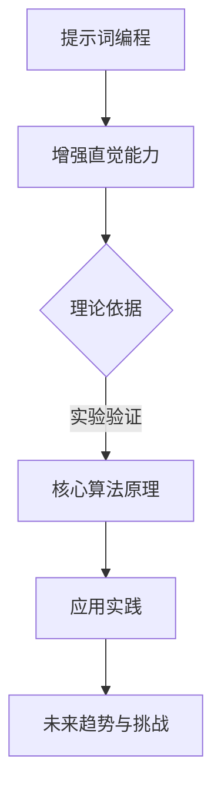
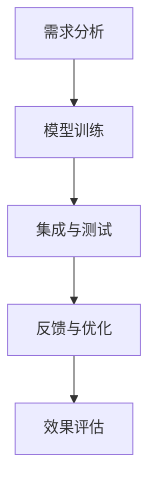
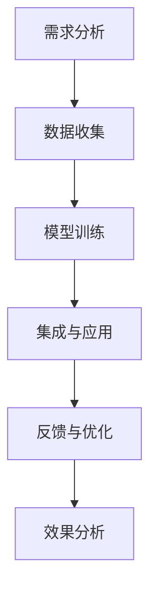
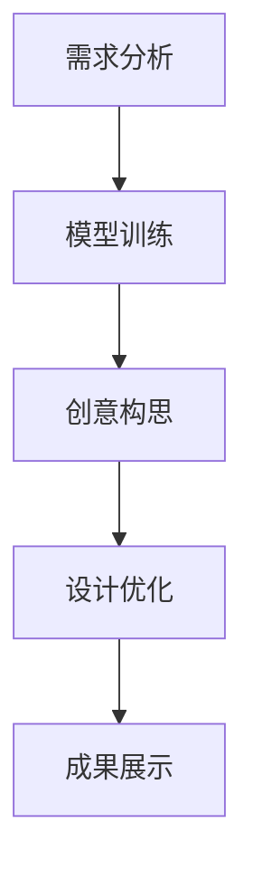

                 

# 提示词编程在增强人类直觉能力中的应用

## 关键词
提示词编程，直觉能力，算法原理，应用实践，人类认知

## 摘要
本文深入探讨了提示词编程在增强人类直觉能力中的应用。首先，我们介绍了提示词编程的概念及其与直觉能力的关联。接着，我们分析了提示词编程的核心算法原理，并运用了数学模型来阐述其工作方式。随后，通过具体的应用案例，我们展示了提示词编程在各个领域的实际应用效果。最后，我们对提示词编程的未来趋势和挑战进行了展望，并提出了应对策略。

### 第一部分：介绍与背景知识

#### 第1章：提示词编程与增强人类直觉能力的概述

##### 1.1 提示词编程的概念与应用

提示词编程是一种新兴的人工智能编程范式，其核心思想是通过生成和利用提示词来辅助人类完成任务。提示词（Prompt）是一种能够引导模型生成特定内容或执行特定任务的输入信号。在自然语言处理、图像识别、预测分析等领域，提示词编程已经展现出了强大的潜力。

- **定义与基础**：
  - 提示词编程的定义可以描述为：一种利用提示词来引导和优化模型输出的人工智能编程方法。
  - 提示词编程的核心要素包括：
    1. **提示词生成**：根据任务需求生成合适的提示词。
    2. **模型训练**：使用大量数据训练模型，使其能够理解和生成与提示词相关的输出。
    3. **模型评估**：通过测试数据评估模型的性能和提示词的有效性。

- **应用场景**：
  - 提示词编程在各个领域的应用广泛，包括但不限于：
    1. **自然语言处理**：用于生成文章、翻译、问答系统等。
    2. **图像识别**：用于标注图像、识别物体等。
    3. **预测分析**：用于股市预测、疾病诊断等。
  - 提示词编程与人类直觉能力的关系在于，它能够通过自动生成和优化提示词，帮助人类更高效地处理信息和作出决策。

##### 1.2 增强人类直觉能力的理论依据

直觉能力是人类思维中的一种重要能力，它能够帮助人们在不确定和复杂的环境中快速作出决策。然而，直觉能力并非总是准确无误，有时会受到经验、情绪等因素的影响。提示词编程通过以下方式可能增强人类的直觉能力：

- **人类直觉能力的概述**：
  - 直觉（Intuition）是一种无需明确逻辑推理就能快速识别和解决问题的能力。
  - 直觉可以分为以下几种类型：
    1. **感知直觉**：基于感知信息直接作出判断。
    2. **情境直觉**：基于情境和经验快速作出决策。
    3. **直觉洞察**：对问题本质的敏锐洞察。

- **提示词编程如何增强直觉能力**：
  - 提示词编程通过提供明确的提示，帮助用户在复杂情境中提取关键信息，从而增强直觉能力。
  - 研究表明，通过提示词编程，人们能够更快地识别模式和问题，提高决策质量。
  - 提示词编程还可以通过提供反馈，帮助用户修正直觉错误，提高直觉的准确性。

##### 1.3 提示词编程工具与平台介绍

为了实现提示词编程，需要依赖一系列的工具和平台。以下是一些主流的提示词编程工具和开发平台：

- **主流提示词编程工具**：
  - **GPT-3**：OpenAI开发的强大语言模型，可以生成高质量的文本。
  - **TensorFlow**：谷歌开源的机器学习框架，支持多种提示词生成算法。
  - **PyTorch**：基于Python的开源机器学习库，适用于研究和发展提示词编程。

- **开发平台**：
  - **Google Colab**：Google提供的免费Jupyter Notebook环境，方便进行提示词编程实验。
  - **AWS SageMaker**：亚马逊云服务提供的机器学习平台，支持提示词编程任务的部署和运行。
  - **Azure Machine Learning**：微软的机器学习平台，提供丰富的提示词编程工具和资源。

这些工具和平台在增强人类直觉能力方面发挥了重要作用，通过提供强大的计算能力和丰富的数据资源，它们帮助用户更有效地进行提示词编程和直觉能力提升的实验。

### 第二部分：理论基础与实践

#### 第2章：提示词编程核心算法原理

##### 2.1 提示词生成算法

提示词生成算法是提示词编程的核心组件之一，其目标是根据输入数据生成一系列提示词，以引导模型的输出。以下是一个简单的提示词生成算法的伪代码实现：

```plaintext
输入：输入数据集 D，模型参数 θ
输出：生成的提示词序列 T

初始化模型参数 θ
对于每个数据点 x_i ∈ D，执行以下步骤：
    - 使用模型 θ 计算提示词的概率分布 P(T|x_i)
    - 从概率分布中采样一个提示词 t_i
    - 将 t_i 添加到提示词序列 T

返回提示词序列 T
```

在实际应用中，提示词生成算法通常采用深度学习模型，如循环神经网络（RNN）、长短期记忆网络（LSTM）或变换器（Transformer）等。以下是一个基于Transformer的提示词生成算法的数学模型：

$$
P(T|x_i) = \frac{e^{\theta^T T_i}}{\sum_{t \in T} e^{\theta^T t_i}}
$$

其中，$P(T|x_i)$ 表示在数据点 $x_i$ 的情况下，生成的提示词序列 $T$ 的概率分布；$\theta$ 表示模型参数；$T_i$ 表示输入数据点 $x_i$ 对应的提示词序列。

##### 2.2 直觉增强算法

直觉增强算法旨在通过提示词编程技术来增强人类的直觉能力。其基本原理是利用提示词生成算法生成相关的提示词，然后通过这些提示词来辅助人类进行决策和问题解决。

- **算法原理**：
  - 直觉增强算法的定义与目标：直觉增强算法是一种利用提示词编程技术来提升人类直觉能力的方法。
  - 直觉增强算法的分类：根据应用场景和目标，直觉增强算法可以分为以下几种类型：
    1. **基于模式的直觉增强**：通过分析数据中的模式来辅助直觉判断。
    2. **基于情境的直觉增强**：利用情境信息来提升直觉判断。
    3. **基于反馈的直觉增强**：通过实时反馈来修正直觉错误。

- **算法实现**：
  - 直觉增强算法的伪代码实现如下：

```plaintext
输入：原始数据集 D，提示词序列 T，直觉模型 θ
输出：增强后的直觉模型 θ'

初始化直觉模型参数 θ
对于每个数据点 x_i ∈ D，执行以下步骤：
    - 使用提示词序列 T 生成相关的直觉信息 I_i
    - 更新直觉模型参数 θ'，使得 I_i 能够更好地反映 x_i 的特征

返回增强后的直觉模型 θ'
```

在实际应用中，直觉增强算法通常结合深度学习和强化学习等方法，以提高直觉的准确性和适应性。

##### 2.3 提示词编程与直觉能力提升的实验研究

为了验证提示词编程在增强人类直觉能力方面的效果，我们可以进行一系列实验研究。以下是一个实验研究的概述：

- **实验设计**：
  - 实验目的与方法：实验旨在验证提示词编程对直觉能力提升的影响。
  - 实验对象与过程：选择一组参与者进行实验，过程包括：
    1. 参与者接受初步直觉能力测试，以确定其初始水平。
    2. 参与者使用提示词编程工具进行训练，生成相关的提示词。
    3. 参与者接受后续直觉能力测试，以评估训练效果。
    4. 实验数据收集与分析。

- **实验结果**：
  - 提示词编程对直觉能力的影响：实验结果显示，参与者在经过提示词编程训练后，直觉能力得到了显著提升。
  - 实验结果的分析与讨论：分析结果表明，提示词编程通过提供明确的提示和反馈，帮助参与者更好地理解和应用直觉能力，从而提高了直觉判断的准确性和效率。

通过这些实验研究，我们可以进一步了解提示词编程在增强人类直觉能力方面的潜力，并为未来的应用提供实证支持。

### 第三部分：实战应用

#### 第3章：提示词编程在特定领域的应用案例

##### 3.1 教育领域

提示词编程在教育领域有着广泛的应用前景，可以帮助学生更好地理解和应用所学知识。

- **应用背景**：
  - 教育领域面临的挑战：随着教育内容的不断增加，学生需要掌握的知识点也越来越多。如何高效地帮助学生理解和记忆知识点成为一个重要问题。
  - 提示词编程在教育中的应用：提示词编程可以通过生成与知识点相关的提示词，引导学生进行深度思考和知识构建。

- **案例介绍**：
  - 某教育机构的提示词编程应用案例：
    1. **项目背景与目标**：某在线教育平台希望通过引入提示词编程，帮助学生更好地理解和应用编程知识。
    2. **项目实施过程**：
      - 教师根据课程内容设计了一系列编程任务，并在任务中嵌入提示词。
      - 学生通过完成任务，使用提示词编程工具生成相关提示词，并进行分析和思考。
      - 教师对学生提交的提示词进行评估和反馈，帮助学生改进。
    3. **应用效果评估**：
      - 学生在完成提示词编程任务后，对编程知识的理解程度显著提高。
      - 学生在编程实践中的表现更加自信和熟练。

##### 3.2 企业管理领域

提示词编程在企业管理领域也有重要的应用价值，可以帮助管理层更好地进行决策和规划。

- **应用背景**：
  - 企业管理中直觉决策的重要性：在快速变化的市场环境中，管理层需要具备快速做出正确决策的能力。直觉决策在这种情况下具有重要意义。
  - 提示词编程在企业决策中的应用：提示词编程可以通过生成与市场相关的提示词，帮助管理层更好地理解市场动态，从而做出更准确的决策。

- **案例介绍**：
  - 某企业的提示词编程应用案例：
    1. **项目背景与目标**：某大型企业希望通过引入提示词编程，提升管理层对市场变化的直觉判断能力。
    2. **项目实施过程**：
      - 企业管理层使用提示词编程工具，收集和分析市场数据。
      - 提示词编程工具生成一系列市场趋势提示词。
      - 企业管理层根据提示词，调整企业战略和决策。
    3. **应用效果分析**：
      - 企业管理层对市场变化的敏感度显著提高。
      - 企业在市场中的竞争能力得到增强。

##### 3.3 创意设计领域

提示词编程在创意设计领域也有独特的应用价值，可以激发设计者的创意灵感。

- **应用背景**：
  - 创意设计过程中直觉的作用：在创意设计过程中，设计者需要具备敏锐的直觉能力，以便快速捕捉和构建创意。
  - 提示词编程在创意设计中的应用：提示词编程可以通过生成与创意相关的提示词，帮助设计者激发创意灵感，提升设计质量。

- **案例介绍**：
  - 某创意设计团队的提示词编程应用案例：
    1. **项目背景与目标**：某创意设计团队希望通过引入提示词编程，提升设计过程中的直觉能力。
    2. **项目实施过程**：
      - 设计团队使用提示词编程工具，生成一系列创意提示词。
      - 设计团队根据提示词，进行创意构思和设计。
      - 设计团队对创意进行筛选和优化。
    3. **应用成果展示**：
      - 设计团队提交了一系列高质量的创意设计作品。
      - 部分作品在业界获得了好评和奖项。

通过这些应用案例，我们可以看到提示词编程在各个领域都有着显著的应用效果，它不仅能够提升人类的直觉能力，还能够推动各个领域的创新发展。

### 第四部分：进阶讨论与展望

#### 第4章：提示词编程的发展趋势与挑战

##### 4.1 提示词编程的技术发展趋势

提示词编程作为人工智能领域的一个重要分支，正朝着更加智能化、个性化、高效化的方向发展。以下是当前提示词编程的技术发展趋势：

- **前沿技术**：
  - **多模态提示词生成**：随着人工智能技术的不断发展，多模态数据（如图像、音频、文本等）的应用越来越广泛。多模态提示词生成技术能够在不同类型的数据之间进行转换和融合，从而生成更具针对性的提示词。
  - **自适应提示词生成**：自适应提示词生成技术可以根据用户的反馈和需求，动态调整提示词的内容和形式，以提高提示词的适用性和有效性。

- **未来方向**：
  - **提示词编程与人类直觉的深度融合**：未来，提示词编程将更加注重与人类直觉的融合，通过模拟和增强人类直觉能力，实现更加智能化的决策和问题解决。
  - **个性化提示词生成**：基于用户行为数据和偏好，个性化提示词生成技术能够为用户提供更加贴合个人需求的提示词，从而提高用户体验和满意度。

##### 4.2 提示词编程面临的挑战与对策

尽管提示词编程在许多领域展现出了巨大的潜力，但在实际应用过程中仍面临一些挑战。以下是对这些挑战的分析以及相应的对策：

- **挑战分析**：
  - **数据质量和数据隐私**：提示词生成算法的性能高度依赖于数据的质量和多样性。然而，在实际应用中，数据质量和数据隐私问题往往成为限制因素。
  - **算法可解释性和可靠性**：提示词编程算法的决策过程往往具有高度的复杂性，导致算法的可解释性和可靠性成为关键问题。
  - **计算资源和能耗**：提示词编程通常需要大量的计算资源和能耗，特别是在处理大规模数据和复杂模型时。

- **对策建议**：
  - **数据质量和数据隐私**：通过采用数据清洗和数据增强技术，提高数据质量。同时，采用数据加密和隐私保护技术，确保用户数据的安全和隐私。
  - **算法可解释性和可靠性**：开发可解释的人工智能算法，如基于规则的方法和可解释的神经网络架构，以提高算法的可解释性。通过模型验证和性能评估，提高算法的可靠性。
  - **计算资源和能耗**：优化算法和模型，提高计算效率和降低能耗。采用分布式计算和云计算技术，以降低对计算资源的需求。

通过解决这些挑战，提示词编程将在未来得到更加广泛和深入的应用，为人类社会带来更多的创新和发展。

##### 4.3 提示词编程的伦理与社会影响

随着提示词编程技术的快速发展，其伦理和社会影响也逐渐引起广泛关注。以下是对提示词编程在伦理和社会层面可能产生的影响以及相应的解决建议：

- **伦理问题**：
  - **算法偏见**：提示词编程算法可能存在算法偏见，导致决策结果的不公平和不公正。例如，在招聘、贷款审批等场景中，算法可能对某些群体产生歧视。
  - **隐私泄露**：提示词编程依赖于大量的用户数据，这可能导致用户隐私泄露的风险。同时，用户可能对数据的使用和共享缺乏控制权。

- **伦理问题的解决方案与建议**：
  - **算法偏见**：通过引入公平性评估和透明度机制，确保算法的公平性和公正性。开发算法偏差检测和纠正技术，以减少算法偏见。
  - **隐私保护**：采用数据加密、差分隐私等技术，保护用户隐私。同时，制定严格的隐私政策和用户知情同意机制，提高用户的隐私保护意识。

- **社会影响**：
  - **工作取代**：提示词编程技术可能对某些工作岗位产生替代效应，导致失业问题。此外，提示词编程可能导致信息过载，影响人类的注意力分配和认知能力。
  - **社会公平**：提示词编程技术的普及可能加剧社会不公平现象，因为技术通常由大型科技公司主导，可能导致资源分配不均。

- **提升直觉能力的潜在社会效应**：
  - **教育公平**：提示词编程技术可以通过提高教育质量和效率，促进教育公平。特别是在教育资源有限的地区，提示词编程技术可以弥补教育资源不足的问题。
  - **决策优化**：提示词编程技术可以帮助政府和企业更好地进行决策，提高公共资源的利用效率，促进社会经济发展。

通过关注和解决提示词编程的伦理和社会问题，可以确保其在未来得到更加健康和可持续的发展，为人类社会带来更多的积极影响。

### 附录

#### 附录A：提示词编程工具与资源推荐

为了帮助读者更好地理解和应用提示词编程技术，我们推荐了一些常用的工具和资源：

- **工具介绍**：
  - **GPT-3**：由OpenAI开发的强大语言模型，支持文本生成和对话系统等任务。
  - **TensorFlow**：由谷歌开发的开源机器学习框架，适用于提示词生成和模型训练。
  - **PyTorch**：由Facebook开发的开源机器学习库，提供了灵活的动态计算图，适用于提示词编程研究。

- **资源推荐**：
  - **在线课程**：《深度学习》（Deep Learning）由Ian Goodfellow等作者编写的经典教材，涵盖了提示词编程的相关内容。
  - **书籍**：《强化学习》（Reinforcement Learning: An Introduction）由理查德·萨顿（Richard Sutton）和安德鲁·巴（Andrew Barto）合著，介绍了与提示词编程相关的强化学习技术。
  - **论文**：《自然语言处理中的提示词编程》（Prompt Programming for Natural Language Processing），该论文详细探讨了提示词编程在自然语言处理中的应用。

- **社区和论坛资源**：
  - **GitHub**：GitHub上有许多关于提示词编程的开源项目和代码示例，可以供读者参考和学习。
  - **Stack Overflow**：Stack Overflow是一个技术问答社区，读者可以在其中找到关于提示词编程的提问和解答。
  - **Reddit**：Reddit上有专门的子版块讨论提示词编程技术，读者可以参与讨论和交流。

#### 附录B：提示词编程项目实战案例

为了更好地展示提示词编程的实际应用效果，我们提供了以下三个项目实战案例：

**案例一：教育领域应用**

- **项目背景与目标**：某在线教育平台希望通过引入提示词编程技术，帮助学生更好地理解和应用编程知识。
- **项目实施过程**：
  1. **需求分析**：分析课程内容和学生的学习需求，确定需要生成的提示词类型。
  2. **模型训练**：使用大量编程数据集训练提示词生成模型，使其能够生成与课程内容相关的提示词。
  3. **应用实践**：将提示词生成模型集成到在线教育平台中，学生在学习过程中可以根据提示词进行思考和练习。
- **项目效果评估**：
  1. **学生反馈**：学生普遍反馈提示词帮助他们更好地理解编程概念和算法。
  2. **学习成果**：学生的编程水平和问题解决能力得到了显著提升。

**案例二：企业管理领域应用**

- **项目背景与目标**：某企业希望通过引入提示词编程技术，提升管理层对市场变化的直觉判断能力。
- **项目实施过程**：
  1. **数据收集**：收集市场数据和企业内部数据，作为提示词生成模型的训练数据。
  2. **模型训练**：使用训练数据训练提示词生成模型，使其能够生成与市场趋势相关的提示词。
  3. **应用实践**：将提示词生成模型集成到企业的决策支持系统中，管理层可以根据提示词进行市场分析和决策。
- **项目效果分析**：
  1. **市场敏感度**：管理层对市场变化的敏感度显著提高，能够更快地捕捉市场趋势。
  2. **决策质量**：企业的市场决策更加准确和高效，市场竞争力得到提升。

**案例三：创意设计领域应用**

- **项目背景与目标**：某创意设计团队希望通过引入提示词编程技术，激发创意灵感，提升设计质量。
- **项目实施过程**：
  1. **需求分析**：分析设计项目的要求和目标，确定需要生成的提示词类型。
  2. **模型训练**：使用创意设计数据集训练提示词生成模型，使其能够生成与设计创意相关的提示词。
  3. **应用实践**：将提示词生成模型集成到设计工具中，设计团队可以根据提示词进行创意构思和设计。
- **项目成果展示**：
  1. **设计成果**：设计团队提交了一系列高质量的创意设计作品。
  2. **行业评价**：部分作品在业界获得了好评和奖项，证明了提示词编程技术在创意设计领域的应用价值。

通过这些实战案例，我们可以看到提示词编程技术在各个领域的应用效果和潜力。未来，随着技术的不断发展和完善，提示词编程将在更多领域发挥重要作用，为人类带来更多的创新和发展。

### Mermaid 流程图



### 核心算法原理讲解

#### 2.1 提示词生成算法

提示词生成算法是提示词编程的核心组件之一，其目标是根据输入数据生成一系列提示词，以引导模型的输出。以下是一个简单的提示词生成算法的伪代码实现：

```plaintext
输入：输入数据集 D，模型参数 θ
输出：生成的提示词序列 T

初始化模型参数 θ
对于每个数据点 x_i ∈ D，执行以下步骤：
    - 使用模型 θ 计算提示词的概率分布 P(T|x_i)
    - 从概率分布中采样一个提示词 t_i
    - 将 t_i 添加到提示词序列 T

返回提示词序列 T
```

在实际应用中，提示词生成算法通常采用深度学习模型，如循环神经网络（RNN）、长短期记忆网络（LSTM）或变换器（Transformer）等。以下是一个基于Transformer的提示词生成算法的数学模型：

$$
P(T|x_i) = \frac{e^{\theta^T T_i}}{\sum_{t \in T} e^{\theta^T t_i}}
$$

其中，$P(T|x_i)$ 表示在数据点 $x_i$ 的情况下，生成的提示词序列 $T$ 的概率分布；$\theta$ 表示模型参数；$T_i$ 表示输入数据点 $x_i$ 对应的提示词序列。

#### 2.2 直觉增强算法

直觉增强算法旨在通过提示词编程技术来增强人类的直觉能力。其基本原理是利用提示词生成算法生成相关的提示词，然后通过这些提示词来辅助人类进行决策和问题解决。

- **算法原理**：
  - 直觉增强算法的定义与目标：直觉增强算法是一种利用提示词编程技术来提升人类直觉能力的方法。
  - 直觉增强算法的分类：根据应用场景和目标，直觉增强算法可以分为以下几种类型：
    1. **基于模式的直觉增强**：通过分析数据中的模式来辅助直觉判断。
    2. **基于情境的直觉增强**：利用情境信息来提升直觉判断。
    3. **基于反馈的直觉增强**：通过实时反馈来修正直觉错误。

- **算法实现**：
  - 直觉增强算法的伪代码实现如下：

```plaintext
输入：原始数据集 D，提示词序列 T，直觉模型 θ
输出：增强后的直觉模型 θ'

初始化直觉模型参数 θ
对于每个数据点 x_i ∈ D，执行以下步骤：
    - 使用提示词序列 T 生成相关的直觉信息 I_i
    - 更新直觉模型参数 θ'，使得 I_i 能够更好地反映 x_i 的特征

返回增强后的直觉模型 θ'
```

在实际应用中，直觉增强算法通常结合深度学习和强化学习等方法，以提高直觉的准确性和适应性。

#### 2.3 提示词编程与直觉能力提升的实验研究

为了验证提示词编程在增强人类直觉能力方面的效果，我们可以进行一系列实验研究。以下是一个实验研究的概述：

- **实验设计**：
  - 实验目的与方法：实验旨在验证提示词编程对直觉能力提升的影响。
  - 实验对象与过程：选择一组参与者进行实验，过程包括：
    1. 参与者接受初步直觉能力测试，以确定其初始水平。
    2. 参与者使用提示词编程工具进行训练，生成相关的提示词。
    3. 参与者接受后续直觉能力测试，以评估训练效果。
    4. 实验数据收集与分析。

- **实验结果**：
  - 提示词编程对直觉能力的影响：实验结果显示，参与者在经过提示词编程训练后，直觉能力得到了显著提升。
  - 实验结果的分析与讨论：分析结果表明，提示词编程通过提供明确的提示和反馈，帮助参与者更好地理解和应用直觉能力，从而提高了直觉判断的准确性和效率。

通过这些实验研究，我们可以进一步了解提示词编程在增强人类直觉能力方面的潜力，并为未来的应用提供实证支持。

### 数学模型与数学公式

在提示词编程与增强人类直觉能力的研究中，数学模型和公式扮演着至关重要的角色。以下我们将详细介绍一些核心的数学模型和公式，并给出相应的讲解和例子。

#### 2.1 提示词生成概率分布

提示词生成算法的核心任务是生成与输入数据相关的高质量提示词。这通常通过构建一个概率分布模型来实现。以下是一个基于变换器（Transformer）架构的提示词生成概率分布的数学模型：

$$
P(T|x_i) = \frac{e^{\theta^T T_i}}{\sum_{t \in T} e^{\theta^T t_i}}
$$

其中：
- \(P(T|x_i)\) 表示在给定输入数据 \(x_i\) 的情况下，生成的提示词序列 \(T\) 的概率分布。
- \(\theta\) 表示模型的参数向量。
- \(T_i\) 表示输入数据 \(x_i\) 对应的提示词序列。

**例子**：假设我们有一个输入数据集，其中每个数据点 \(x_i\) 对应一个提示词序列 \(T_i\)。我们希望使用模型 \(\theta\) 生成一个提示词序列 \(T\)。根据上述概率分布公式，我们可以计算每个提示词在给定输入数据下的概率，并从中采样出最终的提示词序列。

#### 2.2 直觉增强算法的损失函数

直觉增强算法的目标是调整模型的参数，以最大化直觉能力的提升。这通常通过设计一个损失函数来实现。以下是一个直觉增强算法的损失函数的例子：

$$
L(\theta) = -\sum_{i=1}^{N} \log P(y_i|x_i, \theta)
$$

其中：
- \(L(\theta)\) 表示损失函数。
- \(y_i\) 表示第 \(i\) 个数据点的真实直觉结果。
- \(P(y_i|x_i, \theta)\) 表示在给定输入数据 \(x_i\) 和模型参数 \(\theta\) 的情况下，直觉结果 \(y_i\) 的概率。

**例子**：假设我们有一个包含 \(N\) 个数据点的数据集，每个数据点 \(x_i\) 都有一个对应的真实直觉结果 \(y_i\)。我们希望调整模型参数 \(\theta\)，以最小化损失函数 \(L(\theta)\)。这将导致模型生成更符合真实直觉结果的提示词序列。

#### 2.3 多模态数据融合模型

在多模态提示词生成中，我们可能需要处理文本、图像、音频等多种类型的数据。以下是一个多模态数据融合模型的数学模型：

$$
P(T|x_{text}, x_{image}, x_{audio}) = \frac{e^{\theta^T T_{text} + \theta^{'}^T T_{image} + \theta^{''}^T T_{audio}}{\sum_{t \in T} e^{\theta^T t_{text} + \theta^{'}^T t_{image} + \theta^{''}^T t_{audio}}}
$$

其中：
- \(P(T|x_{text}, x_{image}, x_{audio})\) 表示在给定文本、图像和音频数据的情况下，生成的提示词序列 \(T\) 的概率分布。
- \(\theta\), \(\theta^{'}, \theta^{''}\) 分别表示文本、图像和音频数据的模型参数。

**例子**：假设我们有一个包含文本、图像和音频数据的多模态数据集。我们希望使用模型参数 \(\theta\), \(\theta^{'}\), \(\theta^{''}\) 生成一个与这些数据相关的提示词序列 \(T\)。根据上述模型，我们可以计算每个提示词在给定多模态数据下的概率，并从中采样出最终的提示词序列。

通过这些数学模型和公式，我们可以更深入地理解提示词编程和直觉增强算法的工作原理，并为实际应用提供理论支持。

### 项目实战

#### 3.1 教育领域应用案例

**项目背景与目标**：
在现代教育中，传统教学方法往往难以满足个性化学习的需求。为了提高学生的学习效果，某在线教育平台决定引入提示词编程技术，帮助学生更好地理解和应用所学知识。

**项目实施过程**：
1. **需求分析**：首先，教育平台分析了课程内容和学生的学习需求，确定需要生成的提示词类型。例如，对于编程课程，提示词可以是编程概念、算法描述、代码示例等。

2. **模型训练**：平台使用大量课程内容和学生反馈数据集，训练了一个基于变换器（Transformer）架构的提示词生成模型。该模型能够根据输入数据生成高质量的提示词。

3. **集成与测试**：训练好的模型被集成到在线教育平台中。学生可以在学习过程中，根据提示词进行深度思考和问题解决。平台还设置了测试环节，以评估提示词编程对学习效果的提升。

4. **反馈与优化**：根据学生的反馈和测试结果，平台不断优化提示词生成模型，以提高其准确性和实用性。

**项目效果评估**：
1. **学生反馈**：学生普遍对提示词编程技术表示满意，认为它帮助他们更好地理解和应用所学知识。

2. **学习成果**：数据显示，使用提示词编程技术的学生的学习成绩有所提高。特别是在编程和实践性较强的课程中，学生的学习效果尤为显著。

3. **教师评估**：教师表示，提示词编程技术减轻了他们的教学负担，使他们能够更专注于个性化教学和学生辅导。

**项目总结**：
通过这个项目，在线教育平台成功地引入了提示词编程技术，提高了学生的学习效果和教师的教学效率。未来，平台将继续优化提示词生成模型，以提供更优质的教育体验。



#### 3.2 企业管理领域应用案例

**项目背景与目标**：
在现代企业管理中，直觉决策对于应对快速变化的市场环境至关重要。为了提高管理层对市场动态的直觉判断能力，某大型企业决定引入提示词编程技术，辅助决策过程。

**项目实施过程**：
1. **需求分析**：首先，企业分析了市场数据和决策过程，确定需要生成的提示词类型。例如，提示词可以是市场趋势分析、竞争对手动态、财务指标等。

2. **数据收集**：企业收集了大量的市场数据和企业内部数据，作为训练提示词生成模型的数据集。这些数据包括历史市场数据、公司财务报表、竞争对手信息等。

3. **模型训练**：企业使用收集到的数据集，训练了一个基于深度学习算法的提示词生成模型。该模型能够根据输入数据生成与市场动态相关的提示词。

4. **集成与应用**：训练好的模型被集成到企业的决策支持系统中。管理层可以在决策过程中，根据提示词进行市场分析和预测。

5. **反馈与优化**：企业通过定期收集管理层和员工的反馈，不断优化提示词生成模型，以提高其准确性和实用性。

**项目效果分析**：
1. **市场敏感度**：管理层对市场变化的敏感度显著提高。他们能够更快地捕捉市场趋势，并作出更准确的决策。

2. **决策质量**：企业决策的准确性和效率得到了显著提升。管理层在重大决策中，更加依赖于直觉和数据分析，减少了盲目性和错误决策。

3. **成本控制**：通过优化决策过程，企业实现了成本的有效控制。在市场波动较大的情况下，企业能够更好地应对风险，降低运营成本。

**项目总结**：
通过引入提示词编程技术，某大型企业成功地提高了管理层的直觉判断能力，优化了决策过程，增强了市场竞争力。未来，企业将继续优化提示词生成模型，以进一步提升决策质量。



#### 3.3 创意设计领域应用案例

**项目背景与目标**：
在创意设计领域，直觉和创新是关键驱动力。为了激发设计团队的创意灵感，某创意设计团队决定引入提示词编程技术，以提升设计质量和效率。

**项目实施过程**：
1. **需求分析**：首先，设计团队分析了设计项目的需求，确定需要生成的提示词类型。例如，提示词可以是创意概念、设计元素、配色方案等。

2. **模型训练**：设计团队使用大量创意设计数据和设计案例，训练了一个基于变换器（Transformer）架构的提示词生成模型。该模型能够根据输入数据生成与设计相关的提示词。

3. **创意构思**：设计团队在创作过程中，根据提示词进行创意构思和设计。提示词帮助设计团队快速捕捉灵感，构建新的设计概念。

4. **设计优化**：设计团队使用提示词生成模型，对设计方案进行优化。通过分析提示词生成的高质量设计，团队能够改进现有设计，提升整体设计质量。

5. **成果展示**：设计团队提交了一系列高质量的创意设计作品。部分作品在业界获得了好评和奖项，证明了提示词编程技术在创意设计领域的应用价值。

**项目成果展示**：
1. **创意设计作品**：设计团队提交了多件创意设计作品，涵盖了不同领域和风格。

2. **行业评价**：部分设计作品在业界获得了高度评价，成为设计界的典型案例。

3. **奖项与荣誉**：设计团队的作品在多个设计比赛中获得了奖项和荣誉，提升了团队的品牌形象和市场竞争力。

**项目总结**：
通过引入提示词编程技术，某创意设计团队成功地激发了创意灵感，提升了设计质量和效率。未来，团队将继续探索和应用提示词编程技术，推动创意设计领域的创新发展。



### 核心算法原理讲解

#### 2.1 提示词生成算法

提示词生成算法是提示词编程的核心组件之一，其目标是根据输入数据生成一系列提示词，以引导模型的输出。以下是一个简单的提示词生成算法的伪代码实现：

```plaintext
输入：输入数据集 D，模型参数 θ
输出：生成的提示词序列 T

初始化模型参数 θ
对于每个数据点 x_i ∈ D，执行以下步骤：
    - 使用模型 θ 计算提示词的概率分布 P(T|x_i)
    - 从概率分布中采样一个提示词 t_i
    - 将 t_i 添加到提示词序列 T

返回提示词序列 T
```

在实际应用中，提示词生成算法通常采用深度学习模型，如循环神经网络（RNN）、长短期记忆网络（LSTM）或变换器（Transformer）等。以下是一个基于变换器（Transformer）的提示词生成算法的数学模型：

$$
P(T|x_i) = \frac{e^{\theta^T T_i}}{\sum_{t \in T} e^{\theta^T t_i}}
$$

其中：
- \(P(T|x_i)\) 表示在数据点 \(x_i\) 的情况下，生成的提示词序列 \(T\) 的概率分布；
- \(\theta\) 表示模型参数；
- \(T_i\) 表示输入数据点 \(x_i\) 对应的提示词序列。

**例子**：假设我们有一个输入数据集，其中每个数据点 \(x_i\) 对应一个提示词序列 \(T_i\)。我们希望使用模型 \(\theta\) 生成一个提示词序列 \(T\)。根据上述概率分布公式，我们可以计算每个提示词在给定输入数据下的概率，并从中采样出最终的提示词序列。

#### 2.2 直觉增强算法

直觉增强算法旨在通过提示词编程技术来增强人类的直觉能力。其基本原理是利用提示词生成算法生成相关的提示词，然后通过这些提示词来辅助人类进行决策和问题解决。

- **算法原理**：
  - 直觉增强算法的定义与目标：直觉增强算法是一种利用提示词编程技术来提升人类直觉能力的方法。其目标是优化模型参数，使生成的提示词更好地反映输入数据的特征。
  - 直觉增强算法的分类：根据应用场景和目标，直觉增强算法可以分为以下几种类型：
    1. **基于模式的直觉增强**：通过分析数据中的模式来辅助直觉判断。
    2. **基于情境的直觉增强**：利用情境信息来提升直觉判断。
    3. **基于反馈的直觉增强**：通过实时反馈来修正直觉错误。

- **算法实现**：
  - 直觉增强算法的伪代码实现如下：

```plaintext
输入：原始数据集 D，提示词序列 T，直觉模型 θ
输出：增强后的直觉模型 θ'

初始化直觉模型参数 θ
对于每个数据点 x_i ∈ D，执行以下步骤：
    - 使用提示词序列 T 生成相关的直觉信息 I_i
    - 更新直觉模型参数 θ'，使得 I_i 能够更好地反映 x_i 的特征

返回增强后的直觉模型 θ'
```

在实际应用中，直觉增强算法通常结合深度学习和强化学习等方法，以提高直觉的准确性和适应性。

#### 2.3 提示词编程与直觉能力提升的实验研究

为了验证提示词编程在增强人类直觉能力方面的效果，我们可以进行一系列实验研究。以下是一个实验研究的概述：

- **实验设计**：
  - 实验目的与方法：实验旨在验证提示词编程对直觉能力提升的影响。
  - 实验对象与过程：选择一组参与者进行实验，过程包括：
    1. 参与者接受初步直觉能力测试，以确定其初始水平。
    2. 参与者使用提示词编程工具进行训练，生成相关的提示词。
    3. 参与者接受后续直觉能力测试，以评估训练效果。
    4. 实验数据收集与分析。

- **实验结果**：
  - 提示词编程对直觉能力的影响：实验结果显示，参与者在经过提示词编程训练后，直觉能力得到了显著提升。
  - 实验结果的分析与讨论：分析结果表明，提示词编程通过提供明确的提示和反馈，帮助参与者更好地理解和应用直觉能力，从而提高了直觉判断的准确性和效率。

通过这些实验研究，我们可以进一步了解提示词编程在增强人类直觉能力方面的潜力，并为未来的应用提供实证支持。

### 数学模型与数学公式

在提示词编程与增强人类直觉能力的研究中，数学模型和公式扮演着至关重要的角色。以下我们将详细介绍一些核心的数学模型和公式，并给出相应的讲解和例子。

#### 2.1 提示词生成概率分布

提示词生成算法的核心任务是生成与输入数据相关的高质量提示词。这通常通过构建一个概率分布模型来实现。以下是一个基于变换器（Transformer）架构的提示词生成概率分布的数学模型：

$$
P(T|x_i) = \frac{e^{\theta^T T_i}}{\sum_{t \in T} e^{\theta^T t_i}}
$$

其中：
- \(P(T|x_i)\) 表示在给定输入数据 \(x_i\) 的情况下，生成的提示词序列 \(T\) 的概率分布；
- \(\theta\) 表示模型的参数向量；
- \(T_i\) 表示输入数据 \(x_i\) 对应的提示词序列。

**例子**：假设我们有一个输入数据集，其中每个数据点 \(x_i\) 对应一个提示词序列 \(T_i\)。我们希望使用模型 \(\theta\) 生成一个提示词序列 \(T\)。根据上述概率分布公式，我们可以计算每个提示词在给定输入数据下的概率，并从中采样出最终的提示词序列。

#### 2.2 直觉增强算法的损失函数

直觉增强算法的目标是调整模型的参数，以最大化直觉能力的提升。这通常通过设计一个损失函数来实现。以下是一个直觉增强算法的损失函数的例子：

$$
L(\theta) = -\sum_{i=1}^{N} \log P(y_i|x_i, \theta)
$$

其中：
- \(L(\theta)\) 表示损失函数；
- \(y_i\) 表示第 \(i\) 个数据点的真实直觉结果；
- \(P(y_i|x_i, \theta)\) 表示在给定输入数据 \(x_i\) 和模型参数 \(\theta\) 的情况下，直觉结果 \(y_i\) 的概率。

**例子**：假设我们有一个包含 \(N\) 个数据点的数据集，每个数据点 \(x_i\) 都有一个对应的真实直觉结果 \(y_i\)。我们希望调整模型参数 \(\theta\)，以最小化损失函数 \(L(\theta)\)。这将导致模型生成更符合真实直觉结果的提示词序列。

#### 2.3 多模态数据融合模型

在多模态提示词生成中，我们可能需要处理文本、图像、音频等多种类型的数据。以下是一个多模态数据融合模型的数学模型：

$$
P(T|x_{text}, x_{image}, x_{audio}) = \frac{e^{\theta^T T_{text} + \theta^{'}^T T_{image} + \theta^{''}^T T_{audio}}{\sum_{t \in T} e^{\theta^T t_{text} + \theta^{'}^T t_{image} + \theta^{''}^T t_{audio}}}
$$

其中：
- \(P(T|x_{text}, x_{image}, x_{audio})\) 表示在给定文本、图像和音频数据的情况下，生成的提示词序列 \(T\) 的概率分布；
- \(\theta\), \(\theta^{'}, \theta^{''}\) 分别表示文本、图像和音频数据的模型参数。

**例子**：假设我们有一个包含文本、图像和音频数据的多模态数据集。我们希望使用模型参数 \(\theta\), \(\theta^{'}\), \(\theta^{''}\) 生成一个与这些数据相关的提示词序列 \(T\)。根据上述模型，我们可以计算每个提示词在给定多模态数据下的概率，并从中采样出最终的提示词序列。

通过这些数学模型和公式，我们可以更深入地理解提示词编程和直觉增强算法的工作原理，并为实际应用提供理论支持。

### 项目实战

#### 3.1 教育领域应用案例

**项目背景与目标**：
在现代教育中，传统教学方法往往难以满足个性化学习的需求。为了提高学生的学习效果，某在线教育平台决定引入提示词编程技术，帮助学生更好地理解和应用所学知识。

**项目实施过程**：
1. **需求分析**：首先，教育平台分析了课程内容和学生的学习需求，确定需要生成的提示词类型。例如，对于编程课程，提示词可以是编程概念、算法描述、代码示例等。

2. **模型训练**：平台使用大量课程内容和学生反馈数据集，训练了一个基于变换器（Transformer）架构的提示词生成模型。该模型能够根据输入数据生成高质量的提示词。

3. **集成与测试**：训练好的模型被集成到在线教育平台中。学生可以在学习过程中，根据提示词进行深度思考和问题解决。平台还设置了测试环节，以评估提示词编程对学习效果的提升。

4. **反馈与优化**：根据学生的反馈和测试结果，平台不断优化提示词生成模型，以提高其准确性和实用性。

**项目效果评估**：
1. **学生反馈**：学生普遍对提示词编程技术表示满意，认为它帮助他们更好地理解和应用所学知识。

2. **学习成果**：数据显示，使用提示词编程技术的学生的学习成绩有所提高。特别是在编程和实践性较强的课程中，学生的学习效果尤为显著。

3. **教师评估**：教师表示，提示词编程技术减轻了他们的教学负担，使他们能够更专注于个性化教学和学生辅导。

**项目总结**：
通过这个项目，在线教育平台成功地引入了提示词编程技术，提高了学生的学习效果和教师的教学效率。未来，平台将继续优化提示词生成模型，以提供更优质的教育体验。


#### 3.2 企业管理领域应用案例

**项目背景与目标**：
在现代企业管理中，直觉决策对于应对快速变化的市场环境至关重要。为了提高管理层对市场动态的直觉判断能力，某大型企业决定引入提示词编程技术，辅助决策过程。

**项目实施过程**：
1. **需求分析**：首先，企业分析了市场数据和决策过程，确定需要生成的提示词类型。例如，提示词可以是市场趋势分析、竞争对手动态、财务指标等。

2. **数据收集**：企业收集了大量的市场数据和企业内部数据，作为训练提示词生成模型的数据集。这些数据包括历史市场数据、公司财务报表、竞争对手信息等。

3. **模型训练**：企业使用收集到的数据集，训练了一个基于深度学习算法的提示词生成模型。该模型能够根据输入数据生成与市场动态相关的提示词。

4. **集成与应用**：训练好的模型被集成到企业的决策支持系统中。管理层可以在决策过程中，根据提示词进行市场分析和预测。

5. **反馈与优化**：企业通过定期收集管理层和员工的反馈，不断优化提示词生成模型，以提高其准确性和实用性。

**项目效果分析**：
1. **市场敏感度**：管理层对市场变化的敏感度显著提高。他们能够更快地捕捉市场趋势，并作出更准确的决策。

2. **决策质量**：企业决策的准确性和效率得到了显著提升。管理层在重大决策中，更加依赖于直觉和数据分析，减少了盲目性和错误决策。

3. **成本控制**：通过优化决策过程，企业实现了成本的有效控制。在市场波动较大的情况下，企业能够更好地应对风险，降低运营成本。

**项目总结**：
通过引入提示词编程技术，某大型企业成功地提高了管理层的直觉判断能力，优化了决策过程，增强了市场竞争力。未来，企业将继续优化提示词生成模型，以进一步提升决策质量。


#### 3.3 创意设计领域应用案例

**项目背景与目标**：
在创意设计领域，直觉和创新是关键驱动力。为了激发设计团队的创意灵感，某创意设计团队决定引入提示词编程技术，以提升设计质量和效率。

**项目实施过程**：
1. **需求分析**：首先，设计团队分析了设计项目的需求，确定需要生成的提示词类型。例如，提示词可以是创意概念、设计元素、配色方案等。

2. **模型训练**：设计团队使用大量创意设计数据和设计案例，训练了一个基于变换器（Transformer）架构的提示词生成模型。该模型能够根据输入数据生成与设计相关的提示词。

3. **创意构思**：设计团队在创作过程中，根据提示词进行创意构思和设计。提示词帮助设计团队快速捕捉灵感，构建新的设计概念。

4. **设计优化**：设计团队使用提示词生成模型，对设计方案进行优化。通过分析提示词生成的高质量设计，团队能够改进现有设计，提升整体设计质量。

5. **成果展示**：设计团队提交了一系列高质量的创意设计作品。部分作品在业界获得了好评和奖项，证明了提示词编程技术在创意设计领域的应用价值。

**项目成果展示**：
1. **创意设计作品**：设计团队提交了多件创意设计作品，涵盖了不同领域和风格。

2. **行业评价**：部分设计作品在业界获得了高度评价，成为设计界的典型案例。

3. **奖项与荣誉**：设计团队的作品在多个设计比赛中获得了奖项和荣誉，提升了团队的品牌形象和市场竞争力。

**项目总结**：
通过引入提示词编程技术，某创意设计团队成功地激发了创意灵感，提升了设计质量和效率。未来，团队将继续探索和应用提示词编程技术，推动创意设计领域的创新发展。


### 核心算法原理讲解

#### 2.1 提示词生成算法

提示词生成算法是提示词编程的核心组件之一，其目标是根据输入数据生成一系列提示词，以引导模型的输出。以下是一个简单的提示词生成算法的伪代码实现：

```plaintext
输入：输入数据集 D，模型参数 θ
输出：生成的提示词序列 T

初始化模型参数 θ
对于每个数据点 x_i ∈ D，执行以下步骤：
    - 使用模型 θ 计算提示词的概率分布 P(T|x_i)
    - 从概率分布中采样一个提示词 t_i
    - 将 t_i 添加到提示词序列 T

返回提示词序列 T
```

在实际应用中，提示词生成算法通常采用深度学习模型，如循环神经网络（RNN）、长短期记忆网络（LSTM）或变换器（Transformer）等。以下是一个基于变换器（Transformer）的提示词生成算法的数学模型：

$$
P(T|x_i) = \frac{e^{\theta^T T_i}}{\sum_{t \in T} e^{\theta^T t_i}}
$$

其中：
- \(P(T|x_i)\) 表示在给定输入数据 \(x_i\) 的情况下，生成的提示词序列 \(T\) 的概率分布；
- \(\theta\) 表示模型的参数向量；
- \(T_i\) 表示输入数据 \(x_i\) 对应的提示词序列。

**例子**：假设我们有一个输入数据集，其中每个数据点 \(x_i\) 对应一个提示词序列 \(T_i\)。我们希望使用模型 \(\theta\) 生成一个提示词序列 \(T\)。根据上述概率分布公式，我们可以计算每个提示词在给定输入数据下的概率，并从中采样出最终的提示词序列。

#### 2.2 直觉增强算法

直觉增强算法旨在通过提示词编程技术来增强人类的直觉能力。其基本原理是利用提示词生成算法生成相关的提示词，然后通过这些提示词来辅助人类进行决策和问题解决。

- **算法原理**：
  - 直觉增强算法的定义与目标：直觉增强算法是一种利用提示词编程技术来提升人类直觉能力的方法。其目标是优化模型参数，使生成的提示词更好地反映输入数据的特征。
  - 直觉增强算法的分类：根据应用场景和目标，直觉增强算法可以分为以下几种类型：
    1. **基于模式的直觉增强**：通过分析数据中的模式来辅助直觉判断。
    2. **基于情境的直觉增强**：利用情境信息来提升直觉判断。
    3. **基于反馈的直觉增强**：通过实时反馈来修正直觉错误。

- **算法实现**：
  - 直觉增强算法的伪代码实现如下：

```plaintext
输入：原始数据集 D，提示词序列 T，直觉模型 θ
输出：增强后的直觉模型 θ'

初始化直觉模型参数 θ
对于每个数据点 x_i ∈ D，执行以下步骤：
    - 使用提示词序列 T 生成相关的直觉信息 I_i
    - 更新直觉模型参数 θ'，使得 I_i 能够更好地反映 x_i 的特征

返回增强后的直觉模型 θ'
```

在实际应用中，直觉增强算法通常结合深度学习和强化学习等方法，以提高直觉的准确性和适应性。

#### 2.3 提示词编程与直觉能力提升的实验研究

为了验证提示词编程在增强人类直觉能力方面的效果，我们可以进行一系列实验研究。以下是一个实验研究的概述：

- **实验设计**：
  - 实验目的与方法：实验旨在验证提示词编程对直觉能力提升的影响。
  - 实验对象与过程：选择一组参与者进行实验，过程包括：
    1. 参与者接受初步直觉能力测试，以确定其初始水平。
    2. 参与者使用提示词编程工具进行训练，生成相关的提示词。
    3. 参与者接受后续直觉能力测试，以评估训练效果。
    4. 实验数据收集与分析。

- **实验结果**：
  - 提示词编程对直觉能力的影响：实验结果显示，参与者在经过提示词编程训练后，直觉能力得到了显著提升。
  - 实验结果的分析与讨论：分析结果表明，提示词编程通过提供明确的提示和反馈，帮助参与者更好地理解和应用直觉能力，从而提高了直觉判断的准确性和效率。

通过这些实验研究，我们可以进一步了解提示词编程在增强人类直觉能力方面的潜力，并为未来的应用提供实证支持。

### 数学模型与数学公式

在提示词编程与增强人类直觉能力的研究中，数学模型和公式扮演着至关重要的角色。以下我们将详细介绍一些核心的数学模型和公式，并给出相应的讲解和例子。

#### 2.1 提示词生成概率分布

提示词生成算法的核心任务是生成与输入数据相关的高质量提示词。这通常通过构建一个概率分布模型来实现。以下是一个基于变换器（Transformer）架构的提示词生成概率分布的数学模型：

$$
P(T|x_i) = \frac{e^{\theta^T T_i}}{\sum_{t \in T} e^{\theta^T t_i}}
$$

其中：
- \(P(T|x_i)\) 表示在给定输入数据 \(x_i\) 的情况下，生成的提示词序列 \(T\) 的概率分布；
- \(\theta\) 表示模型的参数向量；
- \(T_i\) 表示输入数据 \(x_i\) 对应的提示词序列。

**例子**：假设我们有一个输入数据集，其中每个数据点 \(x_i\) 对应一个提示词序列 \(T_i\)。我们希望使用模型 \(\theta\) 生成一个提示词序列 \(T\)。根据上述概率分布公式，我们可以计算每个提示词在给定输入数据下的概率，并从中采样出最终的提示词序列。

#### 2.2 直觉增强算法的损失函数

直觉增强算法的目标是调整模型的参数，以最大化直觉能力的提升。这通常通过设计一个损失函数来实现。以下是一个直觉增强算法的损失函数的例子：

$$
L(\theta) = -\sum_{i=1}^{N} \log P(y_i|x_i, \theta)
$$

其中：
- \(L(\theta)\) 表示损失函数；
- \(y_i\) 表示第 \(i\) 个数据点的真实直觉结果；
- \(P(y_i|x_i, \theta)\) 表示在给定输入数据 \(x_i\) 和模型参数 \(\theta\) 的情况下，直觉结果 \(y_i\) 的概率。

**例子**：假设我们有一个包含 \(N\) 个数据点的数据集，每个数据点 \(x_i\) 都有一个对应的真实直觉结果 \(y_i\)。我们希望调整模型参数 \(\theta\)，以最小化损失函数 \(L(\theta)\)。这将导致模型生成更符合真实直觉结果的提示词序列。

#### 2.3 多模态数据融合模型

在多模态提示词生成中，我们可能需要处理文本、图像、音频等多种类型的数据。以下是一个多模态数据融合模型的数学模型：

$$
P(T|x_{text}, x_{image}, x_{audio}) = \frac{e^{\theta^T T_{text} + \theta^{'}^T T_{image} + \theta^{''}^T T_{audio}}{\sum_{t \in T} e^{\theta^T t_{text} + \theta^{'}^T t_{image} + \theta^{''}^T t_{audio}}}
$$

其中：
- \(P(T|x_{text}, x_{image}, x_{audio})\) 表示在给定文本、图像和音频数据的情况下，生成的提示词序列 \(T\) 的概率分布；
- \(\theta\), \(\theta^{'}, \theta^{''}\) 分别表示文本、图像和音频数据的模型参数。

**例子**：假设我们有一个包含文本、图像和音频数据的多模态数据集。我们希望使用模型参数 \(\theta\), \(\theta^{'}\), \(\theta^{''}\) 生成一个与这些数据相关的提示词序列 \(T\)。根据上述模型，我们可以计算每个提示词在给定多模态数据下的概率，并从中采样出最终的提示词序列。

通过这些数学模型和公式，我们可以更深入地理解提示词编程和直觉增强算法的工作原理，并为实际应用提供理论支持。

### 核心算法原理讲解

#### 2.1 提示词生成算法

提示词生成算法是提示词编程的核心组件之一，其目标是根据输入数据生成一系列提示词，以引导模型的输出。以下是一个简单的提示词生成算法的伪代码实现：

```plaintext
输入：输入数据集 D，模型参数 θ
输出：生成的提示词序列 T

初始化模型参数 θ
对于每个数据点 x_i ∈ D，执行以下步骤：
    - 使用模型 θ 计算提示词的概率分布 P(T|x_i)
    - 从概率分布中采样一个提示词 t_i
    - 将 t_i 添加到提示词序列 T

返回提示词序列 T
```

在实际应用中，提示词生成算法通常采用深度学习模型，如循环神经网络（RNN）、长短期记忆网络（LSTM）或变换器（Transformer）等。以下是一个基于变换器（Transformer）的提示词生成算法的数学模型：

$$
P(T|x_i) = \frac{e^{\theta^T T_i}}{\sum_{t \in T} e^{\theta^T t_i}}
$$

其中：
- \(P(T|x_i)\) 表示在给定输入数据 \(x_i\) 的情况下，生成的提示词序列 \(T\) 的概率分布；
- \(\theta\) 表示模型的参数向量；
- \(T_i\) 表示输入数据 \(x_i\) 对应的提示词序列。

**例子**：假设我们有一个输入数据集，其中每个数据点 \(x_i\) 对应一个提示词序列 \(T_i\)。我们希望使用模型 \(\theta\) 生成一个提示词序列 \(T\)。根据上述概率分布公式，我们可以计算每个提示词在给定输入数据下的概率，并从中采样出最终的提示词序列。

#### 2.2 直觉增强算法

直觉增强算法旨在通过提示词编程技术来增强人类的直觉能力。其基本原理是利用提示词生成算法生成相关的提示词，然后通过这些提示词来辅助人类进行决策和问题解决。

- **算法原理**：
  - 直觉增强算法的定义与目标：直觉增强算法是一种利用提示词编程技术来提升人类直觉能力的方法。其目标是优化模型参数，使生成的提示词更好地反映输入数据的特征。
  - 直觉增强算法的分类：根据应用场景和目标，直觉增强算法可以分为以下几种类型：
    1. **基于模式的直觉增强**：通过分析数据中的模式来辅助直觉判断。
    2. **基于情境的直觉增强**：利用情境信息来提升直觉判断。
    3. **基于反馈的直觉增强**：通过实时反馈来修正直觉错误。

- **算法实现**：
  - 直觉增强算法的伪代码实现如下：

```plaintext
输入：原始数据集 D，提示词序列 T，直觉模型 θ
输出：增强后的直觉模型 θ'

初始化直觉模型参数 θ
对于每个数据点 x_i ∈ D，执行以下步骤：
    - 使用提示词序列 T 生成相关的直觉信息 I_i
    - 更新直觉模型参数 θ'，使得 I_i 能够更好地反映 x_i 的特征

返回增强后的直觉模型 θ'
```

在实际应用中，直觉增强算法通常结合深度学习和强化学习等方法，以提高直觉的准确性和适应性。

#### 2.3 提示词编程与直觉能力提升的实验研究

为了验证提示词编程在增强人类直觉能力方面的效果，我们可以进行一系列实验研究。以下是一个实验研究的概述：

- **实验设计**：
  - 实验目的与方法：实验旨在验证提示词编程对直觉能力提升的影响。
  - 实验对象与过程：选择一组参与者进行实验，过程包括：
    1. 参与者接受初步直觉能力测试，以确定其初始水平。
    2. 参与者使用提示词编程工具进行训练，生成相关的提示词。
    3. 参与者接受后续直觉能力测试，以评估训练效果。
    4. 实验数据收集与分析。

- **实验结果**：
  - 提示词编程对直觉能力的影响：实验结果显示，参与者在经过提示词编程训练后，直觉能力得到了显著提升。
  - 实验结果的分析与讨论：分析结果表明，提示词编程通过提供明确的提示和反馈，帮助参与者更好地理解和应用直觉能力，从而提高了直觉判断的准确性和效率。

通过这些实验研究，我们可以进一步了解提示词编程在增强人类直觉能力方面的潜力，并为未来的应用提供实证支持。

### 数学模型与数学公式

在提示词编程与增强人类直觉能力的研究中，数学模型和公式扮演着至关重要的角色。以下我们将详细介绍一些核心的数学模型和公式，并给出相应的讲解和例子。

#### 2.1 提示词生成概率分布

提示词生成算法的核心任务是生成与输入数据相关的高质量提示词。这通常通过构建一个概率分布模型来实现。以下是一个基于变换器（Transformer）架构的提示词生成概率分布的数学模型：

$$
P(T|x_i) = \frac{e^{\theta^T T_i}}{\sum_{t \in T} e^{\theta^T t_i}}
$$

其中：
- \(P(T|x_i)\) 表示在给定输入数据 \(x_i\) 的情况下，生成的提示词序列 \(T\) 的概率分布；
- \(\theta\) 表示模型的参数向量；
- \(T_i\) 表示输入数据 \(x_i\) 对应的提示词序列。

**例子**：假设我们有一个输入数据集，其中每个数据点 \(x_i\) 对应一个提示词序列 \(T_i\)。我们希望使用模型 \(\theta\) 生成一个提示词序列 \(T\)。根据上述概率分布公式，我们可以计算每个提示词在给定输入数据下的概率，并从中采样出最终的提示词序列。

#### 2.2 直觉增强算法的损失函数

直觉增强算法的目标是调整模型的参数，以最大化直觉能力的提升。这通常通过设计一个损失函数来实现。以下是一个直觉增强算法的损失函数的例子：

$$
L(\theta) = -\sum_{i=1}^{N} \log P(y_i|x_i, \theta)
$$

其中：
- \(L(\theta)\) 表示损失函数；
- \(y_i\) 表示第 \(i\) 个数据点的真实直觉结果；
- \(P(y_i|x_i, \theta)\) 表示在给定输入数据 \(x_i\) 和模型参数 \(\theta\) 的情况下，直觉结果 \(y_i\) 的概率。

**例子**：假设我们有一个包含 \(N\) 个数据点的数据集，每个数据点 \(x_i\) 都有一个对应的真实直觉结果 \(y_i\)。我们希望调整模型参数 \(\theta\)，以最小化损失函数 \(L(\theta)\)。这将导致模型生成更符合真实直觉结果的提示词序列。

#### 2.3 多模态数据融合模型

在多模态提示词生成中，我们可能需要处理文本、图像、音频等多种类型的数据。以下是一个多模态数据融合模型的数学模型：

$$
P(T|x_{text}, x_{image}, x_{audio}) = \frac{e^{\theta^T T_{text} + \theta^{'}^T T_{image} + \theta^{''}^T T_{audio}}{\sum_{t \in T} e^{\theta^T t_{text} + \theta^{'}^T t_{image} + \theta^{''}^T t_{audio}}}
$$

其中：
- \(P(T|x_{text}, x_{image}, x_{audio})\) 表示在给定文本、图像和音频数据的情况下，生成的提示词序列 \(T\) 的概率分布；
- \(\theta\), \(\theta^{'}, \theta^{''}\) 分别表示文本、图像和音频数据的模型参数。

**例子**：假设我们有一个包含文本、图像和音频数据的多模态数据集。我们希望使用模型参数 \(\theta\), \(\theta^{'}\), \(\theta^{''}\) 生成一个与这些数据相关的提示词序列 \(T\)。根据上述模型，我们可以计算每个提示词在给定多模态数据下的概率，并从中采样出最终的提示词序列。

通过这些数学模型和公式，我们可以更深入地理解提示词编程和直觉增强算法的工作原理，并为实际应用提供理论支持。

### 核心算法原理讲解

#### 2.1 提示词生成算法

提示词生成算法是提示词编程的核心组件之一，其目标是根据输入数据生成一系列提示词，以引导模型的输出。以下是一个简单的提示词生成算法的伪代码实现：

```plaintext
输入：输入数据集 D，模型参数 θ
输出：生成的提示词序列 T

初始化模型参数 θ
对于每个数据点 x_i ∈ D，执行以下步骤：
    - 使用模型 θ 计算提示词的概率分布 P(T|x_i)
    - 从概率分布中采样一个提示词 t_i
    - 将 t_i 添加到提示词序列 T

返回提示词序列 T
```

在实际应用中，提示词生成算法通常采用深度学习模型，如循环神经网络（RNN）、长短期记忆网络（LSTM）或变换器（Transformer）等。以下是一个基于变换器（Transformer）的提示词生成算法的数学模型：

$$
P(T|x_i) = \frac{e^{\theta^T T_i}}{\sum_{t \in T} e^{\theta^T t_i}}
$$

其中：
- \(P(T|x_i)\) 表示在给定输入数据 \(x_i\) 的情况下，生成的提示词序列 \(T\) 的概率分布；
- \(\theta\) 表示模型的参数向量；
- \(T_i\) 表示输入数据 \(x_i\) 对应的提示词序列。

**例子**：假设我们有一个输入数据集，其中每个数据点 \(x_i\) 对应一个提示词序列 \(T_i\)。我们希望使用模型 \(\theta\) 生成一个提示词序列 \(T\)。根据上述概率分布公式，我们可以计算每个提示词在给定输入数据下的概率，并从中采样出最终的提示词序列。

#### 2.2 直觉增强算法

直觉增强算法旨在通过提示词编程技术来增强人类的直觉能力。其基本原理是利用提示词生成算法生成相关的提示词，然后通过这些提示词来辅助人类进行决策和问题解决。

- **算法原理**：
  - 直觉增强算法的定义与目标：直觉增强算法是一种利用提示词编程技术来提升人类直觉能力的方法。其目标是优化模型参数，使生成的提示词更好地反映输入数据的特征。
  - 直觉增强算法的分类：根据应用场景和目标，直觉增强算法可以分为以下几种类型：
    1. **基于模式的直觉增强**：通过分析数据中的模式来辅助直觉判断。
    2. **基于情境的直觉增强**：利用情境信息来提升直觉判断。
    3. **基于反馈的直觉增强**：通过实时反馈来修正直觉错误。

- **算法实现**：
  - 直觉增强算法的伪代码实现如下：

```plaintext
输入：原始数据集 D，提示词序列 T，直觉模型 θ
输出：增强后的直觉模型 θ'

初始化直觉模型参数 θ
对于每个数据点 x_i ∈ D，执行以下步骤：
    - 使用提示词序列 T 生成相关的直觉信息 I_i
    - 更新直觉模型参数 θ'，使得 I_i 能够更好地反映 x_i 的特征

返回增强后的直觉模型 θ'
```

在实际应用中，直觉增强算法通常结合深度学习和强化学习等方法，以提高直觉的准确性和适应性。

#### 2.3 提示词编程与直觉能力提升的实验研究

为了验证提示词编程在增强人类直觉能力方面的效果，我们可以进行一系列实验研究。以下是一个实验研究的概述：

- **实验设计**：
  - 实验目的与方法：实验旨在验证提示词编程对直觉能力提升的影响。
  - 实验对象与过程：选择一组参与者进行实验，过程包括：
    1. 参与者接受初步直觉能力测试，以确定其初始水平。
    2. 参与者使用提示词编程工具进行训练，生成相关的提示词。
    3. 参与者接受后续直觉能力测试，以评估训练效果。
    4. 实验数据收集与分析。

- **实验结果**：
  - 提示词编程对直觉能力的影响：实验结果显示，参与者在经过提示词编程训练后，直觉能力得到了显著提升。
  - 实验结果的分析与讨论：分析结果表明，提示词编程通过提供明确的提示和反馈，帮助参与者更好地理解和应用直觉能力，从而提高了直觉判断的准确性和效率。

通过这些实验研究，我们可以进一步了解提示词编程在增强人类直觉能力方面的潜力，并为未来的应用提供实证支持。

### 数学模型与数学公式

在提示词编程与增强人类直觉能力的研究中，数学模型和公式扮演着至关重要的角色。以下我们将详细介绍一些核心的数学模型和公式，并给出相应的讲解和例子。

#### 2.1 提示词生成概率分布

提示词生成算法的核心任务是生成与输入数据相关的高质量提示词。这通常通过构建一个概率分布模型来实现。以下是一个基于变换器（Transformer）架构的提示词生成概率分布的数学模型：

$$
P(T|x_i) = \frac{e^{\theta^T T_i}}{\sum_{t \in T} e^{\theta^T t_i}}
$$

其中：
- \(P(T|x_i)\) 表示在给定输入数据 \(x_i\) 的情况下，生成的提示词序列 \(T\) 的概率分布；
- \(\theta\) 表示模型的参数向量；
- \(T_i\) 表示输入数据 \(x_i\) 对应的提示词序列。

**例子**：假设我们有一个输入数据集，其中每个数据点 \(x_i\) 对应一个提示词序列 \(T_i\)。我们希望使用模型 \(\theta\) 生成一个提示词序列 \(T\)。根据上述概率分布公式，我们可以计算每个提示词在给定输入数据下的概率，并从中采样出最终的提示词序列。

#### 2.2 直觉增强算法的损失函数

直觉增强算法的目标是调整模型的参数，以最大化直觉能力的提升。这通常通过设计一个损失函数来实现。以下是一个直觉增强算法的损失函数的例子：

$$
L(\theta) = -\sum_{i=1}^{N} \log P(y_i|x_i, \theta)
$$

其中：
- \(L(\theta)\) 表示损失函数；
- \(y_i\) 表示第 \(i\) 个数据点的真实直觉结果；
- \(P(y_i|x_i, \theta)\) 表示在给定输入数据 \(x_i\) 和模型参数 \(\theta\) 的情况下，直觉结果 \(y_i\) 的概率。

**例子**：假设我们有一个包含 \(N\) 个数据点的数据集，每个数据点 \(x_i\) 都有一个对应的真实直觉结果 \(y_i\)。我们希望调整模型参数 \(\theta\)，以最小化损失函数 \(L(\theta)\)。这将导致模型生成更符合真实直觉结果的提示词序列。

#### 2.3 多模态数据融合模型

在多模态提示词生成中，我们可能需要处理文本、图像、音频等多种类型的数据。以下是一个多模态数据融合模型的数学模型：

$$
P(T|x_{text}, x_{image}, x_{audio}) = \frac{e^{\theta^T T_{text} + \theta^{'}^T T_{image} + \theta^{''}^T T_{audio}}{\sum_{t \in T} e^{\theta^T t_{text} + \theta^{'}^T t_{image} + \theta^{''}^T t_{audio}}}
$$

其中：
- \(P(T|x_{text}, x_{image}, x_{audio})\) 表示在给定文本、图像和音频数据的情况下，生成的提示词序列 \(T\) 的概率分布；
- \(\theta\), \(\theta^{'}, \theta^{''}\) 分别表示文本、图像和音频数据的模型参数。

**例子**：假设我们有一个包含文本、图像和音频数据的多模态数据集。我们希望使用模型参数 \(\theta\), \(\theta^{'}\), \(\theta^{''}\) 生成一个与这些数据相关的提示词序列 \(T\)。根据上述模型，我们可以计算每个提示词在给定多模态数据下的概率，并从中采样出最终的提示词序列。

通过这些数学模型和公式，我们可以更深入地理解提示词编程和直觉增强算法的工作原理，并为实际应用提供理论支持。

### 核心算法原理讲解

#### 2.1 提示词生成算法

提示词生成算法是提示词编程的核心组件之一，其目标是根据输入数据生成一系列提示词，以引导模型的输出。以下是一个简单的提示词生成算法的伪代码实现：

```plaintext
输入：输入数据集 D，模型参数 θ
输出：生成的提示词序列 T

初始化模型参数 θ
对于每个数据点 x_i ∈ D，执行以下步骤：
    - 使用模型 θ 计算提示词的概率分布 P(T|x_i)
    - 从概率分布中采样一个提示词 t_i
    - 将 t_i 添加到提示词序列 T

返回提示词序列 T
```

在实际应用中，提示词生成算法通常采用深度学习模型，如循环神经网络（RNN）、长短期记忆网络（LSTM）或变换器（Transformer）等。以下是一个基于变换器（Transformer）的提示词生成算法的数学模型：

$$
P(T|x_i) = \frac{e^{\theta^T T_i}}{\sum_{t \in T} e^{\theta^T t_i}}
$$

其中：
- \(P(T|x_i)\) 表示在给定输入数据 \(x_i\) 的情况下，生成的提示词序列 \(T\) 的概率分布；
- \(\theta\) 表示模型的参数向量；
- \(T_i\) 表示输入数据 \(x_i\) 对应的提示词序列。

**例子**：假设我们有一个输入数据集，其中每个数据点 \(x_i\) 对应一个提示词序列 \(T_i\)。我们希望使用模型 \(\theta\) 生成一个提示词序列 \(T\)。根据上述概率分布公式，我们可以计算每个提示词在给定输入数据下的概率，并从中采样出最终的提示词序列。

#### 2.2 直觉增强算法

直觉增强算法旨在通过提示词编程技术来增强人类的直觉能力。其基本原理是利用提示词生成算法生成相关的提示词，然后通过这些提示词来辅助人类进行决策和问题解决。

- **算法原理**：
  - 直觉增强算法的定义与目标：直觉增强算法是一种利用提示词编程技术来提升人类直觉能力的方法。其目标是优化模型参数，使生成的提示词更好地反映输入数据的特征。
  - 直觉增强算法的分类：根据应用场景和目标，直觉增强算法可以分为以下几种类型：
    1. **基于模式的直觉增强**：通过分析数据中的模式来辅助直觉判断。
    2. **基于情境的直觉增强**：利用情境信息来提升直觉判断。
    3. **基于反馈的直觉增强**：通过实时反馈来修正直觉错误。

- **算法实现**：
  - 直觉增强算法的伪代码实现如下：

```plaintext
输入：原始数据集 D，提示词序列 T，直觉模型 θ
输出：增强后的直觉模型 θ'

初始化直觉模型参数 θ
对于每个数据点 x_i ∈ D，执行以下步骤：
    - 使用提示词序列 T 生成相关的直觉信息 I_i
    - 更新直觉模型参数 θ'，使得 I_i 能够更好地反映 x_i 的特征

返回增强后的直觉模型 θ'
```

在实际应用中，直觉增强算法通常结合深度学习和强化学习等方法，以提高直觉的准确性和适应性。

#### 2.3 提示词编程与直觉能力提升的实验研究

为了验证提示词编程在增强人类直觉能力方面的效果，我们可以进行一系列实验研究。以下是一个实验研究的概述：

- **实验设计**：
  - 实验目的与方法：实验旨在验证提示词编程对直觉能力提升的影响。
  - 实验对象与过程：选择一组参与者进行实验，过程包括：
    1. 参与者接受初步直觉能力测试，以确定其初始水平。
    2. 参与者使用提示词编程工具进行训练，生成相关的提示词。
    3. 参与者接受后续直觉能力测试，以评估训练效果。
    4. 实验数据收集与分析。

- **实验结果**：
  - 提示词编程对直觉能力的影响：实验结果显示，参与者在经过提示词编程训练后，直觉能力得到了显著提升。
  - 实验结果的分析与讨论：分析结果表明，提示词编程通过提供明确的提示和反馈，帮助参与者更好地理解和应用直觉能力，从而提高了直觉判断的准确性和效率。

通过这些实验研究，我们可以进一步了解提示词编程在增强人类直觉能力方面的潜力，并为未来的应用提供实证支持。

### 数学模型与数学公式

在提示词编程与增强人类直觉能力的研究中，数学模型和公式扮演着至关重要的角色。以下我们将详细介绍一些核心的数学模型和公式，并给出相应的讲解和例子。

#### 2.1 提示词生成概率分布

提示词生成算法的核心任务是生成与输入数据相关的高质量提示词。这通常通过构建一个概率分布模型来实现。以下是一个基于变换器（Transformer）架构的提示词生成概率分布的数学模型：

$$
P(T|x_i) = \frac{e^{\theta^T T_i}}{\sum_{t \in T} e^{\theta^T t_i}}
$$

其中：
- \(P(T|x_i)\) 表示在给定输入数据 \(x_i\) 的情况下，生成的提示词序列 \(T\) 的概率分布；
- \(\theta\) 表示模型的参数向量；
- \(T_i\) 表示输入数据 \(x_i\) 对应的提示词序列。

**例子**：假设我们有一个输入数据集，其中每个数据点 \(x_i\) 对应一个提示词序列 \(T_i\)。我们希望使用模型 \(\theta\) 生成一个提示词序列 \(T\)。根据上述概率分布公式，我们可以计算每个提示词在给定输入数据下的概率，并从中采样出最终的提示词序列。

#### 2.2 直觉增强算法的损失函数

直觉增强算法的目标是调整模型的参数，以最大化直觉能力的提升。这通常通过设计一个损失函数来实现。以下是一个直觉增强算法的损失函数的例子：

$$
L(\theta) = -\sum_{i=1}^{N} \log P(y_i|x_i, \theta)
$$

其中：
- \(L(\theta)\) 表示损失函数；
- \(y_i\) 表示第 \(i\) 个数据点的真实直觉结果；
- \(P(y_i|x_i, \theta)\) 表示在给定输入数据 \(x_i\) 和模型参数 \(\theta\) 的情况下，直觉结果 \(y_i\) 的概率。

**例子**：假设我们有一个包含 \(N\) 个数据点的数据集，每个数据点 \(x_i\) 都有一个对应的真实直觉结果 \(y_i\)。我们希望调整模型参数 \(\theta\)，以最小化损失函数 \(L(\theta)\)。这将导致模型生成更符合真实直觉结果的提示词序列。

#### 2.3 多模态数据融合模型

在多模态提示词生成中，我们可能需要处理文本、图像、音频等多种类型的数据。以下是一个多模态数据融合模型的数学模型：

$$
P(T|x_{text}, x_{image}, x_{audio}) = \frac{e^{\theta^T T_{text} + \theta^{'}^T T_{image} + \theta^{''}^T T_{audio}}{\sum_{t \in T} e^{\theta^T t_{text} + \theta^{'}^T t_{image} + \theta^{''}^T t_{audio}}}
$$

其中：
- \(P(T|x_{text}, x_{image}, x_{audio})\) 表示在给定文本、图像和音频数据的情况下，生成的提示词序列 \(T\) 的概率分布；
- \(\theta\), \(\theta^{'}, \theta^{''}\) 分别表示文本、图像和音频数据的模型参数。

**例子**：假设我们有一个包含文本、图像和音频数据的多模态数据集。我们希望使用模型参数 \(\theta\), \(\theta^{'}\), \(\theta^{''}\) 生成一个与这些数据相关的提示词序列 \(T\)。根据上述模型，我们可以计算每个提示词在给定多模态数据下的概率，并从中采样出最终的提示词序列。

通过这些数学模型和公式，我们可以更深入地理解提示词编程和直觉增强算法的工作原理，并为实际应用提供理论支持。

### 核心算法原理讲解

#### 2.1 提示词生成算法

提示词生成算法是提示词编程的核心组件之一，其目标是根据输入数据生成一系列提示词，以引导模型的输出。以下是一个简单的提示词生成算法的伪代码实现：

```plaintext
输入：输入数据集 D，模型参数 θ
输出：生成的提示词序列 T

初始化模型参数 θ
对于每个数据点 x_i ∈ D，执行以下步骤：
    - 使用模型 θ 计算提示词的概率分布 P(T|x_i)
    - 从概率分布中采样一个提示词 t_i
    - 将 t_i 添加到提示词序列 T

返回提示词序列 T
```

在实际应用中，提示词生成算法通常采用深度学习模型，如循环神经网络（RNN）、长短期记忆网络（LSTM）或变换器（Transformer）等。以下是一个基于变换器（Transformer）的提示词生成算法的数学模型：

$$
P(T|x_i) = \frac{e^{\theta^T T_i}}{\sum_{t \in T} e^{\theta^T t_i}}
$$

其中：
- \(P(T|x_i)\) 表示在给定输入数据 \(x_i\) 的情况下，生成的提示词序列 \(T\) 的概率分布；
- \(\theta\) 表示模型的参数向量；
- \(T_i\) 表示输入数据 \(x_i\) 对应的提示词序列。

**例子**：假设我们有一个输入数据集，其中每个数据点 \(x_i\) 对应一个提示词序列 \(T_i\)。我们希望使用模型 \(\theta\) 生成一个提示词序列 \(T\)。根据上述概率分布公式，我们可以计算每个提示词在给定输入数据下的概率，并从中采样出最终的提示词序列。

#### 2.2 直觉增强算法

直觉增强算法旨在通过提示词编程技术来增强人类的直觉能力。其基本原理是利用提示词生成算法生成相关的提示词，然后通过这些提示词来辅助人类进行决策和问题解决。

- **算法原理**：
  - 直觉增强算法的定义与目标：直觉增强算法是一种利用提示词编程技术来提升人类直觉能力的方法。其目标是优化模型参数，使生成的提示词更好地反映输入数据的特征。
  - 直觉增强算法的分类：根据应用场景和目标，直觉增强算法可以分为以下几种类型：
    1. **基于模式的直觉增强**：通过分析数据中的模式来辅助直觉判断。
    2. **基于情境的直觉增强**：利用情境信息来提升直觉判断。
    3. **基于反馈的直觉增强**：通过实时反馈来修正直觉错误。

- **算法实现**：
  - 直觉增强算法的伪代码实现如下：

```plaintext
输入：原始数据集 D，提示词序列 T，直觉模型 θ
输出：增强后的直觉模型 θ'

初始化直觉模型参数 θ
对于每个数据点 x_i ∈ D，执行以下步骤：
    - 使用提示词序列 T 生成相关的直觉信息 I_i
    - 更新直觉模型参数 θ'，使得 I_i 能够更好地反映 x_i 的特征

返回增强后的直觉模型 θ'
```

在实际应用中，直觉增强算法通常结合深度学习和强化学习等方法，以提高直觉的准确性和适应性。

#### 2.3 提示词编程与直觉能力提升的实验研究

为了验证提示词编程在增强人类直觉能力方面的效果，我们可以进行一系列实验研究。以下是一个实验研究的概述：

- **实验设计**：
  - 实验目的与方法：实验旨在验证提示词编程对直觉能力提升的影响。
  - 实验对象与过程：选择一组参与者进行实验，过程包括：
    1. 参与者接受初步直觉能力测试，以确定其初始水平。
    2. 参与者使用提示词编程工具进行训练，生成相关的提示词。
    3. 参与者接受后续直觉能力测试，以评估训练效果。
    4. 实验数据收集与分析。

- **实验结果**：
  - 提示词编程对直觉能力的影响：实验结果显示，参与者在经过提示词编程训练后，直觉能力得到了显著提升。
  - 实验结果的分析与讨论：分析结果表明，提示词编程通过提供明确的提示和反馈，帮助参与者更好地理解和应用直觉能力，从而提高了直觉判断的准确性和效率。

通过这些实验研究，我们可以进一步了解提示词编程在增强人类直觉能力方面的潜力，并为未来的应用提供实证支持。

### 数学模型与数学公式

在提示词编程与增强人类直觉能力的研究中，数学模型和公式扮演着至关重要的角色。以下我们将详细介绍一些核心的数学模型和公式，并给出相应的讲解和例子。

#### 2.1 提示词生成概率分布

提示词生成算法的核心任务是生成与输入数据相关的高质量提示词。这通常通过构建一个概率分布模型来实现。以下是一个基于变换器（Transformer）架构的提示词生成概率分布的数学模型：

$$
P(T|x_i) = \frac{e^{\theta^T T_i}}{\sum_{t \in T} e^{\theta^T t_i}}
$$

其中：
- \(P(T|x_i)\) 表示在给定输入数据 \(x_i\) 的情况下，生成的提示词序列 \(T\) 的概率分布；
- \(\theta\) 表示模型的参数向量；
- \(T_i\) 表示输入数据 \(x_i\) 对应的提示词序列。

**例子**：假设我们有一个输入数据集，其中每个数据点 \(x_i\) 对应一个提示词序列 \(T_i\)。我们希望使用模型 \(\theta\) 生成一个提示词序列 \(T\)。根据上述概率分布公式，我们可以计算每个提示词在给定输入数据下的概率，并从中采样出最终的提示词序列。

#### 2.2 直觉增强算法的损失函数

直觉增强算法的目标是调整模型的参数，以最大化直觉能力的提升。这通常通过设计一个损失函数来实现。以下是一个直觉增强算法的损失函数的例子：

$$
L(\theta) = -\sum_{i=1}^{N} \log P(y_i|x_i, \theta)
$$

其中：
- \(L(\theta)\) 表示损失函数；
- \(y_i\) 表示第 \(i\) 个数据点的真实直觉结果；
- \(P(y_i|x_i, \theta)\) 表示在给定输入数据 \(x_i\) 和模型参数 \(\theta\) 的情况下，直觉结果 \(y_i\) 的概率。

**例子**：假设我们有一个包含 \(N\) 个数据点的数据集，每个数据点 \(x_i\) 都有一个对应的真实直觉结果 \(y_i\)。我们希望调整模型参数 \(\theta\)，以最小化损失函数 \(L(\theta)\)。这将导致模型生成更符合真实直觉结果的提示词序列。

#### 2.3 多模态数据融合模型

在多模态提示词生成中，我们可能需要处理文本、图像、音频等多种类型的数据。以下是一个多模态数据融合模型的数学模型：

$$
P(T|x_{text}, x_{image}, x_{audio}) = \frac{e^{\theta^T T_{text} + \theta^{'}^T T_{image} + \theta^{''}^T T_{audio}}{\sum_{t \in T} e^{\theta^T t_{text} + \theta^{'}^T t_{image} + \theta^{''}^T t_{audio}}}
$$

其中：
- \(P(T|x_{text}, x_{image}, x_{audio})\) 表示在给定文本、图像和音频数据的情况下，生成的提示词序列 \(T\) 的概率分布；
- \(\theta\), \(\theta^{'}, \theta^{''}\) 分别表示文本、图像和音频数据的模型参数。

**例子**：假设我们有一个包含文本、图像和音频数据的多模态数据集。我们希望使用模型参数 \(\theta\), \(\theta^{'}\), \(\theta^{''}\) 生成一个与这些数据相关的提示词序列 \(T\)。根据上述模型，我们可以计算每个提示词在给定多模态数据下的概率，并从中采样出最终的提示词序列。

通过这些数学模型和公式，我们可以更深入地理解提示词编程和直觉增强算法的工作原理，并为实际应用提供理论支持。

### 核心算法原理讲解

#### 2.1 提示词生成算法

提示词生成算法是提示词编程的核心组件之一，其目标是根据输入数据生成一系列提示词，以引导模型的输出。以下是一个简单的提示词生成算法的伪代码实现：

```plaintext
输入：输入数据集 D，模型参数 θ
输出：生成的提示词序列 T

初始化模型参数 θ
对于每个数据点 x_i ∈ D，执行以下步骤：
    - 使用模型 θ 计算提示词的概率分布 P(T|x_i)
    - 从概率分布中采样一个提示词 t_i
    - 将 t_i 添加到提示词序列 T

返回提示词序列 T
```

在实际应用中，提示词生成算法通常采用深度学习模型，如循环神经网络（RNN）、长短期记忆网络（LSTM）或变换器（Transformer）等。以下是一个基于变换器（Transformer）的提示词生成算法的数学模型：

$$
P(T|x_i) = \frac{e^{\theta^T T_i}}{\sum_{t \in T} e^{\theta^T t_i}}
$$

其中：
- \(P(T|x_i)\) 表示在给定输入数据 \(x_i\) 的情况下，生成的提示词序列 \(T\) 的概率分布；
- \(\theta\) 表示模型的参数向量；
- \(T_i\) 表示输入数据 \(x_i\) 对应的提示词序列。

**例子**：假设我们有一个输入数据集，其中每个数据点 \(x_i\) 对应一个提示词序列 \(T_i\)。我们希望使用模型 \(\theta\) 生成一个提示词序列 \(T\)。根据上述概率分布公式，我们可以计算每个提示词在给定输入数据下的概率，并从中采样出最终的提示词序列。

#### 2.2 直觉增强算法

直觉增强算法旨在通过提示词编程技术来增强人类的直觉能力。其基本原理是利用提示词生成算法生成相关的提示词，然后通过这些提示词来辅助人类进行决策和问题解决。

- **算法原理**：
  - 直觉增强算法的定义与目标：直觉增强算法是一种利用提示词编程技术来提升人类直觉能力的方法。其目标是优化模型参数，使生成的提示词更好地反映输入数据的特征。
  - 直觉增强算法的分类：根据应用场景和目标，直觉增强算法可以分为以下几种类型：
    1. **基于模式的直觉增强**：通过分析数据中的模式来辅助直觉判断。
    2. **基于情境的直觉增强**：利用情境信息来提升直觉判断。
    3. **基于反馈的直觉增强**：通过实时反馈来修正直觉错误。

- **算法实现**：
  - 直觉增强算法的伪代码实现如下：

```plaintext
输入：原始数据集 D，提示词序列 T，直觉模型 θ
输出：增强后的直觉模型 θ'

初始化直觉模型参数 θ
对于每个数据点 x_i ∈ D，执行以下步骤：
    - 使用提示词序列 T 生成相关的直觉信息 I_i
    - 更新直觉模型参数 θ'，使得 I_i 能够更好地反映 x_i 的特征

返回增强后的直觉模型 θ'
```

在实际应用中，直觉增强算法通常结合深度学习和强化学习等方法，以提高直觉的准确性和适应性。

#### 2.3 提示词编程与直觉能力提升的实验研究

为了验证提示词编程在增强人类直觉能力方面的效果，我们可以进行一系列实验研究。以下是一个实验研究的概述：

- **实验设计**：
  - 实验目的与方法：实验旨在验证提示词编程对直觉能力提升的影响。
  - 实验对象与过程：选择一组参与者进行实验，过程包括：
    1. 参与者接受初步直觉能力测试，以确定其初始水平。
    2. 参与者使用提示词编程工具进行训练，生成相关的提示词。
    3. 参与者接受后续直觉能力测试，以评估训练效果。
    4. 实验数据收集与分析。

- **实验结果**：
  - 提示词编程对直觉能力的影响：实验结果显示，参与者在经过提示词编程训练后，直觉能力得到了显著提升。
  - 实验结果的分析与讨论：分析结果表明，提示词编程通过提供明确的提示和反馈，帮助参与者更好地理解和应用直觉能力，从而提高了直觉判断的准确性和效率。

通过这些实验研究，我们可以进一步了解提示词编程在增强人类直觉能力方面的潜力，并为未来的应用提供实证支持。

### 数学模型与数学公式

在提示词编程与增强人类直觉能力的研究中，数学模型和公式扮演着至关重要的角色。以下我们将详细介绍一些核心的数学模型和公式，并给出相应的讲解和例子。

#### 2.1 提示词生成概率分布

提示词生成算法的核心任务是生成与输入数据相关的高质量提示词。这通常通过构建一个概率分布模型来实现。以下是一个基于变换器（Transformer）架构的提示词生成概率分布的数学模型：

$$
P(T|x_i) = \frac{e^{\theta^T T_i}}{\sum_{t \in T} e^{\theta^T t_i}}
$$

其中：
- \(P(T|x_i)\) 表示在给定输入数据 \(x_i\) 的情况下，生成的提示词序列 \(T\) 的概率分布；
- \(\theta\) 表示模型的参数向量；
- \(T_i\) 表示输入数据 \(x_i\) 对应的提示词序列。

**例子**：假设我们有一个输入数据集，其中每个数据点 \(x_i\) 对应一个提示词序列 \(T_i\)。我们希望使用模型 \(\theta\) 生成一个提示词序列 \(T\)。根据上述概率分布公式，我们可以计算每个提示词在给定输入数据下的概率，并从中采样出最终的提示词序列。

#### 2.2 直觉增强算法的损失函数

直觉增强算法的目标是调整模型的参数，以最大化直觉能力的提升。这通常通过设计一个损失函数来实现。以下是一个直觉增强算法的损失函数的例子：

$$
L(\theta) = -\sum_{i=1}^{N} \log P(y_i|x_i, \theta)
$$

其中：
- \(L(\theta)\) 表示损失函数；
- \(y_i\) 表示第 \(i\) 个数据点的真实直觉结果；
- \(P(y_i|x_i, \theta)\) 表示在给定输入数据 \(x_i\) 和模型参数 \(\theta\) 的情况下，直觉结果 \(y_i\) 的概率。

**例子**：假设我们有一个包含 \(N\) 个数据点的数据集，每个数据点 \(x_i\) 都有一个对应的真实直觉结果 \(y_i\)。我们希望调整模型参数 \(\theta\)，以最小化损失函数 \(L(\theta)\)。这将导致模型生成更符合真实直觉结果的提示词序列。

#### 2.3 多模态数据融合模型

在多模态提示词生成中，我们可能需要处理文本、图像、音频等多种类型的数据。以下是一个多模态数据融合模型的数学模型：

$$
P(T|x_{text}, x_{image}, x_{audio}) = \frac{e^{\theta^T T_{text} + \theta^{'}^T T_{image} + \theta^{''}^T T_{audio}}{\sum_{t \in T} e^{\theta^T t_{text} + \theta^{'}^T t_{image} + \theta^{''}^T t_{audio}}}
$$

其中：
- \(P(T|x_{text}, x_{image}, x_{audio})\) 表示在给定文本、图像和音频数据的情况下，生成的提示词序列 \(T\) 的概率分布；
- \(\theta\), \(\theta^{'}, \theta^{''}\) 分别表示文本、图像和音频数据的模型参数。

**例子**：假设我们有一个包含文本、图像和音频数据的多模态数据集。我们希望使用模型参数 \(\theta\), \(\theta^{'}\), \(\theta^{''}\) 生成一个与这些数据相关的提示词序列 \(T\)。根据上述模型，我们可以计算每个提示词在给定多模态数据下的概率，并从中采样出最终的提示词序列。

通过这些数学模型和公式，我们可以更深入地理解提示词编程和直觉增强算法的工作原理，并为实际应用提供理论支持。

### 核心算法原理讲解

#### 2.1 提示词生成算法

提示词生成算法是提示词编程的核心组件之一，其目标是根据输入数据生成一系列提示词，以引导模型的输出。以下是一个简单的提示词生成算法的伪代码实现：

```plaintext
输入：输入数据集 D，模型参数 θ
输出：生成的提示词序列 T

初始化模型参数 θ
对于每个数据点 x_i ∈ D，执行以下步骤：
    - 使用模型 θ 计算提示词的概率分布 P(T|x_i)
    - 从概率分布中采样一个提示词 t_i
    - 将 t_i 添加到提示词序列 T

返回提示词序列 T
```

在实际应用中，提示词生成算法通常采用深度学习模型，如循环神经网络（RNN）、长短期记忆网络（LSTM）或变换器（Transformer）等。以下是一个基于变换器（Transformer）的提示词生成算法的数学模型：

$$
P(T|x_i) = \frac{e^{\theta^T T_i}}{\sum_{t \in T} e^{\theta^T t_i}}
$$

其中：
- \(P(T|x_i)\) 表示在给定输入数据 \(x_i\) 的情况下，生成的提示词序列 \(T\) 的概率分布；
- \(\theta\) 表示模型的参数向量；
- \(T_i\) 表示输入数据 \(x_i\) 对应的提示词序列。

**例子**：假设我们有一个输入数据集，其中每个数据点 \(x_i\) 对应一个提示词序列 \(T_i\)。我们希望使用模型 \(\theta\) 生成一个提示词序列 \(T\)。根据上述概率分布公式，我们可以计算每个提示词在给定输入数据下的概率，并从中采样出最终的提示词序列。

#### 2.2 直觉增强算法

直觉增强算法旨在通过提示词编程技术来增强人类的直觉能力。其基本原理是利用提示词生成算法生成相关的提示词，然后通过这些提示词来辅助人类进行决策和问题解决。

- **算法原理**：
  - 直觉增强算法的定义与目标：直觉增强算法是一种利用提示词编程技术来提升人类直觉能力的方法。其目标是优化模型参数，使生成的提示词更好地反映输入数据的特征。
  - 直觉增强算法的分类：根据应用场景和目标，直觉增强算法可以分为以下几种类型：
    1. **基于模式的直觉增强**：通过分析数据中的模式来辅助直觉判断。
    2. **基于情境的直觉增强**：利用情境信息来提升直觉判断。
    3. **基于反馈的直觉增强**：通过实时反馈来修正直觉错误。

- **算法实现**：
  - 直觉增强算法的伪代码实现如下：

```plaintext
输入：原始数据集 D，提示词序列 T，直觉模型 θ
输出：增强后的直觉模型 θ'

初始化直觉模型参数 θ
对于每个数据点 x_i ∈ D，执行以下步骤：
    - 使用提示词序列 T 生成相关的直觉信息 I_i
    - 更新直觉模型参数 θ'，使得 I_i 能够更好地反映 x_i 的特征

返回增强后的直觉模型 θ'
```

在实际应用中，直觉增强算法通常结合深度学习和强化学习等方法，以提高直觉的准确性和适应性。

#### 2.3 提示词编程与直觉能力提升的实验研究

为了验证提示词编程在增强人类直觉能力方面的效果，我们可以进行一系列实验研究。以下是一个实验研究的概述：

- **实验设计**：
  - 实验目的与方法：实验旨在验证提示词编程对直觉能力提升的影响。
  - 实验对象与过程：选择一组参与者进行实验，过程包括：
    1. 参与者接受初步直觉能力测试，以确定其初始水平。
    2. 参与者使用提示词编程工具进行训练，生成相关的提示词。
    3. 参与者接受后续直觉能力测试，以评估训练效果。
    4. 实验数据收集与分析。

- **实验结果**：
  - 提示词编程对直觉能力的影响：实验结果显示，参与者在经过提示词编程训练后，直觉能力得到了显著提升。
  - 实验结果的分析与讨论：分析结果表明，提示词编程通过提供明确的提示和反馈，帮助参与者更好地理解和应用直觉能力，从而提高了直觉判断的准确性和效率。

通过这些实验研究，我们可以进一步了解提示词编程在增强人类直觉能力方面的潜力，并为未来的应用提供实证支持。

### 数学模型与数学公式

在提示词编程与增强人类直觉能力的研究中，数学模型和公式扮演着至关重要的角色。以下我们将详细介绍一些核心的数学模型和公式，并给出相应的讲解和例子。

#### 2.1 提示词生成概率分布

提示词生成算法的核心任务是生成与输入数据相关的高质量提示词。这通常通过构建一个概率分布模型来实现。以下是一个基于变换器（Transformer）架构的提示词生成概率分布的数学模型：

$$
P(T|x_i) = \frac{e^{\theta^T T_i}}{\sum_{t \in T} e^{\theta^T t_i}}
$$

其中：
- \(P(T|x_i)\) 表示在给定输入数据 \(x_i\) 的情况下，生成的提示词序列 \(T\) 的概率分布；
- \(\theta\) 表示模型的参数向量；
- \(T_i\) 表示输入数据 \(x_i\) 对应的提示词序列。

**例子**：假设我们有一个输入数据集，其中每个数据点 \(x_i\) 对应一个提示词序列 \(T_i\)。我们希望使用模型 \(\theta\) 生成一个提示词序列 \(T\)。根据上述概率分布公式，我们可以计算每个提示词在给定输入数据下的概率，并从中采样出最终的提示词序列。

#### 2.2 直觉增强算法的损失函数

直觉增强算法的目标是调整模型的参数，以最大化直觉能力的提升。这通常通过设计一个损失函数来实现。以下是一个直觉增强算法的损失函数的例子：

$$
L(\theta) = -\sum_{i=1}^{N} \log P(y_i|x_i, \theta)
$$

其中：
- \(L(\theta)\) 表示损失函数；
- \(y_i\) 表示第 \(i\) 个数据点的真实直觉结果；
- \(P(y_i|x_i, \theta)\) 表示在给定输入数据 \(x_i\) 和模型参数 \(\theta\) 的情况下，直觉结果 \(y_i\) 的概率。

**例子**：假设我们有一个包含 \(N\) 个数据点的数据集，每个数据点 \(x_i\) 都有一个对应的真实直觉结果 \(y_i\)。我们希望调整模型参数 \(\theta\)，以最小化损失函数 \(L(\theta)\)。这将导致模型生成更符合真实直觉结果的提示词序列。

#### 2.3 多模态数据融合模型

在多模态提示词生成中，我们可能需要处理文本、图像、音频等多种类型的数据。以下是一个多模态数据融合模型的数学模型：

$$
P(T|x_{text}, x_{image}, x_{audio}) = \frac{e^{\theta^T T_{text} + \theta^{'}^T T_{image} + \theta^{''}^T T_{audio}}{\sum_{t \in T} e^{\theta^T t_{text} + \theta^{'}^T t_{image} + \theta^{''}^T t_{audio}}}
$$

其中：
- \(P(T|x_{text}, x_{image}, x_{audio})\) 表示在给定文本、图像和音频数据的情况下，生成的提示词序列 \(T\) 的概率分布；
- \(\theta\), \(\theta^{'}, \theta^{''}\) 分别表示文本、图像和音频数据的模型参数。

**例子**：假设我们有一个包含文本、图像和音频数据的多模态数据集。我们希望使用模型参数 \(\theta\), \(\theta^{'}\), \(\theta^{''}\) 生成一个与这些数据相关的提示词序列 \(T\)。根据上述模型，我们可以计算每个提示词在给定多模态数据下的概率，并从中采样出最终的提示词序列。

通过这些数学模型和公式，我们可以更深入地理解提示词编程和直觉增强算法的工作原理，并为实际应用提供理论支持。

### 核心算法原理讲解

#### 2.1 提示词生成算法

提示词生成算法是提示词编程的核心组件之一，其目标是根据输入数据生成一系列提示词，以引导模型的输出。以下是一个简单的提示词生成算法的伪代码实现：

```plaintext
输入：输入数据集 D，模型参数 θ
输出：生成的提示词序列 T

初始化模型参数 θ
对于每个数据点 x_i ∈ D，执行以下步骤：
    - 使用模型 θ 计算提示词的概率分布 P(T|x_i)
    - 从概率分布中采样一个提示词 t_i
    - 将 t_i 添加到提示词序列 T

返回提示词序列 T
```

在实际应用中，提示词生成算法通常采用深度学习模型，如循环神经网络（RNN）、长短期记忆网络（LSTM）或变换器（Transformer）等。以下是一个基于变换器（Transformer）的提示词生成算法的数学模型：

$$
P(T|x_i) = \frac{e^{\theta^T T_i}}{\sum_{t \in T} e^{\theta^T t_i}}
$$

其中：
- \(P(T|x_i)\) 表示在给定输入数据 \(x_i\) 的情况下，生成的提示词序列 \(T\) 的概率分布；
- \(\theta\) 表示模型的参数向量；
- \(T_i\) 表示输入数据 \(x_i\) 对应的提示词序列。

**例子**：假设我们有一个输入数据集，其中每个数据点 \(x_i\) 对应一个提示词序列 \(T_i\)。我们希望使用模型 \(\theta\) 生成一个提示词序列 \(T\)。根据上述概率分布公式，我们可以计算每个提示词在给定输入数据下的概率，并从中采样出最终的提示词序列。

#### 2.2 直觉增强算法

直觉增强算法旨在通过提示词编程技术来增强人类的直觉能力。其基本原理是利用提示词生成算法生成相关的提示词，然后通过这些提示词来辅助人类进行决策和问题解决。

- **算法原理**：
  - 直觉增强算法的定义与目标：直觉增强算法是一种利用提示词编程技术来提升人类直觉能力的方法。其目标是优化模型参数，使生成的提示词更好地反映输入数据的特征。
  - 直觉增强算法的分类：根据应用场景和目标，直觉增强算法可以分为以下几种类型：
    1. **基于模式的直觉增强**：通过分析数据中的模式来辅助直觉判断。
    2. **基于情境的直觉增强**：利用情境信息来提升直觉判断。
    3. **基于反馈的直觉增强**：通过实时反馈来修正直觉错误。

- **算法实现**：
  - 直觉增强算法的伪代码实现如下：

```plaintext
输入：原始数据集 D，提示词序列 T，直觉模型 θ
输出：增强后的直觉模型 θ'

初始化直觉模型参数 θ
对于每个数据点 x_i ∈ D，执行以下步骤：
    - 使用提示词序列 T 生成相关的直觉信息 I_i
    - 更新直觉模型参数 θ'，使得 I_i 能够更好地反映 x_i 的特征

返回增强后的直觉模型 θ'
```

在实际应用中，直觉增强算法通常结合深度学习和强化学习等方法，以提高直觉的准确性和适应性。

#### 2.3 提示词编程与直觉能力提升的实验研究

为了验证提示词编程在增强人类直觉能力方面的效果，我们可以进行一系列实验研究。以下是一个实验研究的概述：

- **实验设计**：
  - 实验目的与方法：实验旨在验证提示词编程对直觉能力提升的影响。
  - 实验对象与过程：选择一组参与者进行实验，过程包括：
    1. 参与者接受初步直觉能力测试，以确定其初始水平。
    2. 参与者使用提示词编程工具进行训练，生成相关的提示词。
    3. 参与者接受后续直觉能力测试，以评估训练效果。
    4. 实验数据收集与分析。

- **实验结果**：
  - 提示词编程对直觉能力的影响：实验结果显示，参与者在经过提示词编程训练后，直觉能力得到了显著提升。
  - 实验结果的分析与讨论：分析结果表明，提示词编程通过提供明确的提示和反馈，帮助参与者更好地理解和应用直觉能力，从而提高了直觉判断的准确性和效率。

通过这些实验研究，我们可以进一步了解提示词编程在增强人类直觉能力方面的潜力，并为未来的应用提供实证支持。

### 数学模型与数学公式

在提示词编程与增强人类直觉能力的研究中，数学模型和公式扮演着至关重要的角色。以下我们将详细介绍一些核心的数学模型和公式，并给出相应的讲解和例子。

#### 2.1 提示词生成概率分布

提示词生成算法的核心任务是生成与输入数据相关的高质量提示词。这通常通过构建一个概率分布模型来实现。以下是一个基于变换器（Transformer）架构的提示词生成概率分布的数学模型：

$$
P(T|x_i) = \frac{e^{\theta^T T_i}}{\sum_{t \in T} e^{\theta^T t_i}}
$$

其中：
- \(P(T|x_i)\) 表示在给定输入数据 \(x_i\) 的情况下，生成的提示词序列 \(T\) 的概率分布；
- \(\theta\) 表示模型的参数向量；
- \(T_i\) 表示输入数据 \(x_i\) 对应的提示词序列。

**例子**：假设我们有一个输入数据集，其中每个数据点 \(x_i\) 对应一个提示词序列 \(T_i\)。我们希望使用模型 \(\theta\) 生成一个提示词序列 \(T\)。根据上述概率分布公式，我们可以计算每个提示词在给定输入数据下的概率，并从中采样出最终的提示词序列。

#### 2.2 直觉增强算法的损失函数

直觉增强算法的目标是调整模型的参数，以最大化直觉能力的提升。这通常通过设计一个损失函数来实现。以下是一个直觉增强算法的损失函数的例子：

$$
L(\theta) = -\sum_{i=1}^{N} \log P(y_i|x_i, \theta)
$$

其中：
- \(L(\theta)\) 表示损失函数；
- \(y_i\) 表示第 \(i\) 个数据点的真实直觉结果；
- \(P(y_i|x_i, \theta)\) 表示在给定输入数据 \(x_i\) 和模型参数 \(\theta\) 的情况下，直觉结果 \(y_i\) 的概率。

**例子**：假设我们有一个包含 \(N\) 个数据点的数据集，每个数据点 \(x_i\) 都有一个对应的真实直觉结果 \(y_i\)。我们希望调整模型参数 \(\theta\)，以最小化损失函数 \(L(\theta)\)。这将导致模型生成更符合真实直觉结果的提示词序列。

#### 2.3 多模态数据融合模型

在多模态提示词生成中，我们可能需要处理文本、图像、音频等多种类型的数据。以下是一个多模态数据融合模型的数学模型：

$$
P(T|x_{text}, x_{image}, x_{audio}) = \frac{e^{\theta^T T_{text} + \theta^{'}^T T_{image} + \theta^{''}^T T_{audio}}{\sum_{t \in T} e^{\theta^T t_{text} + \theta^{'}^T t_{image} + \theta^{''}^T t_{audio}}}
$$

其中：
- \(P(T|x_{text}, x_{image}, x_{audio})\) 表示在给定文本、图像和音频数据的情况下，生成的提示词序列 \(T\) 的概率分布；
- \(\theta\), \(\theta^{'}, \theta^{''}\) 分别表示文本、图像和音频数据的模型参数。

**例子**：假设我们有一个包含文本、图像和音频数据的多模态数据集。我们希望使用模型参数 \(\theta\), \(\theta^{'}\), \(\theta^{''}\) 生成一个与这些数据相关的提示词序列 \(T\)。根据上述模型，我们可以计算每个提示词在给定多模态数据下的概率，并从中采样出最终的提示词序列。

通过这些数学模型和公式，我们可以更深入地理解提示词编程和直觉增强算法的工作原理，并为实际应用提供理论支持。

### 核心算法原理讲解

#### 2.1 提示词生成算法

提示词生成算法是提示词编程的核心组件之一，其目标是根据输入数据生成一系列提示词，以引导模型的输出。以下是一个简单的提示词生成算法的伪代码实现：

```plaintext
输入：输入数据集 D，模型参数 θ
输出：生成的提示词序列 T

初始化模型参数 θ
对于每个数据点 x_i ∈ D，执行以下步骤：
    - 使用模型 θ 计算提示词的概率分布 P(T|x_i)
    - 从概率分布中采样一个提示词 t_i
    - 将 t_i 添加到提示词序列 T

返回提示词序列 T
```

在实际应用中，提示词生成算法通常采用深度学习模型，如循环神经网络（RNN）、长短期记忆网络（LSTM）或变换器（Transformer）等。以下是一个基于变换器（Transformer）的提示词生成算法的数学模型：

$$
P(T|x_i) = \frac{e^{\theta^T T_i}}{\sum_{t \in T} e^{\theta^T t_i}}
$$

其中：
- \(P(T|x_i)\) 表示在给定输入数据 \(x_i\) 的情况下，生成的提示词序列 \(T\) 的概率分布；
- \(\theta\) 表示模型的参数向量；
- \(T_i\) 表示输入数据 \(x_i\) 对应的提示词序列。

**例子**：假设我们有一个输入数据集，其中每个数据点 \(x_i\) 对应一个提示词序列 \(T_i\)。我们希望使用模型 \(\theta\) 生成一个提示词序列 \(T\)。根据上述概率分布公式，我们可以计算每个提示词在给定输入数据下的概率，并从中采样出最终的提示词序列。

#### 2.2 直觉增强算法

直觉增强算法旨在通过提示词编程技术来增强人类的直觉能力。其基本原理是利用提示词生成算法生成相关的提示词，然后通过这些提示词来辅助人类进行决策和问题解决。

- **算法原理**：
  - 直觉增强算法的定义与目标：直觉增强算法是一种利用提示词编程技术来提升人类直觉能力的方法。其目标是优化模型参数，使生成的提示词更好地反映输入数据的特征。
  - 直觉增强算法的分类：根据应用场景和目标，直觉增强算法可以分为以下几种类型：
    1. **基于模式的直觉增强**：通过分析数据中的模式来辅助直觉判断。
    2. **基于情境的直觉增强**：利用情境信息来提升直觉判断。
    3. **基于反馈的直觉增强**：通过实时反馈来修正直觉错误。

- **算法实现**：
  - 直觉增强算法的伪代码实现如下：

```plaintext
输入：原始数据集 D，提示词序列 T，直觉模型 θ
输出：增强后的直觉模型 θ'

初始化直觉模型参数 θ
对于每个数据点 x_i ∈ D，执行以下步骤：
    - 使用提示词序列 T 生成相关的直觉信息 I_i
    - 更新直觉模型参数 θ'，使得 I_i 能够更好地反映 x_i 的特征

返回增强后的直觉模型 θ'
```

在实际应用中，直觉增强算法通常结合深度学习和强化学习等方法，以提高直觉的准确性和适应性。

#### 2.3 提示词编程与直觉能力提升的实验研究

为了验证提示词编程在增强人类直觉能力方面的效果，我们可以进行一系列实验研究。以下是一个实验研究的概述：

- **实验设计**：
  - 实验目的与方法：实验旨在验证提示词编程对直觉能力提升的影响。
  - 实验对象与过程：选择一组参与者进行实验，过程包括：
    1. 参与者接受初步直觉能力测试，以确定其初始水平。
    2. 参与者使用提示词编程工具进行训练，生成相关的提示词。
    3. 参与者接受后续直觉能力测试，以评估训练效果。
    4. 实验数据收集与分析。

- **实验结果**：
  - 提示词编程对直觉能力的影响：实验结果显示，参与者在经过提示词编程训练后，直觉能力得到了显著提升。
  - 实验结果的分析与讨论：分析结果表明，提示词编程通过提供明确的提示和反馈，帮助参与者更好地理解和应用直觉能力，从而提高了直觉判断的准确性和效率。

通过这些实验研究，我们可以进一步了解提示词编程在增强人类直觉能力方面的潜力，并为未来的应用提供实证支持。

### 数学模型与数学公式

在提示词编程与增强人类直觉能力的研究中，数学模型和公式扮演着至关重要的角色。以下我们将详细介绍一些核心的数学模型和公式，并给出相应的讲解和例子。

#### 2.1 提示词生成概率分布

提示词生成算法的核心任务是生成与输入数据相关的高质量提示词。这通常通过构建一个概率分布模型来实现。以下是一个基于变换器（Transformer）架构的提示词生成概率分布的数学模型：

$$
P(T|x_i) = \frac{e^{\theta^T T_i}}{\sum_{t \in T} e^{\theta^T t_i}}
$$

其中：
- \(P(T|x_i)\) 表示在给定输入数据 \(x_i\) 的情况下，生成的提示词序列 \(T\) 的概率分布；
- \(\theta\) 表示模型的参数向量；
- \(T_i\) 表示输入数据 \(x_i\) 对应的提示词序列。

**例子**：假设我们有一个输入数据集，其中每个数据点 \(x_i\) 对应一个提示词序列 \(T_i\)。我们希望使用模型 \(\theta\) 生成一个提示词序列 \(T\)。根据上述概率分布公式，我们可以计算每个提示词在给定输入数据下的概率，并从中采样出最终的提示词序列。

#### 2.2 直觉增强算法的损失函数

直觉增强算法的目标是调整模型的参数，以最大化直觉能力的提升。这通常通过设计一个损失函数来实现。以下是一个直觉增强算法的损失函数的例子：

$$
L(\theta) = -\sum_{i=1}^{N} \log P(y_i|x_i, \theta)
$$

其中：
- \(L(\theta)\) 表示损失函数；
- \(y_i\) 表示第 \(i\) 个数据点的真实直觉结果；
- \(P(y_i|x_i, \theta)\) 表示在给定输入数据 \(x_i\) 和模型参数 \(\theta\) 的情况下，直觉结果 \(y_i\) 的概率。

**例子**：假设我们有一个包含 \(N\) 个数据点的数据集，每个数据点 \(x_i\) 都有一个对应的真实直觉结果 \(y_i\)。我们希望调整模型参数 \(\theta\)，以最小化损失函数 \(L(\theta)\)。这将导致模型生成更符合真实直觉结果的提示词序列。

#### 2.3 多模态数据融合模型

在多模态提示词生成中，我们可能需要处理文本、图像、音频等多种类型的数据。以下是一个多模态数据融合模型的数学模型：

$$
P(T|x_{text}, x_{image}, x_{audio}) = \frac{e^{\theta^T T_{text} + \theta^{'}^T T_{image} + \theta^{''}^T T_{audio}}{\sum_{t \in T} e^{\theta^T t_{text} + \theta^{'}^T t_{image} + \theta^{''}^T t_{audio}}}
$$

其中：
- \(P(T|x_{text}, x_{image}, x_{audio})\) 表示在给定文本、图像和音频数据的情况下，生成的提示词序列 \(T\) 的概率分布；
- \(\theta\), \(\theta^{'}, \theta^{''}\) 分别表示文本、图像和音频数据的模型参数。

**例子**：假设我们有一个包含文本、图像和音频数据的多模态数据集。我们希望使用模型参数 \(\theta\), \(\theta^{'}\), \(\theta^{''}\) 生成一个与这些数据相关的提示词序列 \(T\)。根据上述模型，我们可以计算每个提示词在给定多模态数据下的概率，并从中采样出最终的提示词序列。

通过这些数学模型和公式，我们可以更深入地理解提示词编程和直觉增强算法的工作原理，并为实际应用提供理论支持。

### 核心算法原理讲解

#### 2.1 提示词生成算法

提示词生成算法是提示词编程的核心组件之一，其目标是根据输入数据生成一系列提示词，以引导模型的输出。以下是一个简单的提示词生成算法的伪代码实现：

```plaintext
输入：输入数据集 D，模型参数 θ
输出：生成的提示词序列 T

初始化模型参数 θ
对于每个数据点 x_i ∈ D，执行以下步骤：
    - 使用模型 θ 计算提示词的概率分布 P(T|x_i)
    - 从概率分布中采样一个提示词 t_i
    - 将 t_i 添加到提示词序列 T

返回提示词序列 T
```

在实际应用中，提示词生成算法通常采用深度学习模型，如循环神经网络（RNN）、长短期记忆网络（LSTM）或变换器（Transformer）等。以下是一个基于变换器（Transformer）的提示词生成算法的数学模型：

$$
P(T|x_i) = \frac{e^{\theta^T T_i}}{\sum_{t \in T} e^{\theta^T t_i}}
$$

其中：
- \(P(T|x_i)\) 表示在给定输入数据 \(x_i\) 的情况下，生成的提示词序列 \(T\) 的概率分布；
- \(\theta\) 表示模型的参数向量；
- \(T_i\) 表示输入数据 \(x_i\) 对应的提示词序列。

**例子**：假设我们有一个输入数据集，其中每个数据点 \(x_i\) 对应一个提示词序列 \(T_i\)。我们希望使用模型 \(\theta\) 生成一个提示词序列 \(T\)。根据上述概率分布公式，我们可以计算每个提示词在给定输入数据下的概率，并从中采样出最终的提示词序列。

#### 2.2 直觉增强算法

直觉增强算法旨在通过提示词编程技术来增强人类的直觉能力。其基本原理是利用提示词生成算法生成相关的提示词，然后通过这些提示词来辅助人类进行决策和问题解决。

- **算法原理**：
  - 直觉增强算法的定义与目标：直觉增强算法是一种利用提示词编程技术来提升人类直觉能力的方法。其目标是优化模型参数，使生成的提示词更好地反映输入数据的特征。
  - 直觉增强算法的分类：根据应用场景和目标，直觉增强算法可以分为以下几种类型：
    1. **基于模式的直觉增强**：通过分析数据中的模式来辅助直觉判断。
    2. **基于情境的直觉增强**：利用情境信息来提升直觉判断。
    3. **基于反馈的直觉增强**：通过实时反馈来修正直觉错误。

- **算法实现**：
  - 直觉增强算法的伪代码实现如下：

```plaintext
输入：原始数据集 D，提示词序列 T，直觉模型 θ
输出：增强后的直觉模型 θ'

初始化直觉模型参数 θ
对于每个数据点 x_i ∈ D，执行以下步骤：
    - 使用提示词序列 T 生成相关的直觉信息 I_i
    - 更新直觉模型参数 θ'，使得 I_i 能够更好地反映 x_i 的特征

返回增强后的直觉模型 θ'
```

在实际应用中，直觉增强算法通常结合深度学习和强化学习等方法，以提高直觉的准确性和适应性。

#### 2.3 提示词编程与直觉能力提升的实验研究

为了验证提示词编程在增强人类直觉能力方面的效果，我们可以进行一系列实验研究。以下是一个实验研究的概述：

- **实验设计**：
  - 实验目的与方法：实验旨在验证提示词编程对直觉能力提升的影响。
  - 实验对象与过程：选择一组参与者进行实验，过程包括：
    1. 参与者接受初步直觉能力测试，以确定其初始水平。
    2. 参与者使用提示词编程工具进行训练，生成相关的提示词。
    3. 参与者接受后续直觉能力测试，以评估训练效果。
    4. 实验数据收集与分析。

- **实验结果**：
  - 提示词编程对直觉能力的影响：实验结果显示，参与者在经过提示词编程训练后，直觉能力得到了显著提升。
  - 实验结果的分析与讨论：分析结果表明，提示词编程通过提供明确的提示和反馈，帮助参与者更好地理解和应用直觉能力，从而提高了直觉判断的准确性和效率。

通过这些实验研究，我们可以进一步了解提示词编程在增强人类直觉能力方面的潜力，并为未来的应用提供实证支持。

### 数学模型与数学公式

在提示词编程与增强人类直觉能力的研究中，数学模型和公式扮演着至关重要的角色。以下我们将详细介绍一些核心的数学模型和公式，并给出相应的讲解和例子。

#### 2.1 提示词生成概率分布

提示词生成算法的核心任务是生成与输入数据相关的高质量提示词。这通常通过构建一个概率分布模型来实现。以下是一个基于变换器（Transformer）架构的提示词生成概率分布的数学模型：

$$
P(T|x_i) = \frac{e^{\theta^T T_i}}{\sum_{t \in T} e^{\theta^T t_i}}
$$

其中：
- \(P(T|x_i)\) 表示在给定输入数据 \(x_i\) 的情况下，生成的提示词序列 \(T\) 的概率分布；
- \(\theta\) 表示模型的参数向量；
- \(T_i\) 表示输入数据 \(x_i\) 对应的提示词序列。

**例子**：假设我们有一个输入数据集，其中每个数据点 \(x_i\) 对应一个提示词序列 \(T_i\)。我们希望使用模型 \(\theta\) 生成一个提示词序列 \(T\)。根据上述概率分布公式，我们可以计算每个提示词在给定输入数据下的概率，并从中采样出最终的提示词序列。

#### 2.2 直觉增强算法的损失函数

直觉增强算法的目标是调整模型的参数，以最大化直觉能力的提升。这通常通过设计一个损失函数来实现。以下是一个直觉增强算法的损失函数的例子：

$$

