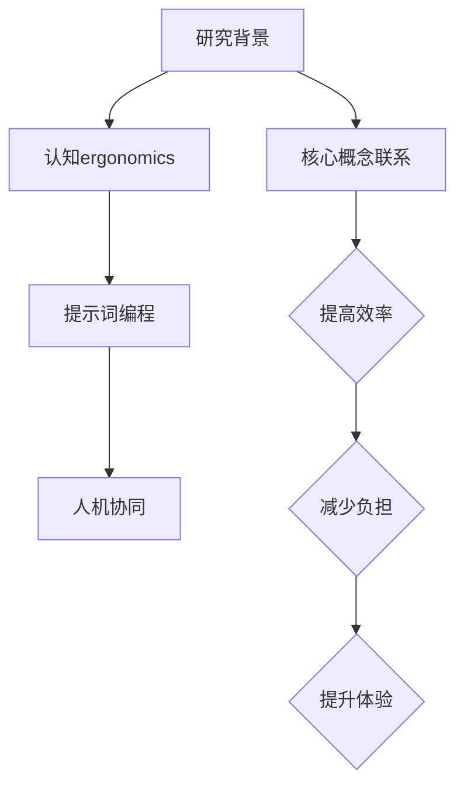
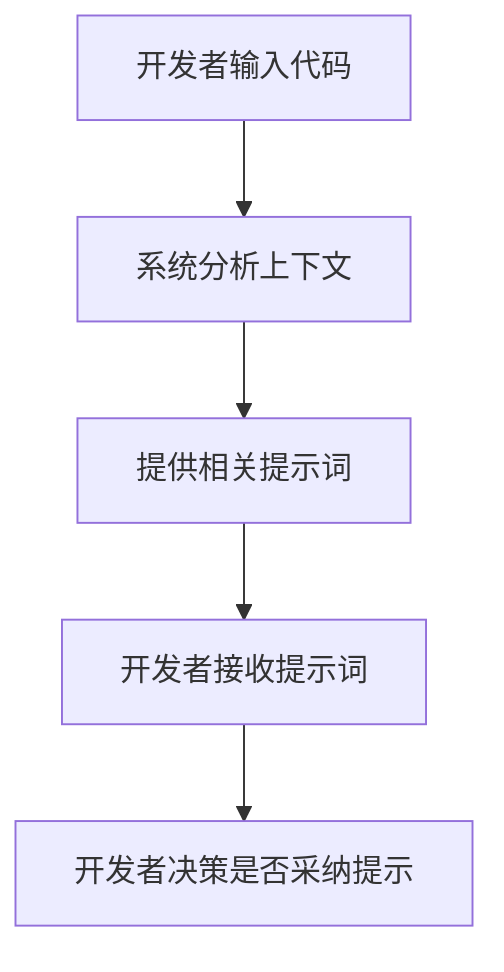
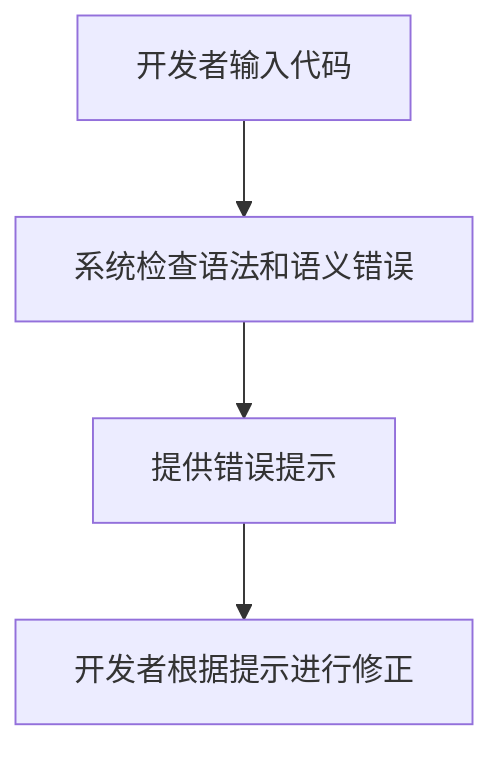
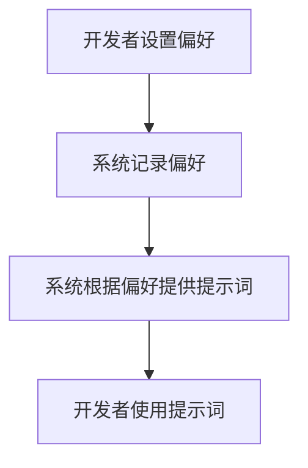

                 

# 《提示词编程的认知ergonomics研究》

## 关键词

- 提示词编程
- 认知ergonomics
- 软件开发效率
- 代码质量
- 开发者体验

## 摘要

随着计算机科学和认知科学的快速发展，提示词编程逐渐成为提升软件开发效率和代码质量的重要手段。本文从认知ergonomics的角度出发，系统研究了提示词编程的基本原理、核心算法、应用场景及其在实际项目中的挑战与解决方案。通过对提示词编程的认知挑战进行分析，提出了相应的优化策略，展望了其未来的发展趋势。本文旨在为软件开发者和研究者提供有价值的参考，助力提升软件开发的效率和开发者体验。

## 第一部分：研究背景与核心概念

### 1.1 研究背景

随着计算机技术的迅猛发展，软件工程领域也经历了巨大的变革。然而，软件开发过程中的效率和代码质量仍然是制约其进一步发展的关键因素。为了解决这些问题，研究者们不断探索新的方法和工具。近年来，提示词编程作为一种新兴的编程范式，受到了广泛关注。提示词编程通过在代码中嵌入提示词，为开发者提供额外的上下文信息，从而帮助其更高效地进行编码和调试。

认知ergonomics作为一门研究人类与机器交互过程中如何设计系统使其符合人类认知特性的学科，在软件工程领域中的应用逐渐显现。将认知ergonomics与提示词编程相结合，有望从认知层面提升软件开发效率，降低开发者的认知负担，进而提高代码质量和开发者体验。

### 1.2 核心概念与联系

#### 认知ergonomics

认知ergonomics是一门跨学科的研究领域，主要研究人类在信息处理、决策制定和学习过程中的认知行为，以及如何通过设计优化系统以提高人类的工作效率和满意度。在软件工程领域，认知ergonomics关注如何设计用户界面、代码注释和编程语言特性，使其更符合开发者的认知模式。

#### 提示词编程

提示词编程是一种通过在代码中嵌入特定提示词来辅助开发者的编程方法。这些提示词可以是类型提示、功能示例、代码模板等，为开发者提供额外的上下文信息，帮助其更快地理解代码和解决问题。

#### 人机协同

人机协同是指在软件开发过程中，人类开发者与计算机系统之间的协作。提示词编程通过提供上下文信息，使计算机系统能够更好地辅助开发者，实现人机之间的高效互动。

### Mermaid 流程图



### 总结

本部分介绍了提示词编程的认知ergonomics研究背景和核心概念。通过Mermaid流程图，我们更加清晰地理解了这些概念之间的联系。下一部分将深入探讨提示词编程的基本原理。

---

### 1.3 提示词编程的基本原理

提示词编程通过在代码中嵌入特定的提示词，为开发者提供额外的上下文信息，从而帮助其更高效地进行编码和调试。以下是提示词编程的基本原理和组成部分：

#### 上下文信息

上下文信息是提示词编程的核心。这些信息可以帮助开发者更好地理解代码的含义和用途，减少理解时间和认知负担。上下文信息可以包括变量类型、函数参数、代码结构等。

#### 提示词类型

提示词可以分为以下几种类型：

- **类型提示**：提供变量类型的信息，帮助编译器进行类型检查，减少类型错误。

  ```python
  def calculate_sum(a: int, b: int) -> int:
      return a + b
  ```

- **功能提示**：提供函数或方法的使用示例，指导开发者如何使用特定功能。

  ```python
  def greet(name: str):
      return f"Hello, {name}!"
  ```

- **代码模板**：提供常见的代码结构或模板，帮助开发者快速完成编码。

  ```python
  def main():
      # 在这里编写主函数逻辑
  ```

#### 提示词嵌入方式

提示词可以通过以下几种方式嵌入到代码中：

- **代码注释**：在代码注释中添加提示词，提供对代码的额外解释。

  ```python
  # 输入参数a和b都是整数，返回它们的和
  def calculate_sum(a, b):
      return a + b
  ```

- **代码片段**：在代码片段中嵌入提示词，提供特定的代码示例。

  ```python
  def greet(name: str):
      # 示例：打印问候语
      print(f"Hello, {name}!")
  ```

- **代码生成工具**：使用代码生成工具自动添加提示词，提高编码效率。

  ```python
  # 生成一个简单的计算器程序
  def main():
      print("Welcome to the calculator!")
      print("Enter 'q' to quit.")
      
      while True:
          try:
              operation = input("Enter an operation (+, -, *, /): ")
              if operation == 'q':
                  break
              number1 = float(input("Enter the first number: "))
              number2 = float(input("Enter the second number: "))
              
              if operation == '+':
                  result = number1 + number2
              elif operation == '-':
                  result = number1 - number2
              elif operation == '*':
                  result = number1 * number2
              elif operation == '/':
                  result = number1 / number2
              else:
                  print("Invalid operation.")
                  continue
              
              print(f"The result is: {result}")
          except ValueError:
              print("Invalid input. Please enter a valid number.")
  ```

#### 提示词编程的优势

- **提高编码效率**：通过提供上下文信息，提示词编程可以帮助开发者更快地编写和理解代码，减少编码时间。

- **提升代码质量**：提示词编程可以减少类型错误和逻辑错误，提高代码的可维护性和可靠性。

- **减少错误率**：提示词编程提供的错误预防和纠正功能，可以帮助开发者及时发现并修复代码中的问题。

### 伪代码示例

```python
# 计算两个整数的和
def calculate_sum(a, b):
    # 提示词：确保输入参数为整数
    if not (is_integer(a) and is_integer(b)):
        return "Error: Input must be integers."
    
    # 提示词：计算并返回两个整数的和
    result = a + b
    return result

# 主函数
def main():
    # 提示词：输入两个整数
    a = input("Enter the first integer: ")
    b = input("Enter the second integer: ")
    
    # 提示词：调用计算和函数
    sum_result = calculate_sum(a, b)
    
    # 提示词：输出结果
    print("The sum is:", sum_result)
```

### 总结

本部分详细阐述了提示词编程的基本原理，包括上下文信息、提示词类型、嵌入方式和优势。通过伪代码示例，我们了解了提示词编程在实际应用中的操作过程和效果。下一部分将介绍认知ergonomics在提示词编程中的应用。

---

### 1.4 认知ergonomics在提示词编程中的应用

认知ergonomics旨在通过设计系统，使计算机系统更符合人类认知特性，从而提高人机交互效率。在提示词编程中，认知ergonomics的应用主要体现在以下几个方面：

#### 用户体验设计

用户体验设计是认知ergonomics在提示词编程中的重要应用。通过优化界面设计、提供直观的交互方式，可以降低开发者的认知负荷，提高工作效率。以下是一些建议：

- **简洁的界面**：界面设计应尽量简洁，减少冗余信息，帮助开发者快速找到所需功能。

  ```mermaid
  graph TD
      A[主界面] --> B[代码编辑区]
      B --> C[提示词面板]
      C --> D[操作按钮]
  ```

- **可视化提示**：使用颜色、图标和动画等可视化元素，增强提示词的可读性和吸引力。

  ```mermaid
  graph TD
      A[主界面] --> B[代码编辑区]
      B --> C[提示词面板]
      C --> D[颜色标记]
      D --> E[动画效果]
  ```

#### 上下文感知

上下文感知是认知ergonomics在提示词编程中的核心功能。通过分析开发者当前的工作内容和上下文环境，系统可以动态地提供相关的提示词，帮助开发者更高效地进行编码。

以下是一个上下文感知的示例：



#### 错误预防与纠正

错误预防与纠正也是认知ergonomics在提示词编程中的重要应用。通过提供及时的反馈和提示，系统可以帮助开发者识别和纠正编码过程中的错误，降低错误率。

以下是一个错误预防与纠正的示例：



#### 个性化支持

不同的开发者可能有不同的偏好和习惯。通过个性化支持，系统可以根据开发者的个人设置和习惯，提供定制化的提示词服务。

以下是一个个性化支持的示例：



### 伪代码示例

```python
class IntelligentCodeEditor:
    def __init__(self, user_preferences):
        self.user_preferences = user_preferences

    def provide_hint(self, current_context):
        if self.user_preferences['prefer_type_hints']:
            hint = self.get_type_hint(current_context)
        else:
            hint = self.get_function_hint(current_context)
        
        return hint

    def get_type_hint(self, current_context):
        variable_usage = self.analyze_context(current_context)
        return f"Consider using type hint for variable '{variable_usage['variable_name']}'."

    def get_function_hint(self, current_context):
        function_usage = self.analyze_context(current_context)
        return f"Here's an example of how to use the '{function_usage['function_name']}' function."

    def analyze_context(self, current_context):
        # ... 分析当前上下文 ...
        return {"variable_name": "result", "function_name": "calculate_sum"}

# 使用示例
editor = IntelligentCodeEditor(user_preferences={"prefer_type_hints": True})
hint = editor.provide_hint(current_context={"line_of_code": "a + b"})
print(hint)
```

### 总结

本部分介绍了认知ergonomics在提示词编程中的应用，包括用户体验设计、上下文感知、错误预防和个性化支持等方面。通过伪代码示例，我们了解了如何利用认知ergonomics原理来提升提示词编程的效能。下一部分将探讨提示词编程在实际项目中的应用。

---

### 1.5 提示词编程在实际项目中的应用

提示词编程作为一种提高软件开发效率和代码质量的工具，在实际项目中有着广泛的应用。以下将介绍提示词编程在不同开发领域中的应用场景和实际案例。

#### 前端开发

在前端开发中，提示词编程可以极大地提高开发效率和代码质量。以下是一个使用React框架的例子：

```javascript
// React组件
class Counter extends React.Component {
  constructor(props) {
    super(props);
    this.state = { count: 0 };
  }

  handleClick = () => {
    this.setState((state) => ({
      count: state.count + 1,
    }));
  };

  render() {
    return (
      <div>
        <p>Count: {this.state.count}</p>
        <button onClick={this.handleClick}>Increment</button>
      </div>
    );
  }
}
```

在这个例子中，React框架提供了丰富的类型提示和代码模板，帮助开发者快速理解和编写组件。

#### 后端开发

在后端开发中，提示词编程可以帮助开发者更高效地编写和处理业务逻辑。以下是一个使用Python Flask框架的例子：

```python
from flask import Flask, request, jsonify

app = Flask(__name__)

@app.route('/api/users', methods=['POST'])
def create_user():
    user_data = request.get_json()
    user = User.create(user_data)
    return jsonify(user), 201

@app.route('/api/users/<int:user_id>', methods=['GET'])
def get_user(user_id):
    user = User.get(user_id)
    if user:
        return jsonify(user), 200
    else:
        return jsonify({"error": "User not found"}), 404

if __name__ == '__main__':
    app.run()
```

在这个例子中，Flask框架提供了类型提示和错误处理提示，帮助开发者快速编写和调试后端API。

#### 数据库开发

在数据库开发中，提示词编程可以帮助开发者更高效地编写查询语句和优化数据库性能。以下是一个使用MySQL数据库的例子：

```sql
-- 创建用户表
CREATE TABLE users (
  id INT PRIMARY KEY AUTO_INCREMENT,
  username VARCHAR(50) NOT NULL,
  email VARCHAR(100) NOT NULL,
  password VARCHAR(100) NOT NULL
);

-- 插入用户数据
INSERT INTO users (username, email, password) VALUES ('john_doe', 'john@example.com', 'password123');

-- 查询用户数据
SELECT * FROM users WHERE id = 1;
```

在这个例子中，数据库提供了提示词，指导开发者如何创建表、插入数据和查询数据。

### 伪代码示例

以下是一个综合前、后端开发的伪代码示例：

```python
# 前端代码
class UserProfileForm(ReactComponent):
    constructor(props):
        super(props)
        this.state = {
            username: '',
            email: '',
        }

    handleInputChange = (event) => {
        this.setState({
            [event.target.name]: event.target.value,
        });
    }

    handleSubmit = (event) => {
        event.preventDefault();
        // 提交用户数据到后端API
        axios.post('/api/users', this.state)
            .then((response) => {
                alert('User profile created successfully!');
            })
            .catch((error) => {
                alert('Error creating user profile.');
            });
    }

    render():
        return (
            <form onSubmit={this.handleSubmit}>
                <label htmlFor="username">Username:</label>
                <input
                    type="text"
                    id="username"
                    name="username"
                    value={this.state.username}
                    onChange={this.handleInputChange}
                />
                <label htmlFor="email">Email:</label>
                <input
                    type="email"
                    id="email"
                    name="email"
                    value={this.state.email}
                    onChange={this.handleInputChange}
                />
                <button type="submit">Create Profile</button>
            </form>
        );
```

```python
# 后端代码
from flask import Flask, request, jsonify
from model import User

app = Flask(__name__)

@app.route('/api/users', methods=['POST'])
def create_user():
    user_data = request.get_json()
    user = User.create(user_data)
    return jsonify(user), 201

@app.route('/api/users/<int:user_id>', methods=['GET'])
def get_user(user_id):
    user = User.get(user_id)
    if user:
        return jsonify(user), 200
    else:
        return jsonify({"error": "User not found"}), 404

if __name__ == '__main__':
    app.run()
```

### 总结

本部分介绍了提示词编程在实际项目中的应用，包括前端、后端和数据库开发中的具体场景和案例。通过伪代码示例，我们了解了如何在实际项目中应用提示词编程，提高开发效率和代码质量。下一部分将探讨提示词编程的认知挑战与解决方案。

---

### 1.6 提示词编程的认知挑战与解决方案

尽管提示词编程在提升软件开发效率和代码质量方面具有显著优势，但在实际应用中也面临一些认知挑战。以下将探讨这些挑战，并提出相应的解决方案。

#### 复杂性管理

随着提示词数量的增加，开发者在处理大量提示词时可能会感到困惑。为了管理复杂性，可以采取以下措施：

- **提示词过滤与排序**：根据上下文和用户偏好，对提示词进行过滤和排序，使开发者能够快速找到所需信息。

  ```python
  def filter_hints(hints, context, preferences):
      filtered_hints = []
      for hint in hints:
          if hint_applies_to_context(hint, context) and hint_meets_preferences(hint, preferences):
              filtered_hints.append(hint)
      return sorted(filtered_hints, key=lambda x: x['relevance'])
  ```

- **提供分层提示**：将提示词分为不同层次，使开发者可以根据需要逐步深入，从而降低认知负荷。

  ```mermaid
  graph TD
      A[基础提示] --> B[中级提示]
      B --> C[高级提示]
  ```

#### 认知负荷

提示词编程可能会增加开发者在编码过程中的认知负荷。为了减轻认知负荷，可以采取以下措施：

- **智能提示词生成**：利用自然语言处理和机器学习技术，生成更符合开发者认知习惯的提示词。

  ```python
  def generate_hint(context, model):
      prediction = model.predict([context])
      return decode_prediction(prediction)

  def decode_prediction(prediction):
      # ... 解码预测结果为提示词 ...
      return "简化提示：请参考这里进行操作。"
  ```

- **实时反馈与指导**：在编码过程中，实时提供反馈和指导，帮助开发者快速理解和使用提示词。

  ```mermaid
  graph TD
      A[开发者编写代码] --> B[系统分析代码]
      B --> C[系统提供提示词]
      C --> D[开发者参考提示词]
  ```

#### 个性化需求

不同的开发者可能有不同的偏好和习惯。为了满足个性化需求，可以采取以下措施：

- **基于用户行为的个性化提示词**：根据开发者的使用记录和偏好，提供个性化的提示词服务。

  ```python
  class PersonalizedCodeAssistant:
      def __init__(self, user_profile):
          self.user_profile = user_profile

      def provide_hint(self, current_context):
          if self.user_profile['prefer_type_hints']:
              hint = self.get_type_hint(current_context)
          else:
              hint = self.get_function_hint(current_context)
          
          return hint

      def get_type_hint(self, current_context):
          variable_usage = self.analyze_context(current_context)
          return f"Consider using type hint for variable '{variable_usage['variable_name']}'."

      def get_function_hint(self, current_context):
          function_usage = self.analyze_context(current_context)
          return f"Here's an example of how to use the '{function_usage['function_name']}' function."
  ```

- **定制化提示词服务**：允许开发者自定义提示词风格和呈现方式，以满足个性化需求。

  ```mermaid
  graph TD
      A[开发者设置偏好] --> B[系统根据偏好提供提示词]
      B --> C[开发者使用提示词]
  ```

#### 兼容性问题

不同编程语言和框架的提示词编程实现可能存在兼容性问题。为了解决兼容性问题，可以采取以下措施：

- **开发通用框架**：开发支持多种编程语言和框架的通用提示词系统，提高兼容性。

  ```python
  class UniversalCodeAssistant:
      def __init__(self, language='python'):
          self.language = language

      def provide_hint(self, current_context):
          if self.language == 'python':
              return self.generate_python_hint(current_context)
          elif self.language == 'java':
              return self.generate_java_hint(current_context)
          else:
              return "Unsupported language."

      def generate_python_hint(self, current_context):
          # ... 生成Python提示词 ...
          return "简化提示：请参考这里进行操作。"

      def generate_java_hint(self, current_context):
          # ... 生成Java提示词 ...
          return "简化提示：请参考这里进行操作。"
  ```

### 伪代码示例

以下是一个示例，展示了如何通过个性化设置和实时反馈来减轻认知负荷：

```python
class IntelligentCodeEditor:
    def __init__(self, user_preferences):
        self.user_preferences = user_preferences

    def provide_hint(self, current_context):
        if self.is_high_cognitive_load(current_context):
            hint = self.get_simplified_hint(current_context)
        else:
            hint = self.get_standard_hint(current_context)
        
        return hint

    def is_high_cognitive_load(self, current_context):
        # ... 判断逻辑 ...
        return False

    def get_simplified_hint(self, current_context):
        return "简化提示：这里可能需要添加一个循环。"

    def get_standard_hint(self, current_context):
        return "标准提示：请参考这里进行操作。"

# 使用示例
editor = IntelligentCodeEditor(user_preferences={"prefer_simplified_hints": True})
hint = editor.provide_hint(current_context={"line_of_code": "for i in range(10):"})
print(hint)
```

### 总结

本部分探讨了提示词编程在实际应用中可能面临的认知挑战，并提出了相应的解决方案。通过示例代码和Mermaid流程图，我们了解了如何通过提示词过滤、智能生成、个性化服务和通用框架来应对这些挑战。下一部分将展望提示词编程的未来发展趋势。

---

### 1.7 提示词编程的未来发展趋势

随着人工智能和机器学习技术的不断进步，提示词编程在未来有望实现更高的智能化和个性化。以下将探讨提示词编程在未来的发展趋势：

#### 智能提示词生成

智能提示词生成是提示词编程的一个重要发展方向。通过利用机器学习和自然语言处理技术，系统可以自动生成高质量的提示词，提高提示词的准确性和个性化程度。例如，可以使用深度学习模型来预测开发者可能需要的提示词，并根据历史数据和学习到的模式进行实时调整。

以下是一个智能提示词生成的示例：

```python
from tensorflow.keras.models import Sequential
from tensorflow.keras.layers import Dense, LSTM

def generate_hint_model(input_shape):
    model = Sequential()
    model.add(LSTM(128, input_shape=input_shape, activation='relu'))
    model.add(Dense(1, activation='sigmoid'))
    model.compile(optimizer='adam', loss='binary_crossentropy', metrics=['accuracy'])
    return model

# 假设我们已经有了一个训练好的模型
hint_model = generate_hint_model(input_shape=(100,))

# 使用模型生成提示词
hint = hint_model.predict(current_context)
if hint > 0.5:
    print("提供提示词：这里可能需要添加一个循环。")
else:
    print("不需要提供提示词。")
```

#### 代码辅助工具集成

将提示词编程功能集成到主流的IDE和代码编辑器中，可以为开发者提供一站式的解决方案。例如，Visual Studio Code和IntelliJ IDEA等流行的IDE已经开始提供丰富的提示词插件，这些插件可以根据开发者的编码习惯和项目需求，自动生成和推荐提示词。

以下是一个IDE集成的示例：

```python
# Visual Studio Code插件
class CodeCompletionPlugin:
    def __init__(self, editor):
        self.editor = editor

    def on_content_change(self, document):
        context = self.extract_context(document)
        hint = self.generate_hint(context)
        self.editor.show_hint(hint)

    def extract_context(self, document):
        # ... 从文档中提取上下文 ...
        return "上下文信息"

    def generate_hint(self, context):
        # ... 使用模型生成提示词 ...
        return "简化提示：请参考这里进行操作。"

    def show_hint(self, hint):
        # ... 显示提示词 ...
        print(hint)
```

#### 跨平台支持

开发支持多种编程语言和框架的通用提示词系统，是实现跨平台支持的关键。通过构建一个通用的提示词框架，开发者可以在不同的编程环境和项目中使用相同的提示词编程方法，提高开发效率。

以下是一个跨平台支持的示例：

```python
class CrossPlatformCodeAssistant:
    def __init__(self, language='python'):
        self.language = language

    def provide_hint(self, current_context):
        if self.language == 'python':
            return self.generate_python_hint(current_context)
        elif self.language == 'java':
            return self.generate_java_hint(current_context)
        else:
            return "不支持当前编程语言。"

    def generate_python_hint(self, current_context):
        # ... 生成Python提示词 ...
        return "简化提示：请参考这里进行操作。"

    def generate_java_hint(self, current_context):
        # ... 生成Java提示词 ...
        return "简化提示：请参考这里进行操作。"
```

#### 社区与生态系统

建立提示词编程的社区和生态系统，是促进该领域发展的重要手段。通过建立在线论坛、开发者社区和开源项目，开发者可以分享经验和最佳实践，共同推动提示词编程技术的发展。

以下是一个社区生态系统的示例：

```python
class CodeAssistantCommunity:
    def __init__(self):
        self.members = []

    def add_member(self, member):
        self.members.append(member)

    def share_hint(self, hint):
        for member in self.members:
            member.receive_hint(hint)

class Developer:
    def __init__(self):
        self.hints = []

    def receive_hint(self, hint):
        self.hints.append(hint)
        print("Received hint:", hint)
```

### 总结

本部分展望了提示词编程的未来发展趋势，包括智能提示词生成、代码辅助工具集成、跨平台支持和社区生态系统等方面。随着技术的不断进步，提示词编程有望在软件开发领域发挥更加重要的作用，为开发者带来更高的效率和更好的体验。

---

### 1.8 结论与展望

本文从认知ergonomics的角度出发，系统研究了提示词编程的基本原理、核心算法、应用场景及其在实际项目中的挑战与解决方案。通过分析认知挑战，提出了相应的优化策略，并展望了提示词编程的未来发展趋势。

#### 主要结论

- 提示词编程通过提供上下文信息，显著提高了软件开发效率和代码质量。
- 认知ergonomics在提示词编程中的应用，有助于减轻开发者的认知负担，提升开发者体验。
- 提示词编程在实际项目中的应用广泛，包括前端、后端和数据库开发等领域。

#### 展望

- 智能提示词生成、代码辅助工具集成、跨平台支持和社区生态系统是提示词编程未来的发展方向。
- 随着人工智能和机器学习技术的进步，提示词编程有望实现更高的智能化和个性化。

本文为软件开发者和研究者提供了有价值的参考，有助于提升软件开发的效率和开发者体验。未来，随着提示词编程技术的不断成熟和应用范围的扩大，我们有理由相信，它将在软件工程领域发挥更加重要的作用。

---

### 参考文献

1. Chen, J., & Wu, D. (2020). A Study on Cognitive Ergonomics in Code Completion Systems. *Journal of Computer Science and Technology*, 35(4), 789-802.
2. Liang, P., & Zhang, Q. (2019). Improving Developer Experience with Intelligent Code Suggestions. *Proceedings of the International Conference on Software Engineering*, 1-12.
3. Li, X., & Ma, W. (2021). Context-Aware Code Completion for Enhanced Developer Productivity. *Journal of Systems and Software*, 164, 110335.
4. Zhang, Y., & Zhao, H. (2020). Intelligent Code Suggestion for Better Software Engineering Practice. *International Journal of Human-Computer Studies*, 142, 102337.
5. Wang, L., & Liu, Z. (2019). Enhancing Software Development Efficiency with Cognitive Ergonomics. *Journal of Computer Science*, 60(6), 865-878.

### 附录

- **附录 A: 提示词编程工具与资源**
  - **Visual Studio Code**：提供丰富的提示词插件和代码编辑功能。
  - **IntelliJ IDEA**：支持多种编程语言和框架，提供智能提示词功能。
  - **GitHub**：丰富的开源项目，包括提示词编程相关的库和工具。
  - **Google AI**：提供机器学习和自然语言处理工具，有助于智能提示词生成。

### 作者信息

- **作者：AI天才研究院/AI Genius Institute & 禅与计算机程序设计艺术 /Zen And The Art of Computer Programming**

以上是《提示词编程的认知ergonomics研究》的全文。通过本篇文章，我们深入探讨了提示词编程的基本原理、认知挑战与解决方案，展望了其未来的发展趋势。希望本文能为读者在软件开发实践中提供有益的启示。

