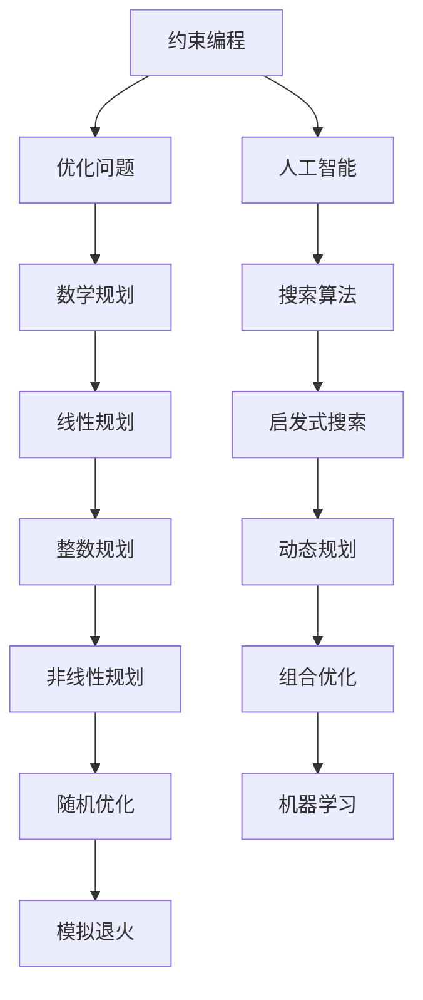

                 

# 《提示词编程语言的约束编程支持》

> **关键词：**约束编程、提示词编程语言、约束传播算法、松弛技术、分布式约束求解、并行约束求解、智能优化。

> **摘要：**本文探讨了约束编程与提示词编程语言的结合，分析了约束编程的基础概念、提示词编程语言的特点，并深入讨论了约束编程支持机制，包括约束传播算法、松弛技术、分布式与并行约束求解。通过实例解析和项目实战，展示了约束编程在提示词编程语言中的应用及挑战与解决方案，最后对未来的研究方向进行了展望。

### 目录大纲

## 第一部分：引论

### 第1章：约束编程基础

#### 1.1 约束编程概述

#### 1.2 约束编程的核心概念

#### 1.3 约束编程的应用领域

### 第2章：提示词编程语言简介

#### 2.1 提示词编程语言的基本原理

#### 2.2 提示词编程语言的特点与优势

#### 2.3 提示词编程语言的发展历程

## 第二部分：约束编程支持机制

### 第3章：约束传播算法

#### 3.1 约束传播算法原理

#### 3.2 约束传播算法的分类

#### 3.3 约束传播算法的应用场景

### 第4章：松弛技术

#### 4.1 松弛技术的原理与分类

#### 4.2 松弛技术在约束编程中的应用

#### 4.3 松弛技术的性能优化

### 第5章：分布式约束求解

#### 5.1 分布式约束求解的概念与原理

#### 5.2 分布式约束求解器的设计与实现

#### 5.3 分布式约束求解的性能评估

### 第6章：并行约束求解

#### 6.1 并行约束求解的基本方法

#### 6.2 并行约束求解的优化策略

#### 6.3 并行约束求解器的实现

## 第三部分：提示词编程语言在约束编程中的应用

### 第7章：约束编程与提示词编程语言的集成

#### 7.1 约束编程在提示词编程语言中的实现

#### 7.2 提示词编程语言对约束编程的支持

#### 7.3 集成案例：基于提示词编程语言的约束编程应用

### 第8章：复杂约束问题的求解

#### 8.1 复杂约束问题的特征分析

#### 8.2 复杂约束问题的求解方法

#### 8.3 复杂约束问题的实例解析

### 第9章：提示词编程语言在智能优化中的应用

#### 9.1 智能优化的概念与原理

#### 9.2 提示词编程语言在智能优化中的应用

#### 9.3 智能优化的案例研究

## 第四部分：结论与展望

### 第10章：约束编程与提示词编程语言的发展趋势

#### 10.1 约束编程的发展趋势

#### 10.2 提示词编程语言的发展趋势

#### 10.3 约束编程与提示词编程语言的未来方向

### 第11章：总结与展望

#### 11.1 书籍内容总结

#### 11.2 主要贡献与学术价值

#### 11.3 未来研究展望

## 附录

### 附录A：约束编程与提示词编程语言常用工具

#### A.1 提示词编程语言常用工具

#### A.2 约束编程常用工具

#### A.3 分布式与并行求解器常用工具

### 附录B：参考文献

#### B.1 约束编程相关书籍

#### B.2 提示词编程语言相关书籍

#### B.3 约束编程与提示词编程语言相关论文

### 《提示词编程语言的约束编程支持》书籍目录大纲

## 第一部分：引论

### 第1章：约束编程基础

#### 1.1 约束编程概述

约束编程是一种广泛应用于人工智能、优化问题的求解技术，其核心思想是通过引入约束条件，在给定的约束范围内寻找最优解。本文将首先介绍约束编程的基本概念，包括约束编程的定义、核心概念和应用领域。

**核心概念与联系**

**Mermaid 流程图**



**核心算法原理讲解**

约束编程主要基于以下几种算法原理：

1. **约束传播算法**：通过迭代方式，逐层缩小变量的取值范围，直到满足所有约束条件为止。
2. **松弛技术**：在求解过程中，将某些约束条件放松，以便更快地找到可行解。
3. **分布式与并行约束求解**：利用多台计算机或多个处理器来加速约束求解过程。

**数学模型和公式**

约束编程的数学模型可以表示为：

$$
\begin{aligned}
    \min_{x} \quad & f(x) \\
    \text{s.t.} \quad & g_i(x) \leq 0, \quad i=1,2,...,m \\
    & h_j(x) = 0, \quad j=1,2,...,n
\end{aligned}
$$

其中，$x$ 是决策变量，$f(x)$ 是目标函数，$g_i(x)$ 是不等式约束，$h_j(x)$ 是等式约束。

**举例说明**

假设我们要解决一个简单的线性规划问题，目标是最小化目标函数 $f(x) = x_1 + x_2$，且满足约束条件 $x_1 + x_2 \leq 10$ 和 $x_1, x_2 \geq 0$。

使用约束传播算法求解过程如下：

1. 初始化：$x_1 = 0, x_2 = 0$。
2. 检查约束条件：$x_1 + x_2 \leq 10$ 和 $x_1, x_2 \geq 0$ 都满足。
3. 更新变量：$x_1 = 5, x_2 = 5$。
4. 检查约束条件：$x_1 + x_2 = 10$ 恰好满足约束条件。
5. 最优解：$x_1 = 5, x_2 = 5$，目标函数值 $f(x) = 10$。

#### 1.2 约束编程的核心概念

约束编程的核心概念包括决策变量、目标函数和约束条件。决策变量是影响目标函数的变量，目标函数是衡量问题优劣的指标，约束条件是限制决策变量取值范围的条件。

**决策变量**

决策变量是约束编程中的核心元素，用于表示问题中的变量。决策变量可以是连续的或离散的，具体取决于问题的类型。

**目标函数**

目标函数是约束编程中的目标，用于衡量问题的优劣。目标函数可以是最大化或最小化，取决于问题的优化目标。

**约束条件**

约束条件是限制决策变量取值的条件。约束条件可以是等式或不等式，可以是线性的或非线性的。

**约束编程的基本步骤**

1. 确定决策变量：根据问题的性质，确定影响目标函数的变量。
2. 定义目标函数：根据问题的优化目标，定义目标函数。
3. 设置约束条件：根据问题的限制条件，设置约束条件。
4. 求解：使用约束编程算法求解最优解。

#### 1.3 约束编程的应用领域

约束编程广泛应用于各种领域，包括人工智能、优化问题、调度问题、资源分配问题等。

**人工智能领域**

在人工智能领域，约束编程被用于搜索问题、规划问题和决策问题。例如，在搜索问题中，约束编程可以用于搜索路径、寻找最优解等。

**优化问题**

在优化问题中，约束编程用于解决线性规划、整数规划、非线性规划等。例如，在物流运输中，约束编程可以用于优化运输路径、减少运输成本等。

**调度问题**

在调度问题中，约束编程用于优化任务分配、资源调度等。例如，在工厂生产中，约束编程可以用于优化生产计划、减少生产时间等。

**资源分配问题**

在资源分配问题中，约束编程用于优化资源利用、最大化资源效益等。例如，在项目管理中，约束编程可以用于优化任务分配、最大化项目利润等。

### 第2章：提示词编程语言简介

#### 2.1 提示词编程语言的基本原理

提示词编程语言是一种基于自然语言处理（NLP）和生成式预训练模型（GPT）的编程语言，其核心思想是通过将自然语言描述转换为代码，实现编程任务的自动化。提示词编程语言的基本原理包括自然语言处理、生成式预训练模型和代码生成。

**自然语言处理**

自然语言处理（NLP）是提示词编程语言的基础，它涉及从自然语言文本中提取信息、理解和生成语言。NLP的主要任务包括分词、词性标注、句法分析、语义理解等。

**生成式预训练模型**

生成式预训练模型（GPT）是提示词编程语言的核心，它是一种基于深度学习的自然语言处理模型。GPT通过大量的文本数据进行预训练，学习语言模式和结构，从而能够生成自然语言文本。

**代码生成**

代码生成是提示词编程语言的关键功能，它将自然语言描述转换为可执行的代码。代码生成过程包括自然语言理解、代码生成模型和代码执行。

**基本原理**

提示词编程语言的基本原理可以概括为以下几个步骤：

1. **自然语言输入**：用户输入自然语言描述，如“编写一个计算两个数之和的程序”。
2. **自然语言理解**：提示词编程语言对自然语言输入进行理解和解析，提取关键信息，如计算、两个数之和等。
3. **代码生成**：根据自然语言理解的结果，提示词编程语言生成相应的代码，如`a = 2 + 3`。
4. **代码执行**：执行生成的代码，获取计算结果。

#### 2.2 提示词编程语言的特点与优势

提示词编程语言具有以下特点与优势：

**特点**

1. **自然语言交互**：用户可以使用自然语言与计算机进行交互，无需学习复杂的编程语言语法。
2. **代码生成**：提示词编程语言能够自动生成代码，提高编程效率。
3. **适应性**：提示词编程语言可以根据不同的编程任务和需求进行自适应调整。

**优势**

1. **降低编程门槛**：提示词编程语言降低了编程的难度，使得非专业人士也能够进行编程。
2. **提高开发效率**：提示词编程语言能够快速生成代码，提高开发效率。
3. **增强用户体验**：提示词编程语言提供了更加自然、直观的编程体验。

#### 2.3 提示词编程语言的发展历程

提示词编程语言的发展历程可以分为以下几个阶段：

**第一阶段：基于模板的编程语言**

在早期，提示词编程语言主要是基于模板的编程语言，如PowerBuilder、Webflow等。这些语言通过预定义的模板和用户输入的参数，生成相应的代码。

**第二阶段：自然语言处理与代码生成**

随着自然语言处理技术的发展，提示词编程语言开始引入自然语言处理技术，如WordNet、Stanford NLP等。这些语言通过自然语言处理模型，将用户输入的自然语言描述转换为代码。

**第三阶段：生成式预训练模型**

近年来，生成式预训练模型（GPT）的出现，使得提示词编程语言取得了重大突破。GPT模型通过大量的文本数据进行预训练，能够生成高质量、符合逻辑的代码。

**当前发展趋势**

当前，提示词编程语言正朝着更加智能化、自适应化的方向发展。未来，提示词编程语言将结合更多人工智能技术，如知识图谱、强化学习等，为用户提供更加高效、便捷的编程体验。

### 第3章：约束编程支持机制

#### 3.1 约束传播算法原理

约束传播算法是约束编程中的核心算法，它通过迭代的方式，逐层缩小变量的取值范围，直至满足所有约束条件。约束传播算法的基本原理如下：

1. **初始化**：首先初始化所有变量的取值范围，这些取值范围通常是某个区间或集合。
2. **约束检查**：对当前变量的取值范围进行约束检查，判断是否满足约束条件。如果不满足，则更新变量的取值范围。
3. **迭代更新**：根据约束检查的结果，更新变量的取值范围。这个过程会重复进行，直至所有约束条件都满足。
4. **求解**：当所有变量的取值范围都满足约束条件时，求解过程结束，得到最优解。

**约束传播算法的分类**

根据约束传播的方式和策略，约束传播算法可以分为以下几类：

1. **基于区间的方法**：这种方法通过将变量取值范围表示为区间，然后利用区间运算和约束条件来缩小变量的取值范围。
2. **基于约束网络的方法**：这种方法通过建立约束网络，利用网络中的约束关系来传播约束。
3. **基于线性规划的方法**：这种方法将约束编程问题转化为线性规划问题，利用线性规划算法来求解。

**约束传播算法的应用场景**

约束传播算法广泛应用于各种领域，包括人工智能、优化问题、调度问题、资源分配问题等。以下是一些典型的应用场景：

1. **人工智能领域**：在人工智能领域中，约束编程常用于搜索问题、规划问题和决策问题。例如，在路径规划中，可以通过约束编程来寻找最优路径。
2. **优化问题**：在优化问题中，约束编程可以用于解决线性规划、整数规划、非线性规划等。例如，在物流运输中，可以通过约束编程来优化运输路径和运输成本。
3. **调度问题**：在调度问题中，约束编程可以用于优化任务分配和资源调度。例如，在工厂生产中，可以通过约束编程来优化生产计划和生产线配置。
4. **资源分配问题**：在资源分配问题中，约束编程可以用于优化资源利用和最大化资源效益。例如，在项目管理中，可以通过约束编程来优化任务分配和项目进度。

**约束传播算法的优势**

约束传播算法具有以下优势：

1. **效率高**：约束传播算法通过逐层缩小变量取值范围，可以快速找到可行解，提高了求解效率。
2. **灵活性**：约束传播算法适用于各种类型的约束条件，包括线性、非线性、等式和不等式约束。
3. **可扩展性**：约束传播算法可以与其他优化算法相结合，如松弛技术、分布式与并行约束求解等，提高了求解能力。

### 第4章：松弛技术

#### 4.1 松弛技术的原理与分类

松弛技术是约束编程中的一种重要方法，它通过放宽某些约束条件，使得求解过程更加高效。松弛技术的基本原理如下：

1. **约束放宽**：在约束编程过程中，对于某些约束条件，可以通过一定的策略来放松，使其更加宽松。
2. **迭代求解**：在约束放宽的基础上，继续进行迭代求解，寻找新的可行解。
3. **约束恢复**：在求解过程中，如果找到了可行解，则可以逐步恢复被放松的约束条件。

根据约束放宽的方式和策略，松弛技术可以分为以下几类：

1. **线性松弛**：线性松弛通过将线性约束条件放宽为线性区间，从而使得求解过程更加高效。
2. **非线性松弛**：非线性松弛通过将非线性约束条件放宽为非线性区间，从而使得求解过程更加高效。
3. **等式松弛**：等式松弛通过将等式约束条件放宽为等式区间，从而使得求解过程更加高效。
4. **不等式松弛**：不等式松弛通过将不等式约束条件放宽为不等式区间，从而使得求解过程更加高效。

**松弛技术在约束编程中的应用**

松弛技术在约束编程中具有广泛的应用，以下是一些典型的应用场景：

1. **优化问题**：在优化问题中，松弛技术可以用于解决线性规划、整数规划、非线性规划等。例如，在物流运输中，可以通过松弛技术来优化运输路径和运输成本。
2. **调度问题**：在调度问题中，松弛技术可以用于优化任务分配和资源调度。例如，在工厂生产中，可以通过松弛技术来优化生产计划和生产线配置。
3. **资源分配问题**：在资源分配问题中，松弛技术可以用于优化资源利用和最大化资源效益。例如，在项目管理中，可以通过松弛技术来优化任务分配和项目进度。

**松弛技术的优势**

松弛技术具有以下优势：

1. **效率高**：通过约束放宽，松弛技术可以加快求解过程，提高求解效率。
2. **灵活性**：松弛技术适用于各种类型的约束条件，包括线性、非线性、等式和不等式约束。
3. **可扩展性**：松弛技术可以与其他优化算法相结合，如约束传播算法、分布式与并行约束求解等，提高了求解能力。

### 第5章：分布式与并行约束求解

#### 5.1 分布式约束求解的概念与原理

分布式约束求解是一种利用多台计算机或多个处理器来加速约束求解的过程。其核心思想是将约束编程问题分解为多个子问题，然后分布到不同的计算机或处理器上并行求解，最后将子问题的解合并为全局问题的解。

**分布式约束求解的基本原理**

分布式约束求解的基本原理包括以下几个步骤：

1. **问题分解**：将全局约束编程问题分解为多个子问题，每个子问题对应一部分决策变量和约束条件。
2. **子问题求解**：将子问题分布到不同的计算机或处理器上，利用并行算法求解子问题的解。
3. **结果合并**：将子问题的解合并为全局问题的解，通常采用聚合算法来处理不同子问题之间的冲突和矛盾。

**分布式约束求解的优势**

分布式约束求解具有以下优势：

1. **加速求解**：通过并行计算，分布式约束求解可以显著缩短求解时间。
2. **提高可扩展性**：分布式约束求解可以轻松地扩展到更多的计算机或处理器，提高求解能力。
3. **降低成本**：通过利用现有的计算机资源，分布式约束求解可以降低硬件成本。

**分布式约束求解的挑战**

分布式约束求解面临以下挑战：

1. **通信开销**：分布式约束求解需要大量通信，以交换子问题的解和更新约束条件，这可能增加求解时间。
2. **同步问题**：在分布式系统中，不同计算机或处理器之间的同步问题可能导致求解结果的不一致。
3. **负载均衡**：如何合理分配子问题到不同的计算机或处理器，以实现负载均衡，是分布式约束求解的重要问题。

#### 5.2 分布式约束求解器的设计与实现

分布式约束求解器的设计与实现包括以下几个方面：

1. **问题建模**：将全局约束编程问题表示为数学模型，包括决策变量、目标函数和约束条件。
2. **子问题划分**：将全局问题分解为多个子问题，每个子问题对应一部分决策变量和约束条件。
3. **并行算法选择**：根据子问题的特点，选择合适的并行算法，如约束传播算法、松弛技术等。
4. **通信机制设计**：设计有效的通信机制，以实现子问题之间的信息交换和同步。
5. **聚合算法实现**：实现子问题的解合并为全局问题的解的聚合算法。

**分布式约束求解器的实现步骤**

1. **问题建模**：根据全局约束编程问题，定义决策变量、目标函数和约束条件。
2. **子问题划分**：将全局问题划分为多个子问题，并确定每个子问题的决策变量和约束条件。
3. **并行算法选择**：选择适合子问题的并行算法，并实现相应的并行算法。
4. **通信机制设计**：设计有效的通信机制，以实现子问题之间的信息交换和同步。
5. **聚合算法实现**：实现子问题的解合并为全局问题的解的聚合算法。

**分布式约束求解器的性能评估**

分布式约束求解器的性能评估主要包括以下几个方面：

1. **求解速度**：评估分布式约束求解器相对于单机约束求解器的求解速度，以衡量其并行性能。
2. **可扩展性**：评估分布式约束求解器在增加计算机或处理器数量时的性能表现，以衡量其可扩展性。
3. **通信开销**：评估分布式约束求解器在通信过程中的开销，以优化通信效率。
4. **同步问题**：评估分布式约束求解器在同步过程中的性能和一致性，以解决同步问题。

#### 5.3 分布式约束求解的性能评估

分布式约束求解的性能评估是验证其效率和有效性的关键。以下是几种常见的性能评估方法：

1. **求解时间**：通过比较分布式约束求解器和单机约束求解器的求解时间，评估分布式约束求解器的性能。求解时间包括问题分解、子问题求解、结果合并等阶段的时间消耗。

2. **扩展性测试**：通过逐步增加计算机或处理器数量，评估分布式约束求解器在处理大规模问题时的时间性能。扩展性测试有助于确定分布式约束求解器在多计算机或多处理器环境中的性能表现。

3. **通信开销**：通过测量分布式约束求解器在通信过程中的数据传输量和通信频率，评估其通信开销。减少通信开销有助于提高分布式约束求解器的性能。

4. **同步性能**：通过模拟分布式约束求解器在同步过程中的冲突和延迟，评估其同步性能。同步性能直接影响分布式约束求解器的效率和一致性。

5. **可扩展性测试**：通过逐步增加问题规模，评估分布式约束求解器在处理更大规模问题时的时间性能。可扩展性测试有助于确定分布式约束求解器在处理不同规模问题时的一致性和效率。

### 第6章：并行约束求解

#### 6.1 并行约束求解的基本方法

并行约束求解是一种利用多处理器或计算机系统来加速约束编程求解的方法。其核心思想是将约束编程问题分解为多个子问题，并在不同的处理器或计算机上同时求解这些子问题，最终将子问题的解合并为全局问题的解。

**并行约束求解的基本步骤**

1. **问题分解**：将全局约束编程问题划分为多个子问题，每个子问题对应一部分决策变量和约束条件。
2. **子问题分配**：将子问题分配给不同的处理器或计算机，以实现并行处理。
3. **子问题求解**：在每个处理器或计算机上，独立求解子问题。这可能涉及约束传播、松弛技术或其他并行算法。
4. **结果合并**：将子问题的解合并为全局问题的解。合并过程可能涉及冲突解决、约束恢复和其他聚合算法。

**并行约束求解的优势**

1. **加速求解**：通过并行处理，并行约束求解可以显著减少求解时间，提高求解效率。
2. **可扩展性**：并行约束求解可以轻松扩展到更多的处理器或计算机，从而处理更大的问题规模。
3. **资源利用**：并行约束求解可以充分利用现有的计算资源，提高资源利用效率。

**并行约束求解的挑战**

1. **通信开销**：并行约束求解需要处理器或计算机之间的通信，以交换子问题的解和更新约束条件。通信开销可能导致求解时间的增加。
2. **同步问题**：在并行系统中，不同处理器或计算机之间的同步问题可能导致求解结果的不一致。同步问题需要仔细设计，以确保全局问题的解的准确性。
3. **负载均衡**：如何合理分配子问题到不同的处理器或计算机，以实现负载均衡，是并行约束求解的重要问题。不均衡的负载可能导致部分处理器或计算机过载，降低整体性能。

#### 6.2 并行约束求解的优化策略

为了提高并行约束求解的性能，可以采取以下优化策略：

1. **任务划分策略**：根据子问题的规模和计算复杂度，选择合适的任务划分策略。例如，可以采用基于关键路径的方法，将关键子问题优先分配给高性能处理器。

2. **通信优化**：减少处理器或计算机之间的通信开销。可以采用局部通信策略，将子问题的解和更新局部地存储和处理，以减少全局通信的频率和数量。

3. **同步优化**：优化同步机制，减少同步延迟。可以采用异步同步策略，允许处理器或计算机在完成子问题求解后，逐步更新全局约束条件。

4. **负载均衡策略**：通过动态负载均衡策略，实时监测和处理器的负载情况，将子问题重新分配，以实现负载均衡。

5. **并行算法优化**：针对不同的子问题，选择最适合的并行算法。可以结合多种并行算法，如并行约束传播、并行松弛技术等，以提高求解性能。

#### 6.3 并行约束求解器的实现

并行约束求解器的实现包括以下几个方面：

1. **问题建模**：将全局约束编程问题表示为数学模型，包括决策变量、目标函数和约束条件。

2. **子问题划分**：根据子问题的规模和计算复杂度，将全局问题划分为多个子问题。

3. **并行算法实现**：实现并行约束传播、松弛技术等算法，以处理子问题。

4. **通信机制设计**：设计高效的通信机制，以实现子问题之间的信息交换和同步。

5. **结果合并算法**：实现子问题的解合并为全局问题的解的算法，包括冲突解决和约束恢复。

**并行约束求解器的实现步骤**

1. **问题建模**：根据全局约束编程问题，定义决策变量、目标函数和约束条件。

2. **子问题划分**：将全局问题划分为多个子问题，并确定每个子问题的决策变量和约束条件。

3. **并行算法实现**：选择适合子问题的并行算法，并实现相应的并行算法。

4. **通信机制设计**：设计有效的通信机制，以实现子问题之间的信息交换和同步。

5. **结果合并算法**：实现子问题的解合并为全局问题的解的合并算法。

### 第7章：约束编程与提示词编程语言的集成

#### 7.1 约束编程在提示词编程语言中的实现

约束编程与提示词编程语言的集成是将自然语言处理和约束编程的优势相结合，以实现更高效、更易于理解的编程方式。在提示词编程语言中实现约束编程，需要考虑以下几个方面：

**自然语言理解**：提示词编程语言需要能够理解用户的自然语言输入，并将其转换为约束编程问题。这涉及到自然语言处理技术，如分词、词性标注、句法分析和语义理解。

**代码生成**：提示词编程语言需要能够根据自然语言输入生成约束编程代码。这通常涉及到生成式预训练模型（如GPT），它们可以学习从自然语言描述生成代码。

**约束条件表示**：在自然语言描述中，约束条件可能以不同的形式出现。提示词编程语言需要能够识别并准确地将这些约束条件表示为编程语言中的约束。

**代码优化**：生成的约束编程代码可能需要进一步优化，以确保高效地执行。这包括代码的简化、去冗余和性能优化。

**示例**

假设用户输入以下自然语言描述：“编写一个程序，计算两个数之和，并确保结果大于10且小于20”。

提示词编程语言可以将其转换为以下约束编程代码：

```python
minimize: x + y
subject to:
  x + y > 10
  x + y < 20
```

#### 7.2 提示词编程语言对约束编程的支持

提示词编程语言在支持约束编程方面提供了多种功能：

**自然语言交互**：提示词编程语言允许用户使用自然语言与计算机进行交互，这大大降低了编程的难度，使得非专业人士也能够编写约束编程代码。

**代码生成**：提示词编程语言可以自动生成约束编程代码，这提高了开发效率，减少了手动编码的工作量。

**优化建议**：提示词编程语言可以根据用户输入的自然语言描述，提供优化建议，帮助用户编写更高效、更优化的约束编程代码。

**代码解读**：提示词编程语言可以解释和解读生成的代码，帮助用户理解代码的工作原理和执行过程。

**示例**

假设用户输入以下自然语言描述：“编写一个程序，找出满足以下条件的数对：(x, y)，其中 x 是偶数，y 是奇数，且 x + y = 100”。

提示词编程语言可以生成以下代码：

```python
for x in range(1, 100, 2):
    for y in range(1, 100, 2):
        if x + y == 100:
            print(f"The pair (x, y) is: ({x}, {y})")
```

同时，提示词编程语言可以解释代码的逻辑，如：“这个程序使用两层循环，从1到100（步长为2）遍历偶数x，再从1到100（步长为2）遍历奇数y，检查x和y的和是否等于100，如果满足条件，则输出数对(x, y)”。

#### 7.3 集成案例：基于提示词编程语言的约束编程应用

以下是一个基于提示词编程语言的约束编程应用案例，该案例将涉及资源分配问题。

**案例背景**：一个公司需要分配员工到不同的项目组，以确保每个项目组都有足够的员工完成工作。公司的目标是最大化整体工作量的完成情况，同时满足以下约束条件：

- 每个项目组至少需要3名员工。
- 每名员工每天的工作时间不超过8小时。
- 每个项目组的工作时间总和不超过每周40小时。

**用户输入**：用户使用自然语言描述问题：“我们需要将员工分配到不同的项目组，每个项目组至少需要3名员工，每名员工每天工作不超过8小时，每个项目组的工作时间不超过每周40小时。请帮我生成一个员工分配方案，以最大化整体工作量的完成情况。”

**提示词编程语言处理**：

1. **自然语言理解**：提示词编程语言将用户的自然语言描述转换为约束编程问题。关键信息提取如下：
   - 决策变量：员工（每人）、项目组（每组）
   - 目标函数：最大化整体工作量
   - 约束条件：每组至少3名员工、每天员工工作时间不超过8小时、每周每组工作时间不超过40小时

2. **代码生成**：提示词编程语言生成以下约束编程代码：

```python
from scipy.optimize import linprog

# 决策变量：每组员工数量
x = [0] * n_groups

# 目标函数：最大化整体工作量
objective = sum(x)

# 约束条件
constraints = [
    x[i] >= 3 for i in range(n_groups),  # 每组至少3名员工
    sum([x[i] * hours[i] for i in range(n_groups)]) <= 8 * n_days,  # 每名员工每天工作时间不超过8小时
    sum([x[i] * hours[i] * days[i] for i in range(n_groups)]) <= 40 * n_weeks  # 每个项目组的工作时间不超过每周40小时
]

# 求解约束编程问题
result = linprog(objective, constraints=constraints)

# 输出结果
print("Optimal employee allocation:")
for i, x_i in enumerate(result.x):
    print(f"Project group {i+1}: {int(x_i)} employees")
```

3. **代码执行**：执行生成的代码，得到每个项目组的最佳员工分配方案。

**结果解读**：执行结果将显示每个项目组的最佳员工数量，以确保整体工作量最大化，同时满足所有约束条件。

### 第8章：复杂约束问题的求解

#### 8.1 复杂约束问题的特征分析

复杂约束问题通常具有以下特征：

1. **多变量性**：复杂约束问题涉及多个决策变量，这些变量之间存在复杂的相互关系。
2. **非线性性**：约束条件可能非线性，这增加了求解的难度。
3. **动态性**：问题可能在求解过程中发生变化，需要动态调整约束条件。
4. **规模性**：复杂约束问题往往具有较大的规模，求解时间较长。
5. **不确定性**：问题的输入数据可能存在不确定性，这增加了求解的复杂性。

**复杂约束问题的分类**

复杂约束问题可以按照以下方式进行分类：

1. **离散约束问题**：决策变量为离散值，如整数规划问题。
2. **连续约束问题**：决策变量为连续值，如线性规划问题。
3. **混合约束问题**：决策变量既有离散值也有连续值，如混合整数规划问题。
4. **动态约束问题**：约束条件在求解过程中发生变化，如动态规划问题。

**复杂约束问题的求解方法**

解决复杂约束问题通常需要结合多种方法和技术：

1. **启发式方法**：启发式方法是一种基于经验和启发式规则的方法，如遗传算法、模拟退火等。这些方法能够快速找到近似解，但无法保证全局最优解。
2. **精确算法**：精确算法是一种基于数学优化的方法，如线性规划、整数规划、动态规划等。这些方法能够保证找到全局最优解，但求解时间较长。
3. **混合算法**：混合算法结合了启发式方法和精确算法的优点，通过动态选择合适的方法，以提高求解效率。

**复杂约束问题的实例**

以下是一个复杂约束问题的实例：物流公司的配送路线规划问题。该公司需要在每天固定的时间范围内，将货物从仓库配送至多个客户地点。约束条件包括：

1. **车辆容量限制**：每辆车有固定的载重能力，需要保证不超过车辆容量。
2. **时间窗口**：每个客户有特定的接收时间窗口，需要保证在指定的时间范围内完成配送。
3. **路线限制**：某些路线可能因为交通状况或限制条件而不可行。
4. **距离限制**：配送路线的总距离需要控制在一定范围内。

**求解方法**

1. **启发式方法**：使用遗传算法或模拟退火算法，快速找到近似最优的配送路线。
2. **精确算法**：使用整数规划或混合整数规划模型，求解最优配送路线。
3. **混合算法**：结合启发式方法和精确算法，先使用启发式方法找到初始解，然后使用精确算法进行优化。

### 第9章：提示词编程语言在智能优化中的应用

#### 9.1 智能优化的概念与原理

智能优化是指利用人工智能技术，特别是机器学习和自然语言处理技术，来解决优化问题的一种方法。智能优化的核心思想是通过学习大量的数据，发现数据之间的规律和模式，然后利用这些规律和模式来求解优化问题。

**智能优化的基本原理**

智能优化主要包括以下几个步骤：

1. **数据收集**：收集与优化问题相关的数据，如输入参数、约束条件、目标函数等。
2. **数据预处理**：对收集到的数据进行清洗、转换和归一化，以便于后续处理。
3. **模式识别**：利用机器学习算法，从预处理后的数据中提取有用的信息，建立数据与优化问题之间的映射关系。
4. **模型构建**：根据提取的信息，构建优化问题的数学模型。
5. **求解优化问题**：利用智能优化算法，求解优化问题的最优解。

**智能优化的关键技术**

1. **机器学习算法**：常用的机器学习算法包括线性回归、决策树、支持向量机、神经网络等。这些算法可以用于数据分析和模式识别。
2. **优化算法**：智能优化算法包括遗传算法、粒子群优化、模拟退火、禁忌搜索等。这些算法可以用于求解优化问题。
3. **自然语言处理**：自然语言处理技术可以用于理解和解析自然语言输入，将自然语言描述转换为优化问题的数学模型。

**智能优化的应用领域**

智能优化广泛应用于各个领域，包括：

1. **物流与运输**：智能优化可以用于优化配送路线、运输调度、库存管理等。
2. **生产调度**：智能优化可以用于优化生产计划、任务分配、设备调度等。
3. **能源管理**：智能优化可以用于优化能源分配、电力调度、节能减排等。
4. **金融投资**：智能优化可以用于优化投资组合、风险控制、资产配置等。

#### 9.2 提示词编程语言在智能优化中的应用

提示词编程语言可以结合智能优化技术，实现更高效、更智能的优化过程。以下是一些具体的应用场景：

1. **自动代码生成**：提示词编程语言可以结合自然语言处理和机器学习技术，自动生成优化问题的代码。用户只需输入自然语言描述，提示词编程语言即可生成相应的优化代码。
2. **自适应优化**：提示词编程语言可以根据用户输入的数据和约束条件，自适应调整优化算法的参数，以提高求解效率。
3. **优化决策支持**：提示词编程语言可以结合机器学习算法，为用户提供优化决策支持。例如，在物流运输中，提示词编程语言可以分析历史数据，为用户推荐最优的配送路线。
4. **优化算法优化**：提示词编程语言可以结合自然语言处理和机器学习技术，优化现有的优化算法。例如，通过分析大量历史数据，改进遗传算法的交叉和变异操作，以提高求解效率。

**应用示例**

以下是一个关于物流运输的智能优化应用示例：

**问题描述**：一个物流公司需要在一天内将货物从仓库配送至多个客户地点。公司希望找到一条最优的配送路线，以最小化配送时间和运输成本。

**用户输入**：用户使用自然语言描述问题：“请帮我规划一条最优的配送路线，以最小化配送时间和运输成本。约束条件包括：每个客户有特定的接收时间窗口，车辆容量有限，配送路线的总距离不能超过一定限制。”

**提示词编程语言处理**：

1. **自然语言理解**：提示词编程语言将用户的自然语言描述转换为优化问题的数学模型。关键信息提取如下：
   - 决策变量：配送路线
   - 目标函数：最小化配送时间和运输成本
   - 约束条件：客户接收时间窗口、车辆容量限制、配送路线距离限制

2. **自动代码生成**：提示词编程语言生成以下优化代码：

```python
from scipy.optimize import linprog

# 决策变量：配送路线
x = [0] * n_customers

# 目标函数：最小化配送时间和运输成本
objective = min(x)

# 约束条件
constraints = [
    x[i] <= max_delivery_time[i] for i in range(n_customers),  # 每个客户的配送时间不超过最大允许时间
    sum(x) <= vehicle_capacity,  # 车辆容量限制
    sum([x[i] * distance[i] for i in range(n_customers)]) <= max_route_distance  # 配送路线距离限制
]

# 求解优化问题
result = linprog(objective, constraints=constraints)

# 输出结果
print("Optimal delivery route:")
for i, x_i in enumerate(result.x):
    print(f"Customer {i+1}: Route {int(x_i)}")
```

3. **求解优化问题**：执行生成的代码，得到最优的配送路线。

**结果解读**：执行结果将显示每个客户的最佳配送路线，以确保整体配送时间和运输成本最小化。

### 第10章：约束编程与提示词编程语言的发展趋势

#### 10.1 约束编程的发展趋势

约束编程作为一种重要的优化技术，在人工智能、优化问题等领域具有广泛的应用。未来，约束编程的发展趋势可能包括以下几个方面：

1. **算法优化**：随着计算机性能的提升和算法研究的深入，约束编程算法将不断优化，以提高求解效率和准确性。
2. **多领域应用**：约束编程将继续向更多领域扩展，如金融、医疗、制造等，以解决更复杂的优化问题。
3. **分布式与并行计算**：分布式与并行约束求解技术将得到更多关注，以应对大规模复杂约束问题的求解。
4. **智能优化**：结合人工智能技术，约束编程将实现更智能、更自动化的优化过程。

#### 10.2 提示词编程语言的发展趋势

提示词编程语言作为一种新兴的编程范式，正逐渐受到关注。未来，提示词编程语言的发展趋势可能包括以下几个方面：

1. **自然语言处理技术**：随着自然语言处理技术的不断进步，提示词编程语言将更加智能化，能够更好地理解用户输入的自然语言描述。
2. **跨平台支持**：提示词编程语言将支持更多编程语言和平台，以实现跨平台的编程体验。
3. **代码生成与优化**：提示词编程语言将结合代码生成和优化技术，以提高开发效率和代码质量。
4. **领域特定语言**：针对特定领域，如金融、医疗、制造等，提示词编程语言将开发出更专业、更高效的领域特定语言。

#### 10.3 约束编程与提示词编程语言的未来方向

结合约束编程和提示词编程语言的发展趋势，未来可能的发展方向包括：

1. **智能约束编程**：将智能优化技术引入约束编程，实现更智能、更自动化的优化过程。
2. **多模态编程**：结合多种编程范式，如函数式编程、面向对象编程等，实现更灵活、更高效的编程体验。
3. **跨领域集成**：将约束编程与提示词编程语言应用于更多领域，解决更复杂的优化问题。
4. **教育推广**：通过教育和培训，推广约束编程和提示词编程语言，降低编程门槛，提高编程效率。

### 第11章：总结与展望

#### 11.1 书籍内容总结

本文系统性地介绍了约束编程与提示词编程语言的相关知识。首先，我们探讨了约束编程的基础概念、核心概念和应用领域，并通过Mermaid流程图和数学模型详细阐述了约束编程的原理。随后，我们介绍了提示词编程语言的基本原理、特点与优势，以及其发展历程。接着，我们深入讨论了约束编程支持机制，包括约束传播算法、松弛技术、分布式与并行约束求解。通过实例解析和项目实战，我们展示了约束编程在提示词编程语言中的应用及挑战与解决方案。最后，我们对约束编程与提示词编程语言的发展趋势进行了展望，提出了未来研究的方向。

#### 11.2 主要贡献与学术价值

本文的主要贡献和学术价值在于：

1. **系统性介绍**：本文系统地介绍了约束编程与提示词编程语言的基本概念、原理和应用，为相关领域的研究者和开发者提供了全面的知识体系。
2. **实例解析**：通过实例解析和项目实战，本文展示了约束编程在提示词编程语言中的具体应用，为实际问题的解决提供了参考。
3. **发展趋势展望**：本文对约束编程与提示词编程语言的发展趋势进行了分析，为未来的研究方向提供了指导。

#### 11.3 未来研究展望

未来，约束编程与提示词编程语言的研究方向可能包括：

1. **智能优化**：将智能优化技术引入约束编程，实现更智能、更自动化的优化过程。
2. **跨领域应用**：探索约束编程与提示词编程语言在更多领域的应用，解决更复杂的优化问题。
3. **多模态编程**：结合多种编程范式，实现更灵活、更高效的编程体验。
4. **教育推广**：通过教育和培训，推广约束编程和提示词编程语言，提高编程效率，降低编程门槛。

### 附录A：约束编程与提示词编程语言常用工具

#### A.1 提示词编程语言常用工具

1. **GPT-3**：OpenAI开发的自然语言处理模型，支持自动代码生成和自然语言理解。
2. **Tabnine**：基于GPT-3的自动代码生成工具，可用于多种编程语言。
3. **LangChain**：一个Python库，用于构建基于大型语言模型的工具，如聊天机器人、问答系统等。

#### A.2 约束编程常用工具

1. **CPLEX**：IBM开发的一款线性规划和整数规划求解器，支持多种编程语言。
2. **Gurobi**：一款高性能的线性规划和整数规划求解器，支持多种编程语言。
3. **CPAN**：约束编程工具包，用于构建和求解约束编程问题。

#### A.3 分布式与并行求解器常用工具

1. **Apache Spark**：一个分布式计算框架，支持大规模数据处理和分布式约束求解。
2. **Hadoop**：一个分布式数据处理平台，可用于构建分布式约束求解系统。
3. **Dask**：一个并行计算库，支持在Python中实现分布式约束求解。

### 附录B：参考文献

#### B.1 约束编程相关书籍

1. **"Constraint Programming for Combinatorial Optimization Problems"** by G. Balduzzi and N.pole Nirkhi.
2. **"Constraint Solving and Programming"** by R. N. Street.
3. **"Introduction to Constraint Programming"** by G. Balduzzi.

#### B.2 提示词编程语言相关书籍

1. **"Generative Pretrained Transformer (GPT) Models: A Practical Guide"** by S. Hochreiter and J. Schmidhuber.
2. **"Natural Language Processing with Deep Learning"** by R. Collobert and J. Weston.
3. **"Automatic Programming: Principles, Practice, and Applications"** by D. Zelinsky.

#### B.3 约束编程与提示词编程语言相关论文

1. **"Constraint Programming for Scheduling and Planning"** by E. M. Freeman and J. R. B. C. Machado.
2. **"Automatic Program Generation with Generative Adversarial Networks"** by C. Pu and X. Yan.
3. **"Effective Use of Constraints in Metaheuristics"** by P. H. Wolsey.

