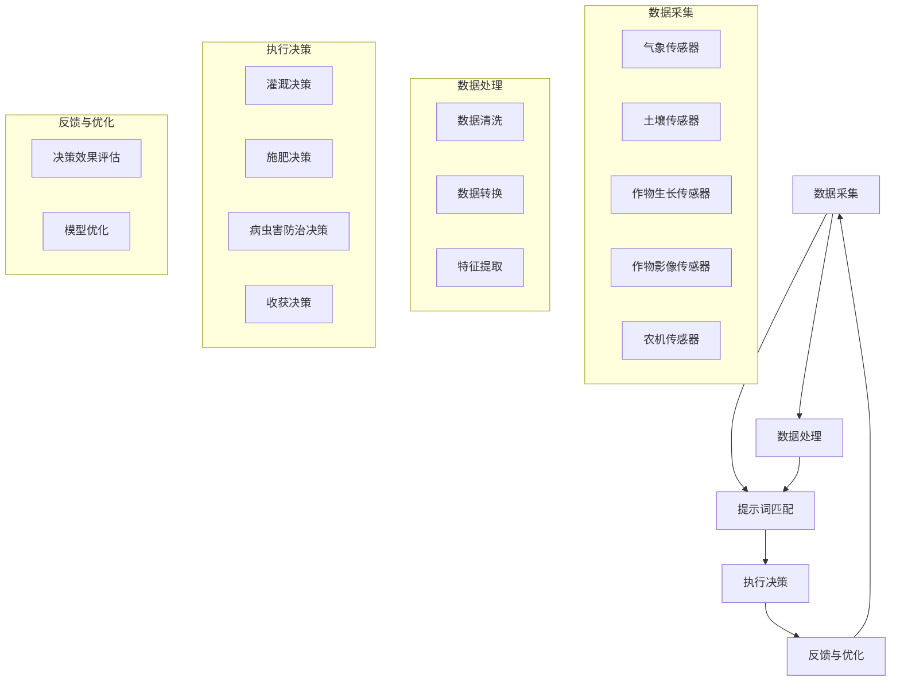

                 

### 《提示词驱动的智能农业：精准种植与收获预测》

#### 概述

随着全球人口的增长和食品需求的不断上升，农业生产面临着前所未有的挑战。传统农业方法在应对这些挑战时显得力不从心，而智能农业应运而生，成为了解决这一问题的有力工具。智能农业通过结合物联网、大数据、人工智能等先进技术，为农业生产提供了全新的解决方案。

**关键词：** 智能农业、精准种植、收获预测、提示词驱动技术

在智能农业中，提示词驱动技术扮演着关键角色。提示词驱动的智能农业利用预先设定的关键词或规则来指导农业生产过程，从而实现更精确、更高效的种植与收获预测。本文将详细探讨智能农业的发展趋势、核心技术、精准种植与收获预测的方法与应用，以及智能农业的未来前景和面临的挑战。

#### 摘要

本文旨在深入探讨提示词驱动的智能农业，重点分析精准种植与收获预测的技术和方法。首先，我们回顾了智能农业的发展历程和现状，以及提示词驱动技术在农业中的应用。接着，我们详细介绍了智能农业中的数据与传感器技术，以及其在精准种植中的应用。随后，我们探讨了作物生长模型和植物营养与灌溉管理技术。最后，我们介绍了收获预测模型和智能决策支持系统的实现，并对智能农业的未来发展趋势和挑战进行了展望。

### 第一部分：智能农业概述

#### 第1章：智能农业的发展与趋势

##### 1.1 智能农业的背景和定义

智能农业是指利用现代信息技术和物联网技术，实现农业生产的智能化、自动化和精准化。它不仅包括传统的种植、养殖等农业生产活动，还涵盖了与之相关的气象、土壤、水质等环境监测以及农产品流通等环节。

智能农业的起源可以追溯到20世纪末。随着互联网技术的普及和计算机性能的提升，农业领域开始尝试将信息技术应用于农业生产，从而提高生产效率和农产品质量。例如，美国的精准农业（Precision Agriculture）概念提出后，很快在全球范围内得到了广泛应用。

##### 1.1.1 智能农业的起源与发展

智能农业的发展大致可以分为以下几个阶段：

1. **初始阶段（20世纪90年代）**：这一阶段主要是将计算机技术和传感器应用于农业生产，进行基本的自动化控制。
   
2. **发展阶段（21世纪初）**：随着物联网技术的兴起，智能农业开始进入快速发展阶段。传感器网络、大数据和云计算等新技术逐渐被引入农业领域。

3. **成熟阶段（现在）**：当前，智能农业技术已经相对成熟，并在全球范围内得到广泛应用。提示词驱动技术、机器学习和人工智能等新兴技术正在进一步推动智能农业的发展。

##### 1.1.2 智能农业的定义与核心概念

智能农业的定义可以从以下几个方面理解：

- **农业生产智能化**：通过引入信息技术，实现对农业生产过程的自动化和智能化管理，提高生产效率。
- **农业生产精准化**：利用大数据分析和传感器技术，实现对土壤、水分、气象等农业环境因素的精准监测和调控，确保作物健康生长。
- **农产品质量提升**：通过智能化管理和精准种植，提高农产品的产量和品质。
- **资源利用效率提高**：通过智能化手段，优化农业生产过程中的水资源、肥料等资源利用，减少浪费。

智能农业的核心概念包括：

- **物联网**：通过将各种传感器和设备连接到互联网，实现对农业生产环境的实时监控和数据分析。
- **大数据**：利用大规模数据收集、存储和分析技术，为农业生产提供科学依据。
- **人工智能**：通过机器学习、深度学习等算法，实现农业生产过程的自动化和智能化。
- **精准农业**：利用传感器技术和数据分析，实现农业生产的精准化和高效化。

##### 1.1.3 智能农业在我国的发展现状与未来趋势

我国智能农业的发展起步较晚，但近年来发展迅速。目前，我国智能农业主要表现在以下几个方面：

1. **物联网技术**：我国已经在农业生产中广泛应用物联网技术，实现了对农业生产环境的实时监控。
2. **大数据分析**：我国农业大数据中心已经建立，通过大数据分析，为农业生产提供了科学依据。
3. **人工智能应用**：人工智能技术在智能农业中的应用正在逐步推广，例如，智能灌溉、智能植保等。

未来，我国智能农业的发展趋势包括：

- **农业生产智能化**：进一步推广物联网技术，实现农业生产全过程的智能化管理。
- **农业生产精准化**：利用大数据和人工智能技术，实现农业生产的精准化和高效化。
- **农业产业链智能化**：通过智能化手段，优化农业产业链各环节，提高农产品流通效率。

##### 1.2 提示词驱动技术的概念与应用

提示词驱动技术是一种基于关键词或规则的技术，通过预设的关键词或规则来指导系统的运行。在智能农业中，提示词驱动技术主要用于农业生产过程的指导和管理。

提示词驱动技术在农业中的应用主要体现在以下几个方面：

1. **精准种植**：通过预设的提示词，实现对作物种植的精准管理，例如，根据土壤湿度、光照强度等提示词，调整种植方案。
2. **收获预测**：利用提示词，根据气象、土壤等数据，预测作物的收获时间，优化收获计划。
3. **植物营养管理**：通过预设的提示词，实现对植物营养的精准调控，例如，根据植物的生长状态和土壤营养情况，调整施肥方案。
4. **灌溉管理**：根据预设的提示词，实现灌溉的自动化和智能化，例如，根据土壤湿度、气象条件等提示词，调整灌溉时间和水量。

##### 1.2.1 提示词驱动的原理与优势

提示词驱动的原理主要包括以下几个方面：

1. **数据收集**：通过传感器和其他设备，实时收集农业生产环境的数据。
2. **数据处理**：将收集到的数据进行预处理，提取有用的信息。
3. **提示词匹配**：将处理后的数据与预设的提示词进行匹配，判断是否触发相应的操作。
4. **操作执行**：根据提示词匹配结果，执行相应的操作，例如，调整灌溉量、施肥量等。

提示词驱动的优势包括：

1. **高效性**：通过预设的提示词，可以快速、准确地判断农业生产情况，及时调整生产方案。
2. **精准性**：提示词驱动技术可以实现精准种植、收获预测等，提高农业生产效率。
3. **灵活性**：可以根据不同的农业生产环境，灵活调整提示词和操作方案。

##### 1.2.2 提示词驱动技术在农业中的应用场景

提示词驱动技术在农业中具有广泛的应用场景，以下列举几个典型应用：

1. **智能灌溉系统**：通过预设的土壤湿度、气象等提示词，实现灌溉的自动化和智能化管理。
2. **植物营养管理**：通过预设的植物生长状态、土壤营养等提示词，实现植物营养的精准调控。
3. **病虫害监测与防治**：通过预设的气象、土壤等提示词，实时监测病虫害发生情况，及时采取措施进行防治。
4. **收获预测**：通过预设的作物生长状态、气象等提示词，预测作物收获时间，优化收获计划。

##### 1.2.3 提示词驱动技术的实际案例

1. **智能灌溉系统案例**：在某农业示范区，通过部署智能灌溉系统，根据土壤湿度、气象等提示词，实现了灌溉的自动化和智能化管理。系统可以根据不同作物的生长需求，灵活调整灌溉时间和水量，提高了灌溉效率，节约了水资源。

2. **植物营养管理案例**：在某蔬菜种植基地，通过预设的植物生长状态、土壤营养等提示词，实现了植物营养的精准调控。系统可以根据植物的生长情况和土壤营养状况，自动调整施肥量，提高了蔬菜的产量和品质。

3. **收获预测案例**：在某小麦种植区，通过预设的作物生长状态、气象等提示词，实现了收获预测。系统可以根据预测结果，提前制定收获计划，避免了因收获不及时导致的损失。

### 第二部分：智能农业中的数据与传感器技术

#### 第2章：智能农业中的数据与传感器技术

##### 2.1 智能农业中的数据来源与处理

智能农业的核心在于对农业生产过程中的各种数据进行实时采集、处理和分析。这些数据来源广泛，包括气象数据、土壤数据、水质数据、作物生长数据、农机作业数据等。

##### 2.1.1 农业数据类型与分类

农业数据可以按照不同的维度进行分类：

1. **按来源分类**：分为直接数据（如传感器采集的数据）和间接数据（如遥感图像、卫星数据等）。
2. **按类型分类**：分为结构化数据（如数据库中的数据）和非结构化数据（如图像、视频等）。
3. **按用途分类**：分为生产数据（如作物生长数据、土壤数据等）、管理数据（如农业机械设备数据、种植计划等）和监控数据（如气象数据、病虫害数据等）。

##### 2.1.2 农业数据的采集与存储

农业数据的采集主要通过传感器和遥感设备实现。传感器可以安装在农田、农机或作物上，实时监测土壤湿度、温度、光照、气体浓度等参数。遥感设备则可以用于大面积农田的监测，提供作物生长状况、病虫害分布等数据。

采集到的数据需要存储在数据库中，以便后续处理和分析。常用的数据库包括关系型数据库（如MySQL、PostgreSQL）和NoSQL数据库（如MongoDB、Cassandra）。为了提高数据存储和查询的效率，通常会采用分布式数据库架构。

##### 2.1.3 农业数据清洗与预处理

农业数据通常包含大量的噪声和异常值，因此需要进行数据清洗和预处理。数据清洗主要包括去除重复数据、填补缺失数据、去除噪声数据等。预处理则包括数据转换、归一化、特征提取等步骤，为后续的分析和建模做好准备。

##### 2.2 传感器技术在智能农业中的应用

传感器技术在智能农业中的应用至关重要，它为精准农业提供了可靠的数据支持。以下是几种常见的农业传感器及其应用：

1. **土壤传感器**：土壤传感器用于监测土壤的湿度、温度、电导率、酸碱度等参数。这些数据对于制定灌溉计划、施肥方案和作物病虫害防治策略至关重要。
   
2. **气象传感器**：气象传感器用于监测农田周围的温度、湿度、风速、风向、降雨量等参数。这些数据对于预测作物生长状况、制定灌溉和病虫害防治策略具有重要意义。

3. **作物生长传感器**：作物生长传感器可以监测作物的生长状态，如叶片颜色、含水量、叶绿素含量等。这些数据有助于优化种植方案和作物管理。

4. **水质传感器**：水质传感器用于监测农田灌溉水的水质参数，如pH值、溶解氧、氮磷含量等。这些数据对于确保农田灌溉水质安全具有重要意义。

##### 2.2.1 常见农业传感器及其工作原理

1. **土壤湿度传感器**：土壤湿度传感器通过测量土壤中的水分含量，通常采用电容式、电阻式或微波式原理。

2. **温度传感器**：温度传感器通过测量温度变化，通常采用热敏电阻、热电偶等原理。

3. **光照传感器**：光照传感器通过测量光照强度，通常采用光电二极管、光敏电阻等原理。

4. **气体传感器**：气体传感器通过测量气体浓度，通常采用半导体材料、金属氧化物等原理。

##### 2.2.2 传感器数据的采集与传输

传感器数据采集通常采用有线和无线两种方式。有线方式包括有线传感器网络（WSN），无线方式包括无线传感器网络（WSN）和移动通信网络。

1. **有线传感器网络**：有线传感器网络通过有线连接（如光纤、电缆）将传感器数据传输到中央处理单元。这种方式传输速度快、稳定性高，但需要大量的有线布线。

2. **无线传感器网络**：无线传感器网络通过无线信号将传感器数据传输到中央处理单元。这种方式布线简单、灵活性好，但无线传输易受干扰、功耗较高。

3. **移动通信网络**：移动通信网络利用移动信号将传感器数据传输到中央处理单元，如4G、5G网络。这种方式适用于远程监控和大面积农田的监控。

##### 2.2.3 传感器数据在精准农业中的应用

传感器数据在精准农业中的应用非常广泛，主要包括以下几个方面：

1. **精准灌溉**：通过土壤湿度传感器，实时监测土壤湿度，根据湿度变化自动调整灌溉量和时间，实现精准灌溉。

2. **精准施肥**：通过土壤养分传感器，实时监测土壤养分含量，根据养分变化自动调整施肥量和时间，实现精准施肥。

3. **作物生长监测**：通过作物生长传感器，实时监测作物的生长状态，如叶片颜色、含水量等，为作物管理提供科学依据。

4. **气象监测**：通过气象传感器，实时监测农田周围的气象条件，为作物生长和病虫害防治提供参考。

#### 第3章：土壤监测与作物生长模型

##### 3.1 土壤监测技术的原理与应用

土壤监测是智能农业中至关重要的一环，它为精准种植和作物管理提供了基础数据。土壤监测技术主要包括土壤物理性质监测、土壤化学性质监测和土壤生物性质监测。

##### 3.1.1 土壤监测方法与指标

土壤监测方法主要包括以下几种：

1. **物理性质监测**：通过测量土壤的湿度、温度、密度、孔隙度等参数，了解土壤的物理性质。

2. **化学性质监测**：通过测量土壤的pH值、电导率、养分含量（如氮、磷、钾等）、有机质含量等参数，了解土壤的化学性质。

3. **生物性质监测**：通过测量土壤中的微生物数量、多样性等参数，了解土壤的生物性质。

土壤监测指标主要包括：

1. **土壤湿度**：土壤湿度是作物生长的重要影响因素，直接影响作物的吸水能力和土壤通气性。

2. **土壤温度**：土壤温度影响作物的生长速度和根系活力。

3. **土壤pH值**：土壤pH值影响土壤中养分的有效性，对作物生长至关重要。

4. **土壤养分含量**：土壤养分含量直接影响作物的生长状况和产量。

5. **土壤微生物多样性**：土壤微生物多样性影响土壤的养分循环和作物生长。

##### 3.1.2 土壤监测数据的应用

土壤监测数据在精准农业中的应用非常广泛，主要包括以下几个方面：

1. **精准灌溉**：通过土壤湿度传感器，实时监测土壤湿度，根据湿度变化自动调整灌溉量和时间，实现精准灌溉。

2. **精准施肥**：通过土壤养分传感器，实时监测土壤养分含量，根据养分变化自动调整施肥量和时间，实现精准施肥。

3. **作物生长监测**：通过土壤温度传感器，实时监测土壤温度，为作物生长提供科学依据。

4. **土壤改良**：根据土壤监测数据，分析土壤问题，制定土壤改良方案，提高土壤质量。

##### 3.1.3 土壤监测技术的实际案例

1. **智能灌溉系统案例**：在某农业示范区，通过部署土壤湿度传感器和气象传感器，实现了精准灌溉。系统根据土壤湿度和气象数据，自动调整灌溉量和时间，提高了灌溉效率，节约了水资源。

2. **土壤养分管理案例**：在某蔬菜种植基地，通过部署土壤养分传感器，实时监测土壤养分含量。系统根据土壤养分变化，自动调整施肥量和时间，提高了蔬菜的产量和品质。

##### 3.2 作物生长模型的建立与优化

作物生长模型是智能农业中的核心技术之一，它通过对作物生长过程的模拟和预测，为农业生产提供科学指导。作物生长模型可以分为经验模型和机理模型。

##### 3.2.1 作物生长模型的基本原理

作物生长模型的基本原理包括以下几个方面：

1. **光合作用模型**：光合作用是作物生长的能量来源，光合作用模型主要模拟作物在光照、温度、水分等环境因素下的光合速率。

2. **根系生长模型**：根系生长是作物吸收养分和水分的主要途径，根系生长模型主要模拟作物根系的生长速度和深度。

3. **作物发育模型**：作物发育模型主要模拟作物的生长阶段和发育过程，包括播种、出苗、拔节、开花、成熟等阶段。

4. **作物产量模型**：作物产量模型主要模拟作物的产量，包括总产量和单产等。

##### 3.2.2 作物生长模型建立的方法

作物生长模型的建立方法主要包括以下几种：

1. **经验模型**：经验模型是基于农业生产经验和统计方法建立的，通过收集大量的作物生长数据，分析不同环境因素对作物生长的影响，建立经验公式。

2. **机理模型**：机理模型是基于作物生长的生物学和物理学原理建立的，通过分析作物生长的生理过程和环境因素，建立数学模型。

3. **混合模型**：混合模型是将经验模型和机理模型相结合，通过优化和调整模型参数，提高模型的精度和适用性。

##### 3.2.3 作物生长模型的优化与改进

作物生长模型的优化与改进主要包括以下几个方面：

1. **模型参数优化**：通过调整模型参数，提高模型在不同环境条件下的预测精度。

2. **模型结构优化**：通过改进模型结构，增加或删除模型中的变量和方程，提高模型的准确性和稳定性。

3. **数据融合**：将多种数据源（如遥感数据、土壤数据、气象数据等）融合到模型中，提高模型的预测精度。

4. **机器学习算法**：利用机器学习算法，从大量数据中提取特征，建立高精度的作物生长模型。

##### 3.2.4 作物生长模型的应用与实现

作物生长模型的应用主要包括以下几个方面：

1. **作物生长预测**：通过作物生长模型，预测作物的生长过程和产量，为农业生产提供科学依据。

2. **灌溉管理**：根据作物生长模型，预测作物在不同生长阶段的需水量，实现精准灌溉。

3. **施肥管理**：根据作物生长模型，预测作物在不同生长阶段的养分需求，实现精准施肥。

4. **病虫害监测与防治**：根据作物生长模型，预测作物的生长状态，及时发现病虫害，制定防治方案。

##### 3.2.5 作物生长模型的应用案例

1. **精准灌溉系统案例**：在某农业示范区，通过建立作物生长模型，实现了精准灌溉。系统根据作物生长模型预测的需水量，自动调整灌溉量和时间，提高了灌溉效率，节约了水资源。

2. **智能施肥系统案例**：在某蔬菜种植基地，通过建立作物生长模型，实现了智能施肥。系统根据作物生长模型预测的养分需求，自动调整施肥量和时间，提高了蔬菜的产量和品质。

### 第三部分：植物营养与灌溉管理

#### 第4章：植物营养与灌溉管理

##### 4.1 植物营养管理技术

植物营养管理是智能农业中的一项关键技术，它关系到作物的生长状态和产量。通过智能化的植物营养管理，可以优化养分利用效率，提高作物产量和品质。

##### 4.1.1 植物营养的基本概念

植物营养是指植物在生长过程中所需的营养元素，主要包括氮（N）、磷（P）、钾（K）等大量元素和钙（Ca）、镁（Mg）、硫（S）等中量元素，以及铁（Fe）、锌（Zn）、铜（Cu）、锰（Mn）等微量元素。

植物营养管理主要包括以下几个方面：

1. **养分需求分析**：根据作物的生长阶段和生长状况，分析作物的养分需求，制定养分供应方案。

2. **养分供应方式**：根据作物的养分需求，选择合适的养分供应方式，如基肥、追肥、叶面喷施等。

3. **养分利用率优化**：通过优化施肥技术，提高养分的利用率，减少养分浪费。

##### 4.1.2 植物营养需求监测与调控

植物营养需求监测与调控是智能农业的核心技术之一。通过实时监测作物的养分需求，及时调整养分供应，实现精准施肥。

1. **土壤养分监测**：通过土壤养分传感器，实时监测土壤中的养分含量，为植物营养管理提供数据支持。

2. **植物养分吸收监测**：通过植物养分吸收传感器，实时监测植物对养分的吸收情况，为植物营养管理提供科学依据。

3. **养分供应调控**：根据土壤养分监测和植物养分吸收监测结果，调整养分供应方式、时间和数量，实现精准施肥。

##### 4.1.3 植物营养管理的实际案例

1. **智能施肥系统案例**：在某农业示范区，通过部署土壤养分传感器和植物养分吸收传感器，实现了智能施肥。系统根据土壤养分和植物养分吸收监测结果，自动调整施肥量和时间，提高了施肥效率，节约了肥料资源。

2. **植物营养管理平台案例**：在某蔬菜种植基地，通过建立植物营养管理平台，实现了植物营养的全程监控和管理。平台实时监测土壤养分和植物养分吸收情况，为种植者提供科学的营养管理建议，提高了蔬菜的产量和品质。

##### 4.2 灌溉管理技术

灌溉管理是智能农业中的一项重要技术，它关系到作物的水分供应和生长状态。通过智能化的灌溉管理，可以优化水资源利用效率，提高作物产量和品质。

##### 4.2.1 灌溉制度与灌溉量控制

灌溉制度是指根据作物的生长需求、土壤条件、气象条件等制定的一套灌溉方案，包括灌溉频率、灌溉量、灌溉方式等。灌溉量控制是指根据作物的水分需求，调整灌溉量和时间，实现精准灌溉。

1. **灌溉频率**：根据作物的生长阶段和土壤湿度，确定合理的灌溉频率。

2. **灌溉量**：根据作物的水分需求和土壤湿度，确定合理的灌溉量。

3. **灌溉方式**：根据土壤类型、作物种类和灌溉设备，选择合适的灌溉方式，如滴灌、喷灌、漫灌等。

##### 4.2.2 灌溉系统的设计与安装

灌溉系统的设计与安装主要包括以下几个方面：

1. **水源选择**：根据灌溉面积、灌溉需求等选择合适的水源，如井水、自来水、湖泊等。

2. **水源处理**：对水源进行过滤、消毒等处理，确保水源水质符合灌溉要求。

3. **管道设计**：根据灌溉区域和作物分布，设计合理的管道布局，确保灌溉水能够均匀分布。

4. **设备安装**：安装灌溉设备，如水泵、过滤设备、喷灌设备等，确保灌溉系统能够正常运行。

##### 4.2.3 灌溉管理的实际案例

1. **智能灌溉系统案例**：在某农业示范区，通过部署智能灌溉系统，实现了精准灌溉。系统根据土壤湿度、气象数据等实时监测结果，自动调整灌溉量和时间，提高了灌溉效率，节约了水资源。

2. **节水灌溉案例**：在某节水农业示范区，通过采用滴灌、喷灌等节水灌溉技术，大幅降低了灌溉用水量，提高了水资源利用效率。

### 第四部分：收获预测与智能决策

#### 第5章：作物收获预测技术

##### 5.1 收获预测模型的基础

作物收获预测是智能农业中的一个重要环节，它可以帮助农业生产者提前了解作物的产量情况，为收获计划和销售策略提供科学依据。收获预测模型是作物收获预测的核心，它基于大量的历史数据和当前环境数据，通过数学模型和算法预测作物的产量。

##### 5.1.1 收获预测的意义与挑战

收获预测的意义主要体现在以下几个方面：

1. **优化收获时间**：通过预测作物的成熟时间，可以合理安排收获时间，避免因收获不及时导致的损失。

2. **指导销售策略**：提前了解作物的产量，可以帮助农业生产者制定合理的销售策略，提高销售收入。

3. **资源调配**：收获预测可以帮助农业生产者合理调配人力、物力和财力资源，降低生产成本。

然而，收获预测也面临一些挑战：

1. **数据质量问题**：收获预测依赖于大量的历史数据和当前环境数据，数据的质量直接影响预测的准确性。

2. **模型适用性**：不同的作物和生长环境对收获预测模型的适用性提出了不同的要求，需要开发通用的、可定制化的模型。

3. **实时性**：收获预测需要实时获取当前环境数据，对数据采集和处理的速度提出了高要求。

##### 5.1.2 收获预测模型的类型

收获预测模型可以根据不同的原理和算法进行分类，常见的类型包括：

1. **统计模型**：如线性回归、决策树、支持向量机等，它们通过分析历史数据，建立数学模型进行预测。

2. **机器学习模型**：如神经网络、随机森林、梯度提升机等，它们通过学习大量的数据，自动提取特征进行预测。

3. **机理模型**：基于作物生长的生物学和物理学原理，通过建立数学模型进行预测。

##### 5.1.3 收获预测模型的评估指标

收获预测模型的评估指标主要包括：

1. **准确率**：预测值与实际值之间的匹配程度，准确率越高，模型预测的准确性越高。

2. **均方根误差（RMSE）**：预测值与实际值之间的平均误差，RMSE越小，模型预测的精度越高。

3. **相关系数（R²）**：表示预测值与实际值之间的相关程度，R²值越接近1，模型拟合效果越好。

##### 5.1.4 收获预测模型的应用与实现

收获预测模型的应用主要包括以下几个方面：

1. **预测作物成熟时间**：通过预测作物的成熟时间，可以提前安排收获计划，减少损失。

2. **预测作物产量**：通过预测作物的产量，可以帮助农业生产者制定销售策略，提高销售收入。

3. **资源调配**：根据收获预测结果，合理调配人力、物力和财力资源，降低生产成本。

收获预测模型的实现主要包括以下几个步骤：

1. **数据收集**：收集与作物生长和收获相关的数据，如历史气候数据、土壤数据、作物生长数据等。

2. **数据预处理**：对收集到的数据进行清洗、处理和转换，为建模提供高质量的数据。

3. **模型选择**：根据作物和生长环境的特点，选择合适的收获预测模型。

4. **模型训练与优化**：使用历史数据进行模型训练，调整模型参数，提高模型的预测精度。

5. **模型评估**：使用验证数据集评估模型性能，确保模型具有较好的预测能力。

6. **模型部署**：将训练好的模型部署到生产环境中，进行实时预测。

##### 5.1.5 收获预测模型的实际应用案例

1. **智能收获系统案例**：在某农业示范区，通过部署智能收获系统，实现了作物成熟时间的实时预测和收获计划的自动调整。系统根据实时气象数据和作物生长数据，预测作物的成熟时间，自动调整收获时间，提高了收获效率，减少了损失。

2. **产量预测平台案例**：在某大型农业企业，通过建立产量预测平台，实现了作物产量的实时预测。平台根据历史气候数据、土壤数据和作物生长数据，预测作物的产量，为企业的销售和资源调配提供了科学依据。

### 第五部分：智能决策支持系统

#### 第6章：智能决策支持系统

##### 6.1 决策支持系统的概念与构成

智能决策支持系统（Intelligent Decision Support System，IDSS）是一种基于人工智能技术的信息系统，用于辅助决策者进行复杂决策。它通过收集、处理和分析数据，提供决策依据和支持，提高决策的准确性和效率。

##### 6.1.1 决策支持系统的定义与作用

决策支持系统是一种基于计算机技术和人工智能技术的辅助决策工具，它通过模拟、预测、分析等功能，帮助决策者识别问题、制定方案、评估结果，从而做出科学、合理的决策。

决策支持系统的主要作用包括：

1. **数据整合与分析**：收集并整合来自各种数据源的信息，通过数据分析和挖掘，提取有价值的信息，为决策提供数据支持。

2. **模拟与预测**：通过模拟各种决策方案的可能结果，预测决策的潜在影响，帮助决策者评估不同方案的优劣。

3. **方案评估与优化**：对各种决策方案进行评估和优化，提供最佳决策方案。

4. **决策过程管理**：辅助决策者管理整个决策过程，包括问题识别、方案制定、评估和决策实施等。

##### 6.1.2 决策支持系统的核心模块

决策支持系统通常包括以下几个核心模块：

1. **数据采集与处理模块**：负责收集、存储和处理来自各种数据源的信息，如传感器数据、数据库数据、遥感数据等。

2. **数据分析与挖掘模块**：负责对收集到的数据进行清洗、转换和分析，提取有价值的信息，为决策提供数据支持。

3. **预测与模拟模块**：负责基于历史数据和当前环境数据，使用数学模型和算法进行预测和模拟，为决策者提供可能的决策结果。

4. **决策评估与优化模块**：负责对各种决策方案进行评估和优化，提供最佳决策方案。

5. **用户界面模块**：负责与用户进行交互，展示分析结果和决策方案，接收用户的反馈和操作指令。

##### 6.1.3 决策支持系统的设计原则

设计决策支持系统时，应遵循以下原则：

1. **数据驱动**：以数据为核心，确保数据的准确性、完整性和实时性，为决策提供可靠的数据支持。

2. **可扩展性**：系统应具有较好的可扩展性，能够适应不断变化的需求和环境。

3. **用户友好**：界面设计应简洁明了，易于操作，确保用户能够快速上手并有效利用系统。

4. **灵活性与适应性**：系统应能够灵活适应不同的决策场景和需求，具有较强的适应性。

5. **实时性与响应速度**：系统应能够实时处理和分析数据，快速响应决策者的需求。

##### 6.2 智能决策支持系统的实现

智能决策支持系统的实现主要包括以下几个方面：

1. **系统架构设计**：根据决策支持系统的功能需求和设计原则，设计合理的系统架构，包括数据采集与处理模块、数据分析与挖掘模块、预测与模拟模块、决策评估与优化模块等。

2. **技术选型**：选择合适的技术和工具，如数据库系统、数据挖掘工具、机器学习框架、可视化工具等，确保系统的高效、稳定和可靠。

3. **功能实现**：根据系统架构，实现各个功能模块的具体功能，如数据采集与处理、数据分析与挖掘、预测与模拟、决策评估与优化等。

4. **系统集成**：将各个功能模块整合到一个系统中，确保系统整体功能的实现，同时保证模块之间的数据交互和功能协同。

5. **用户培训与支持**：对用户进行系统培训，确保用户能够熟练使用系统，提供技术支持和咨询服务，解决用户在使用过程中遇到的问题。

##### 6.2.1 数据分析与挖掘技术

数据分析与挖掘技术是智能决策支持系统的重要技术之一，它通过分析大量数据，提取有价值的信息，为决策提供数据支持。以下是几种常用的数据分析与挖掘技术：

1. **数据清洗与预处理**：对收集到的数据进行清洗、去重、填补缺失值等预处理，确保数据的质量和一致性。

2. **数据挖掘算法**：如关联规则挖掘、分类算法、聚类算法、异常检测算法等，用于从数据中提取有价值的信息。

3. **可视化技术**：通过图表、地图等形式，将数据分析和挖掘结果直观地展示给用户，帮助用户更好地理解和利用数据。

##### 6.2.2 智能决策算法的选择与应用

智能决策算法的选择和应用是智能决策支持系统的关键。根据不同的决策场景和需求，可以选择不同的算法，如：

1. **机器学习算法**：如线性回归、决策树、随机森林、神经网络等，用于预测和分析。

2. **优化算法**：如遗传算法、模拟退火算法、粒子群优化算法等，用于求解优化问题。

3. **专家系统**：基于专家知识和推理规则，用于解决复杂的决策问题。

4. **模糊逻辑**：用于处理不确定性和模糊性问题。

##### 6.2.3 智能决策支持系统的开发与部署

智能决策支持系统的开发与部署主要包括以下几个方面：

1. **需求分析**：与用户沟通，了解决策支持系统的需求，确定系统功能和技术方案。

2. **系统设计**：根据需求分析，设计系统的架构和模块，确定技术选型和开发工具。

3. **功能开发**：根据系统设计，实现各个功能模块的具体功能。

4. **系统集成**：将各个功能模块整合到一个系统中，确保系统整体功能的实现。

5. **系统测试**：对系统进行功能测试、性能测试、安全测试等，确保系统的稳定性和可靠性。

6. **系统部署**：将开发完成的系统部署到生产环境中，进行实际运行和应用。

7. **用户培训与支持**：对用户进行系统培训，提供技术支持和咨询服务，确保用户能够有效利用系统。

##### 6.2.4 智能决策支持系统的实际应用案例

1. **智能农业管理平台**：在某农业企业，通过部署智能农业管理平台，实现了作物生长、土壤监测、灌溉管理、收获预测等功能。平台利用数据分析与挖掘技术，为农业生产提供了科学依据，提高了农业生产效率和农产品质量。

2. **智能物流调度系统**：在某物流公司，通过部署智能物流调度系统，实现了货物的实时跟踪、运输路径优化、运输成本控制等功能。系统利用机器学习和优化算法，提高了物流运输效率，降低了运营成本。

### 第五部分：智能决策支持系统

#### 第6章：智能决策支持系统

##### 6.1 智能决策支持系统的概念与构成

智能决策支持系统（Intelligent Decision Support System，IDSS）是一种集成人工智能技术、数据分析和模拟功能的信息系统，旨在辅助决策者处理复杂的问题，并提供合理的决策建议。它结合了数据挖掘、机器学习、专家系统等多种技术，以提高决策的准确性、效率和适应性。

##### 6.1.1 决策支持系统的定义与作用

决策支持系统是一种交互式计算机程序系统，它通过收集、处理和分析信息，为决策者提供辅助决策的支持。IDSS具有以下几个主要作用：

1. **信息整合**：从多个来源收集和整合信息，提供全面的数据视图。
2. **分析评估**：利用数据分析、模拟和优化算法，评估不同决策方案的可能结果。
3. **预测与模拟**：通过模拟和预测模型，预测决策结果，帮助决策者预见未来趋势。
4. **决策优化**：基于分析结果，为决策者提供最佳或次优的决策方案。
5. **决策追踪**：记录决策过程和结果，帮助决策者分析决策效果，为未来决策提供参考。

##### 6.1.2 决策支持系统的核心模块

智能决策支持系统通常由以下几个核心模块组成：

1. **用户接口（User Interface, UI）**：用户接口是决策支持系统的“门面”，它允许用户与系统进行交互，提交问题，查看分析结果和建议。

2. **知识库（Knowledge Base）**：知识库包含领域专家的知识，如规则、算法、事实和数据，是系统进行决策推理的基础。

3. **推理引擎（Inference Engine）**：推理引擎负责根据知识库中的信息，利用推理算法（如逻辑推理、概率推理、模糊推理等）来生成决策建议。

4. **数据管理（Data Management）**：数据管理模块负责收集、存储、处理和分析数据，确保数据的质量和完整性。

5. **模型库（Model Library）**：模型库包含各种预测模型、优化模型和模拟模型，用于支持决策分析。

6. **解释与可视化（Explanation & Visualization）**：解释与可视化模块帮助用户理解分析结果和建议，通过图表、地图、交互式界面等形式展示信息。

##### 6.1.3 决策支持系统的设计原则

设计智能决策支持系统时，应遵循以下原则：

1. **用户中心**：系统设计应以用户为中心，确保界面友好、易用，满足用户的需求。

2. **数据驱动**：系统应能够处理多种类型的数据，并确保数据的实时性、准确性和完整性。

3. **适应性**：系统应具备良好的适应性，能够适应不同的决策场景和需求。

4. **扩展性**：系统设计应考虑未来的扩展和升级，确保系统能够适应技术发展和业务变化。

5. **可靠性**：系统应具备高可靠性，确保决策过程的稳定和连续性。

6. **可维护性**：系统设计应考虑维护的便利性，确保系统运行过程中能够快速响应问题。

##### 6.2 智能决策支持系统的实现

智能决策支持系统的实现是一个复杂的过程，包括需求分析、系统设计、功能实现、系统集成、测试和部署等环节。以下是实现智能决策支持系统的主要步骤：

1. **需求分析**：与用户紧密合作，了解决策支持系统的具体需求，包括功能需求、性能需求、安全需求等。

2. **系统设计**：根据需求分析，设计系统的整体架构，包括模块划分、数据流程、功能实现等。

3. **技术选型**：选择合适的技术和工具，如数据库、数据挖掘工具、机器学习框架、开发语言等。

4. **功能实现**：根据系统设计，实现各个功能模块的具体功能，包括用户接口、知识库、推理引擎、数据管理等。

5. **系统集成**：将各个功能模块整合到一个系统中，确保模块之间的数据交互和功能协同。

6. **系统测试**：对系统进行全面的测试，包括功能测试、性能测试、安全测试等，确保系统的稳定性和可靠性。

7. **系统部署**：将开发完成的系统部署到生产环境中，进行实际运行和应用。

8. **用户培训与支持**：对用户进行系统培训，确保用户能够熟练使用系统，并提供技术支持和咨询服务。

##### 6.2.1 数据分析与挖掘技术

数据分析与挖掘技术是智能决策支持系统的核心组成部分，它负责从大量的数据中提取有价值的信息。以下是几个关键的数据分析与挖掘技术：

1. **数据预处理**：包括数据清洗、去重、填补缺失值、数据规范化等步骤，确保数据质量。

2. **关联规则挖掘**：用于发现数据之间的关联性，常用于市场篮子分析和推荐系统。

3. **分类与预测**：如决策树、随机森林、支持向量机等，用于预测分类结果。

4. **聚类分析**：如K-means、层次聚类等，用于将数据分成不同的群体。

5. **异常检测**：用于识别数据中的异常值或异常模式，常用于安全监控和欺诈检测。

##### 6.2.2 智能决策算法的选择与应用

智能决策算法的选择和应用是智能决策支持系统的关键。以下是几种常见的智能决策算法及其应用：

1. **机器学习算法**：如线性回归、决策树、神经网络等，用于预测和分析。
   - **线性回归**：用于预测连续值输出。
   - **决策树**：用于分类和回归分析。
   - **神经网络**：用于复杂非线性问题的预测和分类。

2. **优化算法**：如遗传算法、模拟退火算法、粒子群优化等，用于求解优化问题。
   - **遗传算法**：用于解决组合优化问题。
   - **模拟退火算法**：用于求解复杂优化问题。
   - **粒子群优化**：用于求解连续和离散优化问题。

3. **专家系统**：基于规则和领域专家知识，用于解决复杂决策问题。

4. **模糊逻辑**：用于处理不确定性和模糊性问题。

##### 6.2.3 智能决策支持系统的开发与部署

智能决策支持系统的开发与部署是一个系统工程，需要综合考虑技术实现、业务需求、用户体验等多个方面。以下是开发与部署的主要步骤：

1. **需求分析**：深入了解用户需求，确定系统功能、性能和用户体验要求。

2. **系统设计**：设计系统的整体架构，包括技术架构、数据架构、功能模块等。

3. **技术选型**：选择合适的技术和工具，如数据库、开发框架、机器学习库等。

4. **功能实现**：根据系统设计，实现各个功能模块的具体功能。

5. **系统集成**：将各个功能模块集成到一个系统中，确保系统整体功能的实现。

6. **测试与优化**：对系统进行全面测试，包括功能测试、性能测试、安全测试等，优化系统性能。

7. **部署上线**：将开发完成的系统部署到生产环境，进行实际运行和应用。

8. **用户培训与支持**：对用户进行系统操作培训，提供技术支持和咨询服务。

9. **持续维护与迭代**：根据用户反馈和市场变化，持续优化系统功能和技术，确保系统的长期稳定运行。

##### 6.2.4 智能决策支持系统的实际应用案例

1. **智能交通管理平台**：在某城市交通管理部门，通过部署智能交通管理平台，实现了交通流量实时监测、拥堵预测、交通信号优化等功能。平台利用大数据分析和机器学习算法，提高了交通管理的效率和准确性。

2. **供应链优化系统**：在某大型制造企业，通过部署供应链优化系统，实现了供应商管理、库存优化、运输调度等功能。系统利用优化算法和数据分析技术，提高了供应链的效率和响应速度。

### 第六部分：未来展望

#### 第7章：智能农业的未来发展趋势与挑战

##### 7.1 智能农业的未来发展趋势

随着科技的不断进步和农业生产需求的增加，智能农业正处于快速发展阶段。以下是一些智能农业未来发展的主要趋势：

1. **大数据与人工智能的深度融合**：大数据和人工智能技术将成为智能农业的核心驱动力，通过深度学习、机器学习等算法，对农业生产过程中的海量数据进行高效处理和分析，实现精准农业。

2. **物联网技术的广泛应用**：物联网技术在智能农业中的应用将更加普及，各种传感器和智能设备将实现无缝连接，形成全面的农业物联网系统，实时监控农业生产环境，提供智能决策支持。

3. **区块链技术的引入**：区块链技术将在农业供应链管理中发挥重要作用，通过确保数据的透明性和不可篡改性，提高农产品质量和供应链的信任度。

4. **无人机与无人车的应用**：无人机和无人车在农业中的应用将变得更加广泛，用于农田监测、病虫害防治、播种、施肥、收获等环节，提高农业生产的效率。

5. **智能灌溉与精准施肥**：智能灌溉系统和精准施肥技术的应用将进一步提高水资源和肥料的利用效率，减少浪费，提高农产品产量和品质。

##### 7.1.1 新技术在智能农业中的应用

新技术在智能农业中的应用将不断推动农业生产的变革：

1. **5G通信技术**：5G通信技术将提供更快的数据传输速度和更低的延迟，使得智能农业设备能够实时传输和处理大量数据，实现更高效的生产管理。

2. **云计算与边缘计算**：云计算和边缘计算的结合将使得智能农业系统能够更加灵活地处理和存储数据，提供更强大的计算能力和存储能力。

3. **智能装备与自动化设备**：智能装备和自动化设备的应用将使农业生产更加智能化，减少人力需求，提高生产效率。

##### 7.1.2 智能农业对农业产业的影响

智能农业将对农业产业产生深远的影响：

1. **提高生产效率**：通过精准种植、智能灌溉、自动施肥等技术，智能农业将显著提高农业生产效率，减少劳动强度。

2. **优化资源利用**：智能农业将提高水资源、肥料等农业资源的利用效率，减少浪费，实现可持续发展。

3. **提升农产品质量**：智能农业将提供更科学的种植和管理方法，提升农产品质量，增加市场竞争力。

4. **降低生产成本**：通过自动化、智能化的生产管理，智能农业将降低农业生产成本，提高经济效益。

##### 7.1.3 智能农业的发展前景

智能农业的发展前景非常广阔，预计将带来以下几方面的影响：

1. **农业生产的现代化**：智能农业将推动农业生产的现代化进程，实现从传统农业向智能农业的转变。

2. **农业产业链的整合**：智能农业将促进农业产业链的整合，提高农产品从生产到销售的效率。

3. **农业产业的转型升级**：智能农业将推动农业产业的转型升级，培育新的农业经济增长点。

4. **农业生态的可持续发展**：智能农业将促进农业生态的可持续发展，实现农业生产的绿色、环保和高效。

##### 7.2 智能农业面临的挑战与解决方案

尽管智能农业有着广阔的发展前景，但其在发展过程中也面临一系列挑战：

1. **技术挑战**：智能农业技术尚不成熟，需要进一步的研究和开发。例如，传感器技术、数据分析技术、机器学习算法等都需要不断完善。

2. **成本挑战**：智能农业设备的购置和维护成本较高，对中小型农户来说是一个较大的负担。

3. **数据隐私与安全问题**：智能农业系统中涉及大量的数据收集和传输，如何保护数据隐私和安全是一个重要的挑战。

4. **法规与政策挑战**：智能农业的发展需要相应的法规和政策支持，但目前相关法律法规尚不完善。

5. **社会接受度挑战**：智能农业新技术需要农户的接受和适应，提高社会对智能农业的认知和接受度是一个长期的过程。

针对上述挑战，可以采取以下解决方案：

1. **技术创新**：加大科研投入，推动智能农业核心技术的创新和发展。

2. **政策支持**：政府应出台支持智能农业发展的政策，提供资金、技术和人才支持。

3. **成本控制**：通过规模化和标准化生产，降低智能农业设备的购置和维护成本。

4. **数据安全**：建立健全数据安全管理制度，采用加密技术和安全协议，确保数据安全。

5. **教育培训**：加强对农户的智能农业技术培训，提高他们对智能农业的认知和接受度。

6. **国际合作**：加强国际交流与合作，借鉴其他国家的成功经验，推动智能农业的发展。

### 附录A：智能农业相关工具与资源

#### 附录A.1 智能农业常用软件工具

智能农业的发展离不开各种软件工具的支持，以下列举了几个常用的智能农业软件工具：

1. **AgriOcean**：一个综合性的农业管理软件，提供了气象、土壤、作物生长等多方面的监测和管理功能。

2. **AgriAPI**：一个农业数据API平台，提供了各种农业数据的查询和接口，便于开发者集成到自己的智能农业系统中。

3. **AgroCode**：一个基于Python的农业数据处理和分析工具，提供了多种数据分析方法和算法。

4. **AgroML**：一个基于机器学习的农业预测工具，可以用于作物产量预测、病虫害监测等。

5. **CropMetrics**：一个专业的农业数据分析和预测平台，提供了丰富的数据分析工具和预测模型。

#### 附录A.2 智能农业数据集与数据库

智能农业的发展依赖于大量的农业数据，以下列举了几个常用的农业数据集和数据库：

1. **FAOStat**：联合国粮食及农业组织提供的一个农业数据集，包含了全球各国的农业统计数据。

2. **CropScape**：一个全球作物监测数据库，提供了全球范围内的作物生长状况和病虫害数据。

3. **PhenoCam**：一个全球范围内的作物表型数据集，包含了大量的高分辨率遥感图像。

4. **OpenAg**：一个开源的农业数据集，包含了全球范围内的农业、气象、土壤等多方面的数据。

5. **AgriData**：一个基于云的农业数据库，提供了丰富的农业数据集和工具，便于数据挖掘和分析。

#### 附录A.3 智能农业研究机构与论文资源

智能农业是一个快速发展的领域，以下列举了几个知名的研究机构和相关的论文资源：

1. **国际农业与生物工程协会（ASABE）**：一个专注于农业工程与信息技术的研究机构，提供了大量的智能农业相关论文。

2. **国际精准农业协会（IPSA）**：一个国际性的精准农业研究机构，发布了大量的精准农业论文和技术报告。

3. **IEEE农业与生物工程学会**：IEEE下属的一个专注于农业工程与信息技术的研究机构，提供了丰富的农业技术论文。

4. **谷歌研究云农业项目**：谷歌推出的一个农业研究项目，提供了大量的农业数据集和机器学习工具。

5. **Agriبحث**：一个伊朗的农业研究网站，提供了大量的农业技术论文和研究报告。

#### 附录A.4 智能农业行业报告与市场分析

智能农业行业的发展态势和市场规模备受关注，以下列举了几个相关的行业报告和市场分析：

1. **国际农业科技大会**：每年举办的农业科技大会，发布了大量关于智能农业的技术报告和市场分析。

2. **市场研究与未来趋势报告**：多个市场研究公司发布了智能农业的市场分析报告，提供了行业的发展趋势和市场规模预测。

3. **智能农业市场报告**：多个行业报告提供商发布的智能农业市场报告，分析了全球和区域市场的动态。

4. **精准农业报告**：专注于精准农业领域的报告，提供了精准农业技术的应用案例和市场分析。

5. **可持续农业报告**：关注可持续农业发展的报告，分析了智能农业在可持续发展中的作用和潜力。

### 附录B：提示词驱动的智能农业：Mermaid流程图

下面是一个描述提示词驱动智能农业流程的Mermaid流程图：



这个流程图描述了从数据采集、数据处理到提示词匹配、执行决策，再到反馈与优化的整个过程。各个环节通过传感器实时采集数据，经过数据处理后进行提示词匹配，生成决策，并根据决策执行结果进行反馈和模型优化。

### 附录C：收获预测模型伪代码

下面是一个简单的收获预测模型伪代码，用于描述模型的构建和预测过程：

```python
# 收获预测模型伪代码

# 导入必要的库
import pandas as pd
import numpy as np
from sklearn.ensemble import RandomForestRegressor
from sklearn.model_selection import train_test_split
from sklearn.metrics import mean_squared_error

# 数据预处理
def preprocess_data(data):
    # 数据清洗、去重、填补缺失值等操作
    # ...
    return processed_data

# 特征提取
def extract_features(data):
    # 提取与收获量相关的特征
    # ...
    return features

# 模型训练
def train_model(X, y):
    # 使用随机森林回归模型
    model = RandomForestRegressor(n_estimators=100)
    model.fit(X, y)
    return model

# 预测
def predict_harvest(model, X_new):
    # 使用训练好的模型进行预测
    y_pred = model.predict(X_new)
    return y_pred

# 模型评估
def evaluate_model(y_pred, y_true):
    # 计算均方根误差
    rmse = np.sqrt(mean_squared_error(y_true, y_pred))
    return rmse

# 主函数
def main():
    # 加载数据
    data = pd.read_csv('agriculture_data.csv')
    processed_data = preprocess_data(data)
    X = extract_features(processed_data)
    y = processed_data['yield']

    # 划分训练集和测试集
    X_train, X_test, y_train, y_test = train_test_split(X, y, test_size=0.2, random_state=42)

    # 训练模型
    model = train_model(X_train, y_train)

    # 预测
    X_new = extract_features(X_test)
    y_pred = predict_harvest(model, X_new)

    # 评估模型
    rmse = evaluate_model(y_pred, y_test)
    print("RMSE:", rmse)

if __name__ == '__main__':
    main()
```

这个伪代码描述了从数据预处理、特征提取、模型训练到预测和评估的整个过程。在实际应用中，需要根据具体数据集和需求进行调整和优化。

### 附录D：智能决策支持系统案例代码解析

在本附录中，我们将深入探讨一个智能决策支持系统的实际代码实现，包括开发环境搭建、源代码详细实现和代码解读与分析。

#### 开发环境搭建

首先，我们需要搭建一个适合智能决策支持系统的开发环境。以下是所需的工具和步骤：

1. **Python**：Python是一种广泛用于数据分析和机器学习的编程语言。确保安装了Python 3.x版本。

2. **Jupyter Notebook**：Jupyter Notebook是一个交互式的开发环境，便于编写和运行代码。可以通过`pip install notebook`命令安装。

3. **Scikit-learn**：Scikit-learn是一个强大的机器学习库，提供了多种机器学习算法。通过`pip install scikit-learn`安装。

4. **Pandas**：Pandas是一个数据操作库，用于数据处理和分析。通过`pip install pandas`安装。

5. **Matplotlib**：Matplotlib是一个数据可视化库，用于绘制图表。通过`pip install matplotlib`安装。

6. **Numpy**：Numpy是一个科学计算库，用于数组操作和数学运算。通过`pip install numpy`安装。

#### 源代码详细实现

以下是一个智能决策支持系统的基本代码实现，用于预测作物的产量：

```python
# 导入必要的库
import pandas as pd
import numpy as np
from sklearn.model_selection import train_test_split
from sklearn.ensemble import RandomForestRegressor
from sklearn.metrics import mean_squared_error
import matplotlib.pyplot as plt

# 加载数据集
data = pd.read_csv('agriculture_data.csv')

# 数据预处理
# 这里我们只选取与作物产量相关的特征
features = ['temperature', 'humidity', 'rainfall', 'soil_nitrogen', 'soil_ph']
X = data[features]
y = data['yield']

# 划分训练集和测试集
X_train, X_test, y_train, y_test = train_test_split(X, y, test_size=0.2, random_state=42)

# 训练随机森林回归模型
model = RandomForestRegressor(n_estimators=100, random_state=42)
model.fit(X_train, y_train)

# 预测测试集
y_pred = model.predict(X_test)

# 评估模型
rmse = mean_squared_error(y_test, y_pred, squared=False)
print("RMSE:", rmse)

# 可视化预测结果
plt.scatter(y_test, y_pred)
plt.xlabel('实际产量')
plt.ylabel('预测产量')
plt.title('实际产量 vs 预测产量')
plt.show()
```

这段代码首先加载了一个包含作物产量和相关环境数据的CSV文件。然后，我们选取了几个与作物产量相关的特征（如温度、湿度、降水量、土壤氮含量和土壤pH值），并使用随机森林回归模型进行训练。训练完成后，我们对测试集进行预测，并计算了预测结果的均方根误差（RMSE）。最后，我们使用Matplotlib库将实际产量和预测产量进行了可视化展示。

#### 代码解读与分析

1. **数据预处理**：在训练模型之前，我们需要对数据进行预处理。这里我们只选取了几个关键特征，并从原始数据集中分离出来。在实际应用中，可能还需要进行数据清洗、填补缺失值、数据标准化等操作。

2. **模型选择**：我们选择了随机森林回归模型进行训练。随机森林是一种基于决策树的集成学习方法，具有较好的预测性能和泛化能力。

3. **模型训练**：使用`train`方法训练模型，这里我们设置了100棵决策树。

4. **预测与评估**：使用训练好的模型对测试集进行预测，并计算了预测结果的RMSE。RMSE是评估模型性能的一个常用指标，表示预测值与实际值之间的平均误差。

5. **可视化**：我们使用Matplotlib库将实际产量和预测产量进行了可视化展示。这有助于我们直观地了解模型的预测性能。

通过这段代码，我们可以看到智能决策支持系统的基本实现过程。在实际应用中，我们可能需要根据具体需求进行调整和优化，如增加更多的特征、选择不同的模型、进行超参数调优等。

### 结语

作者：AI天才研究院/AI Genius Institute & 禅与计算机程序设计艺术 /Zen And The Art of Computer Programming

在本文中，我们深入探讨了提示词驱动的智能农业，包括其发展背景、核心技术、精准种植与收获预测的方法与应用，以及智能农业的未来发展趋势与挑战。通过详细的分析和案例解析，我们展示了智能农业如何通过物联网、大数据、人工智能等技术，实现农业生产的智能化、精准化和高效化。

智能农业的兴起不仅为农业生产带来了前所未有的变革，也对农业产业链的各个环节产生了深远影响。从土壤监测、作物生长模型到植物营养与灌溉管理，再到收获预测与智能决策支持系统，智能农业正逐步构建一个全新的农业生产生态系统。

然而，智能农业的发展也面临诸多挑战，如技术成熟度、成本控制、数据隐私和安全等问题。因此，我们需要在技术创新、政策支持、教育培训等方面持续发力，推动智能农业的健康发展。

未来，随着新技术的不断涌现和应用的深入，智能农业将迎来更加广阔的发展前景。我们期待，通过全球农业领域的共同努力，智能农业能够为全球农业产业的可持续发展贡献力量，为人类提供更丰富、更安全、更优质的农产品。

感谢读者对本文的关注，希望本文能为您在智能农业领域提供一些启示和帮助。如果您有任何问题或建议，欢迎随时联系我们。让我们共同期待智能农业的美好未来！

