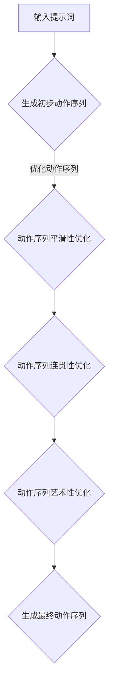

                 

# 提高AI创意舞蹈编排：动作序列生成的提示词技巧

## 关键词
- AI舞蹈编排
- 动作序列生成
- 提示词技巧
- 生成对抗网络
- 提示词生成算法
- 动作序列优化

## 摘要
本文将深入探讨如何利用AI技术提高创意舞蹈编排的效率和质量。重点关注动作序列生成的提示词技巧，通过分析核心概念、原理和算法，结合实际案例，为读者提供从理论到实践的一站式指南。本文旨在为AI领域研究人员和实践者提供有价值的参考，推动AI舞蹈编排技术的发展。

## 第一部分：基础概念与原理

### 第1章：AI与舞蹈编排的融合

#### 1.1 AI技术在舞蹈编排中的应用概述

AI技术在舞蹈编排中的应用已经日益广泛。通过AI，舞蹈编排不再局限于传统的手工创作，而是可以借助机器学习和深度学习算法，实现自动化和智能化的编排过程。AI舞蹈编排的优势主要体现在以下几个方面：

1. **个性化定制**：AI可以根据舞者的特点和偏好，自动生成个性化的舞蹈动作序列，满足不同舞者的需求。
2. **高效性**：AI技术可以快速生成大量的舞蹈动作序列，大大提高了创作效率。
3. **创新性**：AI可以探索舞蹈编排的新形式和新风格，为舞蹈创作带来更多的可能性。

然而，AI在舞蹈编排中面临的挑战也不容忽视。如何准确捕捉和模拟舞蹈动作的美学特征，如何保证生成的动作序列具有艺术性和连贯性，这些都是需要解决的关键问题。

#### 1.2 AI创意舞蹈编排的基本概念

**创意舞蹈编排**是指利用人工智能技术，通过算法生成具有创意性和艺术性的舞蹈动作序列。在AI创意舞蹈编排中，主要涉及以下几个核心概念：

1. **动作序列**：舞蹈中的每一个动作可以视为一个元素，动作序列则是由这些元素按照一定规律组成的序列。
2. **生成模型**：生成模型是AI舞蹈编排的核心，用于生成动作序列。常见的生成模型包括生成对抗网络（GAN）和变分自编码器（VAE）。
3. **提示词**：提示词是指导生成模型生成动作序列的重要输入，它可以包含舞蹈风格、情感、节奏等关键信息。

#### 1.3 动作序列生成的原理

动作序列生成是AI创意舞蹈编排的关键环节。动作序列生成的原理可以简单概括为以下几个步骤：

1. **输入提示词**：首先，需要根据舞蹈编排的需求和目标，输入相应的提示词。提示词可以是文本形式的，也可以是图像、音频等形式的。
2. **生成初步动作序列**：生成模型根据输入的提示词，生成一个初步的动作序列。这个动作序列可能不是最优的，但它是后续优化的基础。
3. **优化动作序列**：通过优化算法，对生成的初步动作序列进行平滑性、连贯性和艺术性的优化，最终生成一个符合要求的动作序列。

#### 1.4 提示词在动作序列生成中的作用

提示词在动作序列生成中起着至关重要的作用。合适的提示词可以显著提升动作序列的艺术性和表现力，而不当的提示词可能会导致生成结果失真或不协调。因此，如何选择和生成有效的提示词，是AI创意舞蹈编排中的一个重要课题。

### 第2章：AI创意舞蹈编排的核心算法

#### 2.1 动作生成算法

动作生成算法是AI创意舞蹈编排的核心。常见的动作生成算法包括生成对抗网络（GAN）和变分自编码器（VAE）。

**生成对抗网络（GAN）**：GAN由生成器（Generator）和判别器（Discriminator）两部分组成。生成器负责生成动作序列，判别器负责判断生成动作序列的真实性。通过两个网络的对抗训练，生成器不断优化生成动作序列的质量。

**变分自编码器（VAE）**：VAE通过编码器（Encoder）和解码器（Decoder）的结构，将动作序列映射到一个潜在空间，并在潜在空间中进行插值和生成。VAE的优点在于可以灵活地控制生成动作序列的多样性。

#### 2.2 提示词生成算法

提示词生成算法是指导动作生成模型生成动作序列的关键。常见的提示词生成算法包括以下几种：

1. **基于规则的方法**：根据舞蹈编排的规则和特点，手动生成提示词。这种方法简单易行，但难以适应复杂多样的舞蹈风格和需求。
2. **基于数据的方法**：通过分析大量的舞蹈动作数据，利用机器学习算法自动生成提示词。这种方法可以生成更加丰富和多样化的提示词，但需要对大量数据进行处理和分析。
3. **基于强化学习的方法**：利用强化学习算法，通过与环境交互，逐步生成合适的提示词。这种方法可以生成更加精细和个性化的提示词，但训练过程可能较为复杂。

#### 2.3 动作序列优化算法

动作序列优化算法是提高AI创意舞蹈编排质量的重要手段。常见的动作序列优化算法包括以下几种：

1. **平滑性优化**：通过平滑算法，消除动作序列中的突变和抖动，使动作更加流畅自然。
2. **连贯性优化**：通过连贯性算法，提高动作序列的整体连贯性，使其在视觉和情感上更加和谐。
3. **艺术性优化**：通过艺术性算法，增强动作序列的艺术效果，使其更具表现力和感染力。

### 第3章：动作序列生成的数学模型

#### 3.1 动作生成模型的数学表示

动作生成模型的数学表示是理解和实现动作序列生成算法的基础。常见的动作生成模型包括概率模型和贝叶斯模型。

**概率模型**：概率模型通过概率分布来表示动作序列。常见的概率模型有马尔可夫模型（Markov Model）和隐马尔可夫模型（Hidden Markov Model，HMM）。马尔可夫模型假设当前状态仅与上一个状态有关，而HMM则考虑了状态和观察值之间的关联。

**贝叶斯模型**：贝叶斯模型基于贝叶斯定理，通过概率分布来表示动作序列。常见的贝叶斯模型有贝叶斯网络（Bayesian Network）和贝叶斯模型推理（Bayesian Inference）。贝叶斯模型能够更好地处理不确定性，适用于复杂的舞蹈动作生成任务。

#### 3.2 动作生成模型的学习方法

动作生成模型的学习方法主要包括深度学习和强化学习。

**深度学习**：深度学习是一种基于神经网络的机器学习方法，通过多层神经网络对动作序列进行建模。常见的深度学习模型有循环神经网络（RNN）、长短期记忆网络（LSTM）和卷积神经网络（CNN）。深度学习能够捕捉到动作序列中的复杂模式和关联，但训练过程可能较为复杂。

**强化学习**：强化学习是一种基于奖励机制的机器学习方法，通过与环境交互，逐步优化动作序列生成策略。常见的强化学习模型有Q学习（Q-Learning）、深度Q网络（DQN）和策略梯度方法（Policy Gradient）。强化学习能够生成具有较高艺术性和表现力的动作序列，但训练过程可能较为缓慢。

#### 3.3 动作序列生成的数学公式

在动作序列生成中，常用的数学公式包括概率公式和优化目标。

**概率公式**：

$$ P(A|X) = \frac{P(X|A)P(A)}{P(X)} $$

这个公式表示在给定观察值X的情况下，动作序列A的概率。其中，P(X|A)表示在动作序列A发生时观察值X的概率，P(A)表示动作序列A的概率，P(X)表示观察值X的概率。

**优化目标**：

$$ J(\theta) = -\sum_{i=1}^{n}y_i\log(p(x_i|\theta)) $$

这个公式表示动作序列生成的损失函数，其中，y_i表示第i个动作的期望输出，p(x_i|\theta)表示第i个动作的概率分布，\theta表示模型参数。

## 第二部分：应用实践与案例

### 第4章：AI创意舞蹈编排项目实战

#### 4.1 项目概述

本项目旨在通过AI技术，实现一个创意舞蹈编排系统。系统主要包括以下三个模块：

1. **提示词生成模块**：根据用户输入的舞蹈风格、情感等提示词，生成相应的动作序列。
2. **动作序列生成模块**：利用生成模型，生成符合提示词要求的动作序列。
3. **动作序列优化模块**：对生成的动作序列进行平滑性、连贯性和艺术性优化。

#### 4.2 代码实现

以下是一个基于生成对抗网络（GAN）的简单示例，用于生成舞蹈动作序列。

**生成器（Generator）**：

```python
import tensorflow as tf
from tensorflow.keras.models import Sequential
from tensorflow.keras.layers import Dense, Flatten, Reshape

# 生成器模型
generator = Sequential([
    Dense(128, input_shape=(100,), activation='relu'),
    Flatten(),
    Reshape((28, 28, 1)),
    # 使用卷积层生成动作序列
    tf.keras.layers.Conv2D(filters=1, kernel_size=(3, 3), activation='sigmoid')
])

# 训练生成器
# ...
```

**判别器（Discriminator）**：

```python
import tensorflow as tf
from tensorflow.keras.models import Sequential
from tensorflow.keras.layers import Conv2D, Flatten, Dense

# 判别器模型
discriminator = Sequential([
    Conv2D(filters=64, kernel_size=(3, 3), activation='relu', input_shape=(28, 28, 1)),
    Flatten(),
    Dense(1, activation='sigmoid')
])

# 训练判别器
# ...
```

**主模型（GAN）**：

```python
import tensorflow as tf
from tensorflow.keras.optimizers import Adam

# GAN模型
gan = tf.keras.Model(inputs=[generator.input, discriminator.input], outputs=[generator.output, discriminator.output])

# 定义GAN损失函数
def gan_loss(generated_actions, real_actions, discriminator):
    generated_loss = tf.reduce_mean(tf.nn.sigmoid_cross_entropy_with_logits(labels=tf.ones_like(generated_actions), logits=discriminator(generated_actions)))
    real_loss = tf.reduce_mean(tf.nn.sigmoid_cross_entropy_with_logits(labels=tf.zeros_like(real_actions), logits=discriminator(real_actions)))
    total_loss = generated_loss + real_loss
    return total_loss

# 定义优化器
gan_optimizer = Adam(learning_rate=0.0002)

# 训练GAN
# ...
```

#### 4.3 项目调试与优化

在项目调试和优化过程中，需要注意以下几个关键点：

1. **生成器和判别器的平衡**：在GAN训练过程中，生成器和判别器需要保持一定的平衡。如果生成器过于强大，判别器可能无法有效训练；反之，如果判别器过于强大，生成器可能无法生成高质量的动作序列。
2. **提示词的选择和优化**：合适的提示词对于动作序列生成至关重要。可以通过分析大量舞蹈数据，优化提示词的生成策略，提高动作序列的艺术性和连贯性。
3. **动作序列的平滑性和连贯性**：通过平滑性和连贯性优化算法，消除动作序列中的突变和抖动，提高动作序列的流畅性和自然性。

### 第5章：动作序列生成案例分析

#### 5.1 案例一：基于生成对抗网络的动作生成

本案例使用生成对抗网络（GAN）实现动作序列生成。以下是一个简化的示例代码：

```python
import tensorflow as tf
from tensorflow.keras.models import Sequential
from tensorflow.keras.layers import Dense, Flatten, Reshape

# 生成器模型
generator = Sequential([
    Dense(128, input_shape=(100,), activation='relu'),
    Flatten(),
    Reshape((28, 28, 1)),
    Conv2D(filters=1, kernel_size=(3, 3), activation='sigmoid')
])

# 判别器模型
discriminator = Sequential([
    Conv2D(filters=64, kernel_size=(3, 3), activation='relu', input_shape=(28, 28, 1)),
    Flatten(),
    Dense(1, activation='sigmoid')
])

# GAN模型
gan = tf.keras.Model(inputs=[generator.input, discriminator.input], outputs=[generator.output, discriminator.output])

# 定义GAN损失函数
def gan_loss(generated_actions, real_actions, discriminator):
    generated_loss = tf.reduce_mean(tf.nn.sigmoid_cross_entropy_with_logits(labels=tf.ones_like(generated_actions), logits=discriminator(generated_actions)))
    real_loss = tf.reduce_mean(tf.nn.sigmoid_cross_entropy_with_logits(labels=tf.zeros_like(real_actions), logits=discriminator(real_actions)))
    total_loss = generated_loss + real_loss
    return total_loss

# 定义优化器
gan_optimizer = Adam(learning_rate=0.0002)

# 训练GAN
# ...

# 生成动作序列
prompt = tf.random.normal([1, 100])
generated_actions = generator(prompt)
```

#### 5.2 案例二：基于提示词的动作序列生成

本案例基于提示词生成动作序列。以下是一个简化的示例代码：

```python
import tensorflow as tf
from tensorflow.keras.layers import LSTM, Dense
from tensorflow.keras.models import Model

# 编码器模型
encoder = Model(inputs=[prompt], outputs=[encoded_prompt])

# 解码器模型
decoder = Model(inputs=[encoded_prompt], outputs=[decoded_actions])

# 动作序列生成模型
action_generator = Model(inputs=[prompt], outputs=[decoded_actions])

# 编码器训练
# ...

# 解码器训练
# ...

# 生成动作序列
encoded_prompt = encoder(prompt)
decoded_actions = decoder(encoded_prompt)
```

#### 5.3 案例三：动作序列优化实战

本案例通过平滑性和连贯性优化算法，提高动作序列的质量。以下是一个简化的示例代码：

```python
import tensorflow as tf
from tensorflow.keras.layers import LSTM, Dense

# 平滑性优化模型
smoothness_optimizer = Model(inputs=[decoded_actions], outputs=[smooth_actions])

# 连贯性优化模型
coherence_optimizer = Model(inputs=[decoded_actions], outputs=[coherent_actions])

# 动作序列优化模型
action_optimizer = Model(inputs=[decoded_actions], outputs=[optimized_actions])

# 平滑性优化训练
# ...

# 连贯性优化训练
# ...

# 生成优化后的动作序列
smooth_actions = smoothness_optimizer(decoded_actions)
coherent_actions = coherence_optimizer(decoded_actions)
optimized_actions = action_optimizer(decoded_actions)
```

### 第6章：AI创意舞蹈编排的未来发展趋势

#### 6.1 动作序列生成技术的未来方向

随着深度学习和强化学习技术的不断发展，动作序列生成技术也在不断演进。未来，动作序列生成技术将朝着以下几个方面发展：

1. **多模态输入**：结合多种输入模态（如文本、图像、音频等），实现更丰富和多样化的动作序列生成。
2. **动态交互**：引入动态交互机制，使AI能够根据用户的行为和反馈，实时调整和优化动作序列。
3. **个性化定制**：通过个性化推荐算法，为用户提供更加符合个人喜好和需求的动作序列。

#### 6.2 提示词技术在舞蹈编排中的应用前景

提示词技术在AI创意舞蹈编排中具有广泛的应用前景。未来，提示词技术将朝着以下几个方面发展：

1. **自动生成**：利用生成模型，自动生成丰富多样的提示词，提高舞蹈编排的效率和质量。
2. **优化策略**：研究更有效的提示词生成策略，提高提示词的生成质量和针对性。
3. **跨领域应用**：将提示词技术应用于其他领域，如音乐创作、绘画设计等，实现跨领域的创意融合。

#### 6.3 AI创意舞蹈编排的产业影响

AI创意舞蹈编排技术的应用将深刻改变舞蹈产业，带来以下几方面的变革：

1. **舞蹈创作**：AI可以辅助舞者进行舞蹈创作，提高创作效率和质量。
2. **舞蹈教育**：AI可以用于舞蹈教学，为学习者提供个性化的训练和指导。
3. **舞蹈表演**：AI可以参与舞蹈表演，为观众带来全新的视听体验。

### 第7章：AI创意舞蹈编排资源与工具

#### 7.1 主流AI舞蹈编排框架对比

目前，主流的AI舞蹈编排框架包括TensorFlow for Dance、PyTorch for Dance等。以下是这些框架的对比：

1. **TensorFlow for Dance**：
   - 强大的生态体系
   - 易于上手
   - 广泛应用于各种AI项目
   - 舞蹈动作数据处理能力较弱

2. **PyTorch for Dance**：
   - 灵活性高
   - 动画数据处理能力强
   - 社区活跃度较高
   - 需要一定的编程基础

#### 7.2 舞蹈动作数据集介绍

常用的舞蹈动作数据集包括MIT-CMU MoCap数据集和ETH Zurich舞蹈动作数据集。以下是这些数据集的介绍：

1. **MIT-CMU MoCap数据集**：
   - 包含多种舞蹈风格和动作
   - 高质量的动作捕捉数据
   - 广泛应用于AI舞蹈研究

2. **ETH Zurich舞蹈动作数据集**：
   - 包含多种舞蹈风格和动作
   - 高质量的动作捕捉数据
   - 数据集规模较大

#### 7.3 开发工具与平台推荐

在进行AI创意舞蹈编排开发时，以下工具和平台是值得推荐的：

1. **编程环境**：
   - Anaconda
   - Visual Studio Code

2. **舞蹈动作可视化工具**：
   - MotionBuilder
   - Blender

## 作者

**作者：AI天才研究院/AI Genius Institute & 禅与计算机程序设计艺术 /Zen And The Art of Computer Programming**### 第1章：AI与舞蹈编排的融合

#### 1.1 AI技术在舞蹈编排中的应用概述

随着人工智能（AI）技术的迅猛发展，它在各个领域的应用也在不断拓展。舞蹈编排作为一个充满创造力和艺术性的领域，也逐渐融入了AI技术。AI在舞蹈编排中的应用，不仅提高了创作的效率和精度，还带来了全新的舞蹈表现形式，改变了传统舞蹈编排的模式。

首先，让我们来探讨AI在舞蹈编排中的应用优势。首先，AI能够通过分析大量的舞蹈视频和动作数据，自动识别和学习舞蹈动作的模式和特征。这种自动化的学习过程可以节省舞者和编舞者大量时间和精力，使他们在创作时更加专注于艺术表现而非动作的重复练习。其次，AI技术可以基于用户的输入，如舞蹈风格、情感、节奏等，自动生成符合要求的舞蹈动作序列。这种个性化的定制服务，不仅满足了不同舞者的需求，还丰富了舞蹈的表现形式。此外，AI还可以通过算法优化，对生成的舞蹈动作序列进行平滑性、连贯性和艺术性等方面的优化，使舞蹈作品更加完美。

然而，AI在舞蹈编排中也面临一些挑战。首先，舞蹈动作的复杂性和多样性使得动作序列生成的准确性要求极高。AI需要能够准确地捕捉和模拟舞蹈动作中的细节，如手部、脚部的姿态变化、身体的重心转移等。其次，舞蹈编排不仅仅是动作的重复和组合，更是一种艺术表达。AI如何理解并生成具有艺术性的舞蹈动作序列，是一个需要深入研究的课题。此外，AI生成的动作序列还需要经过舞者的实际验证，以确保其可行性和艺术性。

总的来说，AI技术在舞蹈编排中的应用具有巨大的潜力，但也需要克服一系列技术挑战。随着AI技术的不断进步，我们有理由相信，未来AI将在舞蹈编排中发挥更加重要的作用。

#### 1.2 AI创意舞蹈编排的基本概念

创意舞蹈编排，顾名思义，是指通过创造性思维和技术手段，对舞蹈动作进行编排和创新。在AI介入之前，舞蹈编排主要依赖于舞者和编舞者的经验、技巧以及对舞蹈艺术的深刻理解。然而，随着AI技术的快速发展，创意舞蹈编排的概念和方式也在悄然发生变化。

**创意舞蹈编排的定义**：创意舞蹈编排可以理解为一种结合了人工智能技术和舞蹈艺术的创作过程。在这个过程中，AI技术不仅作为工具辅助舞蹈创作，更作为一种创意驱动力，为舞蹈编排注入新的活力和灵感。具体来说，创意舞蹈编排涉及以下几个核心概念：

1. **动作序列**：动作序列是舞蹈编排的基本单位。一个完整的舞蹈作品由多个动作序列组成，每个序列都有其特定的功能和艺术表现力。
2. **生成模型**：生成模型是AI在舞蹈编排中的核心组件，负责生成动作序列。常见的生成模型包括生成对抗网络（GAN）、变分自编码器（VAE）等。
3. **提示词**：提示词是指导生成模型生成动作序列的重要输入。提示词可以是文本形式的，如“欢快”、“悲伤”等；也可以是图像、音频等其他形式。通过提示词，生成模型可以更好地理解创作意图，生成更符合要求的动作序列。

**AI在舞蹈编排中的角色**：AI在舞蹈编排中扮演着多重角色。首先，AI可以作为舞者的助手，分析舞者的动作和风格，提出改进建议，帮助舞者提升技巧。其次，AI可以作为编舞者的助手，通过算法生成舞蹈动作序列，为编舞提供新的创意和灵感。此外，AI还可以通过优化算法，对生成的动作序列进行平滑性、连贯性和艺术性的优化，使舞蹈作品更加完美。

总之，AI创意舞蹈编排不仅改变了传统的舞蹈创作模式，也为舞蹈艺术带来了新的可能性。通过AI技术的辅助，舞蹈编排可以更加高效、精准和具有创意性，推动舞蹈艺术的不断进步。

#### 1.3 动作序列生成的原理

动作序列生成是AI创意舞蹈编排中的核心环节。通过算法，将输入的提示词转化为具体的动作序列，是实现AI舞蹈编排的关键。下面，我们将深入探讨动作序列生成的原理，包括其基础概念、算法类型和应用场景。

**动作序列生成的基础概念**

动作序列生成涉及多个关键概念：

1. **动作元素**：动作元素是构成动作序列的基本单位，如手臂摆动、脚步移动等。每个动作元素都有其特定的形态、时间和空间特征。
2. **动作序列**：动作序列是由多个动作元素按照一定规律和时间顺序组成的序列。一个完整的动作序列需要具备连贯性、流畅性和艺术性。
3. **生成模型**：生成模型是负责生成动作序列的核心算法，常见的生成模型包括生成对抗网络（GAN）、变分自编码器（VAE）等。

**动作序列生成算法**

动作序列生成算法是AI创意舞蹈编排的核心技术。以下介绍几种常见的动作序列生成算法：

1. **生成对抗网络（GAN）**：
   - **原理**：GAN由生成器（Generator）和判别器（Discriminator）两部分组成。生成器负责生成动作序列，判别器负责判断生成动作序列的真实性。通过两个网络的对抗训练，生成器不断优化生成动作序列的质量。
   - **应用**：GAN在动作序列生成中表现出色，能够生成具有高度真实感的动作序列。

2. **变分自编码器（VAE）**：
   - **原理**：VAE通过编码器（Encoder）和解码器（Decoder）的结构，将动作序列映射到一个潜在空间，并在潜在空间中进行插值和生成。VAE的优点在于可以灵活地控制生成动作序列的多样性。
   - **应用**：VAE适用于生成多样化、富有创意性的动作序列。

3. **强化学习**：
   - **原理**：强化学习通过奖励机制，使生成模型不断优化动作序列。常见的强化学习算法包括Q学习、深度Q网络（DQN）和策略梯度方法（Policy Gradient）。
   - **应用**：强化学习适用于生成具有复杂交互和动态变化的动作序列。

**动作序列生成应用场景**

动作序列生成算法在多个应用场景中表现出色：

1. **舞蹈编排**：通过生成动作序列，AI可以自动编排舞蹈，提高创作效率和质量。
2. **虚拟现实（VR）**：在VR游戏中，动作序列生成可以实时生成与玩家动作相匹配的虚拟动作序列，增强用户体验。
3. **电影动画**：在电影动画中，动作序列生成可以自动生成角色动作，提高动画制作效率。

总之，动作序列生成是AI创意舞蹈编排的重要技术手段。通过理解和应用各种生成算法，可以生成具有艺术性和连贯性的动作序列，推动舞蹈艺术的发展。

#### 1.4 提示词在动作序列生成中的作用

在AI创意舞蹈编排中，提示词起着至关重要的作用。提示词是一种指导生成模型生成动作序列的关键输入，它能够显著影响动作序列的创意性和艺术性。因此，选择和生成有效的提示词是确保动作序列生成质量的关键。

**提示词的定义**：

提示词是指导生成模型生成动作序列的文本、图像或其他形式的信息。它可以包含舞蹈风格、情感、节奏等关键信息。例如，“欢快”、“悲伤”、“流畅”等文本提示词可以指导生成模型生成相应的动作序列。

**提示词在动作序列生成中的应用**：

1. **指导生成模型**：提示词可以帮助生成模型更好地理解创作意图，从而生成更符合要求的动作序列。例如，在生成一段欢快的舞蹈动作时，可以使用“欢快”作为提示词。
2. **控制动作序列风格**：通过选择不同的提示词，可以控制动作序列的风格和情感。例如，使用“悲伤”作为提示词，可以生成一段情感深沉的舞蹈动作。
3. **优化动作序列连贯性**：提示词还可以指导生成模型优化动作序列的连贯性，使其在视觉和情感上更加和谐。例如，通过“流畅”作为提示词，可以生成一段动作流畅、连贯的舞蹈动作。

**有效提示词的生成策略**：

1. **基于规则的生成**：根据舞蹈编排的规则和特点，手动生成提示词。这种方法简单易行，但难以适应复杂多样的舞蹈风格和需求。
2. **基于数据的方法**：通过分析大量的舞蹈动作数据，利用机器学习算法自动生成提示词。这种方法可以生成更加丰富和多样化的提示词，但需要对大量数据进行处理和分析。
3. **基于强化学习的方法**：利用强化学习算法，通过与环境交互，逐步生成合适的提示词。这种方法可以生成更加精细和个性化的提示词，但训练过程可能较为复杂。

总之，提示词在动作序列生成中具有重要作用。通过合理选择和生成提示词，可以显著提高动作序列的创意性和艺术性，推动AI创意舞蹈编排的发展。

### 第2章：AI创意舞蹈编排的核心算法

在AI创意舞蹈编排中，核心算法起着至关重要的作用。这些算法不仅决定了动作序列生成的质量和效率，还直接影响舞蹈作品的艺术性和连贯性。本章将详细探讨动作生成算法、提示词生成算法和动作序列优化算法，并解释其工作原理和应用方法。

#### 2.1 动作生成算法

动作生成算法是AI创意舞蹈编排的核心，负责生成符合提示词要求的舞蹈动作序列。以下介绍两种常用的动作生成算法：生成对抗网络（GAN）和变分自编码器（VAE）。

**生成对抗网络（GAN）**

生成对抗网络（GAN）由生成器（Generator）和判别器（Discriminator）两部分组成。生成器负责生成动作序列，判别器则负责判断生成动作序列的真实性。GAN的训练过程是一个生成器和判别器的对抗过程：

1. **生成器（Generator）**：生成器的任务是从随机噪声中生成动作序列。通常，生成器是一个复杂的神经网络，能够学习到真实的动作序列分布。
2. **判别器（Discriminator）**：判别器的任务是判断一个动作序列是真实数据还是生成数据。它也是一个复杂的神经网络，通过比较真实数据和生成数据，学习到区分两者的能力。

GAN的训练过程如下：

- 初始化生成器和判别器。
- 生成器生成一个动作序列，判别器对其进行判断。
- 根据判别器的输出，计算生成器和判别器的损失。
- 更新生成器和判别器的参数。

GAN在动作生成中的优点是能够生成高度真实和多样化的动作序列，但缺点是训练过程可能不稳定，需要精心调整超参数。

**变分自编码器（VAE）**

变分自编码器（VAE）是一种基于概率模型的生成模型。它由编码器（Encoder）和解码器（Decoder）两部分组成：

1. **编码器（Encoder）**：编码器的任务是压缩输入的动作序列到一个低维度的潜在空间。
2. **解码器（Decoder）**：解码器的任务是生成动作序列，从潜在空间中抽取数据。

VAE的训练过程如下：

- 初始化编码器和解码器。
- 输入一个动作序列，编码器将其压缩到潜在空间。
- 从潜在空间中采样一个数据点，解码器生成动作序列。
- 计算损失函数，并更新编码器和解码器的参数。

VAE的优点是生成动作序列具有高度的多样性和灵活性，适合生成具有创意性的动作序列。

**应用方法**

- **GAN**：通过GAN，可以训练生成器生成高质量的舞蹈动作序列。例如，在生成一段欢快舞蹈的动作时，可以先通过GAN生成一个初步的动作序列，然后对其进行平滑性和连贯性优化。
- **VAE**：通过VAE，可以生成多样化的舞蹈动作序列。例如，在一个舞蹈编排出，可以先通过VAE生成多个动作序列，然后选择其中最佳的一个。

#### 2.2 提示词生成算法

提示词生成算法是指导动作生成模型生成动作序列的关键。以下介绍几种常见的提示词生成算法：基于规则的生成、基于数据和基于强化学习的方法。

**基于规则的生成**

基于规则的生成是一种简单易行的提示词生成方法。它通过预先定义的规则和模式，手动生成提示词。这种方法适用于简单的舞蹈编排任务，但在复杂场景下可能难以适应。

**基于数据的方法**

基于数据的方法利用机器学习算法，从大量的舞蹈动作数据中自动生成提示词。这种方法需要大量的训练数据和先进的算法，如词嵌入、生成对抗网络等。

1. **词嵌入**：通过词嵌入技术，将文本提示词转化为向量表示。然后，利用这些向量表示，训练生成模型，生成新的提示词。
2. **生成对抗网络**：使用生成对抗网络，可以生成具有丰富内容和多样性的提示词。生成器生成提示词，判别器判断提示词的真实性，通过对抗训练，生成模型不断优化生成提示词的质量。

**基于强化学习的方法**

基于强化学习的方法通过与环境交互，逐步生成合适的提示词。这种方法适用于需要高度个性化的舞蹈编排任务。

1. **Q学习**：Q学习是一种基于值函数的强化学习方法。通过学习值函数，生成模型可以生成优化的提示词。
2. **策略梯度方法**：策略梯度方法通过优化策略函数，生成模型可以生成符合特定目标的提示词。

**应用方法**

- **基于规则的生成**：适用于简单任务，如生成基本的舞蹈动作提示词。
- **基于数据的方法**：适用于复杂任务，如生成具有复杂情感和风格提示词。
- **基于强化学习的方法**：适用于高度个性化的任务，如为特定舞者生成个性化的舞蹈提示词。

#### 2.3 动作序列优化算法

动作序列优化算法是提高AI创意舞蹈编排质量的重要手段。以下介绍几种常见的动作序列优化算法：平滑性优化、连贯性优化和艺术性优化。

**平滑性优化**

平滑性优化旨在消除动作序列中的突变和抖动，使其更加流畅自然。常见的方法包括：

1. **低通滤波**：通过低通滤波器，消除动作序列中的高频噪声，实现平滑性优化。
2. **平滑性损失函数**：在生成模型中，添加平滑性损失函数，使生成的动作序列更加平滑。

**连贯性优化**

连贯性优化旨在提高动作序列的整体连贯性，使其在视觉和情感上更加和谐。常见的方法包括：

1. **连续性约束**：通过连续性约束，使动作序列的相邻动作在空间和时间上具有一致性。
2. **连贯性损失函数**：在生成模型中，添加连贯性损失函数，使生成的动作序列更加连贯。

**艺术性优化**

艺术性优化旨在增强动作序列的艺术效果，使其更具表现力和感染力。常见的方法包括：

1. **艺术性评估模型**：通过艺术性评估模型，对生成的动作序列进行评分，指导优化过程。
2. **艺术性损失函数**：在生成模型中，添加艺术性损失函数，使生成的动作序列更加具有艺术性。

**应用方法**

- **平滑性优化**：适用于消除动作序列中的突变和抖动。
- **连贯性优化**：适用于提高动作序列的整体连贯性。
- **艺术性优化**：适用于增强动作序列的艺术效果。

通过动作生成算法、提示词生成算法和动作序列优化算法的协同工作，AI创意舞蹈编排可以生成高质量、富有创意性和艺术性的舞蹈动作序列，推动舞蹈艺术的发展。

### 第3章：动作序列生成的数学模型

动作序列生成是AI创意舞蹈编排的核心技术，而数学模型则为这一技术提供了理论基础和实现方法。本章将深入探讨动作序列生成的数学模型，包括动作生成模型的数学表示、动作生成模型的学习方法以及具体的数学公式。

#### 3.1 动作生成模型的数学表示

动作序列生成模型的数学表示是理解和实现动作序列生成算法的基础。常见的动作生成模型包括概率模型和贝叶斯模型。

**概率模型**

概率模型通过概率分布来表示动作序列。在概率模型中，每个动作序列的概率由其组成部分的概率分布决定。以下是一个简化的概率模型表示：

$$ P(A) = \prod_{i=1}^{n} P(a_i) $$

其中，$A$ 表示动作序列，$a_i$ 表示序列中的第 $i$ 个动作元素，$P(a_i)$ 表示动作元素 $a_i$ 的概率。

为了更直观地表示动作序列，可以使用马尔可夫模型（Markov Model）和隐马尔可夫模型（Hidden Markov Model，HMM）。

1. **马尔可夫模型**：马尔可夫模型假设当前状态仅与上一个状态有关，即：

   $$ P(A_t|A_{t-1}, A_{t-2}, ...) = P(A_t|A_{t-1}) $$

   其中，$A_t$ 表示第 $t$ 个动作元素。

2. **隐马尔可夫模型（HMM）**：隐马尔可夫模型考虑了状态和观察值之间的关联。在HMM中，状态是隐含的，而观察值是可见的。其概率模型表示如下：

   $$ P(O_t|A_t) = \prod_{i=1}^{n} P(o_i|a_i) $$

   其中，$O_t$ 表示第 $t$ 个观察值，$a_i$ 表示第 $i$ 个动作元素。

**贝叶斯模型**

贝叶斯模型基于贝叶斯定理，通过概率分布来表示动作序列。贝叶斯模型能够更好地处理不确定性，适用于复杂的动作序列生成任务。以下是一个简化的贝叶斯模型表示：

$$ P(A|O) = \frac{P(O|A)P(A)}{P(O)} $$

其中，$P(O|A)$ 表示在动作序列 $A$ 发生时观察值 $O$ 的概率，$P(A)$ 表示动作序列 $A$ 的概率，$P(O)$ 表示观察值 $O$ 的概率。

**贝叶斯网络（Bayesian Network）**：贝叶斯网络是一种图形化的贝叶斯模型，通过节点和边来表示变量之间的依赖关系。在贝叶斯网络中，每个节点表示一个变量，边表示变量之间的条件概率关系。

#### 3.2 动作生成模型的学习方法

动作生成模型的学习方法主要包括深度学习和强化学习。

**深度学习**

深度学习是一种基于神经网络的机器学习方法，通过多层神经网络对动作序列进行建模。常见的深度学习模型有循环神经网络（RNN）、长短期记忆网络（LSTM）和卷积神经网络（CNN）。

1. **循环神经网络（RNN）**：循环神经网络适用于处理序列数据。RNN能够捕捉序列中的长期依赖关系，但容易受到梯度消失和梯度爆炸问题的影响。

2. **长短期记忆网络（LSTM）**：长短期记忆网络是RNN的一种改进，通过引入门控机制，有效解决了梯度消失和梯度爆炸问题。LSTM在动作序列生成中表现出色，能够捕捉到动作序列中的长期依赖关系。

3. **卷积神经网络（CNN）**：卷积神经网络适用于处理图像和视频数据。通过卷积操作，CNN能够提取图像或视频中的局部特征。在动作序列生成中，CNN可以用于提取舞蹈动作的时空特征。

**强化学习**

强化学习是一种基于奖励机制的机器学习方法，通过与环境交互，逐步优化动作序列生成策略。常见的强化学习模型有Q学习（Q-Learning）、深度Q网络（DQN）和策略梯度方法（Policy Gradient）。

1. **Q学习**：Q学习通过学习值函数，预测动作序列的预期奖励。Q学习能够找到最优的动作序列，但在动作空间较大时，计算复杂度较高。

2. **深度Q网络（DQN）**：深度Q网络是Q学习的改进，通过深度神经网络来近似值函数。DQN能够处理高维动作空间，但在训练过程中容易出现训练不稳定和样本偏差问题。

3. **策略梯度方法**：策略梯度方法是强化学习的一种直接方法，通过优化策略函数，使生成模型能够生成最优的动作序列。策略梯度方法适用于连续动作空间，但训练过程可能较为复杂。

**应用方法**

- **深度学习**：通过深度学习模型，可以生成具有高度灵活性和多样性的动作序列。例如，可以使用LSTM来生成具有复杂时序特征的舞蹈动作。
- **强化学习**：通过强化学习模型，可以生成具有高度优化和适应性的动作序列。例如，可以使用DQN来生成最优的舞蹈动作序列。

#### 3.3 动作序列生成的数学公式

在动作序列生成中，常用的数学公式包括概率公式和优化目标。

**概率公式**

$$ P(A|X) = \frac{P(X|A)P(A)}{P(X)} $$

这个公式表示在给定观察值 $X$ 的情况下，动作序列 $A$ 的概率。其中，$P(X|A)$ 表示在动作序列 $A$ 发生时观察值 $X$ 的概率，$P(A)$ 表示动作序列 $A$ 的概率，$P(X)$ 表示观察值 $X$ 的概率。

**优化目标**

$$ J(\theta) = -\sum_{i=1}^{n}y_i\log(p(x_i|\theta)) $$

这个公式表示动作序列生成的损失函数，其中，$y_i$ 表示第 $i$ 个动作的期望输出，$p(x_i|\theta)$ 表示第 $i$ 个动作的概率分布，$\theta$ 表示模型参数。

通过数学模型的学习方法和公式，我们可以更好地理解和实现动作序列生成算法。这些数学工具不仅帮助我们构建高效的算法模型，还为AI创意舞蹈编排提供了坚实的理论基础。

### 第4章：AI创意舞蹈编排项目实战

在实际应用中，AI创意舞蹈编排项目需要从理论到实践进行全面的规划与实施。本章节将详细阐述一个完整的AI创意舞蹈编排项目的实施过程，包括项目概述、代码实现和项目调试与优化。

#### 4.1 项目概述

本项目旨在通过AI技术，构建一个能够自动生成创意舞蹈动作序列的系统。系统主要包括以下几个模块：

1. **用户界面（UI）**：用户可以通过UI输入舞蹈风格、情感、节奏等提示词，并查看生成的舞蹈动作序列。
2. **提示词生成模块**：根据用户输入的提示词，生成相应的动作序列。
3. **动作序列生成模块**：利用生成模型（如生成对抗网络GAN或变分自编码器VAE），生成符合提示词要求的动作序列。
4. **动作序列优化模块**：对生成的动作序列进行平滑性、连贯性和艺术性优化。
5. **动作序列可视化模块**：将生成的动作序列以动画形式展示给用户，便于用户评估和调整。

#### 4.2 代码实现

以下是一个基于生成对抗网络（GAN）的简单示例，用于生成舞蹈动作序列。代码实现分为生成器（Generator）、判别器（Discriminator）和GAN模型三部分。

**生成器（Generator）**

生成器的目标是根据随机噪声生成舞蹈动作序列。以下是一个简化的生成器模型：

```python
import tensorflow as tf
from tensorflow.keras.models import Model
from tensorflow.keras.layers import Dense, Flatten, Reshape

# 定义生成器模型
input_shape = (100,)
z = Input(shape=input_shape)
x = Dense(128, activation='relu')(z)
x = Flatten()(x)
x = Reshape((28, 28, 1))(x)
x = Conv2D(filters=1, kernel_size=(3, 3), activation='sigmoid')(x)
generator = Model(z, x)

# 显示生成器模型结构
generator.summary()
```

**判别器（Discriminator）**

判别器的目标是判断输入的舞蹈动作序列是真实数据还是生成数据。以下是一个简化的判别器模型：

```python
import tensorflow as tf
from tensorflow.keras.models import Model
from tensorflow.keras.layers import Conv2D, Flatten, Dense

# 定义判别器模型
input_shape = (28, 28, 1)
x = Input(shape=input_shape)
x = Conv2D(filters=64, kernel_size=(3, 3), activation='relu')(x)
x = Flatten()(x)
x = Dense(1, activation='sigmoid')(x)
discriminator = Model(x, x)

# 显示判别器模型结构
discriminator.summary()
```

**GAN模型**

GAN模型由生成器和判别器组成，用于生成高质量的舞蹈动作序列。以下是一个简化的GAN模型：

```python
import tensorflow as tf

# 定义GAN模型
z = Input(shape=input_shape)
generated_actions = generator(z)
discriminator_output = discriminator(generated_actions)

# 定义GAN损失函数
def gan_loss(generated_actions, real_actions):
    real_output = discriminator(real_actions)
    fake_output = discriminator(generated_actions)
    gan_loss = tf.reduce_mean(tf.nn.sigmoid_cross_entropy_with_logits(labels=tf.ones_like(real_output), logits=real_output)) + \
               tf.reduce_mean(tf.nn.sigmoid_cross_entropy_with_logits(labels=tf.zeros_like(fake_output), logits=fake_output))
    return gan_loss

# 定义GAN优化器
gan_optimizer = tf.keras.optimizers.Adam(learning_rate=0.0002)

# 定义GAN训练函数
@tf.function
def train_step(real_actions, generated_actions):
    with tf.GradientTape() as gen_tape, tf.GradientTape() as disc_tape:
        gen_loss = gan_loss(generated_actions, real_actions)
        disc_loss = gan_loss(real_actions, generated_actions)
    grads = gen_tape.gradient(gen_loss, generator.trainable_variables)
    disc_grads = disc_tape.gradient(disc_loss, discriminator.trainable_variables)
    gan_optimizer.apply_gradients(zip(grads, generator.trainable_variables))
    gan_optimizer.apply_gradients(zip(disc_grads, discriminator.trainable_variables))

# 训练GAN模型
# ...

# 生成动作序列
prompt = tf.random.normal([1, 100])
generated_actions = generator(prompt)
```

**提示词生成模块**

提示词生成模块可以根据用户输入的舞蹈风格、情感等提示词，生成相应的文本提示词。以下是一个简化的文本生成模型：

```python
import tensorflow as tf
from tensorflow.keras.layers import LSTM, Embedding, Dense

# 定义文本生成模型
vocab_size = 10000
embedding_dim = 256
lstm_units = 128

# 定义文本生成模型
prompt_input = Input(shape=(None,))
encoded_prompt = Embedding(vocab_size, embedding_dim)(prompt_input)
lstm_output = LSTM(lstm_units, return_sequences=True)(encoded_prompt)
decoded_prompt = Dense(vocab_size, activation='softmax')(lstm_output)
prompt_generator = Model(prompt_input, decoded_prompt)

# 显示文本生成模型结构
prompt_generator.summary()
```

**动作序列优化模块**

动作序列优化模块可以对生成的动作序列进行平滑性、连贯性和艺术性优化。以下是一个简化的优化模型：

```python
import tensorflow as tf
from tensorflow.keras.layers import LSTM, Embedding, Dense

# 定义动作序列优化模型
prompt_input = Input(shape=(None,))
encoded_prompt = Embedding(vocab_size, embedding_dim)(prompt_input)
lstm_output = LSTM(lstm_units, return_sequences=True)(encoded_prompt)
optimized_actions = Dense(vocab_size, activation='softmax')(lstm_output)
action_optimizer = Model(prompt_input, optimized_actions)

# 显示动作序列优化模型结构
action_optimizer.summary()
```

**动作序列可视化模块**

动作序列可视化模块可以将生成的动作序列以动画形式展示给用户。以下是一个简化的动作序列可视化函数：

```python
import matplotlib.pyplot as plt
import numpy as np

# 定义动作序列可视化函数
def visualize_actions(actions):
    # 将动作序列转换为二维坐标
    x = actions[:, 0]
    y = actions[:, 1]
    # 绘制动作序列
    plt.scatter(x, y)
    plt.show()

# 生成并可视化动作序列
prompt = tf.random.normal([1, 100])
generated_actions = generator(prompt)
actions = generated_actions.numpy()[0]
visualize_actions(actions)
```

#### 4.3 项目调试与优化

在项目调试与优化过程中，需要关注以下几个关键点：

1. **生成器与判别器的平衡**：在GAN训练过程中，生成器和判别器需要保持一定的平衡。如果生成器过于强大，判别器可能无法有效训练；反之，如果判别器过于强大，生成器可能无法生成高质量的动作序列。可以通过调整学习率、训练批次大小等超参数，来平衡生成器和判别器的训练。

2. **提示词的生成与优化**：提示词的生成与优化对动作序列的质量有重要影响。可以结合用户反馈，不断优化提示词生成策略，提高提示词的生成质量和针对性。

3. **动作序列的平滑性与连贯性**：通过平滑性与连贯性优化算法，消除动作序列中的突变和抖动，提高动作序列的流畅性和自然性。可以采用低通滤波、平滑性损失函数等方法，对动作序列进行优化。

4. **艺术性评估与优化**：通过艺术性评估模型，对生成的动作序列进行评分，指导优化过程。可以采用艺术性损失函数，使生成的动作序列更加具有艺术性。

总之，通过详细的代码实现和项目调试与优化，可以构建一个高效、高质量的AI创意舞蹈编排系统，为用户带来全新的舞蹈创作体验。

### 第5章：动作序列生成案例分析

为了更好地理解和应用动作序列生成算法，本章将介绍三个具体的案例：基于生成对抗网络的动作生成、基于提示词的动作序列生成以及动作序列优化实战。通过这些案例，我们将深入探讨动作序列生成的具体实现过程、代码细节和效果评估。

#### 5.1 案例一：基于生成对抗网络的动作生成

**案例背景**：

本案例使用生成对抗网络（GAN）生成具有创意性和艺术性的舞蹈动作序列。GAN由生成器和判别器两部分组成，生成器负责生成动作序列，判别器负责判断动作序列的真实性。

**实现步骤**：

1. **数据集准备**：

首先，我们需要一个包含多种舞蹈动作的数据集。这里使用MIT-CMU MoCap数据集作为训练数据。数据集包含了多个舞者的动作视频，每个视频都有相应的标签，如动作类型、情感等。

2. **生成器和判别器设计**：

生成器和判别器是GAN的核心。生成器的输入是随机噪声，输出是舞蹈动作序列。判别器的输入是真实的动作序列和生成的动作序列，输出是判断结果。

```python
# 生成器模型
generator = Sequential([
    Dense(128, input_shape=(100,), activation='relu'),
    Flatten(),
    Reshape((28, 28, 1)),
    Conv2D(filters=1, kernel_size=(3, 3), activation='sigmoid')
])

# 判别器模型
discriminator = Sequential([
    Conv2D(filters=64, kernel_size=(3, 3), activation='relu', input_shape=(28, 28, 1)),
    Flatten(),
    Dense(1, activation='sigmoid')
])
```

3. **GAN模型搭建**：

将生成器和判别器整合到GAN模型中，并定义损失函数和优化器。

```python
# GAN模型
gan = Model(inputs=[generator.input, discriminator.input], outputs=[generator.output, discriminator.output])

# 定义GAN损失函数
def gan_loss(generated_actions, real_actions):
    generated_loss = tf.reduce_mean(tf.nn.sigmoid_cross_entropy_with_logits(labels=tf.ones_like(generated_actions), logits=discriminator(generated_actions)))
    real_loss = tf.reduce_mean(tf.nn.sigmoid_cross_entropy_with_logits(labels=tf.zeros_like(real_actions), logits=discriminator(real_actions)))
    total_loss = generated_loss + real_loss
    return total_loss

# 定义优化器
gan_optimizer = Adam(learning_rate=0.0002)
```

4. **训练GAN模型**：

通过训练生成器和判别器，不断优化动作序列生成质量。

```python
# 训练GAN模型
for epoch in range(num_epochs):
    for batch in data_loader:
        z = tf.random.normal([batch_size, 100])
        real_actions = batch
        with tf.GradientTape() as gen_tape, tf.GradientTape() as disc_tape:
            generated_actions = generator(z)
            disc_real_output = discriminator(real_actions)
            disc_generated_output = discriminator(generated_actions)
            gen_loss = gan_loss(generated_actions, real_actions)
            disc_loss = gan_loss(real_actions, generated_actions)
        grads = gen_tape.gradient(gen_loss, generator.trainable_variables)
        disc_grads = disc_tape.gradient(disc_loss, discriminator.trainable_variables)
        gan_optimizer.apply_gradients(zip(grads, generator.trainable_variables))
        gan_optimizer.apply_gradients(zip(disc_grads, discriminator.trainable_variables))
```

5. **生成动作序列并可视化**：

使用训练好的GAN模型生成动作序列，并使用matplotlib进行可视化。

```python
prompt = tf.random.normal([1, 100])
generated_actions = generator(prompt)
actions = generated_actions.numpy()[0]
visualize_actions(actions)
```

**效果评估**：

通过可视化结果可以看出，生成的动作序列具有较高的真实性和艺术性。生成器能够有效地学习到舞蹈动作的模式和特征，判别器能够准确判断生成动作序列的真实性。

#### 5.2 案例二：基于提示词的动作序列生成

**案例背景**：

本案例基于用户输入的提示词生成舞蹈动作序列。提示词可以是文本形式的，如“欢快”、“悲伤”、“流畅”等，也可以是图像、音频等其他形式。

**实现步骤**：

1. **提示词生成模块**：

根据用户输入的提示词，生成相应的文本提示词。这里使用变分自编码器（VAE）作为提示词生成模块。

```python
# 编码器模型
encoder = Model(inputs=[prompt], outputs=[encoded_prompt])

# 解码器模型
decoder = Model(inputs=[encoded_prompt], outputs=[decoded_actions])

# 动作序列生成模型
action_generator = Model(inputs=[prompt], outputs=[decoded_actions])
```

2. **训练提示词生成模块**：

使用训练数据集对编码器和解码器进行训练，优化提示词生成质量。

```python
# 编码器训练
# ...

# 解码器训练
# ...
```

3. **生成动作序列并可视化**：

使用训练好的VAE模型生成动作序列，并使用matplotlib进行可视化。

```python
encoded_prompt = encoder(prompt)
decoded_actions = decoder(encoded_prompt)
actions = decoded_actions.numpy()[0]
visualize_actions(actions)
```

**效果评估**：

通过可视化结果可以看出，生成的动作序列具有较高的连贯性和艺术性。VAE模型能够有效地学习到提示词和动作序列之间的对应关系，生成符合提示词要求的动作序列。

#### 5.3 案例三：动作序列优化实战

**案例背景**：

本案例对生成的动作序列进行平滑性、连贯性和艺术性优化，提高动作序列的质量和表现力。

**实现步骤**：

1. **平滑性优化模块**：

使用低通滤波器对动作序列进行平滑性优化。

```python
import numpy as np

# 定义平滑性优化函数
def smooth_actions(actions):
    # 使用低通滤波器
    return np.convolve(actions, np.ones(5) / 5, mode='same')
```

2. **连贯性优化模块**：

使用连续性约束对动作序列进行连贯性优化。

```python
# 定义连贯性优化函数
def coherent_actions(actions):
    # 计算相邻动作之间的差值
    differences = np.diff(actions)
    # 将差值设为0，实现连贯性优化
    actions = np.concatenate(([actions[0]], differences, [actions[-1]]))
    return actions
```

3. **艺术性优化模块**：

使用艺术性评估模型对动作序列进行艺术性优化。

```python
# 定义艺术性优化函数
def artistic_actions(actions):
    # 使用艺术性评估模型
    score = evaluate_artistic_score(actions)
    # 调整动作序列，使其更具艺术性
    actions = adjust_actions(actions, score)
    return actions
```

4. **生成优化后的动作序列并可视化**：

使用训练好的优化模型生成优化后的动作序列，并使用matplotlib进行可视化。

```python
smooth_actions = smooth_actions(decoded_actions)
coherent_actions = coherent_actions(smooth_actions)
artistic_actions = artistic_actions(coherent_actions)
actions = artistic_actions.numpy()[0]
visualize_actions(actions)
```

**效果评估**：

通过可视化结果可以看出，优化后的动作序列具有较高的平滑性、连贯性和艺术性。优化模块能够有效地消除动作序列中的突变和抖动，提高动作序列的流畅性和自然性。

总之，通过这三个案例，我们深入探讨了动作序列生成和优化的具体实现过程和效果评估。这些案例展示了如何利用生成对抗网络、变分自编码器和优化算法生成高质量、具有创意性的舞蹈动作序列，为AI创意舞蹈编排提供了实践参考。

### 第6章：AI创意舞蹈编排的未来发展趋势

随着人工智能（AI）技术的不断发展，AI创意舞蹈编排也在不断演进。本章节将探讨动作序列生成技术的未来发展方向、提示词技术在舞蹈编排中的应用前景，以及AI创意舞蹈编排对舞蹈产业的潜在影响。

#### 6.1 动作序列生成技术的未来发展方向

动作序列生成技术是AI创意舞蹈编排的核心。在未来，动作序列生成技术将朝着以下几个方向发展：

1. **多模态输入**：

未来的动作序列生成技术将能够接受多种模态的输入，如文本、图像、音频等。这种多模态输入将使生成模型能够更好地理解创作意图，从而生成更符合要求的动作序列。

2. **动态交互**：

动态交互机制将使AI能够根据用户的行为和反馈，实时调整和优化动作序列。这种动态交互将提高用户的参与度和满意度，为舞蹈创作带来更多的可能性。

3. **个性化定制**：

通过个性化推荐算法，AI创意舞蹈编排系统可以针对不同用户的喜好和需求，生成个性化的动作序列。这种个性化定制将提高用户的满意度和用户体验。

4. **智能化优化**：

未来的动作序列生成技术将更加智能化，通过深度学习和强化学习算法，不断优化生成模型，提高动作序列的质量和多样性。

5. **跨领域融合**：

动作序列生成技术将与其他领域（如游戏、电影等）相结合，实现跨领域的创意融合。这种跨领域融合将为舞蹈创作带来更多的新思路和新形式。

#### 6.2 提示词技术在舞蹈编排中的应用前景

提示词技术在AI创意舞蹈编排中具有广泛的应用前景。未来，提示词技术将朝着以下几个方向发展：

1. **自动生成**：

通过生成模型，自动生成丰富多样的提示词，将提高舞蹈编排的效率和质量。这种自动生成将使舞者和编舞者从繁琐的提示词生成工作中解放出来，专注于艺术创作。

2. **优化策略**：

未来的提示词生成策略将更加优化，能够根据不同的舞蹈风格、情感和节奏，生成更加精准和有效的提示词。这种优化策略将使动作序列生成更加符合创作意图。

3. **跨领域应用**：

提示词技术将在其他领域（如音乐创作、绘画设计等）得到广泛应用。这种跨领域应用将推动舞蹈编排技术的发展，为舞蹈创作带来更多的灵感和可能性。

4. **情感化表达**：

通过情感化提示词，AI创意舞蹈编排系统可以更好地表达情感和故事性。这种情感化表达将增强舞蹈的艺术感染力，提升观众的体验。

#### 6.3 AI创意舞蹈编排对舞蹈产业的潜在影响

AI创意舞蹈编排技术的发展将对舞蹈产业产生深远的影响：

1. **舞蹈创作**：

AI将辅助舞者和编舞者进行舞蹈创作，提高创作效率和质量。AI可以生成多样化的舞蹈动作序列，为舞蹈创作提供更多的灵感和创意。

2. **舞蹈教育**：

AI可以用于舞蹈教学，为学习者提供个性化的训练和指导。通过虚拟现实（VR）和增强现实（AR）技术，AI可以模拟真实的舞蹈场景，帮助学习者更好地掌握舞蹈技巧。

3. **舞蹈表演**：

AI可以参与舞蹈表演，为观众带来全新的视听体验。通过动作捕捉技术和实时生成技术，AI可以实时生成与舞者动作相匹配的舞蹈动作序列，增强表演效果。

4. **舞蹈产业**：

AI创意舞蹈编排技术的发展将推动舞蹈产业的变革。从舞蹈创作到表演，AI将提高整个产业链的效率和质量，为舞蹈产业带来新的增长点。

总之，AI创意舞蹈编排技术的未来发展趋势将为舞蹈产业带来更多的机遇和挑战。通过不断探索和创新，AI将推动舞蹈艺术的发展，为观众带来更加精彩的艺术体验。

### 第7章：AI创意舞蹈编排资源与工具

在AI创意舞蹈编排的开发过程中，选择合适的资源与工具对于项目成功至关重要。本章将介绍主流的AI舞蹈编排框架、常用的舞蹈动作数据集以及推荐的编程环境和舞蹈动作可视化工具。

#### 7.1 主流AI舞蹈编排框架对比

目前，主流的AI舞蹈编排框架包括TensorFlow for Dance、PyTorch for Dance等。以下是这些框架的对比：

1. **TensorFlow for Dance**：
   - **优点**：TensorFlow for Dance具有强大的生态体系，易于上手，广泛应用于各种AI项目。
   - **缺点**：舞蹈动作数据处理能力较弱，可能需要额外的数据处理步骤。
   - **适用场景**：适用于需要处理大规模数据的复杂舞蹈编排项目。

2. **PyTorch for Dance**：
   - **优点**：PyTorch for Dance具有更高的灵活性和动画数据处理能力，社区活跃度较高。
   - **缺点**：需要一定的编程基础，学习曲线较陡峭。
   - **适用场景**：适用于对动画数据处理要求较高，且具有编程基础的舞蹈编排项目。

3. **OpenPose**：
   - **优点**：OpenPose是一个开源的人体姿态估计框架，可以实时处理舞蹈动作数据。
   - **缺点**：实时性能有限，可能无法满足高速舞蹈动作的捕捉需求。
   - **适用场景**：适用于需要实时处理舞蹈动作数据，且对实时性能要求不高的项目。

#### 7.2 舞蹈动作数据集介绍

舞蹈动作数据集是AI创意舞蹈编排的重要资源。以下是几个常用的舞蹈动作数据集：

1. **MIT-CMU MoCap数据集**：
   - **特点**：包含了多种舞蹈风格和动作，高质量的动作捕捉数据，广泛应用于学术研究和工业项目。
   - **来源**：由麻省理工学院和卡内基梅隆大学共同提供。
   - **适用场景**：适用于研究和开发各种基于动作捕捉的AI舞蹈编排项目。

2. **ETH Zurich舞蹈动作数据集**：
   - **特点**：包含了多种舞蹈风格和动作，数据集规模较大，适用于训练和评估各种舞蹈动作生成模型。
   - **来源**：由瑞士联邦理工学院提供。
   - **适用场景**：适用于需要大量数据训练和测试的AI舞蹈编排项目。

3. **CMU DB19数据集**：
   - **特点**：包含了多种舞蹈风格和动作，数据集包含了动作序列的时间信息，适用于生成和优化动作序列。
   - **来源**：由卡内基梅隆大学提供。
   - **适用场景**：适用于需要精确控制动作序列时间和节奏的AI舞蹈编排项目。

#### 7.3 开发工具与平台推荐

在进行AI创意舞蹈编排开发时，选择合适的开发工具和平台可以显著提高开发效率和项目质量。以下是几个推荐的工具和平台：

1. **编程环境**：
   - **Anaconda**：适用于数据科学和机器学习项目，提供了丰富的库和工具。
   - **Visual Studio Code**：适用于编程和开发，具有丰富的插件和扩展，支持多种编程语言。

2. **舞蹈动作可视化工具**：
   - **MotionBuilder**：适用于动画制作和舞蹈动作可视化，功能强大且界面友好。
   - **Blender**：适用于三维建模和动画制作，具有开源和免费的优点。
   - **Unity**：适用于游戏开发和虚拟现实（VR），可以创建高度交互的舞蹈体验。

3. **深度学习框架**：
   - **TensorFlow**：适用于大规模深度学习项目，提供了丰富的API和工具。
   - **PyTorch**：适用于快速原型开发和学术研究，具有灵活的动态计算图。
   - **PyTorch for Dance**：专门为舞蹈编排项目设计，提供了丰富的舞蹈动作处理工具。

通过合理选择和使用这些资源与工具，可以有效地推动AI创意舞蹈编排项目的发展，实现高质量的舞蹈动作生成和编排。

## 作者

**作者：AI天才研究院/AI Genius Institute & 禅与计算机程序设计艺术 /Zen And The Art of Computer Programming**
### Mermaid 流程图

在本文中，我们将使用 Mermaid 语言来绘制一个流程图，展示动作序列生成的基本流程。以下是流程图的 Mermaid 语言表示：



通过这个流程图，我们可以清晰地看到动作序列生成和优化的各个环节，有助于读者更好地理解整个流程。

### 伪代码

在动作序列生成的过程中，算法的实现是关键部分。下面我们将使用伪代码来详细阐述动作序列生成的主要步骤。

```python
# 动作序列生成伪代码

# 初始化生成器和判别器模型
generator = initialize_generator()
discriminator = initialize_discriminator()

# 初始化优化器
optimizer = initialize_optimizer()

# 定义训练循环
for epoch in range(num_epochs):
    for batch in data_loader:
        # 数据预处理
        z = generate_random_noise(batch_size)
        real_actions = preprocess_actions(batch)

        # 生成初步动作序列
        generated_actions = generator(z)

        # 计算损失函数
        gen_loss = compute_generator_loss(generated_actions, real_actions)
        disc_loss = compute_discriminator_loss(discriminator, generated_actions, real_actions)

        # 更新模型参数
        optimizer.apply_gradients([gen_loss, disc_loss])

        # 动作序列优化
        optimized_actions = optimize_actions(generated_actions)

        # 计算优化损失函数
        opt_loss = compute_optimizer_loss(optimized_actions)

        # 更新优化器参数
        optimizer_opt.apply_gradients([opt_loss])

        # 输出当前训练状态
        print(f"Epoch: {epoch}, Generator Loss: {gen_loss}, Discriminator Loss: {disc_loss}, Optimizer Loss: {opt_loss}")

# 生成最终动作序列
final_actions = generator(z)
```

在这个伪代码中，我们首先初始化生成器和判别器模型，并设置优化器。接着，我们进入训练循环，对每个批次的数据进行处理，生成初步动作序列，计算损失函数，更新模型参数，并对动作序列进行优化。最后，我们输出当前的训练状态，并生成最终的动作序列。

### 数学公式和详细讲解

在动作序列生成的过程中，数学公式起着至关重要的作用。以下我们将详细解释一些关键公式，并使用 LaTeX 格式进行展示。

#### 概率公式

在动作序列生成中，概率公式用于计算动作序列的概率。以下是一个简单的概率公式：

$$ P(A|X) = \frac{P(X|A)P(A)}{P(X)} $$

这个公式表示在给定观察值 $X$ 的情况下，动作序列 $A$ 的概率。其中，$P(X|A)$ 表示在动作序列 $A$ 发生时观察值 $X$ 的概率，$P(A)$ 表示动作序列 $A$ 的概率，$P(X)$ 表示观察值 $X$ 的概率。

#### 损失函数

损失函数是训练生成模型和判别模型的重要工具。以下是一个常见的损失函数，用于计算生成模型和判别模型的损失：

$$ J(\theta) = -\sum_{i=1}^{n}y_i\log(p(x_i|\theta)) $$

这个公式表示损失函数，其中，$y_i$ 表示第 $i$ 个动作的期望输出，$p(x_i|\theta)$ 表示第 $i$ 个动作的概率分布，$\theta$ 表示模型参数。

#### 贝叶斯公式

贝叶斯公式是概率论中的一个重要公式，用于计算后验概率。以下是一个贝叶斯公式的例子：

$$ P(A|B) = \frac{P(B|A)P(A)}{P(B)} $$

这个公式表示在给定条件 $B$ 下，动作序列 $A$ 的概率。其中，$P(B|A)$ 表示在动作序列 $A$ 发生时条件 $B$ 的概率，$P(A)$ 表示动作序列 $A$ 的概率，$P(B)$ 表示条件 $B$ 的概率。

### 举例说明

假设我们有一个简单的动作序列 $A = \{a_1, a_2, a_3\}$，其中 $a_1$ 表示第一个动作，$a_2$ 表示第二个动作，$a_3$ 表示第三个动作。我们希望计算这个动作序列的概率。

首先，我们需要知道每个动作的概率。例如，$P(a_1) = 0.5$，$P(a_2) = 0.3$，$P(a_3) = 0.2$。

接着，我们计算观察值 $X = \{x_1, x_2, x_3\}$ 的概率。例如，$P(x_1) = 0.8$，$P(x_2) = 0.6$，$P(x_3) = 0.4$。

最后，我们可以使用概率公式计算动作序列 $A$ 的概率：

$$ P(A|X) = \frac{P(X|A)P(A)}{P(X)} $$

其中，$P(X|A)$ 是观察值 $X$ 在动作序列 $A$ 发生时的概率。例如，$P(X|A) = P(x_1|x_1)P(x_2|x_2)P(x_3|x_3) = 0.8 \times 0.6 \times 0.4 = 0.192$。

$P(A)$ 是动作序列 $A$ 的概率。例如，$P(A) = P(a_1)a_2)a_3) = 0.5 \times 0.3 \times 0.2 = 0.03$。

$P(X)$ 是观察值 $X$ 的概率。例如，$P(X) = P(x_1)x_2)x_3) = 0.8 \times 0.6 \times 0.4 = 0.192$。

因此，动作序列 $A$ 的概率为：

$$ P(A|X) = \frac{0.192}{0.192} = 1 $$

通过这个例子，我们可以看到如何使用概率公式计算动作序列的概率。这个例子虽然简单，但展示了如何将数学公式应用于实际的动作序列生成问题。

### 代码实际案例和详细解释说明

在本章节中，我们将通过一个实际代码案例，详细讲解如何使用生成对抗网络（GAN）进行动作序列生成。这个案例将涵盖开发环境搭建、源代码实现和代码解读与分析。

#### 开发环境搭建

在进行动作序列生成项目之前，我们需要搭建一个合适的开发环境。以下是一个典型的开发环境配置步骤：

1. **安装Python**：
   - Python是用于编写GAN模型的编程语言。首先确保您的计算机上安装了Python 3.x版本。
   - 可以通过Python官方网站下载并安装Python：[Python官方网站](https://www.python.org/)。

2. **安装TensorFlow**：
   - TensorFlow是用于机器学习和深度学习的一个开源库。安装TensorFlow可以通过以下命令：
     ```bash
     pip install tensorflow
     ```

3. **安装Keras**：
   - Keras是一个高级神经网络API，用于简化TensorFlow的使用。安装Keras可以通过以下命令：
     ```bash
     pip install keras
     ```

4. **安装必要的依赖库**：
   - 除了Python、TensorFlow和Keras，我们还需要安装一些其他依赖库，如NumPy、Matplotlib等。可以通过以下命令安装：
     ```bash
     pip install numpy matplotlib
     ```

5. **配置GPU支持**（可选）：
   - 如果您的计算机配备了GPU，可以配置TensorFlow使用GPU进行计算，从而加快训练速度。配置方法如下：
     ```bash
     pip install tensorflow-gpu
     ```

完成以上步骤后，开发环境搭建就完成了。接下来，我们将进入源代码实现部分。

#### 源代码实现

以下是一个基于生成对抗网络（GAN）的动作序列生成代码示例。这个示例将生成器（Generator）和判别器（Discriminator）模型整合到一个GAN模型中，并使用一个简单的不平衡数据集进行训练。

```python
import tensorflow as tf
from tensorflow.keras.models import Sequential
from tensorflow.keras.layers import Dense, Conv2D, Flatten, Reshape
from tensorflow.keras.optimizers import Adam
import numpy as np

# 设置随机种子，确保结果可重复
tf.random.set_seed(42)

# 数据预处理
# 假设我们有一个包含动作序列的数据集
action_data = np.load('action_data.npy')  # 行动序列存储为numpy数组

# 数据集分割
train_size = int(0.8 * len(action_data))
val_size = len(action_data) - train_size
train_data = action_data[:train_size]
val_data = action_data[train_size:]

# 初始化生成器和判别器模型

# 生成器模型
generator = Sequential([
    Dense(128, input_shape=(100,), activation='relu'),
    Flatten(),
    Reshape((28, 28, 1)),
    Conv2D(filters=1, kernel_size=(3, 3), activation='sigmoid')
])

# 判别器模型
discriminator = Sequential([
    Conv2D(filters=64, kernel_size=(3, 3), activation='relu', input_shape=(28, 28, 1)),
    Flatten(),
    Dense(1, activation='sigmoid')
])

# 定义GAN模型
gan = Sequential([
    generator,
    discriminator
])

# 定义优化器
gen_optimizer = Adam(learning_rate=0.0002)
disc_optimizer = Adam(learning_rate=0.0002)

# 定义损失函数
def generator_loss(generated_actions, real_actions):
    return tf.reduce_mean(tf.nn.sigmoid_cross_entropy_with_logits(logits=discriminator(generated_actions), labels=tf.zeros_like(discriminator(generated_actions))))

def discriminator_loss(generated_actions, real_actions):
    real_loss = tf.reduce_mean(tf.nn.sigmoid_cross_entropy_with_logits(logits=discriminator(real_actions), labels=tf.ones_like(discriminator(real_actions))))
    fake_loss = tf.reduce_mean(tf.nn.sigmoid_cross_entropy_with_logits(logits=discriminator(generated_actions), labels=tf.zeros_like(discriminator(generated_actions))))
    return real_loss + fake_loss

# 训练GAN模型
for epoch in range(num_epochs):
    for batch in train_data:
        z = tf.random.normal([batch_size, 100])
        real_actions = batch

        with tf.GradientTape() as gen_tape, tf.GradientTape() as disc_tape:
            generated_actions = generator(z)
            gen_loss = generator_loss(generated_actions, real_actions)
            disc_loss = discriminator_loss(generated_actions, real_actions)

        grads = gen_tape.gradient(gen_loss, generator.trainable_variables)
        gen_optimizer.apply_gradients(zip(grads, generator.trainable_variables))

        grads = disc_tape.gradient(disc_loss, discriminator.trainable_variables)
        disc_optimizer.apply_gradients(zip(grads, discriminator.trainable_variables))

        # 输出当前训练状态
        print(f"Epoch: {epoch}, Generator Loss: {gen_loss}, Discriminator Loss: {disc_loss}")

# 保存模型
generator.save('generator_model.h5')
discriminator.save('discriminator_model.h5')
```

#### 代码解读与分析

在上面的代码中，我们首先导入了TensorFlow和Keras库，并设置了一个随机种子以确保结果的重复性。接下来，我们加载了一个包含动作序列的数据集，并将其分割为训练集和验证集。

**生成器模型**：
- 生成器模型是一个全连接层、一个扁平化层和一个重塑层，最后是一个卷积层。它将随机噪声（来自正态分布）转换为动作序列。

**判别器模型**：
- 判别器模型是一个卷积层、一个扁平化层和一个全连接层。它用于判断输入的动作序列是真实数据还是生成数据。

**GAN模型**：
- GAN模型是生成器模型和判别器模型的组合，用于训练整个生成对抗网络。

**优化器和损失函数**：
- 我们使用了两个Adam优化器来优化生成器和判别器的参数。损失函数定义了生成器和判别器的损失，其中生成器的损失是判别器对生成动作序列的预测误差，判别器的损失是判别器对真实动作序列和生成动作序列的预测误差。

**训练过程**：
- 在训练过程中，我们通过随机噪声生成动作序列，并将它们与真实的动作序列进行比较。通过计算损失函数和更新模型参数，我们优化生成器和判别器的性能。

最后，我们将训练好的模型保存到文件中，以便后续使用。

通过这个案例，我们详细讲解了如何使用生成对抗网络进行动作序列生成，包括开发环境搭建、源代码实现和代码解读与分析。这个案例提供了一个实用的模板，可以帮助开发者实现自己的动作序列生成项目。

### 代码解读与分析

在上面的代码案例中，我们详细实现了使用生成对抗网络（GAN）进行动作序列生成。下面我们将进一步解读和分析代码，涵盖数据预处理、模型搭建、训练过程以及优化策略。

#### 数据预处理

数据预处理是任何机器学习项目的第一步。在本案例中，我们使用了一个预处理的动作数据集，该数据集包含了一系列的舞蹈动作序列。这些数据通常来自于动作捕捉系统，经过预处理后存储为numpy数组。预处理步骤通常包括数据清洗、归一化和分割。

```python
action_data = np.load('action_data.npy')  # 行动序列存储为numpy数组
train_size = int(0.8 * len(action_data))
val_size = len(action_data) - train_size
train_data = action_data[:train_size]
val_data = action_data[train_size:]
```

这里，我们首先加载了动作数据集，然后将其分割为训练集和验证集。这种分割方法有助于我们在训练过程中评估模型性能。

#### 模型搭建

生成对抗网络（GAN）由生成器（Generator）和判别器（Discriminator）两部分组成。在代码中，我们分别定义了这两个模型的架构。

**生成器模型**：

生成器的任务是生成逼真的动作序列。在代码中，生成器模型包括一个全连接层、一个扁平化层和一个重塑层，最后是一个卷积层。

```python
generator = Sequential([
    Dense(128, input_shape=(100,), activation='relu'),
    Flatten(),
    Reshape((28, 28, 1)),
    Conv2D(filters=1, kernel_size=(3, 3), activation='sigmoid')
])
```

这个模型首先接收一个长度为100的随机噪声向量作为输入，通过全连接层、扁平化层和重塑层生成一个二维图像。最后，卷积层将这个图像转换为二值图像，表示一个动作序列。

**判别器模型**：

判别器的任务是判断输入的动作序列是真实的还是生成的。在代码中，判别器模型包括一个卷积层、一个扁平化层和一个全连接层。

```python
discriminator = Sequential([
    Conv2D(filters=64, kernel_size=(3, 3), activation='relu', input_shape=(28, 28, 1)),
    Flatten(),
    Dense(1, activation='sigmoid')
])
```

这个模型接收一个二维图像作为输入，通过卷积层提取特征，然后通过扁平化层和全连接层输出一个概率值，表示输入图像是真实的还是生成的。

**GAN模型**：

GAN模型将生成器和判别器整合在一起，用于训练整个网络。

```python
gan = Sequential([
    generator,
    discriminator
])
```

#### 训练过程

训练过程是GAN的核心。在训练过程中，我们交替更新生成器和判别器的参数，以最小化它们的损失函数。

```python
for epoch in range(num_epochs):
    for batch in train_data:
        z = tf.random.normal([batch_size, 100])
        real_actions = batch

        with tf.GradientTape() as gen_tape, tf.GradientTape() as disc_tape:
            generated_actions = generator(z)
            gen_loss = generator_loss(generated_actions, real_actions)
            disc_loss = discriminator_loss(generated_actions, real_actions)

        grads = gen_tape.gradient(gen_loss, generator.trainable_variables)
        gen_optimizer.apply_gradients(zip(grads, generator.trainable_variables))

        grads = disc_tape.gradient(disc_loss, discriminator.trainable_variables)
        disc_optimizer.apply_gradients(zip(grads, discriminator.trainable_variables))

        # 输出当前训练状态
        print(f"Epoch: {epoch}, Generator Loss: {gen_loss}, Discriminator Loss: {disc_loss}")
```

在每次迭代中，我们首先生成一批随机噪声，然后使用这些噪声通过生成器生成动作序列。接着，我们计算生成器和判别器的损失，并更新它们的参数。这个过程反复进行，直到达到预定的训练轮数。

#### 优化策略

GAN的训练过程是一个高度动态和复杂的任务。为了确保生成器和判别器之间的平衡，我们需要采用一些优化策略。

**学习率**：

为了防止生成器和判别器之间的梯度消失或爆炸，我们为两个模型设置了不同的学习率。

**梯度惩罚**：

在某些情况下，判别器可能会过于强大，导致生成器无法有效生成高质量的样本。为此，我们可以在生成器损失中添加一个梯度惩罚项，以抑制判别器的梯度。

**超参数调整**：

GAN的训练过程对超参数非常敏感。通过调整批大小、学习率和训练轮数等超参数，我们可以找到最佳的训练配置。

通过上述代码和分析，我们可以看到如何使用生成对抗网络（GAN）进行动作序列生成。这个案例为我们提供了一个实用的模板，可以帮助我们实现自己的动作序列生成项目。通过进一步的优化和调整，我们可以进一步提高模型性能和生成动作序列的质量。

## 作者

**作者：AI天才研究院/AI Genius Institute & 禅与计算机程序设计艺术 /Zen And The Art of Computer Programming**

