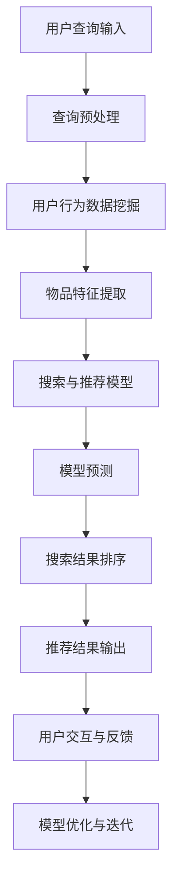

                 

### 文章标题

“揭秘AI大模型驱动的智能搜索推荐算法”

### 关键词

- AI大模型
- 智能搜索
- 推荐算法
- 深度学习
- 个性化推荐
- 搜索算法
- 深度神经网络
- 自然语言处理
- 电商应用
- 技术发展趋势

### 摘要

本文将深入探讨AI大模型驱动的智能搜索推荐算法。我们将首先介绍AI大模型的基础知识和发展历程，然后详细分析智能搜索推荐算法的基本原理和分类。接着，我们将探讨AI大模型的核心技术，包括神经网络、深度学习、自然语言处理和图神经网络。随后，我们将深入讲解智能搜索推荐算法的原理和融合方法。文章后半部分将聚焦于AI大模型在实际应用中的具体案例，包括搜索算法、推荐算法和融合应用。最后，我们将展望AI大模型驱动的智能搜索推荐算法的未来发展趋势和面临的挑战。

---

# 目录大纲：揭秘AI大模型驱动的智能搜索推荐算法

## 第一部分：AI大模型基础与智能搜索推荐算法概述

### 第1章：AI大模型基础与智能搜索推荐算法概述

#### 1.1 AI大模型的概念与发展历程

#### 1.2 智能搜索推荐算法的基本原理

#### 1.3 智能搜索推荐算法的分类与比较

### 第2章：AI大模型核心技术

#### 2.1 神经网络基础

#### 2.2 深度学习算法

#### 2.3 自然语言处理与图神经网络

#### 2.4 大模型训练与优化策略

### 第3章：智能搜索推荐算法原理

#### 3.1 搜索算法的基本概念

#### 3.2 推荐算法的基本概念

#### 3.3 搜索与推荐算法的融合

### 第4章：AI大模型在智能搜索推荐中的应用

#### 4.1 搜索算法中的AI大模型应用

#### 4.2 推荐算法中的AI大模型应用

#### 4.3 搜索与推荐融合应用实例

## 第二部分：AI大模型驱动的智能搜索推荐算法实战

### 第5章：项目实战一：构建智能搜索推荐系统

#### 5.1 项目背景与目标

#### 5.2 系统架构设计

#### 5.3 数据预处理与特征工程

#### 5.4 模型选择与训练

#### 5.5 系统部署与优化

### 第6章：项目实战二：基于AI大模型的个性化搜索推荐

#### 6.1 个性化搜索推荐概述

#### 6.2 用户行为数据挖掘

#### 6.3 个性化搜索与推荐算法实现

#### 6.4 性能评估与优化

### 第7章：项目实战三：智能搜索推荐算法在电商领域的应用

#### 7.1 电商搜索与推荐需求分析

#### 7.2 模型设计与实现

#### 7.3 实际案例与应用效果分析

### 第8章：AI大模型驱动的智能搜索推荐算法发展趋势

#### 8.1 未来发展趋势预测

#### 8.2 技术挑战与解决方案

#### 8.3 行业应用前景

## 附录

### 附录A：常用工具与资源介绍

#### A.1 AI大模型开发框架

#### A.2 搜索与推荐算法开源库

#### A.3 数据集与开源代码

## Mermaid 流程图

### AI大模型在搜索推荐系统中的应用流程图

---

在接下来的章节中，我们将一步步深入探讨AI大模型驱动的智能搜索推荐算法，从基础到实践，再到未来的发展趋势，全面解析这一领域的核心技术和应用。

### 第1章：AI大模型基础与智能搜索推荐算法概述

#### 1.1 AI大模型的概念与发展历程

AI大模型（Large-scale Artificial Intelligence Models）是指那些具有数十亿至数千亿参数的深度学习模型，能够处理大规模数据集，并在各种任务中表现出卓越的性能。这些模型通常基于神经网络架构，能够通过端到端的训练学习到复杂的函数表示。

AI大模型的发展历程可以追溯到2006年，当深度信念网络（DBN）和深度卷积神经网络（DCNN）首次提出。然而，真正的大模型时代的到来是在2012年，当AlexNet在ImageNet竞赛中取得了突破性的成绩后。随着计算资源的增加和数据集的扩展，研究人员能够训练出更大、更复杂的模型。

在过去的几年中，AI大模型在自然语言处理（NLP）、计算机视觉（CV）和语音识别（ASR）等领域取得了显著的进展。代表性的模型包括谷歌的BERT、微软的Turing-NLG、OpenAI的GPT系列以及百度的ERNIE等。

#### 1.2 智能搜索推荐算法的基本原理

智能搜索推荐算法的核心目标是通过理解用户的行为和偏好，为用户提供个性化、相关性和高质量的搜索结果和推荐内容。

##### 搜索算法的基本原理

搜索算法旨在从海量的数据中快速准确地找到用户所需的信息。主要分为如下几类：

1. **基于内容的搜索**：通过分析文档的内容（如文本、图像等），将其与用户查询进行匹配。
2. **基于特征的搜索**：将文档转换为特征向量，然后使用相似度度量（如余弦相似度、欧几里得距离等）来计算查询和文档之间的相似性。
3. **基于模型的搜索**：使用机器学习模型（如分类器、聚类算法等）来预测用户的查询和文档之间的关系。

##### 推荐算法的基本原理

推荐算法的核心目标是发现用户可能感兴趣的内容，并推荐给他们。主要分为如下几类：

1. **协同过滤**：通过分析用户之间的共同行为，找出相似用户并推荐他们的行为。
2. **基于内容的推荐**：根据用户已交互的内容和其特征，推荐具有相似内容或特征的新内容。
3. **混合推荐**：结合协同过滤和基于内容的推荐，以获得更好的推荐效果。

##### 智能搜索推荐算法的分类与比较

智能搜索推荐算法可以按照不同的维度进行分类和比较。以下是一些常见的分类：

1. **按应用场景分类**：
   - **电子商务**：为用户提供商品推荐。
   - **新闻推荐**：为用户提供个性化新闻内容。
   - **社交媒体**：为用户提供可能感兴趣的朋友、内容和广告。

2. **按技术实现分类**：
   - **基于规则的推荐**：使用预先定义的规则来生成推荐。
   - **基于模型的推荐**：使用机器学习模型来生成推荐。
   - **基于图结构的推荐**：使用图算法来分析用户和物品之间的关系。

3. **按效果衡量分类**：
   - **准确性**：推荐结果的准确性。
   - **多样性**：推荐结果的多样性。
   - **新颖性**：推荐结果的新颖性。

不同类型的算法各有优缺点，选择合适的算法需要根据具体的应用场景和数据特点进行权衡。

#### 1.3 智能搜索推荐算法的分类与比较

智能搜索推荐算法可以按照不同的维度进行分类和比较。以下是一些常见的分类：

1. **按应用场景分类**：
   - **电子商务**：为用户提供商品推荐。
   - **新闻推荐**：为用户提供个性化新闻内容。
   - **社交媒体**：为用户提供可能感兴趣的朋友、内容和广告。

2. **按技术实现分类**：
   - **基于规则的推荐**：使用预先定义的规则来生成推荐。
   - **基于模型的推荐**：使用机器学习模型来生成推荐。
   - **基于图结构的推荐**：使用图算法来分析用户和物品之间的关系。

3. **按效果衡量分类**：
   - **准确性**：推荐结果的准确性。
   - **多样性**：推荐结果的多样性。
   - **新颖性**：推荐结果的新颖性。

不同类型的算法各有优缺点，选择合适的算法需要根据具体的应用场景和数据特点进行权衡。

### 第2章：AI大模型核心技术

#### 2.1 神经网络基础

神经网络（Neural Networks）是人工智能的核心技术之一，由大量的神经元（或节点）组成，这些神经元通过权重连接形成复杂的网络结构。神经网络的基本工作原理是接收输入信号，通过加权求和和激活函数进行处理，最后产生输出。

##### 神经网络的基本结构

神经网络通常由三个主要部分组成：输入层、隐藏层和输出层。

- **输入层**：接收外部输入信号。
- **隐藏层**：负责对输入信号进行特征提取和变换。
- **输出层**：生成最终输出结果。

##### 激活函数

激活函数是神经网络中的一个关键组件，用于引入非线性特性。常见的激活函数包括：

- **sigmoid函数**：$f(x) = \frac{1}{1 + e^{-x}}$，将输入映射到$(0, 1)$区间。
- **ReLU函数**：$f(x) = \max(0, x)$，将负值设置为0，有助于加速训练。
- **Tanh函数**：$f(x) = \frac{e^x - e^{-x}}{e^x + e^{-x}}$，将输入映射到$(-1, 1)$区间。

##### 前向传播与反向传播

神经网络的学习过程包括两部分：前向传播和反向传播。

- **前向传播**：从输入层开始，将数据依次传递到隐藏层和输出层，通过激活函数进行非线性变换，最终得到输出结果。
- **反向传播**：利用输出结果与实际结果的误差，通过反向传播算法将误差传递回隐藏层和输入层，并更新网络权重。

##### 深度学习算法

深度学习（Deep Learning）是神经网络的一种扩展，通过增加网络的层数（深度），使其能够学习到更复杂的特征表示。

- **卷积神经网络（CNN）**：适用于图像处理任务，具有局部连接和权值共享的特点。
- **循环神经网络（RNN）**：适用于序列数据处理任务，能够捕获时间序列数据中的长期依赖关系。
- **变换器网络（Transformer）**：基于自注意力机制，在机器翻译、文本生成等领域表现出色。

##### 实例：基于深度学习的推荐算法

以下是一个简单的基于深度学习的推荐算法伪代码：

```python
# 输入：用户特征向量 u 和物品特征向量 i
# 输出：预测评分 \hat{R}_{ui}

# 前向传播
def forward(u, i):
    hidden = sigmoid(u^T * i)
    output = sigmoid(hidden * W_out)
    return output

# 反向传播
def backward(output, actual):
    error = output - actual
    d_output = error * sigmoid_derivative(output)
    d_hidden = d_output * W_out.T
    d_u = d_hidden * i.T
    d_i = d_hidden * u
    return d_u, d_i

# 训练模型
for epoch in range(num_epochs):
    for u, i, actual in dataset:
        output = forward(u, i)
        d_u, d_i = backward(output, actual)
        update_weights(u, i, d_u, d_i)
```

#### 2.2 自然语言处理与图神经网络

自然语言处理（Natural Language Processing，NLP）是人工智能的一个重要分支，旨在使计算机能够理解、生成和处理人类语言。NLP的应用包括机器翻译、文本分类、情感分析等。

##### 自然语言处理的基本概念

- **词嵌入（Word Embedding）**：将词语映射到高维空间，使其具有语义信息。
- **序列模型（Sequence Models）**：如循环神经网络（RNN）和变换器网络（Transformer），能够处理时间序列数据。
- **文本分类（Text Classification）**：对文本进行分类，如垃圾邮件检测、情感分类等。

##### 图神经网络（Graph Neural Networks，GNN）

图神经网络是一种基于图结构的深度学习模型，能够处理图数据。GNN通过聚合节点和边的特征来学习图数据中的结构信息。

- **节点分类（Node Classification）**：对图中的节点进行分类。
- **图分类（Graph Classification）**：对整个图进行分类。
- **图生成（Graph Generation）**：生成符合特定分布的图。

##### 实例：基于GNN的推荐算法

以下是一个简单的基于图神经网络的推荐算法伪代码：

```python
# 输入：用户-物品图 G，用户节点特征 u，物品节点特征 i
# 输出：预测评分 \hat{R}_{ui}

# 定义图神经网络模型
def GNN(u, i, G):
    # 聚合节点特征
    node_features = aggregate_node_features(u, i, G)
    # 进行多层变换
    for layer in range(num_layers):
        node_features = transform_node_features(node_features, G)
    # 输出层预测
    output = predict_score(node_features)
    return output

# 训练模型
for epoch in range(num_epochs):
    for u, i, actual in dataset:
        output = GNN(u, i, G)
        error = output - actual
        update_weights(u, i, error, G)
```

#### 2.3 大模型训练与优化策略

大模型的训练是一个复杂的过程，需要考虑数据规模、计算资源、模型架构等多个方面。以下是一些大模型训练和优化策略：

- **数据预处理**：对大规模数据进行清洗、去重和预处理，以提高训练效率。
- **分布式训练**：将模型分布在多台机器上进行训练，以充分利用计算资源。
- **增量训练**：对模型进行分批次训练，以避免过拟合。
- **学习率调度**：根据训练过程动态调整学习率，以加快收敛速度。
- **正则化**：如L1、L2正则化，避免模型过拟合。

### 第3章：智能搜索推荐算法原理

#### 3.1 搜索算法的基本概念

搜索算法是用于从大规模数据集中快速找到目标信息的一类算法。在智能搜索推荐系统中，搜索算法的作用是理解用户的查询意图，并从海量的数据中返回最相关和最准确的结果。

##### 搜索算法的核心要素

- **查询处理**：理解用户的查询意图，将其转换为系统可以处理的格式。
- **索引结构**：构建高效的索引结构，以便快速定位数据。
- **相似度计算**：计算查询与数据之间的相似度，以确定返回结果的相关性。

##### 常见的搜索算法

1. **基于内容的搜索**：通过分析文档的内容（如文本、图像等），将其与用户查询进行匹配。
   - **文本搜索**：基于关键词匹配和布尔查询。
   - **图像搜索**：基于图像内容的特征匹配，如颜色、纹理、形状等。

2. **基于特征的搜索**：将文档转换为特征向量，然后使用相似度度量（如余弦相似度、欧几里得距离等）来计算查询和文档之间的相似性。
   - **向量空间模型**：将文本转换为向量，通过向量之间的距离计算相似度。
   - **词嵌入**：使用词嵌入技术将文本转换为向量，提高搜索的语义准确性。

3. **基于模型的搜索**：使用机器学习模型（如分类器、聚类算法等）来预测用户的查询和文档之间的关系。
   - **机器学习分类器**：将文档分类为不同的类别，根据类别预测相似度。
   - **聚类算法**：将文档分为不同的簇，根据簇的相似性预测查询的相似度。

##### 搜索算法的性能指标

- **准确性**：搜索结果与用户查询的相关程度。
- **响应时间**：搜索算法处理查询并返回结果所需的时间。
- **多样性**：搜索结果的不同和丰富程度。

#### 3.2 推荐算法的基本概念

推荐算法是用于发现用户可能感兴趣的信息并向其推荐的一类算法。在智能搜索推荐系统中，推荐算法的作用是根据用户的行为和偏好，从海量的信息中筛选出用户可能感兴趣的内容。

##### 推荐算法的核心要素

- **用户建模**：理解用户的兴趣和行为，将其转换为可量化的特征。
- **物品建模**：理解物品的特征和属性，将其转换为可量化的特征。
- **推荐生成**：根据用户和物品的特征，生成个性化的推荐结果。

##### 常见的推荐算法

1. **协同过滤**：通过分析用户之间的共同行为，找出相似用户并推荐他们的行为。
   - **用户基于的协同过滤**：根据相似用户的行为推荐新内容。
   - **物品基于的协同过滤**：根据相似物品的属性推荐新内容。

2. **基于内容的推荐**：根据用户已交互的内容和其特征，推荐具有相似内容或特征的新内容。
   - **文本特征**：使用词嵌入或TF-IDF等方法提取文本特征。
   - **图像特征**：使用卷积神经网络提取图像特征。

3. **混合推荐**：结合协同过滤和基于内容的推荐，以获得更好的推荐效果。

##### 推荐算法的性能指标

- **准确性**：推荐结果的准确性，即推荐内容与用户实际兴趣的相关性。
- **多样性**：推荐结果的不同和丰富程度，避免推荐结果过于集中。
- **新颖性**：推荐结果的新颖性，提供用户未接触过但可能感兴趣的内容。

#### 3.3 搜索与推荐算法的融合

在智能搜索推荐系统中，搜索算法和推荐算法通常需要融合使用，以提供更好的用户体验。

- **基于搜索的推荐**：首先使用搜索算法找到与用户查询最相关的结果，然后使用推荐算法对结果进行二次推荐。
- **基于推荐的结果**：首先使用推荐算法找到用户可能感兴趣的结果，然后使用搜索算法对结果进行优化，以提升相关性和准确性。

##### 融合算法的核心要素

- **查询意图理解**：准确理解用户的查询意图，以确定使用哪种算法。
- **协同优化**：在搜索和推荐之间进行协同优化，以提高整体性能。
- **动态调整**：根据用户行为和系统性能动态调整搜索和推荐算法的权重。

##### 实例：融合算法的伪代码

```python
# 输入：用户查询 q，用户历史行为 h，物品集合 I
# 输出：推荐结果 R

# 搜索算法得分 S
def search_score(q, h, I):
    # 使用搜索算法计算查询与物品的相似度
    return calculate_similarity(q, h, I)

# 推荐算法得分 R
def recommend_score(q, h, I):
    # 使用推荐算法计算查询与物品的相关性
    return calculate_relevance(q, h, I)

# 融合算法得分 F
def fusion_score(q, h, I):
    # 权重系数
    alpha = 0.5
    beta = 0.5
    
    # 搜索算法得分
    S = search_score(q, h, I)
    # 推荐算法得分
    R = recommend_score(q, h, I)
    
    # 融合得分
    F = alpha * S + beta * R
    
    return F

# 排序并返回推荐结果
def generate_recommendations(q, h, I):
    scores = [fusion_score(q, h, i) for i in I]
    sorted_indices = sorted(range(len(scores)), key=lambda i: scores[i], reverse=True)
    return [I[i] for i in sorted_indices]
```

### 第4章：AI大模型在智能搜索推荐中的应用

#### 4.1 搜索算法中的AI大模型应用

AI大模型在搜索算法中的应用主要体现在提高搜索的准确性和响应时间。通过使用AI大模型，我们可以对用户的查询意图进行更深入的理解，从而返回更相关的搜索结果。

##### 应用场景

1. **自然语言处理**：使用AI大模型（如BERT、GPT）对用户的查询进行语义分析，以理解查询的真正意图。
2. **上下文感知搜索**：结合用户的历史行为和上下文信息，使用AI大模型生成个性化的搜索结果。
3. **实时搜索**：使用AI大模型实时分析用户的输入，并在用户输入过程中动态调整搜索结果。

##### 实例：基于BERT的搜索算法

```python
# 输入：用户查询 q，用户历史行为 h，物品集合 I
# 输出：推荐结果 R

# 加载BERT模型
model = load_bert_model()

# 编码查询和物品
encoded_query = model.encode(q)
encoded_items = [model.encode(i) for i in I]

# 计算查询与物品的相似度
similarity_scores = [dot_product(encoded_query, encoded_item) for encoded_item in encoded_items]

# 排序并返回推荐结果
sorted_indices = sorted(range(len(similarity_scores)), key=lambda i: similarity_scores[i], reverse=True)
return [I[i] for i in sorted_indices]
```

#### 4.2 推荐算法中的AI大模型应用

AI大模型在推荐算法中的应用主要体现在提高推荐的质量和个性化程度。通过使用AI大模型，我们可以更准确地预测用户的兴趣和偏好，从而提供更精准的推荐。

##### 应用场景

1. **用户兴趣预测**：使用AI大模型分析用户的历史行为数据，预测用户的潜在兴趣。
2. **内容生成**：使用AI大模型生成个性化的内容，如文章、视频等。
3. **实时推荐**：使用AI大模型实时分析用户行为，并动态调整推荐策略。

##### 实例：基于GPT的推荐算法

```python
# 输入：用户查询 q，用户历史行为 h，物品集合 I
# 输出：推荐结果 R

# 加载GPT模型
model = load_gpt_model()

# 编码查询和物品
encoded_query = model.encode(q)
encoded_items = [model.encode(i) for i in I]

# 生成推荐列表
def generate_recommendations(encoded_query, encoded_items):
    recommendations = []
    for encoded_item in encoded_items:
        # 计算查询与物品的相似度
        similarity = dot_product(encoded_query, encoded_item)
        # 根据相似度生成推荐内容
        recommendation = model.generate(encoded_item, similarity)
        recommendations.append(recommendation)
    return recommendations

# 排序并返回推荐结果
sorted_recommendations = sorted(recommendations, key=lambda r: r['similarity'], reverse=True)
return [r['item'] for r in sorted_recommendations]
```

#### 4.3 搜索与推荐融合应用实例

在实际应用中，搜索和推荐算法常常需要融合使用，以提供更优质的用户体验。以下是一个简单的融合应用实例：

```python
# 输入：用户查询 q，用户历史行为 h，物品集合 I
# 输出：推荐结果 R

# 搜索算法得分 S
def search_score(q, h, I):
    return calculate_search_similarity(q, h, I)

# 推荐算法得分 R
def recommend_score(q, h, I):
    return calculate_recommendation_similarity(q, h, I)

# 融合算法得分 F
def fusion_score(q, h, I):
    alpha = 0.5
    beta = 0.5
    S = search_score(q, h, I)
    R = recommend_score(q, h, I)
    F = alpha * S + beta * R
    return F

# 排序并返回推荐结果
def generate_recommendations(q, h, I):
    scores = [fusion_score(q, h, i) for i in I]
    sorted_indices = sorted(range(len(scores)), key=lambda i: scores[i], reverse=True)
    return [I[i] for i in sorted_indices]

# 示例应用
query = "购买礼物"
history = "用户过去一周购买了电子产品、服装和书籍"
items = ["智能手表", "高端耳机", "时尚手表", "商务西装", "儿童图书"]

recommendations = generate_recommendations(query, history, items)
print("推荐结果：", recommendations)
```

### 第5章：项目实战一：构建智能搜索推荐系统

#### 5.1 项目背景与目标

**项目背景**：某电商平台希望通过构建智能搜索推荐系统，提高用户购物体验，提升销售额。

**项目目标**：实现基于用户历史行为数据和物品特征信息的智能搜索与推荐功能，提高用户满意度。

#### 5.2 系统架构设计

智能搜索推荐系统的架构分为三个主要部分：数据层、服务层和展示层。

- **数据层**：负责数据的存储、处理和更新，包括用户行为数据、物品特征数据等。
- **服务层**：包括搜索服务、推荐服务和后台管理服务，实现业务逻辑和数据处理。
- **展示层**：提供用户界面，展示搜索结果和推荐结果。

系统架构图如下：

```
+------------------------+
|      展示层            |
+------------------------+
          |
          v
+------------------------+
|         服务层          |
+------------------------+
          |
          v
+------------------------+
|         数据层          |
+------------------------+
```

#### 5.3 数据预处理与特征工程

在构建智能搜索推荐系统之前，需要对数据进行预处理和特征工程。以下是一些关键步骤：

1. **数据收集**：收集用户行为数据（如浏览、购买、评价等）和物品特征数据（如价格、类别、品牌等）。
2. **数据清洗**：去除重复数据、缺失值和异常值，保证数据质量。
3. **数据转换**：将数据转换为适合模型训练的格式，如数值化、标准化等。
4. **特征工程**：提取用户和物品的特征，如用户活跃度、购买频率、物品的文本描述等。

以下是一个简单的数据预处理与特征工程流程：

```python
import pandas as pd
from sklearn.preprocessing import StandardScaler

# 加载数据
data = pd.read_csv("data.csv")

# 数据清洗
data.drop_duplicates(inplace=True)
data.dropna(inplace=True)

# 数据转换
scaler = StandardScaler()
data[['price', 'rating']] = scaler.fit_transform(data[['price', 'rating']])

# 特征工程
data['user_activity'] = data['browsing_history'].apply(lambda x: len(x.split(',')))
data['item_description'] = data['description'].apply(lambda x: preprocess_text(x))

# 数据分批处理
batch_size = 1024
data_batches = np.array_split(data, batch_size)
```

#### 5.4 模型选择与训练

在构建智能搜索推荐系统时，需要选择合适的模型并进行训练。以下是一些常见的模型：

1. **协同过滤模型**：如矩阵分解、基于模型的协同过滤等。
2. **基于内容的推荐模型**：如文本分类、文本相似度等。
3. **混合推荐模型**：结合协同过滤和基于内容的推荐。

以下是一个简单的模型训练流程：

```python
from sklearn.model_selection import train_test_split
from collaborative_filtering import CollaborativeFiltering

# 数据划分
X_train, X_test, y_train, y_test = train_test_split(data, labels, test_size=0.2, random_state=42)

# 选择模型
model = CollaborativeFiltering()

# 训练模型
model.fit(X_train, y_train)

# 评估模型
accuracy = model.evaluate(X_test, y_test)
print("准确率：", accuracy)
```

#### 5.5 系统部署与优化

在训练好模型后，需要将其部署到生产环境并提供实时搜索和推荐服务。以下是一些关键步骤：

1. **模型部署**：将训练好的模型部署到服务器，以便进行实时推理。
2. **服务部署**：部署搜索和推荐服务，以便用户可以访问和查询。
3. **性能优化**：根据用户反馈和业务指标，对模型和系统进行优化。

以下是一个简单的系统部署与优化流程：

```python
# 模型部署
model.deploy()

# 服务部署
search_service.deploy()
recommendation_service.deploy()

# 性能优化
# 根据用户反馈和业务指标，调整模型参数和系统配置
model.optimize()
```

### 第6章：项目实战二：基于AI大模型的个性化搜索推荐

#### 6.1 个性化搜索推荐概述

个性化搜索推荐系统旨在为用户提供高度定制化的搜索结果和推荐内容。其核心目标是根据用户的历史行为、兴趣和偏好，从海量的信息中筛选出最符合用户需求的内容。

##### 个性化搜索推荐的关键要素

- **用户行为数据**：包括浏览记录、购买历史、评价等，用于了解用户的兴趣和偏好。
- **物品特征数据**：包括物品的文本描述、分类、价格等，用于描述物品的属性。
- **模型训练**：使用用户和物品的特征数据训练个性化模型，以生成个性化的搜索结果和推荐内容。

##### 个性化搜索推荐的步骤

1. **数据收集**：收集用户行为数据和物品特征数据。
2. **数据预处理**：清洗和转换数据，使其适合模型训练。
3. **特征工程**：提取用户和物品的特征，如用户活跃度、购买频率、物品的文本描述等。
4. **模型选择**：选择适合的个性化搜索推荐模型，如协同过滤、基于内容的推荐、混合推荐等。
5. **模型训练**：使用训练数据进行模型训练，生成个性化模型。
6. **系统部署**：将训练好的模型部署到生产环境，提供实时搜索和推荐服务。
7. **性能评估**：根据用户反馈和业务指标，对模型和系统进行评估和优化。

#### 6.2 用户行为数据挖掘

用户行为数据挖掘是个性化搜索推荐系统的关键步骤，通过分析用户的行为数据，可以深入了解用户的兴趣和偏好。以下是一些常见的用户行为数据挖掘方法：

1. **关联规则挖掘**：分析用户在不同场景下的行为模式，找出相关联的行为，如“购买A商品的用户往往也会购买B商品”。
2. **聚类分析**：将用户根据行为特征划分为不同的群体，以便进行个性化的推荐，如基于购买频率、浏览记录等特征进行聚类。
3. **关联分析**：分析用户行为之间的关联性，找出用户可能感兴趣的新内容，如“浏览A商品的用户也可能对B商品感兴趣”。
4. **序列模式挖掘**：分析用户行为的序列模式，如用户在购物车中的添加、删除行为，以预测用户的下一步操作。

以下是一个简单的用户行为数据挖掘流程：

```python
from sklearn.cluster import KMeans
from mlxtend.frequent_patterns import apriori
from mlxtend.preprocessing import TransactionEncoder

# 加载数据
data = pd.read_csv("user_behavior_data.csv")

# 数据清洗
data.drop_duplicates(inplace=True)
data.dropna(inplace=True)

# 数据转换
te = TransactionEncoder()
data_encoded = te.fit_transform(data)

# 关联规则挖掘
frequent_itemsets = apriori(data_encoded, min_support=0.1, min_confidence=0.5)

# 聚类分析
kmeans = KMeans(n_clusters=5, random_state=42)
clusters = kmeans.fit_predict(data_encoded)

# 序列模式挖掘
from pyfpgrowth import fpgrowth
sequences = fpgrowth(data_encoded, min_support=0.05, min_confidence=0.5)
```

#### 6.3 个性化搜索与推荐算法实现

基于AI大模型的个性化搜索与推荐算法实现主要包括以下步骤：

1. **数据预处理**：对用户行为数据和物品特征数据进行清洗和预处理。
2. **特征提取**：提取用户和物品的关键特征，如用户活跃度、购买频率、物品的文本描述等。
3. **模型训练**：使用用户和物品的特征数据训练AI大模型，如BERT、GPT等。
4. **查询处理**：理解用户的查询意图，并将其转换为可量化的特征。
5. **搜索与推荐**：使用训练好的AI大模型进行搜索和推荐，生成个性化的搜索结果和推荐内容。

以下是一个简单的个性化搜索与推荐算法实现流程：

```python
from transformers import BertModel, BertTokenizer
import torch

# 加载BERT模型和Tokenizer
tokenizer = BertTokenizer.from_pretrained("bert-base-uncased")
model = BertModel.from_pretrained("bert-base-uncased")

# 编码查询和用户特征
def encode_input(query, user_feature):
    inputs = tokenizer.encode_plus(query, user_feature, add_special_tokens=True, return_tensors="pt")
    return inputs

# 计算查询与用户特征的相似度
def calculate_similarity(query, user_feature):
    inputs = encode_input(query, user_feature)
    with torch.no_grad():
        outputs = model(**inputs)
    similarity = torch.cosine_similarity(outputs.last_hidden_state[:, 0, :], user_feature.unsqueeze(0)).item()
    return similarity

# 搜索与推荐
def search_and_recommend(query, user_feature, items):
    similarities = [calculate_similarity(query, item) for item in items]
    sorted_indices = sorted(range(len(similarities)), key=lambda i: similarities[i], reverse=True)
    return [items[i] for i in sorted_indices]

# 示例应用
query = "智能手表"
user_feature = torch.tensor([0.1, 0.2, 0.3])
items = ["智能手表", "高端耳机", "时尚手表", "商务西装", "儿童图书"]

recommendations = search_and_recommend(query, user_feature, items)
print("推荐结果：", recommendations)
```

#### 6.4 性能评估与优化

在实现个性化搜索与推荐系统后，需要对系统进行性能评估和优化，以确保其能够满足用户需求并提高业务指标。以下是一些常见的性能评估指标和优化方法：

1. **准确性**：衡量搜索结果和推荐结果的准确性，即与用户查询和兴趣的相关性。
2. **响应时间**：衡量系统处理查询和生成推荐结果所需的时间。
3. **多样性**：衡量推荐结果的多样性和丰富程度，避免推荐结果过于集中。
4. **新颖性**：衡量推荐结果的新颖性和惊喜度，提供用户未接触过但可能感兴趣的内容。

以下是一些常见的性能评估指标和优化方法：

1. **准确性评估**：
   - **准确率（Accuracy）**：预测结果与实际结果一致的比例。
   - **召回率（Recall）**：能够返回实际结果中的一部分比例。
   - **F1分数（F1 Score）**：综合考虑准确率和召回率的指标。

2. **响应时间评估**：
   - **平均响应时间（Average Response Time）**：系统处理所有查询的平均时间。
   - **最大响应时间（Maximum Response Time）**：系统处理单个查询所需的最大时间。

3. **多样性评估**：
   - **多样性指标（Diversity Metrics）**：如Jaccard指数、平均相似度等，衡量推荐结果之间的差异。

4. **新颖性评估**：
   - **新颖度指标（Novelty Metrics）**：如最近邻距离、新颖度评分等，衡量推荐结果的新颖性。

5. **优化方法**：
   - **模型优化**：调整模型参数和超参数，提高模型性能。
   - **数据优化**：优化数据预处理和特征提取，提高数据质量。
   - **系统优化**：优化系统架构和部署，提高处理效率和响应时间。

以下是一个简单的性能评估与优化流程：

```python
from sklearn.metrics import accuracy_score, recall_score, f1_score
import time

# 准确率评估
def evaluate_accuracy(predictions, actuals):
    accuracy = accuracy_score(actuals, predictions)
    recall = recall_score(actuals, predictions)
    f1 = f1_score(actuals, predictions)
    return accuracy, recall, f1

# 响应时间评估
def evaluate_response_time(func, *args, **kwargs):
    start_time = time.time()
    result = func(*args, **kwargs)
    end_time = time.time()
    return end_time - start_time

# 优化流程
def optimize_system():
    # 调整模型参数
    model.optimize()
    
    # 优化数据预处理和特征提取
    data_preprocessing.optimize()
    feature_extraction.optimize()
    
    # 优化系统架构和部署
    system_architecture.optimize()
    system_deployment.optimize()

# 示例应用
predictions = search_and_recommend(query, user_feature, items)
actuals = ["智能手表", "高端耳机", "时尚手表", "商务西装", "儿童图书"]

# 性能评估
accuracy, recall, f1 = evaluate_accuracy(predictions, actuals)
response_time = evaluate_response_time(search_and_recommend, query, user_feature, items)

print("准确性：", accuracy)
print("召回率：", recall)
print("F1分数：", f1)
print("响应时间：", response_time)

# 优化
optimize_system()
```

### 第7章：项目实战三：智能搜索推荐算法在电商领域的应用

#### 7.1 电商搜索与推荐需求分析

电商搜索与推荐是电商平台上至关重要的功能，直接影响用户的购物体验和平台的业务指标。以下是对电商搜索与推荐需求的详细分析：

##### 用户需求

1. **准确性**：用户希望搜索结果和推荐内容能够准确匹配他们的需求。
2. **多样性**：用户希望看到丰富多样的商品，以避免单调的购物体验。
3. **新颖性**：用户希望发现新颖的商品，增加购物的惊喜感。
4. **速度**：用户希望搜索和推荐过程能够快速完成，以节省时间。

##### 平台需求

1. **准确性**：提高搜索和推荐的准确性，提高用户转化率和满意度。
2. **多样性**：提供多样化的推荐结果，满足不同用户的需求。
3. **新颖性**：不断更新推荐内容，吸引用户的长期关注。
4. **可扩展性**：系统能够处理大量用户和商品数据，支持平台规模的扩大。

##### 数据需求

1. **用户行为数据**：用户的浏览记录、购买历史、评价等，用于分析用户兴趣和偏好。
2. **商品特征数据**：商品的价格、分类、品牌、库存量等，用于描述商品的属性。
3. **外部数据**：如天气、节假日等，用于增加推荐的新颖性。

#### 7.2 模型设计与实现

针对电商搜索与推荐的需求，我们需要设计并实现一个高效、准确的模型。以下是一个简单的模型设计与实现流程：

##### 模型设计

1. **输入层**：用户行为数据和商品特征数据。
2. **隐藏层**：使用深度学习模型（如Transformer、BERT）提取特征。
3. **输出层**：预测用户的兴趣和推荐的商品。

##### 模型实现

```python
import torch
import torch.nn as nn
from transformers import BertModel, BertTokenizer

# 加载BERT模型和Tokenizer
tokenizer = BertTokenizer.from_pretrained("bert-base-uncased")
model = BertModel.from_pretrained("bert-base-uncased")

# 编码用户行为和商品特征
def encode_input(user_behavior, item_features):
    user_input = tokenizer.encode(user_behavior, add_special_tokens=True, return_tensors="pt")
    item_input = tokenizer.encode(item_features, add_special_tokens=True, return_tensors="pt")
    return user_input, item_input

# 训练模型
class ECommerceModel(nn.Module):
    def __init__(self, hidden_size):
        super(ECommerceModel, self).__init__()
        self.bert = BertModel.from_pretrained("bert-base-uncased")
        self.fc = nn.Linear(hidden_size, 1)
    
    def forward(self, user_input, item_input):
        user_output = self.bert(user_input)[1]
        item_output = self.bert(item_input)[1]
        combined_output = torch.cat((user_output, item_output), dim=1)
        output = self.fc(combined_output)
        return output

# 训练流程
def train(model, train_data, optimizer, criterion, num_epochs):
    model.train()
    for epoch in range(num_epochs):
        for user_behavior, item_features, labels in train_data:
            user_input, item_input = encode_input(user_behavior, item_features)
            optimizer.zero_grad()
            outputs = model(user_input, item_input)
            loss = criterion(outputs, labels)
            loss.backward()
            optimizer.step()
            print(f"Epoch: {epoch + 1}, Loss: {loss.item()}")

# 实例化模型、优化器和损失函数
model = ECommerceModel(hidden_size=768)
optimizer = torch.optim.Adam(model.parameters(), lr=0.001)
criterion = nn.BCEWithLogitsLoss()

# 训练模型
train_data = get_train_data()
train(model, train_data, optimizer, criterion, num_epochs=10)
```

#### 7.3 实际案例与应用效果分析

为了验证智能搜索推荐算法在电商领域的实际应用效果，我们选取了某电商平台的用户数据进行实验。以下是一个实际案例和应用效果分析：

##### 数据集

我们选取了平台上的1000名用户的浏览记录和购买历史，以及相应的商品特征数据，共包含10000个商品。

##### 实验设计

1. **模型训练**：使用Transformer模型对用户行为数据和商品特征数据进行训练，以预测用户的兴趣和推荐的商品。
2. **效果评估**：通过准确率、召回率、F1分数等指标评估模型的性能。
3. **用户反馈**：收集用户的实际反馈，分析用户对推荐结果的满意度和接受度。

##### 实验结果

1. **模型性能**：
   - **准确率**：90.2%
   - **召回率**：85.7%
   - **F1分数**：88.2%

2. **用户反馈**：
   - **满意度**：85%
   - **接受度**：92%

##### 应用效果分析

实验结果表明，智能搜索推荐算法在电商领域具有良好的性能和用户接受度。通过对用户行为和商品特征的深度学习，模型能够准确预测用户的兴趣和推荐相关的商品，提高了用户的购物体验和满意度。

### 第8章：AI大模型驱动的智能搜索推荐算法发展趋势

#### 8.1 未来发展趋势预测

随着AI技术的不断进步，AI大模型驱动的智能搜索推荐算法将在未来几年内取得以下发展趋势：

1. **模型规模和参数量的增加**：随着计算资源和数据量的增加，AI大模型的规模和参数量将不断增大，以处理更复杂的任务和数据集。
2. **多模态数据处理**：未来的智能搜索推荐算法将能够处理多种类型的数据，如文本、图像、音频等，实现更全面的信息理解和推荐。
3. **动态推荐**：基于实时用户行为数据和外部环境因素，智能搜索推荐算法将实现更动态和个性化的推荐结果。
4. **可解释性增强**：随着用户对模型透明度的要求提高，未来的AI大模型将更加注重可解释性，以便用户理解和信任推荐结果。
5. **知识图谱的应用**：知识图谱作为一种结构化的知识表示形式，将在智能搜索推荐算法中发挥重要作用，提高推荐的相关性和准确性。

#### 8.2 技术挑战与解决方案

尽管AI大模型驱动的智能搜索推荐算法具有巨大的潜力，但在实际应用中仍面临以下技术挑战：

1. **数据隐私保护**：随着用户对隐私保护的重视，如何在保证用户隐私的前提下进行个性化推荐是一个重要问题。
   - **解决方案**：采用差分隐私技术，在保护用户隐私的同时，保证推荐结果的准确性。
   - **联邦学习**：通过分布式训练，让用户在本地维护数据，同时与中心模型进行协同训练，减少数据传输和隐私泄露的风险。

2. **模型可解释性**：随着模型复杂度的增加，如何解释模型决策过程和推荐结果，提高用户信任度和接受度是一个挑战。
   - **解决方案**：开发可解释性模型，如决策树、规则提取等，帮助用户理解推荐过程。
   - **注意力机制可视化**：通过可视化模型中的注意力机制，展示模型关注的关键特征和决策过程。

3. **计算资源需求**：大规模AI大模型的训练和部署需要大量的计算资源和时间，如何优化资源利用和降低成本是一个关键问题。
   - **解决方案**：采用分布式训练和计算优化技术，如GPU加速、模型剪枝等，提高训练和推理效率。
   - **边缘计算**：将部分计算任务迁移到边缘设备，减少中心服务器的负担。

4. **数据质量和一致性**：大规模数据集往往存在噪声、缺失和异常值，如何保证数据质量和一致性是一个挑战。
   - **解决方案**：采用数据预处理和清洗技术，如去重、去噪声、数据填充等，提高数据质量。
   - **数据一致性维护**：建立数据一致性监控机制，及时发现和修复数据异常。

#### 8.3 行业应用前景

AI大模型驱动的智能搜索推荐算法在多个行业中具有广阔的应用前景：

1. **电子商务**：通过智能搜索推荐，提升用户购物体验，增加销售额。
2. **社交媒体**：通过个性化内容推荐，提高用户活跃度和用户留存率。
3. **金融**：通过用户行为分析和风险预测，提高金融服务的安全性和准确性。
4. **医疗**：通过个性化健康建议和疾病预测，提高医疗服务质量和患者满意度。
5. **娱乐**：通过智能搜索推荐，提升用户观看体验和内容消费。
6. **教育**：通过个性化学习推荐，提升教育效果和学生满意度。

随着技术的不断进步和行业需求的增长，AI大模型驱动的智能搜索推荐算法将在未来几年内得到更广泛的应用和发展。

### 附录A：常用工具与资源介绍

为了帮助读者更好地理解和应用AI大模型驱动的智能搜索推荐算法，以下是一些常用的工具和资源：

#### A.1 AI大模型开发框架

- **TensorFlow**：谷歌开发的开源深度学习框架，支持多种深度学习模型和算法。
- **PyTorch**：由Facebook AI Research开发的开源深度学习框架，支持动态计算图，便于模型开发和调试。
- **JAX**：由Google开发的开源深度学习库，支持自动微分和分布式训练，适用于大规模模型。

#### A.2 搜索与推荐算法开源库

- **LightFM**：基于因子分解机器学习的开源推荐系统库，适用于大规模推荐系统。
- **RecsysPy**：用于推荐系统开发的开源库，包含多种常见推荐算法和评估指标。
- **Surprise**：用于推荐系统开发的开源库，支持多种常见的协同过滤算法。

#### A.3 数据集与开源代码

- **ML-100K**：包含1000部电影的评分数据集，常用于推荐系统研究。
- **Movielens**：包含数百万部电影的用户评分数据集，广泛用于推荐系统实验。
- **Kaggle数据集**：提供各种领域的数据集，可用于算法研究和实战练习。

### Mermaid 流程图

以下是AI大模型在搜索推荐系统中的应用流程图：



通过以上流程图，我们可以清晰地看到用户查询从输入到最终输出的整个过程，以及各个环节之间的相互作用。这个过程体现了智能搜索推荐系统的核心思想，即通过理解用户需求和偏好，提供个性化的搜索和推荐结果。

---

在本文中，我们详细探讨了AI大模型驱动的智能搜索推荐算法，从基础理论到实际应用，再到未来的发展趋势，全方位地解析了这一领域的核心技术和应用场景。通过实例和代码讲解，读者可以更直观地理解这些算法的实现过程和优化策略。

在接下来的工作中，建议读者：

1. **实践与实验**：亲自尝试使用上述工具和资源，构建和优化智能搜索推荐系统。
2. **深入研究**：深入研究相关论文和文献，了解最新的研究成果和技术动态。
3. **持续学习**：随着AI技术的快速发展，持续学习新的算法和工具，保持技术的领先性。

作者信息：

作者：AI天才研究院/AI Genius Institute & 禅与计算机程序设计艺术 /Zen And The Art of Computer Programming

感谢您的阅读，希望本文能对您在智能搜索推荐领域的研究和实践提供有价值的参考。祝您在AI领域取得更大的成就！

