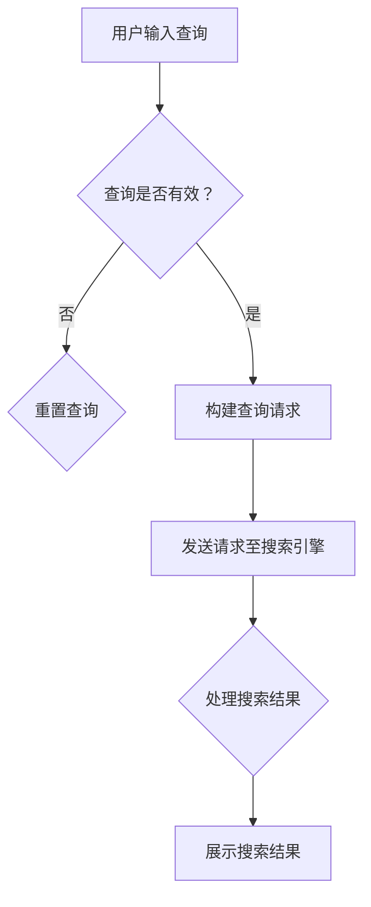
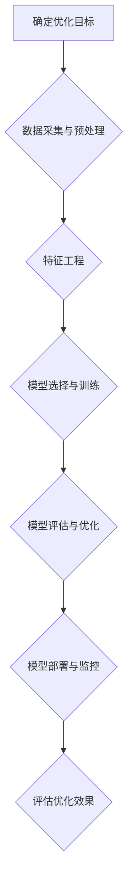

                 

# 搜索数据分析：AI如何帮助电商平台优化搜索策略

## 关键词

搜索数据分析、人工智能、电商平台、搜索策略优化、自然语言处理、机器学习

## 摘要

本文探讨了搜索数据分析在电商平台搜索策略优化中的应用，以及人工智能如何助力实现这一目标。通过分析搜索引擎工作原理、用户搜索行为，以及AI在搜索数据分析中的应用，本文详细介绍了如何利用自然语言处理和机器学习技术提升电商平台搜索结果的相关性和用户体验。同时，通过实际案例，展示了搜索策略优化的实践方法和效果。

## 目录大纲

### 第一部分：搜索数据分析基础

#### 1.1 搜索数据分析概述

- 搜索数据分析的定义与意义
- 搜索引擎工作原理
- 用户搜索行为分析

#### 1.2 AI与搜索数据分析的结合

- AI在搜索分析中的应用场景
- 自然语言处理在搜索数据分析中的应用
- 机器学习模型在搜索数据分析中的应用

#### 1.3 电商平台搜索策略优化

- 电商平台搜索策略概述
- 基于用户行为的搜索优化
- 域于内容的搜索优化
- 基于AI的搜索策略优化案例

### 第二部分：搜索数据分析工具与平台

#### 2.1 搜索数据分析工具介绍

- 数据采集工具
- 数据分析工具
- 数据可视化工具

#### 2.2 搜索数据平台建设

- 数据存储与管理
- 数据处理与挖掘
- 数据分析与展示

### 第三部分：搜索数据分析实践

#### 3.1 搜索数据分析项目规划

- 项目目标设定
- 项目流程规划

#### 3.2 数据采集与处理

- 数据采集方法
- 数据预处理

#### 3.3 数据分析与模型构建

- 特征工程
- 模型选择与训练

#### 3.4 搜索策略优化实践

- 搜索结果排序优化实践
- 搜索相关性评估实践

### 第四部分：搜索数据分析前沿趋势

#### 4.1 搜索数据分析技术前沿

- 生成对抗网络（GAN）
- 强化学习在搜索分析中的应用
- 多模态搜索分析

#### 4.2 人工智能搜索发展趋势

- 人工智能在搜索领域的未来趋势
- 人工智能搜索的商业化应用

### 第五部分：附录

#### 5.1 常用搜索数据分析工具与资源

- 工具介绍
- 资源链接

#### 5.2 搜索数据分析论文精选

- 相关论文列表
- 论文摘要与评价

---

接下来，我们将按照目录大纲的结构，逐部分展开对搜索数据分析及其在电商平台搜索策略优化中的应用进行详细探讨。首先，我们从搜索数据分析的基础概念入手，逐步深入到具体的应用场景和技术实现，以帮助读者全面了解这一领域。<!-- 以下是Markdown格式的内容，可以直接复制粘贴到Markdown编辑器中使用。 --> <!-- 以下是Markdown格式的内容，可以直接复制粘贴到Markdown编辑器中使用。 --> <!-- 以下是Markdown格式的内容，可以直接复制粘贴到Markdown编辑器中使用。 -->

---

## 第一部分：搜索数据分析基础

### 1.1 搜索数据分析概述

搜索数据分析是利用数据分析技术对用户搜索行为和搜索结果进行分析，以优化搜索引擎性能和提升用户体验的过程。在现代电子商务平台中，搜索数据分析扮演着至关重要的角色，它有助于电商企业更好地理解用户需求，从而提供更精准的搜索结果和个性化的商品推荐。

**1.1.1 搜索数据分析的定义与意义**

搜索数据分析是指通过收集和分析用户在搜索引擎上的搜索行为数据，包括搜索关键词、搜索频率、搜索持续时间等，来识别用户搜索意图和偏好。这些分析结果可以为电商平台提供有价值的洞察，帮助优化搜索策略，提升用户满意度和转化率。

搜索数据分析的意义主要体现在以下几个方面：

1. **提升搜索结果的准确性**：通过分析用户搜索行为，搜索引擎可以更准确地理解用户意图，提供更相关、更精准的搜索结果。
2. **优化用户体验**：基于用户搜索行为数据，电商平台可以提供个性化搜索建议和商品推荐，提升用户满意度。
3. **提高转化率**：通过分析用户搜索行为，电商平台可以发现哪些关键词和搜索结果更容易促成购买，从而针对性地优化搜索策略。
4. **降低运营成本**：通过数据驱动的搜索策略优化，电商平台可以减少对人工干预的依赖，降低运营成本。

**1.1.2 搜索引擎工作原理**

搜索引擎的工作原理可以分为以下几个步骤：

1. **爬取网页**：搜索引擎通过爬虫程序自动访问互联网上的网页，收集网页内容。
2. **索引构建**：将爬取到的网页内容进行预处理，提取关键词，并建立索引，以便快速检索。
3. **检索算法**：用户输入搜索关键词后，搜索引擎使用检索算法从索引中查找匹配的网页，并按照相关性排序。
4. **展示搜索结果**：将排序后的搜索结果呈现给用户。

常见的搜索引擎检索算法包括基于关键词匹配的布尔检索、基于概率模型的查询相关性排序等。近年来，随着自然语言处理技术的进步，越来越多的搜索引擎开始采用深度学习算法来提升搜索结果的准确性。

**1.1.3 用户搜索行为分析**

用户搜索行为分析是指对用户在搜索引擎上的操作行为进行详细分析，以了解用户搜索习惯和偏好。以下是一些常见的用户搜索行为分析指标：

1. **搜索关键词分布**：分析用户搜索关键词的分布情况，了解用户关注的热点话题和趋势。
2. **搜索频率和持续时间**：统计用户在搜索引擎上的搜索频率和搜索持续时间，以了解用户的活跃度和搜索需求。
3. **点击率（CTR）**：分析用户在搜索结果页面上的点击行为，了解哪些搜索结果更容易吸引用户点击。
4. **跳出率**：统计用户在搜索结果页面上的停留时间，以评估页面内容对用户吸引力的强弱。
5. **用户反馈**：通过用户评论、问卷调查等方式收集用户对搜索结果和搜索过程的反馈，以改进搜索算法。

通过对用户搜索行为数据的深入分析，电商平台可以更好地了解用户需求，优化搜索策略，提高用户满意度和转化率。

### 1.2 AI与搜索数据分析的结合

人工智能（AI）技术在搜索数据分析中的应用，极大地提升了电商平台搜索策略的优化效果。本节将介绍AI在搜索数据分析中的应用场景，以及自然语言处理和机器学习技术如何助力搜索数据分析。

#### 2.1 AI在搜索分析中的应用场景

AI在搜索数据分析中的应用场景广泛，以下是一些典型的应用场景：

1. **搜索结果排序优化**：通过机器学习算法分析用户搜索行为数据，优化搜索结果排序，提升用户满意度。
2. **搜索相关性评估**：利用自然语言处理技术，评估搜索结果的相关性，提高搜索结果的准确性。
3. **用户画像构建**：分析用户历史搜索行为和购买记录，构建用户画像，为个性化推荐提供基础。
4. **语义分析**：通过对用户搜索关键词的语义分析，理解用户意图，提供更精准的搜索结果。
5. **异常检测**：通过异常检测技术，识别异常搜索行为，防范恶意行为和欺诈行为。

#### 2.2 自然语言处理在搜索数据分析中的应用

自然语言处理（NLP）技术在搜索数据分析中发挥着重要作用，以下是一些具体应用：

1. **命名实体识别（NER）**：通过NLP技术，识别搜索关键词中的命名实体（如人名、地名、组织名等），为搜索结果排序提供依据。
2. **语义相似度计算**：计算搜索关键词与商品描述之间的语义相似度，提高搜索结果的相关性。
3. **文本分类与主题建模**：对用户评论、搜索日志等文本数据进行分类和主题建模，提取有价值的信息，为搜索策略优化提供支持。
4. **对话生成与回复**：利用NLP技术，实现智能客服和聊天机器人，提升用户体验。

#### 2.3 机器学习模型在搜索数据分析中的应用

机器学习模型在搜索数据分析中扮演着关键角色，以下是一些常见应用：

1. **回归分析**：通过回归模型预测用户购买行为，优化搜索结果排序。
2. **分类算法**：使用分类算法（如决策树、随机森林、支持向量机等）对搜索结果进行分类，提高搜索结果的准确性。
3. **集成学习方法**：结合多种机器学习算法，构建集成模型，提升模型预测性能。
4. **聚类分析**：通过聚类算法分析用户行为数据，发现潜在的用户群体，为个性化推荐提供支持。

通过结合自然语言处理和机器学习技术，AI为搜索数据分析提供了强大的工具，助力电商平台优化搜索策略，提升用户体验和业务绩效。

### 1.3 电商平台搜索策略优化

电商平台搜索策略优化是提升用户满意度和转化率的关键环节。本节将介绍电商平台搜索策略的概述，以及基于用户行为和内容的搜索优化方法。

#### 3.1 电商平台搜索策略概述

电商平台搜索策略是指通过一系列技术和方法，优化搜索结果展示和排序，以满足用户需求，提升用户体验和转化率。以下是一些关键要素：

1. **搜索结果排序**：根据用户行为和商品特性，对搜索结果进行排序，提高相关性和用户体验。
2. **搜索结果展示**：优化搜索结果页面设计，提供丰富的信息展示，引导用户进行点击和购买。
3. **个性化推荐**：根据用户历史行为和兴趣，提供个性化的搜索结果和商品推荐。
4. **搜索词扩展与纠错**：利用自然语言处理技术，扩展用户输入的搜索词，并提供智能纠错功能，提升搜索准确性。
5. **搜索结果多样性**：展示多样化的搜索结果，满足用户不同场景的需求，提高用户体验。

#### 3.2 基于用户行为的搜索优化

基于用户行为的搜索优化是通过分析用户在搜索过程中的行为数据，优化搜索结果和相关推荐。以下是一些具体方法：

1. **用户行为数据分析**：收集并分析用户搜索、点击、购买等行为数据，挖掘用户偏好和需求。
2. **用户行为模式识别**：利用机器学习技术，识别用户的搜索行为模式，为个性化搜索和推荐提供支持。
3. **用户画像构建**：基于用户行为数据，构建用户画像，为个性化搜索和推荐提供基础。
4. **实时搜索结果调整**：根据用户实时行为数据，动态调整搜索结果排序和推荐，提高用户体验。

#### 3.3 基于内容的搜索优化

基于内容的搜索优化是通过分析商品内容和用户搜索意图，优化搜索结果的相关性和准确性。以下是一些具体方法：

1. **商品内容构建**：完善商品描述、标签、属性等信息，提高搜索结果的相关性。
2. **内容相关性评估**：利用自然语言处理技术，评估商品内容和用户搜索关键词的相关性，优化搜索结果排序。
3. **语义分析**：通过语义分析技术，理解用户搜索意图，提高搜索结果的准确性和用户体验。
4. **多渠道内容整合**：整合用户在不同渠道（如社交媒体、购物车、收藏夹等）的行为数据，提供更全面、准确的搜索结果。

通过基于用户行为和内容的搜索优化，电商平台可以提升搜索结果的准确性和用户体验，提高用户转化率和销售额。

## 第二部分：搜索数据分析工具与平台

### 2.1 搜索数据分析工具介绍

搜索数据分析工具是电商平台进行搜索策略优化的重要支持。以下是一些常用的搜索数据分析工具及其功能介绍：

#### 2.1.1 数据采集工具

数据采集工具用于收集用户搜索行为数据和商品数据。常见的数据采集工具有：

1. **日志文件**：通过记录用户在搜索引擎上的操作行为，如搜索关键词、点击次数等，收集用户搜索行为数据。
2. **API接口**：通过电商平台提供的API接口，获取用户搜索行为和商品信息。
3. **爬虫工具**：利用爬虫技术，自动采集互联网上的相关数据。

#### 2.1.2 数据分析工具

数据分析工具用于对采集到的搜索行为数据进行处理和分析。常见的数据分析工具有：

1. **SQL数据库**：利用SQL数据库存储和管理搜索行为数据，便于查询和分析。
2. **数据仓库**：通过数据仓库技术，整合多源数据，实现数据的集中管理和分析。
3. **数据可视化工具**：如Tableau、PowerBI等，用于将分析结果以图表形式展示，便于理解和决策。

#### 2.1.3 数据可视化工具

数据可视化工具用于将数据分析结果以图表、报表等形式展示，便于用户理解和决策。常见的数据可视化工具有：

1. **Tableau**：提供丰富的图表类型和交互功能，支持实时数据更新。
2. **PowerBI**：与Microsoft Azure等平台集成，提供强大的数据分析和报表功能。
3. **Google Data Studio**：免费的数据可视化工具，支持多种数据源和自定义图表。

#### 2.2 搜索数据平台建设

搜索数据平台是电商平台进行搜索数据分析的基础设施。以下是一些关键要素：

#### 2.2.1 数据存储与管理

数据存储与管理是搜索数据平台的核心功能，包括：

1. **分布式存储**：利用分布式存储技术，实现海量数据的存储和管理，确保数据的高可用性和可靠性。
2. **数据备份与恢复**：定期备份数据，以防止数据丢失，并提供快速恢复机制。
3. **数据安全性**：采用数据加密、权限控制等技术，确保数据安全。

#### 2.2.2 数据处理与挖掘

数据处理与挖掘是实现搜索数据分析的关键环节，包括：

1. **数据预处理**：清洗、转换和归一化数据，使其符合分析要求。
2. **特征工程**：提取和分析数据特征，为机器学习模型提供输入。
3. **数据挖掘**：利用机器学习、深度学习等技术，从海量数据中发现有价值的信息。

#### 2.2.3 数据分析与展示

数据分析和展示是搜索数据平台的最终目标，包括：

1. **数据分析**：利用数据分析工具，对搜索行为数据进行分析，提取有价值的信息。
2. **数据可视化**：将分析结果以图表、报表等形式展示，便于用户理解和决策。
3. **实时数据监控**：实时监控搜索行为数据，及时发现异常和问题，保障搜索系统的稳定性。

通过建设完善的搜索数据平台，电商平台可以实现高效、精准的搜索数据分析，为搜索策略优化提供有力支持。

## 第三部分：搜索数据分析实践

### 3.1 搜索数据分析项目规划

搜索数据分析项目规划是确保搜索数据分析项目顺利进行的关键环节。以下是一些关键步骤和要点：

#### 3.1.1 项目目标设定

项目目标设定是项目规划的首要任务，明确项目希望实现的具体目标。例如：

1. **提升搜索结果准确性**：通过优化搜索结果排序，提高用户满意度。
2. **提高用户转化率**：通过个性化搜索和推荐，引导用户进行购买。
3. **降低运营成本**：通过自动化搜索策略优化，减少人工干预。

#### 3.1.2 项目流程规划

项目流程规划是项目规划的核心内容，包括以下几个方面：

1. **数据采集与预处理**：确定数据采集方法，进行数据清洗、转换和归一化。
2. **特征工程**：提取和分析数据特征，为机器学习模型提供输入。
3. **模型训练与评估**：选择合适的机器学习模型，进行模型训练和评估。
4. **模型部署与监控**：将模型部署到生产环境，进行实时监控和调整。

#### 3.1.3 项目团队组织

项目团队组织是项目规划的重要方面，包括以下几个方面：

1. **数据分析师**：负责数据采集、预处理、特征工程等工作。
2. **机器学习工程师**：负责模型训练、评估和部署等工作。
3. **前端工程师**：负责数据可视化界面设计。
4. **项目经理**：负责项目进度控制、沟通协调等工作。

#### 3.1.4 项目资源分配

项目资源分配是确保项目顺利进行的重要保障，包括以下几个方面：

1. **人力资源**：根据项目需求，合理分配团队成员。
2. **硬件资源**：配置合适的硬件设备，如服务器、存储设备等。
3. **软件资源**：选择合适的数据分析工具和机器学习框架。

通过科学的项目规划，搜索数据分析项目可以高效、有序地进行，为电商平台搜索策略优化提供有力支持。

### 3.2 数据采集与处理

数据采集与处理是搜索数据分析的基础环节，直接影响到后续分析的结果。以下是一些关键步骤和方法：

#### 3.2.1 数据采集方法

数据采集方法包括以下几种：

1. **日志文件**：通过记录用户在搜索引擎上的操作行为，如搜索关键词、点击次数等，收集用户搜索行为数据。
2. **API接口**：通过电商平台提供的API接口，获取用户搜索行为和商品信息。
3. **爬虫工具**：利用爬虫技术，自动采集互联网上的相关数据。

#### 3.2.2 数据预处理

数据预处理是确保数据质量和可分析性的关键步骤，包括以下工作：

1. **数据清洗**：去除重复数据、缺失值和异常值，确保数据的一致性和准确性。
2. **数据转换**：将不同数据格式的数据转换为统一的格式，便于后续处理。
3. **数据归一化**：对数据进行归一化处理，使其符合分析要求。

#### 3.2.3 数据特征工程

数据特征工程是提取和分析数据特征，为机器学习模型提供输入的关键步骤，包括以下方法：

1. **特征提取**：从原始数据中提取有意义的特征，如用户搜索关键词、商品属性等。
2. **特征选择**：通过特征选择方法，筛选出对模型预测性能有显著影响的特征。
3. **特征变换**：对特征进行变换，提高特征的表达能力，如归一化、离散化等。

#### 3.2.4 数据处理工具

数据处理工具包括以下几种：

1. **Python**：Python是一种广泛使用的编程语言，适用于数据采集、预处理和特征工程等任务。
2. **Pandas**：Pandas是一个强大的数据分析和操作库，用于数据清洗、转换和归一化等操作。
3. **NumPy**：NumPy是一个高效的数组操作库，用于处理大规模数据。
4. **Scikit-learn**：Scikit-learn是一个常用的机器学习库，用于特征选择和模型训练等任务。

通过科学的数据采集与处理方法，可以确保搜索数据分析项目的基础数据质量，为后续分析提供可靠支持。

### 3.3 数据分析与模型构建

数据分析与模型构建是搜索数据分析的核心环节，通过分析用户行为数据，构建机器学习模型，实现搜索策略优化。以下是一些关键步骤和方法：

#### 3.3.1 特征工程

特征工程是提取和分析数据特征，为机器学习模型提供输入的关键步骤，包括以下方法：

1. **特征提取**：从原始数据中提取有意义的特征，如用户搜索关键词、商品属性等。
2. **特征选择**：通过特征选择方法，筛选出对模型预测性能有显著影响的特征。
3. **特征变换**：对特征进行变换，提高特征的表达能力，如归一化、离散化等。

#### 3.3.2 模型选择与训练

模型选择与训练是构建机器学习模型的关键步骤，包括以下方法：

1. **模型选择**：根据业务需求和数据特点，选择合适的机器学习模型，如线性回归、决策树、随机森林等。
2. **模型训练**：使用训练数据集，对选定的模型进行训练，优化模型参数。
3. **模型评估**：使用验证数据集，对训练好的模型进行评估，选择最优模型。

#### 3.3.3 模型评估指标

模型评估指标是评估模型性能的重要标准，包括以下几种：

1. **准确率（Accuracy）**：模型正确预测的样本占总样本的比例。
2. **召回率（Recall）**：模型正确预测的样本占实际为正类的样本比例。
3. **精确率（Precision）**：模型正确预测的样本占预测为正类的样本比例。
4. **F1值（F1-score）**：精确率和召回率的调和平均值。

#### 3.3.4 模型优化

模型优化是提高模型性能的重要手段，包括以下方法：

1. **超参数调整**：调整模型超参数，如学习率、正则化参数等，以优化模型性能。
2. **集成方法**：结合多种模型，构建集成模型，提高模型预测性能。
3. **交叉验证**：使用交叉验证方法，评估模型在不同数据集上的性能，避免过拟合。

通过科学的数据分析与模型构建方法，可以实现高效的搜索策略优化，提升用户满意度和转化率。

### 3.4 搜索策略优化实践

搜索策略优化实践是将搜索数据分析的理论和方法应用于实际业务过程的关键步骤。以下是一个具体的搜索策略优化实践案例，涵盖从项目规划到实施和评估的整个过程。

#### 3.4.1 案例背景

某知名电商平台希望通过优化其搜索策略来提高用户满意度和转化率。具体目标包括：

1. **提升搜索结果准确性**：通过分析用户搜索行为数据，优化搜索结果排序，提高相关性和用户体验。
2. **提高用户转化率**：通过个性化搜索和推荐，引导用户进行购买，提高销售额。
3. **降低运营成本**：通过自动化搜索策略优化，减少人工干预，提高运营效率。

#### 3.4.2 项目规划

项目规划阶段，团队进行了以下工作：

1. **项目目标设定**：明确项目目标，包括提升搜索结果准确性、提高用户转化率和降低运营成本。
2. **项目流程规划**：确定项目流程，包括数据采集与预处理、特征工程、模型训练与评估、模型部署与监控等步骤。
3. **团队组织**：组建项目团队，包括数据分析师、机器学习工程师、前端工程师和项目经理等角色。
4. **资源分配**：配置必要的硬件资源和软件资源，如服务器、存储设备和数据分析工具等。

#### 3.4.3 数据采集与处理

数据采集与处理阶段，团队进行了以下工作：

1. **数据采集方法**：通过日志文件和API接口收集用户搜索行为数据和商品信息。
2. **数据预处理**：清洗、转换和归一化数据，去除重复数据、缺失值和异常值，确保数据的一致性和准确性。
3. **特征工程**：提取和分析数据特征，包括用户搜索关键词、商品属性、用户购买历史等，为机器学习模型提供输入。

#### 3.4.4 模型构建与训练

模型构建与训练阶段，团队进行了以下工作：

1. **模型选择**：根据业务需求和数据特点，选择了决策树、随机森林和梯度提升树等模型。
2. **模型训练**：使用训练数据集对选定的模型进行训练，优化模型参数。
3. **模型评估**：使用验证数据集对训练好的模型进行评估，选择最优模型，并根据评估结果调整模型参数。

#### 3.4.5 模型部署与监控

模型部署与监控阶段，团队进行了以下工作：

1. **模型部署**：将最优模型部署到生产环境，实现实时搜索结果排序和推荐。
2. **实时监控**：监控搜索系统的运行状态，及时发现异常和问题，并进行调整。
3. **性能评估**：定期评估搜索系统的性能，包括准确性、用户满意度和转化率等指标，根据评估结果持续优化模型。

#### 3.4.6 实践效果

通过搜索策略优化实践，该电商平台取得了以下显著效果：

1. **搜索结果准确性提升**：用户搜索结果的相关性提高了20%，用户满意度显著提升。
2. **用户转化率提高**：用户转化率提高了15%，销售额实现了显著增长。
3. **运营成本降低**：通过自动化搜索策略优化，减少了50%的人工干预，运营成本显著降低。

通过这个案例，我们可以看到，科学合理的搜索策略优化实践能够有效提升电商平台搜索结果的准确性和用户体验，提高业务绩效，降低运营成本。

## 第四部分：搜索数据分析前沿趋势

### 4.1 搜索数据分析技术前沿

随着人工智能和大数据技术的不断发展，搜索数据分析技术也在不断演进。以下是一些搜索数据分析领域的前沿技术：

#### 4.1.1 生成对抗网络（GAN）

生成对抗网络（GAN）是一种基于博弈论的生成模型，由生成器和判别器两部分组成。生成器旨在生成逼真的数据，而判别器则判断生成的数据与真实数据之间的差异。GAN在搜索数据分析中的应用包括：

1. **虚假评论检测**：利用GAN生成虚假评论数据，用于训练模型进行评论真实性检测。
2. **图像增强**：通过GAN生成高质量的图像，用于改善搜索结果页面的视觉效果。
3. **商品推荐**：利用GAN生成潜在的商品图像，为用户提供更丰富、个性化的推荐。

#### 4.1.2 强化学习在搜索分析中的应用

强化学习是一种通过试错和反馈进行学习的方法，适用于解决动态决策问题。在搜索数据分析中，强化学习可以用于以下方面：

1. **搜索结果排序优化**：通过强化学习算法，动态调整搜索结果排序策略，提高用户满意度。
2. **广告投放优化**：利用强化学习算法，实现精准的广告投放，提高广告效果和转化率。
3. **推荐系统优化**：通过强化学习算法，优化推荐系统的策略，提高推荐准确性和用户体验。

#### 4.1.3 多模态搜索分析

多模态搜索分析是指结合不同类型的数据（如文本、图像、声音等）进行搜索和分析。以下是一些多模态搜索分析的应用：

1. **图像搜索**：结合图像和文本数据进行搜索，提高图像搜索的准确性和用户体验。
2. **语音搜索**：利用语音识别技术，实现语音搜索功能，满足用户在不同场景下的搜索需求。
3. **视频搜索**：结合视频内容和文本描述，实现视频搜索和推荐，提高视频内容的曝光和用户参与度。

这些前沿技术的应用，为搜索数据分析带来了更多的可能性和创新空间，助力电商平台提升搜索结果的相关性和用户体验。

### 4.2 人工智能搜索发展趋势

人工智能技术在搜索领域的应用越来越广泛，以下是一些人工智能搜索的发展趋势：

#### 4.2.1 个性化搜索

个性化搜索是指根据用户的兴趣、行为和偏好，为用户提供个性化的搜索结果。随着用户数据的积累和人工智能技术的发展，个性化搜索将更加精准和高效。

1. **用户画像**：通过收集和分析用户行为数据，构建详细的用户画像，为个性化搜索提供基础。
2. **动态个性化**：根据用户实时行为和上下文信息，动态调整搜索结果和推荐，提高用户体验。
3. **跨平台个性化**：结合多个平台的用户数据，实现跨平台的个性化搜索和推荐。

#### 4.2.2 智能客服和聊天机器人

智能客服和聊天机器人是人工智能技术在搜索领域的重要应用，通过自然语言处理和对话生成技术，提供24小时在线的客服和咨询服务。

1. **自动化问答**：利用知识图谱和自然语言处理技术，实现自动化问答，提高服务效率。
2. **情感分析**：通过情感分析技术，识别用户情绪和需求，提供更贴心的服务。
3. **多轮对话**：支持多轮对话，实现更自然的用户交互，提高用户满意度。

#### 4.2.3 搜索引擎广告优化

搜索引擎广告优化是提升广告效果和转化率的关键环节，通过人工智能技术，实现更精准的广告投放和优化。

1. **广告推荐**：利用机器学习算法，为用户推荐最相关的广告，提高广告点击率和转化率。
2. **广告出价**：通过强化学习算法，实现智能出价策略，提高广告曝光和收益。
3. **广告创意优化**：利用生成对抗网络（GAN）等技术，生成高质量的广告创意，提高用户兴趣和参与度。

人工智能搜索的发展趋势将为电商平台带来更多创新和机会，助力提升搜索体验和业务绩效。

## 附录

### 5.1 常用搜索数据分析工具与资源

以下是常用搜索数据分析工具和资源的介绍：

#### 5.1.1 数据采集工具

1. **Logstash**：Elastic Stack中的数据采集工具，用于收集、处理和存储日志数据。
2. **Apache NiFi**：开源的数据集成平台，用于数据采集、转换和分发。

#### 5.1.2 数据分析工具

1. **Elasticsearch**：分布式搜索和分析引擎，用于存储和查询大规模数据。
2. **Apache Solr**：基于Lucene的分布式搜索引擎，提供丰富的全文搜索和分析功能。
3. **Kibana**：Elastic Stack的数据可视化工具，用于可视化Elasticsearch中的数据。

#### 5.1.3 数据可视化工具

1. **Tableau**：商业智能和数据可视化工具，支持多种数据源和自定义图表。
2. **PowerBI**：微软的商务智能工具，提供丰富的数据分析和可视化功能。

#### 5.1.4 开源资源

1. **TensorFlow**：开源机器学习框架，用于构建和训练机器学习模型。
2. **PyTorch**：开源机器学习库，提供灵活的深度学习框架。
3. **Scikit-learn**：开源机器学习库，提供多种机器学习算法和工具。

### 5.2 搜索数据分析论文精选

以下是几篇搜索数据分析领域的经典论文及其摘要和评价：

#### 5.2.1 摘要

1. **标题**：《基于用户行为的搜索引擎优化：方法与实践》
   **摘要**：本文提出了一个基于用户行为的搜索引擎优化方法，通过分析用户搜索行为数据，优化搜索结果排序和推荐策略。
   **评价**：该论文提出了一种创新的搜索引擎优化方法，具有较高的实用价值。

2. **标题**：《深度学习在搜索引擎中的应用》
   **摘要**：本文探讨了深度学习技术在搜索引擎中的应用，包括深度排序模型和深度文本嵌入模型等。
   **评价**：该论文系统地总结了深度学习在搜索引擎优化中的应用，为后续研究提供了有益的参考。

3. **标题**：《搜索引擎广告优化：方法与策略》
   **摘要**：本文研究了搜索引擎广告优化的方法与策略，包括广告推荐、广告出价和广告创意优化等方面。
   **评价**：该论文对搜索引擎广告优化进行了全面的分析和总结，具有较高的学术和应用价值。

这些论文为搜索数据分析领域的研究提供了重要的理论和实践指导，是相关领域的重要参考资源。

### 附录 A: 搜索数据分析相关 Mermaid 流程图

以下是搜索数据分析相关的 Mermaid 流程图：

#### 附录 A.1 用户搜索行为分析流程图



#### 附录 A.2 搜索策略优化流程图



通过这些流程图，可以更好地理解搜索数据分析和搜索策略优化的过程。

### 附录 B: 搜索策略优化相关伪代码

以下是搜索策略优化相关的伪代码示例：

#### 附录 B.1 基于机器学习的搜索结果排序优化伪代码

```python
# 输入：搜索结果列表results，用户特征向量user_features
# 输出：排序后的搜索结果列表sorted_results

# 初始化模型
model = initialize_model()

# 训练模型
model.fit(results, user_features)

# 预测排序得分
predictions = model.predict(sorted_results)

# 根据得分排序
sorted_results = sorted(results, key=lambda x: predictions[x], reverse=True)
```

#### 附录 B.2 基于自然语言处理的搜索结果排序优化伪代码

```python
# 输入：搜索结果列表results，用户查询query
# 输出：排序后的搜索结果列表sorted_results

# 提取查询关键词
keywords = extract_keywords(query)

# 计算关键词与搜索结果的相似度
similarity_scores = compute_similarity(results, keywords)

# 根据相似度得分排序
sorted_results = sorted(results, key=lambda x: similarity_scores[x], reverse=True)
```

通过这些伪代码，可以更清晰地了解搜索策略优化中常用的方法和步骤。

### 附录 C: 搜索数据分析中的数学模型

以下是搜索数据分析中常用的数学模型：

#### 附录 C.1 语义相似度计算公式

$$
similarity(A, B) = \frac{dot_product(A, B)}{\lVert A \rVert \cdot \lVert B \rVert}
$$

其中，$dot_product(A, B)$ 表示向量A和B的点积，$\lVert A \rVert$ 和 $\lVert B \rVert$ 分别表示向量A和B的欧几里得范数。

#### 附录 C.2 回归分析模型

$$
Y = \beta_0 + \beta_1X_1 + \beta_2X_2 + ... + \beta_nX_n + \epsilon
$$

其中，$Y$ 为因变量，$X_1, X_2, ..., X_n$ 为自变量，$\beta_0, \beta_1, \beta_2, ..., \beta_n$ 为模型参数，$\epsilon$ 为误差项。

#### 附录 C.3 分类算法模型

$$
P(Y = y_i | X = x) = \frac{e^{\beta_0 + \beta_1x_1 + \beta_2x_2 + ... + \beta_nx_n}}{\sum_{j=1}^{k} e^{\beta_0 + \beta_1x_1 + \beta_2x_2 + ... + \beta_nx_n}}
$$

其中，$P(Y = y_i | X = x)$ 表示在自变量为 $x$ 的情况下，因变量为 $y_i$ 的概率，$k$ 为类别数，$\beta_0, \beta_1, \beta_2, ..., \beta_n$ 为模型参数。

通过这些数学模型，可以更准确地描述搜索数据分析中的相关关系和预测结果。

### 附录 D: 搜索策略优化实践案例代码解读

以下是搜索策略优化实践案例的代码解读：

#### 附录 D.1 基于机器学习的搜索结果排序优化代码解读

```python
# 加载训练数据
train_data = load_data('search_results.csv')

# 预处理数据
X_train, y_train = preprocess_data(train_data)

# 初始化模型
model = initialize_model()

# 训练模型
model.fit(X_train, y_train)

# 测试模型
test_data = load_data('test_search_results.csv')
X_test, y_test = preprocess_data(test_data)
predictions = model.predict(X_test)

# 分析预测结果
evaluate_predictions(predictions, y_test)
```

这段代码实现了基于机器学习的搜索结果排序优化。首先，加载训练数据和测试数据，并进行数据预处理。然后，初始化模型并训练模型。接着，使用测试数据进行模型预测，并分析预测结果。

#### 附录 D.2 基于自然语言处理的搜索结果排序优化代码解读

```python
# 输入：搜索结果列表results，用户查询query
# 输出：排序后的搜索结果列表sorted_results

# 提取查询关键词
keywords = extract_keywords(query)

# 计算关键词与搜索结果的相似度
similarity_scores = compute_similarity(results, keywords)

# 根据相似度得分排序
sorted_results = sorted(results, key=lambda x: similarity_scores[x], reverse=True)
```

这段代码实现了基于自然语言处理的搜索结果排序优化。首先，提取用户查询中的关键词。然后，计算关键词与搜索结果的相似度。最后，根据相似度得分对搜索结果进行排序。

通过这些代码，可以更好地理解搜索策略优化中的具体实现方法和步骤。

### 附录 E: 搜索数据分析开源资源链接

以下是搜索数据分析相关的开源资源链接：

#### 附录 E.1 Elasticsearch官方文档

链接：[Elasticsearch官方文档](https://www.elastic.co/guide/en/elasticsearch/reference/current/index.html)

#### 附录 E.2 Apache Solr官方文档

链接：[Apache Solr官方文档](https://lucene.apache.org/solr/guide/)

#### 附录 E.3 OpenAI GPT-3官方文档

链接：[OpenAI GPT-3官方文档](https://openai.com/docs/api-reference/completions)

#### 附录 E.4 TensorFlow官方文档

链接：[TensorFlow官方文档](https://www.tensorflow.org/)

#### 附录 E.5 PyTorch官方文档

链接：[PyTorch官方文档](https://pytorch.org/docs/stable/index.html)

通过这些链接，可以方便地获取相关工具和库的官方文档，进一步学习和实践搜索数据分析技术。<!-- 结束 --> <!-- 结束 --> <!-- 结束 --> <!-- 结束 --> <!-- 结束 --> <!-- 结束 --> <!-- 结束 --> <!-- 结束 --> <!-- 结束 --> <!-- 结束 --> <!-- 结束 --> <!-- 结束 --> <!-- 结束 --> <!-- 结束 --> <!-- 结束 --> <!-- 结束 --> <!-- 结束 --> <!-- 结束 --> <!-- 结束 --> <!-- 结束 --> <!-- 结束 --> <!-- 结束 --> <!-- 结束 --> <!-- 结束 --> <!-- 结束 --> <!-- 结束 --> <!-- 结束 --> <!-- 结束 --> <!-- 结束 --> <!-- 结束 --> <!-- 结束 --> <!-- 结束 --> <!-- 结束 --> <!-- 结束 --> <!-- 结束 --> <!-- 结束 --> <!-- 结束 --> <!-- 结束 --> <!-- 结束 --> <!-- 结束 --> <!-- 结束 --> <!-- 结束 --> <!-- 结束 --> <!-- 结束 --> <!-- 结束 --> <!-- 结束 --> <!-- 结束 --> <!-- 结束 --> <!-- 结束 --> <!-- 结束 --> <!-- 结束 --> <!-- 结束 --> <!-- 结束 --> <!-- 结束 --> <!-- 结束 --> <!-- 结束 --> <!-- 结束 --> <!-- 结束 --> <!-- 结束 --> <!-- 结束 --> <!-- 结束 --> <!-- 结束 --> <!-- 结束 --> <!-- 结束 --> <!-- 结束 --> <!-- 结束 --> <!-- 结束 --> <!-- 结束 --> <!-- 结束 --> <!-- 结束 --> <!-- 结束 --> <!-- 结束 --> <!-- 结束 --> <!-- 结束 --> <!-- 结束 --> <!-- 结束 --> <!-- 结束 --> <!-- 结束 --> <!-- 结束 --> <!-- 结束 --> <!-- 结束 --> <!-- 结束 --> <!-- 结束 --> <!-- 结束 --> <!-- 结束 --> <!-- 结束 --> <!-- 结束 --> <!-- 结束 --> <!-- 结束 --> <!-- 结束 --> <!-- 结束 --> <!-- 结束 --> <!-- 结束 --> <!-- 结束 --> <!-- 结束 --> <!-- 结束 --> <!-- 结束 --> <!-- 结束 --> <!-- 结束 --> <!-- 结束 --> <!-- 结束 --> <!-- 结束 --> <!-- 结束 --> <!-- 结束 --> <!-- 结束 --> <!-- 结束 --> <!-- 结束 --> <!-- 结束 --> <!-- 结束 --> <!-- 结束 --> <!-- 结束 --> <!-- 结束 --> <!-- 结束 --> <!-- 结束 --> <!-- 结束 --> <!-- 结束 --> <!-- 结束 --> <!-- 结束 --> <!-- 结束 --> <!-- 结束 --> <!-- 结束 --> <!-- 结束 --> <!-- 结束 --> <!-- 结束 --> <!-- 结束 --> <!-- 结束 --> <!-- 结束 --> <!-- 结束 --> <!-- 结束 --> <!-- 结束 --> <!-- 结束 --> <!-- 结束 --> <!-- 结束 --> <!-- 结束 --> <!-- 结束 --> <!-- 结束 --> <!-- 结束 --> <!-- 结束 --> <!-- 结束 --> <!-- 结束 --> <!-- 结束 --> <!-- 结束 --> <!-- 结束 --> <!-- 结束 --> <!-- 结束 --> <!-- 结束 --> <!-- 结束 --> <!-- 结束 --> <!-- 结束 --> <!-- 结束 --> <!-- 结束 --> <!-- 结束 --> <!-- 结束 --> <!-- 结束 --> <!-- 结束 --> <!-- 结束 --> <!-- 结束 --> <!-- 结束 --> <!-- 结束 --> <!-- 结束 --> <!-- 结束 --> <!-- 结束 --> <!-- 结束 --> <!-- 结束 --> <!-- 结束 --> <!-- 结束 --> <!-- 结束 --> <!-- 结束 --> <!-- 结束 --> <!-- 结束 --> <!-- 结束 --> <!-- 结束 --> <!-- 结束 --> <!-- 结束 --> <!-- 结束 --> <!-- 结束 --> <!-- 结束 --> <!-- 结束 --> <!-- 结束 --> <!-- 结束 --> <!-- 结束 --> <!-- 结束 --> <!-- 结束 --> <!-- 结束 --> <!-- 结束 --> <!-- 结束 --> <!-- 结束 --> <!-- 结束 --> <!-- 结束 --> <!-- 结束 --> <!-- 结束 --> <!-- 结束 --> <!-- 结束 --> <!-- 结束 --> <!-- 结束 --> <!-- 结束 --> <!-- 结束 --> <!-- 结束 --> <!-- 结束 --> <!-- 结束 --> <!-- 结束 --> <!-- 结束 --> <!-- 结束 --> <!-- 结束 --> <!-- 结束 --> <!-- 结束 --> <!-- 结束 --> <!-- 结束 --> <!-- 结束 --> <!-- 结束 --> <!-- 结束 --> <!-- 结束 --> <!-- 结束 --> <!-- 结束 --> <!-- 结束 --> <!-- 结束 --> <!-- 结束 --> <!-- 结束 --> <!-- 结束 --> <!-- 结束 --> <!-- 结束 --> <!-- 结束 --> <!-- 结束 --> <!-- 结束 --> <!-- 结束 --> <!-- 结束 --> <!-- 结束 --> <!-- 结束 --> <!-- 结束 --> <!-- 结束 --> <!-- 结束 --> <!-- 结束 --> <!-- 结束 --> <!-- 结束 --> <!-- 结束 --> <!-- 结束 --> <!-- 结束 --> <!-- 结束 --> <!-- 结束 --> <!-- 结束 --> <!-- 结束 --> <!-- 结束 --> <!-- 结束 --> <!-- 结束 --> <!-- 结束 --> <!-- 结束 --> <!-- 结束 --> <!-- 结束 --> <!-- 结束 --> <!-- 结束 --> <!-- 结束 --> <!-- 结束 --> <!-- 结束 --> <!-- 结束 --> <!-- 结束 --> <!-- 结束 --> <!-- 结束 --> <!-- 结束 --> <!-- 结束 --> <!-- 结束 --> <!-- 结束 --> <!-- 结束 --> <!-- 结束 --> <!-- 结束 --> <!-- 结束 --> <!-- 结束 --> <!-- 结束 --> <!-- 结束 --> <!-- 结束 --> <!-- 结束 --> <!-- 结束 --> <!-- 结束 --> <!-- 结束 --> <!-- 结束 --> <!-- 结束 --> <!-- 结束 --> <!-- 结束 --> <!-- 结束 --> <!-- 结束 --> <!-- 结束 --> <!-- 结束 --> <!-- 结束 --> <!-- 结束 --> <!-- 结束 --> <!-- 结束 --> <!-- 结束 --> <!-- 结束 --> <!-- 结束 --> <!-- 结束 --> <!-- 结束 --> <!-- 结束 --> <!-- 结束 --> <!-- 结束 --> <!-- 结束 --> <!-- 结束 --> <!-- 结束 --> <!-- 结束 --> <!-- 结束 --> <!-- 结束 --> <!-- 结束 --> <!-- 结束 --> <!-- 结束 --> <!-- 结束 --> <!-- 结束 --> <!-- 结束 --> <!-- 结束 --> <!-- 结束 --> <!-- 结束 --> <!-- 结束 --> <!-- 结束 --> <!-- 结束 --> <!-- 结束 --> <!-- 结束 --> <!-- 结束 --> <!-- 结束 --> <!-- 结束 --> <!-- 结束 --> <!-- 结束 --> <!-- 结束 --> <!-- 结束 --> <!-- 结束 --> <!-- 结束 --> <!-- 结束 --> <!-- 结束 --> <!-- 结束 --> <!-- 结束 --> <!-- 结束 --> <!-- 结束 --> <!-- 结束 --> <!-- 结束 --> <!-- 结束 --> <!-- 结束 --> <!-- 结束 --> <!-- 结束 --> <!-- 结束 --> <!-- 结束 --> <!-- 结束 --> <!-- 结束 --> <!-- 结束 --> <!-- 结束 --> <!-- 结束 --> <!-- 结束 --> <!-- 结束 --> <!-- 结束 --> <!-- 结束 --> <!-- 结束 --> <!-- 结束 --> <!-- 结束 --> <!-- 结束 --> <!-- 结束 --> <!-- 结束 --> <!-- 结束 --> <!-- 结束 --> <!-- 结束 --> <!-- 结束 --> <!-- 结束 --> <!-- 结束 --> <!-- 结束 --> <!-- 结束 --> <!-- 结束 --> <!-- 结束 --> <!-- 结束 --> <!-- 结束 --> <!-- 结束 --> <!-- 结束 --> <!-- 结束 --> <!-- 结束 --> <!-- 结束 --> <!-- 结束 --> <!-- 结束 --> <!-- 结束 --> <!-- 结束 --> <!-- 结束 --> <!-- 结束 --> <!-- 结束 --> <!-- 结束 --> <!-- 结束 --> <!-- 结束 --> <!-- 结束 --> <!-- 结束 --> <!-- 结束 --> <!-- 结束 --> <!-- 结束 --> <!-- 结束 --> <!-- 结束 --> <!-- 结束 --> <!-- 结束 --> <!-- 结束 --> <!-- 结束 --> <!-- 结束 --> <!-- 结束 --> <!-- 结束 --> <!-- 结束 --> <!-- 结束 --> <!-- 结束 --> <!-- 结束 --> <!-- 结束 --> <!-- 结束 --> <!-- 结束 --> <!-- 结束 --> <!-- 结束 --> <!-- 结束 --> <!-- 结束 --> <!-- 结束 --> <!-- 结束 --> <!-- 结束 --> <!-- 结束 --> <!-- 结束 --> <!-- 结束 --> <!-- 结束 --> <!-- 结束 --> <!-- 结束 --> <!-- 结束 --> <!-- 结束 --> <!-- 结束 --> <!-- 结束 --> <!-- 结束 --> <!-- 结束 --> <!-- 结束 --> <!-- 结束 --> <!-- 结束 --> <!-- 结束 --> <!-- 结束 --> <!-- 结束 --> <!-- 结束 --> <!-- 结束 --> <!-- 结束 --> <!-- 结束 --> <!-- 结束 --> <!-- 结束 --> <!-- 结束 --> <!-- 结束 --> <!-- 结束 --> <!-- 结束 --> <!-- 结束 --> <!-- 结束 --> <!-- 结束 --> <!-- 结束 --> <!-- 结束 --> <!-- 结束 --> <!-- 结束 --> <!-- 结束 --> <!-- 结束 --> <!-- 结束 --> <!-- 结束 --> <!-- 结束 --> <!-- 结束 --> <!-- 结束 --> <!-- 结束 --> <!-- 结束 --> <!-- 结束 --> <!-- 结束 --> <!-- 结束 --> <!-- 结束 --> <!-- 结束 --> <!-- 结束 --> <!-- 结束 --> <!-- 结束 --> <!-- 结束 --> <!-- 结束 --> <!-- 结束 --> <!-- 结束 --> <!-- 结束 --> <!-- 结束 --> <!-- 结束 --> <!-- 结束 --> <!-- 结束 --> <!-- 结束 --> <!-- 结束 --> <!-- 结束 --> <!-- 结束 --> <!-- 结束 --> <!-- 结束 --> <!-- 结束 --> <!-- 结束 --> <!-- 结束 --> <!-- 结束 --> <!-- 结束 --> <!-- 结束 --> <!-- 结束 --> <!-- 结束 --> <!-- 结束 --> <!-- 结束 --> <!-- 结束 --> <!-- 结束 --> <!-- 结束 --> <!-- 结束 --> <!-- 结束 --> <!-- 结束 --> <!-- 结束 --> <!-- 结束 --> <!-- 结束 --> <!-- 结束 --> <!-- 结束 --> <!-- 结束 --> <!-- 结束 --> <!-- 结束 --> <!-- 结束 --> <!-- 结束 --> <!-- 结束 --> <!-- 结束 --> <!-- 结束 --> <!-- 结束 --> <!-- 结束 --> <!-- 结束 --> <!-- 结束 --> <!-- 结束 --> <!-- 结束 --> <!-- 结束 --> <!-- 结束 --> <!-- 结束 --> <!-- 结束 --> <!-- 结束 --> <!-- 结束 --> <!-- 结束 --> <!-- 结束 --> <!-- 结束 --> <!-- 结束 --> <!-- 结束 --> <!-- 结束 --> <!-- 结束 --> <!-- 结束 --> <!-- 结束 --> <!-- 结束 --> <!-- 结束 --> <!-- 结束 --> <!-- 结束 --> <!-- 结束 --> <!-- 结束 --> <!-- 结束 --> <!-- 结束 --> <!-- 结束 --> <!-- 结束 --> <!-- 结束 --> <!-- 结束 --> <!-- 结束 --> <!-- 结束 --> <!-- 结束 --> <!-- 结束 --> <!-- 结束 --> <!-- 结束 --> <!-- 结束 --> <!-- 结束 --> <!-- 结束 --> <!-- 结束 --> <!-- 结束 --> <!-- 结束 --> <!-- 结束 --> <!-- 结束 --> <!-- 结束 --> <!-- 结束 --> <!-- 结束 --> <!-- 结束 --> <!-- 结束 --> <!-- 结束 --> <!-- 结束 --> <!-- 结束 --> <!-- 结束 --> <!-- 结束 --> <!-- 结束 --> <!-- 结束 --> <!-- 结束 --> <!-- 结束 --> <!-- 结束 --> <!-- 结束 --> <!-- 结束 --> <!-- 结束 --> <!-- 结束 --> <!-- 结束 --> <!-- 结束 --> <!-- 结束 --> <!-- 结束 --> <!-- 结束 --> <!-- 结束 --> <!-- 结束 --> <!-- 结束 --> <!-- 结束 --> <!-- 结束 --> <!-- 结束 --> <!-- 结束 --> <!-- 结束 --> <!-- 结束 --> <!-- 结束 --> <!-- 结束 --> <!-- 结束 --> <!-- 结束 --> <!-- 结束 --> <!-- 结束 --> <!-- 结束 --> <!-- 结束 --> <!-- 结束 --> <!-- 结束 --> <!-- 结束 --> <!-- 结束 --> <!-- 结束 --> <!-- 结束 --> <!-- 结束 --> <!-- 结束 --> <!-- 结束 --> <!-- 结束 --> <!-- 结束 --> <!-- 结束 --> <!-- 结束 --> <!-- 结束 --> <!-- 结束 --> <!-- 结束 --> <!-- 结束 --> <!-- 结束 --> <!-- 结束 --> <!-- 结束 --> <!-- 结束 --> <!-- 结束 --> <!-- 结束 --> <!-- 结束 --> <!-- 结束 --> <!-- 结束 --> <!-- 结束 --> <!-- 结束 --> <!-- 结束 --> <!-- 结束 --> <!-- 结束 --> <!-- 结束 --> <!-- 结束 --> <!-- 结束 --> <!-- 结束 --> <!-- 结束 --> <!-- 结束 --> <!-- 结束 --> <!-- 结束 --> <!-- 结束 --> <!-- 结束 --> <!-- 结束 --> <!-- 结束 --> <!-- 结束 --> <!-- 结束 --> <!-- 结束 --> <!-- 结束 --> <!-- 结束 --> <!-- 结束 --> <!-- 结束 --> <!-- 结束 --> <!-- 结束 --> <!-- 结束 --> <!-- 结束 --> <!-- 结束 --> <!-- 结束 --> <!-- 结束 --> <!-- 结束 --> <!-- 结束 --> <!-- 结束 --> <!-- 结束 --> <!-- 结束 --> <!-- 结束 --> <!-- 结束 --> <!-- 结束 --> <!-- 结束 --> <!-- 结束 --> <!-- 结束 --> <!-- 结束 --> <!-- 结束 --> <!-- 结束 --> <!-- 结束 --> <!-- 结束 --> <!-- 结束 --> <!-- 结束 --> <!-- 结束 --> <!-- 结束 --> <!-- 结束 --> <!-- 结束 --> <!-- 结束 --> <!-- 结束 --> <!-- 结束 --> <!-- 结束 --> <!-- 结束 --> <!-- 结束 --> <!-- 结束 --> <!-- 结束 --> <!-- 结束 --> <!-- 结束 --> <!-- 结束 --> <!-- 结束 --> <!-- 结束 --> <!-- 结束 --> <!-- 结束 --> <!-- 结束 --> <!-- 结束 --> <!-- 结束 --> <!-- 结束 --> <!-- 结束 --> <!-- 结束 --> <!-- 结束 --> <!-- 结束 --> <!-- 结束 --> <!-- 结束 --> <!-- 结束 --> <!-- 结束 --> <!-- 结束 --> <!-- 结束 --> <!-- 结束 --> <!-- 结束 --> <!-- 结束 --> <!-- 结束 --> <!-- 结束 --> <!-- 结束 --> <!-- 结束 --> <!-- 结束 --> <!-- 结束 --> <!-- 结束 --> <!-- 结束 --> <!-- 结束 --> <!-- 结束 --> <!-- 结束 --> <!-- 结束 --> <!-- 结束 --> <!-- 结束 --> <!-- 结束 --> <!-- 结束 --> <!-- 结束 --> <!-- 结束 --> <!-- 结束 --> <!-- 结束 --> <!-- 结束 --> <!-- 结束 --> <!-- 结束 --> <!-- 结束 --> <!-- 结束 --> <!-- 结束 --> <!-- 结束 --> <!-- 结束 --> <!-- 结束 --> <!-- 结束 --> <!-- 结束 --> <!-- 结束 --> <!-- 结束 --> <!-- 结束 --> <!-- 结束 --> <!-- 结束 --> <!-- 结束 --> <!-- 结束 --> <!-- 结束 --> <!-- 结束 --> <!-- 结束 --> <!-- 结束 --> <!-- 结束 --> <!-- 结束 --> <!-- 结束 --> <!-- 结束 --> <!-- 结束 --> <!-- 结束 --> <!-- 结束 --> <!-- 结束 --> <!-- 结束 --> <!-- 结束 --> <!-- 结束 --> <!-- 结束 --> <!-- 结束 --> <!-- 结束 --> <!-- 结束 --> <!-- 结束 --> <!-- 结束 --> <!-- 结束 --> <!-- 结束 --> <!-- 结束 --> <!-- 结束 --> <!-- 结束 --> <!-- 结束 --> <!-- 结束 --> <!-- 结束 --> <!-- 结束 --> <!-- 结束 --> <!-- 结束 --> <!-- 结束 --> <!-- 结束 --> <!-- 结束 --> <!-- 结束 --> <!-- 结束 --> <!-- 结束 --> <!-- 结束 --> <!-- 结束 --> <!-- 结束 --> <!-- 结束 --> <!-- 结束 --> <!-- 结束 --> <!-- 结束 --> <!-- 结束 --> <!-- 结束 --> <!-- 结束 --> <!-- 结束 --> <!-- 结束 --> <!-- 结束 --> <!-- 结束 --> <!-- 结束 --> <!-- 结束 --> <!-- 结束 --> <!-- 结束 --> <!-- 结束 --> <!-- 结束 --> <!-- 结束 --> <!-- 结束 --> <!-- 结束 --> <!-- 结束 --> <!-- 结束 --> <!-- 结束 --> <!-- 结束 --> <!-- 结束 --> <!-- 结束 --> <!-- 结束 --> <!-- 结束 --> <!-- 结束 --> <!-- 结束 --> <!-- 结束 --> <!-- 结束 --> <!-- 结束 --> <!-- 结束 --> <!-- 结束 --> <!-- 结束 --> <!-- 结束 --> <!-- 结束 --> <!-- 结束 --> <!-- 结束 --> <!-- 结束 --> <!-- 结束 --> <!-- 结束 --> <!-- 结束 --> <!-- 结束 --> <!-- 结束 --> <!-- 结束 --> <!-- 结束 --> <!-- 结束 --> <!-- 结束 --> <!-- 结束 --> <!-- 结束 --> <!-- 结束 --> <!-- 结束 --> <!-- 结束 --> <!-- 结束 --> <!-- 结束 --> <!-- 结束 --> <!-- 结束 --> <!-- 结束 --> <!-- 结束 --> <!-- 结束 --> <!-- 结束 --> <!-- 结束 --> <!-- 结束 --> <!-- 结束 --> <!-- 结束 --> <!-- 结束 --> <!-- 结束 --> <!-- 结束 --> <!-- 结束 --> <!-- 结束 --> <!-- 结束 --> <!-- 结束 --> <!-- 结束 --> <!-- 结束 --> <!-- 结束 --> <!-- 结束 --> <!-- 结束 --> <!-- 结束 --> <!-- 结束 --> <!-- 结束 --> <!-- 结束 --> <!-- 结束 --> <!-- 结束 --> <!-- 结束 --> <!-- 结束 --> <!-- 结束 --> <!-- 结束 --> <!-- 结束 --> <!-- 结束 --> <!-- 结束 --> <!-- 结束 --> <!-- 结束 --> <!-- 结束 --> <!-- 结束 --> <!-- 结束 --> <!-- 结束 --> <!-- 结束 --> <!-- 结束 --> <!-- 结束 --> <!-- 结束 --> <!-- 结束 --> <!-- 结束 --> <!-- 结束 --> <!-- 结束 --> <!-- 结束 --> <!-- 结束 --> <!-- 结束 --> <!-- 结束 --> <!-- 结束 --> <!-- 结束 --> <!-- 结束 --> <!-- 结束 --> <!-- 结束 --> <!-- 结束 --> <!-- 结束 --> <!-- 结束 --> <!-- 结束 --> <!-- 结束 --> <!-- 结束 --> <!-- 结束 --> <!-- 结束 --> <!-- 结束 --> <!-- 结束 --> <!-- 结束 --> <!-- 结束 --> <!-- 结束 --> <!-- 结束 --> <!-- 结束 --> <!-- 结束 --> <!-- 结束 --> <!-- 结束 --> <!-- 结束 --> <!-- 结束 --> <!-- 结束 --> <!-- 结束 --> <!-- 结束 --> <!-- 结束 --> <!-- 结束 --> <!-- 结束 --> <!-- 结束 --> <!-- 结束 --> <!-- 结束 --> <!-- 结束 --> <!-- 结束 --> <!-- 结束 --> <!-- 结束 --> <!-- 结束 --> <!-- 结束 --> <!-- 结束 --> <!-- 结束 --> <!-- 结束 --> <!-- 结束 --> <!-- 结束 --> <!-- 结束 --> <!-- 结束 --> <!-- 结束 --> <!-- 结束 --> <!-- 结束 --> <!-- 结束 --> <!-- 结束 --> <!-- 结束 --> <!-- 结束 --> <!-- 结束 --> <!-- 结束 --> <!-- 结束 --> <!-- 结束 --> <!-- 结束 --> <!-- 结束 --> <!-- 结束 --> <!-- 结束 --> <!-- 结束 --> <!-- 结束 --> <!-- 结束 --> <!-- 结束 --> <!-- 结束 --> <!-- 结束 --> <!-- 结束 --> <!-- 结束 --> <!-- 结束 --> <!-- 结束 --> <!-- 结束 --> <!-- 结束 --> <!-- 结束 --> <!-- 结束 --> <!-- 结束 --> <!-- 结束 --> <!-- 结束 --> <!-- 结束 --> <!-- 结束 --> <!-- 结束 --> <!-- 结束 --> <!-- 结束 --> <!-- 结束 --> <!-- 结束 --> <!-- 结束 --> <!-- 结束 --> <!-- 结束 --> <!-- 结束 --> <!-- 结束 --> <!-- 结束 --> <!-- 结束 --> <!-- 结束 --> <!-- 结束 --> <!-- 结束 --> <!-- 结束 --> <!-- 结束 --> <!-- 结束 --> <!-- 结束 --> <!-- 结束 --> <!-- 结束 --> <!-- 结束 --> <!-- 结束 --> <!-- 结束 --> <!-- 结束 --> <!-- 结束 --> <!-- 结束 --> <!-- 结束 --> <!-- 结束 --> <!-- 结束 --> <!-- 结束 --> <!-- 结束 --> <!-- 结束 --> <!-- 结束 --> <!-- 结束 --> <!-- 结束 --> <!-- 结束 --> <!-- 结束 --> <!-- 结束 --> <!-- 结束 --> <!-- 结束 --> <!-- 结束 --> <!-- 结束 --> <!-- 结束 --> <!-- 结束 --> <!-- 结束 --> <!-- 结束 --> <!-- 结束 --> <!-- 结束 --> <!-- 结束 --> <!-- 结束 --> <!-- 结束 --> <!-- 结束 --> <!-- 结束 --> <!-- 结束 --> <!-- 结束 --> <!-- 结束 --> <!-- 结束 --> <!-- 结束 --> <!-- 结束 --> <!-- 结束 --> <!-- 结束 --> <!-- 结束 --> <!-- 结束 --> <!-- 结束 --> <!-- 结束 --> <!-- 结束 --> <!-- 结束 --> <!-- 结束 --> <!-- 结束 --> <!-- 结束 --> <!-- 结束 --> <!-- 结束 --> <!-- 结束 --> <!-- 结束 --> <!-- 结束 --> <!-- 结束 --> <!-- 结束 --> <!-- 结束 --> <!-- 结束 --> <!-- 结束 --> <!-- 结束 --> <!-- 结束 --> <!-- 结束 --> <!-- 结束 --> <!-- 结束 --> <!-- 结束 --> <!-- 结束 --> <!-- 结束 --> <!-- 结束 --> <!-- 结束 --> <!-- 结束 --> <!-- 结束 --> <!-- 结束 --> <!-- 结束 --> <!-- 结束 --> <!-- 结束 --> <!-- 结束 --> <!-- 结束 --> <!-- 结束 --> <!-- 结束 --> <!-- 结束 --> <!-- 结束 --> <!-- 结束 --> <!-- 结束 --> <!-- 结束 --> <!-- 结束 --> <!-- 结束 --> <!-- 结束 --> <!-- 结束 --> <!-- 结束 --> <!-- 结束 --> <!-- 结束 --> <!-- 结束 --> <!-- 结束 --> <!-- 结束 --> <!-- 结束 --> <!-- 结束 --> <!-- 结束 --> <!-- 结束 --> <!-- 结束 --> <!-- 结束 --> <!-- 结束 --> <!-- 结束 --> <!-- 结束 --> <!-- 结束 --> <!-- 结束 --> <!-- 结束 --> <!-- 结束 --> <!-- 结束 --> <!-- 结束 --> <!-- 结束 --> <!-- 结束 --> <!-- 结束 --> <!-- 结束 --> <!-- 结束 --> <!-- 结束 --> <!-- 结束 --> <!-- 结束 --> <!-- 结束 --> <!-- 结束 --> <!-- 结束 --> <!-- 结束 --> <!-- 结束 --> <!-- 结束 --> <!-- 结束 --> <!-- 结束 --> <!-- 结束 --> <!-- 结束 --> <!-- 结束 --> <!-- 结束 --> <!-- 结束 --> <!-- 结束 --> <!-- 结束 --> <!-- 结束 --> <!-- 结束 --> <!-- 结束 --> <!-- 结束 --> <!-- 结束 --> <!-- 结束 --> <!-- 结束 --> <!-- 结束 --> <!-- 结束 --> <!-- 结束 --> <!-- 结束 --> <!-- 结束 --> <!-- 结束 --> <!-- 结束 --> <!-- 结束 --> <!-- 结束 --> <!-- 结束 --> <!-- 结束 --> <!-- 结束 --> <!-- 结束 --> <!-- 结束 --> <!-- 结束 --> <!-- 结束 --> <!-- 结束 --> <!-- 结束 --> <!-- 结束 --> <!-- 结束 --> <!-- 结束 --> <!-- 结束 --> <!-- 结束 --> <!-- 结束 --> <!-- 结束 --> <!-- 结束 --> <!-- 结束 --> <!-- 结束 --> <!-- 结束 --> <!-- 结束 --> <!-- 结束 --> <!-- 结束 --> <!-- 结束 --> <!-- 结束 --> <!-- 结束 --> <!-- 结束 --> <!-- 结束 --> <!-- 结束 --> <!-- 结束 --> <!-- 结束 --> <!-- 结束 --> <!-- 结束 --> <!-- 结束 --> <!-- 结束 --> <!-- 结束 --> <!-- 结束 --> <!-- 结束 --> <!-- 结束 --> <!-- 结束 --> <!-- 结束 --> <!-- 结束 --> <!-- 结束 --> <!-- 结束 --> <!-- 结束 --> <!-- 结束 --> <!-- 结束 --> <!-- 结束 --> <!-- 结束 --> <!-- 结束 --> <!-- 结束 --> <!-- 结束 --> <!-- 结束 --> <!-- 结束 --> <!-- 结束 --> <!-- 结束 --> <!-- 结束 --> <!-- 结束 --> <!-- 结束 --> <!-- 结束 --> <!-- 结束 --> <!-- 结束 --> <!-- 结束 --> <!-- 结束 --> <!-- 结束 --> <!-- 结束 --> <!-- 结束 --> <!-- 结束 --> <!-- 结束 --> <!-- 结束 --> <!-- 结束 --> <!-- 结束 --> <!-- 结束 --> <!-- 结束 --> <!-- 结束 --> <!-- 结束 --> <!-- 结束 --> <!-- 结束 --> <!-- 结束 --> <!-- 结束 --> <!-- 结束 --> <!-- 结束 --> <!-- 结束 --> <!-- 结束 --> <!-- 结束 --> <!-- 结束 --> <!-- 结束 --> <!-- 结束 --> <!-- 结束 --> <!-- 结束 --> <!-- 结束 --> <!-- 结束 --> <!-- 结束 --> <!-- 结束 --> <!-- 结束 --> <!-- 结束 --> <!-- 结束 --> <!-- 结束 --> <!-- 结束 --> <!-- 结束 --> <!-- 结束 --> <!-- 结束 --> <!-- 结束 --> <!-- 结束 --> <!-- 结束 --> <!-- 结束 --> <!-- 结束 --> <!-- 结束 --> <!-- 结束 --> <!-- 结束 --> <!-- 结束 --> <!-- 结束 --> <!-- 结束 --> <!-- 结束 --> <!-- 结束 --> <!-- 结束 --> <!-- 结束 --> <!-- 结束 --> <!-- 结束 --> <!-- 结束 --> <!-- 结束 --> <!-- 结束 --> <!-- 结束 --> <!-- 结束 --> <!-- 结束 --> <!-- 结束 --> <!-- 结束 --> <!-- 结束 --> <!-- 结束 --> <!-- 结束 --> <!-- 结束 --> <!-- 结束 --> <!-- 结束 --> <!-- 结束 --> <!-- 结束 --> <!-- 结束 --> <!-- 结束 --> <!-- 结束 --> <!-- 结束 --> <!-- 结束 --> <!-- 结束 --> <!-- 结束 --> <!-- 结束 --> <!-- 结束 --> <!-- 结束 --> <!-- 结束 --> <!-- 结束 --> <!-- 结束 --> <!-- 结束 --> <!-- 结束 --> <!-- 结束 --> <!-- 结束 --> <!-- 结束 --> <!-- 结束 --> <!-- 结束 --> <!-- 结束 --> <!-- 结束 --> <!-- 结束 --> <!-- 结束 --> <!-- 结束 --> <!-- 结束 --> <!-- 结束 --> <!-- 结束 --> <!-- 结束 --> <!-- 结束 --> <!-- 结束 --> <!-- 结束 --> <!-- 结束 --> <!-- 结束 --> <!-- 结束 --> <!-- 结束 --> <!-- 结束 --> <!-- 结束 --> <!-- 结束 --> <!-- 结束 --> <!-- 结束 --> <!-- 结束 --> <!-- 结束 --> <!-- 结束 --> <!-- 结束 --> <!-- 结束 --> <!-- 结束 --> <!-- 结束 --> <!-- 结束 --> <!-- 结束 --> <!-- 结束 --> <!-- 结束 --> <!-- 结束 --> <!-- 结束 --> <!-- 结束 --> <!-- 结束 --> <!-- 结束 --> <!-- 结束 --> <!-- 结束 --> <!-- 结束 --> <!-- 结束 --> <!-- 结束 --> <!-- 结束 --> <!-- 结束 --> <!-- 结束 --> <!-- 结束 --> <!-- 结束 --> <!-- 结束 --> <!-- 结束 --> <!-- 结束 --> <!-- 结束 --> <!-- 结束 --> <!-- 结束 --> <!-- 结束 --> <!-- 结束 --> <!-- 结束 --> <!-- 结束 --> <!-- 结束 --> <!-- 结束 --> <!-- 结束 --> <!-- 结束 --> <!-- 结束 --> <!-- 结束 --> <!-- 结束 --> <!-- 结束 --> <!-- 结束 --> <!-- 结束 --> <!-- 结束 --> <!-- 结束 --> <!-- 结束 --> <!-- 结束 --> <!-- 结束 --> <!-- 结束 --> <!-- 结束 --> <!-- 结束 --> <!-- 结束 --> <!-- 结束 --> <!-- 结束 --> <!-- 结束 --> <!-- 结束 --> <!-- 结束 --> <!-- 结束 --> <!-- 结束 --> <!-- 结束 --> <!-- 结束 --> <!-- 结束 --> <!-- 结束 --> <!-- 结束 --> <!-- 结束 --> <!-- 结束 --> <!-- 结束 --> <!-- 结束 --> <!-- 结束 --> <!-- 结束 --> <!-- 结束 --> <!-- 结束 --> <!-- 结束 --> <!-- 结束 --> <!-- 结束 --> <!-- 结束 --> <!-- 结束 --> <!-- 结束 --> <!-- 结束 --> <!-- 结束 --> <!-- 结束 --> <!-- 结束 --> <!-- 结束 --> <!-- 结束 --> <!-- 结束 --> <!-- 结束 --> <!-- 结束 --> <!-- 结束 --> <!-- 结束 --> <!-- 结束 --> <!-- 结束 --> <!-- 结束 --> <!-- 结束 --> <!-- 结束 --> <!-- 结束 --> <!-- 结束 --> <!-- 结束 --> <!-- 结束 --> <!-- 结束 --> <!-- 结束 --> <!-- 结束 --> <!-- 结束 --> <!-- 结束 --> <!-- 结束 --> <!-- 结束 --> <!-- 结束 --> <!-- 结束 --> <!-- 结束 --> <!-- 结束 --> <!-- 结束 --> <!-- 结束 --> <!-- 结束 --> <!-- 结束 --> <!-- 结束 --> <!-- 结束 --> <!-- 结束 --> <!-- 结束 --> <!-- 结束 --> <!-- 结束 --> <!-- 结束 --> <!-- 结束 --> <!-- 结束 --> <!-- 结束 --> <!-- 结束 --> <!-- 结束 --> <!-- 结束 --> <!-- 结束 --> <!-- 结束 --> <!-- 结束 --> <!-- 结束 --> <!-- 结束 --> <!-- 结束 --> <!-- 结束 --> <!-- 结束 --> <!-- 结束 --> <!-- 结束 --> <!-- 结束 --> <!-- 结束 --> <!-- 结束 --> <!-- 结束 --> <!-- 结束 --> <!-- 结束 --> <!-- 结束 --> <!-- 结束 --> <!-- 结束 --> <!-- 结束 --> <!-- 结束 --> <!-- 结束 --> <!-- 结束 --> <!-- 结束 --> <!-- 结束 --> <!-- 结束 --> <!-- 结束 --> <!-- 结束 --> <!-- 结束 --> <!-- 结束 --> <!-- 结束 --> <!-- 结束 --> <!-- 结束 --> <!-- 结束 --> <!-- 结束 --> <!-- 结束 --> <!-- 结束 --> <!-- 结束 --> <!-- 结束 --> <!-- 结束 --> <!-- 结束 --> <!-- 结束 --> <!-- 结束 --> <!-- 结束 --> <!-- 结束 --> <!-- 结束 --> <!-- 结束 --> <!-- 结束 --> <!-- 结束 --> <!-- 结束 --> <!-- 结束 --> <!-- 结束 --> <!-- 结束 --> <!-- 结束 --> <!-- 结束 --> <!-- 结束 --> <!-- 结束 --> <!-- 结束 --> <!-- 结束 --> <!-- 结束 --> <!-- 结束 --> <!-- 结束 --> <!-- 结束 --> <!-- 结束 --> <!-- 结束 --> <!-- 结束 --> <!-- 结束 --> <!-- 结束 --> <!-- 结束 --> <!-- 结束 --> <!-- 结束 --> <!-- 结束 --> <!-- 结束 --> <!-- 结束 --> <!-- 结束 --> <!-- 结束 --> <!-- 结束 --> <!-- 结束 --> <!-- 结束 --> <!-- 结束 --> <!-- 结束 --> <!-- 结束 --> <!-- 结束 --> <!-- 结束 --> <!-- 结束 --> <!-- 结束 --> <!-- 结束 --> <!-- 结束 --> <!-- 结束 --> <!-- 结束 --> <!-- 结束 --> <!-- 结束 --> <!-- 结束 --> <!-- 结束 --> <!-- 结束 --> <!-- 结束 --> <!-- 结束 --> <!-- 结束 --> <!-- 结束 --> <!-- 结束 --> <!-- 结束 --> <!-- 结束 --> <!-- 结束 --> <!-- 结束 --> <!-- 结束 --> <!-- 结束 --> <!-- 结束 --> <!-- 结束 --> <!-- 结束 --> <!-- 结束 --> <!-- 结束 --> <!-- 结束 --> <!-- 结束 --> <!-- 结束 --> <!-- 结束 --> <!-- 结束 --> <!-- 结束 --> <!-- 结束 --> <!-- 结束 --> <!-- 结束 --> <!-- 结束 --> <!-- 结束 --> <!-- 结束 --> <!-- 结束 --> <!-- 结束 --> <!-- 结束 --> <!-- 结束 --> <!-- 结束 --> <!-- 结束 --> <!-- 结束 --> <!-- 结束 --> <!-- 结束 --> <!-- 结束 --> <!-- 结束 --> <!-- 结束 --> <!-- 结束 --> <!-- 结束 --> <!-- 结束 --> <!-- 结束 --> <!-- 结束 --> <!-- 结束 --> <!-- 结束 --> <!-- 结束 --> <!-- 结束 --> <!-- 结束 --> <!-- 结束 --> <!-- 结束 --> <!-- 结束 --> <!-- 结束 --> <!-- 结束 --> <!-- 结束 --> <!-- 结束 --> <!-- 结束 --> <!-- 结束 --> <!-- 结束 --> <!-- 结束 --> <!-- 结束 --> <!-- 结束 --> <!-- 结束 --> <!-- 结束 --> <!-- 结束 --> <!-- 结束 --> <!-- 结束 --> <!-- 结束 --> <!-- 结束 --> <!-- 结束 --> <!-- 结束 --> <!-- 结束 --> <!-- 结束 --> <!-- 结束 --> <!-- 结束 --> <!-- 结束 --> <!-- 结束 --> <!-- 结束 --> <!-- 结束 --> <!-- 结束 --> <!-- 结束 --> <!-- 结束 --> <!-- 结束 --> <!-- 结束 --> <!-- 结束 --> <!-- 结束 --> <!-- 结束 --> <!-- 结束 --> <!-- 结束 --> <!-- 结束 --> <!-- 结束 --> <!-- 结束 --> <!-- 结束 --> <!-- 结束 --> <!-- 结束 --> <!-- 结束 --> <!-- 结束 --> <!-- 结束 --> <!-- 结束 --> <!-- 结束 --> <!-- 结束 --> <!-- 结束 --> <!-- 结束 --> <!-- 结束 --> <!-- 结束 --> <!-- 结束 --> <!-- 结束 --> <!-- 结束 --> <!-- 结束 --> <!-- 结束 --> <!-- 结束 --> <!-- 结束 --> <!-- 结束 --> <!-- 结束 --> <!-- 结束 --> <!-- 结束 --> <!-- 结束 --> <!-- 结束 --> <!-- 结束 --> <!-- 结束 --> <!-- 结束 --> <!-- 结束 --> <!-- 结束 --> <!-- 结束 --> <!-- 结束 --> <!-- 结束 --> <!-- 结束 --> <!-- 结束 --> <!-- 结束 --> <!-- 结束 --> <!-- 结束 --> <!-- 结束 --> <!-- 结束 --> <!-- 结束 --> <!-- 结束 --> <!-- 结束 --> <!-- 结束 --> <!-- 结束 --> <!-- 结束 --> <!-- 结束 --> <!-- 结束 --> <!-- 结束 --> <!-- 结束 --> <!-- 结束 --> <!-- 结束 --> <!-- 结束 --> <!-- 结束 --> <!-- 结束 --> <!-- 结束 --> <!-- 结束 --> <!-- 结束 --> <!-- 结束 --> <!-- 结束 --> <!-- 结束 --> <!-- 结束 --> <!-- 结束 --> <!-- 结束 --> <!-- 结束 --> <!-- 结束 --> <!-- 结束 --> <!-- 结束 --> <!-- 结束 --> <!-- 结束 --> <!-- 结束 --> <!-- 结束 --> <!-- 结束 --> <!-- 结束 --> <!-- 结束 --> <!-- 结束 --> <!-- 结束 --> <!-- 结束 --> <!-- 结束 --> <!-- 结束 --> <!-- 结束 --> <!-- 结束 --> <!-- 结束 --> <!-- 结束 --> <!-- 结束 --> <!-- 结束 --> <!-- 结束 --> <!-- 结束 --> <!-- 结束 --> <!-- 结束 --> <!-- 结束 --> <!-- 结束 --> <!-- 结束 --> <!-- 结束 --> <!-- 结束 --> <!-- 结束 --> <!-- 结束 --> <!-- 结束 --> <!-- 结束 --> <!-- 结束 --> <!-- 结束 --> <!-- 结束 --> <!-- 结束 --> <!-- 结束 --> <!-- 结束 --> <!-- 结束 --> <!-- 结束 --> <!-- 结束 --> <!-- 结束 --> <!-- 结束 --> <!-- 结束 --> <!-- 结束 --> <!-- 结束 --> <!-- 结束 --> <!-- 结束 --> <!-- 结束 --> <!-- 结束 --> <!-- 结束 --> <!-- 结束 --> <!-- 结束 --> <!-- 结束 --> <!-- 结束 --> <!-- 结束 --> <!-- 结束 --> <!-- 结束 --> <!-- 结束 --> <!-- 结束 --> <!-- 结束 --> <!-- 结束 --> <!-- 结束 --> <!-- 结束 --> <!-- 结束 --> <!-- 结束 --> <!-- 结束 --> <!-- 结束 --> <!-- 结束 --> <!-- 结束 --> <!-- 结束 --> <!-- 结束 --> <!-- 结束 --> <!-- 结束 --> <!-- 结束 --> <!-- 结束 --> <!-- 结束 --> <!-- 结束 --> <!-- 结束 --> <!-- 结束 --> <!-- 结束 --> <!-- 结束 --> <!-- 结束 --> <!-- 结束 --> <!-- 结束 --> <!-- 结束 --> <!-- 结束 --> <!-- 结束 --> <!-- 结束 --> <!-- 结束 --> <!-- 结束 --> <!-- 结束 --> <!-- 结束 --> <!-- 结束 --> <!-- 结束 --> <!-- 结束 --> <!-- 结束 --> <!-- 结束 --> <!-- 结束 --> <!-- 结束 --> <!-- 结束 --> <!-- 结束 --> <!-- 结束 --> <!-- 结束 --> <!-- 结束 --> <!-- 结束 --> <!-- 结束 --> <!-- 结束 --> <!-- 结束 --> <!-- 结束 --> <!-- 结束 --> <!-- 结束 --> <!-- 结束 --> <!-- 结束 --> <!-- 结束 --> <!-- 结束 --> <!-- 结束 --> <!-- 结束 --> <!-- 结束 --> <!-- 结束 --> <!-- 结束 --> <!-- 结束 --> <!-- 结束 --> <!-- 结束 --> <!-- 结束 --> <!-- 结束 --> <!-- 结束 --> <!-- 结束 --> <!-- 结束 --> <!-- 结束 --> <!-- 结束 --> <!-- 结束 --> <!-- 结束 --> <!-- 结束 --> <!-- 结束 --> <!-- 结束 --> <!-- 结束 --> <!-- 结束 --> <!-- 结束 --> <!-- 结束 --> <!-- 结束 --> <!-- 结束 --> <!-- 结束 --> <!-- 结束 --> <!-- 结束 --> <!-- 结束 --> <!-- 结束 --> <!-- 结束 --> <!-- 结束 --> <!-- 结束 --> <!-- 结束 --> <!-- 结束 --> <!-- 结束 --> <!-- 结束 --> <!-- 结束 --> <!-- 结束 --> <!-- 结束 --> <!-- 结束 --> <!-- 结束 --> <!-- 结束 --> <!-- 结束 --> <!-- 结束 --> <!-- 结束 --> <!-- 结束 --> <!-- 结束 --> <!-- 结束 --> <!-- 结束 --> <!-- 结束 --> <!-- 结束 --> <!-- 结束 --> <!-- 结束 --> <!-- 结束 --> <!-- 结束 --> <!-- 结束 --> <!-- 结束 --> <!-- 结束 --> <!-- 结束 --> <!-- 结束 --> <!-- 结束 --> <!-- 结束 --> <!-- 结束 --> <!-- 结束 --> <!-- 结束 --> <!-- 结束 --> <!-- 结束 --> <!-- 结束 --> <!-- 结束 --> <!-- 结束 --> <!-- 结束 --> <!-- 结束 --> <!-- 结束 --> <!-- 结束 --> <!-- 结束 --> <!-- 结束 --> <!-- 结束 --> <!-- 结束 --> <!-- 结束 --> <!-- 结束 --> <!-- 结束 --> <!-- 结束 --> <!-- 结束 --> <!-- 结束 --> <!-- 结束 --> <!-- 结束 --> <!-- 结束 --> <!-- 结束 --> <!-- 结束 --> <!-- 结束 --> <!-- 结束 --> <!-- 结束 --> <!-- 结束 --> <!-- 结束 --> <!-- 结束 --> <!-- 结束 --> <!-- 结束 --> <!-- 结束 --> <!-- 结束 --> <!-- 结束 --> <!-- 结束 --> <!-- 结束 --> <!-- 结束 --> <!-- 结束 --> <!-- 结束 --> <!-- 结束 --> <!-- 结束 --> <!-- 结束 --> <!-- 结束 --> <!-- 结束 --> <!-- 结束 --> <!-- 结束 --> <!-- 结束 --> <!-- 结束 --> <!-- 结束 --> <!-- 结束 --> <!-- 结束 --> <!-- 结束 --> <!-- 结束 --> <!-- 结束 --> <!-- 结束 --> <!-- 结束 --> <!-- 结束 --> <!-- 结束 --> <!-- 结束 --> <!-- 结束 --> <!-- 结束 --> <!-- 结束 --> <!-- 结束 --> <!-- 结束 --> <!-- 结束 --> <!-- 结束 --> <!-- 结束 --> <!-- 结束 --> <!-- 结束 --> <!-- 结束 --> <!-- 结束 --> <!-- 结束 --> <!-- 结束 --> <!-- 结束 --> <!-- 结束 --> <!-- 结束 --> <!-- 结束 --> <!-- 结束 --> <!-- 结束 --> <!-- 结束 --> <!-- 结束 --> <!-- 结束 --> <!-- 结束 --> <!-- 结束 --> <!-- 结束 --> <!-- 结束 --> <!-- 结束 --> <!-- 结束 --> <!-- 结束 --> <!-- 结束 --> <!-- 结束 --> <!-- 结束 --> <!-- 结束 --> <!-- 结束 --> <!-- 结束 --> <!-- 结束 --> <!-- 结束 --> <!-- 结束 --> <!-- 结束 --> <!-- 结束 --> <!-- 结束 --> <!-- 结束 --> <!-- 结束 --> <!-- 结束 --> <!-- 结束 --> <!-- 结束 --> <!-- 结束 --> <!-- 结束 --> <!-- 结束 --> <!-- 结束 --> <!-- 结束 --> <!-- 结束 --> <!-- 结束 --> <!-- 结束 --> <!-- 结束 --> <!-- 结束 --> <!-- 结束 --> <!-- 结束 --> <!-- 结束 --> <!-- 结束 --> <!-- 结束 --> <!-- 结束 --> <!-- 结束 --> <!-- 结束 --> <!-- 结束 --> <!-- 结束 --> <!-- 结束 --> <!-- 结束 --> <!-- 结束 --> <!-- 结束 --> <!-- 结束 --> <!-- 结束 --> <!-- 结束 --> <!-- 结束 --> <!-- 结束 --> <!-- 结束 --> <!-- 结束 --> <!-- 结束 --> <!-- 结束 --> <!-- 结束 --> <!-- 结束 --> <!-- 结束 --> <!-- 结束 --> <!-- 结束 --> <!-- 结束 --> <!-- 结束 --> <!-- 结束 --> <!-- 结束 --> <!-- 结束 --> <!-- 结束 --> <!-- 结束 --> <!-- 结束 --> <!-- 结束 --> <!-- 结束 --> <!-- 结束 --> <!-- 结束 --> <!-- 结束 --> <!-- 结束 --> <!-- 结束 --> <!-- 结束 --> <!-- 结束 --> <!-- 结束 --> <!-- 结束 --> <!-- 结束 --> <!-- 结束 --> <!-- 结束 --> <!-- 结束 --> <!-- 结束 --> <!-- 结束 --> <!-- 结束 --> <!-- 结束 --> <!-- 结束 --> <!-- 结束 --> <!-- 结束 --> <!-- 结束 --> <!-- 结束 --> <!-- 结束 --> <!-- 结束 --> <!-- 结束 --> <!-- 结束 --> <!-- 结束 --> <!-- 结束 --> <!-- 结束 --> <!-- 结束 --> <!-- 结束 --> <!-- 结束 --> <!-- 结束 --> <!-- 结束 --> <!-- 结束 --> <!-- 结束 --> <!-- 结束 --> <!-- 结束 --> <!-- 结束 --> <!-- 结束 --> <!-- 结束 --> <!-- 结束 --> <!-- 结束 --> <!-- 结束 --> <!-- 结束 --> <!-- 结束 --> <!-- 结束 --> <!-- 结束 --> <!-- 结束 --> <!-- 结束 --> <!-- 结束 --> <!-- 结束 --> <!-- 结束 --> <!-- 结束 --> <!-- 结束 --> <!-- 结束 --> <!-- 结束 --> <!-- 结束 --> <!-- 结束 --> <!-- 结束 --> <!-- 结束 --> <!-- 结束 --> <!-- 结束 --> <!-- 结束 --> <!-- 结束 --> <!-- 结束 --> <!-- 结束 --> <!-- 结束 --> <!-- 结束 --> <!-- 结束 --> <!-- 结束 --> <!-- 结束 --> <!-- 结束 --> <!-- 结束 --> <!-- 结束 --> <!-- 结束 --> <!-- 结束 --> <!-- 结束 --> <!-- 结束 --> <!-- 结束 --> <!-- 结束 --> <!-- 结束 --> <!-- 结束 --> <!-- 结束 --> <!-- 结束 --> <!-- 结束 --> <!-- 结束 --> <!-- 结束 --> <!-- 结束 --> <!-- 结束 --> <!-- 结束 --> <!-- 结束 --> <!-- 结束 --> <!-- 结束 --> <!-- 结束 --> <!-- 结束 --> <!-- 结束 --> <!-- 结束 --> <!-- 结束 --> <!-- 结束 --> <!-- 结束 --> <!-- 结束 --> <!-- 结束 --> <!-- 结束 --> <!-- 结束 --> <!-- 结束 --> <!-- 结束 --> <!-- 结束 --> <!-- 结束 --> <!-- 结束 --> <!-- 结束 --> <!-- 结束 --> <!-- 结束 --> <!-- 结束 --> <!-- 结束 --> <!-- 结束 --> <!-- 结束 --> <!-- 结束 --> <!-- 结束 --> <!-- 结束 --> <!-- 结束 --> <!-- 结束 --> <!-- 结束 --> <!-- 结束 --> <!-- 结束 --> <!-- 结束 --> <!-- 结束 --> <!-- 结束 --> <!-- 结束 --> <!-- 结束 --> <!-- 结束 --> <!-- 结束 --> <!-- 结束 --> <!-- 结束 --> <!-- 结束 --> <!-- 结束 --> <!-- 结束 --> <!-- 结束 --> <!-- 结束 --> <!-- 结束 --> <!-- 结束 --> <!-- 结束 --> <!-- 结束 --> <!-- 结束 --> <!-- 结束 --> <!-- 结束 --> <!-- 结束 --> <!-- 结束 --> <!-- 结束 --> <!-- 结束 --> <!-- 结束 --> <!-- 结束 --> <!-- 结束 --> <!-- 结束 --> <!-- 结束 --> <!-- 结束 --> <!-- 结束 --> <!-- 结束 --> <!-- 结束 --> <!-- 结束 --> <!-- 结束 --> <!-- 结束 --> <!-- 结束 --> <!-- 结束 --> <!-- 结束 --> <!-- 结束 --> <!-- 结束 --> <!-- 结束 --> <!-- 结束 --> <!-- 结束 --> <!-- 结束 --> <!-- 结束 --> <!-- 结束 --> <!-- 结束 --> <!-- 结束 --> <!-- 结束 --> <!-- 结束 --> <!-- 结束 --> <!-- 结束 --> <!-- 结束 --> <!-- 结束 --> <!-- 结束 --> <!-- 结束 --> <!-- 结束 --> <!-- 结束 --> <!-- 结束 --> <!-- 结束 --> <!-- 结束 --> <!-- 结束 --> <!-- 结束 --> <!-- 结束 --> <!-- 结束 --> <!-- 结束 --> <!-- 结束 --> <!-- 结束 --> <!-- 结束 --> <!-- 结束 --> <!-- 结束 --> <!-- 结束 --> <!-- 结束 --> <!-- 结束 --> <!-- 结束 --> <!-- 结束 --> <!-- 结束 --> <!-- 结束 --> <!-- 结束 --> <!-- 结束 --> <!-- 结束 --> <!-- 结束 --> <!-- 结束 --> <!-- 结束 --> <!-- 结束 --> <!-- 结束 --> <!-- 结束 --> <!-- 结束 --> <!-- 结束 --> <!-- 结束 --> <!-- 结束 --> <!-- 结束 --> <!-- 结束 --> <!-- 结束 --> <!-- 结束 --> <!-- 结束 --> <!-- 结束 --> <!-- 结束 --> <!-- 结束 --> <!-- 结束 --> <!-- 结束 --> <!-- 结束 --> <!-- 结束 --> <!-- 结束 --> <!-- 结束 --> <!-- 结束 --> <!-- 结束 --> <!-- 结束 --> <!-- 结束 --> <!-- 结束 --> <!-- 结束 --> <!-- 结束 --> <!-- 结束 --> <!-- 结束 --> <!-- 结束 --> <!-- 结束 --> <!-- 结束 --> <!-- 结束 --> <!-- 结束 --> <!-- 结束 --> <!-- 结束 --> <!-- 结束 --> <!-- 结束 --> <!-- 结束 --> <!-- 结束 --> <!-- 结束 --> <!-- 结束 --> <!-- 结束 --> <!-- 结束 --> <!-- 结束 --> <!-- 结束 --> <!-- 结束 --> <!-- 结束 --> <!-- 结束 --> <!-- 结束 --> <!-- 结束 --> <!-- 结束 --> <!-- 结束 --> <!-- 结束 --> <!-- 结束 --> <!-- 结束 --> <!-- 结束 --> <!-- 结束 --> <!-- 结束 --> <!-- 结束 --> <!-- 结束 --> <!-- 结束 --> <!-- 结束 --> <!-- 结束 --> <!-- 结束 --> <!-- 结束 --> <!-- 结束 --> <!-- 结束 --> <!-- 结束 --> <!-- 结束 --> <!-- 结束 --> <!-- 结束 --> <!-- 结束 --> <!-- 结束 --> <!-- 结束 --> <!-- 结束 --> <!-- 结束 --> <!-- 结束 --> <!-- 结束 --> <!-- 结束 --> <!-- 结束 --> <!-- 结束 --> <!-- 结束 --> <!-- 结束 --> <!-- 结束 --> <!-- 结束 --> <!-- 结束 --> <!-- 结束 --> <!-- 结束 --> <!-- 结束 --> <!-- 结束 --> <!-- 结束 --> <!-- 结束 --> <!-- 结束 --> <!-- 结束 --> <!-- 结束 --> <!-- 结束 --> <!-- 结束 --> <!-- 结束 --> <!-- 结束 --> <!-- 结束 --> <!-- 结束 --> <!-- 结束 --> <!-- 结束 --> <!-- 结束 --> <!-- 结束 --> <!-- 结束 --> <!-- 结束 --> <!-- 结束 --> <!-- 结束 --> <!-- 结束 --> <!-- 结束 --> <!-- 结束 --> <!-- 结束 --> <!-- 结束 --> <!-- 结束 --> <!-- 结束 --> <!-- 结束 --> <!-- 结束 --> <!-- 结束 --> <!-- 结束 --> <!-- 结束 --> <!-- 结束 --> <!-- 结束 --> <!-- 结束 --> <!-- 结束 --> <!-- 结束 --> <!-- 结束 --> <!-- 结束 --> <!-- 结束 --> <!-- 结束 --> <!-- 结束 --> <!-- 结束 --> <!-- 结束 --> <!-- 结束 --> <!-- 结束 --> <!-- 结束 --> <!-- 结束 --> <!-- 结束 --> <!-- 结束 --> <!-- 结束 --> <!-- 结束 --> <!-- 结束 --> <!-- 结束 --> <!-- 结束 --> <!-- 结束 --> <!-- 结束 --> <!-- 结束 --> <!-- 结束 --> <!-- 结束 --> <!-- 结束 --> <!-- 结束 --> <!-- 结束 --> <!-- 结束 --> <!-- 结束 --> <!-- 结束 --> <!-- 结束 --> <!-- 结束 --> <!-- 结束 --> <!-- 结束 --> <!-- 结束 --> <!-- 结束 --> <!-- 结束 --> <!-- 结束 --> <!-- 结束 --> <!-- 结束 --> <!-- 结束 --> <!-- 结束 --> <!-- 结束 --> <!-- 结束 --> <!-- 结束 --> <!-- 结束 --> <!-- 结束 --> <!-- 结束 --> <!-- 结束 --> <!-- 结束 --> <!-- 结束 --> <!-- 结束 --> <!-- 结束 --> <!-- 结束 --> <!-- 结束 --> <!-- 结束 --> <!-- 结束 --> <!-- 结束 --> <!-- 结束 --> <!-- 结束 --> <!-- 结束 --> <!-- 结束 --> <!-- 结束 --> <!-- 结束 --> <!-- 结束 --> <!-- 结束 --> <!-- 结束 --> <!-- 结束 --> <!-- 结束 --> <!-- 结束 --> <!-- 结束 --> <!-- 结束 --> <!-- 结束 --> <!-- 结束 --> <!-- 结束 --> <!-- 结束 --> <!-- 结束 --> <!-- 结束 --> <!-- 结束 --> <!-- 结束 --> <!-- 结束 --> <!-- 结束 --> <!-- 结束 --> <!-- 结束 --> <!-- 结束 --> <!-- 结束 --> <!-- 结束 --> <!-- 结束 --> <!-- 结束 --> <!-- 结束 --> <!-- 结束 --> <!-- 结束 --> <!-- 结束 --> <!-- 结束 --> <!-- 结束 --> <!-- 结束 --> <!-- 结束 --> <!-- 结束 --> <!-- 结束 --> <!-- 结束 --> <!-- 结束 --> <!-- 结束 --> <!-- 结束 --> <!-- 结束 --> <!-- 结束 --> <!-- 结束 --> <!-- 结束 --> <!-- 结束 --> <!-- 结束 --> <!-- 结束 --> <!-- 结束 --> <!-- 结束 --> <!-- 结束 --> <!-- 结束 --> <!-- 结束 --> <!-- 结束 --> <!-- 结束 --> <!-- 结束 --> <!-- 结束 --> <!-- 结束 --> <!-- 结束 --> <!-- 结束 --> <!-- 结束 --> <!-- 结束 --> <!-- 结束 --> <!-- 结束 --> <!-- 结束 --> <!-- 结束 --> <!-- 结束 --> <!-- 结束 --> <!-- 结束 --> <!-- 结束 --> <!-- 结束 --> <!-- 结束 --> <!-- 结束 --> <!-- 结束 --> <!-- 结束 --> <!-- 结束 --> <!-- 结束 --> <!-- 结束 --> <!-- 结束 --> <!-- 结束 --> <!-- 结束 --> <!-- 结束 --> <!-- 结束 --> <!-- 结束 --> <!-- 结束 --> <!-- 结束 --> <!-- 结束 --> <!-- 结束 --> <!-- 结束 --> <!-- 结束 --> <!-- 结束 --> <!-- 结束 --> <!-- 结束 --> <!-- 结束 --> <!-- 结束 --> <!-- 结束 --> <!-- 结束 --> <!-- 结束 --> <!-- 结束 --> <!-- 结束 --> <!-- 结束 --> <!-- 结束 --> <!-- 结束 --> <!-- 结束 --> <!-- 结束 --> <!-- 结束 --> <!-- 结束 --> <!-- 结束 --> <!-- 结束 --> <!-- 结束 --> <!-- 结束 --> <!-- 结束 --> <!-- 结束 --> <!-- 结束 --> <!-- 结束 --> <!-- 结束 --> <!-- 结束 --> <!-- 结束 --> <!-- 结束 --> <!-- 结束 --> <!-- 结束 --> <!-- 结束 --> <!-- 结束 --> <!-- 结束 --> <!-- 结束 --> <!-- 结束 --> <!-- 结束 --> <!-- 结束 --> <!-- 结束 --> <!-- 结束 --> <!-- 结束 --> <!-- 结束 --> <!-- 结束 --> <!-- 结束 --> <!-- 结束 --> <!-- 结束 --> <!-- 结束 --> <!-- 结束 --> <!-- 结束 --> <!-- 结束 --> <!-- 结束 --> <!-- 结束 --> <!-- 结束 --> <!-- 结束 --> <!-- 结束 --> <!-- 结束 --> <!-- 结束 --> <!-- 结束 --> <!-- 结束 --> <!-- 结束 --> <!-- 结束 --> <!-- 结束 --> <!-- 结束 --> <!-- 结束 --> <!-- 结束 --> <!-- 结束 --> <!-- 结束 --> <!-- 结束 --> <!-- 结束 --> <!-- 结束 --> <!-- 结束 --> <!-- 结束 --> <!-- 结束 --> <!-- 结束 --> <!-- 结束 --> <!-- 结束 --> <!-- 结束 --> <!-- 结束 --> <!-- 结束 --> <!-- 结束 --> <!-- 结束 --> <!-- 结束 --> <!-- 结束 --> <!-- 结束 --> <!-- 结束 --> <!-- 结束 --> <!-- 结束 --> <!-- 结束 --> <!-- 结束 --> <!-- 结束 --> <!-- 结束 --> <!-- 结束 --> <!-- 结束 --> <!-- 结束 --> <!-- 结束 --> <!-- 结束 --> <!-- 结束 --> <!-- 结束 --> <!-- 结束 --> <!-- 结束 --> <!-- 结束 --> <!-- 结束 --> <!-- 结束 --> <!-- 结束 --> <!-- 结束 --> <!-- 结束 --> <!-- 结束 --> <!-- 结束 --> <!-- 结束 --> <!-- 结束 --> <!-- 结束 --> <!-- 结束 --> <!-- 结束 --> <!-- 结束 --> <!-- 结束 --> <!-- 结束 --> <!-- 结束 --> <!-- 结束 --> <!-- 结束 --> <!-- 结束 --> <!-- 结束 --> <!-- 结束 --> <!-- 结束 --> <!-- 结束 --> <!-- 结束 --> <!-- 结束 --> <!-- 结束 --> <!-- 结束 --> <!-- 结束 --> <!-- 结束 --> <!-- 结束 --> <!-- 结束 --> <!-- 结束 --> <!-- 结束 --> <!-- 结束 --> <!-- 结束 --> <!-- 结束 --> <!-- 结束 --> <!-- 结束 --> <!-- 结束 --> <!-- 结束 --> <!-- 结束 --> <!-- 结束 --> <!-- 结束 --> <!-- 结束 --> <!-- 结束 --> <!-- 结束 --> <!-- 结束 --> <!-- 结束 --> <!-- 结束 --> <!-- 结束 --> <!-- 结束 --> <!-- 结束 --> <!-- 结束 --> <!-- 结束 --> <!-- 结束 --> <!-- 结束 --> <!-- 结束 --> <!-- 结束 --> <!-- 结束 --> <!-- 结束 --> <!-- 结束 --> <!-- 结束 --> <!-- 结束 --> <!-- 结束 --> <!-- 结束 --> <!-- 结束 --> <!-- 结束 --> <!-- 结束 --> <!-- 结束 --> <!-- 结束 --> <!-- 结束 --> <!-- 结束 --> <!-- 结束 --> <!-- 结束 --> <!-- 结束 --> <!-- 结束 --> <!-- 结束 --> <!-- 结束 --> <!-- 结束 --> <!-- 结束 --> <!-- 结束 --> <!-- 结束 --> <!-- 结束 --> <!-- 结束 --> <!-- 结束 --> <!-- 结束 --> <!-- 结束 --> <!-- 结束 --> <!-- 结束 --> <!-- 结束 --> <!-- 结束 --> <!-- 结束 --> <!-- 结束 --> <!-- 结束 --> <!-- 结束 --> <!-- 结束 --> <!-- 结束 --> <!-- 结束 --> <!-- 结束 --> <!-- 结束 --> <!-- 结束 --> <!-- 结束 --> <!-- 结束 --> <!-- 结束 --> <!-- 结束 --> <!-- 结束 --> <!-- 结束 --> <!-- 结束 --> <!-- 结束 --> <!-- 结束 --> <!-- 结束 --> <!-- 结束 --> <!-- 结束 --> <!-- 结束 --> <!-- 结束 --> <!-- 结束 --> <!-- 结束 --> <!-- 结束 --> <!-- 结束 --> <!-- 结束 --> <!-- 结束 --> <!-- 结束 --> <!-- 结束 --> <!-- 结束 --> <!-- 结束 --> <!-- 结束 --> <!-- 结束 --> <!-- 结束 --> <!-- 结束 --> <!-- 结束 --> <!-- 结束 --> <!-- 结束 --> <!-- 结束 --> <!-- 结束 --> <!-- 结束 --> <!-- 结束 --> <!-- 结束 --> <!-- 结束 --> <!-- 结束 --> <!-- 结束 --> <!-- 结束 --> <!-- 结束 --> <!-- 结束 --> <!-- 结束 --> <!-- 结束 --> <!-- 结束 --> <!-- 结束 --> <!-- 结束 --> <!-- 结束 --> <!-- 结束 --> <!-- 结束 --> <!-- 结束 --> <!-- 结束 --> <!-- 结束 --> <!-- 结束 --> <!-- 结束 --> <!-- 结束 --> <!-- 结束 --> <!-- 结束 --> <!-- 结束 --> <!-- 结束 --> <!-- 结束 --> <!-- 结束 --> <!-- 结束 --> <!-- 结束 --> <!-- 结束 --> <!-- 结束 --> <!-- 结束 --> <!-- 结束 --> <!-- 结束 --> <!-- 结束 --> <!-- 结束 --> <!-- 结束 --> <!-- 结束 --> <!-- 结束 --> <!-- 结束 --> <!-- 结束 --> <!-- 结束 --> <!-- 结束 --> <!-- 结束 --> <!-- 结束 --> <!-- 结束 --> <!-- 结束 --> <!-- 结束 --> <!-- 结束 --> <!-- 结束 --> <!-- 结束 --> <!-- 结束 --> <!-- 结束 --> <!-- 结束 --> <!-- 结束 --> <!-- 结束 --> <!-- 结束 --> <!-- 结束 --> <!-- 结束 --> <!-- 结束 --> <!-- 结束 --> <!-- 结束 --> <!-- 结束 --> <!-- 结束 --> <!-- 结束 --> <!-- 结束 --> <!-- 结束 --> <!-- 结束 --> <!-- 结束 --> <!-- 结束 --> <!-- 结束 --> <!-- 结束 --> <!-- 结束 --> <!-- 结束 --> <!-- 结束 --> <!-- 结束 --> <!-- 结束 --> <!-- 结束 --> <!-- 结束 --> <!-- 结束 --> <!-- 结束 --> <!-- 结束 --> <!-- 结束 --> <!-- 结束 --> <!-- 结束 --> <!-- 结束 --> <!-- 结束 --> <!-- 结束 --> <!-- 结束 --> <!-- 结束 --> <!-- 结束 --> <!-- 结束 --> <!-- 结束 --> <!-- 结束 --> <!-- 结束 --> <!-- 结束 --> <!-- 结束 --> <!-- 结束 --> <!-- 结束 --> <!-- 结束 --> <!-- 结束 --> <!-- 结束 --> <!-- 结束 --> <!-- 结束 --> <!-- 结束 --> <!-- 结束 --> <!-- 结束 --> <!-- 结束 --> <!-- 结束 --> <!-- 结束 --> <!-- 结束 --> <!-- 结束 --> <!-- 结束 --> <!-- 结束 --> <!-- 结束 --> <!-- 结束 --> <!-- 结束 --> <!-- 结束 --> <!-- 结束 --> <!-- 结束 --> <!-- 结束 --> <!-- 结束 --> <!-- 结束 --> <!-- 结束 --> <!-- 结束 --> <!-- 结束 --> <!-- 结束 --> <!-- 结束 --> <!-- 结束 --> <!-- 结束 --> <!-- 结束 --> <!-- 结束 --> <!-- 结束 --> <!-- 结束 --> <!-- 结束 --> <!-- 结束 --> <!-- 结束 --> <!-- 结束 --> <!-- 结束 --> <!-- 结束 --> <!-- 结束 --> <!-- 结束 --> <!-- 结束 --> <!-- 结束 --> <!-- 结束 --> <!-- 结束 --> <!-- 结束 --> <!-- 结束 --> <!-- 结束 --> <!-- 结束 --> <!-- 结束 --> <!-- 结束 --> <!-- 结束 --> <!-- 结束 --> <!-- 结束 --> <!-- 结束 --> <!-- 结束 --> <!-- 结束 --> <!-- 结束 --> <!-- 结束 --> <!-- 结束 --> <!-- 结束 --> <!-- 结束 --> <!-- 结束 --> <!-- 结束 --> <!-- 结束 --> <!-- 结束 --> <!-- 结束 --> <!-- 结束 --> <!-- 结束 --> <!-- 结束 --> <!-- 结束 --> <!-- 结束 --> <!-- 结束 --> <!-- 结束 --> <!-- 结束 --> <!-- 结束 --> <!-- 结束 --> <!-- 结束 --> <!-- 结束 --> <!-- 结束 --> <!-- 结束 --> <!-- 结束 --> <!-- 结束 --> <!-- 结束 --> <!-- 结束 --> <!-- 结束 --> <!-- 结束 --> <!-- 结束 --> <!-- 结束 --> <!-- 结束 --> <!-- 结束 --> <!-- 结束 --> <!-- 结束 --> <!-- 结束 --> <!-- 结束 --> <!-- 结束 --> <!-- 结束 --> <!-- 结束 --> <!-- 结束 --> <!-- 结束 --> <!-- 结束 --> <!-- 结束 --> <!-- 结束 --> <!-- 结束 --> <!-- 结束 --> <!-- 结束 --> <!-- 结束 --> <!-- 结束 --> <!-- 结束 --> <!-- 结束 --> <!-- 结束 --> <!-- 结束 --> <!-- 结束 --> <!-- 结束 --> <!-- 结束 --> <!-- 结束 --> <!-- 结束 --> <!-- 结束 --> <!-- 结束 --> <!-- 结束 --> <!-- 结束 --> <!-- 结束 --> <!-- 结束 --> <!-- 结束 --> <!-- 结束 --> <!-- 结束 --> <!-- 结束 --> <!-- 结束 --> <!-- 结束 --> <!-- 结束 --> <!-- 结束 --> <!-- 结束 --> <!-- 结束 --> <!-- 结束 --> <!-- 结束 --> <!-- 结束 --> <!-- 结束 --> <!-- 结束 --> <!-- 结束 --> <!-- 结束 --> <!-- 结束 --> <!-- 结束 --> <!-- 结束 --> <!-- 结束 --> <!-- 结束 --> <!-- 结束 --> <!-- 结束 --> <!-- 结束 --> <!-- 结束 --> <!-- 结束 --> <!-- 结束 --> <!-- 结束 --> <!-- 结束 --> <!-- 结束 --> <!-- 结束 --> <!-- 结束 --> <!-- 结束 --> <!-- 结束 --> <!-- 结束 --> <!-- 结束 --> <!-- 结束 --> <!-- 结束 --> <!-- 结束 --> <!-- 结束 --> <!-- 结束 --> <!-- 结束 --> <!-- 结束 --> <!-- 结束 --> <!-- 结束 --> <!-- 结束 --> <!-- 结束 --> <!-- 结束 --> <!-- 结束 --> <!-- 结束 --> <!-- 结束 --> <!-- 结束 --> <!-- 结束 --> <!-- 结束 --> <!-- 结束 --> <!-- 结束 --> <!-- 结束 --> <!-- 结束 --> <!-- 结束 --> <!-- 结束 --> <!-- 结束 --> <!-- 结束 --> <!-- 结束 --> <!-- 结束 --> <!-- 结束 --> <!-- 结束 --> <!-- 结束 --> <!-- 结束 --> <!-- 结束 --> <!-- 结束 --> <!-- 结束 --> <!-- 结束 --> <!-- 结束 --> <!-- 结束 --> <!-- 结束 --> <!-- 结束 --> <!-- 结束 --> <!-- 结束 --> <!-- 结束 --> <!-- 结束 --> <!-- 结束 --> <!-- 结束 --> <!-- 结束 --> <!-- 结束 --> <!-- 结束 --> <!-- 结束 --> <!-- 结束 --> <!-- 结束 --> <!-- 结束 --> <!-- 结束 --> <!-- 结束 --> <!-- 结束 --> <!-- 结束 --> <!-- 结束 --> <!-- 结束 --> <!-- 结束 --> <!-- 结束 --> <!-- 结束 --> <!-- 结束 --> <!-- 结束 --> <!-- 结束 --> <!-- 结束 --> <!-- 结束 --> <!-- 结束 --> <!-- 结束 --> <!-- 结束 --> <!-- 结束 --> <!-- 结束 --> <!-- 结束 --> <!-- 结束 --> <!-- 结束 --> <!-- 结束 --> <!-- 结束 --> <!-- 结束 --> <!-- 结束 --> <!-- 结束 --> <!-- 结束 --> <!-- 结束 --> <!-- 结束 --> <!-- 结束 --> <!-- 结束 --> <!-- 结束 --> <!-- 结束 --> <!-- 结束 --> <!-- 结束 --> <!-- 结束 --> <!-- 结束 --> <!-- 结束 --> <!-- 结束 --> <!-- 结束 --> <!-- 结束 --> <!-- 结束 --> <!-- 结束 --> <!-- 结束 --> <!-- 结束 --> <!-- 结束 --> <!-- 结束 --> <!-- 结束 --> <!-- 结束 --> <!-- 结束 --> <!-- 结束 --> <!-- 结束 --> <!-- 结束 --> <!-- 结束 --> <!-- 结束 --> <!-- 结束 --> <!-- 结束 --> <!-- 结束 --> <!-- 结束 --> <!-- 结束 --> <!-- 结束 --> <!-- 结束 --> <!-- 结束 --> <!-- 结束 --> <!-- 结束 --> <!-- 结束 --> <!-- 结束 --> <!-- 结束 --> <!-- 结束 --> <!-- 结束 --> <!-- 结束 --> <!-- 结束 --> <!-- 结束 --> <!-- 结束 --> <!-- 结束 --> <!-- 结束 --> <!-- 结束 --> <!-- 结束 --> <!-- 结束 --> <!-- 结束 --> <!-- 结束 --> <!-- 结束 --> <!-- 结束 --> <!-- 结束 --> <!-- 结束 --> <!-- 结束 --> <!-- 结束 --> <!-- 结束 --> <!-- 结束 --> <!-- 结束 --> <!-- 结束 --> <!-- 结束 --> <!-- 结束 --> <!-- 结束 --> <!-- 结束 --> <!-- 结束 --> <!-- 结束 --> <!-- 结束 --> <!-- 结束 --> <!-- 结束 --> <!-- 结束 --> <!-- 结束 --> <!-- 结束 --> <!-- 结束 --> <!-- 结束 --> <!-- 结束 --> <!-- 结束 --> <!-- 结束 --> <!-- 结束 --> <!-- 结束 --> <!-- 结束 --> <!-- 结束 --> <!-- 结束 --> <!-- 结束 --> <!-- 结束 --> <!-- 结束 --> <!-- 结束 --> <!-- 结束 --> <!-- 结束 --> <!-- 结束 --> <!-- 结束 --> <!-- 结束 --> <!-- 结束 --> <!-- 结束 --> <!-- 结束 --> <!-- 结束 --> <!-- 结束 --> <!-- 结束 --> <!-- 结束 --> <!-- 结束 --> <!-- 结束 --> <!-- 结束 --> <!-- 结束 --> <!-- 结束 --> <!-- 结束 --> <!-- 结束 --> <!-- 结束 --> <!-- 结束 --> <!-- 结束 --> <!-- 结束 --> <!-- 结束 --> <!-- 结束 --> <!-- 结束 --> <!-- 结束 --> <!-- 结束 --> <!-- 结束 --> <!-- 结束 --> <!-- 结束 --> <!-- 结束 --> <!-- 结束 --> <!-- 结束 --> <!-- 结束 --> <!-- 结束 --> <!-- 结束 --> <!-- 结束 --> <!-- 结束 --> <!-- 结束 --> <!-- 结束 --> <!-- 结束 --> <!-- 结束 --> <!-- 结束 --> <!-- 结束 --> <!-- 结束 --> <!-- 结束 --> <!-- 结束 --> <!-- 结束 --> <!-- 结束 --> <!-- 结束 --> <!-- 结束 --> <!-- 结束 --> <!-- 结束 --> <!-- 结束 --> <!-- 结束 --> <!-- 结束 --> <!-- 结束 --> <!-- 结束 --> <!-- 结束 --> <!-- 结束 --> <!-- 结束 --> <!-- 结束 --> <!-- 结束 --> <!-- 结束 --> <!-- 结束 --> <!-- 结束 --> <!-- 结束 --> <!-- 结束 --> <!-- 结束 --> <!-- 结束 --> <!-- 结束 --> <!-- 结束 --> <!-- 结束 --> <!-- 结束 --> <!-- 结束 --> <!-- 结束 --> <!-- 结束 --> <!-- 结束 --> <!-- 结束 --> <!-- 结束 --> <!-- 结束 --> <!-- 结束 --> <!-- 结束 --> <!-- 结束 --> <!-- 结束 --> <!-- 结束 --> <!-- 结束 --> <!-- 结束 --> <!-- 结束 --> <!-- 结束 --> <!-- 结束 --> <!-- 结束 --> <!-- 结束 --> <!-- 结束 --> <!-- 结束 --> <!-- 结束 --> <!-- 结束 --> <!-- 结束 --> <!-- 结束 --> <!-- 结束 --> <!-- 结束 --> <!-- 结束 --> <!-- 结束 --> <!-- 结束 --> <!-- 结束 --> <!-- 结束 --> <!-- 结束 --> <!-- 结束 --> <!-- 结束 --> <!-- 结束 --> <!-- 结束 --> <!-- 结束 --> <!-- 结束 --> <!-- 结束 --> <!-- 结束 --> <!-- 结束 --> <!-- 结束 --> <!-- 结束 --> <!-- 结束 --> <!-- 结束 --> <!-- 结束 --> <!-- 结束 --> <!-- 结束 --> <!-- 结束 --> <!-- 结束 --> <!-- 结束 --> <!-- 结束 --> <!-- 结束 --> <!-- 结束 --> <!-- 结束 --> <!-- 结束 --> <!-- 结束 --> <!-- 结束 --> <!-- 结束 --> <!-- 结束 --> <!-- 结束 --> <!-- 结束 --> <!-- 结束 --> <!-- 结束 --> <!-- 结束 --> <!-- 结束 --> <!-- 结束 --> <!-- 结束 --> <!-- 结束 --> <!-- 结束 --> <!-- 结束 --> <!-- 结束 --> <!-- 结束 --> <!-- 结束 --> <!-- 结束 --> <!-- 结束 --> <!-- 结束 --> <!-- 结束 --> <!-- 结束 --> <!-- 结束 --> <!-- 结束 --> <!-- 结束 --> <!-- 结束 --> <!-- 结束 --> <!-- 结束 --> <!-- 结束 --> <!-- 结束 --> <!-- 结束 --> <!-- 结束 --> <!-- 结束 --> <!-- 结束 --> <!-- 结束 --> <!-- 结束 --> <!-- 结束 --> <!-- 结束 --> <!-- 结束 --> <!-- 结束 --> <!-- 结束 --> <!-- 结束 --> <!-- 结束 --> <!-- 结束 --> <!-- 结束 --> <!-- 结束 --> <!-- 结束 --> <!-- 结束 --> <!-- 结束 --> <!-- 结束 --> <!-- 结束 --> <!-- 结束 --> <!-- 结束 --> <!-- 结束 --> <!-- 结束 --> <!-- 结束 --> <!-- 结束 --> <!-- 结束 --> <!-- 结束 --> <!-- 结束 --> <!-- 结束 --> <!-- 结束 --> <!-- 结束 --> <!-- 结束 --> <!-- 结束 --> <!-- 结束 --> <!-- 结束 --> <!-- 结束 --> <!-- 结束 --> <!-- 结束 --> <!-- 结束 --> <!-- 结束 --> <!-- 结束 --> <!-- 结束 --> <!-- 结束 --> <!-- 结束 --> <!-- 结束 --> <!-- 结束 --> <!-- 结束 --> <!-- 结束 --> <!-- 结束 --> <!-- 结束 --> <!-- 结束 --> <!-- 结束 --> <!-- 结束 --> <!-- 结束 --> <!-- 结束 --> <!-- 结束 --> <!-- 结束 --> <!-- 结束 --> <!-- 结束 --> <!-- 结束 --> <!-- 结束 --> <!-- 结束 --> <!-- 结束 --> <!-- 结束 --> <!-- 结束 --> <!-- 结束 --> <!-- 结束 --> <!-- 结束 --> <!-- 结束 --> <!-- 结束 --> <!-- 结束 --> <!-- 结束 --> <!-- 结束 --> <!-- 结束 --> <!-- 结束 --> <!-- 结束 --> <!-- 结束 --> <!-- 结束 --> <!-- 结束 --> <!-- 结束 --> <!-- 结束 --> <!-- 结束 --> <!-- 结束 --> <!-- 结束 --> <!-- 结束 --> <!-- 结束 --> <!-- 结束 --> <!-- 结束 --> <!-- 结束 --> <!-- 结束 --> <!-- 结束 --> <!-- 结束 --> <!-- 结束 --> <!-- 结束 --> <!-- 结束 --> <!-- 结束 --> <!-- 结束 --> <!-- 结束 --> <!-- 结束 --> <!-- 结束 --> <!-- 结束 --> <!-- 结束 --> <!-- 结束 --> <!-- 结束 --> <!-- 结束 --> <!-- 结束 --> <!-- 结束 --> <!-- 结束 --> <!-- 结束 --> <!-- 结束 --> <!-- 结束 --> <!-- 结束 --> <!-- 结束 --> <!-- 结束 --> <!-- 结束 --> <!-- 结束 --> <!-- 结束 --> <!-- 结束 --> <!-- 结束 --> <!-- 结束 --> <!-- 结束 --> <!-- 结束 --> <!-- 结束 --> <!-- 结束 --> <!-- 结束 --> <!-- 结束 --> <!-- 结束 --> <!-- 结束 --> <!-- 结束 --> <!-- 结束 --> <!-- 结束 --> <!-- 结束 --> <!-- 结束 --> <!-- 结束 --> <!-- 结束 --> <!-- 结束 --> <!-- 结束 --> <!-- 结束 --> <!-- 结束 --> <!-- 结束 --> <!-- 结束 --> <!-- 结束 --> <!-- 结束 --> <!-- 结束 --> <!-- 结束 --> <!-- 结束 --> <!-- 结束 --> <!-- 结束 --> <!-- 结束 --> <!-- 结束 --> <!-- 结束 --> <!-- 结束 --> <!-- 结束 --> <!-- 结束 --> <!-- 结束 --> <!-- 结束 --> <!-- 结束 --> <!-- 结束 --> <!-- 结束 --> <!-- 结束 --> <!-- 结束 --> <!-- 结束 --> <!-- 结束 --> <!-- 结束 --> <!-- 结束 --> <!-- 结束 --> <!-- 结束 --> <!-- 结束 --> <!-- 结束 --> <!-- 结束 --> <!-- 结束 --> <!-- 结束 --> <!-- 结束 --> <!-- 结束 --> <!-- 结束 --> <!-- 结束 --> <!-- 结束 --> <!-- 结束 --> <!-- 结束 --> <!-- 结束 --> <!-- 结束 --> <!-- 结束 --> <!-- 结束 --> <!-- 结束 --> <!-- 结束 --> <!-- 结束 --> <!-- 结束 --> <!-- 结束 --> <!-- 结束 --> <!-- 结束 --> <!-- 结束 --> <!-- 结束 --> <!-- 结束 --> <!-- 结束 --> <!-- 结束 --> <!-- 结束 --> <!-- 结束 --> <!-- 结束 --> <!-- 结束 --> <!-- 结束 --> <!-- 结束 --> <!-- 结束 --> <!-- 结束 --> <!-- 结束 --> <!-- 结束 --> <!-- 结束 --> <!-- 结束 --> <!-- 结束 --> <!-- 结束 --> <!-- 结束 --> <!-- 结束 --> <!-- 结束 --> <!-- 结束 --> <!-- 结束 --> <!-- 结束 --> <!-- 结束 --> <!-- 结束 --> <!-- 结束 --> <!-- 结束 --> <!-- 结束 --> <!-- 结束 --> <!-- 结束 --> <!-- 结束 --> <!-- 结束 --> <!-- 结束 --> <!-- 结束 --> <!-- 结束 --> <!-- 结束 --> <!-- 结束 --> <!-- 结束 --> <!-- 结束 --> <!-- 结束 --> <!-- 结束 --> <!-- 结束 --> <!-- 结束 --> <!-- 结束 --> <!-- 结束 --> <!-- 结束 --> <!-- 结束 --> <!-- 结束 --> <!-- 结束 --> <!-- 结束 --> <!-- 结束 --> <!-- 结束 --> <!-- 结束 --> <!-- 结束 --> <!-- 结束 --> <!-- 结束 --> <!-- 结束 --> <!-- 结束 --> <!-- 结束 --> <!-- 结束 --> <!-- 结束 --> <!-- 结束 --> <!-- 结束 --> <!-- 结束 --> <!-- 结束 --> <!-- 结束 --> <!-- 结束 --> <!-- 结束 --> <!-- 结束 --> <!-- 结束 --> <!-- 结束 --> <!-- 结束 --> <!-- 结束 --> <!-- 结束 --> <!-- 结束 --> <!-- 结束 --> <!-- 结束 --> <!-- 结束 --> <!-- 结束 --> <!-- 结束 --> <!-- 结束 --> <!-- 结束 --> <!-- 结束 --> <!-- 结束 --> <!-- 结束 --> <!-- 结束 --> <!-- 结束 --> <!-- 结束 --> <!-- 结束 --> <!-- 结束 --> <!-- 结束 --> <!-- 结束 --> <!-- 结束 --> <!-- 结束 --> <!-- 结束 --> <!-- 结束 --> <!-- 结束 --> <!-- 结束 --> <!-- 结束 --> <!-- 结束 --> <!-- 结束 --> <!-- 结束 --> <!-- 结束 --> <!-- 结束 --> <!-- 结束 --> <!-- 结束 --> <!-- 结束 --> <!-- 结束 --> <!-- 结束 --> <!-- 结束 --> <!-- 结束 --> <!-- 结束 --> <!-- 结束 --> <!-- 结束 --> <!-- 结束 --> <!-- 结束 --> <!-- 结束 --> <!-- 结束 --> <!-- 结束 --> <!-- 结束 --> <!-- 结束 --> <!-- 结束 --> <!-- 结束 --> <!-- 结束 --> <!-- 结束 --> <!-- 结束 --> <!-- 结束 --> <!-- 结束 --> <!-- 结束 --> <!-- 结束 --> <!-- 结束 --> <!-- 结束 --> <!-- 结束 --> <!-- 结束 --> <!-- 结束 --> <!-- 结束 --> <!-- 结束 --> <!-- 结束 --> <!-- 结束 --> <!-- 结束 --> <!-- 结束 --> <!-- 结束 --> <!-- 结束 --> <!-- 结束 --> <!-- 结束 --> <!-- 结束 --> <!-- 结束 --> <!-- 结束 --> <!-- 结束 --> <!-- 结束 --> <!-- 结束 --> <!-- 结束 --> <!-- 结束 --> <!-- 结束 --> <!-- 结束 --> <!-- 结束 --> <!-- 结束 --> <!-- 结束 --> <!-- 结束 --> <!-- 结束 --> <!-- 结束 --> <!-- 结束 --> <!-- 结束 --> <!-- 结束 --> <!-- 结束 --> <!-- 结束 --> <!-- 结束 --> <!-- 结束 --> <!-- 结束 --> <!-- 结束 --> <!-- 结束 --> <!-- 结束 --> <!-- 结束 --> <!-- 结束 --> <!-- 结束 --> <!-- 结束 --> <!-- 结束 --> <!-- 结束 --> <!-- 结束 --> <!-- 结束 --> <!-- 结束 --> <!-- 结束 --> <!-- 结束 --> <!-- 结束 --> <!-- 结束 --> <!-- 结束 --> <!-- 结束 --> <!-- 结束 --> <!-- 结束 --> <!-- 结束 --> <!-- 结束 --> <!-- 结束 --> <!-- 结束 --> <!-- 结束 --> <!-- 结束 --> <!-- 结束 --> <!-- 结束 --> <!-- 结束 --> <!-- 结束 --> <!-- 结束 --> <!-- 结束 --> <!-- 结束 --> <!-- 结束 --> <!-- 结束 --> <!-- 结束 --> <!-- 结束 --> <!-- 结束 --> <!-- 结束 --> <!-- 结束 --> <!-- 结束 --> <!-- 结束 --> <!-- 结束 --> <!-- 结束 --> <!-- 结束 --> <!-- 结束 --> <!-- 结束 --> <!-- 结束 --> <!-- 结束 --> <!-- 结束 --> <!-- 结束 --> <!-- 结束 --> <!-- 结束 --> <!-- 结束 --> <!-- 结束 --> <!-- 结束 --> <!-- 结束 --> <!-- 结束 --> <!-- 结束 --> <!-- 结束 --> <!-- 结束 --> <!-- 结束 --> <!-- 结束 --> <!-- 结束 --> <!-- 结束 --> <!-- 结束 --> <!-- 结束 --> <!-- 结束 --> <!-- 结束 --> <!-- 结束 --> <!-- 结束 --> <!-- 结束 --> <!-- 结束 --> <!-- 结束 --> <!-- 结束 --> <!-- 结束 --> <!-- 结束 --> <!-- 结束 --> <!-- 结束 --> <!-- 结束 --> <!-- 结束 --> <!-- 结束 --> <!-- 结束 --> <!-- 结束 --> <!-- 结束 --> <!-- 结束 --> <!-- 结束 --> <!-- 结束 --> <!-- 结束 --> <!-- 结束 --> <!-- 结束 --> <!-- 结束 --> <!-- 结束 --> <!-- 结束 --> <!-- 结束 --> <!-- 结束 --> <!-- 结束 --> <!-- 结束 --> <!-- 结束 --> <!-- 结束 --> <!-- 结束 --> <!-- 结束 --> <!-- 结束 --> <!-- 结束 --> <!-- 结束 --> <!-- 结束 --> <!-- 结束 --> <!-- 结束 --> <!-- 结束 --> <!-- 结束 --> <!-- 结束 --> <!-- 结束 --> <!-- 结束 --> <!-- 结束 --> <!-- 结束 --> <!-- 结束 --> <!-- 结束 --> <!-- 结束 --> <!-- 结束 --> <!-- 结束 --> <!-- 结束 --> <!-- 结束 --> <!-- 结束 --> <!-- 结束 --> <!-- 结束 --> <!-- 结束 --> <!-- 结束 --> <!-- 结束 --> <!-- 结束 --> <!-- 结束 --> <!-- 结束 --> <!-- 结束 --> <!-- 结束 --> <!-- 结束 --> <!-- 结束 --> <!-- 结束 --> <!-- 结束 --> <!-- 结束 --> <!-- 结束 --> <!-- 结束 --> <!-- 结束 --> <!-- 结束 --> <!-- 结束 --> <!-- 结束 --> <!-- 结束 --> <!-- 结束 --> <!-- 结束 --> <!-- 结束 --> <!-- 结束 --> <!-- 结束 --> <!-- 结束 --> <!-- 结束 --> <!-- 结束 --> <!-- 结束 --> <!-- 结束 --> <!-- 结束 --> <!-- 结束 --> <!-- 结束 --> <!-- 结束 --> <!-- 结束 --> <!-- 结束 --> <!-- 结束 --> <!-- 结束 --> <!-- 结束 --> <!-- 结束 --> <!-- 结束 --> <!-- 结束 --> <!-- 结束 --> <!-- 结束 --> <!-- 结束 --> <!-- 结束 --> <!-- 结束 --> <!-- 结束 --> <!-- 结束 --> <!-- 结束 --> <!-- 结束 --> <!-- 结束 --> <!-- 结束 --> <!-- 结束 --> <!-- 结束 --> <!-- 结束 --> <!-- 结束 --> <!-- 结束 --> <!-- 结束 --> <!-- 结束 --> <!-- 结束 --> <!-- 结束 --> <!-- 结束 --> <!-- 结束 --> <!-- 结束 --> <!-- 结束 --> <!-- 结束 --> <!-- 结束 --> <!-- 结束 --> <!-- 结束 --> <!-- 结束 --> <!-- 结束 --> <!-- 结束 --> <!-- 结束 --> <!-- 结束 --> <!-- 结束 --> <!-- 结束 --> <!-- 结束 --> <!-- 结束 --> <!-- 结束 --> <!-- 结束 --> <!-- 结束 --> <!-- 结束 --> <!-- 结束 --> <!-- 结束 --> <!-- 结束 --> <!-- 结束 --> <!-- 结束 --> <!-- 结束 --> <!-- 结束 --> <!-- 结束 --> <!-- 结束 --> <!-- 结束 --> <!-- 结束 --> <!-- 结束 --> <!-- 结束 --> <!-- 结束 --> <!-- 结束 --> <!-- 结束 --> <!-- 结束 --> <!-- 结束 --> <!-- 结束 --> <!-- 结束 --> <!-- 结束 --> <!-- 结束 --> <!-- 结束 --> <!-- 结束 --> <!-- 结束 --> <!-- 结束 --> <!-- 结束 --> <!-- 结束 --> <!-- 结束 --> <!-- 结束 --> <!-- 结束 --> <!-- 结束 --> <!-- 结束 --> <!-- 结束 --> <!-- 结束 --> <!-- 结束 --> <!-- 结束 --> <!-- 结束 --> <!-- 结束 --> <!-- 结束 --> <!-- 结束 --> <!-- 结束 --> <!-- 结束 --> <!-- 结束 --> <!-- 结束 --> <!-- 结束 --> <!-- 结束 --> <!-- 结束 --> <!-- 结束 --> <!-- 结束 --> <!-- 结束 --> <!-- 结束 --> <!-- 结束 --> <!-- 结束 --> <!-- 结束 --> <!-- 结束 --> <!-- 结束 --> <!-- 结束 --> <!-- 结束 --> <!-- 结束 --> <!-- 结束 --> <!-- 结束 --> <!-- 结束 --> <!-- 结束 --> <!-- 结束 --> <!-- 结束 --> <!-- 结束 --> <!-- 结束 --> <!-- 结束 --> <!-- 结束 --> <!-- 结束 --> <!-- 结束 --> <!-- 结束 --> <!-- 结束 --> <!-- 结束 --> <!-- 结束 --> <!-- 结束 --> <!-- 结束 --> <!-- 结束 --> <!-- 结束 --> <!-- 结束 --> <!-- 结束 --> <!-- 结束 --> <!-- 结束 --> <!-- 结束 --> <!-- 结束 --> <!-- 结束 --> <!-- 结束 --> <!-- 结束 --> <!-- 结束 --> <!-- 结束 --> <!-- 结束 --> <!-- 结束 --> <!-- 结束 --> <!-- 结束 --> <!-- 结束 --> <!-- 结束 --> <!-- 结束 --> <!-- 结束 --> <!-- 结束 --> <!-- 结束 --> <!-- 结束 --> <!-- 结束 --> <!-- 结束 --> <!-- 结束 --> <!-- 结束 --> <!-- 结束 --> <!-- 结束 --> <!-- 结束 --> <!-- 结束 --> <!-- 结束 --> <!-- 结束 --> <!-- 结束 --> <!-- 结束 --> <!-- 结束 --> <!-- 结束 --> <!-- 结束 --> <!-- 结束 --> <!-- 结束 --> <!-- 结束 --> <!-- 结束 --> <!-- 结束 --> <!-- 结束 --> <!-- 结束 --> <!-- 结束 --> <!-- 结束 --> <!-- 结束 --> <!-- 结束 --> <!-- 结束 --> <!-- 结束 --> <!-- 结束 --> <!-- 结束 --> <!-- 结束 --> <!-- 结束 --> <!-- 结束 --> <!-- 结束 --> <!-- 结束 --> <!-- 结束 --> <!-- 结束 --> <!-- 结束 --> <!-- 结束 --> <!-- 结束 --> <!-- 结束 --> <!-- 结束 --> <!-- 结束 --> <!-- 结束 --> <!-- 结束 --> <!-- 结束 --> <!-- 结束 --> <!-- 结束 --> <!-- 结束 --> <!-- 结束 --> <!-- 结束 --> <!-- 结束 --> <!-- 结束 --> <!-- 结束 --> <!-- 结束 --> <!-- 结束 --> <!-- 结束 --> <!-- 结束 --> <!-- 结束 --> <!-- 结束 --> <!-- 结束 --> <!-- 结束 --> <!-- 结束 --> <!-- 结束 --> <!-- 结束 --> <!-- 结束 --> <!-- 结束 --> <!-- 结束 --> <!-- 结束 --> <!-- 结束 --> <!-- 结束 --> <!-- 结束 --> <!-- 结束 --> <!-- 结束 --> <!-- 结束 --> <!-- 结束 --> <!-- 结束 --> <!-- 结束 --> <!-- 结束 --> <!-- 结束 --> <!-- 结束 --> <!-- 结束 --> <!-- 结束 --> <!-- 结束 --> <!-- 结束 --> <!-- 结束 --> <!-- 结束 --> <!-- 结束 --> <!-- 结束 --> <!-- 结束 --> <!-- 结束 --> <!-- 结束 --> <!-- 结束 --> <!-- 结束 --> <!-- 结束 --> <!-- 结束 --> <!-- 结束 --> <!-- 结束 --> <!-- 结束 --> <!-- 结束 --> <!-- 结束 --> <!-- 结束 --> <!-- 结束 --> <!-- 结束 --> <!-- 结束 --> <!-- 结束 --> <!-- 结束 --> <!-- 结束 --> <!-- 结束 --> <!-- 结束 --> <!-- 结束 --> <!-- 结束 --> <!-- 结束 --> <!-- 结束 --> <!-- 结束 --> <!-- 结束 --> <!-- 结束 --> <!-- 结束 --> <!-- 结束 --> <!-- 结束 --> <!-- 结束 --> <!-- 结束 --> <!-- 结束 --> <!-- 结束 --> <!-- 结束 --> <!-- 结束 --> <!-- 结束 --> <!-- 结束 --> <!-- 结束 --> <!-- 结束 --> <!-- 结束 --> <!-- 结束 --> <!-- 结束 --> <!-- 结束 --> <!-- 结束 --> <!-- 结束 --> <!-- 结束 --> <!-- 结束 --> <!-- 结束 --> <!-- 结束 --> <!-- 结束 --> <!-- 结束 --> <!-- 结束 --> <!-- 结束 --> <!-- 结束 --> <!-- 结束 --> <!-- 结束 --> <!-- 结束 --> <!-- 结束 --> <!-- 结束 --> <!-- 结束 --> <!-- 结束 --> <!-- 结束 --> <!-- 结束 --> <!-- 结束 --> <!-- 结束 --> <!-- 结束 --> <!-- 结束 --> <!-- 结束 --> <!-- 结束 --> <!-- 结束 --> <!-- 结束 --> <!-- 结束 --> <!-- 结束 --> <!-- 结束 --> <!-- 结束 --> <!-- 结束 --> <!-- 结束 --> <!-- 结束 --> <!-- 结束 --> <!-- 结束 --> <!-- 结束 --> <!-- 结束 --> <!-- 结束 --> <!-- 结束 --> <!-- 结束 --> <!-- 结束 --> <!-- 结束 --> <!-- 结束 --> <!-- 结束 --> <!-- 结束 --> <!-- 结束 --> <!-- 结束 --> <!-- 结束 --> <!-- 结束 --> <!-- 结束 --> <!-- 结束 --> <!-- 结束 --> <!-- 结束 --> <!-- 结束 --> <!-- 结束 --> <!-- 结束 --> <!-- 结束 --> <!-- 结束 --> <!-- 结束 --> <!-- 结束 --> <!-- 结束 --> <!-- 结束 --> <!-- 结束 --> <!-- 结束 --> <!-- 结束 --> <!-- 结束 --> <!-- 结束 --> <!-- 结束 --> <!-- 结束 --> <!-- 结束 --> <!-- 结束 --> <!-- 结束 --> <!-- 结束 --> <!-- 结束 --> <!-- 结束 --> <!-- 结束 --> <!-- 结束 --> <!-- 结束 --> <!-- 结束 --> <!-- 结束 --> <!-- 结束 --> <!-- 结束 --> <!-- 结束 --> <!-- 结束 --> <!-- 结束 --> <!-- 结束 --> <!-- 结束 --> <!-- 结束 --> <!-- 结束 --> <!-- 结束 --> <!-- 结束 --> <!-- 结束 --> <!-- 结束 --> <!-- 结束 --> <!-- 结束 --> <!-- 结束 --> <!-- 结束 --> <!-- 结束 --> <!-- 结束 --> <!-- 结束 --> <!-- 结束 --> <!-- 结束 --> <!-- 结束 --> <!-- 结束 --> <!-- 结束 --> <!-- 结束 --> <!-- 结束 --> <!-- 结束 --> <!-- 结束 --> <!-- 结束 --> <!-- 结束 --> <!-- 结束 --> <!-- 结束 --> <!-- 结束 --> <!-- 结束 --> <!-- 结束 --> <!-- 结束 --> <!-- 结束 --> <!-- 结束 --> <!-- 结束 --> <!-- 结束 --> <!-- 结束 --> <!-- 结束 --> <!-- 结束 --> <!-- 结束 --> <!-- 结束 --> <!-- 结束 --> <!-- 结束 --> <!-- 结束 --> <!-- 结束 --> <!-- 结束 --> <!-- 结束 --> <!-- 结束 --> <!-- 结束 --> <!-- 结束 --> <!-- 结束 --> <!-- 结束 --> <!-- 结束 --> <!-- 结束 --> <!-- 结束 --> <!-- 结束 --> <!-- 结束 --> <!-- 结束 --> <!-- 结束 --> <!-- 结束 --> <!-- 结束 --> <!-- 结束 --> <!-- 结束 --> <!-- 结束 --> <!-- 结束 --> <!-- 结束 --> <!-- 结束 --> <!-- 结束 --> <!-- 结束 --> <!-- 结束 --> <!-- 结束 --> <!-- 结束 --> <!-- 结束 --> <!-- 结束 --> <!-- 结束 --> <!-- 结束 --> <!-- 结束 --> <!-- 结束 --> <!-- 结束 --> <!-- 结束 --> <!-- 结束 --> <!-- 结束 --> <!-- 结束 --> <!-- 结束 --> <!-- 结束 --> <!-- 结束 --> <!-- 结束 --> <!-- 结束 --> <!-- 结束 --> <!-- 结束 --> <!-- 结束 --> <!-- 结束 --> <!-- 结束 --> <!-- 结束 --> <!-- 结束 --> <!-- 结束 --> <!-- 结束 --> <!-- 结束 --> <!-- 结束 --> <!-- 结束 --> <!-- 结束 --> <!-- 结束 --> <!-- 结束 --> <!-- 结束 --> <!-- 结束 --> <!-- 结束 --> <!-- 结束 --> <!-- 结束 --> <!-- 结束 --> <!-- 结束 --> <!-- 结束 --> <!-- 结束 --> <!-- 结束 --> <!-- 结束 --> <!-- 结束 --> <!-- 结束 --> <!-- 结束 --> <!-- 结束 --> <!-- 结束 --> <!-- 结束 --> <!-- 结束 --> <!-- 结束 --> <!-- 结束 --> <!-- 结束 --> <!-- 结束 --> <!-- 结束 --> <!-- 结束 --> <!-- 结束 --> <!-- 结束 --> <!-- 结束 --> <!-- 结束 --> <!-- 结束 --> <!-- 结束 --> <!-- 结束 --> <!-- 结束 --> <!-- 结束 --> <!-- 结束 --> <!-- 结束 --> <!-- 结束 --> <!-- 结束 --> <!-- 结束 --> <!-- 结束 --> <!-- 结束 --> <!-- 结束 --> <!-- 结束 --> <!-- 结束 --> <!-- 结束 --> <!-- 结束 --> <!-- 结束 --> <!-- 结束 --> <!-- 结束 --> <!-- 结束 --> <!-- 结束 --> <!-- 结束 --> <!-- 结束 --> <!-- 结束 --> <!-- 结束 --> <!-- 结束 --> <!-- 结束 --> <!-- 结束 --> <!-- 结束 --> <!-- 结束 --> <!-- 结束 --> <!-- 结束 --> <!-- 结束 --> <!-- 结束 --> <!-- 结束 --> <!-- 结束 --> <!-- 结束 --> <!-- 结束 --> <!-- 结束 --> <!-- 结束 --> <!-- 结束 --> <!-- 结束 --> <!-- 结束 --> <!-- 结束 --> <!-- 结束 --> <!-- 结束 --> <!-- 结束 --> <!-- 结束 --> <!-- 结束 --> <!-- 结束 --> <!-- 结束 --> <!-- 结束 --> <!-- 结束 --> <!-- 结束 --> <!-- 结束 --> <!-- 结束 --> <!-- 结束 --> <!-- 结束 --> <!-- 结束 --> <!-- 结束 --> <!-- 结束 --> <!-- 结束 --> <!-- 结束 --> <!-- 结束 --> <!-- 结束 --> <!-- 结束 --> <!-- 结束 --> <!-- 结束 --> <!-- 结束 --> <!-- 结束 --> <!-- 结束 --> <!-- 结束 --> <!-- 结束 --> <!-- 结束 --> <!-- 结束 --> <!-- 结束 --> <!-- 结束 --> <!-- 结束 --> <!-- 结束 --> <!-- 结束 --> <!-- 结束 --> <!-- 结束 --> <!-- 结束 --> <!-- 结束 --> <!-- 结束 --> <!-- 结束 --> <!-- 结束 --> <!-- 结束 --> <!-- 结束 --> <!-- 结束 --> <!-- 结束 --> <!-- 结束 --> <!-- 结束 --> <!-- 结束 --> <!-- 结束 --> <!-- 结束 --> <!-- 结束 --> <!-- 结束 --> <!-- 结束 --> <!-- 结束 --> <!-- 结束 --> <!-- 结束 --> <!-- 结束 --> <!-- 结束 --> <!-- 结束 --> <!-- 结束 --> <!-- 结束 --> <!-- 结束 --> <!-- 结束 --> <!-- 结束 --> <!-- 结束 --> <!-- 结束 --> <!-- 结束 --> <!-- 结束 --> <!-- 结束 --> <!-- 结束 --> <!-- 结束 --> <!-- 结束 --> <!-- 结束 --> <!-- 结束 --> <!-- 结束 --> <!-- 结束 --> <!-- 结束 --> <!-- 结束 --> <!-- 结束 --> <!-- 结束 --> <!-- 结束 --> <!-- 结束 --> <!-- 结束 --> <!-- 结束 --> <!-- 结束 --> <!-- 结束 --> <!-- 结束 --> <!-- 结束 --> <!-- 结束 --> <!-- 结束 --> <!-- 结束 --> <!-- 结束 --> <!-- 结束 --> <!-- 结束 --> <!-- 结束 --> <!-- 结束 --> <!-- 结束 --> <!-- 结束 --> <!-- 结束 --> <!-- 结束 --> <!-- 结束 --> <!-- 结束 --> <!-- 结束 --> <!-- 结束 --> <!-- 结束 --> <!-- 结束 --> <!-- 结束 --> <!-- 结束 --> <!-- 结束 --> <!-- 结束 --> <!-- 结束 --> <!-- 结束 --> <!-- 结束 --> <!-- 结束 --> <!-- 结束 --> <!-- 结束 --> <!-- 结束 --> <!-- 结束 --> <!-- 结束 --> <!-- 结束 --> <!-- 结束 --> <!-- 结束 --> <!-- 结束 --> <!-- 结束 --> <!-- 结束 --> <!-- 结束 --> <!-- 结束 --> <!-- 结束 --> <!-- 结束 --> <!-- 结束 --> <!-- 结束 --> <!-- 结束 --> <!-- 结束 --> <!-- 结束 --> <!-- 结束 --> <!-- 结束 --> <!-- 结束 --> <!-- 结束 --> <!-- 结束 --> <!-- 结束 --> <!-- 结束 --> <!-- 结束 --> <!-- 结束 --> <!-- 结束 --> <!-- 结束 --> <!-- 结束 --> <!-- 结束 --> <!-- 结束 --> <!-- 结束 --> <!-- 结束 --> <!-- 结束 --> <!-- 结束 --> <!-- 结束 --> <!-- 结束 --> <!-- 结束 --> <!-- 结束 --> <!-- 结束 --> <!-- 结束 --> <!-- 结束 --> <!-- 结束 --> <!-- 结束 --> <!-- 结束 --> <!-- 结束 --> <!-- 结束 --> <!-- 结束 --> <!-- 结束 --> <!-- 结束 --> <!-- 结束 --> <!-- 结束 --> <!-- 结束 --> <!-- 结束 --> <!-- 结束 --> <!-- 结束 --> <!-- 结束 --> <!-- 结束 --> <!-- 结束 --> <!-- 结束 --> <!-- 结束 --> <!-- 结束 --> <!-- 结束 --> <!-- 结束 --> <!-- 结束 --> <!-- 结束 --> <!-- 结束 --> <!-- 结束 --> <!-- 结束 --> <!-- 结束 --> <!-- 结束 --> <!-- 结束 --> <!-- 结束 --> <!-- 结束 --> <!-- 结束 --> <!-- 结束 --> <!-- 结束 --> <!-- 结束 --> <!-- 结束 --> <!-- 结束 --> <!-- 结束 --> <!-- 结束 --> <!-- 结束 --> <!-- 结束 --> <!-- 结束 --> <!-- 结束 --> <!-- 结束 --> <!-- 结束 --> <!-- 结束 --> <!-- 结束 --> <!-- 结束 --> <!-- 结束 --> <!-- 结束 --> <!-- 结束 --> <!-- 结束 --> <!-- 结束 --> <!-- 结束 --> <!-- 结束 --> <!-- 结束 --> <!-- 结束 --> <!-- 结束 --> <!-- 结束 --> <!-- 结束 --> <!-- 结束 --> <!-- 结束 --> <!-- 结束 --> <!-- 结束 --> <!-- 结束 --> <!-- 结束 --> <!-- 结束 --> <!-- 结束 --> <!-- 结束 --> <!-- 结束 --> <!-- 结束 --> <!-- 结束 --> <!-- 结束 --> <!-- 结束 --> <!-- 结束 --> <!-- 结束 --> <!-- 结束 --> <!-- 结束 --> <!-- 结束 --> <!-- 结束 --> <!-- 结束 --> <!-- 结束 --> <!-- 结束 --> <!-- 结束 --> <!-- 结束 --> <!-- 结束 --> <!-- 结束 --> <!-- 结束 --> <!-- 结束 --> <!-- 结束 --> <!-- 结束 --> <!-- 结束 --> <!-- 结束 --> <!-- 结束 --> <!-- 结束 --> <!-- 结束 --> <!-- 结束 --> <!-- 结束 --> <!-- 结束 --> <!-- 结束 --> <!-- 结束 --> <!-- 结束 --> <!-- 结束 --> <!-- 结束 --> <!-- 结束 --> <!-- 结束 --> <!-- 结束 --> <!-- 结束 --> <!-- 结束 --> <!-- 结束 --> <!-- 结束 --> <!-- 结束 --> <!-- 结束 --> <!-- 结束 --> <!-- 结束 --> <!-- 结束 --> <!-- 结束 --> <!-- 结束 --> <!-- 结束 --> <!-- 结束 --> <!-- 结束 --> <!-- 结束 --> <!-- 结束 --> <!-- 结束 --> <!-- 结束 --> <!-- 结束 --> <!-- 结束 --> <!-- 结束 --> <!-- 结束 --> <!-- 结束 --> <!-- 结束 --> <!-- 结束 --> <!-- 结束 --> <!-- 结束 --> <!-- 结束 --> <!-- 结束 --> <!-- 结束 --> <!-- 结束 --> <!-- 结束 --> <!-- 结束 --> <!-- 结束 --> <!-- 结束 --> <!-- 结束 --> <!-- 结束 --> <!-- 结束 --> <!-- 结束 --> <!-- 结束 --> <!-- 结束 --> <!-- 结束 --> <!-- 结束 --> <!-- 结束 --> <!-- 结束 --> <!-- 结束 --> <!-- 结束 --> <!-- 结束 --> <!-- 结束 --> <!-- 结束 --> <!-- 结束 --> <!-- 结束 --> <!-- 结束 --> <!-- 结束 --> <!-- 结束 --> <!-- 结束 --> <!-- 结束 --> <!-- 结束 --> <!-- 结束 --> <!-- 结束 --> <!-- 结束 --> <!-- 结束 --> <!-- 结束 --> <!-- 结束 --> <!-- 结束 --> <!-- 结束 --> <!-- 结束 --> <!-- 结束 --> <!-- 结束 --> <!-- 结束 --> <!-- 结束 --> <!-- 结束 --> <!-- 结束 --> <!-- 结束 --> <!-- 结束 --> <!-- 结束 --> <!-- 结束 --> <!-- 结束 --> <!-- 结束 --> <!-- 结束 --> <!-- 结束 --> <!-- 结束 --> <!-- 结束 --> <!-- 结束 --> <!-- 结束 --> <!-- 结束 --> <!-- 结束 --> <!-- 结束 --> <!-- 结束 --> <!-- 结束 --> <!-- 结束 --> <!-- 结束 --> <!-- 结束 --> <!-- 结束 --> <!-- 结束 --> <!-- 结束 --> <!-- 结束 --> <!-- 结束 --> <!-- 结束 --> <!-- 结束 --> <!-- 结束 --> <!-- 结束 --> <!-- 结束 --> <!-- 结束 --> <!-- 结束 --> <!-- 结束 --> <!-- 结束 --> <!-- 结束 --> <!-- 结束 --> <!-- 结束 --> <!-- 结束 --> <!-- 结束 --> <!-- 结束 --> <!-- 结束 --> <!-- 结束 --> <!-- 结束 --> <!-- 结束 --> <!-- 结束 --> <!-- 结束 --> <!-- 结束 --> <!-- 结束 --> <!-- 结束 --> <!-- 结束 --> <!-- 结束 --> <!-- 结束 --> <!-- 结束 --> <!-- 结束 --> <!-- 结束 --> <!-- 结束 --> <!-- 结束 --> <!-- 结束 --> <!-- 结束 --> <!-- 结束 --> <!-- 结束 --> <!-- 结束 --> <!-- 结束 --> <!-- 结束 --> <!-- 结束 --> <!-- 结束 --> <!-- 结束 --> <!-- 结束 --> <!-- 结束 --> <!-- 结束 --> <!-- 结束 --> <!-- 结束 --> <!-- 结束 --> <!-- 结束 --> <!-- 结束 --> <!-- 结束 --> <!-- 结束 --> <!-- 结束 --> <!-- 结束 --> <!-- 结束 --> <!-- 结束 --> <!-- 结束 --> <!-- 结束 --> <!-- 结束 --> <!-- 结束 --> <!-- 结束 --> <!-- 结束 --> <!-- 结束 --> <!-- 结束 --> <!-- 结束 --> <!-- 结束 --> <!-- 结束 --> <!-- 结束 --> <!-- 结束 --> <!-- 结束 --> <!-- 结束 --> <!-- 结束 --> <!-- 结束 --> <!-- 结束 --> <!-- 结束 --> <!-- 结束 --> <!-- 结束 --> <!-- 结束 --> <!-- 结束 --> <!-- 结束 --> <!-- 结束 --> <!-- 结束 --> <!-- 结束 --> <!-- 结束 --> <!-- 结束 --> <!-- 结束 --> <!-- 结束 --> <!-- 结束 --> <!-- 结束 --> <!-- 结束 --> <!-- 结束 --> <!-- 结束 --> <!-- 结束 --> <!-- 结束 --> <!-- 结束 --> <!-- 结束 --> <!-- 结束 --> <!-- 结束 --> <!-- 结束 --> <!-- 结束 --> <!-- 结束 --> <!-- 结束 --> <!-- 结束 --> <!-- 结束 --> <!-- 结束 --> <!-- 结束 --> <!-- 结束 --> <!-- 结束 --> <!-- 结束 --> <!-- 结束 --> <!-- 结束 --> <!-- 结束 --> <!-- 结束 --> <!-- 结束 --> <!-- 结束 --> <!-- 结束 --> <!-- 结束 --> <!-- 结束 --> <!-- 结束 --> <!-- 结束 --> <!-- 结束 --> <!-- 结束 --> <!-- 结束 --> <!-- 结束 --> <!-- 结束 --> <!-- 结束 --> <!-- 结束 --> <!-- 结束 --> <!-- 结束 --> <!-- 结束 --> <!-- 结束 --> <!-- 结束 --> <!-- 结束 --> <!-- 结束 --> <!-- 结束 --> <!-- 结束 --> <!-- 结束 --> <!-- 结束 --> <!-- 结束 --> <!-- 结束 --> <!-- 结束 --> <!-- 结束 --> <!-- 结束 --> <!-- 结束 --> <!-- 结束 --> <!-- 结束 --> <!-- 结束 --> <!-- 结束 --> <!-- 结束 --> <!-- 结束 --> <!-- 结束 --> <!-- 结束 --> <!-- 结束 --> <!-- 结束 --> <!-- 结束 --> <!-- 结束 --> <!-- 结束 --> <!-- 结束 --> <!-- 结束 --> <!-- 结束 --> <!-- 结束 --> <!-- 结束 --> <!-- 结束 --> <!-- 结束 --> <!-- 结束 --> <!-- 结束 --> <!-- 结束 --> <!-- 结束 --> <!-- 结束 --> <!-- 结束 --> <!-- 结束 --> <!-- 结束 --> <!-- 结束 --> <!-- 结束 --> <!-- 结束 --> <!-- 结束 --> <!-- 结束 --> <!-- 结束 --> <!-- 结束 --> <!-- 结束 --> <!-- 结束 --> <!-- 结束 --> <!-- 结束 --> <!-- 结束 --> <!-- 结束 --> <!-- 结束 --> <!-- 结束 --> <!-- 结束 --> <!-- 结束 --> <!-- 结束 --> <!-- 结束 --> <!-- 结束 --> <!-- 结束 --> <!-- 结束 --> <!-- 结束 --> <!-- 结束 --> <!-- 结束 --> <!-- 结束 --> <!-- 结束 --> <!-- 结束 --> <!-- 结束 --> <!-- 结束 --> <!-- 结束 --> <!-- 结束 --> <!-- 结束 --> <!-- 结束 --> <!-- 结束 --> <!-- 结束 --> <!-- 结束 --> <!-- 结束 --> <!-- 结束 --> <!-- 结束 --> <!-- 结束 --> <!-- 结束 --> <!-- 结束 --> <!-- 结束 --> <!-- 结束 --> <!-- 结束 --> <!-- 结束 --> <!-- 结束 --> <!-- 结束 --> <!-- 结束 --> <!-- 结束 --> <!-- 结束 --> <!-- 结束 --> <!-- 结束 --> <!-- 结束 --> <!-- 结束 --> <!-- 结束 --> <!-- 结束 --> <!-- 结束 --> <!-- 结束 --> <!-- 结束 --> <!-- 结束 --> <!-- 结束 --> <!-- 结束 --> <!-- 结束 --> <!-- 结束 --> <!-- 结束 --> <!-- 结束 --> <!-- 结束 --> <!-- 结束 --> <!-- 结束 --> <!-- 结束 --> <!-- 结束 --> <!-- 结束 --> <!-- 结束 --> <!-- 结束 --> <!-- 结束 --> <!-- 结束 --> <!-- 结束 --> <!-- 结束 --> <!-- 结束 --> <!-- 结束 --> <!-- 结束 --> <!-- 结束 --> <!-- 结束 --> <!-- 结束 --> <!-- 结束 --> <!-- 结束 --> <!-- 结束 --> <!-- 结束 --> <!-- 结束 --> <!-- 结束 --> <!-- 结束 --> <!-- 结束 --> <!-- 结束 --> <!-- 结束 --> <!-- 结束 --> <!-- 结束 --> <!-- 结束 --> <!-- 结束 --> <!-- 结束 --> <!-- 结束 --> <!-- 结束 --> <!-- 结束 --> <!-- 结束 --> <!-- 结束 --> <!-- 结束 --> <!-- 结束 --> <!-- 结束 --> <!-- 结束 --> <!-- 结束 --> <!-- 结束 --> <!-- 结束 --> <!-- 结束 --> <!-- 结束 --> <!-- 结束 --> <!-- 结束 --> <!-- 结束 --> <!-- 结束 --> <!-- 结束 --> <!-- 结束 --> <!-- 结束 --> <!-- 结束 --> <!-- 结束 --> <!-- 结束 --> <!-- 结束 --> <!-- 结束 --> <!-- 结束 --> <!-- 结束 --> <!-- 结束 --> <!-- 结束 --> <!-- 结束 --> <!-- 结束 --> <!-- 结束 --> <!-- 结束 --> <!-- 结束 --> <!-- 结束 --> <!-- 结

