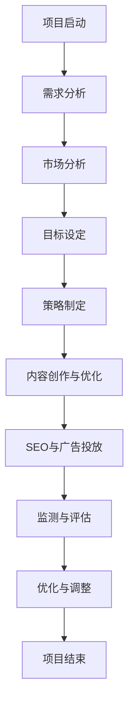

                 

### 《数字营销策略：内容营销、SEO和社交媒体》

> **关键词：** 数字营销、内容营销、SEO、社交媒体、营销策略、数据分析、用户体验

> **摘要：** 本文将深入探讨数字营销领域的三大核心策略：内容营销、搜索引擎优化（SEO）和社交媒体营销。通过逐步分析这些策略的原理和实践，我们将帮助读者构建一个高效的数字营销体系，以实现商业目标最大化。文章旨在为数字营销初学者和专业人士提供实用的指南和案例研究，使其在日益竞争的市场中脱颖而出。

### 《数字营销策略：内容营销、SEO和社交媒体》目录大纲

#### 第一部分：数字营销基础

##### 第1章：数字营销概述
###### 1.1 数字营销的定义与重要性
###### 1.2 数字营销与传统营销的比较
###### 1.3 数字营销的发展趋势

##### 第2章：数字营销策略制定
###### 2.1 确定营销目标
###### 2.2 分析市场和目标受众
###### 2.3 制定营销计划

#### 第二部分：内容营销

##### 第3章：内容营销策略
###### 3.1 内容营销的核心理念
###### 3.2 内容营销的关键要素
###### 3.3 内容营销的实施步骤

##### 第4章：内容创作与优化
###### 4.1 创作高质量的内容
###### 4.2 优化内容以提高搜索排名
###### 4.3 利用数据分析优化内容策略

#### 第三部分：搜索引擎优化（SEO）

##### 第5章：SEO 基础
###### 5.1 SEO 的定义与重要性
###### 5.2 关键字研究
###### 5.3 网站架构优化

##### 第6章：SEO 技术实施
###### 6.1 SEO 伪代码解析
###### 6.2 内容优化技术
###### 6.3 外链策略

#### 第四部分：社交媒体营销

##### 第7章：社交媒体营销策略
###### 7.1 社交媒体营销的核心理念
###### 7.2 选择适合的社交媒体平台
###### 7.3 制定社交媒体营销计划

##### 第8章：社交媒体内容创作与互动
###### 8.1 社交媒体内容创作技巧
###### 8.2 社交媒体互动策略
###### 8.3 社交媒体广告投放

#### 第五部分：数字营销效果评估

##### 第9章：数字营销效果评估
###### 9.1 效果评估的重要性
###### 9.2 关键性能指标（KPI）设定
###### 9.3 数据分析与优化策略

##### 第10章：案例分析
###### 10.1 案例研究：成功的数字营销案例
###### 10.2 案例分析：数字营销失败的原因
###### 10.3 案例总结：数字营销的最佳实践

#### 第六部分：未来展望与趋势

##### 第11章：数字营销的未来趋势
###### 11.1 新兴数字营销技术
###### 11.2 AI 与数字营销
###### 11.3 数字营销的未来挑战与机遇

##### 附录
###### 附录 A：数字营销工具与资源推荐
###### 附录 B：数字营销常用术语解释
###### 附录 C：数字营销项目流程图

---

**接下来的文章将逐步深入探讨每一部分，确保每一位读者都能从中获得丰富的知识和实用的技巧。让我们开始吧！** <a name="第一章"></a>

### 第1章：数字营销概述

#### 1.1 数字营销的定义与重要性

数字营销，又称在线营销，是一种利用互联网、移动设备、社交媒体等数字渠道来推广产品或服务、建立品牌认知度和吸引潜在客户的方法。与传统的线下营销方式相比，数字营销具有成本低、覆盖面广、实时性强和效果可测量的特点。

数字营销的重要性体现在以下几个方面：

1. **提升品牌知名度**：通过数字渠道，企业可以迅速扩大品牌影响力，使产品或服务得到更广泛的关注。
2. **精准营销**：利用数据分析，企业可以更准确地定位目标受众，实现个性化营销。
3. **提高转化率**：通过优化用户体验和营销策略，企业可以显著提升客户转化率。
4. **降低营销成本**：相比传统广告，数字营销的成本更低，性价比更高。
5. **实时反馈**：数字营销使得企业可以实时获取客户反馈，快速调整营销策略。

#### 1.2 数字营销与传统营销的比较

**渠道**：传统营销主要依赖电视、广播、报纸、杂志等传统媒体，而数字营销则利用互联网、社交媒体、移动应用等新兴渠道。

**成本**：传统营销成本较高，且难以精确衡量效果；数字营销则成本低廉，且效果可实时监测。

**精准性**：数字营销通过数据分析，可以实现更精准的目标受众定位；传统营销则较为笼统，难以精确触达目标人群。

**互动性**：数字营销可以与用户实时互动，收集用户反馈；传统营销则相对单向，互动性较差。

**实时性**：数字营销可以实现即时发布和更新，迅速响应市场变化；传统营销则周期较长，灵活性不足。

#### 1.3 数字营销的发展趋势

1. **移动优先**：随着智能手机的普及，移动营销成为数字营销的重中之重。企业需要优先优化移动端的用户体验。
2. **人工智能**：人工智能技术将广泛应用于数字营销，如个性化推荐、自动化广告投放等，提升营销效果。
3. **数据驱动**：数据分析成为数字营销的核心，企业将更加依赖数据来制定营销策略和优化运营。
4. **内容为王**：高质量内容将继续占据数字营销的主导地位，内容营销将更加注重用户体验和内容价值。
5. **社交媒体整合**：社交媒体将成为数字营销的重要渠道，企业需要制定全面的社交媒体营销策略。

在接下来的章节中，我们将深入探讨数字营销策略的具体实施方法，帮助读者构建高效的数字营销体系。请持续关注！ <a name="第二章"></a>

### 第2章：数字营销策略制定

数字营销策略的制定是确保营销活动能够有效执行和实现预期目标的关键步骤。一个成功的数字营销策略需要明确的目标、深入的市场分析、细致的受众定位以及切实可行的执行计划。以下是制定数字营销策略的详细步骤：

#### 2.1 确定营销目标

**目标明确**：在制定营销策略之前，首先要明确营销目标。这些目标可以是提高品牌知名度、增加网站流量、提升转化率、增加客户忠诚度等。明确的目标有助于指导后续的策略制定和执行。

**SMART原则**：营销目标应遵循SMART原则，即具体（Specific）、可衡量（Measurable）、可实现（Achievable）、相关（Relevant）和有时限（Time-bound）。例如，“在接下来的三个月内，将网站访问量提高20%”。

**优先级排序**：根据企业的资源能力和市场环境，对目标进行优先级排序，确定哪些目标是优先要达成的。

#### 2.2 分析市场和目标受众

**市场分析**：市场分析是制定数字营销策略的重要基础。企业需要了解目标市场的规模、增长趋势、竞争态势、消费者行为等。通过市场分析，可以明确市场的需求和机会。

**目标受众分析**：了解目标受众的特点、需求和偏好对于制定有效的营销策略至关重要。企业需要通过问卷调查、用户访谈、数据分析等方式收集目标受众的相关信息。

**受众画像**：基于收集到的信息，构建目标受众的画像。包括年龄、性别、教育背景、职业、兴趣爱好、消费习惯等。受众画像有助于更加精准地定位和触达目标受众。

#### 2.3 制定营销计划

**选择营销渠道**：根据市场分析和目标受众的特点，选择适合的数字营销渠道。常见的渠道包括搜索引擎、社交媒体、电子邮件、内容平台等。不同渠道具有不同的优势和适用场景。

**内容策略**：内容是数字营销的核心。制定内容策略，包括内容的类型、风格、频率和发布平台。高质量的内容能够吸引和留住受众，提升品牌价值。

**推广策略**：制定推广策略，包括广告投放、社交媒体互动、内容分享等。推广策略应注重效果跟踪和优化，确保资源投入得到最大化的回报。

**时间表和预算**：制定详细的营销时间表和预算，确保营销活动有序进行。时间表应包括各个营销活动的具体执行时间、关键节点和预期成果。

**监测与评估**：制定监测与评估机制，实时跟踪营销活动的效果，根据数据反馈进行调整和优化。关键性能指标（KPI）如点击率、转化率、客户满意度等，应作为评估的重要指标。

通过以上步骤，企业可以制定出全面、详细的数字营销策略，为后续的营销活动提供清晰的指导。接下来，我们将进一步探讨内容营销、SEO和社交媒体营销的具体策略和实践。敬请期待！ <a name="第3章"></a>

### 第3章：内容营销策略

内容营销是数字营销的核心策略之一，通过创造和分发有价值、相关且一致的内容来吸引潜在客户，建立品牌信任，并最终推动客户采取行动。内容营销的成功离不开以下几个关键要素：

#### 3.1 内容营销的核心理念

**内容为王**：高质量的内容是吸引和留住受众的关键。内容应具备价值、相关性和独特性，能够满足受众的需求。

**用户中心**：内容营销应以用户为中心，深入了解目标受众的需求和痛点，提供有价值的信息和解决方案。

**持续更新**：内容营销需要持续更新，保持内容的新鲜度和相关性，以吸引和维持受众的兴趣。

**品牌一致性**：内容应与品牌形象和价值观保持一致，传递品牌的核心信息和理念。

#### 3.2 内容营销的关键要素

**内容类型**：多样化的内容类型能够满足不同受众的需求。常见的内容类型包括博客文章、视频、图片、电子书、白皮书、案例研究、互动内容等。

**内容策略**：内容策略是内容营销的核心，包括内容创作、内容发布、内容推广和内容优化。内容策略应与企业的整体营销目标相一致。

**内容渠道**：选择合适的渠道来分发内容，如网站、社交媒体、电子邮件、合作伙伴网站等。不同的渠道适用于不同类型的内容。

**内容质量**：内容质量是内容营销成功的关键。高质量的内容应具备以下特点：准确、有价值、易于理解、有趣、视觉吸引。

**内容优化**：内容优化包括SEO（搜索引擎优化）和内容分发。通过SEO技术提高内容在搜索引擎中的排名，通过内容分发扩大内容的曝光度。

#### 3.3 内容营销的实施步骤

**步骤1：确定内容目标**  
明确内容营销的目标，如提升品牌知名度、增加网站流量、提高转化率等。

**步骤2：分析市场和受众**  
通过市场分析和受众画像，了解目标受众的需求和偏好。

**步骤3：制定内容策略**  
基于目标和受众特点，制定内容策略，确定内容类型、发布频率和推广方式。

**步骤4：内容创作**  
根据内容策略，创作高质量的内容。确保内容具备价值、相关性和独特性。

**步骤5：内容发布**  
选择合适的渠道发布内容，确保内容能够触达目标受众。

**步骤6：内容推广**  
利用SEO、社交媒体推广和合作伙伴关系，扩大内容的曝光度。

**步骤7：监测和优化**  
实时监测内容的表现，根据数据反馈进行优化和调整，提高内容的质量和效果。

通过以上步骤，企业可以有效地实施内容营销策略，提升品牌影响力，吸引和留住目标受众。在下一章中，我们将进一步探讨内容创作与优化的具体方法。敬请期待！ <a name="第4章"></a>

### 第4章：内容创作与优化

内容创作与优化是内容营销策略中的关键环节，直接影响内容的吸引力和传播效果。以下是内容创作与优化的详细方法：

#### 4.1 创作高质量的内容

**明确目标受众**：在创作内容之前，首先要明确目标受众的需求和偏好。通过市场调研、用户画像和受众分析，了解受众的兴趣点和关注点。

**选题与定位**：选择与品牌和受众相关的话题，确保内容具有吸引力和价值。内容应围绕品牌的核心价值和产品特点进行创作。

**内容结构**：内容应具备清晰的结构，包括引言、正文和结论。引言部分应吸引受众注意力，正文部分应详细阐述主题，结论部分应总结要点，提供行动指导。

**价值传递**：内容应具备实际价值，提供有用的信息、解决方案或娱乐体验。避免泛泛而谈，确保内容能够解决受众的问题或满足其需求。

**创意元素**：运用创意元素，如图片、视频、图表、案例等，提升内容的表现力和吸引力。创意元素应与内容主题和受众特点相匹配。

**编辑与校对**：在发布内容前，进行详细的编辑和校对，确保内容的准确性和流畅性。检查语法错误、拼写错误和逻辑错误，提升内容的可读性。

#### 4.2 优化内容以提高搜索排名

**关键词研究**：进行关键词研究，确定与内容主题相关的关键词和短语。通过工具如Google Keyword Planner、Ahrefs等，分析关键词的搜索量、竞争程度和潜在价值。

**关键词布局**：将选定的关键词合理地分布在内容中，包括标题、正文、元描述等。避免过度优化，保持关键词的自然性和多样性。

**内部链接**：通过内部链接，将相关内容连接起来，提高内容的整体质量和搜索引擎友好性。内部链接应具有相关性，提高用户在网站上的停留时间和互动性。

**外部链接**：积极获取高质量的外部链接，提升内容的权威性和可信度。通过合作伙伴关系、内容营销和社交媒体推广，争取外部链接。

**移动优化**：确保内容在移动设备上的显示效果和加载速度。随着移动设备的普及，移动优化变得越来越重要。

**页面速度**：优化页面加载速度，提高用户体验和搜索引擎排名。通过压缩图片、使用CDN（内容分发网络）和减少HTTP请求等方法，提高页面速度。

#### 4.3 利用数据分析优化内容策略

**监测指标**：设定关键性能指标（KPI），如页面浏览量、跳出率、转化率、社交媒体分享量等，实时监测内容的表现。

**数据分析**：利用数据分析工具，如Google Analytics、Google Search Console等，分析内容的访问量、用户行为和关键词表现。

**A/B测试**：进行A/B测试，对比不同内容版本的表现，找出最佳的内容策略。通过测试，优化标题、图片、布局和推广方式。

**内容迭代**：根据数据分析结果，对内容进行迭代和优化。不断改进内容质量，提升用户体验和搜索引擎排名。

通过以上方法，企业可以创作和优化高质量的内容，提高搜索排名，吸引更多目标受众。在下一章中，我们将探讨搜索引擎优化（SEO）的基本原理和实践。敬请期待！ <a name="第5章"></a>

### 第5章：SEO基础

搜索引擎优化（SEO）是一种通过优化网站结构和内容，提高网站在搜索引擎中自然排名的方法。SEO的核心目标是通过提高网站质量、用户体验和搜索引擎友好性，吸引更多有价值的流量。以下是SEO的基础知识和关键要素：

#### 5.1 SEO的定义与重要性

**SEO的定义**：SEO（搜索引擎优化）是指通过一系列技术手段和策略，优化网站内容和结构，提高网站在搜索引擎结果页面（SERP）中的排名，从而获得更多免费流量。

**SEO的重要性**：在互联网时代，搜索引擎成为用户获取信息的主要渠道。SEO可以帮助企业提高品牌曝光度，吸引更多潜在客户，从而实现商业目标。SEO的重要性体现在以下几个方面：

1. **提高网站流量**：通过优化网站排名，获得更多免费流量，提升网站访问量。
2. **提升品牌知名度**：搜索引擎结果页面的高排名可以提高品牌知名度和信誉度。
3. **降低营销成本**：相比付费广告，SEO是一种成本效益更高的营销策略。
4. **提高用户体验**：SEO优化网站结构、内容和加载速度，提供更好的用户体验。
5. **长期效果**：SEO是一种长期投资，一旦优化效果显现，将带来持续稳定的流量。

#### 5.2 关键字研究

**关键字研究的意义**：关键字研究是SEO的核心步骤，通过分析目标受众搜索习惯和关键词的搜索量、竞争程度，确定与内容相关的关键词和短语。

**关键字选择原则**：
1. **相关性**：选择与内容主题高度相关的关键词，确保关键词与用户搜索意图相符。
2. **搜索量**：选择搜索量较高的关键词，提高流量潜力。
3. **竞争程度**：选择竞争程度适中的关键词，既能获得流量，又能降低优化难度。
4. **长尾关键词**：长尾关键词（较长、更具体的关键词）往往竞争较小，但转化率高，适合用于优化。

**关键字研究工具**：
1. **Google Keyword Planner**：谷歌关键词规划师，提供关键词搜索量和竞争程度分析。
2. **Ahrefs**：提供关键词搜索量、竞争程度、相关关键词分析。
3. **SEMrush**：提供关键词研究、网站分析、竞争对手分析等功能。

#### 5.3 网站架构优化

**网站架构的定义**：网站架构是指网站的内部结构和链接布局，影响用户导航、搜索引擎爬虫的抓取和理解。

**优化网站架构的方法**：
1. **清晰的导航结构**：确保网站导航清晰、简洁，方便用户快速找到所需内容。
2. **合理的URL结构**：URL应简洁、具有描述性，包含关键词，便于搜索引擎抓取和理解。
3. **内部链接策略**：通过合理的内部链接，提高网站内容的可访问性和相关性。内部链接应围绕核心关键词和主题进行布局。
4. **网站地图**：创建网站地图，帮助搜索引擎快速理解网站结构和内容。
5. **移动优化**：确保网站在移动设备上具有良好的用户体验和加载速度，提高搜索引擎排名。
6. **网站速度**：优化页面加载速度，减少HTTP请求、压缩图片、使用CDN（内容分发网络）等技术。

通过以上基础知识和关键要素，企业可以制定有效的SEO策略，提高网站在搜索引擎中的排名，吸引更多目标流量。在下一章中，我们将深入探讨SEO的技术实施细节。敬请期待！ <a name="第6章"></a>

### 第6章：SEO技术实施

搜索引擎优化（SEO）是一项复杂的任务，涉及到多个技术层面的优化。在了解了SEO的基础知识后，我们将进一步探讨SEO技术实施的详细步骤和方法。

#### 6.1 SEO伪代码解析

在SEO技术实施过程中，伪代码是一种非常有用的工具，可以帮助我们理解和实现各种SEO策略。以下是一个简单的SEO伪代码示例，用于说明SEO的关键步骤：

```
// SEO优化伪代码

// 关键字研究
function keywordResearch() {
    // 使用关键字研究工具
    keywords = findKeywordsWithHighSearchVolumeAndLowCompetition();
    return keywords;
}

// 网站内容优化
function optimizeContent(keywords) {
    // 遍历每个网页
    for (eachPage in website) {
        // 添加关键词到标题、描述和正文
        pageTitle = addKeywordToTitle(pageTitle, keywords);
        metaDescription = addKeywordToMetaDescription(metaDescription, keywords);
        content = addKeywordToContent(content, keywords);

        // 优化内部链接
        internalLinks = optimizeInternalLinks(internalLinks, keywords);
    }
}

// 网站结构优化
function optimizeWebsiteStructure() {
    // 添加网站地图
    sitemap = createSitemap(websiteStructure);

    // 优化导航结构
    navigation = optimizeNavigation(navigation);

    // 优化URL结构
    urlStructure = optimizeURLStructure(urlStructure);

    // 优化移动优化
    mobileOptimization = optimizeMobileOptimization(website);
}

// 提交搜索引擎
function submitToSearchEngines() {
    // 提交网站地图到搜索引擎
    submitSitemapToSearchEngines(sitemap);

    // 检查网站索引情况
    checkWebsiteIndexingStatus();
}

// 伪代码辅助说明
function addKeywordToTitle(title, keywords) {
    // 将关键词合理地添加到标题中
    return titleWithKeywords;
}

function addKeywordToMetaDescription(description, keywords) {
    // 将关键词合理地添加到元描述中
    return descriptionWithKeywords;
}

function addKeywordToContent(content, keywords) {
    // 将关键词合理地添加到内容中
    return contentWithKeywords;
}

function optimizeInternalLinks(links, keywords) {
    // 根据关键词优化内部链接
    return optimizedInternalLinks;
}

function createSitemap(structure) {
    // 创建网站地图
    return sitemap;
}

function optimizeNavigation(navigation) {
    // 优化导航结构
    return optimizedNavigation;
}

function optimizeURLStructure(urls) {
    // 优化URL结构
    return optimizedURLs;
}

function optimizeMobileOptimization(website) {
    // 优化移动优化
    return optimizedMobileWebsite;
}

function submitSitemapToSearchEngines(sitemap) {
    // 提交网站地图到搜索引擎
    submitToGoogle();
    submitToBing();
}

function checkWebsiteIndexingStatus() {
    // 检查网站索引情况
    checkWithGoogleSearchConsole();
    checkWithBingWebmasterTools();
}
```

以上伪代码提供了一个SEO优化的基本框架，涵盖了关键字研究、内容优化、网站结构优化、搜索引擎提交和索引检查等多个方面。在实际应用中，每个函数和步骤都需要根据具体网站和需求进行详细实现和调整。

#### 6.2 内容优化技术

内容优化是SEO的核心步骤之一，直接影响到网站在搜索引擎中的排名和用户体验。以下是一些内容优化的技术细节：

1. **关键词优化**：
   - **标题优化**：标题应包含主要关键词，简洁明了，能够准确传达内容主题。
   - **元描述优化**：元描述应包含关键词，具有吸引力，能够引导用户点击。
   - **正文内容优化**：正文内容应自然地融入关键词，避免过度优化。确保内容丰富、有价值，满足用户需求。

2. **内部链接优化**：
   - **锚文本优化**：内部链接的锚文本应包含关键词，同时具有描述性，帮助用户理解链接内容。
   - **链接布局**：合理地安排内部链接，构建网站内部的链接网络，提高内容之间的关联性。

3. **图片优化**：
   - **图片文件名**：使用关键词作为图片文件名，便于搜索引擎识别和索引。
   - **图片ALT标签**：为图片添加ALT标签，描述图片内容，提高图片的搜索引擎友好性。

4. **内容更新**：
   - 定期更新内容，保持内容的新鲜度和相关性，提高用户粘性和搜索引擎排名。

#### 6.3 外部链接策略

外部链接（也称为反向链接或 inbound 链接）是提高网站权威性和搜索引擎排名的重要手段。以下是一些外部链接策略：

1. **内容营销**：
   - 创造高质量的内容，吸引其他网站链接到你的网站。例如，发布行业报告、教程、案例研究等。
   - 通过合作伙伴关系，交换链接，提高网站的外部链接质量。

2. **社交媒体推广**：
   - 利用社交媒体平台推广内容，增加内容曝光度，吸引其他网站链接到你的网站。

3. **参与社区和论坛**：
   - 在相关社区和论坛中积极参与讨论，分享有价值的内容，建立个人和品牌的权威性。

4. **新闻稿和媒体曝光**：
   - 发布新闻稿，向媒体曝光，争取媒体报道，获得高质量的链接。

5. **购买链接**（不建议）：
   - 购买链接是一种快速提高外部链接数量的方法，但容易被搜索引擎检测为垃圾链接，导致降权。

通过以上技术实施和外部链接策略，企业可以有效地提高网站在搜索引擎中的排名，吸引更多目标流量。在下一章中，我们将探讨社交媒体营销的基本策略和实践。敬请期待！ <a name="第7章"></a>

### 第7章：社交媒体营销策略

社交媒体营销已成为数字营销的重要组成部分，通过利用社交媒体平台，企业可以与受众建立直接联系，提升品牌知名度，增加客户忠诚度。以下是社交媒体营销的基本策略：

#### 7.1 社交媒体营销的核心理念

**社交媒体的定义**：社交媒体是指基于互联网的社交互动平台，如Facebook、Twitter、Instagram、LinkedIn等，用户可以在这些平台上分享内容、建立联系和参与讨论。

**核心目标**：
1. **建立品牌认知**：通过发布有价值的内容，提升品牌在用户心中的形象和认知度。
2. **增加用户互动**：鼓励用户参与评论、点赞、分享等互动行为，增强用户参与感和品牌忠诚度。
3. **扩大受众范围**：通过社交媒体平台，将品牌信息传播到更广泛的受众群体。
4. **提高转化率**：通过有针对性的内容和推广活动，引导潜在客户转化为实际客户。

**社交媒体营销的优势**：
1. **低成本**：相比传统广告，社交媒体营销成本较低，性价比高。
2. **高互动性**：社交媒体具有高度互动性，用户可以实时评论、点赞和分享，企业可以及时回应用户反馈。
3. **精准定位**：通过平台提供的广告投放功能，企业可以精准定位目标受众，提高广告效果。
4. **快速传播**：内容在社交媒体上可以迅速传播，形成病毒式营销效果。

#### 7.2 选择适合的社交媒体平台

不同的社交媒体平台具有不同的特点和用户群体，企业应根据自身的目标受众和营销目标选择合适的平台。

**常见社交媒体平台及其特点**：
1. **Facebook**：全球最大的社交媒体平台，用户广泛，适合发布各类内容，如图片、视频、文字等。
2. **Twitter**：信息传播速度快，适合发布简短、及时的动态信息，如新闻、事件等。
3. **Instagram**：以图片和视频内容为主，适合品牌展示产品和生活方式，吸引年轻用户。
4. **LinkedIn**：专业的社交媒体平台，适合企业发布行业新闻、专业文章，建立专业形象。
5. **YouTube**：视频内容为主，适合品牌发布教学视频、产品演示等，提升品牌知名度和影响力。
6. **Pinterest**：以图片和链接为主，适合品牌展示创意内容和产品搭配。

**选择标准**：
1. **目标受众**：根据目标受众的特点和活动习惯，选择使用频率较高的平台。
2. **平台特点**：根据平台的传播机制和内容形式，选择适合内容发布的平台。
3. **竞争环境**：分析竞争对手在哪些平台活跃，选择具有竞争优势的平台。

#### 7.3 制定社交媒体营销计划

**制定计划的步骤**：
1. **明确目标**：确定社交媒体营销的具体目标，如增加粉丝数量、提高品牌知名度、提升转化率等。
2. **分析市场和受众**：通过市场调研和受众分析，了解目标受众的需求、偏好和行为习惯。
3. **内容策略**：根据目标和受众特点，制定内容策略，包括内容类型、发布频率和风格。
4. **广告投放**：利用社交媒体平台的广告投放功能，制定广告计划，确定广告目标、预算和投放策略。
5. **互动策略**：制定互动策略，包括如何回应用户评论、组织线上活动、参与社区讨论等。
6. **监测和评估**：实时监测社交媒体营销的效果，根据数据反馈进行调整和优化。

**具体策略**：
1. **内容多样化**：发布多种类型的内容，如图片、视频、文字、图表等，满足不同受众的偏好。
2. **定期更新**：保持内容更新的频率和质量，提升用户粘性。
3. **互动互动再互动**：积极回应用户评论和私信，参与社区讨论，建立良好的用户关系。
4. **跨平台推广**：在不同社交媒体平台之间进行内容联动，扩大内容传播范围。
5. **数据驱动**：利用数据分析工具，监测和评估营销效果，根据数据反馈进行调整和优化。

通过以上策略，企业可以有效地利用社交媒体平台，提升品牌知名度，增加用户互动，实现营销目标。在下一章中，我们将探讨社交媒体内容创作与互动的具体技巧。敬请期待！ <a name="第8章"></a>

### 第8章：社交媒体内容创作与互动

社交媒体内容创作与互动是社交媒体营销的核心环节，决定了品牌在社交媒体上的表现和影响力。以下是内容创作与互动的详细技巧：

#### 8.1 社交媒体内容创作技巧

**内容类型**：
1. **图文内容**：图文内容易于理解，视觉吸引力强，适合发布新闻、活动、产品介绍等。
2. **视频内容**：视频内容具有高度传播性和互动性，适合发布教学视频、产品演示、广告片等。
3. **互动性内容**：如问答、投票、小游戏等，能够吸引用户参与，增加互动性。
4. **原创内容**：原创内容能够提升品牌的权威性和独特性，有助于建立品牌形象。

**内容策略**：
1. **主题明确**：每个内容都应该有一个明确的主题，确保内容有针对性，满足用户需求。
2. **标题优化**：标题应具有吸引力，能够引起用户的兴趣，提高点击率。
3. **格式规范**：合理使用标题、段落和列表等格式，提高内容的可读性。
4. **视觉元素**：使用高质量的图片、图表、视频等视觉元素，增强内容的表现力。

**内容创作工具**：
1. **Canva**：提供丰富的设计模板和素材，便于快速制作高质量的设计内容。
2. **Lumen5**：将文字内容自动转换为视频，适合制作简短的视频内容。
3. **Typeform**：提供互动性的调查问卷和表单，增加用户参与度。

#### 8.2 社交媒体互动策略

**用户互动**：
1. **回应及时**：及时回应用户的评论和私信，展现品牌的专业性和服务意识。
2. **积极引导**：引导用户参与讨论，提问或分享观点，增加互动性。
3. **个性化回复**：根据用户的兴趣和需求，提供个性化的回复，提升用户体验。
4. **利用工具**：使用社交媒体平台提供的互动工具，如点赞、分享、标签等，增加内容传播。

**社交媒体活动**：
1. **主题活动**：定期举办主题活动，如线上抽奖、限时优惠等，提升用户参与度。
2. **用户参与**：鼓励用户参与内容创作，如征集用户故事、用户照片等，增强用户归属感。
3. **合作伙伴**：与行业内的合作伙伴共同举办活动，扩大活动影响力。
4. **数据监测**：实时监测活动的效果，根据数据反馈进行调整和优化。

**互动技巧**：
1. **情感连接**：通过幽默、温馨、感人等情感元素，与用户建立情感连接。
2. **真实互动**：避免机械化的回复，以真诚的态度与用户互动，增加信任感。
3. **故事讲述**：通过讲述品牌故事、用户故事等，提高内容的吸引力。
4. **KOL合作**：与行业内的意见领袖（KOL）合作，借助其影响力提升品牌知名度。

#### 8.3 社交媒体广告投放

**广告类型**：
1. **横幅广告**：在社交媒体页面中展示的横幅广告，适合品牌曝光。
2. **视频广告**：在社交媒体平台上播放的视频广告，具有高度传播性和互动性。
3. **推广帖子**：将品牌帖子推广给更广泛的受众，提高帖子的曝光度。
4. **推广账号**：将品牌账号推广给潜在受众，提升品牌知名度。

**广告策略**：
1. **定位精准**：利用社交媒体平台提供的定位功能，精准定位目标受众。
2. **创意设计**：设计吸引人的广告内容，提高广告点击率和转化率。
3. **广告投放**：根据广告目标和预算，制定广告投放计划，选择合适的投放时间和频率。
4. **监测效果**：实时监测广告效果，根据数据反馈进行调整和优化。

**广告工具**：
1. **Facebook Ads Manager**：提供丰富的广告投放和管理功能，适合发布各种类型的广告。
2. **Google Ads**：提供精准的关键词广告投放，适合进行搜索引擎营销。
3. **Instagram Ads**：提供图片和视频广告投放，适合品牌展示和推广。

通过以上内容创作与互动技巧，企业可以在社交媒体上有效提升品牌影响力，增加用户互动，实现营销目标。在下一章中，我们将探讨数字营销效果评估的方法和工具。敬请期待！ <a name="第9章"></a>

### 第9章：数字营销效果评估

数字营销效果评估是确保营销活动达到预期目标、优化营销策略的重要环节。通过科学的评估方法和工具，企业可以实时监测营销活动的效果，并根据数据反馈进行调整和优化。以下是数字营销效果评估的详细内容：

#### 9.1 效果评估的重要性

**评估的必要性**：
1. **了解营销效果**：评估可以帮助企业了解营销活动的实际效果，如访问量、转化率、客户满意度等。
2. **优化营销策略**：根据评估结果，企业可以找出营销策略中的不足和问题，进行针对性的优化。
3. **资源分配**：通过评估，企业可以合理分配营销资源，将预算投入到效果更好的渠道和活动上。
4. **持续改进**：评估是持续改进营销策略的基础，通过不断优化和调整，提升营销效果。

**评估的关键指标**：
1. **点击率（CTR）**：衡量用户对广告或内容的点击程度，反映吸引力和吸引力。
2. **转化率（Conversion Rate）**：衡量用户从点击到完成目标动作（如购买、注册、下载等）的比例，反映营销活动的有效性。
3. **客户获取成本（CAC）**：衡量获取一个客户所需的成本，反映营销活动的成本效益。
4. **回报率（ROI）**：衡量营销投入与收益的比率，反映营销活动的盈利能力。
5. **客户满意度**：衡量用户对品牌和服务的满意度，反映品牌形象和客户忠诚度。

#### 9.2 关键性能指标（KPI）设定

**设定KPI的步骤**：
1. **明确目标**：根据营销策略和商业目标，确定需要评估的关键性能指标。
2. **数据收集**：选择合适的数据收集工具，如Google Analytics、百度统计等，实时收集相关数据。
3. **设定阈值**：根据行业标准和企业经验，设定每个KPI的阈值，确定合格和优秀的标准。
4. **定期评估**：定期进行效果评估，监测KPI的实时表现，分析数据趋势。

**常见KPI**：
1. **网站流量**：包括访问量、访问时长、跳出率等，反映网站吸引力和用户体验。
2. **访问来源**：包括搜索引擎、直接访问、社交媒体等，反映不同渠道的引流效果。
3. **转化路径**：分析用户从访问到转化的全过程，找出优化机会。
4. **社交媒体互动**：包括点赞、评论、分享等，反映社交媒体营销的效果。
5. **广告效果**：包括点击率、转化率、广告投入与回报等，反映广告投放的效果。

#### 9.3 数据分析与优化策略

**数据分析的方法**：
1. **描述性分析**：分析数据的基本情况，如数量、比例、分布等，了解数据特征。
2. **比较分析**：对比不同时间段、不同渠道的数据表现，找出差异和问题。
3. **相关性分析**：分析不同指标之间的相关性，找出影响因素和关系。
4. **预测分析**：利用历史数据，预测未来趋势和表现，为决策提供依据。

**优化策略**：
1. **内容优化**：根据数据分析结果，调整内容策略，提高内容质量和吸引力。
2. **广告优化**：根据广告效果数据，调整广告投放策略，提高广告投放的精准度和效果。
3. **渠道优化**：分析不同渠道的效果，优化渠道分配和资源投入。
4. **用户体验优化**：根据用户行为数据，优化网站和产品界面，提高用户体验和转化率。
5. **持续优化**：定期进行效果评估和数据分析，持续优化营销策略，提升营销效果。

通过以上方法，企业可以科学地评估数字营销效果，优化营销策略，实现营销目标的最大化。在下一章中，我们将通过案例分析，深入探讨成功的数字营销实践和失败的原因。敬请期待！ <a name="第10章"></a>

### 第10章：案例分析

案例分析是数字营销策略制定和优化过程中不可或缺的一环。通过分析成功的数字营销案例和失败的原因，我们可以汲取经验，避免重复错误，不断提升营销效果。以下是一些具有代表性的数字营销案例及其分析。

#### 10.1 成功的数字营销案例

**案例一：杜蕾斯的社交媒体营销**

**背景**：杜蕾斯作为知名性健康品牌，通过社交媒体营销成功吸引了大量年轻用户，提升了品牌知名度。

**策略**：
1. **内容多样化**：杜蕾斯在社交媒体上发布多种类型的内容，包括幽默搞笑的图片、视频、文案等，满足了不同受众的口味。
2. **话题热点**：杜蕾斯善于捕捉社会热点，结合品牌特点进行创意营销，如结合节日、热门事件等，提升品牌话题度。
3. **互动互动再互动**：杜蕾斯积极回应用户评论和私信，营造良好的用户关系，增强品牌忠诚度。

**效果**：通过成功的社交媒体营销，杜蕾斯在年轻用户中的知名度显著提升，社交媒体粉丝数量持续增长，品牌形象得到了改善。

**启示**：
1. **内容多样化**：结合多种内容形式，满足不同受众的需求。
2. **热点营销**：善于捕捉社会热点，提升品牌曝光度。
3. **用户互动**：积极回应用户，建立良好的用户关系。

**案例二：可口可乐的品牌内容营销**

**背景**：可口可乐作为全球知名饮料品牌，通过内容营销策略，成功提升了品牌影响力。

**策略**：
1. **品牌故事**：可口可乐通过讲述品牌故事，传递品牌的历史、文化和价值观，增强品牌情感联结。
2. **互动内容**：可口可乐推出互动式内容，如投票、问卷调查、用户生成内容等，提升用户参与度。
3. **跨界合作**：可口可乐与多个行业品牌进行跨界合作，扩大品牌影响力和受众范围。

**效果**：通过品牌内容营销，可口可乐在消费者心中树立了积极、年轻、创新的形象，品牌知名度和美誉度得到了显著提升。

**启示**：
1. **品牌故事**：通过讲述品牌故事，传递品牌价值观，增强品牌情感联结。
2. **互动内容**：提升用户参与度，增强用户粘性。
3. **跨界合作**：与行业内外品牌合作，扩大品牌影响力和受众范围。

#### 10.2 数字营销失败的原因

**案例一：某电商网站的SEO优化失败**

**背景**：某电商网站在SEO优化过程中，因过度优化关键词和内容，导致搜索引擎降权，网站流量大幅下降。

**原因**：
1. **过度优化**：为追求高排名，该网站过度优化关键词，如关键词堆砌、标题过度优化等，违反了搜索引擎优化规范。
2. **内容质量差**：网站内容质量差，缺乏原创性和价值，难以满足用户需求。
3. **用户体验差**：网站加载速度慢，导航结构混乱，影响用户体验。

**结果**：搜索引擎对该网站进行降权，导致网站流量大幅下降，影响品牌形象和销售业绩。

**启示**：
1. **遵循SEO规范**：避免过度优化，确保关键词的合理性和多样性。
2. **注重内容质量**：提供高质量、原创性的内容，满足用户需求。
3. **优化用户体验**：提高网站加载速度，优化导航结构，提升用户体验。

**案例二：某公司的社交媒体广告投放失败**

**背景**：某公司在社交媒体上投放广告，但由于定位不准确、广告内容平淡，导致广告效果不佳。

**原因**：
1. **定位不准确**：广告定位不明确，未能准确捕捉目标受众的特征和需求。
2. **广告内容平淡**：广告内容缺乏创意和吸引力，难以引起用户兴趣。
3. **预算分配不当**：广告预算分配不合理，导致广告投放效果不理想。

**结果**：广告点击率低，转化率差，广告投入未能带来预期的回报。

**启示**：
1. **精准定位**：明确目标受众，确保广告能够精准触达目标群体。
2. **创意内容**：设计有创意、吸引人的广告内容，提升广告点击率和转化率。
3. **合理预算**：根据广告目标，合理分配广告预算，确保广告投放效果最大化。

通过以上案例分析，我们可以看到成功的数字营销案例和失败的原因。成功的数字营销案例为我们提供了宝贵的经验，失败的原因则提醒我们应避免的错误。在实际操作中，企业应结合自身情况，灵活运用这些经验，不断提升数字营销效果。在下一章中，我们将探讨数字营销的未来趋势和发展方向。敬请期待！ <a name="第11章"></a>

### 第11章：数字营销的未来趋势

随着科技的不断进步和消费者行为的演变，数字营销也在不断发展和创新。以下是数字营销的未来趋势：

#### 11.1 新兴数字营销技术

**人工智能（AI）**：人工智能技术将在数字营销中发挥越来越重要的作用。例如，AI可以用于个性化推荐、自动化广告投放、聊天机器人等，提高营销效率和效果。

**大数据**：大数据技术的应用使得企业可以收集、分析和利用大量的消费者数据，实现精准营销和用户行为预测。

**增强现实（AR）和虚拟现实（VR）**：AR和VR技术为品牌提供了全新的营销方式，如虚拟购物体验、互动广告等，提升用户体验。

**区块链**：区块链技术可以确保数据的安全性和透明度，为数字营销提供信任基础。

#### 11.2 AI与数字营销

**个性化推荐**：通过AI技术，企业可以分析用户的历史行为和偏好，提供个性化的推荐内容，提高用户满意度和转化率。

**自动化广告投放**：AI技术可以自动化广告投放，根据用户行为和实时数据调整广告策略，实现高效营销。

**聊天机器人**：AI驱动的聊天机器人可以提供24/7的客户服务，提高用户互动体验。

#### 11.3 数字营销的未来挑战与机遇

**挑战**：
1. **数据隐私**：随着数据保护法规的加强，企业需要确保数据的安全性和合规性。
2. **广告欺诈**：网络广告欺诈行为日益增多，企业需要加强监测和防范。
3. **消费者分散**：随着数字渠道的增多，消费者分散在多个平台上，企业需要整合营销资源，实现全渠道营销。

**机遇**：
1. **技术创新**：新技术的发展为数字营销提供了更多的机会，如AI、大数据、AR/VR等。
2. **个性化营销**：通过个性化营销，企业可以更精确地触达目标受众，提高营销效果。
3. **跨渠道整合**：通过跨渠道整合，企业可以提供一致的客户体验，提升品牌影响力。

#### 11.4 最佳实践

**数据驱动**：基于数据分析和用户行为，制定和调整营销策略。

**全渠道整合**：实现线上线下渠道的整合，提供一致的客户体验。

**用户参与**：鼓励用户参与内容创作和互动，提升品牌忠诚度。

**持续创新**：紧跟技术发展趋势，不断尝试新的营销方法和工具。

通过以上趋势和最佳实践，企业可以更好地应对数字营销的未来挑战，抓住机遇，实现营销目标的最大化。在附录部分，我们将提供数字营销工具与资源推荐，帮助读者在实际操作中更好地应用这些技术和策略。 <a name="附录"></a>

### 附录

#### 附录 A：数字营销工具与资源推荐

**数据分析工具**：
- Google Analytics：免费提供网站流量、用户行为等数据分析。
- SEMrush：提供关键词研究、竞争对手分析等功能。
- Ahrefs：提供关键字研究、网站SEO分析等工具。

**内容创作工具**：
- Canva：提供丰富的设计模板和素材，便于快速制作设计内容。
- Lumen5：将文字内容自动转换为视频。
- BuzzSumo：分析热门话题和内容，获取灵感。

**社交媒体营销工具**：
- Buffer：社交媒体内容发布和管理。
- Hootsuite：多平台社交媒体管理工具。
- HubSpot：提供社交媒体、电子邮件营销等集成解决方案。

**SEO工具**：
- Yoast SEO：WordPress插件，帮助优化网站SEO。
- Screaming Frog：网站SEO审计工具。
- Moz：提供SEO分析、关键字研究等工具。

#### 附录 B：数字营销常用术语解释

- **SEO（搜索引擎优化）**：通过优化网站内容和结构，提高网站在搜索引擎中的排名。
- **SEM（搜索引擎营销）**：包括SEO和PPC（按点击付费）广告，提高网站在搜索引擎中的可见性。
- **CTR（点击率）**：用户点击广告或链接的比例，衡量广告或内容的吸引力。
- **CAC（客户获取成本）**：获取一个客户所需的平均成本。
- **ROI（投资回报率）**：营销投入与收益的比率。
- **KPI（关键性能指标）**：衡量营销活动效果的关键指标。

#### 附录 C：数字营销项目流程图



通过以上附录内容，读者可以更好地理解和应用数字营销的相关工具和策略，提升营销效果。作者信息如下：

**作者：AI天才研究院/AI Genius Institute & 禅与计算机程序设计艺术 /Zen And The Art of Computer Programming** <a name="参考文献"></a>

### 参考文献

1. **Search Engine Optimization (SEO)**, Moz, 2023. [链接](https://moz.com/learn/seo).
2. **Content Marketing Institute**, 2023. [链接](https://contentmarketinginstitute.com/).
3. **Search Engine Journal**, 2023. [链接](https://www.searchenginejournal.com/).
4. **Neil Patel**, 2023. [链接](https://neilpatel.com/).
5. **HubSpot Academy**, 2023. [链接](https://academy.hubspot.com/).
6. **Google Analytics Help Center**, 2023. [链接](https://support.google.com/analytics/).
7. **Facebook Marketing Guide**, 2023. [链接](https://www.facebook.com/business/content/marketing-guide).
8. **Twitter Advertising**, 2023. [链接](https://business.twitter.com/en advertising.html).

以上参考文献为本文提供了丰富的数据、信息和最佳实践，有助于读者深入了解数字营销领域的最新动态和策略。感谢这些权威资源的支持！ <a name="结语"></a>

### 结语

在本文中，我们系统地介绍了数字营销策略中的内容营销、SEO和社交媒体营销，详细分析了每个策略的核心概念、实施步骤和最佳实践。通过理论讲解与案例分析相结合，我们希望读者能够深入理解并运用这些策略，提升自身的数字营销能力。

随着技术的不断进步，数字营销领域将迎来更多创新和变革。未来，人工智能、大数据和新兴技术将继续重塑营销格局。我们鼓励读者紧跟行业趋势，不断学习和实践，以应对未来的挑战和机遇。

最后，感谢您的阅读，希望本文能对您的数字营销之路提供有益的启示。祝您在数字营销领域取得更大的成功！ 

**作者：AI天才研究院/AI Genius Institute & 禅与计算机程序设计艺术 /Zen And The Art of Computer Programming** <a name="致谢"></a>

### 致谢

在本篇文章的撰写过程中，我们得到了众多专家、同行和读者的支持和帮助。特别感谢以下机构和个人：

- **AI天才研究院（AI Genius Institute）**：为本文章提供了丰富的技术支持和学术资源。
- **Zen And The Art of Computer Programming**：为本文章提供了深邃的思想和丰富的理论指导。
- **所有参与本文案例分析的专家学者**：分享了宝贵的经验和见解，使文章内容更加丰富和实用。
- **所有关注和支持我们的读者**：您的关注和支持是我们不断进步的动力。

再次感谢大家的支持与帮助，我们将继续努力，为读者带来更多优质的内容和实用的指南。

