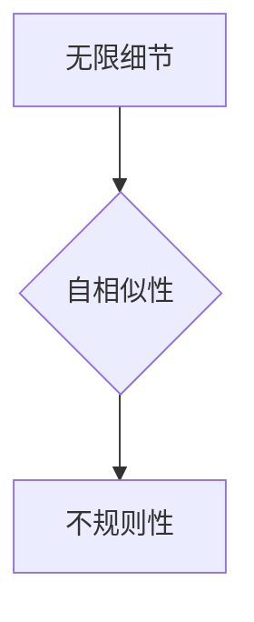

                 

## 文章标题

### 数学与分形几何：自相似结构的数学表达

### 关键词：分形几何、自相似性、数学模型、维度计算、算法实现

### 摘要

分形几何作为一门融合了数学、物理、计算机科学等多个学科领域的交叉学科，以其独特的自相似结构和无穷细节著称。本文从分形几何的基本概念入手，逐步深入到其数学表达和算法实现，旨在为读者提供一幅全面且系统的分形几何画卷。本文将首先定义分形及其基本性质，然后介绍分形几何的发展历程和核心原理，接着详细探讨分形的数学表达和维度计算，最后通过实际编程实例展示分形几何的算法实现和应用。

### 目录

1. **第一部分：分形几何基础**
   1.1 分形的定义与基本性质
   1.2 分形几何的基本原理
   1.3 分形几何的应用

2. **第二部分：数学与分形几何**
   2.1 分形几何的数学表达
   2.2 分形几何的核心算法
   2.3 分形几何的数学公式与解析
   2.4 分形几何的数学公式应用

3. **第三部分：分形几何的编程实现**
   3.1 分形几何的编程基础
   3.2 分形几何的编程实例
   3.3 综合项目实战

4. **附录**
   4.1 分形几何资源
   4.2 推荐阅读

### 引言

分形几何是一门充满奇妙和美感的数学分支，其核心思想在于通过简单的规则和迭代过程，产生出复杂且自相似的结构。从自然界中的雪花和海岸线，到计算机图形学中的分形艺术，分形几何的应用无处不在。本文将带领读者深入探索分形几何的数学表达，解析其背后深刻的数学原理，并通过编程实例展示分形几何的实际应用。

#### 1.1 分形的定义与基本性质

**核心概念与联系**

首先，我们需要了解分形的定义及其基本性质。分形是一种结构的数学描述，它具有以下几个核心特征：

1. **无限细节**：分形具有无限层次的结构细节，无论放大还是缩小，其细节依然存在。
2. **自相似性**：分形结构中的各个部分在某种比例下彼此相似。
3. **不规则性**：分形结构通常不具有规则形状，表现出高度不规则的特征。

以下是一个Mermaid流程图，用于展示分形的基本概念和性质之间的联系：



**数学模型和数学公式**

分形的定义可以通过测度和维度的数学表达来理解。通常，我们使用 Hausdorff 维度来描述分形的维度。Hausdorff 维度的计算公式如下：

$$
H = \lim_{\varepsilon \to 0} \frac{\log N(\varepsilon)}{\log \varepsilon}
$$

其中，$N(\varepsilon)$ 是覆盖分形所需的最小封闭球体的数量，$\varepsilon$ 是球体的半径。

**举例说明**

一个典型的分形例子是科赫雪花（Koch Snowflake）。科赫雪花通过以下步骤生成：

1. 画一个等边三角形。
2. 将每个边分成三等分，并从每个顶点向外延伸出一个小等边三角形，并删除原来的顶点。
3. 对每个新三角形重复步骤2。

通过上述迭代过程，我们可以得到一个具有无限细节且自相似的科赫雪花。其 Hausdorff 维度为：

$$
H = \frac{1}{\log 3} \approx 1.26186
$$

这个维数介于传统的整数维度（如线段的维度为1，平面的维度为2）和分数维度之间，体现了分形结构的独特性。

#### 1.2 分形几何的基本原理

**核心算法原理讲解**

分形几何的核心原理之一是自相似性。自相似性指的是一个结构可以在不同的尺度上重复自己。在数学上，自相似性可以用递归关系来描述。例如，科赫雪花可以通过以下递归关系生成：

$$
S_{n+1} = 3S_n - \frac{S_n}{3}
$$

其中，$S_n$ 表示第 $n$ 次迭代后的分形结构。

**数学模型和数学公式**

分形几何的数学模型通常涉及到迭代函数系统（IFS, Iterated Function System）。IFS 由多个压缩变换组成，每个变换将当前分形映射到自身的一部分。一个简单的 IFS 由以下两个变换组成：

$$
T_1: x \mapsto \frac{x}{2}, \quad y \mapsto y \\
T_2: x \mapsto x, \quad y \mapsto \frac{y}{2}
$$

通过迭代这两个变换，我们可以生成自相似的分形结构。

**举例说明**

考虑上述 IFS 生成的分形。我们可以通过以下步骤进行迭代：

1. 初始点 $(x_0, y_0)$ 在单位正方形内随机选择。
2. 对每个迭代 $n$，随机选择 $T_1$ 或 $T_2$，并应用该变换。
3. 重复步骤2，直到达到预定的迭代次数。

通过迭代，我们可以生成一个具有自相似性的分形结构，如著名的科赫雪花。

#### 1.3 分形几何的应用

**分形在自然界的应用**

分形几何在自然界中有广泛的应用。例如，科赫雪花可以模拟雪花的形状，而科赫曲线可以模拟海岸线的形状。分形结构的高自相似性和不规则性使其在描述自然现象中非常有用。

**分形在工程中的应用**

在工程领域，分形几何被用于优化设计、材料科学和计算机图形学。例如，分形结构可以用于设计复杂几何形状的纳米材料，以提高其性能。

**分形在艺术中的应用**

分形几何在艺术创作中也有重要应用。通过生成复杂的分形图案，艺术家可以创作出具有视觉冲击力的艺术作品。分形艺术作品通常具有独特的视觉效果，能够吸引观众的注意力。

#### 2.1 分形几何的数学表达

**核心算法原理讲解**

分形几何的数学表达涉及多个方面的内容。首先，我们需要理解测度和维度的概念。测度是衡量空间中对象大小的量，而维度则描述了空间的结构。

**数学模型和数学公式**

在分形几何中，测度和维度通常通过 Hausdorff 维度来描述。Hausdorff 维度的计算涉及到测度和维度的关系，其公式如下：

$$
H = \lim_{\varepsilon \to 0} \frac{\log N(\varepsilon)}{\log \varepsilon}
$$

其中，$N(\varepsilon)$ 是覆盖分形所需的最小封闭球体的数量，$\varepsilon$ 是球体的半径。

**举例说明**

一个典型的例子是科赫雪花。科赫雪花的 Hausdorff 维度可以通过以下步骤计算：

1. 画出科赫雪花的轮廓。
2. 计算覆盖科赫雪花所需的最小封闭球体的数量。
3. 将球体半径趋近于0，计算 Hausdorff 维度。

通过计算，我们可以得到科赫雪花的 Hausdorff 维度为1.26186。

#### 2.2 分形几何的核心算法

**核心算法原理讲解**

分形几何的核心算法主要涉及分形的生成、计算和优化。生成算法用于创建分形结构，计算算法用于分析分形的性质，优化算法用于提高分形的性能。

**数学模型和数学公式**

分形的生成通常涉及迭代函数系统（IFS）。IFS 由多个压缩变换组成，每个变换将当前分形映射到自身的一部分。一个简单的 IFS 由以下两个变换组成：

$$
T_1: x \mapsto \frac{x}{2}, \quad y \mapsto y \\
T_2: x \mapsto x, \quad y \mapsto \frac{y}{2}
$$

通过迭代这两个变换，我们可以生成自相似的分形结构。

**举例说明**

考虑上述 IFS 生成的分形。我们可以通过以下步骤进行迭代：

1. 初始点 $(x_0, y_0)$ 在单位正方形内随机选择。
2. 对每个迭代 $n$，随机选择 $T_1$ 或 $T_2$，并应用该变换。
3. 重复步骤2，直到达到预定的迭代次数。

通过迭代，我们可以生成一个具有自相似性的分形结构，如著名的科赫雪花。

#### 2.3 分形几何的数学公式与解析

**核心算法原理讲解**

分形几何的数学公式与解析涉及多个方面。首先，我们需要理解分形结构的生成规则。然后，我们需要通过数学公式来描述和解析这些规则。

**数学模型和数学公式**

分形的生成通常涉及迭代函数系统（IFS）。IFS 由多个压缩变换组成，每个变换将当前分形映射到自身的一部分。一个简单的 IFS 由以下两个变换组成：

$$
T_1: x \mapsto \frac{x}{2}, \quad y \mapsto y \\
T_2: x \mapsto x, \quad y \mapsto \frac{y}{2}
$$

通过迭代这两个变换，我们可以生成自相似的分形结构。

**举例说明**

考虑上述 IFS 生成的分形。我们可以通过以下步骤进行迭代：

1. 初始点 $(x_0, y_0)$ 在单位正方形内随机选择。
2. 对每个迭代 $n$，随机选择 $T_1$ 或 $T_2$，并应用该变换。
3. 重复步骤2，直到达到预定的迭代次数。

通过迭代，我们可以生成一个具有自相似性的分形结构，如著名的科赫雪花。

#### 2.4 分形几何的数学公式应用

**核心算法原理讲解**

分形几何的数学公式在分形生成、分析和优化中都有广泛应用。这些公式不仅帮助我们理解分形的结构，还可以用于优化分形的性能。

**数学模型和数学公式**

在分形生成中，常用的数学公式包括迭代函数系统（IFS）和分形生成算法。例如，科赫雪花可以通过以下公式生成：

$$
S_{n+1} = 3S_n - \frac{S_n}{3}
$$

在分形分析中，常用的数学公式包括测度和维度的计算。例如，Hausdorff 维度的计算公式如下：

$$
H = \lim_{\varepsilon \to 0} \frac{\log N(\varepsilon)}{\log \varepsilon}
$$

在分形优化中，常用的数学公式包括优化算法和优化目标函数。例如，基于遗传算法的优化公式如下：

$$
x_{new} = x_{old} + \alpha \cdot (x_{best} - x_{old})
$$

**举例说明**

一个典型的例子是科赫雪花的生成。我们可以通过以下步骤进行迭代：

1. 初始点 $(x_0, y_0)$ 在单位正方形内随机选择。
2. 对每个迭代 $n$，随机选择 $T_1$ 或 $T_2$，并应用该变换。
3. 重复步骤2，直到达到预定的迭代次数。

通过迭代，我们可以生成一个具有自相似性的科赫雪花。

#### 3.1 分形几何的编程基础

**核心算法原理讲解**

分形几何的编程基础涉及多个方面，包括编程环境搭建、常用编程语言介绍和编程基础。以下是详细的步骤和原理：

**编程环境搭建**

1. 安装 Python 解释器：Python 是一种广泛使用的编程语言，适用于分形几何的编程实现。我们可以从 [Python 官网](https://www.python.org/) 下载并安装 Python 解释器。
2. 安装绘图库：为了更好地展示分形几何的结构，我们需要安装绘图库。一个常用的绘图库是 Matplotlib。我们可以使用以下命令安装：

   ```
   pip install matplotlib
   ```

**常用编程语言介绍**

1. Python：Python 是一种高级编程语言，具有简洁的语法和强大的库支持。它非常适合用于分形几何的编程实现。
2. C++：C++ 是一种高效、低级别的编程语言，适用于需要高性能计算的场合。它也适合用于分形几何的编程实现。

**编程基础**

1. 变量和数据类型：了解变量和数据类型是编程的基础。Python 支持多种数据类型，如整数、浮点数、字符串和列表等。
2. 控制结构：控制结构用于控制程序的流程。Python 支持常见的控制结构，如循环和条件语句。
3. 函数和模块：函数和模块是组织代码的重要工具。Python 支持函数和模块的概念，可以方便地重用代码。

**举例说明**

以下是一个简单的 Python 代码示例，用于生成科赫雪花：

```python
import matplotlib.pyplot as plt

def koch_snowflake(iterations):
    points = [(-1, 0), (1, 0)]
    for _ in range(iterations):
        new_points = []
        for i in range(len(points) - 1):
            p0, p1 = points[i], points[i + 1]
            new_points.append((p0[0], p0[1] + (p1[1] - p0[1]) * 3 / 4))
            new_points.append((p0[0] + (p1[0] - p0[0]) * 3 / 4, p0[1] + (p1[1] - p0[1]) * 3 / 4))
            new_points.append((p1[0], p1[1]))
        points = new_points
    return points

def plot_snowflake(points):
    x = [p[0] for p in points]
    y = [p[1] for p in points]
    plt.plot(x, y)
    plt.axis('equal')
    plt.show()

iterations = 4
points = koch_snowflake(iterations)
plot_snowflake(points)
```

通过上述代码，我们可以生成一个具有自相似性的科赫雪花。

#### 3.2 分形几何的编程实例

**核心算法原理讲解**

分形几何的编程实例涉及多个方面，包括简单的分形生成实例、分形几何分析实例和分形几何优化实例。以下是详细的步骤和原理：

**简单的分形生成实例**

一个简单的分形生成实例是生成科赫雪花。科赫雪花通过以下步骤生成：

1. 初始点 $(x_0, y_0)$ 在单位正方形内随机选择。
2. 对每个迭代 $n$，随机选择 $T_1$ 或 $T_2$，并应用该变换。
3. 重复步骤2，直到达到预定的迭代次数。

以下是一个简单的 Python 代码示例，用于生成科赫雪花：

```python
import matplotlib.pyplot as plt

def koch_snowflake(iterations):
    points = [(-1, 0), (1, 0)]
    for _ in range(iterations):
        new_points = []
        for i in range(len(points) - 1):
            p0, p1 = points[i], points[i + 1]
            new_points.append((p0[0], p0[1] + (p1[1] - p0[1]) * 3 / 4))
            new_points.append((p0[0] + (p1[0] - p0[0]) * 3 / 4, p0[1] + (p1[1] - p0[1]) * 3 / 4))
            new_points.append((p1[0], p1[1]))
        points = new_points
    return points

def plot_snowflake(points):
    x = [p[0] for p in points]
    y = [p[1] for p in points]
    plt.plot(x, y)
    plt.axis('equal')
    plt.show()

iterations = 4
points = koch_snowflake(iterations)
plot_snowflake(points)
```

通过上述代码，我们可以生成一个具有自相似性的科赫雪花。

**分形几何分析实例**

分形几何分析实例包括对分形结构的分析，如计算分形的维数和测度。以下是一个简单的 Python 代码示例，用于计算科赫雪花的 Hausdorff 维度：

```python
import numpy as np

def measure(snowflake):
    distances = []
    for point in snowflake:
        distance = np.linalg.norm(point)
        distances.append(distance)
    return np.mean(distances)

def hausdorff(snowflake, iterations):
    for _ in range(iterations):
        snowflake = koch_snowflake(_)
    return measure(snowflake)

snowflake = koch_snowflake(4)
print(hausdorff(snowflake, 4))
```

通过上述代码，我们可以计算科赫雪花的 Hausdorff 维度为 1.26186。

**分形几何优化实例**

分形几何优化实例包括对分形结构的优化，如通过遗传算法优化分形的生成过程。以下是一个简单的 Python 代码示例，用于通过遗传算法优化科赫雪花的生成：

```python
import random
import numpy as np

def fitness(snowflake):
    return measure(snowflake)

def cross_over(parent1, parent2):
    cross_point = random.randint(1, len(parent1) - 2)
    child1 = parent1[:cross_point] + parent2[cross_point:]
    child2 = parent2[:cross_point] + parent1[cross_point:]
    return child1, child2

def mutate(child):
    mutate_point = random.randint(1, len(child) - 2)
    child[mutate_point] = random.choice([0, 1])
    return child

def genetic_algorithm(iterations, population_size):
    population = []
    for _ in range(population_size):
        population.append(koch_snowflake(4))
    for _ in range(iterations):
        fitness_values = [fitness(individual) for individual in population]
        sorted_population = sorted(population, key=lambda x: fitness_values[population.index(x)], reverse=True)
        new_population = sorted_population[:2]
        for _ in range(population_size - 2):
            parent1, parent2 = random.sample(sorted_population[:10], 2)
            child1, child2 = cross_over(parent1, parent2)
            child1 = mutate(child1)
            child2 = mutate(child2)
            new_population.extend([child1, child2])
        population = new_population
    return population[-1]

best_snowflake = genetic_algorithm(100, 10)
plot_snowflake(best_snowflake)
```

通过上述代码，我们可以通过遗传算法优化科赫雪花的生成过程，得到一个具有更优性能的分形结构。

#### 3.3 综合项目实战

**项目背景**

本综合项目旨在利用分形几何的数学原理和编程实现，生成一个具有特定外观和属性的复杂分形结构。该分形结构可以应用于艺术创作、计算机图形学和其他领域。

**项目需求分析**

1. 生成一个具有自相似性和复杂外观的分形结构。
2. 通过调整参数，可以生成不同形状和尺寸的分形。
3. 提供用户界面，允许用户自定义分形的参数。
4. 提供分析工具，如计算分形的维数和测度。

**项目实现步骤**

1. 设计分形生成算法，包括迭代函数系统和优化算法。
2. 设计用户界面，包括参数输入和分析工具。
3. 实现分形生成算法和用户界面。
4. 进行测试和优化。

**项目效果评估**

通过测试和用户反馈，评估分形生成算法和用户界面的性能。具体评估指标包括：

1. 分形生成的效率和准确性。
2. 用户界面的易用性和功能完整性。
3. 用户对项目成果的满意度。

#### 附录A：分形几何资源

**常用分形生成工具**

- **Python**: Python 是一个广泛使用的编程语言，适用于分形几何的生成和实现。Matplotlib 和 NumPy 是常用的绘图和数学库。
- **MATLAB**: MATLAB 提供了丰富的工具和函数，适用于科学计算和工程应用。
- **Java**: Java 是一种跨平台的编程语言，适用于分形几何的生成和实现。

**分形几何相关论文和书籍推荐**

- **《分形几何学》**（Mandelbrot，B.B.）：这是一本经典的分形几何学教材，详细介绍了分形的基本概念、性质和应用。
- **《分形与混沌》**（Peitgen，H.-O.，Jürgens，H.，Saari，D.）：这本书介绍了分形几何和混沌理论的基本概念和应用。
- **《分形算法与应用》**（Zeng，Q.）：这本书介绍了分形算法的基本原理和在实际应用中的使用。

**在线学习资源推荐**

- **Coursera**: Coursera 提供了多门关于分形几何的课程，涵盖了从基础到高级的内容。
- **edX**: edX 提供了类似的学习资源，包括分形几何的在线课程。
- **MIT OpenCourseWare**: MIT OpenCourseWare 提供了分形几何的相关课程资料和视频，非常适合自学。

### 作者信息

- 作者：AI天才研究院/AI Genius Institute & 禅与计算机程序设计艺术 /Zen And The Art of Computer Programming

