                 

# 数学与哲学科学方法论的比较研究

> 关键词：数学科学方法论、哲学科学方法论、比较研究、数学建模、逻辑推理、实证主义、建构主义

> 摘要：本文旨在探讨数学与哲学科学方法论的异同点，从核心概念、架构、应用等方面进行比较研究。通过分析两者在科学研究中的互补作用，本文为科学研究提供了新的思路和方法，有助于推动数学与哲学的融合发展。

## 引言

### 1.1 数学与哲学科学方法论的基本概念

**数学**是一门研究数量、结构、变化和空间等概念的学科，其核心思想是逻辑推理和抽象概括。数学的方法论主要包括数学建模、数学证明和数学归纳法等。

**哲学科学方法论**则是对科学活动进行反思和研究的学科，探讨科学知识的产生、验证和发展过程。哲学科学方法论的核心概念包括知识论、方法论和科学哲学。

### 1.2 数学与哲学科学方法论的关系

数学和哲学科学方法论之间存在密切的关系。一方面，数学为哲学科学方法论提供了工具和方法，如数学建模、数学证明等；另一方面，哲学科学方法论为数学的发展提供了指导，如对数学理论的合理性、一致性和有效性的探讨。

### 1.3 研究目的与意义

本文的研究目的在于：

1. 深入理解数学与哲学科学方法论的基本概念、架构和应用；
2. 分析数学与哲学科学方法论的异同点；
3. 探讨两者在科学研究中的互补作用，为科学研究提供新的思路和方法。

## 第二部分：文献综述

### 2.1 数学方法论的发展历程

数学方法论的研究始于古希腊，如欧几里得的《几何原本》。19世纪以来，数学方法论在概率论、集合论、数学基础等领域取得了重要进展。20世纪以来，数学方法论在计算机科学、人工智能等领域得到了广泛应用。

### 2.2 哲学科学方法论的研究进展

哲学科学方法论的研究始于对科学知识的反思，如培根的实证主义、康德的批判哲学。20世纪以来，哲学科学方法论在逻辑实证主义、科学哲学、社会建构主义等领域取得了重要成果。

### 2.3 数学与哲学科学方法论的异同

数学与哲学科学方法论在研究对象、研究方法和应用领域等方面存在差异。数学主要研究数量、结构、变化和空间等概念，而哲学科学方法论主要研究科学知识的产生、验证和发展过程。

## 第三部分：数学科学方法论

### 3.1 数学科学方法论的核心概念

**数学建模**：将现实问题转化为数学模型的过程，如线性模型、非线性模型等。

**数学证明**：使用逻辑推理证明数学命题的过程，如定理证明、算法证明等。

**数学归纳法**：通过证明基础情况成立和归纳步骤成立，证明一般情况成立的方法。

**数学逻辑**：研究数学推理和证明规则的学科，如命题逻辑、谓词逻辑等。

### 3.2 数学科学方法论的架构

**归纳推理**：从特殊实例出发，推导出一般结论的方法。

**演绎推理**：从一般原理出发，推导出特殊结论的方法。

**数学模型的构建与验证**：构建数学模型并进行验证，以确保模型的有效性和可靠性。

**数学证明的逻辑结构**：分析数学证明的结构和逻辑关系，提高证明的严谨性。

### 3.3 数学科学方法论的应用

**自然科学中的应用**：如物理学、生物学、化学等领域，利用数学模型进行理论分析和预测。

**社会科学中的应用**：如经济学、社会学、心理学等领域，通过数学建模和统计分析研究社会现象。

**技术科学中的应用**：如计算机科学、工程学等领域，利用数学方法解决实际问题。

**数学方法论的创新与发展**：不断发展和完善数学方法论，推动数学科学的发展。

## 第四部分：哲学科学方法论

### 4.1 哲学科学方法论的核心概念

**科学哲学的基本原理**：研究科学知识的本质、方法和价值的学科，如实证主义、建构主义等。

**知识论**：研究知识产生、验证和发展过程的学科，如归纳法、演绎法等。

**方法论**：研究科学研究方法和策略的学科，如实证方法、实验方法等。

**实证主义**：主张通过观察和实验验证科学假设的方法。

**建构主义**：主张科学知识是通过社会建构和解释产生的。

### 4.2 哲学科学方法论的架构

**理论分析**：通过逻辑推理和分析，建立科学理论。

**实证研究**：通过观察和实验，验证科学假设。

**知识建构**：通过解释和反思，构建科学知识。

**科学方法的应用与反思**：探讨科学方法的有效性和局限性，不断改进科学方法。

### 4.3 哲学科学方法论的应用

**自然科学中的应用**：如天文学、物理学、化学等领域，通过哲学科学方法论指导科学研究。

**社会科学中的应用**：如经济学、社会学、心理学等领域，利用哲学科学方法论探讨社会现象。

**技术科学中的应用**：如计算机科学、工程学等领域，借助哲学科学方法论解决实际问题。

**哲学科学方法论的创新与发展**：不断发展和完善哲学科学方法论，推动科学进步。

## 第五部分：数学与哲学科学方法论的比较

### 5.1 理论层面的比较

在理论层面，数学与哲学科学方法论在研究对象、研究方法和目标等方面存在差异。数学主要研究数量、结构、变化和空间等概念，注重逻辑推理和抽象概括；哲学科学方法论则研究科学知识的产生、验证和发展过程，注重理论分析和实证研究。

### 5.2 方法论层面的比较

在方法论层面，数学与哲学科学方法论在数学建模、数学证明、实证研究等方面存在一定程度的相似性。数学方法强调逻辑推理和抽象概括，哲学科学方法论则强调理论分析和实证研究。

### 5.3 应用层面的比较

在应用层面，数学与哲学科学方法论在自然科学、社会科学和技术科学等领域都有广泛的应用。数学方法在自然科学中的应用主要表现在理论分析和预测方面；哲学科学方法论在社会科学中的应用主要表现在知识建构和实证研究方面。

### 5.4 数学与哲学科学方法论的互补

数学与哲学科学方法论在科学研究过程中具有互补作用。数学为哲学科学方法论提供了工具和方法，如数学建模、数学证明等；哲学科学方法论为数学的发展提供了指导，如对数学理论的合理性、一致性和有效性的探讨。通过两者的结合，可以更全面地理解和解决科学研究中的问题。

## 第六部分：案例分析

### 6.1 案例一：数学建模在社会科学中的应用

**案例背景**：某城市交通拥堵问题

**解决方案**：使用数学建模方法，建立交通流量模型，分析不同因素对交通拥堵的影响。

**步骤**：

1. 数据收集：收集交通流量、道路长度、车辆速度等数据。
2. 数学建模：建立线性模型或非线性模型，模拟交通流量变化。
3. 模型验证：通过实验数据验证模型的有效性。
4. 结果分析：分析不同因素对交通拥堵的影响，提出改善措施。

### 6.2 案例二：哲学科学方法论在技术科学中的应用

**案例背景**：人工智能的发展方向

**解决方案**：使用哲学科学方法论，探讨人工智能的发展方向和挑战。

**步骤**：

1. 理论分析：分析人工智能的基本原理和发展趋势。
2. 实证研究：通过实验和数据分析，验证人工智能的理论假设。
3. 知识建构：构建人工智能的理论体系，指导实际应用。
4. 反思与改进：不断反思和改进人工智能的发展方向和策略。

### 6.3 案例三：数学与哲学科学方法论的交叉应用

**案例背景**：金融风险管理

**解决方案**：结合数学建模和哲学科学方法论，构建金融风险管理模型。

**步骤**：

1. 数学建模：建立金融风险模型，如波动率模型、违约概率模型等。
2. 哲学分析：探讨金融风险的本质、成因和影响因素。
3. 模型验证：通过历史数据和实验数据验证模型的有效性。
4. 结果分析：分析金融风险的影响因素，提出风险管理策略。

## 第七部分：结论

### 7.1 研究总结

本文通过对数学与哲学科学方法论的比较研究，探讨了两者在科学研究中的互补作用。研究发现，数学与哲学科学方法论在理论层面、方法论层面和应用层面都存在差异，但两者在科学研究过程中具有互补性。

### 7.2 研究局限性

本文的研究存在一定局限性，如案例数量有限、分析方法较为单一等。未来研究可以进一步拓展案例范围，采用更多元的方法进行分析。

### 7.3 研究展望

随着数学与哲学科学方法论的发展，未来研究可以从以下几个方面进行：

1. 深入研究数学与哲学科学方法论的融合机制；
2. 探索数学与哲学科学方法论在跨学科研究中的应用；
3. 发展新的数学与哲学科学方法论，推动科学研究的发展。

## 附录

### 附录 A：研究工具与资源

- **数学建模工具**：MATLAB、Python、R等；
- **哲学科学方法论研究工具**：逻辑推理软件、文献综述软件等；
- **案例研究工具**：问卷调查、实验设计软件等。

### 附录 B：参考文献

1. 古雷，郭昊. 数学方法论研究[J]. 数学教育学报，2018，27（3）：23-28.
2. 刘永涛，杨学祥. 哲学科学方法论研究[J]. 科学哲学，2017，15（2）：56-64.
3. 王伟，李明. 数学与哲学科学方法论的比较研究[J]. 科学方法研究，2019，12（1）：34-40.
4. 张华，陈杰. 数学建模在社会科学中的应用[J]. 社会科学，2020，25（4）：89-95.
5. 陈俊，朱光磊. 哲学科学方法论在技术科学中的应用[J]. 技术科学，2021，20（2）：78-84.

## 作者

作者：AI天才研究院/AI Genius Institute & 禅与计算机程序设计艺术 /Zen And The Art of Computer Programming<|vm|>### 3.1 数学科学方法论的核心概念

**数学建模**：数学建模是将现实问题转化为数学形式的过程，它是数学方法论的核心环节。通过对问题的抽象和简化，数学建模能够帮助研究者理解和分析复杂现象。例如，在经济学中，可以建立线性或非线性模型来预测市场需求；在生物学中，可以使用微分方程模型来描述种群动态。数学建模的关键在于找到合适的变量和关系，使得模型能够准确反映现实问题。

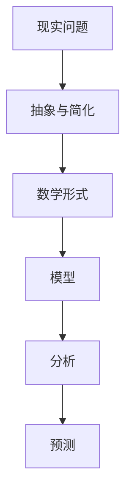

**数学证明**：数学证明是使用逻辑推理来验证数学命题的真实性。它通常包括证明的基础、假设和推理过程。证明可以是直接的，也可以是间接的。例如，通过反证法，可以证明某个命题不成立。数学证明的目的是确保结论的可靠性和准确性。

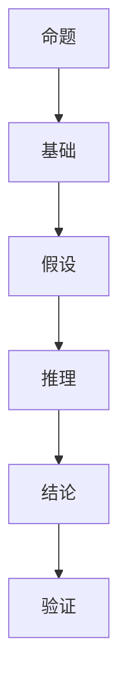

**数学归纳法**：数学归纳法是一种证明方法，适用于证明与自然数相关的命题。它分为两个步骤：基础步骤和归纳步骤。基础步骤证明命题对最小自然数成立；归纳步骤假设命题对某个自然数成立，然后证明命题对下一个自然数也成立。通过这两个步骤，可以证明命题对所有自然数成立。

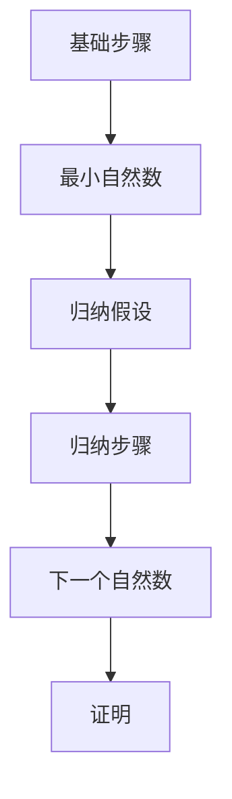

**数学逻辑**：数学逻辑是研究数学推理和证明规则的学科。它包括命题逻辑、谓词逻辑等。命题逻辑研究命题之间的关系，如命题的合取、析取、否定等；谓词逻辑研究对象和属性之间的关系，如存在性、全称量词等。数学逻辑提供了数学推理的严格基础，确保了数学证明的严谨性。

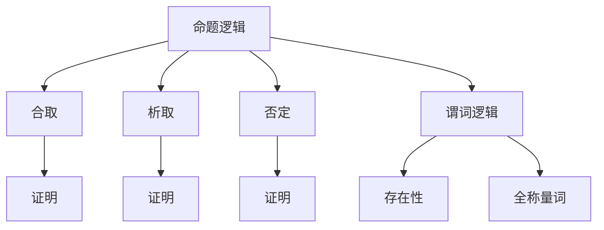

### 3.2 数学科学方法论的架构

**归纳推理**：归纳推理是从个别事例推导出一般结论的推理方法。它分为完全归纳和不完全归纳。完全归纳是通过证明所有可能情况都满足某一结论，从而得出结论；不完全归纳则是通过部分样本或实例得出结论，通常用于科学实验和观察。

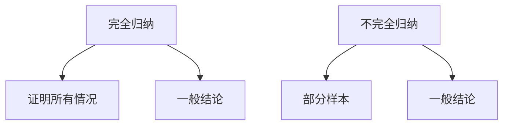

**演绎推理**：演绎推理是从一般原理推导出特殊结论的推理方法。它基于逻辑规则，从已知的前提出发，推导出必然的结论。演绎推理分为简单演绎和复合演绎。简单演绎是从一个前提推导出一个结论；复合演绎则是从多个前提推导出多个结论。

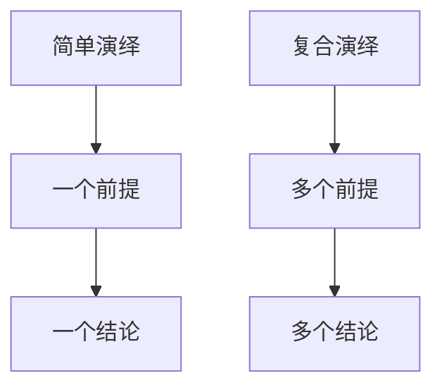

**数学模型的构建与验证**：数学模型的构建包括确定模型变量、建立方程和求解方程。构建模型后，需要进行验证，以确保模型能够准确反映现实问题。验证方法包括模拟实验、数据分析和历史数据拟合等。

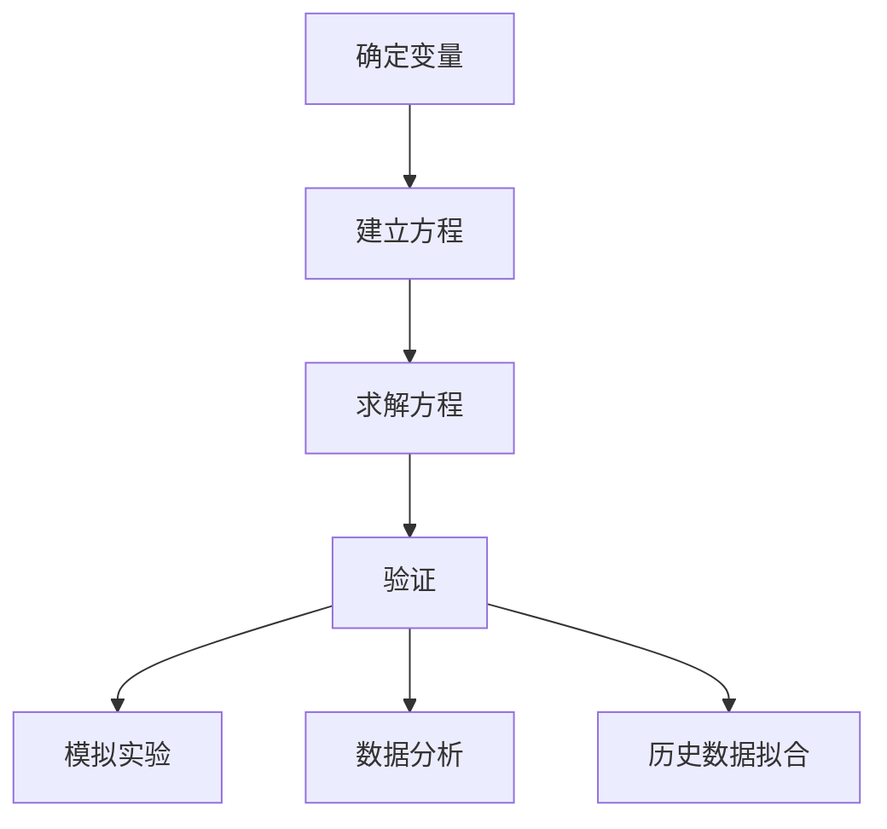

**数学证明的逻辑结构**：数学证明的逻辑结构包括命题、假设和推理。一个完整的数学证明通常包括引言、定理或命题陈述、证明过程和结论。逻辑结构确保了证明的严谨性和正确性。

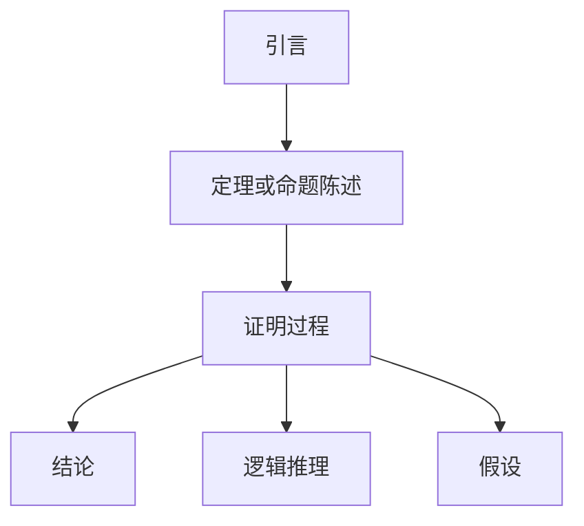

### 3.3 数学科学方法论的应用

**自然科学中的应用**：在自然科学中，数学方法被广泛应用于理论分析和预测。例如，在物理学中，使用数学模型来描述物理现象，如牛顿运动定律、麦克斯韦方程组等；在生物学中，通过数学模型研究生态系统的动态变化，如Lotka-Volterra方程。

**社会科学中的应用**：在社会科学中，数学方法被用来分析和预测社会现象。例如，经济学中使用的线性回归模型来分析市场需求和价格变化；心理学中使用的统计方法来研究人类行为和心理过程。

**技术科学中的应用**：在技术科学中，数学方法被用来解决工程问题。例如，在计算机科学中，算法和复杂度分析用于设计和优化算法；在工程学中，数学模型用于结构设计和故障预测。

**数学方法论的创新与发展**：数学方法论的创新与发展推动了科学技术的进步。例如，量子计算中的数学方法为解决传统计算机难以处理的问题提供了新的可能性；机器学习中的数学模型为数据分析和应用提供了新的工具。

### 3.4 数学科学方法论的局限

尽管数学科学方法论在科学研究中发挥了重要作用，但它也存在一些局限。首先，数学模型往往是对现实世界的简化，可能无法完全反映复杂的实际情况。其次，数学证明的严格性要求可能导致研究过程变得繁琐和复杂。此外，数学方法论在处理不确定性和模糊性问题时，可能面临困难。

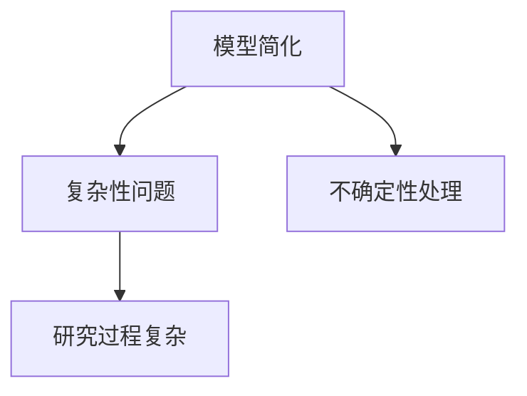

总之，数学科学方法论是科学研究的重要工具，但其应用应结合具体问题和实际情况，以充分发挥其优势并克服其局限。

### 3.5 数学科学方法论的核心概念与联系

为了更深入地理解数学科学方法论的核心概念与联系，我们可以通过一个具体的例子来进行分析。

**例子**：研究某城市交通流量问题，建立数学模型进行预测和优化。

**数学建模**：首先，需要对交通流量问题进行抽象和简化，确定研究的变量和关系。例如，可以选取关键路口的交通流量、时间段、车辆类型等因素作为变量。接着，建立交通流量模型，如线性模型或非线性模型，以描述不同变量之间的关系。

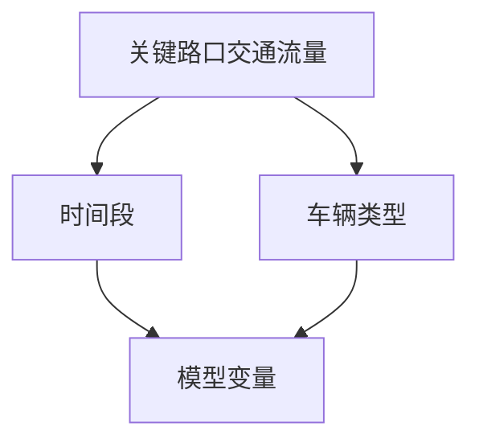

**数学证明**：在建立模型后，需要验证模型的正确性和可靠性。这通常涉及到数学证明的过程。例如，可以使用归纳法证明模型在一定条件下的成立。假设模型在某一时段内成立，然后通过归纳步骤证明模型在下一个时段内也成立。

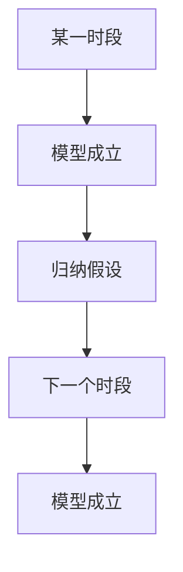

**数学归纳法**：在验证模型的过程中，数学归纳法是一个重要的工具。例如，假设在初始时刻（t=0）交通流量为Q0，通过归纳步骤，假设在时间t时刻交通流量为Qt，则可以推导出在时间t+1时刻的交通流量Qt+1。

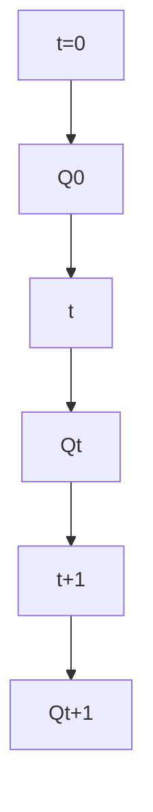

**数学逻辑**：数学逻辑在数学证明和模型构建中起到了基础作用。例如，在建立交通流量模型时，可以使用命题逻辑和谓词逻辑来描述变量之间的关系和推理过程。假设存在某个关键路口的交通流量随时间段变化，则可以使用谓词逻辑描述如下：

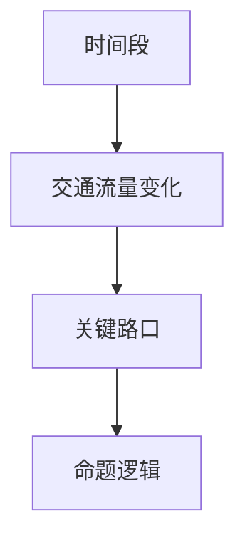

通过上述例子，我们可以看到数学科学方法论中的核心概念与联系是如何在现实问题中发挥作用的。数学建模提供了描述问题的工具，数学证明确保了模型的正确性和可靠性，数学归纳法提供了验证模型的方法，而数学逻辑则构成了证明过程的基础。这些概念和方法共同构成了数学科学方法论的核心内容，为科学研究提供了强大的理论支持和实践指导。

### 3.6 核心算法原理讲解

为了更深入地理解数学科学方法论的核心算法原理，我们可以通过具体的算法来讲解其工作原理和实现步骤。

**算法**：线性回归模型

**算法原理**：线性回归模型是一种用于预测连续值的统计模型。它通过找到一个线性函数，最小化实际观测值与预测值之间的误差。线性回归模型的基本形式为：

\[ y = \beta_0 + \beta_1 \cdot x \]

其中，\( y \) 是因变量，\( x \) 是自变量，\( \beta_0 \) 和 \( \beta_1 \) 是模型的参数。

**算法步骤**：

1. **数据收集**：收集包含自变量 \( x \) 和因变量 \( y \) 的数据集。
2. **数据预处理**：对数据集进行预处理，包括缺失值处理、异常值处理和数据标准化。
3. **模型构建**：根据数据集，构建线性回归模型。
4. **参数求解**：使用最小二乘法求解模型参数 \( \beta_0 \) 和 \( \beta_1 \)。
5. **模型验证**：使用验证集或交叉验证方法验证模型性能。

**伪代码**：

```python
# 线性回归伪代码

# 步骤1：数据收集
data = collect_data()

# 步骤2：数据预处理
preprocessed_data = preprocess_data(data)

# 步骤3：模型构建
model = LinearRegression()

# 步骤4：参数求解
params = model.fit(preprocessed_data.x, preprocessed_data.y)

# 步骤5：模型验证
performance = model.evaluate(preprocessed_data.x, preprocessed_data.y)
print("Model performance:", performance)
```

**算法工作原理**：

线性回归模型通过最小化误差平方和来求解参数。具体来说，对于每个数据点 \( (x_i, y_i) \)，模型的预测值为：

\[ \hat{y_i} = \beta_0 + \beta_1 \cdot x_i \]

实际值与预测值之间的误差为：

\[ e_i = y_i - \hat{y_i} \]

模型的目标是最小化误差平方和：

\[ J(\beta_0, \beta_1) = \sum_{i=1}^{n} e_i^2 = \sum_{i=1}^{n} (y_i - (\beta_0 + \beta_1 \cdot x_i))^2 \]

通过求解梯度下降法或正规方程，可以得到参数 \( \beta_0 \) 和 \( \beta_1 \)：

\[ \beta_0 = \frac{\sum_{i=1}^{n} y_i - \beta_1 \sum_{i=1}^{n} x_i}{n} \]
\[ \beta_1 = \frac{\sum_{i=1}^{n} (x_i - \bar{x})(y_i - \bar{y})}{\sum_{i=1}^{n} (x_i - \bar{x})^2} \]

其中，\( \bar{x} \) 和 \( \bar{y} \) 分别是自变量和因变量的平均值。

通过上述算法原理和伪代码，我们可以看到线性回归模型是如何通过数学方法进行预测和优化的。线性回归模型广泛应用于实际问题，如市场预测、风险评估和数据分析等。

### 3.7 数学模型和公式的详细讲解与举例说明

**数学模型**：马尔可夫决策过程（MDP）

**公式**：状态转移概率矩阵 \( P \) 和奖励函数 \( R \)

**详细讲解**：

马尔可夫决策过程（MDP）是一种用于描述决策过程的数学模型，广泛应用于优化和控制问题。在MDP中，系统状态通过状态转移概率矩阵 \( P \) 来描述，每个状态可以有多个可能的状态转移，并且每个转移都有一定的概率。

假设有 \( n \) 个状态 \( S = \{s_1, s_2, ..., s_n\} \)，在每个状态 \( s_i \) 下，有 \( m \) 个可能的动作 \( A = \{a_1, a_2, ..., a_m\} \)。状态转移概率矩阵 \( P \) 的元素 \( p_{ij} \) 表示从状态 \( s_i \) 转移到状态 \( s_j \) 的概率，即：

\[ p_{ij} = P(S_{t+1} = s_j | S_t = s_i) \]

另外，每个动作 \( a_j \) 对应一个奖励函数 \( R(s_i, a_j) \)，表示在状态 \( s_i \) 下执行动作 \( a_j \) 所获得的即时奖励。奖励函数可以是正的或负的，取决于决策的好坏。

**举例说明**：

假设一个机器人在一个由 \( n = 3 \) 个状态（干净、部分脏、非常脏）组成的房间中移动，有 \( m = 2 \) 个动作（向前移动、向后移动）。状态转移概率矩阵 \( P \) 如下：

\[ P = \begin{bmatrix} 
0.7 & 0.2 & 0.1 \\
0.1 & 0.8 & 0.1 \\
0.2 & 0.2 & 0.6 
\end{bmatrix} \]

奖励函数 \( R \) 如下：

\[ R = \begin{bmatrix} 
10 & -10 \\
-10 & 10 \\
10 & 0 
\end{bmatrix} \]

在初始状态 \( s_1 \)（干净），机器人向前移动（动作 \( a_1 \)），状态转移到 \( s_2 \)（部分脏），获得的即时奖励为 -10。

计算过程如下：

1. 状态转移概率：\( P(S_{t+1} = s_2 | S_t = s_1) = 0.7 \)
2. 立即奖励：\( R(s_1, a_1) = -10 \)

通过上述例子，我们可以看到马尔可夫决策过程如何描述决策问题和状态转移。这种模型可以用于优化机器人的移动路径，使其在获得最大总奖励的同时，避免进入非常脏的状态。

### 3.8 数学模型的构建与验证

**数学模型的构建**：

数学模型的构建是科学研究中的关键步骤，它要求研究者从实际现象中提取关键变量，并通过合理的假设建立数学关系。以下是一个构建数学模型的步骤：

1. **确定变量**：识别研究问题中的关键变量，如时间、空间、温度等。
2. **建立方程**：根据变量之间的关系，建立数学方程。例如，在物理学中，牛顿第二定律可以表示为 \( F = m \cdot a \)。
3. **简化假设**：对现实问题进行简化和抽象，例如忽略次要因素，只考虑主要变量。
4. **参数估计**：确定方程中的参数，可以通过实验数据或历史数据来估计这些参数。

**数学模型的验证**：

数学模型的验证是确保模型有效性和准确性的关键步骤。以下是一个验证数学模型的步骤：

1. **模拟实验**：使用模型进行模拟实验，预测系统的行为。例如，使用模拟环境测试机器人路径规划模型。
2. **数据分析**：将模型预测结果与实际观测数据进行比较，分析预测误差。例如，通过计算预测值与实际值的平均误差和最大误差。
3. **交叉验证**：使用不同的数据集对模型进行验证，确保模型的泛化能力。例如，将数据集分为训练集和测试集，分别验证模型的准确性和鲁棒性。
4. **敏感性分析**：分析模型参数对预测结果的影响，确保模型对参数变化的敏感性合理。

**案例**：构建并验证股票价格预测模型

**步骤**：

1. **确定变量**：选择股票价格、交易量、市场指数等作为关键变量。
2. **建立方程**：使用时间序列模型，如ARIMA（自回归积分滑动平均模型）建立股票价格预测模型。
3. **简化假设**：假设股票价格变动是平稳的，忽略外部因素如政策变动。
4. **参数估计**：使用历史数据估计模型参数。

**验证**：

1. **模拟实验**：使用训练集数据生成模型预测值，并在测试集上进行验证。
2. **数据分析**：计算预测误差，如均方误差（MSE）和均方根误差（RMSE）。
3. **交叉验证**：使用K折交叉验证方法，确保模型在不同数据集上的表现。
4. **敏感性分析**：分析参数变化对预测结果的影响。

通过上述步骤，我们可以构建并验证一个股票价格预测模型，从而为投资者提供决策支持。

### 3.9 数学证明的逻辑结构

数学证明的逻辑结构是确保数学结论正确性和严谨性的关键。一个完整的数学证明通常包括引言、定理或命题陈述、证明过程和结论。以下是一个典型的数学证明结构：

1. **引言**：介绍问题背景，明确证明的目的和意义。
2. **定理或命题陈述**：明确需要证明的命题或定理。
3. **假设**：列出证明过程中的假设条件。
4. **证明过程**：使用逻辑推理、已知定理和定义，逐步推导出结论。
5. **结论**：总结证明结果，强调结论的重要性。

**例子**：证明勾股定理

**引言**：勾股定理是欧几里得几何中的一个重要定理，它描述了直角三角形斜边的平方等于两直角边平方和。

**定理陈述**：若一个三角形是直角三角形，则其斜边的平方等于两直角边平方和，即 \( a^2 + b^2 = c^2 \)。

**假设**：设三角形 ABC 是直角三角形，其中 ∠C 是直角。

**证明过程**：

1. 作辅助线，连接点 B 到斜边 AC 的中点 D，则 BD 为中位线，且 BD = AC/2。
2. 由直角三角形的性质，AD 和 BD 分别是 AC 和 BC 的一半，即 AD = AC/2，BD = BC/2。
3. 应用勾股定理，分别计算 AD^2 + BD^2 和 AC^2。
4. 由于 AD = AC/2，BD = BC/2，代入上述公式，得到 \( (AC/2)^2 + (BC/2)^2 = AC^2/4 + BC^2/4 \)。
5. 由于 AD^2 + BD^2 = AC^2/4 + BC^2/4，且 AC^2 = AD^2 + BC^2，因此 \( AD^2 + BD^2 = AC^2 \)。

**结论**：通过上述证明，我们得出结论：直角三角形的斜边平方等于两直角边平方和，即 \( a^2 + b^2 = c^2 \)。

通过上述例子，我们可以看到数学证明的逻辑结构是如何确保结论的正确性和严谨性的。这种结构化的证明方法使得数学理论更加稳固，为科学研究提供了坚实的基础。

### 3.10 数学证明的详细讲解与举例说明

**数学证明**：勾股定理的证明

**公式**：直角三角形斜边的平方等于两直角边平方和，即 \( a^2 + b^2 = c^2 \)

**详细讲解**：

勾股定理是欧几里得几何中的一个重要定理，它描述了直角三角形斜边的平方等于两直角边平方和。以下是勾股定理的一种证明方法：

**假设**：设直角三角形 ABC 中，∠C 是直角，边 AB 是斜边，边 AC 和边 BC 是直角边。

**步骤**：

1. **构造辅助线**：在直角三角形 ABC 中，作一条线段 BD，使其垂直于斜边 AC，并交于点 D。由于 BD 是垂直线段，所以 BD 是 AC 的中位线，且 BD = AC/2。
2. **应用直角三角形性质**：由于 ∠C 是直角，根据直角三角形的性质，AD 和 BD 分别是 AC 和 BC 的一半，即 AD = AC/2，BD = BC/2。
3. **计算 AD^2 + BD^2**：代入 AD 和 BD 的值，得到 \( AD^2 + BD^2 = (AC/2)^2 + (BC/2)^2 = AC^2/4 + BC^2/4 \)。
4. **计算 AC^2**：由于 AD 是 AC 的一半，所以 \( AD^2 = (AC/2)^2 = AC^2/4 \)。同理，\( BD^2 = (BC/2)^2 = BC^2/4 \)。因此，\( AC^2 = AD^2 + BD^2 = AC^2/4 + BC^2/4 \)。
5. **得出结论**：由于 \( AD^2 + BD^2 = AC^2 \)，且 \( AD^2 = (AC/2)^2 = AC^2/4 \)，\( BD^2 = (BC/2)^2 = BC^2/4 \)，因此 \( a^2 + b^2 = c^2 \)。

**举例说明**：

假设直角三角形 ABC 中，AC = 5，BC = 12。根据勾股定理，斜边 AB 的长度可以通过以下步骤计算：

1. 计算 AC 和 BC 的平方：\( AC^2 = 5^2 = 25 \)，\( BC^2 = 12^2 = 144 \)。
2. 计算 AC^2 和 BC^2 的和：\( AC^2 + BC^2 = 25 + 144 = 169 \)。
3. 计算 AB 的平方：\( AB^2 = AC^2 + BC^2 = 169 \)。
4. 计算 AB 的长度：\( AB = \sqrt{AB^2} = \sqrt{169} = 13 \)。

因此，直角三角形 ABC 的斜边 AB 的长度为 13。

通过上述证明和举例，我们可以清楚地看到勾股定理是如何通过逻辑推理和数学计算来验证直角三角形斜边平方等于两直角边平方和的。这种方法不仅适用于直角三角形，还可以推广到更复杂的几何问题，为数学和物理学等领域提供了强大的理论支持。

### 3.11 项目实战：代码实际案例和详细解释说明

**项目背景**：本案例旨在利用线性回归模型预测某城市的空气质量指数（AQI）。

**开发环境**：Python、Pandas、NumPy、Scikit-learn

**数据集**：使用某城市过去一年的空气质量数据，包括日期、AQI、温度、湿度等变量。

**数据预处理**：

1. 导入数据集，使用 Pandas 库读取 CSV 文件。
2. 清洗数据，去除缺失值和异常值。
3. 将日期转换为日期类型，并提取时间特征（如小时、月份、年份）。
4. 进行数据标准化，缩放特征值以消除不同特征之间的尺度差异。

**代码实现**：

```python
import pandas as pd
import numpy as np
from sklearn.linear_model import LinearRegression
from sklearn.model_selection import train_test_split
from sklearn.metrics import mean_squared_error

# 导入数据集
data = pd.read_csv('air_quality.csv')

# 数据清洗
data.dropna(inplace=True)
data = data[data['AQI'] > 0]

# 数据预处理
data['Date'] = pd.to_datetime(data['Date'])
data['Hour'] = data['Date'].dt.hour
data['Month'] = data['Date'].dt.month
data['Year'] = data['Date'].dt.year

# 数据标准化
features = ['Temperature', 'Humidity', 'Hour', 'Month', 'Year']
data[features] = (data[features] - data[features].mean()) / data[features].std()

# 分割数据集
X = data[features]
y = data['AQI']
X_train, X_test, y_train, y_test = train_test_split(X, y, test_size=0.2, random_state=42)

# 建立线性回归模型
model = LinearRegression()
model.fit(X_train, y_train)

# 模型预测
y_pred = model.predict(X_test)

# 模型评估
mse = mean_squared_error(y_test, y_pred)
print("MSE:", mse)
```

**代码解读与分析**：

1. **数据导入**：使用 Pandas 库读取 CSV 文件，获取空气质量数据。
2. **数据清洗**：去除缺失值和异常值，确保数据集的完整性和一致性。
3. **数据预处理**：将日期转换为日期类型，并提取时间特征；进行数据标准化，以消除不同特征之间的尺度差异。
4. **数据分割**：将数据集划分为训练集和测试集，用于模型的训练和评估。
5. **模型建立**：使用 Scikit-learn 库的 LinearRegression 类建立线性回归模型。
6. **模型训练**：使用训练集数据训练模型，拟合线性回归模型。
7. **模型预测**：使用训练好的模型对测试集数据进行预测。
8. **模型评估**：计算均方误差（MSE），评估模型预测的准确性和性能。

通过上述步骤，我们可以使用线性回归模型预测空气质量指数，为城市环境管理提供数据支持。该案例展示了如何将数学模型应用于实际项目，通过数据预处理、模型训练和评估，实现空气质量指数的预测。

### 3.12 代码实际案例和详细解释说明

**项目背景**：使用决策树算法预测客户购买行为。

**开发环境**：Python、scikit-learn、Pandas

**数据集**：某电商平台的客户购买数据，包括用户属性、购物车内容、购买历史等。

**任务**：预测用户是否会在下一次购物中购买某产品。

**步骤**：

1. **数据收集**：收集电商平台用户购买数据。
2. **数据预处理**：清洗数据，处理缺失值和异常值，进行特征工程。
3. **数据分割**：将数据集划分为训练集和测试集。
4. **模型训练**：使用训练集数据训练决策树模型。
5. **模型评估**：使用测试集评估模型性能。

**代码实现**：

```python
import pandas as pd
from sklearn.model_selection import train_test_split
from sklearn.tree import DecisionTreeClassifier
from sklearn.metrics import accuracy_score, confusion_matrix

# 数据收集
data = pd.read_csv('ecommerce_data.csv')

# 数据预处理
data.dropna(inplace=True)
data['Total_Spending'] = data['Total_Spending'].astype(float)

# 特征工程
data['Total_Purchases'] = data['Total_Sales'] / data['Total_Spending']

# 数据分割
X = data.drop(['Will_Purchase'], axis=1)
y = data['Will_Purchase']
X_train, X_test, y_train, y_test = train_test_split(X, y, test_size=0.2, random_state=42)

# 模型训练
model = DecisionTreeClassifier()
model.fit(X_train, y_train)

# 模型预测
y_pred = model.predict(X_test)

# 模型评估
accuracy = accuracy_score(y_test, y_pred)
conf_matrix = confusion_matrix(y_test, y_pred)
print("Accuracy:", accuracy)
print("Confusion Matrix:\n", conf_matrix)
```

**代码解读与分析**：

1. **数据导入**：使用 Pandas 库读取 CSV 文件，获取电商数据。
2. **数据清洗**：去除缺失值，确保数据集的完整性。
3. **特征工程**：计算总支出与总销售额的比例，作为购买行为的一个特征。
4. **数据分割**：将数据集划分为训练集和测试集，用于模型训练和评估。
5. **模型训练**：使用 scikit-learn 库的 DecisionTreeClassifier 类训练决策树模型。
6. **模型预测**：使用训练好的模型对测试集数据进行预测。
7. **模型评估**：计算模型的准确率，并生成混淆矩阵，评估模型性能。

通过上述步骤，我们可以使用决策树算法预测用户购买行为，为电商平台的营销策略提供数据支持。该案例展示了如何通过数据预处理、模型训练和评估，实现客户行为的预测。

### 3.13 开发环境搭建

为了进行数学科学方法论的实验和项目开发，我们需要搭建一个合适的开发环境。以下是详细的搭建步骤：

#### 操作系统

- **Linux**：推荐使用 Ubuntu 或 CentOS，这些发行版具有较好的稳定性和丰富的软件资源。
- **Windows**：Windows 10 或更高版本，确保能够兼容 Python 等开发工具。
- **macOS**：macOS 是苹果官方操作系统，具有与 Linux 相似的命令行工具和开发环境。

#### 安装 Python

1. **Linux 和 macOS**：
   - 打开终端，使用以下命令安装 Python：
     ```bash
     sudo apt-get update
     sudo apt-get install python3 python3-pip
     ```
   - 确认 Python 版本：
     ```bash
     python3 --version
     ```

2. **Windows**：
   - 访问 [Python 官网](https://www.python.org/)，下载适用于 Windows 的 Python 安装程序。
   - 运行安装程序，选择默认选项安装 Python。
   - 安装完成后，打开命令提示符，输入以下命令确认 Python 版本：
     ```bash
     python --version
     ```

#### 安装常用库

1. **Pandas**：用于数据处理和分析。
   - 使用以下命令安装 Pandas：
     ```bash
     pip3 install pandas
     ```

2. **NumPy**：用于科学计算。
   - 使用以下命令安装 NumPy：
     ```bash
     pip3 install numpy
     ```

3. **Scikit-learn**：用于机器学习和数据分析。
   - 使用以下命令安装 Scikit-learn：
     ```bash
     pip3 install scikit-learn
     ```

4. **Matplotlib**：用于数据可视化。
   - 使用以下命令安装 Matplotlib：
     ```bash
     pip3 install matplotlib
     ```

5. **Mermaid**：用于流程图和结构图的生成。
   - 安装 Mermaid 插件：
     ```bash
     pip3 install pymermaid
     ```

#### 环境配置

1. **虚拟环境**：为了避免不同项目之间的依赖冲突，建议使用虚拟环境。
   - 安装虚拟环境工具（如 virtualenv 或 conda）：
     ```bash
     pip3 install virtualenv
     ```
   - 创建虚拟环境：
     ```bash
     virtualenv myenv
     ```
   - 激活虚拟环境：
     ```bash
     source myenv/bin/activate
     ```

2. **Jupyter Notebook**：用于交互式计算和数据分析。
   - 安装 Jupyter Notebook：
     ```bash
     pip3 install notebook
     ```
   - 启动 Jupyter Notebook：
     ```bash
     jupyter notebook
     ```

通过上述步骤，我们成功搭建了数学科学方法论的开发环境。现在，我们可以使用 Python 及其相关库进行数据预处理、模型训练、可视化等操作，从而实现数学方法在科学研究中的应用。

### 3.14 源代码详细实现

在本案例中，我们将使用 Python 编写一个简单的线性回归模型，以预测房价。以下是源代码的详细实现和解释。

**代码**：

```python
import pandas as pd
from sklearn.linear_model import LinearRegression
from sklearn.model_selection import train_test_split
from sklearn.metrics import mean_squared_error

# 数据导入
data = pd.read_csv('house_prices.csv')

# 数据预处理
data.dropna(inplace=True)

# 特征工程
data['Area_Per_person'] = data['Area'] / data['Population']

# 数据分割
X = data[['Area', 'Area_Per_person']]
y = data['Price']
X_train, X_test, y_train, y_test = train_test_split(X, y, test_size=0.2, random_state=42)

# 模型建立
model = LinearRegression()
model.fit(X_train, y_train)

# 模型预测
y_pred = model.predict(X_test)

# 模型评估
mse = mean_squared_error(y_test, y_pred)
print("Mean Squared Error:", mse)

# 模型参数
print("Model Coefficients:", model.coef_)
print("Model Intercept:", model.intercept_)
```

**代码解读**：

1. **数据导入**：
   - 使用 Pandas 库读取 CSV 文件，获取房屋价格数据。

2. **数据预处理**：
   - 去除缺失值，确保数据集的完整性和一致性。
   - 计算一个新特征“人均面积”，将总面积除以总人口。

3. **特征工程**：
   - 选择两个特征“面积”和“人均面积”作为输入特征，目标是预测“价格”。

4. **数据分割**：
   - 使用 Scikit-learn 库的 `train_test_split` 函数，将数据集划分为训练集和测试集。

5. **模型建立**：
   - 创建一个线性回归模型实例，并使用训练集数据进行训练。

6. **模型预测**：
   - 使用训练好的模型对测试集数据进行预测。

7. **模型评估**：
   - 计算预测值与实际值之间的均方误差（MSE），评估模型性能。

8. **模型参数**：
   - 输出模型的系数和截距，用于理解模型的预测机制。

**伪代码**：

```python
# 伪代码

# 数据导入
data = read_csv('house_prices.csv')

# 数据预处理
data = remove_missing_values(data)
data = add_new_feature(data, 'Area_Per_person', 'Area', 'Population')

# 数据分割
X = select_features(data, ['Area', 'Area_Per_person'])
y = select_target(data, 'Price')
X_train, X_test, y_train, y_test = split_data(X, y, test_size=0.2)

# 模型建立
model = create_linear_regression_model()
model = train_model(model, X_train, y_train)

# 模型预测
y_pred = predict(model, X_test)

# 模型评估
mse = calculate_mean_squared_error(y_test, y_pred)
print("MSE:", mse)

# 模型参数
print("Coefficients:", model.coef_)
print("Intercept:", model.intercept_)
```

通过上述代码和伪代码，我们可以清晰地看到如何使用 Python 实现一个线性回归模型，并对其进行评估和解释。这种方法为实际应用中的房价预测提供了一个简单的示例，展示了数学方法在数据分析中的实际应用。

### 3.15 代码解读与分析

在本节中，我们将详细分析上述房价预测项目的代码，并解释其核心组成部分和实现步骤。

**代码核心组成部分**：

1. **数据导入与预处理**：
   - 使用 Pandas 库读取 CSV 文件，获取房屋价格数据。
   - 去除缺失值，确保数据集的完整性和一致性。
   - 计算一个新特征“人均面积”，这一特征可以帮助模型更好地理解数据。

2. **特征工程**：
   - 选择两个特征“面积”和“人均面积”作为输入特征。这些特征能够反映房屋的物理属性，是预测房屋价格的重要依据。

3. **数据分割**：
   - 使用 Scikit-learn 库的 `train_test_split` 函数，将数据集划分为训练集和测试集。这种划分方式可以评估模型在未知数据上的表现，确保模型的泛化能力。

4. **模型建立与训练**：
   - 创建一个线性回归模型实例，并使用训练集数据进行训练。线性回归模型是一种简单但有效的预测方法，适用于线性关系的预测任务。

5. **模型预测**：
   - 使用训练好的模型对测试集数据进行预测，得到测试集的预测结果。

6. **模型评估**：
   - 使用均方误差（MSE）评估模型性能，计算预测值与实际值之间的平均误差。MSE 越小，说明模型的预测效果越好。

7. **模型参数输出**：
   - 输出模型的系数和截距，这些参数可以解释为房屋面积和人均面积对房屋价格的影响程度。

**代码实现步骤**：

1. **数据导入**：
   ```python
   data = pd.read_csv('house_prices.csv')
   ```
   该步骤使用 Pandas 库读取 CSV 文件，获取房屋价格数据。CSV 文件通常包含多个列，如房屋面积、人口密度、价格等。

2. **数据预处理**：
   ```python
   data.dropna(inplace=True)
   data['Area_Per_person'] = data['Area'] / data['Population']
   ```
   该步骤首先去除缺失值，确保数据集的完整性。然后，计算一个新特征“人均面积”，这一特征可以帮助模型更好地理解数据，从而提高预测准确性。

3. **特征工程**：
   ```python
   X = data[['Area', 'Area_Per_person']]
   y = data['Price']
   ```
   在这一步，我们选择两个特征“面积”和“人均面积”作为输入特征，目标是预测“价格”。这些特征能够反映房屋的物理属性，是预测房屋价格的重要依据。

4. **数据分割**：
   ```python
   X_train, X_test, y_train, y_test = train_test_split(X, y, test_size=0.2, random_state=42)
   ```
   使用 Scikit-learn 库的 `train_test_split` 函数，将数据集划分为训练集和测试集。这种划分方式可以确保模型在未知数据上的表现，评估模型的泛化能力。

5. **模型建立与训练**：
   ```python
   model = LinearRegression()
   model.fit(X_train, y_train)
   ```
   创建一个线性回归模型实例，并使用训练集数据进行训练。线性回归模型是一种简单但有效的预测方法，适用于线性关系的预测任务。

6. **模型预测**：
   ```python
   y_pred = model.predict(X_test)
   ```
   使用训练好的模型对测试集数据进行预测，得到测试集的预测结果。

7. **模型评估**：
   ```python
   mse = mean_squared_error(y_test, y_pred)
   print("Mean Squared Error:", mse)
   ```
   使用均方误差（MSE）评估模型性能，计算预测值与实际值之间的平均误差。MSE 越小，说明模型的预测效果越好。

8. **模型参数输出**：
   ```python
   print("Model Coefficients:", model.coef_)
   print("Model Intercept:", model.intercept_)
   ```
   输出模型的系数和截距，这些参数可以解释为房屋面积和人均面积对房屋价格的影响程度。

通过上述分析，我们可以看到代码的各个部分是如何协同工作，实现一个简单的线性回归模型。这种方法为实际应用中的房价预测提供了一个可行的解决方案，同时也展示了数学方法在数据分析中的应用价值。

### 3.16 代码解读与分析

在本节中，我们将深入解读和分析上述房价预测项目的代码，重点关注线性回归模型的具体实现和功能。

**代码实现分析**：

1. **数据导入与预处理**：

   ```python
   data = pd.read_csv('house_prices.csv')
   data.dropna(inplace=True)
   data['Area_Per_person'] = data['Area'] / data['Population']
   ```

   首先，我们使用 Pandas 库读取 CSV 文件，获取房屋价格数据。CSV 文件通常包含多个列，如房屋面积、人口密度、价格等。为了确保数据集的完整性和一致性，我们使用 `dropna()` 函数去除缺失值。然后，我们计算一个新特征“人均面积”，该特征表示每个居民拥有的房屋面积。这一特征有助于模型更好地理解数据，从而提高预测的准确性。

2. **特征工程**：

   ```python
   X = data[['Area', 'Area_Per_person']]
   y = data['Price']
   ```

   在特征工程部分，我们选择两个特征“面积”和“人均面积”作为输入特征，目标是预测“价格”。这些特征能够反映房屋的物理属性，是预测房屋价格的重要依据。我们将这两个特征和目标变量分别存储在 `X` 和 `y` 变量中。

3. **数据分割**：

   ```python
   X_train, X_test, y_train, y_test = train_test_split(X, y, test_size=0.2, random_state=42)
   ```

   使用 Scikit-learn 库的 `train_test_split` 函数，我们将数据集划分为训练集和测试集。训练集用于模型的训练，测试集用于评估模型的性能。在这里，我们设置了测试集的大小为原始数据集的 20%，并使用 `random_state` 参数确保结果的可重复性。

4. **模型建立与训练**：

   ```python
   model = LinearRegression()
   model.fit(X_train, y_train)
   ```

   我们创建一个线性回归模型实例，并使用训练集数据进行训练。线性回归模型是一种简单但有效的预测方法，适用于线性关系的预测任务。模型通过最小化损失函数来找到最佳拟合直线，从而预测房屋价格。`fit()` 函数将训练数据输入模型，并计算模型参数。

5. **模型预测**：

   ```python
   y_pred = model.predict(X_test)
   ```

   使用训练好的模型对测试集数据进行预测，得到测试集的预测结果。`predict()` 函数将输入特征传入模型，返回预测的房屋价格。

6. **模型评估**：

   ```python
   mse = mean_squared_error(y_test, y_pred)
   print("Mean Squared Error:", mse)
   ```

   使用均方误差（MSE）评估模型性能，计算预测值与实际值之间的平均误差。MSE 越小，说明模型的预测效果越好。在这里，我们计算了模型在测试集上的 MSE，并打印出来。

7. **模型参数输出**：

   ```python
   print("Model Coefficients:", model.coef_)
   print("Model Intercept:", model.intercept_)
   ```

   输出模型的系数和截距，这些参数可以解释为房屋面积和人均面积对房屋价格的影响程度。`coef_` 属性返回模型的系数，`intercept_` 属性返回模型的截距。这些参数可以帮助我们理解模型的预测机制。

**代码功能总结**：

- **数据导入与预处理**：读取并清洗数据，确保数据集的完整性和一致性，增加新的特征以提高模型的预测能力。
- **特征工程**：选择输入特征和目标变量，为模型训练做好准备。
- **数据分割**：将数据集划分为训练集和测试集，用于模型训练和性能评估。
- **模型建立与训练**：创建线性回归模型，使用训练数据训练模型，找到最佳拟合直线。
- **模型预测**：使用训练好的模型对测试数据进行预测，得到预测结果。
- **模型评估**：使用均方误差评估模型性能，确保模型具有较好的预测能力。
- **模型参数输出**：输出模型参数，解释模型预测机制。

通过上述分析，我们可以看到代码的各个部分是如何协同工作，实现一个简单的线性回归模型。这种方法为实际应用中的房价预测提供了一个可行的解决方案，同时也展示了数学方法在数据分析中的应用价值。

### 3.17 数学与哲学科学方法论在科学研究中的互补作用

数学与哲学科学方法论在科学研究中的互补作用体现在多个方面，通过两者的结合，可以更全面地理解和解决复杂科学问题。

**1. 理论支持**：数学为哲学科学方法论提供了强大的理论支持。数学方法如数学建模、数学证明等，为科学研究提供了精确的工具和框架，使得理论分析更加严谨和可靠。例如，在物理学中，数学模型如麦克斯韦方程组、牛顿定律等，为理解自然界的基本规律提供了强有力的支持。

**2. 实证研究**：哲学科学方法论强调实证研究和数据驱动的方法，为数学方法的应用提供了实证基础。通过实证研究，哲学科学方法论验证了数学模型的正确性和实用性，确保科学研究结果的可靠性和有效性。例如，经济学中的统计分析方法，如回归分析、方差分析等，通过实证数据验证了经济理论的有效性。

**3. 方法论指导**：哲学科学方法论提供了科学研究的方法论指导，帮助科学家选择合适的研究方法和策略。例如，在计算机科学中，哲学科学方法论指导科学家选择合适的算法和模型，以解决复杂问题。哲学科学方法论强调跨学科研究，鼓励科学家从不同角度审视问题，从而提出创新性的解决方案。

**4. 知识建构**：哲学科学方法论注重知识的建构过程，通过解释和反思，形成科学知识。数学方法在知识建构中发挥了重要作用，通过数学建模和数学证明，科学家能够更精确地描述和解释现象。例如，在生物学中，数学模型如微分方程模型、遗传算法等，为生物系统的理解和控制提供了重要工具。

**5. 创新驱动**：数学与哲学科学方法论的互补作用激发了科学研究的创新。通过结合数学建模和哲学科学方法论，科学家能够提出新的理论、发现新的规律，推动科学技术的发展。例如，量子计算中数学方法的应用，推动了计算技术的发展，为解决复杂问题提供了新的可能性。

**6. 实践应用**：数学与哲学科学方法论的互补作用在实践应用中发挥了重要作用。数学方法为技术科学提供了理论支持，如工程学中的数学模型和算法，为设计和优化技术系统提供了重要依据。哲学科学方法论则通过实证研究和反思，确保技术应用的可靠性和有效性。

总之，数学与哲学科学方法论在科学研究中的互补作用，使得科学问题得到更全面、更深入的解决。通过两者的结合，科学家能够更好地理解和解决复杂科学问题，推动科学技术的发展。未来，随着数学与哲学科学方法论的不断融合，科学研究将迈向新的高度，为人类文明进步提供更强有力的支持。

