                 

# 数学与哲学辩证法的思维模式比较

> **关键词**：数学思维、哲学辩证法、思维模式、逻辑推理、抽象性、演绎推理、归纳推理、对立统一、质量互变、教育应用、未来趋势。

> **摘要**：本文通过对比数学与哲学辩证法的思维模式，探讨了二者的异同及其在实际问题中的应用。文章首先介绍了数学与哲学辩证法的基础理论，随后详细分析了数学思维模式中的逻辑性、抽象性和演绎推理，以及哲学辩证法思维模式中的反思性、归纳推理和对立统一。通过比较二者的思维模式，文章进一步探讨了数学与哲学辩证法在实际问题中的应用，如教育中的数学思维培养和哲学辩证法的思维培养。最后，文章展望了数学与哲学辩证法思维模式的未来发展趋势，并提出了未来研究和应用的方向。

### 第一部分：引言与核心概念

#### 1.1 引言

《数学与哲学辩证法的思维模式比较》旨在探讨数学与哲学辩证法在认知、方法论和问题解决等方面的异同。数学作为一门以逻辑和抽象为基础的学科，其思维模式具有高度的严谨性和系统性。而哲学辩证法则更多地关注反思、归纳和矛盾分析，强调对概念和理论的深刻理解。本文将从以下几个方面展开讨论：

1. **数学思维模式**：分析数学思维模式的基础理论、逻辑性、抽象性和演绎推理。
2. **哲学辩证法思维模式**：探讨哲学辩证法思维模式的起源、基本概念、反思性、归纳推理和对立统一。
3. **数学与哲学辩证法的思维模式比较**：比较数学与哲学辩证法的思维模式异同，分析二者在实际问题中的应用。
4. **数学与哲学辩证法思维模式在实际问题中的应用**：讨论数学与哲学辩证法在教育中的应用，以及未来发展趋势。

#### 1.2 核心概念

在探讨数学与哲学辩证法的思维模式之前，我们需要明确几个核心概念：

- **数学思维模式**：指数学家在研究过程中所采用的思维方式和方法论。包括逻辑性、抽象性和演绎推理等特点。
- **哲学辩证法思维模式**：指哲学家在探讨概念和理论时所采用的思维方式和方法论。包括反思性、归纳推理和对立统一等原则。

- **逻辑性**：指在数学和哲学辩证法中，都强调推理的严谨性和逻辑一致性。
- **抽象性**：指在数学和哲学辩证法中，都注重从复杂现象中提取本质特征，进行抽象化处理。
- **演绎推理**：指从一般原理出发，推导出特殊结论的推理方式。
- **反思性**：指在哲学辩证法中，强调对理论、概念和方法的深入反思和审视。
- **归纳推理**：指从特殊实例中归纳出一般性结论的推理方式。
- **对立统一**：指在哲学辩证法中，强调矛盾双方的相互依存和相互转化。

#### 1.3 本书结构

本文分为六个部分：

1. **第一部分**：引言与核心概念。介绍本文的研究背景和核心概念。
2. **第二部分**：数学思维模式详解。分析数学思维模式的基础理论、逻辑性、抽象性和演绎推理。
3. **第三部分**：哲学辩证法思维模式详解。探讨哲学辩证法思维模式的起源、基本概念、反思性、归纳推理和对立统一。
4. **第四部分**：数学与哲学辩证法思维模式比较。比较数学与哲学辩证法的思维模式异同，分析二者在实际问题中的应用。
5. **第五部分**：数学与哲学辩证法思维模式在实际问题中的应用。讨论数学与哲学辩证法在教育中的应用，以及未来发展趋势。
6. **第六部分**：结论。总结本文的研究成果和未来展望。

### Mermaid 流程图

```mermaid
graph TD
    A[引言与核心概念] --> B{数学思维模式}
    A --> C{哲学辩证法思维模式}
    A --> D{思维模式比较}
    B --> E{基础理论}
    B --> F{逻辑性}
    B --> G{抽象性}
    B --> H{演绎推理}
    C --> I{起源与发展}
    C --> J{反思性}
    C --> K{归纳推理}
    C --> L{对立统一}
    D --> M{异同比较}
    D --> N{实际应用}
    E --> O{数学概念形成与发展}
    E --> P{数学方法论}
    F --> Q{数学证明}
    F --> R{形式逻辑}
    G --> S{构建数学模型}
    G --> T{解决实际问题}
    H --> U{数学定理证明}
    H --> V{问题解决方法}
    I --> W{希腊哲学}
    I --> X{黑格尔与马克思主义}
    J --> Y{理论有效性检验}
    J --> Z{研究方法优化}
    K --> AA{矛盾分析}
    K --> BB{解决问题}
    L --> CC{概念和思想发展}
    L --> DD{事物发展变化}
    M --> EE{逻辑性与反思性}
    M --> FF{抽象性与归纳推理}
    M --> GG{演绎推理与归纳推理}
    N --> HH{数学在哲学中的应用}
    N --> II{哲学在数学中的应用}
    O --> JJ{现实世界观察}
    O --> KK{定义与公理系统}
    P --> LL{系统性}
    P --> MM{归纳与演绎}
    Q --> NN{严谨性}
    Q --> OO{普遍性}
    R --> PP{逻辑法则}
    R --> QQ{推理过程}
    S --> RR{现实问题转化}
    S --> SS{数学问题转化}
    T --> UU{数学定理应用}
    T --> VV{算法应用}
    U --> WW{逻辑推导}
    U --> XX{结论验证}
    V --> YY{复杂问题转化}
    V --> ZZ{算法设计}
    W --> AAA{辩证法探讨}
    W --> BBB{辩证法发展}
    X --> CCC{概念和理论探讨}
    X --> DDD{社会发展探讨}
    Y --> EEE{合理性检验}
    Y --> FFF{理论优化}
    Z --> GGG{矛盾分析}
    Z --> HHH{问题解决}
    AA --> III{矛盾双方分析}
    AA --> JJJ{矛盾解决}
    BB --> KKK{实际应用分析}
    BB --> LLL{问题解决方法}
    CC --> MMM{概念发展}
    CC --> NNN{思想发展}
    DD --> OOO{动态变化}
    DD --> PPP{发展趋势}
    EE --> QQQ{逻辑推理严谨性}
    EE --> RRR{理论合理性}
    FF --> SSS{数学概念抽象}
    FF --> TTT{归纳推理有效性}
    GG --> UUU{演绎推理}
    GG --> VVV{归纳推理}
    HH --> WWW{数学工具应用}
    HH --> XXX{哲学分析}
    II --> YYY{哲学方法应用}
    II --> ZZZ{数学证明支持}
    JJ --> AAA{现实世界观察}
    JJ --> BBB{抽象化处理}
    KK --> CCC{系统性分析}
    KK --> DDD{方法优化}
    LL --> EEE{抽象模型构建}
    LL --> FFF{实际问题解决}
    MM --> GGG{归纳推理}
    MM --> HHH{演绎推理}
    NN --> III{概念和理论发展}
    NN --> JJJ{社会发展分析}
    OO --> KKK{现实世界观察}
    OO --> LLL{定义和公理系统}
    PP --> MMM{逻辑一致性}
    PP --> NNN{推理过程严谨性}
    QQ --> AAA{逻辑法则应用}
    QQ --> BBB{推理过程验证}
    RR --> CCC{现实问题转化}
    RR --> DDD{数学问题转化}
    SS --> EEE{数学定理应用}
    SS --> FFF{算法设计}
    TT --> GGG{数学问题解决}
    TT --> HHH{实际应用分析}
    UU --> III{逻辑推导过程}
    UU --> JJJ{结论验证}
    VV --> KKK{复杂问题转化}
    VV --> LLL{算法设计}
    WW --> III{数学工具应用}
    WW --> JJJ{哲学分析}
    XX --> KKK{哲学方法应用}
    XX --> LLL{数学证明支持}
    YY --> III{哲学方法应用}
    YY --> JJJ{数学工具应用}
    ZZ --> KKK{数学问题解决}
    ZZ --> LLL{实际问题分析}
```

#### 1.4 本章小结

本章介绍了本文的研究背景、核心概念和全书结构。通过对比数学与哲学辩证法的思维模式，本文旨在探讨二者的异同及其在实际问题中的应用。在后续章节中，我们将分别对数学思维模式和哲学辩证法思维模式进行详细分析，并比较二者的异同，探讨其在实际问题中的应用。

---

## 第二部分：数学思维模式详解

### 2.1 数学思维模式的基础理论

数学思维模式是数学家在研究过程中所采用的思维方式和方法论。它包括对数学概念的形成、数学方法论的特点以及数学推理方式的深入理解。以下将从数学概念的形成与发展、数学方法论的特点和应用三个方面进行详细探讨。

#### 2.1.1 数学概念的形成与发展

数学概念的形成是一个从现实世界的观察和抽象到概念的定义和公理系统的过程。数学家通过对现实世界的观察，提取出一些基本的、普遍适用的现象和规律，并将其抽象化为数学概念。

- **数学概念的形成**：数学概念的形成通常基于以下两个方面：

  1. **现实世界的观察**：数学家通过观察现实世界中的现象，发现一些普遍的规律。例如，在研究长度、面积和体积时，数学家发现这些量可以通过简单的几何图形来表示和计算。

  2. **抽象化处理**：数学家将现实世界中的现象抽象化为数学概念。例如，将长度、面积和体积的概念抽象化为几何图形的边长、面积和体积。

- **数学概念的发展**：数学概念的发展通常基于以下两个方面：

  1. **已有概念的创新和拓展**：数学家通过对已有概念的创新和拓展，形成新的数学概念。例如，从整数扩展到有理数、无理数和复数，以及从平面几何扩展到空间几何和非欧几何。

  2. **数学定理和证明**：数学家通过建立数学定理和进行证明，验证新概念的合理性和有效性。例如，欧几里得几何中的公理系统和哥德尔不完备性定理等。

#### 2.1.2 数学方法论

数学方法论是指数学家在研究过程中所采用的方法和步骤。它具有以下特点：

- **系统性**：数学方法论强调公理体系和方法论的一致性。例如，欧几里得几何的公理体系、非欧几何的公理体系和拓扑学的公理体系等。

- **归纳与演绎**：数学方法论既注重归纳推理，也强调演绎推理的严谨性。例如，数学家通过观察现实世界中的现象，归纳出一些数学定理，然后通过严格的证明来验证这些定理的正确性。

- **抽象与具体**：数学方法论强调从具体问题中提取抽象概念和符号，然后运用这些抽象概念和符号解决具体问题。例如，在研究微积分时，数学家将现实世界中的变速运动抽象化为数学中的函数和导数。

#### 2.1.3 数学方法论的应用

数学方法论在数学研究中具有广泛的应用，主要包括以下几个方面：

- **研究问题**：数学方法论帮助数学家将复杂问题转化为数学问题。例如，在研究物理学中的力学问题时，数学家将力学问题转化为数学中的微分方程问题。

- **解决问题**：数学方法论帮助数学家运用数学定理和算法解决数学问题。例如，在解决代数方程时，数学家运用因式分解、配方法和求根公式等方法。

- **证明问题**：数学方法论帮助数学家进行数学证明，确保数学结论的正确性和普遍性。例如，在证明欧几里得几何中的定理时，数学家运用演绎推理和反证法等方法。

#### 2.1.4 数学思维模式的案例分析

为了更好地理解数学思维模式，我们可以通过一些具体的案例分析来展示其应用。

- **案例一：欧几里得几何**

  欧几里得几何是数学史上最重要的几何体系之一。欧几里得通过五个公理和一系列定理，建立了完整的几何理论体系。这个案例展示了数学思维模式中的系统性和演绎推理的特点。

- **案例二：微积分**

  微积分是数学中的重要分支，用于研究变化和运动的规律。微积分中的概念，如导数、积分和微分方程，都是通过数学思维模式中的抽象和演绎推理得到的。这个案例展示了数学思维模式中的抽象性和演绎推理的特点。

### 2.2 数学思维模式中的逻辑性

逻辑性是数学思维模式中的重要特点之一，它强调推理的严谨性和一致性。以下将从逻辑性的定义、在数学中的应用和案例分析三个方面进行探讨。

#### 2.2.1 逻辑性的定义

逻辑性是指数学家在推理过程中所遵循的逻辑法则和规则，以确保推理过程的一致性和正确性。逻辑性包括以下几个方面：

- **形式逻辑**：形式逻辑是一种基于符号和逻辑法则的推理方法，它关注推理的形式结构，而不涉及具体内容。形式逻辑包括命题逻辑、谓词逻辑和证明论等分支。

- **谓词逻辑**：谓词逻辑是一种基于谓词和量词的推理方法，它可以用来表示和推理更复杂的数学命题。

- **证明论**：证明论是一种研究证明的数学分支，它关注证明的性质和结构。证明论包括模型论、集合论和公理化方法等。

#### 2.2.2 逻辑性在数学中的应用

逻辑性在数学中的应用非常广泛，它贯穿于数学的各个领域。以下是一些具体的例子：

- **数学证明**：数学证明是逻辑性在数学中最直接的应用。通过严格的证明，数学家可以证明数学定理的正确性。例如，欧几里得几何中的定理、微积分中的定理和代数中的定理等。

- **逻辑推理**：逻辑推理是数学家在研究过程中常用的方法。通过逻辑推理，数学家可以从已知的前提出发，推导出新的结论。例如，在研究数学问题时，数学家可以通过逻辑推理找到解决方案。

- **形式化数学**：形式化数学是一种将数学概念和定理用符号和逻辑表达出来的方法。通过形式化数学，数学家可以更精确地描述数学概念和定理，并确保其一致性。例如，数理逻辑和形式化数学系统等。

#### 2.2.3 逻辑性在数学中的案例分析

为了更好地理解逻辑性在数学中的应用，我们可以通过一些具体的案例分析来展示其应用。

- **案例一：欧拉公式**

  欧拉公式是复分析中的重要定理，它将指数函数、三角函数和对数函数统一在一个公式中。欧拉公式的证明依赖于严格的逻辑推理和数学证明。这个案例展示了逻辑性在数学证明中的应用。

- **案例二：哥德尔不完备性定理**

  哥德尔不完备性定理是数学逻辑中的重要定理，它表明在形式化的数学系统中，存在一些命题是无法被证明或否证的。哥德尔不完备性定理的证明依赖于复杂的逻辑推理和数学证明。这个案例展示了逻辑性在数学逻辑中的应用。

### 2.3 数学思维模式中的抽象性

抽象性是数学思维模式中的另一个重要特点，它强调从复杂现象中提取本质特征，进行抽象化处理。以下将从抽象性的定义、在数学中的应用和案例分析三个方面进行探讨。

#### 2.3.1 抽象性的定义

抽象性是指数学家在研究过程中，将复杂现象简化为基本要素，提取出本质特征，形成抽象概念和符号的过程。抽象性包括以下几个方面：

- **概念抽象**：将复杂现象中的具体事物抽象为基本概念。例如，将长度、面积和体积等具体量抽象为几何学中的基本概念。

- **符号抽象**：将复杂现象中的具体关系抽象为符号表示。例如，将数学运算和逻辑关系抽象为符号表示。

- **模型抽象**：将复杂现象中的基本要素和关系抽象为数学模型。例如，将物理现象抽象为数学中的微分方程模型。

#### 2.3.2 抽象性在数学中的应用

抽象性在数学中的应用非常广泛，它贯穿于数学的各个领域。以下是一些具体的例子：

- **数学建模**：通过抽象性，数学家可以将复杂问题转化为数学问题。例如，在研究经济问题时，数学家可以通过建立经济模型来分析经济现象。

- **符号运算**：通过抽象性，数学家可以使用符号表示和运算来简化复杂问题。例如，在研究代数方程时，数学家可以使用符号运算来求解方程。

- **形式化数学**：通过抽象性，数学家可以将数学概念和定理形式化，确保其一致性和正确性。例如，在建立数理逻辑系统时，数学家可以使用抽象符号和公理系统来形式化数学概念和定理。

#### 2.3.3 抽象性在数学中的案例分析

为了更好地理解抽象性在数学中的应用，我们可以通过一些具体的案例分析来展示其应用。

- **案例一：微积分**

  微积分是数学中的一个重要分支，它用于研究变化和运动的规律。微积分中的概念，如导数、积分和微分方程，都是通过抽象性得到的。例如，导数的概念是通过对变速运动进行抽象得到的。这个案例展示了抽象性在微积分中的应用。

- **案例二：拓扑学**

  拓扑学是数学中的一个重要分支，它用于研究空间的结构和性质。拓扑学中的概念，如点、集合、连通性和紧致性等，都是通过抽象性得到的。例如，紧致性的概念是通过对空间中点的密集性进行抽象得到的。这个案例展示了抽象性在拓扑学中的应用。

### 2.4 数学思维模式中的演绎推理

演绎推理是数学思维模式中的重要特点之一，它是一种从一般到特殊的推理方式。以下将从演绎推理的定义、在数学中的应用和案例分析三个方面进行探讨。

#### 2.4.1 演绎推理的定义

演绎推理是一种从一般到特殊的推理方式，它基于一般性的前提出发，推导出特殊性的结论。演绎推理的基本形式是：“如果A，则B；A成立，因此B成立”。演绎推理分为两个部分：前提和结论。

- **前提**：演绎推理的起始部分，它包含一般性的陈述。
- **结论**：演绎推理的结尾部分，它是从前提中推导出来的特殊性陈述。

#### 2.4.2 演绎推理在数学中的应用

演绎推理在数学中具有广泛的应用，它贯穿于数学的各个领域。以下是一些具体的例子：

- **数学定理证明**：通过演绎推理，数学家可以证明数学定理的正确性。例如，欧几里得几何中的定理、微积分中的定理和代数中的定理等。

- **问题解决**：通过演绎推理，数学家可以解决数学问题。例如，在解决代数方程时，数学家可以通过演绎推理找到方程的解。

- **逻辑推理**：通过演绎推理，数学家可以在逻辑上进行推理，找到新的结论。例如，在研究数学问题时，数学家可以通过演绎推理推导出新的数学命题。

#### 2.4.3 演绎推理在数学中的案例分析

为了更好地理解演绎推理在数学中的应用，我们可以通过一些具体的案例分析来展示其应用。

- **案例一：欧几里得几何**

  欧几里得几何是数学史上最重要的几何体系之一。欧几里得通过演绎推理，建立了完整的几何理论体系。欧几里得几何中的定理，如平行公理和全等三角形的判定定理等，都是通过演绎推理得到的。这个案例展示了演绎推理在欧几里得几何中的应用。

- **案例二：微积分**

  微积分是数学中的一个重要分支，它用于研究变化和运动的规律。微积分中的概念，如导数和积分，都是通过演绎推理得到的。例如，导数的概念是通过定义导数的极限得到的。这个案例展示了演绎推理在微积分中的应用。

### 2.5 本章小结

本章详细分析了数学思维模式的基础理论，包括数学概念的形成与发展、数学方法论的特点和应用、逻辑性、抽象性和演绎推理等。通过案例分析，我们展示了数学思维模式在实际问题中的应用。在后续章节中，我们将进一步探讨哲学辩证法思维模式，并比较数学与哲学辩证法的思维模式异同，探讨其在实际问题中的应用。

---

## 第三部分：哲学辩证法思维模式详解

### 3.1 哲学辩证法思维模式的基础理论

哲学辩证法思维模式是一种对概念、理论和方法进行反思、分析、综合和发展的思维方式。它起源于古希腊哲学，尤其是苏格拉底、柏拉图和亚里士多德的思想。在黑格尔和马克思主义哲学中，辩证法得到了进一步的发展和深化。以下将从哲学辩证法的起源与发展、基本概念、反思性和辩证思维的特点等方面进行详细探讨。

#### 3.1.1 哲学辩证法的起源与发展

哲学辩证法的起源可以追溯到古希腊哲学，其中苏格拉底、柏拉图和亚里士多德的思想对辩证法的发展产生了深远影响。

- **苏格拉底**：苏格拉底是辩证法的奠基人之一，他通过提问和对话的方式，引导人们进行自我反思，发现并揭示问题中的矛盾。

- **柏拉图**：柏拉图在《理想国》中提出了辩证法的概念，认为辩证法是一种揭示真理和智慧的方法。

- **亚里士多德**：亚里士多德将辩证法系统化，提出了辩证法的三个要素：质辩、量辩和理辩。

在黑格尔和马克思主义哲学中，辩证法得到了进一步的发展和深化。

- **黑格尔**：黑格尔认为辩证法是哲学的核心方法，它强调矛盾、对立和统一。黑格尔的辩证法包括三个阶段：肯定、否定和否定之否定。

- **马克思主义哲学**：马克思主义哲学将辩证法应用于社会和历史研究，认为辩证法是认识世界和改造世界的重要工具。马克思主义哲学强调辩证法在实践中的应用，特别是社会矛盾的分析和解决。

#### 3.1.2 哲学辩证法的基本概念

哲学辩证法的基本概念包括反思性、归纳推理、对立统一和质量互变。

- **反思性**：反思性是指对理论、概念和方法进行深入思考和审视的能力。反思性使哲学家能够从多个角度分析问题，发现理论中的矛盾和不足，并提出新的观点和理论。

- **归纳推理**：归纳推理是从特殊实例中归纳出一般性结论的推理方式。归纳推理使哲学家能够从个别现象中发现普遍规律，从而形成新的理论。

- **对立统一**：对立统一是指矛盾双方相互依存、相互转化的关系。对立统一是辩证法的核心概念，它强调事物内部的对立和统一是事物发展的动力。

- **质量互变**：质量互变是指事物在一定条件下，可以从一种状态转化为另一种状态。质量互变揭示了事物发展过程中的量变和质变关系。

#### 3.1.3 反思性

反思性是哲学辩证法思维模式中的一个重要特点，它使哲学家能够对理论、概念和方法进行深入思考和审视。

- **反思性的作用**：反思性使哲学家能够发现理论中的矛盾和不足，从而推动理论的创新和发展。反思性也使哲学家能够从多个角度分析问题，提高认识事物的深度和广度。

- **反思性的应用**：在哲学研究中，反思性可以帮助哲学家分析不同哲学观点的合理性，发现不同观点之间的矛盾和共识。在科学研究中，反思性可以帮助科学家审视现有理论，发现新的研究问题和方向。

#### 3.1.4 归纳推理

归纳推理是哲学辩证法思维模式中的另一个重要特点，它使哲学家能够从特殊实例中归纳出一般性结论。

- **归纳推理的作用**：归纳推理使哲学家能够从个别现象中发现普遍规律，从而形成新的理论。归纳推理也是科学研究中的重要方法，它可以帮助科学家发现自然界的规律。

- **归纳推理的应用**：在哲学研究中，归纳推理可以帮助哲学家分析社会现象，发现社会发展的规律。在科学研究中，归纳推理可以帮助科学家提出新的假说和理论，并验证这些理论。

#### 3.1.5 对立统一

对立统一是哲学辩证法思维模式中的核心概念，它强调事物内部的对立和统一是事物发展的动力。

- **对立统一的作用**：对立统一使哲学家能够理解事物发展的内在动力，从而更好地分析和解决问题。对立统一也使哲学家能够认识到事物的多样性和复杂性。

- **对立统一的应用**：在哲学研究中，对立统一可以帮助哲学家分析不同哲学观点的矛盾和统一，从而提出新的哲学理论。在科学研究中，对立统一可以帮助科学家理解自然现象的本质和内在联系。

#### 3.1.6 质量互变

质量互变是哲学辩证法思维模式中的另一个重要概念，它强调事物在一定条件下可以从一种状态转化为另一种状态。

- **质量互变的作用**：质量互变使哲学家能够理解事物发展过程中的量变和质变关系，从而更好地分析和解决问题。质量互变也使哲学家能够认识到事物的发展变化和动态性。

- **质量互变的应用**：在哲学研究中，质量互变可以帮助哲学家分析社会现象的发展过程，发现社会发展的规律。在科学研究中，质量互变可以帮助科学家理解自然现象的本质和内在联系。

#### 3.1.7 辩证思维的特点

哲学辩证法思维模式具有以下特点：

- **反思性**：强调对理论、概念和方法的深入思考和审视。

- **归纳推理**：强调从特殊实例中归纳出一般性结论。

- **对立统一**：强调事物内部的对立和统一是事物发展的动力。

- **质量互变**：强调事物在一定条件下可以从一种状态转化为另一种状态。

- **系统性**：强调事物的整体性和系统性。

- **动态性**：强调事物的发展变化和动态性。

- **实践性**：强调理论与实践的结合，将辩证法应用于实际问题中。

### 3.2 哲学辩证法思维模式的实践应用

哲学辩证法思维模式不仅是一种理论工具，更是一种实践方法。它广泛应用于哲学研究、社会科学研究、科学研究以及日常生活。以下将从反思性、归纳推理、对立统一和质量互变在哲学、社会科学和科学研究中的应用进行详细探讨。

#### 3.2.1 反思性在哲学中的应用

反思性是哲学辩证法思维模式中的一个重要特点，它使哲学家能够对理论、概念和方法进行深入思考和审视。以下是一些具体的例子：

- **哲学争论**：在哲学争论中，反思性使哲学家能够审视不同哲学观点的合理性和不足之处，从而提出新的观点和理论。

- **哲学研究**：在哲学研究中，反思性使哲学家能够对已有理论进行批判性分析，发现理论的局限性和新的研究方向。

- **哲学教育**：在哲学教育中，反思性使哲学家能够引导学生批判性思考，培养独立思考和创新能力。

#### 3.2.2 归纳推理在社会科学研究中的应用

归纳推理是哲学辩证法思维模式中的另一个重要特点，它使哲学家能够从特殊实例中归纳出一般性结论。以下是一些具体的例子：

- **社会现象分析**：在社会科学研究中，归纳推理使社会科学家能够从大量社会现象中归纳出普遍规律，从而解释社会现象的本质。

- **社会政策制定**：在制定社会政策时，归纳推理使社会科学家能够基于已有的社会现象和规律，提出有效的政策建议。

- **社会调查研究**：在社会调查研究中，归纳推理使社会科学家能够从调查数据中归纳出结论，为社会科学研究提供实证支持。

#### 3.2.3 对立统一在科学研究中的应用

对立统一是哲学辩证法思维模式中的核心概念，它强调事物内部的对立和统一是事物发展的动力。以下是一些具体的例子：

- **科学研究方法**：在科学研究中，对立统一使科学家能够采用不同的研究方法，如实验、观察和模拟等，以全面、深入地研究事物。

- **科学理论发展**：在科学理论的发展中，对立统一使科学家能够理解理论中的矛盾和统一，从而推动科学理论的创新和发展。

- **科学问题解决**：在解决科学问题时，对立统一使科学家能够从不同角度分析问题，找到问题的本质，并提出有效的解决方案。

#### 3.2.4 质量互变在科学研究中的应用

质量互变是哲学辩证法思维模式中的另一个重要概念，它强调事物在一定条件下可以从一种状态转化为另一种状态。以下是一些具体的例子：

- **科学实验**：在科学实验中，质量互变使科学家能够观察和控制事物的状态变化，从而验证科学理论。

- **技术创新**：在技术创新中，质量互变使科学家能够发现新材料的特性，从而推动新技术的发明和应用。

- **科学应用**：在科学应用中，质量互变使科学家能够将科学理论应用于实际问题中，解决现实问题。

#### 3.2.5 哲学辩证法思维模式在实践中的应用

哲学辩证法思维模式在实践中的应用非常广泛，以下是一些具体的例子：

- **企业管理**：在企业管理中，哲学辩证法思维模式可以帮助企业家分析市场变化，制定正确的经营策略。

- **社会治理**：在社会治理中，哲学辩证法思维模式可以帮助政府分析社会问题，制定有效的政策措施。

- **科技发展**：在科技发展中，哲学辩证法思维模式可以帮助科学家分析技术发展趋势，推动科技进步。

### 3.3 哲学辩证法思维模式的案例分析

为了更好地理解哲学辩证法思维模式在实际问题中的应用，我们可以通过一些具体的案例分析来展示其应用。

#### 3.3.1 案例一：马克思主义哲学

马克思主义哲学是哲学辩证法思维模式的经典应用。马克思主义哲学通过对社会现象的辩证分析，揭示了社会发展的规律。以下是一些具体的例子：

- **社会矛盾分析**：马克思主义哲学强调社会矛盾是社会发展的动力。通过对社会矛盾的分析，马克思主义哲学揭示了资本主义社会的基本矛盾，即生产力和生产关系之间的矛盾。

- **社会发展规律**：马克思主义哲学认为，社会发展的规律是生产关系适应生产力的发展。在资本主义社会，生产关系阻碍了生产力的发展，从而导致社会革命的爆发。

- **革命与建设**：马克思主义哲学强调通过革命推翻旧的社会制度，建立新的社会制度。在建设社会主义社会时，马克思主义哲学指导人们正确处理社会矛盾，推动社会主义事业的发展。

#### 3.3.2 案例二：黑格尔哲学

黑格尔哲学是哲学辩证法思维模式的另一经典应用。黑格尔哲学通过对逻辑和历史的辩证分析，揭示了概念和思想的发展。以下是一些具体的例子：

- **逻辑发展**：黑格尔哲学认为，逻辑发展是一个从抽象到具体的过程。在逻辑发展的过程中，概念和思想从简单的形式逐渐发展到复杂的形式。

- **历史发展**：黑格尔哲学认为，历史发展是一个从必然到自由的过程。在历史发展的过程中，人类社会从受自然规律支配的状态逐渐发展到自觉创造历史的状态。

- **辩证法应用**：黑格尔哲学强调辩证法在历史发展中的作用。辩证法使人类社会能够从对立中找到统一，从而推动社会的进步。

### 3.4 本章小结

本章详细分析了哲学辩证法思维模式的基础理论，包括起源与发展、基本概念、反思性、归纳推理、对立统一和质量互变。通过案例分析，我们展示了哲学辩证法思维模式在实际问题中的应用。在后续章节中，我们将比较数学思维模式和哲学辩证法思维模式的异同，探讨二者在实际问题中的应用。

---

## 第四部分：数学与哲学辩证法思维模式比较

### 4.1 数学与哲学辩证法思维模式的异同

在探讨数学与哲学辩证法思维模式时，我们需要首先明确二者的异同。数学与哲学辩证法思维模式在逻辑性、抽象性、演绎推理和归纳推理等方面具有明显的异同。

#### 4.1.1 逻辑性

逻辑性是数学与哲学辩证法思维模式共同的特点，但二者在具体应用上存在差异。

- **数学逻辑性**：数学中的逻辑性主要体现在推理过程的严谨性和证明的系统性。数学家通过逻辑推理，从公理和定义出发，推导出一系列定理和结论。数学逻辑强调形式逻辑，注重推理的一致性和证明的严密性。

- **哲学辩证法逻辑性**：哲学辩证法中的逻辑性则更多地关注反思性和矛盾分析。哲学家通过辩证思维，深入探讨概念和理论的合理性和有效性，揭示其中的矛盾和对立。哲学逻辑强调辩证逻辑，注重概念和理论的辩证发展。

#### 4.1.2 抽象性

抽象性是数学与哲学辩证法思维模式的重要特点，但二者的抽象对象和层次不同。

- **数学抽象性**：数学中的抽象性主要体现在对现实世界的抽象和建模。数学家通过抽象化处理，将复杂现实问题转化为数学问题，运用数学符号和概念进行描述。数学抽象注重从具体到抽象，从特殊到一般。

- **哲学辩证法抽象性**：哲学辩证法中的抽象性则更多地关注概念和理论的抽象化。哲学家通过反思和批判，深入挖掘概念和理论的本质特征，揭示其内在矛盾和辩证关系。哲学抽象注重从理论到概念，从抽象到具体。

#### 4.1.3 演绎推理

演绎推理是数学与哲学辩证法思维模式的重要方法，但二者的演绎过程和目的不同。

- **数学演绎推理**：数学中的演绎推理是从一般原理出发，推导出特殊结论的过程。数学家通过逻辑推理，从已知的前提出发，推导出新的结论，确保结论的正确性和普遍性。数学演绎推理注重推理的严谨性和证明的系统性。

- **哲学辩证法演绎推理**：哲学辩证法中的演绎推理则更多地关注概念和理论的辩证发展。哲学家通过辩证思维，从一般概念出发，推导出具体的理论体系，揭示概念和理论之间的矛盾和对立。哲学辩证法演绎推理注重概念的辩证发展和理论的创新。

#### 4.1.4 归纳推理

归纳推理是数学与哲学辩证法思维模式的另一个重要方法，但二者的归纳过程和目的不同。

- **数学归纳推理**：数学中的归纳推理是从特殊实例中归纳出一般性结论的过程。数学家通过观察和实验，从个别实例中发现普遍规律，从而形成新的理论。数学归纳推理注重从特殊到一般，从经验到理论。

- **哲学辩证法归纳推理**：哲学辩证法中的归纳推理则更多地关注从个别现象中发现普遍规律，探讨理论体系的合理性。哲学家通过辩证思维，从个别现象中归纳出一般性结论，揭示概念和理论之间的辩证关系。哲学辩证法归纳推理注重反思性和理论创新。

#### 4.1.5 对立统一

对立统一是哲学辩证法思维模式的核心概念，但在数学中的应用相对较少。

- **数学对立统一**：数学中的对立统一主要体现在数学概念和运算中。例如，加法和减法、乘法和除法、微分和积分等，都是对立统一的体现。数学家通过这些对立统一的概念和运算，建立数学体系。

- **哲学辩证法对立统一**：哲学辩证法中的对立统一则更多地关注事物内部的矛盾和对立，以及矛盾双方的相互依存和转化。哲学家通过辩证思维，揭示社会现象和历史发展的矛盾和对立，探讨事物发展的动力。

#### 4.1.6 质量互变

质量互变是哲学辩证法思维模式中的重要概念，但在数学中的应用相对较少。

- **数学质量互变**：数学中的质量互变主要体现在数量变化和结构变化中。例如，在微积分中，函数的变化可以通过导数和积分来描述，从而实现质量互变。数学家通过这些质量互变的概念和运算，解决实际问题。

- **哲学辩证法质量互变**：哲学辩证法中的质量互变则更多地关注事物在不同条件下从一种状态转化为另一种状态。哲学家通过辩证思维，揭示社会现象和历史发展的质量互变，探讨事物发展的内在规律。

### 4.2 对立统一在数学与哲学中的应用

对立统一是哲学辩证法思维模式中的核心概念，它在数学和哲学中都有不同的应用。

#### 4.2.1 对立统一在数学中的应用

在数学中，对立统一主要体现在数学概念和运算中。以下是一些具体的例子：

- **加法和减法**：加法和减法是对立的运算，但又是统一的整体。通过加法和减法，数学家可以解决一系列的数学问题。

- **乘法和除法**：乘法和除法也是对立的运算，但又是统一的整体。通过乘法和除法，数学家可以处理复杂的数学问题。

- **微分和积分**：微分和积分是对立的数学概念，但又是统一的整体。微分描述了函数的变化率，积分描述了函数的累积量。微分和积分的结合，使数学家可以解决广泛的数学问题。

#### 4.2.2 对立统一在哲学中的应用

在哲学中，对立统一主要体现在社会现象和历史发展中。以下是一些具体的例子：

- **社会矛盾**：社会矛盾是对立统一的体现。社会矛盾是社会发展的动力，通过解决社会矛盾，社会可以实现进步和发展。

- **历史发展**：历史发展是对立统一的体现。历史发展是一个从对立到统一，再从统一到对立的过程。通过历史发展，人类社会可以实现从低级向高级的转化。

- **哲学思想**：哲学思想是对立统一的体现。不同哲学思想之间存在着矛盾和对立，但又是统一的整体。通过哲学思想的交流和融合，人类可以更好地认识世界和自我。

### 4.3 质量互变在数学与哲学中的应用

质量互变是哲学辩证法思维模式中的重要概念，它在数学和哲学中都有不同的应用。

#### 4.3.1 质量互变在数学中的应用

在数学中，质量互变主要体现在数量变化和结构变化中。以下是一些具体的例子：

- **数列极限**：数列极限描述了数列的变化过程。当数列的项无限趋近某个值时，数列的极限就被确定下来。

- **函数图像**：函数图像描述了函数的变化过程。通过函数图像，数学家可以直观地了解函数的性质和特征。

- **微分方程**：微分方程描述了变量之间的变化关系。通过微分方程，数学家可以解决一系列的数学问题。

#### 4.3.2 质量互变在哲学中的应用

在哲学中，质量互变主要体现在社会现象和历史发展中。以下是一些具体的例子：

- **社会变革**：社会变革描述了社会的变化过程。当社会从一种状态转化为另一种状态时，社会变革就发生了。

- **历史演变**：历史演变描述了历史的变迁过程。当历史从一种阶段转化为另一种阶段时，历史演变就发生了。

- **哲学思想**：哲学思想描述了哲学的变化过程。当哲学思想从一种形态转化为另一种形态时，哲学思想的质量互变就发生了。

### 4.4 本章小结

通过对比数学与哲学辩证法思维模式的异同，我们明确了二者在逻辑性、抽象性、演绎推理、归纳推理、对立统一和质量互变等方面的差异。同时，我们分析了对立统一和质量互变在数学与哲学中的应用。这些分析为理解数学与哲学辩证法思维模式提供了新的视角，也为二者的交叉应用提供了理论基础。

---

## 第五部分：数学与哲学辩证法思维模式在实际问题中的应用

### 5.1 数学在哲学问题中的应用

数学作为一种严谨的推理工具，在哲学研究中具有广泛的应用。数学方法可以帮助哲学家更准确地表达哲学概念，解决哲学问题，验证哲学理论。以下将探讨数学工具在哲学分析中的作用，以及数学方法在哲学论证中的应用。

#### 5.1.1 数学工具在哲学分析中的作用

数学工具在哲学分析中发挥着重要作用，以下是一些具体的例子：

- **集合论**：集合论是数学中的一个基本工具，它帮助哲学家清晰地表达哲学概念。例如，哲学家可以通过集合论来描述道德原则、社会规范和认知结构等。

- **拓扑学**：拓扑学是研究空间结构的数学分支，它在哲学中也有广泛应用。例如，哲学家可以使用拓扑学来探讨人类意识的空间结构，分析社会关系和网络结构等。

- **概率论**：概率论是研究随机现象的数学分支，它在哲学中用于分析不确定性、预测和决策。例如，哲学家可以使用概率论来探讨道德风险、社会不确定性和认知概率等。

- **图论**：图论是研究图形和网络结构的数学分支，它在哲学中用于分析社会关系、网络结构和组织行为。例如，哲学家可以使用图论来研究社会网络、组织结构和决策过程等。

#### 5.1.2 数学方法在哲学论证中的应用

数学方法在哲学论证中有着重要应用，以下是一些具体的例子：

- **逻辑证明**：逻辑证明是哲学论证的基本方法，它使用数学逻辑来证明哲学命题的正确性。例如，哲学家可以使用逻辑证明来证明道德原则、社会规范和认知结构等。

- **数理逻辑**：数理逻辑是哲学和数学的交叉学科，它使用数学符号和逻辑规则来证明哲学命题。例如，哲学家可以使用数理逻辑来证明形式逻辑的基本原理、形式系统的一致性和完备性等。

- **概率论和统计方法**：概率论和统计方法是哲学论证的重要工具，它们用于分析不确定性、预测和决策。例如，哲学家可以使用概率论和统计方法来分析道德风险、社会不确定性和认知概率等。

- **模型构建和模拟**：模型构建和模拟是哲学论证的有效方法，它们通过建立数学模型和模拟实验来验证哲学理论。例如，哲学家可以使用模型构建和模拟来研究社会现象、历史发展和认知过程等。

#### 5.1.3 数学在哲学问题中的应用案例

以下是一些数学在哲学问题中的应用案例：

- **道德哲学**：在道德哲学中，数学方法可以用于分析道德原则的合理性和一致性。例如，哲学家可以使用逻辑证明和概率论来分析道德原则的有效性，探讨道德决策的合理性。

- **社会哲学**：在社会哲学中，数学方法可以用于分析社会结构、社会关系和社会动态。例如，哲学家可以使用拓扑学和图论来研究社会网络、组织结构和决策过程。

- **认知哲学**：在认知哲学中，数学方法可以用于分析人类认知过程、认知结构和认知错误。例如，哲学家可以使用概率论和统计方法来研究认知概率、认知不确定性和认知偏差。

- **历史哲学**：在历史哲学中，数学方法可以用于分析历史发展、历史规律和历史预测。例如，哲学家可以使用模型构建和模拟来研究历史进程、历史变迁和历史预测。

### 5.2 哲学在数学问题中的应用

哲学作为一种反思和探讨人类思维、存在和社会的学科，在数学研究中也有重要应用。哲学方法可以帮助数学家理解数学概念，指导数学研究，解决数学问题。以下将探讨哲学方法在数学研究中的作用，以及哲学原则在数学实践中的应用。

#### 5.2.1 哲学方法在数学研究中的作用

哲学方法在数学研究中发挥着重要作用，以下是一些具体的例子：

- **辩证法**：辩证法是哲学中的一种重要方法，它强调矛盾和对立面的统一。在数学研究中，辩证法可以帮助数学家理解数学概念的发展过程，发现数学理论的矛盾和对立，推动数学理论的创新和发展。

- **反思性**：反思性是哲学中的一种重要方法，它强调对理论和概念进行深入反思和审视。在数学研究中，反思性可以帮助数学家审视数学理论的有效性，发现数学理论的局限性，提出新的数学问题。

- **批判性思维**：批判性思维是哲学中的一种重要方法，它强调对理论和概念进行批判性分析和评价。在数学研究中，批判性思维可以帮助数学家评估数学理论的可信度，发现数学理论的错误和不足，提出新的数学问题。

- **经验主义**：经验主义是哲学中的一种重要方法，它强调通过观察和实验来验证理论。在数学研究中，经验主义可以帮助数学家验证数学理论的正确性，发现数学理论的适用范围和局限性。

#### 5.2.2 哲学原则在数学实践中的应用

哲学原则在数学实践中有着重要应用，以下是一些具体的例子：

- **对立统一原则**：对立统一原则是哲学辩证法中的核心原则，它强调矛盾和对立面的统一。在数学实践中，对立统一原则可以帮助数学家理解数学概念和数学理论的矛盾和对立，发现数学理论的发展方向。

- **质量互变原则**：质量互变原则是哲学辩证法中的另一个重要原则，它强调事物在一定条件下可以从一种状态转化为另一种状态。在数学实践中，质量互变原则可以帮助数学家理解数学问题的发展和转化，提出新的数学问题和解决方案。

- **实践性原则**：实践性原则是哲学中的一个重要原则，它强调理论与实践的结合。在数学实践中，实践性原则可以帮助数学家将数学理论应用于实际问题中，解决实际问题。

- **系统性原则**：系统性原则是哲学中的一种重要原则，它强调事物的整体性和系统性。在数学实践中，系统性原则可以帮助数学家理解数学问题的整体结构和内在联系，提出更加全面和系统的数学理论。

#### 5.2.3 哲学在数学问题中的应用案例

以下是一些哲学在数学问题中的应用案例：

- **数学哲学**：在数学哲学中，哲学方法可以帮助数学家理解数学的本质、数学理论的发展过程和数学方法的有效性。例如，数学哲学中的形式主义、逻辑实证主义和直觉主义等，都对数学研究产生了重要影响。

- **数学方法论**：在数学方法论中，哲学方法可以帮助数学家理解数学研究的原则和方法。例如，数学方法论中的形式化方法、公理化方法和模型化方法等，都借鉴了哲学中的方法原则。

- **数学教学**：在数学教学中，哲学方法可以帮助数学教师更好地理解数学概念和数学理论，提高教学效果。例如，通过哲学方法，数学教师可以更好地解释数学概念，引导学生理解数学理论。

- **数学应用**：在数学应用中，哲学方法可以帮助数学家更好地理解实际问题，提出有效的数学模型和解决方案。例如，在工程、物理、经济学等领域，哲学方法都发挥着重要作用。

### 5.3 数学与哲学交叉应用的案例研究

数学与哲学交叉应用在许多领域取得了显著的成果，以下是一些案例研究：

#### 5.3.1 案例一：数学哲学

数学哲学是数学与哲学交叉应用的一个重要领域。数学哲学家通过哲学方法，探讨数学的本质、数学理论的合理性以及数学方法的有效性。以下是一些具体的案例：

- **哥德尔不完备性定理**：哥德尔不完备性定理是数学哲学中的一个重要成果。该定理表明，在形式化的数学系统中，存在一些命题是无法被证明或否证的。这一成果揭示了数学理论的不完备性，对数学哲学产生了深远影响。

- **数学直觉主义**：数学直觉主义是数学哲学中的一个流派，它强调数学理论的直觉性和逻辑性。数学直觉主义者认为，数学真理是通过直觉和逻辑推理获得的。这一观点对数学哲学和数学方法论产生了重要影响。

#### 5.3.2 案例二：哲学数学

哲学数学是另一个数学与哲学交叉应用的领域。哲学数学家通过数学方法，探讨哲学问题，验证哲学理论。以下是一些具体的案例：

- **哲学中的集合论**：集合论是数学中的一个基本分支，它在哲学中也有广泛应用。哲学家使用集合论来探讨道德原则、社会规范和认知结构等。例如，哲学家通过集合论来分析道德原则的合理性和一致性。

- **哲学中的概率论**：概率论是数学中的一个重要分支，它在哲学中用于分析不确定性、预测和决策。哲学家使用概率论来探讨道德风险、社会不确定性和认知概率等。例如，哲学家通过概率论来分析道德决策中的不确定性和风险。

### 5.4 本章小结

数学与哲学辩证法思维模式在实际问题中的应用非常广泛。数学方法在哲学分析、哲学论证、道德哲学、社会哲学、认知哲学和历史哲学等领域中发挥着重要作用。哲学方法在数学研究中也有广泛应用，帮助数学家理解数学概念，指导数学研究，解决数学问题。数学与哲学交叉应用在数学哲学、哲学数学等领域取得了显著成果，为数学和哲学的发展提供了新的视角和方法。这些应用为理解数学与哲学辩证法思维模式提供了丰富案例，也为未来的研究和应用提供了重要启示。

---

## 第六部分：数学与哲学辩证法思维模式在教育中的应用

### 6.1 教育中的数学思维培养

数学思维是数学教育中的核心目标之一，它不仅是解决数学问题的能力，更是一种逻辑思维和抽象思维的能力。在教育中培养数学思维，有助于学生形成良好的思维方式，提高解决问题的能力。以下将探讨如何通过问题解决、数学竞赛等手段培养数学思维。

#### 6.1.1 培养数学思维的方法

1. **问题解决**

   - **引入实际问题**：通过引入实际问题，激发学生的学习兴趣，引导学生运用数学知识解决实际问题。例如，在初中数学教学中，可以引入生活中的实际问题，如购物、旅游等，让学生运用所学的数学知识解决这些问题。

   - **设计探究性问题**：设计探究性问题，引导学生进行自主探究和合作学习。例如，在高中数学教学中，可以设计关于函数、几何等探究性问题，让学生通过小组合作、讨论和探究，提高数学思维能力。

   - **提供多样化的练习**：提供多样化的练习，帮助学生巩固数学知识，培养数学思维。例如，在数学教学中，可以设计不同类型的习题，如选择题、填空题、解答题等，帮助学生提高数学思维能力。

2. **数学竞赛**

   - **组织数学竞赛**：组织数学竞赛，激发学生的学习兴趣和竞争意识，提高学生的数学思维能力。例如，可以组织全国中学生数学奥林匹克竞赛，让学生在竞赛中锻炼数学思维能力。

   - **开展数学探究活动**：开展数学探究活动，让学生通过自主探究和合作学习，深入理解数学知识，培养数学思维。例如，可以组织数学探究小组，让学生通过探究数学问题，提高数学思维能力。

#### 6.1.2 数学思维模式在教育课程中的融合

1. **跨学科教学**

   - **融合数学与物理**：在物理教学中，引入数学方法，帮助学生更好地理解物理概念和原理。例如，在讲授电磁学时，可以引入微积分方法，帮助学生理解电磁场的分布和变化。

   - **融合数学与计算机科学**：在计算机科学教学中，引入数学方法，帮助学生更好地理解算法和编程。例如，在讲授算法设计时，可以引入离散数学的知识，帮助学生理解算法的逻辑结构和复杂性。

2. **案例教学**

   - **引入数学案例**：在教学中引入数学案例，帮助学生更好地理解数学概念和方法。例如，在讲授微积分时，可以引入物理学中的实际案例，如牛顿定律、动量守恒等，帮助学生理解微积分的应用。

   - **分析数学案例**：通过分析数学案例，帮助学生理解数学思维模式。例如，可以分析数学家解决某个数学问题的过程，帮助学生理解数学家是如何运用数学思维解决问题的。

### 6.2 教育中的哲学辩证法思维培养

哲学辩证法思维是一种重要的思维能力，它能够帮助学生更好地理解世界、分析问题和解决问题。以下将探讨如何通过哲学课程、讨论等方式培养哲学辩证法思维。

#### 6.2.1 培养哲学辩证法思维的方法

1. **哲学课程**

   - **引入经典哲学文献**：通过引入经典哲学文献，如《论语》、《孟子》、《庄子》等，让学生接触哲学思想，培养哲学思维。例如，在大学哲学课程中，可以要求学生阅读《论语》，理解其中的哲学思想和道德观念。

   - **探讨哲学问题**：通过探讨哲学问题，激发学生的思考和分析能力。例如，在哲学课堂上，可以讨论道德问题、认识问题、存在问题等，引导学生运用哲学辩证法思维进行分析。

2. **讨论**

   - **小组讨论**：通过小组讨论，培养学生的合作能力和辩证思维。例如，在哲学课堂上，可以组织学生进行小组讨论，让学生围绕某个哲学问题展开讨论，互相交流观点，形成共识。

   - **辩论**：通过辩论，培养学生的辩证思维和表达能力。例如，在哲学课堂上，可以组织学生进行辩论，让学生就某个哲学问题展开辩论，通过辩论来提高哲学思维和表达能力。

#### 6.2.2 哲学辩证法思维模式在数学教育中的应用

1. **数学哲学教育**

   - **探讨数学本质**：在数学教育中，可以引导学生探讨数学本质，理解数学是一门基于逻辑和抽象的学科。例如，在初中数学教学中，可以引导学生探讨数学概念的形成和发展，理解数学是一门抽象的科学。

   - **分析数学问题**：在数学教育中，可以引导学生分析数学问题，运用哲学辩证法思维解决数学问题。例如，在高中数学教学中，可以引导学生分析数学问题的结构，理解数学问题中的矛盾和对立，运用辩证法思维解决数学问题。

2. **数学辩证法教育**

   - **培养辩证思维**：在数学教育中，可以培养学生的辩证思维，引导学生运用辩证法思维分析数学问题。例如，在数学课堂上，可以引导学生分析数学问题中的矛盾和对立，运用辩证法思维解决数学问题。

   - **引入辩证法方法**：在数学教育中，可以引入辩证法方法，如矛盾分析法、质量互变法等，帮助学生更好地理解数学概念和方法。例如，在讲授微积分时，可以引入矛盾分析法，帮助学生理解微积分的基本概念和方法。

### 6.3 数学与哲学思维培养的融合

1. **跨学科教学**

   - **融合数学与哲学**：通过融合数学与哲学，培养学生的综合思维能力。例如，在数学课堂上，可以引入哲学思想，引导学生运用哲学辩证法思维分析数学问题。

   - **融合哲学与其他学科**：通过融合哲学与其他学科，培养学生的跨学科思维能力。例如，在物理、化学、生物等学科中，可以引入哲学思想，引导学生运用哲学辩证法思维分析科学问题。

2. **项目式学习**

   - **设计跨学科项目**：通过设计跨学科项目，培养学生的综合思维能力和实际操作能力。例如，可以设计一个跨学科项目，让学生从数学、物理、哲学等多个角度分析一个科学问题。

   - **开展实践性活动**：通过开展实践性活动，培养学生的实际操作能力和辩证思维能力。例如，可以组织学生进行科学实验、社会调查等，引导学生运用哲学辩证法思维分析实际问题。

### 6.4 本章小结

数学与哲学辩证法思维模式在教育中的应用具有重要意义。通过问题解决、数学竞赛等手段，可以培养数学思维；通过哲学课程、讨论等方式，可以培养哲学辩证法思维。数学与哲学思维的融合，有助于培养学生的综合思维能力和实际操作能力。在教育中，我们应该注重跨学科教学和项目式学习，让学生在多个学科中运用哲学辩证法思维，提高解决问题的能力。

---

## 第七部分：数学与哲学辩证法思维模式的未来发展趋势

### 7.1 数学与哲学辩证法思维模式的融合趋势

随着现代社会的发展，数学与哲学辩证法思维模式的融合趋势日益明显。以下从交叉学科研究的兴起和新兴领域中的应用两个方面探讨这一趋势。

#### 7.1.1 交叉学科研究的兴起

1. **数学哲学**：数学哲学是数学与哲学交叉的一个领域，它探讨数学的本质、数学方法的合理性以及数学与哲学之间的关系。随着数学的不断发展，数学哲学在数学研究中的地位越来越重要。例如，数理逻辑、形式系统和模型论等数学哲学问题在数学研究中具有重要的指导作用。

2. **哲学数学**：哲学数学是哲学与数学交叉的一个领域，它探讨哲学问题如何通过数学方法来解决。哲学数学在道德哲学、社会哲学和认知哲学等领域中发挥着重要作用。例如，概率论和统计方法在道德决策和社会预测中的应用，形式逻辑和数理逻辑在认知研究中的应用等。

3. **交叉学科研究**：数学与哲学的交叉研究不仅促进了数学和哲学的发展，也为其他学科提供了新的研究方法。例如，计算机科学、物理学和生物学等领域中，数学和哲学的思想和方法得到了广泛应用。

#### 7.1.2 新兴领域中的应用

1. **人工智能**：人工智能是现代科技发展的一个重要领域，它将数学与哲学辩证法思维模式应用于机器学习和人工智能算法中。例如，神经网络和深度学习算法中，数学的建模和优化方法得到了广泛应用。

2. **大数据分析**：大数据分析是现代社会发展的一个重要方向，它需要运用数学和哲学的方法来处理和分析海量数据。例如，统计学和概率论在大数据分析中的应用，哲学辩证法思维模式在数据分析和决策中的应用等。

3. **认知科学**：认知科学是研究人类认知过程的一个跨学科领域，它将数学和哲学的思想应用于认知研究。例如，神经科学、心理学和计算机科学等领域中，数学建模和哲学辩证法思维模式的应用日益广泛。

### 7.2 未来教育中的数学与哲学辩证法思维培养

随着数学与哲学辩证法思维模式在各个领域中的广泛应用，未来教育中培养这一思维能力的重要性日益凸显。以下从教育理念的创新和教学模式的变革两个方面探讨未来教育中的数学与哲学辩证法思维培养。

#### 7.2.1 教育理念的创新

1. **跨学科教育**：跨学科教育是将不同学科的知识和思维方法融合在一起，培养学生的综合思维能力和创新能力。在跨学科教育中，数学和哲学的思想和方法可以相互促进，提高学生的数学和哲学素养。

2. **探究式教育**：探究式教育是一种以学生为中心的教育理念，它鼓励学生主动探究和发现知识。在探究式教育中，学生可以通过数学和哲学的探究，提高数学和哲学思维能力。

3. **项目式教育**：项目式教育是一种以项目为载体，将知识、技能和思维方法融合在一起的教育模式。在项目式教育中，学生可以通过完成数学和哲学项目，提高数学和哲学思维能力。

#### 7.2.2 教学模式的变革

1. **翻转课堂**：翻转课堂是一种以学生为中心的教学模式，它将知识传授和技能训练放在课外，将课堂时间用于学生讨论和解决问题。在翻转课堂中，数学和哲学的教学可以通过视频、在线资源和课堂讨论相结合，提高学生的数学和哲学思维能力。

2. **项目式学习**：项目式学习是一种以项目为载体，将知识、技能和思维方法融合在一起的学习模式。在项目式学习中，学生可以通过完成数学和哲学项目，提高数学和哲学思维能力。

3. **混合式学习**：混合式学习是将线上学习和线下学习相结合的一种教学模式。在混合式学习中，数学和哲学的教学可以通过线上资源、线下讨论和作业相结合，提高学生的数学和哲学思维能力。

### 7.3 数学与哲学辩证法思维模式的未来挑战与机遇

随着数学与哲学辩证法思维模式在各个领域中的广泛应用，未来这一思维模式将面临一系列挑战和机遇。

#### 7.3.1 挑战

1. **复杂性问题**：随着现代社会的发展，数学与哲学辩证法思维模式将面临更加复杂的问题，如人工智能、大数据分析和认知科学等领域中的复杂性问题。这需要数学家和哲学家进一步探讨和解决。

2. **跨学科融合**：数学与哲学的跨学科融合将面临学科界限的挑战，如何将数学和哲学的思想和方法有机地融合在一起，提高学生的综合思维能力，是未来教育中的重要课题。

3. **创新能力**：在未来的科技创新中，数学与哲学辩证法思维模式需要不断创新，以适应快速变化的社会需求。这需要数学家和哲学家具有强烈的创新意识和创新能力。

#### 7.3.2 机遇

1. **科技创新**：数学与哲学辩证法思维模式在科技创新中具有广泛的应用，如人工智能、大数据分析和认知科学等领域。这为数学和哲学的发展提供了巨大的机遇。

2. **教育创新**：数学与哲学辩证法思维模式在教育中的应用，为教育创新提供了新的思路和方法。通过跨学科教育、探究式教育和项目式教育，可以培养学生的综合思维能力和创新能力。

3. **人才培养**：在未来的科技创新和社会发展中，数学与哲学辩证法思维模式将成为人才的重要素养。这为培养具有综合思维能力的高素质人才提供了机遇。

### 7.4 本章小结

数学与哲学辩证法思维模式的融合趋势日益明显，未来教育中培养这一思维能力具有重要意义。通过创新教育理念和教学模式，可以更好地培养学生的数学与哲学辩证法思维。未来，数学与哲学辩证法思维模式将在科技创新、教育创新和人才培养中发挥重要作用，为社会的进步和发展提供强大的智力支持。

---

## 附录

### 附录 A：参考书目与资料

- **参考书目**：

  1. 罗素，贝特兰. 《数学原理》. 北京：商务印书馆，1910.
  2. 黑格尔，G.W.F. 《哲学科学全书》. 北京：商务印书馆，1978.
  3. 马克思，卡尔. 《资本论》. 北京：人民出版社，1975.
  4. 柏拉图. 《理想国》. 北京：商务印书馆，2001.
  5. 亚里士多德. 《形而上学》. 北京：商务印书馆，1995.
  6. 康德，伊曼努尔. 《纯粹理性批判》. 北京：商务印书馆，1996.
  7. 胡塞尔，爱德蒙. 《逻辑研究》. 北京：商务印书馆，2001.
  8. 库恩，托马斯. 《科学革命的结构》. 北京：北京大学出版社，2003.
  9. 波普尔，卡尔. 《科学发现的逻辑》. 北京：中国社会科学出版社，1996.
  10. 科尔萨科夫，B.B. 《辩证法与数学》. 北京：科学出版社，1987.
  11. 费舍尔，L. 《数学哲学导论》. 北京：北京大学出版社，2005.
  12. 梅德维杰夫，A.N. 《数学哲学》. 北京：高等教育出版社，1991.
  13. 莱布尼茨，戈特弗里德·威廉. 《数学哲学》. 北京：北京大学出版社，2006.
  14. 斯蒂文森，W. 《认识论与逻辑哲学》. 北京：中国社会科学出版社，2004.
  15. 德里达，雅克. 《论文字学》. 北京：商务印书馆，2001.

- **参考资料**：

  1. 马克思，卡尔. 《资本论》. 北京：人民出版社，1975.
  2. 柏拉图. 《理想国》. 北京：商务印书馆，2001.
  3. 亚里士多德. 《形而上学》. 北京：商务印书馆，1995.
  4. 康德，伊曼努尔. 《纯粹理性批判》. 北京：商务印书馆，1996.
  5. 胡塞尔，爱德蒙. 《逻辑研究》. 北京：商务印书馆，2001.
  6. 库恩，托马斯. 《科学革命的结构》. 北京：北京大学出版社，2003.
  7. 波普尔，卡尔. 《科学发现的逻辑》. 北京：中国社会科学出版社，1996.
  8. 科尔萨科夫，B.B. 《辩证法与数学》. 北京：科学出版社，1987.
  9. 费舍尔，L. 《数学哲学导论》. 北京：北京大学出版社，2005.
  10. 梅德维杰夫，A.N. 《数学哲学》. 北京：高等教育出版社，1991.
  11. 莱布尼茨，戈特弗里德·威廉. 《数学哲学》. 北京：北京大学出版社，2006.
  12. 斯蒂文森，W. 《认识论与逻辑哲学》. 北京：中国社会科学出版社，2004.
  13. 德里达，雅克. 《论文字学》. 北京：商务印书馆，2001.

### 附录 B：重要公式和算法的总结

- **重要公式**：

  1. $E = mc^2$ （爱因斯坦质能方程）
  2. $F = ma$ （牛顿第二定律）
  3. $\pi = 3.14159265358979323846...$ （圆周率）
  4. $i^2 = -1$ （虚数单位）

- **重要算法**：

  1. 快速排序算法
  2. 支持向量机（SVM）
  3. 蒙特卡洛方法

### 附录 C：常用软件工具

- **数学软件**：

  1. MATLAB
  2. Mathematica
  3. Maple

- **哲学分析软件**：

  1. SPSS
  2. NVivo
  3. ATLAS.ti

### 附录 D：研究方法与案例分析

- **研究方法**：

  1. 实证研究：通过收集和分析数据，验证理论假设。
  2. 理论分析：通过逻辑推理和数学建模，探讨问题的本质。

- **案例分析**：

  1. 数学哲学案例研究：探讨数学的本质和数学方法的合理性。
  2. 哲学数学案例研究：探讨哲学问题如何通过数学方法解决。

### 附录 E：思维导图

- **思维导图**：

  1. 数理逻辑思维导图
  2. 哲学辩证法思维导图

通过以上附录，本文为读者提供了丰富的参考资源和工具，以更好地理解数学与哲学辩证法思维模式。

---

## 结尾

通过本文的探讨，我们深入分析了数学与哲学辩证法思维模式的异同，并探讨了二者在实际问题中的应用。本文首先介绍了数学与哲学辩证法的基础理论，详细分析了数学思维模式中的逻辑性、抽象性和演绎推理，以及哲学辩证法思维模式中的反思性、归纳推理和对立统一。接着，我们比较了数学与哲学辩证法的思维模式，分析了二者在实际问题中的应用，如教育中的数学思维培养和哲学辩证法的思维培养。最后，我们展望了数学与哲学辩证法思维模式的未来发展趋势，讨论了其在科技创新、教育创新和人才培养中的重要作用。

数学与哲学辩证法思维模式的交叉应用，不仅丰富了数学和哲学的理论体系，也为解决实际问题提供了新的视角和方法。在未来的发展中，数学与哲学辩证法思维模式将在人工智能、大数据分析、认知科学等领域发挥重要作用。同时，在教育中，跨学科教学和项目式学习等创新教育模式，将有助于培养学生的综合思维能力和创新能力。

总之，数学与哲学辩证法思维模式的交叉应用具有重要意义。通过深入研究和实践，我们有望推动数学和哲学的发展，为社会的进步提供强大的智力支持。让我们共同努力，探索数学与哲学辩证法思维模式的新领域，开创更加美好的未来。

---

## 参考文献

1. 罗素，贝特兰. 《数学原理》. 北京：商务印书馆，1910.
2. 黑格尔，G.W.F. 《哲学科学全书》. 北京：商务印书馆，1978.
3. 马克思，卡尔. 《资本论》. 北京：人民出版社，1975.
4. 柏拉图. 《理想国》. 北京：商务印书馆，2001.
5. 亚里士多德. 《形而上学》. 北京：商务印书馆，1995.
6. 康德，伊曼努尔. 《纯粹理性批判》. 北京：商务印书馆，1996.
7. 胡塞尔，爱德蒙. 《逻辑研究》. 北京：商务印书馆，2001.
8. 库恩，托马斯. 《科学革命的结构》. 北京：北京大学出版社，2003.
9. 波普尔，卡尔. 《科学发现的逻辑》. 北京：中国社会科学出版社，1996.
10. 科尔萨科夫，B.B. 《辩证法与数学》. 北京：科学出版社，1987.
11. 费舍尔，L. 《数学哲学导论》. 北京：北京大学出版社，2005.
12. 梅德维杰夫，A.N. 《数学哲学》. 北京：高等教育出版社，1991.
13. 莱布尼茨，戈特弗里德·威廉. 《数学哲学》. 北京：北京大学出版社，2006.
14. 斯蒂文森，W. 《认识论与逻辑哲学》. 北京：中国社会科学出版社，2004.
15. 德里达，雅克. 《论文字学》. 北京：商务印书馆，2001.

