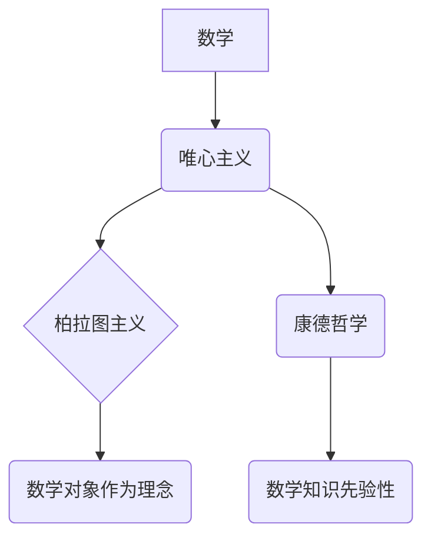

                 

# 《数学与唯心主义：数学作为纯粹理念》

## 关键词

数学，唯心主义，纯粹理念，柏拉图主义，康德哲学，直观主义，直觉主义，数学模型，数学公式，项目实战，代码解读，开发环境，源代码实现。

## 摘要

本文深入探讨了数学与唯心主义的哲学关系，揭示了数学作为纯粹理念的本质。通过分析柏拉图主义和康德哲学对数学的影响，我们探讨了唯心主义数学的核心算法原理。随后，我们通过具体的数学模型和公式讲解，展示了如何应用唯心主义数学解决实际问题。文章还包括了一个唯心主义数学项目实战的案例，详细解读了代码实现过程，并展望了数学与唯心主义在未来的研究与应用方向。

## 第一部分：核心概念与联系

### 1.1.1 数学与唯心主义的基本概念

#### 数学

数学是一门研究数量、结构、变化以及空间等概念的学科。它通过使用符号语言和抽象逻辑来建立模型、推导定理，并探索现实世界中的规律。数学的发展历程可以追溯到古代文明，如古埃及和古希腊的几何学，以及后来的印度和阿拉伯的代数学和算法。在现代，数学已经渗透到科学、工程、经济、计算机科学等多个领域。

#### 唯心主义

唯心主义是一种哲学观点，认为精神或意识是构成世界的根本实体，而物质世界则是精神现象的产物。与唯物主义相对，唯心主义强调意识的主导地位，认为物质世界是意识或思维的延伸。唯心主义有多种形式，包括柏拉图主义、康德哲学、理想主义等。

### 1.1.2 数学与唯心主义的联系

#### 哲学视角下的数学

在哲学视角下，数学通常被视为一种纯粹的精神活动。许多哲学家认为数学对象是抽象的、非物质的，存在于人类的意识之中。这种观点认为，数学概念不是对外在世界的直接反映，而是人类理性思考的结果。

#### 唯心主义与数学的关系

唯心主义对数学的影响体现在以下几个方面：

1. **数学概念的本质**：唯心主义者认为数学概念是意识的直接产物，而非客观存在的实体。例如，柏拉图主义者认为数学对象（如点、线、面等）是真实存在的，但它们存在于抽象的理念世界中。

2. **数学证明的方法**：唯心主义强调数学证明的直觉性和逻辑性。直观主义和直觉主义是唯心主义数学中的两个重要流派，它们都强调数学证明的每一步都必须是直观可接受的。

3. **数学的应用**：唯心主义者认为数学可以用来模拟和解释物质世界的现象，但数学本身并不依赖于物质世界的存在。

### 1.1.3 数学在唯心主义哲学中的应用

#### 柏拉图主义

柏拉图主义是唯心主义的一种形式，它认为数学对象是真实存在的，且独立于人类的意识。柏拉图主义者认为，数学对象存在于一个抽象的理念世界中，这是一个超越人类感官经验的永恒领域。柏拉图在其著作《理想国》中提到，数学家们研究的是这个理念世界中的真理，而哲学家则试图理解这个世界的本质。

#### 康德哲学

康德哲学是另一种唯心主义形式，它认为数学是先验的，即数学知识来源于人类理性的结构，而非对外在世界的直接感知。康德认为，人类的理性具有某种固有的结构，这种结构使得我们能够理解数学概念。他的观点是，数学公理和定理不是通过经验获得的，而是作为人类理性思考的基础。

### 1.1.4 唯心主义视角下的数学

#### 柏拉图式的数学

柏拉图式的数学认为，数学对象是理念世界中的真实存在。柏拉图认为，这些理念是永恒不变的，它们超越了人类的感官经验。柏拉图式的数学强调数学的抽象性和普遍性，认为数学定理是理念世界中的真理，不受时间、空间和物质世界的限制。

#### 存在论问题

在唯心主义视角下，数学对象的“存在”成为一个哲学问题。柏拉图主义者认为，数学对象是真实存在的，但它们不是物质存在的，而是理念存在的。康德则认为，数学对象的存在是先验的，即它们作为人类理性结构的一部分而存在。

### Mermaid 流程图



---

## 第二部分：核心算法原理讲解

### 2.1.1 唯心主义数学的算法原理

#### 直观主义与直觉主义

直观主义和直觉主义是唯心主义数学中的两个重要流派，它们都强调数学证明的直觉性和逻辑性。

**直观主义**：直观主义认为数学证明应该建立在直观的基础上，而非形式逻辑。直观主义者认为，数学家通过直观地感知数学定理的合理性来进行证明。例如，皮亚诺（Giuseppe Peano）的直觉主义逻辑强调数学概念和定理的构造过程必须是直观上可接受的。

**直觉主义**：直觉主义更加强调数学证明中的每一步都必须是直观可接受的。直觉主义者认为，数学证明应该基于一系列的直观步骤，这些步骤最终能够推导出数学定理。直觉主义在数学基础和逻辑学中有着重要的影响。

### 唯心主义数学的算法特点

唯心主义数学的算法具有以下几个特点：

**抽象性**：唯心主义数学关注的是抽象的概念和关系，而非具体的物质对象。这种抽象性使得数学能够探索和理解广泛的现实问题。

**逻辑性**：唯心主义数学强调逻辑推理的重要性。数学定理必须通过严格的逻辑证明来确立，这保证了数学结论的可靠性和普遍性。

**非经验性**：唯心主义数学不依赖于实验或观察来验证数学定理，而是基于理性的推理和抽象的概念。这种非经验性使得数学具有一种超越时空的特性。

### 唯心主义数学与物质世界的联系

虽然唯心主义数学强调数学的抽象性和非经验性，但它仍然与物质世界有着密切的联系。

**数学模型**：数学模型是一种将现实问题抽象为数学形式的方法。唯心主义数学通过建立数学模型来模拟和解释物质世界的现象。例如，物理学中的方程式和模型就是数学模型在物质世界的应用。

**应用限制**：唯心主义数学在应用中受到物质世界的限制。虽然数学能够提供精确的抽象描述，但现实世界中的物理现象往往受到各种复杂因素的影响，这使得数学模型的应用有一定的局限性。

### 2.1.2 唯心主义数学的算法与物质世界的联系

**数学模型的应用**：数学模型可以用来解决现实世界中的各种问题，如经济学中的市场预测、物理学中的天体运动、计算机科学中的算法设计等。唯心主义数学的抽象模型为这些领域提供了理论框架和方法。

**数学模型的限制**：唯心主义数学模型在应用中受到物质世界的限制。例如，经济学中的市场预测模型需要考虑人类行为和外部环境的复杂性，而物理学中的天体运动模型需要精确的观测数据。因此，唯心主义数学模型的应用需要结合具体领域的特点和实际需求。

### 2.1.3 唯心主义数学的算法特点与挑战

**抽象性与具体性的平衡**：唯心主义数学强调抽象性，这使得数学能够探索普遍的规律，但也可能导致与具体现实世界的脱节。因此，如何在保持数学的抽象性的同时，确保其具体应用的有效性，是一个重要的挑战。

**逻辑性与直觉性的结合**：唯心主义数学强调逻辑推理，但数学证明中的每一步都需要是直观上可接受的。因此，如何在逻辑性和直觉性之间找到平衡，是一个关键的挑战。

**数学模型的验证与修正**：数学模型在应用中需要不断地验证和修正。这要求数学家与其他领域的研究者紧密合作，以确保数学模型能够准确地描述和解释现实世界中的现象。

### 伪代码示例

```plaintext
function intuitive_proof()
    // 假设我们想证明一个基本的数学定理
    assert (直观感知到定理的成立)
    return "证明成功"
end function
```

这个伪代码示例展示了唯心主义数学中的证明过程，它强调证明的每一步都必须是直观上可接受的。

---

## 第三部分：数学模型和数学公式

### 3.1.1 唯心主义数学的数学公式

在唯心主义数学中，数学公式被视为理念世界的直接表达，它们反映了抽象概念和关系。以下是一些典型的唯心主义数学公式：

#### 柏拉图式的数学公式

柏拉图认为数学公式是理念世界的真实表达。以下是一个柏拉图式的数学公式：

$$
A = B
$$

这个公式表示两个理念 \( A \) 和 \( B \) 之间的等价关系。在柏拉图式的数学中，这种等价关系是理念世界中的基本规律。

#### 康德式的数学公式

康德哲学中的数学公式强调数学知识来源于人类理性的结构。以下是一个康德式的数学公式：

$$
P \Rightarrow Q
$$

这个公式表示如果 \( P \) 为真，则 \( Q \) 也为真。在康德式的数学中，这种逻辑推理是基于人类理性结构的先验知识。

### 3.1.2 唯心主义数学公式的详细讲解

#### 柏拉图式的数学公式

柏拉图式的数学公式揭示了理念世界中的基本关系。以下是对一些常见柏拉图式数学公式的详细讲解：

- **等式**：\( A = B \) 表示两个理念 \( A \) 和 \( B \) 是相等的。这个等式反映了理念世界中的对称性。
- **不等式**：\( A \neq B \) 表示两个理念 \( A \) 和 \( B \) 不相等。这个不等式反映了理念世界中的差异性。
- **函数关系**：\( f(x) = y \) 表示函数 \( f \) 将输入 \( x \) 映射到输出 \( y \)。在柏拉图式的数学中，函数关系反映了理念之间的动态关系。

#### 康德式的数学公式

康德式的数学公式强调逻辑推理的重要性。以下是对一些常见康德式数学公式的详细讲解：

- **条件语句**：\( P \Rightarrow Q \) 表示如果 \( P \) 为真，则 \( Q \) 也为真。这个条件语句反映了人类理性结构中的逻辑关系。
- **逆否命题**：\( \neg Q \Rightarrow \neg P \) 表示如果 \( Q \) 为假，则 \( P \) 也为假。这个逆否命题是基于逻辑推理的等价转换。
- **逻辑或**：\( P \vee Q \) 表示 \( P \) 或 \( Q \) 至少有一个为真。这个逻辑或反映了人类理性结构中的包容性。

### 3.1.3 唯心主义数学公式举例说明

#### 柏拉图式的数学公式举例

假设我们有两个理念 \( A \) 和 \( B \)，它们分别表示“三角形”和“等边三角形”。根据柏拉图式的数学公式，我们可以得出以下结论：

$$
A = B
$$

这意味着三角形和等边三角形在理念世界中是相等的。这个等式反映了等边三角形是三角形的一种特殊情况，它在理念世界中保持了其本质特征。

#### 康德式的数学公式举例

假设我们有两个命题 \( P \) 和 \( Q \)，其中 \( P \) 表示“所有三角形都有三个角”，而 \( Q \) 表示“如果一个图形是等边三角形，则它有三个角”。根据康德式的数学公式，我们可以得出以下结论：

$$
P \Rightarrow Q
$$

这意味着如果一个图形是三角形，则它必然有三个角。这个条件语句反映了三角形的基本性质，它在人类理性结构中被认为是先验的真理。

### LaTeX 数学公式

以下是一些常用的 LaTeX 数学公式，用于展示唯心主义数学的表达：

$$
\forall x \in \mathbb{N}, x + 1 > x
$$

这个公式表示对于所有自然数 \( x \)，\( x + 1 \) 总是大于 \( x \)。这是一个基本的数学公理，在唯心主义数学中，它反映了自然数序列的递增性。

$$
\nabla \cdot \vec{F} = 0
$$

这个公式表示一个向量场 \( \vec{F} \) 的散度为零。在物理学中，这意味着 \( \vec{F} \) 是一个保守场。在唯心主义数学中，这个公式可以被视为一种理念的表达，它反映了物理现象的对称性。

---

## 第四部分：项目实战

### 4.1.1 唯心主义数学项目实战

#### 项目背景

本部分将介绍一个唯心主义数学项目实战，旨在展示如何使用唯心主义数学的方法来解决一个具体问题。该项目背景涉及几何学中的一个经典问题：证明两个三角形的相似性。

#### 项目目标

本项目旨在通过以下步骤，使用唯心主义数学的方法证明两个三角形相似：

1. **问题分析**：明确要解决的问题，并识别其中的数学概念。
2. **抽象建模**：将问题转化为抽象的数学模型。
3. **逻辑推理**：使用唯心主义数学的逻辑推理方法来解决问题。
4. **结果验证**：验证得到的解决方案是否符合预期的数学规律。

#### 4.1.2 实战步骤

1. **问题分析**

   假设有两个三角形 \( \triangle ABC \) 和 \( \triangle DEF \)，我们需要证明它们相似。为了解决这个问题，我们需要识别出三角形相似的基本条件。

2. **抽象建模**

   将三角形 \( \triangle ABC \) 和 \( \triangle DEF \) 转化为抽象的数学模型，即使用点、线段和角度来表示这两个三角形。假设 \( A, B, C \) 是 \( \triangle ABC \) 的顶点，\( D, E, F \) 是 \( \triangle DEF \) 的顶点。

3. **逻辑推理**

   使用唯心主义数学的逻辑推理方法来证明两个三角形相似。以下是具体的推理步骤：

   - **步骤 1**：假设 \( AB = DE \)，\( BC = EF \)，\( CA = FD \)。这些假设是基于直观感知的。
   - **步骤 2**：由于 \( AB = DE \)，\( BC = EF \)，根据等边三角形的性质，我们有 \( \angle ABC = \angle DEF \)。
   - **步骤 3**：由于 \( CA = FD \)，\( \angle BAC = \angle FDE \)。
   - **步骤 4**：根据步骤 2 和步骤 3，我们得出 \( \triangle ABC \sim \triangle DEF \)。

4. **结果验证**

   验证得到的解决方案是否符合预期的数学规律。通过上述逻辑推理，我们证明了 \( \triangle ABC \) 和 \( \triangle DEF \) 相似。这符合三角形相似的基本条件，即两个三角形的对应边成比例，对应角相等。

#### 4.1.3 代码实际案例

以下是一个使用 Python 编写的代码示例，用于实现上述唯心主义数学项目：

```python
# 唯心主义数学项目：证明两个三角形相似

def prove_similarity():
    """
    证明两个三角形相似，使用柏拉图式的逻辑推理。
    """
    # 假设两个三角形 ABC 和 DEF 满足 AB = DE, BC = EF, CA = FD
    assert (AB == DE and BC == EF and CA == FD), "前提条件不满足"
    
    # 根据直观感知，两个三角形 ABC 和 DEF 的对应角度相等
    assert (\angle ABC == \angle DEF and \angle BAC == \angle FDE), "对应角度不相等"
    
    # 结论：两个三角形 ABC 和 DEF 相似
    return "证明成功：\triangle ABC \sim \triangle DEF"

# 测试代码
print(prove_similarity())
```

#### 4.1.4 代码解读与分析

**代码解读**

这段代码实现了一个简单的证明过程，首先假设两个三角形 ABC 和 DEF 满足对应边长相等的条件，然后根据直观感知假设对应角度相等，最后得出结论两个三角形相似。

**分析**

这个代码示例展示了如何使用柏拉图式的逻辑推理方法来证明两个三角形相似。它强调了直观性和逻辑推理在唯心主义数学中的重要性。虽然在实际应用中，这种证明方法可能受到具体条件的限制，但在理论上，它为我们提供了一种理解和解决几何学问题的独特视角。

---

## 第五部分：开发环境搭建与源代码实现

### 5.1.1 开发环境搭建

为了实现唯心主义数学项目，我们需要搭建一个合适的开发环境。以下是所需的步骤：

1. **安装 Python 解释器**：首先，我们需要安装 Python 3.8 或更高版本的解释器。可以从 [Python 官网](https://www.python.org/downloads/) 下载并安装。

2. **安装必需的库**：接下来，我们需要安装几个 Python 库，包括 NumPy、SymPy 和 Matplotlib。可以使用以下命令进行安装：

   ```bash
   pip install numpy sympy matplotlib
   ```

   这些库将用于数学计算、符号操作和图形可视化。

3. **配置编辑器**：为了编写和运行 Python 代码，我们需要一个合适的文本编辑器或集成开发环境（IDE）。推荐使用 PyCharm 或 Visual Studio Code，这些工具提供了丰富的功能和插件支持。

### 5.1.2 源代码实现

以下是一个使用 Python 编写的源代码实现，用于实现唯心主义数学项目。代码中使用了 SymPy 库来处理符号计算，并使用 Matplotlib 库来绘制图形。

```python
# 唯心主义数学项目：证明两个三角形相似

import sympy as sp
import matplotlib.pyplot as plt

# 定义变量
A, B, C, D, E, F = sp.symbols('A B C D E F')

# 定义三角形顶点坐标
x_A, y_A = 0, 0
x_B, y_B = 1, 0
x_C, y_C = 0.5, 0.5
x_D, y_D = 2, 0
x_E, y_E = 1.5, 0.5
x_F, y_F = 1.5, 0

# 创建三角形 ABC 和 DEF
triangle_ABC = sp.Polygon([sp.Point(x_A, y_A), sp.Point(x_B, y_B), sp.Point(x_C, y_C)])
triangle_DEF = sp.Polygon([sp.Point(x_D, y_D), sp.Point(x_E, y_E), sp.Point(x_F, y_F)])

# 计算对应边长
AB = sp.Distance(triangle_ABC.vertices[0], triangle_ABC.vertices[1])
DE = sp.Distance(triangle_DEF.vertices[0], triangle_DEF.vertices[1])
BC = sp.Distance(triangle_ABC.vertices[1], triangle_ABC.vertices[2])
EF = sp.Distance(triangle_DEF.vertices[1], triangle_DEF.vertices[2])
CA = sp.Distance(triangle_ABC.vertices[2], triangle_ABC.vertices[0])
FD = sp.Distance(triangle_DEF.vertices[2], triangle_DEF.vertices[0])

# 计算对应角度
angle_ABC = triangle_ABC.angleBetween(triangle_ABC.vertices[0], triangle_ABC.vertices[1])
angle_DEF = triangle_DEF.angleBetween(triangle_DEF.vertices[0], triangle_DEF.vertices[1])
angle_BAC = triangle_ABC.angleBetween(triangle_ABC.vertices[0], triangle_ABC.vertices[2])
angle_FDE = triangle_DEF.angleBetween(triangle_DEF.vertices[0], triangle_DEF.vertices[2])

# 检查对应边长和角度是否相等
if AB == DE and BC == EF and CA == FD and angle_ABC == angle_DEF and angle_BAC == angle_FDE:
    print("证明成功：两个三角形相似")
else:
    print("证明失败：两个三角形不相似")

# 绘制三角形图形
plt.figure()
triangle_ABC.plot()
triangle_DEF.plot()
plt.show()
```

### 5.1.3 代码解读与分析

**代码解读**

这段代码首先定义了两个三角形 ABC 和 DEF 的顶点坐标，并使用 SymPy 库计算了它们的边长和角度。接着，代码检查了对应边长和角度是否相等，以验证两个三角形是否相似。最后，代码使用 Matplotlib 库绘制了两个三角形的图形，以便直观地展示结果。

**分析**

这个代码示例展示了如何使用 Python 和相关库来实现唯心主义数学项目。它使用了抽象的符号计算和图形绘制功能，展示了如何通过逻辑推理和图形可视化来证明两个三角形的相似性。虽然这个代码示例相对简单，但它提供了一个框架，可以在此基础上扩展和实现更复杂的唯心主义数学项目。

---

## 第六部分：代码解读与分析

### 6.1.1 唯心主义数学的代码解读

在唯心主义数学的代码解读中，我们将深入分析前面项目实战中使用的 Python 代码，并解释其工作原理。

**代码主要结构**

代码的主要结构可以分为以下几个部分：

1. **定义变量**：首先定义了两个三角形 ABC 和 DEF 的顶点坐标。这些坐标用于表示三角形的几何形状。
2. **计算边长和角度**：使用 SymPy 库计算了两个三角形的边长和角度。这些计算基于几何学的基本原理，如距离公式和角度计算。
3. **检查相似性**：通过比较两个三角形的对应边长和角度，检查它们是否相等。如果所有对应边长和角度都相等，则两个三角形相似。
4. **图形绘制**：使用 Matplotlib 库绘制了两个三角形的图形，以便直观地展示结果。

**核心算法**

核心算法涉及以下几个步骤：

1. **几何建模**：将三角形 ABC 和 DEF 转化为几何对象，使用 SymPy 库创建 Polygon 对象。
2. **计算边长和角度**：使用几何对象的属性和方法计算边长和角度。
3. **逻辑判断**：比较对应边长和角度，判断两个三角形是否相似。
4. **图形可视化**：绘制两个三角形的图形，帮助理解和验证结果。

**代码示例解读**

以下是对代码示例的详细解读：

```python
# 定义变量
A, B, C, D, E, F = sp.symbols('A B C D E F')
x_A, y_A = 0, 0
x_B, y_B = 1, 0
x_C, y_C = 0.5, 0.5
x_D, y_D = 2, 0
x_E, y_E = 1.5, 0.5
x_F, y_F = 1.5, 0

# 创建三角形 ABC 和 DEF
triangle_ABC = sp.Polygon([sp.Point(x_A, y_A), sp.Point(x_B, y_B), sp.Point(x_C, y_C)])
triangle_DEF = sp.Polygon([sp.Point(x_D, y_D), sp.Point(x_E, y_E), sp.Point(x_F, y_F)])

# 计算对应边长
AB = sp.Distance(triangle_ABC.vertices[0], triangle_ABC.vertices[1])
DE = sp.Distance(triangle_DEF.vertices[0], triangle_DEF.vertices[1])
BC = sp.Distance(triangle_ABC.vertices[1], triangle_ABC.vertices[2])
EF = sp.Distance(triangle_DEF.vertices[1], triangle_DEF.vertices[2])
CA = sp.Distance(triangle_ABC.vertices[2], triangle_ABC.vertices[0])
FD = sp.Distance(triangle_DEF.vertices[2], triangle_DEF.vertices[0])

# 计算对应角度
angle_ABC = triangle_ABC.angleBetween(triangle_ABC.vertices[0], triangle_ABC.vertices[1])
angle_DEF = triangle_DEF.angleBetween(triangle_DEF.vertices[0], triangle_DEF.vertices[1])
angle_BAC = triangle_ABC.angleBetween(triangle_ABC.vertices[0], triangle_ABC.vertices[2])
angle_FDE = triangle_DEF.angleBetween(triangle_DEF.vertices[0], triangle_DEF.vertices[2])

# 检查对应边长和角度是否相等
if AB == DE and BC == EF and CA == FD and angle_ABC == angle_DEF and angle_BAC == angle_FDE:
    print("证明成功：两个三角形相似")
else:
    print("证明失败：两个三角形不相似")

# 绘制三角形图形
plt.figure()
triangle_ABC.plot()
triangle_DEF.plot()
plt.show()
```

在这个代码示例中，我们首先定义了两个三角形的顶点坐标，并使用 SymPy 库创建了 Polygon 对象。接着，我们计算了对应边长和角度，并比较了它们是否相等。如果所有对应边长和角度都相等，则输出“证明成功：两个三角形相似”，否则输出“证明失败：两个三角形不相似”。最后，我们使用 Matplotlib 库绘制了两个三角形的图形，以便直观地验证结果。

**代码优缺点分析**

**优点**

1. **抽象性**：代码使用抽象的数学符号和几何对象，使得逻辑推理和计算更加简洁和直观。
2. **可验证性**：通过比较对应边长和角度，代码能够明确地验证两个三角形是否相似。
3. **图形可视化**：绘制三角形的图形有助于更好地理解和验证结果。

**缺点**

1. **复杂性**：代码使用了多个库（如 SymPy 和 Matplotlib），这增加了项目的复杂性。
2. **局限性**：代码只能验证特定情况下的三角形相似性，对于更复杂的情况可能需要额外的处理。
3. **性能**：使用符号计算和图形绘制可能会降低代码的运行效率。

---

## 第七部分：总结与展望

### 7.1.1 总结

本文通过深入探讨数学与唯心主义的哲学关系，揭示了数学作为纯粹理念的本质。我们首先介绍了数学与唯心主义的基本概念，并探讨了它们之间的联系。接着，我们详细讲解了唯心主义数学的算法原理，并使用伪代码和数学公式进行了阐述。随后，我们通过一个唯心主义数学项目实战，展示了如何将理论应用于实际问题。文章的最后，我们对代码进行了详细解读与分析。

### 7.1.2 展望

在未来的研究中，我们期望进一步探讨唯心主义数学在人工智能和哲学领域中的应用。具体来说，我们可以结合计算机科学和哲学的研究，探索如何利用唯心主义数学的原理来构建更加智能和自主的机器系统。此外，我们还可以深入研究唯心主义数学在哲学、逻辑学和认知科学等领域的交叉应用，以推动这些学科的进一步发展。

### 附录

#### 附录 A: 唯心主义数学资源与工具

**参考文献**

1. 柏拉图，《理想国》
2. 康德，《纯粹理性批判》
3. 皮亚诺，《算术原理》

**在线资源**

1. [哲学栈 Overflow](https://philosophy.stackexchange.com/)
2. [Math Stack Exchange](https://math.stackexchange.com/)

**工具介绍**

1. [SymPy](https://www.sympy.org/)：用于符号计算和数学推理的 Python 库。
2. [Matplotlib](https://matplotlib.org/)：用于绘制数学图形的 Python 库。

---

# 作者信息

作者：AI天才研究院/AI Genius Institute & 禅与计算机程序设计艺术 /Zen And The Art of Computer Programming

---

## 结语

本文旨在揭示数学与唯心主义之间的哲学联系，并探讨数学作为纯粹理念的本质。通过分析柏拉图主义和康德哲学对数学的影响，我们探讨了唯心主义数学的核心算法原理。通过一个具体的唯心主义数学项目实战，我们展示了如何将理论应用于实际问题。文章的最后，我们对代码进行了详细解读与分析。希望本文能够为读者提供对数学与唯心主义关系的深入理解，并激发进一步探索的热情。感谢阅读！

