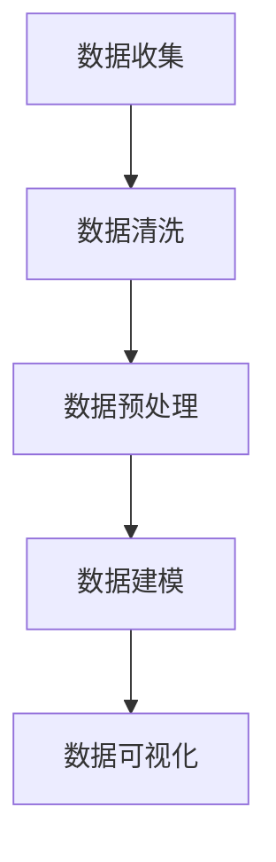
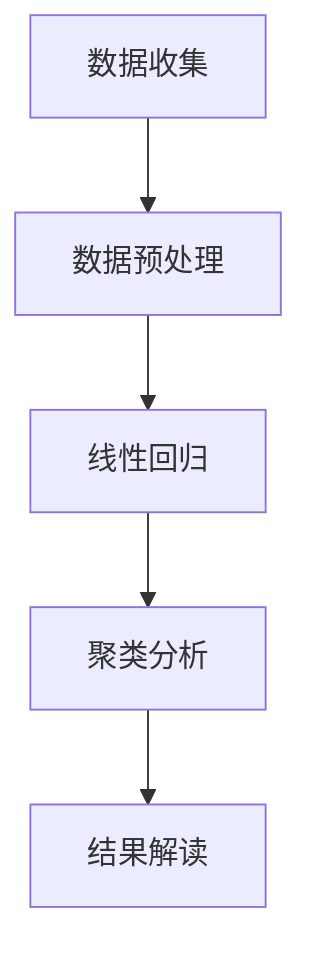

                 

# 数学与大数据分析：海量数据的数学处理

> **关键词：** 大数据，数学处理，线性代数，概率论，统计学，优化算法

> **摘要：** 随着大数据技术的飞速发展，数学在大数据处理中扮演着至关重要的角色。本文将从核心数学概念、算法原理到具体应用，系统性地探讨数学与大数据分析之间的关系，旨在为读者提供一个全面而深入的理解。

---

## 第一部分：引论与基础

### 1.1 大数据的定义与特点

大数据（Big Data）是指无法通过传统数据库软件工具在合理时间内捕捉、管理和处理的数据集合。它具有以下四个基本特征，通常被称为“4V”：

- **数据量（Volume）**：大数据量通常指数据规模达到PB（拍字节）甚至ZB（泽字节）级别。
- **数据速度（Velocity）**：数据的生成、传输和处理速度非常快，需要实时或者近实时的处理能力。
- **数据多样性（Variety）**：数据来源多种多样，包括结构化数据、半结构化数据和非结构化数据。
- **价值密度（Value）**：在如此大量的数据中，有价值的信息往往非常稀少。

### 1.2 大数据带来的挑战

大数据带来了如下挑战：

- **数据存储与管理**：如何高效存储和管理海量数据是一个巨大的挑战。
- **数据清洗与预处理**：非结构化和半结构化数据需要进行清洗和预处理，以便后续分析。
- **数据分析与挖掘**：如何从海量数据中提取有价值的信息，实现数据的价值变现。
- **算法复杂度与计算资源**：传统算法在大数据处理时往往面临性能瓶颈。

### 1.3 数学在大数据分析中的重要性

数学在大数据领域中的重要性主要体现在以下几个方面：

- **数据建模**：数学模型能够帮助理解数据背后的规律和趋势。
- **算法优化**：数学优化算法可以提高数据处理效率和准确性。
- **概率论与统计学**：概率论和统计学是数据分析的基础，用于处理不确定性数据。
- **线性代数**：线性代数在处理大规模数据集和复杂运算时发挥着重要作用。

## 第二部分：核心数学概念与联系

### 2.1 数据可视化与描述

**数据可视化**是将数据转换成图形或图像的过程，有助于我们直观地理解数据。

- **Mermaid 流程图：数据收集、处理与可视化流程**



### 2.2 数学模型与数据分析

数学模型在数据分析中扮演着核心角色，例如：

- **回归分析**：用于预测和描述变量之间的关系。
- **聚类分析**：用于发现数据集中的模式和规律。

- **Mermaid 流程图：常见数学模型在数据分析中的应用**



## 第三部分：核心算法原理

### 3.1 线性代数与大数据

线性代数在数据处理和特征提取中有着广泛应用。以下是几个关键概念：

- **矩阵运算基础**：矩阵加法、矩阵乘法、逆矩阵等。
  - **伪代码：矩阵加法、矩阵乘法**

```plaintext
输入: 矩阵A，矩阵B
输出: 矩阵C（A+B）

C = A + B

输入: 矩阵A，矩阵B
输出: 矩阵C（A*B）

C = A * B
```

### 3.2 线性回归

线性回归是用于预测连续值的常用方法。以下是基本原理和算法：

- **数学公式：线性回归模型**

$$
y = X \cdot w + b
$$

- **伪代码：梯度下降法求解线性回归**

```plaintext
输入: 特征矩阵X，目标向量y，模型参数w，学习率α
输出: 模型参数w

初始化：w = 0

对于每个epoch：
    计算预测值y_pred = X * w
    计算损失函数L = (1/2) * (y_pred - y)^2
    计算梯度∇L = X^T * (y_pred - y)
    更新参数w = w - α * ∇L

直到收敛条件满足，返回w
```

### 3.3 主成分分析（PCA）

PCA是一种降维技术，用于提取数据的主要特征。

- **数学公式：PCA变换**

$$
Z = P \cdot X
$$

其中，$P$ 是由特征值和特征向量组成的矩阵，$X$ 是原始数据矩阵。

- **伪代码：PCA算法步骤**

```plaintext
输入: 数据集D
输出: 主成分向量P，投影矩阵Z

计算协方差矩阵C = (1/N) * D^T * D
计算特征值和特征向量对（λ, v）的排序
选取前k个最大的特征值和特征向量，组成矩阵P
计算投影矩阵Z = P^T * D

返回P和Z
```

## 第四部分：大数据分析中的数学工具

### 4.1 概率论与统计学

概率论和统计学是大数据分析的基础。

- **概率论基础**：条件概率、贝叶斯定理。
  - **数学公式：条件概率**

$$
P(A|B) = \frac{P(A \cap B)}{P(B)}
$$

- **数学公式：贝叶斯定理**

$$
P(A|B) = \frac{P(B|A) \cdot P(A)}{P(B)}
$$

- **统计推断**：假设检验、置信区间。
  - **数学公式：假设检验**

$$
H_0: \theta = \theta_0 \\
H_1: \theta \neq \theta_0
$$

- **数学公式：置信区间**

$$
\theta \in [\bar{x} - z_{\alpha/2} \cdot SE(\bar{x}), \bar{x} + z_{\alpha/2} \cdot SE(\bar{x})]
$$

### 4.2 聚类算法

聚类算法用于将数据点划分为多个群组。

- **K均值算法**：一种迭代算法，通过最小化平方误差来划分群组。
  - **数学公式：K均值算法步骤**

$$
c_{new} = \frac{1}{N_i} \sum_{x \in D_i} x
$$

- **伪代码：K均值聚类算法**

```plaintext
输入: 数据集D，聚类数k
输出: 聚类中心c，聚类结果

随机选择k个初始聚类中心c
对于每个数据点x：
    计算距离最近的聚类中心c_i
    将x分配到c_i的聚类
计算新的聚类中心c_new
    对于每个聚类c_i：
        c_new_i = mean(D_i)
更新聚类中心c = c_new
直到聚类中心不再变化，返回c和聚类结果
```

## 第五部分：数学模型在具体数据分析中的应用

### 5.1 时间序列分析

时间序列分析用于预测和分析时间序列数据。

- **ARIMA模型**：一种经典的统计模型，用于处理非平稳时间序列。
  - **数学公式：ARIMA模型**

$$
X_t = c + \sum_{i=1}^p \phi_i X_{t-i} + \sum_{i=1}^d \theta_i (1 - \phi_i^2)^i (X_t - \phi_i X_{t-1}) + \varepsilon_t
$$

- **伪代码：ARIMA模型构建与预测**

```plaintext
输入: 时间序列数据S
输出: 预测结果

初始化：选择合适的模型参数（p, d, q）
    训练模型：使用历史数据S_train拟合模型
    预测：使用模型预测未来数据S_pred

结果分析：
    对比实际值与预测值，评估模型性能
    根据分析结果调整模型参数，优化预测结果
```

### 5.2 预测分析案例

以下是一个简单的预测分析案例。

- **数据集介绍**：使用“纽约市出租车订单数据”进行预测分析。
- **代码实现与结果分析**：使用Python中的`pandas`、`statsmodels`等库进行数据处理和建模。

```python
import pandas as pd
import statsmodels.api as sm

# 数据加载与预处理
data = pd.read_csv('nyctaxi.csv')
data['pickup_time'] = pd.to_datetime(data['pickup_time'])
data['dropoff_time'] = pd.to_datetime(data['dropoff_time'])
data['duration'] = data['dropoff_time'] - data['pickup_time']
data['hour'] = data['pickup_time'].dt.hour

# 时间序列数据准备
ts_data = data.set_index('pickup_time')['duration']
ts_data = ts_data.asfreq('H')

# ARIMA模型构建与预测
model = sm.ARIMA(ts_data, order=(1, 1, 1))
model_fit = model.fit()
predictions = model_fit.forecast(steps=24)

# 结果分析
print(predictions)
```

## 第六部分：综合案例与实战

### 6.1 项目背景与目标

以下是一个社交网络数据分析项目。

- **项目背景**：分析一个社交网络平台的用户行为，挖掘用户关系和兴趣。
- **项目目标**：识别用户社区、预测用户兴趣、优化推荐系统。

### 6.2 数据预处理

数据预处理步骤包括数据清洗、特征提取和数据转换。

- **数据清洗**：处理缺失值、异常值和重复值。
- **特征提取**：提取用户行为特征、社交关系特征和内容特征。
- **数据转换**：将原始数据转换为适合分析的形式。

```python
# 数据加载与预处理
data = pd.read_csv('social_network_data.csv')

# 数据清洗
data.dropna(inplace=True)
data.drop_duplicates(inplace=True)

# 特征提取
data['num_friends'] = data['friends'].apply(len)
data['avg_activity'] = data['posts'].apply(len) / data['num_friends']

# 数据转换
data['created_at'] = pd.to_datetime(data['created_at'])
data['hour'] = data['created_at'].dt.hour
```

### 6.3 数据分析与建模

使用机器学习算法进行用户社区识别和兴趣预测。

- **用户社区识别**：使用K均值聚类算法进行社区划分。
- **兴趣预测**：使用逻辑回归模型进行用户兴趣预测。

```python
from sklearn.cluster import KMeans
from sklearn.linear_model import LogisticRegression

# 用户社区识别
kmeans = KMeans(n_clusters=5)
clusters = kmeans.fit_predict(data[['num_friends', 'avg_activity']])

# 兴趣预测
X = data[['hour', 'num_friends', 'avg_activity']]
y = data['interested_in']

model = LogisticRegression()
model.fit(X, y)
predictions = model.predict(X)
```

### 6.4 结果解读与优化

对模型结果进行解读，并根据业务需求进行调整和优化。

- **结果分析**：分析聚类结果和兴趣预测的准确性。
- **优化策略**：调整模型参数、增加特征、使用更复杂的模型。

```python
# 结果分析
print("Clustering Accuracy:", metrics.accuracy_score(y_true=labels, y_pred=kmeans.labels_))
print("Interest Prediction Accuracy:", metrics.accuracy_score(y_true=y, y_pred=predictions))

# 优化策略
# 调整K值，增加特征，使用更复杂的模型等
```

## 第七部分：附录与资源

### 7.1 常用数学工具库

- **NumPy**：用于数值计算和矩阵操作。
- **Pandas**：用于数据处理和分析。
- **SciPy**：用于科学计算和数据分析。

### 7.2 大数据分析工具

- **Hadoop**：分布式数据处理框架。
- **Spark**：高速大数据处理引擎。

### 7.3 进一步阅读材料

- **推荐阅读书籍**：
  - 《大数据时代：改变生活、工作与思维》
  - 《深入理解计算机系统》
  - 《数据科学入门：从数据开始》

- **推荐阅读论文**：
  - 《大数据的四大V特性》
  - 《主成分分析（PCA）原理与应用》
  - 《线性回归模型详解》

---

**作者：AI天才研究院/AI Genius Institute & 禅与计算机程序设计艺术 /Zen And The Art of Computer Programming**

