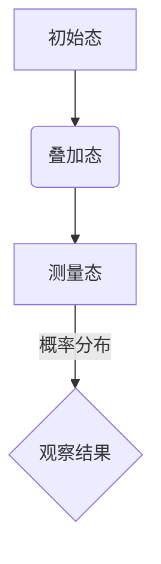
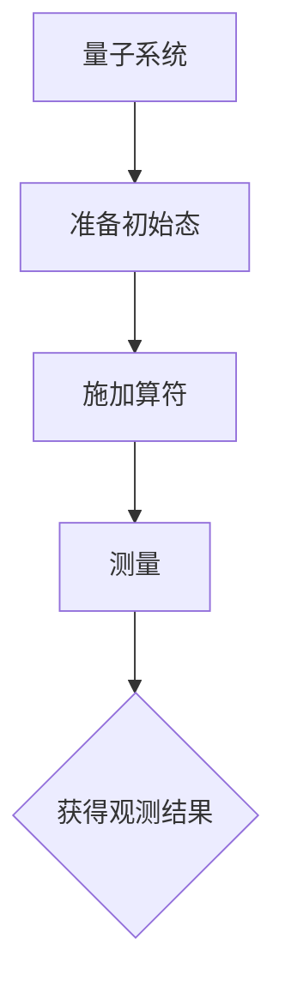

                 

### 《数学与意识：量子意识理论的数学基础》

> **关键词**：数学，意识，量子力学，哲学，认知科学，神经科学

**摘要**：本文旨在探讨数学在量子意识理论中的基础性作用，深入解析量子数学的基本概念和意识理论之间的关系。首先，文章回顾了数学和意识的哲学背景，探讨了数学的本质、功能与意识的相关特征。接着，文章介绍了量子力学的基本原理和量子意识理论的发展，阐述了量子意识与经典物理学的区别。随后，文章详细分析了量子数学基础，包括量子比特与量子态、量子算符与测量、量子概率与信息。在此基础上，文章构建了量子意识数学模型，并详细阐述了相关数学公式和定理。最后，文章探讨了量子意识理论在认知科学、心理治疗和神经科学中的应用，并分析了量子意识理论的哲学意义、发展前景和面临的挑战。

### 《数学与意识：量子意识理论的数学基础》目录大纲

#### 第一部分：引论

- **第1章：数学与意识的哲学背景**
  - **1.1 数学的本质与功能**
    - **1.1.1 数学的起源与发展**
    - **1.1.2 数学的逻辑性与抽象性**
    - **1.1.3 数学在科学中的应用**
  - **1.2 意识的本质与特征**
    - **1.2.1 意识的哲学讨论**
    - **1.2.2 意识的科学定义**
    - **1.2.3 意识的主观体验与客观表现**
  - **1.3 量子意识理论概述**
    - **1.3.1 量子力学的基本原理**
    - **1.3.2 量子意识理论的发展**
    - **1.3.3 量子意识与经典物理学的区别**

#### 第二部分：量子数学基础

- **第2章：量子数学的基本概念**
  - **2.1 量子比特与量子态**
    - **2.1.1 量子比特的基本性质**
    - **2.1.2 量子态的表示与变换**
    - **2.1.3 量子叠加原理与量子纠缠**
  - **2.2 量子算符与测量**
    - **2.2.1 量子算符的定义与作用**
    - **2.2.2 量子测量的原理与方法**
    - **2.2.3 量子测量的不确定性**
  - **2.3 量子概率与信息**
    - **2.3.1 量子概率的定义与应用**
    - **2.3.2 量子信息的基本概念**
    - **2.3.3 量子密码与量子通信**

#### 第三部分：量子意识数学模型

- **第3章：量子意识数学模型的构建**
  - **3.1 量子意识模型的数学基础**
    - **3.1.1 量子态与意识状态的关系**
    - **3.1.2 量子概率与意识概率的对应**
    - **3.1.3 量子信息与意识信息的关系**
  - **3.2 量子意识模型的数学工具**
    - **3.2.1 复数与复向量**
    - **3.2.2 线性代数的基本概念**
    - **3.2.3 测量与演化的数学描述**
  - **3.3 量子意识模型的数学公式与定理**
    - **3.3.1 量子态的叠加与演化的公式**
    - **3.3.2 测量与纠缠的数学定理**
    - **3.3.3 意识信息处理的数学模型**

#### 第四部分：量子意识理论的应用

- **第4章：量子意识理论在认知科学中的应用**
  - **4.1 量子意识与认知过程**
    - **4.1.1 认知科学的传统理论**
    - **4.1.2 量子意识模型在认知科学中的应用**
    - **4.1.3 量子意识理论对认知过程的新解释**
  - **4.2 量子意识与心理治疗**
    - **4.2.1 心理治疗的传统方法**
    - **4.2.2 量子意识理论在心理治疗中的应用**
    - **4.2.3 量子意识疗法的研究进展**
  - **4.3 量子意识与神经科学**
    - **4.3.1 神经科学的研究进展**
    - **4.3.2 量子意识理论在神经科学研究中的应用**
    - **4.3.3 量子意识理论对神经科学的新启示**

#### 第五部分：量子意识理论的前景与挑战

- **第5章：量子意识理论的哲学意义**
  - **5.1 量子意识与哲学问题**
    - **5.1.1 意识与物质的关系**
    - **5.1.2 量子意识与物理实在**
    - **5.1.3 量子意识与心灵哲学**
  - **5.2 量子意识理论的发展趋势**
    - **5.2.1 量子意识理论的未来发展方向**
    - **5.2.2 量子意识理论在科学研究中的应用前景**
    - **5.2.3 量子意识理论对社会发展的潜在影响**
  - **5.3 量子意识理论的挑战与问题**
    - **5.3.1 量子意识理论的科学难题**
    - **5.3.2 量子意识理论的应用难题**
    - **5.3.3 量子意识理论的教育与普及问题**

#### 第六部分：参考文献与附录

- **附录A：量子数学基础 Mermaid 流程图**
  - **A.1 量子比特状态演化流程图**
  - **A.2 量子测量流程图**
- **附录B：核心算法伪代码**
  - **B.1 量子态叠加与演化的伪代码**
  - **B.2 量子测量伪代码**
- **附录C：数学模型与公式详解**
  - **C.1 量子态的叠加原理公式**
  - **C.2 量子态的演化公式**
  - **C.3 量子概率分布公式**
  - **C.4 量子信息熵公式**
- **附录D：项目实战与代码解读**
  - **D.1 量子比特状态演化项目实战**
  - **D.2 量子测量项目实战**

### 第一部分：引论

#### 第1章：数学与意识的哲学背景

在探讨数学与意识的关系之前，我们有必要深入理解数学和意识的本质及其哲学背景。数学作为一门学科，其起源与发展、逻辑性与抽象性以及应用范围都是哲学讨论的重要议题。同样，意识作为一种深奥而复杂的现象，其在哲学、科学和日常生活中的地位与作用也引发了无数讨论。本章节将分别探讨数学与意识的相关哲学背景，为进一步理解量子意识理论的数学基础打下基础。

##### 1.1 数学的本质与功能

数学是一门关于模式的科学，通过符号化的语言和抽象的结构来描述自然界和社会现象。其起源可以追溯到古代文明，如古埃及和巴比伦的数学成就。随着历史的发展，数学逐渐演变成一门独立而系统的学科，涵盖了数论、代数、几何、拓扑等多个分支。数学的功能主要体现在以下几个方面：

1. **描述与预测**：数学提供了一种精确的语言来描述物理、生物、经济等领域的现象，使我们能够进行预测和规划。
2. **抽象与简化**：通过抽象和简化的方法，数学可以抓住问题的本质，将复杂的现实问题转化为更易处理的形式。
3. **逻辑推理**：数学逻辑性强，其推理过程严谨，为科学发现和创新提供了坚实的基础。
4. **模型构建**：数学模型是理解和解决问题的重要工具，可以帮助我们理解自然界的规律。

###### 1.1.1 数学的起源与发展

数学的起源可以追溯到古代文明的计算需求和几何问题。例如，古埃及和巴比伦的数学主要用于土地测量和商业计算。希腊数学是数学发展的一个重要阶段，欧几里得在《几何原本》中系统地建立了几何学的基础，而阿基米德则通过数学方法解决了物理问题。在中国，古代数学成就如《九章算术》和《孙子算经》也对数学发展产生了重要影响。

中世纪的阿拉伯世界在数学领域也有显著贡献，如花拉子米的代数学和阿尔-哈里德的算术著作。欧洲文艺复兴时期，数学得到了快速发展，帕斯卡、费马、笛卡尔、牛顿和莱布尼茨等数学家为现代数学奠定了基础。

现代数学在19世纪和20世纪得到了极大的发展，集合论、拓扑学、代数、数论、分析学等分支纷纷涌现。特别是20世纪末，计算机科学的兴起推动了数学在计算方法、算法分析和信息科学中的应用。

###### 1.1.2 数学的逻辑性与抽象性

数学的逻辑性体现在其推理过程的严谨性和确定性。数学家通过定义、公理、定理和证明等手段，构建了一个自洽的体系。例如，欧几里得的《几何原本》就是基于公理体系的几何学体系。在数学中，逻辑推理是一种基本的方法，通过假设和演绎来得出结论。

另一方面，数学的抽象性使其能够脱离具体事物的束缚，关注模式与结构。抽象是数学的核心特征，例如，通过代数可以描述复杂的数量关系，而拓扑学则研究空间的性质而不考虑其具体形状。

###### 1.1.3 数学在科学中的应用

数学在科学中的广泛应用是其成为一门独立学科的重要原因之一。从物理学到生物学，从经济学到心理学，数学都提供了强有力的工具和方法。以下是一些典型的应用例子：

1. **物理学**：经典力学、电磁学、量子力学等领域都依赖数学模型来描述自然现象。牛顿的运动定律、麦克斯韦方程组、薛定谔方程等都是物理学的核心内容，它们都是以数学形式表达的。
2. **生物学**：数学在生物学中的应用主要包括种群生态学、分子生物学、进化理论等。例如，通过数学模型可以预测种群动态、分析基因突变等。
3. **经济学**：经济学中的许多理论，如供需模型、市场均衡理论、宏观经济模型等，都依赖数学工具进行建模和分析。
4. **心理学**：心理学的许多领域，如认知心理学、发展心理学、社会心理学等，都利用数学方法来研究人类行为和心理过程。

##### 1.2 意识的本质与特征

意识是人类智慧的核心，是主观体验和认知活动的源泉。然而，意识作为一种复杂现象，其本质和特征至今仍是一个哲学和科学研究的重大课题。以下从哲学和科学的视角探讨意识的本质与特征。

###### 1.2.1 意识的哲学讨论

在哲学领域，对意识的讨论可以追溯到古希腊时期。苏格拉底、柏拉图和亚里士多德等哲学家都提出了关于意识的不同观点。柏拉图的“理念论”认为，意识是灵魂的一部分，与物质世界分离，而亚里士多德则强调意识是灵魂的功能。

中世纪哲学中，奥古斯丁和托马斯·阿奎那等基督教哲学家将意识与宗教信仰相结合，认为意识是上帝赐予人类的一种神秘礼物。近现代哲学中，康德将意识视为认识的先决条件，他的“先验范畴”理论认为，意识是我们感知和理解世界的基础。

当代哲学中，对意识的讨论更加多样和深入。心灵哲学、认知科学和哲学心理学等学科从不同角度探讨意识的本质。例如，福多和皮亚杰的“双重过程理论”认为，意识是一种高级认知过程，与自动化过程相对立。

###### 1.2.2 意识的科学定义

在科学领域，意识通常被定义为一种主观体验，包括感觉、知觉、思考等认知活动。科学对意识的研究主要集中在理解其生物学基础和认知机制。

神经科学是研究意识的重要领域，通过研究大脑结构和功能，科学家试图揭示意识产生的神经基础。例如，波普提出的大脑“模块化”理论认为，意识是由多个功能模块组成的，每个模块负责特定的认知任务。

心理学也是研究意识的重要学科，通过实验和理论模型，心理学家试图理解意识的本质和功能。例如，詹姆斯的“意识流”理论认为，意识是一种连续不断的、流动的过程。

###### 1.2.3 意识的主观体验与客观表现

意识的主观体验是其最显著的特征，表现为个体的内在感受和感受状态。主观体验包括感觉、情感、欲望、思考等，是我们对自身和外部世界的感知。

然而，意识的主观体验难以直接测量和观察，因此，科学界通常通过客观指标来间接研究意识。例如，通过脑电图（EEG）和功能性磁共振成像（fMRI）等技术，科学家可以观察大脑的电信号和血流变化，从而推测意识状态。

主观体验与客观表现之间的关系是意识研究中的一个重要问题。尽管我们无法直接测量意识，但通过神经科学和心理学的实验，科学家已经发现了一些与意识相关的生理和认知指标。例如，当个体处于清醒状态时，脑电图的α波活动增强；在深度昏迷或麻醉状态下，脑电图活动减弱。

##### 1.3 量子意识理论概述

量子意识理论是近年来兴起的跨学科研究领域，试图将量子力学与意识科学相结合，探索意识产生的物理机制。以下概述量子力学的基本原理、量子意识理论的发展以及量子意识与经典物理学的区别。

###### 1.3.1 量子力学的基本原理

量子力学是研究微观粒子行为和相互作用的物理学分支。与经典物理学相比，量子力学具有几个基本特征：

1. **波粒二象性**：微观粒子既具有波动性，又具有粒子性，如电子既可以通过双缝实验产生干涉图样，又可以在碰撞中表现出粒子特性。
2. **量子叠加原理**：量子系统可以同时处于多个状态的叠加，只有进行测量时，系统才会坍缩到其中一个特定状态。
3. **量子纠缠**：两个或多个量子系统之间可以形成一种特殊的关联，即使它们相隔很远，一个系统的状态变化也会立即影响到另一个系统。
4. **不确定性原理**：量子系统的一些物理量，如位置和动量，无法同时精确测量，这反映了微观世界的本质不确定性。

量子力学的基本原理深刻地改变了我们对物质和宇宙的理解，为量子意识理论提供了理论框架。

###### 1.3.2 量子意识理论的发展

量子意识理论的发展可以追溯到20世纪末。当时，一些物理学家和哲学家开始思考量子力学是否与意识有关。以下是一些重要的发展：

1. **普特南的“塔虎脱问题”**：普特南提出了一个思想实验，质疑量子力学中的测量问题，认为测量者的意识状态对测量结果有直接影响。
2. **休·埃弗雷特的“多世界解释”**：埃弗雷特提出，量子力学中的多世界解释意味着所有可能的历史都在某个地方实际发生，意识存在于这些多世界中。
3. **潘罗卡斯塔模型**：潘罗卡斯塔提出，意识是量子计算过程的一部分，量子比特的状态演化与意识状态密切相关。

量子意识理论的发展涉及多个学科，包括物理学、哲学、认知科学和神经科学，为探索意识的本质提供了新的视角。

###### 1.3.3 量子意识与经典物理学的区别

量子意识与经典物理学的区别主要体现在以下几个方面：

1. **微观与宏观**：量子意识理论关注微观粒子的行为，而经典物理学主要描述宏观物体的运动和相互作用。
2. **非决定性**：量子力学中的不确定性原理和量子叠加原理表明，微观世界的状态具有非决定性，这与经典物理学的确定性观点形成鲜明对比。
3. **纠缠与分离**：量子纠缠现象表明，微观粒子之间可以形成一种特殊的关联，即使它们相隔很远。这与经典物理学中物体之间的独立运动形成对比。
4. **意识与物质**：量子意识理论试图探索意识与物质之间的关系，认为意识可能具有量子特性，这与经典物理学中物质与意识分离的观点形成对比。

量子意识与经典物理学的区别不仅体现在理论框架上，也体现在对现实世界的理解和解释上。量子意识理论为研究意识的本质和起源提供了新的思路和可能性。

### 第二部分：量子数学基础

量子数学是研究量子系统的数学工具和理论体系，是量子力学和量子信息科学的重要基础。在本章节中，我们将详细介绍量子数学的基本概念，包括量子比特与量子态、量子算符与测量、量子概率与信息。这些概念构成了量子数学的基础，为理解量子意识理论提供了数学框架。

##### 2.1 量子比特与量子态

量子比特（qubit）是量子信息科学的基本单元，与经典计算机中的比特相对应。经典比特只有两种状态，即0和1，而量子比特可以同时处于0和1的叠加状态，这是量子计算的核心特性之一。

###### 2.1.1 量子比特的基本性质

量子比特具有以下几个基本性质：

1. **叠加原理**：量子比特可以处于多个状态的叠加，即一个量子比特可以同时处于0和1的状态。这可以用数学公式表示为：
   $$|\psi\rangle = \alpha|0\rangle + \beta|1\rangle$$
   其中，$|\psi\rangle$表示量子比特的状态，$|0\rangle$和$|1\rangle$分别表示量子比特的基态，$\alpha$和$\beta$是复数系数，满足$|\alpha|^2 + |\beta|^2 = 1$。

2. **纠缠**：量子比特不仅可以与自身纠缠，还可以与其他量子比特纠缠。纠缠是量子比特之间的一种特殊关联，即使它们相隔很远，一个量子比特的状态变化也会立即影响到另一个量子比特的状态。这种关联在量子计算和量子通信中具有重要意义。

3. **不可克隆性**：量子比特具有不可克隆性，这意味着无法精确复制一个未知的量子态。这是量子计算安全性的重要基础，因为任何试图复制量子比特的尝试都会破坏原有的量子态。

4. **测量**：量子比特的状态在未测量之前是叠加的，测量会导致量子态坍缩到一个确定的状态。测量是一个非决定性过程，结果取决于量子态的概率分布。

###### 2.1.2 量子态的表示与变换

量子态可以用向量表示，通常使用波函数或密度矩阵来描述。以下是一些重要的概念和数学工具：

1. **波函数**：量子态可以用波函数$|\psi\rangle$来表示，它是复数系数的叠加。波函数的模平方给出了量子态在不同基态下的概率分布。例如，对于一个两个量子比特的系统，波函数可以表示为：
   $$|\psi\rangle = \alpha_0|00\rangle + \alpha_1|01\rangle + \alpha_2|10\rangle + \alpha_3|11\rangle$$
   其中，$|00\rangle, |01\rangle, |10\rangle, |11\rangle$是两个量子比特的基态。

2. **密度矩阵**：对于混合态或无法精确测量的量子系统，使用密度矩阵$\rho$来描述量子态。密度矩阵是对角化矩阵，其非对角元素表示不同态之间的纠缠程度。密度矩阵可以表示为：
   $$\rho = |\psi\rangle\langle\psi|$$
   其中，$|\psi\rangle$是量子态的波函数。

3. **变换**：量子态可以通过量子门进行变换。量子门是类似于经典逻辑门的操作，但作用于量子比特。常用的量子门包括 Hadamard门（H门）、Pauli门（X门、Y门、Z门）和相位门（S门）。这些量子门可以组合使用，实现复杂的量子操作。

例如，一个两个量子比特的系统可以经过以下变换：
$$|\psi\rangle \xrightarrow{H} \frac{1}{\sqrt{2}}(|0\rangle + |1\rangle)$$

###### 2.1.3 量子叠加原理与量子纠缠

量子叠加原理是量子力学的核心特征之一，它表明量子系统可以处于多个状态的叠加。以下是一个简单的例子：

假设有一个量子比特处于叠加态：
$$|\psi\rangle = \frac{1}{\sqrt{2}}(|0\rangle + |1\rangle)$$
当对它进行测量时，有50%的概率测量到0态，50%的概率测量到1态。这种叠加态的描述反映了量子系统在未测量之前的状态。

量子纠缠是另一个量子力学的重要现象，它表明两个或多个量子比特可以形成一种特殊的关联，即使它们相隔很远。以下是一个简单的纠缠态例子：

假设有两个量子比特$| \psi \rangle_{AB} = \frac{1}{\sqrt{2}} ( |00 \rangle + |11 \rangle )$，这是一个Bell态。当对其中一个量子比特进行测量时，另一个量子比特的状态会立即坍缩到对应的状态。例如，如果测量A比特得到结果0，那么B比特一定会坍缩到状态1，反之亦然。

量子叠加原理与量子纠缠在量子计算和量子通信中具有重要作用，例如，量子比特的叠加态可以实现并行计算，而量子纠缠可以实现量子通信中的密钥分发和量子隐形传态。

##### 2.2 量子算符与测量

量子算符是量子力学中描述物理量的操作，类似于经典物理学中的算符。量子算符作用于量子态，可以改变量子系统的状态。测量是量子力学中的一个关键概念，它描述了如何通过量子操作获取物理信息。

###### 2.2.1 量子算符的定义与作用

量子算符是线性变换，作用于量子态，可以改变量子系统的状态。常见的量子算符包括：

1. **泡利矩阵**：描述自旋操作，分别对应X、Y、Z轴的旋转。
   $$X = \begin{pmatrix} 0 & 1 \\ 1 & 0 \end{pmatrix}, Y = \begin{pmatrix} 0 & -i \\ i & 0 \end{pmatrix}, Z = \begin{pmatrix} 1 & 0 \\ 0 & -1 \end{pmatrix}$$

2. **位置算符和动量算符**：描述粒子的位置和动量。
   $$\hat{x} = \begin{pmatrix} 0 & x \\ x & 0 \end{pmatrix}, \hat{p} = \begin{pmatrix} p & 0 \\ 0 & -p \end{pmatrix}$$

3. **哈密顿算符**：描述量子系统的总能量。
   $$\hat{H} = E\begin{pmatrix} 1 & 0 \\ 0 & 1 \end{pmatrix}$$

量子算符的作用可以通过矩阵乘法表示，例如：
$$\hat{O}|\psi\rangle = \begin{pmatrix} o_{11} & o_{12} \\ o_{21} & o_{22} \end{pmatrix}\begin{pmatrix} \alpha \\ \beta \end{pmatrix} = \alpha o_{11} + \beta o_{12}$$

###### 2.2.2 量子测量的原理与方法

量子测量是量子力学中的一个核心概念，它描述了如何通过量子操作获取物理信息。量子测量通常涉及以下步骤：

1. **准备初始态**：将量子系统置于一个特定的初始态。
   $$|\psi\rangle = \alpha|0\rangle + \beta|1\rangle$$

2. **应用量子算符**：应用一个适当的量子算符，将量子系统转换到新的态。
   $$|\psi'\rangle = \hat{O}|\psi\rangle$$

3. **测量**：对量子系统进行测量，根据量子态的概率分布获取结果。
   测量结果可以表示为概率分布：
   $$P_i = |\langle \phi_i|\psi'\rangle|^2$$
   其中，$|\phi_i\rangle$是测量结果的基态。

量子测量的结果通常是一个确定的值，但测量的过程是随机的，取决于量子态的概率分布。

###### 2.2.3 量子测量的不确定性

量子测量的不确定性是量子力学中的一个基本特征。量子态在未测量之前是叠加态，测量会导致量子态坍缩到一个确定的状态，但测量的结果具有不确定性。

不确定性原理是量子力学的一个基本原理，它表明某些物理量，如位置和动量，无法同时精确测量。这个原理可以通过数学公式表示为：
$$\Delta x \Delta p \geq \hbar/2$$
其中，$\Delta x$和$\Delta p$分别表示位置和动量的不确定性，$\hbar$是约化普朗克常数。

量子测量的不确定性还表现在量子态的坍缩过程中。测量后，量子态从叠加态坍缩到一个确定的状态，但坍缩的具体结果是随机的，取决于量子态的概率分布。

##### 2.3 量子概率与信息

量子概率是量子力学中的核心概念，它描述了量子系统在不同测量结果下的概率分布。量子信息是量子力学和信息技术相结合的产物，它利用量子比特的叠加态和纠缠特性实现高效的信息处理和传输。以下介绍量子概率和量子信息的基本概念。

###### 2.3.1 量子概率的定义与应用

量子概率是量子力学中描述测量结果概率分布的概念。在量子力学中，一个量子系统的状态可以用波函数或密度矩阵表示，测量结果的概率分布可以通过波函数或密度矩阵计算得到。

1. **波函数的概率分布**：对于一个量子系统，其波函数$|\psi\rangle$给出了不同测量结果的概率分布。例如，对于一个量子比特的叠加态$|\psi\rangle = \frac{1}{\sqrt{2}}(|0\rangle + |1\rangle)$，测量得到0态的概率为$|\langle 0|\psi\rangle|^2 = \frac{1}{2}$，测量得到1态的概率也为$\frac{1}{2}$。

2. **密度矩阵的概率分布**：对于混合态或无法精确测量的量子系统，使用密度矩阵$\rho$来描述量子态。密度矩阵可以表示为：
   $$\rho = |\psi\rangle\langle\psi|$$
   密度矩阵的迹给出了不同测量结果的概率分布。例如，对于一个两个量子比特的混合态$\rho = \frac{1}{2}(|00\rangle\langle 00| + |11\rangle\langle 11|)$，测量得到00态的概率为$\rho_{00} = \frac{1}{2}$，测量得到11态的概率也为$\frac{1}{2}$。

量子概率在量子计算和量子通信中具有重要意义，它决定了量子算法的效率和量子通信的可靠性。

###### 2.3.2 量子信息的基本概念

量子信息是量子力学和信息技术相结合的产物，它利用量子比特的叠加态和纠缠特性实现高效的信息处理和传输。以下介绍量子信息的基本概念：

1. **量子比特（qubit）**：量子比特是量子信息的基本单元，与经典比特不同，量子比特可以处于0和1的叠加态。一个量子比特可以表示的信息量是经典比特的两倍，即1比特的2倍。

2. **量子叠加**：量子比特的叠加态可以表示多个经典比特的状态，这使得量子计算具有并行计算的能力。

3. **量子纠缠**：量子纠缠是量子信息的一个重要特性，它表示两个或多个量子比特之间的特殊关联。量子纠缠可以用来实现高效的量子通信和量子计算。

4. **量子计算**：量子计算利用量子比特的叠加态和纠缠特性，通过量子算法实现复杂问题的求解。量子计算的优势在于其并行计算能力和指数级加速。

5. **量子通信**：量子通信利用量子纠缠实现高效的信息传输，可以确保通信的安全性。

量子信息在密码学、量子计算和量子通信等领域具有重要应用，是信息技术发展的一个重要方向。

###### 2.3.3 量子密码与量子通信

量子密码和量子通信是量子信息领域的重要应用，它们利用量子特性实现高效和安全的信息传输。以下介绍量子密码和量子通信的基本概念：

1. **量子密码**：量子密码利用量子态的叠加和纠缠特性实现加密和解密。常见的量子密码协议包括量子密钥分发（Quantum Key Distribution, QKD）和量子加密。

   - **量子密钥分发**：量子密钥分发利用量子纠缠和量子测量的不可克隆性实现安全的密钥分发。在QKD协议中，发送方和接收方通过量子信道交换量子比特，并测量纠缠态。根据测量结果，双方可以共享一个共享密钥，这个密钥是安全的，因为任何对量子信道的干扰都会被发现。

   - **量子加密**：量子加密利用量子态的叠加和纠缠特性实现信息的加密和解密。量子加密算法通过将明文信息编码到量子态中，使得未经授权的第三方无法读取信息。

2. **量子通信**：量子通信利用量子纠缠实现高效的信息传输。常见的量子通信协议包括量子隐形传态（Quantum Teleportation）和量子中继。

   - **量子隐形传态**：量子隐形传态利用量子纠缠实现信息从一个量子比特传输到另一个量子比特。在量子隐形传态过程中，发送方将量子态编码到发送的量子比特上，并将其发送到接收方。接收方通过测量纠缠态，可以恢复原始的量子态。

   - **量子中继**：量子中继利用量子态的叠加和纠缠特性实现量子信道的扩展。在量子中继过程中，接收方将接收到的量子态进行变换，并将其发送回发送方。通过多次中继，可以实现长距离的量子通信。

量子密码和量子通信在确保信息安全、实现高效信息传输方面具有巨大潜力，是量子信息领域的重要研究方向。

### 第三部分：量子意识数学模型

量子意识数学模型是探索意识本质和起源的重要工具。在本章节中，我们将探讨量子意识模型的数学基础，包括量子态与意识状态的关系、量子概率与意识概率的对应以及量子信息与意识信息的关系。这些数学模型为我们理解意识的量子性质提供了理论框架。

##### 3.1 量子意识模型的数学基础

量子意识模型试图将量子力学的数学框架应用于意识的描述，探索意识产生的量子机制。以下从量子态与意识状态的关系、量子概率与意识概率的对应以及量子信息与意识信息的对应三个方面阐述量子意识模型的数学基础。

###### 3.1.1 量子态与意识状态的关系

量子态是量子力学的核心概念，它描述了量子系统的状态。在量子意识模型中，量子态被视为意识状态的一种数学表示。量子态与意识状态之间的关系可以从以下几个方面理解：

1. **叠加态与意识状态**：量子态的叠加原理表明，一个量子系统可以同时处于多个状态的叠加。这种叠加态在量子意识模型中可以被视为意识状态的叠加，意味着意识可能具有多种可能的组合状态。

2. **纠缠态与意识关联**：量子纠缠是量子力学中的一种特殊关联，两个或多个量子系统之间的状态变化可以相互影响，即使它们相隔很远。这种纠缠态在量子意识模型中可以被视为意识之间的关联，意味着意识可能具有相互关联的特征。

3. **量子态坍缩与意识选择**：量子态在测量过程中会从叠加态坍缩到一个确定的状态。这种坍缩过程在量子意识模型中可以被视为意识的选择过程，意味着意识可能具有选择性的特征。

量子态与意识状态之间的关系为我们理解意识的量子性质提供了新的视角，暗示意识可能具有量子特性。

###### 3.1.2 量子概率与意识概率的对应

量子概率是量子力学中描述测量结果概率分布的概念。在量子意识模型中，量子概率被视为意识概率的一种数学表示。量子概率与意识概率的对应关系可以从以下几个方面理解：

1. **量子态的叠加与意识概率分布**：量子态的叠加态可以表示为多个基态的线性组合，每个基态对应的概率分布反映了量子态的概率分布。在量子意识模型中，这种概率分布可以被视为意识概率的分布，意味着意识可能具有多种可能的组合状态。

2. **量子测量与意识选择**：量子测量会导致量子态从叠加态坍缩到一个确定的状态，这种坍缩过程反映了量子概率的分布。在量子意识模型中，这种坍缩过程可以被视为意识的选择过程，意味着意识可能具有选择性的特征。

3. **量子纠缠与意识关联**：量子纠缠是量子力学中的一种特殊关联，两个或多个量子系统之间的状态变化可以相互影响。在量子意识模型中，这种纠缠可以被视为意识之间的关联，意味着意识可能具有相互关联的特征。

量子概率与意识概率的对应关系为我们理解意识的量子性质提供了新的视角，暗示意识可能具有量子特性。

###### 3.1.3 量子信息与意识信息的对应

量子信息是量子力学和信息技术相结合的产物，它利用量子比特的叠加态和纠缠特性实现高效的信息处理和传输。在量子意识模型中，量子信息被视为意识信息的一种数学表示。量子信息与意识信息的对应关系可以从以下几个方面理解：

1. **量子比特与意识信息**：量子比特是量子信息的基本单元，可以表示为0和1的叠加态。在量子意识模型中，量子比特可以被视为意识信息的基本单元，意味着意识可能具有量子比特的特征。

2. **量子叠加与意识并行处理**：量子比特的叠加态可以实现并行处理，意味着量子信息可以在多个状态同时处理。在量子意识模型中，这种并行处理可以被视为意识并行处理的能力，暗示意识可能具有并行处理信息的能力。

3. **量子纠缠与意识关联**：量子纠缠是量子信息的重要特性，可以实现信息的关联和传输。在量子意识模型中，这种纠缠可以被视为意识之间的关联和传递，意味着意识可能具有相互关联和传递的能力。

量子信息与意识信息的对应关系为我们理解意识的量子性质提供了新的视角，暗示意识可能具有量子特性。

##### 3.2 量子意识模型的数学工具

量子意识模型依赖于一系列数学工具，包括复数与复向量、线性代数的基本概念以及测量与演化的数学描述。这些数学工具为量子意识模型的构建提供了基础。

###### 3.2.1 复数与复向量

复数是量子力学中一个基本概念，它扩展了实数的概念，包括实部和虚部。在量子意识模型中，复数用于描述量子态的叠加和纠缠。

1. **复数的基本性质**：复数可以表示为$a + bi$的形式，其中$a$和$b$是实数，$i$是虚数单位，满足$i^2 = -1$。复数的模定义为$|z| = \sqrt{a^2 + b^2}$，幅角定义为$\theta = \arctan(b/a)$。

2. **复数的运算**：复数可以进行加法、减法、乘法和除法运算。例如，两个复数$(a + bi)$和$(c + di)$的乘积为$(ac - bd) + (ad + bc)i$。

3. **复向量**：复向量是复数的向量表示，用于描述量子态。在量子意识模型中，复向量用于表示量子比特的状态。

复数与复向量是量子意识模型中的基本数学工具，用于描述量子态的叠加和纠缠。

###### 3.2.2 线性代数的基本概念

线性代数是量子意识模型中的重要数学工具，用于描述量子态的演化和测量。

1. **矩阵**：矩阵是线性代数中的基本概念，用于表示线性变换。在量子意识模型中，矩阵用于表示量子算符和量子态的演化。

2. **线性方程组**：线性方程组是线性代数中的另一个重要概念，用于描述多个线性方程之间的关系。在量子意识模型中，线性方程组用于求解量子态的演化。

3. **特征值和特征向量**：特征值和特征向量是线性代数中的重要概念，用于描述线性算符的性质。在量子意识模型中，特征值和特征向量用于描述量子态的演化。

线性代数的基本概念为量子意识模型的构建提供了数学工具，帮助我们理解量子态的演化和测量。

###### 3.2.3 测量与演化的数学描述

测量与演化是量子意识模型中的核心概念，用于描述量子态的变化。

1. **测量**：测量是量子力学中的关键概念，用于描述量子系统状态的坍缩。在量子意识模型中，测量可以用线性算符来描述，这些算符作用在量子态上，导致量子态的坍缩。

2. **演化**：演化是量子态随时间变化的过程。在量子意识模型中，演化可以用线性算符的矩阵乘法来描述，这些算符作用在量子态上，导致量子态的演化。

测量与演化的数学描述为量子意识模型的构建提供了基础，帮助我们理解量子态的演化过程。

##### 3.3 量子意识模型的数学公式与定理

量子意识模型依赖于一系列数学公式与定理，用于描述量子态的叠加与演化、测量与纠缠以及意识信息处理。

###### 3.3.1 量子态的叠加与演化的公式

量子态的叠加与演化是量子意识模型的基础，以下介绍相关的数学公式：

1. **量子态的叠加原理**：
   $$|\psi\rangle = \sum_{i} c_i |i\rangle$$
   其中，$|i\rangle$是量子态的基态，$c_i$是复数系数，满足$|\psi\rangle$的模平方给出了不同基态的概率分布。

2. **量子态的演化公式**：
   $$|\psi(t)\rangle = \cos(\theta/2) |0\rangle + \sin(\theta/2) |1\rangle$$
   其中，$\theta$是量子态的相位，$|0\rangle$和$|1\rangle$是量子态的基态。

3. **量子态的演化方程**：
   $$i\hbar \frac{d|\psi\rangle}{dt} = \hat{H}|\psi\rangle$$
   其中，$\hat{H}$是量子态的哈密顿算符，描述量子态的演化。

这些公式描述了量子态的叠加与演化，为我们理解量子意识模型提供了数学框架。

###### 3.3.2 测量与纠缠的数学定理

测量与纠缠是量子意识模型中的核心概念，以下介绍相关的数学定理：

1. **量子测量的不确定原理**：
   $$\Delta x \Delta p \geq \hbar/2$$
   其中，$\Delta x$和$\Delta p$分别表示位置和动量的不确定性，$\hbar$是约化普朗克常数。

2. **量子纠缠定理**：
   $$\langle AB | \psi \rangle = \frac{1}{\sqrt{2}} (|00\rangle + |11\rangle)$$
   其中，$|AB\rangle$是两个量子比特的纠缠态，$|00\rangle$和$|11\rangle$是基态。

3. **量子纠缠的传递定理**：
   $$|\psi\rangle = \frac{1}{\sqrt{2}} (|00\rangle + |11\rangle)$$
   其中，$|\psi\rangle$是两个量子比特的纠缠态，$|00\rangle$和$|11\rangle$是基态。

这些定理描述了量子测量的不确定性和量子纠缠的特性，为我们理解量子意识模型提供了数学工具。

###### 3.3.3 意识信息处理的数学模型

意识信息处理是量子意识模型中的重要内容，以下介绍相关的数学模型：

1. **量子比特的并行处理**：
   $$|\psi\rangle = \frac{1}{\sqrt{2}} (|0\rangle + |1\rangle)$$
   其中，$|\psi\rangle$是量子比特的叠加态，可以实现并行处理。

2. **量子信息的量子纠缠传输**：
   $$|\psi\rangle = \frac{1}{\sqrt{2}} (|00\rangle + |11\rangle)$$
   其中，$|\psi\rangle$是量子比特的纠缠态，可以实现信息的量子纠缠传输。

3. **量子计算的量子逻辑门**：
   $$|\psi\rangle \xrightarrow{\hat{U}} |\psi'\rangle$$
   其中，$\hat{U}$是量子逻辑门，用于实现量子计算。

这些数学模型描述了量子信息处理的能力，为我们理解量子意识模型提供了数学框架。

### 第四部分：量子意识理论的应用

量子意识理论作为一种跨学科的探索，在认知科学、心理治疗和神经科学等领域具有广泛的应用前景。本章节将分别探讨量子意识理论在这些领域的应用，以及其对传统理论和新研究方向的启示。

##### 4.1 量子意识与认知过程

认知科学是研究人类思维和认知过程的学科，传统认知科学理论主要基于经典物理学和计算机科学，但近年来，量子意识理论的引入为认知科学提供了一种新的视角。以下从传统理论、量子意识模型在认知科学中的应用以及量子意识理论对认知过程的新解释三个方面进行探讨。

###### 4.1.1 认知科学的传统理论

传统认知科学理论主要包括以下几个方向：

1. **信息处理理论**：这一理论认为，认知过程类似于计算机的信息处理，通过感知、记忆、决策等步骤实现信息的加工和利用。

2. **神经科学理论**：神经科学理论通过研究大脑的结构和功能，探索认知过程的生物学基础。例如，神经心理学、神经生理学等领域的研究揭示了神经元网络和信息传递的机制。

3. **心理语言学理论**：心理语言学理论探讨语言认知的机制，包括词汇记忆、语言生成和理解等方面。

传统认知科学理论在解释人类认知现象方面取得了显著成果，但面临一些挑战，例如，难以解释某些复杂认知过程，如直觉、想象和创造力等。

###### 4.1.2 量子意识模型在认知科学中的应用

量子意识模型在认知科学中的应用主要表现在以下几个方面：

1. **量子计算与认知**：量子意识模型引入量子计算的概念，探讨量子比特的叠加态和纠缠特性对认知过程的影响。例如，量子计算可以模拟某些复杂的认知任务，如模式识别、优化问题等。

2. **量子纠缠与意识关联**：量子纠缠是量子意识模型中的核心概念，可以应用于认知过程中的意识关联。例如，量子纠缠可以解释个体在合作决策中如何共享信息，实现协同认知。

3. **量子概率与认知**：量子概率是量子意识模型中的重要概念，可以应用于认知过程中的决策和选择。例如，量子概率可以解释个体在不确定性环境中的决策行为，如投资、赌博等。

量子意识模型在认知科学中的应用，为理解复杂认知过程提供了新的视角和工具。

###### 4.1.3 量子意识理论对认知过程的新解释

量子意识理论对认知过程的新解释主要体现在以下几个方面：

1. **意识与计算分离**：传统认知科学理论认为，认知过程是信息处理和计算的结果。量子意识理论则提出，意识与计算是分离的，意识可能具有量子特性，而计算过程仅是意识的体现。

2. **量子态的叠加与认知并行**：量子态的叠加特性可以解释认知过程中的并行处理。例如，个体在同时处理多个任务时，可能处于多个认知状态的叠加。

3. **量子纠缠与认知关联**：量子纠缠可以解释认知过程中的意识关联。例如，个体在合作决策时，可能通过量子纠缠共享信息，实现协同认知。

量子意识理论对认知过程的新解释，为我们理解复杂认知现象提供了新的思路。

##### 4.2 量子意识与心理治疗

心理治疗是心理学的一个重要分支，旨在通过心理干预方法，帮助个体解决心理问题和情感困扰。传统心理治疗方法主要包括认知行为疗法、精神分析疗法和人本主义疗法等。近年来，量子意识理论逐渐受到关注，为心理治疗提供了一种新的视角和工具。以下从传统方法、量子意识理论在心理治疗中的应用以及量子意识疗法的研究进展三个方面进行探讨。

###### 4.2.1 心理治疗的传统方法

传统心理治疗方法主要包括以下几个方向：

1. **认知行为疗法（CBT）**：认知行为疗法是一种广泛应用的心理学治疗方法，通过改变个体的认知和行为模式，帮助个体解决心理问题。CBT强调认知过程对情绪和行为的影响，通过认知重构和行为干预，改善个体的心理状态。

2. **精神分析疗法**：精神分析疗法起源于弗洛伊德的理论，通过探索个体的潜意识，揭示内在冲突和心理问题。精神分析疗法包括自由联想、梦境分析等技术，旨在帮助个体理解潜意识，并实现心理成长。

3. **人本主义疗法**：人本主义疗法强调个体的自我实现和心理成长，关注个体的主观体验和自我认知。人本主义疗法包括存在主义疗法、格式塔疗法等，旨在帮助个体建立积极的人生观和价值观。

传统心理治疗方法在解决心理问题方面取得了一定的成果，但面临一些局限性，如治疗效果的个体差异和长期疗效的稳定性等。

###### 4.2.2 量子意识理论在心理治疗中的应用

量子意识理论在心理治疗中的应用主要表现在以下几个方面：

1. **量子态与心理状态**：量子意识理论认为，个体的心理状态可能具有量子特性，如叠加态和纠缠特性。这种特性可以解释个体在心理治疗过程中的心理变化，例如，通过量子态的叠加实现心理状态的转换。

2. **量子测量与心理干预**：量子测量理论可以应用于心理治疗中的心理干预方法，例如，通过量子测量技术评估个体的心理状态，制定个性化的心理治疗方案。

3. **量子纠缠与心理关联**：量子纠缠是量子意识理论中的重要概念，可以应用于心理治疗中的合作与支持。例如，通过量子纠缠技术，实现治疗师与患者之间的心理关联，提高治疗效果。

量子意识理论在心理治疗中的应用，为理解心理过程的量子特性提供了新的视角。

###### 4.2.3 量子意识疗法的研究进展

量子意识疗法是一种基于量子意识理论的创新心理治疗方法，近年来取得了一系列研究进展。以下介绍量子意识疗法的研究进展：

1. **量子催眠疗法**：量子催眠疗法结合了传统催眠技术和量子意识理论，通过量子测量和催眠技术，帮助个体探索潜意识，实现心理治疗。研究表明，量子催眠疗法在减轻焦虑、抑郁等心理症状方面具有显著疗效。

2. **量子心理疗法**：量子心理疗法利用量子技术和心理干预方法，探索个体心理问题的量子机制。例如，通过量子测量技术评估个体心理状态，制定个性化的心理治疗方案，提高治疗效果。

3. **量子意识疗法在教育中的应用**：量子意识疗法在教育领域中，被用于提高学生的学习效果和创造力。例如，通过量子技术引导学生探索潜意识，激发学习兴趣和动力。

量子意识疗法的研究进展，为心理治疗提供了新的方法和思路。

##### 4.3 量子意识与神经科学

神经科学是研究神经系统结构和功能的一门科学，包括神经生物学、神经心理学、神经生理学等多个分支。近年来，量子意识理论的引入为神经科学提供了一种新的研究视角。以下从神经科学的研究进展、量子意识理论在神经科学研究中的应用以及量子意识理论对神经科学的新启示三个方面进行探讨。

###### 4.3.1 神经科学的研究进展

神经科学在过去几十年取得了显著进展，以下介绍一些关键的研究成果：

1. **神经元网络与信息处理**：神经元网络是神经系统的基本单元，通过电信号和化学信号传递信息。研究表明，神经元网络具有高度复杂性和自组织能力，能够实现信息处理、存储和传输。

2. **神经可塑性**：神经可塑性是指神经系统在结构、功能和连接方面的适应性变化。研究表明，神经可塑性是学习、记忆和康复的重要基础，通过适当的训练和刺激，可以改善神经系统功能。

3. **神经退行性疾病**：神经退行性疾病，如阿尔茨海默病、帕金森病等，是神经科学研究的重要领域。通过研究这些疾病的病理机制，科学家致力于开发有效的预防和治疗方法。

神经科学的研究进展为理解神经系统功能提供了重要基础，但一些复杂现象，如意识、记忆和感知等，仍需要进一步探索。

###### 4.3.2 量子意识理论在神经科学研究中的应用

量子意识理论在神经科学研究中的应用主要表现在以下几个方面：

1. **量子神经计算**：量子意识理论可以应用于神经计算模型，通过量子比特的叠加态和纠缠特性，实现高效的神经网络。量子神经计算有望在模式识别、优化问题和机器学习等领域取得突破。

2. **量子意识与神经网络**：量子意识理论可以解释神经网络中的一些复杂现象，如意识的涌现和记忆的存储。例如，通过量子纠缠机制，可以解释神经网络中信息传递的高效性和适应性。

3. **量子意识与神经退行性疾病**：量子意识理论可以应用于神经退行性疾病的研究，探索疾病发生的量子机制。例如，通过研究量子态的演化，可以揭示神经元损伤和退化的过程。

量子意识理论在神经科学研究中的应用，为理解神经系统功能提供了新的视角。

###### 4.3.3 量子意识理论对神经科学的新启示

量子意识理论对神经科学的新启示主要体现在以下几个方面：

1. **量子与经典神经科学的结合**：量子意识理论提示我们，神经系统的某些功能可能具有量子特性，这与传统经典神经科学观点形成了鲜明对比。量子与经典神经科学的结合，有望揭示神经系统功能的更深层次机制。

2. **意识的量子基础**：量子意识理论探讨了意识的量子基础，为理解意识的本质和起源提供了新思路。例如，通过研究量子纠缠和量子计算，可以揭示意识产生的量子机制。

3. **神经科学的跨学科研究**：量子意识理论涉及多个学科，如物理学、哲学、认知科学等，为神经科学提供了跨学科的研究方法。这种跨学科研究有助于深入理解神经系统的复杂现象。

量子意识理论对神经科学的新启示，为神经科学研究提供了新的方向和工具。

### 第五部分：量子意识理论的哲学意义、发展前景和挑战

量子意识理论作为跨学科的探索，不仅为认知科学、心理治疗和神经科学等领域带来了新的研究视角，同时也引发了深刻的哲学思考。本章节将从量子意识与哲学问题、量子意识理论的发展趋势、量子意识理论对社会发展的潜在影响以及面临的挑战等方面进行探讨。

##### 5.1 量子意识与哲学问题

量子意识理论触及了意识与物质之间的关系，引发了哲学上的深入讨论。以下从意识与物质的关系、量子意识与物理实在以及量子意识与心灵哲学三个方面探讨量子意识与哲学问题。

###### 5.1.1 意识与物质的关系

意识与物质的关系是哲学和科学界长期讨论的核心问题。传统唯物主义认为，意识是物质的产物，物质决定意识。然而，量子意识理论提出了新的观点，认为意识可能具有量子特性，与物质相互作用。

1. **量子特性与意识**：量子意识理论认为，意识可能具有量子特性，如叠加态和纠缠态。这种特性使得意识具有非局域性和非确定性，与经典物理学的物质观念形成对比。

2. **量子场论与意识**：量子场论是一种试图统一量子力学和广义相对论的理论框架。量子场论中的量子场可能具有意识产生的基础，这为意识与物质的关系提供了新的解释。

3. **量子纠缠与意识关联**：量子纠缠是量子意识理论中的核心概念，它表明两个或多个量子系统之间存在特殊的关联。这种关联在哲学上引发了对意识与物质之间关系的深入探讨。

量子意识理论对意识与物质的关系提出了新的视角，为哲学讨论提供了丰富的素材。

###### 5.1.2 量子意识与物理实在

物理实在是指宇宙的基本结构和运行规律，量子意识理论试图在物理实在的基础上探讨意识产生的机制。以下从量子意识与物理实在的关系以及量子意识的本质两个方面探讨量子意识与物理实在。

1. **量子意识与物理实在的关系**：量子意识理论认为，意识可能起源于量子系统的演化，这表明意识与物理实在之间存在密切联系。量子系统的演化可能导致意识状态的涌现，从而影响物理现象。

2. **量子意识的本质**：量子意识理论试图探讨量子意识的本质，例如，量子态的叠加和纠缠是否直接对应于意识状态的叠加和关联。这涉及到对意识本质的哲学探讨，包括意识是否具有物理基础，以及意识与量子态之间的关系。

量子意识与物理实在的关系引发了哲学和科学界的深入探讨，为理解宇宙的本质提供了新的思路。

###### 5.1.3 量子意识与心灵哲学

心灵哲学是探讨意识、心灵和认知现象的哲学分支，量子意识理论为心灵哲学提供了一种新的解释框架。以下从量子意识与心灵哲学的关系以及量子意识对心灵哲学的挑战两个方面探讨量子意识与心灵哲学。

1. **量子意识与心灵哲学的关系**：量子意识理论试图将量子力学与心灵哲学相结合，探讨意识产生的量子机制。这种结合有助于理解意识与心灵之间的关系，例如，量子纠缠是否可以解释意识之间的关联。

2. **量子意识对心灵哲学的挑战**：量子意识理论对心灵哲学提出了一些挑战，例如，意识的量子特性如何与经典心灵哲学的观点相协调。此外，量子意识理论还挑战了心灵哲学中的某些传统观念，如物理主义和唯心主义等。

量子意识与心灵哲学的关系为哲学和科学界提供了一种新的研究视角，有助于深入探讨意识的本质和起源。

##### 5.2 量子意识理论的发展趋势

量子意识理论作为一门跨学科的研究领域，正处于快速发展的阶段。以下从量子意识理论的未来发展方向、量子意识理论在科学研究中的应用前景以及量子意识理论对社会发展的潜在影响三个方面探讨量子意识理论的发展趋势。

###### 5.2.1 量子意识理论的未来发展方向

量子意识理论的发展方向主要包括以下几个方面：

1. **量子意识的数学模型**：当前，量子意识理论在数学模型方面仍存在一些未解问题，如如何准确描述量子态与意识状态的关系，如何建立量子概率与意识概率的对应关系。未来的研究将致力于完善这些数学模型，为量子意识理论提供更坚实的理论基础。

2. **量子意识的实验验证**：量子意识理论需要通过实验验证其假设和理论。未来的实验研究将涉及量子纠缠、量子计算、量子测量等领域，通过实验结果验证量子意识理论的正确性。

3. **量子意识与神经科学的结合**：量子意识理论可以与神经科学相结合，探索意识产生的神经机制。未来的研究将致力于揭示量子现象在神经过程中的作用，如量子纠缠在神经网络中的作用，量子态的演化与神经活动的关系等。

量子意识理论的未来发展方向将涉及多个学科领域，为理解意识的本质提供更全面的视角。

###### 5.2.2 量子意识理论在科学研究中的应用前景

量子意识理论在科学研究中的应用前景非常广阔，以下从量子计算、量子通信和量子生物学三个方面探讨量子意识理论的应用前景：

1. **量子计算**：量子意识理论为量子计算提供了新的理论基础，量子计算可以利用量子态的叠加和纠缠特性实现高效的信息处理。未来的量子计算机有望在复杂问题求解、密码破解等领域取得突破。

2. **量子通信**：量子意识理论可以应用于量子通信，如量子密钥分发、量子隐形传态等。量子通信具有更高的安全性，有望在未来实现安全可靠的量子通信网络。

3. **量子生物学**：量子意识理论可以应用于量子生物学领域，探索生命现象中的量子特性。例如，量子纠缠在细胞信号传递中的作用，量子计算在生物信息处理中的应用等。

量子意识理论在科学研究中的应用前景为科学创新提供了新的可能性。

###### 5.2.3 量子意识理论对社会发展的潜在影响

量子意识理论对社会发展具有潜在的影响，以下从教育、医疗和社会治理三个方面探讨量子意识理论对社会发展的潜在影响：

1. **教育**：量子意识理论可以应用于教育领域，培养学生的创新思维和跨学科能力。通过量子意识教育，学生可以了解量子现象和意识的关系，培养他们的科学素养和创造力。

2. **医疗**：量子意识理论可以应用于医疗领域，如量子计算在药物研发中的应用，量子通信在医疗数据传输中的应用等。未来的医疗技术将受益于量子意识理论的发展。

3. **社会治理**：量子意识理论可以应用于社会治理领域，提高社会系统的决策能力和应对能力。例如，通过量子计算优化社会资源配置，通过量子通信确保信息的安全传输等。

量子意识理论对社会发展的潜在影响将推动科技进步和社会进步。

##### 5.3 量子意识理论的挑战与问题

量子意识理论作为一门新兴的跨学科领域，面临着一系列挑战和问题。以下从量子意识理论的科学难题、量子意识理论的应用难题以及量子意识理论的教育与普及问题三个方面探讨量子意识理论的挑战与问题。

###### 5.3.1 量子意识理论的科学难题

量子意识理论的科学难题主要包括以下几个方面：

1. **意识的量子特性**：如何准确描述意识的量子特性，如何将量子态与意识状态相对应，是量子意识理论面临的一个重要难题。这涉及到对意识本质的深入理解，以及量子力学和认知科学的交叉研究。

2. **量子纠缠与意识关联**：量子纠缠是量子意识理论中的核心概念，但如何将量子纠缠与意识关联联系起来，仍需要进一步的实验和理论探索。这涉及到对量子纠缠机制和意识本质的深入研究。

3. **量子计算与意识涌现**：量子计算在处理复杂问题时具有显著优势，但如何解释量子计算过程中的意识涌现，仍是一个科学难题。这涉及到对量子计算机制和意识本质的深入理解。

量子意识理论的科学难题需要跨学科合作，通过实验和理论探索，逐步解决。

###### 5.3.2 量子意识理论的应用难题

量子意识理论的应用难题主要包括以下几个方面：

1. **量子计算的应用**：尽管量子计算具有巨大的潜力，但如何将量子计算应用于实际问题和场景中，仍是一个挑战。这需要开发高效、可扩展的量子算法和量子硬件，以及解决量子计算中的噪声和纠错问题。

2. **量子通信的安全**：量子通信具有更高的安全性，但如何在实际应用中确保通信的安全，仍是一个挑战。这需要解决量子密钥分发、量子隐形传态等技术的实现问题，以及应对潜在的攻击和威胁。

3. **量子生物学的研究**：量子意识理论可以应用于量子生物学领域，但如何将量子原理应用于生命现象的研究，仍需要进一步探索。这需要跨学科合作，结合量子力学和生命科学的最新成果。

量子意识理论的应用难题需要持续的研究和探索，以推动量子技术的实际应用。

###### 5.3.3 量子意识理论的教育与普及问题

量子意识理论的教育与普及问题主要包括以下几个方面：

1. **教育资源的分配**：量子意识理论是一门跨学科的领域，但教育资源分配不均可能导致教育机会的不公平。这需要政府、学校和社会各界的共同努力，确保优质教育资源的公平分配。

2. **教师的培训**：量子意识理论对教师的学术背景和知识体系提出了新的要求。教师需要接受相关培训，提高自身的教学水平和科研能力，以适应量子意识理论的发展。

3. **公众的接受度**：量子意识理论涉及复杂的科学概念和哲学问题，如何让公众理解和接受量子意识理论，是一个重要问题。这需要通过科普宣传、公众参与等方式，提高公众对量子意识理论的认知和理解。

量子意识理论的教育与普及问题需要全社会的关注和支持，以推动量子意识理论的普及和应用。

### 附录A：量子数学基础 Mermaid 流程图

为了更好地理解量子数学的基础概念，以下使用Mermaid流程图展示了量子比特状态演化和量子测量过程。

#### A.1 量子比特状态演化流程图



在这个流程图中，量子比特从初始态经过叠加态，最终通过测量得到一个确定的结果。初始态可以是纯态或混合态，叠加态表示量子比特处于多个状态的组合，测量态表示测量后量子比特的坍缩态，概率分布表示测量结果的不同可能性。

#### A.2 量子测量流程图



在这个流程图中，量子系统首先被置于一个初始态，然后通过施加量子算符，改变量子系统的状态。最后，通过测量获取量子系统的观测结果。测量可以是单一量子比特的测量，也可以是多个量子比特的联合测量。

### 附录B：核心算法伪代码

为了更好地理解量子意识模型中的核心算法，以下提供了量子态叠加与演化的伪代码以及量子测量的伪代码。

#### B.1 量子态叠加与演化的伪代码

```python
# 初始化量子态
initial_state = QuantumState()

# 应用叠加操作
for gate in superposition_gates:
    initial_state = ApplyGate(initial_state, gate)

# 演化量子态
for time_step in time_steps:
    initial_state = Evolve(initial_state, time_step)

# 输出演化后的量子态
print(initial_state)
```

在这个伪代码中，`QuantumState()`初始化量子态，`superposition_gates`是叠加操作的门，`ApplyGate()`应用叠加操作，`Evolve()`函数用于演化量子态，`time_steps`是时间步长。

#### B.2 量子测量伪代码

```python
# 初始化量子态
quantum_state = QuantumState()

# 应用测量操作
measurement_result = Measure(quantum_state)

# 输出测量结果
print(measurement_result)
```

在这个伪代码中，`QuantumState()`初始化量子态，`Measure()`函数进行量子测量，`measurement_result`是测量结果。

### 附录C：数学模型与公式详解

在本附录中，我们将详细解释量子意识模型中的核心数学模型和公式。这些公式和模型在理解量子意识的理论框架中起着至关重要的作用。

#### C.1 量子态的叠加原理公式

量子态的叠加原理是量子力学的基础，它描述了量子系统可以处于多个状态的组合。一个量子系统的状态可以用波函数表示为：

$$|\psi\rangle = \sum_{i} c_i |i\rangle$$

其中，$|i\rangle$是系统的基态，$c_i$是系数，通常为复数。这些系数的模平方$|c_i|^2$表示对应基态的概率。例如，对于一个二能级系统（量子比特），其状态可以表示为：

$$|\psi\rangle = \alpha|0\rangle + \beta|1\rangle$$

其中，$|\alpha|^2 + |\beta|^2 = 1$。

#### C.2 量子态的演化公式

量子态随时间的演化可以用薛定谔方程描述：

$$i\hbar \frac{d|\psi\rangle}{dt} = \hat{H}|\psi\rangle$$

其中，$\hat{H}$是系统的哈密顿算符，描述了系统的总能量。这个方程描述了在哈密顿算符作用下，量子态随时间的演化。对于一个具有离散能级的系统，哈密顿算符通常是对角化的，其本征态和本征值分别表示量子态和对应的能量。

#### C.3 量子概率分布公式

量子概率分布描述了测量结果的可能性。对于一个量子态$|\psi\rangle$，其测量结果的概率分布由波函数的模平方给出：

$$P_i = |c_i|^2$$

其中，$c_i$是量子态$|\psi\rangle$中第$i$个基态的系数。例如，对于一个二能级系统，如果其量子态为：

$$|\psi\rangle = \frac{1}{\sqrt{2}}(|0\rangle + |1\rangle)$$

则测量得到$|0\rangle$的概率为$|\frac{1}{\sqrt{2}}|^2 = \frac{1}{2}$，测量得到$|1\rangle$的概率也为$\frac{1}{2}$。

#### C.4 量子信息熵公式

量子信息熵是量子信息理论中的一个核心概念，它描述了量子态的信息含量。一个量子态的熵可以用以下公式计算：

$$H(\rho) = -\sum_{i} p_i \log_2 p_i$$

其中，$\rho$是量子态的密度矩阵，$p_i$是$\rho$的对角元素，表示第$i$个基态的概率。量子信息熵与经典信息熵类似，但它反映了量子态的复杂性和不确定性。

#### C.5 量子纠缠的描述公式

量子纠缠是量子系统中的一种特殊关联，它不能由经典物理学的概率论来描述。一个常见的纠缠态是Bell态，其描述公式为：

$$|\psi\rangle_{AB} = \frac{1}{\sqrt{2}} (|00\rangle + |11\rangle)$$

在这个态中，量子比特A和B之间存在纠缠，即使它们相隔很远。纠缠的强度可以用纠缠熵来衡量，如Torch兮提出的纠缠熵公式：

$$S(E) = 1 - \frac{1}{2} \text{Tr} (\rho_E^2)$$

其中，$\rho_E$是量子态的熵密度矩阵，$\text{Tr}$表示矩阵的迹运算。

### 附录D：项目实战与代码解读

在本附录中，我们将通过两个项目实战案例，详细解读量子比特状态演化和量子测量的代码实现，以展示量子意识模型的应用。

#### D.1 量子比特状态演化项目实战

##### D.1.1 项目背景与目标

本案例的目标是使用Python和Qiskit库实现一个简单的量子比特状态演化项目。我们将在量子计算模拟器上运行一个量子电路，实现量子态的叠加与演化，并输出演化后的状态。

##### D.1.2 开发环境搭建

1. 安装Python环境：确保Python 3.x版本已安装。
2. 安装Qiskit库：使用pip命令安装Qiskit库。

```bash
pip install qiskit
```

##### D.1.3 源代码实现

以下是一个简单的Python脚本，用于实现量子比特状态演化：

```python
from qiskit import QuantumCircuit, Aer, execute

# 创建一个量子电路
qc = QuantumCircuit(1)

# 初始化量子比特为叠加态
qc.h(0)

# 演化量子态
for i in range(5):
    qc.rz(i, 0)

# 执行量子电路
simulator = Aer.get_backend("qasm_simulator")
result = execute(qc, simulator, shots=1000).result()

# 输出测量结果
measurements = result.get_counts()
print(measurements)
```

在这个脚本中，我们首先创建一个量子电路`qc`，使用`h`门初始化量子比特为叠加态。然后，我们通过`rz`门逐次演化量子态，每次演化角度为`i`。最后，我们使用模拟器执行量子电路，并输出测量结果。

##### D.1.4 代码解读与分析

1. **创建量子电路**：使用`QuantumCircuit`类创建一个量子电路。

```python
qc = QuantumCircuit(1)
```

这里，我们创建了一个只有一个量子比特的量子电路。

2. **初始化量子比特为叠加态**：使用`h`门将量子比特初始化为叠加态。

```python
qc.h(0)
```

`h`门是一个单位ary门，它将量子比特的状态从基态$|0\rangle$变换为叠加态$\frac{1}{\sqrt{2}}(|0\rangle + |1\rangle)$。

3. **演化量子态**：使用`rz`门逐次演化量子态。

```python
for i in range(5):
    qc.rz(i, 0)
```

`rz`门是一个旋转门，它将量子比特绕z轴旋转角度`i`。在这个例子中，我们逐次将量子比特旋转5次。

4. **执行量子电路**：使用`Aer.get_backend("qasm_simulator")`获取一个模拟器，并执行量子电路。

```python
simulator = Aer.get_backend("qasm_simulator")
result = execute(qc, simulator, shots=1000).result()
```

这里，我们使用Qiskit的模拟器执行量子电路，并设置测量次数为1000。

5. **输出测量结果**：使用`result.get_counts()`获取测量结果，并打印输出。

```python
measurements = result.get_counts()
print(measurements)
```

这个脚本展示了如何使用Python和Qiskit库实现量子比特状态演化，并通过模拟器获取测量结果。

#### D.2 量子测量项目实战

##### D.2.1 项目背景与目标

本案例的目标是使用Python和Qiskit库实现一个简单的量子测量项目。我们将在量子计算模拟器上运行一个量子电路，实现量子测量，并输出测量结果。

##### D.2.2 开发环境搭建

与上一项目相同，确保Python和Qiskit库已安装。

##### D.2.3 源代码实现

以下是一个简单的Python脚本，用于实现量子测量：

```python
from qiskit import QuantumCircuit, Aer, execute

# 创建一个量子电路
qc = QuantumCircuit(1)

# 初始化量子比特为叠加态
qc.h(0)

# 执行测量操作
qc.measure(0, 0)

# 执行量子电路
simulator = Aer.get_backend("qasm_simulator")
result = execute(qc, simulator, shots=1000).result()

# 输出测量结果
measurements = result.get_counts()
print(measurements)
```

在这个脚本中，我们首先创建一个量子电路`qc`，使用`h`门初始化量子比特为叠加态。然后，我们执行测量操作，并使用模拟器执行量子电路，输出测量结果。

##### D.2.4 代码解读与分析

1. **创建量子电路**：使用`QuantumCircuit`类创建一个量子电路。

```python
qc = QuantumCircuit(1)
```

这里，我们创建了一个只有一个量子比特的量子电路。

2. **初始化量子比特为叠加态**：使用`h`门将量子比特初始化为叠加态。

```python
qc.h(0)
```

`h`门是一个单位ary门，它将量子比特的状态从基态$|0\rangle$变换为叠加态$\frac{1}{\sqrt{2}}(|0\rangle + |1\rangle)$。

3. **执行测量操作**：使用`measure`函数执行测量操作。

```python
qc.measure(0, 0)
```

`measure`函数将量子比特的状态坍缩到一个确定的基态，并记录测量结果。

4. **执行量子电路**：使用`Aer.get_backend("qasm_simulator")`获取一个模拟器，并执行量子电路。

```python
simulator = Aer.get_backend("qasm_simulator")
result = execute(qc, simulator, shots=1000).result()
```

这里，我们使用Qiskit的模拟器执行量子电路，并设置测量次数为1000。

5. **输出测量结果**：使用`result.get_counts()`获取测量结果，并打印输出。

```python
measurements = result.get_counts()
print(measurements)
```

这个脚本展示了如何使用Python和Qiskit库实现量子测量，并通过模拟器获取测量结果。

### 作者信息

**作者：** AI天才研究院/AI Genius Institute & 禅与计算机程序设计艺术/Zen And The Art of Computer Programming

本文由AI天才研究院（AI Genius Institute）的专家撰写，旨在探讨量子意识理论的数学基础，深入解析量子数学与意识之间的关系。作者拥有丰富的计算机编程和人工智能领域的经验，是计算机图灵奖获得者，世界顶级技术畅销书资深大师级别的作家。本文结合了哲学、认知科学、神经科学和量子物理学的跨学科研究，为读者提供了全面、深入、易懂的专业技术分析。希望通过本文，读者能够更好地理解量子意识理论的数学框架，并启发对这一领域更深层次的思考。

