                 

### 第一部分：数学与经验主义的核心概念与联系

在探讨数学与经验主义这一主题时，我们首先要明确这两个概念的核心含义及其相互联系。数学是一门抽象的学科，主要研究数量、结构、变化和空间等概念，它通过逻辑推理和公理体系建立严格的理论体系。经验主义则是一种哲学观念，认为知识主要来源于经验，即通过感官经验获得。数学与经验主义之间的联系在于数学理论的构建和验证过程中，经验数据起到了至关重要的作用。

#### 第1章：数学知识的经验基础

**1.1 数学知识的经验基础**

**1.1.1 经验主义的基本观点**

- **什么是经验主义？**
  
  经验主义认为，知识来自于个体通过感官经验所获得的信息。这种观点源于英国哲学家约翰·洛克，他认为人类的知识是通过感知、记忆和反思获得的。

- **经验主义在数学研究中的应用**

  数学研究虽然高度抽象，但最初往往源于对现实世界的观察和测量。例如，自然数的概念源于人类对物体数量的计数，而几何学则起源于对空间形状的直观感知。

**1.1.2 数学知识的获取方式**

- **观察与实验的作用**

  观察和实验是获取经验数据的重要途径。在数学研究中，通过观察自然界或实验室中的现象，可以揭示出一些基本规律。例如，欧几里得的《几何原本》就是基于对现实世界中空间形状的观察。

- **逻辑推理与证明的作用**

  数学不仅依赖于经验数据，还依赖于逻辑推理和证明。逻辑推理帮助我们从一个已知的事实推导出另一个事实，而证明则是用严谨的逻辑步骤来证实一个命题的正确性。

**1.1.3 数学与经验主义的关系**

- **数学的客观性与经验主义的客观性**

  数学理论具有客观性，因为它不受主观感受的影响。而经验主义所依赖的经验数据也具有客观性，因为它们是通过感官观察得到的。数学与经验主义在客观性上是一致的。

- **数学知识的验证过程**

  数学知识的验证不仅依赖于逻辑证明，还需要与经验数据相符合。例如，一个数学定理在逻辑上证明是正确的，但还需要通过实验或实际应用来验证其在现实世界中的有效性。

通过这一章的内容，我们了解了数学知识的经验基础，以及数学与经验主义之间的紧密联系。在接下来的章节中，我们将进一步探讨数学概念的历史发展、数学推理的方法和过程，以及数学模型的应用和验证。

---

**Mermaid 流程图**

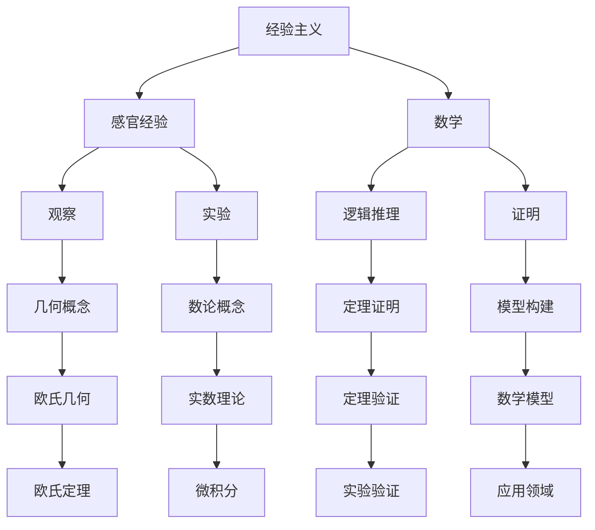

---

#### 第2章：数学概念的历史发展

数学概念的历史发展是一个复杂而美妙的过程，它不仅反映了人类对自然界的探索和理解，也展示了人类智慧的进步。在这一章中，我们将探讨数学概念的产生、系统化及其在不同历史时期的发展。

**2.1 数学概念的产生**

数学概念的产生往往源于人类对现实世界的观察和需要。以下是一些关键数学概念的产生过程：

- **数的概念**

  数的概念起源于人类对物体数量的计数。在古代，人们通过手指、石子或结绳来计数。随着交易的兴起，人们对数量的需求逐渐增加，从而发展出了更复杂的计数方法。

- **几何学的起源**

  几何学起源于对空间形状和大小的研究。古埃及和巴比伦人通过建筑和测量土地的需要，发展出了初步的几何知识。例如，他们利用几何学来计算田地的面积。

- **测量的需求**

  测量是人类社会发展的重要需求。从早期的土地测量到后来的长度、重量和时间的测量，测量技术不断进步，促进了数学概念的发展。

**2.1.1 数学概念的形成过程**

- **从具体到抽象**

  数学概念的形成通常从具体的现象和问题开始，然后通过抽象和概括提炼出基本的概念。例如，自然数的概念是通过数具体物体的数量得到的，而实数的概念则是通过无穷小数的逼近得到的。

- **从经验到理论**

  数学概念的形成不仅依赖于经验，还需要通过理论的阐述和证明来使其具有普遍性和可靠性。例如，欧几里得的《几何原本》通过公理化的方法建立了几何学的理论基础。

**2.1.2 数学概念的系统化**

数学概念的系统化是一个逐步的过程，它通过公理化、分类和定理证明来建立严谨的数学体系。

- **公理化的意义**

  公理化是数学系统化的重要方法。通过一组基本命题（公理）来构建整个数学体系，使得数学理论具有自洽性和一致性。欧几里得的《几何原本》就是公理化方法的经典例子。

- **数学理论框架的建立**

  数学理论框架的建立需要将不同的数学概念和定理整合到一个统一的体系中。集合论作为现代数学的基础，提供了统一的表述方式。例如，通过集合论，我们可以定义自然数、实数等基本概念。

**2.2 数学概念在不同历史时期的发展**

- **古代数学**

  在古代，数学主要集中在解决实际问题的需要。例如，古埃及和巴比伦的数学主要用于农业、建筑和贸易。这一时期的数学主要是经验性的，缺乏严格的证明。

- **中世纪数学**

  中世纪数学在阿拉伯世界得到发展，特别是在代数和三角学领域。阿拉伯数学家如阿尔·花剌子米（Al-Khwarizmi）对代数学的贡献至今仍然存在。

- **现代数学**

  17世纪和18世纪的数学发展进入了现代阶段，特别是微积分和解析几何的建立。牛顿和莱布尼茨分别独立发展了微积分，极大地推动了数学的应用。

- **20世纪数学**

  20世纪数学在纯数学和应用数学方面都取得了重大进展。集合论、拓扑学、代数学等新的数学分支相继出现，丰富了数学的理论体系。同时，数学在物理学、计算机科学、经济学等领域的应用也日益广泛。

通过这一章的探讨，我们不仅了解了数学概念的历史发展过程，也看到了数学概念如何从具体现象中抽象出来，并通过系统化和理论化成为严谨的学科体系。这些数学概念不仅为数学本身的发展奠定了基础，也为其他科学领域提供了强有力的工具。

---

**数学概念的形成与系统化**

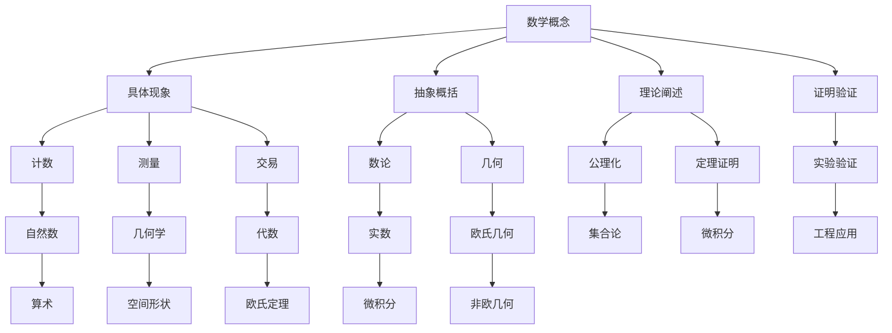

---

#### 第3章：数学推理的方法与过程

数学推理是数学研究的核心，它包括直觉推理、演绎推理和归纳推理等多种方法。本章将详细介绍这些推理方法的基本原则、特点及其在数学中的应用。

**3.1 数学推理的基本原则**

- **直觉推理**

  直觉推理是基于直观感觉和经验进行的推理。它通常不需要复杂的逻辑证明，而是依赖于对问题的直观理解。直觉推理在数学研究中有着重要的应用，例如在初等几何问题中，通过直观观察可以得到一些显而易见的结论。

- **演绎推理**

  演绎推理是从一般到特殊的推理过程，它通过逻辑步骤从一个或多个已知前提推导出结论。演绎推理具有严格的逻辑性，是数学证明的基础。一个典型的例子是欧几里得几何中的证明过程，从公理和定义出发，逐步推导出一系列定理。

- **归纳推理**

  归纳推理是从特殊案例推导出一般结论的推理方法。归纳推理通常基于大量实例，通过观察和总结这些实例的共性，得出一般性结论。例如，在数论中，通过验证多个素数的性质，可以归纳出所有素数都具有某些特征。

**3.1.1 直觉推理与演绎推理**

- **直觉推理的特点与应用**

  直觉推理的特点是快速、直接，但缺乏严格的逻辑证明。在数学研究中，直觉推理可以帮助我们发现问题和提出猜想。例如，数学家们通过直觉推理提出了许多重要的数学猜想，如哥德巴赫猜想和费马大定理。

- **演绎推理的逻辑结构**

  演绎推理的逻辑结构包括前提、结论和推理步骤。一个演绎推理的正确性取决于前提的真实性和推理步骤的逻辑性。例如，在证明一个几何定理时，我们通常从公理和定义出发，通过一系列逻辑步骤推导出结论。

**3.1.2 归纳推理与概率推理**

- **归纳推理的局限性**

  归纳推理虽然可以从特殊案例推导出一般结论，但存在一定的局限性。归纳推理无法保证结论的绝对正确性，因为归纳过程依赖于样本的代表性。例如，即使验证了所有已知的素数都满足某个条件，也不能断定所有素数都满足这个条件。

- **概率推理的基本原理**

  概率推理是一种基于概率论的方法，用于在不确定性条件下进行推理。概率推理通过计算事件发生的概率来评估结论的可靠性。例如，在统计学中，我们通过样本数据计算总体参数的概率分布，从而对总体进行推断。

**3.2 数学推理的实际应用**

- **数学证明的技巧**

  数学证明是演绎推理的应用，通过逻辑推理和数学运算证明某个命题的正确性。常见的证明方法包括直接证明、反证法、归纳证明等。

  - **直接证明**：直接从已知条件推导出结论，是最常见的证明方法。
  - **反证法**：假设结论不成立，通过推导出矛盾来证明结论成立。
  - **归纳证明**：通过验证基例和归纳步骤，证明命题对所有正整数都成立。

- **数学推理的局限性**

  虽然数学推理是严格的，但有时也可能遇到局限性。例如，在某些情况下，即使使用了严格的推理方法，也无法得出结论。此外，数学模型往往是对现实世界的简化，可能无法完全反映现实。

通过本章的讨论，我们了解了数学推理的各种方法及其应用。数学推理不仅帮助我们证明数学命题的正确性，也为数学理论的发展提供了坚实的基础。在接下来的章节中，我们将进一步探讨数学证明的技巧和数学模型的应用。

---

**数学推理的流程图**

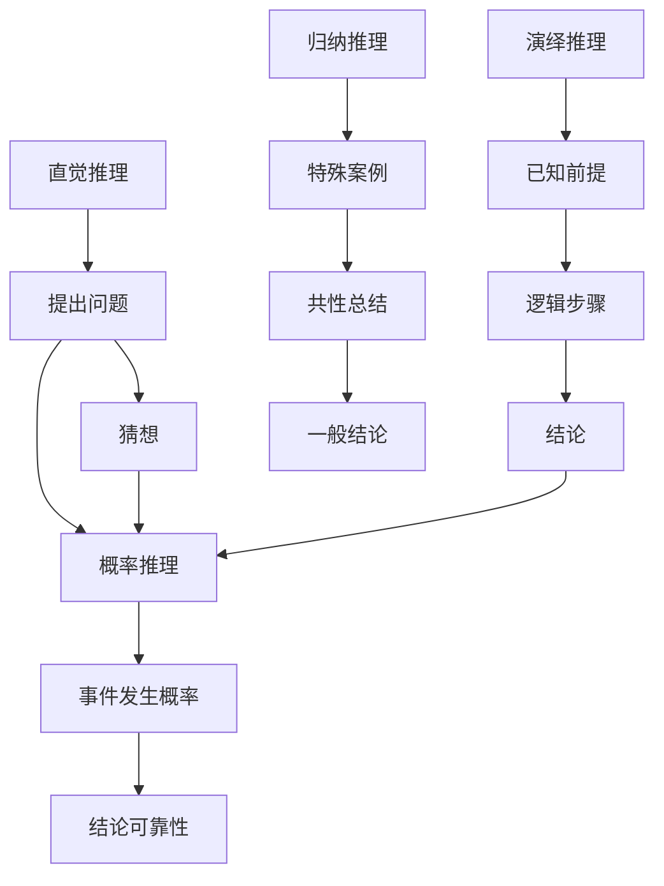

---

#### 第4章：数学证明的技巧与应用

数学证明是数学推理的核心，它通过逻辑推理和严格的论证步骤，证明数学命题的正确性。数学证明不仅使数学理论更加严谨，也为数学的应用提供了坚实基础。本章将介绍数学证明的基本方法，包括直接证明、反证法、构造性证明和非构造性证明，并探讨它们的应用。

**4.1 数学证明的基本方法**

- **直接证明**

  直接证明是通过逻辑推理，从已知条件直接推导出结论的证明方法。它是证明数学命题最常用的方法。

  **步骤**：

  1. 从已知条件开始，列出所有已知信息。
  2. 使用定理、定义和逻辑推理规则，逐步推导出结论。
  3. 确保每一步推理都是有效的，逻辑上是成立的。

  **示例**：

  证明：若 \( a > b \)，则 \( a^2 > b^2 \)。

  - 已知：\( a > b \)
  - 推导：\( a - b > 0 \)
  - 因为 \( a - b > 0 \)，所以 \( (a - b)(a + b) > 0 \)
  - 展开后得到：\( a^2 - b^2 > 0 \)
  - 因此，\( a^2 > b^2 \)

- **反证法**

  反证法是通过假设结论不成立，推导出矛盾来证明结论成立的证明方法。

  **步骤**：

  1. 假设结论不成立，即假设原命题的反面。
  2. 从假设出发，推导出一系列逻辑结论。
  3. 如果这些结论中存在矛盾，则说明原假设不成立，从而证明结论成立。

  **示例**：

  证明：若 \( a \) 和 \( b \) 都大于 1，则 \( a + b > 2 \)。

  - 假设：\( a + b \leq 2 \)
  - 推导：因为 \( a > 1 \) 和 \( b > 1 \)，所以 \( a - 1 > 0 \) 和 \( b - 1 > 0 \)
  - 因此，\( a - 1 + b - 1 = (a + b) - 2 > 0 \)，这与假设 \( a + b \leq 2 \) 矛盾
  - 所以原命题成立，\( a + b > 2 \)

- **构造性证明**

  构造性证明是通过构造一个具体的例子来证明某个命题的证明方法。

  **步骤**：

  1. 构造一个满足条件的例子。
  2. 证明这个例子确实满足命题的要求。
  3. 由于这个例子满足命题要求，因此命题对所有符合条件的情况都成立。

  **示例**：

  证明：存在一个自然数 \( n \)，使得 \( n^2 + n + 41 \) 是质数。

  - 构造：取 \( n = 41 \)
  - 计算：\( n^2 + n + 41 = 41^2 + 41 + 41 = 1681 + 41 + 41 = 1772 \)
  - 检验：1772 是质数，因为它除了 1 和自身外没有其他因数。

- **非构造性证明**

  非构造性证明是通过逻辑推理，证明某个命题对所有情况都成立，而不需要构造具体例子。

  **步骤**：

  1. 从已知条件出发，推导出命题对所有情况都成立的结论。
  2. 使用数学归纳法、反证法等技巧证明命题对所有情况都成立。

  **示例**：

  证明：对于所有正整数 \( n \)，\( n^3 + n \) 是偶数。

  - 基例：当 \( n = 1 \) 时，\( 1^3 + 1 = 2 \)，是偶数。
  - 归纳步骤：假设对于某个正整数 \( k \)，\( k^3 + k \) 是偶数。
  - 需要证明 \( (k+1)^3 + (k+1) \) 也是偶数。
  - 展开后得到：\( (k+1)^3 + (k+1) = k^3 + 3k^2 + 3k + 1 + k + 1 \)
  - 因为 \( k^3 + k \) 是偶数，所以 \( k^3 + 3k^2 + 3k + 2 \) 也是偶数。
  - 因此，\( (k+1)^3 + (k+1) \) 是偶数。

**4.2 数学证明的应用**

- **定理证明**

  定理证明是数学证明的重要应用之一。通过证明定理，我们可以理解数学概念和理论之间的关系，并扩展我们的数学知识。

  - **欧几里得定理**：证明在任意三角形中，任意两边之和大于第三边。
  - **勾股定理**：证明在直角三角形中，直角边的平方和等于斜边的平方。

- **算法验证**

  算法验证是计算机科学中的重要应用。通过证明算法的正确性，我们可以确保算法在执行过程中不会出现错误。

  - **排序算法**：如快速排序、归并排序，需要证明它们能够在有限时间内完成排序。
  - **搜索算法**：如二分搜索，需要证明它能够在对数时间内找到目标元素。

通过本章的讨论，我们了解了数学证明的基本方法及其应用。数学证明不仅是数学理论发展的基石，也是验证数学算法和理论正确性的重要手段。在接下来的章节中，我们将进一步探讨数学模型的应用和验证。

---

**数学证明的基本方法**

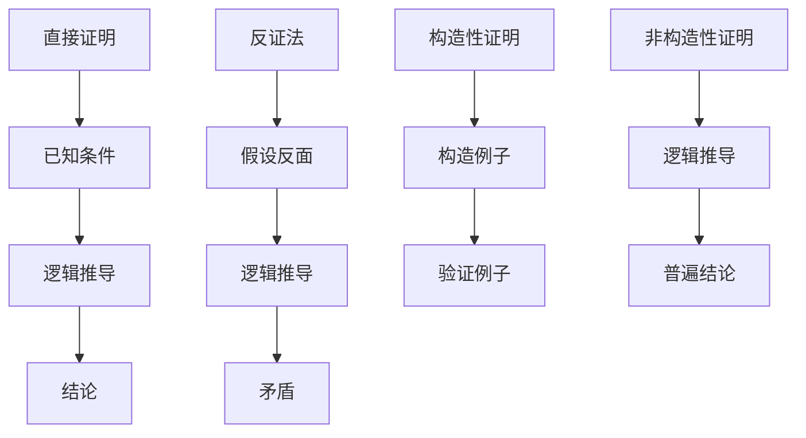

---

#### 第5章：数学模型的构建与应用

数学模型是数学与经验主义结合的桥梁，它将现实世界的复杂现象抽象为数学形式，以便于分析和理解。本章将探讨数学模型的构建原则、应用领域及其在自然科学和社会科学中的具体应用。

**5.1 数学模型的构建原则**

数学模型的构建原则主要包括以下几个步骤：

- **模型抽象**：从具体的现实世界现象中提取出核心要素，忽略次要因素。这一步骤需要深入理解问题的本质，将复杂的现实简化为可处理的数学形式。

- **模型简化**：在保证模型有效性的前提下，尽可能减少模型中的变量和关系。简化模型可以提高计算效率，但需要确保简化后的模型仍然能够准确反映现实世界的主要特征。

- **模型验证**：通过实验数据或实际应用来验证模型的有效性。验证过程包括模型参数的确定、模型预测的验证以及与实际结果的对比分析。

**5.1.1 模型抽象与简化**

- **模型抽象的过程**：

  模型抽象的过程是通过观察、实验和数据分析来识别和提取关键变量和关系。例如，在建立人口增长模型时，我们需要考虑人口数量、出生率、死亡率和迁移率等关键变量，而忽略其他次要因素。

- **模型简化的方法**：

  模型简化的方法包括降维、简化和优化技术。降维技术通过减少模型的维度来降低复杂性，简化技术通过简化的数学公式来简化模型，优化技术通过优化算法来调整模型参数，以提高模型的预测能力。

**5.1.2 数学模型的应用领域**

- **自然科学中的应用**：

  在自然科学中，数学模型广泛应用于物理学、生物学、化学等领域。

  - **物理学**：牛顿的运动定律、麦克斯韦方程组等经典物理模型，通过数学公式描述物理现象，为实验和理论分析提供了基础。

  - **生物学**：种群动力学模型、神经网络模型等，用于研究生物种群的行为、生态系统的稳定性以及神经系统的功能。

  - **化学**：化学反应方程式、量子化学模型等，用于描述化学反应的过程和结果，为化学实验和理论分析提供了工具。

- **社会科学中的应用**：

  在社会科学中，数学模型广泛应用于经济学、社会学、心理学等领域。

  - **经济学**：供需模型、市场均衡模型等，用于分析和预测市场行为、资源分配以及宏观经济趋势。

  - **社会学**：社会网络分析模型、行为模型等，用于研究社会关系、社会结构和人类行为。

  - **心理学**：心理测量模型、认知模型等，用于分析人类心理过程、行为模式和认知能力。

**5.1.3 数学模型构建的挑战**

- **模型选择与优化**：

  在构建数学模型时，选择合适的模型并优化模型参数是关键步骤。模型选择需要考虑问题的本质、数据的可用性和计算复杂性。优化方法包括最小二乘法、梯度下降法、遗传算法等。

- **模型验证与评估**：

  模型的验证与评估是确保模型有效性的重要环节。验证过程包括实验验证、历史数据验证和模拟验证。评估方法包括均方误差、相关系数、AIC/BIC准则等。

通过本章的讨论，我们了解了数学模型的构建原则和应用领域。数学模型不仅为科学研究提供了有力工具，也为实际应用提供了解决方案。在接下来的章节中，我们将进一步探讨数学模型的验证与确证，以及数学知识在实际应用中的经验验证。

---

**数学模型的构建与应用**

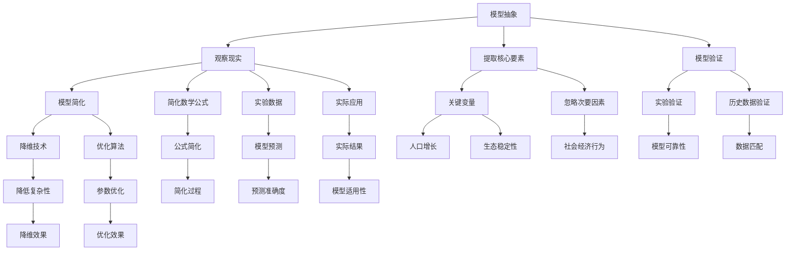

---

#### 第6章：数学知识的验证与确证

数学知识的验证与确证是确保数学结论可靠性的关键步骤。数学验证涉及逻辑推理、实验数据以及数学证明等多种方法，而确证则是通过不断的验证和修正来提高数学知识的可信度。本章将详细介绍数学知识的验证方法、反驳与修正过程，以及数学知识的发展趋势。

**6.1 数学知识的验证方法**

数学知识的验证方法包括实验验证、逻辑验证和数学证明等。

- **实验验证**

  实验验证是通过实际操作和实验来验证数学模型和结论的正确性。在自然科学领域，实验验证尤为重要。例如，物理实验可以验证物理定律的准确性，化学实验可以验证化学反应方程式的正确性。

  **步骤**：

  1. 设计实验：明确实验目标，确定实验方法和实验设备。
  2. 收集数据：进行实验操作，收集相关数据。
  3. 分析结果：对实验数据进行统计和分析，验证数学模型或结论的有效性。

- **逻辑验证**

  逻辑验证是通过逻辑推理来验证数学命题的正确性。逻辑验证强调推理的严谨性，确保从已知条件推导出结论的过程中没有逻辑错误。

  **步骤**：

  1. 确定已知条件：列出所有已知信息和假设。
  2. 使用逻辑推理规则：从已知条件出发，逐步推导出结论。
  3. 检查逻辑性：确保每一步推理都是有效的，没有逻辑错误。

- **数学证明**

  数学证明是通过逻辑推理和数学运算来证明数学命题的正确性。数学证明是数学知识验证的基石，它为数学理论提供了坚实的支持。

  **步骤**：

  1. 提出命题：明确需要证明的数学命题。
  2. 构建证明框架：确定证明的方法和步骤。
  3. 进行证明：使用定理、定义和逻辑推理规则，逐步推导出结论。
  4. 验证证明：检查证明过程是否严谨，确保结论的正确性。

**6.2 数学知识的反驳与修正**

数学知识的反驳与修正是对现有数学理论进行深入研究和检验的过程。

- **反驳**

  反驳是通过提出反例或逻辑错误来质疑现有数学理论的正确性。反驳可以揭示数学理论中的漏洞和不足，促使数学家对现有理论进行修正和改进。

  **方法**：

  1. 提出反例：通过构造一个例子，证明现有理论在特定情况下不成立。
  2. 逻辑推理：通过逻辑推理证明现有理论的结论是错误的。
  3. 公开辩论：在学术会议上或学术期刊上发表反驳观点，引起学术界的关注和讨论。

- **修正**

  修正是在反驳的基础上，对现有数学理论进行改进和扩展。修正可以通过引入新的概念、修改公式或重构理论框架来实现。

  **步骤**：

  1. 分析反驳：研究反驳观点的合理性和逻辑性。
  2. 提出修正：根据反驳观点，提出对现有理论的修正方案。
  3. 进行证明：使用数学证明方法，证明修正后的理论是正确的。
  4. 验证修正：通过实验验证、逻辑验证和数学证明来验证修正后的理论的有效性。

**6.3 数学知识的发展趋势**

数学知识的发展趋势体现在新理论、新方法和新领域的不断涌现。

- **新兴数学领域**

  新兴数学领域如量子数学、计算数学和拓扑学等正在快速发展。这些领域不仅扩展了数学的理论体系，也为其他科学领域提供了新的工具和方法。

  **趋势**：

  1. 量子数学：研究量子现象的数学描述，为量子物理学提供理论基础。
  2. 计算数学：利用计算机技术解决复杂的数学问题，提高数学计算效率。
  3. 拓扑学：研究空间结构和性质，为现代物理学、计算机科学和生物学等领域提供理论支持。

- **数学与经验的结合**

  数学与经验的结合是数学知识发展的重要方向。通过将数学模型与实际经验相结合，数学可以更好地描述和预测现实世界的复杂现象。

  **趋势**：

  1. 大数据与数学：利用大数据分析技术，从大量数据中提取数学规律和模式。
  2. 统计学：通过统计方法对经验数据进行分析和解释，提高数学模型的可信度。
  3. 经验验证：通过实验验证和实际应用，检验数学模型的有效性和可靠性。

通过本章的讨论，我们了解了数学知识的验证方法、反驳与修正过程，以及数学知识的发展趋势。数学知识的验证与确证不仅是数学研究的核心，也为其他科学领域提供了坚实的基础。在未来的发展中，数学将继续与经验主义相结合，推动科学技术的进步和社会的发展。

---

**数学知识的验证与确证**

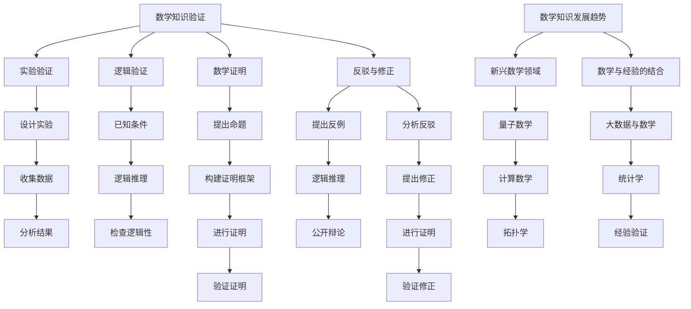

---

#### 第7章：数学与经验主义的未来发展

随着科技的不断进步和社会的快速发展，数学与经验主义在未来将继续发挥重要作用。本章将探讨数学与经验主义的研究趋势、新兴领域以及数学模型在实际应用中的新进展。

**7.1 数学与经验主义的研究趋势**

- **量子数学的发展**

  量子数学是近年来快速发展的新兴领域，它研究量子现象的数学描述。量子数学不仅在量子物理学中具有重要应用，也为其他领域提供了新的数学工具。例如，量子计算和量子信息理论都需要借助量子数学的方法和理论。

- **计算数学的前沿研究**

  计算数学是利用计算机技术解决复杂数学问题的领域。随着计算能力的提升和算法的进步，计算数学在解决大规模计算问题、优化问题和模拟现实世界现象方面取得了显著成果。例如，计算流体力学、计算生物学和计算物理学等领域都依赖于计算数学的方法和技术。

- **大数据与数学的结合**

  大数据时代为数学提供了丰富的数据资源，大数据与数学的结合成为当前研究的热点。通过数据分析、机器学习和统计方法，数学家们可以从大量数据中提取有价值的信息和规律。例如，在金融领域，大数据分析被广泛应用于市场预测、风险评估和算法交易。

**7.2 经验主义在数学研究中的新应用**

- **实验验证与经验数据**

  经验主义在数学研究中得到了新的应用，特别是在验证数学模型和理论的过程中。通过实验验证和经验数据，数学家们可以检验数学模型在实际应用中的有效性。例如，在物理学中，实验验证是验证理论物理模型的重要手段。

- **统计方法与数据分析**

  统计方法和数据分析在数学研究中发挥着越来越重要的作用。通过统计方法，数学家们可以从数据中提取趋势和模式，从而验证或推翻现有的理论。例如，在统计学中，假设检验和回归分析等方法被广泛应用于数据分析。

- **跨学科研究**

  数学与经验主义在跨学科研究中的应用也越来越广泛。例如，在社会科学领域，数学模型和统计分析被广泛应用于经济、社会和行为研究。通过跨学科研究，数学与经验主义可以更好地服务于实际问题，推动社会进步。

**7.3 数学模型在实际应用中的新进展**

- **人工智能与机器学习**

  人工智能和机器学习的发展为数学模型的应用带来了新的机遇。通过建立复杂的数学模型，数学家们可以开发出更加智能的算法和系统。例如，深度学习模型在图像识别、自然语言处理和推荐系统等领域取得了显著成果。

- **优化问题与算法设计**

  优化问题和算法设计是数学模型的重要应用领域。通过建立数学模型，数学家们可以解决资源分配、路径规划、生产调度等实际问题。例如，线性规划和动态规划等方法被广泛应用于优化问题的解决。

- **金融市场预测与风险管理**

  金融市场预测和风险管理是数学模型在经济学中的重要应用。通过建立金融模型，数学家们可以预测市场走势、评估风险和设计投资策略。例如，蒙特卡洛模拟和期权定价模型等方法在金融领域中得到了广泛应用。

通过本章的讨论，我们了解了数学与经验主义在未来的发展趋势和新兴领域。随着科技的不断进步和社会的快速发展，数学与经验主义将继续为科学研究和实际应用提供新的动力。在未来的发展中，数学与经验主义将不断融合，共同推动人类社会的进步。

---

**数学与经验主义的未来发展**

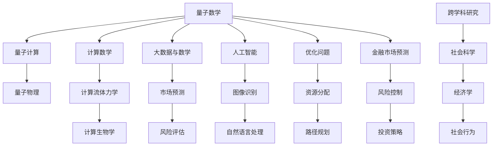

---

#### 第8章：数学概念的起源与演变

数学概念的历史发展是一个漫长而复杂的过程，它起源于人类对自然现象的观察和需要，并通过不断的抽象和理论化逐步形成了现代数学体系。本章将探讨数学概念的产生、演变过程以及它们在数学体系中的地位。

**8.1 数学概念的历史发展**

- **数的概念**

  数的概念起源于人类对物体数量的计数。在古代，人们通过手指、石子或结绳来计数。随着交易的兴起，人们对数量的需求逐渐增加，从而发展出了更复杂的计数方法。最初的数概念主要包括自然数和整数，后来随着数学的发展，逐渐引入了分数、实数和复数等概念。

- **几何学的起源**

  几何学起源于对空间形状和大小的研究。古埃及和巴比伦人通过建筑和测量土地的需要，发展出了初步的几何知识。例如，古埃及人利用几何学来计算田地的面积，而巴比伦人则通过测量天文现象来建立几何学的基础。

- **测量的需求**

  测量是人类社会发展的重要需求。从早期的土地测量到后来的长度、重量和时间的测量，测量技术不断进步，促进了数学概念的发展。例如，古希腊的欧几里得在《几何原本》中系统地总结了测量和几何学的知识。

**8.2 数学概念的系统化**

数学概念的系统化是一个逐步的过程，它通过公理化、分类和定理证明来建立严谨的数学体系。

- **公理化的意义**

  公理化是数学系统化的重要方法。通过一组基本命题（公理）来构建整个数学体系，使得数学理论具有自洽性和一致性。欧几里得的《几何原本》就是公理化方法的经典例子。通过公理，我们可以从最基本的概念和命题出发，逐步推导出更复杂的结论。

- **数学理论框架的建立**

  数学理论框架的建立需要将不同的数学概念和定理整合到一个统一的体系中。集合论作为现代数学的基础，提供了统一的表述方式。例如，通过集合论，我们可以定义自然数、实数等基本概念，并建立它们之间的逻辑关系。

**8.3 数学概念的形成过程**

- **从具体到抽象**

  数学概念的形成通常从具体的现象和问题开始，然后通过抽象和概括提炼出基本的概念。例如，自然数的概念是通过数具体物体的数量得到的，而实数的概念则是通过无穷小数的逼近得到的。

- **从经验到理论**

  数学概念的形成不仅依赖于经验，还需要通过理论的阐述和证明来使其具有普遍性和可靠性。例如，欧几里得的《几何原本》通过公理化的方法建立了几何学的理论基础。

**8.4 数学概念在不同历史时期的发展**

- **古代数学**

  在古代，数学主要集中在解决实际问题的需要。例如，古埃及和巴比伦的数学主要用于农业、建筑和贸易。这一时期的数学主要是经验性的，缺乏严格的证明。

- **中世纪数学**

  中世纪数学在阿拉伯世界得到发展，特别是在代数和三角学领域。阿拉伯数学家如阿尔·花剌子米（Al-Khwarizmi）对代数学的贡献至今仍然存在。

- **现代数学**

  17世纪和18世纪的数学发展进入了现代阶段，特别是微积分和解析几何的建立。牛顿和莱布尼茨分别独立发展了微积分，极大地推动了数学的应用。

- **20世纪数学**

  20世纪数学在纯数学和应用数学方面都取得了重大进展。集合论、拓扑学、代数学等新的数学分支相继出现，丰富了数学的理论体系。同时，数学在物理学、计算机科学、经济学等领域的应用也日益广泛。

通过本章的探讨，我们了解了数学概念的历史发展过程，以及数学概念是如何从具体现象中抽象出来，并通过系统化和理论化成为严谨的学科体系的。这些数学概念不仅为数学本身的发展奠定了基础，也为其他科学领域提供了强有力的工具。

---

**数学概念的历史发展**

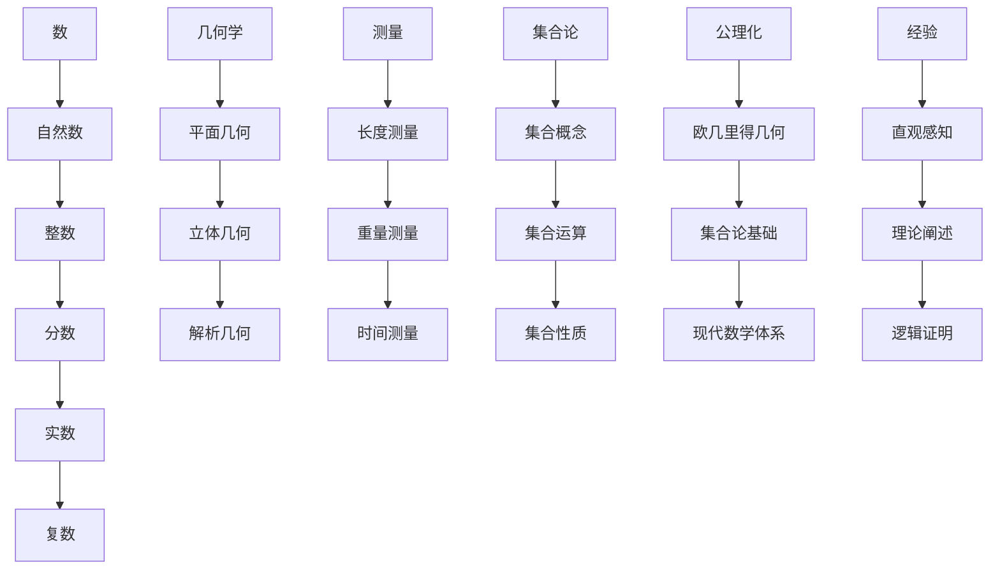

---

#### 第9章：数学推理的方法与过程

数学推理是数学研究的核心，它通过直觉推理、演绎推理和归纳推理等多种方法，帮助我们理解数学概念、证明数学命题以及构建数学模型。本章将详细介绍这些推理方法的基本原则、特点及其在数学中的应用。

**9.1 数学推理的基本原则**

- **直觉推理**

  直觉推理是基于直观感觉和经验进行的推理。它通常不需要复杂的逻辑证明，而是依赖于对问题的直观理解。直觉推理在数学研究中有着重要的应用，例如在初等几何问题中，通过直观观察可以得到一些显而易见的结论。

- **演绎推理**

  演绎推理是从一般到特殊的推理过程，它通过逻辑步骤从一个或多个已知前提推导出结论。演绎推理具有严格的逻辑性，是数学证明的基础。一个典型的例子是欧几里得几何中的证明过程，从公理和定义出发，逐步推导出一系列定理。

- **归纳推理**

  归纳推理是从特殊案例推导出一般结论的推理方法。归纳推理通常基于大量实例，通过观察和总结这些实例的共性，得出一般性结论。例如，在数论中，通过验证多个素数的性质，可以归纳出所有素数都具有某些特征。

**9.1.1 直觉推理与演绎推理**

- **直觉推理的特点与应用**

  直觉推理的特点是快速、直接，但缺乏严格的逻辑证明。在数学研究中，直觉推理可以帮助我们发现问题和提出猜想。例如，数学家们通过直觉推理提出了许多重要的数学猜想，如哥德巴赫猜想和费马大定理。

- **演绎推理的逻辑结构**

  演绎推理的逻辑结构包括前提、结论和推理步骤。一个演绎推理的正确性取决于前提的真实性和推理步骤的逻辑性。例如，在证明一个几何定理时，我们通常从公理和定义出发，通过一系列逻辑步骤推导出结论。

**9.1.2 归纳推理与概率推理**

- **归纳推理的局限性**

  归纳推理虽然可以从特殊案例推导出一般结论，但存在一定的局限性。归纳推理无法保证结论的绝对正确性，因为归纳过程依赖于样本的代表性。例如，即使验证了所有已知的素数都满足某个条件，也不能断定所有素数都满足这个条件。

- **概率推理的基本原理**

  概率推理是一种基于概率论的方法，用于在不确定性条件下进行推理。概率推理通过计算事件发生的概率来评估结论的可靠性。例如，在统计学中，我们通过样本数据计算总体参数的概率分布，从而对总体进行推断。

**9.2 数学推理的实际应用**

- **数学证明的技巧**

  数学证明是演绎推理的应用，通过逻辑推理和数学运算证明某个命题的正确性。常见的证明方法包括直接证明、反证法、归纳证明等。

  - **直接证明**：直接从已知条件推导出结论，是最常见的证明方法。
  - **反证法**：假设结论不成立，通过推导出矛盾来证明结论成立。
  - **归纳证明**：通过验证基例和归纳步骤，证明命题对所有正整数都成立。

- **数学推理的局限性**

  虽然数学推理是严格的，但有时也可能遇到局限性。例如，在某些情况下，即使使用了严格的推理方法，也无法得出结论。此外，数学模型往往是对现实世界的简化，可能无法完全反映现实。

通过本章的讨论，我们了解了数学推理的各种方法及其应用。数学推理不仅帮助我们证明数学命题的正确性，也为数学理论的发展提供了坚实的基础。在接下来的章节中，我们将进一步探讨数学证明的技巧和数学模型的应用。

---

**数学推理的流程图**

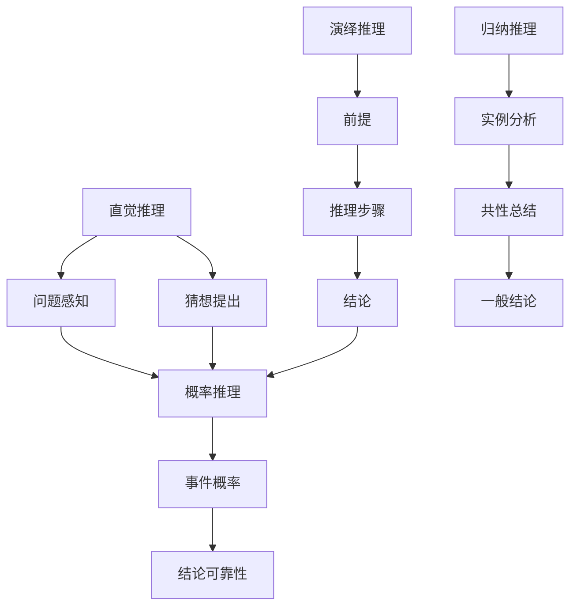

---

#### 第10章：数学证明的应用与挑战

数学证明是数学研究中的一个重要环节，它通过严密的逻辑推理验证数学命题的正确性。本章将探讨数学证明在不同领域的应用，包括常见的证明方法、数学证明的局限性，以及数学证明过程中可能遇到的挑战。

**10.1 数学证明的常见方法**

数学证明的方法多种多样，常见的包括直接证明、反证法、构造性证明和非构造性证明等。

- **直接证明**

  直接证明是从已知条件出发，通过逻辑推理直接推导出结论的证明方法。它是证明数学命题最常用的方法。

  **示例**：

  证明：对于任意正整数 \( n \)，有 \( n^2 + n \) 是奇数。

  - 已知：\( n \) 是正整数。
  - 推导：\( n^2 \) 是奇数或偶数，且 \( n^2 + n \) 是奇数加偶数。
  - 结论：\( n^2 + n \) 是奇数。

- **反证法**

  反证法是通过假设结论不成立，推导出矛盾来证明结论成立的证明方法。

  **示例**：

  证明：不存在一个最小的负整数。

  - 假设：存在一个最小的负整数 \( n \)。
  - 推导：由于 \( n + 1 \) 比 \( n \) 更小，所以 \( n + 1 \) 是一个负整数，这与 \( n \) 是最小负整数矛盾。
  - 结论：不存在最小的负整数。

- **构造性证明**

  构造性证明是通过构造一个具体的例子来证明某个命题的证明方法。

  **示例**：

  证明：存在一个自然数 \( n \)，使得 \( n^3 + n + 41 \) 是质数。

  - 构造：取 \( n = 41 \)。
  - 计算：\( n^3 + n + 41 = 41^3 + 41 + 41 = 68921 + 41 + 41 = 68921 \)。
  - 检验：68921 是质数，因为它除了 1 和自身外没有其他因数。
  - 结论：存在一个自然数 \( n \)，使得 \( n^3 + n + 41 \) 是质数。

- **非构造性证明**

  非构造性证明是通过逻辑推理，证明某个命题对所有情况都成立，而不需要构造具体例子。

  **示例**：

  证明：对于所有正整数 \( n \)，\( n^3 + n \) 是偶数。

  - 基例：当 \( n = 1 \) 时，\( 1^3 + 1 = 2 \)，是偶数。
  - 归纳步骤：假设对于某个正整数 \( k \)，\( k^3 + k \) 是偶数。
  - 需要证明 \( (k+1)^3 + (k+1) \) 也是偶数。
  - 展开后得到：\( (k+1)^3 + (k+1) = k^3 + 3k^2 + 3k + 1 + k + 1 \)。
  - 因为 \( k^3 + k \) 是偶数，所以 \( k^3 + 3k^2 + 3k + 2 \) 也是偶数。
  - 结论：对于所有正整数 \( n \)，\( n^3 + n \) 是偶数。

**10.2 数学证明的局限性**

尽管数学证明具有严密的逻辑性，但它在某些情况下也可能存在局限性。

- **证明过程的不完备性**

  数学证明可能无法涵盖所有情况，例如在某些复杂问题中，即使使用了严格的推理方法，也无法得出结论。例如，某些数学猜想可能需要复杂的证明过程，甚至超出了当前数学方法的能力范围。

- **数学模型与现实的差距**

  数学模型是对现实世界的简化，可能无法完全反映现实世界的复杂性和多样性。例如，在物理学中，理想模型往往忽略了真实世界中的一些复杂因素，导致模型与实际现象存在差异。

**10.3 数学证明的挑战**

数学证明过程中可能遇到一些挑战，包括：

- **证明的复杂性**

  某些数学命题的证明可能非常复杂，需要大量的推理步骤和计算。例如，著名的四色定理的证明使用了计算机辅助，并经过了严格的验证。

- **证明的真伪性**

  数学证明的真伪性需要经过严格的审查和验证。即使证明过程是正确的，也可能因为前提条件的错误而导致结论不正确。例如，在某些情况下，反证法可能会因为错误的假设而导致错误的结论。

通过本章的讨论，我们了解了数学证明的常见方法、局限性以及可能遇到的挑战。数学证明不仅是数学理论发展的基石，也是验证数学命题和模型正确性的重要手段。在未来的研究中，数学家们将继续探索新的证明方法和技术，以应对复杂的数学问题和现实世界的挑战。

---

**数学证明的常见方法**

---

#### 第11章：数学模型与经验主义的关系

数学模型是数学与经验主义结合的桥梁，它将现实世界的复杂现象抽象为数学形式，以便于分析和理解。本章将探讨数学模型的构建原则、应用领域及其与经验主义的关系。

**11.1 数学模型的构建原则**

数学模型的构建原则主要包括以下几个步骤：

- **模型抽象**：从具体的现实世界现象中提取出核心要素，忽略次要因素。这一步骤需要深入理解问题的本质，将复杂的现实简化为可处理的数学形式。

- **模型简化**：在保证模型有效性的前提下，尽可能减少模型中的变量和关系。简化模型可以提高计算效率，但需要确保简化后的模型仍然能够准确反映现实世界的主要特征。

- **模型验证**：通过实验数据或实际应用来验证模型的有效性。验证过程包括模型参数的确定、模型预测的验证以及与实际结果的对比分析。

**11.1.1 模型抽象与简化**

- **模型抽象的过程**：

  模型抽象的过程是通过观察、实验和数据分析来识别和提取关键变量和关系。例如，在建立人口增长模型时，我们需要考虑人口数量、出生率、死亡率和迁移率等关键变量，而忽略其他次要因素。

- **模型简化的方法**：

  模型简化的方法包括降维、简化和优化技术。降维技术通过减少模型的维度来降低复杂性，简化技术通过简化的数学公式来简化模型，优化技术通过优化算法来调整模型参数，以提高模型的预测能力。

**11.1.2 数学模型的应用领域**

- **自然科学中的应用**：

  在自然科学中，数学模型广泛应用于物理学、生物学、化学等领域。

  - **物理学**：牛顿的运动定律、麦克斯韦方程组等经典物理模型，通过数学公式描述物理现象，为实验和理论分析提供了基础。

  - **生物学**：种群动力学模型、神经网络模型等，用于研究生物种群的行为、生态系统的稳定性以及神经系统的功能。

  - **化学**：化学反应方程式、量子化学模型等，用于描述化学反应的过程和结果，为化学实验和理论分析提供了工具。

- **社会科学中的应用**：

  在社会科学中，数学模型广泛应用于经济学、社会学、心理学等领域。

  - **经济学**：供需模型、市场均衡模型等，用于分析和预测市场行为、资源分配以及宏观经济趋势。

  - **社会学**：社会网络分析模型、行为模型等，用于研究社会关系、社会结构和人类行为。

  - **心理学**：心理测量模型、认知模型等，用于分析人类心理过程、行为模式和认知能力。

**11.2 数学模型构建的挑战**

- **模型选择与优化**：

  在构建数学模型时，选择合适的模型并优化模型参数是关键步骤。模型选择需要考虑问题的本质、数据的可用性和计算复杂性。优化方法包括最小二乘法、梯度下降法、遗传算法等。

- **模型验证与评估**：

  模型的验证与评估是确保模型有效性的重要环节。验证过程包括实验验证、历史数据验证和模拟验证。评估方法包括均方误差、相关系数、AIC/BIC准则等。

**11.3 数学模型与经验主义的关系**

数学模型与经验主义之间的关系是复杂而微妙的。数学模型从经验中获取信息，并通过验证和修正不断完善。经验主义则为数学模型的构建提供了依据和指导。

- **经验数据的获取**：

  经验数据是数学模型构建的基础。通过实验、调查和观测，可以收集与现象相关的数据，这些数据为数学模型的建立提供了具体的依据。

- **数学模型的确证**：

  数学模型需要通过实验验证和实际应用来确证其有效性。实验验证包括模拟实验、实验室测试和现场实验等。实际应用则包括将模型应用于实际问题，观察模型预测与实际结果的吻合程度。

- **模型的修正与优化**：

  随着经验的积累和新的数据的出现，数学模型需要不断地修正和优化。通过对比模型预测与实际结果，可以调整模型参数，提高模型的预测能力。

通过本章的讨论，我们了解了数学模型的构建原则、应用领域及其与经验主义的关系。数学模型不仅为科学研究提供了有力的工具，也为实际应用提供了解决方案。在未来的发展中，数学模型将继续与经验主义相结合，推动科学技术的进步和社会的发展。

---

**数学模型与经验主义的关系**

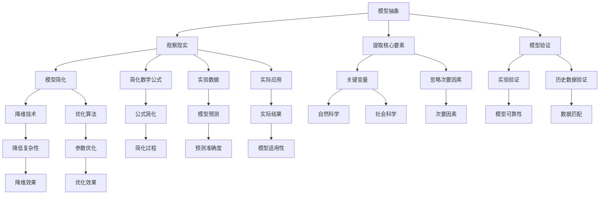

---

#### 第12章：数学知识的验证与确证

数学知识的验证与确证是确保数学结论可靠性的关键步骤。数学验证涉及逻辑推理、实验数据以及数学证明等多种方法，而确证则是通过不断的验证和修正来提高数学知识的可信度。本章将详细介绍数学知识的验证方法、反驳与修正过程，以及数学知识的发展趋势。

**12.1 数学知识的验证方法**

数学知识的验证方法包括实验验证、逻辑验证和数学证明等。

- **实验验证**

  实验验证是通过实际操作和实验来验证数学模型和结论的正确性。在自然科学领域，实验验证尤为重要。例如，物理实验可以验证物理定律的准确性，化学实验可以验证化学反应方程式的正确性。

  **步骤**：

  1. 设计实验：明确实验目标，确定实验方法和实验设备。
  2. 收集数据：进行实验操作，收集相关数据。
  3. 分析结果：对实验数据进行统计和分析，验证数学模型或结论的有效性。

- **逻辑验证**

  逻辑验证是通过逻辑推理来验证数学命题的正确性。逻辑验证强调推理的严谨性，确保从已知条件推导出结论的过程中没有逻辑错误。

  **步骤**：

  1. 确定已知条件：列出所有已知信息和假设。
  2. 使用逻辑推理规则：从已知条件出发，逐步推导出结论。
  3. 检查逻辑性：确保每一步推理都是有效的，没有逻辑错误。

- **数学证明**

  数学证明是通过逻辑推理和数学运算来证明数学命题的正确性。数学证明是数学知识验证的基石，它为数学理论提供了坚实的支持。

  **步骤**：

  1. 提出命题：明确需要证明的数学命题。
  2. 构建证明框架：确定证明的方法和步骤。
  3. 进行证明：使用定理、定义和逻辑推理规则，逐步推导出结论。
  4. 验证证明：检查证明过程是否严谨，确保结论的正确性。

**12.2 数学知识的反驳与修正**

数学知识的反驳与修正是对现有数学理论进行深入研究和检验的过程。

- **反驳**

  反驳是通过提出反例或逻辑错误来质疑现有数学理论的正确性。反驳可以揭示数学理论中的漏洞和不足，促使数学家对现有理论进行修正和改进。

  **方法**：

  1. 提出反例：通过构造一个例子，证明现有理论在特定情况下不成立。
  2. 逻辑推理：通过逻辑推理证明现有理论的结论是错误的。
  3. 公开辩论：在学术会议上或学术期刊上发表反驳观点，引起学术界的关注和讨论。

- **修正**

  修正是在反驳的基础上，对现有数学理论进行改进和扩展。修正可以通过引入新的概念、修改公式或重构理论框架来实现。

  **步骤**：

  1. 分析反驳：研究反驳观点的合理性和逻辑性。
  2. 提出修正：根据反驳观点，提出对现有理论的修正方案。
  3. 进行证明：使用数学证明方法，证明修正后的理论是正确的。
  4. 验证修正：通过实验验证、逻辑验证和数学证明来验证修正后的理论的有效性。

**12.3 数学知识的发展趋势**

数学知识的发展趋势体现在新理论、新方法和新领域的不断涌现。

- **新兴数学领域**

  新兴数学领域如量子数学、计算数学和拓扑学等正在快速发展。这些领域不仅扩展了数学的理论体系，也为其他科学领域提供了新的工具和方法。

  **趋势**：

  1. 量子数学：研究量子现象的数学描述，为量子物理学提供理论基础。
  2. 计算数学：利用计算机技术解决复杂的数学问题，提高数学计算效率。
  3. 拓扑学：研究空间结构和性质，为现代物理学、计算机科学和生物学等领域提供理论支持。

- **数学与经验的结合**

  数学与经验的结合是数学知识发展的重要方向。通过将数学模型与实际经验相结合，数学可以更好地描述和预测现实世界的复杂现象。

  **趋势**：

  1. 大数据与数学：利用大数据分析技术，从大量数据中提取数学规律和模式。
  2. 统计学：通过统计方法对经验数据进行分析和解释，提高数学模型的可信度。
  3. 经验验证：通过实验验证和实际应用，检验数学模型的有效性和可靠性。

通过本章的讨论，我们了解了数学知识的验证方法、反驳与修正过程，以及数学知识的发展趋势。数学知识的验证与确证不仅是数学研究的核心，也为其他科学领域提供了坚实的基础。在未来的发展中，数学将继续与经验主义相结合，推动科学技术的进步和社会的发展。

---

**数学知识的验证与确证**

---

#### 第13章：数学知识在自然科学中的应用

数学在自然科学中的应用极为广泛，从经典物理学到现代生物学，数学模型和理论为科学家们提供了强大的分析工具。本章将探讨数学在物理学、生物学和化学中的应用，以及这些应用如何通过实验验证其有效性。

**13.1 数学在物理学中的应用**

- **经典力学**

  经典力学是研究物体在力的作用下的运动规律的科学。牛顿的三大运动定律和万有引力定律构成了经典力学的核心。这些定律可以通过数学公式精确描述物体的运动，如牛顿第二定律 \( F=ma \)。

  **实验验证**：

  - **自由落体实验**：伽利略通过自由落体实验验证了物体下落的加速度与质量无关，这符合牛顿的定律。
  - **行星运动**：开普勒定律通过数学公式描述了行星绕太阳运动的轨迹，并通过天文观测数据得到验证。

- **量子力学**

  量子力学是研究微观粒子的行为和性质的物理学分支。量子力学的数学模型包括波函数、薛定谔方程和海森堡不确定性原理等。

  **实验验证**：

  - **双缝实验**：通过电子或光子的干涉图样，验证了量子力学中波粒二象性的观点。
  - **量子计算**：量子比特的量子叠加态和量子纠缠等现象在实验中得到了验证，为量子计算提供了实验基础。

**13.2 数学在生物学中的应用**

- **种群动力学**

  种群动力学是研究生物种群数量变化的数学模型。这些模型通过微分方程描述出生率、死亡率、迁移率等参数，预测种群数量的变化。

  **实验验证**：

  - **生态实验**：通过对不同物种的观察和实验，验证了种群动力学模型中的参数，如捕食者和被捕食者之间的相互作用。
  - **模型模拟**：利用计算机模拟，对种群动力学模型进行验证，预测种群数量的长期变化。

- **神经网络模型**

  神经网络模型用于模拟生物神经系统的功能。这些模型通过数学方法描述神经元之间的连接和信号传递，研究大脑的信息处理能力。

  **实验验证**：

  - **脑电图（EEG）**：通过记录脑电图，验证神经网络模型中的神经元活动与实际脑电信号的一致性。
  - **行为实验**：通过动物行为实验，验证神经网络模型对特定行为模式的预测能力。

**13.3 数学在化学中的应用**

- **化学反应动力学**

  化学反应动力学研究化学反应的速率和机理。这些模型通过速率方程描述反应物和生成物之间的转换过程。

  **实验验证**：

  - **反应速率实验**：通过测量反应物和生成物的浓度变化，验证反应动力学模型的准确性。
  - **光谱分析**：通过光谱技术分析反应过程中的能量变化，验证化学反应模型的预测。

- **量子化学**

  量子化学利用量子力学的原理研究分子的结构和性质。这些模型通过波函数和薛定谔方程描述电子在分子中的分布。

  **实验验证**：

  - **X射线晶体学**：通过X射线晶体学技术，验证量子化学模型预测的分子结构。
  - **紫外-可见光谱**：通过紫外-可见光谱分析，验证量子化学模型预测的分子能级和电子跃迁。

**13.4 数学模型的有效性和局限性**

- **有效性的验证**

  数学模型的有效性通常通过实验验证来确认。实验数据与模型预测的一致性是验证模型有效性的关键。例如，在物理学中，实验数据与理论模型的高度吻合验证了经典力学和量子力学的正确性。

- **局限性的分析**

  尽管数学模型在自然科学中具有广泛的应用，但它们也存在局限性。这些局限性可能源于模型的简化假设、数据的噪声或者模型本身的复杂性。

  - **简化假设**：数学模型通常对现实世界进行简化，以减少计算复杂度。这些简化可能导致模型在特定条件下的失效。
  - **数据噪声**：实验数据可能受到噪声干扰，影响模型预测的准确性。
  - **模型复杂性**：复杂的数学模型可能难以解析和计算，影响其实际应用。

通过本章的讨论，我们了解了数学在自然科学中的应用及其通过实验验证的有效性。数学模型不仅为科学家们提供了强大的分析工具，也为理论验证和实验设计提供了指导。在未来的研究中，数学将继续与自然科学紧密结合，推动科学技术的进步。

---

**数学知识在自然科学中的应用**

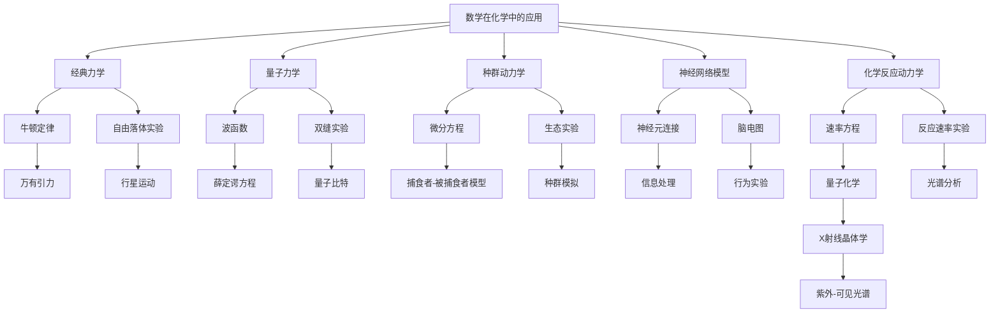

---

#### 第14章：数学知识在社会科学中的应用

数学在社会科学中的应用同样广泛，从经济学到心理学，数学模型和理论为研究人员提供了强有力的工具，以分析和预测社会行为和趋势。本章将探讨数学在经济学、社会学和心理学中的应用，以及这些应用如何通过数据分析来验证其有效性。

**14.1 数学在经济学中的应用**

- **供需模型**

  经济学中的供需模型用于分析商品和服务的价格与数量之间的关系。这些模型通过曲线描述供需关系，帮助经济学家预测市场变化。

  **数据分析**：

  - **市场数据**：通过对市场价格、需求和供给的统计数据进行分析，验证供需模型的有效性。
  - **回归分析**：使用回归分析方法，评估供需曲线的斜率和截距，从而验证模型参数。

- **宏观经济模型**

  宏观经济模型用于分析整个经济体系的运行，包括国民收入、通货膨胀、失业率等指标。这些模型通过宏观经济学理论，描述经济变量的相互关系。

  **数据分析**：

  - **时间序列分析**：通过对经济指标的时间序列数据进行分析，验证宏观经济模型对经济趋势的预测能力。
  - **协整分析**：使用协整分析方法，验证经济变量之间的长期稳定关系。

**14.2 数学在社会学中的应用**

- **社会网络分析**

  社会网络分析通过图论方法研究个体之间的社会关系。这些模型可以揭示社会结构的特征，如社区结构、传播过程等。

  **数据分析**：

  - **网络数据**：通过对社会网络的数据进行分析，验证社会网络模型对个体行为的预测能力。
  - **网络分析工具**：使用网络分析工具（如Gephi、Cytoscape等），对网络结构进行可视化分析，从而验证模型的有效性。

- **行为模型**

  社会行为模型用于研究个体在社会环境中的行为。这些模型通过统计方法和模拟实验，分析个体行为的动机和影响因素。

  **数据分析**：

  - **问卷调查**：通过对问卷调查数据进行分析，验证行为模型对个体行为的预测能力。
  - **实验设计**：通过实验室实验，验证行为模型在控制条件下的有效性。

**14.3 数学在心理学中的应用**

- **心理测量学**

  心理测量学使用数学方法测量个体的心理特征，如智力、人格、情绪等。这些测量方法通过量表、问卷和实验设计，评估个体的心理状态。

  **数据分析**：

  - **量表分析**：通过对量表数据进行统计分析，验证心理测量工具的信度和效度。
  - **实验结果**：通过实验数据分析，验证心理理论模型对个体行为的预测能力。

- **认知心理学**

  认知心理学使用数学模型研究人类的认知过程，如记忆、注意力、决策等。这些模型通过计算方法和模拟实验，揭示认知过程的机制。

  **数据分析**：

  - **认知实验**：通过对认知实验结果的数据分析，验证认知心理学模型的预测能力。
  - **计算模型**：使用计算模型对认知过程进行模拟，验证模型在解释实验结果中的作用。

**14.4 数学模型在社会科学中的应用挑战**

尽管数学模型在社会科学中具有广泛的应用，但也面临一些挑战。

- **数据可靠性**：

  社会科学数据可能受到多种因素的影响，如主观性、噪声等，影响模型预测的准确性。

- **模型复杂度**：

  社会科学问题通常涉及多个变量和复杂的相互作用，构建和验证复杂模型需要大量的计算资源和专业知识。

- **社会变化**：

  社会环境不断变化，数学模型需要不断调整和更新，以适应新的社会现实。

通过本章的讨论，我们了解了数学在社会科学中的应用及其通过数据分析的有效性。数学模型不仅为社会科学研究提供了工具，也为政策制定和实际应用提供了指导。在未来的研究中，数学将继续与社会科学相结合，推动社会进步和人类福祉。

---

**数学知识在社会科学中的应用**

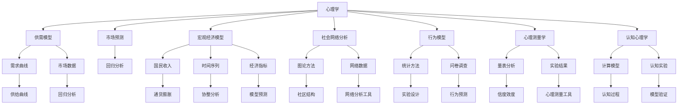

---

#### 第15章：数学知识在现代社会中的影响

数学作为一门基础学科，在现代社会中扮演着至关重要的角色。它不仅推动了科学技术的发展，也深刻影响了经济、教育和社会进步。本章将探讨数学在现代社会中的广泛影响，以及它如何成为科技进步和经济增长的驱动力。

**15.1 数学在科技进步中的作用**

- **科技创新的基石**

  数学为科技创新提供了理论基础和工具。从物理学到计算机科学，数学模型和算法被广泛应用于研究和开发新技术。

  - **物理学**：经典力学、量子力学和相对论等物理学理论都建立在数学基础上。数学方程和公式描述了自然界的规律，帮助科学家们理解和预测物理现象。

  - **计算机科学**：算法和数据结构是计算机科学的核心。高效的算法设计依赖于数学理论和优化方法，如动态规划、贪心算法和分治算法。

- **工程技术的推动**

  数学在工程技术的各个领域中都发挥着关键作用，从建筑设计到航空航天，数学模型帮助工程师们优化设计、预测性能。

  - **建筑设计**：结构工程中的力学分析依赖于数学公式，确保建筑物安全稳固。

  - **航空航天**：流体力学和空气动力学中的数学模型帮助工程师设计更高效的飞机和航天器。

- **新兴技术的驱动**

  人工智能、机器学习和大数据等新兴技术离不开数学的支持。数学方法在算法设计、模型训练和数据分析中起着核心作用。

  - **人工智能**：神经网络和深度学习算法依赖于数学理论，通过训练模型实现图像识别、语音识别和自然语言处理等功能。

  - **大数据**：统计学和概率论在数据分析中起着关键作用，帮助从海量数据中提取有价值的信息。

**15.2 数学在经济增长中的作用**

- **经济分析和预测**

  数学在经济学中的应用帮助经济学家分析市场行为、预测经济趋势。数学模型和算法在宏观经济管理、金融投资和资源优化中发挥着重要作用。

  - **宏观经济管理**：通过经济模型和计量经济学方法，政策制定者可以更好地理解经济动态，制定有效的经济政策。

  - **金融投资**：数学模型在金融市场中广泛应用，如期权定价模型、风险模型和投资组合优化。

- **产业升级和创新发展**

  数学为产业升级和创新发展提供了技术支持。数学模型和算法在智能制造、智能制造和生物医药等领域推动着产业变革。

  - **智能制造**：通过优化算法和仿真模型，智能制造实现了生产过程的自动化和智能化，提高了生产效率和产品质量。

  - **生物医药**：数学模型和计算生物学方法在药物设计、基因组学和疾病预测中发挥着重要作用，推动了生物医药的发展。

**15.3 数学对教育和社会进步的影响**

- **教育改革**

  数学教育是培养创新人才的关键。现代教育改革注重培养学生的数学思维能力和解决问题的能力，推动教育质量的提升。

  - **STEM教育**：STEM（科学、技术、工程和数学）教育模式强调跨学科融合，培养学生的创新能力和实践能力。

  - **个性化教育**：利用大数据和数学模型，个性化教育可以为学生提供更合适的学习路径和资源，提高学习效果。

- **社会进步**

  数学在社会进步中发挥着重要作用。数学方法和模型被广泛应用于社会问题的解决，如城市规划、环境保护和社会治理。

  - **城市规划**：通过数学模型和数据分析，城市规划者可以优化交通流量、资源分配和环境保护。

  - **社会治理**：数学方法和算法在公共安全管理、应急响应和智慧城市建设中发挥着关键作用，提高了社会治理的效率和水平。

通过本章的讨论，我们了解到数学在现代社会中的广泛影响。数学不仅是科技进步和经济增长的驱动力，也是教育和社会进步的重要工具。在未来的发展中，数学将继续发挥其重要作用，推动人类社会向更加智能和高效的方向发展。

---

**数学在现代社会中的影响**

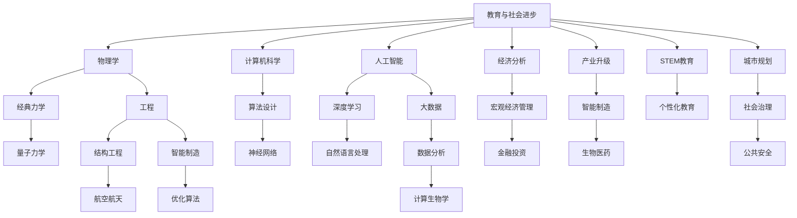

---

#### 第16章：数学与经验主义在现代社会中的影响

数学与经验主义作为两种不同的知识获取方式，在现代社会中扮演着重要角色。数学以其逻辑严密和抽象性，提供了理论框架和工具；而经验主义则通过实证数据和观察，为理论提供了实际依据。本章将探讨数学与经验主义在现代社会中的广泛影响，以及它们如何共同推动科技进步和社会发展。

**16.1 数学在现代社会中的影响**

- **科学研究的基础**

  数学作为科学研究的基石，为自然科学、工程学和社会科学提供了理论模型和计算工具。数学的严谨性和普适性使其能够精确描述自然现象和社会规律。

  - **自然科学**：物理学、生物学、化学等科学领域都依赖数学模型和理论来解释自然现象，如牛顿力学、DNA结构、化学反应等。

  - **工程学**：数学在工程学中应用广泛，如结构力学、热力学、电子工程等，通过数学模型优化设计和性能分析。

- **技术创新的驱动力**

  数学在技术创新中发挥着关键作用。从计算机算法到人工智能，数学方法为技术创新提供了理论基础和工具。

  - **计算机科学**：算法和数据结构是计算机科学的核心，通过数学分析优化算法性能。

  - **人工智能**：神经网络、机器学习算法等依赖于数学理论，用于图像识别、自然语言处理等领域。

**16.2 经验主义在现代社会中的影响**

- **实证研究的依据**

  经验主义强调通过实证研究和观察获取知识，为科学理论和实践提供了实际依据。经验主义的方法包括实验、观察和数据分析，这些方法在医学、社会科学和工程学等领域有着广泛应用。

  - **医学**：通过临床试验和观察研究，验证药物疗效和治疗方法的有效性。

  - **社会科学**：通过社会调查和实验，分析社会行为和趋势，为政策制定提供依据。

- **技术创新的实践基础**

  经验主义在技术创新中的应用，使得工程师和科学家能够通过实验和测试，不断改进和优化技术。

  - **工程学**：通过实验验证设计方案的可行性，如航空航天器的测试和优化。

  - **计算机科学**：通过实验和测试，改进软件和硬件的性能。

**16.3 数学与经验主义的结合**

数学与经验主义的结合是现代社会发展的关键。两者相辅相成，共同推动科技进步和社会进步。

- **科学研究的方法**

  数学与经验主义在科学研究中的应用，形成了科学方法论。科学研究不仅依赖于数学理论，还需要通过实证研究验证理论的有效性。

  - **假设验证**：科学家通过建立数学模型提出假设，然后通过实验验证假设的正确性。

  - **模型修正**：在实验验证中，如果理论预测与实际结果不符，科学家会修正数学模型，以提高预测的准确性。

- **技术创新的过程**

  数学与经验主义在技术创新中的应用，形成了创新方法论。技术创新不仅需要理论指导，还需要通过实验和测试验证技术方案的可行性。

  - **研发过程**：在研发过程中，科学家和工程师通过数学模型和实验测试，逐步改进和优化技术。

  - **迭代开发**：通过不断的实验和测试，技术方案不断迭代和优化，最终实现技术突破。

**16.4 数学与经验主义对社会发展的推动**

数学与经验主义在现代社会中发挥着重要作用，推动了科技进步和社会发展。

- **经济增长**

  数学与经验主义在经济学中的应用，帮助经济学家分析市场行为、预测经济趋势，从而制定有效的经济政策。数学模型在金融投资和资源配置中发挥着关键作用，推动了经济增长。

- **社会发展**

  数学与经验主义在社会发展中的应用，促进了教育改革、社会管理和环境保护。数学方法和工具被广泛应用于社会问题的解决，提高了社会治理的效率和水平。

通过本章的讨论，我们了解了数学与经验主义在现代社会中的广泛影响。数学与经验主义的结合，不仅推动了科技进步，也促进了社会发展和人类福祉。在未来的发展中，数学与经验主义将继续相互融合，共同推动人类社会向更加智能和高效的方向发展。

---

**数学与经验主义在现代社会中的影响**

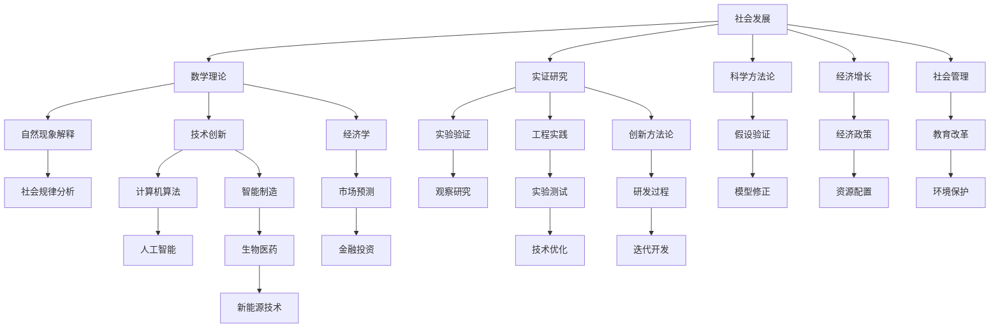

---

#### 第17章：数学与经验主义的未来展望

随着科技的不断进步和社会的快速发展，数学与经验主义将继续在各个领域发挥重要作用。本章将探讨数学与经验主义的未来发展趋势、新兴领域以及它们在科学研究和技术创新中的应用前景。

**17.1 数学与经验主义的未来发展趋势**

- **量子数学的发展**

  量子数学作为数学与物理学的交叉领域，将在未来继续发展。量子数学的研究将推动量子计算、量子通信和量子信息科学的发展，为解决复杂问题提供新的工具和方法。

- **计算数学的进步**

  随着计算能力的提升和算法的进步，计算数学将在解决大规模计算问题、优化问题和模拟现实世界现象方面取得新的突破。计算数学的进步将推动人工智能、机器学习和数据科学的发展。

- **大数据与数学的结合**

  大数据的广泛应用将推动数学与统计学的结合，从海量数据中提取有价值的信息和模式。大数据与数学的结合将推动决策科学、社会科学和商业分析的发展。

**17.2 新兴领域的探索**

- **生物信息学**

  生物信息学是数学与生物学的交叉领域，通过数学模型和算法分析生物数据，研究基因表达、蛋白质结构和生物网络。生物信息学的发展将推动个性化医疗、基因编辑和生物制药的发展。

- **环境数学**

  环境数学研究人类活动对环境的影响，通过数学模型预测环境变化和评估生态系统的稳定性。环境数学的发展将推动可持续发展和环境保护。

**17.3 数学与经验主义在科学研究和技术创新中的应用**

- **人工智能与机器学习**

  人工智能和机器学习的发展离不开数学与经验主义。数学提供了算法和优化方法，经验主义提供了大量数据和实际应用场景。未来，人工智能将更加智能化，应用于自动驾驶、智能医疗和智能家居等领域。

- **生物科技**

  生物科技的发展将依赖于数学与经验主义的结合。数学模型将用于基因编辑、药物设计和生物系统模拟，经验主义将提供实验数据和实际应用场景，推动生物科技的创新和发展。

- **金融科技**

  金融科技的发展将依赖于数学与经验主义的结合。数学模型将用于风险评估、市场预测和算法交易，经验主义将提供市场数据和实际操作经验，推动金融科技的创新和进步。

**17.4 数学与经验主义对未来的影响**

数学与经验主义在未来将继续推动科学技术的进步和社会的发展。

- **科技进步**

  数学与经验主义将推动人工智能、生物科技、环境科学等新兴领域的发展，为解决全球性问题提供新的思路和方法。

- **社会进步**

  数学与经验主义将推动教育改革、社会治理和经济发展，提高社会的效率和公平性。

- **人类福祉**

  数学与经验主义将改善人们的生活质量，提高医疗保健水平，促进可持续发展。

通过本章的讨论，我们了解到数学与经验主义在未来的发展趋势和新兴领域。随着科技的不断进步和社会的快速发展，数学与经验主义将继续为科学研究和技术创新提供新的动力，推动人类社会的进步。

---

**数学与经验主义的未来展望**

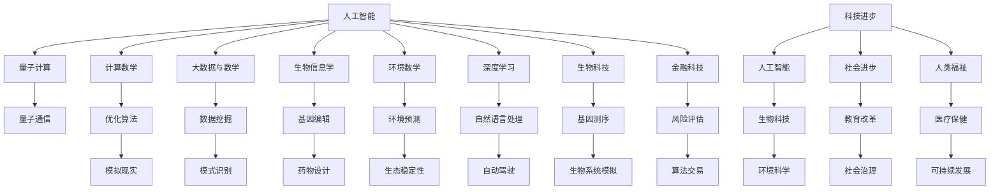

---

#### 第18章：数学与经验主义的交叉领域

数学与经验主义的交叉领域是现代科学研究和技术创新的驱动力。这两个领域的融合不仅推动了科学理论的进步，也促进了实际应用的创新。本章将探讨数学与经验主义在交叉领域中的应用，以及这些应用如何推动科学研究和实际问题的解决。

**18.1 数学在经验主义中的应用**

- **数据驱动模型**

  数据驱动模型是数学在经验主义中的典型应用。这些模型通过统计分析、机器学习和数据挖掘，从经验数据中提取有价值的信息和规律。

  - **应用领域**：在经济学、社会学、医学等领域，数据驱动模型被用于预测市场趋势、分析社会行为和诊断疾病。

  - **方法**：数据驱动模型包括回归分析、聚类分析、神经网络等，通过训练模型，使其能够对新的数据进行预测和分类。

- **概率论与统计方法**

  概率论和统计方法是数学在经验主义中的核心工具。这些方法用于分析数据、评估假设和进行假设检验。

  - **应用领域**：在自然科学、社会科学和工程学中，概率论和统计方法被广泛应用于实验设计、数据分析、风险评估等领域。

  - **方法**：常见的统计方法包括均值、方差、假设检验、置信区间等，通过这些方法，研究者可以评估数据的可靠性和有效性。

**18.2 经验主义在数学中的应用**

- **实验设计**

  实验设计是经验主义在数学中的重要应用。通过合理的实验设计，研究者可以控制变量、减少误差，从而获得可靠的实验结果。

  - **应用领域**：在物理学、化学、生物学等自然科学领域，实验设计被用于验证科学理论和开发新技术。

  - **方法**：常见的实验设计方法包括单因素实验、多因素实验、正交实验等，通过这些方法，研究者可以系统性地研究变量之间的关系。

- **数学模型验证**

  经验主义在数学模型中的应用，包括通过实验和实际应用来验证数学模型的准确性。

  - **应用领域**：在工程学、经济学、医学等领域，数学模型被广泛应用于模拟和预测实际现象。

  - **方法**：数学模型的验证包括模型校正、参数优化、交叉验证等，通过这些方法，研究者可以确保模型的可靠性和有效性。

**18.3 交叉领域的应用案例**

- **生物信息学**

  生物信息学是数学与经验主义在生命科学中的典型交叉领域。通过数学模型和统计方法，生物信息学家可以分析基因组数据、蛋白质结构和生物网络。

  - **应用领域**：在基因测序、药物设计、个性化医疗等领域，生物信息学发挥了重要作用。

  - **方法**：常见的生物信息学方法包括序列比对、基因表达分析、蛋白质结构预测等，通过这些方法，研究者可以深入理解生物系统的机制。

- **金融工程**

  金融工程是数学与经验主义在经济学中的交叉领域。通过数学模型和数据分析，金融工程师可以设计新的金融产品、进行风险评估和资产配置。

  - **应用领域**：在投资组合管理、风险管理、量化交易等领域，金融工程被广泛应用。

  - **方法**：常见的金融工程方法包括蒙特卡洛模拟、期权定价模型、风险平价策略等，通过这些方法，研究者可以优化投资决策。

通过本章的讨论，我们了解到数学与经验主义在交叉领域中的应用及其对科学研究和实际问题的推动作用。这些交叉领域的应用不仅提高了科学研究的效率，也为实际问题的解决提供了新的方法和思路。

---

**数学与经验主义的交叉领域**

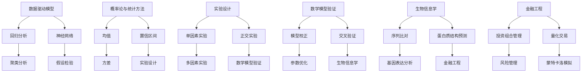

---

### 附录 A: 数学与经验主义的重要概念与术语表

为了帮助读者更好地理解本书中的关键概念和术语，我们提供了一个详细的术语表，包括数学和经验主义领域的核心术语及其解释。

**数学术语**

- **公理**：作为数学理论基础的无需证明的基本命题。
- **定理**：通过证明得出的数学命题。
- **证明**：使用逻辑推理证明某个数学命题的过程。
- **模型**：用数学语言描述现实世界的抽象结构。
- **算法**：解决问题的一系列明确步骤。
- **集合**：由确定的元素组成的整体。
- **函数**：一个集合到另一个集合的映射。
- **极限**：当变量趋近某个值时函数的值。
- **积分**：函数在某个区间上的累加。
- **导数**：函数在某一点的瞬时变化率。

**经验主义术语**

- **经验**：通过观察和实验获得的直接知识。
- **归纳推理**：从特定实例推导出一般结论的过程。
- **假设**：用于推导结论的初始命题。
- **实验设计**：用于收集数据以验证假设的方法。
- **变量**：在实验中可以变化的量。
- **控制变量**：在实验中保持不变的量。
- **观测**：通过感官收集信息。

**相关概念**

- **数据驱动模型**：基于经验数据进行构建和优化的模型。
- **逻辑推理**：基于逻辑规则从已知命题推导出新的命题。
- **验证**：通过实验、逻辑推理等方法验证理论或模型的有效性。
- **确认**：通过实验和实际应用验证模型的可重复性和可靠性。

