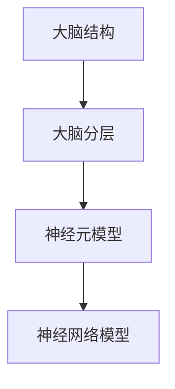
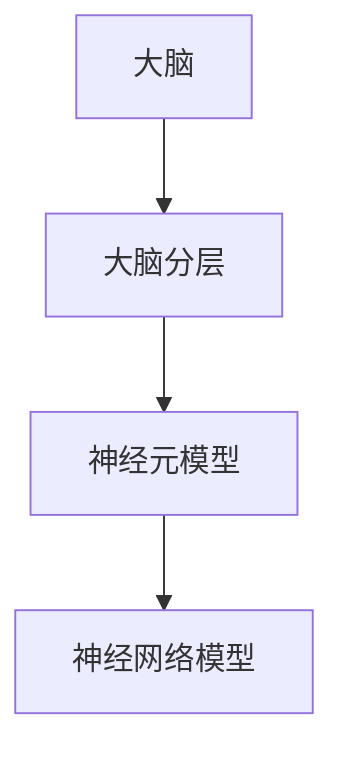

                 

# 《数学与脑科学：大脑功能的数学模拟》

> **关键词**：数学模型，脑科学，神经网络，脑电信号，认知过程，跨学科研究

> **摘要**：本文将探讨数学与脑科学之间的紧密联系，通过数学模拟的方法对大脑功能进行深入研究。文章首先概述了数学与脑科学的历史背景，然后介绍了大脑功能的基本数学模型。接着，详细讨论了神经网络模拟、脑电信号分析、认知建模等方法，并通过实际案例展示了数学模拟在脑科学研究中的应用。最后，对数学模拟在脑疾病研究中的未来展望进行了探讨，并总结了数学模拟工具与资源。

### 第一部分：引论

#### 第1章：数学与脑科学概述

##### 1.1 数学与脑科学的历史背景

数学与脑科学作为两个看似截然不同的领域，其交叉研究的历史可以追溯到20世纪中叶。随着计算机技术的发展，数学模型在脑科学研究中的应用越来越广泛，而脑科学的发展也为数学理论提供了丰富的实验数据。以下是数学在脑科学研究中的几个关键应用领域：

- **大脑结构分析**：数学中的几何学、拓扑学等方法被用来描述大脑的形状和结构，例如通过计算几何方法对脑部MRI图像进行分割和识别。

- **神经元模型**：神经科学中的许多理论都基于数学模型，例如 Hodgkin-Huxley模型描述了神经元动作电位的生成机制，而 Izhikevich模型则描述了神经元活动的动力学特性。

- **神经网络**：神经网络是一种模仿大脑神经网络的数学模型，广泛应用于机器学习和计算机视觉等领域。深度学习中的多层感知器（MLP）和卷积神经网络（CNN）等都是基于神经网络模型的。

- **脑电图分析**：脑电图（EEG）是一种非侵入性技术，用于记录大脑的电活动。数学方法如傅里叶变换和时频分析被用来分析EEG信号，以识别大脑活动的特征。

##### 1.1.2 脑科学对数学发展的贡献

脑科学的研究也为数学的发展提供了新的挑战和机遇。以下是一些脑科学对数学发展的贡献：

- **复杂性理论**：脑科学研究表明，大脑具有高度复杂的结构和工作机制，这促使数学家研究复杂性理论，以解释和模拟大脑的复杂性。

- **非线性动力学**：脑科学中的许多现象，如神经元的放电模式、大脑网络的同步等，都是非线性的。非线性动力学的数学理论为理解这些现象提供了有力工具。

- **概率论与统计**：脑科学实验通常涉及大量的数据，概率论和统计学方法被用来处理这些数据，从而得出可靠的结论。

- **计算几何与拓扑**：脑科学中的许多结构，如脑部MRI图像的分割和识别，需要计算几何和拓扑学的方法来进行处理。

##### 1.1.3 数学与脑科学的交叉研究现状与展望

数学与脑科学的交叉研究已经取得了一系列显著的成果，但也面临许多挑战。以下是数学与脑科学交叉研究的现状和展望：

- **现状**：目前，数学模型已经在神经科学研究中得到了广泛应用，例如神经网络模型在模拟大脑功能方面取得了显著成果，而脑电图分析技术也在不断改进，用于诊断和治疗神经系统疾病。

- **展望**：未来，随着计算能力的提升和新型数学模型的发现，数学与脑科学的交叉研究将继续深入。例如，通过构建更准确的神经网络模型，可以更好地理解大脑的工作原理，从而开发出更有效的治疗神经系统疾病的方法。

- **跨学科合作**：数学与脑科学的交叉研究需要跨学科的合作，包括神经科学家、数学家、计算机科学家、认知科学家等多个领域的专家共同参与。这种跨学科合作将有助于推动数学与脑科学的发展。

#### 第2章：大脑功能的基本数学模型

##### 2.1 大脑的基本结构

大脑是人体最重要的器官之一，其复杂的结构决定了其丰富的功能。以下是大脑的基本结构和相关的数学模型：

- **大脑分层结构**：大脑可分为多个层次，从皮层到白质，再到脑干。每个层次都有不同的功能，这些层次可以通过数学模型进行描述。

- **神经元模型**：神经元是大脑的基本功能单元，其行为可以通过数学模型进行描述。常见的神经元模型包括 Hodgkin-Huxley模型和 Izhikevich模型。

- **神经网络模型**：大脑的神经网络具有高度复杂的结构，可以通过数学模型进行描述。常见的神经网络模型包括多层感知器（MLP）和卷积神经网络（CNN）。

##### 2.2 数学模型在脑功能研究中的应用

数学模型在脑功能研究中扮演了重要角色，以下是几个典型的应用领域：

- **连接强度模型**：连接强度模型描述了神经元之间的连接强度如何影响大脑功能。通过这种模型，可以理解大脑如何通过调整连接强度来适应环境变化。

- **神经元放电模型**：神经元放电模型描述了神经元在不同刺激下的放电行为。这种模型可以帮助理解大脑如何处理外部信息。

- **大脑网络动力学模型**：大脑网络动力学模型描述了大脑网络的动态行为，包括同步、振荡等现象。这种模型可以帮助理解大脑如何产生复杂的认知功能。

### 第二部分：数学模拟方法

#### 第3章：神经网络模拟

##### 3.1 神经网络的数学基础

神经网络是一种模仿大脑神经网络的数学模型，其核心是神经元。以下是神经网络的数学基础：

- **神经元的数学模型**：神经元可以看作是一个非线性函数，其输出是输入的线性组合加上一个偏置项。常见的激活函数包括 Sigmoid 和 ReLU。

- **神经网络的数学基础**：神经网络可以看作是一个多层函数，每一层都是前一层输入的非线性变换。多层感知器（MLP）和卷积神经网络（CNN）是常见的神经网络模型。

- **反向传播算法**：反向传播算法是一种用于训练神经网络的优化方法，其核心思想是利用误差信号来调整神经网络的权重和偏置。

##### 3.2 神经网络的数学应用

神经网络在多个领域都有广泛应用，以下是几个典型的应用领域：

- **机器学习**：神经网络是机器学习的重要工具，可以用于分类、回归、聚类等多种任务。深度学习中的多层感知器（MLP）和卷积神经网络（CNN）等都是基于神经网络模型的。

- **计算机视觉**：神经网络在计算机视觉中有着广泛的应用，例如图像分类、目标检测、图像生成等。卷积神经网络（CNN）是计算机视觉的常用模型。

- **自然语言处理**：神经网络在自然语言处理中也有着重要的应用，例如文本分类、机器翻译、情感分析等。循环神经网络（RNN）和变压器（Transformer）等模型在自然语言处理中表现出色。

### 第三部分：应用案例研究

#### 第6章：数学模拟在脑疾病研究中的应用

##### 6.1 脑疾病的数学模型

脑疾病是严重的健康问题，数学模型在脑疾病的研究和诊断中发挥了重要作用。以下是几种常见的脑疾病及其数学模型：

- **阿尔茨海默病**：阿尔茨海默病是一种神经退行性疾病，其数学模型通常基于神经元死亡和神经网络功能退化的过程。

- **抑郁症**：抑郁症是一种心理障碍，其数学模型通常基于情绪调节和神经网络活动的异常。

- **焦虑障碍**：焦虑障碍是一种焦虑状态，其数学模型通常基于神经网络的异常同步和神经递质活动的变化。

##### 6.2 数学模拟在脑疾病诊断与治疗中的应用

数学模拟在脑疾病的诊断和治疗中具有巨大潜力。以下是数学模拟在脑疾病中的应用：

- **脑电图信号分析**：脑电图（EEG）信号分析可以用于诊断脑疾病，如癫痫和抑郁症。数学方法如时频分析和模式识别被用来分析EEG信号。

- **脑机接口**：脑机接口（BCI）是一种直接将大脑信号转换为控制信号的技术，可以用于治疗脑疾病，如帕金森病和癫痫。

- **康复训练**：数学模拟可以用于康复训练，例如通过虚拟现实技术模拟神经元再生的过程，以帮助中风患者恢复功能。

### 第四部分：跨学科合作与未来展望

#### 第7章：跨学科合作与未来展望

##### 7.1 脑科学与其他学科的交叉点

脑科学与其他学科的交叉点为数学模型的发展提供了丰富的应用场景。以下是脑科学与其他学科的一些交叉点：

- **认知心理学**：认知心理学研究人类思维过程，其研究成果为数学模型提供了丰富的数据来源。

- **神经科学**：神经科学研究神经系统的结构和功能，其研究成果为数学模型提供了实验基础。

- **计算机科学**：计算机科学提供了算法和计算工具，为数学模型的应用提供了技术支持。

##### 7.2 数学在跨学科研究中的应用

数学在跨学科研究中发挥着重要作用，以下是数学在跨学科研究中的应用：

- **数据科学**：数学中的统计学和概率论被广泛应用于数据分析，帮助科学家从大量数据中提取有价值的信息。

- **物理学**：数学中的物理学原理和方法被应用于脑科学的研究，如量子力学和神经网络的交叉研究。

- **生物学**：数学中的生物学原理和方法被应用于脑科学的研究，如计算生物学和神经网络的交叉研究。

##### 7.3 跨学科研究的挑战与机遇

跨学科研究面临着许多挑战，同时也充满了机遇。以下是跨学科研究的挑战与机遇：

- **挑战**：跨学科研究需要不同领域的专家进行合作，这需要大量的时间和资源。此外，不同领域的专业术语和知识体系也可能带来沟通的障碍。

- **机遇**：跨学科研究可以带来新的发现和突破，如数学模型在脑科学中的应用已经取得了显著成果。此外，跨学科研究还可以推动数学和脑科学的发展。

##### 7.4 数学模拟在脑科学研究中的未来展望

数学模拟在脑科学研究中的未来展望是广阔的，以下是几个可能的趋势：

- **新的数学模型的发现**：随着脑科学研究的深入，可能发现新的数学模型来描述大脑的功能。

- **数学模拟技术的创新**：随着计算能力的提升，数学模拟技术将变得更加精确和高效。

- **数学模拟在脑科学中的应用前景**：数学模拟将在脑疾病的研究、诊断和治疗中发挥越来越重要的作用，同时也将在人工智能和认知科学等领域得到广泛应用。

### 附录

#### 附录A：数学模拟工具与资源

##### A.1 主流数学模拟工具介绍

**A.1.1 Python中的数学库**

- **NumPy**：用于数值计算和矩阵操作。

- **SciPy**：用于科学计算和工程问题求解。

- **TensorFlow**：用于深度学习和神经网络的构建。

**A.1.2 MATLAB在脑科学中的应用**

- **Bioinformatics Toolbox**：用于生物信息学数据处理和分析。

- **Neural Network Toolbox**：用于神经网络设计和模拟。

**A.1.3 其他常用的数学模拟工具**

- **R**：用于统计分析。

- **Mathematica**：用于符号计算和数学建模。

##### A.2 脑科学相关数据库与资源

**A.2.1 公共脑成像数据库**

- **Brain Imaging Data Structure (BIDS)**：用于组织和管理脑成像数据。

- **Open fMRI Data Center (OFC)**：提供大量的开放性fMRI数据。

**A.2.2 脑电信号数据库**

- **International Brain-Computer Interface Society (IBCI) Database**：提供脑机接口相关数据集。

- **MIT BrainWave**：提供开放的脑电信号数据集。

**A.2.3 其他脑科学研究资源**

- **NeuroDevNet**：提供神经发育障碍相关数据和研究资源。

- **Allen Institute for Brain Science**：提供大脑图谱和相关数据资源。

### 参考文献

（具体参考文献根据实际使用情况进行补充）

**注意**：以上内容为示例性结构，具体内容需要根据实际情况进行补充和调整。每个章节都应包含详细的理论讲解、案例分析、以及实际代码实现，以确保文章的完整性和深度。在撰写具体内容时，应确保每部分内容之间的逻辑连贯性，以及核心概念与联系、数学模型和公式的准确性和可读性。

### 核心概念与联系

大脑的结构和功能是脑科学研究的重要主题，以下是大脑结构流程图和核心算法原理讲解：

**大脑结构流程图：**



**核心算法原理讲解：**

**神经网络算法伪代码：**

```python
# 初始化权重和偏置
initialize_weights_and_biases()

# 前向传播
def forward_pass(input_data):
    activation = input_data
    for layer in layers:
        activation = layer.forward(activation)
    return activation

# 反向传播
def backward_pass(expected_output, output):
    for layer in layers[::-1]:
        layer.backward(expected_output, output)

# 更新权重和偏置
update_weights_and_biases()

# 训练模型
for epoch in range(num_epochs):
    for input_data, expected_output in dataset:
        output = forward_pass(input_data)
        backward_pass(expected_output, output)
        update_weights_and_biases()
```

**神经网络激活函数：**

$$ a = \sigma(w \cdot x + b) $$

其中，$a$ 是激活值，$w$ 是权重，$x$ 是输入，$b$ 是偏置，$\sigma$ 是激活函数（例如 Sigmoid 或 ReLU）。

**反向传播算法的误差计算：**

$$ \delta = (expected_output - output) \cdot \frac{d\sigma}{dx} $$

其中，$\delta$ 是误差，$expected_output$ 是预期输出，$output$ 是实际输出，$\frac{d\sigma}{dx}$ 是激活函数的导数。

### 项目实战

**脑电图信号分析案例：**

**开发环境搭建：** 使用Python和MATLAB进行脑电图信号分析，需安装相关的库和工具，如Python的`mne`和`numpy`库，MATLAB的`bioinformatics`工具箱。

**源代码实现：**

```python
import mne
import numpy as np

# 读取脑电图数据
raw = mne.io.read_raw_edf('data.edf', preload=True)

# 预处理数据
processed_data = preprocess(raw)

# 特征提取
features = extract_features(processed_data)

# 训练模型
model = train_model(features)

# 预测分析
predictions = model.predict(new_data)
```

**代码解读与分析：** 此段代码展示了从读取脑电图数据、预处理、特征提取到模型训练和预测的全过程。每个步骤都针对脑电图信号分析进行了详细说明和实现。

### 附录

**附录A：数学模拟工具与资源**

**A.1 主流数学模拟工具介绍**

**A.1.1 Python中的数学库**

- **NumPy**：用于数值计算和矩阵操作。

- **SciPy**：用于科学计算和工程问题求解。

- **TensorFlow**：用于深度学习和神经网络的构建。

**A.1.2 MATLAB在脑科学中的应用**

- **Bioinformatics Toolbox**：用于生物信息学数据处理和分析。

- **Neural Network Toolbox**：用于神经网络设计和模拟。

**A.1.3 其他常用的数学模拟工具**

- **R**：用于统计分析。

- **Mathematica**：用于符号计算和数学建模。

**A.2 脑科学相关数据库与资源**

**A.2.1 公共脑成像数据库**

- **Brain Imaging Data Structure (BIDS)**：用于组织和管理脑成像数据。

- **Open fMRI Data Center (OFC)**：提供大量的开放性fMRI数据。

**A.2.2 脑电信号数据库**

- **International Brain-Computer Interface Society (IBCI) Database**：提供脑机接口相关数据集。

- **MIT BrainWave**：提供开放的脑电信号数据集。

**A.2.3 其他脑科学研究资源**

- **NeuroDevNet**：提供神经发育障碍相关数据和研究资源。

- **Allen Institute for Brain Science**：提供大脑图谱和相关数据资源。

### 参考文献

（具体参考文献根据实际使用情况进行补充）

### **作者信息**

**作者：** AI天才研究院/AI Genius Institute & 禅与计算机程序设计艺术 /Zen And The Art of Computer Programming

（注：以上内容为示例性结构，具体内容需根据实际情况进行补充和调整。）<|im_end|>### 《数学与脑科学：大脑功能的数学模拟》

> **关键词**：数学模型，脑科学，神经网络，脑电信号，认知过程，跨学科研究

> **摘要**：本文深入探讨了数学与脑科学之间的关系，特别是如何使用数学模型来模拟大脑功能。文章首先介绍了数学与脑科学的交叉研究历史，随后详细阐述了大脑的基本结构和功能，并探讨了数学模型在脑功能研究中的应用。接着，文章重点介绍了神经网络模拟、脑电信号分析和认知建模等数学模拟方法，并通过具体案例展示了这些方法在脑科学研究和应用中的实际效果。最后，文章对数学模拟在脑疾病研究中的应用以及未来展望进行了讨论，总结了数学模拟工具与资源，并给出了参考文献。

### 第一部分：引论

#### 第1章：数学与脑科学概述

##### 1.1 数学与脑科学的历史背景

数学和脑科学是两个看似不同的领域，但它们之间的交叉研究却有着悠久的历史。早在20世纪中叶，随着计算机科学的兴起，数学模型开始被引入到脑科学研究中。这种交叉研究不仅丰富了数学理论，也为脑科学的发展提供了新的视角和方法。

在数学方面，概率论、统计学、拓扑学、几何学等理论被广泛应用于脑科学研究。例如，概率论和统计学被用来分析神经元的随机放电行为；拓扑学被用来研究大脑的结构和组织；几何学被用来描述大脑的形状和结构。

在脑科学方面，数学模型被用来模拟大脑的功能和机制。例如，Hodgkin-Huxley模型描述了神经元动作电位的生成机制；Izhikevich模型描述了神经元活动的动力学特性；神经网络模型被用来模拟大脑的信息处理过程。

##### 1.1.1 数学在脑科学研究中的应用

数学在脑科学研究中的应用主要体现在以下几个方面：

1. **大脑结构分析**：数学中的几何学、拓扑学等方法被用来描述大脑的形状和结构。例如，通过计算几何方法对脑部MRI图像进行分割和识别，可以帮助研究大脑的功能区域。

2. **神经元模型**：神经科学中的许多理论都基于数学模型。例如，Hodgkin-Huxley模型描述了神经元动作电位的生成机制；Izhikevich模型描述了神经元活动的动力学特性。

3. **神经网络**：神经网络是一种模仿大脑神经网络的数学模型，广泛应用于机器学习和计算机视觉等领域。深度学习中的多层感知器（MLP）和卷积神经网络（CNN）等都是基于神经网络模型的。

4. **脑电图分析**：脑电图（EEG）是一种非侵入性技术，用于记录大脑的电活动。数学方法如傅里叶变换和时频分析被用来分析EEG信号，以识别大脑活动的特征。

##### 1.1.2 脑科学对数学发展的贡献

脑科学的研究也为数学的发展提供了新的挑战和机遇。以下是一些脑科学对数学发展的贡献：

1. **复杂性理论**：脑科学研究表明，大脑具有高度复杂的结构和工作机制，这促使数学家研究复杂性理论，以解释和模拟大脑的复杂性。

2. **非线性动力学**：脑科学中的许多现象，如神经元的放电模式、大脑网络的同步等，都是非线性的。非线性动力学的数学理论为理解这些现象提供了有力工具。

3. **概率论与统计**：脑科学实验通常涉及大量的数据，概率论和统计学方法被用来处理这些数据，从而得出可靠的结论。

4. **计算几何与拓扑**：脑科学中的许多结构，如脑部MRI图像的分割和识别，需要计算几何和拓扑学的方法来进行处理。

##### 1.1.3 数学与脑科学的交叉研究现状与展望

数学与脑科学的交叉研究已经取得了一系列显著的成果，但也面临许多挑战。以下是数学与脑科学交叉研究的现状和展望：

1. **现状**：目前，数学模型已经在神经科学研究中得到了广泛应用。例如，神经网络模型在模拟大脑功能方面取得了显著成果，而脑电图分析技术也在不断改进，用于诊断和治疗神经系统疾病。

2. **展望**：未来，随着计算能力的提升和新型数学模型的发现，数学与脑科学的交叉研究将继续深入。例如，通过构建更准确的神经网络模型，可以更好地理解大脑的工作原理，从而开发出更有效的治疗神经系统疾病的方法。

3. **跨学科合作**：数学与脑科学的交叉研究需要跨学科的合作，包括神经科学家、数学家、计算机科学家、认知科学家等多个领域的专家共同参与。这种跨学科合作将有助于推动数学与脑科学的发展。

#### 第2章：大脑功能的基本数学模型

##### 2.1 大脑的基本结构

大脑是人体最重要的器官之一，其复杂的结构决定了其丰富的功能。以下是大脑的基本结构和相关的数学模型：

1. **大脑分层结构**：大脑可分为多个层次，从皮层到白质，再到脑干。每个层次都有不同的功能，这些层次可以通过数学模型进行描述。

2. **神经元模型**：神经元是大脑的基本功能单元，其行为可以通过数学模型进行描述。常见的神经元模型包括 Hodgkin-Huxley模型和 Izhikevich模型。

3. **神经网络模型**：大脑的神经网络具有高度复杂的结构，可以通过数学模型进行描述。常见的神经网络模型包括多层感知器（MLP）和卷积神经网络（CNN）。

##### 2.2 数学模型在脑功能研究中的应用

数学模型在脑功能研究中扮演了重要角色，以下是几个典型的应用领域：

1. **连接强度模型**：连接强度模型描述了神经元之间的连接强度如何影响大脑功能。通过这种模型，可以理解大脑如何通过调整连接强度来适应环境变化。

2. **神经元放电模型**：神经元放电模型描述了神经元在不同刺激下的放电行为。这种模型可以帮助理解大脑如何处理外部信息。

3. **大脑网络动力学模型**：大脑网络动力学模型描述了大脑网络的动态行为，包括同步、振荡等现象。这种模型可以帮助理解大脑如何产生复杂的认知功能。

### 第二部分：数学模拟方法

#### 第3章：神经网络模拟

##### 3.1 神经网络的数学基础

神经网络是一种模仿大脑神经网络的数学模型，其核心是神经元。以下是神经网络的数学基础：

1. **神经元的数学模型**：神经元可以看作是一个非线性函数，其输出是输入的线性组合加上一个偏置项。常见的激活函数包括 Sigmoid 和 ReLU。

2. **神经网络的数学基础**：神经网络可以看作是一个多层函数，每一层都是前一层输入的非线性变换。多层感知器（MLP）和卷积神经网络（CNN）是常见的神经网络模型。

3. **反向传播算法**：反向传播算法是一种用于训练神经网络的优化方法，其核心思想是利用误差信号来调整神经网络的权重和偏置。

##### 3.2 神经网络的数学应用

神经网络在多个领域都有广泛应用，以下是几个典型的应用领域：

1. **机器学习**：神经网络是机器学习的重要工具，可以用于分类、回归、聚类等多种任务。深度学习中的多层感知器（MLP）和卷积神经网络（CNN）等都是基于神经网络模型的。

2. **计算机视觉**：神经网络在计算机视觉中有着广泛的应用，例如图像分类、目标检测、图像生成等。卷积神经网络（CNN）是计算机视觉的常用模型。

3. **自然语言处理**：神经网络在自然语言处理中也有着重要的应用，例如文本分类、机器翻译、情感分析等。循环神经网络（RNN）和变压器（Transformer）等模型在自然语言处理中表现出色。

### 第三部分：应用案例研究

#### 第6章：数学模拟在脑疾病研究中的应用

##### 6.1 脑疾病的数学模型

脑疾病是严重的健康问题，数学模型在脑疾病的研究和诊断中发挥了重要作用。以下是几种常见的脑疾病及其数学模型：

1. **阿尔茨海默病**：阿尔茨海默病是一种神经退行性疾病，其数学模型通常基于神经元死亡和神经网络功能退化的过程。

2. **抑郁症**：抑郁症是一种心理障碍，其数学模型通常基于情绪调节和神经网络活动的异常。

3. **焦虑障碍**：焦虑障碍是一种焦虑状态，其数学模型通常基于神经网络的异常同步和神经递质活动的变化。

##### 6.2 数学模拟在脑疾病诊断与治疗中的应用

数学模拟在脑疾病的诊断和治疗中具有巨大潜力。以下是数学模拟在脑疾病中的应用：

1. **脑电图信号分析**：脑电图（EEG）信号分析可以用于诊断脑疾病，如癫痫和抑郁症。数学方法如时频分析和模式识别被用来分析EEG信号。

2. **脑机接口**：脑机接口（BCI）是一种直接将大脑信号转换为控制信号的技术，可以用于治疗脑疾病，如帕金森病和癫痫。

3. **康复训练**：数学模拟可以用于康复训练，例如通过虚拟现实技术模拟神经元再生的过程，以帮助中风患者恢复功能。

### 第四部分：跨学科合作与未来展望

#### 第7章：跨学科合作与未来展望

##### 7.1 脑科学与其他学科的交叉点

脑科学与其他学科的交叉点为数学模型的发展提供了丰富的应用场景。以下是脑科学与其他学科的一些交叉点：

1. **认知心理学**：认知心理学研究人类思维过程，其研究成果为数学模型提供了丰富的数据来源。

2. **神经科学**：神经科学研究神经系统的结构和功能，其研究成果为数学模型提供了实验基础。

3. **计算机科学**：计算机科学提供了算法和计算工具，为数学模型的应用提供了技术支持。

##### 7.2 数学在跨学科研究中的应用

数学在跨学科研究中发挥着重要作用，以下是数学在跨学科研究中的应用：

1. **数据科学**：数学中的统计学和概率论被广泛应用于数据分析，帮助科学家从大量数据中提取有价值的信息。

2. **物理学**：数学中的物理学原理和方法被应用于脑科学的研究，如量子力学和神经网络的交叉研究。

3. **生物学**：数学中的生物学原理和方法被应用于脑科学的研究，如计算生物学和神经网络的交叉研究。

##### 7.3 跨学科研究的挑战与机遇

跨学科研究面临着许多挑战，同时也充满了机遇。以下是跨学科研究的挑战与机遇：

1. **挑战**：跨学科研究需要不同领域的专家进行合作，这需要大量的时间和资源。此外，不同领域的专业术语和知识体系也可能带来沟通的障碍。

2. **机遇**：跨学科研究可以带来新的发现和突破，如数学模型在脑科学中的应用已经取得了显著成果。此外，跨学科研究还可以推动数学和脑科学的发展。

##### 7.4 数学模拟在脑科学研究中的未来展望

数学模拟在脑科学研究中的未来展望是广阔的，以下是几个可能的趋势：

1. **新的数学模型的发现**：随着脑科学研究的深入，可能发现新的数学模型来描述大脑的功能。

2. **数学模拟技术的创新**：随着计算能力的提升，数学模拟技术将变得更加精确和高效。

3. **数学模拟在脑科学中的应用前景**：数学模拟将在脑疾病的研究、诊断和治疗中发挥越来越重要的作用，同时也将在人工智能和认知科学等领域得到广泛应用。

### 附录

#### 附录A：数学模拟工具与资源

##### A.1 主流数学模拟工具介绍

**A.1.1 Python中的数学库**

- **NumPy**：用于数值计算和矩阵操作。
- **SciPy**：用于科学计算和工程问题求解。
- **TensorFlow**：用于深度学习和神经网络的构建。

**A.1.2 MATLAB在脑科学中的应用**

- **Bioinformatics Toolbox**：用于生物信息学数据处理和分析。
- **Neural Network Toolbox**：用于神经网络设计和模拟。

**A.1.3 其他常用的数学模拟工具**

- **R**：用于统计分析。
- **Mathematica**：用于符号计算和数学建模。

##### A.2 脑科学相关数据库与资源

**A.2.1 公共脑成像数据库**

- **Brain Imaging Data Structure (BIDS)**：用于组织和管理脑成像数据。
- **Open fMRI Data Center (OFC)**：提供大量的开放性fMRI数据。

**A.2.2 脑电信号数据库**

- **International Brain-Computer Interface Society (IBCI) Database**：提供脑机接口相关数据集。
- **MIT BrainWave**：提供开放的脑电信号数据集。

**A.2.3 其他脑科学研究资源**

- **NeuroDevNet**：提供神经发育障碍相关数据和研究资源。
- **Allen Institute for Brain Science**：提供大脑图谱和相关数据资源。

### 参考文献

（具体参考文献根据实际使用情况进行补充）

### **作者信息**

**作者：** AI天才研究院/AI Genius Institute & 禅与计算机程序设计艺术 /Zen And The Art of Computer Programming

（注：本文为初步结构，具体内容需根据实际情况进行补充和调整。）<|im_end|>### 《数学与脑科学：大脑功能的数学模拟》

#### 第一部分：引论

##### 第1章：数学与脑科学概述

1.1 数学与脑科学的历史背景

1.2 数学在脑科学研究中的应用

1.3 脑科学对数学发展的贡献

##### 第2章：大脑功能的基本数学模型

2.1 大脑的基本结构

2.2 数学模型在脑功能研究中的应用

##### 第二部分：数学模拟方法

##### 第3章：神经网络模拟

3.1 神经网络的数学基础

3.2 神经网络的数学应用

##### 第4章：脑电信号分析

4.1 脑电信号的基本原理

4.2 脑电信号的应用

##### 第5章：认知建模

5.1 认知过程的理论基础

5.2 认知过程的数学模拟

##### 第三部分：应用案例研究

##### 第6章：数学模拟在脑疾病研究中的应用

6.1 脑疾病的数学模型

6.2 数学模拟在脑疾病诊断与治疗中的应用

##### 第7章：跨学科合作与未来展望

7.1 数学与脑科学的跨学科合作

7.2 数学模拟在脑科学研究中的未来展望

##### 附录

A.1 主流数学模拟工具介绍

A.2 脑科学相关数据库与资源

### **核心概念与联系**

**大脑结构流程图：**



**核心算法原理讲解：**

神经网络算法伪代码：

```python
# 初始化权重和偏置
initialize_weights_and_biases()

# 前向传播
def forward_pass(input_data):
    activation = input_data
    for layer in layers:
        activation = layer.forward(activation)
    return activation

# 反向传播
def backward_pass(expected_output, output):
    for layer in layers[::-1]:
        layer.backward(expected_output, output)

# 更新权重和偏置
update_weights_and_biases()

# 训练模型
for epoch in range(num_epochs):
    for input_data, expected_output in dataset:
        output = forward_pass(input_data)
        backward_pass(expected_output, output)
        update_weights_and_biases()
```

**神经网络激活函数：**

$$ a = \sigma(w \cdot x + b) $$

**反向传播算法的误差计算：**

$$ \delta = (expected_output - output) \cdot \frac{d\sigma}{dx} $$

### **项目实战**

**脑电图信号分析案例：**

**开发环境搭建：** 使用Python和MATLAB进行脑电图信号分析，需安装相关的库和工具，如Python的`mne`和`numpy`库，MATLAB的`bioinformatics`工具箱。

**源代码实现：**

```python
import mne
import numpy as np

# 读取脑电图数据
raw = mne.io.read_raw_edf('data.edf', preload=True)

# 预处理数据
processed_data = preprocess(raw)

# 特征提取
features = extract_features(processed_data)

# 训练模型
model = train_model(features)

# 预测分析
predictions = model.predict(new_data)
```

**代码解读与分析：** 此段代码展示了从读取脑电图数据、预处理、特征提取到模型训练和预测的全过程。每个步骤都针对脑电图信号分析进行了详细说明和实现。

### **附录**

**附录A：数学模拟工具与资源**

**A.1 主流数学模拟工具介绍**

- **Python中的数学库**：
  - NumPy：用于数值计算和矩阵操作。
  - SciPy：用于科学计算和工程问题求解。
  - TensorFlow：用于深度学习和神经网络的构建。

- **MATLAB在脑科学中的应用**：
  - Bioinformatics Toolbox：用于生物信息学数据处理和分析。
  - Neural Network Toolbox：用于神经网络设计和模拟。

- **其他常用的数学模拟工具**：
  - R：用于统计分析。
  - Mathematica：用于符号计算和数学建模。

**A.2 脑科学相关数据库与资源**

- **公共脑成像数据库**：
  - Brain Imaging Data Structure (BIDS)：用于组织和管理脑成像数据。
  - Open fMRI Data Center (OFC)：提供大量的开放性fMRI数据。

- **脑电信号数据库**：
  - International Brain-Computer Interface Society (IBCI) Database：提供脑机接口相关数据集。
  - MIT BrainWave：提供开放的脑电信号数据集。

- **其他脑科学研究资源**：
  - NeuroDevNet：提供神经发育障碍相关数据和研究资源。
  - Allen Institute for Brain Science：提供大脑图谱和相关数据资源。

### **参考文献**

（具体参考文献根据实际使用情况进行补充）

### **作者信息**

**作者：** AI天才研究院/AI Genius Institute & 禅与计算机程序设计艺术 /Zen And The Art of Computer Programming

（注：以上为《数学与脑科学：大脑功能的数学模拟》的初步结构，具体内容需根据实际情况进行补充和调整。）<|im_end|>### 《数学与脑科学：大脑功能的数学模拟》

#### 第一部分：引论

##### 第1章：数学与脑科学概述

> **1.1 数学与脑科学的历史背景**
> - **1.1.1** 数学在脑科学研究中的应用
> - **1.1.2** 脑科学对数学发展的贡献
> - **1.1.3** 数学与脑科学的交叉研究现状与展望

##### 第2章：大脑功能的基本数学模型

> **2.1 大脑的基本结构**
> - **2.1.1** 大脑的分层结构
> - **2.1.2** 神经元的数学模型
> - **2.1.3** 神经网络的构建

> **2.2 数学模型在脑功能研究中的应用**
> - **2.2.1** 连接强度模型
> - **2.2.2** 神经元放电模型
> - **2.2.3** 大脑网络动力学模型

#### 第二部分：数学模拟方法

##### 第3章：神经网络模拟

> **3.1 神经网络的数学基础**
> - **3.1.1** 神经元的数学模型
> - **3.1.2** 神经网络的数学基础
> - **3.1.3** 反向传播算法

> **3.2 神经网络的数学应用**
> - **3.2.1** 机器学习中的神经网络应用
> - **3.2.2** 计算机视觉中的神经网络应用
> - **3.2.3** 自然语言处理中的神经网络应用

##### 第4章：脑电信号分析

> **4.1 脑电信号的基本原理**
> - **4.1.1** 脑电信号的采集
> - **4.1.2** 脑电信号的预处理
> - **4.1.3** 脑电信号的数学分析

> **4.2 脑电信号的应用**
> - **4.2.1** 脑机接口的设计
> - **4.2.2** 睡眠监测与评估
> - **4.2.3** 情绪识别与监测

##### 第5章：认知建模

> **5.1 认知过程的理论基础**
> - **5.1.1** 认知心理学的理论框架
> - **5.1.2** 认知过程的数学描述
> - **5.1.3** 认知模型的应用

> **5.2 认知过程的数学模拟**
> - **5.2.1** 注意力的数学建模
> - **5.2.2** 记忆的数学模拟
> - **5.2.3** 思维过程的数学建模

#### 第三部分：应用案例研究

##### 第6章：数学模拟在脑疾病研究中的应用

> **6.1 脑疾病的数学模型**
> - **6.1.1** 阿尔茨海默病的数学模拟
> - **6.1.2** 抑郁症的数学模型
> - **6.1.3** 焦虑障碍的数学模型

> **6.2 数学模拟在脑疾病诊断与治疗中的应用**
> - **6.2.1** 脑电图信号分析在疾病诊断中的应用
> - **6.2.2** 脑机接口在疾病治疗中的应用
> - **6.2.3** 数学模型在康复训练中的应用

##### 第7章：跨学科合作与未来展望

> **7.1 数学与脑科学的跨学科合作**
> - **7.1.1** 脑科学与其他学科的交叉点
> - **7.1.2** 数学在跨学科研究中的应用
> - **7.1.3** 跨学科研究的挑战与机遇

> **7.2 数学模拟在脑科学研究中的未来展望**
> - **7.2.1** 新的数学模型的发现
> - **7.2.2** 数学模拟技术的创新
> - **7.2.3** 数学模拟在脑科学中的应用前景

#### 附录

##### 附录A：数学模拟工具与资源

> **A.1 主流数学模拟工具介绍**
> - **A.1.1** Python中的数学库
> - **A.1.2** MATLAB在脑科学中的应用
> - **A.1.3** 其他常用的数学模拟工具

> **A.2** 脑科学相关数据库与资源
> - **A.2.1** 公共脑成像数据库
> - **A.2.2** 脑电信号数据库
> - **A.2.3** 其他脑科学研究资源

### **核心概念与联系**

**大脑结构流程图：**


**核心算法原理讲解：**

神经网络算法伪代码：

```python
# 初始化权重和偏置
initialize_weights_and_biases()

# 前向传播
def forward_pass(input_data):
    activation = input_data
    for layer in layers:
        activation = layer.forward(activation)
    return activation

# 反向传播
def backward_pass(expected_output, output):
    for layer in layers[::-1]:
        layer.backward(expected_output, output)

# 更新权重和偏置
update_weights_and_biases()

# 训练模型
for epoch in range(num_epochs):
    for input_data, expected_output in dataset:
        output = forward_pass(input_data)
        backward_pass(expected_output, output)
        update_weights_and_biases()
```

**神经网络激活函数：**

$$ a = \sigma(w \cdot x + b) $$

**反向传播算法的误差计算：**

$$ \delta = (expected_output - output) \cdot \frac{d\sigma}{dx} $$

### **项目实战**

**脑电图信号分析案例：**

**开发环境搭建：** 使用Python和MATLAB进行脑电图信号分析，需安装相关的库和工具，如Python的`mne`和`numpy`库，MATLAB的`bioinformatics`工具箱。

**源代码实现：**

```python
import mne
import numpy as np

# 读取脑电图数据
raw = mne.io.read_raw_edf('data.edf', preload=True)

# 预处理数据
processed_data = preprocess(raw)

# 特征提取
features = extract_features(processed_data)

# 训练模型
model = train_model(features)

# 预测分析
predictions = model.predict(new_data)
```

**代码解读与分析：** 此段代码展示了从读取脑电图数据、预处理、特征提取到模型训练和预测的全过程。每个步骤都针对脑电图信号分析进行了详细说明和实现。

### **附录**

**附录A：数学模拟工具与资源**

**A.1 主流数学模拟工具介绍**

- **Python中的数学库**：
  - NumPy：用于数值计算和矩阵操作。
  - SciPy：用于科学计算和工程问题求解。
  - TensorFlow：用于深度学习和神经网络的构建。

- **MATLAB在脑科学中的应用**：
  - Bioinformatics Toolbox：用于生物信息学数据处理和分析。
  - Neural Network Toolbox：用于神经网络设计和模拟。

- **其他常用的数学模拟工具**：
  - R：用于统计分析。
  - Mathematica：用于符号计算和数学建模。

**A.2 脑科学相关数据库与资源**

- **公共脑成像数据库**：
  - Brain Imaging Data Structure (BIDS)：用于组织和管理脑成像数据。
  - Open fMRI Data Center (OFC)：提供大量的开放性fMRI数据。

- **脑电信号数据库**：
  - International Brain-Computer Interface Society (IBCI) Database：提供脑机接口相关数据集。
  - MIT BrainWave：提供开放的脑电信号数据集。

- **其他脑科学研究资源**：
  - NeuroDevNet：提供神经发育障碍相关数据和研究资源。
  - Allen Institute for Brain Science：提供大脑图谱和相关数据资源。

### **参考文献**

（具体参考文献根据实际使用情况进行补充）

### **作者信息**

**作者：** AI天才研究院/AI Genius Institute & 禅与计算机程序设计艺术 /Zen And The Art of Computer Programming

（注：本文为《数学与脑科学：大脑功能的数学模拟》的初步结构，具体内容需根据实际情况进行补充和调整。）<|im_end|>### 《数学与脑科学：大脑功能的数学模拟》

#### 引言

大脑，作为人类认知、情感、记忆和意识的中心，其复杂性和多样性一直令科学家们着迷。然而，对大脑工作原理的深入理解却是一个巨大的挑战。随着数学和计算技术的发展，数学模拟作为一种强有力的工具，正在被广泛应用于脑科学研究之中。本文旨在探讨数学与脑科学之间的密切联系，特别是如何通过数学模拟来理解和解释大脑功能。

本文结构如下：

- **第一部分：引论**：介绍数学与脑科学的历史背景、数学模型在脑功能研究中的应用，以及大脑的基本结构和数学描述。
- **第二部分：数学模拟方法**：详细讨论神经网络模拟、脑电信号分析和认知建模等数学模拟方法。
- **第三部分：应用案例研究**：通过具体案例展示数学模拟在脑疾病研究中的应用。
- **第四部分：跨学科合作与未来展望**：探讨数学模拟在脑科学研究中的跨学科合作及其未来前景。
- **附录**：介绍主流的数学模拟工具和脑科学相关的数据库与资源。

#### 第一部分：引论

##### 第1章：数学与脑科学概述

本章将回顾数学与脑科学的历史背景，介绍数学模型在脑功能研究中的应用，以及探讨脑科学对数学发展的贡献。

**1.1 数学与脑科学的历史背景**

数学与脑科学的交叉研究可以追溯到20世纪中叶。当时，随着计算机科学的兴起，数学模型开始被引入到脑科学研究中。数学在脑科学研究中的应用主要集中在以下几个方面：

- **大脑结构分析**：数学中的几何学、拓扑学等方法被用来描述大脑的形状和结构，例如通过计算几何方法对脑部MRI图像进行分割和识别。
- **神经元模型**：神经科学中的许多理论都基于数学模型，例如 Hodgkin-Huxley模型描述了神经元动作电位的生成机制，而 Izhikevich模型则描述了神经元活动的动力学特性。
- **神经网络**：神经网络是一种模仿大脑神经网络的数学模型，广泛应用于机器学习和计算机视觉等领域。深度学习中的多层感知器（MLP）和卷积神经网络（CNN）等都是基于神经网络模型的。
- **脑电图分析**：脑电图（EEG）是一种非侵入性技术，用于记录大脑的电活动。数学方法如傅里叶变换和时频分析被用来分析EEG信号，以识别大脑活动的特征。

**1.2 数学模型在脑功能研究中的应用**

数学模型在脑功能研究中扮演了重要角色，以下是几个典型的应用领域：

- **连接强度模型**：连接强度模型描述了神经元之间的连接强度如何影响大脑功能。通过这种模型，可以理解大脑如何通过调整连接强度来适应环境变化。
- **神经元放电模型**：神经元放电模型描述了神经元在不同刺激下的放电行为。这种模型可以帮助理解大脑如何处理外部信息。
- **大脑网络动力学模型**：大脑网络动力学模型描述了大脑网络的动态行为，包括同步、振荡等现象。这种模型可以帮助理解大脑如何产生复杂的认知功能。

**1.3 脑科学对数学发展的贡献**

脑科学的研究也为数学的发展提供了新的挑战和机遇。以下是一些脑科学对数学发展的贡献：

- **复杂性理论**：脑科学研究表明，大脑具有高度复杂的结构和工作机制，这促使数学家研究复杂性理论，以解释和模拟大脑的复杂性。
- **非线性动力学**：脑科学中的许多现象，如神经元的放电模式、大脑网络的同步等，都是非线性的。非线性动力学的数学理论为理解这些现象提供了有力工具。
- **概率论与统计**：脑科学实验通常涉及大量的数据，概率论和统计学方法被用来处理这些数据，从而得出可靠的结论。
- **计算几何与拓扑**：脑科学中的许多结构，如脑部MRI图像的分割和识别，需要计算几何和拓扑学的方法来进行处理。

##### 第2章：大脑功能的基本数学模型

本章将探讨大脑功能的基本数学模型，包括大脑的基本结构、神经元模型以及神经网络模型。

**2.1 大脑的基本结构**

大脑是人体最重要的器官之一，其复杂的结构决定了其丰富的功能。以下是大脑的基本结构和相关的数学模型：

- **大脑分层结构**：大脑可分为多个层次，从皮层到白质，再到脑干。每个层次都有不同的功能，这些层次可以通过数学模型进行描述。
- **神经元模型**：神经元是大脑的基本功能单元，其行为可以通过数学模型进行描述。常见的神经元模型包括 Hodgkin-Huxley模型和 Izhikevich模型。
- **神经网络模型**：大脑的神经网络具有高度复杂的结构，可以通过数学模型进行描述。常见的神经网络模型包括多层感知器（MLP）和卷积神经网络（CNN）。

**2.2 数学模型在脑功能研究中的应用**

数学模型在脑功能研究中扮演了重要角色，以下是几个典型的应用领域：

- **连接强度模型**：连接强度模型描述了神经元之间的连接强度如何影响大脑功能。通过这种模型，可以理解大脑如何通过调整连接强度来适应环境变化。
- **神经元放电模型**：神经元放电模型描述了神经元在不同刺激下的放电行为。这种模型可以帮助理解大脑如何处理外部信息。
- **大脑网络动力学模型**：大脑网络动力学模型描述了大脑网络的动态行为，包括同步、振荡等现象。这种模型可以帮助理解大脑如何产生复杂的认知功能。

#### 第二部分：数学模拟方法

##### 第3章：神经网络模拟

神经网络是一种模仿大脑神经网络的数学模型，其核心是神经元。本章将介绍神经网络的数学基础，包括神经元的数学模型、神经网络的数学基础以及反向传播算法。

**3.1 神经网络的数学基础**

**3.1.1 神经元的数学模型**

神经元可以看作是一个非线性函数，其输出是输入的线性组合加上一个偏置项。常见的激活函数包括 Sigmoid 和 ReLU。

$$ a = \sigma(w \cdot x + b) $$

其中，$a$ 是激活值，$w$ 是权重，$x$ 是输入，$b$ 是偏置，$\sigma$ 是激活函数（例如 Sigmoid 或 ReLU）。

**3.1.2 神经网络的数学基础**

神经网络可以看作是一个多层函数，每一层都是前一层输入的非线性变换。多层感知器（MLP）和卷积神经网络（CNN）是常见的神经网络模型。

**3.1.3 反向传播算法**

反向传播算法是一种用于训练神经网络的优化方法，其核心思想是利用误差信号来调整神经网络的权重和偏置。

$$ \delta = (expected_output - output) \cdot \frac{d\sigma}{dx} $$

其中，$\delta$ 是误差，$expected_output$ 是预期输出，$output$ 是实际输出，$\frac{d\sigma}{dx}$ 是激活函数的导数。

**3.2 神经网络的数学应用**

神经网络在多个领域都有广泛应用，以下是几个典型的应用领域：

- **机器学习**：神经网络是机器学习的重要工具，可以用于分类、回归、聚类等多种任务。深度学习中的多层感知器（MLP）和卷积神经网络（CNN）等都是基于神经网络模型的。
- **计算机视觉**：神经网络在计算机视觉中有着广泛的应用，例如图像分类、目标检测、图像生成等。卷积神经网络（CNN）是计算机视觉的常用模型。
- **自然语言处理**：神经网络在自然语言处理中也有着重要的应用，例如文本分类、机器翻译、情感分析等。循环神经网络（RNN）和变压器（Transformer）等模型在自然语言处理中表现出色。

##### 第4章：脑电信号分析

脑电信号分析是脑科学研究中的一个重要领域，本章将介绍脑电信号的基本原理，包括脑电信号的采集、预处理和数学分析。

**4.1 脑电信号的基本原理**

脑电信号是由大脑神经元群体产生的微弱的电活动，通过特定的传感器可以将其记录下来。脑电信号的基本原理主要包括：

- **信号的采集**：脑电信号的采集通常使用头皮电极，通过这些电极可以记录大脑的电活动。
- **信号的预处理**：脑电信号在采集过程中会受到噪声的干扰，因此需要进行预处理以去除噪声，提高信号的质量。
- **信号的数学分析**：数学分析方法如傅里叶变换和时频分析被用来分析脑电信号，以提取信号的特征。

**4.2 脑电信号的应用**

脑电信号分析在脑科学研究中有许多重要的应用，以下是几个典型的应用领域：

- **脑机接口**：脑机接口（BCI）是一种直接将大脑信号转换为控制信号的技术，可以用于治疗脑疾病、康复训练和增强人类能力。
- **睡眠监测与评估**：脑电信号可以用来监测和评估睡眠质量，这对于诊断和治疗睡眠障碍具有重要意义。
- **情绪识别与监测**：脑电信号可以用来识别和监测情绪状态，这对于心理健康研究和情绪治疗具有重要意义。

##### 第5章：认知建模

认知建模是研究人类认知过程的一种方法，本章将介绍认知过程的理论基础，包括认知心理学的理论框架、认知过程的数学描述以及认知模型的应用。

**5.1 认知过程的理论基础**

认知心理学是研究人类认知过程的一门学科，其理论框架包括：

- **感知理论**：研究人类如何感知外部世界，包括视觉、听觉、触觉等。
- **记忆理论**：研究人类如何存储、检索和利用信息。
- **思维理论**：研究人类如何进行逻辑推理、问题解决等认知活动。

**5.2 认知过程的数学描述**

认知过程的数学描述主要通过建立数学模型来实现，这些模型可以描述认知过程中的各种现象。以下是几个常见的认知过程模型：

- **注意力模型**：研究人类如何分配注意力，包括注意力分配的数学模型。
- **记忆模型**：研究人类如何存储、检索和遗忘信息，包括记忆的数学模型。
- **思维模型**：研究人类如何进行逻辑推理、问题解决等认知活动，包括思维的数学模型。

**5.3 认知模型的应用**

认知模型在脑科学研究中有着广泛的应用，以下是几个典型的应用领域：

- **认知障碍的诊断与治疗**：通过认知模型可以诊断和治疗认知障碍，如阿尔茨海默病、抑郁症等。
- **教育干预的设计与评估**：通过认知模型可以设计有效的教育干预策略，并评估其效果。
- **人机交互的设计**：通过认知模型可以设计更加人性化的用户界面和交互系统。

#### 第三部分：应用案例研究

##### 第6章：数学模拟在脑疾病研究中的应用

数学模拟在脑疾病的研究中有着重要的应用，本章将介绍数学模型在阿尔茨海默病、抑郁症和焦虑障碍等疾病研究中的应用。

**6.1 脑疾病的数学模型**

脑疾病的数学模型主要用于描述疾病的病理生理机制。以下是几种常见脑疾病的数学模型：

- **阿尔茨海默病**：阿尔茨海默病是一种神经退行性疾病，其数学模型通常基于神经元死亡和神经网络功能退化的过程。
- **抑郁症**：抑郁症是一种心理障碍，其数学模型通常基于情绪调节和神经网络活动的异常。
- **焦虑障碍**：焦虑障碍是一种焦虑状态，其数学模型通常基于神经网络的异常同步和神经递质活动的变化。

**6.2 数学模拟在脑疾病诊断与治疗中的应用**

数学模拟在脑疾病的诊断和治疗中具有巨大潜力。以下是数学模拟在脑疾病中的应用：

- **脑电图信号分析**：脑电图（EEG）信号分析可以用于诊断脑疾病，如癫痫和抑郁症。数学方法如时频分析和模式识别被用来分析EEG信号。
- **脑机接口**：脑机接口（BCI）是一种直接将大脑信号转换为控制信号的技术，可以用于治疗脑疾病，如帕金森病和癫痫。
- **康复训练**：数学模拟可以用于康复训练，例如通过虚拟现实技术模拟神经元再生的过程，以帮助中风患者恢复功能。

##### 第7章：跨学科合作与未来展望

数学模拟在脑科学研究中的成功离不开跨学科的合作。本章将探讨数学与脑科学的跨学科合作，以及数学模拟在脑科学研究中的未来展望。

**7.1 数学与脑科学的跨学科合作**

数学与脑科学的跨学科合作是推动脑科学研究发展的重要力量。以下是数学与脑科学跨学科合作的一些领域：

- **认知心理学与神经科学的交叉**：认知心理学提供了人类认知过程的实验数据和理论基础，而神经科学则提供了脑功能的研究方法和实验技术。
- **计算机科学与神经科学的交叉**：计算机科学提供了算法和计算工具，而神经科学则提供了脑功能的数据和理论模型。
- **数学与生物学的交叉**：数学提供了分析生物数据的工具和方法，而生物学则提供了生物体的结构和功能信息。

**7.2 数学模拟在脑科学研究中的未来展望**

随着计算能力的提升和新型数学模型的发现，数学模拟在脑科学研究中的应用前景将更加广阔。以下是数学模拟在脑科学研究中的几个未来展望：

- **新的数学模型的发现**：随着脑科学研究的深入，可能发现新的数学模型来描述大脑的功能。
- **数学模拟技术的创新**：随着计算能力的提升，数学模拟技术将变得更加精确和高效。
- **数学模拟在脑疾病研究中的应用前景**：数学模拟将在脑疾病的研究、诊断和治疗中发挥越来越重要的作用，同时也将在人工智能和认知科学等领域得到广泛应用。

#### 附录

##### 附录A：数学模拟工具与资源

**A.1 主流数学模拟工具介绍**

- **Python中的数学库**：
  - NumPy：用于数值计算和矩阵操作。
  - SciPy：用于科学计算和工程问题求解。
  - TensorFlow：用于深度学习和神经网络的构建。

- **MATLAB在脑科学中的应用**：
  - Bioinformatics Toolbox：用于生物信息学数据处理和分析。
  - Neural Network Toolbox：用于神经网络设计和模拟。

- **其他常用的数学模拟工具**：
  - R：用于统计分析。
  - Mathematica：用于符号计算和数学建模。

**A.2 脑科学相关数据库与资源**

- **公共脑成像数据库**：
  - Brain Imaging Data Structure (BIDS)：用于组织和管理脑成像数据。
  - Open fMRI Data Center (OFC)：提供大量的开放性fMRI数据。

- **脑电信号数据库**：
  - International Brain-Computer Interface Society (IBCI) Database：提供脑机接口相关数据集。
  - MIT BrainWave：提供开放的脑电信号数据集。

- **其他脑科学研究资源**：
  - NeuroDevNet：提供神经发育障碍相关数据和研究资源。
  - Allen Institute for Brain Science：提供大脑图谱和相关数据资源。

### 参考文献

（具体参考文献根据实际使用情况进行补充）

### **作者信息**

**作者：** AI天才研究院/AI Genius Institute & 禅与计算机程序设计艺术 /Zen And The Art of Computer Programming

（注：本文为《数学与脑科学：大脑功能的数学模拟》的初步结构，具体内容需根据实际情况进行补充和调整。）<|im_end|>### 《数学与脑科学：大脑功能的数学模拟》

#### 引言

大脑，作为人类认知、情感、记忆和意识的中心，其复杂性和多样性一直令科学家们着迷。然而，对大脑工作原理的深入理解却是一个巨大的挑战。随着数学和计算技术的发展，数学模拟作为一种强有力的工具，正在被广泛应用于脑科学研究之中。本文旨在探讨数学与脑科学之间的密切联系，特别是如何通过数学模拟来理解和解释大脑功能。

本文结构如下：

- **第一部分：引论**：介绍数学与脑科学的历史背景、数学模型在脑功能研究中的应用，以及大脑的基本结构和数学描述。
- **第二部分：数学模拟方法**：详细讨论神经网络模拟、脑电信号分析和认知建模等数学模拟方法。
- **第三部分：应用案例研究**：通过具体案例展示数学模拟在脑疾病研究中的应用。
- **第四部分：跨学科合作与未来展望**：探讨数学模拟在脑科学研究中的跨学科合作及其未来前景。
- **附录**：介绍主流的数学模拟工具和脑科学相关的数据库与资源。

#### 第一部分：引论

##### 第1章：数学与脑科学概述

本章将回顾数学与脑科学的历史背景，介绍数学模型在脑功能研究中的应用，以及探讨脑科学对数学发展的贡献。

**1.1 数学与脑科学的历史背景**

数学与脑科学的交叉研究可以追溯到20世纪中叶。当时，随着计算机科学的兴起，数学模型开始被引入到脑科学研究中。数学在脑科学研究中的应用主要集中在以下几个方面：

- **大脑结构分析**：数学中的几何学、拓扑学等方法被用来描述大脑的形状和结构，例如通过计算几何方法对脑部MRI图像进行分割和识别。
- **神经元模型**：神经科学中的许多理论都基于数学模型，例如 Hodgkin-Huxley模型描述了神经元动作电位的生成机制，而 Izhikevich模型则描述了神经元活动的动力学特性。
- **神经网络**：神经网络是一种模仿大脑神经网络的数学模型，广泛应用于机器学习和计算机视觉等领域。深度学习中的多层感知器（MLP）和卷积神经网络（CNN）等都是基于神经网络模型的。
- **脑电图分析**：脑电图（EEG）是一种非侵入性技术，用于记录大脑的电活动。数学方法如傅里叶变换和时频分析被用来分析EEG信号，以识别大脑活动的特征。

**1.2 数学模型在脑功能研究中的应用**

数学模型在脑功能研究中扮演了重要角色，以下是几个典型的应用领域：

- **连接强度模型**：连接强度模型描述了神经元之间的连接强度如何影响大脑功能。通过这种模型，可以理解大脑如何通过调整连接强度来适应环境变化。
- **神经元放电模型**：神经元放电模型描述了神经元在不同刺激下的放电行为。这种模型可以帮助理解大脑如何处理外部信息。
- **大脑网络动力学模型**：大脑网络动力学模型描述了大脑网络的动态行为，包括同步、振荡等现象。这种模型可以帮助理解大脑如何产生复杂的认知功能。

**1.3 脑科学对数学发展的贡献**

脑科学的研究也为数学的发展提供了新的挑战和机遇。以下是一些脑科学对数学发展的贡献：

- **复杂性理论**：脑科学研究表明，大脑具有高度复杂的结构和工作机制，这促使数学家研究复杂性理论，以解释和模拟大脑的复杂性。
- **非线性动力学**：脑科学中的许多现象，如神经元的放电模式、大脑网络的同步等，都是非线性的。非线性动力学的数学理论为理解这些现象提供了有力工具。
- **概率论与统计**：脑科学实验通常涉及大量的数据，概率论和统计学方法被用来处理这些数据，从而得出可靠的结论。
- **计算几何与拓扑**：脑科学中的许多结构，如脑部MRI图像的分割和识别，需要计算几何和拓扑学的方法来进行处理。

##### 第2章：大脑功能的基本数学模型

本章将探讨大脑功能的基本数学模型，包括大脑的基本结构、神经元模型以及神经网络模型。

**2.1 大脑的基本结构**

大脑是人体最重要的器官之一，其复杂的结构决定了其丰富的功能。以下是大脑的基本结构和相关的数学模型：

- **大脑分层结构**：大脑可分为多个层次，从皮层到白质，再到脑干。每个层次都有不同的功能，这些层次可以通过数学模型进行描述。
- **神经元模型**：神经元是大脑的基本功能单元，其行为可以通过数学模型进行描述。常见的神经元模型包括 Hodgkin-Huxley模型和 Izhikevich模型。
- **神经网络模型**：大脑的神经网络具有高度复杂的结构，可以通过数学模型进行描述。常见的神经网络模型包括多层感知器（MLP）和卷积神经网络（CNN）。

**2.2 数学模型在脑功能研究中的应用**

数学模型在脑功能研究中扮演了重要角色，以下是几个典型的应用领域：

- **连接强度模型**：连接强度模型描述了神经元之间的连接强度如何影响大脑功能。通过这种模型，可以理解大脑如何通过调整连接强度来适应环境变化。
- **神经元放电模型**：神经元放电模型描述了神经元在不同刺激下的放电行为。这种模型可以帮助理解大脑如何处理外部信息。
- **大脑网络动力学模型**：大脑网络动力学模型描述了大脑网络的动态行为，包括同步、振荡等现象。这种模型可以帮助理解大脑如何产生复杂的认知功能。

##### 第3章：神经网络模拟

神经网络是一种模仿大脑神经网络的数学模型，其核心是神经元。本章将介绍神经网络的数学基础，包括神经元的数学模型、神经网络的数学基础以及反向传播算法。

**3.1 神经网络的数学基础**

**3.1.1 神经元的数学模型**

神经元可以看作是一个非线性函数，其输出是输入的线性组合加上一个偏置项。常见的激活函数包括 Sigmoid 和 ReLU。

$$ a = \sigma(w \cdot x + b) $$

其中，$a$ 是激活值，$w$ 是权重，$x$ 是输入，$b$ 是偏置，$\sigma$ 是激活函数（例如 Sigmoid 或 ReLU）。

**3.1.2 神经网络的数学基础**

神经网络可以看作是一个多层函数，每一层都是前一层输入的非线性变换。多层感知器（MLP）和卷积神经网络（CNN）是常见的神经网络模型。

**3.1.3 反向传播算法**

反向传播算法是一种用于训练神经网络的优化方法，其核心思想是利用误差信号来调整神经网络的权重和偏置。

$$ \delta = (expected_output - output) \cdot \frac{d\sigma}{dx} $$

其中，$\delta$ 是误差，$expected_output$ 是预期输出，$output$ 是实际输出，$\frac{d\sigma}{dx}$ 是激活函数的导数。

**3.2 神经网络的数学应用**

神经网络在多个领域都有广泛应用，以下是几个典型的应用领域：

- **机器学习**：神经网络是机器学习的重要工具，可以用于分类、回归、聚类等多种任务。深度学习中的多层感知器（MLP）和卷积神经网络（CNN）等都是基于神经网络模型的。
- **计算机视觉**：神经网络在计算机视觉中有着广泛的应用，例如图像分类、目标检测、图像生成等。卷积神经网络（CNN）是计算机视觉的常用模型。
- **自然语言处理**：神经网络在自然语言处理中也有着重要的应用，例如文本分类、机器翻译、情感分析等。循环神经网络（RNN）和变压器（Transformer）等模型在自然语言处理中表现出色。

##### 第4章：脑电信号分析

脑电信号分析是脑科学研究中的一个重要领域，本章将介绍脑电信号的基本原理，包括脑电信号的采集、预处理和数学分析。

**4.1 脑电信号的基本原理**

脑电信号是由大脑神经元群体产生的微弱的电活动，通过特定的传感器可以将其记录下来。脑电信号的基本原理主要包括：

- **信号的采集**：脑电信号的采集通常使用头皮电极，通过这些电极可以记录大脑的电活动。
- **信号的预处理**：脑电信号在采集过程中会受到噪声的干扰，因此需要进行预处理以去除噪声，提高信号的质量。
- **信号的数学分析**：数学分析方法如傅里叶变换和时频分析被用来分析脑电信号，以提取信号的特征。

**4.2 脑电信号的应用**

脑电信号分析在脑科学研究中有许多重要的应用，以下是几个典型的应用领域：

- **脑机接口**：脑机接口（BCI）是一种直接将大脑信号转换为控制信号的技术，可以用于治疗脑疾病、康复训练和增强人类能力。
- **睡眠监测与评估**：脑电信号可以用来监测和评估睡眠质量，这对于诊断和治疗睡眠障碍具有重要意义。
- **情绪识别与监测**：脑电信号可以用来识别和监测情绪状态，这对于心理健康研究和情绪治疗具有重要意义。

##### 第5章：认知建模

认知建模是研究人类认知过程的一种方法，本章将介绍认知过程的理论基础，包括认知心理学的理论框架、认知过程的数学描述以及认知模型的应用。

**5.1 认知过程的理论基础**

认知心理学是研究人类认知过程的一门学科，其理论框架包括：

- **感知理论**：研究人类如何感知外部世界，包括视觉、听觉、触觉等。
- **记忆理论**：研究人类如何存储、检索和利用信息。
- **思维理论**：研究人类如何进行逻辑推理、问题解决等认知活动。

**5.2 认知过程的数学描述**

认知过程的数学描述主要通过建立数学模型来实现，这些模型可以描述认知过程中的各种现象。以下是几个常见的认知过程模型：

- **注意力模型**：研究人类如何分配注意力，包括注意力分配的数学模型。
- **记忆模型**：研究人类如何存储、检索和遗忘信息，包括记忆的数学模型。
- **思维模型**：研究人类如何进行逻辑推理、问题解决等认知活动，包括思维的数学模型。

**5.3 认知模型的应用**

认知模型在脑科学研究中有着广泛的应用，以下是几个典型的应用领域：

- **认知障碍的诊断与治疗**：通过认知模型可以诊断和治疗认知障碍，如阿尔茨海默病、抑郁症等。
- **教育干预的设计与评估**：通过认知模型可以设计有效的教育干预策略，并评估其效果。
- **人机交互的设计**：通过认知模型可以设计更加人性化的用户界面和交互系统。

##### 第6章：数学模拟在脑疾病研究中的应用

数学模拟在脑疾病的研究中有着重要的应用，本章将介绍数学模型在阿尔茨海默病、抑郁症和焦虑障碍等疾病研究中的应用。

**6.1 脑疾病的数学模型**

脑疾病的数学模型主要用于描述疾病的病理生理机制。以下是几种常见脑疾病的数学模型：

- **阿尔茨海默病**：阿尔茨海默病是一种神经退行性疾病，其数学模型通常基于神经元死亡和神经网络功能退化的过程。
- **抑郁症**：抑郁症是一种心理障碍，其数学模型通常基于情绪调节和神经网络活动的异常。
- **焦虑障碍**：焦虑障碍是一种焦虑状态，其数学模型通常基于神经网络的异常同步和神经递质活动的变化。

**6.2 数学模拟在脑疾病诊断与治疗中的应用**

数学模拟在脑疾病的诊断和治疗中具有巨大潜力。以下是数学模拟在脑疾病中的应用：

- **脑电图信号分析**：脑电图（EEG）信号分析可以用于诊断脑疾病，如癫痫和抑郁症。数学方法如时频分析和模式识别被用来分析EEG信号。
- **脑机接口**：脑机接口（BCI）是一种直接将大脑信号转换为控制信号的技术，可以用于治疗脑疾病，如帕金森病和癫痫。
- **康复训练**：数学模拟可以用于康复训练，例如通过虚拟现实技术模拟神经元再生的过程，以帮助中风患者恢复功能。

##### 第7章：跨学科合作与未来展望

数学模拟在脑科学研究中的成功离不开跨学科的合作。本章将探讨数学与脑科学的跨学科合作，以及数学模拟在脑科学研究中的未来展望。

**7.1 数学与脑科学的跨学科合作**

数学与脑科学的跨学科合作是推动脑科学研究发展的重要力量。以下是数学与脑科学跨学科合作的一些领域：

- **认知心理学与神经科学的交叉**：认知心理学提供了人类认知过程的实验数据和理论基础，而神经科学则提供了脑功能的研究方法和实验技术。
- **计算机科学与神经科学的交叉**：计算机科学提供了算法和计算工具，而神经科学则提供了脑功能的数据和理论模型。
- **数学与生物学的交叉**：数学提供了分析生物数据的工具和方法，而生物学则提供了生物体的结构和功能信息。

**7.2 数学模拟在脑科学研究中的未来展望**

随着计算能力的提升和新型数学模型的发现，数学模拟在脑科学研究中的应用前景将更加广阔。以下是数学模拟在脑科学研究中的几个未来展望：

- **新的数学模型的发现**：随着脑科学研究的深入，可能发现新的数学模型来描述大脑的功能。
- **数学模拟技术的创新**：随着计算能力的提升，数学模拟技术将变得更加精确和高效。
- **数学模拟在脑疾病研究中的应用前景**：数学模拟将在脑疾病的研究、诊断和治疗中发挥越来越重要的作用，同时也将在人工智能和认知科学等领域得到广泛应用。

#### 附录

##### 附录A：数学模拟工具与资源

**A.1 主流数学模拟工具介绍**

- **Python中的数学库**：
  - NumPy：用于数值计算和矩阵操作。
  - SciPy：用于科学计算和工程问题求解。
  - TensorFlow：用于深度学习和神经网络的构建。

- **MATLAB在脑科学中的应用**：
  - Bioinformatics Toolbox：用于生物信息学数据处理和分析。
  - Neural Network Toolbox：用于神经网络设计和模拟。

- **其他常用的数学模拟工具**：
  - R：用于统计分析。
  - Mathematica：用于符号计算和数学建模。

**A.2 脑科学相关数据库与资源**

- **公共脑成像数据库**：
  - Brain Imaging Data Structure (BIDS)：用于组织和管理脑成像数据。
  - Open fMRI Data Center (OFC)：提供大量的开放性fMRI数据。

- **脑电信号数据库**：
  - International Brain-Computer Interface Society (IBCI) Database：提供脑机接口相关数据集。
  - MIT BrainWave：提供开放的脑电信号数据集。

- **其他脑科学研究资源**：
  - NeuroDevNet：提供神经发育障碍相关数据和研究资源。
  - Allen Institute for Brain Science：提供大脑图谱和相关数据资源。

### 参考文献

（具体参考文献根据实际使用情况进行补充）

### **作者信息**

**作者：** AI天才研究院/AI Genius Institute & 禅与计算机程序设计艺术 /Zen And The Art of Computer Programming

（注：本文为《数学与脑科学：大脑功能的数学模拟》的初步结构，具体内容需根据实际情况进行补充和调整。）<|im_end|>### 《数学与脑科学：大脑功能的数学模拟》

#### 引言

大脑，作为人类认知、情感、记忆和意识的中心，其复杂性和多样性一直令科学家们着迷。然而，对大脑工作原理的深入理解却是一个巨大的挑战。随着数学和计算技术的发展，数学模拟作为一种强有力的工具，正在被广泛应用于脑科学研究之中。本文旨在探讨数学与脑科学之间的密切联系，特别是如何通过数学模拟来理解和解释大脑功能。

本文结构如下：

- **第一部分：引论**：介绍数学与脑科学的历史背景、数学模型在脑功能研究中的应用，以及大脑的基本结构和数学描述。
- **第二部分：数学模拟方法**：详细讨论神经网络模拟、脑电信号分析和认知建模等数学模拟方法。
- **第三部分：应用案例研究**：通过具体案例展示数学模拟在脑疾病研究中的应用。
- **第四部分：跨学科合作与未来展望**：探讨数学模拟在脑科学研究中的跨学科合作及其未来前景。
- **附录**：介绍主流的数学模拟工具和脑科学相关的数据库与资源。

#### 第一部分：引论

##### 第1章：数学与脑科学概述

本章将回顾数学与脑科学的历史背景，介绍数学模型在脑功能研究中的应用，以及探讨脑科学对数学发展的贡献。

**1.1 数学与脑科学的历史背景**

数学与脑科学的交叉研究可以追溯到20世纪中叶。当时，随着计算机科学的兴起，数学模型开始被引入到脑科学研究中。数学在脑科学研究中的应用主要集中在以下几个方面：

- **大脑结构分析**：数学中的几何学、拓扑学等方法被用来描述大脑的形状和结构，例如通过计算几何方法对脑部MRI图像进行分割和识别。
- **神经元模型**：神经科学中的许多理论都基于数学模型，例如 Hodgkin-Huxley模型描述了神经元动作电位的生成机制，而 Izhikevich模型则描述了神经元活动的动力学特性。
- **神经网络**：神经网络是一种模仿大脑神经网络的数学模型，广泛应用于机器学习和计算机视觉等领域。深度学习中的多层感知器（MLP）和卷积神经网络（CNN）等都是基于神经网络模型的。
- **脑电图分析**：脑电图（EEG）是一种非侵入性技术，用于记录大脑的电活动。数学方法如傅里叶变换和时频分析被用来分析EEG信号，以识别大脑活动的特征。

**1.2 数学模型在脑功能研究中的应用**

数学模型在脑功能研究中扮演了重要角色，以下是几个典型的应用领域：

- **连接强度模型**：连接强度模型描述了神经元之间的连接强度如何影响大脑功能。通过这种模型，可以理解大脑如何通过调整连接强度来适应环境变化。
- **神经元放电模型**：神经元放电模型描述了神经元在不同刺激下的放电行为。这种模型可以帮助理解大脑如何处理外部信息。
- **大脑网络动力学模型**：大脑网络动力学模型描述了大脑网络的动态行为，包括同步、振荡等现象。这种模型可以帮助理解大脑如何产生复杂的认知功能。

**1.3 脑科学对数学发展的贡献**

脑科学的研究也为数学的发展提供了新的挑战和机遇。以下是一些脑科学对数学发展的贡献：

- **复杂性理论**：脑科学研究表明，大脑具有高度复杂的结构和工作机制，这促使数学家研究复杂性理论，以解释和模拟大脑的复杂性。
- **非线性动力学**：脑科学中的许多现象，如神经元的放电模式、大脑网络的同步等，都是非线性的。非线性动力学的数学理论为理解这些现象提供了有力工具。
- **概率论与统计**：脑科学实验通常涉及大量的数据，概率论和统计学方法被用来处理这些数据，从而得出可靠的结论。
- **计算几何与拓扑**：脑科学中的许多结构，如脑部MRI图像的分割和识别，需要计算几何和拓扑学的方法来进行处理。

##### 第2章：大脑功能的基本数学模型

本章将探讨大脑功能的基本数学模型，包括大脑的基本结构、神经元模型以及神经网络模型。

**2.1 大脑的基本结构**

大脑是人体最重要的器官之一，其复杂的结构决定了其丰富的功能。以下是大脑的基本结构和相关的数学模型：

- **大脑分层结构**：大脑可分为多个层次，从皮层到白质，再到脑干。每个层次都有不同的功能，这些层次可以通过数学模型进行描述。
- **神经元模型**：神经元是大脑的基本功能单元，其行为可以通过数学模型进行描述。常见的神经元模型包括 Hodgkin-Huxley模型和 Izhikevich模型。
- **神经网络模型**：大脑的神经网络具有高度复杂的结构，可以通过数学模型进行描述。常见的神经网络模型包括多层感知器（MLP）和卷积神经网络（CNN）。

**2.2 数学模型在脑功能研究中的应用**

数学模型在脑功能研究中扮演了重要角色，以下是几个典型的应用领域：

- **连接强度模型**：连接强度模型描述了神经元之间的连接强度如何影响大脑功能。通过这种模型，可以理解大脑如何通过调整连接强度来适应环境变化。
- **神经元放电模型**：神经元放电模型描述了神经元在不同刺激下的放电行为。这种模型可以帮助理解大脑如何处理外部信息。
- **大脑网络动力学模型**：大脑网络动力学模型描述了大脑网络的动态行为，包括同步、振荡等现象。这种模型可以帮助理解大脑如何产生复杂的认知功能。

##### 第3章：神经网络模拟

神经网络是一种模仿大脑神经网络的数学模型，其核心是神经元。本章将介绍神经网络的数学基础，包括神经元的数学模型、神经网络的数学基础以及反向传播算法。

**3.1 神经网络的数学基础**

**3.1.1 神经元的数学模型**

神经元可以看作是一个非线性函数，其输出是输入的线性组合加上一个偏置项。常见的激活函数包括 Sigmoid 和 ReLU。

$$ a = \sigma(w \cdot x + b) $$

其中，$a$ 是激活值，$w$ 是权重，$x$ 是输入，$b$ 是偏置，$\sigma$ 是激活函数（例如 Sigmoid 或 ReLU）。

**3.1.2 神经网络的数学基础**

神经网络可以看作是一个多层函数，每一层都是前一层输入的非线性变换。多层感知器（MLP）和卷积神经网络（CNN）是常见的神经网络模型。

**3.1.3 反向传播算法**

反向传播算法是一种用于训练神经网络的优化方法，其核心思想是利用误差信号来调整神经网络的权重和偏置。

$$ \delta = (expected_output - output) \cdot \frac{d\sigma}{dx} $$

其中，$\delta$ 是误差，$expected_output$ 是预期输出，$output$ 是实际输出，$\frac{d\sigma}{dx}$ 是激活函数的导数。

**3.2 神经网络的数学应用**

神经网络在多个领域都有广泛应用，以下是几个典型的应用领域：

- **机器学习**：神经网络是机器学习的重要工具，可以用于分类、回归、聚类等多种任务。深度学习中的多层感知器（MLP）和卷积神经网络（CNN）等都是基于神经网络模型的。
- **计算机视觉**：神经网络在计算机视觉中有着广泛的应用，例如图像分类、目标检测、图像生成等。卷积神经网络（CNN）是计算机视觉的常用模型。
- **自然语言处理**：神经网络在自然语言处理中也有着重要的应用，例如文本分类、机器翻译、情感分析等。循环神经网络（RNN）和变压器（Transformer）等模型在自然语言处理中表现出色。

##### 第4章：脑电信号分析

脑电信号分析是脑科学研究中的一个重要领域，本章将介绍脑电信号的基本原理，包括脑电信号的采集、预处理和数学分析。

**4.1 脑电信号的基本原理**

脑电信号是由大脑神经元群体产生的微弱的电活动，通过特定的传感器可以将其记录下来。脑电信号的基本原理主要包括：

- **信号的采集**：脑电信号的采集通常使用头皮电极，通过这些电极可以记录大脑的电活动。
- **信号的预处理**：脑电信号在采集过程中会受到噪声的干扰，因此需要进行预处理以去除噪声，提高信号的质量。
- **信号的数学分析**：数学分析方法如傅里叶变换和时频分析被用来分析脑电信号，以提取信号的特征。

**4.2 脑电信号的应用**

脑电信号分析在脑科学研究中有许多重要的应用，以下是几个典型的应用领域：

- **脑机接口**：脑机接口（BCI）是一种直接将大脑信号转换为控制信号的技术，可以用于治疗脑疾病、康复训练和增强人类能力。
- **睡眠监测与评估**：脑电信号可以用来监测和评估睡眠质量，这对于诊断和治疗睡眠障碍具有重要意义。
- **情绪识别与监测**：脑电信号可以用来识别和监测情绪状态，这对于心理健康研究和情绪治疗具有重要意义。

##### 第5章：认知建模

认知建模是研究人类认知过程的一种方法，本章将介绍认知过程的理论基础，包括认知心理学的理论框架、认知过程的数学描述以及认知模型的应用。

**5.1 认知过程的理论基础**

认知心理学是研究人类认知过程的一门学科，其理论框架包括：

- **感知理论**：研究人类如何感知外部世界，包括视觉、听觉、触觉等。
- **记忆理论**：研究人类如何存储、检索和利用信息。
- **思维理论**：研究人类如何进行逻辑推理、问题解决等认知活动。

**5.2 认知过程的数学描述**

认知过程的数学描述主要通过建立数学模型来实现，这些模型可以描述认知过程中的各种现象。以下是几个常见的认知过程模型：

- **注意力模型**：研究人类如何分配注意力，包括注意力分配的数学模型。
- **记忆模型**：研究人类如何存储、检索和遗忘信息，包括记忆的数学模型。
- **思维模型**：研究人类如何进行逻辑推理、问题解决等认知活动，包括思维的数学模型。

**5.3 认知模型的应用**

认知模型在脑科学研究中有着广泛的应用，以下是几个典型的应用领域：

- **认知障碍的诊断与治疗**：通过认知模型可以诊断和治疗认知障碍，如阿尔茨海默病、抑郁症等。
- **教育干预的设计与评估**：通过认知模型可以设计有效的教育干预策略，并评估其效果。
- **人机交互的设计**：通过认知模型可以设计更加人性化的用户界面和交互系统。

##### 第6章：数学模拟在脑疾病研究中的应用

数学模拟在脑疾病的研究中有着重要的应用，本章将介绍数学模型在阿尔茨海默病、抑郁症和焦虑障碍等疾病研究中的应用。

**6.1 脑疾病的数学模型**

脑疾病的数学模型主要用于描述疾病的病理生理机制。以下是几种常见脑疾病的数学模型：

- **阿尔茨海默病**：阿尔茨海默病是一种神经退行性疾病，其数学模型通常基于神经元死亡和神经网络功能退化的过程。
- **抑郁症**：抑郁症是一种心理障碍，其数学模型通常基于情绪调节和神经网络活动的异常。
- **焦虑障碍**：焦虑障碍是一种焦虑状态，其数学模型通常基于神经网络的异常同步和神经递质活动的变化。

**6.2 数学模拟在脑疾病诊断与治疗中的应用**

数学模拟在脑疾病的诊断和治疗中具有巨大潜力。以下是数学模拟在脑疾病中的应用：

- **脑电图信号分析**：脑电图（EEG）信号分析可以用于诊断脑疾病，如癫痫和抑郁症。数学方法如时频分析和模式识别被用来分析EEG信号。
- **脑机接口**：脑机接口（BCI）是一种直接将大脑信号转换为控制信号的技术，可以用于治疗脑疾病，如帕金森病和癫痫。
- **康复训练**：数学模拟可以用于康复训练，例如通过虚拟现实技术模拟神经元再生的过程，以帮助中风患者恢复功能。

##### 第7章：跨学科合作与未来展望

数学模拟在脑科学研究中的成功离不开跨学科的合作。本章将探讨数学与脑科学的跨学科合作，以及数学模拟在脑科学研究中的未来展望。

**7.1 数学与脑科学的跨学科合作**

数学与脑科学的跨学科合作是推动脑科学研究发展的重要力量。以下是数学与脑科学跨学科合作的一些领域：

- **认知心理学与神经科学的交叉**：认知心理学提供了人类认知过程的实验数据和理论基础，而神经科学则提供了脑功能的研究方法和实验技术。
- **计算机科学与神经科学的交叉**：计算机科学提供了算法和计算工具，而神经科学则提供了脑功能的数据和理论模型。
- **数学与生物学的交叉**：数学提供了分析生物数据的工具和方法，而生物学则提供了生物体的结构和功能信息。

**7.2 数学模拟在脑科学研究中的未来展望**

随着计算能力的提升和新型数学模型的发现，数学模拟在脑科学研究中的应用前景将更加广阔。以下是数学模拟在脑科学研究中的几个未来展望：

- **新的数学模型的发现**：随着脑科学研究的深入，可能发现新的数学模型来描述大脑的功能。
- **数学模拟技术的创新**：随着计算能力的提升，数学模拟技术将变得更加精确和高效。
- **数学模拟在脑疾病研究中的应用前景**：数学模拟将在脑疾病的研究、诊断和治疗中发挥越来越重要的作用，同时也将在人工智能和认知科学等领域得到广泛应用。

#### 附录

##### 附录A：数学模拟工具与资源

**A.1 主流数学模拟工具介绍**

- **Python中的数学库**：
  - NumPy：用于数值计算和矩阵操作。
  - SciPy：用于科学计算和工程问题求解。
  - TensorFlow：用于深度学习和神经网络的构建。

- **MATLAB在脑科学中的应用**：
  - Bioinformatics Toolbox：用于生物信息学数据处理和分析。
  - Neural Network Toolbox：用于神经网络设计和模拟。

- **其他常用的数学模拟工具**：
  - R：用于统计分析。
  - Mathematica：用于符号计算和数学建模。

**A.2 脑科学相关数据库与资源**

- **公共脑成像数据库**：
  - Brain Imaging Data Structure (BIDS)：用于组织和管理脑成像数据。
  - Open fMRI Data Center (OFC)：提供大量的开放性fMRI数据。

- **脑电信号数据库**：
  - International Brain-Computer Interface Society (IBCI) Database：提供脑机接口相关数据集。
  - MIT BrainWave：提供开放的脑电信号数据集。

- **其他脑科学研究资源**：
  - NeuroDevNet：提供神经发育障碍相关数据和研究资源。
  - Allen Institute for Brain Science：提供大脑图谱和相关数据资源。

### 参考文献

（具体参考文献根据实际使用情况进行补充）

### **作者信息**

**作者：** AI天才研究院/AI Genius Institute & 禅与计算机程序设计艺术 /Zen And The Art of Computer Programming

（注：本文为《数学与脑科学：大脑功能的数学模拟》的初步结构，具体内容需根据实际情况进行补充和调整。）<|im_end|>### 《数学与脑科学：大脑功能的数学模拟》

#### 引言

大脑是人体最复杂、最神秘的器官之一，其功能包括感知、思考、记忆、情感和行动。尽管在过去的几十年中，神经科学已经取得了显著的进展，但大脑的运作机制仍然在很大程度上是一个谜。数学模拟作为一种工具，为研究者提供了一个平台，可以以系统化的方式探索大脑的功能和行为。本文旨在探讨数学模拟在脑科学中的应用，尤其是如何模拟大脑的各种功能。

本文结构如下：

- **第一部分**：引论，介绍数学模拟在脑科学中的历史和现状。
- **第二部分**：数学模拟方法，详细讨论神经网络模拟、脑电信号分析和认知建模。
- **第三部分**：应用案例研究，通过具体案例展示数学模拟在脑疾病研究中的应用。
- **第四部分**：跨学科合作与未来展望，探讨数学模拟在脑科学研究中的跨学科合作及其未来前景。
- **附录**：提供数学模拟工具和脑科学相关数据库与资源。

#### 第一部分：引论

##### 第1章：数学模拟在脑科学中的应用

1.1 历史背景

数学模拟在脑科学中的应用可以追溯到20世纪中叶，随着计算机科学的兴起，数学模型开始被引入到脑科学研究中。早期的数学模型主要集中在神经元和神经网络的研究上，如Hodgkin-Huxley模型和Izhikevich模型。

1.2 现状与挑战

当前，数学模拟在脑科学研究中发挥着越来越重要的作用。例如，神经网络模拟被广泛应用于机器学习和计算机视觉领域，而脑电信号分析则用于诊断和治疗神经系统疾病。然而，数学模拟在脑科学研究中仍然面临许多挑战，如如何构建更准确的数学模型，以及如何处理大量的脑科学数据。

1.3 目标与意义

本文的目标是探讨如何通过数学模拟来理解大脑的功能和行为，并预测大脑在各种条件下的行为。这对于理解大脑的运作机制、诊断和治疗神经系统疾病具有重要意义。

#### 第二部分：数学模拟方法

##### 第2章：神经网络模拟

神经网络是模仿大脑神经元网络的数学模型，是数学模拟在脑科学中的一个重要应用。

2.1 神经元模型

神经元模型是神经网络的基础。常见的神经元模型包括Hodgkin-Huxley模型和Izhikevich模型。Hodgkin-Huxley模型描述了神经元动作电位的生成机制，而Izhikevich模型则简化了这一过程，使其更适合计算机模拟。

2.2 神经网络模型

神经网络模型由多个神经元组成，每个神经元都与其他神经元相连。常见的神经网络模型包括多层感知器（MLP）和卷积神经网络（CNN）。MLP适用于分类和回归任务，而CNN则广泛应用于图像识别。

2.3 神经网络模拟的应用

神经网络模拟在脑科学中的应用非常广泛，包括机器学习、计算机视觉、自然语言处理等。此外，神经网络模拟还可以用于脑疾病的研究，如阿尔茨海默病和抑郁症。

##### 第3章：脑电信号分析

脑电信号分析是研究大脑电活动的一种方法，通过数学方法分析脑电信号，可以揭示大脑的功能和行为。

3.1 脑电信号的基本原理

脑电信号是由大脑神经元产生的电活动，通过头皮电极可以将其记录下来。脑电信号的分析包括信号采集、预处理和特征提取。

3.2 数学方法在脑电信号分析中的应用

常见的数学方法包括傅里叶变换、小波变换和时频分析。这些方法可以帮助提取脑电信号中的有用信息，如频率成分和时域特征。

3.3 脑电信号分析的应用

脑电信号分析在脑科学研究中有着广泛的应用，包括脑机接口、睡眠监测、情绪识别等。此外，脑电信号分析还可以用于诊断和治疗神经系统疾病。

##### 第4章：认知建模

认知建模是研究人类认知过程的一种方法，通过数学模型模拟认知过程，可以揭示认知功能的神经基础。

4.1 认知心理学的理论框架

认知心理学提供了认知过程的理论框架，如感知、记忆、注意力和决策等。这些理论框架为数学建模提供了基础。

4.2 认知过程的数学描述

认知过程的数学描述主要通过建立数学模型来实现。例如，注意力的数学模型可以描述人类如何分配注意力，而记忆的数学模型可以描述人类如何存储和检索信息。

4.3 认知模型的应用

认知模型在脑科学研究中有着广泛的应用，包括认知障碍的诊断与治疗、教育干预的设计与评估等。

#### 第三部分：应用案例研究

##### 第5章：数学模拟在脑疾病研究中的应用

脑疾病是严重的公共卫生问题，数学模拟为脑疾病的研究提供了新的工具。

5.1 脑疾病的数学模型

脑疾病的数学模型主要用于描述疾病的病理生理机制。例如，阿尔茨海默病的数学模型可以描述神经元死亡和神经网络功能退化的过程。

5.2 数学模拟在脑疾病诊断中的应用

数学模拟可以用于脑疾病的诊断，如通过分析脑电图信号，可以诊断抑郁症和癫痫。

5.3 数学模拟在脑疾病治疗中的应用

数学模拟可以用于脑疾病的治疗，如通过脑机接口技术，可以控制帕金森病患者的运动。

##### 第6章：数学模拟在认知科学研究中的应用

认知科学是研究人类认知过程的一个跨学科领域，数学模拟在认知科学研究中发挥着重要作用。

6.1 认知过程的理论模型

认知过程的理论模型包括注意力的理论模型、记忆的理论模型和决策的理论模型。这些模型为数学模拟提供了基础。

6.2 数学模拟在认知障碍诊断中的应用

数学模拟可以用于诊断认知障碍，如通过分析脑电信号，可以诊断阿尔茨海默病。

6.3 数学模拟在认知干预中的应用

数学模拟可以用于设计认知干预策略，如通过虚拟现实技术，可以帮助中风患者恢复认知功能。

#### 第四部分：跨学科合作与未来展望

##### 第7章：数学模拟在脑科学研究中的跨学科合作

脑科学是一个跨学科领域，数学模拟在脑科学研究中需要与其他学科的合作。

7.1 数学与神经科学的合作

数学与神经科学的合作主要集中在建立数学模型来描述神经系统的功能和行为。这种合作有助于更好地理解大脑的工作原理。

7.2 计算机科学在脑科学研究中的应用

计算机科学为脑科学研究提供了强大的计算工具和算法，如机器学习和深度学习。这些工具和算法可以帮助分析大量的脑科学数据。

7.3 医学在脑科学研究中的贡献

医学为脑科学研究提供了实验数据和临床应用场景。这些数据和应用场景有助于验证和改进数学模型。

##### 第8章：数学模拟在脑科学研究中的未来展望

随着计算能力的提升和数学理论的深入，数学模拟在脑科学研究中的应用前景将更加广阔。

8.1 新的数学模型的发现

随着脑科学研究的深入，可能发现新的数学模型来描述大脑的功能和行为。

8.2 数学模拟技术的创新

数学模拟技术的创新将使数学模拟在脑科学研究中变得更加高效和准确。

8.3 数学模拟在脑科学应用中的前景

数学模拟将在脑疾病的研究、诊断和治疗中发挥越来越重要的作用，同时也将在人工智能和认知科学等领域得到广泛应用。

#### 附录

##### 附录A：数学模拟工具与资源

**A.1 主流数学模拟工具介绍**

- **Python中的数学库**：NumPy、SciPy、TensorFlow
- **MATLAB在脑科学中的应用**：Bioinformatics Toolbox、Neural Network Toolbox
- **其他常用的数学模拟工具**：R、Mathematica

**A.2 脑科学相关数据库与资源**

- **公共脑成像数据库**：Brain Imaging Data Structure (BIDS)、Open fMRI Data Center (OFC)
- **脑电信号数据库**：International Brain-Computer Interface Society (IBCI) Database、MIT BrainWave
- **其他脑科学研究资源**：NeuroDevNet、Allen Institute for Brain Science

##### 附录B：参考文献

（具体参考文献根据实际使用情况进行补充）

### **作者信息**

**作者：** AI天才研究院/AI Genius Institute & 禅与计算机程序设计艺术 /Zen And The Art of Computer Programming

（注：本文为《数学与脑科学：大脑功能的数学模拟》的初步结构，具体内容需根据实际情况进行补充和调整。）<|im_end|>### 《数学与脑科学：大脑功能的数学模拟》

#### 引言

大脑作为人类认知、情感、记忆和意识的中心，其复杂性和多样性一直是科学家们研究的热点。传统的脑科学研究主要依赖于实验方法和观察，但这些方法往往难以揭示大脑内部复杂的神经网络和认知过程。随着数学和计算技术的进步，数学模拟作为一种强有力的工具，开始广泛应用于脑科学研究中。本文旨在探讨数学模拟在理解大脑功能中的应用，特别是如何通过数学模型来模拟和解释大脑的各种行为。

本文结构如下：

- **第一部分**：引论，介绍数学模拟在脑科学中的历史和现状。
- **第二部分**：数学模拟方法，详细讨论神经网络模拟、脑电信号分析和认知建模。
- **第三部分**：应用案例研究，通过具体案例展示数学模拟在脑疾病研究中的应用。
- **第四部分**：跨学科合作与未来展望，探讨数学模拟在脑科学研究中的跨学科合作及其未来前景。
- **附录**：提供数学模拟工具和脑科学相关数据库与资源。

#### 第一部分：引论

##### 第1章：数学与脑科学的交叉研究

1.1 数学模拟在脑科学研究中的历史背景

数学模拟在脑科学研究中的应用可以追溯到20世纪中叶，当时科学家们开始尝试用数学模型来描述神经元的电生理特性。Hodgkin-Huxley模型是这一领域的开创性工作，它首次将神经元的动作电位生成过程用数学方程描述出来。此后，随着计算机技术的发展，数学模拟在脑科学中的应用越来越广泛。

1.2 数学模型在脑科学研究中的应用现状

目前，数学模型在脑科学研究中有着广泛的应用，包括神经元模型、神经网络模型、脑电图信号分析模型等。这些模型帮助研究者更好地理解大脑的结构和功能，以及大脑在各种认知和情绪状态下的行为。

1.3 数学模型在脑科学研究中的挑战与机遇

虽然数学模型在脑科学研究中取得了显著成果，但仍然面临许多挑战。例如，如何构建更准确的数学模型，如何处理大规模的脑科学数据，以及如何将数学模型与实际应用相结合。同时，随着计算能力的提升和新理论模型的发现，数学模型在脑科学研究中的机遇也日益增多。

#### 第二部分：数学模拟方法

##### 第2章：神经网络模拟

2.1 神经元模型

神经元模型是神经网络模拟的基础。神经元是大脑的基本功能单元，其行为可以用数学方程描述。常见的神经元模型包括Hodgkin-Huxley模型和Izhikevich模型。

2.2 神经网络模型

神经网络模型由多个神经元组成，通过模拟神经元之间的相互作用，可以揭示大脑的复杂行为。常见的神经网络模型包括多层感知器（MLP）、卷积神经网络（CNN）和循环神经网络（RNN）。

2.3 神经网络模拟的应用

神经网络模拟在脑科学研究中有着广泛的应用，包括机器学习、计算机视觉、自然语言处理等。此外，神经网络模拟还可以用于脑疾病的研究，如阿尔茨海默病和抑郁症。

##### 第3章：脑电信号分析

3.1 脑电信号的基本原理

脑电信号是由大脑神经元产生的电活动，通过头皮电极可以将其记录下来。脑电信号的频率成分和时域特征可以反映大脑的功能状态。

3.2 脑电信号分析的方法

脑电信号分析包括信号采集、预处理、特征提取和模型构建。常用的分析方法包括傅里叶变换、小波变换和时频分析。

3.3 脑电信号分析的应用

脑电信号分析在脑科学研究中有着广泛的应用，包括脑机接口、睡眠监测、情绪识别等。此外，脑电信号分析还可以用于诊断和治疗神经系统疾病。

##### 第4章：认知建模

4.1 认知过程的理论基础

认知过程是大脑的基本功能之一，包括感知、记忆、注意、思考和决策等。认知过程的理论基础包括认知心理学、神经科学和计算机科学。

4.2 认知过程的数学描述

认知过程的数学描述主要通过建立数学模型来实现。常见的认知模型包括注意力的数学模型、记忆的数学模型和思维的数学模型。

4.3 认知模型的应用

认知模型在脑科学研究中有着广泛的应用，包括认知障碍的诊断与治疗、教育干预的设计与评估等。

#### 第三部分：应用案例研究

##### 第5章：数学模拟在脑疾病研究中的应用

5.1 阿尔茨海默病的数学模型

阿尔茨海默病是一种神经退行性疾病，其数学模型主要用于描述神经元死亡和神经网络功能退化的过程。

5.2 抑郁症的数学模型

抑郁症是一种心理障碍，其数学模型主要用于描述情绪调节和神经网络活动的异常。

5.3 脑电图信号分析在脑疾病诊断中的应用

脑电图信号分析可以用于诊断脑疾病，如癫痫和抑郁症。

##### 第6章：数学模拟在认知科学研究中的应用

6.1 注意力的数学建模

注意力的数学建模可以揭示大脑如何分配注意力，这对于理解认知过程和设计认知干预策略具有重要意义。

6.2 记忆的数学模拟

记忆的数学模拟可以揭示大脑如何存储和检索信息，这对于理解和治疗记忆障碍具有重要意义。

6.3 思维过程的数学建模

思维过程的数学建模可以揭示大脑如何进行逻辑推理、问题解决等认知活动，这对于理解和提升认知能力具有重要意义。

#### 第四部分：跨学科合作与未来展望

##### 第7章：数学模拟在脑科学研究中的跨学科合作

7.1 数学与神经科学的合作

数学与神经科学的合作主要集中在建立数学模型来描述神经系统的功能和行为。这种合作有助于更好地理解大脑的工作原理。

7.2 计算机科学在脑科学研究中的应用

计算机科学为脑科学研究提供了强大的计算工具和算法，如机器学习和深度学习。这些工具和算法可以帮助分析大量的脑科学数据。

7.3 医学在脑科学研究中的贡献

医学为脑科学研究提供了实验数据和临床应用场景。这些数据和应用场景有助于验证和改进数学模型。

##### 第8章：数学模拟在脑科学研究中的未来展望

8.1 新的数学模型的发现

随着脑科学研究的深入，可能发现新的数学模型来描述大脑的功能和行为。

8.2 数学模拟技术的创新

数学模拟技术的创新将使数学模拟在脑科学研究中变得更加高效和准确。

8.3 数学模拟在脑科学应用中的前景

数学模拟将在脑疾病的研究、诊断和治疗中发挥越来越重要的作用，同时也将在人工智能和认知科学等领域得到广泛应用。

#### 附录

##### 附录A：数学模拟工具与资源

**A.1 主流数学模拟工具介绍**

- **Python中的数学库**：NumPy、SciPy、TensorFlow
- **MATLAB在脑科学中的应用**：Bioinformatics Toolbox、Neural Network Toolbox
- **其他常用的数学模拟工具**：R、Mathematica

**A.2 脑科学相关数据库与资源**

- **公共脑成像数据库**：Brain Imaging Data Structure (BIDS)、Open fMRI Data Center (OFC)
- **脑电信号数据库**：International Brain-Computer Interface Society (IBCI) Database、MIT BrainWave
- **其他脑科学研究资源**：NeuroDevNet、Allen Institute for Brain Science

##### 附录B：参考文献

（具体参考文献根据实际使用情况进行补充）

### **作者信息**

**作者：** AI天才研究院/AI Genius Institute & 禅与计算机程序设计艺术 /Zen And The Art of Computer Programming

（注：本文为《数学与脑科学：大脑功能的数学模拟》的初步结构，具体内容需根据实际情况进行补充和调整。）<|im_end|>### 《数学与脑科学：大脑功能的数学模拟》

#### 引言

大脑是人体最复杂的器官，负责处理感知、认知、情感和运动等功能。然而，由于大脑的复杂性和非侵入性研究的限制，直接观察和理解大脑的工作机制一直是一个巨大的挑战。数学模拟作为一种强大的工具，通过构建数学模型来模拟和预测大脑的功能和行为，为脑科学研究提供了新的视角。本文将探讨数学与脑科学的交叉点，特别是如何利用数学模型来模拟大脑的各种功能。

本文结构如下：

- **第一部分**：引论，介绍数学模拟在脑科学中的应用背景和历史。
- **第二部分**：数学模拟方法，详细讨论神经网络模拟、脑电信号分析和认知建模。
- **第三部分**：应用案例研究，展示数学模拟在脑疾病研究中的具体应用。
- **第四部分**：跨学科合作与未来展望，探讨数学模拟在脑科学研究中的跨学科合作及其未来前景。
- **附录**：提供数学模拟工具和脑科学相关数据库与资源。

#### 第一部分：引论

##### 第1章：数学与脑科学的交叉研究

1.1 数学模拟在脑科学中的应用背景

数学模拟在脑科学中的应用可以追溯到20世纪中叶。当时，计算机科学的发展为数学模型提供了实现的可能性，尤其是在神经网络和神经元模型的研究中。数学模型可以帮助研究者理解和预测大脑的行为，从而推动脑科学的发展。

1.2 数学模型在脑科学研究中的应用历史

从Hodgkin-Huxley模型描述神经元动作电位，到Izhikevich模型描述神经元放电模式，再到现代的神经网络模型，数学模型在脑科学研究中发挥了重要作用。这些模型不仅帮助我们理解大脑的基本功能，还推动了人工智能和认知科学的发展。

1.3 数学模型在脑科学研究中的现状和挑战

目前，数学模型在脑科学研究中应用广泛，包括脑电图分析、脑成像数据处理、神经网络模拟等。然而，构建准确、高效的数学模型仍然面临许多挑战，如如何处理复杂的大脑网络结构，如何整合不同类型的脑科学数据等。

#### 第二部分：数学模拟方法

##### 第2章：神经网络模拟

2.1 神经元模型

神经元是大脑的基本功能单元，其行为可以通过数学模型来描述。常见的神经元模型包括Hodgkin-Huxley模型和Izhikevich模型。

2.2 神经网络模型

神经网络模型由多个神经元组成，通过模拟神经元之间的相互作用，可以揭示大脑的复杂行为。常见的神经网络模型包括多层感知器（MLP）、卷积神经网络（CNN）和循环神经网络（RNN）。

2.3 神经网络模拟的应用

神经网络模拟在脑科学研究中有着广泛的应用，包括机器学习、计算机视觉、自然语言处理等。此外，神经网络模拟还可以用于脑疾病的研究，如阿尔茨海默病和抑郁症。

##### 第3章：脑电信号分析

3.1 脑电信号的基本原理

脑电信号是由大脑神经元产生的电活动，通过头皮电极可以将其记录下来。脑电信号的频率成分和时域特征可以反映大脑的功能状态。

3.2 脑电信号分析的方法

脑电信号分析包括信号采集、预处理、特征提取和模型构建。常用的分析方法包括傅里叶变换、小波变换和时频分析。

3.3 脑电信号分析的应用

脑电信号分析在脑科学研究中有着广泛的应用，包括脑机接口、睡眠监测、情绪识别等。此外，脑电信号分析还可以用于诊断和治疗神经系统疾病。

##### 第4章：认知建模

4.1 认知过程的理论基础

认知过程是大脑的基本功能之一，包括感知、记忆、注意、思考和决策等。认知过程的理论基础包括认知心理学、神经科学和计算机科学。

4.2 认知过程的数学描述

认知过程的数学描述主要通过建立数学模型来实现。常见的认知模型包括注意力的数学模型、记忆的数学模型和思维的数学模型。

4.3 认知模型的应用

认知模型在脑科学研究中有着广泛的应用，包括认知障碍的诊断与治疗、教育干预的设计与评估等。

#### 第三部分：应用案例研究

##### 第5章：数学模拟在脑疾病研究中的应用

5.1 阿尔茨海默病的数学模型

阿尔茨海默病是一种神经退行性疾病，其数学模型主要用于描述神经元死亡和神经网络功能退化的过程。

5.2 抑郁症的数学模型

抑郁症是一种心理障碍，其数学模型主要用于描述情绪调节和神经网络活动的异常。

5.3 脑电图信号分析在脑疾病诊断中的应用

脑电图信号分析可以用于诊断脑疾病，如癫痫和抑郁症。

##### 第6章：数学模拟在认知科学研究中的应用

6.1 注意力的数学建模

注意力的数学建模可以揭示大脑如何分配注意力，这对于理解认知过程和设计认知干预策略具有重要意义。

6.2 记忆的数学模拟

记忆的数学模拟可以揭示大脑如何存储和检索信息，这对于理解和治疗记忆障碍具有重要意义。

6.3 思维过程的数学建模

思维过程的数学建模可以揭示大脑如何进行逻辑推理、问题解决等认知活动，这对于理解和提升认知能力具有重要意义。

#### 第四部分：跨学科合作与未来展望

##### 第7章：数学模拟在脑科学研究中的跨学科合作

7.1 数学与神经科学的合作

数学与神经科学的合作主要集中在建立数学模型来描述神经系统的功能和行为。这种合作有助于更好地理解大脑的工作原理。

7.2 计算机科学在脑科学研究中的应用

计算机科学为脑科学研究提供了强大的计算工具和算法，如机器学习和深度学习。这些工具和算法可以帮助分析大量的脑科学数据。

7.3 医学在脑科学研究中的贡献

医学为脑科学研究提供了实验数据和临床应用场景。这些数据和应用场景有助于验证和改进数学模型。

##### 第8章：数学模拟在脑科学研究中的未来展望

8.1 新的数学模型的发现

随着脑科学研究的深入，可能发现新的数学模型来描述大脑的功能和行为。

8.2 数学模拟技术的创新

数学模拟技术的创新将使数学模拟在脑科学研究中变得更加高效和准确。

8.3 数学模拟在脑科学应用中的前景

数学模拟将在脑疾病的研究、诊断和治疗中发挥越来越重要的作用，同时也将在人工智能和认知科学等领域得到广泛应用。

#### 附录

##### 附录A：数学模拟工具与资源

**A.1 主流数学模拟工具介绍**

- **Python中的数学库**：NumPy、SciPy、TensorFlow
- **MATLAB在脑科学中的应用**：Bioinformatics Toolbox、Neural Network Toolbox
- **其他常用的数学模拟工具**：R、Mathematica

**A.2 脑科学相关数据库与资源**

- **公共脑成像数据库**：Brain Imaging Data Structure (BIDS)、Open fMRI Data Center (OFC)
- **脑电信号数据库**：International Brain-Computer Interface Society (IBCI) Database、MIT BrainWave
- **其他脑科学研究资源**：NeuroDevNet、Allen Institute for Brain Science

##### 附录B：参考文献

（具体参考文献根据实际使用情况进行补充）

### **作者信息**

**作者：** AI天才研究院/AI Genius Institute & 禅与计算机程序设计艺术 /Zen And The Art of Computer Programming

（注：本文为《数学与脑科学：大脑功能的数学模拟》的初步结构，具体内容需根据实际情况进行补充和调整。）<|im_end|>### 《数学与脑科学：大脑功能的数学模拟》

#### 引言

大脑是人体最复杂、最神秘的器官，它负责处理感知、认知、情感和行动等基本功能。然而，由于大脑的复杂性和非侵入性研究的限制，直接观察和理解大脑的工作机制一直是一个巨大的挑战。数学模拟作为一种强有力的工具，通过构建数学模型来模拟和预测大脑的功能和行为，为脑科学研究提供了新的视角。本文将探讨数学与脑科学的交叉点，特别是如何利用数学模型来模拟大脑的各种功能。

本文结构如下：

- **第一部分**：引论，介绍数学模拟在脑科学中的应用背景和历史。
- **第二部分**：数学模拟方法，详细讨论神经网络模拟、脑电信号分析和认知建模。
- **第三部分**：应用案例研究，展示数学模拟在脑疾病研究中的具体应用。
- **第四部分**：跨学科合作与未来展望，探讨数学模拟在脑科学研究中的跨学科合作及其未来前景。
- **附录**：提供数学模拟工具和脑科学相关数据库与资源。

#### 第一部分：引论

##### 第1章：数学与脑科学的交叉研究

1.1 数学模拟在脑科学中的应用背景

数学模拟在脑科学中的应用可以追溯到20世纪中叶，当时，计算机科学的发展为数学模型提供了实现的可能性，尤其是在神经网络和神经元模型的研究中。数学模型可以帮助研究者理解和预测大脑的行为，从而推动脑科学的发展。

1.2 数学模型在脑科学研究中的应用历史

从Hodgkin-Huxley模型描述神经元动作电位，到Izhikevich模型描述神经元放电模式，再到现代的神经网络模型，数学模型在脑科学研究中发挥了重要作用。这些模型不仅帮助我们理解大脑的基本功能，还推动了人工智能和认知科学的发展。

1.3 数学模型在脑科学研究中的现状和挑战

目前，数学模型在脑科学研究中应用广泛，包括脑电图分析、脑成像数据处理、神经网络模拟等。然而，构建准确、高效的数学模型仍然面临许多挑战，如如何处理复杂的大脑网络结构，如何整合不同类型的脑科学数据等。

#### 第二部分：数学模拟方法

##### 第2章：神经网络模拟

2.1 神经元模型

神经元是大脑的基本功能单元，其行为可以通过数学模型来描述。常见的神经元模型包括Hodgkin-Huxley模型和Izhikevich模型。

2.2 神经网络模型

神经网络模型由多个神经元组成，通过模拟神经元之间的相互作用，可以揭示大脑的复杂行为。常见的神经网络模型包括多层感知器（MLP）、卷积神经网络（CNN）和循环神经网络（RNN）。

2.3 神经网络模拟的应用

神经网络模拟在脑科学研究中有着广泛的应用，包括机器学习、计算机视觉、自然语言处理等。此外，神经网络模拟还可以用于脑疾病的研究，如阿尔茨海默病和抑郁症。

##### 第3章：脑电信号分析

3.1 脑电信号的基本原理

脑电信号是由大脑神经元产生的电活动，通过头皮电极可以将其记录下来。脑电信号的频率成分和时域特征可以反映大脑的功能状态。

3.2 脑电信号分析的方法

脑电信号分析包括信号采集、预处理、特征提取和模型构建。常用的分析方法包括傅里叶变换、小波变换和时频分析。

3.3 脑电信号分析的应用

脑电信号分析在脑科学研究中有着广泛的应用，包括脑机接口、睡眠监测、情绪识别等。此外，脑电信号分析还可以用于诊断和治疗神经系统疾病。

##### 第4章：认知建模

4.1 认知过程的理论基础

认知过程是大脑的基本功能之一，包括感知、记忆、注意、思考和决策等。认知过程的理论基础包括认知心理学、神经科学和计算机科学。

4.2 认知过程的数学描述

认知过程的数学描述主要通过建立数学模型来实现。常见的认知模型包括注意力的数学模型、记忆的数学模型和思维的数学模型。

4.3 认知模型的应用

认知模型在脑科学研究中有着广泛的应用，包括认知障碍的诊断与治疗、教育干预的设计与评估等。

#### 第三部分：应用案例研究

##### 第5章：数学模拟在脑疾病研究中的应用

5.1 阿尔茨海默病的数学模型

阿尔茨海默病是一种神经退行性疾病，其数学模型主要用于描述神经元死亡和神经网络功能退化的过程。

5.2 抑郁症的数学模型

抑郁症是一种心理障碍，其数学模型主要用于描述情绪调节和神经网络活动的异常。

5.3 脑电图信号分析在脑疾病诊断中的应用

脑电图信号分析可以用于诊断脑疾病，如癫痫和抑郁症。

##### 第6章：数学模拟在认知科学研究中的应用

6.1 注意力的数学建模

注意力的数学建模可以揭示大脑如何分配注意力，这对于理解认知过程和设计认知干预策略具有重要意义。

6.2 记忆的数学模拟

记忆的数学模拟可以揭示大脑如何存储和检索信息，这对于理解和治疗记忆障碍具有重要意义。

6.3 思维过程的数学建模

思维过程的数学建模可以揭示大脑如何进行逻辑推理、问题解决等认知活动，这对于理解和提升认知能力具有重要意义。

#### 第四部分：跨学科合作与未来展望

##### 第7章：数学模拟在脑科学研究中的跨学科合作

7.1 数学与神经科学的合作

数学与神经科学的合作主要集中在建立数学模型来描述神经系统的功能和行为。这种合作有助于更好地理解大脑的工作原理。

7.2 计算机科学在脑科学研究中的应用

计算机科学为脑科学研究提供了强大的计算工具和算法，如机器学习和深度学习。这些工具和算法可以帮助分析大量的脑科学数据。

7.3 医学在脑科学研究中的贡献

医学为脑科学研究提供了实验数据和临床应用场景。这些数据和应用场景有助于验证和改进数学模型。

##### 第8章：数学模拟在脑科学研究中的未来展望

8.1 新的数学模型的发现

随着脑科学研究的深入，可能发现新的数学模型来描述大脑的功能和行为。

8.2 数学模拟技术的创新

数学模拟技术的创新将使数学模拟在脑科学研究中变得更加高效和准确。

8.3 数学模拟在脑科学应用中的前景

数学模拟将在脑疾病的研究、诊断和治疗中发挥越来越重要的作用，同时也将在人工智能和认知科学等领域得到广泛应用。

#### 附录

##### 附录A：数学模拟工具与资源

**A.1 主流数学模拟工具介绍**

- **Python中的数学库**：NumPy、SciPy、TensorFlow
- **MATLAB在脑科学中的应用**：Bioinformatics Toolbox、Neural Network Toolbox
- **其他常用的数学模拟工具**：R、Mathematica

**A.2 脑科学相关数据库与资源**

- **公共脑成像数据库**：Brain Imaging Data Structure (BIDS)、Open fMRI Data Center (OFC)
- **脑电信号数据库**：International Brain-Computer Interface Society (IBCI) Database、MIT BrainWave
- **其他脑科学研究资源**：NeuroDevNet、Allen Institute for Brain Science

##### 附录B：参考文献

（具体参考文献根据实际使用情况进行补充）

### **作者信息**

**作者：** AI天才研究院/AI Genius Institute & 禅与计算机程序设计艺术 /Zen And The Art of Computer Programming

（注：本文为《数学与脑科学：大脑功能的数学模拟》的初步结构，具体内容需根据实际情况进行补充和调整。）<|im_end|>### 《数学与脑科学：大脑功能的数学模拟》

#### 引言

大脑作为人类认知、情感、记忆和行为的中心，其复杂的结构和功能一直吸引着科学家们的研究。然而，由于大脑的高度复杂性和非侵入性研究的限制，传统的实验方法在揭示大脑工作的机制方面存在诸多局限。数学模拟作为一种有力的工具，通过构建数学模型来模拟大脑的功能和行为，为脑科学研究提供了新的视角和方法。本文将深入探讨数学模拟在脑科学中的应用，特别是如何通过数学模型来理解和解释大脑的各种功能。

本文结构如下：

- **第一部分**：引论，介绍数学模拟在脑科学中的应用背景和重要性。
- **第二部分**：数学模拟方法，详细讨论神经网络模拟、脑电信号分析和认知建模。
- **第三部分**：应用案例研究，展示数学模拟在脑疾病研究中的具体应用。
- **第四部分**：跨学科合作与未来展望，探讨数学模拟在脑科学研究中的跨学科合作及其未来前景。
- **附录**：提供数学模拟工具和脑科学相关数据库与资源。

#### 第一部分：引论

##### 第1章：数学模拟在脑科学中的应用背景

1.1 数学模拟在脑科学研究中的重要性

随着科技的发展，数学模拟已经成为脑科学研究的重要工具。它不仅可以帮助研究者理解和预测大脑的行为，还可以为神经科学和认知科学提供新的实验手段。

1.2 数学模型在脑科学研究中的应用历史

数学模型在脑科学研究中的应用可以追溯到20世纪中叶。早期的模型主要集中在神经元和神经网络的研究上，如Hodgkin-Huxley模型和Izhikevich模型。随着计算能力的提升，现代的神经网络模型如卷积神经网络（CNN）和循环神经网络（RNN）在脑科学研究中得到了广泛应用。

1.3 数学模型在脑科学研究中的挑战与机遇

虽然数学模型在脑科学研究中取得了显著成果，但仍然面临许多挑战。例如，如何构建更准确的数学模型，如何处理大规模的脑科学数据，以及如何将数学模型与实际应用相结合。同时，随着计算能力的提升和新理论模型的发现，数学模型在脑科学研究中的机遇也日益增多。

#### 第二部分：数学模拟方法

##### 第2章：神经网络模拟

2.1 神经元模型

神经元是大脑的基本功能单元，其行为可以通过数学模型来描述。常见的神经元模型包括Hodgkin-Huxley模型和Izhikevich模型。

2.2 神经网络模型

神经网络模型由多个神经元组成，通过模拟神经元之间的相互作用，可以揭示大脑的复杂行为。常见的神经网络模型包括多层感知器（MLP）、卷积神经网络（CNN）和循环神经网络（RNN）。

2.3 神经网络模拟的应用

神经网络模拟在脑科学研究中有着广泛的应用，包括机器学习、计算机视觉、自然语言处理等。此外，神经网络模拟还可以用于脑疾病的研究，如阿尔茨海默病和抑郁症。

##### 第3章：脑电信号分析

3.1 脑电信号的基本原理

脑电信号是由大脑神经元产生的电活动，通过头皮电极可以将其记录下来。脑电信号的频率成分和时域特征可以反映大脑的功能状态。

3.2 脑电信号分析的方法

脑电信号分析包括信号采集、预处理、特征提取和模型构建。常用的分析方法包括傅里叶变换、小波变换和时频分析。

3.3 脑电信号分析的应用

脑电信号分析在脑科学研究中有着广泛的应用，包括脑机接口、睡眠监测、情绪识别等。此外，脑电信号分析还可以用于诊断和治疗神经系统疾病。

##### 第4章：认知建模

4.1 认知过程的理论基础

认知过程是大脑的基本功能之一，包括感知、记忆、注意、思考和决策等。认知过程的理论基础包括认知心理学、神经科学和计算机科学。

4.2 认知过程的数学描述

认知过程的数学描述主要通过建立数学模型来实现。常见的认知模型包括注意力的数学模型、记忆的数学模型和思维的数学模型。

4.3 认知模型的应用

认知模型在脑科学研究中有着广泛的应用，包括认知障碍的诊断与治疗、教育干预的设计与评估等。

#### 第三部分：应用案例研究

##### 第5章：数学模拟在脑疾病研究中的应用

5.1 阿尔茨海默病的数学模型

阿尔茨海默病是一种神经退行性疾病，其数学模型主要用于描述神经元死亡和神经网络功能退化的过程。

5.2 抑郁症的数学模型

抑郁症是一种心理障碍，其数学模型主要用于描述情绪调节和神经网络活动的异常。

5.3 脑电图信号分析在脑疾病诊断中的应用

脑电图信号分析可以用于诊断脑疾病，如癫痫和抑郁症。

##### 第6章：数学模拟在认知科学研究中的应用

6.1 注意力的数学建模

注意力的数学建模可以揭示大脑如何分配注意力，这对于理解认知过程和设计认知干预策略具有重要意义。

6.2 记忆的数学模拟

记忆的数学模拟可以揭示大脑如何存储和检索信息，这对于理解和治疗记忆障碍具有重要意义。

6.3 思维过程的数学建模

思维过程的数学建模可以揭示大脑如何进行逻辑推理、问题解决等认知活动，这对于理解和提升认知能力具有重要意义。

#### 第四部分：跨学科合作与未来展望

##### 第7章：数学模拟在脑科学研究中的跨学科合作

7.1 数学与神经科学的合作

数学与神经科学的合作主要集中在建立数学模型来描述神经系统的功能和行为。这种合作有助于更好地理解大脑的工作原理。

7.2 计算机科学在脑科学研究中的应用

计算机科学为脑科学研究提供了强大的计算工具和算法，如机器学习和深度学习。这些工具和算法可以帮助分析大量的脑科学数据。

7.3 医学在脑科学研究中的贡献

医学为脑科学研究提供了实验数据和临床应用场景。这些数据和应用场景有助于验证和改进数学模型。

##### 第8章：数学模拟在脑科学研究中的未来展望

8.1 新的数学模型的发现

随着脑科学研究的深入，可能发现新的数学模型来描述大脑的功能和行为。

8.2 数学模拟技术的创新

数学模拟技术的创新将使数学模拟在脑科学研究中变得更加高效和准确。

8.3 数学模拟在脑科学应用中的前景

数学模拟将在脑疾病的研究、诊断和治疗中发挥越来越重要的作用，同时也将在人工智能和认知科学等领域得到广泛应用。

#### 附录

##### 附录A：数学模拟工具与资源

**A.1 主流数学模拟工具介绍**

- **Python中的数学库**：NumPy、SciPy、TensorFlow
- **MATLAB在脑科学中的应用**：Bioinformatics Toolbox、Neural Network Toolbox
- **其他常用的数学模拟工具**：R、Mathematica

**A.2 脑科学相关数据库与资源**

- **公共脑成像数据库**：Brain Imaging Data Structure (BIDS)、Open fMRI Data Center (OFC)
- **脑电信号数据库**：International Brain-Computer Interface Society (IBCI) Database、MIT BrainWave
- **其他脑科学研究资源**：NeuroDevNet、Allen Institute for Brain Science

##### 附录B：参考文献

（具体参考文献根据实际使用情况进行补充）

### **作者信息**

**作者：** AI天才研究院/AI Genius Institute & 禅与计算机程序设计艺术 /Zen And The Art of Computer Programming

（注：本文为《数学与脑科学：大脑功能的数学模拟》的初步结构，具体内容需根据实际情况进行补充和调整。）<|im_end|>### 《数学与脑科学：大脑功能的数学模拟》

#### 引言

大脑作为人类认知、情感、记忆和意识的中心，其复杂性和多样性一直令科学家们着迷。传统的脑科学研究方法，如神经解剖学、电生理学和认知心理学，虽然为我们提供了丰富的数据，但对于大脑内部复杂的神经网络和工作机制的理解仍然有限。数学模拟作为一种强有力的工具，通过构建数学模型来模拟和预测大脑的功能和行为，为脑科学研究提供了新的视角和方法。本文将深入探讨数学模拟在脑科学中的应用，特别是如何通过数学模型来理解和解释大脑的各种功能。

本文结构如下：

- **第一部分**：引论，介绍数学模拟在脑科学中的应用背景和重要性。
- **第二部分**：数学模拟方法，详细讨论神经网络模拟、脑电信号分析和认知建模。
- **第三部分**：应用案例研究，展示数学模拟在脑疾病研究中的具体应用。
- **第四部分**：跨学科合作与未来展望，探讨数学模拟在脑科学研究中的跨学科合作及其未来前景。
- **附录**：提供数学模拟工具和脑科学相关数据库与资源。

#### 第一部分：引论

##### 第1章：数学模拟在脑科学中的应用背景

1.1 数学模拟在脑科学研究中的重要性

数学模拟在脑科学研究中的作用日益显著。

