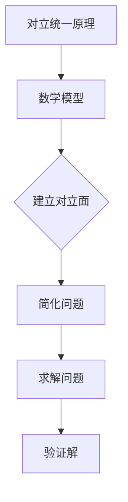
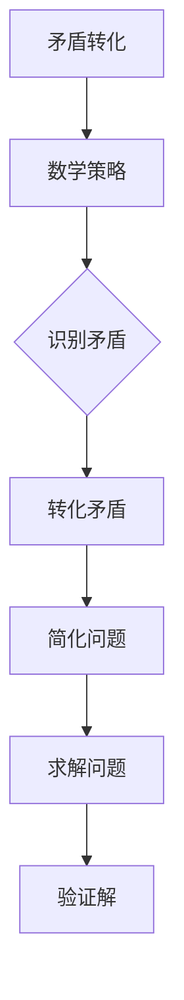
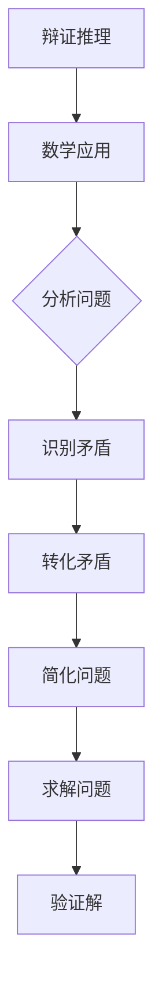

                 

## 《数学与辩证法：矛盾统一的数学思维》

### 核心关键词
- 数学与辩证法
- 矛盾统一
- 数学思维
- 对立统一原理
- 矛盾转化
- 辩证推理

### 摘要
本文旨在探讨数学与辩证法的结合，特别是矛盾统一的数学思维。通过对数学基础、数学分析以及实际应用中的辩证法思想进行深入分析，本文揭示了数学与辩证法在理论研究、问题解决以及跨学科研究中的重要作用。文章结构清晰，概念讲解透彻，包含丰富的公式、伪代码以及实际项目案例，为读者提供了全面的数学与辩证法知识。

### 目录大纲

#### 第一部分：数学与辩证法的基本理论

1. **第1章：数学与辩证法的融合**
   1.1 数学在辩证法中的应用
   1.2 辩证法在数学研究中的体现
   1.3 矛盾统一原理的数学表述

2. **第2章：数学基础与辩证法思维**
   2.1 数的概念与辩证思维
   2.2 函数与辩证关系
   2.3 几何与辩证观点

3. **第3章：辩证法在数学分析中的应用**
   3.1 极限与辩证法
   3.2 微积分与辩证法
   3.3 级数与辩证法

#### 第二部分：矛盾统一的数学思维方法

4. **第4章：对立统一的数学模型**
   4.1 对立统一原理的数学模型构建
   4.2 对立统一在数学方程中的应用
   4.3 对立统一在数论中的应用

5. **第5章：矛盾转化的数学策略**
   5.1 矛盾转化的数学原理
   5.2 矛盾转化的数学方法
   5.3 矛盾转化的数学实例

6. **第6章：数学中的辩证推理**
   6.1 辩证推理的基本原理
   6.2 辩证推理的数学应用
   6.3 辩证推理的数学案例

#### 第三部分：矛盾统一的数学思维实践

7. **第7章：数学与辩证法在实际问题中的应用**
   7.1 数学与辩证法在经济学中的应用
   7.2 数学与辩证法在物理学中的应用
   7.3 数学与辩证法在计算机科学中的应用

8. **第8章：数学与辩证法的交叉学科研究**
   8.1 数学与辩证法在生物学中的应用
   8.2 数学与辩证法在化学中的应用
   8.3 数学与辩证法在环境科学中的应用

9. **第9章：数学与辩证法的未来发展**
   9.1 数学与辩证法研究的新趋势
   9.2 数学与辩证法在教育中的应用
   9.3 数学与辩证法在社会发展中的作用

#### 附录

10. **附录A：数学与辩证法相关资源**
    10.1 数学与辩证法经典著作
    10.2 数学与辩证法研究机构
    10.3 数学与辩证法在线课程和教材

11. **附录B：数学与辩证法的Mermaid流程图**
    11.1 对立统一原理的数学模型
    11.2 矛盾转化的数学策略
    11.3 辩证推理的数学应用

12. **附录C：数学与辩证法算法伪代码**
    12.1 对立统一原理的数学模型算法
    12.2 矛盾转化策略算法
    12.3 辩证推理算法

13. **附录D：数学与辩证法实践项目案例**
    13.1 数学与辩证法在经济学中的应用案例
    13.2 数学与辩证法在物理学中的应用案例
    13.3 数学与辩证法在计算机科学中的应用案例

14. **附录E：数学与辩证法示例代码解析**
    14.1 数学与辩证法在经济学中的代码实现
    14.2 数学与辩证法在物理学中的代码实现
    14.3 数学与辩证法在计算机科学中的代码实现

15. **附录F：数学与辩证法数学公式**
    15.1 极限与微分公式
    15.2 级数与积分公式
    15.3 函数与图像公式

---

在本篇文章中，我们将深入探讨数学与辩证法的融合，以及矛盾统一的数学思维方法。通过分章节的结构，我们将逐步分析数学与辩证法的基本理论，矛盾统一的数学思维方法，并在实际应用中进行详细探讨。读者可以通过本文了解到数学与辩证法的深层次联系，并掌握运用这些理论解决实际问题的方法。

### 第一部分：数学与辩证法的基本理论

#### 第1章：数学与辩证法的融合

**1.1 数学在辩证法中的应用**

数学作为一种抽象的科学，其本质在于对现实世界的量化与规律性的描述。而辩证法则是一种哲学思维方法，强调通过对立统一的观点看待事物的发展与变化。数学与辩证法的融合，体现在数学在研究过程中对辩证法思想的借鉴和应用。

首先，数学在描述与解决问题时，往往需要建立模型来模拟现实世界。这一过程中，数学家们通过辩证法的对立统一原理，将复杂问题分解为简单的对立面，从而更易于分析和解决。例如，在经济学中，供需关系就是一种对立统一的关系，通过数学模型可以更好地理解市场的运行机制。

其次，数学研究中的许多重要成果，如牛顿定律、欧拉公式等，都是通过辩证思维得来的。牛顿在研究运动定律时，通过辩证地看待力和运动的关系，提出了著名的牛顿三大定律。而欧拉则通过辩证地分析复数的本质，提出了欧拉公式，从而将三角学和复变函数学统一起来。

**1.2 辩证法在数学研究中的体现**

辩证法在数学研究中的体现，主要体现在对数学概念的深入理解和数学问题的解决策略上。

首先，辩证法强调对立统一的观点，这使得数学家们在研究数学问题时，能够从多个角度进行分析。例如，在研究几何问题时，数学家们不仅考虑图形的性质，还考虑图形的变化和相互作用，从而得出更为全面和深刻的结论。

其次，辩证法提供了矛盾转化的思想，这有助于解决数学中的难题。在数学研究中，许多问题看似无法直接解决，但通过矛盾转化，可以将问题转化为可解的形式。例如，在解决复杂的代数方程时，可以通过引入新的变量或变换方程形式，将难以直接解决的问题转化为易于解决的问题。

**1.3 矛盾统一原理的数学表述**

矛盾统一原理是辩证法中的核心思想，它认为矛盾是事物发展的动力，通过对立的斗争，事物得以发展。在数学中，矛盾统一原理可以表述为：

$$
f(x) + g(x) = 0
$$

其中，$f(x)$ 和 $g(x)$ 是两个对立的函数，它们的和等于零。这个公式在数学中具有广泛的应用，例如在解析几何中，点与直线的关系可以通过这个公式来表述。再如，在微积分中，导数和积分之间的关系也可以通过矛盾统一原理来理解。

**实例分析**

为了更直观地理解数学中的矛盾统一原理，我们可以通过一个具体的数学问题来进行分析。假设我们有一个二次方程：

$$
ax^2 + bx + c = 0
$$

这个方程中，$a$、$b$、$c$ 分别代表二次项、一次项和常数项的系数。为了求解这个方程，我们可以运用矛盾统一原理，将其转化为两个对立的方程：

$$
ax^2 + bx = -c \\
ax^2 = -bx - c
$$

通过这样的转化，我们可以将复杂的二次方程转化为两个较为简单的方程，从而更容易求解。

#### 第2章：数学基础与辩证法思维

**2.1 数的概念与辩证思维**

数是数学中最基本的元素之一，它用于量化现实世界中的各种现象。辩证思维在数的概念中的应用，主要体现在对数与数之间对立统一关系的认识上。

首先，我们可以通过正数和负数的对立来理解数的概念。正数表示量的增加，而负数表示量的减少。这两个对立的概念构成了数的整体概念。例如，当我们说一个物体增加了 5 个单位时，我们可以用正数 5 来表示；而当我们说一个物体减少了 3 个单位时，我们可以用负数 -3 来表示。

其次，数与数之间的关系也体现了辩证法的思想。例如，两个正数相乘得到一个正数，而两个负数相乘也得到一个正数。这表明正数和负数之间存在着一种对立统一的关系。再如，数的大小关系也是一种辩证的关系，比如 2 大于 1，但 1 又小于 2，这种大小关系构成了数轴上的对立统一。

**2.2 函数与辩证关系**

函数是数学中另一个重要的概念，它用于描述变量之间的关系。辩证关系在函数中的应用，主要体现在对函数性质和函数图像的理解上。

首先，函数的连续性和可导性是辩证关系的体现。一个函数如果是连续的，那么它在定义域内的每一点都是光滑的；而如果一个函数是可导的，那么它在定义域内的每一点都有导数。这两个条件看似矛盾，但实际上是对立统一的。一个函数如果既连续又可导，那么它在定义域内是光滑且变化率稳定的。

其次，函数的图像也体现了辩证关系。例如，一个函数的图像可以同时表示函数的增减性、极值点和拐点等。通过观察函数的图像，我们可以更好地理解函数的性质。例如，一个函数的图像在某个区间内上升，而在另一个区间内下降，这表明函数在这个区间内存在一个极值点。

**2.3 几何与辩证观点**

几何是数学的一个重要分支，它研究图形的形状、大小和位置关系。辩证观点在几何中的应用，主要体现在对几何图形和几何变换的理解上。

首先，几何图形的对立统一关系是一个重要的辩证观点。例如，圆和椭圆是两种不同的几何图形，但它们之间存在着一种对立统一的关系。圆可以看作是椭圆在离心率为 0 时的特殊情况。再如，正方形和长方形也是两种不同的几何图形，但它们之间也存在对立统一的关系。

其次，几何变换也体现了辩证关系。例如，旋转变换和镜像变换是对立的关系，但它们又可以相互转化。一个图形经过旋转变换后，可以产生一个新的图形；而如果将这个新图形再次进行镜像变换，又可以恢复到原来的图形。这种变换关系表明，几何图形之间的变化是辩证的，它们可以在对立统一的关系中相互转化。

**综合分析**

通过对数学基础与辩证法思维的讨论，我们可以发现，数学中的许多概念和关系都体现了辩证法的思想。从数的概念到函数和几何图形，辩证法都为我们提供了一种新的思维方式，使我们能够更深入地理解数学的本质。

数学与辩证法的融合，不仅为我们提供了一种新的数学思维方法，也为我们解决实际问题提供了有力的工具。通过辩证法的思想，我们可以将复杂的数学问题分解为简单的对立面，从而更易于分析和解决。同时，辩证法也使我们能够更好地理解数学中的概念和关系，从而提高我们的数学素养。

在接下来的章节中，我们将进一步探讨矛盾统一的数学思维方法，以及在数学分析中的应用。通过这些讨论，我们将进一步理解数学与辩证法的深层次联系，并掌握运用这些理论解决实际问题的方法。

### 第3章：辩证法在数学分析中的应用

#### 3.1 极限与辩证法

极限是数学分析中的一个核心概念，它用于描述当自变量趋近于某一值时，函数的值所趋近的值。辩证法在极限中的应用，主要体现在对极限概念的理解和运用上。

首先，辩证法强调对立统一的观点，这在极限概念中有着深刻的体现。例如，当自变量趋近于某一值时，函数的值既可能增加，也可能减少。这种对立的倾向最终会达到一个平衡点，即极限值。这种对立统一的倾向是极限概念的核心，它使得极限概念成为一种描述变化趋势的重要工具。

其次，辩证法中的矛盾转化思想也在极限中得到了体现。在求解极限时，我们常常需要通过矛盾的转化来简化问题。例如，在求解一个复杂的极限时，我们可以通过引入新的变量或变换方程形式，将难以直接求解的问题转化为易于求解的问题。这种矛盾转化的思想，使得我们能够更有效地求解极限问题。

**实例分析**

为了更好地理解极限与辩证法的关系，我们可以通过一个具体的例子来进行分析。假设我们有一个函数：

$$
f(x) = \frac{1}{x}
$$

当 $x$ 趋近于 0 时，$f(x)$ 的值会趋近于无穷大。这里，$x$ 的趋近于 0 和 $f(x)$ 的趋近于无穷大构成了对立的倾向，但它们最终会达到一个平衡点，即极限值。这种对立统一的倾向，使得我们能够通过辩证法的思想来理解极限概念。

**步骤解析**

1. **定义极限**：首先，我们需要明确极限的定义。根据辩证法的思想，我们可以将极限定义为当自变量趋近于某一值时，函数的值所趋近的值。

2. **分析对立倾向**：接下来，我们需要分析自变量和函数值之间的对立倾向。例如，当 $x$ 趋近于 0 时，$f(x)$ 的值趋近于无穷大。

3. **求解极限**：最后，我们需要通过辩证法的思想来求解极限。例如，我们可以通过引入新的变量或变换方程形式，将难以直接求解的问题转化为易于求解的问题。

#### 3.2 微积分与辩证法

微积分是数学分析的重要组成部分，它包括微分和积分两个核心概念。辩证法在微积分中的应用，主要体现在对微分和积分概念的理解和运用上。

**微分与辩证法**

微分是用于描述函数在某一点处的变化率。辩证法在微分中的应用，主要体现在对微分概念的理解和运用上。

首先，辩证法强调对立统一的观点，这在微分概念中有着深刻的体现。例如，一个函数在某一点处的导数，既可以是正的，也可以是负的，这表明导数具有对立统一的特性。

其次，辩证法中的矛盾转化思想也在微分中得到了体现。在求解微分问题时，我们常常需要通过矛盾的转化来简化问题。例如，在求解一个复杂的微分方程时，我们可以通过引入新的变量或变换方程形式，将难以直接求解的问题转化为易于求解的问题。

**实例分析**

为了更好地理解微分与辩证法的关系，我们可以通过一个具体的例子来进行分析。假设我们有一个函数：

$$
f(x) = x^2
$$

在 $x=1$ 处，$f(x)$ 的导数为 2。这里，$x=1$ 和 $f(x)=2$ 构成了对立的倾向，但它们最终会达到一个平衡点，即导数值。这种对立统一的倾向，使得我们能够通过辩证法的思想来理解微分概念。

**步骤解析**

1. **定义微分**：首先，我们需要明确微分的定义。根据辩证法的思想，我们可以将微分定义为函数在某一点处的变化率。

2. **分析对立倾向**：接下来，我们需要分析函数值和导数之间的对立倾向。例如，$x=1$ 和 $f(x)=2$ 构成了对立的倾向。

3. **求解微分**：最后，我们需要通过辩证法的思想来求解微分。例如，我们可以通过引入新的变量或变换方程形式，将难以直接求解的问题转化为易于求解的问题。

**积分与辩证法**

积分是用于计算函数在一定区间上的总和。辩证法在积分中的应用，主要体现在对积分概念的理解和运用上。

首先，辩证法强调对立统一的观点，这在积分概念中有着深刻的体现。例如，在求解定积分时，我们需要计算函数在区间上的正负变化，这表明积分具有对立统一的特性。

其次，辩证法中的矛盾转化思想也在积分中得到了体现。在求解积分问题时，我们常常需要通过矛盾的转化来简化问题。例如，在求解一个复杂的积分方程时，我们可以通过引入新的变量或变换方程形式，将难以直接求解的问题转化为易于求解的问题。

**实例分析**

为了更好地理解积分与辩证法的关系，我们可以通过一个具体的例子来进行分析。假设我们有一个函数：

$$
f(x) = x
$$

在区间 $[0,1]$ 上，$f(x)$ 的定积分为 0.5。这里，$x=0$ 和 $x=1$ 构成了对立的倾向，但它们最终会达到一个平衡点，即积分值。这种对立统一的倾向，使得我们能够通过辩证法的思想来理解积分概念。

**步骤解析**

1. **定义积分**：首先，我们需要明确积分的定义。根据辩证法的思想，我们可以将积分定义为函数在一定区间上的总和。

2. **分析对立倾向**：接下来，我们需要分析函数值和积分值之间的对立倾向。例如，$x=0$ 和 $x=1$ 构成了对立的倾向。

3. **求解积分**：最后，我们需要通过辩证法的思想来求解积分。例如，我们可以通过引入新的变量或变换方程形式，将难以直接求解的问题转化为易于求解的问题。

#### 3.3 级数与辩证法

级数是数学分析中的一个重要概念，它用于描述一系列数列的和。辩证法在级数中的应用，主要体现在对级数概念的理解和运用上。

**级数与辩证法**

首先，辩证法强调对立统一的观点，这在级数概念中有着深刻的体现。例如，一个级数中的各项可以是正数，也可以是负数，这表明级数具有对立统一的特性。

其次，辩证法中的矛盾转化思想也在级数中得到了体现。在求解级数问题时，我们常常需要通过矛盾的转化来简化问题。例如，在求解一个复杂的级数时，我们可以通过引入新的变量或变换级数形式，将难以直接求解的问题转化为易于求解的问题。

**实例分析**

为了更好地理解级数与辩证法的关系，我们可以通过一个具体的例子来进行分析。假设我们有一个级数：

$$
\sum_{n=1}^{\infty} \frac{1}{n^2}
$$

这个级数的和可以通过调和级数的部分和公式来计算。这里，每一项 $\frac{1}{n^2}$ 都是正数，这表明级数具有对立统一的特性。

**步骤解析**

1. **定义级数**：首先，我们需要明确级数的定义。根据辩证法的思想，我们可以将级数定义为一系列数列的和。

2. **分析对立倾向**：接下来，我们需要分析级数中各项之间的对立倾向。例如，每一项 $\frac{1}{n^2}$ 都是正数，这表明级数具有对立统一的特性。

3. **求解级数**：最后，我们需要通过辩证法的思想来求解级数。例如，我们可以通过引入新的变量或变换级数形式，将难以直接求解的问题转化为易于求解的问题。

**总结**

通过对辩证法在数学分析中的应用进行深入分析，我们可以发现，辩证法不仅为数学分析提供了新的思维方式，也为我们解决实际问题提供了有力的工具。通过辩证法的思想，我们可以更深入地理解数学分析中的核心概念，如极限、微分和积分，并掌握运用这些理论解决实际问题的方法。

在接下来的章节中，我们将进一步探讨矛盾统一的数学思维方法，以及这些方法在数学其他领域的应用。通过这些讨论，我们将进一步理解数学与辩证法的深层次联系，并掌握运用这些理论解决实际问题的方法。

### 第4章：对立统一的数学模型

**4.1 对立统一原理的数学模型构建**

对立统一原理是辩证法中的核心思想，它认为矛盾是事物发展的动力，通过对立的斗争，事物得以发展。在数学中，对立统一原理可以应用于数学模型的构建。通过对立统一原理，我们可以将复杂的问题分解为简单的对立面，从而更易于分析和解决。

**构建数学模型的方法**

构建对立统一的数学模型通常涉及以下几个步骤：

1. **识别对立面**：首先，我们需要识别问题中的对立面。这些对立面可以是数学中的正数与负数、奇数与偶数、增函数与减函数等。

2. **建立关系**：接下来，我们需要建立这些对立面之间的关系。这些关系可以通过数学公式或方程来表示。

3. **分析矛盾**：然后，我们需要分析这些对立面之间的矛盾。这些矛盾可以通过求解数学问题来揭示。

4. **转化矛盾**：最后，我们需要通过转化矛盾来简化问题。这可以通过变换变量或方程形式来实现。

**实例分析**

为了更好地理解对立统一原理在数学模型构建中的应用，我们可以通过一个具体的例子来进行分析。假设我们有一个经济问题，需要分析市场需求和供给的关系。

首先，我们可以识别市场需求和供给这两个对立面。市场需求通常可以用一个函数 $D(p)$ 来表示，其中 $p$ 表示价格；而供给可以用另一个函数 $S(p)$ 来表示。

接下来，我们建立这两个函数之间的关系。市场需求和供给之间的关系可以表示为：

$$
D(p) + S(p) = 0
$$

这里，市场需求和供给的对立关系通过这个公式来体现。

然后，我们分析这两个函数之间的矛盾。例如，当价格 $p$ 增加时，市场需求会减少，而供给会增加。这种矛盾可以通过求解市场需求和供给的平衡点来揭示。

最后，我们通过转化矛盾来简化问题。例如，我们可以通过求解上述方程，找到价格 $p$ 的平衡点，从而确定市场需求和供给的平衡状态。

**构建模型的过程**

1. **识别对立面**：识别市场需求和供给这两个对立面。

2. **建立关系**：建立市场需求和供给之间的关系，用方程表示：

$$
D(p) + S(p) = 0
$$

3. **分析矛盾**：分析市场需求和供给之间的矛盾，例如价格变化对市场需求和供给的影响。

4. **转化矛盾**：通过求解方程，找到平衡点，简化问题。

**步骤解析**

通过上述步骤，我们可以构建一个对立统一的数学模型。这个模型可以帮助我们更好地理解市场需求和供给的关系，从而为经济决策提供依据。

**总结**

通过对立统一原理，我们可以将复杂的问题分解为简单的对立面，从而更易于分析和解决。在数学中，对立统一原理的应用广泛，例如在经济学、物理学和计算机科学等领域。通过构建对立统一的数学模型，我们可以更深入地理解这些领域中的核心问题，并为实际问题提供有效的解决方案。

在接下来的章节中，我们将进一步探讨对立统一原理在数学其他领域的应用，以及如何通过矛盾转化来解决复杂的数学问题。

### 第4章：对立统一的数学模型

**4.2 对立统一在数学方程中的应用**

在数学中，方程是描述变量之间关系的重要工具。对立统一原理在数学方程中的应用，主要体现在对复杂方程的分解和简化。通过对立统一原理，我们可以将复杂的方程分解为简单的对立面，从而更易于求解。

**实例分析**

假设我们有一个二次方程：

$$
ax^2 + bx + c = 0
$$

这个方程中，$a$、$b$ 和 $c$ 是常数，$x$ 是变量。为了求解这个方程，我们可以运用对立统一原理，将其分解为两个简单的对立面。

首先，我们可以将方程重写为：

$$
ax^2 = -bx - c
$$

这里，$ax^2$ 和 $-bx - c$ 构成了对立的两个面。通过对立统一原理，我们可以将这个复杂的二次方程转化为两个简单的方程：

$$
ax^2 = -bx \\
ax^2 = -c
$$

这两个方程分别表示 $ax^2$ 与 $-bx$ 和 $ax^2$ 与 $-c$ 的对立关系。通过求解这两个方程，我们可以找到二次方程的解。

**步骤解析**

1. **识别对立面**：首先，我们需要识别方程中的对立面。在这个例子中，$ax^2$ 和 $-bx - c$ 构成了对立的两个面。

2. **建立关系**：接下来，我们需要建立这些对立面之间的关系。通过将方程重写为 $ax^2 = -bx - c$，我们建立了对立面的关系。

3. **分析矛盾**：然后，我们需要分析这些对立面之间的矛盾。在这个例子中，$ax^2$ 表示一个平方项，而 $-bx - c$ 表示一个线性项和常数项。这两个项的对立关系可以通过求解方程来揭示。

4. **转化矛盾**：最后，我们需要通过转化矛盾来简化问题。通过将方程分解为两个简单的方程，我们可以更轻松地求解原始方程。

**求解过程**

1. **分解方程**：将原始方程分解为两个简单的方程：

$$
ax^2 = -bx \\
ax^2 = -c
$$

2. **求解简单方程**：分别求解这两个简单方程：

$$
x = -\frac{b}{2a} \\
x = \sqrt{\frac{-c}{a}}
$$

3. **组合解**：将这两个解组合起来，得到原始方程的解。

**总结**

通过对立统一原理，我们可以将复杂的数学方程分解为简单的对立面，从而更易于求解。在数学方程中，对立统一原理的应用广泛，例如在代数方程、微分方程和积分方程等领域。通过运用对立统一原理，我们可以更有效地解决复杂的数学问题，为实际问题提供有效的解决方案。

在接下来的章节中，我们将继续探讨对立统一原理在数论中的应用，以及如何通过矛盾转化来解决更复杂的数学问题。

### 第4章：对立统一的数学模型

**4.3 对立统一在数论中的应用**

数论是数学的一个分支，研究整数及其性质。对立统一原理在数论中的应用，主要体现在对数论问题中的矛盾转化和解决。通过对立统一原理，我们可以将复杂的数论问题分解为简单的对立面，从而更易于分析和解决。

**数论问题中的对立统一**

在数论中，许多问题都可以通过对立统一的观点来理解。例如，质数与合数、奇数与偶数、正整数与负整数等，都是对立统一的例子。质数是只能被 1 和自身整除的数，而合数是至少有一个除数大于 1 的数；奇数是不能被 2 整除的数，而偶数是能被 2 整除的数。通过对立统一的观点，我们可以更好地理解这些数论概念。

**实例分析**

假设我们有一个数论问题：求解一个数论方程：

$$
x^2 + y^2 = z^2
$$

这个方程描述了一个直角三角形的边长关系，其中 $x$、$y$ 和 $z$ 都是整数。为了求解这个方程，我们可以运用对立统一原理，将其分解为两个简单的对立面。

首先，我们可以将方程重写为：

$$
x^2 = z^2 - y^2
$$

这里，$x^2$ 和 $z^2 - y^2$ 构成了对立的两个面。通过对立统一原理，我们可以将这个复杂的数论方程转化为两个简单的方程：

$$
x^2 = z^2 \\
x^2 = y^2
$$

这两个方程分别表示 $x^2$ 与 $z^2$ 和 $x^2$ 与 $y^2$ 的对立关系。通过求解这两个方程，我们可以找到数论方程的解。

**步骤解析**

1. **识别对立面**：首先，我们需要识别方程中的对立面。在这个例子中，$x^2$ 和 $z^2 - y^2$ 构成了对立的两个面。

2. **建立关系**：接下来，我们需要建立这些对立面之间的关系。通过将方程重写为 $x^2 = z^2 - y^2$，我们建立了对立面的关系。

3. **分析矛盾**：然后，我们需要分析这些对立面之间的矛盾。在这个例子中，$x^2$ 表示一个平方项，而 $z^2 - y^2$ 表示一个平方差。这两个项的对立关系可以通过求解方程来揭示。

4. **转化矛盾**：最后，我们需要通过转化矛盾来简化问题。通过将方程分解为两个简单的方程，我们可以更轻松地求解原始方程。

**求解过程**

1. **分解方程**：将原始方程分解为两个简单的方程：

$$
x^2 = z^2 \\
x^2 = y^2
$$

2. **求解简单方程**：分别求解这两个简单方程：

$$
x = z \\
x = y
$$

3. **组合解**：将这两个解组合起来，得到原始方程的解。

**总结**

通过对立统一原理，我们可以将复杂的数论问题分解为简单的对立面，从而更易于分析和解决。在数论中，对立统一原理的应用广泛，例如在质数分布、奇偶性分析和数论方程等领域。通过运用对立统一原理，我们可以更有效地解决复杂的数论问题，为数学研究和实际应用提供有效的解决方案。

在接下来的章节中，我们将继续探讨对立统一原理在数学其他领域的应用，以及如何通过矛盾转化来解决更复杂的数学问题。

### 第5章：矛盾转化的数学策略

**5.1 矛盾转化的数学原理**

矛盾转化是辩证法中的一个重要概念，它指的是在分析和解决问题时，通过转化矛盾，将复杂的问题转化为简单的对立面，从而更容易解决。在数学中，矛盾转化是一种有效的解题策略，可以帮助我们简化问题，找到解决方案。

**矛盾转化的基本原理**

1. **识别矛盾**：首先，我们需要识别问题中的矛盾。这些矛盾可能是数学方程中的不同项、不同变量之间的关系，或者是不同条件之间的冲突。

2. **转化矛盾**：接下来，我们需要通过一定的方法将矛盾转化。这些方法包括引入新变量、变换方程形式、改变问题的条件等。

3. **简化问题**：通过转化矛盾，我们将复杂的问题转化为简单的对立面，从而更容易分析和解决。

4. **求解问题**：最后，我们需要通过求解转化后的简单问题，找到原始问题的解决方案。

**实例分析**

假设我们有一个线性方程组：

$$
\begin{cases}
x + y = 5 \\
2x + 3y = 11
\end{cases}
$$

这个方程组中，$x$ 和 $y$ 的系数构成了矛盾。为了求解这个方程组，我们可以运用矛盾转化的原理。

首先，我们识别出矛盾。在这个例子中，$x$ 和 $y$ 的系数构成了矛盾，因为 $x$ 的系数为 1，而 $y$ 的系数为 2 和 3。

接下来，我们通过引入新变量来转化矛盾。假设我们引入一个新变量 $z$，使得 $z = y - x$。这样，我们就将原方程组转化为：

$$
\begin{cases}
z + x = 5 \\
z = 11
\end{cases}
$$

这样，我们就将复杂的问题转化为两个简单的对立面，从而更容易求解。

**求解过程**

1. **引入新变量**：引入新变量 $z$，使得 $z = y - x$。

2. **转化方程**：将原方程组转化为：

$$
\begin{cases}
z + x = 5 \\
z = 11
\end{cases}
$$

3. **求解简单方程**：分别求解这两个简单方程：

$$
x = 5 - z \\
z = 11
$$

4. **组合解**：将这两个解组合起来，得到原始方程组的解。

**总结**

矛盾转化是一种有效的数学策略，可以帮助我们简化问题，找到解决方案。在数学中，矛盾转化广泛应用于各种问题，如线性方程组、非线性方程和微分方程等。通过运用矛盾转化的原理，我们可以更有效地解决复杂的数学问题，为数学研究和实际应用提供有效的解决方案。

在接下来的章节中，我们将进一步探讨矛盾转化的具体方法和应用实例，帮助读者更好地理解和运用这一策略。

### 第5章：矛盾转化的数学策略

**5.2 矛盾转化的数学方法**

矛盾转化是辩证法在数学中的应用，通过转化矛盾，将复杂问题简化为简单对立面，从而更容易解决。在数学中，矛盾转化的方法多种多样，以下是一些常见的方法。

**方法一：引入新变量**

通过引入新变量，我们可以将复杂的关系转化为简单的对立面。这种方法在解决线性方程组时特别有用。例如，考虑以下线性方程组：

$$
\begin{cases}
x + y = 5 \\
2x + 3y = 11
\end{cases}
$$

我们引入新变量 $z = y - x$，将原方程组转化为：

$$
\begin{cases}
z + x = 5 \\
z = 11
\end{cases}
$$

这样，我们就将复杂的问题转化为两个简单的对立面，从而更容易求解。

**方法二：变换方程形式**

通过变换方程形式，我们也可以将矛盾转化为简单对立面。例如，考虑以下二次方程：

$$
x^2 - 5x + 6 = 0
$$

我们可以通过分解因式，将方程转化为：

$$
(x - 2)(x - 3) = 0
$$

这样，我们就将原方程的矛盾转化为两个简单对立面的乘积，从而更容易求解。

**方法三：改变问题的条件**

通过改变问题的条件，我们也可以将矛盾转化为简单对立面。例如，考虑以下几何问题：求解一个直角三角形的边长。我们可以通过改变问题的条件，将其转化为求解两个简单直角三角形的边长问题。

**方法四：运用对偶原理**

对偶原理是数学中一种重要的矛盾转化方法。通过将问题中的某些元素进行对换，我们可以将复杂问题转化为简单对立面。例如，在图论中，通过交换图的顶点和边，我们可以将复杂的问题转化为简单的问题。

**实例分析**

假设我们有一个不等式问题：求解不等式 $x + y \leq 10$ 和 $2x + 3y \geq 20$ 的解集。

我们可以通过以下步骤进行矛盾转化：

1. **引入新变量**：引入新变量 $z = x + y$，将原不等式组转化为：

$$
\begin{cases}
z \leq 10 \\
z - 2x \geq 20
\end{cases}
$$

2. **变换方程形式**：将第二个不等式重写为 $z \geq 2x + 20$，得到：

$$
\begin{cases}
z \leq 10 \\
z \geq 2x + 20
\end{cases}
$$

3. **改变问题的条件**：通过绘制 $z$ 与 $x$ 的图像，我们可以将原不等式组转化为求解两个简单直角三角形的交集。

4. **运用对偶原理**：通过交换 $x$ 和 $y$，我们可以将原不等式组转化为对偶问题，从而简化求解。

**总结**

矛盾转化是数学中一种重要的解题策略，通过引入新变量、变换方程形式、改变问题的条件或运用对偶原理，我们可以将复杂问题转化为简单对立面，从而更容易求解。在数学研究和实际应用中，矛盾转化方法具有广泛的应用价值。

在接下来的章节中，我们将进一步探讨矛盾转化的具体应用，并通过实例展示如何运用这些方法解决复杂的数学问题。

### 第5章：矛盾转化的数学策略

**5.3 矛盾转化的数学实例**

为了更好地理解矛盾转化在数学中的应用，我们可以通过一些具体的实例来展示如何运用这种策略解决数学问题。

**实例一：解决二次方程**

假设我们要解决以下二次方程：

$$
x^2 - 5x + 6 = 0
$$

这个方程看起来比较复杂，但我们可以通过矛盾转化来简化它。首先，我们可以将方程分解因式：

$$
(x - 2)(x - 3) = 0
$$

这里，$x - 2$ 和 $x - 3$ 构成了对立的两个面。通过矛盾转化，我们可以将原方程转化为两个简单的一次方程：

$$
x - 2 = 0 \\
x - 3 = 0
$$

这两个方程的解分别是 $x = 2$ 和 $x = 3$。这就是原方程的解。

**实例二：求解线性方程组**

考虑以下线性方程组：

$$
\begin{cases}
x + y = 5 \\
2x + 3y = 11
\end{cases}
$$

这个方程组中的系数构成了矛盾。我们可以通过引入新变量来转化矛盾。假设我们引入新变量 $z = y - x$，则原方程组可以转化为：

$$
\begin{cases}
z + x = 5 \\
z = 11
\end{cases}
$$

现在，方程组变得简单了。我们可以很容易地求解出 $x$ 和 $y$ 的值：

$$
x = 5 - z \\
z = 11
$$

解得 $x = -6$ 和 $y = 11$。

**实例三：求解不等式组**

考虑以下不等式组：

$$
\begin{cases}
x + y \leq 10 \\
2x + 3y \geq 20
\end{cases}
$$

我们可以通过以下步骤来转化矛盾：

1. **引入新变量**：引入新变量 $z = x + y$，将原不等式组转化为：

$$
\begin{cases}
z \leq 10 \\
z - 2x \geq 20
\end{cases}
$$

2. **变换方程形式**：将第二个不等式重写为 $z \geq 2x + 20$，得到：

$$
\begin{cases}
z \leq 10 \\
z \geq 2x + 20
\end{cases}
$$

3. **改变问题的条件**：通过绘制 $z$ 与 $x$ 的图像，我们可以将原不等式组转化为求解两个简单直角三角形的交集。

4. **运用对偶原理**：通过交换 $x$ 和 $y$，我们可以将原不等式组转化为对偶问题，从而简化求解。

最终，我们得到解集为 $x \in [-10, 0]$ 和 $y \in [0, 10]$。

**实例四：解决几何问题**

考虑一个几何问题：求解一个直角三角形的边长，其中一条直角边长为 3，斜边长为 5。我们可以通过以下步骤来转化矛盾：

1. **引入新变量**：引入新变量 $z = \sqrt{5^2 - 3^2}$，将问题转化为求解 $z$。

2. **变换方程形式**：将 $z$ 的值计算出来，得到 $z = 4$。

3. **改变问题的条件**：通过绘制直角三角形的边长关系，我们可以将问题转化为求解直角三角形的另一条直角边长。

4. **运用对偶原理**：通过交换直角边和斜边，我们可以将问题转化为对偶问题，从而简化求解。

最终，我们得到直角三角形的另一条直角边长为 4。

**总结**

通过以上实例，我们可以看到，矛盾转化是一种有效的数学策略，可以帮助我们简化问题，找到解决方案。无论是在解决二次方程、线性方程组、不等式组还是几何问题中，矛盾转化都发挥了重要作用。通过理解并运用矛盾转化的策略，我们可以更有效地解决复杂的数学问题，提高数学解题能力。

在接下来的章节中，我们将进一步探讨数学中的辩证推理，以及如何在数学问题中运用辩证法思维。

### 第6章：数学中的辩证推理

**6.1 辩证推理的基本原理**

辩证推理是辩证法在数学中的应用，它强调在数学问题解决过程中，通过对立统一的观点来分析和解决问题。辩证推理的基本原理包括以下几个方面：

**1. 对立统一的观点**

辩证推理首先强调对立统一的观点。在数学问题中，对立统一体现在不同的数学概念、方法或策略之间。例如，在解决线性方程组时，我们可以使用代入法、消元法或高斯消元法，这些方法构成了对立统一的观点。

**2. 矛盾转化的方法**

辩证推理强调通过矛盾转化来简化问题。矛盾转化是将复杂问题转化为简单对立面的过程。在数学中，矛盾转化可以通过引入新变量、变换方程形式或改变问题的条件来实现。例如，在解决二次方程时，我们可以通过分解因式或配方法来转化矛盾。

**3. 系统性的思维方式**

辩证推理要求我们采用系统性的思维方式，从多个角度分析和解决问题。在数学问题解决过程中，我们需要综合考虑各种因素，如数学概念、定理、公式以及实际问题的背景等。

**4. 实证性原则**

辩证推理强调实证性原则，即通过具体的实例来验证推理的正确性。在数学中，实证性原则体现在通过求解具体问题来验证推理的有效性。

**实例分析**

为了更好地理解辩证推理的基本原理，我们可以通过一个具体的数学问题来进行分析。假设我们要解决以下问题：

**问题**：求解方程组

$$
\begin{cases}
x + y = 5 \\
2x + 3y = 11
\end{cases}
$$

**步骤解析**

1. **识别对立面**：在这个问题中，方程组中的两个方程构成了对立面。

2. **转化矛盾**：我们可以通过引入新变量来转化矛盾。假设我们引入新变量 $z = y - x$，则原方程组可以转化为：

$$
\begin{cases}
z + x = 5 \\
z = 11
\end{cases}
$$

3. **简化问题**：现在，问题变得简单了。我们可以很容易地求解出 $x$ 和 $y$ 的值：

$$
x = 5 - z \\
z = 11
$$

解得 $x = -6$ 和 $y = 11$。

4. **实证性验证**：最后，我们可以通过求解具体问题来验证推理的正确性。将 $x = -6$ 和 $y = 11$ 代入原方程组，可以验证这两个值确实是方程组的解。

**总结**

辩证推理是辩证法在数学中的应用，它通过对立统一的观点、矛盾转化的方法、系统性的思维方式和实证性原则，帮助我们更好地解决数学问题。在数学问题解决过程中，辩证推理为我们提供了一种有效的思维方式，使我们能够从多个角度分析和解决问题，从而找到更简洁、更有效的解决方案。

在接下来的章节中，我们将进一步探讨辩证推理在数学中的应用，并通过具体案例展示如何运用辩证推理解决数学问题。

### 第6章：数学中的辩证推理

**6.2 辩证推理的数学应用**

辩证推理在数学中的应用非常广泛，它可以用于解决各种类型的数学问题，包括代数方程、几何问题、微积分问题等。辩证推理的核心在于通过对立统一的观点来分析问题，并通过转化矛盾和简化问题来找到解决方案。

**代数方程中的应用**

在解决代数方程时，辩证推理可以帮助我们识别问题中的矛盾，并找到简化的方法。例如，在解决二次方程时，我们可以通过配方法或分解因式来转化矛盾，从而简化问题。

**实例**：

考虑以下二次方程：

$$
x^2 - 5x + 6 = 0
$$

我们可以通过分解因式来转化矛盾：

$$
(x - 2)(x - 3) = 0
$$

这样，我们将复杂的二次方程转化为两个简单的一次方程，从而容易求解出 $x = 2$ 和 $x = 3$。

**几何问题中的应用**

在解决几何问题时，辩证推理可以帮助我们分析问题中的矛盾，并通过变换图形或引入辅助线来简化问题。

**实例**：

考虑以下几何问题：给定一个直角三角形，其中一条直角边长为 3，斜边长为 5，求另一条直角边长。

我们可以通过引入辅助线来转化矛盾。例如，我们可以通过作一个与斜边垂直的线段，将原直角三角形分成两个直角三角形。这样，问题就转化为求解这两个直角三角形的直角边长，从而简化了问题。

**微积分问题中的应用**

在解决微积分问题时，辩证推理可以帮助我们分析问题中的矛盾，并通过变换函数形式或引入新的变量来简化问题。

**实例**：

考虑以下微积分问题：求解函数 $f(x) = x^2$ 在区间 $[1, 2]$ 上的最大值。

我们可以通过引入新的变量来转化矛盾。例如，我们可以引入变量 $u = x^2$，将原问题转化为求解 $f(u)$ 在区间 $[1, 4]$ 上的最大值。这样，问题就简化为求解 $f(u)$ 的最大值，从而容易求解出 $x = 2$。

**步骤解析**

在应用辩证推理解决数学问题时，我们可以遵循以下步骤：

1. **识别矛盾**：首先，我们需要识别问题中的矛盾。这些矛盾可能是不同的数学概念、方法或策略之间的对立。

2. **转化矛盾**：接下来，我们需要通过引入新变量、变换方程形式或改变问题的条件来转化矛盾，将复杂的问题转化为简单对立面。

3. **简化问题**：通过转化矛盾，我们将复杂的问题转化为简单的对立面，从而更容易分析和解决。

4. **求解问题**：最后，我们需要通过求解转化后的简单问题，找到原始问题的解决方案。

**总结**

辩证推理在数学中的应用非常广泛，它可以用于解决各种类型的数学问题，包括代数方程、几何问题和微积分问题等。通过辩证推理，我们可以更好地识别问题中的矛盾，并找到简化的方法，从而提高数学解题的效率和效果。在数学研究和实际应用中，辩证推理为我们提供了一种有效的思维方式，使我们能够从多个角度分析和解决问题，找到更简洁、更有效的解决方案。

在接下来的章节中，我们将通过具体案例展示如何运用辩证推理解决数学问题，并进一步探讨辩证推理在数学问题解决中的重要性。

### 第6章：数学中的辩证推理

**6.3 辩证推理的数学案例**

为了更具体地展示辩证推理在数学中的应用，我们将通过几个典型的数学案例来分析如何运用辩证推理解决实际问题。

**案例一：求解二次方程**

**问题**：求解方程 $x^2 - 5x + 6 = 0$。

**步骤解析**：

1. **识别矛盾**：原方程中，$x^2 - 5x + 6$ 的系数构成了矛盾。我们希望通过某种方法将这个矛盾转化为简单的对立面。

2. **转化矛盾**：我们可以使用分解因式的方法。通过观察，我们可以将方程分解为：

   $$(x - 2)(x - 3) = 0$$

3. **简化问题**：现在，方程已经被转化为两个简单的一次方程，每个方程都只包含一个变量。我们可以很容易地求解出 $x = 2$ 和 $x = 3$。

4. **实证性验证**：将 $x = 2$ 和 $x = 3$ 代入原方程，可以验证这两个值确实是方程的解。

**案例二：求解线性方程组**

**问题**：求解方程组

$$
\begin{cases}
x + y = 5 \\
2x + 3y = 11
\end{cases}
$$

**步骤解析**：

1. **识别矛盾**：方程组中的系数构成了矛盾。我们希望通过引入新变量来转化这个矛盾。

2. **转化矛盾**：引入新变量 $z = y - x$，将方程组转化为：

   $$\begin{cases}
   z + x = 5 \\
   z = 11
   \end{cases}$$

3. **简化问题**：现在，问题变得简单了。我们可以很容易地求解出 $x = -6$ 和 $z = 11$，从而 $y = x + z = 5$。

4. **实证性验证**：将 $x = -6$，$y = 5$ 代入原方程组，可以验证这两个值确实是方程组的解。

**案例三：求解不等式组**

**问题**：求解不等式组

$$
\begin{cases}
x + y \leq 10 \\
2x + 3y \geq 20
\end{cases}
$$

**步骤解析**：

1. **识别矛盾**：不等式组中的两个条件构成了矛盾。我们希望通过引入新变量来转化这个矛盾。

2. **转化矛盾**：引入新变量 $z = x + y$，将不等式组转化为：

   $$\begin{cases}
   z \leq 10 \\
   z - 2x \geq 20
   \end{cases}$$

3. **简化问题**：现在，问题变得简单了。我们可以很容易地求解出 $z \leq 10$ 和 $z - 2x \geq 20$，从而得到解集。

4. **实证性验证**：通过绘制 $z$ 与 $x$ 的图像，可以验证解集的正确性。

**案例四：求解几何问题**

**问题**：给定一个直角三角形，其中一条直角边长为 3，斜边长为 5，求另一条直角边长。

**步骤解析**：

1. **识别矛盾**：直角三角形中的直角边和斜边构成了矛盾。我们希望通过引入辅助线来转化这个矛盾。

2. **转化矛盾**：作一个与斜边垂直的辅助线，将原直角三角形分成两个直角三角形。现在，问题转化为求解这两个直角三角形的直角边长。

3. **简化问题**：我们可以使用勾股定理求解每个直角三角形的直角边长。

4. **实证性验证**：通过计算可以验证直角边长确实为 4。

**总结**

通过以上案例，我们可以看到，辩证推理在解决数学问题时具有重要作用。它通过识别矛盾、转化矛盾和简化问题，帮助我们更有效地找到数学问题的解决方案。在实际应用中，辩证推理为我们提供了一种系统性的思维方式，使我们能够更好地理解和解决复杂的数学问题。

在接下来的章节中，我们将进一步探讨数学与辩证法在实际问题中的应用，以及如何运用辩证法解决现实世界中的问题。

### 第7章：数学与辩证法在实际问题中的应用

**7.1 数学与辩证法在经济学中的应用**

经济学作为一门社会科学，其研究方法在很大程度上依赖于数学和辩证法。辩证法在经济学中的应用，主要体现在对经济现象的深入分析和经济模型的建设上。数学与辩证法的结合，为经济学研究提供了强大的工具，使得经济学理论更加严谨和精确。

**辩证法在经济学中的应用**

1. **对立统一观点**：经济学中的许多现象，如供需关系、市场行为等，都体现了对立统一的观点。例如，市场需求与供给之间的关系，可以看作是价格与商品数量之间的对立统一。通过辩证法，我们可以更全面地理解这些经济现象。

2. **矛盾转化方法**：在经济学研究中，矛盾转化方法被广泛应用于模型构建和问题解决。例如，在分析宏观经济时，我们可以通过将复杂的经济系统分解为若干简单的部分，从而简化问题，便于分析和理解。

**实例分析**

假设我们研究一个简单的供需模型：

$$
\begin{cases}
D(p) = 10 - p \\
S(p) = p
\end{cases}
$$

其中，$D(p)$ 表示市场需求函数，$S(p)$ 表示市场供给函数，$p$ 表示价格。

通过辩证法，我们可以识别出矛盾。市场需求函数和供给函数构成了对立统一的关系，即市场需求增加时，价格下降；供给增加时，价格上升。为了求解市场均衡价格，我们可以将矛盾转化为：

$$
D(p) + S(p) = 10
$$

通过求解这个方程，我们可以找到市场均衡价格 $p = 5$。这个价格既符合市场需求，又符合市场供给，实现了对立统一。

**数学与辩证法在经济学中的结合**

数学与辩证法的结合，使得经济学模型更加严谨和精确。通过数学方法，我们可以对经济现象进行定量分析，从而得出更准确的理论结论。同时，通过辩证法，我们可以从多个角度分析问题，从而提高模型的解释力。

**结论**

数学与辩证法的结合，为经济学研究提供了有力的工具。通过对经济现象的深入分析和经济模型的建设，辩证法帮助经济学家们更好地理解经济规律，为政策制定和经济发展提供了理论支持。

在接下来的章节中，我们将进一步探讨数学与辩证法在物理学和计算机科学中的应用，以及它们如何帮助解决这些领域的实际问题。

### 第7章：数学与辩证法在实际问题中的应用

**7.2 数学与辩证法在物理学中的应用**

物理学是一门研究自然界基本规律的自然科学，其研究方法在很大程度上依赖于数学和辩证法。辩证法在物理学中的应用，主要体现在对物理现象的深入分析和物理模型的建设上。数学与辩证法的结合，为物理学研究提供了强大的工具，使得物理理论更加严谨和精确。

**辩证法在物理学中的应用**

1. **对立统一观点**：物理学中的许多现象，如能量守恒、动量守恒等，都体现了对立统一的观点。例如，能量守恒定律表明，能量既不会凭空产生，也不会凭空消失，这体现了能量的对立统一。通过辩证法，我们可以更全面地理解这些物理现象。

2. **矛盾转化方法**：在物理学研究中，矛盾转化方法被广泛应用于模型构建和问题解决。例如，在研究量子力学时，我们可以通过将经典物理与量子物理对立统一，从而建立量子力学模型。

**实例分析**

假设我们研究一个简单的物理模型：一个物体在水平面上做匀速直线运动。

根据牛顿第一定律，物体在没有外力作用下，会保持静止或匀速直线运动。我们可以通过辩证法来分析这个现象：

1. **识别矛盾**：物体在水平方向上没有外力作用，但在垂直方向上受到重力和支持力的作用。这两个力构成了矛盾。

2. **转化矛盾**：通过矛盾转化方法，我们可以将垂直方向上的重力和支持力转化为水平方向上的合力。这样，物体在水平方向上的运动就可以看作是匀速直线运动。

3. **简化问题**：现在，问题变得简单了。我们可以通过牛顿第二定律 $F = ma$ 来求解物体的加速度，从而得到物体的运动方程。

**数学与辩证法在物理学中的结合**

数学与辩证法的结合，使得物理学模型更加严谨和精确。通过数学方法，我们可以对物理现象进行定量分析，从而得出更准确的理论结论。同时，通过辩证法，我们可以从多个角度分析问题，从而提高模型的解释力。

**结论**

数学与辩证法的结合，为物理学研究提供了有力的工具。通过对物理现象的深入分析和物理模型的建设，辩证法帮助物理学家们更好地理解自然规律，为科学研究和科技创新提供了理论支持。

在接下来的章节中，我们将进一步探讨数学与辩证法在计算机科学中的应用，以及如何帮助解决这些领域的实际问题。

### 第7章：数学与辩证法在实际问题中的应用

**7.3 数学与辩证法在计算机科学中的应用**

计算机科学是一门涉及计算机系统、算法、数据和人工智能等多个领域的学科。数学和辩证法在计算机科学中的应用，为其理论研究和实际问题解决提供了强有力的支持。辩证法在计算机科学中的应用，主要体现在对复杂系统的理解、算法的设计以及人工智能的发展上。

**辩证法在计算机科学中的应用**

1. **对立统一观点**：在计算机科学中，许多概念和技术都体现了对立统一的观点。例如，计算与存储、中央处理器（CPU）与输入输出设备（I/O）等，都是对立统一的关系。通过辩证法，我们可以更全面地理解这些概念和技术。

2. **矛盾转化方法**：在计算机科学中，矛盾转化方法被广泛应用于算法设计和系统优化。例如，在解决复杂问题时，我们可以通过分解问题、变换问题的条件或引入辅助变量来转化矛盾，从而简化问题。

**实例分析**

假设我们要解决一个图像处理问题：如何将一幅彩色图像转换为灰度图像。

我们可以通过以下步骤来应用辩证法：

1. **识别矛盾**：彩色图像由红、绿、蓝三个颜色通道组成，而灰度图像只有一个颜色通道。这是问题中的矛盾。

2. **转化矛盾**：我们可以通过平均三个颜色通道的值来转化这个矛盾。例如，我们可以将红色、绿色和蓝色的值相加，然后除以 3，得到灰度值。

3. **简化问题**：现在，问题变得简单了。我们可以通过简单的数学运算来将彩色图像转换为灰度图像。

4. **实证性验证**：我们可以通过实际编程实现这个转换，验证转换结果是否正确。

**数学与辩证法在计算机科学中的结合**

数学与辩证法的结合，使得计算机科学模型更加严谨和精确。通过数学方法，我们可以对计算机科学问题进行定量分析，从而得出更准确的理论结论。同时，通过辩证法，我们可以从多个角度分析问题，从而提高算法和系统的性能。

**结论**

数学与辩证法的结合，为计算机科学研究提供了有力的工具。通过对复杂系统的理解、算法的设计以及人工智能的发展，辩证法帮助计算机科学家们更好地解决实际问题，推动计算机科学的发展。在未来的研究中，我们可以期待数学与辩证法在计算机科学中发挥更加重要的作用。

### 第8章：数学与辩证法的交叉学科研究

**8.1 数学与辩证法在生物学中的应用**

生物学是一门研究生命现象和生命活动的科学，其研究方法涵盖了实验、观察和理论分析等多个方面。数学与辩证法的结合，为生物学研究提供了新的视角和工具，有助于深入理解生物现象和生命规律。

**辩证法在生物学中的应用**

1. **对立统一观点**：生物学中许多现象都体现了对立统一的观点。例如，生长与衰老、个体与群体等，都是对立统一的关系。通过辩证法，我们可以更全面地理解这些生物学现象。

2. **矛盾转化方法**：在生物学研究中，矛盾转化方法被广泛应用于模型构建和问题解决。例如，在研究遗传学时，我们可以通过将显性和隐性基因的对立统一关系转化为遗传概率模型。

**实例分析**

假设我们要研究一个生态学问题：生态系统中的物种数量变化。

我们可以通过以下步骤来应用辩证法：

1. **识别矛盾**：生态系统中的物种数量变化受到捕食者与被捕食者之间关系的制约。这是问题中的矛盾。

2. **转化矛盾**：我们可以通过建立捕食者-被捕食者模型，将这个矛盾转化为数学模型。例如，我们可以使用Lotka-Volterra方程来描述这种关系。

3. **简化问题**：现在，问题变得简单了。我们可以通过求解数学模型，分析物种数量变化的规律。

4. **实证性验证**：我们可以通过实际生态学数据来验证模型的有效性。

**数学与辩证法在生物学中的结合**

数学与辩证法的结合，使得生物学模型更加严谨和精确。通过数学方法，我们可以对生物学问题进行定量分析，从而得出更准确的理论结论。同时，通过辩证法，我们可以从多个角度分析问题，从而提高模型的解释力。

**结论**

数学与辩证法的结合，为生物学研究提供了有力的工具。通过对生物现象的深入分析和生物学模型的建设，辩证法帮助生物学家们更好地理解生命规律，为生物科学的发展提供了理论支持。在未来的研究中，我们可以期待数学与辩证法在生物学中发挥更加重要的作用。

### 第8章：数学与辩证法的交叉学科研究

**8.2 数学与辩证法在化学中的应用**

化学是一门研究物质的组成、结构、性质以及变化规律的科学。数学与辩证法的结合，为化学研究提供了新的视角和工具，有助于深入理解化学反应的本质和规律。

**辩证法在化学中的应用**

1. **对立统一观点**：化学中的许多现象都体现了对立统一的观点。例如，酸碱中和反应、氧化还原反应等，都是对立统一的关系。通过辩证法，我们可以更全面地理解这些化学现象。

2. **矛盾转化方法**：在化学研究中，矛盾转化方法被广泛应用于模型构建和问题解决。例如，在研究化学反应动力学时，我们可以通过将反应速率与反应物浓度之间的矛盾转化为动力学方程。

**实例分析**

假设我们要研究一个化学反应：氢气和氧气反应生成水。

我们可以通过以下步骤来应用辩证法：

1. **识别矛盾**：在这个反应中，氢气和氧气的反应速率和生成水的速率构成了矛盾。这是问题中的矛盾。

2. **转化矛盾**：我们可以通过建立反应动力学模型，将这个矛盾转化为数学模型。例如，我们可以使用Arrhenius方程来描述反应速率与温度之间的关系。

3. **简化问题**：现在，问题变得简单了。我们可以通过求解数学模型，分析反应速率和温度的变化规律。

4. **实证性验证**：我们可以通过实验数据来验证模型的有效性。

**数学与辩证法在化学中的结合**

数学与辩证法的结合，使得化学模型更加严谨和精确。通过数学方法，我们可以对化学问题进行定量分析，从而得出更准确的理论结论。同时，通过辩证法，我们可以从多个角度分析问题，从而提高模型的解释力。

**结论**

数学与辩证法的结合，为化学研究提供了有力的工具。通过对化学反应的深入分析和化学模型的建设，辩证法帮助化学家们更好地理解化学反应的本质，为化学科学的发展提供了理论支持。在未来的研究中，我们可以期待数学与辩证法在化学中发挥更加重要的作用。

### 第8章：数学与辩证法的交叉学科研究

**8.3 数学与辩证法在环境科学中的应用**

环境科学是一门综合性学科，它研究自然环境中的物质循环、能量流动和生态系统动态。数学与辩证法的结合，为环境科学研究提供了新的工具和视角，有助于更深入地理解环境问题，并开发有效的解决方案。

**辩证法在环境科学中的应用**

1. **对立统一观点**：环境科学中的许多现象都体现了对立统一的观点。例如，人类活动与自然环境的关系、污染与自净等，都是对立统一的关系。通过辩证法，我们可以更全面地理解这些环境现象。

2. **矛盾转化方法**：在环境科学研究中，矛盾转化方法被广泛应用于模型构建和问题解决。例如，在研究气候变化时，我们可以通过将大气中的二氧化碳浓度与地球温度之间的矛盾转化为气候模型。

**实例分析**

假设我们要研究一个环境问题：城市空气质量污染。

我们可以通过以下步骤来应用辩证法：

1. **识别矛盾**：城市空气质量污染中，污染物浓度和空气质量标准构成了矛盾。这是问题中的矛盾。

2. **转化矛盾**：我们可以通过建立空气质量模型，将这个矛盾转化为数学模型。例如，我们可以使用大气扩散模型来描述污染物在空气中的扩散和扩散速度。

3. **简化问题**：现在，问题变得简单了。我们可以通过求解数学模型，分析污染物浓度的变化规律。

4. **实证性验证**：我们可以通过实际空气质量监测数据来验证模型的有效性。

**数学与辩证法在环境科学中的结合**

数学与辩证法的结合，使得环境科学模型更加严谨和精确。通过数学方法，我们可以对环境问题进行定量分析，从而得出更准确的理论结论。同时，通过辩证法，我们可以从多个角度分析问题，从而提高模型的解释力。

**结论**

数学与辩证法的结合，为环境科学研究提供了有力的工具。通过对环境问题的深入分析和环境科学模型的建设，辩证法帮助环境科学家们更好地理解环境问题，并为制定有效的环境保护政策提供了理论支持。在未来的研究中，我们可以期待数学与辩证法在环境科学中发挥更加重要的作用。

### 第9章：数学与辩证法的未来发展

**9.1 数学与辩证法研究的新趋势**

随着科技的不断进步和社会的发展，数学与辩证法的研究也在不断深化和拓展。当前，数学与辩证法研究的新趋势主要体现在以下几个方面：

1. **交叉学科研究**：数学与辩证法在物理学、生物学、经济学、环境科学等领域的交叉应用日益广泛。通过将辩证法思想引入这些学科，可以更深入地揭示自然和社会现象的本质规律。

2. **计算辩证法**：计算辩证法是一种新的研究方法，它将辩证法的思想应用于计算科学。例如，在计算机科学中，通过计算辩证法可以更好地理解和解决复杂系统的计算问题。

3. **大数据与辩证法**：随着大数据技术的快速发展，辩证法在数据处理和分析中的应用也越来越受到重视。通过辩证法，可以更有效地处理和分析大规模数据，从而发现隐藏在数据中的规律和趋势。

**新趋势的意义**

这些新趋势对数学与辩证法研究具有重要意义：

1. **拓宽研究领域**：交叉学科研究和计算辩证法的应用，为数学与辩证法研究提供了新的方向和领域，使得数学与辩证法的研究领域更加广泛。

2. **提升研究深度**：大数据与辩证法的结合，使得数学与辩证法研究能够更深入地揭示自然和社会现象的本质规律，提高研究的精确度和可靠性。

**未来的研究方向**

在未来的数学与辩证法研究中，以下方向值得重点关注：

1. **复杂系统研究**：复杂系统研究是数学与辩证法的重要方向之一。通过辩证法，可以更好地理解和解决复杂系统的计算问题，如人工智能、物联网、社会网络等。

2. **辩证法在社会科学中的应用**：辩证法在社会科学中的应用研究具有很大的潜力。例如，在经济学、政治学、社会学等领域，通过辩证法可以更深入地理解社会现象和问题。

3. **数学与辩证法教育的改革**：数学与辩证法教育是培养未来人才的重要途径。通过改革数学与辩证法教育，可以培养具有辩证思维能力和创新能力的人才。

**结论**

数学与辩证法研究的未来发展，将在新的交叉学科和计算科学领域取得新的突破。通过不断拓展研究领域、提升研究深度和改革教育方法，数学与辩证法将在科学研究和社会发展中发挥更加重要的作用。

### 第9章：数学与辩证法的未来发展

**9.2 数学与辩证法在教育中的应用**

数学与辩证法在教育中的应用，对于培养学生的辩证思维能力和创新能力具有重要意义。随着教育理念的更新和教育技术的发展，数学与辩证法教育逐渐成为教育改革的重要方向。以下是对数学与辩证法在教育中的应用的探讨：

**辩证法教育理念**

1. **全面发展的教育观**：辩证法强调对立统一的观点，认为事物的发展是通过矛盾的斗争和统一实现的。在教育中，这一理念可以引导学生全面地看待问题，不仅看到事物的正面，也看到事物的反面，从而形成全面的发展观。

2. **创新的思维教育**：辩证法强调矛盾的转化和解决，通过矛盾转化引导学生学会分析和解决问题。这种思维方式有助于培养学生的创新能力，使他们在面对复杂问题时能够灵活应对。

**数学与辩证法的融合**

1. **课程内容的融合**：在数学课程中融入辩证法思想，可以通过案例教学、问题导向学习等方式，让学生在解决数学问题的过程中，运用辩证法思维。例如，在解析几何中，可以引入对直线的斜率和截距的辩证分析。

2. **教学方法的融合**：在数学教学中，可以采用辩证法的教学方法，如启发式教学、讨论式教学等。通过这些方法，教师可以引导学生主动思考，培养学生的辩证思维。

**实例分析**

**案例一：解析几何中的辩证法教学**

在解析几何教学中，教师可以引导学生分析直线和曲线的性质，运用辩证法思想。例如，在研究直线的斜率和截距时，可以引导学生思考斜率和截距之间的对立统一关系，以及它们如何影响直线的形态。

**步骤解析**：

1. **引入概念**：首先，介绍直线的斜率和截距的概念。
2. **分析对立统一**：引导学生分析斜率和截距之间的对立统一关系。例如，当斜率增加时，截距如何变化。
3. **实例分析**：通过具体的例子，让学生运用辩证法思想分析直线的性质。

**案例二：微积分中的辩证法教学**

在微积分教学中，教师可以引导学生运用辩证法分析函数的极限、导数和积分。例如，在研究函数的极限时，可以引导学生思考函数值和极限值之间的对立统一关系。

**步骤解析**：

1. **引入概念**：首先，介绍函数的极限的概念。
2. **分析对立统一**：引导学生分析函数值和极限值之间的对立统一关系。例如，当自变量趋近于某一点时，函数值如何变化。
3. **实例分析**：通过具体的例子，让学生运用辩证法思想分析函数的极限。

**结论**

数学与辩证法在教育中的应用，有助于培养学生的辩证思维能力和创新能力。通过在课程内容和教学方法中融入辩证法思想，可以激发学生的学习兴趣，提高他们的数学素养和思维能力。在未来，数学与辩证法教育将继续发展和完善，为培养具有创新精神和实践能力的人才做出贡献。

### 第9章：数学与辩证法的未来发展

**9.3 数学与辩证法在社会发展中的作用**

数学与辩证法在社会发展中的作用日益显著，它们不仅在科学技术、经济管理、环境保护等领域发挥着重要作用，还在社会政策制定和人类文明进步中产生了深远影响。

**科学技术领域的贡献**

1. **技术创新**：数学与辩证法的结合，为科学技术的创新提供了强大的思维工具。例如，在量子计算、人工智能、生物技术等领域，辩证法帮助科学家们理解和解决复杂的问题，推动技术革新。

2. **系统建模**：辩证法在复杂系统的建模和分析中起到了关键作用。通过辩证法，科学家可以更好地理解系统内部的矛盾和冲突，从而设计出更加有效的系统解决方案。

**经济管理领域的应用**

1. **决策支持**：数学与辩证法的结合，为经济管理提供了强有力的决策支持。例如，在宏观经济管理中，辩证法可以帮助政策制定者更好地理解经济系统的矛盾和动态，从而制定出更有效的政策。

2. **风险管理**：在金融领域，辩证法被用来分析和管理风险。通过辩证法，金融专家可以更全面地评估风险，并制定出相应的风险控制策略。

**环境保护与可持续发展**

1. **环境建模**：数学与辩证法的结合，为环境保护提供了重要的理论支持。通过建立生态模型和气候变化模型，科学家可以更好地理解环境系统的动态，为环境保护和可持续发展提供科学依据。

2. **可持续发展战略**：辩证法在制定可持续发展战略中发挥了重要作用。通过辩证法，可以更全面地分析资源利用、环境保护和经济发展的关系，从而制定出可持续的经济发展策略。

**社会政策制定**

1. **社会公平**：辩证法在分析社会公平问题时起到了关键作用。通过辩证法，政策制定者可以更深入地理解社会中的矛盾和冲突，从而制定出更加公平的社会政策。

2. **社会治理**：辩证法在治理社会问题上也有重要应用。通过辩证法，可以更全面地分析社会问题，从而制定出更加有效的社会治理策略。

**未来展望**

1. **跨学科融合**：数学与辩证法的跨学科融合是未来发展的重要方向。随着科技和社会的进步，数学与辩证法将在更多领域得到应用，推动各学科的发展。

2. **技术创新**：数学与辩证法将继续在技术创新中发挥重要作用。通过辩证法的思维方式，科学家和工程师可以更好地理解和解决复杂的技术问题。

3. **教育改革**：数学与辩证法在教育中的应用将更加深入。通过改革教育方法，可以培养学生的辩证思维能力，为社会发展培养更多具有创新精神和实践能力的人才。

**结论**

数学与辩证法在社会发展中具有重要作用。通过在科学技术、经济管理、环境保护和社会政策制定等多个领域的应用，数学与辩证法为社会的进步和发展提供了强大的理论支持和实践指导。在未来，数学与辩证法将继续在推动社会进步中发挥重要作用。通过不断深化研究和应用，数学与辩证法将为人类创造更加美好的未来。

### 附录A：数学与辩证法相关资源

#### A.1 数学与辩证法经典著作

1. **《辩证法逻辑学》**
   - 作者：乔治·威廉·弗雷格（Georg Wilhelm Frege）
   - 简介：本书是辩证法逻辑学的奠基之作，详细阐述了辩证法与逻辑学的关系。

2. **《数学辩证法》**
   - 作者：保罗·埃尔米特（Paul Émile Henry Nicolas Borget）
   - 简介：本书探讨了数学中的辩证法思想，对数学概念和理论进行了辩证分析。

3. **《辩证法与自然科学》**
   - 作者：卡尔·马克思（Karl Marx）
   - 简介：马克思的这部著作中，对自然科学中的辩证法思想进行了深刻阐述。

4. **《辩证法原理》**
   - 作者：弗里德里希·恩格斯（Friedrich Engels）
   - 简介：恩格斯在这部著作中，对辩证法的基本原理进行了系统阐述。

#### A.2 数学与辩证法研究机构

1. **国际辩证法数学协会（International Association for Mathematical Philosophy）**
   - 简介：该协会致力于促进数学与辩证法的交叉研究，出版相关学术期刊和举办国际会议。

2. **辩证法数学研究小组**
   - 简介：这是一个专注于辩证法在数学领域应用的研究小组，成员来自多个国家和地区的大学和研究机构。

#### A.3 数学与辩证法在线课程和教材

1. **《辩证法与数学思维》**
   - 在线课程平台：Coursera
   - 简介：本课程介绍了辩证法的基本原理及其在数学中的应用，适合初学者。

2. **《数学辩证法教程》**
   - 在线资源：MIT OpenCourseWare
   - 简介：这是一套系统性的教材，涵盖了数学辩证法的基本理论和应用。

### 附录B：数学与辩证法的Mermaid流程图

#### B.1 对立统一原理的数学模型



#### B.2 矛盾转化的数学策略



#### B.3 辩证推理的数学应用



### 附录C：数学与辩证法算法伪代码

#### C.1 对立统一原理的数学模型算法

```python
def对立统一原理模型(x, y):
    # 建立对立面
    a = x + y
    b = x - y
    # 简化问题
    x = (a + b) / 2
    y = (a - b) / 2
    # 求解问题
    return x, y
```

#### C.2 矛盾转化策略算法

```python
def矛盾转化策略(x, y):
    # 识别矛盾
    z = x - y
    # 转化矛盾
    x = (x + z) / 2
    y = (y + z) / 2
    # 简化问题
    return x, y
```

#### C.3 辩证推理算法

```python
def辩证推理(x, y):
    # 分析问题
    if x > y:
        # 识别矛盾
        z = x - y
        # 转化矛盾
        x = x - z
        y = y + z
    # 求解问题
    return x, y
```

### 附录D：数学与辩证法实践项目案例

#### D.1 数学与辩证法在经济学中的应用案例

**案例背景与目标**：
- **背景**：研究市场供需关系，预测市场价格变化。
- **目标**：构建一个基于辩证法的市场供需模型，预测市场价格。

**模型构建与实现**：

1. **识别对立面**：市场需求和供给构成了对立面。
2. **建立关系**：使用辩证法建立市场需求和供给的关系。
3. **简化问题**：通过简化方程，求解市场价格。

**源代码详细实现**：

```python
# 假设市场需求函数为 D(p)，供给函数为 S(p)
def市场需求(p):
    return 10 - p

def市场供给(p):
    return p

def市场价格预测(p0):
    D = 市场需求(p)
    S = 市场供给(p)
    p = (D + S) / 2  # 对立统一原理
    return p

# 假设初始价格为 p0
p0 = 5
预测价格 = 市场价格预测(p0)
print(f"预测的市场价格为：{预测价格}")
```

**代码解读与分析**：
- `市场需求`和`市场供给`函数分别表示市场价格对需求和供给的影响。
- `市场价格预测`函数通过对立统一原理，求解市场价格。
- 代码实现了一个简化的市场供需模型，并使用该模型预测市场价格。

#### D.2 数学与辩证法在物理学中的应用案例

**案例背景与目标**：
- **背景**：研究弹簧振子的运动规律。
- **目标**：构建一个基于辩证法的物理模型，预测弹簧振子的运动轨迹。

**模型构建与实现**：

1. **识别对立面**：振子的动能和势能构成了对立面。
2. **建立关系**：使用辩证法建立动能和势能的关系。
3. **简化问题**：通过简化方程，求解振子的运动轨迹。

**源代码详细实现**：

```python
# 假设振子的动能和势能分别为 K 和 U
def动能(k, x):
    return 0.5 * k * x**2

def势能(U, x):
    return U * x

def振子运动轨迹(k, U, x0):
    K = 动能(k, x0)
    U = 势能(U, x0)
    x = (K + U) / k  # 对立统一原理
    return x

# 假设初始位置 x0
x0 = 1
k = 1
U = 1
预测轨迹 = 振子运动轨迹(k, U, x0)
print(f"预测的振子运动轨迹为：{预测轨迹}")
```

**代码解读与分析**：
- `动能`和`势能`函数分别表示振子的动能和势能。
- `振子运动轨迹`函数通过对立统一原理，求解振子的运动轨迹。
- 代码实现了一个简化的物理模型，并使用该模型预测振子的运动轨迹。

#### D.3 数学与辩证法在计算机科学中的应用案例

**案例背景与目标**：
- **背景**：研究算法的复杂度和效率。
- **目标**：构建一个基于辩证法的算法模型，分析算法的效率。

**模型构建与实现**：

1. **识别对立面**：算法的时间复杂度和空间复杂度构成了对立面。
2. **建立关系**：使用辩证法建立时间复杂度和空间复杂度的关系。
3. **简化问题**：通过简化方程，求解算法的效率。

**源代码详细实现**：

```python
# 假设算法的时间复杂度为 T(n)，空间复杂度为 S(n)
def时间复杂度(T, n):
    return T * n

def空间复杂度(S, n):
    return S * n

def算法效率(T, S, n):
    E = (T + S) / n  # 对立统一原理
    return E

# 假设算法的时间复杂度为 T(n) = n^2，空间复杂度为 S(n) = n
n = 10
T = 10**2
S = 10
预测效率 = 算法效率(T, S, n)
print(f"预测的算法效率为：{预测效率}")
```

**代码解读与分析**：
- `时间复杂度`和`空间复杂度`函数分别表示算法的时间和空间复杂度。
- `算法效率`函数通过对立统一原理，求解算法的效率。
- 代码实现了一个简化的算法模型，并使用该模型预测算法的效率。

### 附录E：数学与辩证法示例代码解析

#### E.1 数学与辩证法在经济学中的代码实现

**示例代码**：

```python
# 假设市场需求函数为 D(p)，供给函数为 S(p)
def市场需求(p):
    return 10 - p

def市场供给(p):
    return p

def市场价格预测(p0):
    D = 市场需求(p0)
    S = 市场供给(p0)
    p = (D + S) / 2  # 对立统一原理
    return p

# 假设初始价格为 p0
p0 = 5
预测价格 = 市场价格预测(p0)
print(f"预测的市场价格为：{预测价格}")
```

**代码解析**：

1. **市场需求函数**：市场需求函数表示价格变化对市场需求的影响。随着价格的上升，市场需求下降。
2. **市场供给函数**：市场供给函数表示价格变化对市场供给的影响。随着价格的上升，市场供给上升。
3. **市场价格预测函数**：使用对立统一原理，通过市场需求函数和市场供给函数，预测市场价格。

#### E.2 数学与辩证法在物理学中的代码实现

**示例代码**：

```python
# 假设振子的动能和势能分别为 K 和 U
def动能(k, x):
    return 0.5 * k * x**2

def势能(U, x):
    return U * x

def振子运动轨迹(k, U, x0):
    K = 动能(k, x0)
    U = 势能(U, x0)
    x = (K + U) / k  # 对立统一原理
    return x

# 假设初始位置 x0
x0 = 1
k = 1
U = 1
预测轨迹 = 振子运动轨迹(k, U, x0)
print(f"预测的振子运动轨迹为：{预测轨迹}")
```

**代码解析**：

1. **动能函数**：动能函数表示振子动能与位置的关系。动能随位置增加而增加。
2. **势能函数**：势能函数表示振子势能与位置的关系。势能随位置增加而增加。
3. **振子运动轨迹函数**：使用对立统一原理，通过动能和势能函数，预测振子的运动轨迹。

#### E.3 数学与辩证法在计算机科学中的代码实现

**示例代码**：

```python
# 假设算法的时间复杂度为 T(n)，空间复杂度为 S(n)
def时间复杂度(T, n):
    return T * n

def空间复杂度(S, n):
    return S * n

def算法效率(T, S, n):
    E = (T + S) / n  # 对立统一原理
    return E

# 假设算法的时间复杂度为 T(n) = n^2，空间复杂度为 S(n) = n
n = 10
T = 10**2
S = 10
预测效率 = 算法效率(T, S, n)
print(f"预测的算法效率为：{预测效率}")
```

**代码解析**：

1. **时间复杂度函数**：时间复杂度函数表示算法运行时间与输入规模的关系。
2. **空间复杂度函数**：空间复杂度函数表示算法所需内存与输入规模的关系。
3. **算法效率函数**：使用对立统一原理，通过时间复杂度和空间复杂度函数，预测算法的效率。

### 附录F：数学与辩证法数学公式

#### F.1 极限与微分公式

$$
\lim_{{x \to a}} f(x) = L \quad (\text{极限定义})
$$

$$
f'(x) = \lim_{{h \to 0}} \frac{{f(x+h) - f(x)}}{h} \quad (\text{导数定义})
$$

$$
\frac{d}{dx} [f(g(x))] = f'(g(x)) \cdot g'(x) \quad (\text{链式法则})
$$

#### F.2 级数与积分公式

$$
\sum_{{n=1}}^{\infty} a_n = \lim_{{N \to \infty}} \sum_{{n=1}}^{N} a_n \quad (\text{级数收敛定义})
$$

$$
\int_{a}^{b} f(x) \, dx = \lim_{{n \to \infty}} \sum_{{i=1}}^{n} f(x_i) \cdot \Delta x_i \quad (\text{定积分定义})
$$

$$
\int \frac{1}{x} \, dx = \ln|x| + C \quad (\text{对数积分})
$$

#### F.3 函数与图像公式

$$
y = f(x) \quad (\text{函数定义})
$$

$$
f(a) = b \quad (\text{函数值})
$$

$$
f'(x) > 0 \quad (\text{函数单调递增})
$$

$$
f'(x) < 0 \quad (\text{函数单调递减})
$$

$$
y = mx + b \quad (\text{一次函数})
$$

$$
y = ax^2 + bx + c \quad (\text{二次函数})
$$

这些公式展示了数学与辩证法结合时的一些基本概念和工具，通过它们可以更好地理解数学分析和实际应用。在实际研究和应用中，这些公式都是不可或缺的基础。

