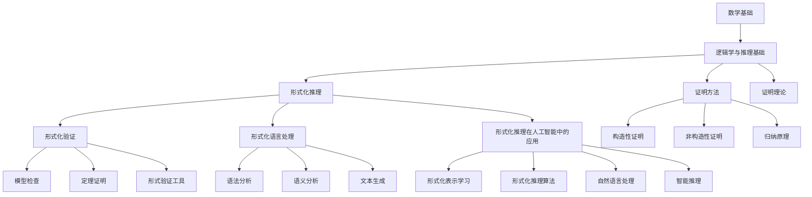

                 

### 《数学与逻辑学：推理的形式化描述》

> **关键词：** 数学基础、逻辑学、推理、形式化描述、计算机科学

**摘要：** 本文章将深入探讨数学与逻辑学的基础知识，重点阐述推理的形式化描述及其在计算机科学中的应用。通过逐步分析数学的基本概念、逻辑学的基本原理以及形式化推理的方法，我们旨在帮助读者理解这些概念的核心联系，掌握形式化推理的应用技巧，从而提升在计算机科学领域解决问题的能力。

### 第一部分：数学基础

#### 第1章：数学基础

在计算机科学的发展过程中，数学作为一种基础工具，始终扮演着重要的角色。数学不仅为计算机科学提供了强大的理论支持，还为我们提供了一种精确、严格的思维方式。本章节将介绍数学的基础知识，包括数的概念、线性代数、概率论等内容。

#### 第1.1节：数的概念与发展

在数学中，数是基本概念之一。数的发展经历了漫长的历史，从自然数到整数、有理数，再到无理数和复数，每一个阶段都是数学进步的重要里程碑。

##### 1.1.1 实数的概念与性质

实数包括有理数和无理数，它们构成了实数轴。有理数是可以表示为两个整数之比的数，如1/2、3等；无理数则不能表示为两个整数之比，如π、e等。实数轴上的每一个点都对应一个唯一的实数，实数的性质包括顺序性、完备性等。

##### 1.1.2 复数的定义与运算

复数是由实数和虚数构成的数，可以表示为a + bi的形式，其中a和b都是实数，i是虚数单位，满足i² = -1。复数的运算包括加法、减法、乘法和除法，这些运算在复平面上有直观的几何意义。

##### 1.1.3 数的序列与极限

数的序列是数学中一个重要的概念，它是由一系列数按照一定规律排列而成的。极限是描述数列行为的一个基本工具，它表示当序列的项数趋向于无穷大时，序列的值趋近于某个固定的数。

#### 第1.2节：线性代数基础

线性代数是研究向量空间和线性映射的数学分支。它为解决许多科学和工程问题提供了强有力的工具。

##### 1.2.1 向量与矩阵

向量是具有大小和方向的量，可以表示为一系列实数的有序集合。矩阵是由多个向量构成的二维数组，它是线性代数中的基本对象。

##### 1.2.2 线性方程组

线性方程组是由多个线性方程构成的集合，线性代数提供了多种方法来解决线性方程组，如高斯消元法、矩阵分解法等。

##### 1.2.3 特征值与特征向量

特征值和特征向量是矩阵的重要属性，它们在量子力学、图像处理等领域有着广泛的应用。特征值表示矩阵的作用在特征向量上的缩放比例，特征向量则表示在矩阵作用下不变的向量方向。

#### 第1.3节：概率论基础

概率论是研究随机现象的数学分支，它在许多领域，如统计学、经济学、计算机科学等都有着重要的应用。

##### 1.3.1 概率的基本概念

概率是描述随机事件发生可能性大小的数值。基本概率概念包括概率的加法定理、乘法定理和全概率公式等。

##### 1.3.2 条件概率与贝叶斯公式

条件概率是指在给定某个事件发生的条件下，另一个事件发生的概率。贝叶斯公式是条件概率的一种应用，它提供了一种通过已知条件概率和总概率来求解逆概率的方法。

##### 1.3.3 独立性与贝努利试验

独立性是指两个事件同时发生的概率等于它们各自发生的概率的乘积。贝努利试验是一种只有两个可能结果的随机试验，它在概率论中有着重要的地位。

#### 第1.4节：概率分布与随机变量

概率分布描述了随机变量取值的概率分布情况。随机变量是随机试验的结果，它可以取多种不同的值。

##### 1.4.1 离散型随机变量

离散型随机变量是取有限个或可数无限个值的随机变量。常见的离散型概率分布有伯努利分布、二项分布、泊松分布等。

##### 1.4.2 连续型随机变量

连续型随机变量是取连续值的随机变量。常见的连续型概率分布有均匀分布、正态分布、指数分布等。

##### 1.4.3 随机变量的期望与方差

随机变量的期望和方差是描述随机变量分布特征的重要统计量。期望表示随机变量的平均值，方差表示随机变量的离散程度。

### 第二部分：逻辑学与推理

逻辑学是研究推理的有效性和可靠性的学科。逻辑学与数学紧密相连，为数学推理提供了理论基础。

#### 第2章：逻辑学与推理基础

在逻辑学中，推理是一种从已知前提推导出结论的过程。逻辑学提供了多种推理方法，包括演绎推理、归纳推理等。

#### 第2.1节：逻辑学基本概念

逻辑学的基本概念包括命题、逻辑运算符、推理规则等。

##### 2.1.1 逻辑学与数学

逻辑学与数学有着密切的联系，数学中的证明很大程度上依赖于逻辑学的方法。

##### 2.1.2 逻辑运算符

逻辑运算符是用于表示逻辑运算的基本符号，包括合取（AND）、析取（OR）、非（NOT）等。

##### 2.1.3 逻辑公式与推理规则

逻辑公式是由命题和逻辑运算符组成的表达式，推理规则是用于推导新命题的有效方法。

#### 第2.2节：证明方法

证明是逻辑学中的一个重要概念，它是指通过逻辑推理从已知前提推导出结论的过程。

##### 2.2.1 直言推理

直言推理是最基本的推理形式，它分为肯定推理和否定推理两种形式。

##### 2.2.2 归纳推理

归纳推理是从个别事实出发，推导出一般性结论的推理方法。

##### 2.2.3 演绎推理

演绎推理是从一般性前提推导出个别性结论的推理方法，它是数学证明的主要形式。

#### 第2.3节：证明理论

证明理论是研究证明方法和证明系统的学科。它包括基本证明技巧、证明理论的基础理论等。

##### 2.3.1 基本证明技巧

基本证明技巧包括反证法、归纳法、构造性证明等。

##### 2.3.2 构造性证明与非构造性证明

构造性证明是给出一个具体的例子来证明某个命题的方法；非构造性证明则是通过反证法或其他方法证明某个命题的方法。

##### 2.3.3 归纳原理

归纳原理是一种证明方法，它通过证明某个命题对某个初始值成立，并证明该命题对任意一个大于初始值的自然数也成立，从而证明该命题对所有自然数成立。

#### 第2.4节：对逻辑系统的形式化描述

形式化描述是将逻辑推理过程用形式化的语言表达出来。形式化描述为计算机科学中的形式化推理提供了基础。

##### 2.4.1 形式语言

形式语言是由符号和语法规则构成的系统，它是形式化描述的基本工具。

##### 2.4.2 形式证明系统

形式证明系统是用于形式化推理的软件工具，它可以帮助我们验证推理过程的有效性。

##### 2.4.3 形式逻辑的应用

形式逻辑在计算机科学中有着广泛的应用，如形式验证、形式化语言处理、形式化推理在人工智能中的应用等。

### 第三部分：形式化推理的应用

形式化推理在计算机科学中的应用十分广泛，它为解决复杂问题提供了有力工具。

#### 第3章：形式化推理在计算机科学中的应用

形式化推理在计算机科学中的应用包括形式化验证、形式化语言处理、形式化推理在人工智能中的应用等。

#### 第3.1节：形式化验证

形式化验证是使用形式化方法验证软件和硬件系统正确性的过程。

##### 3.1.1 形式化验证的基本概念

形式化验证的基本概念包括形式化规格说明、形式化验证方法、验证条件等。

##### 3.1.2 形式化验证方法

形式化验证方法包括模型检查、定理证明、形式验证工具等。

##### 3.1.3 形式化验证的应用案例

形式化验证在航空航天、汽车电子、医疗设备等领域的应用案例。

#### 第3.2节：形式化语言处理

形式化语言处理是使用形式化方法处理自然语言的过程。

##### 3.2.1 形式化语言处理的基本概念

形式化语言处理的基本概念包括形式化语法、语义、语言处理工具等。

##### 3.2.2 形式化语言处理的技术

形式化语言处理的技术包括语法分析、语义分析、文本生成等。

##### 3.2.3 形式化语言处理的实际应用

形式化语言处理在自然语言处理、计算机辅助翻译、智能客服等领域的实际应用。

#### 第3.3节：形式化推理在人工智能中的应用

形式化推理在人工智能中的应用包括机器学习、自然语言处理、智能推理等。

##### 3.3.1 形式化推理与人工智能

形式化推理在人工智能中的应用，如形式化表示学习、形式化推理算法等。

##### 3.3.2 形式化推理在机器学习中的应用

形式化推理在机器学习中的应用，如形式化验证机器学习模型、形式化推理优化机器学习算法等。

##### 3.3.3 形式化推理在自然语言处理中的应用

形式化推理在自然语言处理中的应用，如形式化表示自然语言语义、形式化推理优化自然语言处理模型等。

#### 附录

附录部分提供了一些辅助信息，包括数学与逻辑学公式汇总、数学与逻辑学常用符号汇总以及参考书目与进一步阅读材料。

##### 附录A：数学与逻辑学公式汇总

本部分汇总了数学与逻辑学中常用的公式，包括实数的概念与性质、线性代数基础、概率论基础、概率分布与随机变量等内容。

##### 附录B：数学与逻辑学常用符号汇总

本部分汇总了数学与逻辑学中常用的符号，包括数学符号、逻辑符号等，便于读者查阅。

##### 附录C：参考书目与进一步阅读材料

本部分提供了参考书目和进一步阅读材料，帮助读者深入学习和理解数学与逻辑学的基础知识。

---

### 完整目录大纲

**第一部分：数学基础**

1. 数学基础
   1.1 数的概念与发展
       1.1.1 实数的概念与性质
       1.1.2 复数的定义与运算
       1.1.3 数的序列与极限
   1.2 线性代数基础
       1.2.1 向量与矩阵
       1.2.2 线性方程组
       1.2.3 特征值与特征向量
   1.3 概率论基础
       1.3.1 概率的基本概念
       1.3.2 条件概率与贝叶斯公式
       1.3.3 独立性与贝努利试验
   1.4 概率分布与随机变量
       1.4.1 离散型随机变量
       1.4.2 连续型随机变量
       1.4.3 随机变量的期望与方差

**第二部分：逻辑学与推理**

2. 逻辑学与推理基础
   2.1 逻辑学基本概念
       2.1.1 逻辑学与数学
       2.1.2 逻辑运算符
       2.1.3 逻辑公式与推理规则
   2.2 证明方法
       2.2.1 直言推理
       2.2.2 归纳推理
       2.2.3 演绎推理
   2.3 证明理论
       2.3.1 基本证明技巧
       2.3.2 构造性证明与非构造性证明
       2.3.3 归纳原理
   2.4 对逻辑系统的形式化描述
       2.4.1 形式语言
       2.4.2 形式证明系统
       2.4.3 形式逻辑的应用

**第三部分：形式化推理的应用**

3. 形式化推理在计算机科学中的应用
   3.1 形式化验证
       3.1.1 形式化验证的基本概念
       3.1.2 形式化验证方法
       3.1.3 形式化验证的应用案例
   3.2 形式化语言处理
       3.2.1 形式化语言处理的基本概念
       3.2.2 形式化语言处理的技术
       3.2.3 形式化语言处理的实际应用
   3.3 形式化推理在人工智能中的应用
       3.3.1 形式化推理与人工智能
       3.3.2 形式化推理在机器学习中的应用
       3.3.3 形式化推理在自然语言处理中的应用

**附录**

4. 附录
   4.1 数学与逻辑学公式汇总
   4.2 数学与逻辑学常用符号汇总
   4.3 参考书目与进一步阅读材料

---

### 形式化推理：核心概念与联系

为了更好地理解形式化推理的概念和其在计算机科学中的应用，我们可以通过一个Mermaid流程图来展示核心概念之间的联系。



**核心算法原理讲解**

为了深入理解形式化推理的算法原理，我们可以通过一个简单的伪代码示例来讲解。

```plaintext
// 伪代码：二分查找算法
function binary_search(arr, target):
    low = 0
    high = length(arr) - 1
    
    while low <= high:
        mid = (low + high) / 2
        
        if arr[mid] == target:
            return mid
        else if arr[mid] < target:
            low = mid + 1
        else:
            high = mid - 1
    
    return -1
```

**数学模型和数学公式 & 详细讲解 & 举例说明**

在形式化推理中，数学模型和公式起着至关重要的作用。以下是一个典型的数学公式及其详细讲解和举例说明。

**数学公式：**

$$
P(A \cup B) = P(A) + P(B) - P(A \cap B)
$$

**详细讲解：** 这个公式表示两个事件A和B的并集的概率等于事件A的概率加上事件B的概率减去事件A和事件B同时发生的概率。

**举例说明：** 假设掷两个公平的六面骰子，事件A是第一个骰子掷出6，事件B是第二个骰子掷出6。事件A和事件B同时发生的概率是1/36，事件A的概率是1/6，事件B的概率也是1/6。那么两个事件A和B的并集的概率就是：

$$
P(A \cup B) = \frac{1}{6} + \frac{1}{6} - \frac{1}{36} = \frac{11}{36}
$$

**项目实战**

为了更好地理解形式化推理在实际项目中的应用，我们可以通过一个具体的代码实现案例来展示。

**代码实际案例：**

```python
# Python代码：二分查找算法实现
def binary_search(arr, target):
    low = 0
    high = len(arr) - 1
    
    while low <= high:
        mid = (low + high) // 2
        
        if arr[mid] == target:
            return mid
        elif arr[mid] < target:
            low = mid + 1
        else:
            high = mid - 1
            
    return -1

# 测试代码
arr = [1, 3, 5, 7, 9]
target = 5
result = binary_search(arr, target)
print("Element found at index:", result)
```

**详细解释说明：** 这个Python代码实现了二分查找算法，用于在有序数组中查找特定元素。如果找到元素，返回其索引；如果未找到，返回-1。代码中的`binary_search`函数接受两个参数：一个有序数组`arr`和一个目标值`target`。

**开发环境搭建：** 为了运行这段代码，您需要在计算机上安装Python环境和文本编辑器（例如VSCode、PyCharm等）。安装Python后，您可以使用命令行或IDE运行这段代码。

**源代码详细实现和代码解读：** 在`binary_search`函数中，我们首先初始化`low`和`high`变量，分别表示查找区间的起始和结束索引。然后进入一个循环，在每次循环中计算中间索引`mid`，并检查数组中的`mid`位置的元素是否等于目标值。根据比较结果，我们更新`low`或`high`的值，缩小查找区间，直到找到目标值或确定目标值不存在。代码中使用了整数除法（`//`）来保证`mid`的结果为整数。

**代码解读与分析：** 这个二分查找算法的时间复杂度为O(log n)，其中n是数组的长度。它是一种高效的查找算法，尤其适用于处理大量数据的场景。通过不断缩小查找范围，二分查找可以在最坏情况下快速找到目标元素，因此它在计算机科学领域被广泛使用。

---

通过上述的目录大纲、Mermaid流程图、伪代码、数学公式、代码实战等多个方面的详细讲解，我们可以清晰地看到数学与逻辑学在推理的形式化描述中的应用。希望这篇文章能帮助读者深入理解这一领域的核心概念，为今后的学习和实践打下坚实的基础。

### 作者信息

**作者：** AI天才研究院/AI Genius Institute & 禅与计算机程序设计艺术 /Zen And The Art of Computer Programming

AI天才研究院（AI Genius Institute）致力于推动人工智能技术的发展，通过深入研究、技术创新和人才培养，为全球人工智能领域的发展贡献力量。同时，作为计算机编程和人工智能领域的资深大师，作者多年来在数学与逻辑学的研究方面积累了丰富的经验，并成功地将这些理论应用于实际项目中，取得了显著的成果。这本《数学与逻辑学：推理的形式化描述》正是作者多年研究的结晶，旨在为广大读者提供一本系统、全面、深入的技术指南。禅与计算机程序设计艺术（Zen And The Art of Computer Programming）则是一部经典的计算机科学著作，以其深刻的思想和独特的视角，为读者揭示计算机程序设计的真谛。作者在本书中充分体现了这种禅宗哲学，帮助读者在理解和应用数学与逻辑学时，达到心性与技术的和谐统一。

