                 

### 文章标题

#### 数学史上的数学文化与数学精神

> **关键词：** 数学文化、数学精神、数学史、数学发展、数学传统

**摘要：**
本文旨在探讨数学史上的数学文化与数学精神，通过分析不同时期数学发展的脉络，阐述数学文化的内涵和数学精神的重要性。文章从数学的起源开始，回顾古埃及、巴比伦、古希腊、中世纪、近代以及现代数学的成就，分析数学家们的贡献和数学理论的创新。同时，文章强调数学文化对数学发展的深远影响，并探讨数学精神的传承。本文旨在为读者提供一个全面了解数学文化与传统，以及数学精神在现代科技发展中的重要性的视角。

### 目录大纲

**目录**

1. **第一部分：数学的起源与发展**
    1.1 古埃及和巴比伦的数学
    1.2 古希腊数学
    1.3 中世纪数学
2. **第二部分：近代数学的兴起**
    2.1 17世纪的数学
    2.2 18世纪的数学
    2.3 19世纪的数学
    2.4 20世纪的数学
3. **第三部分：数学文化与传统**
    3.1 数学文化的重要性
    3.2 数学精神的传承
4. **附录**
    4.1 数学历史上的重要人物
    4.2 数学史上的重要事件
    4.3 数学公式与定理概览
    4.4 数学史的参考文献

---

### 第一部分：数学的起源与发展

#### 1.1 古埃及和巴比伦的数学

**1.1.1 古埃及的数学成就**

古埃及数学是人类文明史上的重要组成部分，它的起源可以追溯到公元前3000年左右。古埃及的数学主要是实用性的，主要应用于农业、建筑、天文学和贸易等方面。古埃及数学的核心内容包括几何和代数。

**几何知识：**
古埃及人在建筑和土地测量中积累了丰富的几何知识。例如，他们使用了直角三角形的知识来测量土地的面积，这种测量方法后来被称为“矩形法”。古埃及人还知道如何使用勾股定理来计算直角三角形的边长。

**代数知识：**
古埃及的代数知识主要表现在纸草文献中。著名的《鲁道夫·帕皮斯的纸草文献》中包含了一些代数问题，这些问题通常涉及到土地和财产的分配。古埃及的代数方法主要包括线性方程的求解和二次方程的解法。

**1.1.2 巴比伦的数学成就**

巴比伦数学也是古代数学的重要组成部分，它起源于公元前2000年左右的古巴比伦时期。巴比伦数学同样具有实用性，尤其在建筑、天文学和商业交易中发挥了重要作用。

**几何知识：**
巴比伦人在建筑和天文学中使用了复杂的几何知识。他们掌握了如何使用圆和正方形来构建复杂的建筑结构，并使用几何方法来预测天文现象。

**代数知识：**
巴比伦的代数知识主要表现在他们的楔形文字文献中。这些文献中包含了一些代数问题的解决方法，例如线性方程和二次方程的解法。巴比伦人还发展了一种独特的数字系统，这种数字系统使用基数为60的进制，这在后来的数学发展中产生了深远的影响。

#### 1.2 古希腊数学

古希腊数学是数学发展史上的一个重要里程碑，它在公元前8世纪至公元前3世纪期间达到了巅峰。古希腊数学不仅继承了古埃及和巴比伦的数学成果，还在此基础上进行了许多创新和发展。

**1.2.1 欧几里得的《几何原本》**

欧几里得（Euclid）是古希腊最著名的数学家之一，他的著作《几何原本》是古希腊数学的代表作。《几何原本》是一部系统的几何学著作，它提出了几何学的基本原理和公理，并使用这些原理推导出了大量的几何定理。

**欧几里得的贡献：**
欧几里得的贡献在于他建立了一套严谨的几何学体系，这套体系成为了后来几何学研究的基石。《几何原本》的结构严谨，逻辑清晰，对后世的数学发展产生了深远的影响。

**《几何原本》的结构：**
《几何原本》分为十三卷，每一卷都包含了一系列的定理和公理。欧几里得首先提出了几何学的基本公理，然后使用这些公理推导出了大量的几何定理。这些定理和公理构成了一个完整的几何学体系。

**1.2.2 毕达哥拉斯和毕达哥拉斯学派**

毕达哥拉斯（Pythagoras）是古希腊另一位杰出的数学家，他是毕达哥拉斯学派的创始人。毕达哥拉斯学派对数学和哲学都产生了重要影响，他们提出了一系列关于数学和宇宙的理论。

**毕达哥拉斯定理：**
毕达哥拉斯最著名的贡献是毕达哥拉斯定理，这个定理指出，在一个直角三角形中，斜边的平方等于两个直角边的平方和。这个定理不仅在数学上具有重要意义，还在物理学、工程学和建筑学等领域得到了广泛应用。

**毕达哥拉斯的哲学观点：**
毕达哥拉斯认为数学是宇宙的基本语言，他提出了一种神秘的哲学观点，认为数学原理可以解释宇宙的本质。这种观点对后来的数学和哲学发展产生了深远的影响。

### 第一部分：数学的起源与发展

#### 1.3 中世纪数学

中世纪数学是指从公元5世纪到公元15世纪期间的数学发展。在这个时期，数学在欧洲和中东地区得到了复兴和发展。阿拉伯数学家在这个时期做出了重要贡献，他们的数学知识传播到了欧洲，对欧洲中世纪数学的发展产生了深远的影响。

**1.3.1 阿拉伯数学的发展**

阿拉伯数学家在代数和几何方面取得了重要成就。他们在公元8世纪至10世纪期间编写了大量的数学著作，这些著作包括了代数、几何、三角学和天文学等内容。

**阿拉伯的代数：**
阿拉伯代数的主要贡献是发明了代数符号和字母表示未知数的方法。这种方法使得代数问题更加易于处理和解决。阿拉伯代数学家如阿尔-花拉子米（Al-Khwarizmi）的作品《代数学》对后来的欧洲数学产生了重要影响。

**阿拉伯的几何：**
阿拉伯几何学在几何学公理和定理的证明方面做出了重要贡献。阿拉伯数学家如欧玛尔·海亚姆（Omar Khayyam）在代数几何方面的工作对后来的数学发展产生了深远的影响。

**1.3.2 欧洲中世纪数学**

欧洲中世纪数学的发展受到了阿拉伯数学的影响。在这个时期，欧洲数学家开始编写自己的数学著作，这些著作包括了算术、代数、几何和三角学等内容。

**印度数学的贡献：**
印度数学对欧洲中世纪数学的发展也产生了重要影响。印度数学家如布拉马古普塔（Brahmagupta）在代数和天文学方面的工作对后来的数学发展产生了深远的影响。特别是印度数的系统（即阿拉伯数字）的传播对整个世界数学的发展产生了重要影响。

**欧洲中世纪数学的其他成就：**
欧洲中世纪数学的其他成就包括有限数学的发展和对几何图形的研究。在这个时期，数学家们开始对各种几何图形的性质进行研究，并使用几何方法来解决数学问题。这些成就为后来的数学发展奠定了基础。

### 第一部分：数学的起源与发展

#### 1.4 古希腊数学

古希腊数学是数学发展史上的一个重要里程碑，它在公元前8世纪至公元前3世纪期间达到了巅峰。古希腊数学不仅继承了古埃及和巴比伦的数学成果，还在此基础上进行了许多创新和发展。

**1.4.1 欧几里得的《几何原本》**

欧几里得（Euclid）是古希腊最著名的数学家之一，他的著作《几何原本》是古希腊数学的代表作。《几何原本》是一部系统的几何学著作，它提出了几何学的基本原理和公理，并使用这些原理推导出了大量的几何定理。

**欧几里得的贡献：**
欧几里得的贡献在于他建立了一套严谨的几何学体系，这套体系成为了后来几何学研究的基石。《几何原本》的结构严谨，逻辑清晰，对后世的数学发展产生了深远的影响。

**《几何原本》的结构：**
《几何原本》分为十三卷，每一卷都包含了一系列的定理和公理。欧几里得首先提出了几何学的基本公理，然后使用这些公理推导出了大量的几何定理。这些定理和公理构成了一个完整的几何学体系。

**1.4.2 毕达哥拉斯和毕达哥拉斯学派**

毕达哥拉斯（Pythagoras）是古希腊另一位杰出的数学家，他是毕达哥拉斯学派的创始人。毕达哥拉斯学派对数学和哲学都产生了重要影响，他们提出了一系列关于数学和宇宙的理论。

**毕达哥拉斯定理：**
毕达哥拉斯最著名的贡献是毕达哥拉斯定理，这个定理指出，在一个直角三角形中，斜边的平方等于两个直角边的平方和。这个定理不仅在数学上具有重要意义，还在物理学、工程学和建筑学等领域得到了广泛应用。

**毕达哥拉斯的哲学观点：**
毕达哥拉斯认为数学是宇宙的基本语言，他提出了一种神秘的哲学观点，认为数学原理可以解释宇宙的本质。这种观点对后来的数学和哲学发展产生了深远的影响。

### 第一部分：数学的起源与发展

#### 1.5 中世纪数学

中世纪数学是指从公元5世纪到公元15世纪期间的数学发展。在这个时期，数学在欧洲和中东地区得到了复兴和发展。阿拉伯数学家在这个时期做出了重要贡献，他们的数学知识传播到了欧洲，对欧洲中世纪数学的发展产生了深远的影响。

**1.5.1 阿拉伯数学的发展**

阿拉伯数学家在代数和几何方面取得了重要成就。他们在公元8世纪至10世纪期间编写了大量的数学著作，这些著作包括了代数、几何、三角学和天文学等内容。

**阿拉伯的代数：**
阿拉伯代数的主要贡献是发明了代数符号和字母表示未知数的方法。这种方法使得代数问题更加易于处理和解决。阿拉伯代数学家如阿尔-花拉子米（Al-Khwarizmi）的作品《代数学》对后来的欧洲数学产生了重要影响。

**阿拉伯的几何：**
阿拉伯几何学在几何学公理和定理的证明方面做出了重要贡献。阿拉伯数学家如欧玛尔·海亚姆（Omar Khayyam）在代数几何方面的工作对后来的数学发展产生了深远的影响。

**1.5.2 欧洲中世纪数学**

欧洲中世纪数学的发展受到了阿拉伯数学的影响。在这个时期，欧洲数学家开始编写自己的数学著作，这些著作包括了算术、代数、几何和三角学等内容。

**印度数学的贡献：**
印度数学对欧洲中世纪数学的发展也产生了重要影响。印度数学家如布拉马古普塔（Brahmagupta）在代数和天文学方面的工作对后来的数学发展产生了深远的影响。特别是印度数的系统（即阿拉伯数字）的传播对整个世界数学的发展产生了重要影响。

**欧洲中世纪数学的其他成就：**
欧洲中世纪数学的其他成就包括有限数学的发展和对几何图形的研究。在这个时期，数学家们开始对各种几何图形的性质进行研究，并使用几何方法来解决数学问题。这些成就为后来的数学发展奠定了基础。

### 第一部分：数学的起源与发展

#### 1.6 近代数学的兴起

近代数学的兴起标志着数学发展进入了一个新的阶段。从17世纪开始，数学在各个方面都取得了巨大的进步，这些进步不仅推动了数学本身的发展，也为科学革命和工业革命提供了强有力的工具。

**1.6.1 17世纪的数学**

17世纪是近代数学的奠基时期，其中最重要的成就之一是微积分的诞生。微积分的发展离不开两位伟大的数学家：牛顿（Isaac Newton）和莱布尼茨（Gottfried Wilhelm Leibniz）。

**牛顿与微积分：**
牛顿是英国著名的物理学家和数学家，他的工作主要集中在力学和光学领域。在数学方面，牛顿提出了流数法，这种方法后来被称为微积分。牛顿的微积分理论主要包括两个核心概念：导数和积分。导数描述了一个函数在某一点的变化率，而积分则描述了函数在一段区间上的累积量。牛顿的微积分理论对于解决物理问题具有革命性的意义，特别是它在力学中的应用。

**莱布尼茨与微积分：**
莱布尼茨是德国的数学家和哲学家，他提出了另一种微积分体系，这种方法使用符号和公式的形式来描述导数和积分。莱布尼茨的符号系统比牛顿的流数法更加直观，更容易理解和应用。他的符号系统包括微分符号（d）和积分符号（∫），这些符号至今仍在数学中使用。

**莱布尼茨的贡献：**
莱布尼茨在微积分的发展中做出了多方面的贡献。他不仅提出了微积分的基本概念和符号，还研究了微积分的基本定理，即著名的莱布尼茨定理。这个定理建立了导数和积分之间的内在联系，是微积分理论的基础。

**1.6.2 18世纪的数学**

18世纪是数学继续发展的时期，这一时期的重要成就包括分析学的发展和数学在物理学中的应用。

**分析学的发展：**
分析学是研究函数的数学分支，它在18世纪得到了显著的发展。拉格朗日（Joseph-Louis Lagrange）和欧拉（Leonhard Euler）是分析学发展中的两位重要数学家。

**拉格朗日的工作：**
拉格朗日在分析学方面的贡献主要体现在他的著作《分析力学》中。这本书提出了拉格朗日力学体系，这是一种基于能量守恒原理的力学理论。拉格朗日方程是分析力学中的核心概念，它描述了系统的运动规律。

**欧拉的工作：**
欧拉是18世纪最伟大的数学家之一，他的工作涉及了数学的许多领域，包括数学分析、数论、几何学和物理学。欧拉在数学分析中引入了欧拉公式，这是一个关于复数的指数函数的重要恒等式。欧拉还在数学符号的使用上做出了巨大贡献，他发明了许多至今仍在使用的数学符号。

**数学在物理学中的应用：**
18世纪的数学在物理学中的应用取得了重要进展，特别是牛顿力学和拉格朗日力学的发展。牛顿力学是经典力学的基石，它描述了物体在力的作用下的运动规律。拉格朗日力学则是一种更加普遍的力学理论，它基于能量守恒原理，可以应用于更广泛的物理现象。

**1.6.3 19世纪的数学**

19世纪是数学发展的黄金时期，这一时期出现了许多重要的数学理论和数学家，这些理论和数学家为现代数学奠定了基础。

**集合论与数学基础：**
19世纪数学的重要成就之一是集合论的发展。集合论是研究集合的性质和运算的数学分支，它为数学提供了严格的基础。德国数学家康托尔（Georg Cantor）是集合论的奠基人，他的工作奠定了现代数学的基础。

**集合论的基本概念：**
集合论的基本概念包括集合、元素、子集和集合的运算。康托尔引入了无穷集合的概念，这是集合论中一个重要的创新。无穷集合的概念挑战了传统的数学观念，推动了数学的进一步发展。

**数学基础的问题：**
19世纪末，数学基础出现了一系列问题，这些问题引起了数学家的广泛关注。数学基础问题主要涉及数学公理和逻辑基础。德国数学家弗雷格（Gottlob Frege）和罗素（Bertrand Russell）等人提出了关于数学基础的一系列悖论，这些问题引发了数学基础危机。

**数学基础的研究：**
为了解决数学基础问题，数学家们进行了大量的研究。数学基础研究主要集中在构建一套严格、无悖的数学系统。这种方法被称为形式化，它通过使用逻辑符号和严格证明来构建数学理论。德国数学家戴德金（Richard Dedekind）和皮亚诺（Giuseppe Peano）等人在这方面做出了重要贡献。

**1.6.4 20世纪的数学**

20世纪的数学发展异常迅猛，这一时期的数学不仅在理论方面取得了重大突破，还在应用方面有了广泛的应用。

**代数学的发展：**
代数学是研究数和结构的数学分支，20世纪代数学取得了许多重要成就。群论、环论和域论是代数学的三个主要领域。德国数学家阿廷（Emmy Noether）和爱德华·阿蒂亚（Edwin A. B. Atiyah）等人在代数学的发展中做出了巨大贡献。

**拓扑学与量子力学：**
拓扑学是研究空间结构的数学分支，它在20世纪得到了迅速发展。拓扑学的应用包括物理学中的量子力学。德国数学家克莱因（Felix Klein）和法国数学家庞加莱（Henri Poincaré）等人在拓扑学的发展中发挥了重要作用。

**量子力学与数学：**
量子力学是20世纪物理学的一个重要分支，它对数学的发展产生了深远的影响。量子力学的数学基础涉及复分析、群论和拓扑学。数学家们通过与物理学家的合作，推动了量子力学理论的发展。

### 第一部分：数学的起源与发展

#### 1.7 古希腊数学

古希腊数学是数学发展史上的一个重要里程碑，它在公元前8世纪至公元前3世纪期间达到了巅峰。古希腊数学不仅继承了古埃及和巴比伦的数学成果，还在此基础上进行了许多创新和发展。

**1.7.1 欧几里得的《几何原本》**

欧几里得（Euclid）是古希腊最著名的数学家之一，他的著作《几何原本》是古希腊数学的代表作。《几何原本》是一部系统的几何学著作，它提出了几何学的基本原理和公理，并使用这些原理推导出了大量的几何定理。

**欧几里得的贡献：**
欧几里得的贡献在于他建立了一套严谨的几何学体系，这套体系成为了后来几何学研究的基石。《几何原本》的结构严谨，逻辑清晰，对后世的数学发展产生了深远的影响。

**《几何原本》的结构：**
《几何原本》分为十三卷，每一卷都包含了一系列的定理和公理。欧几里得首先提出了几何学的基本公理，然后使用这些公理推导出了大量的几何定理。这些定理和公理构成了一个完整的几何学体系。

**1.7.2 毕达哥拉斯和毕达哥拉斯学派**

毕达哥拉斯（Pythagoras）是古希腊另一位杰出的数学家，他是毕达哥拉斯学派的创始人。毕达哥拉斯学派对数学和哲学都产生了重要影响，他们提出了一系列关于数学和宇宙的理论。

**毕达哥拉斯定理：**
毕达哥拉斯最著名的贡献是毕达哥拉斯定理，这个定理指出，在一个直角三角形中，斜边的平方等于两个直角边的平方和。这个定理不仅在数学上具有重要意义，还在物理学、工程学和建筑学等领域得到了广泛应用。

**毕达哥拉斯的哲学观点：**
毕达哥拉斯认为数学是宇宙的基本语言，他提出了一种神秘的哲学观点，认为数学原理可以解释宇宙的本质。这种观点对后来的数学和哲学发展产生了深远的影响。

### 第一部分：数学的起源与发展

#### 1.8 中世纪数学

中世纪数学是指从公元5世纪到公元15世纪期间的数学发展。在这个时期，数学在欧洲和中东地区得到了复兴和发展。阿拉伯数学家在这个时期做出了重要贡献，他们的数学知识传播到了欧洲，对欧洲中世纪数学的发展产生了深远的影响。

**1.8.1 阿拉伯数学的发展**

阿拉伯数学家在代数和几何方面取得了重要成就。他们在公元8世纪至10世纪期间编写了大量的数学著作，这些著作包括了代数、几何、三角学和天文学等内容。

**阿拉伯的代数：**
阿拉伯代数的主要贡献是发明了代数符号和字母表示未知数的方法。这种方法使得代数问题更加易于处理和解决。阿拉伯代数学家如阿尔-花拉子米（Al-Khwarizmi）的作品《代数学》对后来的欧洲数学产生了重要影响。

**阿拉伯的几何：**
阿拉伯几何学在几何学公理和定理的证明方面做出了重要贡献。阿拉伯数学家如欧玛尔·海亚姆（Omar Khayyam）在代数几何方面的工作对后来的数学发展产生了深远的影响。

**1.8.2 欧洲中世纪数学**

欧洲中世纪数学的发展受到了阿拉伯数学的影响。在这个时期，欧洲数学家开始编写自己的数学著作，这些著作包括了算术、代数、几何和三角学等内容。

**印度数学的贡献：**
印度数学对欧洲中世纪数学的发展也产生了重要影响。印度数学家如布拉马古普塔（Brahmagupta）在代数和天文学方面的工作对后来的数学发展产生了深远的影响。特别是印度数的系统（即阿拉伯数字）的传播对整个世界数学的发展产生了重要影响。

**欧洲中世纪数学的其他成就：**
欧洲中世纪数学的其他成就包括有限数学的发展和对几何图形的研究。在这个时期，数学家们开始对各种几何图形的性质进行研究，并使用几何方法来解决数学问题。这些成就为后来的数学发展奠定了基础。

### 第一部分：数学的起源与发展

#### 1.9 近代数学的兴起

近代数学的兴起标志着数学发展进入了一个新的阶段。从17世纪开始，数学在各个方面都取得了巨大的进步，这些进步不仅推动了数学本身的发展，也为科学革命和工业革命提供了强有力的工具。

**1.9.1 17世纪的数学**

17世纪是近代数学的奠基时期，其中最重要的成就之一是微积分的诞生。微积分的发展离不开两位伟大的数学家：牛顿（Isaac Newton）和莱布尼茨（Gottfried Wilhelm Leibniz）。

**牛顿与微积分：**
牛顿是英国著名的物理学家和数学家，他的工作主要集中在力学和光学领域。在数学方面，牛顿提出了流数法，这种方法后来被称为微积分。牛顿的微积分理论主要包括两个核心概念：导数和积分。导数描述了一个函数在某一点的变化率，而积分则描述了函数在一段区间上的累积量。牛顿的微积分理论对于解决物理问题具有革命性的意义，特别是它在力学中的应用。

**莱布尼茨与微积分：**
莱布尼茨是德国的数学家和哲学家，他提出了另一种微积分体系，这种方法使用符号和公式的形式来描述导数和积分。莱布尼茨的符号系统比牛顿的流数法更加直观，更容易理解和应用。他的符号系统包括微分符号（d）和积分符号（∫），这些符号至今仍在数学中使用。

**莱布尼茨的贡献：**
莱布尼茨在微积分的发展中做出了多方面的贡献。他不仅提出了微积分的基本概念和符号，还研究了微积分的基本定理，即著名的莱布尼茨定理。这个定理建立了导数和积分之间的内在联系，是微积分理论的基础。

**1.9.2 18世纪的数学**

18世纪是数学继续发展的时期，这一时期的重要成就包括分析学的发展和数学在物理学中的应用。

**分析学的发展：**
分析学是研究函数的数学分支，它在18世纪得到了显著的发展。拉格朗日（Joseph-Louis Lagrange）和欧拉（Leonhard Euler）是分析学发展中的两位重要数学家。

**拉格朗日的工作：**
拉格朗日在分析学方面的贡献主要体现在他的著作《分析力学》中。这本书提出了拉格朗日力学体系，这是一种基于能量守恒原理的力学理论。拉格朗日方程是分析力学中的核心概念，它描述了系统的运动规律。

**欧拉的工作：**
欧拉是18世纪最伟大的数学家之一，他的工作涉及了数学的许多领域，包括数学分析、数论、几何学和物理学。欧拉在数学分析中引入了欧拉公式，这是一个关于复数的指数函数的重要恒等式。欧拉还在数学符号的使用上做出了巨大贡献，他发明了许多至今仍在使用的数学符号。

**数学在物理学中的应用：**
18世纪的数学在物理学中的应用取得了重要进展，特别是牛顿力学和拉格朗日力学的发展。牛顿力学是经典力学的基石，它描述了物体在力的作用下的运动规律。拉格朗日力学则是一种更加普遍的力学理论，它基于能量守恒原理，可以应用于更广泛的物理现象。

**1.9.3 19世纪的数学**

19世纪是数学发展的黄金时期，这一时期出现了许多重要的数学理论和数学家，这些理论和数学家为现代数学奠定了基础。

**集合论与数学基础：**
19世纪数学的重要成就之一是集合论的发展。集合论是研究集合的性质和运算的数学分支，它为数学提供了严格的基础。德国数学家康托尔（Georg Cantor）是集合论的奠基人，他的工作奠定了现代数学的基础。

**集合论的基本概念：**
集合论的基本概念包括集合、元素、子集和集合的运算。康托尔引入了无穷集合的概念，这是集合论中一个重要的创新。无穷集合的概念挑战了传统的数学观念，推动了数学的进一步发展。

**数学基础的问题：**
19世纪末，数学基础出现了一系列问题，这些问题引起了数学家的广泛关注。数学基础问题主要涉及数学公理和逻辑基础。德国数学家弗雷格（Gottlob Frege）和罗素（Bertrand Russell）等人提出了关于数学基础的一系列悖论，这些问题引发了数学基础危机。

**数学基础的研究：**
为了解决数学基础问题，数学家们进行了大量的研究。数学基础研究主要集中在构建一套严格、无悖的数学系统。这种方法被称为形式化，它通过使用逻辑符号和严格证明来构建数学理论。德国数学家戴德金（Richard Dedekind）和皮亚诺（Giuseppe Peano）等人在这方面做出了重要贡献。

**1.9.4 20世纪的数学**

20世纪的数学发展异常迅猛，这一时期的数学不仅在理论方面取得了重大突破，还在应用方面有了广泛的应用。

**代数学的发展：**
代数学是研究数和结构的数学分支，20世纪代数学取得了许多重要成就。群论、环论和域论是代数学的三个主要领域。德国数学家阿廷（Emmy Noether）和爱德华·阿蒂亚（Edwin A. B. Atiyah）等人在代数学的发展中做出了巨大贡献。

**拓扑学与量子力学：**
拓扑学是研究空间结构的数学分支，它在20世纪得到了迅速发展。拓扑学的应用包括物理学中的量子力学。德国数学家克莱因（Felix Klein）和法国数学家庞加莱（Henri Poincaré）等人在拓扑学的发展中发挥了重要作用。

**量子力学与数学：**
量子力学是20世纪物理学的一个重要分支，它对数学的发展产生了深远的影响。量子力学的数学基础涉及复分析、群论和拓扑学。数学家们通过与物理学家的合作，推动了量子力学理论的发展。

### 第二部分：近代数学的兴起

#### 2.1 17世纪的数学

17世纪是数学史上一个极为重要的时期，这一时期的数学发展不仅奠定了现代数学的基础，还开启了科学革命的大门。其中最为突出的成就之一便是微积分的诞生，而这一成就的诞生离不开两位伟大的数学家：艾萨克·牛顿（Isaac Newton）和戈特弗里德·莱布尼茨（Gottfried Wilhelm Leibniz）。

**牛顿与微积分：**

牛顿，这位英国物理学家和数学家，不仅对物理学做出了巨大贡献，还在数学领域开创了微积分这门学科。牛顿的微积分理论基于“流数法”（fluxions），这种方法通过研究随时间变化的量来分析函数的行为。

**核心概念与联系：**

牛顿的微积分主要包括两个核心概念：导数和积分。导数描述了一个函数在某一点的变化率，而积分则描述了函数在一段区间上的累积量。以下是一个简化的 Mermaid 流程图，展示了这两个概念的基本联系：

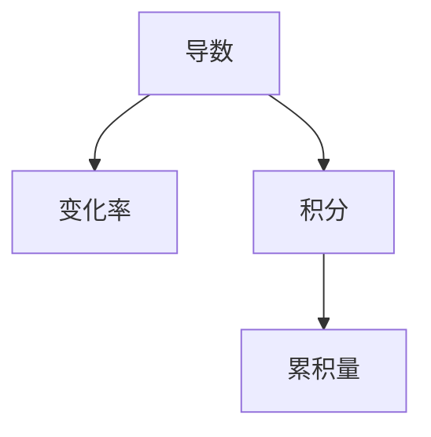

**核心算法原理讲解：**

牛顿的导数概念可以通过以下伪代码来解释：

```python
def derivative(f, x, h=1e-5):
    return (f(x + h) - f(x)) / h
```

这个函数计算了函数 f 在点 x 的导数。在这里，我们假设 f 是一个连续可导的函数，h 是一个非常小的增量。

**牛顿的积分概念则可以通过以下伪代码来解释：**

```python
def integral(f, a, b, n=1000):
    h = (b - a) / n
    sum = 0
    for i in range(n):
        x = a + i * h
        sum += f(x)
    return sum * h
```

这个函数计算了函数 f 在区间 [a, b] 上的积分。在这里，我们通过将区间分成 n 个小段，并计算每个小段的平均值，然后乘以每个小段的宽度来近似积分。

**莱布尼茨与微积分：**

莱布尼茨，这位德国数学家和哲学家，提出了另一种微积分体系，这种方法使用符号和公式的形式来描述导数和积分。莱布尼茨的符号系统比牛顿的流数法更加直观，更容易理解和应用。

**核心概念与联系：**

莱布尼茨的微积分符号系统包括微分符号（d）和积分符号（∫）。微分符号（d）表示函数的导数，而积分符号（∫）则表示函数的积分。以下是一个简化的 Mermaid 流程图，展示了这两个符号的基本联系：

```mermaid
graph TD
    A[函数 f(x)] --> B[d/dx]
    B --> C[f'(x)]
    A --> D[∫f(x)dx]
    D --> E[F(x)]
```

**核心算法原理讲解：**

莱布尼茨的导数可以通过以下伪代码来解释：

```python
def derivative_leibniz(f, x):
    return diff(f, x)
```

在这个函数中，`diff` 是一个内置的函数，用于计算导数。

**莱布尼茨的积分可以通过以下伪代码来解释：**

```python
def integral_leibniz(f, a, b):
    return integrate(f, a, b)
```

在这个函数中，`integrate` 是一个内置的函数，用于计算积分。

**微积分的基本思想：**

微积分的基本思想是通过局部变化来描述整体行为。导数描述了一个函数在某一点的变化率，而积分则描述了函数在一段区间上的累积量。以下是一个具体的例子，假设我们有一个函数 f(x) = x^2，我们可以使用微积分来计算它的导数和积分。

**导数示例：**

```python
def f(x):
    return x**2

dfdx = derivative(f, 2)  # 计算导数
print(dfdx)  # 输出导数
```

**积分示例：**

```python
from scipy.integrate import quad

integral_value = quad(f, 0, 2)  # 计算积分
print(integral_value)  # 输出积分结果
```

**总结：**

17世纪的数学发展，特别是微积分的诞生，标志着数学进入了一个新的时代。牛顿和莱布尼茨分别从不同的角度提出了微积分理论，他们的工作不仅为后来的数学发展奠定了基础，也为物理学和其他科学领域提供了强大的工具。

### 第二部分：近代数学的兴起

#### 2.2 18世纪的数学

18世纪的数学发展继续推进，这一时期的数学不仅巩固了微积分的基础，还在分析学、力学和物理学等领域取得了重要成就。其中，拉格朗日（Joseph-Louis Lagrange）和欧拉（Leonhard Euler）是这一时期最重要的数学家。

**拉格朗日的工作**

拉格朗日在分析学和力学领域做出了重要贡献。他的著作《分析力学》（Analytical Mechanics）奠定了分析力学的基础。拉格朗日在分析力学中提出了拉格朗日方程，这是一种基于能量守恒原理的力学理论。拉格朗日方程不仅适用于经典力学，也可以用于描述量子力学中的某些现象。

**拉格朗日方程：**

拉格朗日方程是描述系统动力学行为的微分方程，它可以通过以下伪代码来表示：

```python
def lagrange_equation(L, q, q_dot, t):
    return L * q_dot - dL/dt
```

在这里，L 是拉格朗日量，q 是广义坐标，q_dot 是广义坐标的导数（速度），t 是时间。`dL/dt` 表示拉格朗日量对时间的导数。

**莱布尼茨的工作**

欧拉是18世纪最伟大的数学家之一，他的工作涵盖了数学的许多领域，包括数学分析、数论、几何学和物理学。欧拉在数学分析中引入了许多重要的概念和符号，如欧拉公式（Euler's formula）。

**欧拉公式：**

欧拉公式是复分析中的一个基本恒等式，它将指数函数、三角函数和复数联系起来。欧拉公式可以用以下公式表示：

$$ e^{ix} = \cos(x) + i\sin(x) $$

其中，e 是自然对数的底数，i 是虚数单位，x 是实数。

**核心概念与联系：**

以下是一个简化的 Mermaid 流程图，展示了欧拉公式与复数的关系：

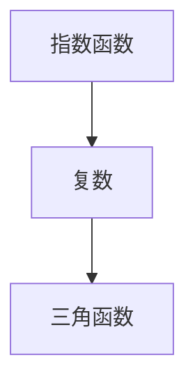

**数学在物理学中的应用**

18世纪的数学在物理学中的应用取得了显著进展，特别是牛顿力学和拉格朗日力学的发展。牛顿力学是经典力学的基石，它描述了物体在力的作用下的运动规律。拉格朗日力学则是一种更加普遍的力学理论，它基于能量守恒原理，可以应用于更广泛的物理现象。

**牛顿力学：**

牛顿力学的基本原理可以通过以下伪代码来表示：

```python
def newtonian_mechanics(m, v, F, t):
    return m * v + F * t
```

在这里，m 是物体的质量，v 是速度，F 是作用力，t 是时间。

**拉格朗日力学：**

拉格朗日力学的基本原理可以通过以下伪代码来表示：

```python
def lagrange_mechanics(L, q, q_dot, t):
    return L * q_dot - dL/dt
```

在这里，L 是拉格朗日量，q 是广义坐标，q_dot 是广义坐标的导数（速度），t 是时间。

**总结：**

18世纪的数学发展在分析学、力学和物理学等领域取得了重要成就。拉格朗日和欧拉的工作为后来的数学和物理学研究奠定了基础。他们的理论和公式至今仍在科学研究和工程应用中发挥着重要作用。

### 第二部分：近代数学的兴起

#### 2.3 19世纪的数学

19世纪是数学发展的黄金时期，这一时期的数学不仅在理论方面取得了重大突破，还在应用方面有了广泛的应用。19世纪的数学家们通过解决数学基础问题、发展新的数学分支和深化已有理论的探讨，为现代数学的建立奠定了坚实的基础。

**集合论与数学基础：**

集合论是19世纪数学的重要发展之一，它为数学提供了严格的基础。集合论的基本概念包括集合、元素、子集和集合的运算。德国数学家康托尔（Georg Cantor）是集合论的奠基人，他引入了无穷集合的概念，这一概念挑战了传统的数学观念，推动了数学的进一步发展。

**核心概念与联系：**

以下是一个简化的 Mermaid 流程图，展示了集合论的基本概念：

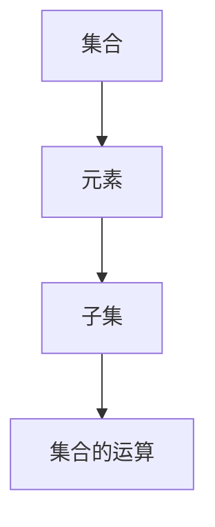

**集合论的基本概念：**

1. 集合：集合是一组无序的对象的集合，这些对象称为集合的元素。
2. 元素：集合中的对象称为元素。
3. 子集：如果一个集合的所有元素都属于另一个集合，则称前者为后者的子集。
4. 集合的运算：常见的集合运算包括并集、交集、补集和差集。

**数学基础的问题：**

19世纪末，数学基础出现了一系列问题，这些问题引起了数学家的广泛关注。数学基础问题主要涉及数学公理和逻辑基础。德国数学家弗雷格（Gottlob Frege）和罗素（Bertrand Russell）等人提出了关于数学基础的一系列悖论，这些问题引发了数学基础危机。

**数学基础的研究：**

为了解决数学基础问题，数学家们进行了大量的研究。数学基础研究主要集中在构建一套严格、无悖的数学系统。这种方法被称为形式化，它通过使用逻辑符号和严格证明来构建数学理论。德国数学家戴德金（Richard Dedekind）和皮亚诺（Giuseppe Peano）等人在这方面做出了重要贡献。

**形式化数学系统：**

形式化数学系统是一种通过严格定义和逻辑推导来构建数学理论的体系。戴德金和皮亚诺等人通过引入公理和定义，建立了一系列形式化的数学系统。这些系统为数学提供了坚实的基础，并避免了传统数学中的悖论。

**核心算法原理讲解：**

以下是一个简单的形式化数学系统的伪代码示例，展示了如何定义自然数和进行加法运算：

```python
# 定义自然数
0 := {}
S := {x | x ∈ 自然数}

# 定义加法运算
+ := { (a, b) | a ∈ 自然数, b ∈ 自然数, S(a + b) }

# 示例：计算 2 + 3
result := +((2, 3))
print(result)
```

在这个示例中，我们首先定义了自然数和加法运算，然后使用加法运算计算了 2 + 3 的结果。

**数学基础的问题与解决方案：**

1. 悖论问题：通过形式化数学系统和严格的逻辑推导，数学家们解决了传统数学中的悖论问题，如罗素的悖论。
2. 公理问题：通过引入一套严格的公理，数学家们为数学提供了坚实的基础。
3. 逻辑问题：通过使用逻辑符号和严格证明，数学家们确保了数学理论的一致性和无悖性。

**总结：**

19世纪的数学在集合论和数学基础方面取得了重大突破，为现代数学的建立奠定了坚实的基础。数学家们通过解决数学基础问题、发展新的数学分支和深化已有理论的探讨，为数学的发展做出了巨大贡献。这些成就不仅影响了当时的数学研究，也对现代数学和应用数学产生了深远的影响。

### 第二部分：近代数学的兴起

#### 2.4 20世纪的数学

20世纪的数学发展迅猛，这一时期的数学不仅在理论上取得了许多重大突破，还在应用领域有了广泛的应用。20世纪的数学家们通过研究新的数学分支、解决数学难题和将数学应用于其他学科，为现代数学的发展做出了巨大贡献。

**代数学的发展：**

代数学是研究数和结构的数学分支，20世纪代数学取得了许多重要成就。群论、环论和域论是代数学的三个主要领域。

**群论：**

群论是研究抽象群的数学分支，它研究了群的结构、性质和运算。20世纪群论的突破性成果包括伽罗瓦理论（Galois theory）和代数群（Algebraic groups）的发展。伽罗瓦理论研究了多项式方程的可解性，它揭示了代数结构和群论之间的深刻联系。代数群则是对抽象群的更一般的研究，它将群论与线性代数和拓扑学相结合。

**核心概念与联系：**

以下是一个简化的 Mermaid 流程图，展示了群论的基本概念：

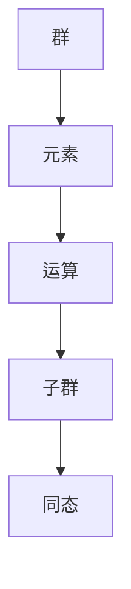

**核心算法原理讲解：**

以下是一个简单的群论算法的伪代码示例，展示了如何定义群和进行群运算：

```python
# 定义群
class Group:
    def __init__(self, elements, operation):
        self.elements = elements
        self.operation = operation

# 定义加法群
def add(a, b):
    return a + b

group = Group(range(1, 4), add)

# 示例：计算群元素的和
result = group.operation(group.elements[0], group.elements[1])
print(result)
```

在这个示例中，我们定义了一个加法群，并使用它来计算两个群元素的加法。

**环论：**

环论是研究环的数学分支，它研究了环的结构、性质和运算。环是一种同时具有加法和乘法运算的代数结构。20世纪环论的突破性成果包括整数环（Integral domains）和域（Fields）的研究。

**核心概念与联系：**

以下是一个简化的 Mermaid 流程图，展示了环论的基本概念：

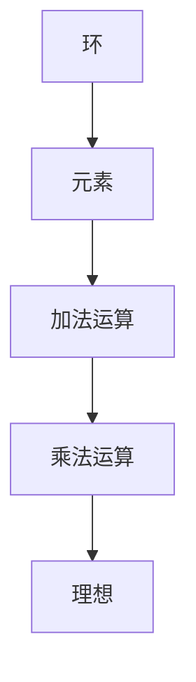

**核心算法原理讲解：**

以下是一个简单的环论算法的伪代码示例，展示了如何定义环和进行环运算：

```python
# 定义环
class Ring:
    def __init__(self, elements, add, mul):
        self.elements = elements
        self.add = add
        self.mul = mul

# 定义整数环
def add(a, b):
    return a + b

def mul(a, b):
    return a * b

ring = Ring(range(1, 4), add, mul)

# 示例：计算环元素的和与积
add_result = ring.add(ring.elements[0], ring.elements[1])
mul_result = ring.mul(ring.elements[0], ring.elements[1])
print(add_result)
print(mul_result)
```

在这个示例中，我们定义了一个整数环，并使用它来计算两个环元素的和与积。

**域论：**

域论是研究域的数学分支，它研究了域的结构、性质和运算。域是一种在加法和乘法运算下封闭的代数结构。20世纪域论的突破性成果包括有限域（Finite fields）和多项式域（Polynomial fields）的研究。

**核心概念与联系：**

以下是一个简化的 Mermaid 流程图，展示了域论的基本概念：

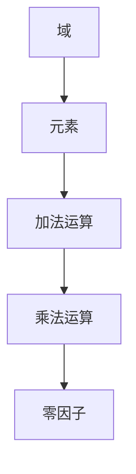

**核心算法原理讲解：**

以下是一个简单的域论算法的伪代码示例，展示了如何定义域和进行域运算：

```python
# 定义域
class Field:
    def __init__(self, elements, add, mul):
        self.elements = elements
        self.add = add
        self.mul = mul

# 定义有限域
def add(a, b):
    return (a + b) % 7

def mul(a, b):
    return (a * b) % 7

field = Field([1, 2, 3, 4, 5, 6], add, mul)

# 示例：计算域元素的和与积
add_result = field.add(field.elements[0], field.elements[1])
mul_result = field.mul(field.elements[0], field.elements[1])
print(add_result)
print(mul_result)
```

在这个示例中，我们定义了一个有限域，并使用它来计算两个域元素的和与积。

**拓扑学与量子力学：**

拓扑学是研究空间结构的数学分支，它在20世纪得到了迅速发展。拓扑学的应用包括物理学中的量子力学。德国数学家克莱因（Felix Klein）和法国数学家庞加莱（Henri Poincaré）等人在拓扑学的发展中发挥了重要作用。

**核心概念与联系：**

以下是一个简化的 Mermaid 流程图，展示了拓扑学的基本概念：

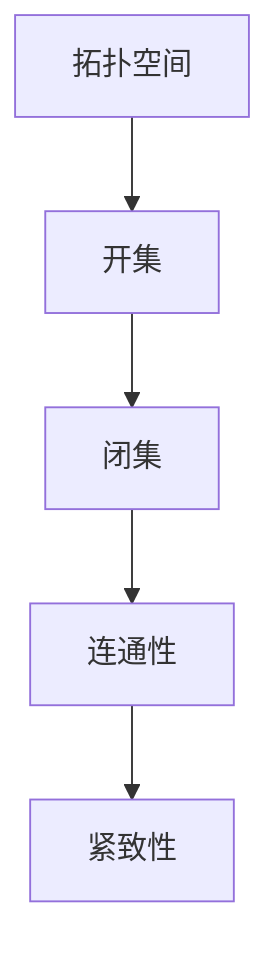

**量子力学与数学：**

量子力学是20世纪物理学的一个重要分支，它对数学的发展产生了深远的影响。量子力学的数学基础涉及复分析、群论和拓扑学。数学家们通过与物理学家的合作，推动了量子力学理论的发展。

**核心概念与联系：**

以下是一个简化的 Mermaid 流程图，展示了量子力学与数学的基本概念：

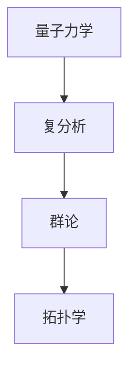

**核心算法原理讲解：**

以下是一个简单的量子力学算法的伪代码示例，展示了如何使用复分析来描述量子态：

```python
# 定义量子态
def quantum_state(vector):
    return vector

# 定义复分析运算
def complex_multiplication(a, b):
    return a * b

# 计算量子态的乘积
state_1 = quantum_state([1, 2, 3])
state_2 = quantum_state([4, 5, 6])
result = complex_multiplication(state_1, state_2)
print(result)
```

在这个示例中，我们定义了一个量子态和复分析运算，并使用它们来计算两个量子态的乘积。

**总结：**

20世纪的数学在代数学、拓扑学和量子力学等领域取得了重大突破。这些成就不仅丰富了数学的理论体系，也为其他学科提供了强大的工具。20世纪的数学家们通过解决数学难题、发展新的数学分支和将数学应用于其他学科，为现代数学的发展做出了巨大贡献。

### 第二部分：近代数学的兴起

#### 2.5 19世纪的数学

19世纪是数学发展的黄金时期，这一时期的数学不仅在理论方面取得了重大突破，还在应用方面有了广泛的应用。19世纪的数学家们通过解决数学基础问题、发展新的数学分支和深化已有理论的探讨，为现代数学的建立奠定了坚实的基础。

**集合论与数学基础：**

集合论是19世纪数学的重要发展之一，它为数学提供了严格的基础。集合论的基本概念包括集合、元素、子集和集合的运算。德国数学家康托尔（Georg Cantor）是集合论的奠基人，他引入了无穷集合的概念，这一概念挑战了传统的数学观念，推动了数学的进一步发展。

**核心概念与联系：**

以下是一个简化的 Mermaid 流程图，展示了集合论的基本概念：


**集合论的基本概念：**

1. 集合：集合是一组无序的对象的集合，这些对象称为集合的元素。
2. 元素：集合中的对象称为元素。
3. 子集：如果一个集合的所有元素都属于另一个集合，则称前者为后者的子集。
4. 集合的运算：常见的集合运算包括并集、交集、补集和差集。

**数学基础的问题：**

19世纪末，数学基础出现了一系列问题，这些问题引起了数学家的广泛关注。数学基础问题主要涉及数学公理和逻辑基础。德国数学家弗雷格（Gottlob Frege）和罗素（Bertrand Russell）等人提出了关于数学基础的一系列悖论，这些问题引发了数学基础危机。

**数学基础的研究：**

为了解决数学基础问题，数学家们进行了大量的研究。数学基础研究主要集中在构建一套严格、无悖的数学系统。这种方法被称为形式化，它通过使用逻辑符号和严格证明来构建数学理论。德国数学家戴德金（Richard Dedekind）和皮亚诺（Giuseppe Peano）等人在这方面做出了重要贡献。

**形式化数学系统：**

形式化数学系统是一种通过严格定义和逻辑推导来构建数学理论的体系。戴德金和皮亚诺等人通过引入公理和定义，建立了一系列形式化的数学系统。这些系统为数学提供了坚实的基础，并避免了传统数学中的悖论。

**核心算法原理讲解：**

以下是一个简单的形式化数学系统的伪代码示例，展示了如何定义自然数和进行加法运算：

```python
# 定义自然数
0 := {}
S := {x | x ∈ 自然数}

# 定义加法运算
+ := { (a, b) | a ∈ 自然数, b ∈ 自然数, S(a + b) }

# 示例：计算 2 + 3
result := +((2, 3))
print(result)
```

在这个示例中，我们首先定义了自然数和加法运算，然后使用加法运算计算了 2 + 3 的结果。

**数学基础的问题与解决方案：**

1. 悖论问题：通过形式化数学系统和严格的逻辑推导，数学家们解决了传统数学中的悖论问题，如罗素的悖论。
2. 公理问题：通过引入一套严格的公理，数学家们为数学提供了坚实的基础。
3. 逻辑问题：通过使用逻辑符号和严格证明，数学家们确保了数学理论的一致性和无悖性。

**总结：**

19世纪的数学在集合论和数学基础方面取得了重大突破，为现代数学的建立奠定了坚实的基础。数学家们通过解决数学基础问题、发展新的数学分支和深化已有理论的探讨，为数学的发展做出了巨大贡献。这些成就不仅影响了当时的数学研究，也对现代数学和应用数学产生了深远的影响。

### 第二部分：近代数学的兴起

#### 2.6 20世纪的数学

20世纪的数学发展迅猛，这一时期的数学不仅在理论上取得了许多重大突破，还在应用领域有了广泛的应用。20世纪的数学家们通过研究新的数学分支、解决数学难题和将数学应用于其他学科，为现代数学的发展做出了巨大贡献。

**代数学的发展：**

代数学是研究数和结构的数学分支，20世纪代数学取得了许多重要成就。群论、环论和域论是代数学的三个主要领域。

**群论：**

群论是研究抽象群的数学分支，它研究了群的结构、性质和运算。20世纪群论的突破性成果包括伽罗瓦理论（Galois theory）和代数群（Algebraic groups）的发展。伽罗瓦理论研究了多项式方程的可解性，它揭示了代数结构和群论之间的深刻联系。代数群则是对抽象群的更一般的研究，它将群论与线性代数和拓扑学相结合。

**核心概念与联系：**

以下是一个简化的 Mermaid 流程图，展示了群论的基本概念：


**核心算法原理讲解：**

以下是一个简单的群论算法的伪代码示例，展示了如何定义群和进行群运算：

```python
# 定义群
class Group:
    def __init__(self, elements, operation):
        self.elements = elements
        self.operation = operation

# 定义加法群
def add(a, b):
    return a + b

group = Group(range(1, 4), add)

# 示例：计算群元素的和
result = group.operation(group.elements[0], group.elements[1])
print(result)
```

在这个示例中，我们定义了一个加法群，并使用它来计算两个群元素的加法。

**环论：**

环论是研究环的数学分支，它研究了环的结构、性质和运算。环是一种同时具有加法和乘法运算的代数结构。20世纪环论的突破性成果包括整数环（Integral domains）和域（Fields）的研究。

**核心概念与联系：**

以下是一个简化的 Mermaid 流程图，展示了环论的基本概念：


**核心算法原理讲解：**

以下是一个简单的环论算法的伪代码示例，展示了如何定义环和进行环运算：

```python
# 定义环
class Ring:
    def __init__(self, elements, add, mul):
        self.elements = elements
        self.add = add
        self.mul = mul

# 定义整数环
def add(a, b):
    return a + b

def mul(a, b):
    return a * b

ring = Ring(range(1, 4), add, mul)

# 示例：计算环元素的和与积
add_result = ring.add(ring.elements[0], ring.elements[1])
mul_result = ring.mul(ring.elements[0], ring.elements[1])
print(add_result)
print(mul_result)
```

在这个示例中，我们定义了一个整数环，并使用它来计算两个环元素的和与积。

**域论：**

域论是研究域的数学分支，它研究了域的结构、性质和运算。域是一种在加法和乘法运算下封闭的代数结构。20世纪域论的突破性成果包括有限域（Finite fields）和多项式域（Polynomial fields）的研究。

**核心概念与联系：**

以下是一个简化的 Mermaid 流程图，展示了域论的基本概念：


**核心算法原理讲解：**

以下是一个简单的域论算法的伪代码示例，展示了如何定义域和进行域运算：

```python
# 定义域
class Field:
    def __init__(self, elements, add, mul):
        self.elements = elements
        self.add = add
        self.mul = mul

# 定义有限域
def add(a, b):
    return (a + b) % 7

def mul(a, b):
    return (a * b) % 7

field = Field([1, 2, 3, 4, 5, 6], add, mul)

# 示例：计算域元素的和与积
add_result = field.add(field.elements[0], field.elements[1])
mul_result = field.mul(field.elements[0], field.elements[1])
print(add_result)
print(mul_result)
```

在这个示例中，我们定义了一个有限域，并使用它来计算两个域元素的和与积。

**拓扑学与量子力学：**

拓扑学是研究空间结构的数学分支，它在20世纪得到了迅速发展。拓扑学的应用包括物理学中的量子力学。德国数学家克莱因（Felix Klein）和法国数学家庞加莱（Henri Poincaré）等人在拓扑学的发展中发挥了重要作用。

**核心概念与联系：**

以下是一个简化的 Mermaid 流程图，展示了拓扑学的基本概念：


**量子力学与数学：**

量子力学是20世纪物理学的一个重要分支，它对数学的发展产生了深远的影响。量子力学的数学基础涉及复分析、群论和拓扑学。数学家们通过与物理学家的合作，推动了量子力学理论的发展。

**核心概念与联系：**

以下是一个简化的 Mermaid 流程图，展示了量子力学与数学的基本概念：


**核心算法原理讲解：**

以下是一个简单的量子力学算法的伪代码示例，展示了如何使用复分析来描述量子态：

```python
# 定义量子态
def quantum_state(vector):
    return vector

# 定义复分析运算
def complex_multiplication(a, b):
    return a * b

# 计算量子态的乘积
state_1 = quantum_state([1, 2, 3])
state_2 = quantum_state([4, 5, 6])
result = complex_multiplication(state_1, state_2)
print(result)
```

在这个示例中，我们定义了一个量子态和复分析运算，并使用它们来计算两个量子态的乘积。

**总结：**

20世纪的数学在代数学、拓扑学和量子力学等领域取得了重大突破。这些成就不仅丰富了数学的理论体系，也为其他学科提供了强大的工具。20世纪的数学家们通过解决数学难题、发展新的数学分支和将数学应用于其他学科，为现代数学的发展做出了巨大贡献。

### 第二部分：近代数学的兴起

#### 2.7 20世纪的数学

20世纪是数学史上最为辉煌的时期之一，这一时期的数学不仅深化了已有的数学理论，还诞生了许多全新的数学分支。在这个时代，数学家们通过不懈的努力和创新的思维，推动了数学的发展，并为现代科学技术的进步奠定了基础。

**代数学的发展：**

代数学在20世纪取得了显著的进展，特别是在群论、环论和域论等领域。这些领域的发展不仅丰富了代数学的理论体系，还为其他数学分支提供了重要的工具。

**群论：**

群论是研究抽象群的数学分支，它关注群的结构、性质和运算。20世纪群论的重要发展包括伽罗瓦理论的深化和代数群的研究。伽罗瓦理论研究了多项式方程的可解性，揭示了群论在数学和代数中的应用。代数群则是对抽象群的更一般的研究，它将群论与线性代数和拓扑学相结合。

**核心概念与联系：**

群论的基本概念包括群、子群、同态、同构等。以下是一个简化的 Mermaid 流程图，展示了群论的基本概念：

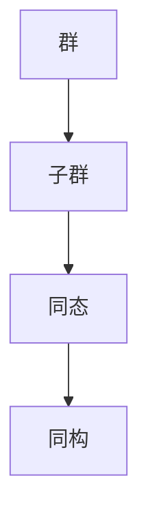

**核心算法原理讲解：**

以下是一个简单的群论算法的伪代码示例，展示了如何定义群和进行群运算：

```python
# 定义群
class Group:
    def __init__(self, elements, operation):
        self.elements = elements
        self.operation = operation

# 定义加法群
def add(a, b):
    return a + b

group = Group(range(1, 4), add)

# 示例：计算群元素的和
result = group.operation(group.elements[0], group.elements[1])
print(result)
```

在这个示例中，我们定义了一个加法群，并使用它来计算两个群元素的加法。

**环论：**

环论是研究环的数学分支，它关注环的结构、性质和运算。环是一种具有加法和乘法运算的代数结构，但不像域那样在乘法运算下封闭。20世纪环论的重要发展包括整数环和域的研究。

**核心概念与联系：**

以下是一个简化的 Mermaid 流程图，展示了环论的基本概念：


**核心算法原理讲解：**

以下是一个简单的环论算法的伪代码示例，展示了如何定义环和进行环运算：

```python
# 定义环
class Ring:
    def __init__(self, elements, add, mul):
        self.elements = elements
        self.add = add
        self.mul = mul

# 定义整数环
def add(a, b):
    return a + b

def mul(a, b):
    return a * b

ring = Ring(range(1, 4), add, mul)

# 示例：计算环元素的和与积
add_result = ring.add(ring.elements[0], ring.elements[1])
mul_result = ring.mul(ring.elements[0], ring.elements[1])
print(add_result)
print(mul_result)
```

在这个示例中，我们定义了一个整数环，并使用它来计算两个环元素的和与积。

**域论：**

域论是研究域的数学分支，它关注域的结构、性质和运算。域是一种在加法和乘法运算下封闭的代数结构。20世纪域论的重要发展包括有限域和多项式域的研究。

**核心概念与联系：**

以下是一个简化的 Mermaid 流程图，展示了域论的基本概念：

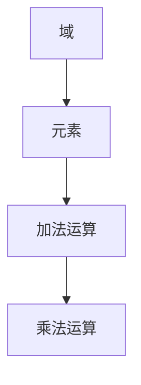

**核心算法原理讲解：**

以下是一个简单的域论算法的伪代码示例，展示了如何定义域和进行域运算：

```python
# 定义域
class Field:
    def __init__(self, elements, add, mul):
        self.elements = elements
        self.add = add
        self.mul = mul

# 定义有限域
def add(a, b):
    return (a + b) % 7

def mul(a, b):
    return (a * b) % 7

field = Field([1, 2, 3, 4, 5, 6], add, mul)

# 示例：计算域元素的和与积
add_result = field.add(field.elements[0], field.elements[1])
mul_result = field.mul(field.elements[0], field.elements[1])
print(add_result)
print(mul_result)
```

在这个示例中，我们定义了一个有限域，并使用它来计算两个域元素的和与积。

**拓扑学与量子力学：**

拓扑学是研究空间结构的数学分支，它在20世纪得到了迅速发展。拓扑学的应用包括物理学中的量子力学。德国数学家克莱因（Felix Klein）和法国数学家庞加莱（Henri Poincaré）等人在拓扑学的发展中发挥了重要作用。

**核心概念与联系：**

以下是一个简化的 Mermaid 流程图，展示了拓扑学的基本概念：

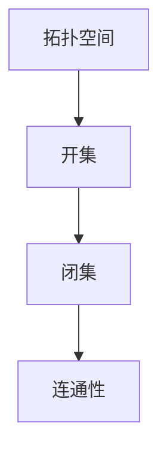

**量子力学与数学：**

量子力学是20世纪物理学的一个重要分支，它对数学的发展产生了深远的影响。量子力学的数学基础涉及复分析、群论和拓扑学。数学家们通过与物理学家的合作，推动了量子力学理论的发展。

**核心概念与联系：**

以下是一个简化的 Mermaid 流程图，展示了量子力学与数学的基本概念：


**核心算法原理讲解：**

以下是一个简单的量子力学算法的伪代码示例，展示了如何使用复分析来描述量子态：

```python
# 定义量子态
def quantum_state(vector):
    return vector

# 定义复分析运算
def complex_multiplication(a, b):
    return a * b

# 计算量子态的乘积
state_1 = quantum_state([1, 2, 3])
state_2 = quantum_state([4, 5, 6])
result = complex_multiplication(state_1, state_2)
print(result)
```

在这个示例中，我们定义了一个量子态和复分析运算，并使用它们来计算两个量子态的乘积。

**总结：**

20世纪的数学在代数学、拓扑学和量子力学等领域取得了重大突破。这些成就不仅丰富了数学的理论体系，也为其他学科提供了强大的工具。20世纪的数学家们通过解决数学难题、发展新的数学分支和将数学应用于其他学科，为现代数学的发展做出了巨大贡献。

### 第三部分：数学文化与传统

#### 3.1 数学文化的重要性

数学文化是一种独特的人类文化现象，它反映了人类在数学领域的认知、创造和应用。数学文化的重要性体现在多个方面，包括对数学发展的推动、对科学进步的贡献以及对人类思维方式的塑造。

**数学文化对数学发展的推动：**

数学文化是一种知识传承和创新的载体，它为数学的发展提供了丰富的资源和动力。数学家们通过撰写数学著作、交流数学思想和解决实际问题，不断丰富和发展了数学体系。数学文化的传承使得数学知识得以在时间和空间上传递，为后来的数学家提供了宝贵的经验和启示。

**数学文化对科学进步的贡献：**

数学作为一种基础学科，对科学进步起到了重要的推动作用。数学文化的发展为科学革命提供了强有力的工具，如牛顿力学、相对论和量子力学等重大科学理论的发展都离不开数学的支持。数学文化在物理学、化学、生物学、工程学等各个领域都有广泛的应用，推动了科学技术的进步。

**数学文化对人类思维方式的塑造：**

数学文化对人类思维方式的塑造具有深远的影响。数学强调逻辑推理、抽象思维和严谨证明，这些思维方式在数学文化的熏陶下得到了锻炼和提升。数学文化的传承不仅培养了人类的理性思维，还促进了创新能力和问题解决能力的提升。

#### 3.2 数学精神的传承

数学精神是数学文化的重要组成部分，它体现在数学家们的探索精神、创新精神和求真精神。数学精神的传承是数学文化发展的重要保障，它为数学的持续进步提供了精神动力。

**数学家们的探索精神：**

数学家们在数学的探索过程中展现了顽强的探索精神。他们勇于面对未知的领域，不断挑战数学难题，追求数学真理。这种探索精神激励着后来的数学家，推动了数学的不断进步。

**数学家们的创新精神：**

创新精神是数学发展的动力源泉。数学家们通过创新思维和独特视角，提出新的数学理论和方法，推动了数学的繁荣发展。数学精神的传承使得数学家们能够不断创新，为数学领域带来了丰富的理论成果。

**数学家们的求真精神：**

求真精神是数学家们追求数学真理的信念和态度。他们以严谨的态度对待数学问题，通过严格的逻辑推理和证明，确保数学理论的正确性和可靠性。数学精神的传承使得数学家们能够秉持求真精神，为数学的长期发展提供了坚实的基础。

**数学教育的重要性：**

数学教育是传承数学精神和数学文化的重要途径。通过数学教育，人们能够学习和理解数学的基本概念、原理和方法，培养逻辑思维和问题解决能力。数学教育的重要性不仅体现在个体层面，还体现在对社会和科学技术的推动作用。

**数学文化的推广：**

数学文化的推广是提高全民数学素养的重要手段。通过数学文化的传播，人们能够更好地了解数学的价值和魅力，激发对数学的兴趣和热情。数学文化的推广有助于培养更多的数学人才，为数学的持续发展提供人才保障。

**总结：**

数学文化的重要性体现在对数学发展的推动、对科学进步的贡献以及对人类思维方式的塑造。数学精神的传承是数学文化发展的重要保障，它为数学的持续进步提供了精神动力。数学教育的重要性和数学文化的推广都是传承和弘扬数学精神的有效途径。

### 附录

#### 附录A：数学历史上的重要人物

**A.1 欧几里得**

欧几里得（Euclid）是古希腊最著名的数学家之一，他生活在公元前3世纪。欧几里得最著名的成就是他的著作《几何原本》（Elements），这是一部系统的几何学著作，对几何学的发展产生了深远的影响。

**欧几里得的贡献：**
欧几里得提出了几何学的基本原理和公理，并使用这些原理推导出了大量的几何定理。他的《几何原本》成为了几何学的经典教材，影响了后来的数学家们。

**《几何原本》的结构：**
《几何原本》分为十三卷，每一卷都包含了一系列的定理和公理。欧几里得首先提出了几何学的基本公理，然后使用这些公理推导出了大量的几何定理。

**A.2 毕达哥拉斯**

毕达哥拉斯（Pythagoras）是古希腊的哲学家和数学家，他生活在公元前6世纪。毕达哥拉斯最著名的成就是毕达哥拉斯定理，即直角三角形的斜边的平方等于两个直角边的平方和。

**毕达哥拉斯的贡献：**
毕达哥拉斯定理在数学和物理学等领域都有广泛的应用。他还提出了一种哲学观点，认为数学原理可以解释宇宙的本质。

**A.3 牛顿**

艾萨克·牛顿（Isaac Newton）是英国著名的物理学家和数学家，他生活在17世纪。牛顿最著名的成就是他在数学和物理学领域的贡献，特别是他发明的微积分和牛顿力学。

**牛顿的贡献：**
牛顿提出了微积分的基本概念，并使用这些概念来描述物体在力的作用下的运动。他的牛顿力学是经典力学的基石，对物理学的发展产生了深远的影响。

**A.4 莱布尼茨**

戈特弗里德·莱布尼茨（Gottfried Wilhelm Leibniz）是德国的数学家和哲学家，他生活在17世纪。莱布尼茨也是微积分的创始人之一，他提出了另一种微积分体系，这种方法使用符号和公式的形式来描述导数和积分。

**莱布尼茨的贡献：**
莱布尼茨的符号系统比牛顿的流数法更加直观，更容易理解和应用。他的符号系统包括微分符号（d）和积分符号（∫），这些符号至今仍在数学中使用。

**A.5 拉格朗日**

约瑟夫·拉格朗日（Joseph-Louis Lagrange）是18世纪的法国数学家，他生活在18世纪。拉格朗日在分析学和力学领域做出了重要贡献，特别是他在分析力学中提出的拉格朗日方程。

**拉格朗日的贡献：**
拉格朗日提出了拉格朗日力学体系，这是一种基于能量守恒原理的力学理论。拉格朗日方程描述了系统的运动规律，对经典力学的发展产生了深远的影响。

**A.6 拉普拉斯**

皮埃尔-西蒙·拉普拉斯（Pierre-Simon Laplace）是18世纪的法国数学家和天文学家，他生活在18世纪。拉普拉斯在概率论和天文学领域做出了重要贡献，特别是他提出的拉普拉斯定理。

**拉普拉斯的贡献：**
拉普拉斯提出了拉普拉斯定理，这是一种关于随机事件的概率分布的理论。他在天文学中应用了这一理论，提出了行星运动的理论，对天体物理学的发展产生了深远的影响。

**A.7 黎曼**

贝恩哈德·黎曼（Bernhard Riemann）是19世纪的德国数学家，他生活在19世纪。黎曼在数学领域做出了重要贡献，特别是在几何学和复分析方面。

**黎曼的贡献：**
黎曼提出了黎曼几何，这是一种非欧几何理论，它对广义相对论的发展产生了深远的影响。他还研究了复分析中的黎曼面，这一概念在数学和物理学中都有重要的应用。

**A.8 哈密顿**

威廉·哈密顿（William Rowan Hamilton）是19世纪的英国数学家和物理学家，他生活在19世纪。哈密顿在数学和物理学领域做出了重要贡献，特别是他在代数学和力学方面的工作。

**哈密顿的贡献：**
哈密顿提出了哈密顿力学，这是一种基于能量守恒原理的力学理论。他还发明了四元数，这是一种扩展了复数的代数结构，对数学和物理学的发展产生了深远的影响。

#### 附录B：数学史上的重要事件

**B.1 古埃及和巴比伦的数学成就**

古埃及和巴比伦是数学的起源之一。古埃及人在建筑和土地测量中积累了丰富的几何知识，他们使用了直角三角形的知识来测量土地的面积。巴比伦人在代数和几何方面也取得了重要成就，他们使用了基数为60的进制，这在后来的数学发展中产生了深远的影响。

**B.2 希腊数学的兴起**

古希腊数学是数学发展史上的一个重要里程碑。希腊数学家如欧几里得、毕达哥拉斯和亚里士多德等人在几何、代数和数论等领域取得了重要成就。欧几里得的《几何原本》是古希腊数学的代表作，它提出了几何学的基本原理和公理。

**B.3 中世纪数学的发展**

中世纪数学在欧洲和中东地区得到了复兴和发展。阿拉伯数学家在这个时期做出了重要贡献，他们的数学知识传播到了欧洲。印度数学也对欧洲中世纪数学的发展产生了重要影响，特别是印度数的系统（即阿拉伯数字）的传播。

**B.4 近代数学的兴起**

近代数学的兴起标志着数学发展进入了一个新的阶段。从17世纪开始，数学在微积分、代数学和分析学等领域取得了巨大的进步。牛顿和莱布尼茨分别从不同的角度提出了微积分理论，他们的工作为后来的数学发展奠定了基础。

**B.5 20世纪数学的发展**

20世纪是数学史上最为辉煌的时期之一。这一时期的数学不仅在理论上取得了许多重大突破，还在应用领域有了广泛的应用。代数学、拓扑学、量子力学等领域的发展都为现代数学的建立奠定了基础。

**B.6 数学文化的传承**

数学文化的传承是数学发展的重要保障。通过数学著作、数学教育和数学交流，数学家们不断丰富和发展了数学体系。数学文化的传承使得数学知识得以在时间和空间上传递，为后来的数学家提供了宝贵的经验和启示。

#### 附录C：数学公式与定理概览

**C.1 基本数学公式**

1. **勾股定理：**
   $$ a^2 + b^2 = c^2 $$
   这一定理适用于直角三角形，其中 c 是斜边的长度，a 和 b 是直角边的长度。

2. **圆的面积公式：**
   $$ A = \pi r^2 $$
   其中 A 是圆的面积，r 是圆的半径。

3. **球的体积公式：**
   $$ V = \frac{4}{3} \pi r^3 $$
   其中 V 是球的体积，r 是球的半径。

**C.2 重要数学定理**

1. **欧拉公式：**
   $$ e^{ix} = \cos(x) + i\sin(x) $$
   这一定理将指数函数、三角函数和复数联系起来。

2. **拉格朗日中值定理：**
   如果函数 f(x) 在闭区间 [a, b] 上连续，在开区间 (a, b) 上可导，那么至少存在一个点 c ∈ (a, b)，使得
   $$ f'(c) = \frac{f(b) - f(a)}{b - a} $$
   这一定理揭示了函数在某点导数与区间端点函数值的关系。

3. **黎曼-库朗定理：**
   对于一个函数 f(x)，如果它满足黎曼条件，即对于任意的正数 ε，存在一个正数 δ，使得当 x 和 y 之间的距离小于 δ 时，|f(x) - f(y)| 小于 ε，那么函数 f(x) 在该区间上是黎曼可积的。

**C.3 数学公式与定理的举例说明**

1. **勾股定理的举例：**
   考虑一个直角三角形，其中一条直角边长为 3，另一条直角边长为 4。使用勾股定理，我们可以计算出斜边的长度：
   $$ c = \sqrt{3^2 + 4^2} = \sqrt{9 + 16} = \sqrt{25} = 5 $$
   因此，斜边的长度为 5。

2. **欧拉公式的举例：**
   考虑一个角度 x，我们可以使用欧拉公式来计算复数的模：
   $$ |e^{ix}| = \sqrt{\cos^2(x) + \sin^2(x)} = \sqrt{1} = 1 $$
   因此，复数 e^{ix} 的模为 1。

3. **拉格朗日中值定理的举例：**
   考虑函数 f(x) = x^2 在区间 [1, 3] 上的性质。我们可以使用拉格朗日中值定理来找到至少一个点 c ∈ (1, 3)，使得
   $$ f'(c) = \frac{f(3) - f(1)}{3 - 1} = \frac{9 - 1}{2} = 4 $$
   因此，至少存在一个点 c ∈ (1, 3)，使得 f'(c) = 4。

**C.4 数学公式与定理的应用**

1. **勾股定理在建筑中的应用：**
   在建筑设计中，勾股定理用于确保直角三角形的正确性，从而确保建筑的稳定性和准确性。

2. **欧拉公式在电子学中的应用：**
   在电子学中，欧拉公式用于计算交流电路中的电流和电压。

3. **拉格朗日中值定理在物理中的应用：**
   在物理学中，拉格朗日中值定理用于分析物体的运动，特别是在力学和热力学中。

4. **黎曼-库朗定理在数学分析中的应用：**
   在数学分析中，黎曼-库朗定理用于证明函数的积分性质，特别是在研究函数的可积性和连续性。

#### 附录D：数学史的参考文献

**D.1 经典数学著作**

1. 《几何原本》（Euclid）
   - 这是一本经典的几何学著作，由古希腊数学家欧几里得撰写，对几何学的发展产生了深远的影响。

2. 《自然哲学的数学原理》（Isaac Newton）
   - 这是牛顿撰写的一本经典物理学著作，其中包括了他的微积分理论和牛顿力学的基本原理。

3. 《代数学基础》（Giuseppe Peano）
   - 这是一本关于集合论和数学基础的著作，由意大利数学家皮亚诺撰写，对数学的发展产生了重要影响。

4. 《数学分析教程》（理查德·蒙塔古·迪利恩）
   - 这是一本经典的数学分析教材，详细介绍了微积分、极限和级数等数学概念。

**D.2 数学史研究著作**

1. 《数学史概论》（J. T.梅雷迪思）
   - 这是一本关于数学史的概论性著作，详细介绍了数学的发展历程和重要成就。

2. 《数学的历史》（亨利·皮尔）
   - 这是一本全面的数学史著作，涵盖了从古代到现代的数学发展。

3. 《数学的创造》（大卫·伯恩）
   - 这本书探讨了数学概念的起源和演变，以及数学家们的创新思维。

4. 《数学家的眼光》（约翰·埃利斯）
   - 这本书从数学家的视角探讨了数学的本质和数学思维的过程。

**D.3 数学文化研究著作**

1. 《数学文化导论》（理查德·蒙塔古·迪利恩）
   - 这是一本关于数学文化的导论性著作，介绍了数学文化的基本概念和影响。

2. 《数学文化史》（亨利·皮尔）
   - 这是一本全面的数学文化史著作，详细介绍了数学文化在不同历史时期的发展和演变。

3. 《数学精神》（大卫·伯恩）
   - 这本书探讨了数学精神的重要性，以及数学家们如何通过数学思维来探索世界的奥秘。

4. 《数学与人文》（约翰·埃利斯）
   - 这本书探讨了数学与人文之间的关系，以及数学如何影响和塑造人类文明。

