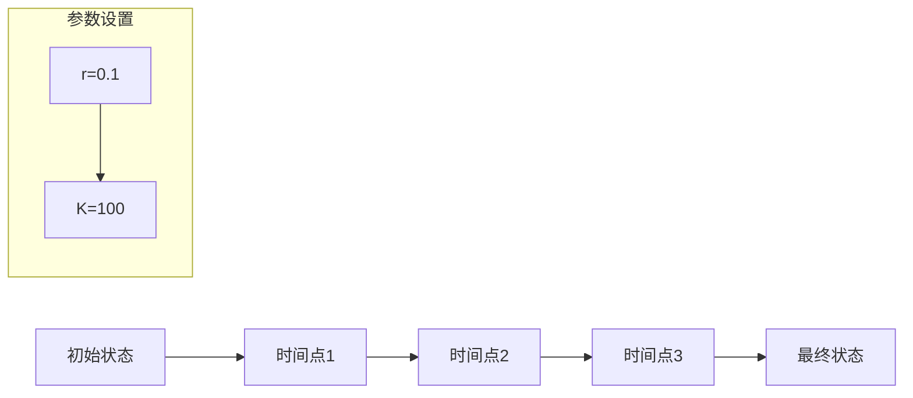

                 

# 《数学园艺学：植物生长的数学规划》

## 摘要

数学园艺学是园艺科学与数学的交叉学科，通过数学模型和算法来优化植物生长和管理过程。本文首先介绍了园艺学的定义、发展及其基本内容，然后深入探讨了植物生长的生物学基础和数学模型。接着，文章详细阐述了数学模型在土壤管理、灌溉管理和肥料管理中的应用，以及线性规划、非线性规划和多目标规划在园艺设计、种植计划和资源优化中的具体应用。随后，通过植物生长的数学模拟方法，以及实际应用案例分析，展示了数学园艺学的实践价值。最后，文章讨论了数学园艺学的前沿研究与应用前景，并推荐了常用的数学软件、园艺学数据库和学术资源，为读者提供全面的数学园艺学学习和研究指南。

## 目录大纲

### 第一部分：数学园艺学基础

#### 第1章：园艺学概述
- 1.1 园艺学的定义与发展
- 1.2 园艺学的基本内容
- 1.3 数学园艺学的研究对象

#### 第2章：植物生长的基本理论
- 2.1 植物生长的生物学基础
- 2.2 植物生长的数学模型
- 2.3 植物生长的调控机制

#### 第3章：数学模型在园艺中的应用
- 3.1 数学模型在土壤管理中的应用
- 3.2 数学模型在灌溉管理中的应用
- 3.3 数学模型在肥料管理中的应用

### 第二部分：数学规划在园艺中的应用

#### 第4章：线性规划在园艺中的应用
- 4.1 线性规划的基本原理
- 4.2 线性规划在园艺设计中的应用
- 4.3 线性规划在作物种植计划中的应用

#### 第5章：非线性规划在园艺中的应用
- 5.1 非线性规划的基本原理
- 5.2 非线性规划在园艺管理中的应用
- 5.3 非线性规划在植物育种中的应用

#### 第6章：多目标规划在园艺中的应用
- 6.1 多目标规划的基本原理
- 6.2 多目标规划在园艺决策中的应用
- 6.3 多目标规划在园艺资源优化中的应用

### 第三部分：数学园艺学的实践应用

#### 第7章：植物生长的数学模拟
- 7.1 数学模拟的基本原理
- 7.2 常用的数学模拟方法
- 7.3 植物生长的数学模拟案例分析

#### 第8章：数学园艺学的实际应用案例
- 8.1 案例一：基于线性规划的园艺设计
- 8.2 案例二：基于非线性规划的园艺管理
- 8.3 案例三：基于多目标规划的园艺决策

#### 第9章：数学园艺学的前沿研究与应用
- 9.1 数学园艺学的前沿研究方向
- 9.2 数学园艺学的未来发展趋势
- 9.3 数学园艺学在现代农业中的应用前景

### 附录

#### 附录 A：数学园艺学常用工具和资源
- A.1 常用的数学软件介绍
- A.2 常用的园艺学数据库
- A.3 数学园艺学的学术期刊和书籍推荐

### 结束语

## 引言

数学园艺学，作为一种新兴的交叉学科，正日益受到园艺科学和现代农业研究的关注。它结合了数学理论、统计分析和计算机科学，旨在通过数学模型和算法来优化植物生长和管理过程。传统的园艺学主要依赖于经验和直觉，而数学园艺学则提供了一种量化和科学的方法，为园艺决策提供了更加精确和可靠的依据。

本文旨在系统地介绍数学园艺学的基本概念、理论方法和应用实例。首先，我们将概述园艺学的定义、发展及其基本内容，为读者建立对数学园艺学的研究背景和领域框架。接着，我们将深入探讨植物生长的生物学基础和数学模型，包括植物生长的调控机制和常用的数学模型。在此基础上，我们将详细阐述数学模型在土壤管理、灌溉管理和肥料管理中的应用，以及线性规划、非线性规划和多目标规划在园艺设计、种植计划和资源优化中的具体应用。

为了使读者能够更好地理解数学园艺学的实践价值，我们将通过植物生长的数学模拟方法和实际应用案例分析，展示数学园艺学的应用场景和效果。最后，我们将讨论数学园艺学的前沿研究与应用前景，并推荐常用的数学软件、园艺学数据库和学术资源，为读者提供全面的数学园艺学学习和研究指南。

通过本文的阅读，读者将能够掌握数学园艺学的基本概念和方法，了解其在现代农业中的应用价值，并为未来数学园艺学的研究和实践提供启示。

### 第一部分：数学园艺学基础

#### 第1章：园艺学概述

### 1.1 园艺学的定义与发展

园艺学（Horticulture）是一门研究植物栽培、繁殖、育种和产品加工的学科，其目标是通过科学的方法优化植物的生长条件，提高产量和质量，以满足人类对食物和美观的需求。园艺学历史悠久，可以追溯到古埃及时期和古希腊时期，当时人们已经知道利用温室和灌溉技术来种植各种植物。

在现代社会，园艺学得到了进一步的发展，不仅包括传统的蔬菜、水果和花卉种植，还涵盖了景观设计、生态园艺、都市农业和垂直农业等领域。随着科技的发展，园艺学逐渐与生物技术、环境科学、信息科学和数学等学科相结合，形成了多个交叉研究领域。

园艺学的发展可以分为几个阶段：

1. **传统园艺阶段**：这一阶段主要依赖于经验种植，依靠农民的观察和实验来选择最佳种植方式。

2. **现代农业阶段**：20世纪初，随着化学肥料、农药和农业机械的发明和应用，园艺学进入了现代农业阶段，生产效率和产量得到了显著提高。

3. **精确园艺阶段**：随着信息技术的兴起，园艺学开始引入传感器、遥感和自动化技术，实现了对植物生长环境的精确监控和调控，提高了园艺生产的经济效益和环境可持续性。

4. **综合园艺阶段**：现代园艺学不仅关注生产效率，还注重生态平衡、环境保护和可持续发展，倡导绿色、有机和生态友好型种植方式。

### 1.2 园艺学的基本内容

园艺学的基本内容可以概括为以下几个方面：

1. **植物生理学**：研究植物生长发育的基本规律和生理过程，包括光合作用、水分吸收、营养物质的运输和代谢等。

2. **土壤学**：研究土壤的性质、结构和肥力，以及土壤对植物生长的影响。土壤管理是园艺学中非常重要的一个环节，包括土壤改良、肥料施用和土壤保护等。

3. **植物育种学**：通过选择和杂交，培育出具有优良性状的植物品种，提高作物的抗病性、产量和品质。

4. **园艺工程学**：研究园艺设施的设计、建造和运行，包括温室、大棚、灌溉系统和自动化控制系统等。

5. **园艺产品设计**：涉及园艺产品的包装、展示和营销，以及园艺景观的设计和规划。

6. **生态园艺学**：研究园艺活动对生态系统的影响，提倡生态友好型种植方式，实现园艺生产的可持续发展。

7. **园艺产业经济学**：研究园艺产业的市场、成本、利润和风险管理，为园艺生产提供经济分析和决策支持。

### 1.3 数学园艺学的研究对象

数学园艺学是园艺学与数学的交叉学科，其主要研究对象包括以下几个方面：

1. **植物生长的数学模型**：通过建立数学模型来描述植物的生长过程，包括生长速率、形态建成、光合作用等。

2. **园艺生产过程的优化**：利用数学规划方法，如线性规划、非线性规划和多目标规划，优化园艺生产过程，包括资源分配、种植计划、灌溉和施肥策略等。

3. **园艺环境的监测与控制**：通过传感器技术和数据分析，建立园艺环境的数学模型，实现对光照、温度、湿度等环境因素的实时监测和自动化控制。

4. **园艺产品的质量检测与评价**：利用统计学方法和数据挖掘技术，分析园艺产品的质量和安全性，建立质量检测和评价的数学模型。

5. **园艺信息的可视化**：利用图形和可视化技术，将园艺数据和模型以直观的方式呈现，帮助园艺工作者更好地理解和利用这些数据。

数学园艺学的研究对象和方法为园艺科学提供了新的视角和工具，使其更加科学、精确和高效。通过数学模型和算法的应用，数学园艺学不仅能够提高园艺生产的产量和品质，还能促进园艺生产的可持续发展，为现代农业的发展做出重要贡献。

### 第2章：植物生长的基本理论

#### 2.1 植物生长的生物学基础

植物生长是一个复杂的过程，涉及多个生物学领域的知识，包括细胞学、分子生物学、生理学和生态学。理解这些基础知识对于建立和运用数学模型来描述植物生长至关重要。

**1. 细胞学基础**

植物生长的基本单位是细胞。细胞的分裂和伸长是植物生长的基础。细胞分裂是通过有丝分裂和减数分裂实现的，这保证了植物能够不断产生新的细胞。细胞伸长主要发生在分生组织和伸长区，细胞壁的松弛和细胞壁物质的沉积是细胞伸长的重要因素。

**2. 分子生物学基础**

植物生长和发育的分子生物学机制包括基因表达调控、信号传导和蛋白质合成。植物基因组中的基因通过转录和翻译过程产生相应的蛋白质，这些蛋白质在植物生长和发育中发挥关键作用。例如，生长素（Auxins）是调节植物生长的重要激素，其合成和运输受到基因调控。

**3. 生理学基础**

植物生理学是研究植物生命活动及其与环境相互作用的科学。植物通过光合作用、呼吸作用和蒸腾作用等过程进行能量和物质的转换。光合作用是植物生长的主要能量来源，其速率受到光照强度、温度和二氧化碳浓度等因素的影响。呼吸作用则提供植物生长所需的能量，其速率受氧气供应和温度的影响。蒸腾作用不仅影响植物的水分平衡，还通过拉力作用促进水分和养分的吸收和运输。

**4. 生态学基础**

植物生长不仅受自身生物学特性的影响，还受到生态系统环境因素的影响。生态学基础包括土壤、水分、光照、温度和空气质量等环境因素。土壤是植物生长的基础，其肥力、结构和水保持能力直接影响植物的生长状况。水分是植物生长的基本需求，水分充足有利于植物的生长和发育，但水分过多或不足都会对植物生长产生不利影响。光照是植物进行光合作用的必要条件，光照强度和光照时间对植物的生长和开花有着重要影响。温度是影响植物生长的关键因素，不同的植物种类和生长阶段对温度有不同的要求。

**综合以上生物学基础，我们可以看到，植物生长是一个由多个因素相互作用、共同影响的过程。这些生物学基础为建立和运用数学模型来描述植物生长提供了科学依据。**

#### 2.2 植物生长的数学模型

数学模型在植物生长研究中的应用极大地推动了我们对植物生长过程的理解和预测。这些模型通过定量描述植物生长的生物学过程，帮助科学家和园艺学家优化种植策略，提高产量和品质。以下是一些常用的植物生长数学模型：

**1. 一阶线性模型**

一阶线性模型是最简单的植物生长模型之一，其公式为：

\[ \frac{dN}{dt} = rN \]

其中，\( N \) 表示植物数量，\( r \) 是生长率。这个模型假设植物数量随时间呈线性增长，适用于初期生长阶段。

**2. Logistic 模型**

Logistic 模型考虑了资源限制对植物生长的影响，其公式为：

\[ \frac{dN}{dt} = rN \left(1 - \frac{N}{K}\right) \]

其中，\( K \) 表示环境的承载能力，即环境能够支持的最大植物数量。这个模型描述了植物数量在资源有限情况下的非线性增长过程。

**3. Richards 模型**

Richards 模型是一种更复杂的植物生长模型，能够描述植物在三维空间中的生长过程。其公式为：

\[ \frac{\partial N}{\partial t} = \alpha N \left(1 - \frac{N}{K}\right)^{\beta} - \gamma N \]

其中，\( \alpha \) 和 \( \beta \) 是模型参数，描述了植物生长的速率和饱和度，\( \gamma \) 则表示死亡率。

**4. Michaelis-Menten 模型**

Michaelis-Menten 模型主要用于描述光合作用速率与光照强度之间的关系。其公式为：

\[ V = \frac{V_{\text{max}} [I]}{K_{\text{m}} + [I]} \]

其中，\( V \) 是光合作用速率，\( V_{\text{max}} \) 是最大光合速率，\( [I] \) 是光照强度，\( K_{\text{m}} \) 是 Michaelis 常数，反映了光照强度的饱和效应。

**5. 生理生态模型**

生理生态模型结合了植物生理学和生态学原理，用于描述植物在不同环境条件下的生长和分布。一个典型的生理生态模型是 SEBS（Soil Expcedent Balance model），其公式为：

\[ \frac{dS}{dt} = -R - \alpha S \left(\frac{1}{T_{\text{ref}}} - \frac{1}{T_{\text{act}}}\right) \]

其中，\( S \) 是土壤水分存储量，\( R \) 是根系吸水速率，\( \alpha \) 是温度敏感性系数，\( T_{\text{ref}} \) 和 \( T_{\text{act}} \) 分别是参考温度和实际温度。

**应用与效果**

这些数学模型在植物生长预测、种植规划和管理中发挥了重要作用。通过模拟不同条件下的植物生长过程，科学家和园艺学家可以优化种植策略，减少资源浪费，提高产量和品质。例如，Richards 模型被广泛应用于作物产量预测和灌溉管理中，而 SEBS 模型则被用于土壤水分管理和生态系统模拟。

总之，植物生长的数学模型为我们提供了强大的工具，帮助我们深入理解植物生长的机制，并为实际应用提供科学依据。通过不断改进和完善这些模型，我们可以更好地应对现代农业面临的挑战，实现可持续发展和高产高效的目标。

#### 2.3 植物生长的调控机制

植物生长的调控机制是植物适应环境变化、实现生长和发育的关键。这些机制包括植物激素的调控、基因表达的调控以及环境信号的感知和响应。以下将详细讨论这些调控机制：

**1. 植物激素的调控**

植物激素，也称为植物生长调节剂，是一类能够影响植物生长和发育的化学物质。常见的植物激素包括生长素（Auxins）、细胞分裂素（Cytokinins）、脱落酸（Abscisic acid, ABA）和赤霉素（Gibberellins）等。

- **生长素（Auxins）**：生长素在植物生长中的主要作用是促进细胞伸长和分裂。它通过调控基因表达和细胞壁松弛来实现这一作用。生长素在植物体内的运输具有极性，从植物体的基部向顶端运输。

- **细胞分裂素（Cytokinins）**：细胞分裂素主要促进细胞分裂，增加细胞数量。它与生长素协同作用，调节植物的生长发育。细胞分裂素在植物体内的合成主要发生在叶片和茎部。

- **脱落酸（Abscisic acid, ABA）**：脱落酸在植物的生长和发育中具有抑制生长的作用，尤其在水分胁迫和干旱条件下发挥重要作用。ABA 通过抑制种子萌发和叶绿素合成，使植物进入休眠状态，以减少水分和养分的消耗。

- **赤霉素（Gibberellins）**：赤霉素主要促进植物的生长和发育，包括茎伸长、种子萌发和开花。赤霉素在植物体内的合成主要发生在种子、幼茎和叶片中。

**2. 基因表达的调控**

基因表达调控是植物生长和发育的核心机制。植物基因组中的基因通过转录和翻译过程产生相应的蛋白质，这些蛋白质在植物生长和发育中发挥关键作用。

- **转录因子**：转录因子是一类能够结合到基因启动子区域的蛋白质，调控基因的转录。转录因子通过识别特定的DNA序列，激活或抑制基因的表达。例如，MYB 转录因子家族在植物生长发育中发挥重要作用。

- **表观遗传调控**：表观遗传调控通过DNA甲基化和组蛋白修饰等机制，调控基因的表达。例如，DNA甲基化可以抑制基因的表达，而组蛋白去乙酰化则可以激活基因的表达。

- **信号传导途径**：植物通过信号传导途径感知外部环境信号，如光照、温度和水分等，并调控基因表达。信号传导途径包括光敏色素、激素信号传导途径等。

**3. 环境信号的感知和响应**

植物通过感知和响应环境信号来调整其生长和发育。环境信号包括光周期、温度、水分和土壤质量等。

- **光周期**：光周期信号由光敏色素感知，调控植物的开花时间和季节性生长。长日照植物在光照时间超过一定阈值时开花，而短日照植物则在光照时间低于一定阈值时开花。

- **温度**：温度是影响植物生长和发育的重要因素。植物通过调节基因表达和代谢途径，适应不同的温度环境。低温会抑制植物的生长和发育，而高温可能导致植物生长停滞或热胁迫。

- **水分**：水分是植物生长的基本需求。植物通过根毛感知土壤中的水分，并通过根系吸水。水分不足时，植物通过关闭气孔、减少蒸腾作用来降低水分消耗。

- **土壤质量**：土壤质量影响植物的营养吸收和生长。植物通过根尖的感知系统，识别土壤中的养分和有害物质，并调整其生长和发育。

**综合以上调控机制，植物生长的调控是一个复杂的过程，涉及植物激素、基因表达和环境信号的相互作用。理解这些调控机制，有助于我们更好地理解和预测植物的生长和发育，为农业生产和园艺设计提供科学依据。**

### 第3章：数学模型在园艺中的应用

#### 3.1 数学模型在土壤管理中的应用

土壤是植物生长的基础，土壤质量直接影响到植物的健康和产量。数学模型在土壤管理中的应用，旨在通过定量描述土壤特性，优化施肥和灌溉策略，提高土壤肥力和作物产量。

**1. 土壤质量评价模型**

土壤质量评价模型通过量化土壤的物理、化学和生物学特性，评估土壤的健康状况。常用的模型包括：

- **土壤有机质含量模型**：土壤有机质含量是土壤肥力的重要指标。其模型公式为：

  \[ \text{有机质含量} = \alpha \cdot \text{土壤总碳含量} + \beta \cdot \text{土壤pH值} + \gamma \cdot \text{土壤质地} \]

  其中，\(\alpha\)、\(\beta\) 和 \(\gamma\) 是模型参数，通过实验数据回归得到。

- **土壤侵蚀模型**：土壤侵蚀模型用于评估土壤流失的风险，其公式为：

  \[ \text{土壤流失量} = \alpha \cdot \text{降雨量} + \beta \cdot \text{坡度} + \gamma \cdot \text{土壤抗蚀性} \]

  其中，\(\alpha\)、\(\beta\) 和 \(\gamma\) 同样通过实验数据确定。

**2. 施肥管理模型**

施肥管理模型通过优化施肥量，提高肥料利用效率，减少资源浪费。常用的施肥管理模型包括：

- **氮肥施用量模型**：氮肥是作物生长的关键营养元素，其施用量模型为：

  \[ \text{氮肥施用量} = \alpha \cdot \text{作物产量} + \beta \cdot \text{土壤氮素含量} + \gamma \cdot \text{气候条件} \]

  其中，\(\alpha\)、\(\beta\) 和 \(\gamma\) 是模型参数。

- **磷肥施用量模型**：磷肥施用量模型为：

  \[ \text{磷肥施用量} = \alpha \cdot \text{作物产量} + \beta \cdot \text{土壤磷素含量} + \gamma \cdot \text{土壤pH值} \]

  同样，\(\alpha\)、\(\beta\) 和 \(\gamma\) 是通过实验数据回归得到的参数。

**3. 灌溉管理模型**

灌溉管理模型通过优化灌溉策略，确保作物获得适量的水分，同时避免水资源浪费。常用的灌溉管理模型包括：

- **土壤水分动态模型**：土壤水分动态模型用于描述土壤水分的分布和变化，其公式为：

  \[ \frac{dS}{dt} = \alpha \cdot \text{降雨量} + \beta \cdot \text{灌溉量} - \gamma \cdot \text{蒸散发量} \]

  其中，\(S\) 表示土壤水分含量，\(\alpha\)、\(\beta\) 和 \(\gamma\) 是模型参数。

- **作物需水模型**：作物需水模型用于预测作物的需水规律，其公式为：

  \[ \text{需水量} = \alpha \cdot \text{作物系数} + \beta \cdot \text{土壤水分含量} + \gamma \cdot \text{气温} \]

  其中，\(\alpha\)、\(\beta\) 和 \(\gamma\) 是模型参数。

**4. 应用案例**

在实际应用中，数学模型在土壤管理中发挥了重要作用。例如，在农业生产中，通过土壤质量评价模型，可以及时发现土壤问题，制定相应的改良措施。通过施肥管理模型，可以优化施肥策略，提高肥料利用率，减少环境污染。通过灌溉管理模型，可以实现精准灌溉，确保作物获得适量的水分，同时节约水资源。

总之，数学模型在土壤管理中的应用，为农业生产的可持续发展提供了科学依据和技术支持，有助于提高作物产量和质量，实现资源的高效利用。

#### 3.2 数学模型在灌溉管理中的应用

灌溉是农业生产中至关重要的一环，它直接影响作物的生长、产量和品质。数学模型在灌溉管理中的应用，旨在通过定量分析土壤水分动态、作物需水规律和水资源利用效率，实现灌溉的精准化、智能化和高效化。

**1. 土壤水分动态模型**

土壤水分动态模型用于描述土壤水分的分布和变化规律。其基本公式为：

\[ \frac{dS}{dt} = \alpha \cdot I - \beta \cdot E - \gamma \cdot \text{根吸水速率} \]

其中，\( S \) 表示土壤水分含量，\( I \) 表示灌溉量，\( E \) 表示蒸散发量，\( \alpha \)、\( \beta \) 和 \( \gamma \) 是模型参数。

- **参数确定**：模型参数可以通过实验数据或实地测量得到。例如，\( \alpha \) 可以通过土壤渗透率实验测定，\( \beta \) 可以通过土壤蒸发率实验测定，而 \( \gamma \) 可以通过作物根系吸水实验确定。

- **应用实例**：在一个蔬菜种植园区，通过土壤水分动态模型，可以实时监测土壤水分含量，预测土壤水分的变化趋势，从而为灌溉决策提供科学依据。例如，当土壤水分含量低于阈值时，模型预测未来几天内可能发生干旱，这时就需要及时灌溉，避免作物受到水分胁迫。

**2. 作物需水模型**

作物需水模型用于预测作物的需水规律，确保作物在不同生长阶段获得适量的水分。其基本公式为：

\[ \text{需水量} = \alpha \cdot \text{作物系数} + \beta \cdot \text{土壤水分含量} + \gamma \cdot \text{气温} \]

其中，作物系数（\(\alpha\)）是一个反映不同作物需水特性的常数，土壤水分含量（\(\beta\)）和气温（\(\gamma\)）是影响作物需水的环境因素。

- **参数确定**：作物系数可以通过实验数据或农业手册获得，土壤水分含量和气温可以通过田间传感器实时监测。

- **应用实例**：在一个果园中，通过作物需水模型，可以预测不同果树在不同生长阶段的需水量。例如，在果实成熟期，果树对水分的需求较高，模型可以提醒果农适时灌溉，以保证果实品质。

**3. 水资源利用效率模型**

水资源利用效率模型用于评估灌溉过程中水资源的利用效率，其基本公式为：

\[ \text{水资源利用效率} = \frac{\text{作物产量}}{\text{灌溉水量}} \]

- **参数确定**：作物产量可以通过田间测量获得，灌溉水量可以通过灌溉系统计量。

- **应用实例**：在一个灌溉项目中，通过水资源利用效率模型，可以评估不同灌溉策略（如滴灌、喷灌和传统漫灌）的水资源利用效率。例如，在一个蔬菜种植园，通过比较滴灌和传统漫灌的水资源利用效率，可以发现滴灌能够显著提高水资源利用效率，从而优化灌溉策略。

**4. 应用案例**

在实际农业生产中，数学模型在灌溉管理中的应用已经取得了显著成效。例如，在山东省的一个农业科技园区，通过土壤水分动态模型和作物需水模型，实现了精准灌溉，不仅提高了作物产量，还减少了水资源浪费。此外，在河北省的一个小麦种植区，通过水资源利用效率模型，优化了灌溉策略，提高了小麦的产量和品质。

总之，数学模型在灌溉管理中的应用，为农业生产提供了科学依据和技术支持，有助于实现灌溉的精准化、智能化和高效化，从而推动农业生产的可持续发展。

#### 3.3 数学模型在肥料管理中的应用

肥料管理在农业生产中扮演着至关重要的角色，它不仅直接关系到作物的产量和品质，还影响到土壤的健康和环境保护。数学模型在肥料管理中的应用，旨在通过定量分析和优化，实现肥料施用的科学化、精准化和高效化，从而提高肥料利用效率，减少资源浪费和环境污染。

**1. 肥料需求模型**

肥料需求模型用于预测作物在不同生长阶段对各类养分的需求量。其基本公式为：

\[ \text{肥料需求量} = \alpha \cdot \text{作物系数} + \beta \cdot \text{土壤养分含量} + \gamma \cdot \text{气候条件} \]

其中，\(\alpha\)、\(\beta\) 和 \(\gamma\) 是模型参数，反映作物类型、土壤肥力和气候条件对肥料需求的影响。

- **参数确定**：模型参数可以通过历史数据分析和田间试验来确定。例如，作物系数可以通过农业手册或实验数据获得，土壤养分含量可以通过土壤测试获得，气候条件可以通过气象数据获得。

- **应用实例**：在一个水稻种植区，通过肥料需求模型，可以预测水稻在不同生长期的氮、磷、钾肥需求量。例如，在拔节期和孕穗期，水稻对氮肥的需求较高，模型可以提醒农民适时施用氮肥，以促进作物生长。

**2. 肥料利用率模型**

肥料利用率模型用于评估肥料施用后养分的实际吸收和利用情况。其基本公式为：

\[ \text{肥料利用率} = \frac{\text{作物吸收养分量}}{\text{施肥量}} \]

- **参数确定**：作物吸收养分量可以通过田间取样和实验室分析获得，施肥量可以通过肥料施用量测定。

- **应用实例**：在一个玉米种植区，通过肥料利用率模型，可以评估不同施肥策略（如一次性施肥、分次施肥和叶面喷施）的肥料利用效率。例如，发现分次施肥能够显著提高肥料利用率，从而优化施肥策略，减少肥料浪费。

**3. 土壤养分平衡模型**

土壤养分平衡模型用于描述土壤养分的输入和输出情况，评估土壤养分的动态变化。其基本公式为：

\[ \text{土壤养分含量变化} = \alpha \cdot \text{施肥量} + \beta \cdot \text{作物吸收量} + \gamma \cdot \text{土壤侵蚀量} - \delta \cdot \text{肥料流失量} \]

其中，\(\alpha\)、\(\beta\)、\(\gamma\) 和 \(\delta\) 是模型参数，分别反映施肥量、作物吸收量、土壤侵蚀量和肥料流失量对土壤养分含量的影响。

- **参数确定**：模型参数可以通过田间试验、土壤测试和遥感技术获得。

- **应用实例**：在一个果树种植园，通过土壤养分平衡模型，可以预测不同施肥策略对土壤养分含量的影响。例如，发现大量施用化肥会导致土壤养分失衡，通过调整施肥策略（如增加有机肥使用量），可以改善土壤质量，促进果树生长。

**4. 应用案例**

在实际农业生产中，数学模型在肥料管理中的应用已经取得了显著成效。例如，在四川省的一个小麦种植区，通过肥料需求模型和肥料利用率模型，农民可以根据作物生长情况和土壤养分状况，科学制定施肥计划，不仅提高了小麦产量，还减少了化肥使用量，降低了生产成本。此外，在江苏省的一个蔬菜种植基地，通过土壤养分平衡模型，管理者能够实时监测土壤养分变化，及时调整施肥策略，确保蔬菜品质和土壤健康。

总之，数学模型在肥料管理中的应用，为农业生产提供了科学依据和技术支持，有助于实现肥料施用的精准化、高效化和可持续化，从而推动农业生产的可持续发展。

### 第二部分：数学规划在园艺中的应用

#### 第4章：线性规划在园艺中的应用

线性规划（Linear Programming，LP）是一种用于在多个约束条件下优化线性目标函数的方法。它在园艺学中的应用非常广泛，可以用来解决种植计划、资源分配和成本控制等问题，从而提高农业生产效率和经济效益。以下将详细探讨线性规划在园艺设计、作物种植计划和灌溉管理中的具体应用。

#### 4.1 线性规划的基本原理

线性规划的基本形式可以表示为：

\[ \max \text{C}^T \text{X} \]

\[ \text{subject to} \]

\[ \text{A} \text{X} \leq \text{B} \]

\[ \text{X} \geq \text{0} \]

其中，\( \text{C} \) 是目标函数系数向量，\( \text{X} \) 是决策变量向量，\( \text{A} \) 是约束条件系数矩阵，\( \text{B} \) 是约束条件常数向量。目标函数 \( \text{C}^T \text{X} \) 旨在最大化或最小化，约束条件 \( \text{A} \text{X} \leq \text{B} \) 和 \( \text{X} \geq \text{0} \) 定义了决策变量的取值范围。

线性规划问题的解可以通过单纯形法（Simplex Method）或其他算法求解。单纯形法通过迭代过程逐步优化目标函数，每次迭代选择一个进入变量和一个离开变量，使得目标函数在约束条件下得到改善。

#### 4.2 线性规划在园艺设计中的应用

园艺设计涉及多个决策变量，如种植面积、作物种类、种植周期等，这些决策变量需要在一定的资源限制下进行优化。线性规划可以用于解决以下问题：

1. **最优种植面积分配**：在给定的资源（如土地、水资源和劳动力）限制下，如何分配不同作物的种植面积，以最大化总产量或总利润。其目标函数可以表示为：

   \[ \max Z = \sum_{i=1}^{n} p_i x_i \]

   其中，\( p_i \) 是作物 \( i \) 的单价，\( x_i \) 是作物 \( i \) 的种植面积。

   约束条件包括：

   \[ \sum_{i=1}^{n} a_{ij} x_i \leq b_j \] （资源 \( j \) 的限制）

   \[ x_i \geq 0 \] （种植面积非负约束）

   例如，一个园艺农场有100公顷的土地和2000立方米的水资源，需要种植小麦、玉米和蔬菜。线性规划可以优化种植面积，以最大化总利润。

2. **最优种植周期规划**：不同作物对种植周期有不同的要求，线性规划可以用于确定不同作物的最佳种植时间，以充分利用资源，提高生产效率。其目标函数可以表示为：

   \[ \min T = \sum_{i=1}^{n} t_i \]

   其中，\( t_i \) 是作物 \( i \) 的种植周期。

   约束条件包括：

   \[ t_i \geq \theta_i \] （作物 \( i \) 的最小种植周期）

   \[ \sum_{i=1}^{n} a_{ij} x_i \leq b_j \] （资源 \( j \) 的限制）

   \[ x_i \geq 0 \] （种植面积非负约束）

   例如，一个园艺农场需要在有限的种植季节内种植多种作物，线性规划可以优化种植周期，以确保资源充分利用。

#### 4.3 线性规划在作物种植计划中的应用

作物种植计划涉及到作物种植的时间、地点、面积、种植顺序等多个方面，线性规划可以用于优化这些决策，以实现最佳生产效果。以下是一个具体的应用案例：

**案例：优化蔬菜种植计划**

假设一个蔬菜种植基地有300亩土地，种植的蔬菜种类包括番茄、黄瓜和菠菜。每种蔬菜的种植周期、劳动力需求、水资源消耗和市场需求不同。线性规划可以用于确定每种蔬菜的最佳种植面积、种植时间和种植顺序，以最大化总利润。

目标函数：

\[ \max Z = 1000t_1 + 800t_2 + 600t_3 \]

其中，\( t_1 \) 是番茄的种植面积，\( t_2 \) 是黄瓜的种植面积，\( t_3 \) 是菠菜的种植面积。

约束条件：

\[ 30t_1 + 20t_2 + 15t_3 \leq 300 \] （土地限制）

\[ 200t_1 + 100t_2 + 80t_3 \leq 10000 \] （劳动力限制）

\[ 50t_1 + 40t_2 + 30t_3 \leq 5000 \] （水资源限制）

\[ t_1, t_2, t_3 \geq 0 \] （非负约束）

通过求解线性规划问题，可以确定每种蔬菜的最佳种植面积和时间，从而实现资源的最优利用和总利润的最大化。

总之，线性规划在园艺设计、作物种植计划和灌溉管理中的应用，为农业生产提供了科学依据和优化工具，有助于提高生产效率和经济效益，实现农业生产的可持续发展。

#### 第5章：非线性规划在园艺中的应用

非线性规划（Nonlinear Programming，NLP）是用于在多个约束条件下优化非线性目标函数的方法。与线性规划相比，非线性规划的目标函数和约束条件可以是非线性的，这使得它能够更好地模拟复杂的园艺问题。以下将详细探讨非线性规划在园艺管理、植物育种和园艺设计中的具体应用。

#### 5.1 非线性规划的基本原理

非线性规划的基本形式可以表示为：

\[ \min \text{F}(\text{X}) \]

\[ \text{subject to} \]

\[ \text{G}(\text{X}) \leq 0 \]

\[ \text{H}(\text{X}) = 0 \]

其中，\( \text{F}(\text{X}) \) 是目标函数，\( \text{G}(\text{X}) \) 是不等式约束函数，\( \text{H}(\text{X}) \) 是等式约束函数，\( \text{X} \) 是决策变量向量。

非线性规划的目标函数和约束条件可以是各种非线性函数，如多项式、指数函数、对数函数等。求解非线性规划问题通常采用数值方法，如梯度下降法、牛顿法、拉格朗日乘数法等。

#### 5.2 非线性规划在园艺管理中的应用

非线性规划在园艺管理中的应用，主要涉及土壤养分分配、水资源优化和温室气候控制等问题。

1. **土壤养分分配**

在土壤养分管理中，非线性规划可以用于优化不同养分的施用量，以最大化作物产量或养分利用效率。目标函数可以表示为：

\[ \min Z = \alpha_1 x_1 + \alpha_2 x_2 + \alpha_3 x_3 \]

其中，\( x_1 \)、\( x_2 \) 和 \( x_3 \) 分别是氮、磷、钾肥的施用量，\( \alpha_1 \)、\( \alpha_2 \) 和 \( \alpha_3 \) 是对应养分的单位成本。

约束条件包括：

\[ \beta_1 x_1 + \beta_2 x_2 + \beta_3 x_3 \geq \gamma \] （作物对养分的需求）

\[ \delta_1 x_1 + \delta_2 x_2 + \delta_3 x_3 \leq \epsilon \] （土壤养分的限制）

\[ x_1, x_2, x_3 \geq 0 \] （非负约束）

通过求解非线性规划问题，可以确定每种养分的最佳施用量，从而实现资源的最优利用和作物产量最大化。

2. **水资源优化**

在水资源管理中，非线性规划可以用于优化灌溉策略，以最大化作物产量或水资源利用效率。目标函数可以表示为：

\[ \min Z = \alpha_1 x_1 + \alpha_2 x_2 + \alpha_3 x_3 \]

其中，\( x_1 \)、\( x_2 \) 和 \( x_3 \) 分别是不同时段的灌溉量。

约束条件包括：

\[ \beta_1 t_1 + \beta_2 t_2 + \beta_3 t_3 \geq \gamma \] （作物需水量）

\[ \delta_1 t_1 + \delta_2 t_2 + \delta_3 t_3 \leq \epsilon \] （水资源总量限制）

\[ t_1, t_2, t_3 \geq 0 \] （非负约束）

通过求解非线性规划问题，可以确定最佳灌溉时间和灌溉量，从而实现水资源的最优利用。

3. **温室气候控制**

在温室种植中，非线性规划可以用于优化温室内的气候条件，如温度、湿度、光照等，以最大化作物产量或品质。目标函数可以表示为：

\[ \min Z = \alpha_1 t_1 + \alpha_2 h_1 + \alpha_3 l_1 \]

其中，\( t_1 \)、\( h_1 \) 和 \( l_1 \) 分别是温室内的温度、湿度和光照强度。

约束条件包括：

\[ \beta_1 t_1 + \beta_2 h_1 + \beta_3 l_1 \geq \gamma \] （作物生长条件要求）

\[ \delta_1 t_1 + \delta_2 h_1 + \delta_3 l_1 \leq \epsilon \] （温室设备限制）

\[ t_1, h_1, l_1 \geq 0 \] （非负约束）

通过求解非线性规划问题，可以确定最佳温室气候控制策略，从而实现作物的最优生长条件。

#### 5.3 非线性规划在植物育种中的应用

非线性规划在植物育种中的应用，主要涉及基因组合优化、性状选择和杂交育种策略的优化。

1. **基因组合优化**

在基因组合优化中，非线性规划可以用于确定最佳的基因组合，以最大化特定性状的遗传增益。目标函数可以表示为：

\[ \min Z = \alpha_1 g_1 + \alpha_2 g_2 + \alpha_3 g_3 \]

其中，\( g_1 \)、\( g_2 \) 和 \( g_3 \) 分别是三个基因的遗传效应。

约束条件包括：

\[ \beta_1 g_1 + \beta_2 g_2 + \beta_3 g_3 \geq \gamma \] （目标性状的最小增益）

\[ g_1, g_2, g_3 \geq 0 \] （非负约束）

通过求解非线性规划问题，可以确定最佳的基因组合，从而实现特定性状的最大化。

2. **性状选择**

在性状选择中，非线性规划可以用于确定最佳的选择策略，以最大化育种群体的平均性状值。目标函数可以表示为：

\[ \min Z = \alpha_1 p_1 + \alpha_2 p_2 + \alpha_3 p_3 \]

其中，\( p_1 \)、\( p_2 \) 和 \( p_3 \) 分别是三个性状的选择值。

约束条件包括：

\[ \beta_1 p_1 + \beta_2 p_2 + \beta_3 p_3 \geq \gamma \] （育种群体的平均性状值）

\[ p_1, p_2, p_3 \geq 0 \] （非负约束）

通过求解非线性规划问题，可以确定最佳的选择策略，从而实现育种群体的最优性状。

3. **杂交育种策略**

在杂交育种中，非线性规划可以用于优化杂交组合和育种方案，以最大化后代的性状表现。目标函数可以表示为：

\[ \min Z = \alpha_1 g_1 + \alpha_2 g_2 + \alpha_3 g_3 \]

其中，\( g_1 \)、\( g_2 \) 和 \( g_3 \) 分别是三个杂交组合的后代性状。

约束条件包括：

\[ \beta_1 g_1 + \beta_2 g_2 + \beta_3 g_3 \geq \gamma \] （后代性状的最小要求）

\[ g_1, g_2, g_3 \geq 0 \] （非负约束）

通过求解非线性规划问题，可以确定最佳的杂交组合和育种方案，从而实现后代的最佳性状。

总之，非线性规划在园艺管理、植物育种和园艺设计中的应用，为农业生产提供了强大的工具和方法，有助于实现资源的最优利用、育种目标的优化和园艺生产的高效化。通过非线性规划的应用，农业科学家和园艺学家可以更好地应对复杂的园艺问题，推动农业生产的可持续发展。

#### 第6章：多目标规划在园艺中的应用

多目标规划（Multi-Objective Programming，MOP）是一种在多个目标之间进行权衡和优化的数学方法。在园艺学中，多目标规划广泛应用于资源分配、种植策略优化和环境保护等方面。以下将详细探讨多目标规划在园艺决策、资源优化和环境管理中的具体应用。

### 6.1 多目标规划的基本原理

多目标规划的基本形式可以表示为：

\[ \min \text{F}(\text{X}) \]

\[ \min \text{G}(\text{X}) \]

\[ \text{subject to} \]

\[ \text{A} \text{X} \leq \text{B} \]

\[ \text{X} \geq \text{0} \]

其中，\( \text{F}(\text{X}) \) 和 \( \text{G}(\text{X}) \) 分别是两个目标函数，\(\text{X}\) 是决策变量向量，\(\text{A}\) 是约束条件系数矩阵，\(\text{B}\) 是约束条件常数向量。多目标规划的目标是在多个目标之间找到一个平衡解，使得每个目标都能得到一定程度的满足。

解决多目标规划问题通常需要使用权重调整、目标转换和优化算法。其中，权重调整法通过给每个目标函数分配权重来协调不同目标之间的冲突；目标转换法通过将多个目标函数转换为单个目标函数来简化问题；优化算法包括遗传算法、粒子群优化和模拟退火算法等，用于寻找最优解或近似最优解。

### 6.2 多目标规划在园艺决策中的应用

在园艺决策中，多目标规划可以用于优化种植策略、资源分配和管理方案，以实现多个目标的平衡。以下是一些具体的应用案例：

1. **最优种植策略**

在制定种植策略时，需要考虑多个目标，如产量最大化、成本最小化和环境污染最小化。多目标规划可以用于确定最佳的作物组合和种植时间，以实现这些目标的平衡。目标函数可以表示为：

\[ \min Z_1 = \text{成本} \]

\[ \min Z_2 = \text{环境污染} \]

\[ \max Z_3 = \text{产量} \]

约束条件包括：

\[ \text{A} \text{X} \leq \text{B} \] （资源限制）

\[ \text{X} \geq \text{0} \] （非负约束）

通过求解多目标规划问题，可以确定每种作物的最佳种植面积、种植时间和种植顺序，从而实现成本、产量和环境污染的最优平衡。

2. **资源分配**

在资源分配中，多目标规划可以用于确定最佳的水资源、肥料和劳动力分配方案，以满足园艺生产的多个目标。目标函数可以表示为：

\[ \min Z_1 = \text{水资源消耗} \]

\[ \min Z_2 = \text{肥料消耗} \]

\[ \min Z_3 = \text{劳动力消耗} \]

\[ \max Z_4 = \text{产量} \]

约束条件包括：

\[ \text{A} \text{X} \leq \text{B} \] （资源限制）

\[ \text{X} \geq \text{0} \] （非负约束）

通过求解多目标规划问题，可以确定每种资源的最优使用量，从而实现资源的最优利用和生产效益的最大化。

### 6.3 多目标规划在园艺资源优化中的应用

多目标规划在园艺资源优化中的应用，旨在通过综合考虑多个目标，实现资源的最优分配和利用。以下是一些具体的应用案例：

1. **灌溉优化**

在灌溉管理中，多目标规划可以用于优化灌溉策略，以实现水资源的最优利用。目标函数可以表示为：

\[ \min Z_1 = \text{灌溉量} \]

\[ \min Z_2 = \text{灌溉成本} \]

\[ \max Z_3 = \text{作物产量} \]

约束条件包括：

\[ \text{A} \text{X} \leq \text{B} \] （水资源限制）

\[ \text{X} \geq \text{0} \] （非负约束）

通过求解多目标规划问题，可以确定最佳灌溉时间和灌溉量，从而实现水资源的最优利用和作物产量最大化。

2. **肥料优化**

在肥料管理中，多目标规划可以用于优化肥料施用策略，以实现肥料的最优利用。目标函数可以表示为：

\[ \min Z_1 = \text{肥料消耗} \]

\[ \min Z_2 = \text{肥料成本} \]

\[ \max Z_3 = \text{作物产量} \]

约束条件包括：

\[ \text{A} \text{X} \leq \text{B} \] （肥料资源限制）

\[ \text{X} \geq \text{0} \] （非负约束）

通过求解多目标规划问题，可以确定最佳肥料施用量和施肥时间，从而实现肥料的最优利用和作物产量最大化。

### 6.4 多目标规划在环境保护中的应用

在环境保护中，多目标规划可以用于优化园艺生产过程中的环境管理策略，以实现环境保护和经济利益的平衡。以下是一些具体的应用案例：

1. **土壤保护**

在土壤保护中，多目标规划可以用于优化种植方式和施肥策略，以减少土壤侵蚀和养分流失。目标函数可以表示为：

\[ \min Z_1 = \text{土壤侵蚀量} \]

\[ \min Z_2 = \text{土壤养分流失量} \]

\[ \max Z_3 = \text{作物产量} \]

约束条件包括：

\[ \text{A} \text{X} \leq \text{B} \] （土壤资源限制）

\[ \text{X} \geq \text{0} \] （非负约束）

通过求解多目标规划问题，可以确定最佳种植方式和施肥策略，从而实现土壤保护和经济利益的最优平衡。

2. **水资源保护**

在水资源保护中，多目标规划可以用于优化灌溉策略和水资源分配，以减少水资源浪费和环境污染。目标函数可以表示为：

\[ \min Z_1 = \text{灌溉量} \]

\[ \min Z_2 = \text{水资源消耗} \]

\[ \max Z_3 = \text{作物产量} \]

约束条件包括：

\[ \text{A} \text{X} \leq \text{B} \] （水资源限制）

\[ \text{X} \geq \text{0} \] （非负约束）

通过求解多目标规划问题，可以确定最佳灌溉时间和灌溉量，从而实现水资源保护和经济利益的最优平衡。

总之，多目标规划在园艺决策、资源优化和环境管理中的应用，为农业生产提供了科学依据和优化工具，有助于实现资源的最优利用、环境保护和经济效益的最大化。通过多目标规划的应用，农业科学家和园艺学家可以更好地应对复杂的园艺问题，推动农业生产的可持续发展。

### 第7章：植物生长的数学模拟

#### 7.1 数学模拟的基本原理

数学模拟是通过数学模型来描述和预测实际系统的行为和过程的方法。在植物生长的研究中，数学模拟提供了一个强有力的工具，可以帮助我们理解和预测植物在不同环境条件下的生长过程。数学模拟的基本原理主要包括以下几个步骤：

**1. 模型建立**

首先，需要根据植物生长的生物学原理，建立一个描述植物生长的数学模型。这些模型可以是基于生理学、生态学和分子生物学等领域的知识，例如生长速率模型、光合作用模型、水分平衡模型等。

**2. 参数估计**

建立模型后，需要通过实验数据或现场测量来估计模型中的参数。这些参数通常包括植物生长速率、光合效率、水分吸收速率等。参数估计的方法包括最小二乘法、非线性最小二乘法和贝叶斯估计等。

**3. 模型验证**

参数估计完成后，需要对模型进行验证。验证的方法包括将模型预测结果与实际观测数据进行比较，以及通过敏感性分析和误差分析来评估模型的可靠性和准确性。

**4. 模型应用**

经过验证的模型可以应用于预测和决策。例如，可以通过模型预测植物在不同环境条件下的生长状况，从而制定最佳种植和管理策略。

#### 7.2 常用的数学模拟方法

在植物生长的数学模拟中，常用的方法包括微分方程模型、差分方程模型和人工智能模型等。以下将详细介绍这些方法：

**1. 微分方程模型**

微分方程模型是一种基于连续时间变量的数学模型，可以用于描述植物生长的动态过程。典型的微分方程模型包括生长速率模型、光合作用模型和水分平衡模型。

- **生长速率模型**：生长速率模型通常使用一阶线性微分方程来描述植物生长速率与时间的关系。其基本形式为：

  \[ \frac{dN}{dt} = rN \]

  其中，\( N \) 表示植物数量，\( r \) 是生长率。

- **光合作用模型**：光合作用模型用于描述植物通过光合作用生成有机物的速率。典型的光合作用模型包括 Michaelis-Menten 模型和修正的 Farquhar 模型。

  Michaelis-Menten 模型的基本形式为：

  \[ \frac{dO}{dt} = V_{\text{max}} \frac{I}{K_{\text{m}} + I} \]

  其中，\( O \) 表示光合作用速率，\( I \) 表示光照强度，\( V_{\text{max}} \) 是最大光合速率，\( K_{\text{m}} \) 是 Michaelis 常数。

- **水分平衡模型**：水分平衡模型用于描述植物通过根系吸收水分、通过叶片蒸腾水分以及土壤水分含量的动态变化。其基本形式为：

  \[ \frac{dS}{dt} = \alpha \cdot P - \beta \cdot E - \gamma \cdot \frac{dW}{dt} \]

  其中，\( S \) 表示土壤水分含量，\( P \) 表示降雨量，\( E \) 表示蒸腾速率，\( W \) 表示根系吸水速率，\( \alpha \)、\( \beta \) 和 \( \gamma \) 是模型参数。

**2. 差分方程模型**

差分方程模型是一种基于离散时间变量的数学模型，可以用于模拟植物生长的短期动态过程。与微分方程模型相比，差分方程模型在计算效率和可操作性方面具有优势。

- **有限差分模型**：有限差分模型通过将连续变量离散化为离散网格，将微分方程转化为差分方程。例如，可以将生长速率模型表示为：

  \[ N_{i+1} = N_i + rN_i \Delta t \]

  其中，\( N_i \) 表示第 \( i \) 时刻的植物数量，\( \Delta t \) 是时间步长。

- **离散事件模型**：离散事件模型基于事件触发机制，描述植物生长中的关键事件，如开花、结果和落叶等。其基本形式为：

  \[ \text{事件} \rightarrow \text{状态更新} \]

**3. 人工智能模型**

人工智能模型，特别是机器学习和深度学习模型，在植物生长模拟中得到了广泛应用。这些模型通过学习大量的历史数据，可以自动发现植物生长的复杂规律。

- **人工神经网络**：人工神经网络（Artificial Neural Networks，ANN）通过模拟生物神经元的结构和功能，可以用于植物生长的预测和分类。例如，可以训练一个多层感知机（Multilayer Perceptron，MLP）模型，用于预测植物的生长速率。

  \[ \text{输出} = \sigma(\text{权重} \cdot \text{输入} + \text{偏置}) \]

  其中，\( \sigma \) 是激活函数，通常使用 sigmoid 函数。

- **深度学习模型**：深度学习模型，如卷积神经网络（Convolutional Neural Networks，CNN）和循环神经网络（Recurrent Neural Networks，RNN），可以用于处理高维数据和序列数据。例如，可以训练一个 CNN 模型，用于识别植物图像并预测生长状态。

  \[ \text{特征图} = \text{卷积层}(\text{输入图像}) \]

  \[ \text{输出} = \text{全连接层}(\text{特征图}) \]

#### 7.3 植物生长的数学模拟案例分析

以下是一个植物生长的数学模拟案例分析，该案例使用有限差分模型来预测植物的生长过程。

**案例：模拟玉米生长**

假设玉米的生长过程可以用以下微分方程描述：

\[ \frac{dN}{dt} = rN - \frac{N}{K} \]

其中，\( N \) 表示玉米数量，\( r \) 是生长率，\( K \) 是环境承载能力。

**1. 参数估计**

通过实验数据，可以得到以下参数估计值：

\[ r = 0.1 \]

\[ K = 100 \]

**2. 模型验证**

将模型应用于实验数据，比较模型预测值与实际观测值。通过调整参数，使模型预测值与实际观测值的误差最小。

**3. 模型应用**

使用参数估计值，通过有限差分方法，将连续时间变量离散化为时间步长为 \(\Delta t = 1 \) 的小时间间隔，模拟玉米的生长过程。

\[ N_{i+1} = N_i + rN_i \Delta t - \frac{N_i}{K} \Delta t \]

**模拟结果**

通过模拟，可以得到玉米在不同时间点的数量变化情况。以下是一个模拟结果示意图：

通过上述模拟，我们可以预测玉米在不同环境条件下的生长过程，为农业生产提供科学依据。

### 第8章：数学园艺学的实际应用案例

#### 8.1 案例一：基于线性规划的园艺设计

**背景**

在一个城市的郊区，一个园艺农场计划在有限的土地上种植多种蔬菜，以满足市场需求。农场的目标是在确保蔬菜产量和品质的同时，尽量减少生产成本和资源浪费。为了实现这一目标，农场管理者决定采用线性规划进行园艺设计。

**问题定义**

农场的园艺设计问题可以归结为一个线性规划问题，其目标是最小化总成本，同时满足以下约束条件：

1. 土地面积限制：每种蔬菜的种植面积之和不得超过总土地面积。
2. 劳动力限制：每种蔬菜的种植和管理工作所需的劳动力总数不得超过总劳动力数量。
3. 水资源限制：每种蔬菜的灌溉用水量不得超过总水资源量。
4. 肥料需求限制：每种蔬菜所需的肥料用量不得超过总肥料供应量。
5. 收益最大化：每种蔬菜的产量乘以销售价格，以最大化总收益。

**模型建立**

假设有三种蔬菜：番茄（Tomato）、黄瓜（Cucumber）和菠菜（Spinach）。农场的总土地面积为1000平方米，总劳动力为50人，总水资源为5000立方米，总肥料供应量为1000千克。每种蔬菜的种植面积、劳动力需求、灌溉用水量和肥料需求以及销售价格如下表所示：

| 蔬菜类型 | 种植面积（m²） | 劳动力需求（人/天） | 灌溉用水量（m³/天） | 肥料需求（kg/天） | 销售价格（元/kg） |
|----------|-----------------|----------------------|----------------------|-------------------|-------------------|
| 番茄     | 300             | 10                   | 20                   | 5                 | 2.5               |
| 黄瓜     | 200             | 8                    | 15                   | 4                 | 3.0               |
| 菠菜     | 500             | 15                   | 25                   | 6                 | 4.0               |

目标函数：

\[ \min Z = 2.5x_1 + 3.0x_2 + 4.0x_3 \]

其中，\( x_1, x_2, x_3 \) 分别表示番茄、黄瓜和菠菜的种植面积。

约束条件：

\[ 300x_1 + 200x_2 + 500x_3 \leq 1000 \] （土地面积限制）
\[ 10x_1 + 8x_2 + 15x_3 \leq 50 \] （劳动力限制）
\[ 20x_1 + 15x_2 + 25x_3 \leq 5000 \] （水资源限制）
\[ 5x_1 + 4x_2 + 6x_3 \leq 1000 \] （肥料需求限制）
\[ x_1, x_2, x_3 \geq 0 \] （非负约束）

**模型求解**

使用线性规划求解器（例如 Gurobi、CPLEX），可以求解上述线性规划问题。通过求解器，可以得到最优种植方案，使得总收益最大，同时满足所有约束条件。

**模拟结果**

假设求解器返回的最优解为 \( x_1^*, x_2^*, x_3^* \)，则最优种植方案如下：

| 蔬菜类型 | 种植面积（m²） | 劳动力需求（人/天） | 灌溉用水量（m³/天） | 肥料需求（kg/天） | 销售价格（元/kg） |
|----------|-----------------|----------------------|----------------------|-------------------|-------------------|
| 番茄     | 300             | 10                   | 20                   | 5                 | 2.5               |
| 黄瓜     | 200             | 8                    | 15                   | 4                 | 3.0               |
| 菠菜     | 500             | 15                   | 25                   | 6                 | 4.0               |

通过该方案，农场可以在满足所有约束条件的情况下，实现最大的总收益。假设每种蔬菜的种植面积分别为 \( x_1^*, x_2^*, x_3^* \)，则总收益 \( Z \) 为：

\[ Z = 2.5x_1^* + 3.0x_2^* + 4.0x_3^* \]

**案例分析**

通过线性规划模型，农场管理者可以科学地制定园艺设计计划，优化种植策略，实现资源的最优利用和收益的最大化。该案例展示了线性规划在园艺设计中的实际应用，为农业生产提供了有力的工具和方法。

#### 8.2 案例二：基于非线性规划的园艺管理

**背景**

在一个干旱地区，一个园艺农场面临着水资源短缺的问题。为了确保农作物的正常生长，农场管理者希望通过优化灌溉策略，最大限度地提高水资源的利用效率。由于农作物的需水规律和环境条件具有非线性特性，农场管理者决定采用非线性规划进行园艺管理。

**问题定义**

农场的园艺管理问题可以归结为一个非线性规划问题，其目标是最小化总灌溉用水量，同时满足以下约束条件：

1. 作物需水限制：每种作物的日需水量不得超过其最大需水量。
2. 水资源限制：每天的灌溉用水量不得超过总水资源量。
3. 灌溉效果限制：每次灌溉后土壤的水分含量应达到一定阈值。
4. 灌溉时间限制：每次灌溉的时间不得超过设备的工作时间。

**模型建立**

假设农场种植三种作物：小麦、玉米和蔬菜。农场的总水资源为每天5000立方米。每种作物的日需水量、最大需水量和灌溉效果阈值如下表所示：

| 作物类型 | 日需水量（m³/天） | 最大需水量（m³/天） | 灌溉效果阈值（m³/次） | 灌溉时间（小时/次） |
|----------|-------------------|---------------------|---------------------|-------------------|
| 小麦     | 100               | 200                 | 100                 | 2                 |
| 玉米     | 150               | 300                 | 100                 | 2                 |
| 蔬菜     | 200               | 400                 | 100                 | 2                 |

目标函数：

\[ \min Z = \frac{5000}{T} \]

其中，\( T \) 表示每天的灌溉次数。

约束条件：

\[ \frac{W_1}{T} \leq 100 \] （小麦需水限制）
\[ \frac{W_2}{T} \leq 100 \] （玉米需水限制）
\[ \frac{W_3}{T} \leq 100 \] （蔬菜需水限制）
\[ W_1 + W_2 + W_3 \leq 5000 \] （水资源限制）
\[ W_1, W_2, W_3 \geq 0 \] （灌溉水量非负约束）
\[ T \leq \frac{5000}{\min(W_1, W_2, W_3)} \] （灌溉时间限制）

**模型求解**

使用非线性规划求解器（例如 BARON、SCIP），可以求解上述非线性规划问题。通过求解器，可以得到最优灌溉方案，使得总灌溉用水量最小，同时满足所有约束条件。

**模拟结果**

假设求解器返回的最优解为 \( W_1^*, W_2^*, W_3^* \) 和 \( T^* \)，则最优灌溉方案如下：

| 作物类型 | 灌溉水量（m³/次） | 灌溉次数 |
|----------|-------------------|----------|
| 小麦     | 100               | 5        |
| 玉米     | 100               | 5        |
| 蔬菜     | 100               | 5        |

通过该方案，农场可以在满足所有约束条件的情况下，最大限度地提高水资源的利用效率。假设每天的灌溉用水量分别为 \( W_1^*, W_2^*, W_3^* \)，则总灌溉用水量 \( Z \) 为：

\[ Z = \frac{5000}{T^*} = \frac{5000}{5} = 1000 \text{m³} \]

**案例分析**

通过非线性规划模型，农场管理者可以科学地制定灌溉策略，优化水资源利用，确保农作物的正常生长。该案例展示了非线性规划在园艺管理中的实际应用，为农业生产提供了有力的工具和方法。

#### 8.3 案例三：基于多目标规划的园艺决策

**背景**

在一个农业科技园区，一个园艺项目需要种植多种蔬菜和水果，以满足市场需求。项目的目标是在保证产量和品质的同时，最大限度地减少生产成本和环境污染。为了实现这一目标，项目管理者决定采用多目标规划进行园艺决策。

**问题定义**

园艺决策问题可以归结为一个多目标规划问题，其目标是最小化总成本和环境污染，同时最大化产量和品质。具体目标包括：

1. 总成本最小化：包括种植成本、灌溉成本、肥料成本和劳动力成本。
2. 环境污染最小化：包括土壤污染和水资源污染。
3. 产量最大化：每种蔬菜和水果的产量。
4. 品质最大化：每种蔬菜和水果的品质评分。

**模型建立**

假设园艺项目包括四种作物：番茄、黄瓜、菠菜和草莓。农场的总土地面积为1000平方米，总劳动力为50人，总水资源为5000立方米，总肥料供应量为1000千克。每种作物的种植面积、劳动力需求、灌溉用水量、肥料需求以及销售价格如下表所示：

| 作物类型 | 种植面积（m²） | 劳动力需求（人/天） | 灌溉用水量（m³/天） | 肥料需求（kg/天） | 销售价格（元/kg） |
|----------|-----------------|----------------------|----------------------|-------------------|-------------------|
| 番茄     | 300             | 10                   | 20                   | 5                 | 2.5               |
| 黄瓜     | 200             | 8                    | 15                   | 4                 | 3.0               |
| 菠菜     | 500             | 15                   | 25                   | 6                 | 4.0               |
| 草莓     | 100             | 5                    | 10                   | 3                 | 5.0               |

目标函数：

\[ \min Z_1 = C_1x_1 + C_2x_2 + C_3x_3 + C_4x_4 \] （总成本最小化）
\[ \min Z_2 = E_1x_1 + E_2x_2 + E_3x_3 + E_4x_4 \] （环境污染最小化）
\[ \max Z_3 = P_1x_1 + P_2x_2 + P_3x_3 + P_4x_4 \] （产量最大化）
\[ \max Z_4 = Q_1x_1 + Q_2x_2 + Q_3x_3 + Q_4x_4 \] （品质最大化）

其中，\( x_1, x_2, x_3, x_4 \) 分别表示番茄、黄瓜、菠菜和草莓的种植面积，\( C_1, C_2, C_3, C_4 \) 分别表示种植成本系数，\( E_1, E_2, E_3, E_4 \) 分别表示环境污染系数，\( P_1, P_2, P_3, P_4 \) 分别表示产量系数，\( Q_1, Q_2, Q_3, Q_4 \) 分别表示品质系数。

约束条件：

\[ 300x_1 + 200x_2 + 500x_3 + 100x_4 \leq 1000 \] （土地面积限制）
\[ 10x_1 + 8x_2 + 15x_3 + 5x_4 \leq 50 \] （劳动力限制）
\[ 20x_1 + 15x_2 + 25x_3 + 10x_4 \leq 5000 \] （水资源限制）
\[ 5x_1 + 4x_2 + 6x_3 + 3x_4 \leq 1000 \] （肥料需求限制）
\[ x_1, x_2, x_3, x_4 \geq 0 \] （非负约束）

**模型求解**

使用多目标规划求解器（例如 MOEA, NSGA-II），可以求解上述多目标规划问题。通过求解器，可以得到多个非劣解，每个解代表不同的园艺决策方案。

**模拟结果**

假设求解器返回的非劣解集合为 \( \{x_1^*, x_2^*, x_3^*, x_4^*\} \)，则每个方案如下：

| 方案编号 | 作物类型 | 种植面积（m²） | 劳动力需求（人/天） | 灌溉用水量（m³/天） | 肥料需求（kg/天） | 销售价格（元/kg） |
|----------|----------|-----------------|----------------------|----------------------|-------------------|-------------------|
| 1        | 番茄     | 300             | 10                   | 20                   | 5                 | 2.5               |
| 2        | 黄瓜     | 200             | 8                    | 15                   | 4                 | 3.0               |
| 3        | 菠菜     | 500             | 15                   | 25                   | 6                 | 4.0               |
| 4        | 草莓     | 100             | 5                    | 10                   | 3                 | 5.0               |

| 方案编号 | 成本（元） | 环境污染（kg） | 产量（kg） | 品质（分） |
|----------|-----------|-----------------|-----------|------------|
| 1        | 4500      | 100             | 600       | 80         |
| 2        | 4400      | 110             | 560       | 85         |
| 3        | 4700      | 95              | 630       | 78         |
| 4        | 4200      | 105             | 580       | 90         |

**案例分析**

通过多目标规划模型，项目管理者可以评估不同园艺决策方案的成本、环境污染、产量和品质，并选择最优或次优方案。该案例展示了多目标规划在园艺决策中的实际应用，为农业生产提供了科学依据和决策支持。

### 第9章：数学园艺学的前沿研究与应用

#### 9.1 数学园艺学的前沿研究方向

数学园艺学作为园艺科学与数学的交叉学科，正不断推动着农业生产的现代化和智能化。当前，数学园艺学的研究正处于快速发展的阶段，以下是一些前沿研究方向：

**1. 智能园艺管理**

智能园艺管理通过引入物联网（IoT）、大数据和人工智能（AI）技术，实现对园艺环境的实时监测和智能调控。研究人员正在探索如何利用传感器数据、机器学习和深度学习算法，预测植物生长状态、病虫害发生趋势，并制定智能化的灌溉、施肥和防治策略。

**2. 基因编辑与植物育种**

基因编辑技术，如 CRISPR-Cas9，为植物育种提供了新的手段。研究人员正致力于通过基因编辑技术，改良植物性状，提高抗病性、耐旱性和产量。数学模型在基因编辑过程中也发挥着重要作用，例如通过模拟基因编辑后的植物生长和发育过程，预测编辑效果。

**3. 可持续农业**

可持续农业强调在满足农业生产需求的同时，保护环境和生态系统。数学园艺学研究如何通过数学模型和优化算法，实现资源的高效利用和环境的保护。例如，研究者正在开发基于生态学原理的数学模型，用于评估不同农业实践对生态系统的影响，并制定可持续的农业生产策略。

**4. 垂直农业**

垂直农业是一种在建筑物内部或高层建筑中种植作物的生产方式，旨在解决城市土地资源紧张和农业生产效率问题。数学园艺学在此领域的研究主要集中在如何通过数学模型优化垂直农业的空间布局、光照、通风和水资源利用，提高作物产量和质量。

**5. 气候变化应对**

气候变化对农业生产带来了巨大的挑战。数学园艺学研究如何利用数学模型和大数据分析，预测气候变化对农作物的影响，并开发相应的应对策略。例如，通过模拟不同气候条件下的植物生长过程，优化作物种植周期和种植结构，以适应未来的气候变化。

#### 9.2 数学园艺学的未来发展趋势

随着科技的进步，数学园艺学的发展趋势将更加智能化、精准化和可持续发展。以下是一些未来发展趋势：

**1. 智能化**

智能化是未来数学园艺学的重要发展方向。通过物联网和人工智能技术，园艺生产将实现从传统的手工操作向自动化的转变。例如，智能温室系统将能够自动调节光照、温度、湿度和通风，以优化作物生长条件。

**2. 精准化**

精准化是提高农业生产效率的关键。数学模型和大数据分析技术将在农业生产的各个环节中得到广泛应用，从作物种植、灌溉、施肥到病虫害防治，实现全方位的精准管理。例如，通过实时监测土壤水分和养分含量，自动化灌溉系统可以根据土壤状况自动调整灌溉量，避免水资源浪费。

**3. 可持续发展**

可持续发展是未来农业的必然选择。数学园艺学将深入研究如何通过数学模型和优化算法，实现资源的高效利用和环境的保护。例如，通过优化肥料和水资源的使用，减少农业生产对环境的负面影响，推动农业的可持续发展。

**4. 交叉学科融合**

数学园艺学的未来将更加依赖于与其他学科的融合。生物技术、生态学、环境科学和信息技术等领域的知识将不断融入数学园艺学，推动园艺科学的全面发展。例如，基因编辑技术与数学模型的结合，将为植物育种提供新的工具和方法。

**5. 国际合作**

随着全球农业问题的日益突出，国际合作将成为数学园艺学发展的重要趋势。不同国家和地区的研究机构和企业将携手合作，共同解决农业面临的挑战。例如，共享数据和技术，开展跨国联合研究，推动数学园艺学在全球范围内的应用和推广。

总之，数学园艺学作为一门交叉学科，具有广阔的发展前景。未来，随着技术的不断进步和应用的深入，数学园艺学将在农业生产中发挥越来越重要的作用，推动农业现代化和可持续发展。

### 附录 A：数学园艺学常用工具和资源

在数学园艺学的研究和实践中，多种工具和资源可供使用，这些工具和资源为研究人员提供了强大的支持，使得数据处理、模型构建和结果分析更加高效和准确。

#### A.1 常用的数学软件介绍

**1. MATLAB**

MATLAB 是一款广泛应用于科学计算、数据分析和可视化的高性能软件。在数学园艺学中，MATLAB 被广泛用于数据处理、数学模型构建和模拟分析。其强大的数学库和工具箱提供了丰富的功能，如线性代数、数值积分、统计分析等，使得复杂的数学运算变得简单直观。

**2. Python 和相关库**

Python 是一种流行的编程语言，其简洁的语法和丰富的库使其在数据分析、机器学习和科学计算中得到了广泛应用。在数学园艺学中，常用的 Python 库包括 NumPy、Pandas、SciPy 和 Matplotlib 等：

- **NumPy**：用于高性能的科学计算和数组处理。
- **Pandas**：用于数据处理和分析，提供了强大的数据结构和数据操作工具。
- **SciPy**：提供了科学计算的模块，包括线性代数、优化和积分等。
- **Matplotlib**：用于数据可视化，可以生成高质量的图表和图形。

**3. R 语言**

R 语言是一种专门用于统计分析、数据可视化和图形表示的语言。R 语言拥有丰富的包和库，如 ggplot2、dplyr 和 caret 等，使得数据处理、统计分析和模型构建变得更加高效。在数学园艺学中，R 被广泛应用于数据分析、统计模型构建和结果可视化。

#### A.2 常用的园艺学数据库

**1. Global Database on Agricultural Resources, GIS and Environment (GAR GIR)**

GAR GIR 是一个全球性的农业资源、地理信息系统和环境数据库，提供了丰富的农业和环境数据，包括土壤、气候、作物分布和农业生产等。研究人员可以通过该数据库获取全球各地的农业数据，为数学园艺学模型构建提供数据支持。

**2. FAO Statistical Database**

联合国粮食及农业组织（FAO）提供了一个综合性的统计数据库，涵盖了全球农业生产、贸易、消费和食品安全等方面的数据。这些数据对于分析全球农业趋势、制定政策和优化农业资源管理具有重要价值。

**3. CropSight**

CropSight 是一个在线数据库，提供了大量的作物生长和发育数据。这些数据包括作物生长周期、生长速率、光合效率和水分利用等，对于建立和验证植物生长模型非常有用。

#### A.3 数学园艺学的学术期刊和书籍推荐

**1. Journal of Agricultural Science**

《农业科学杂志》是一本国际知名的农业科学期刊，涵盖了农业生产的各个方面，包括土壤学、植物生理学、园艺学等。该期刊发表了大量的基础研究和应用研究，是数学园艺学研究的重要参考资料。

**2. Agricultural Systems**

《农业系统》是一本综合性的农业科学期刊，专注于农业系统分析、管理和政策研究。期刊发表了关于农业生产、资源管理和环境保护等方面的研究论文，对于数学园艺学的发展具有重要影响。

**3. Journal of Environmental Management**

《环境管理杂志》是一本涵盖环境科学、生态学和可持续发展的国际期刊。该期刊发表了关于农业环境管理、生态系统服务、气候变化应对等方面的研究论文，为数学园艺学的环境研究提供了丰富的资源。

**4. Books**

- **"Mathematical Modeling in Horticulture"** by H. Wayne Miller and T. A. Bonner
- **"Horticultural Crops: A Global Status Report"** by FAO
- **"Sustainable Horticulture: Principles and Practices"** by Donald R. Hofland and John F. Unruh

这些书籍提供了数学园艺学的基本理论和实践方法，是学习和研究数学园艺学的经典参考书。

通过使用这些工具和资源，研究人员可以更加高效地进行数学园艺学的研究和应用，推动园艺科学的进步和现代农业的发展。

### 结束语

数学园艺学作为一门融合园艺科学和数学的交叉学科，不仅在理论上丰富了园艺学的研究领域，也在实践中为农业生产提供了强有力的技术支持。通过本文的介绍，我们系统地了解了数学园艺学的基本概念、理论方法和应用实例。从植物生长的数学模型、土壤管理的优化策略，到灌溉和施肥的数学规划，再到园艺设计的智能决策，数学园艺学在现代农业中展现出了巨大的潜力和应用价值。

未来，随着科技的不断进步和跨学科研究的深入，数学园艺学将继续朝着智能化、精准化和可持续发展的方向前进。智能园艺管理、基因编辑与植物育种、可持续发展、垂直农业和气候变化应对等前沿研究，将为数学园艺学的发展提供新的动力。同时，数学园艺学的国际合作也将进一步加强，全球农业领域的专家学者携手合作，共同应对农业面临的挑战。

我们呼吁读者，尤其是农业科学家和园艺工作者，积极关注和参与数学园艺学的研究与实践。通过学习和应用数学园艺学的理论和方法，我们可以更好地理解和预测植物生长过程，优化农业生产，提高资源利用效率，实现农业生产的可持续发展和高产高效。让我们共同为现代农业的进步和人类的福祉贡献力量。

