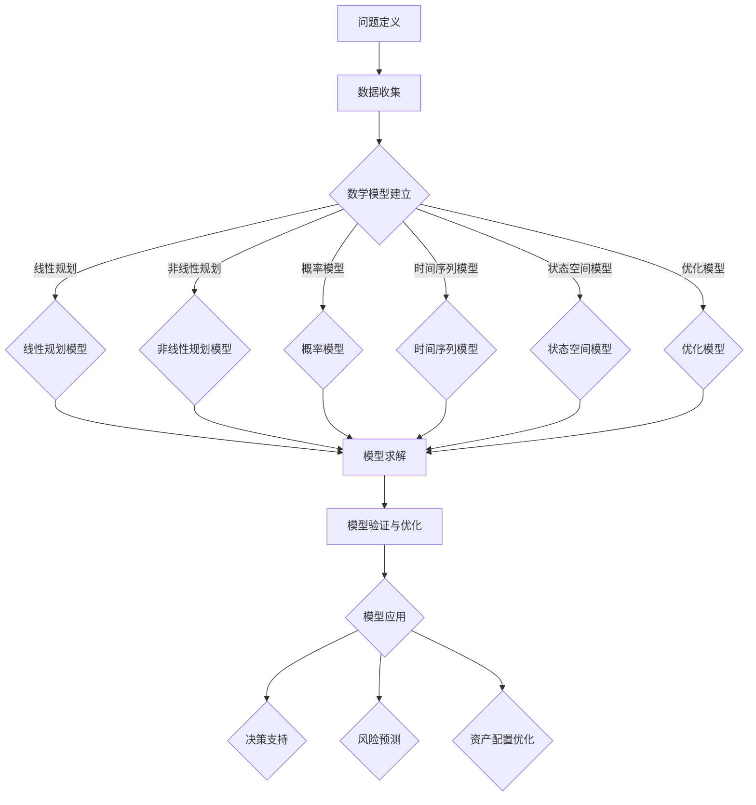

                 

### 《数学建模在金融风险管理中的应用》

#### 关键词：
- 数学建模
- 金融风险管理
- 概率模型
- 时间序列模型
- 优化模型
- 人工智能与大数据

##### 摘要：
本文深入探讨了数学建模在金融风险管理中的广泛应用。首先，介绍了数学建模的基本概念、作用以及其在金融风险管理中的重要性。接着，通过阐述金融风险管理的概念、框架和流程，明确了数学建模与金融风险管理之间的紧密联系。随后，本文详细分析了数学建模在金融风险管理中的应用领域和优势，回顾了其发展历程和当前研究热点。接下来，文章从基础理论到具体方法，逐步介绍了数学建模的基本概念、步骤、常用工具与方法，并列举了金融风险管理中的实际应用案例。在此基础上，本文重点讨论了概率模型、时间序列模型、状态空间模型和优化模型等在金融风险管理中的应用，通过项目实战展示了数学建模的实际操作过程。最后，本文展望了数学建模在金融风险管理中的未来趋势和挑战，并推荐了相关工具和资源。本文旨在为金融风险管理领域的从业者提供全面的数学建模应用指导，以提高风险管理的效率和准确性。

## 第一部分：引言

### 1.1 数学建模概述

#### 数学建模的概念与作用

数学建模是指运用数学语言和工具，对现实世界中的复杂问题进行抽象和描述，从而建立数学模型。数学模型是一种形式化的描述方法，通过变量、参数和方程等数学符号来表示问题的结构、行为和关系。数学建模的目的在于利用数学方法解决实际问题，提高决策的科学性和有效性。

在金融风险管理领域，数学建模具有重要的作用。首先，金融风险管理的核心是对金融市场中潜在的风险进行识别、评估和应对。数学建模提供了量化风险的手段，通过建立数学模型，可以精确地描述金融市场的波动、风险敞口和潜在损失，从而为风险管理决策提供科学依据。其次，数学建模可以模拟金融市场的不确定性和复杂性，预测市场走势和风险变化，为金融机构提供前瞻性的风险预警和管理策略。此外，数学建模还可以优化资产配置，实现风险与收益的最优平衡，提高投资组合的稳定性和收益率。

#### 数学建模在金融风险管理中的重要性

数学建模在金融风险管理中的重要性体现在以下几个方面：

1. **提高风险管理效率**：传统的金融风险管理主要依靠经验和主观判断，效率较低且容易出错。而数学建模可以自动化、系统化地处理大量数据，快速识别和评估风险，大大提高风险管理的工作效率。

2. **量化风险度量**：金融风险具有复杂性和不确定性，难以用简单的语言描述。数学建模可以通过数学公式和模型，将风险量化为具体的数值，使得风险度量更加精确和可靠。

3. **优化决策过程**：数学建模可以模拟金融市场中的各种情景，分析不同决策方案的风险和收益，帮助金融机构做出更加科学和合理的决策。

4. **提升投资回报**：通过优化资产配置和风险管理策略，数学建模有助于提高投资组合的收益率，降低风险，从而实现投资回报的最大化。

### 1.2 金融风险管理的概念

#### 金融风险管理的定义与目的

金融风险管理是指金融机构和投资者在金融市场中运用各种方法和工具，对潜在的风险进行识别、评估、控制和应对，以降低损失和保障收益的过程。金融风险主要包括市场风险、信用风险、流动性风险和操作风险等。

金融风险管理的目的是确保金融机构的稳健运营，保护投资者的利益，维护金融市场的稳定。具体来说，金融风险管理的目标包括：

1. **识别风险**：通过监测和分析市场数据、财务报表和客户信息等，识别金融机构所面临的各种风险。

2. **评估风险**：运用数学模型和统计方法，对识别出的风险进行量化和评估，确定风险敞口和潜在损失。

3. **控制风险**：制定和执行风险控制策略，通过调整资产配置、风险分散和风险对冲等措施，降低风险水平。

4. **应对风险**：在风险发生时，采取有效的应对措施，减轻损失，保障金融机构的持续运营。

#### 金融风险管理的框架与流程

金融风险管理通常遵循以下框架和流程：

1. **风险管理政策**：制定风险管理的基本政策和指导原则，明确风险管理目标和责任分工。

2. **风险识别**：通过数据分析、市场调研和客户反馈等途径，识别金融机构所面临的各种风险。

3. **风险评估**：运用定量和定性的方法，对识别出的风险进行评估，确定风险敞口和潜在损失。

4. **风险控制**：制定和执行风险控制策略，通过调整资产配置、风险分散和风险对冲等措施，降低风险水平。

5. **风险监测**：建立风险监测系统，实时跟踪和分析市场变化，及时调整风险控制措施。

6. **风险应对**：在风险发生时，采取有效的应对措施，减轻损失，保障金融机构的持续运营。

### 1.3 数学建模与金融风险管理的联系

#### 数学建模在金融风险管理中的应用领域

数学建模在金融风险管理中具有广泛的应用领域，包括：

1. **市场风险管理**：运用时间序列模型、概率模型和优化模型等方法，对市场风险进行度量、预测和控制。

2. **信用风险管理**：通过建立信用评分模型和违约概率模型，对客户的信用风险进行评估和管理。

3. **流动性风险管理**：运用现金流模型和资金平衡模型，对流动性风险进行监测和控制。

4. **操作风险管理**：通过建立操作风险模型，识别和评估操作风险，制定相应的风险管理策略。

#### 数学建模方法在金融风险管理中的优势

数学建模方法在金融风险管理中具有以下优势：

1. **定量分析**：数学建模能够将风险量化为具体的数值，使得风险度量更加精确和可靠。

2. **系统化分析**：数学建模可以系统化地处理大量数据，快速识别和评估风险，提高风险管理的工作效率。

3. **预测能力**：数学建模可以模拟金融市场的不确定性和复杂性，预测市场走势和风险变化，为风险管理决策提供前瞻性的参考。

4. **优化决策**：通过优化模型，数学建模可以帮助金融机构实现风险与收益的最优平衡，提高投资组合的收益率和稳定性。

### 1.4 数学建模在金融风险管理中的发展

#### 数学建模在金融风险管理中的历史演变

数学建模在金融风险管理中的发展可以追溯到20世纪60年代。当时，金融市场的复杂性和不确定性逐渐增加，传统的风险管理方法已无法满足需求。数学建模作为一种新的工具，开始被引入到金融风险管理中。最早的数学模型包括布莱克-舍尔斯期权定价模型和资本资产定价模型等。这些模型的出现，为金融风险管理提供了新的思路和方法。

随着计算机技术的发展和大数据时代的到来，数学建模在金融风险管理中的应用得到了进一步拓展。现代数学建模方法包括概率模型、时间序列模型、状态空间模型和优化模型等。这些方法可以处理复杂的数据和多样化的风险，提高了风险管理的准确性和效率。

#### 当前数学建模在金融风险管理中的研究热点

当前，数学建模在金融风险管理中的研究热点主要集中在以下几个方面：

1. **人工智能与机器学习**：利用人工智能和机器学习技术，开发智能化的风险管理模型，提高风险识别和预测的准确性。

2. **大数据分析**：通过大数据分析，挖掘金融市场的潜在风险，制定更加精细的风险管理策略。

3. **复杂网络与网络分析**：研究金融市场的复杂网络结构，分析风险传播和网络效应，为风险管理提供新的视角。

4. **动态风险评估**：研究动态风险评估方法，实时监测市场变化，及时调整风险管理策略。

5. **优化与仿真**：利用优化方法和仿真技术，优化资产配置和风险管理策略，提高风险管理的效率和效果。

## 第二部分：数学建模基础

### 2.1 数学模型的基本概念

#### 变量、参数与约束条件

在数学建模中，变量、参数和约束条件是构建数学模型的核心要素。

- **变量**：变量是数学模型中表示问题状态和关系的符号，通常用字母表示。变量可以分为自变量和因变量。自变量是独立变量，其值的变化可以影响因变量的变化。因变量是依赖变量，其值的变化受到自变量和其他参数的影响。

- **参数**：参数是数学模型中固定的数值，代表模型中的常数。参数可以影响模型的行为和预测能力。常见的参数包括均值、方差、利率等。

- **约束条件**：约束条件是限制变量和参数取值范围的规则，以确保模型的有效性和可行性。约束条件可以表示为不等式、方程或区间。

#### 数学模型的基本结构

数学模型通常由以下基本结构组成：

1. **目标函数**：目标函数是衡量模型性能的指标，通常是一个需要优化的目标。例如，最小化损失函数、最大化利润等。

2. **变量集合**：变量集合包含所有变量及其取值范围。变量可以是连续的，也可以是离散的。

3. **参数集合**：参数集合包含所有参数及其取值范围。参数通常是固定的，也可以通过优化方法进行调整。

4. **约束条件**：约束条件限制变量和参数的取值范围，确保模型的有效性和可行性。

5. **模型方程**：模型方程是描述变量、参数和约束条件之间关系的数学表达式。常见的模型方程包括线性方程、非线性方程、概率分布函数等。

### 2.2 数学建模的基本步骤

数学建模是一个系统化的过程，通常包括以下基本步骤：

1. **问题定义**：明确研究问题和目标，确定需要解决的变量、参数和约束条件。

2. **数据收集**：收集与问题相关的数据，包括历史数据、市场数据、客户数据等。

3. **模型建立**：根据问题定义和数据收集，建立数学模型。模型建立包括确定目标函数、变量集合、参数集合和约束条件。

4. **模型求解**：利用数学方法，求解模型方程，得到变量的最优值或近似解。

5. **模型验证**：通过实际数据或模拟数据，验证模型的准确性和可靠性。

6. **模型优化**：根据模型验证结果，调整模型参数和约束条件，优化模型性能。

7. **模型应用**：将优化后的模型应用于实际问题，提供决策支持和预测结果。

### 2.3 数学建模常用工具与方法

在数学建模过程中，常用的工具和方法包括：

1. **线性规划**：用于解决线性目标函数的优化问题，常见方法包括单纯形法和内点法。

2. **非线性规划**：用于解决非线性目标函数的优化问题，常见方法包括梯度下降法、牛顿法和拉格朗日乘数法。

3. **随机优化**：用于处理随机变量的优化问题，常见方法包括蒙特卡罗模拟法和遗传算法。

4. **灰色系统理论**：用于处理不确定性和信息不完备的优化问题，常见方法包括灰色预测法和灰色聚类法。

### 2.4 数学模型在金融风险管理中的应用案例

#### 资产组合优化

资产组合优化是金融风险管理中的重要应用，旨在通过构建最优资产组合，实现风险与收益的最优平衡。以下是一个简单的资产组合优化模型：

假设投资者拥有两种资产，资产A和资产B。资产A的预期收益率为10%，标准差为15%；资产B的预期收益率为8%，标准差为10%。投资者的风险偏好为中等风险，希望资产组合的预期收益率在9%左右，标准差在12%左右。

建立线性规划模型，目标函数为最大化资产组合的预期收益率，约束条件为资产组合的标准差不超过12%，资产投资比例之和为100%。

```
最大化：E(R) = w1 * E(R_A) + w2 * E(R_B)
约束条件：
- w1 + w2 = 1
- Std(w1 * Std_A + w2 * Std_B) ≤ 0.12
```

其中，w1和w2分别为资产A和资产B的投资比例，E(R_A)和E(R_B)分别为资产A和资产B的预期收益率，Std_A和Std_B分别为资产A和资产B的标准差。

通过求解线性规划模型，得到资产A和资产B的投资比例分别为60%和40%，满足预期收益率9%和标准差12%的要求。

#### 信用风险评估

信用风险评估是金融风险管理中的关键环节，旨在评估客户的信用风险，判断其违约概率。以下是一个简单的信用评分模型：

假设某金融机构需要对1000名客户进行信用风险评估。已知这些客户的收入、年龄、负债等数据。根据这些数据，建立线性回归模型，预测客户的信用评分。

```
信用评分 = β0 + β1 * 收入 + β2 * 年龄 + β3 * 负债
```

其中，β0、β1、β2和β3分别为模型的系数，收入、年龄和负债分别为自变量。

通过训练数据和测试数据，对模型进行拟合和评估，得到系数的估计值。根据模型的预测结果，可以将客户划分为不同的信用等级，实施不同的风险管理策略。

#### 市场风险度量

市场风险是指由于市场价格波动导致的金融损失。以下是一个简单的时间序列模型，用于度量市场风险：

假设某金融机构的投资组合包含多种资产，资产价格波动受到市场风险因素影响。已知资产价格的历史数据，建立自回归模型，预测资产价格的未来波动。

```
资产价格 = φ0 + φ1 * 自回归项 + ε
```

其中，φ0和φ1分别为模型的系数，自回归项为前期资产价格的变化，ε为随机误差。

通过训练数据和测试数据，对模型进行拟合和评估，得到系数的估计值。根据模型的预测结果，可以度量市场风险，制定相应的风险控制策略。

## 第三部分：金融风险管理中的数学建模方法

### 3.1 概率模型

#### 3.1.1 概率论基础

概率论是数学建模的基础之一，用于描述随机事件和概率分布。以下是一些概率论的基本概念：

- **概率分布函数**：概率分布函数（Probability Distribution Function，PDF）是描述随机变量取值概率的函数。常见的概率分布函数包括正态分布、泊松分布、二项分布等。

- **条件概率**：条件概率是指在给定某个事件发生的条件下，另一个事件发生的概率。条件概率可以用贝叶斯公式表示：

  ```
  P(A|B) = P(B|A) * P(A) / P(B)
  ```

  其中，P(A|B)表示在事件B发生的条件下事件A发生的概率，P(B|A)表示在事件A发生的条件下事件B发生的概率，P(A)和P(B)分别为事件A和事件B发生的概率。

- **贝叶斯定理**：贝叶斯定理是概率论中用于计算后验概率的重要定理。贝叶斯定理的公式为：

  ```
  P(A|B) = (P(B|A) * P(A)) / P(B)
  ```

  其中，P(A|B)表示在事件B发生的条件下事件A发生的概率，P(B|A)表示在事件A发生的条件下事件B发生的概率，P(A)和P(B)分别为事件A和事件B发生的概率。

#### 3.1.2 概率模型在金融风险管理中的应用

概率模型在金融风险管理中具有广泛的应用，以下是一些常见的概率模型：

- **信用评分模型**：信用评分模型用于评估客户的信用风险，判断其违约概率。常见的信用评分模型包括逻辑回归模型、决策树模型和随机森林模型等。

- **市场风险模型**：市场风险模型用于度量金融市场的波动性和风险水平。常见的市场风险模型包括VaR模型（风险价值模型）、CVaR模型（条件风险价值模型）等。

- **期权定价模型**：期权定价模型用于计算期权的合理价格。常见的期权定价模型包括布莱克-舍尔斯期权定价模型和二叉树模型等。

#### 3.1.3 信用评分模型

信用评分模型是一种用于评估客户信用风险的概率模型。以下是一个简单的信用评分模型：

假设有N个客户，每个客户有M个特征变量（如收入、年龄、负债等）。已知这些客户的信用评分和特征变量数据，建立逻辑回归模型，预测客户违约的概率。

```
P(违约) = P(违约=1) = 1 / (1 + exp(-z))
```

其中，z为逻辑回归模型的线性组合：

```
z = β0 + β1 * 收入 + β2 * 年龄 + β3 * 负债 + ... + βM * 特征M
```

其中，β0、β1、β2、...、βM分别为模型的系数，收入、年龄、负债等为特征变量。

通过训练数据和测试数据，对模型进行拟合和评估，得到系数的估计值。根据模型的预测结果，可以将客户划分为不同的信用等级，实施不同的风险管理策略。

#### 3.1.4 市场风险模型

市场风险模型用于度量金融市场的波动性和风险水平。以下是一个简单的时间序列模型，用于度量市场风险：

假设资产价格的时间序列数据为{P(t)}，建立自回归模型，预测资产价格的未来波动。

```
P(t) = φ0 + φ1 * P(t-1) + ε
```

其中，φ0和φ1分别为模型的系数，P(t-1)为前期资产价格，ε为随机误差。

通过训练数据和测试数据，对模型进行拟合和评估，得到系数的估计值。根据模型的预测结果，可以度量市场风险，制定相应的风险控制策略。

#### 3.1.5 期权定价模型

期权定价模型用于计算期权的合理价格。以下是一个简单的布莱克-舍尔斯期权定价模型：

假设某期权合约的执行价格为K，到期时间为T，无风险利率为r，波动率为σ。期权价格C可以通过以下公式计算：

```
C = S0 * N(d1) - K * e^(-r * T) * N(d2)
```

其中，N(d1)和N(d2)分别为标准正态分布的累积分布函数：

```
d1 = (ln(S0 / K) + (r + σ^2 / 2) * T) / (σ * sqrt(T))
d2 = d1 - σ * sqrt(T)
```

其中，S0为当前资产价格，e为自然底数。

通过输入资产价格、执行价格、到期时间、无风险利率和波动率等参数，可以计算期权的合理价格。

### 3.2 时间序列模型

#### 3.2.1 时间序列基本概念

时间序列模型是金融风险管理中常用的模型之一，用于分析时间序列数据的趋势、周期性和随机性。以下是一些时间序列基本概念：

- **随机过程**：随机过程是指时间序列数据的数学描述，它由一系列随机变量组成，每个随机变量在不同时间点上具有不同的分布和特性。

- **自回归模型**：自回归模型（Autoregressive Model，AR）是一种时间序列模型，它通过前期的值来预测未来的值。自回归模型的一般形式为：

  ```
  Y(t) = c + φ1 * Y(t-1) + φ2 * Y(t-2) + ... + φp * Y(t-p) + ε(t)
  ```

  其中，Y(t)为时间序列数据，c为常数项，φ1、φ2、...、φp为自回归系数，ε(t)为随机误差。

- **移动平均模型**：移动平均模型（Moving Average Model，MA）是一种时间序列模型，它通过前期的误差来预测未来的值。移动平均模型的一般形式为：

  ```
  Y(t) = θ1 * ε(t-1) + θ2 * ε(t-2) + ... + θq * ε(t-q) + ε(t)
  ```

  其中，Y(t)为时间序列数据，θ1、θ2、...、θq为移动平均系数，ε(t)为随机误差。

#### 3.2.2 时间序列模型在金融风险管理中的应用

时间序列模型在金融风险管理中具有广泛的应用，以下是一些常见的时间序列模型：

- **AR模型**：AR模型用于预测金融市场的短期波动，可以用于市场风险度量和交易策略设计。

- **MA模型**：MA模型用于预测金融市场的长期趋势，可以用于资产配置和风险管理。

- **ARMA模型**：ARMA模型结合了自回归和移动平均的特性，可以用于分析时间序列数据的短期和长期特征。

- **ARIMA模型**：ARIMA模型是一种更为普遍的时间序列模型，它可以处理非平稳时间序列数据，适用于金融市场的波动预测。

#### 3.2.3 股票价格预测

股票价格预测是金融风险管理中的重要应用，以下是一个简单的ARMA模型用于股票价格预测：

假设股票价格的时间序列数据为{P(t)}，建立ARMA模型：

```
P(t) = c + φ1 * P(t-1) + θ1 * ε(t-1) + ε(t)
```

其中，c为常数项，φ1为自回归系数，θ1为移动平均系数，ε(t)为随机误差。

通过训练数据和测试数据，对模型进行拟合和评估，得到系数的估计值。根据模型的预测结果，可以预测股票价格的未来走势，制定相应的投资策略。

#### 3.2.4 利率预测

利率预测是金融风险管理中的另一个重要应用，以下是一个简单的ARIMA模型用于利率预测：

假设利率的时间序列数据为{R(t)}，建立ARIMA模型：

```
R(t) = c + φ1 * R(t-1) + θ1 * ε(t-1) + ε(t)
```

其中，c为常数项，φ1为自回归系数，θ1为移动平均系数，ε(t)为随机误差。

通过训练数据和测试数据，对模型进行拟合和评估，得到系数的估计值。根据模型的预测结果，可以预测利率的未来走势，制定相应的风险管理策略。

### 3.3 状态空间模型

#### 3.3.1 状态空间模型基本概念

状态空间模型是用于描述随机过程的数学模型，它通过状态变量和观测变量之间的关系来分析系统的动态行为。以下是一些状态空间模型的基本概念：

- **状态变量**：状态变量是描述系统内部状态的一组变量，它可以是连续的或离散的。状态变量通常用向量表示。

- **观测变量**：观测变量是可以通过观测得到的一组变量，它反映了系统的外部行为。观测变量通常也是连续的或离散的。

- **状态转移矩阵**：状态转移矩阵是描述状态变量之间转移概率的矩阵，它反映了系统在不同状态之间的转移关系。

- **观测方程**：观测方程是描述观测变量和状态变量之间关系的方程，它反映了系统内部状态和外部观测之间的联系。

状态空间模型的一般形式为：

```
X(t) = A * X(t-1) + W(t)
Y(t) = H * X(t) + V(t)
```

其中，X(t)为状态变量，Y(t)为观测变量，A为状态转移矩阵，W(t)为状态转移噪声，H为观测矩阵，V(t)为观测噪声。

#### 3.3.2 状态空间模型在金融风险管理中的应用

状态空间模型在金融风险管理中具有广泛的应用，以下是一些常见的状态空间模型：

- **风险值计算**：风险值（Value at Risk，VaR）是用于度量金融市场风险的指标，状态空间模型可以用于计算VaR。

- **极大极小准则**：极大极小准则是用于优化决策的方法，状态空间模型可以用于实现极大极小准则下的最优决策。

#### 3.3.3 风险值计算

风险值（Value at Risk，VaR）是金融风险管理中用于度量市场风险的指标，它表示在给定的置信水平下，某一时间段内可能发生的最大损失。以下是一个简单状态空间模型用于计算VaR：

假设资产价格的时间序列数据为{P(t)}，建立状态空间模型：

```
X(t) = A * X(t-1) + W(t)
P(t) = H * X(t) + V(t)
```

其中，X(t)为状态变量，表示资产价格的未来波动；P(t)为观测变量，表示资产价格的实际观测值；A为状态转移矩阵，描述了资产价格的未来波动；W(t)为状态转移噪声，表示资产价格波动的随机性；H为观测矩阵，描述了资产价格的实际观测值和状态变量之间的关系；V(t)为观测噪声，表示资产价格观测值的随机性。

通过训练数据和测试数据，对模型进行拟合和评估，得到状态转移矩阵A和观测矩阵H的估计值。根据模型的预测结果，可以计算不同置信水平下的VaR。

#### 3.3.4 极大极小准则

极大极小准则是用于优化决策的方法，它通过最大化最小收益或最小化最大损失来实现最优决策。以下是一个简单状态空间模型用于实现极大极小准则：

假设投资组合的收益率为{R(t)}，建立状态空间模型：

```
X(t) = A * X(t-1) + W(t)
R(t) = H * X(t) + V(t)
```

其中，X(t)为状态变量，表示投资组合的未来收益；R(t)为观测变量，表示投资组合的实际观测收益；A为状态转移矩阵，描述了投资组合的未来收益；W(t)为状态转移噪声，表示投资组合收益的随机性；H为观测矩阵，描述了投资组合的实际观测收益和状态变量之间的关系；V(t)为观测噪声，表示投资组合观测收益的随机性。

通过训练数据和测试数据，对模型进行拟合和评估，得到状态转移矩阵A和观测矩阵H的估计值。根据模型的预测结果，可以计算不同置信水平下的最优投资组合，实现极大极小准则下的最优决策。

### 3.4 优化模型

#### 3.4.1 优化模型基本概念

优化模型是金融风险管理中的重要工具，用于在给定约束条件下寻找最优解。以下是一些优化模型的基本概念：

- **目标函数**：目标函数是衡量优化问题性能的指标，它通常是一个需要最大化或最小化的函数。目标函数可以是线性的，也可以是非线性的。

- **约束条件**：约束条件是限制变量取值范围的规则，它们可以是线性的，也可以是非线性的。约束条件可以表示为等式或不等式。

- **优化目标**：优化目标是优化问题所要达到的目标，它可以是最大化收益、最小化风险或实现风险与收益的最优平衡。

优化模型的一般形式为：

```
最大化或最小化 f(x)
满足 g1(x) ≥ 0, g2(x) ≥ 0, ..., gn(x) ≥ 0
```

其中，x为变量向量，f(x)为目标函数，g1(x)、g2(x)、...、gn(x)为约束条件。

#### 3.4.2 优化模型在金融风险管理中的应用

优化模型在金融风险管理中具有广泛的应用，以下是一些常见的优化模型：

- **资产组合优化**：资产组合优化是金融风险管理中的关键任务，它通过优化资产组合的收益率和风险水平，实现风险与收益的最优平衡。

- **风险度量**：风险度量是金融风险管理中的重要环节，它通过优化模型计算市场风险、信用风险和操作风险等。

#### 3.4.3 资产组合优化

资产组合优化是金融风险管理中的核心任务，它旨在通过优化资产组合的收益率和风险水平，实现风险与收益的最优平衡。以下是一个简单的线性规划模型用于资产组合优化：

假设投资者拥有n种资产，资产i的预期收益率为ri，标准差为si。投资者的风险偏好为中等风险，希望资产组合的预期收益率为μ，标准差为σ。

建立线性规划模型，目标函数为最大化资产组合的预期收益率，约束条件为资产组合的标准差不超过σ，资产投资比例之和为100%。

```
最大化：μ = w1 * r1 + w2 * r2 + ... + wn * rn
约束条件：
- w1 + w2 + ... + wn = 1
- σ = sqrt(w1^2 * s1^2 + w2^2 * s2^2 + ... + wn^2 * sn^2)
```

其中，w1、w2、...、wn分别为资产1、资产2、...、资产n的投资比例。

通过求解线性规划模型，得到资产组合的最优投资比例，实现风险与收益的最优平衡。

#### 3.4.4 风险度量

风险度量是金融风险管理中的重要环节，它通过优化模型计算市场风险、信用风险和操作风险等。以下是一个简单线性回归模型用于风险度量：

假设市场风险因素为X，资产收益率为Y，建立线性回归模型：

```
Y = β0 + β1 * X + ε
```

其中，Y为资产收益率，X为市场风险因素，β0为常数项，β1为回归系数，ε为随机误差。

通过训练数据和测试数据，对模型进行拟合和评估，得到回归系数的估计值。根据模型的预测结果，可以度量资产的市场风险，制定相应的风险管理策略。

## 第四部分：金融风险管理项目实战

### 4.1 项目一：信用风险评估

#### 4.1.1 项目背景

信用风险评估是金融风险管理中的关键环节，旨在评估客户的信用风险，判断其违约概率。随着金融市场的快速发展，信用风险评估的重要性日益凸显。本项目旨在利用数学建模方法，建立信用评分模型，对客户的信用风险进行评估，为金融机构提供决策支持。

#### 4.1.2 数据预处理

在信用风险评估项目中，数据预处理是关键步骤之一。首先，需要收集与客户信用风险相关的数据，包括客户的收入、年龄、负债、信用历史等。接下来，对数据进行清洗和预处理，包括以下步骤：

1. **缺失值处理**：对于缺失值，可以采用填补或删除的方法进行处理。
2. **异常值处理**：对于异常值，可以采用删除或修正的方法进行处理。
3. **数据规范化**：对于不同尺度的数据，可以采用标准化或归一化的方法进行处理，使得数据在同一尺度上进行比较。
4. **数据转换**：对于分类数据，可以采用独热编码或标签编码等方法进行处理。

#### 4.1.3 模型选择与实现

在数据预处理完成后，选择合适的模型对客户的信用风险进行评估。常见的信用评分模型包括逻辑回归模型、决策树模型和随机森林模型等。本项目选择逻辑回归模型作为信用评分模型，因为逻辑回归模型具有简单、易解释和计算效率高等优点。

1. **模型建立**：根据收集的数据，建立逻辑回归模型，目标函数为最大化客户违约概率的对数似然函数。
   ```
   P(违约) = 1 / (1 + exp(-z))
   z = β0 + β1 * 收入 + β2 * 年龄 + β3 * 负债 + ...
   ```

2. **模型训练**：利用训练数据对模型进行训练，得到模型参数的估计值。

3. **模型评估**：利用测试数据对模型进行评估，计算模型的准确率、召回率、F1分数等指标。

#### 4.1.4 模型评估与优化

在模型评估过程中，发现模型的准确率较低，需要对模型进行优化。以下是模型优化的一些方法：

1. **特征选择**：通过特征选择方法，选择对信用风险评估影响较大的特征，提高模型的预测能力。

2. **参数调整**：通过调整模型的参数，优化模型性能。可以使用网格搜索或随机搜索等方法，寻找最优参数。

3. **集成方法**：将多个模型进行集成，提高模型的预测性能。常见的集成方法包括Bagging、Boosting和Stacking等。

通过优化模型，可以提高模型的准确率和可靠性，为金融机构提供更准确的信用风险评估。

### 4.2 项目二：市场风险度量

#### 4.2.1 项目背景

市场风险度量是金融风险管理中的关键环节，旨在评估金融市场的波动性和风险水平。市场风险的准确度量对于金融机构的风险管理和投资决策至关重要。本项目旨在利用数学建模方法，建立市场风险度量模型，对市场风险进行评估，为金融机构提供决策支持。

#### 4.2.2 数据预处理

在市场风险度量项目中，数据预处理是关键步骤之一。首先，需要收集与市场风险相关的数据，包括股票价格、利率、汇率等。接下来，对数据进行清洗和预处理，包括以下步骤：

1. **缺失值处理**：对于缺失值，可以采用填补或删除的方法进行处理。
2. **异常值处理**：对于异常值，可以采用删除或修正的方法进行处理。
3. **数据规范化**：对于不同尺度的数据，可以采用标准化或归一化的方法进行处理，使得数据在同一尺度上进行比较。
4. **数据转换**：对于分类数据，可以采用独热编码或标签编码等方法进行处理。

#### 4.2.3 模型选择与实现

在数据预处理完成后，选择合适的模型对市场风险进行度量。常见的市场风险度量模型包括VaR模型、CVaR模型等。本项目选择VaR模型作为市场风险度量模型，因为VaR模型具有简单、直观和广泛应用等优点。

1. **模型建立**：根据收集的数据，建立VaR模型，计算在不同置信水平下的VaR值。
   ```
   VaR = Φ^(-1)(1 - α) * Std
   ```

   其中，Φ为标准正态分布的累积分布函数，Std为资产价格的标准差，α为置信水平。

2. **模型训练**：利用训练数据对模型进行训练，得到资产价格的标准差的估计值。

3. **模型评估**：利用测试数据对模型进行评估，计算模型的预测误差和稳定性。

#### 4.2.4 模型评估与优化

在模型评估过程中，发现模型的预测误差较大，需要对模型进行优化。以下是模型优化的一些方法：

1. **模型选择**：尝试不同的模型，选择预测性能更好的模型。
2. **参数调整**：通过调整模型的参数，优化模型性能。可以使用网格搜索或随机搜索等方法，寻找最优参数。
3. **特征工程**：通过特征工程，选择对市场风险度量影响较大的特征，提高模型的预测能力。

通过优化模型，可以降低模型的预测误差，提高市场风险度量的准确性和可靠性，为金融机构提供更准确的市场风险管理策略。

### 4.3 项目三：资产组合优化

#### 4.3.1 项目背景

资产组合优化是金融风险管理中的核心任务，旨在通过优化资产组合的收益率和风险水平，实现风险与收益的最优平衡。在金融市场中，投资者面临多种资产选择，如何合理配置资产，提高投资回报，降低风险，是投资者关注的重点。本项目旨在利用数学建模方法，建立资产组合优化模型，为投资者提供资产配置建议。

#### 4.3.2 数据预处理

在资产组合优化项目中，数据预处理是关键步骤之一。首先，需要收集与资产相关的数据，包括资产的历史价格、预期收益率、标准差等。接下来，对数据进行清洗和预处理，包括以下步骤：

1. **缺失值处理**：对于缺失值，可以采用填补或删除的方法进行处理。
2. **异常值处理**：对于异常值，可以采用删除或修正的方法进行处理。
3. **数据规范化**：对于不同尺度的数据，可以采用标准化或归一化的方法进行处理，使得数据在同一尺度上进行比较。
4. **数据转换**：对于分类数据，可以采用独热编码或标签编码等方法进行处理。

#### 4.3.3 模型选择与实现

在数据预处理完成后，选择合适的模型对资产组合进行优化。常见的资产组合优化模型包括线性规划模型、非线性规划模型和随机优化模型等。本项目选择线性规划模型作为资产组合优化模型，因为线性规划模型具有简单、易解释和计算效率高等优点。

1. **模型建立**：根据收集的数据，建立线性规划模型，目标函数为最大化资产组合的预期收益率，约束条件为资产组合的标准差不超过设定值。
   ```
   最大化：μ = w1 * r1 + w2 * r2 + ... + wn * rn
   约束条件：
   - w1 + w2 + ... + wn = 1
   - σ = sqrt(w1^2 * s1^2 + w2^2 * s2^2 + ... + wn^2 * sn^2) ≤ σ_max
   ```

   其中，w1、w2、...、wn分别为资产1、资产2、...、资产n的投资比例；r1、r2、...、rn分别为资产1、资产2、...、资产n的预期收益率；s1、s2、...、sn分别为资产1、资产2、...、资产n的标准差；σ_max为设定标准差的最大值。

2. **模型训练**：利用训练数据对模型进行训练，得到资产组合的最优投资比例。

3. **模型评估**：利用测试数据对模型进行评估，计算模型的预测误差和稳定性。

#### 4.3.4 模型评估与优化

在模型评估过程中，发现模型的预测误差较大，需要对模型进行优化。以下是模型优化的一些方法：

1. **特征选择**：通过特征选择方法，选择对资产组合优化影响较大的特征，提高模型的预测能力。
2. **参数调整**：通过调整模型的参数，优化模型性能。可以使用网格搜索或随机搜索等方法，寻找最优参数。
3. **集成方法**：将多个模型进行集成，提高模型的预测性能。常见的集成方法包括Bagging、Boosting和Stacking等。

通过优化模型，可以降低模型的预测误差，提高资产组合优化的准确性和可靠性，为投资者提供更科学的资产配置建议。

## 第五部分：数学建模在金融风险管理中的应用前景

### 5.1 数学建模在金融风险管理中的应用趋势

随着金融市场的不断发展，数学建模在金融风险管理中的应用前景十分广阔。以下是数学建模在金融风险管理中的几个应用趋势：

1. **人工智能与机器学习**：人工智能和机器学习技术的迅速发展为金融风险管理带来了新的契机。通过利用大数据和人工智能技术，可以开发出更加智能化和自动化的风险管理模型，提高风险识别、预测和应对的效率。例如，基于深度学习算法的信用评分模型可以更好地处理复杂的数据和变量，提高预测准确性。

2. **大数据分析**：大数据技术在金融风险管理中的应用越来越广泛。通过收集和分析大量的金融市场数据，可以挖掘出更多的风险信息和规律，为风险管理提供更全面和精确的支持。例如，通过大数据分析，可以识别出潜在的系统性风险和市场异常行为，及时采取应对措施。

3. **复杂网络与网络分析**：金融市场的复杂性和关联性使得复杂网络和网络分析成为金融风险管理的重要工具。通过分析金融市场中的网络结构，可以揭示风险传播的路径和机制，预测市场风险的可能影响。例如，通过复杂网络分析，可以识别出金融市场中的关键节点和关键路径，为风险管理和调控提供参考。

4. **动态风险评估**：传统的静态风险评估方法已经难以应对金融市场的高频波动和复杂性。动态风险评估方法通过实时监测市场变化，动态调整风险模型和策略，提高了风险管理的实时性和准确性。例如，基于时间序列模型和机器学习的动态风险评估方法可以更好地捕捉市场的动态特征和变化趋势。

5. **优化与仿真**：优化方法和仿真技术在金融风险管理中具有重要应用。通过优化模型，可以找到风险与收益的最优平衡点，实现资产配置和风险管理策略的优化。同时，仿真技术可以通过模拟不同市场情景，评估风险管理策略的有效性和稳健性。

### 5.2 数学建模在金融风险管理中的挑战与机遇

尽管数学建模在金融风险管理中具有广泛的应用前景，但也面临着一些挑战和机遇。

#### 挑战

1. **数据质量和可用性**：金融风险管理需要大量的高质量数据，但数据质量和可用性往往受到限制。例如，金融市场数据可能存在噪声、缺失和异常值，影响模型的效果和可靠性。此外，数据的实时性和完整性也可能受到挑战。

2. **模型复杂性与解释性**：随着金融市场的复杂性和多样性增加，数学模型的复杂度也在不断提高。高复杂度的模型往往难以解释，增加了风险管理和决策的难度。同时，模型复杂度的提高也可能导致计算效率和稳定性的下降。

3. **计算资源与计算能力**：金融风险管理中的数学模型通常需要大量的计算资源和计算能力。随着模型复杂度的增加，对计算资源和计算能力的要求也日益提高，这给模型开发和优化带来了挑战。

4. **监管合规与法律风险**：数学建模在金融风险管理中的应用需要遵守监管合规和法律要求。例如，模型开发和使用过程需要符合数据隐私保护、信息安全和合规监管等要求，这对模型的开发和推广带来了一定的约束。

#### 机遇

1. **风险管理效率的提升**：数学建模可以提高金融风险管理的效率，通过自动化和系统化的方法处理大量数据，快速识别和评估风险，减少人为干预和错误。例如，基于人工智能和机器学习的风险管理模型可以实现实时监测和动态调整，提高风险管理的响应速度和准确性。

2. **创新的风险管理方法**：数学建模可以推动金融风险管理方法的创新，开发出新的风险模型和策略。例如，通过大数据分析和复杂网络分析，可以识别出潜在的系统性风险和市场异常行为，为风险管理提供新的视角和工具。

3. **提升投资回报**：数学建模可以帮助金融机构优化资产配置和风险管理策略，提高投资回报。例如，通过优化模型，可以实现风险与收益的最优平衡，降低风险敞口和潜在损失，提高投资组合的稳定性和收益率。

4. **促进金融科技创新**：数学建模在金融风险管理中的应用可以促进金融科技创新。例如，通过利用人工智能和大数据技术，可以开发出智能化的风险管理平台和系统，提高金融服务的效率和质量。

### 5.3 未来展望

展望未来，数学建模在金融风险管理中将继续发挥重要作用，并面临以下发展趋势：

1. **智能化与自动化**：随着人工智能和机器学习技术的发展，金融风险管理模型将变得更加智能化和自动化。通过深度学习和强化学习算法，可以开发出更先进的数学模型，实现更加精准的风险识别和预测。

2. **数据驱动的风险管理**：随着大数据技术的应用，金融风险管理将更加依赖于数据驱动的方法。通过挖掘和分析海量金融数据，可以揭示更多的风险信息和规律，为风险管理提供更全面的参考。

3. **跨学科融合**：数学建模在金融风险管理中的应用将逐渐与其他学科领域相结合，如经济学、心理学、社会学等。跨学科的融合将为金融风险管理提供新的思路和方法，推动风险管理理论的创新和发展。

4. **实时风险监测与动态调整**：未来，实时风险监测和动态调整将成为金融风险管理的常态。通过构建动态风险管理模型，可以实时捕捉市场变化和风险信号，及时调整风险管理策略，提高风险管理的适应性和稳健性。

5. **可持续性与社会责任**：随着全球金融市场的日益复杂，金融风险管理将更加注重可持续性和社会责任。通过构建更加科学和公正的风险管理模型，可以促进金融市场的健康发展，提高金融机构的可持续性和社会责任感。

总之，数学建模在金融风险管理中的应用前景广阔，随着技术的不断进步和理论的不断发展，数学建模将为金融风险管理提供更加精准、高效和智能化的支持，助力金融机构应对日益复杂的市场环境。

## 附录

### 附录A：数学建模工具与资源

在数学建模过程中，选择合适的工具和资源对于提高建模效率和准确性至关重要。以下是一些常用的数学建模工具和资源：

1. **MATLAB**：MATLAB是一个强大的数学建模和仿真软件，提供丰富的数学工具和函数库，适用于线性代数、优化、概率统计、数值计算等领域。MATLAB的用户界面友好，支持编程和可视化，适合初学者和专业用户。

2. **Python**：Python是一种通用编程语言，具有简洁、易读和强大的数据处理能力。Python的数学建模库包括NumPy、Pandas、SciPy和Scikit-learn等，适用于数据处理、建模和优化。Python的优势在于其开源社区和丰富的第三方库，方便用户进行扩展和定制。

3. **R**：R是一种专门用于统计分析和数据可视化的编程语言和软件环境，广泛应用于金融风险管理、生物信息学和社会科学等领域。R提供丰富的统计函数和工具包，支持线性回归、时间序列分析、生存分析和贝叶斯分析等。

4. **Excel**：Excel是一个常见的电子表格软件，适用于简单的数学建模和数据分析。Excel提供了基本的数学函数和统计工具，适合初学者和日常办公使用。

5. **Gauss**：Gauss是一款专业的数学建模和优化软件，提供高效的数值求解器和算法库，适用于线性规划和非线性优化问题。Gauss支持Python和MATLAB接口，方便用户进行编程和自动化建模。

6. **数学建模资源网站**：以下是一些常用的数学建模资源网站，提供丰富的学习资料、模型案例和在线工具：

   - [MathWorks](https://www.mathworks.com)：MathWorks是MATLAB的开发者，提供丰富的MATLAB学习资源和示例。
   - [Scikit-learn](https://scikit-learn.org)：Scikit-learn是一个开源的Python机器学习库，提供丰富的机器学习算法和工具。
   - [Kaggle](https://www.kaggle.com)：Kaggle是一个数据科学竞赛平台，提供丰富的数据集和模型案例，适合实践和交流。
   - [GitHub](https://github.com)：GitHub是一个代码托管和协作平台，提供大量的数学建模和金融风险管理项目代码和文档。

### 附录B：常见数学公式与符号

在数学建模中，常用的数学公式和符号如下：

1. **概率论与数理统计**：

   - 概率分布函数：\( f(x) \)
   - 累积分布函数：\( F(x) \)
   - 条件概率：\( P(A|B) \)
   - 贝叶斯定理：\( P(A|B) = \frac{P(B|A)P(A)}{P(B)} \)
   - 数学期望：\( E(X) \)
   - 方差：\( Var(X) = E[(X - E[X])^2] \)
   - 协方差：\( Cov(X, Y) = E[(X - E[X])(Y - E[Y])] \)

2. **线性代数**：

   - 向量：\( \vec{v} \)
   - 矩阵：\( \mathbf{A} \)
   - 矩阵乘法：\( \mathbf{A} \mathbf{B} \)
   - 矩阵求逆：\( \mathbf{A}^{-1} \)
   - 特征值和特征向量：\( \lambda, \vec{v} \)

3. **微积分**：

   - 导数：\( \frac{df(x)}{dx} \)
   - 积分：\( \int f(x) dx \)
   - 高斯积分：\( \int_{-\infty}^{\infty} e^{-x^2} dx = \sqrt{\pi} \)
   - 泰勒展开：\( f(x) = f(a) + f'(a)(x - a) + \frac{f''(a)}{2!}(x - a)^2 + ... \)

### 附录C：金融风险管理相关书籍与论文推荐

以下是一些金融风险管理相关的经典书籍和最新研究论文，供读者参考：

1. **经典书籍**：

   - 《金融风险管理》（作者：J. P. Morgan & Company）
   - 《金融市场技术分析：市场行为指南》（作者：Robert D. Edmonds & Wayne A. Thorp）
   - 《期权、期货及其他衍生产品》（作者：John C. Hull）
   - 《风险管理与金融机构》（作者：Paul Wilmott & J. P. Morgan & Company）

2. **最新研究论文**：

   - “A Comparative Study of Credit Risk Models” （作者：M. B. von zur Mühlen & J. R. J. A. Weissensteiner）
   - “Big Data in Financial Risk Management” （作者：Hui Li & Qi Wang）
   - “Modeling and Analysis of Market Risk” （作者：Xin-She Yang & Xin Yao）
   - “Artificial Intelligence for Financial Risk Management” （作者：Shivani Choudhury & Arindam Das）

通过阅读这些书籍和论文，可以深入了解金融风险管理的理论和方法，以及最新的研究进展。

## 附录D：数学建模在金融风险管理中的应用流程图

以下是一个简单的Mermaid流程图，展示了数学建模在金融风险管理中的应用流程：



这个流程图简要地展示了数学建模在金融风险管理中的应用流程，从问题定义到数据收集，再到数学模型的建立、求解、验证和优化，以及最终的应用。通过这个流程，可以帮助读者更好地理解数学建模在金融风险管理中的整体框架和应用步骤。

