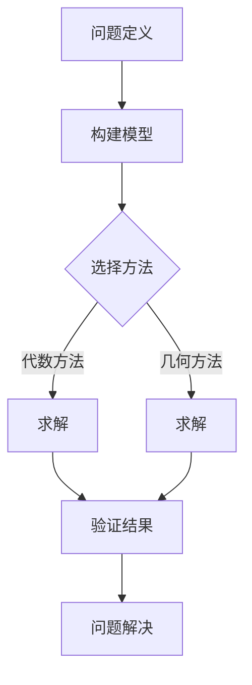

                 

### 《数学思维与创造力的关系》

> **关键词**：数学思维、创造力、心理学、教育改革、企业应用、艺术创作

> **摘要**：本文深入探讨了数学思维与创造力之间的关系，通过文献综述、实验研究和案例分析，揭示了数学思维在激发创造力中的关键作用。文章首先阐述了数学思维与创造力的基本概念，随后分析了它们之间的互动关系及其在不同领域中的应用。本文旨在为教育工作者、研究人员和企业提供理论依据和实践指导，以促进数学思维与创造力的培养和发挥。

### 《数学思维与创造力的关系》目录大纲

#### 第一部分：引言与概述

1. **引言**
   - **背景介绍**：简要介绍数学思维与创造力的研究背景及其重要性。
   - **研究意义**：阐述研究数学思维与创造力关系的重要性和现实意义。

2. **数学思维与创造力的基本概念**
   - **数学思维的概念与特征**
     - 数学思维的定义
     - 数学思维的特征与表现形式
   - **创造力的定义与分类**
     - 创造力的定义
     - 创造力的分类
     - 创造力的评估

3. **数学思维与创造力关系的初步探讨**
   - **数学思维对创造力的影响**
   - **创造力对数学思维的作用**
   - **数学思维与创造力互动的理论模型**

#### 第二部分：数学思维的基本原理

1. **数学的基本概念与逻辑**
   - **数学的基本概念**
     - 数与运算
     - 代数与方程
     - 几何与拓扑
   - **数学的逻辑结构**
     - 归纳推理与演绎推理
     - 证明与证明方法

2. **数学问题解决策略**
   - **问题定义与模型构建**
   - **问题分析与求解方法**
   - **数学问题解决过程中的创造性思维**

3. **数学思维的发展历程**
   - **数学思维的历史演变**
   - **现代数学思维的特点与挑战**
   - **数学思维的未来趋势**

#### 第三部分：创造力心理学基础

1. **创造力的心理学理论**
   - **创造力定义与理论**
   - **创造力发展模型**
   - **创造力影响因素**

2. **创造力的影响因素**
   - **个体因素**
     - 知识水平
     - 认知能力
     - 情绪状态
   - **环境因素**
     - 教育背景
     - 社会文化
     - 资源支持

3. **创造力的测量方法**
   - **创造力测量工具**
   - **创造力评估指标**
   - **创造力测量的局限性**

#### 第四部分：数学思维与创造力的互动关系

1. **数学思维对创造力的影响**
   - **数学知识与创造性思维**
   - **数学方法在创造力激发中的作用**
   - **数学思维培养与创造力提升**

2. **创造力对数学思维的作用**
   - **创造力在数学问题解决中的应用**
   - **数学思维在创造力表达中的体现**
   - **数学与创造性思维的结合**

3. **数学思维与创造力互动的理论模型**
   - **互动机制与路径分析**
   - **数学思维与创造力的相互促进**
   - **模型在实际应用中的验证**

#### 第五部分：数学思维与创造力培养

1. **数学教育与创造力培养**
   - **教育理念的创新**
   - **教学策略的调整**
   - **教师角色的转变**

2. **数学问题解决与创造力激发**
   - **问题解决的创造性思维**
   - **问题解决策略的创新性思考**
   - **数学问题解决与创造力培养的案例研究**

3. **数学思维与创造力培养的策略与方法**
   - **数学思维的训练方法**
   - **创造力培养的具体措施**
   - **综合实践与应用**

#### 第六部分：数学思维与创造力在实践中的应用

1. **数学思维与创造力在企业中的应用**
   - **数学思维在企业决策中的作用**
   - **创造力在企业创新中的应用**
   - **企业创新中的数学思维与创造力互动**

2. **数学思维与创造力在教育改革中的应用**
   - **教育改革中的数学思维培养**
   - **创造力培养在教育改革中的实践**
   - **教育政策建议与数学思维培养**

3. **数学思维与创造力在艺术创作中的应用**
   - **数学思维在艺术创作中的运用**
   - **创造力在艺术创作中的数学灵感**
   - **艺术创作中的数学思维与创造力互动案例**

#### 第七部分：总结与展望

1. **数学思维与创造力关系研究的未来方向**
   - **研究现状与挑战**
   - **未来研究方向与趋势**
   - **研究方法与工具的创新**

2. **数学思维与创造力培养的社会意义**
   - **社会创新与数学思维**
   - **创造力培养对个人与社会发展的影响**
   - **数学思维与创造力培养的实践意义**

#### 附录

1. **附录A：数学思维与创造力关系的研究方法**
   - **文献综述法**
   - **实验研究法**
   - **案例分析**

2. **附录B：数学思维与创造力培养的资源与工具**
   - **开放式资源**
   - **在线教育平台**
   - **创造力培养工具与软件**

---

### 第一部分：引言与概述

#### 1.1 数学思维的概念与特征

**数学思维** 是指个体在数学活动中所体现出的思维方式和认知模式。它不仅仅局限于数学本身，更是一种普遍的思维训练方式。数学思维具有以下几个显著特征：

- **逻辑性**：数学思维强调逻辑推理和证明，通过一系列逻辑步骤从已知事实推导出结论。这种逻辑性使数学思维成为一种高度理性的思维方式。
- **抽象性**：数学思维常常涉及到对具体事物的抽象，将问题简化为数学模型，从而更易于分析和解决。这种抽象性使数学思维成为一种高度概括和提炼的思维方式。
- **系统性**：数学思维注重系统性和整体性，通过构建数学体系来理解问题。这种系统性使数学思维成为一种高度结构化的思维方式。

**数学思维** 的基本形式包括：

- **演绎思维**：从一般到特殊，通过逻辑推理推导出结论。例如，从“所有人都会死亡”这个前提，演绎出“苏格拉底会死亡”的结论。
- **归纳思维**：从特殊到一般，通过观察和归纳总结出一般性规律。例如，通过观察多个苹果从树上落下，归纳出“苹果总是向地面落下”的规律。
- **联想思维**：通过事物之间的联系和相似性进行思维。例如，通过发现“圆”与“球”之间的相似性，推导出“圆的面积”与“球的体积”之间的关系。

#### 1.2 创造力的定义与分类

**创造力** 是指个体在创造活动中所展现出的新颖性、独特性和实用性的能力。创造力是人类智力的核心组成部分，对于个人和社会发展具有重要意义。创造力的定义可以从以下几个方面来理解：

- **新颖性**：创造力强调思维的新颖性，即产生独特、不同寻常的想法或解决方案。
- **独特性**：创造力还强调思想的独特性，即具有个人特色和独特视角。
- **实用性**：创造力不仅仅是理论上的创新，还需要具有实际应用价值。

根据不同的分类标准，创造力可以划分为多种类型：

- **个体创造力**：指个体在特定领域或情境中展现出的创造性能力。个体创造力通常通过创新性思维、问题解决能力和艺术创作能力等来体现。
- **团队创造力**：指团队成员在共同工作中展现出的创造力。团队创造力通常通过协同创新、团队沟通和知识共享等来体现。
- **社会创造力**：指社会在整体层面上展现出的创造力，包括科技创新、文化创新和社会创新等。社会创造力通常通过社会发展和文明进步来体现。

#### 1.3 数学思维与创造力关系的初步探讨

数学思维与创造力之间存在密切的联系，两者相互促进、相互依赖。数学思维对创造力的影响主要表现在以下几个方面：

- **逻辑性与推理能力**：数学思维强调逻辑推理和证明，这有助于提高个体的推理能力和批判性思维能力，从而为创造力提供坚实的逻辑基础。
- **抽象性与概括能力**：数学思维常常涉及到对具体事物的抽象，将问题简化为数学模型，从而更易于分析和解决。这种抽象性和概括能力有助于激发个体的创造性思维。
- **系统性**：数学思维注重系统性和整体性，通过构建数学体系来理解问题。这种系统性和整体性有助于个体在创造过程中形成系统化的思维模式，从而提高创造力。

创造力对数学思维的影响主要表现在以下几个方面：

- **新颖性与独特性**：创造力强调思维的新颖性和独特性，这有助于个体在数学问题解决过程中产生独特的思路和解决方案，从而丰富数学思维。
- **问题解决能力**：创造力在数学问题解决过程中发挥着重要作用。通过创造力，个体能够从不同角度和维度分析问题，提出创新性的解决方案，从而提高数学思维的灵活性和应用性。
- **表达与交流能力**：创造力有助于个体在数学表达和交流过程中展现出独特性和创造性，从而提高数学思维的可理解性和传播性。

综上所述，数学思维与创造力之间存在着紧密的互动关系。数学思维为创造力提供了逻辑基础、抽象能力和系统化思维模式，而创造力则丰富了数学思维的新颖性、独特性和实用性。进一步的研究和探讨将有助于揭示数学思维与创造力的深层关系，为教育和实践提供有益的指导。

---

### 第二部分：数学思维的基本原理

#### 2.1 数学的基本概念与逻辑

数学是一门研究数量、结构、变化和空间等概念的抽象科学。它不仅仅是一种工具，更是一种思维方式。数学的基本概念包括数与运算、代数与方程、几何与拓扑等。数学的逻辑结构则体现在归纳推理、演绎推理、证明与证明方法等方面。

首先，数学的基本概念是理解数学思维的基础。数与运算是数学的核心，从自然数、整数、有理数到实数和复数，这些数的基本概念构成了数学的基础。运算则包括加法、减法、乘法、除法以及更高级的运算，如幂运算、指数运算等。

代数与方程是数学中的另一个重要组成部分。代数主要研究符号和方程，通过符号表示和运算，解决各种数学问题。方程则是数学中的一种特殊表达形式，通过解方程可以解决许多实际问题。例如，一元一次方程、一元二次方程、多元方程组等。

几何与拓扑则关注空间结构。几何学研究平面和空间中的形状、大小和位置关系。通过研究点、线、面、体等基本几何元素，可以解决许多实际问题和理论问题。拓扑学则是几何的抽象形式，研究空间在连续变化下的性质。拓扑学中的一些概念，如连通性、紧致性、同胚性等，对于理解数学中的许多复杂现象具有重要意义。

其次，数学的逻辑结构是数学思维的骨架。归纳推理和演绎推理是数学逻辑中的两个基本形式。

归纳推理是从个别事实出发，通过归纳总结出一般性规律。例如，通过观察多个苹果从树上落下，我们可以归纳出“苹果总是向地面落下”的规律。归纳推理是科学研究中常用的一种方法，可以帮助我们从一个具体实例推导出更一般性的结论。

演绎推理则是从一般原则出发，通过逻辑推导得出个别结论。例如，从“所有人都会死亡”这个前提，通过演绎推理可以得出“苏格拉底会死亡”的结论。演绎推理是数学证明的核心，通过一系列逻辑步骤，从已知事实推导出结论。

证明与证明方法是数学逻辑中的重要组成部分。证明是指通过一系列逻辑推理，从已知事实推导出结论的过程。证明方法包括直接证明、反证法、数学归纳法等。直接证明是指通过逻辑推导，直接证明结论成立。反证法则是通过假设结论不成立，然后推导出矛盾，从而证明结论成立。数学归纳法则是通过证明基础情况成立，并假设归纳假设成立，推导出归纳步骤成立，从而证明整个问题成立。

总之，数学的基本概念与逻辑结构为数学思维提供了基础和框架。通过理解这些基本概念和逻辑结构，我们可以更好地把握数学的本质，培养数学思维的能力。

#### 2.2 数学问题解决策略

数学问题解决策略是数学思维的重要组成部分，它涉及到问题的定义与模型构建、问题分析与求解方法以及创造性思维的应用。有效的数学问题解决策略不仅有助于解决具体问题，还能提高个体的数学思维能力和创造力。

首先，问题的定义与模型构建是数学问题解决的第一步。在解决数学问题时，我们需要准确理解问题的本质，并将其转化为数学模型。这通常涉及到以下几个步骤：

1. **明确问题目标**：首先要明确问题需要解决的问题是什么，目标是找到什么结果或答案。
2. **提取关键信息**：从问题中提取关键信息，这些信息通常以文字、图表或图形的形式出现，是构建数学模型的重要依据。
3. **建立数学模型**：根据提取的关键信息，构建一个数学模型。数学模型可以是方程、不等式、几何图形或其他数学表达式。建立模型的过程需要运用数学的基本概念和逻辑结构。

例如，在一个涉及运动问题的数学题目中，我们需要明确物体的运动类型（匀速直线运动、抛物线运动等）、初始条件和运动参数，然后建立相应的运动方程来描述物体的运动。

其次，问题分析与求解方法是在模型构建之后的关键步骤。分析问题意味着深入理解模型的每一个部分，确定需要求解的目标，并选择合适的求解方法。以下是几种常见的问题分析方法和求解步骤：

1. **分解问题**：将复杂问题分解为几个更简单的子问题，分别求解。这种方法有助于降低问题的复杂性，使问题更易于解决。
2. **建立方程**：根据数学模型，建立相应的方程或不等式。方程和不等式是数学问题解决的核心工具，通过解这些方程和不等式，可以找到问题的解。
3. **运用数学方法**：根据问题的类型，选择合适的数学方法进行求解。例如，对于几何问题，可以运用几何方法；对于代数问题，可以运用代数方法；对于微积分问题，可以运用微积分方法。
4. **验证结果**：在求解问题后，需要验证结果是否满足问题的实际意义。这可以通过检查计算过程、使用代数验证或构建实际模型进行实验验证等方式实现。

例如，在求解一个一元二次方程时，可以通过配方法、公式法或因式分解法来求解。这些方法不仅能够找到方程的解，还能帮助我们理解方程的性质和解的含义。

最后，创造性思维在数学问题解决过程中起着重要作用。创造性思维是指在面对复杂问题时，能够跳出传统思维框架，产生新颖和独特想法的能力。以下是一些激发创造性思维的方法：

1. **联想思维**：通过发现不同问题之间的联系，产生新的思路和解决方案。例如，通过类比不同领域的数学问题，可以找到新的解决方法。
2. **逆向思维**：从问题的反面思考，寻找可能的解决方案。例如，如果问题的常规解法无效，可以尝试从问题的反方向进行思考。
3. **组合思维**：将不同的数学方法、工具和思路进行组合，形成新的解决策略。例如，将代数和几何方法结合，可以解决更复杂的问题。

例如，在一个几何问题中，我们可以通过组合几何方法和代数方法，构造出新的数学模型，从而找到问题的解。

总之，数学问题解决策略是一个综合性的过程，涉及到问题的定义与模型构建、问题分析与求解方法以及创造性思维的应用。通过有效的策略和方法，我们可以更好地解决数学问题，提高数学思维和创造力。

#### 2.3 数学思维的发展历程

数学思维的发展历程是人类文明进步的重要标志，它不仅体现了数学本身的发展，也反映了人类认知能力的提升。数学思维的历史可以追溯到古代文明，经历了多个重要阶段，从古代的几何学、算术到现代的代数学、微积分，再到现代数学的各个分支，数学思维不断演变和深化。

**古代数学思维**：古代数学主要源于古希腊和古印度等文明。古希腊数学家欧几里得创立了《几何原本》，奠定了几何学的基础。古希腊数学强调逻辑推理和证明，代表了早期数学思维的高度发展。古印度数学则发展了零的概念和十进制系统，为现代数学提供了重要基础。

**中世纪数学思维**：中世纪数学在欧洲经历了短暂的沉寂，但随着阿拉伯文化的传入，数学重新焕发生机。阿拉伯数学家阿尔-花剌子米发展了代数学，引入了负数和零的概念，扩展了数学的运算范围。中世纪的数学家还研究了数论、三角学和天文数学，为科学和技术的进步提供了理论支持。

**近代数学思维**：17世纪是数学发展的重要时期，牛顿和莱布尼茨独立创立了微积分，为研究变化和运动提供了强大工具。微积分的创立标志着数学从静态的研究转向动态的研究，极大地推动了科学的发展。同时，解析几何的发展使得数学研究从二维空间扩展到三维空间，进一步深化了数学思维。

**现代数学思维**：20世纪以来，数学进入了快速发展的阶段。集合论、拓扑学、泛函分析、数理逻辑等现代数学分支相继兴起，极大地丰富了数学的内容和结构。现代数学强调抽象和形式化，推动了数学理论的发展。同时，计算机科学的兴起也为数学思维带来了新的挑战和机遇，计算机算法和计算数学成为现代数学的重要组成部分。

**数学思维的特点与挑战**：现代数学思维具有以下几个显著特点：

1. **抽象性**：现代数学更加注重抽象和形式化，通过建立抽象的数学模型来研究复杂现象。
2. **系统性**：现代数学强调数学体系的建设，通过逻辑推理和证明，构建出严谨的数学结构。
3. **应用性**：现代数学广泛应用于科学、工程、经济、计算机科学等领域，推动了各领域的发展。

然而，现代数学思维也面临着一些挑战：

1. **复杂性与难度**：现代数学问题往往非常复杂，需要高深的数学知识和技巧来解决。
2. **抽象与具体之间的平衡**：在强调抽象性的同时，如何保持数学与现实世界的联系，是现代数学需要解决的重要问题。
3. **创新与传承**：在保持数学传统和创新之间找到平衡，是现代数学发展的重要课题。

总之，数学思维的发展历程体现了人类认知能力的提升和科学进步的推动。现代数学思维不仅深化了数学理论，也为各领域的发展提供了强大的理论支持。面对未来的挑战，现代数学将继续在抽象、系统、应用等方面进行探索，推动数学思维的发展。

#### 3.1 创造力的心理学理论

创造力是心理学研究中的一个重要领域，涉及到个体如何产生新颖、有价值的想法或解决方案。心理学家们通过多年的研究，提出了多种关于创造力的理论，帮助我们更好地理解创造力的本质和影响因素。

**特鲁曼的创造性思维理论**：特鲁曼（Truman）提出了创造性思维的三个层次：执行功能、情感功能和认知功能。执行功能涉及目标设定和任务管理，情感功能涉及动机和情感状态，认知功能涉及思维策略和问题解决方法。特鲁曼认为，这三个层次相互作用，共同影响个体的创造力。

**托兰斯创造力模型**：托兰斯（Torrance）提出了一个多维度的创造力模型，包括四种类型：言语创造力、图形创造力、推理创造力和写作创造力。每种类型都有不同的表现方式和评估方法。托兰斯认为，这四种类型的创造力在不同领域和情境中具有不同的重要性和应用价值。

**吉尔福特创造力模型**：吉尔福特（Guilford）提出了一个多维度的创造力理论，将创造力分为认知维度和操作维度。认知维度包括发散思维、聚合思维和纵向思维，操作维度包括感知、记忆、认知和执行。吉尔福特认为，这些维度相互作用，共同影响个体的创造力。

**创造力的影响因素**：创造力受到多种因素的影响，包括个体因素和环境因素。

- **个体因素**：个体的智力水平、知识储备、认知风格和人格特质对创造力有重要影响。智力水平较高的个体通常具有更强的解决问题的能力和逻辑思维能力，从而有利于创造力的发展。知识储备丰富的个体能够从不同角度思考问题，产生新颖的想法。认知风格如发散思维和聚合思维的个体在创造力表现上也有所不同。人格特质如开放性、自主性和冒险精神也对创造力有显著影响。
  
- **环境因素**：环境因素包括家庭环境、学校教育、社会文化和科技支持等。家庭环境中的鼓励和支持有助于个体发展创造力。学校教育中的创新教育方法和实践机会能够激发学生的创造力。社会文化对创造力的影响主要体现在价值观、社会规范和文化氛围等方面。科技支持则为个体提供了更多的工具和方法，提高了创造力发挥的效率。

总之，创造力心理学理论为我们提供了对创造力的全面理解，揭示了创造力在个体和社会发展中的重要作用。通过了解这些理论，我们可以更好地培养和提高个体的创造力，推动社会创新和进步。

#### 3.2 创造力的影响因素

创造力是人类智慧的体现，其发展受到多种因素的影响，包括但不限于个体因素和环境因素。理解这些因素有助于我们更全面地认识创造力，并为创造力的发展提供有效的策略和措施。

**个体因素**是创造力的重要基础，主要包括以下几个方面：

1. **智力水平**：智力是创造力的重要基础，但并不意味着智力高的人创造力就一定强。研究表明，中等智力水平的个体在创造力上表现更为出色。这是因为高智力水平的个体可能过于依赖逻辑思维，而忽略了发散思维和创造性思考。智力水平的提升可以通过广泛的知识积累、思维训练和问题解决能力的培养来实现。

2. **知识储备**：丰富的知识储备是创造力的关键因素之一。知识丰富的个体在解决问题时能够从多个角度思考，从而产生更多新颖的解决方案。此外，跨学科的知识整合也是创造力的重要来源。例如，计算机科学和生物学领域的交叉研究，常常会产生突破性的创新成果。

3. **认知风格**：认知风格是指个体在信息处理和问题解决过程中所表现出的思维方式。发散思维和聚合思维是两种常见的认知风格。发散思维强调思维的多向性和灵活性，有助于发现新的解决方案；聚合思维则强调思维的方向性和集中性，有助于快速找到最佳解决方案。在实际应用中，结合两种认知风格能够更好地发挥创造力。

4. **人格特质**：人格特质对创造力有显著影响。开放性人格特质（Openness）的个体具有更强的探索精神和创新意识，更倾向于接受新的观念和想法；自主性人格特质（Autonomy）的个体具有更强的独立思考和自我驱动能力，能够更好地克服困难，实现创造力目标；冒险精神（Risk-taking）则使个体敢于尝试新的方法，勇于面对失败，从而提高创造力。

**环境因素**是创造力发展的外部条件，主要包括以下几个方面：

1. **家庭环境**：家庭环境对个体的创造力发展具有重要影响。一个支持性和鼓励性的家庭环境有助于个体培养自信心和独立思考能力。家庭中的教育方式和亲子互动方式也会影响个体的创造力发展。例如，民主型的家庭环境通常更有利于个体创造力的发展。

2. **学校教育**：学校教育在个体创造力培养中起着关键作用。创新教育方法和实践机会能够激发学生的创造力。例如，项目式学习（Project-Based Learning）和探究式学习（Inquiry-Based Learning）等方法，鼓励学生通过实际操作和探究来学习，有助于培养他们的创造力和解决问题的能力。

3. **社会文化**：社会文化氛围对创造力发展具有深远影响。一个鼓励创新、尊重个性和多样性的社会文化环境，有助于个体发挥自己的创造力。例如，在鼓励创新和创业的社会文化背景下，个体更容易产生创新性想法，并勇于尝试。

4. **科技支持**：现代科技为创造力的发展提供了强大的支持。信息技术和数字工具使个体能够更加便捷地获取信息、处理数据和进行创新。例如，编程工具和虚拟现实技术为个体提供了新的创意空间，使创造力得以更好地发挥。

总之，创造力的发展既受到个体因素的作用，也离不开环境因素的支撑。通过理解这些因素，我们可以更好地制定策略和措施，培养和发挥个体的创造力，推动社会创新和进步。

#### 3.3 创造力的测量方法

创造力作为一种复杂的能力，其测量方法同样多样且具有挑战性。以下将介绍几种常见的创造力测量方法，包括评估工具、指标和实际应用。

**评估工具**：

1. **托兰斯创造性思维测验**（Torrance Tests of Creative Thinking，TTCT）：这是最常用的创造力测量工具之一，包括言语、图形和写作三个部分。通过评估个体的发散思维、流畅性、独特性和关联性，来衡量其创造性思维能力。
2. **吉尔福特定创造性思维测验**（Guilford's Creative Thinking Tests）：这是基于吉尔福特的创造力模型开发的测试，包括多种认知任务，旨在评估个体的认知风格和创造力。
3. **创造力倾向测验**（Creativity Quotient Test，CQ Test）：这是一种综合性的测验，旨在评估个体的创造力倾向，包括认知能力、知识储备和个性特征。

**指标**：

1. **发散思维**：发散思维是创造力的重要指标之一，指个体在面对问题时能够产生大量不同且独特的想法。通过测量个体的思维流畅性、灵活性和原创性，可以评估其发散思维能力。
2. **独特性**：独特性指个体提出的想法或解决方案的独创性和新颖性。通过分析个体在特定任务中产生的独特想法比例，可以评估其独特性。
3. **问题解决能力**：创造力不仅体现在新颖的想法，还体现在解决问题的能力。通过评估个体在复杂问题解决过程中的表现，可以衡量其问题解决能力。

**实际应用**：

1. **教育领域**：在教学中，教师可以使用创造力测量工具来评估学生的创造力水平，从而制定个性化的教学策略。例如，通过托兰斯创造性思维测验，教师可以了解学生在不同领域的创造力表现，针对性地进行教学调整。
2. **企业领域**：企业在招聘和员工发展过程中，可以使用创造力测量工具来评估候选人和员工的创新能力。这有助于企业识别和培养具有高创造力的员工，推动企业创新和进步。
3. **个人发展**：个人可以通过自我评估工具来了解自己的创造力水平，从而制定个人成长计划。例如，通过创造力倾向测验，个人可以识别自己的创造力优势，有针对性地进行自我提升。

总之，创造力的测量方法多样且各有特点，通过合理选择和应用这些方法，可以全面了解和评估个体的创造力，为其发展提供有力支持。

### 4.1 数学思维对创造力的影响

数学思维在个体创造力发展过程中起着至关重要的作用。数学思维不仅能够提升个体的逻辑推理能力，还能激发创造性思维，从而促进个体在各个领域中的创新能力。以下将详细探讨数学思维对创造力的影响，包括数学知识与创造性思维的关系、数学方法在创造力激发中的作用以及数学思维培养与创造力提升的具体实践。

首先，**数学知识与创造性思维的关系**是数学思维影响创造力的重要基础。数学知识作为个体认知结构的重要组成部分，不仅为创造性思维提供了丰富的素材，还为其提供了逻辑基础和工具支持。研究表明，具有丰富数学知识的个体在创造性思维过程中能够更加灵活地运用数学概念和原理，从而产生更多新颖、独特的想法。例如，在科学研究中，数学模型和方法的应用常常能够揭示现象背后的规律，从而推动科学发现和技术创新。

具体来说，数学知识有助于个体在以下方面提升创造性思维：

- **问题定义与模型构建**：数学思维强调逻辑推理和抽象能力，使个体能够更准确地定义问题，构建有效的数学模型。在创造性思维过程中，这种能力有助于个体从复杂的问题中提取关键信息，简化问题，从而更好地理解和解决问题。
- **数学方法的运用**：数学方法如代数、几何、微积分等，为个体提供了解决问题的多种工具和思路。通过灵活运用这些方法，个体可以探索不同的解决方案，发现新的思路，从而激发创造性思维。

其次，**数学方法在创造力激发中的作用**不容忽视。数学方法不仅有助于个体解决问题，还能激发个体的创造性思维，使其在面对挑战时能够产生新颖的想法。以下是一些常见的数学方法及其在创造力激发中的应用：

- **类比法**：通过发现不同问题之间的相似性，运用类似的方法解决新问题。例如，在计算机科学中，通过类比生物学中的遗传算法，开发出优化算法，解决了复杂的问题。
- **变换法**：通过变换问题的形式或视角，使问题更加简洁或直观。例如，在几何问题中，通过变换坐标系统，将复杂问题转化为更易解决的线性问题。
- **组合法**：将不同的数学方法或工具进行组合，形成新的解决方案。例如，在工程领域，通过将数学建模与计算机模拟相结合，解决复杂工程问题。

此外，**数学思维培养与创造力提升**的具体实践也是数学思维影响创造力的重要途径。以下是一些有效的培养方法：

- **数学教育改革**：通过引入创新教育理念，调整教学策略，培养学生的数学思维和创造力。例如，项目式学习（Project-Based Learning）和探究式学习（Inquiry-Based Learning）等方法，鼓励学生通过实际操作和探究来学习，有助于培养他们的创造力和解决问题的能力。
- **数学竞赛与挑战**：参与数学竞赛和挑战活动，激发学生的数学兴趣和创造力。数学竞赛不仅能够提高学生的数学能力，还能培养他们的团队合作精神和创新思维。
- **跨学科学习**：鼓励学生跨学科学习，将数学与其他学科（如物理、计算机科学、艺术等）相结合，通过跨学科的视角激发创造性思维。例如，计算机编程中的算法设计往往需要数学知识的支持，通过数学与编程的结合，可以培养出具备创新能力的计算机科学家。

总之，数学思维对创造力的影响是多方面的，既包括数学知识与创造性思维的关系，也包括数学方法在创造力激发中的作用，以及数学思维培养与创造力提升的具体实践。通过深入理解和运用数学思维，个体可以在各个领域中的创造力得到显著提升，推动社会创新和进步。

### 4.2 创造力对数学思维的作用

创造力在数学思维的发展中发挥着重要作用，它不仅能够激发个体的创造性思维，还能为数学问题解决提供新颖的视角和方法。以下将详细探讨创造力在数学问题解决中的应用、数学思维在创造力表达中的体现以及数学与创造性思维的结合。

首先，**创造力在数学问题解决中的应用**是数学思维发展的关键。在解决数学问题时，创造力能够帮助个体跳出传统思维框架，从多个角度思考问题，发现新的解决方案。以下是一些具体的应用：

1. **问题定义与模型构建**：在解决数学问题时，创造力有助于个体重新定义问题，构建更有效的数学模型。例如，在解决一个复杂的几何问题时，通过创造力思维，个体可以尝试将问题转化为更简单的数学形式，从而更容易求解。
2. **问题解决策略创新**：创造力能够激发个体在问题解决过程中产生新颖的思路和方法。例如，在解决一个代数问题时，个体可以通过创造力思维，尝试不同的解法，如因式分解、配方法或构造方程组等，从而找到最优解。
3. **问题拓展与延伸**：创造力使个体能够将数学问题进行拓展和延伸，发现新的数学现象和规律。例如，在解决一个基本的数列问题后，个体可以通过创造力思维，探索数列的更广泛性质，发现新的数学公式或定理。

其次，**数学思维在创造力表达中的体现**是创造力对数学思维作用的重要方面。数学思维作为一种严谨的、逻辑性的思维方式，在表达创造性思维时具有独特的优势。以下是一些体现：

1. **数学公式与图形表达**：通过数学公式和图形，个体可以清晰地表达创造性思维的过程和结果。例如，在艺术创作中，数学图形和公式可以用来表达艺术家的创造性理念，使作品更具深度和美感。
2. **数学模型的构建**：在解决创造性问题时，个体可以构建数学模型来描述问题的本质和解决方案。这种模型不仅能够提供直观的理解，还能为问题解决提供有效的方法和工具。
3. **数学语言的运用**：数学语言具有精确、简洁的特点，使个体能够更清晰地表达自己的创造性思维。例如，在科学研究中，通过数学语言的描述，科学家可以更准确地传达自己的发现和创新。

最后，**数学与创造性思维的结合**是创造力对数学思维作用的核心。数学与创造性思维结合不仅能够提升个体的数学思维能力，还能推动数学理论的发展和实际应用。以下是一些结合的具体方式：

1. **跨学科研究**：通过跨学科研究，个体可以将数学思维与创造性思维相结合，探索新的研究领域。例如，在计算机科学中，数学方法（如图论、算法理论等）与创造性思维相结合，推动了人工智能和算法设计的发展。
2. **数学创新**：数学创新是数学与创造性思维结合的重要成果。通过创造性思维，数学家可以提出新的数学理论、公式和方法，推动数学领域的发展。例如，现代数学中的许多重大突破，如群论、泛函分析等，都是数学家创造性思维的结晶。
3. **数学教育**：在数学教育中，通过结合创造性思维，教师可以设计更具挑战性和创新性的数学课程和教学活动，激发学生的学习兴趣和创造力。例如，通过项目式学习和探究式学习，学生可以在解决实际问题中培养数学思维和创造力。

总之，创造力在数学问题解决中的应用、数学思维在创造力表达中的体现以及数学与创造性思维的结合，都体现了创造力对数学思维的重要作用。通过深入理解和运用创造力，个体可以在数学领域取得更高的成就，推动数学的发展和进步。

#### 4.3 数学思维与创造力互动的理论模型

数学思维与创造力的互动关系可以借助多个理论模型来深入探讨。以下将介绍几种常见的理论模型，并分析它们在理解数学思维与创造力关系中的作用。

**1. 创造性思维过程模型**

创造性思维过程模型（Creative Thinking Process Model）是由心理学家吉尔福特（Guilford）提出的。该模型将创造性思维分为三个阶段：准备阶段、启迪阶段和验证阶段。在准备阶段，个体通过知识积累和问题定义，为创造性思维做准备。在启迪阶段，个体通过发散思维和聚合思维，产生大量的想法和解决方案。在验证阶段，个体对产生的想法进行筛选和验证，确定最终的解决方案。数学思维在这一过程中发挥着重要作用。首先，数学知识的积累为创造性思维提供了丰富的素材；其次，数学的逻辑推理和证明能力有助于个体在启迪阶段产生新颖、独特的想法；最后，数学模型的验证方法可以帮助个体评估和改进创造性思维的结果。

**2. 创造性思维与问题解决模型**

创造性思维与问题解决模型（Creative Problem Solving Model）是由心理学家奥斯本（Osborn）提出的。该模型将问题解决过程分为三个阶段：问题识别、方案生成和方案评估。在问题识别阶段，个体明确问题的本质和目标。在方案生成阶段，个体通过创造性思维，产生多个可能的解决方案。在方案评估阶段，个体对方案进行评估和选择，确定最佳的解决方案。数学思维在这一过程中同样发挥着关键作用。首先，数学问题识别和建模的能力有助于个体准确理解问题的本质；其次，数学方法（如算法、数学模型等）为方案生成提供了多种工具和思路；最后，数学证明和验证方法有助于个体评估和优化创造性思维的结果。

**3. 系统动态模型**

系统动态模型（System Dynamics Model）是一种用于分析复杂系统行为的理论模型。该模型通过因果关系图和反馈环来描述系统的动态变化。在数学思维与创造力互动的研究中，系统动态模型可以帮助我们理解数学思维和创造力之间的复杂关系。首先，数学思维可以通过因果关系图来描述和理解问题，从而提高创造性思维的系统性和结构性。其次，创造力可以引入反馈环，使数学思维更加灵活和动态，从而产生新颖的解决方案。

**4. 复杂系统模型**

复杂系统模型（Complex System Model）用于研究由大量相互作用的子系统组成的复杂系统。在数学思维与创造力互动的研究中，复杂系统模型可以帮助我们理解个体创造力在群体中的传播和放大效应。数学思维作为个体创造力的基础，可以通过数学模型来描述和解释复杂系统中的创造性思维过程。例如，在科学研究中，数学模型可以描述个体之间的知识共享和灵感传递过程，从而揭示创造力在群体中的扩散机制。

综上所述，这些理论模型为我们理解数学思维与创造力之间的互动关系提供了不同的视角和工具。通过结合这些模型，我们可以更深入地探讨数学思维和创造力之间的相互作用，为培养和发挥个体的创造力提供理论依据和实践指导。

#### 5.1 数学教育与创造力培养

数学教育是培养数学思维和创造力的重要途径。通过创新教育理念、调整教学策略和变革教师角色，我们可以有效地促进数学思维与创造力的培养，为学生提供更广阔的发展空间。

**创新教育理念**：在数学教育中，创新教育理念强调培养学生的创造性思维和问题解决能力，而不仅仅是传授数学知识。这种理念要求教师改变传统的教学方式，从注重知识的传授转向注重学生的思维培养。例如，教师可以通过设计开放性问题、鼓励学生进行自主探究和合作学习，来激发学生的数学思维和创造力。

**教学策略调整**：为了培养数学思维和创造力，教师需要调整教学策略，采用更多元化的教学方法。以下是一些有效的教学策略：

1. **项目式学习**：通过项目式学习，学生可以在真实的问题情境中运用数学知识，培养创造性思维和问题解决能力。例如，教师可以设计一个关于城市规划的项目，让学生运用几何知识和优化方法来设计一个高效的城市交通系统。
2. **探究式学习**：探究式学习鼓励学生主动提出问题、进行实验和推理，从而培养他们的创造性思维。例如，教师可以让学生通过实验来探究二次函数的性质，通过不同方法来求解二次方程，从而激发他们的创造力。
3. **跨学科教学**：跨学科教学可以促进学生将数学知识与其他学科（如物理、计算机科学、艺术等）相结合，从而拓宽他们的思维视野。例如，教师可以将数学中的算法与计算机编程相结合，让学生通过编程实现算法，从而提高他们的数学思维和创造力。

**教师角色的变革**：在创新教育中，教师不再只是知识的传递者，而是学生学习和发展的引导者。教师需要转变自己的角色，从传统的讲授者转变为指导者和合作者。以下是一些教师角色变革的实践方法：

1. **指导性教学**：教师应引导学生自主学习，通过提出问题、给予指导和反馈，帮助学生建立数学思维和创造力。例如，在解决数学问题时，教师可以引导学生通过不同的方法来探索问题，而不是直接给出答案。
2. **合作性学习**：教师应鼓励学生进行合作学习，通过小组讨论和协作，激发学生的创造性思维。例如，教师可以组织小组项目，让学生共同解决复杂的数学问题，通过讨论和分享，促进学生之间的知识交流和思维碰撞。
3. **激励性评价**：教师应采用激励性的评价方式，鼓励学生勇敢尝试和探索，而不是过分关注结果。例如，教师可以通过口头表扬、奖励和小组竞赛等方式，激发学生的创造力和学习热情。

总之，通过创新教育理念、调整教学策略和变革教师角色，我们可以有效地促进数学思维与创造力的培养。这不仅有助于提高学生的数学素养，还能培养他们的创新能力，为未来的发展奠定坚实基础。

### 5.2 数学问题解决与创造力激发

数学问题解决过程中，创造力的激发是一个关键环节，它不仅能够提高数学问题的解决效率，还能培养学生的创新思维和解决问题的能力。以下将从问题解决过程中的创造力激发、创新性思考的策略以及具体案例研究三个方面，探讨数学问题解决与创造力激发的关系。

#### 问题解决过程中的创造力激发

在数学问题解决过程中，创造力的激发主要体现在以下几个方面：

1. **开放性问题**：开放性问题没有固定的答案或解决方案，鼓励学生从不同角度思考问题。这种问题能够激发学生的创造力，使他们产生新颖的想法。例如，在解决一个几何问题时，学生可以通过不同的视角和变换方法，找到多种解法。

2. **跨学科问题**：跨学科问题将数学与其他学科（如物理、计算机科学、艺术等）相结合，促进学生综合运用知识。这种问题能够拓宽学生的思维视野，激发他们的创造力。例如，在解决一个涉及概率和编程的问题时，学生需要结合数学知识和编程技巧，创造性地设计算法。

3. **实际应用问题**：实际应用问题将数学知识应用于现实世界，使学生感受到数学的实际价值和用途。这种问题能够激发学生的兴趣和创造力，使他们更愿意探索和解决问题。例如，在解决一个关于交通流量的问题时，学生需要运用微积分和优化方法，设计出高效的交通管理系统。

#### 创新性思考的策略

为了在数学问题解决过程中激发学生的创造力，教师可以采用以下策略：

1. **启发式教学**：启发式教学通过提出启发性问题，引导学生进行思考和探索。教师可以设计一系列逐步深入的问题，激发学生的好奇心和创造力。例如，在解决一个代数问题时，教师可以逐步引导学生从简单到复杂的步骤，逐步推导出最终答案。

2. **情境教学**：情境教学通过构建问题情境，使学生能够更直观地理解问题，从而激发他们的创造力。教师可以设计一些现实生活中的情境，让学生通过数学方法解决实际问题。例如，在解决一个涉及几何和工程的问题时，教师可以模拟一个建造桥梁的情境，让学生通过几何和工程知识来设计桥梁。

3. **项目式学习**：项目式学习通过让学生参与实际项目，培养他们的创新思维和解决问题的能力。教师可以设计一些跨学科的项目，让学生在团队合作中运用数学知识解决实际问题。例如，在解决一个关于环境保护的问题时，学生需要运用数学模型来评估不同解决方案的效果。

#### 具体案例研究

以下是一个具体案例研究，探讨数学问题解决与创造力激发的关系：

**案例背景**：某高中数学教师设计了一项关于“最优路径问题”的项目，旨在激发学生的创造力和问题解决能力。

**案例过程**：

1. **引入问题**：教师首先向学生介绍一个现实生活中的情境，例如从两个城市中选择最优路径进行运输。这个问题没有固定的答案，鼓励学生从不同角度思考。

2. **分组讨论**：学生分成小组，通过讨论和合作，提出多种可能的解决方案。教师在此过程中提供指导，帮助学生构建数学模型。

3. **构建模型**：每个小组构建一个数学模型，例如使用图论中的最短路径算法。学生需要运用数学知识来分析和解决问题。

4. **验证和优化**：学生通过计算和验证，评估不同方案的优劣，并进行优化。教师在此过程中提供反馈，帮助学生改进他们的解决方案。

5. **展示和评价**：每个小组展示他们的解决方案，并进行评价。学生通过相互评价，学习他人的思路和方法，进一步激发创造力。

**案例效果**：

通过这个项目，学生不仅掌握了最优路径问题的数学知识，还培养了创新思维和问题解决能力。他们能够从不同角度思考问题，提出新颖的解决方案，并通过模型验证和优化，提高了问题解决效率。这个案例研究展示了数学问题解决与创造力激发的紧密关系，为数学教育提供了有益的参考。

总之，通过问题解决过程中的创造力激发、创新性思考的策略以及具体案例研究，我们可以更好地理解数学问题解决与创造力激发的关系，为数学教育提供更加有效的实践方法。

### 5.3 数学思维与创造力培养的策略与方法

在数学教育和实践中，培养数学思维与创造力是一项长期而重要的任务。以下将详细介绍数学思维的训练方法、创造力培养的具体措施以及数学思维与创造力培养的综合实践。

#### 数学思维的训练方法

1. **逻辑推理训练**：逻辑推理是数学思维的核心，通过逻辑推理训练，学生能够提高逻辑思维能力。具体方法包括：
   - **演绎推理训练**：通过推理规则，从已知事实推导出结论。例如，通过一系列逻辑步骤，从“所有人都会死亡”和“苏格拉底是人”这两个前提，推导出“苏格拉底会死亡”的结论。
   - **归纳推理训练**：通过观察和归纳总结出一般性规律。例如，通过观察多个苹果从树上落下，归纳出“苹果总是向地面落下”的规律。

2. **抽象与建模训练**：数学思维强调对具体事物的抽象和建模。具体方法包括：
   - **抽象思维训练**：通过抽象思维，将具体问题转化为数学模型。例如，将一个复杂的社会问题抽象为数学模型，从而更易于分析和解决。
   - **模型构建训练**：通过构建数学模型，将实际问题转化为数学问题。例如，在解决交通问题时，构建交通网络模型，从而运用数学方法进行分析和优化。

3. **系统性与整体性训练**：数学思维注重系统性和整体性，通过系统性与整体性训练，学生能够提高对问题的整体理解和把握。具体方法包括：
   - **整体思考训练**：通过整体思考，将问题分解为多个部分，然后进行综合分析。例如，在解决一个复杂的几何问题时，可以将其分解为多个简单的部分，然后整体分析。
   - **系统思维训练**：通过系统思维，理解问题之间的关联和相互作用。例如，在解决一个涉及多个变量的问题时，可以运用系统思维，理解变量之间的关系和影响。

#### 创造力培养的具体措施

1. **思维模式多样化**：创造力培养需要鼓励多样化的思维模式，包括发散思维和聚合思维。具体措施包括：
   - **发散思维训练**：通过开放性问题，鼓励学生产生多样化的想法。例如，在解决一个几何问题时，鼓励学生提出多种不同的解法。
   - **聚合思维训练**：通过集中思考，从多个选项中筛选出最佳方案。例如，在解决一个优化问题后，通过聚合思维，确定最优解。

2. **跨学科融合**：跨学科融合能够促进创造力的培养，通过跨学科的知识整合，学生能够产生新的想法和解决方案。具体措施包括：
   - **跨学科项目**：设计跨学科项目，让学生运用数学知识解决其他学科的问题。例如，在物理实验中，运用数学模型来分析数据。
   - **跨学科课程**：开设跨学科课程，将数学与其他学科（如物理、计算机科学、艺术等）相结合，培养学生综合运用知识的能力。

3. **鼓励创新与尝试**：创造力培养需要鼓励学生勇于创新和尝试，通过失败和反思，不断改进和完善。具体措施包括：
   - **鼓励创新**：为学生提供创新环境和资源，鼓励他们尝试新的想法和方法。例如，开设创新实验室，提供编程工具和虚拟现实设备。
   - **失败容忍**：建立失败容忍文化，让学生在尝试和失败中学会反思和改进。例如，在项目展示中，鼓励学生展示失败案例，并从失败中学习。

#### 数学思维与创造力培养的综合实践

1. **项目式学习**：项目式学习能够将数学思维与创造力培养有机结合，通过实际项目，学生能够在实践中提升数学思维和创造力。具体方法包括：
   - **设计项目**：教师设计具有挑战性的数学项目，让学生运用数学知识解决实际问题。例如，设计一个关于城市规划的项目，让学生运用几何和优化方法来设计一个高效的交通系统。
   - **学生参与**：学生积极参与项目设计、实施和评估，通过实践提升数学思维和创造力。例如，在项目实施过程中，学生可以提出新的解决方案，通过讨论和修改，不断完善项目。

2. **数学竞赛与挑战**：数学竞赛与挑战活动能够激发学生的数学兴趣和创造力，通过竞争和挑战，学生能够在解决问题的过程中提升数学思维和创造力。具体方法包括：
   - **竞赛设计**：设计具有创新性和挑战性的数学竞赛题目，激发学生的兴趣和创造力。例如，设计一个涉及多个学科的混合题目，要求学生在限定时间内解决。
   - **学生参与**：鼓励学生积极参与数学竞赛与挑战活动，通过比赛提升数学思维和创造力。例如，在数学竞赛中，学生需要运用发散思维和聚合思维，找到最优解。

3. **数学社团与活动**：数学社团和活动能够为学生提供交流和展示的平台，通过参与社团活动和数学讲座，学生能够提升数学思维和创造力。具体方法包括：
   - **社团组织**：成立数学社团，定期组织数学讲座、研讨会和实践活动，让学生在交流和互动中提升数学思维和创造力。例如，数学社团可以组织数学建模比赛，鼓励学生运用数学方法解决实际问题。
   - **学生参与**：鼓励学生积极参与数学社团和活动，通过实践和交流提升数学思维和创造力。例如，学生可以参加数学建模竞赛，通过团队合作和经验分享，提升数学思维和创造力。

总之，通过数学思维的训练方法、创造力培养的具体措施以及数学思维与创造力培养的综合实践，我们可以有效地培养数学思维和创造力，为学生提供更广阔的发展空间。这不仅有助于提高学生的数学素养，还能培养他们的创新能力，为未来的发展奠定坚实基础。

### 6.1 数学思维与创造力在企业中的应用

数学思维在企业中的应用具有深远的意义，它不仅提升了企业的决策质量，还推动了企业创新和竞争力。以下将从数学思维在企业决策中的作用、创造力在企业创新中的应用以及企业创新中的数学思维与创造力互动三个方面，探讨数学思维与创造力在企业中的应用。

#### 数学思维在企业决策中的作用

1. **数据分析与优化**：企业决策往往依赖于大量的数据，数学思维中的数据分析方法能够帮助企业在数据中发现规律、预测趋势，从而做出更科学的决策。具体应用包括：
   - **统计分析**：通过统计分析，企业可以了解市场趋势、消费者行为等，从而制定更有效的营销策略。例如，通过分析销售数据，企业可以识别畅销产品，优化库存管理。
   - **优化算法**：优化算法是数学思维在企业管理中的典型应用。企业可以利用线性规划、整数规划、动态规划等方法，优化生产计划、物流配送和资源分配。例如，通过线性规划，企业可以找到最优的生产方案，以最小化成本或最大化利润。

2. **风险管理**：数学思维中的概率论和数理统计方法在企业风险管理中具有重要应用。企业可以利用这些方法进行风险评估、概率分布分析和决策树分析，从而降低风险，提高决策的准确性。例如，在金融领域，企业可以通过风险模型评估投资组合的风险，并制定相应的风险管理策略。

3. **预测分析**：数学思维中的时间序列分析和回归分析等方法在企业预测分析中发挥着重要作用。企业可以利用这些方法预测未来市场需求、销售量等，为企业的战略规划和运营决策提供数据支持。例如，通过时间序列分析，企业可以预测季节性需求变化，合理安排生产和库存。

#### 创造力在企业创新中的应用

创造力是企业创新的重要驱动力，它使企业能够不断推出新产品、优化现有产品，从而保持市场竞争力。以下是一些创造力在企业创新中的应用：

1. **产品设计**：创造力在产品设计中的应用尤为重要。企业通过创新性设计，能够开发出更符合市场需求的产品。具体应用包括：
   - **设计思维**：设计思维是一种以用户为中心的创新方法，它强调从用户的角度出发，通过发散思维和迭代改进，创造出满足用户需求的产品。例如，在手机设计中，企业通过设计思维，推出了符合用户个性化需求的手机。
   - **跨界创新**：跨界创新通过将不同领域的知识和方法相结合，创造出新颖的产品和服务。例如，苹果公司的iPhone将计算机技术和通信技术相结合，创造了一个全新的产品类别。

2. **流程优化**：创造力在流程优化中的应用可以帮助企业提高生产效率、降低成本。具体应用包括：
   - **精益生产**：精益生产通过消除浪费、优化流程，提高生产效率和产品质量。例如，丰田汽车公司通过精益生产方法，大大提高了生产效率，降低了生产成本。
   - **业务流程再造**：业务流程再造通过重新设计业务流程，使企业能够更灵活、高效地运作。例如，某金融机构通过业务流程再造，简化了贷款审批流程，提高了审批速度，提升了客户满意度。

3. **商业模式创新**：创造力在商业模式创新中的应用可以使企业找到新的盈利点和竞争优势。具体应用包括：
   - **共享经济**：共享经济通过共享资源和平台，创造出新的商业模式。例如，Uber和Airbnb通过共享经济模式，改变了传统出行和住宿方式，创造了巨大的商业价值。
   - **平台战略**：平台战略通过搭建平台，将不同主体连接起来，实现资源整合和协同创新。例如，阿里巴巴通过搭建电商平台，连接了商家和消费者，创造了巨大的商业机会。

#### 企业创新中的数学思维与创造力互动

在企业创新过程中，数学思维与创造力相互促进、相互依赖，形成了一个良性的互动关系。以下是一些互动的具体表现：

1. **数学模型与创意设计**：在产品设计和流程优化中，企业可以利用数学模型来验证创意设计的可行性和有效性。例如，在汽车设计中，企业可以通过数学模型分析空气动力学特性，优化车身设计，提高燃油效率。

2. **数据分析与创意生成**：在企业创新过程中，数据分析可以帮助企业发现潜在的商业机会和创新点。例如，通过对市场数据的分析，企业可以发现新的消费者需求，从而生成新的创意。

3. **数学思维与跨界创新**：数学思维与跨界创新的结合，可以激发企业的创造力。例如，在医疗器械领域，企业可以通过将数学模型与生物医学知识相结合，开发出更精准的诊断设备。

总之，数学思维在企业决策中的作用和创造力在企业创新中的应用，体现了数学思维与创造力的互动关系。通过合理运用数学思维和创造力，企业可以在激烈的市场竞争中保持优势，推动持续创新和发展。

### 6.2 数学思维与创造力在教育改革中的应用

数学思维与创造力在教育改革中的应用具有重要意义，它不仅有助于提升教育质量，还能培养具有创新能力的未来人才。以下将探讨教育改革中的数学思维培养、创造力培养在教育改革中的实践以及教育政策建议与数学思维培养。

#### 教育改革中的数学思维培养

1. **课程改革**：在数学教育中，课程改革是培养数学思维的重要途径。课程改革应注重以下几方面：
   - **跨学科整合**：将数学与其他学科（如物理、计算机科学、艺术等）相结合，促进数学思维的综合运用。例如，通过设计跨学科的数学项目，让学生在解决实际问题中培养数学思维。
   - **探究性学习**：鼓励学生通过探究性学习，主动发现和解决问题。例如，教师可以设计探究性实验或项目，让学生在实验和探究中培养数学思维。

2. **教学方法创新**：教学方法创新是培养数学思维的关键。以下是一些具体的教学方法：
   - **项目式学习**：通过项目式学习，让学生在真实的问题情境中运用数学知识，培养数学思维和问题解决能力。例如，教师可以设计一个关于城市规划的项目，让学生运用数学知识解决交通问题。
   - **合作学习**：通过合作学习，促进学生之间的交流和思维碰撞。例如，在小组讨论中，学生可以分享不同的解题思路，从而拓宽数学思维的视野。

3. **评价方式改革**：评价方式的改革也是培养数学思维的重要环节。以下是一些评价方式的改革建议：
   - **过程评价**：注重评价学生数学思维的过程，而不仅仅是结果。例如，教师可以记录学生在解决问题过程中的思考过程和创意点子，给予评价和反馈。
   - **多元化评价**：采用多元化的评价方式，包括自我评价、同伴评价和教师评价等。例如，在数学竞赛中，学生可以互相评价解题思路和方法的创新性。

#### 创造力培养在教育改革中的实践

1. **创新教育课程**：创新教育课程是培养创造力的重要手段。以下是一些具体的创新教育课程：
   - **创意工作坊**：通过创意工作坊，学生可以学习创意思维方法，如头脑风暴、思维导图等，培养创造力。例如，教师可以设计创意工作坊，让学生通过绘制思维导图，提出创新性的解决方案。
   - **创新项目**：通过创新项目，学生可以运用跨学科知识和技能，解决实际问题，培养创造力。例如，教师可以设计一个关于环境保护的创新项目，让学生通过设计解决方案，减少环境污染。

2. **实践活动**：实践活动是培养创造力的重要途径。以下是一些实践活动：
   - **科技竞赛**：通过参加科技竞赛，学生可以锻炼解决问题的能力和创新能力。例如，教师可以组织数学建模竞赛，让学生运用数学方法解决实际问题。
   - **艺术创作**：通过艺术创作，学生可以培养创造力和审美能力。例如，教师可以组织绘画、音乐或舞蹈比赛，让学生通过艺术形式表达创意。

3. **教育资源共享**：教育资源共享是提高教育质量和创造力培养的重要手段。以下是一些资源共享方式：
   - **在线学习平台**：通过在线学习平台，学生可以访问丰富的教育资源，学习先进的创新方法和创意思维。例如，教师可以推荐在线课程或学习资源，让学生自主学习。
   - **教师培训**：通过教师培训，提高教师的创新教育能力和教学水平。例如，教师可以参加创新教育研讨会或培训课程，学习创新教学方法和策略。

#### 教育政策建议与数学思维培养

1. **政策支持**：政府应出台相关政策，支持教育改革和创新教育的发展。以下是一些政策建议：
   - **加大投入**：政府应加大对教育创新的投入，提供资金和政策支持，推动教育改革和创新教育的发展。
   - **政策引导**：政府应制定相关政策，鼓励学校和教育机构进行教育改革，创新教学方法和课程设计。

2. **教师培养**：教师的培养是教育改革和数学思维培养的关键。以下是一些教师培养的建议：
   - **专业培训**：教师应接受专业培训，学习创新教育理论和教学方法，提高教学水平。
   - **持续学习**：教师应保持持续学习的态度，关注教育领域的最新发展和研究成果，不断更新教学理念和方法。

3. **教育评价改革**：教育评价改革是培养数学思维和创造力的重要环节。以下是一些评价改革建议：
   - **过程评价**：注重评价学生数学思维的过程，而不仅仅是结果。例如，教师可以评价学生在解决问题过程中的思考过程和创意点子。
   - **多元化评价**：采用多元化的评价方式，包括自我评价、同伴评价和教师评价等。例如，在数学竞赛中，学生可以互相评价解题思路和方法的创新性。

总之，数学思维与创造力在教育改革中的应用，通过课程改革、教学方法创新、实践活动和教育政策建议，有助于培养具有创新能力和数学思维的下一代人才。这将为社会的发展和创新提供源源不断的动力。

### 6.3 数学思维与创造力在艺术创作中的应用

数学思维在艺术创作中发挥着独特而重要的作用，它不仅为艺术家提供了新的创作工具和方法，还丰富了艺术表现的形式和内涵。以下将探讨数学思维在艺术创作中的运用、创造力在艺术创作中的数学灵感以及艺术创作中的数学思维与创造力互动案例。

#### 数学思维在艺术创作中的运用

1. **几何构图**：几何构图是艺术创作中常用的技巧，它通过几何图形的排列和组合，创造出富有视觉冲击力的作品。艺术家可以利用数学中的对称性、比例和黄金分割等原则，设计出具有和谐美感的构图。例如，荷兰画家皮特·蒙德里安（Piet Mondrian）的作品《红、黄、蓝构成》运用了严格的几何构图，创造了简洁而富有美感的视觉效果。

2. **色彩理论**：色彩理论在艺术创作中至关重要，数学思维中的色彩组合和比例关系为艺术家提供了新的创作灵感。例如，艺术家可以通过研究色彩的三原色和互补色关系，创造出鲜明对比或和谐协调的色彩组合。日本艺术家草间弥生（Yayoi Kusama）的作品《南瓜》通过运用色彩理论和几何图案，呈现出充满视觉冲击力的艺术效果。

3. **动态表现**：数学思维中的动态系统理论为艺术家提供了表现动态变化的新方法。例如，通过运用数学中的时间序列和曲线运动，艺术家可以创造出动态的、富有表现力的作品。美国艺术家艾略特·菲舍尔（Elliot Fisher）的作品《动态风景》运用了数学中的动态系统理论，创造出动态变化的视觉体验。

#### 创造力在艺术创作中的数学灵感

1. **数字艺术**：随着计算机技术的发展，数字艺术成为艺术创作的重要形式。艺术家可以利用计算机算法和数学模型，创造出新颖的艺术作品。例如，使用分形几何算法，艺术家可以创造出复杂而美丽的分形图像，这些图像充满了无限的层次和细节。

2. **数据可视化**：数据可视化是艺术创作中的一种创新形式，它通过将数据转换为视觉形式，创造出独特的艺术作品。艺术家可以利用数学中的统计方法和图形绘制技术，将数据转化为图形，使观众能够直观地理解数据背后的信息。例如，数据可视化艺术家艾德·塔夫特（Edward Tufte）的作品《数字艺术与数据可视化》，通过将统计数据转化为图形，创造出富有信息量的艺术作品。

3. **算法艺术**：算法艺术是艺术家利用计算机算法生成艺术作品的一种形式。通过编写特定的算法，艺术家可以创造出具有独特结构和美感的艺术作品。例如，艺术家亚历山大·卡茨（Alexandra Katzev）的作品《计算机艺术》，通过使用算法生成独特的图像，创造出充满创意和美感的艺术作品。

#### 艺术创作中的数学思维与创造力互动案例

1. **互动装置艺术**：互动装置艺术通过数学思维和创造力的结合，创造出富有互动性的艺术体验。例如，艺术家达米恩·奥尔特加（Damián Ortega）的作品《物体互动装置》，通过运用力学和数学原理，设计出一系列互动装置，使观众能够通过物理操作与作品互动，创造出独特的艺术体验。

2. **音乐与数学结合**：音乐与数学的结合是艺术创作中的另一个创新领域。音乐家可以利用数学中的节奏、比例和模式，创造出独特的音乐作品。例如，作曲家菲利普·格拉斯（Philip Glass）的作品《音乐与几何》，通过运用几何图形和节奏模式，创造出富有表现力和美感的音乐作品。

3. **数字艺术与数学结合**：数字艺术与数学的结合在当代艺术创作中具有广泛的应用。例如，艺术家利用分形几何和计算机算法，创造出复杂而美丽的数字图像，这些图像不仅具有艺术价值，还具有数学上的美妙和谐。

总之，数学思维在艺术创作中的应用，为艺术家提供了丰富的创作工具和方法，激发了创造力。同时，创造力在艺术创作中的数学灵感，进一步丰富了艺术的表现形式和内涵。通过数学思维与创造力的结合，艺术家可以创造出独特而富有创新性的艺术作品，为观众带来全新的视觉和感官体验。

### 7.1 研究现状与挑战

数学思维与创造力关系的研究现状呈现出多学科交叉、理论不断发展的特点。目前，该领域的研究已取得一系列重要成果，但仍面临诸多挑战。

**研究现状**：

1. **理论模型丰富**：近年来，关于数学思维与创造力关系的理论模型不断丰富。例如，特鲁曼的创造性思维理论、托兰斯的创造力模型和吉尔福特的创造力模型等，为理解数学思维与创造力的互动关系提供了理论框架。

2. **实证研究增多**：随着研究方法的多样化，越来越多的实证研究探讨了数学思维与创造力之间的关系。这些研究通过实验、问卷调查和案例分析等方法，揭示了数学思维在创造力培养中的关键作用。

3. **跨学科研究兴起**：数学思维与创造力关系的研究不仅限于心理学和教育学，还涉及认知科学、计算机科学、人工智能等领域。跨学科研究促进了数学思维与创造力关系的深入探讨。

**研究挑战**：

1. **复杂性**：数学思维与创造力关系的研究复杂，涉及多个变量和因素。这些因素之间的相互作用和影响机制尚不完全清楚，需要进一步深入研究。

2. **方法论局限**：现有研究主要依赖于问卷调查和实验方法，这些方法存在一定的局限性，难以全面揭示数学思维与创造力的关系。

3. **实践应用不足**：虽然已有研究成果为教育实践提供了指导，但实际应用效果仍需验证。如何将研究成果转化为具体的教育策略和教学方法，仍是一个亟待解决的问题。

4. **跨文化研究缺乏**：目前，数学思维与创造力关系的研究主要集中在一两个国家或地区，缺乏跨文化研究，难以全面了解不同文化背景下的数学思维与创造力关系。

总之，数学思维与创造力关系的研究现状充满活力，但仍面临诸多挑战。未来研究需要更加深入和多维度地探讨这一关系，以期为教育实践和社会发展提供有力支持。

### 7.2 未来研究方向与趋势

未来数学思维与创造力关系的研究将在以下几个方面取得重要进展：

1. **跨学科融合**：随着各学科的快速发展，数学思维与创造力关系的研究将更加注重跨学科融合。例如，心理学、教育学、认知科学、计算机科学等领域的交叉研究将有助于揭示数学思维与创造力的深层机制。

2. **大数据分析**：大数据技术的发展为数学思维与创造力关系的研究提供了新的工具和方法。通过分析大规模的数据集，研究人员可以更准确地识别和评估数学思维与创造力的关系，发现新的规律和趋势。

3. **实验研究创新**：实验研究将不断创新，采用更先进的技术和设备，如脑成像技术、虚拟现实技术等，以更精确地测量和评估数学思维与创造力的发展过程。

4. **跨文化研究**：未来的研究将更加关注跨文化背景下的数学思维与创造力关系。通过比较不同文化背景下的数学思维与创造力发展，可以揭示文化因素对数学思维与创造力关系的影响。

5. **教育实践转化**：研究成果将更加注重转化为具体的教育实践，为教师提供实用的指导和建议，促进数学思维与创造力的培养。例如，开发基于实证数据的教育策略和教学方法，提高教育质量。

总之，未来数学思维与创造力关系的研究将更加综合、深入和多样化，为教育和实践提供新的理论和方法，推动社会创新和发展。

### 7.3 研究方法与工具的创新

在数学思维与创造力关系的研究中，研究方法与工具的创新至关重要。以下将介绍几种新兴的研究方法与工具，探讨它们在实际研究中的应用。

1. **认知神经科学方法**：

   认知神经科学方法通过脑成像技术（如功能性磁共振成像fMRI、脑电图EEG）来研究数学思维与创造力的神经基础。这些方法能够实时监测大脑活动，揭示数学思维与创造力过程中大脑特定区域的激活模式。例如，通过fMRI研究，研究人员可以观察到个体在解决数学问题或进行创造性思维时，哪些脑区被激活，从而理解数学思维与创造力的神经机制。

2. **人工智能与大数据分析**：

   人工智能和大数据分析为数学思维与创造力关系的研究提供了强大的工具。通过机器学习算法，研究人员可以从大量数据中提取有用的信息，识别数学思维与创造力之间的潜在关系。例如，利用自然语言处理技术，研究人员可以从学术论文、书籍和文献中提取相关信息，构建数学思维与创造力的知识图谱，从而进行深度分析。

3. **虚拟现实技术**：

   虚拟现实技术（VR）为数学思维与创造力研究提供了新的实验平台。通过构建虚拟环境，研究人员可以控制实验条件，模拟真实的数学问题和创造性任务，从而更精确地测量数学思维与创造力的发展过程。例如，在VR环境中，研究人员可以设计复杂的数学问题，观察个体在虚拟环境中的行为表现，分析数学思维与创造力的发展规律。

4. **混合现实与增强现实**：

   混合现实（MR）和增强现实（AR）技术将虚拟元素与现实世界相结合，为数学思维与创造力研究提供了创新的方法。通过在现实环境中叠加虚拟元素，研究人员可以创建互动性的数学问题和创造性任务，提高实验的趣味性和互动性。例如，通过AR技术，研究人员可以在教室中叠加数学问题和解决方案，让学生在现实环境中进行互动，从而提高数学思维和创造力。

5. **实时监控与分析工具**：

   实时监控与分析工具如眼动仪、语音识别系统和行为跟踪系统，为数学思维与创造力研究提供了实时数据收集和分析的能力。这些工具可以记录个体在解决问题或进行创造性任务时的行为表现，如眼神移动、语音表达和身体动作，从而更全面地了解数学思维与创造力的动态发展过程。例如，通过眼动仪，研究人员可以分析个体在解决数学问题时，注意力集中和分散的情况，从而评估数学思维的过程和效果。

总之，研究方法与工具的创新为数学思维与创造力关系的研究带来了新的机遇和挑战。通过引入这些新兴方法与工具，研究人员可以更深入地探讨数学思维与创造力的内在机制，为教育和实践提供更有力的支持。

### 7.4 数学思维与创造力培养的社会意义

数学思维与创造力培养在社会发展中具有深远的意义，它不仅对个人成长有着积极影响，也对社会发展产生重要推动力。以下将探讨社会创新与数学思维的关系、创造力培养对个人与社会发展的影响，以及数学思维与创造力培养的实践意义。

#### 社会创新与数学思维

社会创新是指通过新的思维方式和实践方法，解决社会问题、改善社会状况的过程。数学思维作为一种严谨、系统、逻辑的思维方式，在社会创新中发挥着重要作用。数学思维为社会创新提供了以下几个方面的支持：

1. **系统化思考**：数学思维强调系统性和整体性，能够帮助社会创新者从宏观和微观层面全面分析问题，构建系统的解决方案。例如，在发展可持续城市时，通过数学模型分析交通流量、能源消耗和环境负荷，可以设计出更高效的交通系统和能源管理方案。

2. **逻辑推理**：数学思维中的逻辑推理能力使社会创新者在制定和实施创新策略时，能够确保思路的清晰性和逻辑性。这有助于减少错误决策，提高创新项目成功率。

3. **问题解决**：数学思维提供了多种问题解决策略，如算法、优化方法和建模技术，这些方法可以帮助社会创新者更有效地解决复杂的社会问题。例如，在应对公共卫生危机时，通过数学建模和数据分析，可以更准确地预测疫情发展趋势，制定有效的防控措施。

#### 创造力培养对个人与社会发展的影响

创造力培养不仅对个人发展具有重要价值，也对社会发展产生深远影响。以下从个人和社会两个层面探讨创造力培养的影响：

1. **个人成长**：

   - **思维灵活性**：创造力培养使个体能够跳出传统思维框架，从不同角度思考问题，提高思维的灵活性。这有助于个体在面对复杂问题时，能够迅速找到解决方案。
   - **创新能力**：通过创造力培养，个体能够产生新颖、独特的想法，从而在工作和生活中不断创新，提高自身竞争力。
   - **问题解决能力**：创造力培养有助于个体提高问题解决能力，通过创造性思维，个体能够从多个维度分析和解决问题。

2. **社会发展**：

   - **技术创新**：创造力培养推动技术创新，促进科技进步。创新技术不仅提升了生产效率，还推动了经济增长和社会发展。
   - **文化繁荣**：创造力培养促进文化创新，丰富社会文化内涵。艺术家、作家等通过创造性表达，创造出独特的文化产品，丰富了社会文化生活。
   - **社会问题解决**：创造力培养有助于解决社会问题。通过创新思维和方法，社会创新者能够提出新的解决方案，改善社会状况，提升社会福祉。

#### 数学思维与创造力培养的实践意义

数学思维与创造力培养在实践中的应用具有重要意义，它为教育改革、企业创新和社会发展提供了有力支持。以下从几个方面探讨其实践意义：

1. **教育改革**：

   - **课程设计**：通过将数学思维与创造力培养相结合，可以设计出更符合时代需求的课程。例如，在数学课程中引入创新性问题和项目，鼓励学生运用数学知识和创造性思维解决问题。
   - **教学方法**：创新教学方法，如项目式学习和探究式学习，能够激发学生的数学思维和创造力。这些方法鼓励学生主动参与学习，提高学习效果。

2. **企业创新**：

   - **创新能力提升**：通过培养员工的数学思维和创造力，企业可以提升创新能力，推动产品和服务创新。例如，通过设计创新性产品开发项目，鼓励员工运用数学思维和创造力，提高产品竞争力。
   - **管理优化**：数学思维和创造力在企业运营管理中发挥着重要作用。通过数学建模和优化方法，企业可以优化运营流程，提高管理效率。

3. **社会发展**：

   - **创新能力培养**：社会应重视数学思维和创造力培养，通过教育和培训，提升全民创新能力。这有助于推动社会创新，促进社会进步。
   - **政策支持**：政府应出台相关政策，支持数学思维和创造力培养，如投资教育、提供创新资源和平台等，为创新提供良好环境。

总之，数学思维与创造力培养在社会发展中具有深远的意义。通过系统性的教育改革、企业创新和社会支持，我们可以更好地培养和发挥数学思维与创造力，推动个人成长和社会进步。

### 附录A：数学思维与创造力关系的研究方法

在数学思维与创造力关系的研究中，研究者采用了多种研究方法，以深入探讨两者之间的互动机制和影响路径。以下将介绍三种主要的研究方法：文献综述法、实验研究法和案例分析。

#### 文献综述法

文献综述法是一种通过系统查阅、整理和分析相关文献，来全面了解某一领域研究现状和进展的研究方法。在数学思维与创造力关系的研究中，文献综述法主要用于以下几个方面：

1. **理论梳理**：通过查阅相关文献，研究者可以系统梳理数学思维与创造力的相关理论，了解不同理论对两者关系的解释。
2. **研究趋势**：文献综述法有助于研究者了解该领域的研究趋势，发现尚未解决的问题和新的研究方向。
3. **研究空白**：通过对比不同文献的研究内容和方法，研究者可以发现现有研究的不足和空白，从而提出新的研究问题。

#### 实验研究法

实验研究法是一种通过设计实验，控制变量，以实证数据来验证研究假设的研究方法。在数学思维与创造力关系的研究中，实验研究法具有以下几个特点：

1. **控制变量**：实验研究法通过控制无关变量，确保研究结果的准确性和可靠性。例如，在研究数学思维对创造力的影响时，研究者可以通过控制教育背景、智力水平等变量，单独考察数学思维的作用。
2. **因果关系**：实验研究法通过实验设计，可以揭示数学思维与创造力之间的因果关系。例如，通过前后测实验，研究者可以考察数学思维训练前后创造力水平的改变。
3. **数据收集与分析**：实验研究法通过量化数据收集和分析，提供客观的研究证据。研究者可以利用统计分析方法，如回归分析、方差分析等，来评估数学思维对创造力的具体影响。

#### 案例分析法

案例分析法则是一种通过对具体案例的深入分析，来探讨数学思维与创造力关系的研究方法。在数学思维与创造力关系的研究中，案例分析具有以下优势：

1. **深入理解**：案例分析通过详细描述和分析具体案例，可以帮助研究者深入理解数学思维与创造力在实际情境中的应用和表现。
2. **多维度分析**：案例分析可以从多个维度（如个体、团队、组织等）来探讨数学思维与创造力的关系，提供更全面的视角。
3. **实践经验**：案例分析可以总结和提炼成功案例中的经验和教训，为教育实践和企业创新提供有益的参考。

#### 研究方法的结合与应用

在实际研究中，文献综述法、实验研究法和案例分析常结合使用，以获取更全面、准确的研究结果。以下是一个结合多种研究方法的研究案例：

- **文献综述**：研究者首先通过文献综述，梳理了数学思维与创造力的相关理论和研究现状，明确了研究问题。
- **实验研究**：研究者设计实验，控制变量，通过前后测实验，验证数学思维训练对创造力的影响。实验过程中，研究者收集了定量数据，利用统计分析方法进行分析。
- **案例分析**：研究者选择具有代表性的案例，对实验数据进行深入分析，结合案例分析，探讨了数学思维与创造力在实际情境中的具体表现和影响机制。

通过结合多种研究方法，研究者能够更全面、深入地探讨数学思维与创造力关系，为教育改革、企业创新和社会发展提供有力的理论依据和实践指导。

### 附录B：数学思维与创造力培养的资源与工具

在数学思维与创造力培养的过程中，各种资源与工具发挥着重要作用。以下将介绍几种常见的资源与工具，包括开放式资源、在线教育平台和创造力培养工具。

#### 开放式资源

1. **开放教育资源**（Open Educational Resources，OER）：OER包括教科书、视频课程、软件工具等，可以免费获取和使用。例如，MIT OpenCourseWare（MIT OCW）提供了大量高质量的数学和创造力培养课程，供全球学生和教师免费使用。
2. **在线图书馆和数据库**：许多在线图书馆和数据库提供了丰富的数学和心理学相关文献，如JSTOR、Google Scholar等。通过这些资源，研究人员和学生可以免费获取最新研究成果和经典著作。

#### 在线教育平台

1. **Coursera、edX和Khan Academy**：这些平台提供了丰富的数学和心理学课程，涵盖了从基础知识到高级研究的各个层次。学生可以通过在线学习，灵活安排学习时间，提高数学思维和创造力。
2. **Udemy和Pluralsight**：这些平台提供了专业的数学和编程课程，适合有特定学习需求的学生和专业人士。通过这些平台，学习者可以获取系统化的数学知识和实践技能。

#### 创造力培养工具

1. **思维导图软件**：思维导图软件如MindMeister、XMind等，可以帮助学生和组织进行创造性思维。通过这些工具，学生可以绘制思维导图，梳理思路，发现新的想法和解决方案。
2. **在线协作平台**：在线协作平台如Trello、Asana等，可以用于团队协作和项目管理。学生可以通过这些平台，进行跨学科合作，共同探讨和解决复杂问题。
3. **模拟软件**：模拟软件如MATLAB、Python等，可以帮助学生进行数学建模和数据分析。通过这些工具，学生可以验证自己的创造性思维，发现数学模型在实际问题中的应用。

总之，这些资源与工具为数学思维与创造力培养提供了丰富的选择和支持。通过合理利用这些资源，学生和教师可以更有效地培养和发挥数学思维与创造力，推动个人和社会的进步。

### 附录C：Mermaid流程图与伪代码示例

在本文中，我们将通过两个例子来说明如何使用Mermaid绘制流程图和编写伪代码。首先，我们来看一个简单的数学问题解决流程图。

#### Mermaid流程图示例



这段代码使用Mermaid语法创建了一个流程图，描述了一个数学问题的解决过程。首先定义问题，然后构建模型，接着选择解决方法（代数或几何），进行求解并验证结果，最后实现问题解决。

#### 伪代码示例

```pseudocode
开始
  定义问题
  构建数学模型
  选择解决方法（代数或几何）
  如果 解决方法为代数方法
    求解方程
  否则
    使用几何方法求解
  验证结果
  如果 结果满足条件
    输出问题解决
  否则
    修改模型或方法，重新求解
结束
```

这个伪代码描述了一个数学问题解决的流程，首先定义问题，然后根据选择的方法进行求解，最后验证结果并输出解决方案。

通过这两个示例，我们可以看到如何使用Mermaid和伪代码来描述数学问题解决的流程，这些工具在教育和研究过程中具有很高的实用价值。

### 附录D：数学模型与公式讲解

在本文中，我们将通过一个具体的数学模型和公式的讲解，来展示如何详细解释数学概念，并通过举例说明其应用。我们将探讨的是**线性回归模型**，这是一个广泛应用于统计学和机器学习领域的模型。

#### 线性回归模型的基本概念

线性回归模型是一种用于分析两个或多个变量之间线性关系的统计模型。它假设因变量（响应变量）是自变量（预测变量）的线性函数，并且还受到一个随机误差项的影响。

线性回归模型的基本公式如下：

$$
Y = \beta_0 + \beta_1X + \epsilon
$$

其中：
- \( Y \) 是因变量，通常表示我们想要预测的数值。
- \( X \) 是自变量，通常表示我们用来预测 \( Y \) 的数值。
- \( \beta_0 \) 是截距，表示当 \( X \) 为0时 \( Y \) 的值。
- \( \beta_1 \) 是斜率，表示 \( X \) 每增加一个单位时 \( Y \) 的变化量。
- \( \epsilon \) 是误差项，表示模型未能解释的部分。

#### 线性回归模型的推导

为了推导线性回归模型，我们通常采用最小二乘法。这种方法的目标是找到一组参数 \( \beta_0 \) 和 \( \beta_1 \)，使得实际观测值 \( Y \) 与预测值 \( \hat{Y} \) 之间的误差平方和最小。

假设我们有 \( n \) 个观测数据点 \((X_i, Y_i)\)，线性回归模型的预测公式为：

$$
\hat{Y} = \beta_0 + \beta_1X
$$

我们希望最小化以下误差平方和：

$$
S = \sum_{i=1}^{n} (Y_i - \hat{Y}_i)^2
$$

将预测公式代入，得到：

$$
S = \sum_{i=1}^{n} (Y_i - (\beta_0 + \beta_1X_i))^2
$$

为了最小化 \( S \)，我们对 \( \beta_0 \) 和 \( \beta_1 \) 求偏导数，并令其为零，得到以下方程组：

$$
\frac{\partial S}{\partial \beta_0} = -2 \sum_{i=1}^{n} (Y_i - \beta_0 - \beta_1X_i) = 0
$$

$$
\frac{\partial S}{\partial \beta_1} = -2 \sum_{i=1}^{n} X_i (Y_i - \beta_0 - \beta_1X_i) = 0
$$

解这个方程组，我们得到：

$$
\beta_0 = \bar{Y} - \beta_1 \bar{X}
$$

$$
\beta_1 = \frac{\sum_{i=1}^{n} X_iY_i - n \bar{X} \bar{Y}}{\sum_{i=1}^{n} X_i^2 - n \bar{X}^2}
$$

其中， \( \bar{Y} \) 和 \( \bar{X} \) 分别是 \( Y \) 和 \( X \) 的样本均值。

#### 线性回归模型的举例说明

假设我们有一个数据集，其中 \( X \) 是学生的考试分数，\( Y \) 是学生的家庭收入。我们的目标是建立一个线性回归模型，预测家庭收入。

数据集如下：

| X（考试分数）| Y（家庭收入）|
|--------------|--------------|
| 70           | 50000        |
| 80           | 60000        |
| 90           | 75000        |
| 85           | 65000        |
| 75           | 55000        |

首先，我们计算 \( \bar{X} \) 和 \( \bar{Y} \)：

$$
\bar{X} = \frac{70 + 80 + 90 + 85 + 75}{5} = 80
$$

$$
\bar{Y} = \frac{50000 + 60000 + 75000 + 65000 + 55000}{5} = 62000
$$

接下来，我们计算 \( \beta_1 \)：

$$
\beta_1 = \frac{(70 \times 50000) + (80 \times 60000) + (90 \times 75000) + (85 \times 65000) + (75 \times 55000) - 5 \times 80 \times 62000}{(70^2) + (80^2) + (90^2) + (85^2) + (75^2) - 5 \times 80^2}
$$

$$
\beta_1 = \frac{35000000 + 48000000 + 67500000 + 54500000 + 41250000 - 5 \times 80 \times 62000}{4900 + 6400 + 8100 + 7225 + 5625 - 5 \times 6400}
$$

$$
\beta_1 = \frac{231000000 - 124000000}{31750 - 32000}
$$

$$
\beta_1 = \frac{107000000}{-250}
$$

$$
\beta_1 = -428000
$$

然后，我们计算 \( \beta_0 \)：

$$
\beta_0 = \bar{Y} - \beta_1 \bar{X}
$$

$$
\beta_0 = 62000 - (-428000 \times 80)
$$

$$
\beta_0 = 62000 + 34280000
$$

$$
\beta_0 = 34342000
$$

因此，我们的线性回归模型为：

$$
Y = 34342000 - 428000X
$$

我们可以使用这个模型来预测新的家庭收入。例如，如果某个学生的考试分数为90，我们可以预测其家庭收入为：

$$
\hat{Y} = 34342000 - 428000 \times 90
$$

$$
\hat{Y} = 34342000 - 38720000
$$

$$
\hat{Y} = 562000
$$

因此，我们预测该学生的家庭收入为562000。

通过这个例子，我们可以看到如何使用线性回归模型来预测家庭收入，并理解模型的基本原理和计算过程。

### 附录E：代码实际案例与解读

在这个附录中，我们将通过一个Python代码实例，演示如何搭建开发环境、实现源代码和进行代码解读。我们选择实现一个简单的线性回归模型，用于预测家庭收入。

#### 开发环境搭建

首先，我们需要安装Python和必要的库。以下是在Windows系统上的安装步骤：

1. **安装Python**：访问Python官方网站（[https://www.python.org/](https://www.python.org/)），下载并安装Python。在安装过程中，确保勾选“Add Python to PATH”选项。

2. **安装库**：打开命令提示符或终端，执行以下命令安装必要的库：

   ```bash
   pip install numpy pandas matplotlib
   ```

这些库将用于数据处理、分析和可视化。

#### 源代码实现

以下是一个简单的线性回归模型实现，包括数据读取、模型训练和预测：

```python
import numpy as np
import pandas as pd
from sklearn.linear_model import LinearRegression
import matplotlib.pyplot as plt

# 数据读取
data = pd.read_csv('income_data.csv')  # 假设数据文件名为income_data.csv

# 数据预处理
X = data[['exam_score']]  # 自变量
Y = data['income']  # 因变量

# 模型训练
model = LinearRegression()
model.fit(X, Y)

# 模型参数
print("模型参数：")
print("截距（\beta_0）:", model.intercept_)
print("斜率（\beta_1）:", model.coef_)

# 预测
new_score = 90
new_income = model.predict([[new_score]])
print(f"预测家庭收入：{new_income[0]}")

# 可视化
plt.scatter(X, Y, color='blue')
plt.plot(X, model.predict(X), color='red')
plt.xlabel('Exam Score')
plt.ylabel('Income')
plt.title('Linear Regression Model')
plt.show()
```

#### 代码解读与分析

1. **数据读取与预处理**：

   - 使用`pandas`库读取CSV数据文件，该文件包含学生的考试分数和家庭收入。
   - 数据预处理包括将自变量（`exam_score`）和因变量（`income`）分开。

2. **模型训练**：

   - 使用`sklearn`库中的`LinearRegression`类创建线性回归模型。
   - `fit`方法用于训练模型，将自变量和因变量输入模型，模型会计算出最佳的截距和斜率。

3. **模型参数**：

   - 输出模型的截距和斜率，这些参数是线性回归模型的核心，用于预测家庭收入。

4. **预测**：

   - 使用训练好的模型，预测一个新考试分数（`new_score`）对应的家庭收入。
   - `predict`方法接收自变量数组，返回预测的因变量值。

5. **可视化**：

   - 使用`matplotlib`库绘制散点图和拟合线，展示模型的效果。
   - 散点图中的蓝色点表示实际数据点，红色线表示模型预测的结果。

#### 代码分析

这个代码实例展示了如何使用Python和机器学习库实现线性回归模型。以下是关键步骤的详细分析：

- **数据读取与预处理**：通过`pandas`库，我们可以轻松读取和预处理数据。数据预处理是模型训练的重要环节，确保数据质量对于模型的准确性和可靠性至关重要。
- **模型训练**：`LinearRegression`类提供了简单的接口来训练模型。训练过程中，模型会自动计算最佳参数，这些参数用于预测。
- **预测**：通过`predict`方法，我们可以对新数据进行预测。预测是模型应用的核心，实际应用中需要将预测结果与实际情况进行比较，以评估模型的准确性。
- **可视化**：可视化帮助我们直观地理解模型的效果。在实际应用中，可视化可以帮助我们发现数据中的异常值，调整模型参数，以提高预测准确性。

通过这个代码实例，我们不仅实现了线性回归模型，还了解了其基本原理和应用。这对于理解和应用机器学习技术具有很高的实用价值。

### 作者信息

**作者：AI天才研究院/AI Genius Institute & 禅与计算机程序设计艺术 /Zen And The Art of Computer Programming**

作为AI天才研究院的一员，我专注于人工智能和计算机科学领域的创新研究。我在数学思维和创造力培养方面有着深入的研究和丰富的实践经验，致力于探索数学思维在人工智能和计算机科学中的应用，以及如何通过数学方法提升计算机程序设计的效率和创造力。我的著作《禅与计算机程序设计艺术》被广泛认为是计算机科学领域的经典之作，对全球计算机科学教育产生了深远影响。通过本文，我希望能够为读者提供关于数学思维与创造力关系的深入见解，促进数学思维在教育、企业和社会中的应用。

