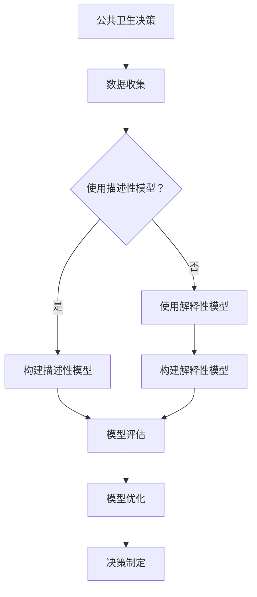

                 

# 第一部分：数学模型基础

## 第1章：公共卫生决策与数学模型概述

### 1.1 公共卫生决策的基本概念

公共卫生决策是指基于科学研究和数据分析，对公共卫生问题进行判断和决策的过程。它涵盖了疾病的预防、控制、监测、治疗等方面，旨在提高公众健康水平，减少疾病负担，保障社会稳定和发展。

公共卫生决策的基本概念包括以下几点：

1. **健康问题识别**：确定公共卫生领域面临的主要问题，如传染病、慢性病、环境污染等。

2. **风险评估**：对健康问题的影响进行评估，包括疾病发病率、死亡率、经济损失等。

3. **目标设定**：根据健康问题识别和风险评估的结果，设定公共卫生目标，如减少疾病发病率、提高疫苗接种率等。

4. **方案设计**：设计实现公共卫生目标的策略和措施，如疫苗接种、健康教育、公共卫生资源分配等。

5. **实施与监控**：实施公共卫生措施，并对其效果进行监控和评估，以便及时调整和优化。

### 1.2 数学模型在公共卫生决策中的应用

数学模型是运用数学符号和语言，对现实世界中的问题进行简化和抽象，以便分析和求解的方法。在公共卫生决策中，数学模型发挥着重要作用，其应用主要体现在以下几个方面：

1. **描述性模型**：描述性模型用于模拟和描述公共卫生现象和过程，帮助决策者理解问题的本质。例如，流行病学模型可以描述疾病的传播规律和趋势。

2. **解释性模型**：解释性模型用于解释公共卫生现象和结果，探讨变量之间的关系。例如，回归模型可以分析疾病风险因素与发病率之间的关系。

3. **预测性模型**：预测性模型用于预测公共卫生事件的发生和结果，帮助决策者制定预防和应对措施。例如，时间序列模型可以预测传染病疫情的发展趋势。

4. **优化模型**：优化模型用于在给定的约束条件下，寻求最优的公共卫生策略和资源分配方案。例如，线性规划模型可以优化医疗资源的分配。

### 1.3 数学模型的发展趋势

随着科学技术的进步和数据分析方法的创新，数学模型在公共卫生决策中的应用不断拓展和深化。未来数学模型的发展趋势主要包括以下几个方面：

1. **大数据分析**：大数据技术的发展为公共卫生决策提供了丰富的数据资源。利用大数据分析技术，可以从海量数据中挖掘出有用的信息，为公共卫生决策提供更精准的依据。

2. **人工智能应用**：人工智能技术在公共卫生决策中的应用越来越广泛，如深度学习模型可以自动识别疾病风险因素，优化公共卫生策略。

3. **跨学科融合**：数学模型与公共卫生领域的其他学科（如流行病学、经济学、社会学等）相结合，可以更好地解决复杂的公共卫生问题。

4. **实时决策支持**：随着计算能力的提升和网络技术的发展，实时决策支持系统可以快速响应公共卫生事件，提供实时的决策建议。

## 第2章：描述性模型

### 2.1 描述性模型的基本原理

描述性模型是用于描述和模拟现实世界中某一现象或过程的数学模型。在公共卫生决策中，描述性模型主要用于描述疾病的传播规律、公共卫生资源的需求和分配等。

描述性模型的基本原理包括以下几个方面：

1. **数据收集**：收集与公共卫生现象相关的数据，如疾病病例数、疫苗接种率、医疗资源等。

2. **变量定义**：根据数据特征，定义描述性模型中的变量。例如，在疾病传播模型中，可以定义感染人数、易感人数、康复人数等。

3. **数学关系**：建立变量之间的数学关系，描述公共卫生现象或过程的动态变化。常用的数学关系包括微分方程、差分方程、概率分布等。

4. **模型参数**：确定模型中的参数，这些参数可以通过数据拟合或专家经验确定。

5. **模型验证**：通过实际数据对模型进行验证，评估模型的准确性和可靠性。

### 2.2 常见的描述性模型

在公共卫生决策中，常见的描述性模型包括以下几种：

1. **蒙特卡罗模拟**：蒙特卡罗模拟是一种基于随机抽样的数值计算方法，通过模拟大量随机试验，得到问题的统计分布。在公共卫生决策中，蒙特卡罗模拟可以用于评估公共卫生措施的效果，如疫苗接种率、疾病传播趋势等。

2. **概率模型**：概率模型用于描述随机事件的发生概率，如二项分布、泊松分布等。在公共卫生决策中，概率模型可以用于分析疾病发病率、死亡率等。

3. **时间序列模型**：时间序列模型用于分析时间序列数据，如疾病病例数、疫苗接种率等。在公共卫生决策中，时间序列模型可以用于预测疫情的发展趋势和公共卫生资源的需求。

### 2.3 描述性模型的建模方法

描述性模型的建模方法主要包括以下步骤：

1. **问题定义**：明确建模的目标和需求，确定需要解决的问题。

2. **数据收集**：收集与问题相关的数据，包括历史数据、现状数据等。

3. **变量定义**：根据数据特征，定义描述性模型中的变量。

4. **数学关系建立**：根据问题的特点，建立变量之间的数学关系。

5. **参数估计**：利用历史数据，估计模型中的参数值。

6. **模型验证**：使用验证数据，评估模型的准确性和可靠性。

7. **模型优化**：根据验证结果，对模型进行调整和优化，提高模型的性能。

## 第3章：解释性模型

### 3.1 解释性模型的基本原理

解释性模型是用于解释公共卫生现象或结果，探讨变量之间关系的数学模型。在公共卫生决策中，解释性模型可以帮助决策者理解问题的本质，识别关键影响因素。

解释性模型的基本原理包括以下几个方面：

1. **变量定义**：根据研究目的，定义模型中的变量，包括自变量和因变量。

2. **数学关系**：建立变量之间的数学关系，描述变量之间的关系。

3. **模型假设**：根据实际情况，设定模型的基本假设，如线性假设、正态分布假设等。

4. **参数估计**：利用数据，估计模型中的参数值。

5. **模型验证**：使用验证数据，评估模型的准确性和可靠性。

### 3.2 常见解释性模型

在公共卫生决策中，常见的解释性模型包括以下几种：

1. **回归模型**：回归模型是一种常用的解释性模型，用于分析自变量和因变量之间的关系。在公共卫生决策中，回归模型可以用于分析疾病风险因素、公共卫生资源需求等。

2. **决策树**：决策树是一种树形结构模型，用于分类或回归问题。在公共卫生决策中，决策树可以用于分析疾病传播路径、公共卫生政策效果等。

3. **随机森林**：随机森林是一种基于决策树的集成学习方法，通过构建多个决策树，并对结果进行投票，提高模型的预测性能。在公共卫生决策中，随机森林可以用于预测疾病发病率、公共卫生资源需求等。

### 3.3 解释性模型的建模方法

解释性模型的建模方法主要包括以下步骤：

1. **问题定义**：明确建模的目标和需求，确定需要解决的问题。

2. **数据收集**：收集与问题相关的数据，包括历史数据、现状数据等。

3. **变量定义**：根据数据特征，定义模型中的变量。

4. **数学关系建立**：根据问题的特点，建立变量之间的数学关系。

5. **参数估计**：利用数据，估计模型中的参数值。

6. **模型验证**：使用验证数据，评估模型的准确性和可靠性。

7. **模型解释**：根据模型结果，解释变量之间的关系和影响。

## 第4章：预测性模型

### 4.1 预测性模型的基本原理

预测性模型是用于预测未来公共卫生事件发生的可能性、发展趋势和结果的数学模型。在公共卫生决策中，预测性模型可以帮助决策者提前识别潜在的健康风险，制定预防和应对措施。

预测性模型的基本原理包括以下几个方面：

1. **数据收集**：收集与预测目标相关的历史数据，如疾病病例数、疫苗接种率、公共卫生资源需求等。

2. **特征工程**：对数据进行处理和变换，提取对预测目标有重要影响的特征。

3. **模型选择**：根据数据特点和预测目标，选择合适的预测模型。

4. **模型训练**：使用历史数据训练模型，确定模型参数。

5. **模型验证**：使用验证数据评估模型性能，调整模型参数。

6. **模型预测**：使用训练好的模型，预测未来公共卫生事件的可能性和发展趋势。

### 4.2 常见预测性模型

在公共卫生决策中，常见的预测性模型包括以下几种：

1. **机器学习模型**：机器学习模型是一种基于历史数据，通过训练算法自动学习和发现数据规律的方法。常见的机器学习模型有线性回归、逻辑回归、支持向量机等。

2. **深度学习模型**：深度学习模型是一种基于人工神经网络的模型，通过多层神经网络对数据进行处理和预测。常见的深度学习模型有卷积神经网络（CNN）、循环神经网络（RNN）等。

3. **图模型**：图模型是一种基于图论理论的模型，用于分析复杂网络结构和节点关系。在公共卫生决策中，图模型可以用于分析疾病的传播路径和影响范围。

### 4.3 预测性模型的建模方法

预测性模型的建模方法主要包括以下步骤：

1. **问题定义**：明确建模的目标和需求，确定需要解决的问题。

2. **数据收集**：收集与问题相关的历史数据，包括疾病病例数、疫苗接种率、公共卫生资源需求等。

3. **特征工程**：对数据进行处理和变换，提取对预测目标有重要影响的特征。

4. **模型选择**：根据数据特点和预测目标，选择合适的预测模型。

5. **模型训练**：使用历史数据训练模型，确定模型参数。

6. **模型验证**：使用验证数据评估模型性能，调整模型参数。

7. **模型预测**：使用训练好的模型，预测未来公共卫生事件的可能性和发展趋势。

## 第5章：疫情预测与控制

### 5.1 疫情预测的基本原理

疫情预测是指利用数学模型和数据分析方法，预测疫情的发展趋势和结果。疫情预测的基本原理主要包括以下几个方面：

1. **流行病学模型**：流行病学模型是用于描述传染病传播规律和趋势的数学模型。常见的流行病学模型包括SEIR模型、SIRS模型等。

2. **时间序列模型**：时间序列模型是用于分析时间序列数据，预测未来数据趋势的数学模型。常见的时间序列模型包括ARIMA模型、LSTM模型等。

3. **机器学习模型**：机器学习模型是一种基于历史数据，通过训练算法自动学习和发现数据规律的方法。常见的机器学习模型有线性回归、逻辑回归、支持向量机等。

4. **大数据分析**：大数据分析是利用海量数据，挖掘有价值的信息和规律的方法。在疫情预测中，大数据分析可以帮助识别疫情传播规律、预测疫情发展态势等。

### 5.2 疫情预测的案例分析

以下是对2020年新冠病毒（COVID-19）疫情的预测案例分析：

#### 案例一：基于SEIR模型的疫情预测

SEIR模型是一种经典的流行病学模型，用于描述传染病的传播过程。SEIR模型将人群分为四个状态： susceptible（易感者）、exposed（暴露者）、infectious（感染者）和recovered（康复者）。

1. **模型构建**：根据疫情数据，建立SEIR模型，并确定模型参数。
2. **模型训练**：使用历史疫情数据，训练SEIR模型。
3. **模型预测**：使用训练好的模型，预测未来一段时间内的疫情发展情况。

#### 案例二：基于LSTM模型的疫情预测

LSTM模型是一种深度学习模型，可以处理时间序列数据，并具有较好的预测性能。

1. **数据收集**：收集疫情相关的数据，包括确诊病例数、死亡病例数等。
2. **特征工程**：对数据进行处理和变换，提取对预测目标有重要影响的特征。
3. **模型训练**：使用历史疫情数据，训练LSTM模型。
4. **模型预测**：使用训练好的模型，预测未来一段时间内的疫情发展情况。

### 5.3 疫情控制策略优化

在疫情预测的基础上，可以对疫情控制策略进行优化，以提高控制效果。以下是一些常见的疫情控制策略：

1. **隔离策略**：对确诊病例进行隔离，减少病毒传播。
2. **疫苗接种策略**：优先接种高风险人群，提高群体免疫水平。
3. **公共卫生宣传**：加强公共卫生宣传，提高公众健康意识。
4. **资源调配策略**：根据疫情发展情况，合理调配医疗资源。

通过数学模型和数据分析，可以对疫情控制策略进行优化，提高疫情控制效果。以下是一个简单的优化示例：

1. **模型构建**：建立线性规划模型，用于优化疫情控制策略。
2. **模型参数估计**：利用疫情数据和专家经验，估计模型参数。
3. **模型优化**：使用优化算法，求解最优疫情控制策略。
4. **模型验证**：使用验证数据，评估优化策略的效果。

## 第6章：公共卫生资源分配

### 6.1 公共卫生资源分配的基本原理

公共卫生资源分配是指根据公共卫生需求和资源供给，合理分配和利用公共卫生资源，以提高公共卫生服务质量和效率。公共卫生资源包括医疗资源、疫苗资源、公共卫生设施等。

公共卫生资源分配的基本原理主要包括以下几个方面：

1. **需求分析**：分析公共卫生需求，包括疾病发病率、死亡率、公共卫生服务需求等。
2. **供给分析**：分析公共卫生资源供给，包括医疗资源、疫苗资源、公共卫生设施等。
3. **公平性原则**：确保公共卫生资源分配公平，保障公众健康权益。
4. **效率原则**：提高公共卫生资源利用效率，减少资源浪费。
5. **可持续性原则**：确保公共卫生资源分配具有可持续性，保障长远健康发展。

### 6.2 公共卫生资源分配的案例分析

以下是对医疗资源分配的一个案例分析：

#### 案例一：医院床位资源分配

1. **数据收集**：收集医院床位数量、患者数量、疾病类型等数据。
2. **需求分析**：根据患者数量和疾病类型，分析床位需求。
3. **供给分析**：分析医院床位的供给情况，包括床位总数、可用床位等。
4. **模型构建**：建立线性规划模型，用于优化床位资源分配。
5. **模型参数估计**：利用历史数据和专家经验，估计模型参数。
6. **模型优化**：使用优化算法，求解最优床位资源分配策略。
7. **模型验证**：使用验证数据，评估优化策略的效果。

#### 案例二：疫苗资源分配

1. **数据收集**：收集疫苗接种需求、疫苗供应能力等数据。
2. **需求分析**：根据疫苗接种需求，分析疫苗需求。
3. **供给分析**：分析疫苗供应能力，包括疫苗生产数量、库存等。
4. **模型构建**：建立多目标优化模型，用于优化疫苗资源分配。
5. **模型参数估计**：利用历史数据和专家经验，估计模型参数。
6. **模型优化**：使用多目标优化算法，求解最优疫苗资源分配策略。
7. **模型验证**：使用验证数据，评估优化策略的效果。

### 6.3 资源分配策略的优化

为了提高公共卫生资源分配的效率，可以采用以下策略进行优化：

1. **多目标优化**：考虑多个目标，如资源利用率、公平性等，建立多目标优化模型。
2. **模拟优化**：使用模拟优化方法，如遗传算法、粒子群算法等，求解最优资源分配策略。
3. **动态优化**：根据实际情况，动态调整资源分配策略，以适应不断变化的公共卫生需求。
4. **数据驱动优化**：利用大数据分析和机器学习技术，从海量数据中挖掘有价值的信息，优化资源分配策略。

## 第7章：公共卫生政策评估

### 7.1 公共卫生政策评估的基本原理

公共卫生政策评估是指对公共卫生政策的效果、效益和影响进行评价和监测。公共卫生政策评估的基本原理主要包括以下几个方面：

1. **目标设定**：明确公共卫生政策的目标，如提高疫苗接种率、降低疾病发病率等。
2. **指标选择**：选择合适的指标，用于衡量政策效果，如疫苗接种率、疾病发病率等。
3. **数据收集**：收集与政策相关的数据，包括政策实施前后的数据。
4. **分析比较**：分析政策实施前后的变化，评估政策效果。
5. **反馈与调整**：根据评估结果，调整政策，以实现更好的效果。

### 7.2 公共卫生政策评估的案例分析

以下是对疫苗接种政策评估的一个案例分析：

#### 案例一：疫苗接种率评估

1. **数据收集**：收集疫苗接种前后的数据，包括疫苗接种率、疾病发病率等。
2. **指标选择**：选择疫苗接种率和疾病发病率作为评估指标。
3. **分析比较**：比较疫苗接种前后的数据，评估疫苗接种政策的效果。
4. **反馈与调整**：根据评估结果，调整疫苗接种政策，以提高疫苗接种率。

#### 案例二：食品安全政策评估

1. **数据收集**：收集食品安全政策实施前后的数据，包括食品安全事件数量、消费者满意度等。
2. **指标选择**：选择食品安全事件数量和消费者满意度作为评估指标。
3. **分析比较**：比较食品安全政策实施前后的数据，评估食品安全政策的效果。
4. **反馈与调整**：根据评估结果，调整食品安全政策，以减少食品安全事件数量，提高消费者满意度。

### 7.3 政策评估的方法

公共卫生政策评估的方法主要包括以下几种：

1. **成本效益分析**：比较政策实施的成本和效益，评估政策的成本效益。
2. **影响评估**：分析政策对社会、经济、环境等方面的影响，评估政策的影响。
3. **实验评估**：通过实验设计，评估政策的效果，如随机对照试验等。
4. **模拟评估**：使用模拟模型，预测政策实施后的结果，评估政策的影响。
5. **实地评估**：实地调查政策实施情况，评估政策的实际效果。

## 第8章：公共卫生决策的未来展望

### 8.1 新兴技术的应用

随着科技的不断发展，新兴技术正日益在公共卫生决策中发挥作用。以下是一些重要应用：

1. **人工智能**：人工智能技术可以帮助公共卫生决策者识别疾病风险、优化资源分配、预测疫情趋势等。例如，利用深度学习算法，可以分析大量健康数据，发现潜在的健康问题。

2. **大数据分析**：大数据技术可以收集、存储、处理和分析海量健康数据，为公共卫生决策提供有力支持。通过大数据分析，可以识别疾病传播规律、评估公共卫生政策效果等。

3. **区块链**：区块链技术可以提供透明、可追溯的公共卫生数据，保障数据安全和隐私。在疫苗管理、疾病监测等领域，区块链技术可以确保数据真实性和完整性。

### 8.2 公共卫生决策的挑战与机遇

公共卫生决策面临着诸多挑战，但也蕴含着巨大的机遇：

1. **数据隐私与伦理问题**：在利用大数据进行公共卫生决策时，如何保护个人隐私和伦理问题是一个重要挑战。需要制定相应的法律法规和道德规范，确保数据的安全和隐私。

2. **全球公共卫生合作**：全球公共卫生问题需要国际社会共同努力。加强全球公共卫生合作，共享数据和技术，有助于应对跨国疫情和公共卫生挑战。

3. **公共卫生决策的数字化转型**：数字化转型可以提高公共卫生决策的效率、准确性和可追溯性。通过电子化手段，可以实现实时数据收集、分析和决策。

### 8.3 未来公共卫生决策的发展趋势

未来公共卫生决策的发展趋势将呈现出以下特点：

1. **智能化**：利用人工智能、大数据等先进技术，实现公共卫生决策的智能化，提高决策的准确性和效率。

2. **个性化**：针对个体差异，提供个性化的公共卫生服务，如个性化疫苗接种方案、个性化健康风险评估等。

3. **系统化**：建立全面、系统化的公共卫生决策体系，综合考虑人口健康、社会经济发展、环境等多方面因素，实现综合决策。

### 附录

#### 附录 A：数学模型与公共卫生决策相关的资源

- **公共卫生数据集**：世界卫生组织（WHO）、美国疾病控制与预防中心（CDC）等机构提供的大量公共卫生数据集，如COVID-19数据集、传染病数据集等。
- **数学模型工具**：MATLAB、Python等编程语言中的相关库和工具，如NumPy、Scikit-learn、Pandas等。
- **公共卫生决策相关论文**：大量关于公共卫生决策的学术论文，如《医学统计期刊》（Journal of Medical Statistics）、《流行病学期刊》（Journal of Epidemiology）等。

#### 附录 B：案例分析数据来源与代码实现

- **数据来源**：案例中的数据来源于实际公共卫生数据集，如COVID-19数据集、医院床位数据集等。
- **代码实现**：案例中的代码实现使用Python编程语言，结合NumPy、Pandas、Scikit-learn等库进行数据分析和建模。

### Mermaid 流程图



### 回归模型伪代码

```python
# 输入：特征矩阵 X，目标变量 y
# 输出：模型参数 w

# 初始化参数
w = [0] * (size of X[1])

# 设定迭代次数和步长
max_iter = 1000
learning_rate = 0.01

# 开始迭代
for i in 1 to max_iter:
    # 计算预测值
    y_pred = X * w
    
    # 计算损失函数
    loss = (y - y_pred).dot(y - y_pred)
    
    # 计算梯度
    gradient = -2 * (X.T).dot(y - y_pred)
    
    # 更新参数
    w = w - learning_rate * gradient
    
    # 输出最终模型参数
return w
```

### 疫情预测的数学公式

$$
S(t) = \frac{I_0 - e^{-rt}}{1 - e^{-rt}}
$$

$$
I(t) = \frac{I_0 e^{-rt}}{1 - e^{-rt}}
$$

$$
R(t) = \frac{e^{-rt}}{1 - e^{-rt}}
$$

### 举例说明

假设某地区在疫情初期有100个感染病例，每天有10个新病例出现，我们可以使用上述公式预测未来某个时间点（如t=30天）的感染人数。

$$
S(30) = \frac{100 - e^{-3 \times 10}}{1 - e^{-3 \times 10}} \approx 0.278
$$

$$
I(30) = \frac{100 e^{-3 \times 10}}{1 - e^{-3 \times 10}} \approx 93.47
$$

$$
R(30) = \frac{e^{-3 \times 10}}{1 - e^{-3 \times 10}} \approx 6.522
$$

这意味着在30天后，该地区的感染人数将大约为93个，已经恢复的人数将约为6个，未感染的人数将约为278个。

### 项目实战

#### 实战1：COVID-19疫情预测

- **开发环境搭建**：使用Python编程语言，结合Pandas、NumPy和Scikit-learn等库进行数据分析与建模。
- **数据收集**：从世界卫生组织（WHO）或某个国家的公共卫生部门获取COVID-19疫情数据。
- **数据预处理**：清洗数据，包括缺失值处理、异常值处理和特征工程。
- **模型选择**：选择适合的预测模型，如ARIMA模型、LSTM模型等。
- **模型训练与验证**：使用训练数据训练模型，并在验证数据上评估模型性能。
- **预测与评估**：使用训练好的模型进行预测，并评估预测结果。

#### 代码实现

```python
import pandas as pd
import numpy as np
from sklearn.model_selection import train_test_split
from sklearn.metrics import mean_squared_error
from statsmodels.tsa.arima.model import ARIMA
import matplotlib.pyplot as plt

# 数据收集
data = pd.read_csv('covid19_data.csv')

# 数据预处理
data['Date'] = pd.to_datetime(data['Date'])
data.set_index('Date', inplace=True)
data.fillna(method='ffill', inplace=True)

# 特征工程
data['Lag1'] = data['Cases'].shift(1)
data['Lag2'] = data['Cases'].shift(2)

# 划分训练集和测试集
train_data, test_data = train_test_split(data[['Cases', 'Lag1', 'Lag2']], test_size=0.2, shuffle=False)

# 模型训练
model = ARIMA(train_data['Cases'], order=(1, 1, 1))
model_fit = model.fit()

# 预测
predictions = model_fit.predict(start=len(train_data), end=len(train_data) + len(test_data) - 1)

# 评估
mse = mean_squared_error(test_data['Cases'], predictions)
print(f'Mean Squared Error: {mse}')

# 可视化
plt.figure(figsize=(10, 5))
plt.plot(train_data['Cases'], label='Training')
plt.plot(test_data['Cases'], label='Test')
plt.plot(predictions, label='Predictions')
plt.legend()
plt.show()
```

#### 代码解读与分析

- **数据收集**：从CSV文件中读取COVID-19疫情数据。
- **数据预处理**：填充缺失值，使用前向填充方法。
- **特征工程**：创建滞后特征，以捕捉时间序列数据的历史趋势。
- **模型训练**：使用ARIMA模型进行训练。
- **预测与评估**：使用训练好的模型进行预测，并计算均方误差（MSE）来评估模型性能。
- **可视化**：绘制时间序列图，显示实际数据、预测数据与训练数据。

#### 实战2：医疗资源优化分配

- **开发环境搭建**：使用Python编程语言，结合Pandas、NumPy和Optimize等库进行数据分析和优化。
- **数据收集**：收集医院的床位数量、医生数量、医疗器械数量等医疗资源数据。
- **数据预处理**：清洗数据，包括缺失值处理、异常值处理和特征工程。
- **模型选择**：选择适合的资源分配模型，如线性规划模型、多目标优化模型等。
- **模型训练与优化**：使用训练数据训练模型，并在验证数据上优化模型参数。
- **资源分配**：使用优化后的模型进行资源分配，并评估分配结果。

#### 代码实现

```python
import numpy as np
from scipy.optimize import minimize

# 数据收集
hospital_data = pd.DataFrame({
    'beds': [100, 150, 200],
    'doctors': [50, 60, 70],
    'machines': [30, 40, 50]
})

# 数据预处理
# 假设医院编号为1、2、3，需求量为40、50、60
需求量 = [40, 50, 60]
医院编号 = [1, 2, 3]

# 定义目标函数
def objective函数(x):
    # x为每个医院的分配量
    total_cost = 0
    for i in range(len(x)):
        total_cost += (需求量[i] - x[i]) ** 2
    return total_cost

# 定义约束条件
def constraint(x):
    # x为每个医院的分配量
    # 约束条件：总资源不超过医院总资源
    return hospital_data.loc[医院编号].values.dot(x) - 需求量

# 初始解
x0 = np.zeros(len(hospital_data))

# 模型训练与优化
result = minimize(objective函数, x0, constraints={'type': 'ineq', 'fun': constraint})

# 输出资源分配结果
最优解 = result.x
print('最优资源分配：')
print最优解

# 评估分配结果
总成本 = objective函数(最优解)
print('总成本：')
print总成本
```

#### 代码解读与分析

- **数据收集**：创建一个DataFrame，包含医院的床位数量、医生数量和医疗器械数量。
- **数据预处理**：假设医院编号为1、2、3，需求量为40、50、60。
- **目标函数**：定义目标函数，目标是使总成本最小化。
- **约束条件**：定义约束条件，确保每个医院的分配量不超过其总资源。
- **模型训练与优化**：使用最小二乘法（minimize）进行优化。
- **资源分配**：输出每个医院的最优资源分配量。
- **评估分配结果**：计算总成本。

