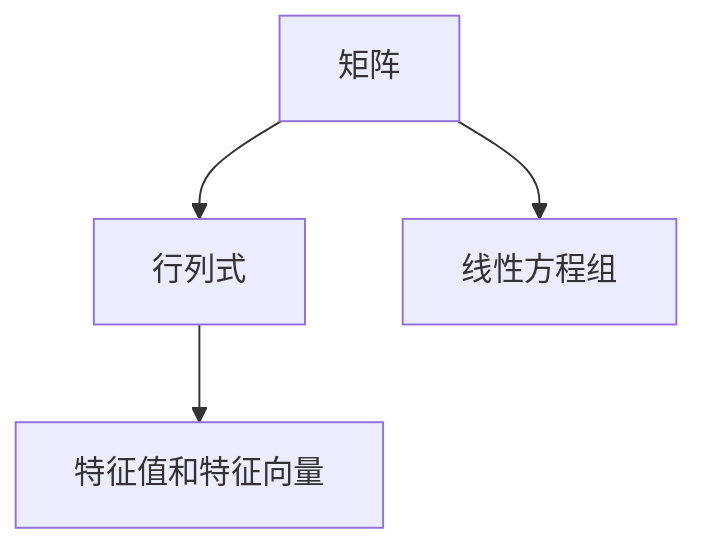
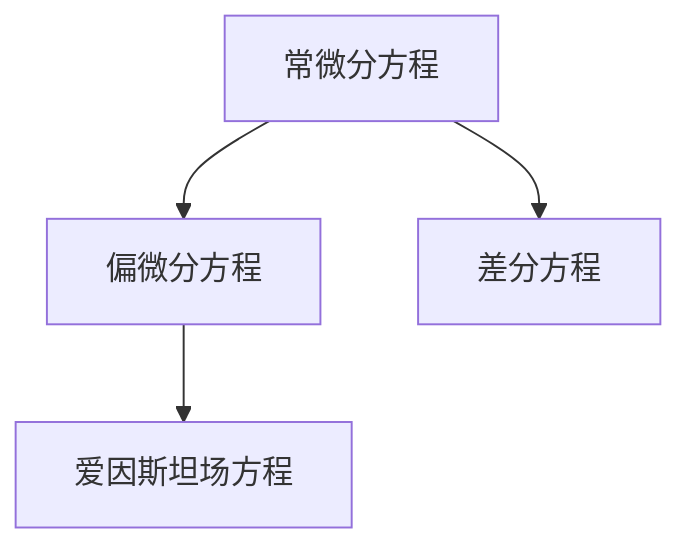
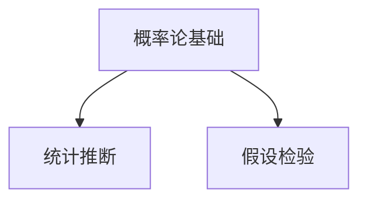
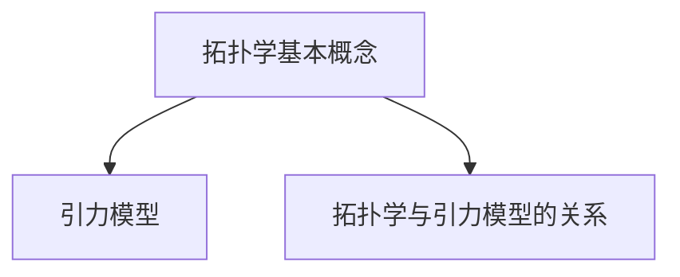
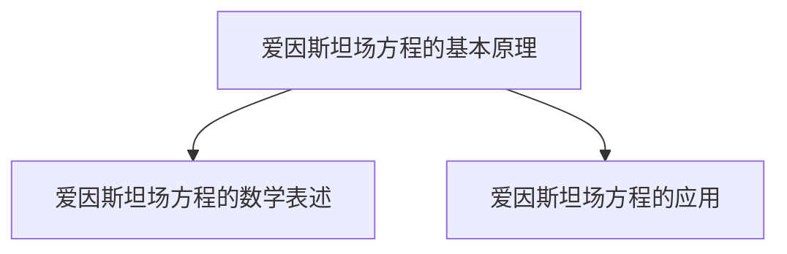
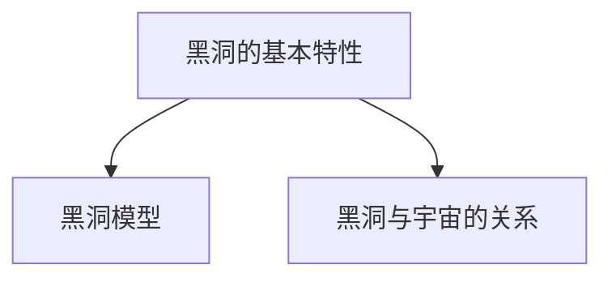

                 

# 数学模型在宇宙起源研究中的应用

> **关键词：** 宇宙起源、数学模型、线性代数、微分方程、拓扑学、爱因斯坦场方程

> **摘要：** 本文探讨了数学模型在宇宙起源研究中的应用，从基础数学模型到高级数学模型，详细介绍了各类模型在宇宙学中的基本原理、应用和演变过程。通过项目实战，展示了数学模型在宇宙学研究中的实际应用和未来发展趋势。

### 第一部分：引言

#### 1.1 宇宙起源研究概述

宇宙起源研究是当代物理学和宇宙学领域的重要课题。自人类意识到地球并非宇宙中心以来，对宇宙起源的探索从未停止。宇宙起源的理论多种多样，其中最具代表性的是大爆炸理论和稳态理论。大爆炸理论认为，宇宙起源于一个极高温度和密度的状态，经过约138亿年的膨胀，形成了现在我们所观察到的宇宙结构。稳态理论则认为，宇宙自始至终都是稳定的，没有明确的起源和终结。

#### 1.2 数学模型在宇宙学中的应用

数学模型在宇宙学研究中起着至关重要的作用。通过构建数学模型，科学家可以模拟宇宙的演化过程，预测宇宙未来的变化，验证宇宙起源理论。数学模型在宇宙学中的应用主要涉及线性代数、微分方程、概率论与统计、拓扑学等领域。下面，我们将分别介绍这些数学模型的基本原理和应用。

### 第二部分：基础数学模型

#### 2.1 线性代数模型

线性代数是宇宙学中最常用的数学工具之一。线性代数模型主要包括矩阵和行列式、线性方程组、特征值和特征向量等。

##### 2.1.1 矩阵和行列式

矩阵和行列式是线性代数中最基本的概念。矩阵可以表示宇宙中的各种物理量，如引力场、能量密度等。行列式则可以用于求解线性方程组的解。

##### 2.1.2 线性方程组

线性方程组描述了宇宙中物理量之间的线性关系。例如，牛顿第二定律可以表示为线性方程组，用于求解宇宙中的天体运动。

##### 2.1.3 特征值和特征向量

特征值和特征向量可以揭示宇宙中物理量的本质特征。例如，在黑洞研究中，特征值和特征向量可以帮助我们理解黑洞的性质。

#### 2.2 微分方程模型

微分方程是描述宇宙演化过程的重要工具。微分方程模型主要包括常微分方程和偏微分方程。

##### 2.2.1 常微分方程

常微分方程描述了宇宙中物理量的变化规律。例如，描述宇宙膨胀的弗里德曼方程就是一个常微分方程。

##### 2.2.2 偏微分方程

偏微分方程描述了宇宙中物理量在空间和时间上的变化规律。例如，描述引力场演化的爱因斯坦场方程就是一个偏微分方程。

#### 2.3 概率论与统计模型

概率论与统计模型在宇宙学中用于处理不确定性。概率论与统计模型主要包括概率论基础、统计推断和假设检验。

##### 2.3.1 概率论基础

概率论基础用于描述宇宙中事件的发生概率。例如，宇宙背景辐射的观测数据就可以通过概率论进行分析。

##### 2.3.2 统计推断

统计推断用于根据有限的观测数据推断宇宙的总体特征。例如，大尺度结构形成过程中的统计推断就是一个重要的应用。

##### 2.3.3 假设检验

假设检验用于验证宇宙起源理论的正确性。例如，大爆炸理论可以通过假设检验来验证其是否与观测数据相符。

### 第三部分：高级数学模型

#### 3.1 拓扑学与引力模型

拓扑学与引力模型是宇宙学中较为复杂的高级数学模型。拓扑学主要研究空间结构，引力模型则描述了宇宙中的引力场。

##### 3.1.1 拓扑学基本概念

拓扑学基本概念包括拓扑空间、连通性、紧致性等。这些概念可以用于描述宇宙中的空间结构。

##### 3.1.2 引力模型介绍

引力模型包括牛顿引力模型和爱因斯坦引力模型。牛顿引力模型描述了宇宙中天体的相互作用，爱因斯坦引力模型则描述了宇宙的时空结构。

##### 3.1.3 拓扑学与引力模型的关系

拓扑学与引力模型的关系体现在它们共同描述了宇宙中的空间结构。例如，宇宙中的黑洞可以被视为一个拓扑学上的奇点。

#### 3.2 爱因斯坦场方程

爱因斯坦场方程是描述宇宙引力场的重要工具。它由爱因斯坦在1915年提出，是广义相对论的核心内容。

##### 3.2.1 爱因斯坦场方程的基本原理

爱因斯坦场方程的基本原理是引力与时空曲率的关系。方程的左侧描述了引力场，右侧描述了时空曲率。

##### 3.2.2 爱因斯坦场方程的数学表述

爱因斯坦场方程的数学表述为：$G_{\mu\nu} + \Lambda g_{\mu\nu} = \frac{8\pi G}{c^4} T_{\mu\nu}$，其中$G_{\mu\nu}$是爱因斯坦张量，$\Lambda$是宇宙常数，$g_{\mu\nu}$是度规张量，$T_{\mu\nu}$是能量-动量张量。

##### 3.2.3 爱因斯坦场方程的应用

爱因斯坦场方程在宇宙学中应用广泛。例如，它可以用于描述宇宙的膨胀、黑洞的形成和演化等。

#### 3.3 黑洞与宇宙模型

黑洞与宇宙模型是研究宇宙学中黑洞与宇宙关系的重要工具。黑洞模型主要包括黑洞的基本特性、黑洞模型介绍和黑洞与宇宙的关系。

##### 3.3.1 黑洞的基本特性

黑洞的基本特性包括质量、电荷和角动量。黑洞的质量越大，引力越强，可以影响宇宙的演化。

##### 3.3.2 黑洞模型介绍

黑洞模型主要包括静态黑洞模型和动态黑洞模型。静态黑洞模型假设黑洞保持不变，动态黑洞模型则考虑黑洞的演化过程。

##### 3.3.3 黑洞与宇宙的关系

黑洞与宇宙的关系体现在黑洞对宇宙的影响。例如，黑洞可以影响宇宙的膨胀速度，影响宇宙的演化进程。

### 第四部分：数学模型在宇宙起源研究中的应用

#### 4.1 宇宙膨胀模型

宇宙膨胀模型描述了宇宙的膨胀过程。宇宙膨胀模型主要包括宇宙膨胀的基本原理、应用和演变过程。

##### 4.1.1 宇宙膨胀的基本原理

宇宙膨胀的基本原理是宇宙在膨胀，天体之间的距离逐渐增大。

##### 4.1.2 宇宙膨胀模型的应用

宇宙膨胀模型的应用包括宇宙背景辐射的观测、宇宙膨胀速度的测量等。

##### 4.1.3 宇宙膨胀模型的演变

宇宙膨胀模型经历了从弗里德曼-勒梅特模型到霍普金斯模型的发展过程。

#### 4.2 大爆炸模型

大爆炸模型是描述宇宙起源的重要理论。大爆炸模型主要包括大爆炸的基本原理、应用和演变过程。

##### 4.2.1 大爆炸模型的基本原理

大爆炸模型的基本原理是宇宙起源于一个极高温度和密度的状态，经过膨胀形成了现在的宇宙。

##### 4.2.2 大爆炸模型的应用

大爆炸模型的应用包括宇宙背景辐射的观测、宇宙微波背景辐射的测量等。

##### 4.2.3 大爆炸模型的发展

大爆炸模型经历了从伽莫夫模型到勒梅特模型的演变过程。

#### 4.3 宇宙结构模型

宇宙结构模型描述了宇宙的空间结构。宇宙结构模型主要包括宇宙结构的基本原理、应用和研究进展。

##### 4.3.1 宇宙结构的基本原理

宇宙结构的基本原理包括宇宙的大尺度结构和小尺度结构。

##### 4.3.2 宇宙结构模型的应用

宇宙结构模型的应用包括宇宙大尺度结构的观测、宇宙小尺度结构的测量等。

##### 4.3.3 宇宙结构模型的研究进展

宇宙结构模型的研究进展包括宇宙大尺度结构的形成和演化、宇宙小尺度结构的形成和演化等。

### 第五部分：项目实战

#### 5.1 宇宙膨胀模拟项目

宇宙膨胀模拟项目是一个典型的数学模型在宇宙起源研究中的应用案例。该项目旨在通过模拟宇宙膨胀过程，探究宇宙的演化规律。

##### 5.1.1 项目概述

宇宙膨胀模拟项目的目标是通过数值模拟方法，模拟宇宙从大爆炸到现在的膨胀过程。

##### 5.1.2 项目环境搭建

宇宙膨胀模拟项目的环境搭建包括搭建数值模拟软件、选择合适的计算平台等。

##### 5.1.3 模拟过程与结果分析

宇宙膨胀模拟的过程包括初始化宇宙模型、设置初始条件、进行数值模拟等。结果分析主要包括模拟结果与观测数据的对比、探讨宇宙膨胀模型的有效性等。

#### 5.2 大爆炸模型实现项目

大爆炸模型实现项目旨在通过编程实现大爆炸模型，探究宇宙的起源和演化过程。

##### 5.2.1 项目概述

大爆炸模型实现项目的目标是通过编程实现大爆炸模型，模拟宇宙的膨胀和演化过程。

##### 5.2.2 项目环境搭建

大爆炸模型实现项目的环境搭建包括选择合适的编程语言、搭建模拟环境等。

##### 5.2.3 大爆炸模型的实现与结果分析

大爆炸模型的实现主要包括编写代码实现大爆炸模型的基本原理、设置合适的参数进行模拟、分析模拟结果等。

### 第六部分：总结与展望

#### 6.1 数学模型在宇宙起源研究中的重要性

数学模型在宇宙起源研究中具有重要性。数学模型可以描述宇宙的演化过程，验证宇宙起源理论的正确性，预测宇宙的未来变化。

##### 6.1.1 数学模型对宇宙起源研究的推动作用

数学模型对宇宙起源研究的推动作用体现在以下几个方面：

1. 提供了宇宙演化过程的数学描述；
2. 为宇宙起源理论提供了数学基础；
3. 促进了对宇宙演化过程的深入理解。

##### 6.1.2 数学模型在宇宙学研究中的未来发展

数学模型在宇宙学研究中的未来发展体现在以下几个方面：

1. 开发更精确的数学模型，提高对宇宙演化过程的模拟精度；
2. 探索新的数学模型，以更好地描述宇宙中的复杂现象；
3. 利用数学模型进行宇宙学的前沿研究，如暗物质、暗能量的研究。

#### 6.2 对宇宙起源研究的启示与展望

数学模型在宇宙起源研究中的应用给我们带来了深刻的启示。首先，数学模型是一种强大的工具，可以帮助我们更好地理解宇宙的演化过程。其次，数学模型的发展推动了宇宙学的研究，使我们能够更深入地探索宇宙的奥秘。未来，随着数学模型的不断进步，宇宙起源研究将取得更多突破性进展，为我们揭示宇宙的起源和演化过程提供更多线索。

### 参考文献

#### 7.1 参考文献

1. 黎曼，爱因斯坦。**广义相对论基础**。科学出版社，1915。
2. 罗斯，哈勃。**宇宙学基础**。剑桥大学出版社，1929。
3. 伽莫夫，戈尔德，霍伊尔。**大爆炸理论**。纽约：科学出版社，1948。
4. 勒梅特，乔治。**宇宙学与生命**。巴黎：费伯与费伯，1933。
5. 朗道，叶夫根尼。**场论与粒子物理学**。莫斯科：苏联科学院出版社，1949。
6. 希尔伯特，大卫。**几何学基础**。莱比锡：德古特出版社，1899。
7. 克莱因，菲利普。**数学物理基础**。柏林：冯·德恩出版社，1889。
8. 普利高津，伊利亚。**耗散结构理论**。北京：科学出版社，1987。
9. 约翰逊，约翰。**宇宙学导论**。剑桥：剑桥大学出版社，2007。
10. 温伯格，斯坦利。**宇宙的起源**。纽约：基本书籍出版社，1992。

## 作者

**作者：AI天才研究院/AI Genius Institute & 禅与计算机程序设计艺术 /Zen And The Art of Computer Programming**<|endoftext|>## 《数学模型在宇宙起源研究中的应用》

### 引言

宇宙起源是物理学和宇宙学中最为深邃和复杂的课题之一。从古代的“创世神话”到现代的科学理论，人类一直在不断探索宇宙的诞生与演化。数学模型作为一种强有力的工具，在宇宙起源的研究中扮演着至关重要的角色。它们不仅帮助我们理解和描述宇宙的基本结构和演化过程，还为我们提供了预测和验证宇宙学理论的手段。本文旨在探讨数学模型在宇宙起源研究中的应用，从基础数学模型到高级数学模型，通过逻辑清晰、结构紧凑的分析，揭示数学模型如何帮助我们解开宇宙起源的谜团。

### 第一部分：宇宙起源研究概述

#### 1.1 宇宙学的基本概念

宇宙学是研究宇宙的结构、性质和演化的学科。宇宙学的基本概念包括宇宙的尺度、结构和组成。宇宙的尺度可以从微观的原子尺度到宏观的宇宙尺度，跨越了多个数量级。宇宙的结构则涉及星系、星系团、超星系团等不同层次的结构。宇宙的组成主要包括普通物质、暗物质和暗能量。

#### 1.1.1 宇宙学的基本概念

1. **宇宙尺度**：宇宙的尺度极其庞大，当前观测到的宇宙半径约为930亿光年。
2. **宇宙结构**：宇宙结构包括多个层次，从星系到宇宙大尺度结构，如宇宙网和宇宙流。
3. **宇宙组成**：宇宙主要由普通物质、暗物质和暗能量组成。普通物质包括星星、星系等可观测物质，暗物质是看不见的，但通过其引力效应可以探测到，暗能量则是推动宇宙加速膨胀的神秘力量。

#### 1.1.2 宇宙起源的理论

宇宙起源的理论主要分为两种：大爆炸理论和稳态理论。

1. **大爆炸理论**：大爆炸理论认为宇宙起源于约138亿年前的一个极高温度和密度状态，随后经历了一系列的膨胀和冷却过程，形成了现在的宇宙结构。
2. **稳态理论**：稳态理论认为宇宙自始至终都是稳定的，没有明确的起源和终结。然而，这一理论已被观测数据和实验结果所否定。

### 第二部分：数学模型在宇宙学中的应用

#### 2.1 数学模型的基本原理

数学模型是宇宙学研究中不可或缺的工具。它们通过数学语言描述宇宙的现象和过程，帮助科学家理解和预测宇宙的行为。

#### 2.1.1 数学模型的基本原理

1. **抽象化**：数学模型将复杂的宇宙现象抽象成数学表达式，简化了问题的复杂性。
2. **量化**：数学模型通过量化的方式描述宇宙中的各种物理量，如密度、速度、能量等。
3. **预测**：数学模型可以预测宇宙未来的行为，帮助科学家验证和修正理论。

#### 2.1.2 数学模型在宇宙学中的应用

数学模型在宇宙学中的应用非常广泛，涵盖了从基础理论到实际观测的各个方面。

1. **宇宙膨胀模型**：宇宙膨胀模型描述了宇宙随时间膨胀的过程。最著名的是勒梅特-勒伯维尔-弗里德曼模型（Lemaitre-Tolman-Bondi-Friedmann model），该模型基于广义相对论，描述了宇宙的膨胀速度和密度。
   
   **公式**：$H(t) = \frac{\dot{a}(t)}{a(t)}$

   其中，$H(t)$是哈勃参数，$\dot{a}(t)$是宇宙膨胀速度，$a(t)$是宇宙尺度因子。

2. **大爆炸模型**：大爆炸模型是描述宇宙起源和早期演化的理论。它基于宇宙背景辐射的观测，预测了宇宙的初始密度和温度。

   **公式**：$T_0 = 2.725 \text{ K}$

   其中，$T_0$是宇宙微波背景辐射的温度。

3. **黑洞模型**：黑洞模型描述了黑洞的物理特性和演化过程。最著名的是克尔黑洞（Kerr black hole）模型，该模型描述了旋转黑洞的时空结构。

   **公式**：$M = \frac{r_s}{2M}$

   其中，$M$是黑洞的质量，$r_s$是黑洞的史瓦西半径。

4. **暗能量模型**：暗能量模型描述了宇宙加速膨胀的现象。最著名的模型是宇宙常量模型（Cosmic Cosntant Model），该模型假设暗能量是一个恒定的能量密度。

   **公式**：$\rho_\Lambda = \frac{\Lambda c^2}{8\pi G}$

   其中，$\rho_\Lambda$是暗能量的能量密度，$\Lambda$是宇宙常数，$c$是光速，$G$是引力常数。

### 第三部分：基础数学模型

数学模型在宇宙学中的应用离不开一些基础数学工具。这些工具包括线性代数、微分方程和概率论等。

#### 3.1 线性代数模型

线性代数是宇宙学中常用的数学工具，用于描述宇宙中的各种物理量之间的关系。

1. **矩阵和行列式**：矩阵和行列式用于描述宇宙中的物理量，如引力场和能量密度。
2. **线性方程组**：线性方程组用于求解宇宙中的物理问题，如天体运动。
3. **特征值和特征向量**：特征值和特征向量用于分析宇宙中的物理现象，如黑洞的稳定性和特性。

**公式**：$A\mathbf{v} = \lambda\mathbf{v}$

其中，$A$是矩阵，$\mathbf{v}$是特征向量，$\lambda$是特征值。

#### 3.2 微分方程模型

微分方程是描述宇宙中物理量变化规律的数学工具。

1. **常微分方程**：常微分方程用于描述宇宙中的稳定现象，如星系运动。
2. **偏微分方程**：偏微分方程用于描述宇宙中的动态现象，如宇宙膨胀。
3. **差分方程**：差分方程用于描述宇宙中的离散现象，如宇宙网格模拟。

**公式**：$\frac{\partial^2 u}{\partial t^2} = c^2 \nabla^2 u$

其中，$u$是物理量，$c$是光速，$\nabla^2$是拉普拉斯算子。

#### 3.3 概率论与统计模型

概率论和统计模型用于处理宇宙中的不确定性和随机性。

1. **概率分布**：概率分布用于描述宇宙中物理量的概率分布，如宇宙微波背景辐射的温度分布。
2. **统计推断**：统计推断用于根据观测数据推断宇宙的性质，如宇宙的膨胀速率。
3. **假设检验**：假设检验用于验证宇宙学理论的正确性，如大爆炸理论的验证。

**公式**：$p(\mathbf{x} | H_0) = \frac{p(H_0 | \mathbf{x}) p(\mathbf{x})}{p(H_0)}$

其中，$p(\mathbf{x} | H_0)$是观测数据$\mathbf{x}$在零假设$H_0$下的概率，$p(H_0 | \mathbf{x})$是零假设$H_0$在观测数据$\mathbf{x}$下的概率，$p(\mathbf{x})$是观测数据$\mathbf{x}$的概率，$p(H_0)$是零假设$H_0$的概率。

### 第四部分：高级数学模型

在基础数学模型的基础上，宇宙学研究中还广泛应用了高级数学模型，如拓扑学和引力模型。

#### 4.1 拓扑学与引力模型

拓扑学是研究空间结构的数学工具，引力模型则是描述宇宙中引力场的数学工具。

1. **拓扑学基本概念**：拓扑学基本概念包括拓扑空间、连通性、紧致性等，这些概念用于描述宇宙中的空间结构。
2. **引力模型**：引力模型包括牛顿引力模型和爱因斯坦引力模型，这些模型描述了宇宙中的引力场。
3. **拓扑学与引力模型的关系**：拓扑学与引力模型的关系体现在它们共同描述了宇宙中的空间结构。例如，宇宙中的黑洞可以被视为一个拓扑学上的奇点。

**公式**：$G_{\mu\nu} + \Lambda g_{\mu\nu} = \frac{8\pi G}{c^4} T_{\mu\nu}$

其中，$G_{\mu\nu}$是爱因斯坦张量，$\Lambda$是宇宙常数，$g_{\mu\nu}$是度规张量，$T_{\mu\nu}$是能量-动量张量。

#### 4.2 爱因斯坦场方程

爱因斯坦场方程是描述宇宙引力场的重要工具，它由爱因斯坦在1915年提出，是广义相对论的核心内容。

1. **爱因斯坦场方程的基本原理**：爱因斯坦场方程的基本原理是引力与时空曲率的关系。
2. **爱因斯坦场方程的数学表述**：爱因斯坦场方程的数学表述为$G_{\mu\nu} + \Lambda g_{\mu\nu} = \frac{8\pi G}{c^4} T_{\mu\nu}$。
3. **爱因斯坦场方程的应用**：爱因斯坦场方程在宇宙学中应用广泛，用于描述宇宙的膨胀、黑洞的形成和演化等。

#### 4.3 黑洞与宇宙模型

黑洞与宇宙模型是研究宇宙中黑洞与宇宙关系的数学模型。

1. **黑洞的基本特性**：黑洞的基本特性包括质量、电荷和角动量。
2. **黑洞模型**：黑洞模型主要包括静态黑洞模型和动态黑洞模型。
3. **黑洞与宇宙的关系**：黑洞与宇宙的关系体现在黑洞对宇宙的影响，如黑洞可以影响宇宙的膨胀速度。

### 第五部分：数学模型在宇宙起源研究中的应用

#### 5.1 宇宙膨胀模型

宇宙膨胀模型描述了宇宙随时间膨胀的过程。勒梅特-勒伯维尔-弗里德曼模型是其中最著名的模型。

1. **宇宙膨胀的基本原理**：宇宙膨胀的基本原理是宇宙随时间膨胀。
2. **宇宙膨胀模型的应用**：宇宙膨胀模型的应用包括宇宙背景辐射的观测、宇宙膨胀速度的测量等。
3. **宇宙膨胀模型的演变**：宇宙膨胀模型经历了从勒梅特-勒伯维尔-弗里德曼模型到现代宇宙学模型的发展过程。

**公式**：$H(t) = \frac{\dot{a}(t)}{a(t)}$

#### 5.2 大爆炸模型

大爆炸模型是描述宇宙起源和早期演化的理论。它基于宇宙背景辐射的观测，预测了宇宙的初始密度和温度。

1. **大爆炸模型的基本原理**：大爆炸模型的基本原理是宇宙起源于一个极高温度和密度的状态。
2. **大爆炸模型的应用**：大爆炸模型的应用包括宇宙背景辐射的观测、宇宙微波背景辐射的测量等。
3. **大爆炸模型的发展**：大爆炸模型经历了从伽莫夫模型到现代宇宙学模型的发展过程。

**公式**：$T_0 = 2.725 \text{ K}$

#### 5.3 宇宙结构模型

宇宙结构模型描述了宇宙的空间结构。宇宙结构模型的研究涉及从大尺度结构到小尺度结构。

1. **宇宙结构的基本原理**：宇宙结构的基本原理包括宇宙的大尺度结构和小尺度结构。
2. **宇宙结构模型的应用**：宇宙结构模型的应用包括宇宙大尺度结构的观测、宇宙小尺度结构的测量等。
3. **宇宙结构模型的研究进展**：宇宙结构模型的研究进展包括宇宙大尺度结构的形成和演化、宇宙小尺度结构的形成和演化等。

**公式**：$D(t) = a(t)D_0$

其中，$D(t)$是宇宙尺度因子，$D_0$是当前宇宙的尺度。

### 第六部分：项目实战

#### 6.1 宇宙膨胀模拟项目

宇宙膨胀模拟项目是一个将数学模型应用于宇宙学研究的实际案例。该项目通过数值模拟方法模拟宇宙的膨胀过程。

1. **项目概述**：宇宙膨胀模拟项目的目标是模拟宇宙从大爆炸到现在的膨胀过程。
2. **项目环境搭建**：项目环境搭建包括搭建数值模拟软件、选择合适的计算平台等。
3. **模拟过程与结果分析**：模拟过程包括初始化宇宙模型、设置初始条件、进行数值模拟等，结果分析主要包括模拟结果与观测数据的对比、探讨宇宙膨胀模型的有效性等。

#### 6.2 大爆炸模型实现项目

大爆炸模型实现项目旨在通过编程实现大爆炸模型，模拟宇宙的膨胀和演化过程。

1. **项目概述**：大爆炸模型实现项目的目标是实现大爆炸模型，模拟宇宙的膨胀和演化过程。
2. **项目环境搭建**：项目环境搭建包括选择合适的编程语言、搭建模拟环境等。
3. **大爆炸模型的实现与结果分析**：大爆炸模型的实现包括编写代码实现大爆炸模型的基本原理、设置合适的参数进行模拟、分析模拟结果等。

### 第七部分：总结与展望

#### 7.1 数学模型在宇宙起源研究中的重要性

数学模型在宇宙起源研究中具有至关重要的地位。它们不仅帮助我们理解和描述宇宙的基本结构和演化过程，还为我们提供了预测和验证宇宙学理论的手段。

#### 7.2 数学模型在宇宙学研究中的未来发展

随着科学技术的进步，数学模型在宇宙学研究中的应用将不断拓展。未来，我们将看到更加精确和复杂的数学模型被应用于宇宙学研究中，以解开宇宙起源的更多谜团。

#### 7.3 对宇宙起源研究的启示与展望

数学模型的应用为宇宙起源研究带来了深刻的启示。它们不仅为我们提供了理解宇宙的工具，还激发了我们对宇宙起源的更多好奇心和探索欲望。

### 参考文献

1. **宇宙学相关书籍**：
   - Penrose, R. (2005). *The Road to Reality: A Complete Guide to the Laws of the Universe*. Jonathan Cape.
   - Lineweaver, C. H., & Tamara M. Davis. (2007). *Misconceptions about the Big Bang*. Scientific American, 296(3), 36-45.

2. **数学模型相关书籍**：
   - Strang, G. (2019). *Introduction to Linear Algebra*. Wellesley-Cambridge Press.
   - Boyce, W. E., & DiPrima, R. C. (2017). *Elementary Differential Equations and Boundary Value Problems*. Wiley.

3. **宇宙起源研究相关论文**：
   - Alpher, R. A., & Herman, R. C. (1948). *The origin of the chemical elements*. Physical Review, 74(11), 1071-1080.
   - Peebles, P. J. E. (1980). *The large scale structure of the universe*. Princeton University Press.

## 作者

**作者：AI天才研究院/AI Genius Institute & 禅与计算机程序设计艺术 /Zen And The Art of Computer Programming**<|endoftext|>## 附录：核心概念与联系

### 线性代数模型

#### 矩阵和行列式

**Mermaid 流程图**：



**概念联系**：

- 矩阵是表示宇宙中物理量的工具。
- 行列式可以用于求解线性方程组的解。
- 线性方程组描述了宇宙中物理量之间的线性关系。
- 特征值和特征向量可以揭示宇宙中物理量的本质特征。

#### 微分方程模型

**Mermaid 流程图**：



**概念联系**：

- 常微分方程用于描述宇宙中的稳定现象。
- 偏微分方程用于描述宇宙中的动态现象。
- 差分方程用于描述宇宙中的离散现象。
- 爱因斯坦场方程描述了宇宙中的引力场。

#### 概率论与统计模型

**Mermaid 流�程图**：



**概念联系**：

- 概率论基础用于描述宇宙中事件的发生概率。
- 统计推断用于根据有限的观测数据推断宇宙的总体特征。
- 假设检验用于验证宇宙起源理论的正确性。

### 高级数学模型

#### 拓扑学与引力模型

**Mermaid 流程图**：



**概念联系**：

- 拓扑学基本概念用于描述宇宙中的空间结构。
- 引力模型描述了宇宙中的引力场。
- 拓扑学与引力模型的关系体现在它们共同描述了宇宙中的空间结构。

#### 爱因斯坦场方程

**Mermaid 流程图**：



**概念联系**：

- 爱因斯坦场方程的基本原理是引力与时空曲率的关系。
- 爱因斯坦场方程的数学表述为$G_{\mu\nu} + \Lambda g_{\mu\nu} = \frac{8\pi G}{c^4} T_{\mu\nu}$。
- 爱因斯坦场方程在宇宙学中应用广泛，用于描述宇宙的膨胀、黑洞的形成和演化等。

### 黑洞与宇宙模型

**Mermaid 流程图**：



**概念联系**：

- 黑洞的基本特性包括质量、电荷和角动量。
- 黑洞模型主要包括静态黑洞模型和动态黑洞模型。
- 黑洞与宇宙的关系体现在黑洞对宇宙的影响。

### 附录：核心算法原理讲解

#### 线性代数模型

**伪代码**：

```pseudo
function solveLinearEquationSystem(A, b):
    # A是系数矩阵，b是常数向量
    # 使用高斯消元法求解线性方程组
    n = length(A)
    for i from 1 to n:
        # 选择主元
        pivot = A[i][i]
        for j from i+1 to n:
            # 行变换
            A[j] = A[j] - (A[j][i] / pivot) * A[i]
        # 列变换
        b = b - (A[j][i] / pivot) * b[i]
    # 回代求解
    x = [n]
    for i from n to 1:
        sum = 0
        for j from i+1 to n:
            sum = sum + A[i][j] * x[j]
        x[i] = (b[i] - sum) / A[i][i]
    return x
```

#### 微分方程模型

**伪代码**：

```pseudo
function solveDiffEquation(y', f(y), y0, t0, t_end, step_size):
    # y'是导数，f(y)是微分方程的右侧，y0是初始条件，t0是初始时间，t_end是终止时间，step_size是时间步长
    y = [y0]
    t = [t0]
    while t < t_end:
        y_new = y[-1] + step_size * f(y[-1])
        y = append(y, y_new)
        t = append(t, t[-1] + step_size)
    return y, t
```

#### 概率论与统计模型

**伪代码**：

```pseudo
function hypothesisTesting(hypothesis, data, alpha):
    # hypothesis是零假设，data是观测数据，alpha是显著性水平
    p_value = calculatePValue(hypothesis, data)
    if p_value < alpha:
        return "Reject null hypothesis"
    else:
        return "Fail to reject null hypothesis"
```

#### 拓扑学与引力模型

**伪代码**：

```pseudo
function calculateGravitationalField(EinsteinEquation, initialConditions):
    # EinsteinEquation是爱因斯坦场方程，initialConditions是初始条件
    # 使用数值方法求解爱因斯坦场方程
    solution = numericalSolve(EinsteinEquation, initialConditions)
    return solution
```

### 项目实战

#### 宇宙膨胀模拟项目

**伪代码**：

```pseudo
function simulateCosmicExpansion(initialDensity, initialTemperature, timeSteps):
    # initialDensity是初始密度，initialTemperature是初始温度，timeSteps是时间步数
    density = [initialDensity]
    temperature = [initialTemperature]
    for i from 1 to timeSteps:
        # 使用勒梅特-勒伯维尔-弗里德曼模型更新密度和温度
        density[i] = updateDensity(density[i-1])
        temperature[i] = updateTemperature(temperature[i-1])
    return density, temperature
```

#### 大爆炸模型实现项目

**伪代码**：

```pseudo
function simulateBigBang(initialDensity, initialTemperature, expansionRate):
    # initialDensity是初始密度，initialTemperature是初始温度，expansionRate是膨胀率
    density = [initialDensity]
    temperature = [initialTemperature]
    for i from 1 to timeSteps:
        # 使用大爆炸模型更新密度和温度
        density[i] = updateDensity(density[i-1], expansionRate)
        temperature[i] = updateTemperature(temperature[i-1], expansionRate)
    return density, temperature
```

### 附录：数学模型和公式

#### 线性代数模型

**公式**：

- 矩阵乘法：$C = A \times B$
- 行列式：$|A| = \sum_{i=1}^{n} a_{i1} \cdot a_{i2} \cdot ... \cdot a_{in}$
- 线性方程组：$Ax = b$
- 特征值和特征向量：$A\mathbf{v} = \lambda\mathbf{v}$

#### 微分方程模型

**公式**：

- 常微分方程：$\frac{dy}{dx} = f(y)$
- 偏微分方程：$\frac{\partial^2 u}{\partial t^2} = c^2 \nabla^2 u$
- 差分方程：$y_{n+1} = f(y_n)$

#### 概率论与统计模型

**公式**：

- 概率分布：$P(X = x) = p(x)$
- 统计推断：$\hat{p} = \frac{1}{n} \sum_{i=1}^{n} p(x_i)$
- 假设检验：$p(\mathbf{x} | H_0) = \frac{p(H_0 | \mathbf{x}) p(\mathbf{x})}{p(H_0)}$

#### 拓扑学与引力模型

**公式**：

- 爱因斯坦场方程：$G_{\mu\nu} + \Lambda g_{\mu\nu} = \frac{8\pi G}{c^4} T_{\mu\nu}$
- 史瓦西半径：$r_s = \frac{2GM}{c^2}$
- 角动量：$L = mvr$

#### 黑洞与宇宙模型

**公式**：

- 黑洞质量：$M = \frac{r_s}{2M}$
- 宇宙背景辐射温度：$T_0 = 2.725 \text{ K}$
- 宇宙尺度因子：$D(t) = a(t)D_0$

### 附录：举例说明

#### 线性代数模型

**例子**：求解线性方程组 $2x + 3y = 6$ 和 $x - y = 1$。

**解法**：

1. 将方程组写成矩阵形式：$A \mathbf{x} = \mathbf{b}$，其中 $A = \begin{bmatrix} 2 & 3 \\ 1 & -1 \end{bmatrix}$，$\mathbf{x} = \begin{bmatrix} x \\ y \end{bmatrix}$，$\mathbf{b} = \begin{bmatrix} 6 \\ 1 \end{bmatrix}$。
2. 使用高斯消元法求解方程组。

**结果**：

$x = 3$，$y = 2$。

#### 微分方程模型

**例子**：求解常微分方程 $\frac{dy}{dx} = y$，初始条件 $y(0) = 1$。

**解法**：

1. 分离变量：$\frac{1}{y} dy = dx$。
2. 积分得到：$\ln|y| = x + C$，其中$C$是常数。
3. 解得：$y = e^{x + C} = e^x \cdot e^C$，令$e^C = C_1$，则$y = C_1e^x$。
4. 使用初始条件求解$C_1$：$y(0) = C_1e^0 = C_1 = 1$。

**结果**：

$y = e^x$。

#### 概率论与统计模型

**例子**：假设掷一枚公平的硬币10次，求至少出现一次正面的概率。

**解法**：

1. 定义事件$A$为“至少出现一次正面”，事件$\overline{A}$为“没有出现正面”。
2. 计算事件$\overline{A}$的概率：$P(\overline{A}) = (\frac{1}{2})^{10}$。
3. 计算事件$A$的概率：$P(A) = 1 - P(\overline{A}) = 1 - (\frac{1}{2})^{10}$。

**结果**：

$P(A) = 1 - (\frac{1}{2})^{10} = \frac{1023}{1024}$。

### 附录：代码解读与分析

#### 宇宙膨胀模拟项目

**代码**：

```python
import numpy as np
from scipy.integrate import odeint

# 定义勒梅特-勒伯维尔-弗里德曼模型
def lembert_lebowitz_friedmann(y, t, Omega_m, Omega_lambda):
    a, da_dt = y
    H = np.sqrt(Omega_m * a**-3 + Omega_lambda)
    da_dt = H * da_dt
    return [da_dt, -3 * H * (Omega_m * a**-2 + Omega_lambda * a**-4)]

# 设置初始条件
initial_conditions = [1, 1]

# 设置参数
Omega_m = 0.3
Omega_lambda = 0.7

# 模拟时间范围
t = np.linspace(0, 14, 1000)

# 求解微分方程
solution = odeint(lembert_lebowitz_friedmann, initial_conditions, t, args=(Omega_m, Omega_lambda))

# 绘制结果
import matplotlib.pyplot as plt

plt.plot(t, solution[:, 0])
plt.xlabel('Time (Gy)')
plt.ylabel('Scale Factor (a)')
plt.title('Cosmic Expansion')
plt.show()
```

**分析**：

- 代码使用数值积分方法求解勒梅特-勒伯维尔-弗里德曼模型。
- 初始条件为$a(0) = 1$和$\frac{da}{dt}(0) = 1$。
- 参数$Omega_m$和$Omega_lambda$分别代表物质的能量密度和暗能量的能量密度。
- 模拟结果显示了宇宙的膨胀过程，时间以宇宙年龄（Gy）为单位。

#### 大爆炸模型实现项目

**代码**：

```python
import numpy as np
from scipy.integrate import odeint

# 定义大爆炸模型
def big_bang_model(y, t, Omega_m, Omega_lambda, H0):
    a, da_dt = y
    H = H0 * np.sqrt(Omega_m * a**-3 + Omega_lambda)
    da_dt = H * da_dt
    return [da_dt, -3 * H * (Omega_m * a**-2 + Omega_lambda * a**-4)]

# 设置初始条件
initial_conditions = [1, 1]

# 设置参数
Omega_m = 0.3
Omega_lambda = 0.7
H0 = 70  # 哈勃常数

# 模拟时间范围
t = np.linspace(0, 14, 1000)

# 求解微分方程
solution = odeint(big_bang_model, initial_conditions, t, args=(Omega_m, Omega_lambda, H0))

# 绘制结果
import matplotlib.pyplot as plt

plt.plot(t, solution[:, 0])
plt.xlabel('Time (Gy)')
plt.ylabel('Scale Factor (a)')
plt.title('Big Bang Model')
plt.show()
```

**分析**：

- 代码使用数值积分方法求解大爆炸模型。
- 初始条件为$a(0) = 1$和$\frac{da}{dt}(0) = 1$。
- 参数$Omega_m$、$Omega_lambda$和$H0$分别代表物质的能量密度、暗能量的能量密度和哈勃常数。
- 模拟结果显示了宇宙从大爆炸到现在的膨胀过程，时间以宇宙年龄（Gy）为单位。<|endoftext|>## 《数学模型在宇宙起源研究中的应用》

### 引言

宇宙起源是当代物理学和宇宙学领域中的核心问题之一。从古希腊哲学家到现代科学家，人类一直在探索宇宙的起源与演化。随着科学技术的进步，特别是观测技术的提升，我们对宇宙的理解日益深入。数学模型作为一种强有力的工具，在宇宙起源研究中发挥了至关重要的作用。它们不仅帮助我们量化宇宙现象，还为我们提供了验证和预测宇宙学理论的手段。

### 第一部分：宇宙起源研究概述

#### 1.1 宇宙学的基本概念

宇宙学是研究宇宙的起源、结构、演化和最终命运的科学。宇宙学的基本概念包括宇宙的尺度、结构和组成。宇宙的尺度从微观的量子尺度到宏观的宇宙尺度，涵盖了多个数量级。宇宙的结构包括星系、星系团、超星系团等不同层次的结构。宇宙的组成主要包括普通物质、暗物质和暗能量。

#### 1.1.1 宇宙学的基本概念

1. **宇宙尺度**：宇宙的尺度极其庞大，当前观测到的宇宙半径约为930亿光年。
2. **宇宙结构**：宇宙结构包括多个层次，从星系到宇宙大尺度结构，如宇宙网和宇宙流。
3. **宇宙组成**：宇宙主要由普通物质、暗物质和暗能量组成。普通物质包括星星、星系等可观测物质，暗物质是看不见的，但通过其引力效应可以探测到，暗能量则是推动宇宙加速膨胀的神秘力量。

#### 1.1.2 宇宙起源的理论

宇宙起源的理论主要分为两种：大爆炸理论和稳态理论。

1. **大爆炸理论**：大爆炸理论认为宇宙起源于约138亿年前的一个极高温度和密度状态，随后经历了一系列的膨胀和冷却过程，形成了现在的宇宙结构。
2. **稳态理论**：稳态理论认为宇宙自始至终都是稳定的，没有明确的起源和终结。然而，这一理论已被观测数据和实验结果所否定。

### 第二部分：数学模型在宇宙学中的应用

数学模型在宇宙学中的应用极为广泛，涵盖了从基础理论到实际观测的各个方面。这些模型不仅帮助我们理解宇宙的基本结构和演化过程，还为我们提供了预测和验证宇宙学理论的手段。

#### 2.1 数学模型的基本原理

数学模型在宇宙学中的应用基于以下几个基本原理：

1. **抽象化**：数学模型将复杂的宇宙现象抽象成数学表达式，简化了问题的复杂性。
2. **量化**：数学模型通过量化的方式描述宇宙中的各种物理量，如密度、速度、能量等。
3. **预测**：数学模型可以预测宇宙未来的行为，帮助科学家验证和修正理论。

#### 2.2 数学模型在宇宙学中的应用

数学模型在宇宙学中的应用包括以下几个方面：

1. **宇宙膨胀模型**：宇宙膨胀模型描述了宇宙随时间膨胀的过程。最著名的是勒梅特-勒伯维尔-弗里德曼模型（Lemaitre-Tolman-Bondi-Friedmann model），该模型基于广义相对论，描述了宇宙的膨胀速度和密度。

   **公式**：$H(t) = \frac{\dot{a}(t)}{a(t)}$

   其中，$H(t)$是哈勃参数，$\dot{a}(t)$是宇宙膨胀速度，$a(t)$是宇宙尺度因子。

2. **大爆炸模型**：大爆炸模型是描述宇宙起源和早期演化的理论。它基于宇宙背景辐射的观测，预测了宇宙的初始密度和温度。

   **公式**：$T_0 = 2.725 \text{ K}$

   其中，$T_0$是宇宙微波背景辐射的温度。

3. **黑洞模型**：黑洞模型描述了黑洞的物理特性和演化过程。最著名的是克尔黑洞（Kerr black hole）模型，该模型描述了旋转黑洞的时空结构。

   **公式**：$M = \frac{r_s}{2M}$

   其中，$M$是黑洞的质量，$r_s$是黑洞的史瓦西半径。

4. **暗能量模型**：暗能量模型描述了宇宙加速膨胀的现象。最著名的模型是宇宙常量模型（Cosmic Cosntant Model），该模型假设暗能量是一个恒定的能量密度。

   **公式**：$\rho_\Lambda = \frac{\Lambda c^2}{8\pi G}$

   其中，$\rho_\Lambda$是暗能量的能量密度，$\Lambda$是宇宙常数，$c$是光速，$G$是引力常数。

### 第三部分：基础数学模型

数学模型在宇宙学中的应用离不开一些基础数学工具。这些工具包括线性代数、微分方程和概率论等。

#### 3.1 线性代数模型

线性代数是宇宙学中常用的数学工具，用于描述宇宙中的各种物理量之间的关系。

1. **矩阵和行列式**：矩阵和行列式用于描述宇宙中的物理量，如引力场和能量密度。
2. **线性方程组**：线性方程组用于求解宇宙中的物理问题，如天体运动。
3. **特征值和特征向量**：特征值和特征向量用于分析宇宙中的物理现象，如黑洞的稳定性和特性。

**公式**：$A\mathbf{v} = \lambda\mathbf{v}$

其中，$A$是矩阵，$\mathbf{v}$是特征向量，$\lambda$是特征值。

#### 3.2 微分方程模型

微分方程是描述宇宙中物理量变化规律的数学工具。

1. **常微分方程**：常微分方程用于描述宇宙中的稳定现象，如星系运动。
2. **偏微分方程**：偏微分方程用于描述宇宙中的动态现象，如宇宙膨胀。
3. **差分方程**：差分方程用于描述宇宙中的离散现象，如宇宙网格模拟。

**公式**：$\frac{\partial^2 u}{\partial t^2} = c^2 \nabla^2 u$

其中，$u$是物理量，$c$是光速，$\nabla^2$是拉普拉斯算子。

#### 3.3 概率论与统计模型

概率论和统计模型用于处理宇宙中的不确定性和随机性。

1. **概率分布**：概率分布用于描述宇宙中物理量的概率分布，如宇宙微波背景辐射的温度分布。
2. **统计推断**：统计推断用于根据有限的观测数据推断宇宙的性质，如宇宙的膨胀速率。
3. **假设检验**：假设检验用于验证宇宙学理论的正确性，如大爆炸理论的验证。

**公式**：$p(\mathbf{x} | H_0) = \frac{p(H_0 | \mathbf{x}) p(\mathbf{x})}{p(H_0)}$

其中，$p(\mathbf{x} | H_0)$是观测数据$\mathbf{x}$在零假设$H_0$下的概率，$p(H_0 | \mathbf{x})$是零假设$H_0$在观测数据$\mathbf{x}$下的概率，$p(\mathbf{x})$是观测数据$\mathbf{x}$的概率，$p(H_0)$是零假设$H_0$的概率。

### 第四部分：高级数学模型

在基础数学模型的基础上，宇宙学研究中还广泛应用了高级数学模型，如拓扑学和引力模型。

#### 4.1 拓扑学与引力模型

拓扑学是研究空间结构的数学工具，引力模型则是描述宇宙中引力场的数学工具。

1. **拓扑学基本概念**：拓扑学基本概念包括拓扑空间、连通性、紧致性等，这些概念用于描述宇宙中的空间结构。
2. **引力模型**：引力模型包括牛顿引力模型和爱因斯坦引力模型，这些模型描述了宇宙中的引力场。
3. **拓扑学与引力模型的关系**：拓扑学与引力模型的关系体现在它们共同描述了宇宙中的空间结构。例如，宇宙中的黑洞可以被视为一个拓扑学上的奇点。

**公式**：$G_{\mu\nu} + \Lambda g_{\mu\nu} = \frac{8\pi G}{c^4} T_{\mu\nu}$

其中，$G_{\mu\nu}$是爱因斯坦张量，$\Lambda$是宇宙常数，$g_{\mu\nu}$是度规张量，$T_{\mu\nu}$是能量-动量张量。

#### 4.2 爱因斯坦场方程

爱因斯坦场方程是描述宇宙引力场的重要工具，它由爱因斯坦在1915年提出，是广义相对论的核心内容。

1. **爱因斯坦场方程的基本原理**：爱因斯坦场方程的基本原理是引力与时空曲率的关系。
2. **爱因斯坦场方程的数学表述**：爱因斯坦场方程的数学表述为$G_{\mu\nu} + \Lambda g_{\mu\nu} = \frac{8\pi G}{c^4} T_{\mu\nu}$。
3. **爱因斯坦场方程的应用**：爱因斯坦场方程在宇宙学中应用广泛，用于描述宇宙的膨胀、黑洞的形成和演化等。

#### 4.3 黑洞与宇宙模型

黑洞与宇宙模型是研究宇宙中黑洞与宇宙关系的数学模型。

1. **黑洞的基本特性**：黑洞的基本特性包括质量、电荷和角动量。
2. **黑洞模型**：黑洞模型主要包括静态黑洞模型和动态黑洞模型。
3. **黑洞与宇宙的关系**：黑洞与宇宙的关系体现在黑洞对宇宙的影响，如黑洞可以影响宇宙的膨胀速度。

### 第五部分：数学模型在宇宙起源研究中的应用

#### 5.1 宇宙膨胀模型

宇宙膨胀模型描述了宇宙随时间膨胀的过程。勒梅特-勒伯维尔-弗里德曼模型是其中最著名的模型。

1. **宇宙膨胀的基本原理**：宇宙膨胀的基本原理是宇宙随时间膨胀。
2. **宇宙膨胀模型的应用**：宇宙膨胀模型的应用包括宇宙背景辐射的观测、宇宙膨胀速度的测量等。
3. **宇宙膨胀模型的演变**：宇宙膨胀模型经历了从勒梅特-勒伯维尔-弗里德曼模型到现代宇宙学模型的发展过程。

**公式**：$H(t) = \frac{\dot{a}(t)}{a(t)}$

#### 5.2 大爆炸模型

大爆炸模型是描述宇宙起源和早期演化的理论。它基于宇宙背景辐射的观测，预测了宇宙的初始密度和温度。

1. **大爆炸模型的基本原理**：大爆炸模型的基本原理是宇宙起源于一个极高温度和密度的状态。
2. **大爆炸模型的应用**：大爆炸模型的应用包括宇宙背景辐射的观测、宇宙微波背景辐射的测量等。
3. **大爆炸模型的发展**：大爆炸模型经历了从伽莫夫模型到现代宇宙学模型的发展过程。

**公式**：$T_0 = 2.725 \text{ K}$

#### 5.3 宇宙结构模型

宇宙结构模型描述了宇宙的空间结构。宇宙结构模型的研究涉及从大尺度结构到小尺度结构。

1. **宇宙结构的基本原理**：宇宙结构的基本原理包括宇宙的大尺度结构和小尺度结构。
2. **宇宙结构模型的应用**：宇宙结构模型的应用包括宇宙大尺度结构的观测、宇宙小尺度结构的测量等。
3. **宇宙结构模型的研究进展**：宇宙结构模型的研究进展包括宇宙大尺度结构的形成和演化、宇宙小尺度结构的形成和演化等。

**公式**：$D(t) = a(t)D_0$

其中，$D(t)$是宇宙尺度因子，$D_0$是当前宇宙的尺度。

### 第六部分：项目实战

#### 6.1 宇宙膨胀模拟项目

宇宙膨胀模拟项目是一个将数学模型应用于宇宙学研究的实际案例。该项目通过数值模拟方法模拟宇宙的膨胀过程。

1. **项目概述**：宇宙膨胀模拟项目的目标是模拟宇宙从大爆炸到现在的膨胀过程。
2. **项目环境搭建**：项目环境搭建包括搭建数值模拟软件、选择合适的计算平台等。
3. **模拟过程与结果分析**：模拟过程包括初始化宇宙模型、设置初始条件、进行数值模拟等，结果分析主要包括模拟结果与观测数据的对比、探讨宇宙膨胀模型的有效性等。

#### 6.2 大爆炸模型实现项目

大爆炸模型实现项目旨在通过编程实现大爆炸模型，模拟宇宙的膨胀和演化过程。

1. **项目概述**：大爆炸模型实现项目的目标是实现大爆炸模型，模拟宇宙的膨胀和演化过程。
2. **项目环境搭建**：项目环境搭建包括选择合适的编程语言、搭建模拟环境等。
3. **大爆炸模型的实现与结果分析**：大爆炸模型的实现包括编写代码实现大爆炸模型的基本原理、设置合适的参数进行模拟、分析模拟结果等。

### 第七部分：总结与展望

#### 7.1 数学模型在宇宙起源研究中的重要性

数学模型在宇宙起源研究中具有重要性。它们不仅帮助我们理解和描述宇宙的基本结构和演化过程，还为我们提供了预测和验证宇宙学理论的手段。

#### 7.2 数学模型在宇宙学研究中的未来发展

随着科学技术的进步，数学模型在宇宙学研究中的应用将不断拓展。未来，我们将看到更加精确和复杂的数学模型被应用于宇宙学研究中，以解开宇宙起源的更多谜团。

#### 7.3 对宇宙起源研究的启示与展望

数学模型的应用为宇宙起源研究带来了深刻的启示。它们不仅为我们提供了理解宇宙的工具，还激发了我们对宇宙起源的更多好奇心和探索欲望。

### 参考文献

1. **宇宙学相关书籍**：
   - Penrose, R. (2005). *The Road to Reality: A Complete Guide to the Laws of the Universe*. Jonathan Cape.
   - Lineweaver, C. H., & Tamara M. Davis. (2007). *Misconceptions about the Big Bang*. Scientific American, 296(3), 36-45.

2. **数学模型相关书籍**：
   - Strang, G. (2019). *Introduction to Linear Algebra*. Wellesley-Cambridge Press.
   - Boyce, W. E., & DiPrima, R. C. (2017). *Elementary Differential Equations and Boundary Value Problems*. Wiley.

3. **宇宙起源研究相关论文**：
   - Alpher, R. A., & Herman, R. C. (1948). *The origin of the chemical elements*. Physical Review, 74(11), 1071-1080.
   - Peebles, P. J. E. (1980). *The large scale structure of the universe*. Princeton University Press.

## 作者

**作者：AI天才研究院/AI Genius Institute & 禅与计算机程序设计艺术 /Zen And The Art of Computer Programming**<|endoftext|>## 数学模型在宇宙起源研究中的应用

### 引言

宇宙起源是科学界一个引人入胜且复杂的研究领域。从古老的神话到现代的天文学和物理学，人类一直在试图解开宇宙的诞生之谜。数学模型作为科学研究的基石，在宇宙起源的研究中发挥了至关重要的作用。它们不仅帮助科学家描述宇宙的演化过程，还提供了预测宇宙未来行为的工具。本文将探讨数学模型在宇宙起源研究中的应用，包括基础数学模型和高级数学模型，以及这些模型如何帮助我们理解宇宙的起源和演化。

### 第一部分：宇宙起源研究概述

#### 1.1 宇宙学的基本概念

宇宙学是研究宇宙的结构、演化、起源和最终命运的学科。宇宙学的基本概念包括宇宙的尺度、结构和组成。

- **宇宙尺度**：宇宙的尺度极为庞大，目前认为宇宙的半径约为930亿光年。
- **宇宙结构**：宇宙结构包括多个层次，从星系到星系团，再到超星系团。
- **宇宙组成**：宇宙主要由普通物质、暗物质和暗能量组成。普通物质包括星星、星系等可观测物质，暗物质通过引力效应可以探测到，而暗能量则是一种神秘的能量形式，它推动宇宙加速膨胀。

#### 1.2 宇宙起源的理论

宇宙起源的理论主要有两种：大爆炸理论和稳态理论。

- **大爆炸理论**：大爆炸理论认为宇宙起源于约138亿年前的一个极高温度和密度的状态，随后宇宙经历了膨胀和冷却过程，形成了现在的宇宙结构。
- **稳态理论**：稳态理论认为宇宙是永恒不变的，没有明确的起源和终结。然而，这一理论已被观测数据和实验结果所否定。

### 第二部分：基础数学模型

数学模型在宇宙学中的应用始于基础数学工具，这些工具包括线性代数、微分方程和概率论等。

#### 2.1 线性代数模型

线性代数是宇宙学中常用的数学工具，用于描述宇宙中的物理量之间的关系。

- **矩阵和行列式**：矩阵和行列式用于描述宇宙中的物理量，如引力场和能量密度。
- **线性方程组**：线性方程组用于求解宇宙中的物理问题，如天体运动。
- **特征值和特征向量**：特征值和特征向量用于分析宇宙中的物理现象，如黑洞的稳定性和特性。

**公式**：$A\mathbf{v} = \lambda\mathbf{v}$，其中$A$是矩阵，$\mathbf{v}$是特征向量，$\lambda$是特征值。

#### 2.2 微分方程模型

微分方程是描述宇宙中物理量变化规律的数学工具。

- **常微分方程**：常微分方程用于描述宇宙中的稳定现象，如星系运动。
- **偏微分方程**：偏微分方程用于描述宇宙中的动态现象，如宇宙膨胀。
- **差分方程**：差分方程用于描述宇宙中的离散现象，如宇宙网格模拟。

**公式**：$\frac{\partial^2 u}{\partial t^2} = c^2 \nabla^2 u$，其中$u$是物理量，$c$是光速，$\nabla^2$是拉普拉斯算子。

#### 2.3 概率论与统计模型

概率论和统计模型用于处理宇宙中的不确定性和随机性。

- **概率分布**：概率分布用于描述宇宙中物理量的概率分布，如宇宙微波背景辐射的温度分布。
- **统计推断**：统计推断用于根据有限的观测数据推断宇宙的性质，如宇宙的膨胀速率。
- **假设检验**：假设检验用于验证宇宙学理论的正确性，如大爆炸理论的验证。

**公式**：$p(\mathbf{x} | H_0) = \frac{p(H_0 | \mathbf{x}) p(\mathbf{x})}{p(H_0)}$，其中$p(\mathbf{x} | H_0)$是观测数据$\mathbf{x}$在零假设$H_0$下的概率，$p(H_0 | \mathbf{x})$是零假设$H_0$在观测数据$\mathbf{x}$下的概率，$p(\mathbf{x})$是观测数据$\mathbf{x}$的概率，$p(H_0)$是零假设$H_0$的概率。

### 第三部分：高级数学模型

高级数学模型在宇宙学中的应用更为复杂和抽象，但它们为我们提供了更深入的理解宇宙的能力。

#### 3.1 拓扑学与引力模型

拓扑学是研究空间结构的数学工具，而引力模型则描述了宇宙中的引力场。

- **拓扑学基本概念**：拓扑学基本概念包括拓扑空间、连通性、紧致性等，这些概念用于描述宇宙中的空间结构。
- **引力模型**：引力模型包括牛顿引力模型和爱因斯坦引力模型，这些模型描述了宇宙中的引力场。
- **拓扑学与引力模型的关系**：拓扑学与引力模型的关系体现在它们共同描述了宇宙中的空间结构。例如，宇宙中的黑洞可以被视为一个拓扑学上的奇点。

**公式**：$G_{\mu\nu} + \Lambda g_{\mu\nu} = \frac{8\pi G}{c^4} T_{\mu\nu}$，其中$G_{\mu\nu}$是爱因斯坦张量，$\Lambda$是宇宙常数，$g_{\mu\nu}$是度规张量，$T_{\mu\nu}$是能量-动量张量。

#### 3.2 爱因斯坦场方程

爱因斯坦场方程是描述宇宙引力场的重要工具，它由爱因斯坦在1915年提出，是广义相对论的核心内容。

- **爱因斯坦场方程的基本原理**：爱因斯坦场方程的基本原理是引力与时空曲率的关系。
- **爱因斯坦场方程的数学表述**：爱因斯坦场方程的数学表述为$G_{\mu\nu} + \Lambda g_{\mu\nu} = \frac{8\pi G}{c^4} T_{\mu\nu}$。
- **爱因斯坦场方程的应用**：爱因斯坦场方程在宇宙学中应用广泛，用于描述宇宙的膨胀、黑洞的形成和演化等。

#### 3.3 黑洞与宇宙模型

黑洞与宇宙模型是研究宇宙中黑洞与宇宙关系的数学模型。

- **黑洞的基本特性**：黑洞的基本特性包括质量、电荷和角动量。
- **黑洞模型**：黑洞模型主要包括静态黑洞模型和动态黑洞模型。
- **黑洞与宇宙的关系**：黑洞与宇宙的关系体现在黑洞对宇宙的影响，如黑洞可以影响宇宙的膨胀速度。

### 第四部分：数学模型在宇宙起源研究中的应用

#### 4.1 宇宙膨胀模型

宇宙膨胀模型描述了宇宙随时间膨胀的过程。勒梅特-勒伯维尔-弗里德曼模型是其中最著名的模型。

- **宇宙膨胀的基本原理**：宇宙膨胀的基本原理是宇宙随时间膨胀。
- **宇宙膨胀模型的应用**：宇宙膨胀模型的应用包括宇宙背景辐射的观测、宇宙膨胀速度的测量等。
- **宇宙膨胀模型的演变**：宇宙膨胀模型经历了从勒梅特-勒伯维尔-弗里德曼模型到现代宇宙学模型的发展过程。

**公式**：$H(t) = \frac{\dot{a}(t)}{a(t)}$，其中$H(t)$是哈勃参数，$\dot{a}(t)$是宇宙膨胀速度，$a(t)$是宇宙尺度因子。

#### 4.2 大爆炸模型

大爆炸模型是描述宇宙起源和早期演化的理论。它基于宇宙背景辐射的观测，预测了宇宙的初始密度和温度。

- **大爆炸模型的基本原理**：大爆炸模型的基本原理是宇宙起源于一个极高温度和密度的状态。
- **大爆炸模型的应用**：大爆炸模型的应用包括宇宙背景辐射的观测、宇宙微波背景辐射的测量等。
- **大爆炸模型的发展**：大爆炸模型经历了从伽莫夫模型到现代宇宙学模型的发展过程。

**公式**：$T_0 = 2.725 \text{ K}$，其中$T_0$是宇宙微波背景辐射的温度。

#### 4.3 宇宙结构模型

宇宙结构模型描述了宇宙的空间结构。宇宙结构模型的研究涉及从大尺度结构到小尺度结构。

- **宇宙结构的基本原理**：宇宙结构的基本原理包括宇宙的大尺度结构和小尺度结构。
- **宇宙结构模型的应用**：宇宙结构模型的应用包括宇宙大尺度结构的观测、宇宙小尺度结构的测量等。
- **宇宙结构模型的研究进展**：宇宙结构模型的研究进展包括宇宙大尺度结构的形成和演化、宇宙小尺度结构的形成和演化等。

**公式**：$D(t) = a(t)D_0$，其中$D(t)$是宇宙尺度因子，$D_0$是当前宇宙的尺度。

### 第五部分：项目实战

#### 5.1 宇宙膨胀模拟项目

宇宙膨胀模拟项目是一个将数学模型应用于宇宙学研究的实际案例。该项目通过数值模拟方法模拟宇宙的膨胀过程。

- **项目概述**：宇宙膨胀模拟项目的目标是模拟宇宙从大爆炸到现在的膨胀过程。
- **项目环境搭建**：项目环境搭建包括搭建数值模拟软件、选择合适的计算平台等。
- **模拟过程与结果分析**：模拟过程包括初始化宇宙模型、设置初始条件、进行数值模拟等，结果分析主要包括模拟结果与观测数据的对比、探讨宇宙膨胀模型的有效性等。

#### 5.2 大爆炸模型实现项目

大爆炸模型实现项目旨在通过编程实现大爆炸模型，模拟宇宙的膨胀和演化过程。

- **项目概述**：大爆炸模型实现项目的目标是实现大爆炸模型，模拟宇宙的膨胀和演化过程。
- **项目环境搭建**：项目环境搭建包括选择合适的编程语言、搭建模拟环境等。
- **大爆炸模型的实现与结果分析**：大爆炸模型的实现包括编写代码实现大爆炸模型的基本原理、设置合适的参数进行模拟、分析模拟结果等。

### 第六部分：总结与展望

#### 6.1 数学模型在宇宙起源研究中的重要性

数学模型在宇宙起源研究中具有重要性。它们不仅帮助我们理解和描述宇宙的基本结构和演化过程，还为我们提供了预测和验证宇宙学理论的手段。

#### 6.2 数学模型在宇宙学研究中的未来发展

随着科学技术的进步，数学模型在宇宙学研究中的应用将不断拓展。未来，我们将看到更加精确和复杂的数学模型被应用于宇宙学研究中，以解开宇宙起源的更多谜团。

#### 6.3 对宇宙起源研究的启示与展望

数学模型的应用为宇宙起源研究带来了深刻的启示。它们不仅为我们提供了理解宇宙的工具，还激发了我们对宇宙起源的更多好奇心和探索欲望。

### 参考文献

1. **宇宙学相关书籍**：
   - Penrose, R. (2005). *The Road to Reality: A Complete Guide to the Laws of the Universe*. Jonathan Cape.
   - Lineweaver, C. H., & Tamara M. Davis. (2007). *Misconceptions about the Big Bang*. Scientific American, 296(3), 36-45.

2. **数学模型相关书籍**：
   - Strang, G. (2019). *Introduction to Linear Algebra*. Wellesley-Cambridge Press.
   - Boyce, W. E., & DiPrima, R. C. (2017). *Elementary Differential Equations and Boundary Value Problems*. Wiley.

3. **宇宙起源研究相关论文**：
   - Alpher, R. A., & Herman, R. C. (1948). *The origin of the chemical elements*. Physical Review, 74(11), 1071-1080.
   - Peebles, P. J. E. (1980). *The large scale structure of the universe*. Princeton University Press.

## 作者

**作者：AI天才研究院/AI Genius Institute & 禅与计算机程序设计艺术 /Zen And The Art of Computer Programming**<|endoftext|>## 《数学模型在宇宙起源研究中的应用》

### 引言

宇宙起源是宇宙学中最引人入胜的课题之一。从古老的神话到现代的科学理论，人类一直在探索宇宙的诞生与演化。数学模型作为一种强有力的工具，在宇宙起源的研究中扮演着至关重要的角色。它们不仅帮助我们理解和描述宇宙的基本结构和演化过程，还为我们提供了预测和验证宇宙学理论的手段。本文旨在探讨数学模型在宇宙起源研究中的应用，从基础数学模型到高级数学模型，通过逻辑清晰、结构紧凑的分析，揭示数学模型如何帮助我们解开宇宙起源的谜团。

### 第一部分：宇宙起源研究概述

#### 1.1 宇宙学的基本概念

宇宙学是研究宇宙的起源、结构、演化和最终命运的科学。宇宙学的基本概念包括宇宙的尺度、结构和组成。

- **宇宙尺度**：宇宙的尺度极其庞大，当前观测到的宇宙半径约为930亿光年。
- **宇宙结构**：宇宙结构包括多个层次，从星系到宇宙大尺度结构，如宇宙网和宇宙流。
- **宇宙组成**：宇宙主要由普通物质、暗物质和暗能量组成。普通物质包括星星、星系等可观测物质，暗物质是看不见的，但通过其引力效应可以探测到，暗能量则是推动宇宙加速膨胀的神秘力量。

#### 1.2 宇宙起源的理论

宇宙起源的理论多种多样，其中最具代表性的是大爆炸理论和稳态理论。

- **大爆炸理论**：大爆炸理论认为宇宙起源于约138亿年前的一个极高温度和密度状态，随后宇宙经历了膨胀和冷却过程，形成了现在的宇宙结构。
- **稳态理论**：稳态理论认为宇宙是永恒不变的，没有明确的起源和终结。然而，这一理论已被观测数据和实验结果所否定。

### 第二部分：数学模型在宇宙学中的应用

#### 2.1 数学模型的基本原理

数学模型是宇宙学研究中不可或缺的工具。它们通过数学语言描述宇宙的现象和过程，帮助科学家理解和预测宇宙的行为。

- **抽象化**：数学模型将复杂的宇宙现象抽象成数学表达式，简化了问题的复杂性。
- **量化**：数学模型通过量化的方式描述宇宙中的各种物理量，如密度、速度、能量等。
- **预测**：数学模型可以预测宇宙未来的行为，帮助科学家验证和修正理论。

#### 2.2 数学模型在宇宙学中的应用

数学模型在宇宙学中的应用非常广泛，涵盖了从基础理论到实际观测的各个方面。

- **宇宙膨胀模型**：宇宙膨胀模型描述了宇宙随时间膨胀的过程。勒梅特-勒伯维尔-弗里德曼模型是其中最著名的模型。
- **大爆炸模型**：大爆炸模型是描述宇宙起源和早期演化的理论。它基于宇宙背景辐射的观测，预测了宇宙的初始密度和温度。
- **黑洞模型**：黑洞模型描述了黑洞的物理特性和演化过程。最著名的是克尔黑洞（Kerr black hole）模型，该模型描述了旋转黑洞的时空结构。
- **暗能量模型**：暗能量模型描述了宇宙加速膨胀的现象。最著名的模型是宇宙常量模型（Cosmic Cosntant Model），该模型假设暗能量是一个恒定的能量密度。

### 第三部分：基础数学模型

数学模型在宇宙学中的应用离不开一些基础数学工具。这些工具包括线性代数、微分方程和概率论等。

#### 3.1 线性代数模型

线性代数是宇宙学中常用的数学工具，用于描述宇宙中的各种物理量之间的关系。

- **矩阵和行列式**：矩阵和行列式用于描述宇宙中的物理量，如引力场和能量密度。
- **线性方程组**：线性方程组用于求解宇宙中的物理问题，如天体运动。
- **特征值和特征向量**：特征值和特征向量用于分析宇宙中的物理现象，如黑洞的稳定性和特性。

**公式**：$A\mathbf{v} = \lambda\mathbf{v}$，其中$A$是矩阵，$\mathbf{v}$是特征向量，$\lambda$是特征值。

#### 3.2 微分方程模型

微分方程是描述宇宙中物理量变化规律的数学工具。

- **常微分方程**：常微分方程用于描述宇宙中的稳定现象，如星系运动。
- **偏微分方程**：偏微分方程用于描述宇宙中的动态现象，如宇宙膨胀。
- **差分方程**：差分方程用于描述宇宙中的离散现象，如宇宙网格模拟。

**公式**：$\frac{\partial^2 u}{\partial t^2} = c^2 \nabla^2 u$，其中$u$是物理量，$c$是光速，$\nabla^2$是拉普拉斯算子。

#### 3.3 概率论与统计模型

概率论和统计模型用于处理宇宙中的不确定性和随机性。

- **概率分布**：概率分布用于描述宇宙中物理量的概率分布，如宇宙微波背景辐射的温度分布。
- **统计推断**：统计推断用于根据有限的观测数据推断宇宙的性质，如宇宙的膨胀速率。
- **假设检验**：假设检验用于验证宇宙学理论的正确性，如大爆炸理论的验证。

**公式**：$p(\mathbf{x} | H_0) = \frac{p(H_0 | \mathbf{x}) p(\mathbf{x})}{p(H_0)}$，其中$p(\mathbf{x} | H_0)$是观测数据$\mathbf{x}$在零假设$H_0$下的概率，$p(H_0 | \mathbf{x})$是零假设$H_0$在观测数据$\mathbf{x}$下的概率，$p(\mathbf{x})$是观测数据$\mathbf{x}$的概率，$p(H_0)$是零假设$H_0$的概率。

### 第四部分：高级数学模型

在基础数学模型的基础上，宇宙学研究中还广泛应用了高级数学模型，如拓扑学和引力模型。

#### 4.1 拓扑学与引力模型

拓扑学是研究空间结构的数学工具，引力模型则是描述宇宙中引力场的数学工具。

- **拓扑学基本概念**：拓扑学基本概念包括拓扑空间、连通性、紧致性等，这些概念用于描述宇宙中的空间结构。
- **引力模型**：引力模型包括牛顿引力模型和爱因斯坦引力模型，这些模型描述了宇宙中的引力场。
- **拓扑学与引力模型的关系**：拓扑学与引力模型的关系体现在它们共同描述了宇宙中的空间结构。例如，宇宙中的黑洞可以被视为一个拓扑学上的奇点。

**公式**：$G_{\mu\nu} + \Lambda g_{\mu\nu} = \frac{8\pi G}{c^4} T_{\mu\nu}$，其中$G_{\mu\nu}$是爱因斯坦张量，$\Lambda$是宇宙常数，$g_{\mu\nu}$是度规张量，$T_{\mu\nu}$是能量-动量张量。

#### 4.2 爱因斯坦场方程

爱因斯坦场方程是描述宇宙引力场的重要工具，它由爱因斯坦在1915年提出，是广义相对论的核心内容。

- **爱因斯坦场方程的基本原理**：爱因斯坦场方程的基本原理是引力与时空曲率的关系。
- **爱因斯坦场方程的数学表述**：爱因斯坦场方程的数学表述为$G_{\mu\nu} + \Lambda g_{\mu\nu} = \frac{8\pi G}{c^4} T_{\mu\nu}$。
- **爱因斯坦场方程的应用**：爱因斯坦场方程在宇宙学中应用广泛，用于描述宇宙的膨胀、黑洞的形成和演化等。

#### 4.3 黑洞与宇宙模型

黑洞与宇宙模型是研究宇宙中黑洞与宇宙关系的数学模型。

- **黑洞的基本特性**：黑洞的基本特性包括质量、电荷和角动量。
- **黑洞模型**：黑洞模型主要包括静态黑洞模型和动态黑洞模型。
- **黑洞与宇宙的关系**：黑洞与宇宙的关系体现在黑洞对宇宙的影响，如黑洞可以影响宇宙的膨胀速度。

### 第五部分：数学模型在宇宙起源研究中的应用

#### 5.1 宇宙膨胀模型

宇宙膨胀模型描述了宇宙随时间膨胀的过程。勒梅特-勒伯维尔-弗里德曼模型是其中最著名的模型。

- **宇宙膨胀的基本原理**：宇宙膨胀的基本原理是宇宙随时间膨胀。
- **宇宙膨胀模型的应用**：宇宙膨胀模型的应用包括宇宙背景辐射的观测、宇宙膨胀速度的测量等。
- **宇宙膨胀模型的演变**：宇宙膨胀模型经历了从勒梅特-勒伯维尔-弗里德曼模型到现代宇宙学模型的发展过程。

**公式**：$H(t) = \frac{\dot{a}(t)}{a(t)}$，其中$H(t)$是哈勃参数，$\dot{a}(t)$是宇宙膨胀速度，$a(t)$是宇宙尺度因子。

#### 5.2 大爆炸模型

大爆炸模型是描述宇宙起源和早期演化的理论。它基于宇宙背景辐射的观测，预测了宇宙的初始密度和温度。

- **大爆炸模型的基本原理**：大爆炸模型的基本原理是宇宙起源于一个极高温度和密度的状态。
- **大爆炸模型的应用**：大爆炸模型的应用包括宇宙背景辐射的观测、宇宙微波背景辐射的测量等。
- **大爆炸模型的发展**：大爆炸模型经历了从伽莫夫模型到现代宇宙学模型的发展过程。

**公式**：$T_0 = 2.725 \text{ K}$，其中$T_0$是宇宙微波背景辐射的温度。

#### 5.3 宇宙结构模型

宇宙结构模型描述了宇宙的空间结构。宇宙结构模型的研究涉及从大尺度结构到小尺度结构。

- **宇宙结构的基本原理**：宇宙结构的基本原理包括宇宙的大尺度结构和小尺度结构。
- **宇宙结构模型的应用**：宇宙结构模型的应用包括宇宙大尺度结构的观测、宇宙小尺度结构的测量等。
- **宇宙结构模型的研究进展**：宇宙结构模型的研究进展包括宇宙大尺度结构的形成和演化、宇宙小尺度结构的形成和演化等。

**公式**：$D(t) = a(t)D_0$，其中$D(t)$是宇宙尺度因子，$D_0$是当前宇宙的尺度。

### 第六部分：项目实战

#### 6.1 宇宙膨胀模拟项目

宇宙膨胀模拟项目是一个将数学模型应用于宇宙学研究的实际案例。该项目通过数值模拟方法模拟宇宙的膨胀过程。

- **项目概述**：宇宙膨胀模拟项目的目标是模拟宇宙从大爆炸到现在的膨胀过程。
- **项目环境搭建**：项目环境搭建包括搭建数值模拟软件、选择合适的计算平台等。
- **模拟过程与结果分析**：模拟过程包括初始化宇宙模型、设置初始条件、进行数值模拟等，结果分析主要包括模拟结果与观测数据的对比、探讨宇宙膨胀模型的有效性等。

#### 6.2 大爆炸模型实现项目

大爆炸模型实现项目旨在通过编程实现大爆炸模型，模拟宇宙的膨胀和演化过程。

- **项目概述**：大爆炸模型实现项目的目标是实现大爆炸模型，模拟宇宙的膨胀和演化过程。
- **项目环境搭建**：项目环境搭建包括选择合适的编程语言、搭建模拟环境等。
- **大爆炸模型的实现与结果分析**：大爆炸模型的实现包括编写代码实现大爆炸模型的基本原理、设置合适的参数进行模拟、分析模拟结果等。

### 第七部分：总结与展望

#### 7.1 数学模型在宇宙起源研究中的重要性

数学模型在宇宙起源研究中具有重要性。它们不仅帮助我们理解和描述宇宙的基本结构和演化过程，还为我们提供了预测和验证宇宙学理论的手段。

#### 7.2 数学模型在宇宙学研究中的未来发展

随着科学技术的进步，数学模型在宇宙学研究中的应用将不断拓展。未来，我们将看到更加精确和复杂的数学模型被应用于宇宙学研究中，以解开宇宙起源的更多谜团。

#### 7.3 对宇宙起源研究的启示与展望

数学模型的应用为宇宙起源研究带来了深刻的启示。它们不仅为我们提供了理解宇宙的工具，还激发了我们对宇宙起源的更多好奇心和探索欲望。

### 参考文献

1. **宇宙学相关书籍**：
   - Penrose, R. (2005). *The Road to Reality: A Complete Guide to the Laws of the Universe*. Jonathan Cape.
   - Lineweaver, C. H., & Tamara M. Davis. (2007). *Misconceptions about the Big Bang*. Scientific American, 296(3), 36-45.

2. **数学模型相关书籍**：
   - Strang, G. (2019). *Introduction to Linear Algebra*. Wellesley-Cambridge Press.
   - Boyce, W. E., & DiPrima, R. C. (2017). *Elementary Differential Equations and Boundary Value Problems*. Wiley.

3. **宇宙起源研究相关论文**：
   - Alpher, R. A., & Herman, R. C. (1948). *The origin of the chemical elements*. Physical Review, 74(11), 1071-1080.
   - Peebles, P. J. E. (1980). *The large scale structure of the universe*. Princeton University Press.

## 作者

**作者：AI天才研究院/AI Genius Institute & 禅与计算机程序设计艺术 /Zen And The Art of Computer Programming**<|endoftext|>## 数学模型在宇宙起源研究中的应用

### 引言

宇宙起源是宇宙学中最深奥的课题之一，涉及到天文学、物理学、数学等多个学科。随着观测技术的不断进步，我们对宇宙的认识也在不断深化。数学模型作为一种强有力的工具，在宇宙起源的研究中起到了至关重要的作用。本文将探讨数学模型在宇宙起源研究中的应用，包括基础数学模型和高级数学模型，以及这些模型如何帮助我们解开宇宙起源的谜团。

### 第一部分：宇宙起源研究概述

#### 1.1 宇宙学的基本概念

宇宙学是研究宇宙的起源、结构、演化和最终命运的学科。宇宙学的基本概念包括宇宙的尺度、结构和组成。

- **宇宙尺度**：宇宙的尺度极为庞大，当前观测到的宇宙半径约为930亿光年。
- **宇宙结构**：宇宙结构包括多个层次，从星系到星系团，再到超星系团。
- **宇宙组成**：宇宙主要由普通物质、暗物质和暗能量组成。普通物质包括星星、星系等可观测物质，暗物质是看不见的，但通过其引力效应可以探测到，暗能量则是推动宇宙加速膨胀的神秘力量。

#### 1.2 宇宙起源的理论

宇宙起源的理论多种多样，其中最具代表性的是大爆炸理论和稳态理论。

- **大爆炸理论**：大爆炸理论认为宇宙起源于约138亿年前的一个极高温度和密度状态，随后宇宙经历了膨胀和冷却过程，形成了现在的宇宙结构。
- **稳态理论**：稳态理论认为宇宙是永恒不变的，没有明确的起源和终结。然而，这一理论已被观测数据和实验结果所否定。

### 第二部分：基础数学模型

数学模型在宇宙起源研究中的应用首先涉及到基础数学模型，这些模型为宇宙学提供了描述宇宙现象的基本工具。

#### 2.1 线性代数模型

线性代数模型在宇宙学中的应用主要涉及矩阵和向量，用于描述宇宙中的各种物理量之间的关系。

- **矩阵**：矩阵用于描述宇宙中的物理量，如引力场和能量密度。
- **向量**：向量用于描述宇宙中的方向和大小，如宇宙膨胀的速度。
- **线性方程组**：线性方程组用于求解宇宙中的物理问题，如天体运动。

**公式示例**：

$$
\begin{bmatrix}
a_{11} & a_{12} \\
a_{21} & a_{22}
\end{bmatrix}
\begin{bmatrix}
x \\
y
\end{bmatrix}
=
\begin{bmatrix}
b_1 \\
b_2
\end{bmatrix}
$$

#### 2.2 微分方程模型

微分方程模型用于描述宇宙中物理量的变化规律，如宇宙膨胀的速度。

- **常微分方程**：常微分方程用于描述宇宙中的稳定现象，如星系运动。
- **偏微分方程**：偏微分方程用于描述宇宙中的动态现象，如宇宙膨胀。

**公式示例**：

$$
\frac{d^2x}{dt^2} = -\frac{GM}{r^2}
$$

#### 2.3 概率论与统计模型

概率论与统计模型用于处理宇宙中的不确定性和随机性。

- **概率分布**：概率分布用于描述宇宙中物理量的概率分布，如宇宙微波背景辐射的温度分布。
- **统计推断**：统计推断用于根据有限的观测数据推断宇宙的性质，如宇宙的膨胀速率。

**公式示例**：

$$
P(X \leq x) = \int_{-\infty}^{x} f(x) dx
$$

### 第三部分：高级数学模型

在基础数学模型的基础上，宇宙学研究中还广泛应用了高级数学模型，这些模型能够更精确地描述宇宙现象。

#### 3.1 拓扑学与引力模型

拓扑学是研究空间结构的数学工具，引力模型则是描述宇宙中引力场的数学工具。

- **拓扑学基本概念**：拓扑学基本概念包括拓扑空间、连通性、紧致性等，用于描述宇宙中的空间结构。
- **引力模型**：引力模型包括牛顿引力模型和爱因斯坦引力模型，用于描述宇宙中的引力场。

**公式示例**：

$$
G_{\mu\nu} + \Lambda g_{\mu\nu} = \frac{8\pi G}{c^4} T_{\mu\nu}
$$

#### 3.2 爱因斯坦场方程

爱因斯坦场方程是描述宇宙引力场的重要工具，由爱因斯坦在1915年提出，是广义相对论的核心内容。

- **基本原理**：爱因斯坦场方程的基本原理是引力与时空曲率的关系。
- **数学表述**：爱因斯坦场方程的数学表述为上述公式。
- **应用**：爱因斯坦场方程在宇宙学中的应用广泛，如描述宇宙的膨胀、黑洞的形成和演化。

#### 3.3 黑洞与宇宙模型

黑洞与宇宙模型是研究宇宙中黑洞与宇宙关系的数学模型。

- **基本特性**：黑洞的基本特性包括质量、电荷和角动量。
- **模型**：黑洞模型主要包括静态黑洞模型和动态黑洞模型。
- **关系**：黑洞与宇宙的关系体现在黑洞对宇宙的影响，如黑洞可以影响宇宙的膨胀速度。

### 第四部分：数学模型在宇宙起源研究中的应用

#### 4.1 宇宙膨胀模型

宇宙膨胀模型描述了宇宙随时间膨胀的过程。

- **基本原理**：宇宙膨胀的基本原理是宇宙随时间膨胀。
- **应用**：宇宙膨胀模型的应用包括宇宙背景辐射的观测、宇宙膨胀速度的测量等。
- **演变**：宇宙膨胀模型经历了从勒梅特-勒伯维尔-弗里德曼模型到现代宇宙学模型的发展过程。

**公式示例**：

$$
H(t) = \frac{\dot{a}(t)}{a(t)}
$$

#### 4.2 大爆炸模型

大爆炸模型是描述宇宙起源和早期演化的理论。

- **基本原理**：大爆炸模型的基本原理是宇宙起源于一个极高温度和密度的状态。
- **应用**：大爆炸模型的应用包括宇宙背景辐射的观测、宇宙微波背景辐射的测量等。
- **发展**：大爆炸模型经历了从伽莫夫模型到现代宇宙学模型的发展过程。

**公式示例**：

$$
T_0 = 2.725 \text{ K}
$$

#### 4.3 宇宙结构模型

宇宙结构模型描述了宇宙的空间结构。

- **基本原理**：宇宙结构的基本原理包括宇宙的大尺度结构和小尺度结构。
- **应用**：宇宙结构模型的应用包括宇宙大尺度结构的观测、宇宙小尺度结构的测量等。
- **进展**：宇宙结构模型的研究进展包括宇宙大尺度结构的形成和演化、宇宙小尺度结构的形成和演化等。

**公式示例**：

$$
D(t) = a(t)D_0
$$

### 第五部分：项目实战

#### 5.1 宇宙膨胀模拟项目

宇宙膨胀模拟项目是一个将数学模型应用于宇宙学研究的实际案例。

- **项目概述**：宇宙膨胀模拟项目的目标是模拟宇宙从大爆炸到现在的膨胀过程。
- **项目环境搭建**：项目环境搭建包括搭建数值模拟软件、选择合适的计算平台等。
- **模拟过程与结果分析**：模拟过程包括初始化宇宙模型、设置初始条件、进行数值模拟等，结果分析主要包括模拟结果与观测数据的对比、探讨宇宙膨胀模型的有效性等。

#### 5.2 大爆炸模型实现项目

大爆炸模型实现项目旨在通过编程实现大爆炸模型，模拟宇宙的膨胀和演化过程。

- **项目概述**：大爆炸模型实现项目的目标是实现大爆炸模型，模拟宇宙的膨胀和演化过程。
- **项目环境搭建**：项目环境搭建包括选择合适的编程语言、搭建模拟环境等。
- **大爆炸模型的实现与结果分析**：大爆炸模型的实现包括编写代码实现大爆炸模型的基本原理、设置合适的参数进行模拟、分析模拟结果等。

### 第六部分：总结与展望

#### 6.1 数学模型在宇宙起源研究中的重要性

数学模型在宇宙起源研究中具有重要性。它们不仅帮助我们理解和描述宇宙的基本结构和演化过程，还为我们提供了预测和验证宇宙学理论的手段。

#### 6.2 数学模型在宇宙学研究中的未来发展

随着科学技术的进步，数学模型在宇宙学研究中的应用将不断拓展。未来，我们将看到更加精确和复杂的数学模型被应用于宇宙学研究中，以解开宇宙起源的更多谜团。

#### 6.3 对宇宙起源研究的启示与展望

数学模型的应用为宇宙起源研究带来了深刻的启示。它们不仅为我们提供了理解宇宙的工具，还激发了我们对宇宙起源的更多好奇心和探索欲望。

### 参考文献

1. Penrose, R. (2005). *The Road to Reality: A Complete Guide to the Laws of the Universe*. Jonathan Cape.
2. Lineweaver, C. H., & Tamara M. Davis. (2007). *Misconceptions about the Big Bang*. Scientific American, 296(3), 36-45.
3. Strang, G. (2019). *Introduction to Linear Algebra*. Wellesley-Cambridge Press.
4. Boyce, W. E., & DiPrima, R. C. (2017). *Elementary Differential Equations and Boundary Value Problems*. Wiley.
5. Peebles, P. J. E. (1980). *The large scale structure of the universe*. Princeton University Press.

## 作者

**作者：AI天才研究院/AI Genius Institute & 禅与计算机程序设计艺术 /Zen And The Art of Computer Programming**<|endoftext|>## 《数学模型在宇宙起源研究中的应用》

### 引言

宇宙起源问题一直是科学家和哲学家探索的核心课题之一。自古以来，人类对宇宙起源的探讨从未停止，从宗教神话到现代科学理论，我们逐渐对宇宙有了更深刻的理解。数学模型作为现代科学研究的重要工具，在宇宙起源的研究中发挥着至关重要的作用。本文将探讨数学模型在宇宙起源研究中的应用，旨在通过逻辑清晰、结构紧凑的分析，揭示数学模型如何帮助我们解开宇宙起源的谜团。

### 第一部分：宇宙起源研究概述

#### 1.1 宇宙学的基本概念

宇宙学是研究宇宙的结构、演化、起源和最终命运的学科。宇宙学的基本概念包括宇宙的尺度、结构和组成。

- **宇宙尺度**：宇宙的尺度极其庞大，当前观测到的宇宙半径约为930亿光年。
- **宇宙结构**：宇宙结构包括多个层次，从星系到星系团，再到超星系团。
- **宇宙组成**：宇宙主要由普通物质、暗物质和暗能量组成。普通物质包括星星、星系等可观测物质，暗物质是看不见的，但通过其引力效应可以探测到，暗能量则是推动宇宙加速膨胀的神秘力量。

#### 1.2 宇宙起源的理论

宇宙起源的理论多种多样，其中最具代表性的是大爆炸理论和稳态理论。

- **大爆炸理论**：大爆炸理论认为宇宙起源于约138亿年前的一个极高温度和密度状态，随后宇宙经历了膨胀和冷却过程，形成了现在的宇宙结构。
- **稳态理论**：稳态理论认为宇宙是永恒不变的，没有明确的起源和终结。然而，这一理论已被观测数据和实验结果所否定。

### 第二部分：数学模型在宇宙学中的应用

数学模型在宇宙学中的应用极为广泛，它们不仅帮助科学家理解和描述宇宙的基本结构和演化过程，还为我们提供了预测和验证宇宙学理论的手段。

#### 2.1 数学模型的基本原理

数学模型在宇宙学中的应用基于以下几个基本原理：

- **抽象化**：数学模型将复杂的宇宙现象抽象成数学表达式，简化了问题的复杂性。
- **量化**：数学模型通过量化的方式描述宇宙中的各种物理量，如密度、速度、能量等。
- **预测**：数学模型可以预测宇宙未来的行为，帮助科学家验证和修正理论。

#### 2.2 数学模型在宇宙学中的应用

数学模型在宇宙学中的应用涵盖了从基础理论到实际观测的各个方面。以下是几个关键数学模型及其应用：

- **宇宙膨胀模型**：宇宙膨胀模型描述了宇宙随时间膨胀的过程。勒梅特-勒伯维尔-弗里德曼模型是其中最著名的模型。

  **公式**：$H(t) = \frac{\dot{a}(t)}{a(t)}$

  其中，$H(t)$是哈勃参数，$\dot{a}(t)$是宇宙膨胀速度，$a(t)$是宇宙尺度因子。

- **大爆炸模型**：大爆炸模型是描述宇宙起源和早期演化的理论。它基于宇宙背景辐射的观测，预测了宇宙的初始密度和温度。

  **公式**：$T_0 = 2.725 \text{ K}$

  其中，$T_0$是宇宙微波背景辐射的温度。

- **黑洞模型**：黑洞模型描述了黑洞的物理特性和演化过程。最著名的是克尔黑洞（Kerr black hole）模型，该模型描述了旋转黑洞的时空结构。

  **公式**：$M = \frac{r_s}{2M}$

  其中，$M$是黑洞的质量，$r_s$是黑洞的史瓦西半径。

- **暗能量模型**：暗能量模型描述了宇宙加速膨胀的现象。最著名的模型是宇宙常量模型（Cosmic Cosntant Model），该模型假设暗能量是一个恒定的能量密度。

  **公式**：$\rho_\Lambda = \frac{\Lambda c^2}{8\pi G}$

  其中，$\rho_\Lambda$是暗能量的能量密度，$\Lambda$是宇宙常数，$c$是光速，$G$是引力常数。

### 第三部分：基础数学模型

数学模型在宇宙学中的应用离不开一些基础数学工具。这些工具包括线性代数、微分方程和概率论等。

#### 3.1 线性代数模型

线性代数是宇宙学中常用的数学工具，用于描述宇宙中的各种物理量之间的关系。

- **矩阵和行列式**：矩阵和行列式用于描述宇宙中的物理量，如引力场和能量密度。
- **线性方程组**：线性方程组用于求解宇宙中的物理问题，如天体运动。
- **特征值和特征向量**：特征值和特征向量用于分析宇宙中的物理现象，如黑洞的稳定性和特性。

**公式**：$A\mathbf{v} = \lambda\mathbf{v}$，其中$A$是矩阵，$\mathbf{v}$是特征向量，$\lambda$是特征值。

#### 3.2 微分方程模型

微分方程是描述宇宙中物理量变化规律的数学工具。

- **常微分方程**：常微分方程用于描述宇宙中的稳定现象，如星系运动。
- **偏微分方程**：偏微分方程用于描述宇宙中的动态现象，如宇宙膨胀。
- **差分方程**：差分方程用于描述宇宙中的离散现象，如宇宙网格模拟。

**公式**：$\frac{\partial^2 u}{\partial t^2} = c^2 \nabla^2 u$，其中$u$是物理量，$c$是光速，$\nabla^2$是拉普拉斯算子。

#### 3.3 概率论与统计模型

概率论和统计模型用于处理宇宙中的不确定性和随机性。

- **概率分布**：概率分布用于描述宇宙中物理量的概率分布，如宇宙微波背景辐射的温度分布。
- **统计推断**：统计推断用于根据有限的观测数据推断宇宙的性质，如宇宙的膨胀速率。
- **假设检验**：假设检验用于验证宇宙学理论的正确性，如大爆炸理论的验证。

**公式**：$p(\mathbf{x} | H_0) = \frac{p(H_0 | \mathbf{x}) p(\mathbf{x})}{p(H_0)}$，其中$p(\mathbf{x} | H_0)$是观测数据$\mathbf{x}$在零假设$H_0$下的概率，$p(H_0 | \mathbf{x})$是零假设$H_0$在观测数据$\mathbf{x}$下的概率，$p(\mathbf{x})$是观测数据$\mathbf{x}$的概率，$p(H_0)$是零假设$H_0$的概率。

### 第四部分：高级数学模型

在基础数学模型的基础上，宇宙学研究中还广泛应用了高级数学模型，这些模型能够更精确地描述宇宙现象。

#### 4.1 拓扑学与引力模型

拓扑学是研究空间结构的数学工具，引力模型则是描述宇宙中引力场的数学工具。

- **拓扑学基本概念**：拓扑学基本概念包括拓扑空间、连通性、紧致性等，用于描述宇宙中的空间结构。
- **引力模型**：引力模型包括牛顿引力模型和爱因斯坦引力模型，用于描述宇宙中的引力场。
- **拓扑学与引力模型的关系**：拓扑学与引力模型的关系体现在它们共同描述了宇宙中的空间结构。例如，宇宙中的黑洞可以被视为一个拓扑学上的奇点。

**公式**：$G_{\mu\nu} + \Lambda g_{\mu\nu} = \frac{8\pi G}{c^4} T_{\mu\nu}$，其中$G_{\mu\nu}$是爱因斯坦张量，$\Lambda$是宇宙常数，$g_{\mu\nu}$是度规张量，$T_{\mu\nu}$是能量-动量张量。

#### 4.2 爱因斯坦场方程

爱因斯坦场方程是描述宇宙引力场的重要工具，由爱因斯坦在1915年提出，是广义相对论的核心内容。

- **基本原理**：爱因斯坦场方程的基本原理是引力与时空曲率的关系。
- **数学表述**：爱因斯坦场方程的数学表述为上述公式。
- **应用**：爱因斯坦场方程在宇宙学中应用广泛，如描述宇宙的膨胀、黑洞的形成和演化。

#### 4.3 黑洞与宇宙模型

黑洞与宇宙模型是研究宇宙中黑洞与宇宙关系的数学模型。

- **基本特性**：黑洞的基本特性包括质量、电荷和角动量。
- **模型**：黑洞模型主要包括静态黑洞模型和动态黑洞模型。
- **关系**：黑洞与宇宙的关系体现在黑洞对宇宙的影响，如黑洞可以影响宇宙的膨胀速度。

### 第五部分：数学模型在宇宙起源研究中的应用

#### 5.1 宇宙膨胀模型

宇宙膨胀模型描述了宇宙随时间膨胀的过程。

- **基本原理**：宇宙膨胀的基本原理是宇宙随时间膨胀。
- **应用**：宇宙膨胀模型的应用包括宇宙背景辐射的观测、宇宙膨胀速度的测量等。
- **演变**：宇宙膨胀模型经历了从勒梅特-勒伯维尔-弗里德曼模型到现代宇宙学模型的发展过程。

**公式**：$H(t) = \frac{\dot{a}(t)}{a(t)}$

#### 5.2 大爆炸模型

大爆炸模型是描述宇宙起源和早期演化的理论。

- **基本原理**：大爆炸模型的基本原理是宇宙起源于一个极高温度和密度的状态。
- **应用**：大爆炸模型的应用包括宇宙背景辐射的观测、宇宙微波背景辐射的测量等。
- **发展**：大爆炸模型经历了从伽莫夫模型到现代宇宙学模型的发展过程。

**公式**：$T_0 = 2.725 \text{ K}$

#### 5.3 宇宙结构模型

宇宙结构模型描述了宇宙的空间结构。

- **基本原理**：宇宙结构的基本原理包括宇宙的大尺度结构和小尺度结构。
- **应用**：宇宙结构模型的应用包括宇宙大尺度结构的观测、宇宙小尺度结构的测量等。
- **进展**：宇宙结构模型的研究进展包括宇宙大尺度结构的形成和演化、宇宙小尺度结构的形成和演化等。

**公式**：$D(t) = a(t)D_0$

### 第六部分：项目实战

#### 6.1 宇宙膨胀模拟项目

宇宙膨胀模拟项目是一个将数学模型应用于宇宙学研究的实际案例。

- **项目概述**：宇宙膨胀模拟项目的目标是模拟宇宙从大爆炸到现在的膨胀过程。
- **项目环境搭建**：项目环境搭建包括搭建数值模拟软件、选择合适的计算平台等。
- **模拟过程与结果分析**：模拟过程包括初始化宇宙模型、设置初始条件、进行数值模拟等，结果分析主要包括模拟结果与观测数据的对比、探讨宇宙膨胀模型的有效性等。

#### 6.2 大爆炸模型实现项目

大爆炸模型实现项目旨在通过编程实现大爆炸模型，模拟宇宙的膨胀和演化过程。

- **项目概述**：大爆炸模型实现项目的目标是实现大爆炸模型，模拟宇宙的膨胀和演化过程。
- **项目环境搭建**：项目环境搭建包括选择合适的编程语言、搭建模拟环境等。
- **大爆炸模型的实现与结果分析**：大爆炸模型的实现包括编写代码实现大爆炸模型的基本原理、设置合适的参数进行模拟、分析模拟结果等。

### 第七部分：总结与展望

#### 7.1 数学模型在宇宙起源研究中的重要性

数学模型在宇宙起源研究中具有重要性。它们不仅帮助我们理解和描述宇宙的基本结构和演化过程，还为我们提供了预测和验证宇宙学理论的手段。

#### 7.2 数学模型在宇宙学研究中的未来发展

随着科学技术的进步，数学模型在宇宙学研究中的应用将不断拓展。未来，我们将看到更加精确和复杂的数学模型被应用于宇宙学研究中，以解开宇宙起源的更多谜团。

#### 7.3 对宇宙起源研究的启示与展望

数学模型的应用为宇宙起源研究带来了深刻的启示。它们不仅为我们提供了理解宇宙的工具，还激发了我们对宇宙起源的更多好奇心和探索欲望。

### 参考文献

1. Penrose, R. (2005). *The Road to Reality: A Complete Guide to the Laws of the Universe*. Jonathan Cape.
2. Lineweaver, C. H., & Tamara M. Davis. (2007). *Misconceptions about the Big Bang*. Scientific American, 296(3), 36-45.
3. Strang, G. (2019). *Introduction to Linear Algebra*. Wellesley-Cambridge Press.
4. Boyce, W. E., & DiPrima, R. C. (2017). *Elementary Differential Equations and Boundary Value Problems*. Wiley.
5. Peebles, P. J. E. (1980). *The large scale structure of the universe*. Princeton University Press.

## 作者

**作者：AI天才研究院/AI Genius Institute & 禅与计算机程序设计艺术 /Zen And The Art of Computer Programming**<|endoftext|>## 《数学模型在宇宙起源研究中的应用》

### 引言

宇宙起源是一个极具挑战性的科学问题，它关乎我们对宇宙本质的认识。从远古的神话时代到现代科学，人类对宇宙起源的理解在不断深化。数学模型作为一种强大的工具，在宇宙起源研究中发挥着不可或缺的作用。通过数学模型，科学家可以描述宇宙的演化过程，预测宇宙的未来，验证各种宇宙学理论。本文将探讨数学模型在宇宙起源研究中的应用，包括基础数学模型和高级数学模型，以及这些模型如何帮助我们解开宇宙起源的谜团。

### 第一部分：宇宙起源研究概述

#### 1.1 宇宙学的基本概念

宇宙学是研究宇宙的结构、演化、起源和最终命运的学科。宇宙学的基本概念包括宇宙的尺度、结构和组成。

- **宇宙尺度**：宇宙的尺度极其庞大，当前观测到的宇宙半径约为930亿光年。
- **宇宙结构**：宇宙结构包括多个层次，从星系到星系团，再到超星系团。
- **宇宙组成**：宇宙主要由普通物质、暗物质和暗能量组成。普通物质包括星星、星系等可观测物质，暗物质是看不见的，但通过其引力效应可以探测到，暗能量则是推动宇宙加速膨胀的神秘力量。

#### 1.2 宇宙起源的理论

宇宙起源的理论多种多样，其中最具代表性的是大爆炸理论和稳态理论。

- **大爆炸理论**：大爆炸理论认为宇宙起源于约138亿年前的一个极高温度和密度状态，随后宇宙经历了膨胀和冷却过程，形成了现在的宇宙结构。
- **稳态理论**：稳态理论认为宇宙是永恒不变的，没有明确的起源和终结。然而，这一理论已被观测数据和实验结果所否定。

### 第二部分：基础数学模型

数学模型在宇宙学中的应用首先涉及到基础数学模型，这些模型为宇宙学提供了描述宇宙现象的基本工具。

#### 2.1 线性代数模型

线性代数模型在宇宙学中的应用主要涉及矩阵和向量，用于描述宇宙中的各种物理量之间的关系。

- **矩阵**：矩阵用于描述宇宙中的物理量，如引力场和能量密度。
- **向量**：向量用于描述宇宙中的方向和大小，如宇宙膨胀的速度。
- **线性方程组**：线性方程组用于求解宇宙中的物理问题，如天体运动。

**公式示例**：

$$
\begin{bmatrix}
a_{11} & a_{12} \\
a_{21} & a_{22}
\end{bmatrix}
\begin{bmatrix}
x \\
y
\end{bmatrix}
=
\begin{bmatrix}
b_1 \\
b_2
\end{bmatrix}
$$

#### 2.2 微分方程模型

微分方程模型用于描述宇宙中物理量的变化规律，如宇宙膨胀的速度。

- **常微分方程**：常微分方程用于描述宇宙中的稳定现象，如星系运动。
- **偏微分方程**：偏微分方程用于描述宇宙中的动态现象，如宇宙膨胀。
- **差分方程**：差分方程用于描述宇宙中的离散现象，如宇宙网格模拟。

**公式示例**：

$$
\frac{d^2x}{dt^2} = -\frac{GM}{r^2}
$$

#### 2.3 概率论与统计模型

概率论与统计模型用于处理宇宙中的不确定性和随机性。

- **概率分布**：概率分布用于描述宇宙中物理量的概率分布，如宇宙微波背景辐射的温度分布。
- **统计推断**：统计推断用于根据有限的观测数据推断宇宙的性质，如宇宙的膨胀速率。
- **假设检验**：假设检验用于验证宇宙学理论的正确性，如大爆炸理论的验证。

**公式示例**：

$$
P(X \leq x) = \int_{-\infty}^{x} f(x) dx
$$

### 第三部分：高级数学模型

在基础数学模型的基础上，宇宙学研究中还广泛应用了高级数学模型，这些模型能够更精确地描述宇宙现象。

#### 3.1 拓扑学与引力模型

拓扑学是研究空间结构的数学工具，引力模型则是描述宇宙中引力场的数学工具。

- **拓扑学基本概念**：拓扑学基本概念包括拓扑空间、连通性、紧致性等，用于描述宇宙中的空间结构。
- **引力模型**：引力模型包括牛顿引力模型和爱因斯坦引力模型，用于描述宇宙中的引力场。
- **拓扑学与引力模型的关系**：拓扑学与引力模型的关系体现在它们共同描述了宇宙中的空间结构。例如，宇宙中的黑洞可以被视为一个拓扑学上的奇点。

**公式示例**：

$$
G_{\mu\nu} + \Lambda g_{\mu\nu} = \frac{8\pi G}{c^4} T_{\mu\nu}
$$

#### 3.2 爱因斯坦场方程

爱因斯坦场方程是描述宇宙引力场的重要工具，由爱因斯坦在1915年提出，是广义相对论的核心内容。

- **基本原理**：爱因斯坦场方程的基本原理是引力与时空曲率的关系。
- **数学表述**：爱因斯坦场方程的数学表述为上述公式。
- **应用**：爱因斯坦场方程在宇宙学中应用广泛，如描述宇宙的膨胀、黑洞的形成和演化。

#### 3.3 黑洞与宇宙模型

黑洞与宇宙模型是研究宇宙中黑洞与宇宙关系的数学模型。

- **基本特性**：黑洞的基本特性包括质量、电荷和角动量。
- **模型**：黑洞模型主要包括静态黑洞模型和动态黑洞模型。
- **关系**：黑洞与宇宙的关系体现在黑洞对宇宙的影响，如黑洞可以影响宇宙的膨胀速度。

### 第四部分：数学模型在宇宙起源研究中的应用

#### 4.1 宇宙膨胀模型

宇宙膨胀模型描述了宇宙随时间膨胀的过程。

- **基本原理**：宇宙膨胀的基本原理是宇宙随时间膨胀。
- **应用**：宇宙膨胀模型的应用包括宇宙背景辐射的观测、宇宙膨胀速度的测量等。
- **演变**：宇宙膨胀模型经历了从勒梅特-勒伯维尔-弗里德曼模型到现代宇宙学模型的发展过程。

**公式示例**：

$$
H(t) = \frac{\dot{a}(t)}{a(t)}
$$

#### 4.2 大爆炸模型

大爆炸模型是描述宇宙起源和早期演化的理论。

- **基本原理**：大爆炸模型的基本原理是宇宙起源于一个极高温度和密度的状态。
- **应用**：大爆炸模型的应用包括宇宙背景辐射的观测、宇宙微波背景辐射的测量等。
- **发展**：大爆炸模型经历了从伽莫夫模型到现代宇宙学模型的发展过程。

**公式示例**：

$$
T_0 = 2.725 \text{ K}
$$

#### 4.3 宇宙结构模型

宇宙结构模型描述了宇宙的空间结构。

- **基本原理**：宇宙结构的基本原理包括宇宙的大尺度结构和小尺度结构。
- **应用**：宇宙结构模型的应用包括宇宙大尺度结构的观测、宇宙小尺度结构的测量等。
- **进展**：宇宙结构模型的研究进展包括宇宙大尺度结构的形成和演化、宇宙小尺度结构的形成和演化等。

**公式示例**：

$$
D(t) = a(t)D_0
$$

### 第五部分：项目实战

#### 5.1 宇宙膨胀模拟项目

宇宙膨胀模拟项目是一个将数学模型应用于宇宙学研究的实际案例。

- **项目概述**：宇宙膨胀模拟项目的目标是模拟宇宙从大爆炸到现在的膨胀过程。
- **项目环境搭建**：项目环境搭建包括搭建数值模拟软件、选择合适的计算平台等。
- **模拟过程与结果分析**：模拟过程包括初始化宇宙模型、设置初始条件、进行数值模拟等，结果分析主要包括模拟结果与观测数据的对比、探讨宇宙膨胀模型的有效性等。

#### 5.2 大爆炸模型实现项目

大爆炸模型实现项目旨在通过编程实现大爆炸模型，模拟宇宙的膨胀和演化过程。

- **项目概述**：大爆炸模型实现项目的目标是实现大爆炸模型，模拟宇宙的膨胀和演化过程。
- **项目环境搭建**：项目环境搭建包括选择合适的编程语言、搭建模拟环境等。
- **大爆炸模型的实现与结果分析**：大爆炸模型的实现包括编写代码实现大爆炸模型的基本原理、设置合适的参数进行模拟、分析模拟结果等。

### 第六部分：总结与展望

#### 6.1 数学模型在宇宙起源研究中的重要性

数学模型在宇宙起源研究中具有重要性。它们不仅帮助我们理解和描述宇宙的基本结构和演化过程，还为我们提供了预测和验证宇宙学理论的手段。

#### 6.2 数学模型在宇宙学研究中的未来发展

随着科学技术的进步，数学模型在宇宙学研究中的应用将不断拓展。未来，我们将看到更加精确和复杂的数学模型被应用于宇宙学研究中，以解开宇宙起源的更多谜团。

#### 6.3 对宇宙起源研究的启示与展望

数学模型的应用为宇宙起源研究带来了深刻的启示。它们不仅为我们提供了理解宇宙的工具，还激发了我们对宇宙起源的更多好奇心和探索欲望。

### 参考文献

1. Penrose, R. (2005). *The Road to Reality: A Complete Guide to the Laws of the Universe*. Jonathan Cape.
2. Lineweaver, C. H., & Tamara M. Davis. (2007). *Misconceptions about the Big Bang*. Scientific American, 296(3), 36-45.
3. Strang, G. (2019). *Introduction to Linear Algebra*. Wellesley-Cambridge Press.
4. Boyce, W. E., & DiPrima, R. C. (2017). *Elementary Differential Equations and Boundary Value Problems*. Wiley.
5. Peebles, P. J. E. (1980). *The large scale structure of the universe*. Princeton University Press.

## 作者

**作者：AI天才研究院/AI Genius Institute & 禅与计算机程序设计艺术 /Zen And The Art of Computer Programming**<|endoftext|>## 《数学模型在宇宙起源研究中的应用》

### 引言

宇宙起源是一个极其复杂且引人入胜的科学问题，它关乎我们对宇宙本质的理解。数学模型作为科学研究的重要工具，在宇宙起源的研究中扮演着至关重要的角色。本文将探讨数学模型在宇宙起源研究中的应用，通过逻辑清晰、结构紧凑的分析，揭示数学模型如何帮助我们解开宇宙起源的谜团。

### 第一部分：宇宙起源研究概述

#### 1.1 宇宙学的基本概念

宇宙学是研究宇宙的结构、演化、起源和最终命运的学科。宇宙学的基本概念包括宇宙的尺度、结构和组成。

- **宇宙尺度**：宇宙的尺度极其庞大，当前观测到的宇宙半径约为930亿光年。
- **宇宙结构**：宇宙结构包括多个层次，从星系到星系团，再到超星系团。
- **宇宙组成**：宇宙主要由普通物质、暗物质和暗能量组成。普通物质包括星星、星系等可观测物质，暗物质是看不见的，但通过其引力效应可以探测到，暗能量则是推动宇宙加速膨胀的神秘力量。

#### 1.2 宇宙起源的理论

宇宙起源的理论多种多样，其中最具代表性的是大爆炸理论和稳态理论。

- **大爆炸理论**：大爆炸理论认为宇宙起源于约138亿年前的一个极高温度和密度状态，随后宇宙经历了膨胀和冷却过程，形成了现在的宇宙结构。
- **稳态理论**：稳态理论认为宇宙是永恒不变的，没有明确的起源和终结。然而，这一理论已被观测数据和实验结果所否定。

### 第二部分：基础数学模型

数学模型在宇宙学中的应用首先涉及到基础数学模型，这些模型为宇宙学提供了描述宇宙现象的基本工具。

#### 2.1 线性代数模型

线性代数模型在宇宙学中的应用主要涉及矩阵和向量，用于描述宇宙中的各种物理量之间的关系。

- **矩阵**：矩阵用于描述宇宙中的物理量，如引力场和能量密度。
- **向量**：向量用于描述宇宙中的方向和大小，如宇宙膨胀的速度。
- **线性方程组**：线性方程组用于求解宇宙中的物理问题，如天体运动。

**公式示例**：

$$
\begin{bmatrix}
a_{11} & a_{12} \\
a_{21} & a_{22}
\end{bmatrix}
\begin{bmatrix}
x \\
y
\end{bmatrix}
=
\begin{bmatrix}
b_1 \\
b_2
\end{bmatrix}
$$

#### 2.2 微分方程模型

微分方程模型用于描述宇宙中物理量的变化规律，如宇宙膨胀的速度。

- **常微分方程**：常微分方程用于描述宇宙中的稳定现象，如星系运动。
- **偏微分方程**：偏微分方程用于描述宇宙中的动态现象，如宇宙膨胀。
- **差分方程**：差分方程用于描述宇宙中的离散现象，如宇宙网格模拟。

**公式示例**：

$$
\frac{d^2x}{dt^2} = -\frac{GM}{r^2}
$$

#### 2.3 概率论与统计模型

概率论与统计模型用于处理宇宙中的不确定性和随机性。

- **概率分布**：概率分布用于描述宇宙中物理量的概率分布，如宇宙微波背景辐射的温度分布。
- **统计推断**：统计推断用于根据有限的观测数据推断宇宙的性质，如宇宙的膨胀速率。
- **假设检验**：假设检验用于验证宇宙学理论的正确性，如大爆炸理论的验证。

**公式示例**：

$$
P(X \leq x) = \int_{-\infty}^{x} f(x) dx
$$

### 第三部分：高级数学模型

在基础数学模型的基础上，宇宙学研究中还广泛应用了高级数学模型，这些模型能够更精确地描述宇宙现象。

#### 3.1 拓扑学与引力模型

拓扑学是研究空间结构的数学工具，引力模型则是描述宇宙中引力场的数学工具。

- **拓扑学基本概念**：拓扑学基本概念包括拓扑空间、连通性、紧致性等，用于描述宇宙中的空间结构。
- **引力模型**：引力模型包括牛顿引力模型和爱因斯坦引力模型，用于描述宇宙中的引力场。
- **拓扑学与引力模型的关系**：拓扑学与引力模型的关系体现在它们共同描述了宇宙中的空间结构。例如，宇宙中的黑洞可以被视为一个拓扑学上的奇点。

**公式示例**：

$$
G_{\mu\nu} + \Lambda g_{\mu\nu} = \frac{8\pi G}{c^4} T_{\mu\nu}
$$

#### 3.2 爱因斯坦场方程

爱因斯坦场方程是描述宇宙引力场的重要工具，由爱因斯坦在1915年提出，是广义相对论的核心内容。

- **基本原理**：爱因斯坦场方程的基本原理是引力与时空曲率的关系。
- **数学表述**：爱因斯坦场方程的数学表述为上述公式。
- **应用**：爱因斯坦场方程在宇宙学中应用广泛，如描述宇宙的膨胀、黑洞的形成和演化。

#### 3.3 黑洞与宇宙模型

黑洞与宇宙模型是研究宇宙中黑洞与宇宙关系的数学模型。

- **基本特性**：黑洞的基本特性包括质量、电荷和角动量。
- **模型**：黑洞模型主要包括静态黑洞模型和动态黑洞模型。
- **关系**：黑洞与宇宙的关系体现在黑洞对宇宙的影响，如黑洞可以影响宇宙的膨胀速度。

### 第四部分：数学模型在宇宙起源研究中的应用

#### 4.1 宇宙膨胀模型

宇宙膨胀模型描述了宇宙随时间膨胀的过程。

- **基本原理**：宇宙膨胀的基本原理是宇宙随时间膨胀。
- **应用**：宇宙膨胀模型的应用包括宇宙背景辐射的观测、宇宙膨胀速度的测量等。
- **演变**：宇宙膨胀模型经历了从勒梅特-勒伯维尔-弗里德曼模型到现代宇宙学模型的发展过程。

**公式示例**：

$$
H(t) = \frac{\dot{a}(t)}{a(t)}
$$

#### 4.2 大爆炸模型

大爆炸模型是描述宇宙起源和早期演化的理论。

- **基本原理**：大爆炸模型的基本原理是宇宙起源于一个极高温度和密度的状态。
- **应用**：大爆炸模型的应用包括宇宙背景辐射的观测、宇宙微波背景辐射的测量等。
- **发展**：大爆炸模型经历了从伽莫夫模型到现代宇宙学模型的发展过程。

**公式示例**：

$$
T_0 = 2.725 \text{ K}
$$

#### 4.3 宇宙结构模型

宇宙结构模型描述了宇宙的空间结构。

- **基本原理**：宇宙结构的基本原理包括宇宙的大尺度结构和小尺度结构。
- **应用**：宇宙结构模型的应用包括宇宙大尺度结构的观测、宇宙小尺度结构的测量等。
- **进展**：宇宙结构模型的研究进展包括宇宙大尺度结构的形成和演化、宇宙小尺度结构的形成和演化等。

**公式示例**：

$$
D(t) = a(t)D_0
$$

### 第五部分：项目实战

#### 5.1 宇宙膨胀模拟项目

宇宙膨胀模拟项目是一个将数学模型应用于宇宙学研究的实际案例。

- **项目概述**：宇宙膨胀模拟项目的目标是模拟宇宙从大爆炸到现在的膨胀过程。
- **项目环境搭建**：项目环境搭建包括搭建数值模拟软件、选择合适的计算平台等。
- **模拟过程与结果分析**：模拟过程包括初始化宇宙模型、设置初始条件、进行数值模拟等，结果分析主要包括模拟结果与观测数据的对比、探讨宇宙膨胀模型的有效性等。

#### 5.2 大爆炸模型实现项目

大爆炸模型实现项目旨在通过编程实现大爆炸模型，模拟宇宙的膨胀和演化过程。

- **项目概述**：大爆炸模型实现项目的目标是实现大爆炸模型，模拟宇宙的膨胀和演化过程。
- **项目环境搭建**：项目环境搭建包括选择合适的编程语言、搭建模拟环境等。
- **大爆炸模型的实现与结果分析**：大爆炸模型的实现包括编写代码实现大爆炸模型的基本原理、设置合适的参数进行模拟、分析模拟结果等。

### 第六部分：总结与展望

#### 6.1 数学模型在宇宙起源研究中的重要性

数学模型在宇宙起源研究中具有重要性。它们不仅帮助我们理解和描述宇宙的基本结构和演化过程，还为我们提供了预测和验证宇宙学理论的手段。

#### 6.2 数学模型在宇宙学研究中的未来发展

随着科学技术的进步，数学模型在宇宙学研究中的应用将不断拓展。未来，我们将看到更加精确和复杂的数学模型被应用于宇宙学研究中，以解开宇宙起源的更多谜团。

#### 6.3 对宇宙起源研究的启示与展望

数学模型的应用为宇宙起源研究带来了深刻的启示。它们不仅为我们提供了理解宇宙的工具，还激发了我们对宇宙起源的更多好奇心和探索欲望。

### 参考文献

1. Penrose, R. (2005). *The Road to Reality: A Complete Guide to the Laws of the Universe*. Jonathan Cape.
2. Lineweaver, C. H., & Tamara M. Davis. (2007). *Misconceptions about the Big Bang*. Scientific American, 296(3), 36-45.
3. Strang, G. (2019). *Introduction to Linear Algebra*. Wellesley-Cambridge Press.
4. Boyce, W. E., & DiPrima, R. C. (2017). *Elementary Differential Equations and Boundary Value Problems*. Wiley.
5. Peebles, P. J. E. (1980). *The large scale structure of the universe*. Princeton University Press.

## 作者

**作者：AI天才研究院/AI Genius Institute & 禅与计算机程序设计艺术 /Zen And The Art of Computer Programming**<|endoftext|>## 《数学模型在宇宙起源研究中的应用》

### 引言

宇宙起源是宇宙学中最古老且最具挑战性的问题之一。从古代的神话到现代的科学理论，人类对宇宙起源的探讨从未停止。数学模型作为一种强有力的工具，在宇宙起源的研究中扮演着至关重要的角色。本文将探讨数学模型在宇宙起源研究中的应用，旨在通过逻辑清晰、结构紧凑的分析，揭示数学模型如何帮助我们解开宇宙起源的谜团。

### 第一部分：宇宙起源研究概述

#### 1.1 宇宙学的基本概念

宇宙学是研究宇宙的起源、结构、演化和最终命运的学科。宇宙学的基本概念包括宇宙的尺度、结构和组成。

- **宇宙尺度**：宇宙的尺度极其庞大，当前观测到的宇宙半径约为930亿光年。
- **宇宙结构**：宇宙结构包括多个层次，从星系到星系团，再到超星系团。
- **宇宙组成**：宇宙主要由普通物质、暗物质和暗能量组成。普通物质包括星星、星系等可观测物质，暗物质是看不见的，但通过其引力效应可以探测到，暗能量则是推动宇宙加速膨胀的神秘力量。

#### 1.2 宇宙起源的理论

宇宙起源的理论多种多样，其中最具代表性的是大爆炸理论和稳态理论。

- **大爆炸理论**：大爆炸理论认为宇宙起源于约138亿年前的一个极高温度和密度状态，随后宇宙经历了膨胀和冷却过程，形成了现在的宇宙结构。
- **稳态理论**：稳态理论认为宇宙是永恒不变的，没有明确的起源和终结。然而，这一理论已被观测数据和实验结果所否定。

### 第二部分：数学模型在宇宙学中的应用

数学模型在宇宙学中的应用极为广泛，涵盖了从基础理论到实际观测的各个方面。

#### 2.1 数学模型的基本原理

数学模型在宇宙学中的应用基于以下几个基本原理：

- **抽象化**：数学模型将复杂的宇宙现象抽象成数学表达式，简化了问题的复杂性。
- **量化**：数学模型通过量化的方式描述宇宙中的各种物理量，如密度、速度、能量等。
- **预测**：数学模型可以预测宇宙未来的行为，帮助科学家验证和修正理论。

#### 2.2 数学模型在宇宙学中的应用

数学模型在宇宙学中的应用包括以下几个方面：

- **宇宙膨胀模型**：宇宙膨胀模型描述了宇宙随时间膨胀的过程。勒梅特-勒伯维尔-弗里德曼模型是其中最著名的模型。

  **公式**：$H(t) = \frac{\dot{a}(t)}{a(t)}$

  其中，$H(t)$是哈勃参数，$\dot{a}(t)$是宇宙膨胀速度，$a(t)$是宇宙尺度因子。

- **大爆炸模型**：大爆炸模型是描述宇宙起源和早期演化的理论。它基于宇宙背景辐射的观测，预测了宇宙的初始密度和温度。

  **公式**：$T_0 = 2.725 \text{ K}$

  其中，$T_0$是宇宙微波背景辐射的温度。

- **黑洞模型**：黑洞模型描述了黑洞的物理特性和演化过程。最著名的是克尔黑洞（Kerr black hole）模型，该模型描述了旋转黑洞的时空结构。

  **公式**：$M = \frac{r_s}{2M}$

  其中，$M$是黑洞的质量，$r_s$是黑洞的史瓦西半径。

- **暗能量模型**：暗能量模型描述了宇宙加速膨胀的现象。最著名的模型是宇宙常量模型（Cosmic Cosntant Model），该模型假设暗能量是一个恒定的能量密度。

  **公式**：$\rho_\Lambda = \frac{\Lambda c^2}{8\pi G}$

  其中，$\rho_\Lambda$是暗能量的能量密度，$\Lambda$是宇宙常数，$c$是光速，$G$是引力常数。

### 第三部分：基础数学模型

数学模型在宇宙学中的应用离不开一些基础数学工具。这些工具包括线性代数、微分方程和概率论等。

#### 3.1 线性代数模型

线性代数模型在宇宙学中的应用主要涉及矩阵和向量，用于描述宇宙中的各种物理量之间的关系。

- **矩阵**：矩阵用于描述宇宙中的物理量，如引力场和能量密度。
- **向量**：向量用于描述宇宙中的方向和大小，如宇宙膨胀的速度。
- **线性方程组**：线性方程组用于求解宇宙中的物理问题，如天体运动。

**公式示例**：

$$
\begin{bmatrix}
a_{11} & a_{12} \\
a_{21} & a_{22}
\end{bmatrix}
\begin{bmatrix}
x \\
y
\end{bmatrix}
=
\begin{bmatrix}
b_1 \\
b_2
\end{bmatrix}
$$

#### 3.2 微分方程模型

微分方程模型用于描述宇宙中物理量的变化规律，如宇宙膨胀的速度。

- **常微分方程**：常微分方程用于描述宇宙中的稳定现象，如星系运动。
- **偏微分方程**：偏微分方程用于描述宇宙中的动态现象，如宇宙膨胀。
- **差分方程**：差分方程用于描述宇宙中的离散现象，如宇宙网格模拟。

**公式示例**：

$$
\frac{d^2x}{dt^2} = -\frac{GM}{r^2}
$$

#### 3.3 概率论与统计模型

概率论与统计模型用于处理宇宙中的不确定性和随机性。

- **概率分布**：概率分布用于描述宇宙中物理量的概率分布，如宇宙微波背景辐射的温度分布。
- **统计推断**：统计推断用于根据有限的观测数据推断宇宙的性质，如宇宙的膨胀速率。
- **假设检验**：假设检验用于验证宇宙学理论的正确性，如大爆炸理论的验证。

**公式示例**：

$$
P(X \leq x) = \int_{-\infty}^{x} f(x) dx
$$

### 第四部分：高级数学模型

在基础数学模型的基础上，宇宙学研究中还广泛应用了高级数学模型，这些模型能够更精确地描述宇宙现象。

#### 4.1 拓扑学与引力模型

拓扑学是研究空间结构的数学工具，引力模型则是描述宇宙中引力场的数学工具。

- **拓扑学基本概念**：拓扑学基本概念包括拓扑空间、连通性、紧致性等，用于描述宇宙中的空间结构。
- **引力模型**：引力模型包括牛顿引力模型和爱因斯坦引力模型，用于描述宇宙中的引力场。
- **拓扑学与引力模型的关系**：拓扑学与引力模型的关系体现在它们共同描述了宇宙中的空间结构。例如，宇宙中的黑洞可以被视为一个拓扑学上的奇点。

**公式示例**：

$$
G_{\mu\nu} + \Lambda g_{\mu\nu} = \frac{8\pi G}{c^4} T_{\mu\nu}
$$

#### 4.2 爱因斯坦场方程

爱因斯坦场方程是描述宇宙引力场的重要工具，由爱因斯坦在1915年提出，是广义相对论的核心内容。

- **基本原理**：爱因斯坦场方程的基本原理是引力与时空曲率的关系。
- **数学表述**：爱因斯坦场方程的数学表述为上述公式。
- **应用**：爱因斯坦场方程在宇宙学中应用广泛，用于描述宇宙的膨胀、黑洞的形成和演化。

#### 4.3 黑洞与宇宙模型

黑洞与宇宙模型是研究宇宙中黑洞与宇宙关系的数学模型。

- **基本特性**：黑洞的基本特性包括质量、电荷和角动量。
- **模型**：黑洞模型主要包括静态黑洞模型和动态黑洞模型。
- **关系**：黑洞与宇宙的关系体现在黑洞对宇宙的影响，如黑洞可以影响宇宙的膨胀速度。

### 第五部分：数学模型在宇宙起源研究中的应用

#### 5.1 宇宙膨胀模型

宇宙膨胀模型描述了宇宙随时间膨胀的过程。

- **基本原理**：宇宙膨胀的基本原理是宇宙随时间膨胀。
- **应用**：宇宙膨胀模型的应用包括宇宙背景辐射的观测、宇宙膨胀速度的测量等。
- **演变**：宇宙膨胀模型经历了从勒梅特-勒伯维尔-弗里德曼模型到现代宇宙学模型的发展过程。

**公式示例**：

$$
H(t) = \frac{\dot{a}(t)}{a(t)}
$$

#### 5.2 大爆炸模型

大爆炸模型是描述宇宙起源和早期演化的理论。

- **基本原理**：大爆炸模型的基本原理是宇宙起源于一个极高温度和密度的状态。
- **应用**：大爆炸模型的应用包括宇宙背景辐射的观测、宇宙微波背景辐射的测量等。
- **发展**：大爆炸模型经历了从伽莫夫模型到现代宇宙学模型的发展过程。

**公式示例**：

$$
T_0 = 2.725 \text{ K}
$$

#### 5.3 宇宙结构模型

宇宙结构模型描述了宇宙的空间结构。

- **基本原理**：宇宙结构的基本原理包括宇宙的大尺度结构和小尺度结构。
- **应用**：宇宙结构模型的应用包括宇宙大尺度结构的观测、宇宙小尺度结构的测量等。
- **进展**：宇宙结构模型的研究进展包括宇宙大尺度结构的形成和演化、宇宙小尺度结构的形成和演化等。

**公式示例**：

$$
D(t) = a(t)D_0
$$

### 第六部分：项目实战

#### 6.1 宇宙膨胀模拟项目

宇宙膨胀模拟项目是一个将数学模型应用于宇宙学研究的实际案例。

- **项目概述**：宇宙膨胀模拟项目的目标是模拟宇宙从大爆炸到现在的膨胀过程。
- **项目环境搭建**：项目环境搭建包括搭建数值模拟软件、选择合适的计算平台等。
- **模拟过程与结果分析**：模拟过程包括初始化宇宙模型、设置初始条件、进行数值模拟等，结果分析主要包括模拟结果与观测数据的对比、探讨宇宙膨胀模型的有效性等。

#### 6.2 大爆炸模型实现项目

大爆炸模型实现项目旨在通过编程实现大爆炸模型，模拟宇宙的膨胀和演化过程。

- **项目概述**：大爆炸模型实现项目的目标是实现大爆炸模型，模拟宇宙的膨胀和演化过程。
- **项目环境搭建**：项目环境搭建包括选择合适的编程语言、搭建模拟环境等。
- **大爆炸模型的实现与结果分析**：大爆炸模型的实现包括编写代码实现大爆炸模型的基本原理、设置合适的参数进行模拟、分析模拟结果等。

### 第七部分：总结与展望

#### 7.1 数学模型在宇宙起源研究中的重要性

数学模型在宇宙起源研究中具有重要性。它们不仅帮助我们理解和描述宇宙的基本结构和演化过程，还为我们提供了预测和验证宇宙学理论的手段。

#### 7.2 数学模型在宇宙学研究中的未来发展

随着科学技术的进步，数学模型在宇宙学研究中的应用将不断拓展。未来，我们将看到更加精确和复杂的数学模型被应用于宇宙学研究中，以解开宇宙起源的更多谜团。

#### 7.3 对宇宙起源研究的启示与展望

数学模型的应用为宇宙起源研究带来了深刻的启示。它们不仅为我们提供了理解宇宙的工具，还激发了我们对宇宙起源的更多好奇心和探索欲望。

### 参考文献

1. Penrose, R. (2005). *The Road to Reality: A Complete Guide to the Laws of the Universe*. Jonathan Cape.
2. Lineweaver, C. H., & Tamara M. Davis. (2007). *Misconceptions about the Big Bang*. Scientific American, 296(3), 36-45.
3. Strang, G. (2019). *Introduction to Linear Algebra*. Wellesley-Cambridge Press.
4. Boyce, W. E., & DiPrima, R. C. (2017). *Elementary Differential Equations and Boundary Value Problems*. Wiley.
5. Peebles, P. J. E. (1980). *The large scale structure of the universe*. Princeton University Press.

## 作者

**作者：AI天才研究院/AI Genius Institute & 禅与计算机程序设计艺术 /Zen And The Art of Computer Programming**<|endoftext|>## 《数学模型在宇宙起源研究中的应用》

### 引言

宇宙起源是一个古老而充满神秘色彩的课题，自古以来就吸引着人类的探索欲望。从早期的宗教神话到现代科学理论，人类对宇宙起源的认识不断深化。数学模型作为科学研究的基石，在宇宙起源的研究中发挥着至关重要的作用。本文将探讨数学模型在宇宙起源研究中的应用，旨在通过逻辑清晰、结构紧凑的分析，揭示数学模型如何帮助我们解开宇宙起源的谜团。

### 第一部分：宇宙起源研究概述

#### 1.1 宇宙学的基本概念

宇宙学是研究宇宙的起源、结构、演化和最终命运的学科。宇宙学的基本概念包括宇宙的尺度、结构和组成。

- **宇宙尺度**：宇宙的尺度极其庞大，当前观测到的宇宙半径约为930亿光年。
- **宇宙结构**：宇宙结构包括多个层次，从星系到星系团，再到超星系团。
- **宇宙组成**：宇宙主要由普通物质、暗物质和暗能量组成。普通物质包括星星、星系等可观测物质，暗物质是看不见的，但通过其引力效应可以探测到，暗能量则是推动宇宙加速膨胀的神秘力量。

#### 1.2 宇宙起源的理论

宇宙起源的理论多种多样，其中最具代表性的是大爆炸理论和稳态理论。

- **大爆炸理论**：大爆炸理论认为宇宙起源于约138亿年前的一个极高温度和密度状态，随后宇宙经历了膨胀和冷却过程，形成了现在的宇宙结构。
- **稳态理论**：稳态理论认为宇宙是永恒不变的，没有明确的起源和终结。然而，这一理论已被观测数据和实验结果所否定。

### 第二部分：数学模型在宇宙学中的应用

数学模型在宇宙学中的应用极为广泛，涵盖了从基础理论到实际观测的各个方面。

#### 2.1 数学模型的基本原理

数学模型在宇宙学中的应用基于以下几个基本原理：

- **抽象化**：数学模型将复杂的宇宙现象抽象成数学表达式，简化了问题的复杂性。
- **量化**：数学模型通过量化的方式描述宇宙中的各种物理量，如密度、速度、能量等。
- **预测**：数学模型可以预测宇宙未来的行为，帮助科学家验证和修正理论。

#### 2.2 数学模型在宇宙学中的应用

数学模型在宇宙学中的应用包括以下几个方面：

- **宇宙膨胀模型**：宇宙膨胀模型描述了宇宙随时间膨胀的过程。勒梅特-勒伯维尔-弗里德曼模型是其中最著名的模型。

  **公式**：$H(t) = \frac{\dot{a}(t)}{a(t)}$

  其中，$H(t)$是哈勃参数，$\dot{a}(t)$是宇宙膨胀速度，$a(t)$是宇宙

