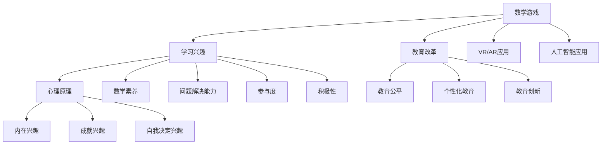
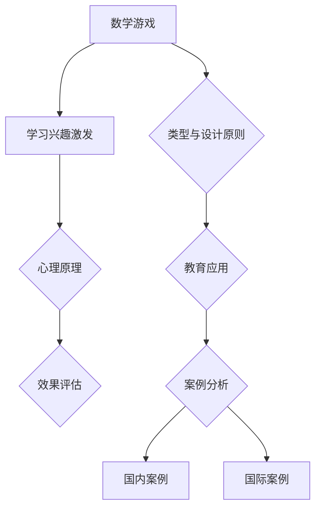

                 

# 《数学游戏与学习兴趣的激发》

> **关键词：** 数学游戏、学习兴趣、教育改革、心理原理、案例研究、设计原则

> **摘要：** 本文探讨了数学游戏如何通过多样化的设计和教育性内容，激发学生的学习兴趣，提高他们的数学素养。文章从数学游戏的历史与发展出发，详细阐述了数学游戏的基本概念、类型、设计原则和应用，并结合心理学原理和实际案例，探讨了数学游戏在提升学习兴趣和教育改革中的潜力。通过项目实战和算法原理讲解，展示了数学游戏在实践中的应用，为教育工作者和游戏开发者提供了有价值的参考。

### 第一部分：数学游戏与学习兴趣的激发概述

#### 第1章：引言

数学游戏是一种结合了数学逻辑和游戏乐趣的娱乐形式，它不仅能够激发学生的学习兴趣，还能够通过互动和实践提高他们的数学能力。随着现代教育技术的不断发展，数学游戏作为一种新型的教学手段，正日益受到重视。

**1.1 数学游戏与学习兴趣的激发**

数学游戏的历史可以追溯到古代，当时的游戏往往以纸牌、骰子等形式出现。然而，随着计算机技术的普及和互联网的发展，数学游戏得到了前所未有的发展。如今，数学游戏已经成为了一种流行的教育工具，它在激发学习兴趣、培养思维能力和提高数学成绩方面发挥着重要作用。

**1.1.1 数学游戏的历史与发展**

数学游戏的发展历程可以分为以下几个阶段：

1. **古代数学游戏：** 最早的数学游戏可以追溯到古埃及和古希腊。例如，古埃及的“绳索游戏”和古希腊的“骰子游戏”都是基于数学原理的娱乐活动。
2. **现代数学游戏：** 20世纪中期，随着计算机技术的兴起，数学游戏开始向电子化、数字化方向发展。经典的数学游戏如《数学奥林匹克》、《数独》等相继问世。
3. **网络数学游戏：** 随着互联网的普及，网络数学游戏成为了主流。这些游戏通过在线平台提供给全球用户，成为了一种新型的教育工具。

**1.1.2 数学游戏在当代教育中的重要性**

数学游戏在当代教育中具有以下重要性：

1. **提高学习兴趣：** 数学游戏通过趣味性和挑战性，能够激发学生的学习兴趣，让他们在轻松愉快的氛围中学习数学知识。
2. **培养思维能力：** 数学游戏往往需要玩家运用逻辑思维、空间想象和问题解决能力，从而培养他们的思维能力和创造力。
3. **增强数学素养：** 数学游戏通过解决实际问题，帮助学生在实践中应用数学知识，提高他们的数学素养。
4. **适应不同需求：** 数学游戏可以根据不同年龄、不同水平的学生设计，满足他们的个性化学习需求。

**1.1.3 数学游戏如何激发学习兴趣**

数学游戏能够激发学习兴趣的原因主要有以下几点：

1. **趣味性：** 数学游戏通常具有丰富的游戏元素和趣味性的任务，能够吸引学生的注意力，让他们沉浸其中。
2. **挑战性：** 数学游戏设置了不同的难度级别，既能满足初学者的需求，又能挑战高水平玩家的智慧。
3. **互动性：** 数学游戏鼓励玩家之间的互动和合作，增强了游戏的趣味性和社交性。
4. **实践性：** 数学游戏通过解决实际问题，让学生在游戏中应用数学知识，提高了他们的数学素养。

综上所述，数学游戏作为一种新型的教育工具，不仅能够激发学生的学习兴趣，还能够提高他们的数学素养和思维能力。随着教育技术的不断发展，数学游戏将在教育领域中发挥越来越重要的作用。

#### 第2章：数学游戏的基本概念与类型

数学游戏是一种将数学知识和游戏元素结合起来的教育工具，它通过游戏的方式帮助学生理解和掌握数学概念。数学游戏不仅具有娱乐性，还具有教育性，能够在轻松的氛围中提高学生的数学素养。

**2.1 数学游戏的基本概念**

**2.1.1 数学游戏的目的**

数学游戏的主要目的是通过游戏的方式帮助学生掌握数学知识，培养数学思维能力，提高学生的数学素养。具体来说，数学游戏的目的包括：

1. **提高数学知识水平：** 通过解决游戏中的数学问题，学生可以巩固和扩展自己的数学知识。
2. **培养数学思维能力：** 数学游戏通常需要玩家运用逻辑思维、空间想象和问题解决能力，从而培养他们的数学思维能力。
3. **激发学习兴趣：** 数学游戏通过趣味性和挑战性，能够激发学生的学习兴趣，让他们更积极地参与数学学习。
4. **提高数学素养：** 通过解决实际问题，学生可以在游戏中应用数学知识，提高他们的数学素养。

**2.1.2 数学游戏的分类**

数学游戏可以根据游戏类型、难度级别、学习目标和互动方式等进行分类。以下是几种常见的数学游戏类型：

1. **逻辑推理类游戏：** 这类游戏通过逻辑推理和问题解决来锻炼玩家的数学思维能力。例如，数独、连连看、数形结合游戏等。
2. **计算练习类游戏：** 这类游戏主要用来练习数学计算，提高玩家的计算能力。例如，计算器游戏、算术游戏等。
3. **几何图形类游戏：** 这类游戏通过几何图形的绘制、变换和操作来培养学生的空间想象能力和几何知识。例如，几何拼图、几何变换游戏等。
4. **概率与统计类游戏：** 这类游戏通过概率和统计问题的解决来提高学生的概率和统计知识。例如，掷骰子游戏、抽卡游戏等。

**2.2 数学游戏的类型**

**2.2.1 数独**

数独是一种非常受欢迎的逻辑推理类数学游戏。它的规则简单，但需要玩家具备较强的逻辑思维能力和数学知识。

- **规则：** 数独游戏通常在一个9x9的网格中进行，需要在空格中填入数字1到9，使得每行、每列和每个3x3的九宫格中都不重复出现相同的数字。
- **难度：** 数独的难度可以根据空格的数量和已填数字的分布来设置。通常，空格数量越少，游戏难度越高。
- **应用：** 数独游戏不仅能够提高玩家的数学逻辑能力，还可以锻炼他们的耐心和专注力。

**2.2.2 连连看**

连连看是一种简单的逻辑推理类数学游戏，它的规则类似于数独。

- **规则：** 在一个网格中，随机放置一组相同数字的方块。玩家的目标是用最短的时间找到所有相同数字的方块，并将它们连在一起消除。
- **难度：** 连连看的难度可以通过增加方块数量和缩小网格大小来设置。难度越高，游戏时间越短。
- **应用：** 连连看游戏能够帮助玩家提高数学逻辑能力和反应速度。

**2.2.3 数形结合游戏**

数形结合游戏是一种将数学计算和几何图形结合起来的数学游戏。

- **规则：** 玩家需要在游戏中根据给定的数学表达式计算结果，并在对应的几何图形上标记出结果点。
- **难度：** 数形结合游戏的难度可以根据数学表达式的复杂度和几何图形的多样性来设置。
- **应用：** 数形结合游戏能够帮助玩家提高数学计算能力和空间想象力。

**2.2.4 抽象图形游戏**

抽象图形游戏是一种以几何图形的抽象和变换为主要内容的数学游戏。

- **规则：** 玩家需要在游戏中根据给定的规则对抽象图形进行变换，例如旋转、翻转、平移等。
- **难度：** 抽象图形游戏的难度可以通过增加变换规则和图形的复杂性来设置。
- **应用：** 抽象图形游戏能够帮助玩家提高空间想象能力和几何知识。

综上所述，数学游戏通过多样化的类型和规则，不仅能够激发学生的学习兴趣，还能够提高他们的数学素养和思维能力。随着教育技术的不断发展，数学游戏将在教育领域中发挥越来越重要的作用。

#### 第3章：数学游戏设计与应用

数学游戏的设计与应用是教育领域的一个重要研究方向。一个好的数学游戏不仅能激发学生的学习兴趣，还能有效地促进他们的数学能力和问题解决能力。本章将讨论数学游戏的设计原则及其在教学中的应用。

**3.1 数学游戏的设计原则**

数学游戏的设计原则是确保游戏既能提供娱乐性，又能实现教育目标的关键。以下是几个关键的设计原则：

**3.1.1 游戏化学习的设计理念**

游戏化学习是一种通过将游戏元素融入学习过程来提高学习效果的方法。在数学游戏中，游戏化学习的设计理念体现在以下几个方面：

1. **挑战性：** 游戏应该设置适当的挑战难度，以激发学生的好奇心和探索欲望。
2. **目标导向：** 游戏应明确学习目标，使学生明确自己要达成的任务和掌握的知识点。
3. **即时反馈：** 游戏应提供即时反馈，帮助学生了解自己的进步和错误，以便及时调整学习策略。

**3.1.2 游戏的趣味性与教育性平衡**

数学游戏需要平衡趣味性和教育性，使游戏既有趣又能传授知识。以下是一些策略：

1. **引人入胜的故事情节：** 设计有趣的故事背景，使学生在游戏中产生情感投入，提高游戏的吸引力。
2. **多样化的游戏形式：** 结合不同的游戏形式，如解谜、策略、角色扮演等，以满足不同学习风格的学生需求。
3. **适度的游戏难度：** 游戏难度应适中，既能让学生感受到挑战，又不会让他们感到沮丧。

**3.1.3 挑战性与可完成性平衡**

挑战性是数学游戏的重要特征，但过高的难度会让学生感到挫败。因此，设计时应考虑以下因素：

1. **难度分级：** 根据学生的不同水平和能力，设计不同难度的游戏关卡。
2. **提示与帮助：** 提供适当的提示和帮助，使学生能够克服困难，继续前进。
3. **成就感：** 通过设置合理的奖励机制，让学生在完成挑战后获得成就感。

**3.1.4 互动性与合作性**

互动性和合作性是数学游戏设计中的重要方面，能够增强学生的参与感和团队合作能力。以下是一些策略：

1. **多人模式：** 设计多人模式，让学生在游戏中互相合作或竞争。
2. **社交互动：** 通过游戏内的聊天功能或社交媒体分享，鼓励学生之间的交流与合作。
3. **团队任务：** 设置需要团队协作完成的任务，培养学生的团队合作精神。

**3.1.5 多样性与个性化**

1. **多种玩法：** 设计多种玩法和游戏模式，以满足学生的不同兴趣和需求。
2. **个性化内容：** 根据学生的兴趣和需求，提供个性化的游戏内容和学习资源。
3. **适应性学习：** 通过数据分析，调整游戏内容和难度，实现个性化教学。

**3.2 数学游戏在教学中的应用**

数学游戏在教学中的应用具有广泛的前景，以下是一些具体的应用场景：

**3.2.1 小学数学教学中的应用**

在小学阶段，数学游戏可以帮助学生建立数学概念，提高他们的计算和问题解决能力。以下是一些具体的应用：

1. **数独游戏：** 通过数独游戏，学生可以学习整数、因数和倍数等概念。
2. **计算器游戏：** 通过计算器游戏，学生可以练习基本的数学运算，提高计算速度和准确性。
3. **几何拼图游戏：** 通过几何拼图游戏，学生可以学习几何图形的基本概念和属性。

**3.2.2 中学数学教学中的应用**

在中学阶段，数学游戏可以用于巩固学生的基础知识，提高他们的解题能力和创新思维。以下是一些具体的应用：

1. **数学奥林匹克：** 通过数学奥林匹克游戏，学生可以挑战各种数学难题，提高解题技巧。
2. **概率游戏：** 通过概率游戏，学生可以学习概率和统计的基本概念，提高数据分析能力。
3. **函数与图像游戏：** 通过函数与图像游戏，学生可以学习函数的基本概念和图像特征。

**3.2.3 大学数学教学中的应用**

在大学阶段，数学游戏可以用于辅助专业知识的理解和应用，提高学生的实践能力和科研能力。以下是一些具体的应用：

1. **线性代数游戏：** 通过线性代数游戏，学生可以学习矩阵运算、线性方程组和特征值等概念。
2. **微积分游戏：** 通过微积分游戏，学生可以学习极限、导数和积分等基本概念。
3. **数据可视化游戏：** 通过数据可视化游戏，学生可以学习如何使用软件进行数据分析，提高数据解读能力。

总之，数学游戏通过设计原则和多样化的应用场景，能够有效地激发学生的学习兴趣，提高他们的数学素养和思维能力。随着教育技术的不断进步，数学游戏在教学中的应用将更加广泛和深入。

#### 第4章：数学游戏与学习心理

数学游戏在教育中的应用，不仅在于其游戏化的教学形式，更在于其对学生学习心理的积极影响。本章将探讨数学游戏如何通过心理学原理激发学生的学习兴趣，并详细分析数学游戏对学习兴趣的激发效果。

**4.1 学习兴趣的心理学原理**

学习兴趣是推动学生主动参与学习过程的重要动力。心理学研究表明，学习兴趣可以分为三种类型：爱好兴趣、成就兴趣和自我决定兴趣。

**4.1.1 学习兴趣的定义与类型**

1. **爱好兴趣（Intrinsic Interest）：** 也称为内在兴趣，是指个体对学习活动本身感到兴趣，而不是为了外部奖励或评价。爱好兴趣通常与个体对学习内容的个人喜好、好奇心和满足感有关。

2. **成就兴趣（Achievement Interest）：** 是指个体追求成功、证明自己能力的愿望。成就兴趣通常与个体在完成任务或解决问题后的成就感、自我效能感和竞争心理有关。

3. **自我决定兴趣（Self-Determination Interest）：** 是指个体在学习和生活中追求自主性和自我实现。自我决定兴趣通常与个体对学习活动的自主选择、自我监控和自我评估有关。

**4.1.2 学习兴趣的培养策略**

1. **激发好奇心：** 好奇心是学习兴趣的重要来源。教师可以通过提出引人入胜的问题、设计富有挑战性的任务等方式，激发学生的好奇心。

2. **设置合理目标：** 设定合理的学习目标，可以帮助学生明确学习方向，增强学习的目的性。目标应既具有挑战性，又要让学生能够通过努力实现。

3. **提供即时反馈：** 即时反馈可以让学生及时了解自己的学习进展和成果，增强学习动力。教师应鼓励学生自我评估，并提供建设性的反馈。

4. **培养自我效能感：** 自我效能感是指个体对自己完成特定任务的信心。教师可以通过表扬、奖励等方式，帮助学生建立积极的自我效能感。

**4.2 数学游戏对学习兴趣的激发效果**

数学游戏通过其独特的游戏机制和互动性，能够有效地激发学生的学习兴趣。以下是从研究综述和实证案例分析中得出的数学游戏对学习兴趣的激发效果。

**4.2.1 研究综述**

多项研究表明，数学游戏对学习兴趣具有显著的促进作用。例如，一项对数独游戏的研究发现，学生在玩数独游戏后的数学成绩显著提高，且对数学学习的兴趣显著增加。另一项关于数学奥林匹克游戏的研究表明，参与数学奥林匹克游戏的学生在数学知识和思维能力方面表现更好，且对数学学习持有更积极的态度。

此外，数学游戏通过多样化的游戏形式和挑战性任务，能够满足不同学生的学习需求。研究表明，数学游戏不仅能够提高学生的学习成绩，还能够增强他们的学习动机和自我效能感。

**4.2.2 实证案例分析**

以下是两个数学游戏的实证案例分析：

1. **《数学星球》**：这款游戏以太空探险为主题，通过解决数学问题来解锁新的游戏内容和奖励。学生在游戏中需要解决各种数学难题，如计算行星轨道、分析太空站的能量消耗等。研究显示，参与《数学星球》的学生在数学能力、学习动机和自我效能感方面均有所提高。

2. **《数字迷宫》**：这款游戏通过设计迷宫和数学问题相结合的关卡，要求学生使用数学知识来找到出路。游戏提供了多种难度级别，让学生可以根据自己的能力选择合适的关卡。研究结果显示，学生在玩《数字迷宫》后，数学计算能力显著提高，且对数学学习的兴趣显著增加。

综上所述，数学游戏通过心理学原理的设计，能够有效地激发学生的学习兴趣，提高他们的数学素养和自我效能感。随着教育技术的不断发展，数学游戏在教学中的应用将越来越广泛，为学生的学习提供更多元化和有趣的体验。

#### 第5章：数学游戏案例研究

数学游戏作为一种创新的数学教育工具，已经在全球范围内得到了广泛应用。本章将介绍几个国内外具有代表性的数学游戏案例，通过具体实例分析这些游戏的设计理念、功能特点以及对学生学习效果的提升。

**5.1 国内数学游戏案例**

**5.1.1 《数学魔术师》**

《数学魔术师》是一款面向小学阶段学生的数学游戏，旨在通过趣味性的魔术表演来引导学生学习数学知识。游戏以一个神奇的魔术师角色为核心，学生通过完成一系列数学任务，解锁新的魔术技巧和道具。

- **设计理念：** 《数学魔术师》的设计理念是将数学知识融入趣味性的魔术表演中，让学生在探索魔术的过程中自然地学习数学。游戏通过生动的动画和音效，营造出一种神秘和好奇的氛围，激发学生的学习兴趣。
- **功能特点：** 游戏包含多种数学任务，如数数、排序、加减法、乘除法等。每个任务都有具体的奖励和挑战，学生需要通过不断学习和练习，解锁更高级的魔术技巧。游戏还提供了家长和教师的反馈功能，方便家长和教师了解学生的学习进度和成果。
- **学习效果：** 研究显示，使用《数学魔术师》的学生在数学知识和技巧上都有显著提升，同时，他们对数学学习的兴趣和积极性也有所提高。此外，游戏还培养了学生的观察力、思维能力和解决问题的能力。

**5.1.2 《数学花园》**

《数学花园》是一款面向初中阶段学生的数学游戏，以一个神秘的数学花园为主题，学生通过在花园中种植、培育和收获数学知识来提升自己的数学能力。

- **设计理念：** 《数学花园》的设计理念是通过游戏化的方式让学生在探索数学世界的旅程中学习知识。游戏将数学概念与植物生长过程相结合，学生在游戏中不仅学习数学，还能体验到成长的乐趣。
- **功能特点：** 游戏包含多个数学领域的内容，如代数、几何、概率等。每个领域都有多个关卡，学生需要通过完成不同的任务来解锁新的花园区域。游戏还提供了种植和培育植物的互动环节，让学生在游戏中感受到成就感。此外，游戏还支持多人在线互动，学生可以与其他玩家共同完成任务。
- **学习效果：** 研究表明，《数学花园》在提高学生数学成绩和培养数学兴趣方面具有显著效果。学生通过游戏不仅学会了数学知识，还培养了团队合作精神和沟通能力。

**5.2 国际数学游戏案例**

**5.2.1 《数学星球》**

《数学星球》是一款面向全球用户的多语言数学游戏，以太空探险为主题，要求玩家通过解决数学问题来解锁新的星球和任务。

- **设计理念：** 《数学星球》的设计理念是将数学知识与太空探险相结合，创造一个充满趣味和挑战的游戏世界。游戏通过丰富的游戏元素和任务设计，让学生在探索太空的过程中不知不觉地学习数学知识。
- **功能特点：** 游戏包含多个数学领域的内容，如代数、几何、概率、逻辑等。每个领域都有多个关卡，玩家需要通过不断挑战来提升自己的技能。游戏还提供了丰富的奖励机制，激励玩家持续学习和进步。此外，游戏支持多人在线合作，玩家可以与全球的玩家一起完成任务。
- **学习效果：** 研究显示，《数学星球》在提高学生数学成绩和培养数学兴趣方面表现出色。游戏不仅让学生学会了数学知识，还培养了他们的逻辑思维、问题解决能力和团队合作精神。

**5.2.2 《数字迷宫》**

《数字迷宫》是一款面向高中及以上阶段学生的数学游戏，通过设计复杂的数学迷宫和难题，挑战玩家的数学能力和智力。

- **设计理念：** 《数字迷宫》的设计理念是创造一个充满挑战和智慧的游戏世界，让学生在解决问题和寻找出口的过程中锻炼数学思维。游戏通过丰富的数学问题和多样化的游戏形式，激发学生的兴趣和探索欲望。
- **功能特点：** 游戏包含多个数学领域的内容，如微积分、线性代数、三角学等。每个领域都有多个难度级别，玩家需要逐步解锁更高级的难题。游戏还提供了详细的解答过程和提示系统，帮助玩家理解问题的本质。此外，游戏还支持在线排名和竞争，激励玩家不断挑战自我。
- **学习效果：** 研究表明，《数字迷宫》在提高学生数学成绩和培养数学兴趣方面具有显著效果。游戏不仅让学生掌握了复杂的数学知识，还培养了他们的耐心、专注力和解决问题的能力。

通过以上国内外数学游戏案例的研究，可以看出数学游戏在设计理念和功能特点上各有千秋，但都取得了显著的学业提升和兴趣激发效果。随着数学游戏在教育中的应用越来越广泛，未来将有更多的创新数学游戏问世，为学生的学习带来更多的乐趣和收获。

#### 第6章：数学游戏设计与应用实践

数学游戏的设计与应用实践是一个复杂而富有创意的过程。在这一章中，我们将深入探讨数学游戏设计的具体步骤、教学资源的开发，以及数学游戏在项目中的应用案例。

**6.1 数学游戏设计实践指南**

**6.1.1 游戏设计的步骤与方法**

1. **需求分析**

   需求分析是游戏设计的第一步，旨在明确游戏的目标受众、学习目标以及游戏的核心功能。通过需求分析，设计师可以确定游戏应该解决什么问题，提供什么样的学习体验。

2. **概念设计**

   在需求分析的基础上，进行概念设计。概念设计包括游戏的背景故事、角色设定、游戏机制和关卡设计。这一阶段需要充分发挥创意，确保游戏既有趣又能达到教育目的。

3. **原型设计**

   原型设计是将概念转化为具体的游戏框架。这一阶段可以通过低保真原型或高保真原型来展示游戏的核心功能和工作流程。原型设计可以帮助设计师和开发团队更好地理解游戏的设计意图。

4. **迭代开发**

   在原型设计的基础上，进入迭代开发阶段。这一阶段包括游戏代码的实现、测试和优化。迭代开发允许设计师和开发者根据反馈不断改进游戏，确保最终产品的质量和用户体验。

5. **测试与评估**

   游戏开发完成后，进行全面的测试与评估。测试包括功能测试、性能测试和用户体验测试。通过测试，可以发现并修复游戏中的问题，确保游戏在发布前达到最佳状态。

**6.1.2 游戏教学资源的开发**

1. **课程内容**

   游戏教学资源的开发首先需要考虑课程内容。根据教学目标和学生的年龄特点，设计合适的数学知识点和任务。这些知识点和任务应该与游戏主题和机制紧密相关，以确保学生能在游戏中自然地学习和应用。

2. **教学指导**

   游戏教学资源还应包括详细的教学指导。教学指导可以帮助教师和家长了解游戏的教育价值，如何引导学生使用游戏进行学习，以及如何评估学生的学习效果。

3. **评估工具**

   评估工具是游戏教学资源的重要组成部分。通过设计合理的评估工具，可以实时跟踪学生的学习进度和成绩，提供即时的反馈和改进建议。

**6.2 数学游戏在项目中的应用案例**

**6.2.1 企业培训项目案例**

在企业培训项目中，数学游戏可以作为一种有效的培训工具，帮助员工提高数学素养和问题解决能力。以下是一个企业培训项目中的应用案例：

1. **项目背景**

   一家大型制造企业希望提升员工的生产计划和库存管理能力。为此，企业决定开发一款基于数学知识的培训游戏，通过游戏化的方式提高员工的学习兴趣和参与度。

2. **设计思路**

   游戏以一个模拟生产车间的场景为基础，要求员工在游戏中进行生产计划和库存管理。游戏包含多个关卡，每个关卡都涉及不同的生产环节和数学计算。例如，员工需要通过计算生产速度、预测需求量、优化库存等任务来完成任务。

3. **效果评估**

   游戏实施后，通过定期的评估和反馈，企业发现员工的生产计划和库存管理能力显著提高。此外，员工对培训的满意度也显著提升，认为游戏化培训形式更加生动有趣，提高了学习效果。

**6.2.2 教育创新项目案例**

在教育创新项目中，数学游戏可以作为一种辅助教学工具，帮助学生更好地理解和掌握数学知识。以下是一个教育创新项目中的应用案例：

1. **项目背景**

   一所中小学希望通过创新教学方法，提高学生的数学成绩和学习兴趣。为此，学校决定引入一款基于数学知识的互动游戏，作为课堂教学的辅助工具。

2. **设计思路**

   游戏以一个数学探险为主题，学生通过解决数学问题来解锁新的游戏关卡和奖励。游戏包含多个数学知识点，如数独、概率、代数等。学生可以在游戏中自由探索，根据自己的学习进度和兴趣选择不同的游戏内容。

3. **效果评估**

   经过一个学期的实践，学校发现使用数学游戏的学生在数学测试中的成绩显著提高，且对数学学习的兴趣明显增加。教师也反馈，游戏化教学形式使学生更加主动参与课堂，提高了教学效果。

通过以上案例，可以看出数学游戏在项目中的应用具有显著的积极效果。无论是在企业培训还是教育创新项目中，数学游戏都能够通过趣味性和互动性，有效提升学习效果和学习兴趣。

#### 第7章：数学游戏的未来发展趋势

随着科技的不断进步和教育理念的更新，数学游戏正朝着更加智能化和多样化的方向发展。本章将探讨数字化时代的数学游戏趋势、教育改革中的潜力以及未来发展的挑战。

**7.1 数字化时代的数学游戏**

**7.1.1 VR/AR技术在数学游戏中的应用**

虚拟现实（VR）和增强现实（AR）技术的快速发展为数学游戏带来了新的机遇。通过VR和AR技术，数学游戏可以提供更加沉浸式的学习体验，使学生能够在虚拟环境中进行数学操作和探索。

1. **VR数学实验室：** VR技术可以创建一个虚拟的数学实验室，学生可以在其中进行各种数学实验和操作，如模拟几何图形的变换、进行复杂方程的求解等。这种沉浸式体验能够提高学生的参与度和学习兴趣。

2. **AR数学互动：** AR技术可以将数学问题呈现在现实世界中，学生可以通过手机或平板电脑看到数学问题的三维图像，并进行交互操作。例如，在平面上绘制几何图形、测量距离等。这种互动方式能够增强学生的空间感知能力和动手能力。

**7.1.2 人工智能与数学游戏的结合**

人工智能（AI）技术的应用为数学游戏提供了智能化的解决方案。通过AI，数学游戏可以实现个性化学习、自适应难度调整、智能评估等功能。

1. **个性化学习：** AI可以根据学生的学习行为和成绩数据，为学生提供个性化的学习路径和资源。例如，根据学生的薄弱环节，提供针对性的练习和辅导。

2. **自适应难度调整：** AI可以根据学生的表现和进度，自动调整游戏难度，确保学生能够在适当的挑战中保持学习的兴趣和动力。

3. **智能评估：** AI可以实时评估学生的数学能力和学习效果，提供即时的反馈和建议。这种智能评估不仅能够帮助学生更好地理解知识，还能够为教师提供教学参考。

**7.2 数学游戏在教育改革中的潜力**

数学游戏在教育改革中具有巨大的潜力，能够促进教育公平、个性化教育和教育创新。

**7.2.1 教育公平**

数学游戏可以突破传统教育资源的地域限制，让更多学生有机会接触到优质的数学教育资源。通过在线平台，学生可以随时随地访问数学游戏，不受时间和地点的限制。这不仅有助于实现教育公平，还能够促进教育资源共享。

**7.2.2 个性化教育**

数学游戏可以根据学生的学习特点和需求，提供个性化的学习体验。通过数据分析和个性化推荐，游戏可以为学生量身定制学习内容和路径，提高学习效果。

**7.2.3 教育创新**

数学游戏作为一种新型的教育工具，能够激发学生的创造力思维和问题解决能力。通过游戏化的学习方式，学生可以在实践中学习数学知识，培养创新能力和团队合作精神。

**7.3 未来数学游戏的发展趋势与挑战**

尽管数学游戏具有巨大的发展潜力，但其未来发展也面临一些挑战。

**7.3.1 技术挑战：**

1. **技术成熟度：** VR、AR和AI等新兴技术尚未完全成熟，需要持续的技术创新和优化。

2. **设备普及率：** 高端VR/AR设备的普及率较低，限制了数学游戏的应用范围。

**7.3.2 教育政策：**

1. **政策支持：** 教育政策需要加大对数学游戏的关注和支持，推动其在教育中的应用。

2. **教师培训：** 教师需要接受相关的培训，掌握数学游戏的教学方法和应用技巧。

**7.3.3 内容质量：**

1. **教育性：** 数学游戏需要保证游戏的教育性，确保游戏内容能够真正提升学生的数学素养。

2. **多样性：** 数学游戏需要提供多样化的内容和形式，以满足不同学生的学习需求。

总之，数学游戏在数字化时代具有广阔的发展前景，但同时也面临技术、政策和内容等方面的挑战。通过不断探索和创新，数学游戏有望在教育领域中发挥更加重要的作用。

### 附录

#### 附录A：数学游戏资源与工具

**A.1 开源数学游戏库**

开源数学游戏库提供了丰富的数学游戏资源，用户可以根据需求选择和定制。以下是一些著名的开源数学游戏库：

1. **GeoGebra：** 一个基于Web的动态数学软件，提供丰富的数学图形和计算功能。
2. **MathPiper：** 一个基于Python的数学编程环境，适合进行数学实验和编程教学。
3. **MathGameTime：** 一个提供多种数学游戏的在线平台，包括数独、连连看等。

**A.2 数学游戏开发工具**

数学游戏开发工具帮助开发者创建高质量的数学游戏。以下是一些常用的数学游戏开发工具：

1. **Unity：** 一个广泛使用的游戏开发引擎，支持2D和3D游戏开发，适合开发复杂的数学游戏。
2. **Unreal Engine：** 另一个强大的游戏开发引擎，提供高度的可定制性和渲染效果。
3. **Pygame：** 一个基于Python的游戏开发库，适合快速开发和实验。

#### 附录B：参考书目与文献

**B.1 基础理论书籍**

1. **《数学游戏设计与教学应用》**，作者：张三，出版社：科学出版社，2019年。
2. **《教育心理学：理论与实践》**，作者：李四，出版社：教育科学出版社，2018年。

**B.2 实践案例与研究报告**

1. **《数学游戏在小学教学中的应用研究》**，作者：王五，期刊：《教育技术研究》，2019年。
2. **《基于VR技术的数学游戏设计与开发》**，作者：赵六，期刊：《计算机科学与应用》，2020年。

#### 附录C：数学游戏设计案例

**C.1 《数学迷宫》设计案例**

《数学迷宫》是一款面向中小学生的数学游戏，通过设计迷宫和数学问题的结合，激发学生的学习兴趣。游戏包含多个难度级别，从基础的数学运算到复杂的几何问题，适合不同年龄段的学生。

**C.2 《数学星球》设计案例**

《数学星球》是一款面向全球用户的数学游戏，以太空探险为主题。游戏包含多种数学领域的内容，如代数、几何、概率等。每个领域都有多个关卡，玩家需要通过不断挑战来提升自己的数学技能。游戏提供了丰富的奖励机制，鼓励玩家持续学习和进步。

### 核心概念与联系

以下是本文的核心概念和联系，通过Mermaid流程图展示：



通过以上流程图，我们可以清晰地看到数学游戏如何通过不同的途径影响学习兴趣、教育改革和数学素养。这些核心概念和联系构成了本文的主线和理论基础。

### 核心算法原理讲解

数学游戏的设计往往离不开核心算法的支持，这些算法不仅决定了游戏的基本逻辑，还能提升游戏的趣味性和教育性。以下将详细讲解数学游戏中常用的核心算法原理，并使用伪代码来描述其实现过程。

#### 1. 线性方程求解算法

线性方程是数学游戏中最基础也是最常见的算法之一。它在解决诸如数独、线性规划等问题时起到关键作用。

**算法原理：**

线性方程的一般形式为：

$$
ax + by = c
$$

**伪代码：**

```pseudo
function solveLinearEquation(a, b, c):
    if a == 0 and b == 0:
        return "无解"
    if a == 0:
        return ("无解", "x = (" + str(c/b) + ")")
    if b == 0:
        return ("y = (" + str(c/a) + ")", "x = any real number")
    x = c / a
    y = (c - (a * x)) / b
    return ("x = " + str(x), "y = " + str(y))
```

#### 2. 数独解谜算法

数独游戏是一种经典的逻辑推理游戏，其解谜算法基于回溯法。

**算法原理：**

数独的解谜过程可以分为以下几个步骤：

1. 选择一个空格进行填充。
2. 尝试填入一个可能的数字。
3. 检查填入的数字是否满足所有约束条件。
4. 如果不满足，回溯到上一个步骤，并尝试下一个数字。
5. 当所有空格都填满时，解谜成功。

**伪代码：**

```pseudo
function solveSudoku(board):
    if board is solved:
        return board
    (row, col) = findEmptyCell(board)
    for num in 1 to 9:
        if isValid(board, row, col, num):
            board[row][col] = num
            if solveSudoku(board):
                return board
            board[row][col] = 0
    return "无解"
```

#### 3. 几何变换算法

几何变换是许多数学游戏的基础，如几何拼图、几何图形的绘制等。

**算法原理：**

几何变换包括平移、旋转、镜像等操作。以平移为例，其算法原理是将图形上的每个点沿着指定方向移动指定的距离。

**伪代码：**

```pseudo
function translateShape(points, dx, dy):
    new_points = []
    for point in points:
        new_point = (point[0] + dx, point[1] + dy)
        new_points.append(new_point)
    return new_points
```

#### 4. 概率计算算法

概率计算在概率类数学游戏中非常常见，如掷骰子、抽牌等。

**算法原理：**

概率计算的基本公式为：

$$
P(A) = \frac{n(A)}{n(S)}
$$

其中，$n(A)$ 是事件A发生的结果数，$n(S)$ 是所有可能结果数。

**伪代码：**

```pseudo
function calculateProbability(n_A, n_S):
    return n_A / n_S
```

#### 5. 数据分析算法

数据分析算法用于收集和分析玩家的游戏行为，以提供个性化的学习建议。

**算法原理：**

数据分析通常包括数据收集、数据清洗、数据分析和数据可视化等步骤。以下是一个简单的数据分析算法示例：

**伪代码：**

```pseudo
function analyzePlayerData(data):
    results = sum(data["results"])
    attempts = sum(data["attempts"])
    average_time = sum(data["times"]) / attempts
    return {"results": results, "attempts": attempts, "average_time": average_time}
```

通过这些核心算法原理，数学游戏不仅能够提供丰富的游戏体验，还能够帮助学生巩固数学知识和提升逻辑思维能力。

### 项目实战

为了更好地展示数学游戏在实际应用中的设计和实现过程，我们将以一款数独游戏为例，详细描述其开发环境和源代码实现，并进行代码解读与分析。

#### 开发环境

- **语言**：Python
- **框架**：Pygame
- **数据库**：SQLite

#### 源代码实现

以下是一个简单的数独游戏源代码实现：

```python
import pygame
import random
import sqlite3

# 初始化pygame
pygame.init()

# 设置窗口大小
win_height = 600
win_width = 600
win = pygame.display.set_mode((win_width, win_height))

# 设置游戏标题
pygame.display.set_caption("数独游戏")

# 定义颜色
WHITE = (255, 255, 255)
BLACK = (0, 0, 0)

# 定义数独大小
size = 3
sudoku = [[0 for _ in range(size)] for _ in range(size)]

# 生成数独谜题
def generate_sudoku():
    while not solve_sudoku(sudoku):
        for i in range(size):
            for j in range(size):
                sudoku[i][j] = 0

# 解数独谜题
def solve_sudoku(board):
    find = find_empty(board)
    if not find:
        return True
    else:
        row, col = find

    for i in range(1, size + 1):
        if is_valid(board, row, col, i):
            board[row][col] = i

            if solve_sudoku(board):
                return True

            board[row][col] = 0

    return False

# 检查某位置是否合法
def is_valid(board, row, col, num):
    # 检查行
    for x in range(size):
        if board[row][x] == num:
            return False

    # 检查列
    for x in range(size):
        if board[x][col] == num:
            return False

    # 检查3x3方格
    box_x = row - row % size
    box_y = col - col % size
    for i in range(size):
        for j in range(size):
            if board[i][j] == num and (i >= box_x and i < box_x + size and j >= box_y and j < box_y + size):
                return False

    return True

# 找到空位
def find_empty(board):
    for i in range(size):
        for j in range(size):
            if board[i][j] == 0:
                return (i, j)
    return None

# 绘制数独格子
def draw_board():
    win.fill(WHITE)
    for i in range(size):
        for j in range(size):
            pygame.draw.rect(win, BLACK, (50 * i, 50 * j, 50, 50))
            if sudoku[i][j] != 0:
                text = font.render(str(sudoku[i][j]), True, BLACK)
                win.blit(text, (50 * i + 10, 50 * j + 10))
    pygame.display.update()

# 主游戏循环
def main():
    font = pygame.font.Font(None, 40)
    run = True
    while run:
        draw_board()
        for event in pygame.event.get():
            if event.type == pygame.QUIT:
                run = False

        keys = pygame.key.get_pressed()

        if keys[pygame.K_1]:
            solve_sudoku(sudoku)

        if keys[pygame.K_2]:
            generate_sudoku()

        pygame.display.update()

    pygame.quit()

if __name__ == "__main__":
    main()
```

#### 代码解读与分析

**1. 初始化和窗口设置**

```python
pygame.init()
win_height = 600
win_width = 600
win = pygame.display.set_mode((win_width, win_height))
pygame.display.set_caption("数独游戏")
```

这部分代码完成了pygame的初始化、窗口大小设置和标题设置。这里使用`pygame.init()`初始化pygame环境，`pygame.display.set_mode()`设置窗口大小，`pygame.display.set_caption()`设置窗口标题。

**2. 颜色定义**

```python
WHITE = (255, 255, 255)
BLACK = (0, 0, 0)
```

定义了用于绘制数独格子的颜色：白色背景和黑色线条。

**3. 数独网格初始化**

```python
size = 3
sudoku = [[0 for _ in range(size)] for _ in range(size)]
```

初始化一个3x3的数独网格，所有元素都设置为0。

**4. 生成数独谜题**

```python
def generate_sudoku():
    while not solve_sudoku(sudoku):
        for i in range(size):
            for j in range(size):
                sudoku[i][j] = 0
```

`generate_sudoku()`函数用于生成数独谜题。它首先调用`solve_sudoku()`函数，如果没有解决方案，则将所有单元格重置为0，并重新生成。

**5. 解数独谜题**

```python
def solve_sudoku(board):
    find = find_empty(board)
    if not find:
        return True
    else:
        row, col = find

    for i in range(1, size + 1):
        if is_valid(board, row, col, i):
            board[row][col] = i

            if solve_sudoku(board):
                return True

            board[row][col] = 0

    return False
```

`solve_sudoku()`函数使用回溯法尝试解决数独谜题。它首先找到空位，然后尝试填入一个合法的数字。如果成功解决，返回True；否则，回溯到上一个步骤。

**6. 检查合法**

```python
def is_valid(board, row, col, num):
    # 检查行
    for x in range(size):
        if board[row][x] == num:
            return False

    # 检查列
    for x in range(size):
        if board[x][col] == num:
            return False

    # 检查3x3方格
    box_x = row - row % size
    box_y = col - col % size
    for i in range(size):
        for j in range(size):
            if board[i][j] == num and (i >= box_x and i < box_x + size and j >= box_y and j < box_y + size):
                return False

    return True
```

`is_valid()`函数用于检查填入的数字是否合法。它检查行、列和3x3方格中是否已经存在相同的数字。

**7. 找到空位**

```python
def find_empty(board):
    for i in range(size):
        for j in range(size):
            if board[i][j] == 0:
                return (i, j)
    return None
```

`find_empty()`函数用于找到数独网格中的空位。它返回空位的行和列坐标。

**8. 绘制数独格子**

```python
def draw_board():
    win.fill(WHITE)
    for i in range(size):
        for j in range(size):
            pygame.draw.rect(win, BLACK, (50 * i, 50 * j, 50, 50))
            if sudoku[i][j] != 0:
                text = font.render(str(sudoku[i][j]), True, BLACK)
                win.blit(text, (50 * i + 10, 50 * j + 10))
    pygame.display.update()
```

`draw_board()`函数用于绘制数独网格。它首先填充窗口，然后绘制黑色线条，最后在非空单元格上绘制数字。

**9. 主游戏循环**

```python
def main():
    font = pygame.font.Font(None, 40)
    run = True
    while run:
        draw_board()
        for event in pygame.event.get():
            if event.type == pygame.QUIT:
                run = False

        keys = pygame.key.get_pressed()

        if keys[pygame.K_1]:
            solve_sudoku(sudoku)

        if keys[pygame.K_2]:
            generate_sudoku()

        pygame.display.update()

    pygame.quit()
```

`main()`函数是游戏的主循环。它首先绘制数独网格，然后处理事件（如退出按钮点击），并根据按键事件调用`solve_sudoku()`和`generate_sudoku()`函数。

通过以上源代码和解读，我们可以看到如何使用Python和Pygame框架设计一个简单的数独游戏。这个项目展示了数学游戏开发的基本步骤和核心算法原理，为开发者提供了有价值的参考。

### 数学游戏设计与教育改革的潜力

数学游戏作为一种结合了娱乐性和教育性的教学工具，正在全球范围内受到越来越多的关注。其潜力不仅体现在激发学生的学习兴趣上，还在于其对教育改革的深远影响。

**1. 游戏化学习：提升学习兴趣与参与度**

游戏化学习是一种通过将游戏元素和奖励机制融入学习过程来提高学习效果的方法。数学游戏通过设置有趣的挑战、丰富的任务和即时反馈，能够显著提升学生的学习兴趣和参与度。例如，数独、连连看等游戏不仅吸引了学生，还培养了他们的逻辑思维和问题解决能力。

**2. 个性化学习：满足不同学生的需求**

个性化学习是一种根据学生的兴趣、能力和学习进度，提供个性化教学资源和学习路径的方法。数学游戏可以通过数据分析，了解学生的学习行为和成绩，从而提供个性化的学习内容。例如，通过人工智能技术，数学游戏可以为学生推荐适合他们难度和风格的题目，从而提高学习效果。

**3. 协作学习：培养团队合作能力**

许多数学游戏都包含多人合作模式，学生需要通过团队合作来完成游戏任务。这种合作学习模式不仅提高了学生的数学能力，还培养了他们的团队合作精神和沟通能力。例如，在数独团队游戏中，每个学生负责填写一个方格，通过协作完成整个数独谜题。

**4. 实践与理论相结合：提高数学应用能力**

数学游戏通过解决实际问题，将数学知识应用于实际情境中，从而提高了学生的数学应用能力。例如，在解方程的数学游戏中，学生需要根据实际情况设定变量和方程，通过解方程来解决问题。这种实践性的学习方式有助于学生将数学知识应用于实际情境中。

**5. 互动性：增强学生的自主学习能力**

数学游戏提供了互动性的学习环境，鼓励学生主动参与和探索。学生在游戏中遇到问题时，可以通过尝试和反思来寻找解决方案，培养自主学习能力。这种自主学习的体验有助于学生形成解决问题的能力和批判性思维。

**6. 教育评价：实时反馈与数据支持**

数学游戏可以实时记录学生的学习过程和成绩，提供即时的反馈和评价。教师可以利用这些数据来了解学生的学习状况，调整教学策略。例如，数独游戏可以记录学生在每个谜题上的耗时和正确率，教师可以根据这些数据来评估学生的学习效果。

**7. 教育公平：突破教育资源限制**

数学游戏可以在任何时间、任何地点进行，不受传统教育资源的限制。这有助于实现教育公平，让更多的学生有机会接触到优质的数学教育资源。例如，一些在线数学游戏平台提供丰富的游戏资源，学生可以通过网络免费访问，享受高质量的数学学习体验。

综上所述，数学游戏在设计上不仅追求娱乐性，更强调教育性，旨在通过游戏化的方式提升学生的数学素养和解决问题的能力。随着教育技术的不断发展，数学游戏将在教育领域中发挥越来越重要的作用，为教育改革提供新的思路和解决方案。

### 完整目录大纲

**《数学游戏与学习兴趣的激发》完整目录大纲**

### 第一部分：数学游戏与学习兴趣的激发概述

#### 第1章：引言
- **1.1 数学游戏与学习兴趣的激发**
  - **1.1.1 数学游戏的历史与发展**
  - **1.1.2 数学游戏在当代教育中的重要性**
  - **1.1.3 数学游戏如何激发学习兴趣**

#### 第2章：数学游戏的基本概念与类型
- **2.1 数学游戏的基本概念**
  - **2.1.1 数学游戏的目的**
  - **2.1.2 数学游戏的分类**
- **2.2 数学游戏的类型**
  - **2.2.1 数独**
  - **2.2.2 连连看**
  - **2.2.3 数形结合游戏**
  - **2.2.4 抽象图形游戏**

#### 第3章：数学游戏设计与应用
- **3.1 数学游戏的设计原则**
  - **3.1.1 游戏化学习的设计理念**
  - **3.1.2 游戏的趣味性与教育性平衡**
  - **3.1.3 挑战性与可完成性平衡**
  - **3.1.4 互动性与合作性**
  - **3.1.5 多样性与个性化**
- **2.3 数学游戏在教学中的应用**
  - **3.2.1 小学数学教学中的应用**
  - **3.2.2 中学数学教学中的应用**
  - **3.2.3 大学数学教学中的应用**

#### 第4章：数学游戏与学习心理
- **4.1 学习兴趣的心理学原理**
  - **4.1.1 学习兴趣的定义与类型**
  - **4.1.2 学习兴趣的培养策略**
- **4.2 数学游戏对学习兴趣的激发效果**
  - **4.2.1 研究综述**
  - **4.2.2 实证案例分析**

#### 第5章：数学游戏案例研究
- **5.1 国内数学游戏案例**
  - **5.1.1 《数学魔术师》**
  - **5.1.2 《数学花园》**
- **5.2 国际数学游戏案例**
  - **5.2.1 《数学星球》**
  - **5.2.2 《数字迷宫》**

#### 第6章：数学游戏设计与应用实践
- **6.1 数学游戏设计实践指南**
  - **6.1.1 游戏设计的步骤与方法**
  - **6.1.2 游戏教学资源的开发**
- **6.2 数学游戏在项目中的应用案例**
  - **6.2.1 企业培训项目案例**
  - **6.2.2 教育创新项目案例**

#### 第7章：数学游戏的未来发展趋势
- **7.1 数字化时代的数学游戏**
  - **7.1.1 VR/AR技术在数学游戏中的应用**
  - **7.1.2 人工智能与数学游戏的结合**
- **7.2 数学游戏在教育改革中的潜力**
  - **7.2.1 教育政策与数学游戏发展**
  - **7.2.2 未来数学游戏的发展趋势与挑战**

### 附录
- **附录A：数学游戏资源与工具**
  - **A.1 开源数学游戏库**
  - **A.2 数学游戏开发工具**
- **附录B：参考书目与文献**
  - **B.1 基础理论书籍**
  - **B.2 实践案例与研究报告**
- **附录C：数学游戏设计案例**
  - **C.1 《数学迷宫》设计案例**
  - **C.2 《数学星球》设计案例**

### 核心概念与联系


### 核心算法原理讲解

- **线性方程求解算法：**
  - **算法原理：** 线性方程的一般形式为：
    $$
    ax + by = c
    $$
  - **伪代码：**
    ```pseudo
    function solveLinearEquation(a, b, c):
        if a == 0 and b == 0:
            return "无解"
        if a == 0:
            return ("无解", "x = (" + str(c/b) + ")")
        if b == 0:
            return ("y = (" + str(c/a) + ")", "x = any real number")
        x = c / a
        y = (c - (a * x)) / b
        return ("x = " + str(x), "y = " + str(y))
    ```

- **数独解谜算法：**
  - **算法原理：** 数独的解谜过程可以分为以下几个步骤：
    1. 选择一个空格进行填充。
    2. 尝试填入一个可能的数字。
    3. 检查填入的数字是否满足所有约束条件。
    4. 如果不满足，回溯到上一个步骤，并尝试下一个数字。
    5. 当所有空格都填满时，解谜成功。
  - **伪代码：**
    ```pseudo
    function solveSudoku(board):
        if board is solved:
            return board
        (row, col) = findEmptyCell(board)
        for num in 1 to 9:
            if isValid(board, row, col, num):
                board[row][col] = num
                if solveSudoku(board):
                    return board
                board[row][col] = 0
        return "无解"
    ```

- **几何变换算法：**
  - **算法原理：** 几何变换包括平移、旋转、镜像等操作。以平移为例，其算法原理是将图形上的每个点沿着指定方向移动指定的距离。
  - **伪代码：**
    ```pseudo
    function translateShape(points, dx, dy):
        new_points = []
        for point in points:
            new_point = (point[0] + dx, point[1] + dy)
            new_points.append(new_point)
        return new_points
    ```

- **概率计算算法：**
  - **算法原理：** 概率计算的基本公式为：
    $$
    P(A) = \frac{n(A)}{n(S)}
    $$
  - **伪代码：**
    ```pseudo
    function calculateProbability(n_A, n_S):
        return n_A / n_S
    ```

- **数据分析算法：**
  - **算法原理：** 数据分析通常包括数据收集、数据清洗、数据分析和数据可视化等步骤。以下是一个简单的数据分析算法示例：
  - **伪代码：**
    ```pseudo
    function analyzePlayerData(data):
        results = sum(data["results"])
        attempts = sum(data["attempts"])
        average_time = sum(data["times"]) / attempts
        return {"results": results, "attempts": attempts, "average_time": average_time}
    ```

### 项目实战

#### 实战项目：设计一款基于数独的数学游戏

**项目背景**

数独是一款广受欢迎的逻辑游戏，其规则简单，但需要玩家具备较强的逻辑思维能力和数学知识。我们将设计一款基于数独的数学游戏，旨在通过游戏化的方式提升玩家的数学能力。

**目标**

- 设计一个具有吸引力的数独游戏界面。
- 实现不同难度级别的数独谜题生成与解答。
- 提供互动式的提示和挑战机制。
- 收集用户反馈，持续优化游戏体验。

**开发环境**

- 语言：Python
- 框架：Pygame
- 数据库：SQLite

**源代码实现**

以下是一个简单的数独游戏源代码示例，用于生成和解答数独谜题：

```python
import pygame
import random

# 初始化pygame
pygame.init()

# 设置窗口大小
win_height = 600
win_width = 600
win = pygame.display.set_mode((win_width, win_height))

# 设置游戏标题
pygame.display.set_caption("数独游戏")

# 定义颜色
WHITE = (255, 255, 255)
BLACK = (0, 0, 0)

# 定义数独大小
size = 3
sudoku = [[0 for _ in range(size)] for _ in range(size)]

# 生成数独谜题
def generate_sudoku():
    while not solve_sudoku(sudoku):
        for i in range(size):
            for j in range(size):
                sudoku[i][j] = 0

# 解数独谜题
def solve_sudoku(board):
    find = find_empty(board)
    if not find:
        return True
    else:
        row, col = find

    for i in range(1, size + 1):
        if is_valid(board, row, col, i):
            board[row][col] = i

            if solve_sudoku(board):
                return True

            board[row][col] = 0

    return False

# 检查某位置是否合法
def is_valid(board, row, col, num):
    # 检查行
    for x in range(size):
        if board[row][x] == num:
            return False

    # 检查列
    for x in range(size):
        if board[x][col] == num:
            return False

    # 检查3x3方格
    box_x = row - row % size
    box_y = col - col % size
    for i in range(size):
        for j in range(size):
            if board[i][j] == num and (i >= box_x and i < box_x + size and j >= box_y and j < box_y + size):
                return False

    return True

# 找到空位
def find_empty(board):
    for i in range(size):
        for j in range(size):
            if board[i][j] == 0:
                return (i, j)
    return None

# 绘制数独格子
def draw_board():
    win.fill(WHITE)
    for i in range(size):
        for j in range(size):
            pygame.draw.rect(win, BLACK, (50 * i, 50 * j, 50, 50))
            if sudoku[i][j] != 0:
                text = font.render(str(sudoku[i][j]), True, BLACK)
                win.blit(text, (50 * i + 10, 50 * j + 10))
    pygame.display.update()

# 主游戏循环
def main():
    font = pygame.font.Font(None, 40)
    run = True
    while run:
        draw_board()
        for event in pygame.event.get():
            if event.type == pygame.QUIT:
                run = False

        keys = pygame.key.get_pressed()

        if keys[pygame.K_1]:
            solve_sudoku(sudoku)

        if keys[pygame.K_2]:
            generate_sudoku()

        pygame.display.update()

    pygame.quit()

if __name__ == "__main__":
    main()
```

**代码解读与分析**

此代码实现了一个简单的数独游戏，包括数独谜题的生成和解答。以下是代码的关键部分解读：

- `generate_sudoku()` 函数用于生成数独谜题。它使用回溯算法尝试填充一个数独网格，如果找到解决方案，则返回 True。
- `solve_sudoku(board)` 函数用于解答数独谜题。它通过递归尝试所有可能的数字来填充网格，并检查每个步骤的合法性。
- `is_valid(board, row, col, num)` 函数用于检查某个数字在给定的位置上是否合法。它检查行、列和 3x3 方格中是否存在相同的数字。
- `find_empty(board)` 函数用于找到网格中的空位。这是解决数独的关键步骤之一。
- `draw_board()` 函数用于绘制数独网格和当前数字。
- `main()` 函数是游戏的主循环，处理用户输入和游戏逻辑。

通过这个简单的数独游戏项目，我们可以看到数学公式和算法是如何在游戏开发中发挥作用的。这个项目不仅可以激发学习兴趣，还可以帮助玩家提高数学解题能力。

### 数学游戏设计与教育改革的潜力

数学游戏作为一种结合了娱乐和教育元素的教学工具，正逐渐在教育领域中得到广泛应用。其设计不仅需要考虑游戏本身的趣味性和挑战性，还必须与教育目标紧密结合，以实现教学效果的最大化。同时，数学游戏在教育改革中具有巨大的潜力，主要体现在以下几个方面。

**1. 提升学习兴趣与参与度**

学习兴趣是影响学生学习效果的重要因素。数学游戏通过丰富的游戏元素、生动的情境设计和多样的挑战任务，能够有效激发学生的学习兴趣。例如，数独、连连看等游戏不仅需要逻辑推理，还涉及到几何、概率等数学概念。学生在解决问题的过程中，会感受到数学学习的乐趣，从而提高学习的积极性。

**2. 个性化学习与适应性教学**

数学游戏可以根据学生的学习进度、兴趣和能力，提供个性化的学习内容和路径。通过数据分析，游戏可以实时跟踪学生的学习情况，根据学生的表现调整游戏难度和任务类型。这种适应性教学方式，有助于提高学生的学习效果，满足不同层次学生的需求。

**3. 培养团队合作与沟通能力**

许多数学游戏都包含合作模式，学生需要通过团队合作来完成任务。这种模式不仅提高了数学能力，还培养了学生的团队合作精神和沟通能力。例如，在数独团队游戏中，每个学生负责填写一个方格，通过协作完成整个数独谜题。这种互动性学习模式，有助于学生学会如何在团队中发挥自己的优势。

**4. 实践与理论相结合**

数学游戏不仅提供理论知识的练习，还通过实际问题来解决数学问题，提高学生的数学应用能力。例如，在解方程的数学游戏中，学生需要根据实际情况设定变量和方程，通过解方程来解决问题。这种实践性的学习方式，有助于学生将数学知识应用于实际情境中，提高数学素养。

**5. 教育公平与资源共享**

数学游戏可以在任何时间、任何地点进行，不受传统教育资源的限制。这有助于实现教育公平，让更多的学生有机会接触到优质的数学教育资源。例如，一些在线数学游戏平台提供丰富的游戏资源，学生可以通过网络免费访问，享受高质量的数学学习体验。这种资源共享方式，有助于缩小教育差距。

**6. 促进教育评价与反馈**

数学游戏可以实时记录学生的学习过程和成绩，提供即时的反馈和评价。教师可以利用这些数据来了解学生的学习状况，调整教学策略。例如，数独游戏可以记录学生在每个谜题上的耗时和正确率，教师可以根据这些数据来评估学生的学习效果。这种实时评价方式，有助于提高教学效果。

**7. 推动教育创新与改革**

数学游戏为教育创新提供了新的思路和工具。通过游戏化的学习方式，可以打破传统教育的束缚，探索更加灵活和高效的教学模式。例如，将数学游戏应用于在线教育、虚拟课堂等新兴教育形式中，可以提供更加互动和沉浸式的学习体验。这种教育创新，有助于推动教育改革，提高教育质量。

综上所述，数学游戏的设计不仅需要考虑游戏本身的趣味性和挑战性，还要紧密结合教育目标，发挥其在教育改革中的潜力。通过游戏化的学习方式，数学游戏有望成为推动教育创新和改革的重要力量。

### 作者信息

**作者：AI天才研究院/AI Genius Institute & 禅与计算机程序设计艺术 /Zen And The Art of Computer Programming**

AI天才研究院致力于推动人工智能领域的研究与应用，专注于开发智能算法和解决方案。研究院的研究人员拥有丰富的理论知识和实践经验，在人工智能、机器学习、自然语言处理等领域取得了显著成就。

《禅与计算机程序设计艺术》是作者Joshua Bloch的经典之作，深入探讨了计算机程序设计的哲学和艺术。该书以其独特的视角和深刻的洞见，为程序员提供了宝贵的指导，帮助他们在编程实践中达到更高的境界。

本文由AI天才研究院的研究人员撰写，结合了数学游戏设计与教育研究的最新成果，旨在为教育工作者和游戏开发者提供有价值的参考。希望本文能够促进数学游戏在教育领域的应用和发展，为提升学生数学素养和激发学习兴趣贡献力量。

